# 往前走不回头

>如果有时候实在不想去学习了，那就放空自己，转移注意力 —— 不要将注意力放在我不想干啥干啥上，不想做事的时候那就适当地停一会，去买点零食吃吃、去散散步走一走、去看看风景、去打坐冥想等等等，保证自己的冷静，才能不浮躁，之后的学习效率才能更高。做事要静，才能专注起来，才能事半功倍。
>
>每一天固定要做的事就是：
>
>- ①回顾自己的目标 —— 不要在匆匆忙忙的学习之中失掉了本心，每天都看看自己的目标，才不至于在浩瀚的知识海洋中迷失；
>- ②做好每一天的简单规划，不必苛求计划全部严格按质按量完成，但要保证自己去做的时候自己是处于专注的一个状态下去做，计划也不必过多，不必精确到哪一个时间段自己该做什么，只列出一天中主要做的事即可；
>- ③回顾自己的一天，这个应该在睡觉前来做，想想自己一天干了啥、自己的感觉如何、自己对自己这一天是啥感受、自己这一天的情绪、这一天遇到哪些好玩的事和物、自己工作情况如何等等等，总之就是记录自己所做、所感、所悟、所学、所想、所遇，当然重点是回顾自己的学习，学到了哪些、真的搞懂了哪些、自己学习中的不足之处、哪些亟待解决的问题等，这里说了很多，但目标就两个，一是自己 —— 自己的感觉、感受、收获，二是做事 —— 做得怎样、如何做得更好。
>- ④就是每天要来这里看看，先明确知道今天一定要做的就是这三件事，然后就可以开始新的一天了。有始有终，始 —— 做好简单的规划；终 —— 反思所做、回顾所学（人人都会遗忘，不复习不行滴）。

>你有什么问题要问你自己呢？
>
>- 你真的有努力过吗？你是如何衡量你努力了的呢？再仔细想想，算得上努力了吗？
>- 对某些事情畏手畏脚的时候，你到底再害怕些什么呢？害怕过程、还是害怕结果、还是质疑自己的能力？
>- 你有每天仔细想想自己做了什么吗？如果你发现自己好像什么都没做，一天过去了没有任何收获，那你愿意想些办法来使得自己的每一天更加丰富多彩，使得自己每一天收获更多的知识或技能吗？
>- 你有每一天都明确自己的目标吗？如果没有目标的话，那你试过努力去寻找一下目标吗？
>- 你有记录下自己遇到的难题并尝试去解决它们吗？如果遇到了一些难题并解决了，你有去记录下来你解决问题的过程和方法吗？
>- 对于“你想要的”，你能付出多少时间、多少精力？
>- 没有得到“想要的”，你是否付出了足够多的时间与精力？
>- 你浮躁吗？
>- 有觉得自己笨吗？你想想自己写过多少代码、交流过多少问题、看过多少技术博客、看过多少书？很多时候并不是由于自己笨的缘故，而是没有下足功夫，要想学懂一些事儿，是需要做够必要的工作、必要的实践的。
>
>如果都没有的话，你就根本没有努力过，你对一切一无所知，你目前所做过的一切根本微不足道，谈不上努力。
>引用一段话 —— “你要耐得住不断延迟的时间线，要交付出足够的努力堆砌在沉闷、晦涩的时光里”。拼尽你的全力吧！

# 纯粹

>作者：冬生草
>链接：https://www.zhihu.com/question/20394233/answer/26374611
>来源：知乎
>著作权归作者所有。商业转载请联系作者获得授权，非商业转载请注明出处。
>
>
>
>纯粹，于我而言，是看不见摸不着，不知道用什么来衡量，很难表达的一种气质，但是在芸芸众生中，这种气质会施展它巨大的魔力，很准确地吸引我，一箭穿心。
>
>纯粹在大部分人身上都该是曾经有过的，然后慢慢地丢失，有的人丢得快，有的人丢的慢，也有可能只剩下了一点点，藏在心底最柔软的角落。
>
>文艺一点的讲，纯粹的人有像初雪一样干净、太阳雨一样温暖，[北极冰](https://www.zhihu.com/search?q=北极冰&search_source=Entity&hybrid_search_source=Entity&hybrid_search_extra={"sourceType"%3A"answer"%2C"sourceId"%3A26374611})一样透明的赤子之心。
>
>用人话讲，就是干净，诚实，不做作，[理想主义](https://www.zhihu.com/search?q=理想主义&search_source=Entity&hybrid_search_source=Entity&hybrid_search_extra={"sourceType"%3A"answer"%2C"sourceId"%3A26374611})，永远持有本心的人。
>
>不一定是很厉害的人，有可能是[不谙世事](https://www.zhihu.com/search?q=不谙世事&search_source=Entity&hybrid_search_source=Entity&hybrid_search_extra={"sourceType"%3A"answer"%2C"sourceId"%3A26374611})的人，也有可能就是一种天然野生的高品质人类，产生原因未知。
>
>应该不是狂热地追求某种事物的人，因为想得到什么，总是要失去什么，常常失去的就是纯粹和本真。当然也有反例，比如梵高。现代人最常见的就是追名逐利，追求舒服的生活，追求高品质的伴侣，追求好工作，追求物质享受…当然，这没什么错，只是这样的不能算纯粹的人。
>
>[文艺青年](https://www.zhihu.com/search?q=文艺青年&search_source=Entity&hybrid_search_source=Entity&hybrid_search_extra={"sourceType"%3A"answer"%2C"sourceId"%3A26374611})算是纯粹的人么？不见得，因为大部分文艺青年，追求的是“我就是不追求物质享受，只追求精神丰富”这一[自我认知](https://www.zhihu.com/search?q=自我认知&search_source=Entity&hybrid_search_source=Entity&hybrid_search_extra={"sourceType"%3A"answer"%2C"sourceId"%3A26374611})。
>
>以此类推，大部分忙着给自己[贴标签](https://www.zhihu.com/search?q=贴标签&search_source=Entity&hybrid_search_source=Entity&hybrid_search_extra={"sourceType"%3A"answer"%2C"sourceId"%3A26374611})的，都不是纯粹的人。只要心思动了，纯粹就已经被破坏了，因为它容不得一点点造作和人为。所以一个人对自己说：“我想成为纯粹的人。” 几乎是无效的，因为纯粹的人，不像“成功的人，漂亮的人，强大的人，自信的人”那样，可以修炼。纯粹的人自身带着一种禅意，是不可求得，只可随缘的。
>
>我眼里纯粹的人
>
>欲望少。
>
>诚实。
>
>杂事想得不多。
>
>不媚俗。
>
>不现实，理想化。
>
>纯真。
>
>对这个世界有善意。

# 2024

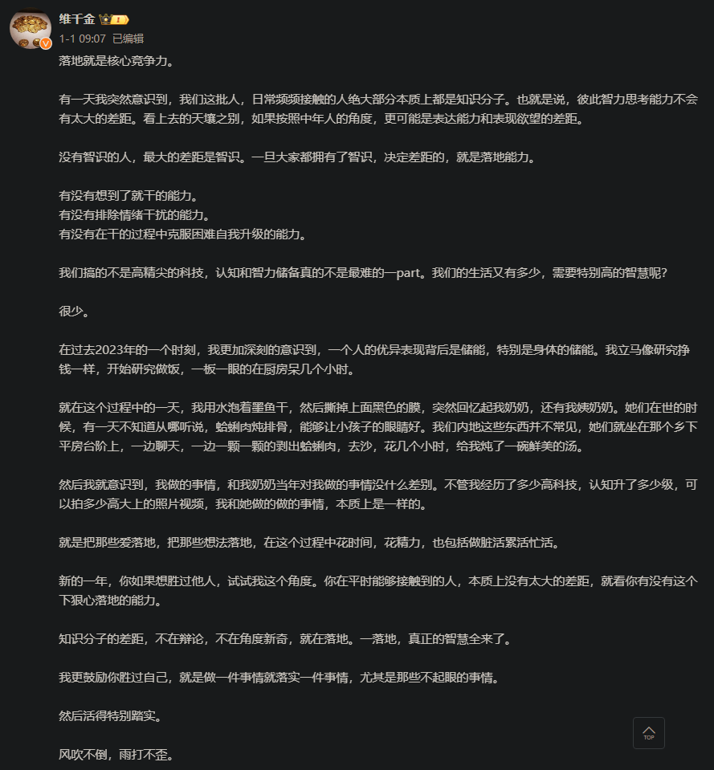


# 学习

## 笔记

>## [*学习*到底要不要记*笔记*?](https://www.zhihu.com/question/370526209/answer/1021058142)
>
>[巽星石](https://www.zhihu.com/people/chi-dou-74)
>
>学习的本质是什么？从一本[混沌一体](https://www.zhihu.com/search?q=混沌一体&search_source=Entity&hybrid_search_source=Entity&hybrid_search_extra={"sourceType"%3A"answer"%2C"sourceId"%3A"1021058142"})原本没有丝毫属于你的课本中抽离出知识点，然后转化为可以记忆的资料，然后通过反复背诵、记忆存储在你的大脑中。记忆它们用来干什么？应付考试而已。
>
>很多时候，记笔记是一件费力不讨好，甚至有点痛苦的事情。有些人说，记笔记花费的时间，还不如拿来直接背课本。
>
>记笔记费力不讨好，是因为记再多的笔记，无法直接提升记忆和成绩。甚至，花太多时间精力在笔记上有本末倒置的嫌疑。上课拼命记笔记，可能影响听课，课后记笔记，可能挪用用来复习和记忆的时间。
>
>所以，投入过多（时间、精力乃至金钱），产出过少（成绩提升不明显），是很多人对于学习到底要不要记笔记产生怀疑的初衷。
>
>我直接抛出结论：
>
>> *记笔记是十分必要的，又不是完全必要的，能不记就不记，非得记，就简单记。*
>
>为啥说记笔记十分必要，又不是完全必要呢？
>
>这就要回答我们学习时为啥要记笔记了。
>
>记笔记，其重要目的不是抄书，更不是排版精美，而是抽剥总结课本或老师讲课中的知识点。课本啰啰嗦嗦几百页，但是核心、要点可能就是几页十几页。记笔记，能挑出这些重点就算完成任务了。
>
>但是，如果有总结性的教辅或口袋随身装的小册子，这些现成的笔记，完完全全可以取代你的笔记。所以，在有现成笔记的情况下，记笔记是不完全必要，甚至可以说是完全没有必要的。
>
>当然，现成的笔记，并不意味着你不需要补充一些东西上去，现成笔记的缺点可能就是知识点不全，有效的补充是必须的。
>
>记笔记有必要，而且记笔记是有方法的，记笔记的要诀是抓住要点，不要什么废话都记，尽量精简。
>
>然后你觉得记完笔记你就完成学习了？错！记笔记根本只是个中间环节，而不是完成了学习，这就是为啥很多人觉得学习笔记记了没用。不是没用，而是你缺乏后续流程（所谓的消化笔记内容）。
>
>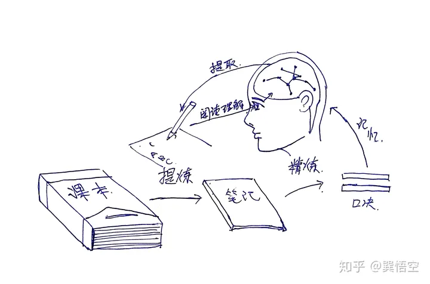
>
>我手绘总结了一张图，从课本到笔记，是提炼，从笔记到口诀是精炼，然后，口诀之后，所要做的就是[反复记忆](https://www.zhihu.com/search?q=反复记忆&search_source=Entity&hybrid_search_source=Entity&hybrid_search_extra={"sourceType"%3A"answer"%2C"sourceId"%3A"1021058142"})，而模拟考试、测验是在练习准确快速提取，考试就是正常发挥[记忆提取](https://www.zhihu.com/search?q=记忆提取&search_source=Entity&hybrid_search_source=Entity&hybrid_search_extra={"sourceType"%3A"answer"%2C"sourceId"%3A"1021058142"})。
>
>当然，理解在学习中是很重要的，但是记忆也是不可偏废的。
>
>可以看出，很多人把记笔记这个学习的中间环节当成了学习的最终环节，或者最终产出，这样是不对的，笔记只是一个工具，把知识真正装进脑袋才是最重要的也是真正能提高成绩的。
>
>直接背笔记也是傻而憨的，进一步简化、串联知识点，用几句口诀记住一大段内容岂不美哉？
>
>所以，把知识点进一步加工为口诀也是必要的。
>
>当你看的是课本，听的是老师讲课，写的是最精简扼要的笔记，背的是最短的口诀，做题时是最快的想起口诀和一眼知道答案，那么，什么考试你都无往而不利。

>有必要做笔记吗？
>
>>我很少做读书笔记，次数屈指可数。
>>
>>原因是笔记是一份高成本输出物，作用是复习。
>>
>>低质量读书笔记没必要做。
>>
>>但是制作高质量[读书笔记](https://www.zhihu.com/search?q=读书笔记&search_source=Entity&hybrid_search_source=Entity&hybrid_search_extra={"sourceType"%3A"answer"%2C"sourceId"%3A"661544982"})太耗费精力。
>>
>>所以我宁可重新翻阅书籍进行复习。
>>
>>读书过程中思考最重要。
>>
>>笔记，只是笔记。
>
>终于看到一个深感赞同的回答！ 看书的时间要从忙碌的工作和生活中抽取，能有半个小时都算是可以用来读书的完整时间了，何况做读书笔记。虽然通过读书笔记来输出，确实能锻炼写作和表达能力逻辑能力，但是对于知识的理解和复习作用，确实只是当下的作用，过后不翻阅，依然会忘记。 如果能做到书的框架，逻辑，在阅读过程中就已经了然于胸，那用那么多时间精力去做读书笔记，不如把看过的书再复习一遍。
>
>写学习笔记没有一定之规，但应该是自己真正的阅读心得和感悟，忌人云亦云，也忌当文抄公。

与一个简单的电路图，为了考虑各种各样的情况而加上了许多处理电路的情况类似，许许多多的东西原本就是简单明了的，就像教科书上的内容一般，为了书籍的使用对象考虑了许多许多，也就变得厚厚一本了。而学习的过程，就是从这些复杂庞大的知识体系中抽丝剥茧，提炼出那些简单明了的东西刻进自己的脑袋里。


## 自学

《刻意练习：从新手到大师》、《学习之道》、《精力管理》。


# 行业

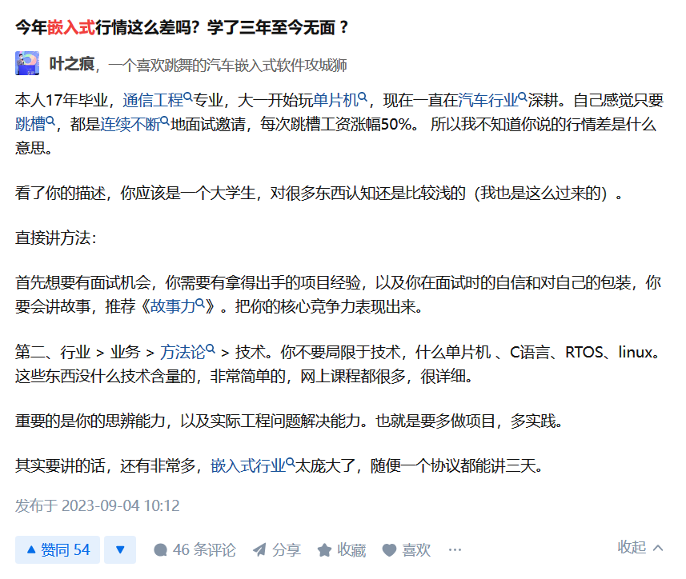


# 信仰

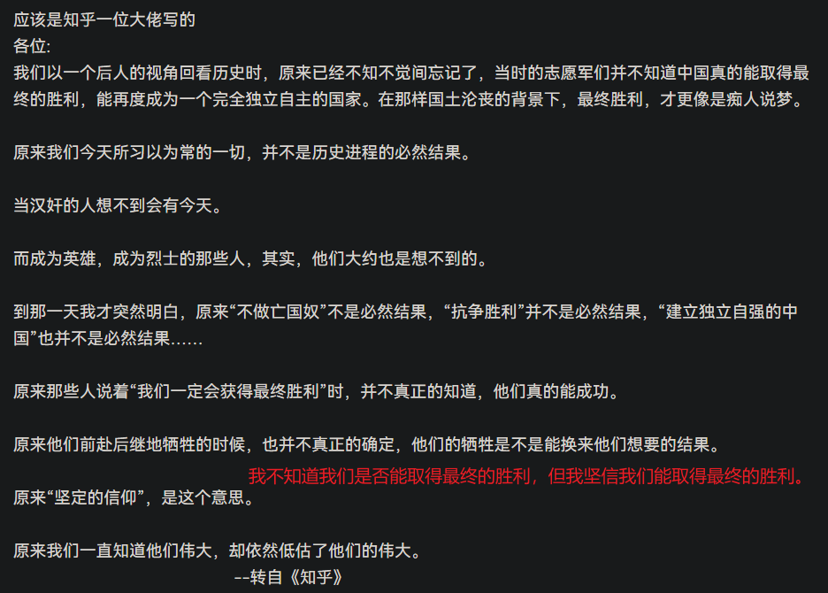


# 思考

## 辩证法

[辩证法的三大规律、五大范畴、三个基本观点_三大定律五大范畴三个观点-CSDN博客](https://blog.csdn.net/hadoopdevelop/article/details/86986132)

[辩证法的三大规律、四大思维方法、五大范畴、三个基本观点 - 知乎 (zhihu.com)](https://zhuanlan.zhihu.com/p/645471683)


## 经济基础决定上层建筑


## 工具&学以致用


## 思考&实践验证


## 理论与实践的鸿沟


## 理论与实际的联系


## 思考&现象与本质

现象背后的本质。


## 习惯，思考，学习


# 思考—遗忘

## 对技术的遗忘看法？

技术不断更新迭代，对于一些学习过但不经常运用的技术，遗忘是必然的。我们最重要的能力就是，快速学会一项技术并运用其来解决所面对的问题的能力。

回顾整个科学技术发展进程，会发现上层应用技术层出不穷，许许多多的技术在被淘汰，许许多多的新技术在涌现，新技术迭代旧技术，这是发展的必然结果。所以，何必拘泥于技术的高下呢，尽情使用现有的技术去实现你的需求、解决你的问题吧，遗忘了再拾起，未使用过的再去学一学，一切终将过去。


## 编程学过的知识容易忘？

>编程这行，是最不需要记忆的，我都快10年经验了，你要突然考核我某个函数的参数，我估计答不出来，编程里面部分是死的东西，例如定义变量，语法啥的，还有一些核心函数，这些是必须要记忆的，没办法。除了这些，其他的东西都不需要刻意记忆，你只需要一个东西，真正的理解它。 
>
>说一个例子，我非职业前端，对前段的很多基础函数语法特性都不知道，但是不妨碍我回答js问题，我对前端的异步，回调，promise,async,await,事件循环等机制比很多前端都懂，因为我能站在js引擎的角度来理解问题，假设你来设计一个js引擎，你该如何支持各种点击事件？键盘事件？定时器？异步网络请求？  
>
>所以编程真正需要的是思维逻辑，一个知识点，一旦你真正掌握了，那么你一定可以用很通俗的语言表达出来，一定会觉得很简单，否则就是你没有真正的彻底理解。我们学的东西大概率都是看了个视频，听人讲了一遍，或者看了个文章，看完，然后好像是懂了，问题是你真的自己认真思考过了吗？你真的有思考这个知识的产生背景，解决了啥问题？它的基础原理是啥？优点缺陷是什么？它的本质问题是啥了吗？其实一旦你把某个知识点的前世今生给彻底弄清楚，那么你一定在也不会忘记他。  
>
>这里我举个例子吧，既然你是初学者，就用初学者的例子来说。比方说有这样一个问题，浏览器禁止cookie还能实现用户登陆吗？初学者可能会遇到这个面试题，因为初学者学习登陆一般用的都是session,cookie,很容易回答出不行，实际上可以的。那么你该如何记忆这个问题的答案？  
>
>这个问题，一旦你真正理解了，是不需要记忆的，下面跟着我的角度来分析问题，你要首先理解登陆的本质是啥？登陆的本质就是区分用户，获取到本次请求的用户身份，既然是这样，我让前端每次请求后端都携带账号密码不就行了，可以放在url里面或者但在post参数里面，后端每次都检验一次账号密码，如果是对的，就知道用户身份了。虽然这样很傻，但是很明显就证明不需要cookie也是可以实现登陆的。  当然实际不会这么干，一般第一次登陆，发送账号密码到后端，后端会生成一个随机字符串，这个字符串跟用户是一一对应的，后续前端每次请求都带着这个字符串即可，后端根据这个字符串就能知道用户身份，这个字符串可以等效理解为账号密码，但它是随机生成的的，所以你也没法假冒其他人。其实这个玩意就是现在前后端分离的token机制。  如果你深入去想，还有其他问题，这里面虽然不用每次给后端发账号密码，但是token一直在网络上传递，也是有可能被人拿到啊，如果被其他人拿到了，它就可以一直用我的账号啊，为了解决这个问题，搞了个token过期机制，一般24小时过期。但是这样又有有了新问题，过期了，用户每天都要需要输入一次账号密码，很麻烦。  
>
>因此搞了个refresh token,发放token的时候，顺便给一个refresh token，这样每次token过期了，拿着refesh token 去获取新的token就好了。可能你觉得多此一举，其实是因为在这24小时里面，你无数次请求后端，每次都携带了token，所以不安全，但是给后端发送refresh token确只有一次，意味着别人盗用你refresh token 的几率非常低，这就是refesh token 的意义。  
>
>有人看，就顺便在讲讲传统的session登陆，前文讲到登陆核心是前端需要携带一个随机字符串给后端，之前讲的是需要把这个字符串放到url或者post参数里面发给后端，其实浏览器可以自动帮我们干这件事，浏览器提供了一个表格，叫做cookie表格，每行都是一个键值对，浏览器每次请求后端的时候会自动把表格里面的数据一起发给后端。所以在用户登陆接口那里，后端需要告诉浏览器，帮我在当前用户浏览器的cookie表格里面插入一个记录，key是PHPSESSIONID，值是一个随机字符串。浏览器收到响应后，就把这一堆数据放到cookie表格了，下一次访问的时候，会自动携带上，后端收到请求后，从header里面读取cookie,发现里面有phpsessionid,后端知道这个key有特殊用途，拿到key对应的字符串后去数据库或者去文件夹里面查用户信息，这就知道本次是谁在请求了，这就实现了登陆功能。这就是所谓的session登陆机制。  
>
>看了这个分析你是不是真正理解了登陆这一大坨知识点，你说这需要记忆吗？


# 他山之石-硬件

## 给年轻电源工程师的十个忠告

> 作者：万一严选
> 链接：https://zhuanlan.zhihu.com/p/666191035
> 来源：知乎
> 著作权归作者所有。商业转载请联系作者获得授权，非商业转载请注明出处。

**诸位，咱当电子工程师也是十余年了，不算有出息，环顾四周，也没有看见几个有出息的！回顾工程师生涯，感慨万千，愿意讲几句掏心窝子的话，也算给咱们师弟师妹们提个醒，希望他们比咱们强！**

**[1]**好好规划自己的路，不要跟着感觉走！根据个人的理想决策安排，绝大部分人并不指望成为什么院士或教授，而是希望活得滋润一些，爽一些。那么，就需要慎重安排自己的轨迹。从哪个行业入手，逐渐对该行业深入了解，不要频繁跳槽，特别是不要为了一点工资而转移阵地，从长远看，这点钱根本不算什么，当你对一个行业有那么几年的体会，以后钱根本不是问题。频繁地动荡不是上策，最后你对哪个行业都没有摸透，永远是新手！

**[2]**可以做技术，切不可沉湎于技术。千万不可一门心思钻研技术！给自己很大压力，如果你的心思全部放在这上面，那么注定你将成为[孔乙己](https://www.zhihu.com/search?q=孔乙己&search_source=Entity&hybrid_search_source=Entity&hybrid_search_extra={"sourceType"%3A"article"%2C"sourceId"%3A"666191035"})一类的人物！适可而止为之，因为技术只不过是你今后前途的支柱之一，而且还不是最大的支柱，除非你只愿意到老还是个工程师！
 
 **[3]**不要去做技术高手，只去做综合素质高手！在企业里混，我们时常瞧不起某人，说他“什么都不懂，凭啥拿那么多钱，凭啥升官！”这是普遍的典型的工程师的迂腐之言。8051很牛吗？人家能上去必然有他的本事，而且是你没有的本事。你想想，老板搞经营那么多年，难道见识不如你这个新兵？人家或许善于管理，善于领会老板意图，善于部门协调等等。因此务必培养自己多方面的能力，包括管理，亲和力，察言观色能力，攻关能力等，要成为综合素质的高手，则前途无量，否则只能躲在角落看示波器！技术以外的技能才是更重要的本事！！从古到今，美国日本，一律如此！

 **[4]**多交社会[三教九流](https://www.zhihu.com/search?q=三教九流&search_source=Entity&hybrid_search_source=Entity&hybrid_search_extra={"sourceType"%3A"article"%2C"sourceId"%3A"666191035"})的朋友！不要只和工程师交往，认为有共同语言，其实更重要的是和其他类人物交往，如果你希望有朝一日当老板或高层管理，那么你整日面对的就是这些人。了解他们的经历，思维习惯，爱好，学习他们处理问题的模式，了解社会各个角落的现象和问题，这是以后发展的巨大的本钱，没有这些以后就会笨手笨脚，跌跌撞撞，遇到重重困难，交不少学费，成功的概率大大降低！

**[5]**知识涉猎不一定专，但一定要广！多看看其他方面的书，金融，财会，进出口，税务，法律等等，为以后做一些积累，以后的用处会更大！会少交许多学费！！

**[6]**抓住时机向[技术管理](https://www.zhihu.com/search?q=技术管理&search_source=Entity&hybrid_search_source=Entity&hybrid_search_extra={"sourceType"%3A"article"%2C"sourceId"%3A"666191035"})或市场销售方面的转变！要想有前途就不能一直搞开发，适当时候要转变为管理或销售，前途会更大，以前搞技术也没有白搞，以后还用得着。搞管理可以培养自己的领导能力，搞销售可以培养自己的市场概念和思维，同时为自己以后发展积累庞大的人脉！应该说这才是前途的真正支柱！！！

 **[7]**逐渐克服自己的心里弱点和性格缺陷！多疑，敏感，天真（贬义，并不可爱），犹豫不决，胆怯，多虑，脸皮太薄，心不够黑，教条式思维。。。这些工程师普遍存在的性格弱点必须改变！很难吗？只在床上想一想当然不可能，去帮朋友守一个月地摊，包准有效果，去实践，而不要只想！不克服这些缺点，一切不可能，甚至连项目经理都当不好--尽管你可能技术不错！

**[8]**工作的同时要为以后做准备！建立自己的工作环境！及早为自己配置一个工作环境，装备电脑，示波器（可以买个二手的），仿真器，编程器等，业余可以接点活，一方面接触市场，培养市场感觉，同时也积累资金，更重要的是准备自己的产品，咱搞技术的没有钱，只有技术，技术的代表不是学历和证书，而是产品，拿出象样的产品，就可技术转让或与人合作搞企业！先把东西准备好，等待机会，否则，有了机会也抓不住！

**[9]**要学会善于推销自己！不仅要能干，还要能说，能写，善于利用一切机会推销自己，树立自己的品牌形象，很必要！要创造条件让别人了解自己，不然老板怎么知道你能干？外面的投资人怎么相信你？提早把自己推销出去，机会自然会来找你！搞个个人主页是个好注意！！特别是培养自己在行业的名气，有了名气，高薪机会自不在话下，更重要的是有合作的机会...

 **[10]**该出手时便出手！永远不可能有100%把握！！！条件差不多就要大胆去干，去闯出自己的事业，不要犹豫，不要彷徨，干了不一定成功，但至少为下一次冲击积累了经验，不干永远没出息，而且要干成必然要经历失败。不经历风雨，怎么见彩虹，没有人能随随便便成功！


## 单片机

> 作者：人在天涯
> 链接：https://www.zhihu.com/question/631089612/answer/3320199115
> 来源：知乎
> 著作权归作者所有。商业转载请联系作者获得授权，非商业转载请注明出处。

以下是[哈尔滨工业大学](https://www.zhihu.com/search?q=哈尔滨工业大学&search_source=Entity&hybrid_search_source=Entity&hybrid_search_extra={"sourceType"%3A"answer"%2C"sourceId"%3A3320199115})教师郭天祥的一篇流传广泛的文章，其全文为：

>很多想学单片机的人问我的第一句话就是怎样才能学好单片机？对于这个问题我今天就我自己是如何开始学单片机，如何开始上手，如何开始熟练这个过程给大家讲讲。
>
> 先说说单片机，一般我们现在用的比较多的的[MCS-51](https://www.zhihu.com/search?q=MCS-51&search_source=Entity&hybrid_search_source=Entity&hybrid_search_extra={"sourceType"%3A"answer"%2C"sourceId"%3A3320199115})的单片机，它的资料比较多，用的人也很多，市场也很大。就我个人的体会怎么样才能更快的学会单片机这门课。单片机这门课是一项非常重视动手实践的科目，不能总是看书，但是学习它首先必须得看书，因为从书中你需要大概了解一下，单片机的各个功能[寄存器](https://www.zhihu.com/search?q=寄存器&search_source=Entity&hybrid_search_source=Entity&hybrid_search_extra={"sourceType"%3A"answer"%2C"sourceId"%3A3320199115})，而说明白点，我们使用单片机就是用软件去控制单片机的各个功能寄存器，再说明白点，就是控制单片机那些管脚的[电平](https://www.zhihu.com/search?q=电平&search_source=Entity&hybrid_search_source=Entity&hybrid_search_extra={"sourceType"%3A"answer"%2C"sourceId"%3A3320199115})什么时候输出高，什么时候输出低。由这些高低电平的变化来控制你的系统板，实现我们需要的各个功能。至于看书，只需大概了解单片机各管脚都是干什么的？能实现什么样的功能？第一次，第二次你可能看不明白，但这不要紧，因为还缺少实际的感观认识。所以我总是说，学单片机看书看两三天的就够了，看小说你一天能看五六本，看单片机你两三天看两三遍就够了，可以不用仔细的看。
>
> 推荐一本书，就这一本就足够，书名是《[新编MCS-51单片机应用设计](https://www.zhihu.com/search?q=新编MCS-51单片机应用设计&search_source=Entity&hybrid_search_source=Entity&hybrid_search_extra={"sourceType"%3A"answer"%2C"sourceId"%3A3320199115})》，是哈尔滨工业大学出版社出的的，作者是[张毅刚](https://www.zhihu.com/search?q=张毅刚&search_source=Entity&hybrid_search_source=Entity&hybrid_search_extra={"sourceType"%3A"answer"%2C"sourceId"%3A3320199115})。大概了解一下书上的内容，然后实践，这是非常关键的，如果说学单片机你不实践那是不可能学会的，关于实践有两种方法你可以选择，一种方法：你自己花钱买一块单片机的学习板，不要求功能太全的，对于初学者来说你买功能非常多的那种板子，上面有很多东西你这辈子都用不着，我建议有[流水灯](https://www.zhihu.com/search?q=流水灯&search_source=Entity&hybrid_search_source=Entity&hybrid_search_extra={"sourceType"%3A"answer"%2C"sourceId"%3A3320199115})、数码管、独立键盘、[矩阵键盘](https://www.zhihu.com/search?q=矩阵键盘&search_source=Entity&hybrid_search_source=Entity&hybrid_search_extra={"sourceType"%3A"answer"%2C"sourceId"%3A3320199115})、AD或DA（原理一样）、液晶、[蜂鸣器](https://www.zhihu.com/search?q=蜂鸣器&search_source=Entity&hybrid_search_source=Entity&hybrid_search_extra={"sourceType"%3A"answer"%2C"sourceId"%3A3320199115})，这就差不多了。如果上面我提到的这些，你能熟练应用，那可以说对于单片机方面的硬件你已经入门了，剩下的就是自己练习设计电路，不断的积累经验。只要过了第一关，后面的路就好走多了，[万事开头难](https://www.zhihu.com/search?q=万事开头难&search_source=Entity&hybrid_search_source=Entity&hybrid_search_extra={"sourceType"%3A"answer"%2C"sourceId"%3A3320199115})，大家可能都听过。方法二：你身边如果有单片机方面的高手，向他求助，让他帮你搭个简单的最小系统板。对于高手来说，做个单片机的最小系统板只需要一分钟的时间，而对于初学者可就难多了，因为只有对硬件了解了，才能熟练运用。而如果你身边没有这样的高手，又找不到可以帮助你的人，那我劝你最好是自己买上一块，毕竟自己有一块要方便的多，以后做单片机类的小实验时都能用得上，还省事。
>
> 有了单片机学习板之后你就要多练习，最好是自己有台电脑，一天少看电影，少打游戏，把学习板和电脑连好，打开调试软件坐在电脑前，先学会怎么用调试软件，然后从最简单的流水灯实验做起，等你能让那八个流水灯按照你的意愿随意流动时你已经入门了，你会发现单片机是多么迷人的东西啊，太好玩了，这不是在学习知识，而是在玩，当你编写的程序按你的意愿实现时你比做什么事都开心，你会上瘾的，真的。做电子类的人真的会上瘾。然后让数码管亮起来，这两项会了后已经不能自拔了，你已经开始考虑你这辈子要走哪一行了。就是要这样练习，在写程序的时候你肯定会遇到很多问题，而这时你再去翻书找，或是问别人，当得到解答后你会记住一辈子的，知识必须用于现实生活中，解决实际问题，这样才能发挥它的作用，你自己好好想想，上了这么多年大学，天天上课，你在课堂上学到了什么？是不是为了[期末考试](https://www.zhihu.com/search?q=期末考试&search_source=Entity&hybrid_search_source=Entity&hybrid_search_extra={"sourceType"%3A"answer"%2C"sourceId"%3A3320199115})而忙碌呢？考完得了90分，哈哈哈好高兴啊，下学期开学回来忘的[一干二净](https://www.zhihu.com/search?q=一干二净&search_source=Entity&hybrid_search_source=Entity&hybrid_search_extra={"sourceType"%3A"answer"%2C"sourceId"%3A3320199115})，是不是？你学到什么了？
>
>但是我告诉你单片机一旦学会，永远不会忘了。另外我再说说用汇编和C语言编程的问题。很多同学大一二就开设了C语言的课，我也上过，我知道那时天天就是几乘几，几加几啊，求个[阶乘](https://www.zhihu.com/search?q=阶乘&search_source=Entity&hybrid_search_source=Entity&hybrid_search_extra={"sourceType"%3A"answer"%2C"sourceId"%3A3320199115})啊。学完了有什么用？让你用C语言编单片机的程序你是不是就傻了？书上的东西我们必须要会运用。单片机编程用C语言或[汇编语言](https://www.zhihu.com/search?q=汇编语言&search_source=Entity&hybrid_search_source=Entity&hybrid_search_extra={"sourceType"%3A"answer"%2C"sourceId"%3A3320199115})都可以，但是我建议用C语言比较好，如果原来有C语言的基础那学起来会更好，如果没有，也可以边学单片机边学C语言，C语言也挺简单，只是一门工具而已，我劝你最好学会，将来肯定用得着，要不你以后也得学，你一点[汇编](https://www.zhihu.com/search?q=汇编&search_source=Entity&hybrid_search_source=Entity&hybrid_search_extra={"sourceType"%3A"answer"%2C"sourceId"%3A3320199115})都不会根本无所谓，但你一点C语言都不会那你将来会吃苦头。
>
> 汇编写程序代码效率高，但相对难度较大，而且很罗嗦，尤其是遇到算法方面的问题时，根本是麻烦的不得了，现在单片机的主频在不断的提高，我们完全不需要那么高效率的代码，因为有高频率的时钟，单片机的ROM也在不断的提高，足够装得下你用C语言写的任何代码，C语言的资料又多又好找，将来可移植性非常好，只需要变一个IO口写个[温度传感器](https://www.zhihu.com/search?q=温度传感器&search_source=Entity&hybrid_search_source=Entity&hybrid_search_extra={"sourceType"%3A"answer"%2C"sourceId"%3A3320199115})的程序在哪里都能用，所以我劝大家用C语言。

 总结上面，只要你有信心，做事能坚持到底，有不成功不放弃的强烈意志，那学个单片机来说就是件非常容易的事。

步骤：1.找本书大概了解一下单片机结构，大概了解就行。不用都看懂，又不让你出书的。（三天）

 2.找学习板练习编写程序，学单片机就是练编程序，遇到不会的再问人或查书。 （二十天）

 3.自己网上找些小电路类的资料练习设计外围电路。焊好后自己调试，熟悉过程。 （十天）

 4.自己完全设计具有个人风格的电路，产，。。。你已经是高手了。 。。。。

 看到了吗？下功夫一个多月你就能成为高手，我就讲这么多了，学不学得会，下不下得了功夫就看你的了。

 以上是哈尔滨工业大学教师郭天祥的对自身学习单片机经历的总结，我觉得总结的不错，对于怎样学好单片机，我补充如下：

学单片机需要什么基础？

1.与以前所学的知识关联很少；

2.只需要掌握很基本的数电模电知识，如二进制、十进制、[十六进制](https://www.zhihu.com/search?q=十六进制&search_source=Entity&hybrid_search_source=Entity&hybrid_search_extra={"sourceType"%3A"answer"%2C"sourceId"%3A3320199115})之间的转换，与、或、非逻辑关系等；

3.对各种器件的概念基本上是从0开始；

4.如果要用C语言编程，需具备简单的C语言基础；

5.所有人都站在了同一起跑线上;

在网上搜索可以看到，有些中学都搞过单片机编程比赛，中专学生在举行[单片机技术](https://www.zhihu.com/search?q=单片机技术&search_source=Entity&hybrid_search_source=Entity&hybrid_search_extra={"sourceType"%3A"answer"%2C"sourceId"%3A3320199115})比赛时有学生能在封闭的情况下（不能携带任何资料）在一个上午的时间里做出下面的题目：

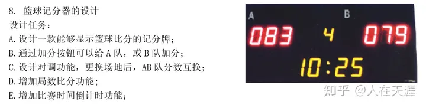

图1 中专学生单片机编程竞赛题

**因此，我认为学习单片机不难，关键在于你要有学习的兴趣和坚持的决心！先开始学习，其它的知识在学习的过程中逐步深入。**

 你再看看下面这张图，你能理解吗？

这张图里有几个基本的知识点：

1. P1=0xfe，是C语言的[赋值语句](https://www.zhihu.com/search?q=赋值语句&search_source=Entity&hybrid_search_source=Entity&hybrid_search_extra={"sourceType"%3A"answer"%2C"sourceId"%3A3320199115})；
2. 0xfe是单片机C语言的16进制的表达方式；
3. P1.0-P1.7是单片机P1口的八个[I/O端口](https://www.zhihu.com/search?q=I%2FO端口&search_source=Entity&hybrid_search_source=Entity&hybrid_search_extra={"sourceType"%3A"answer"%2C"sourceId"%3A3320199115})。
4. 八个发光二极管一端接+5V，一端接P1口的八个I/O端口，那么发光二极管的导通条件是什么？对，就是P1口的八个I/O端口为[低电平](https://www.zhihu.com/search?q=低电平&search_source=Entity&hybrid_search_source=Entity&hybrid_search_extra={"sourceType"%3A"answer"%2C"sourceId"%3A3320199115})也就是为0V时导通，就这么简单。
5. 你能理解以上四点了，再看[P1=0xfe](https://www.zhihu.com/search?q=P1%3D0xfe&search_source=Entity&hybrid_search_source=Entity&hybrid_search_extra={"sourceType"%3A"answer"%2C"sourceId"%3A3320199115})，就是把1111 1110赋值给P1的八个端口。
6. 在51单片机课程里，1代表[高电平](https://www.zhihu.com/search?q=高电平&search_source=Entity&hybrid_search_source=Entity&hybrid_search_extra={"sourceType"%3A"answer"%2C"sourceId"%3A3320199115})+5V，0代表低电平0V。

现在你能理解图1了吧？恭喜你，你具备学习单片机的[基本知识](https://www.zhihu.com/search?q=基本知识&search_source=Entity&hybrid_search_source=Entity&hybrid_search_extra={"sourceType"%3A"answer"%2C"sourceId"%3A3320199115})和素质了！

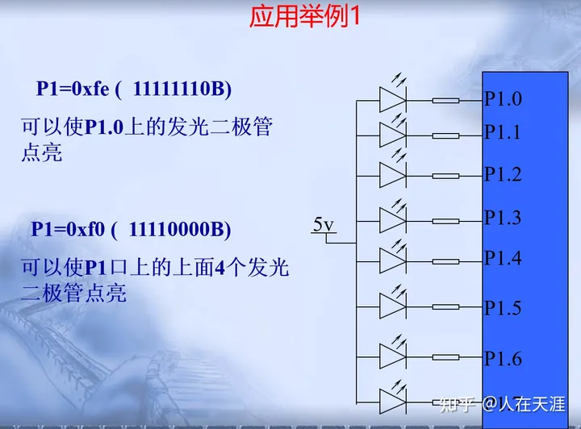

图2 单片机控制8个发光二极管

看了这张图，我们也能体会到单片机[控制电路](https://www.zhihu.com/search?q=控制电路&search_source=Entity&hybrid_search_source=Entity&hybrid_search_extra={"sourceType"%3A"answer"%2C"sourceId"%3A3320199115})的优势，我们要改变对8个发光二极管的控制，使不同的发光二极管点亮，只需在软件里对P1进行不同的赋值即可。如果是用硬件来实现，[电路设计](https://www.zhihu.com/search?q=电路设计&search_source=Entity&hybrid_search_source=Entity&hybrid_search_extra={"sourceType"%3A"answer"%2C"sourceId"%3A3320199115})就得完全改变。

可以这样理解单片机，单片机是一个可定制功能的IC,而实现定制功能就靠软件实现。

再看下面这个图:通过控制P1.0端口的高低电平，就可以控制灯泡的亮灭。

而这个[控制程序](https://www.zhihu.com/search?q=控制程序&search_source=Entity&hybrid_search_source=Entity&hybrid_search_extra={"sourceType"%3A"answer"%2C"sourceId"%3A3320199115})与控制一个发光二极管的程序是完全一样的，只是外围电路不同而已。

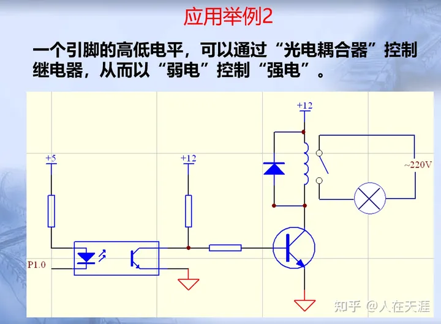

图3 单片机控制灯泡的亮灭

学习单片机需要掌握的基础知识：

C51基础知识。

了解单片机结构及引脚，单片机实验板结构

用单片机学习板掌握51单片机和C语言编程。

KEIL工程建立详细介绍及KEIL软件使用方法

从点亮实验板上的一个发光二极管开始

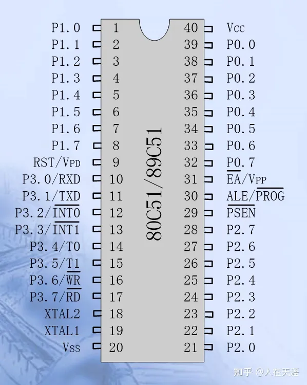

图3  51单片机引脚功能


## 硬件工程师入门

硬件工程师如何入门：https://www.zhihu.com/question/421337221/answer/2387759270

核心：电路设计与PCB设计。

### 书籍

入门必看相关书籍：电路原理、数字电路、模拟电路、高频电子电路、高等数学、信号与系统。

推荐书籍：《精通开关电源设计》、《高速电路设计实践》、**《HIGH-SPEED DIGITAL DESIGN》（Howard Johnson）**——俗称黑魔书。

PCB设计：找个带着操作的PCB设计软件教程，学会基本操作后，多画几个板子就能上手了。后续慢慢提高。

EMC电磁兼容：**《EMC电磁兼容-设计与测试案例分析》（郑军奇）**。

手机硬件电路设计：**《手机硬件电路设计与创新》（陈皓）**。

信号完整性：**《信号完整性分析》（Eric Bogatin著，李玉山译）、《于博士揭秘信号完整性》（于铮）**。

大厂官网视频课程：[这些视频课程，直接吹爆 - 知乎 (zhihu.com)](https://zhuanlan.zhihu.com/p/473889715)。

仿真软件：LTspice、TINA。

### 知识体系

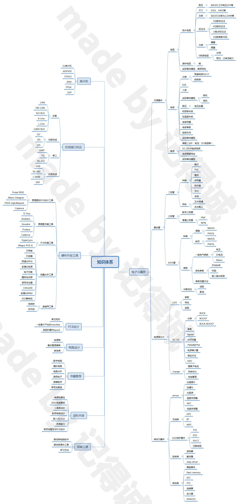


## 电路设计完整流程

>老工程师经验分享：一套完整的硬件电路设计该怎么做？ - DM Yan的文章 - 知乎
>https://zhuanlan.zhihu.com/p/270941578

在学习电路设计的时候，不知道你是否有这样的困扰：明明自己学了很多硬件电路理论，也做过了一些基础操作实践，但还是无法设计出自己理想的电路。归根结底，我们缺少的是硬件电路设计的思路，以及项目实战经验。

设计一款硬件电路，要熟悉元器件的基础理论，比如元器件原理、选型及使用，学会绘制原理图，并通过软件完成PCB设计，熟练掌握工具的技巧使用，学会如何优化及调试电路等。要如何完整地设计一套硬件电路设计，**下面为大家分享我的几点个人经验：**

### **1）总体思路**

设计硬件电路，大的框架和架构要搞清楚，但要做到这一点还真不容易。有些大框架也许自己的老板、老师已经想好，自己只是把思路具体实现；但也有些要自己设计框架的，那就要搞清楚要实现什么功能，然后找找有否能实现同样或相似功能的参考电路板(要懂得尽量利用他人的成果，越是有经验的工程师越会懂得借鉴他人的成果)。

### **2）理解电路**

如果你找到了的参考设计，那么恭喜你，你可以节约很多时间了(包括前期设计和后期调试)。马上就copy？NO，还是先看懂理解了再说，一方面能提高我们的电路理解能力，而且能避免设计中的错误。

### **3）找到参考设计**

在开始做硬件设计前，根据自己的项目需求，可以去找能够满足硬件功能设计的，有很多相关的参考设计。没有找到？也没关系，先确定大IC芯片，找datasheet，看其关键参数是否符合自己的要求，哪些才是自己需要的关键参数，以及能否看懂这些关键参数，都是硬件工程师的能力的体现，这也需要长期地慢慢地积累。这期间，要善于提问，因为自己不懂的东西，别人往往一句话就能点醒你，尤其是硬件设计。

### **4）硬件电路设计的三个部分：原理图、PCB和物料清单（BOM）表**

原理图设计，其实就是将前面的思路转化为电路原理图，它很像我们教科书上的电路图。pcb涉及到实际的电路板，它根据原理图转化而来的网表(网表是沟通原理图和pcb之间的桥梁)，而将具体的元器件的封装放置(布局)在电路板上，然后根据飞线(也叫预拉线)连接其电信号(布线)。完成了pcb布局布线后，要用到哪些元器件应该有所归纳，所以我们将用到BOM表。

### **5）选择PCB设计工具**

Protel，也就是Altium（现在入门的童鞋大多用AD）容易上手，网上的学习教程资料也很全面，在国内也比较流行，应付一般的工作已经足够，适合初入门的设计者使用。

**硬件电路设计的大环节必不可少，主要都要经过以下这几个流程：**

**1）原理图设计**

**2）PCB设计**

**3）制作BOM表**

现在再谈一下具体的设计步骤

**原理图建立+网表生成**

1. 原理图库建立。要将一个新元件摆放在原理图上，我们必须得建立改元件的库。库中主要定义了该新元件的管脚定义及其属性，并且以具体的图形形式来代表(我们常常看到的是一个矩形(代表其IC BODY)，周围许多短线(代表IC管脚))。protel创建库及其简单，而且因为用的人多，许多元件都能找到现成的库，这一点对使用者极为方便。应搞清楚ic body，ic pins，input pin，output pin，analog pin，digital pin，power pin等区别。
2. 有了充足的库之后，就可以在原理图上画图了，按照datasheet和系统设计的要求，通过wire把相关元件连接起来。在相关的地方添加line和text注释。wire和line的区别在于，前者有电气属性，后者没有。wire适用于连接相同网络，line适用于注释图形。这个时候，应搞清一些基本概念，如：wire，line，bus，part，footprint，等等。
3. 做完这一步，我们就可以生成netlist了，这个netlist是原理图与pcb之间的桥梁。原理图是我们能认知的形式，电脑要将其转化为pcb，就必须将原理图转化它认识的形式netlist，然后再处理、转化为pcb。
4. 得到netlist，马上画pcb?别急，先做ERC先。ERC是电气规则检查的缩写。它能对一些原理图基本的设计错误进行排查，如多个output接在一起等问题。(但是一定要仔细检查自己的原理图，不能过分依赖工具，毕竟工具并不能明白你的系统，它只是纯粹地根据一些基本规则排查。)
5. 从netlist得到了pcb，一堆密密麻麻的元件，和数不清的飞线是不是让你吓了一跳?呵呵，别急还得慢慢来。
6. 确定板框大小。在keepout区(或mechanic区)画个板框，这将限制了你布线的区域。需要根据需求好考虑板长，板宽(有时，还得考虑板厚)。当然了，叠层也得考虑好。(叠层的意思就是，板层有几层，怎么应用，比如板总共4层，顶层走信号，中间第一层铺电源，中间第二层铺地，底层走信号)。

### **PCB布局布线**

先解释一下前面的术语。post-command，例如我们要拷贝一个object(元件)，我们要先选中这个object，然后按ctrl+C，然后按ctrl+V(copy命令发生在选中object之后)。这种操作windows和protel都采用的这种方式。但是concept就是另外一种方式，我们叫做pre-command。同样我们要拷贝一个东西，先按ctrl+C，然后再选中object，再在外面单击(copy命令发生在选中object之前)。

1. 确定完板框之后，就该元件布局(摆放)了，布局这步极为关键。它往往决定了后期布线的难易。哪些元器件该摆正面，哪些元件该摆背面，都要有所考量。但是这些都是一个仁者见仁，智者见智的问题;从不同角度考虑摆放位置都可以不一样。其实自己画了原理图，明白所有元件功能，自然对元件摆放有清楚的认识(如果让一个不是画原理图的人来摆放元件，其结果往往会让你大吃一惊。对于初入门的，注意模拟元件，数字元件的隔离，以及机械位置的摆放，同时注意电源的拓扑就可以了。
2. 接下来就是布线。这与布局往往是互动的。有经验的人往往在开始就能看出哪些地方能布线成功。如果有些地方难以布线还需要改动布局。对于fpga设计来说往往还要改动原理图来使布线更加顺畅。布线和布局问题涉及的因素很多，对于高速数字部分，因为牵扯到信号完整性问题而变得复杂，但往往这些问题又是难以定量或即使定量也难以计算的。所以，在信号频率不是很高的情况下，应以布通为第一原则。
3. OK了？别急，用DRC检查检查先，这是一定要检查的。DRC对于布线完成覆盖率以及规则违反的地方都会有所标注，按照这个再一一的排查，修正。
4. 有些pcb还要加上敷铜(可能会导致成本增加)，将出线部分做成泪滴(工厂也许会帮你加)。最后的pcb文件转成gerber文件就可交付pcb生产了。(有些直接给pcb也成，工厂会帮你转gerber)。
5. 要装配pcb，准备bom表吧，一般能直接从原理图中导出。但是需要注意的是，原理图中哪些部分元件该上，哪些部分元件不该上，要做到心理有数。对于小批量或研究板而言，用excel自己管理倒也方便(大公司往往要专业软件来管理)。而对于新手而言，第一个版本，不建议直接交给装配工厂或焊接工厂将bom的料全部焊上，这样不便于排查问题。最好的方法就是，根据bom表自己准备好元件。等到板来了之后，一步步上元件、调试。

### **电路板调试**

1. 拿到板第一步做什么，不要急急忙忙供电看功能，硬件调试不可能一步调试完成的。先拿万用表看看关键网络是否有不正常，主要是看电源与地之间有否短路(尽管生产厂商已经帮你做过测试，这一步还是要自己亲自看看，有时候看起来某些步骤挺繁琐，但是可以节约你后面不少时间！)，其实短路与否不光pcb有关，在生产制作的任何一个环节可能导致这个问题，IO短路一般不会造成灾难性的后果，但是电源短路就......
2. 电源网络没短路？那么好，那就看看电源输出是否是自己理想的值，对于初学者，调试的时候最好IC一件件芯片上，第一个要上的就是电源芯片。
3. 电源网络短路了？这个比较麻烦，不过要仔细看看自己原理图是否有可能这样的情况，同时结合割线的方法一步步排查倒底是什么地方短路了，是pcb的问题(一般比较烂的pcb厂就可能出现这种情况)，还是装配的问题，还是自己设计的问题。关于检查短路还有一些技巧，这在今后登出......
4. 电源芯片没有输出?检查检查你的电源芯片输入是否正常吧，还需要检查的地方有使能信号，分压电阻，反馈网络......
5. 电源芯片输出值不在预料范围?如果超过很离谱，比如到了10%，那么看看分压电阻先，这两个分压电阻一般要用1%的精度，这个你做到了没有，同时看看反馈网络吧，这也会影响你的输出电源的范围。
6. 电源输出正常了，别高兴，如果有条件的话，拿示波器看看吧，看看电源的输出跳变是否正常。也就是抓取开电的瞬间，看看电源从无到有的情况(至于为什么要看着个，嘿嘿......专业人士还是要看的～)

### **电源设计**

无疑电源设计是整个电路板最重要的一环。电源不稳定，其他啥都别谈。我想不用balabala述说它究竟有多么重要了。

在电源设计我们用得最多的场合是，从一个稳定的“高”电压得到一个稳定的“低”电压。这也就是经常说的DC/DC，其中用得最多的电源稳压芯片有两种，一种叫LDO(低压差线性稳压器，我们后面说的线性稳压电源，也是指它)，另一种叫PWM（脉宽调制开关电源，我们在本文也称它开关电源）。我们常常听到PWM的效率高，但是LDO的响应快，这是为什么呢？别着急，先让我们看看它们的原理。

**下面会涉及一些理论知识，但是依然非常浅显易懂，如果你不懂，嘿嘿，得检查一下自己的基础了。**

**一、线性稳压电源的工作原理**

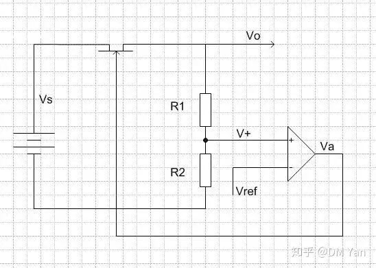

如图是线性稳压电源内部结构的简单示意图。我们的目的是从高电压Vs得到低电压Vo。在图中，Vo经过两个分压电阻分压得到V+，V+被送入放大器(我们把这个放大器叫做误差放大器)的正端，而放大器的负端Vref是电源内部的参考电平(这个参考电平是恒定的)。放大器的输出Va连接到MOSFET的栅极来控制MOSFET的阻抗。Va变大时，MOSFET的阻抗变大;Va变小时，MOSFET的阻抗变小。MOSFET上的压降将是Vs-Vo。

现在我们来看Vo是怎么稳定的，假设Vo变小，那么V+将变小，放大器的输出Va也将变小，这将导致MOSFET的阻抗变小，这样经过同样的电流，MOSFET的压差将变小，于是将Vo上抬来抑制Vo的变小。同理，Vo变大，V+变大，Va变大，MOSFET的阻抗变大，经过同样的电流，MOSFET的压差变大，于是抑制Vo变大。

**二、开关电源的工作原理**

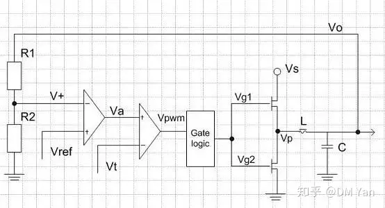

如上图，为了从高电压Vs得到Vo，开关电源采用了用一定占空比的方波Vg1,Vg2推动上下MOS管，Vg1和Vg2是反相的，Vg1为高，Vg2为低;上MOS管打开时，下MOS管关闭;下MOS管打开时，上MOS管关闭。由此在L左端形成了一定占空比的方波电压，电感L和电容C我们可以看作是低通滤波器，因此方波电压经过滤波后就得到了滤波后的稳定电压Vo。Vo经过R1、R2分压后送入第一个放大器(误差放大器)的负端V+，误差放大器的输出Va做为第二个放大器(PWM放大器)的正端，PWM放大器的输出Vpwm是一个有一定占空比的方波，经过门逻辑电路处理得到两个反相的方波Vg1、Vg2来控制MOSFET的开关。

误差放大器的正端Vref是一恒定的电压，而PWM放大器的负端Vt是一个三角波信号，一旦Va比三角波大时，Vpwm为高；Va比三角波小时，Vpwm为低，因此Va与三角波的关系，决定了方波信号Vpwm的占空比；Va高，占空比就低，Va低，占空比就高。经过处理,Vg1与Vpwm同相，Vg2与Vpwm反相；最终L左端的方波电压Vp与Vg1相同。如下图

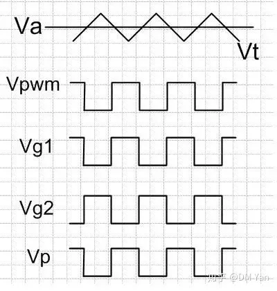

当Vo上升时，V+将上升，Va下降，Vpwm占空比下降，经过们逻辑之后，Vg1的占空比下降，Vg2的占空比上升，Vp占空比下降，这又导致Vo降低，于是Vo的上升将被抑制。反之亦然。

**三、线性稳压电源和开关电源的比较**

懂得了线性稳压电源和开关电源的工作原理之后，我们就可以明白为什么线性稳压电源有较小的噪声，较快的瞬态响应，但是效率差;而开关电源噪声较大，瞬态响应较慢，但效率高了。

线性稳压电源内部结构简单，反馈环路短，因此噪声小，而且瞬态响应快(当输出电压变化时，补偿快)。但是因为输入和输出的压差全部落在了MOSFET上，所以它的效率低。因此，线性稳压一般用在小电流，对电压精度要求高的应用上。

而开关电源，内部结构复杂，影响输出电压噪声性能的因数很多，且其反馈环路长，因此其噪声性能低于线性稳压电源，且瞬态响应慢。但是根据开关电源的结构，MOSFET处于完全开和完全关两种状态，除了驱动MOSFET，和MOSFET自己内阻消耗的能量之外，其他能量被全部用在了输出(理论上L、C是不耗能量的，尽管实际并非如此，但这些消耗的能量很小)。

**总而言之，要学好硬件电路设计，首先要弄清楚项目需求，根据功能设计硬件框架，结合参考设计，多借鉴别人的设计成果，复用到自己的硬件项目上面来。**


## 实际电路设计流程

>[一个实际电路的原理图是怎样设计出来的？ - 知乎 (zhihu.com)](https://www.zhihu.com/question/358059963)

说一下我的理解。

之所以需要设计电路，很明显是为了实现某种需求。

比方说，我要听音乐。

那么，除了扬声器外，我们必须准备一块[电路板](https://www.zhihu.com/search?q=电路板&search_source=Entity&hybrid_search_source=Entity&hybrid_search_extra={"sourceType"%3A"answer"%2C"sourceId"%3A920402590})。也就是需要设计并制作一块[线路板](https://www.zhihu.com/search?q=线路板&search_source=Entity&hybrid_search_source=Entity&hybrid_search_extra={"sourceType"%3A"answer"%2C"sourceId"%3A920402590})。在这里我们只谈设计。

***第一步是确定详细的需求。\***

举例：

1、我要求电路可以使扬声器最大功率达到10瓦特（W）；

2、我要求扬声器输出10W的功率时，[放大器](https://www.zhihu.com/search?q=放大器&search_source=Entity&hybrid_search_source=Entity&hybrid_search_extra={"sourceType"%3A"answer"%2C"sourceId"%3A920402590})失真（也就是THD）不超过0.5%；

3、我要求放大器的频率至少能工作在20Hz至20KHz。

有了这三个需求后。

便可以进行设计***[电路架构](https://www.zhihu.com/search?q=电路架构&search_source=Entity&hybrid_search_source=Entity&hybrid_search_extra={"sourceType"%3A"answer"%2C"sourceId"%3A920402590})\***了。

这也是最重要的一步。***电路架构的设计。\***

就像建造房子，先浇筑框架，然后细化。

还是以[音频放大器](https://www.zhihu.com/search?q=音频放大器&search_source=Entity&hybrid_search_source=Entity&hybrid_search_extra={"sourceType"%3A"answer"%2C"sourceId"%3A920402590})举例。

先计算当输出功率为10W时，流过扬声器的电流I=1.12A。（假设负载为8Ω；1KHz）

由于需要流过这么大的电流，在[晶体管](https://www.zhihu.com/search?q=晶体管&search_source=Entity&hybrid_search_source=Entity&hybrid_search_extra={"sourceType"%3A"answer"%2C"sourceId"%3A920402590})的三种基本接法中，只能选择[集电极](https://www.zhihu.com/search?q=集电极&search_source=Entity&hybrid_search_source=Entity&hybrid_search_extra={"sourceType"%3A"answer"%2C"sourceId"%3A920402590})接地电路。也就是常说的发射极[跟随器](https://www.zhihu.com/search?q=跟随器&search_source=Entity&hybrid_search_source=Entity&hybrid_search_extra={"sourceType"%3A"answer"%2C"sourceId"%3A920402590})。

如下图：

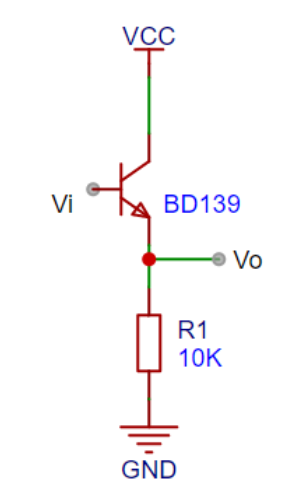

此时电压为Vo=1.12*8=8.96V。

而CD机出来的信号有两个特点。一是有效值约2V；二是输出阻抗相对较大。（且CD机信号末尾一般有隔直流电容）

所以，需要把CD机出来的音频信号的电压放大到8.96V。

此时可以选择共基或共射电路。但由于音源输出电阻较大，而[共基电路](https://www.zhihu.com/search?q=共基电路&search_source=Entity&hybrid_search_source=Entity&hybrid_search_extra={"sourceType"%3A"answer"%2C"sourceId"%3A920402590})输入电阻较小。所以只能选共射电路。

如下图：

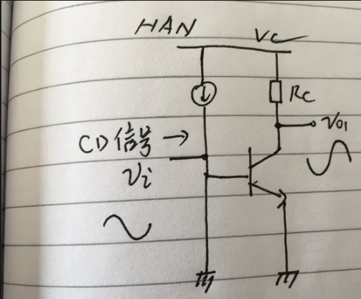

那么，电路的基本架构也就成型了。如图：

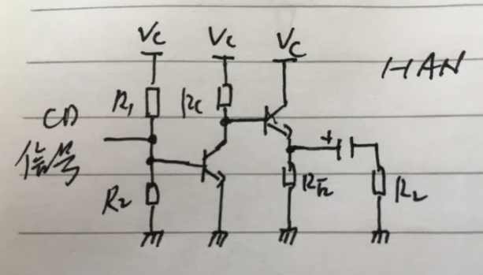

***第三步是对架构进行调整。\***

***分析第二步架构中存在哪些问题**。*

比方说上面这个架构，我们分析一下他的缺点：

1、跟随器的[空载电流](https://www.zhihu.com/search?q=空载电流&search_source=Entity&hybrid_search_source=Entity&hybrid_search_extra={"sourceType"%3A"answer"%2C"sourceId"%3A920402590})较大（空载电流需要远大于1.12A，否则波形负半周必定会削波），造成发热严重且放大器效率低下，如果要解决这个问题必须接上非常大的热沉（散热板）；

2、输出级使用了电容，会和负载形成[高通滤波器](https://www.zhihu.com/search?q=高通滤波器&search_source=Entity&hybrid_search_source=Entity&hybrid_search_extra={"sourceType"%3A"answer"%2C"sourceId"%3A920402590})，但如果降低HPF所造成的影响，势必需要使用大容量[电解电容](https://www.zhihu.com/search?q=电解电容&search_source=Entity&hybrid_search_source=Entity&hybrid_search_extra={"sourceType"%3A"answer"%2C"sourceId"%3A920402590})，增加了较多成本不说，可靠性也会降低；

3、这个电路的温漂会很严重。

4、这个电路的失真会很大。

根据这四个缺点，我们进行架构的调整。

1、空载电流较大，所以必须修正为[推挽跟随器电路](https://www.zhihu.com/search?q=推挽跟随器电路&search_source=Entity&hybrid_search_source=Entity&hybrid_search_extra={"sourceType"%3A"answer"%2C"sourceId"%3A920402590})；同时可以解决使用输出电容的问题；

2、对初级电路使用[差动放大电路](https://www.zhihu.com/search?q=差动放大电路&search_source=Entity&hybrid_search_source=Entity&hybrid_search_extra={"sourceType"%3A"answer"%2C"sourceId"%3A920402590})，改善温漂的情况；（以牺牲一个[三极管](https://www.zhihu.com/search?q=三极管&search_source=Entity&hybrid_search_source=Entity&hybrid_search_extra={"sourceType"%3A"answer"%2C"sourceId"%3A920402590})为代价）

3、关于失真的问题，可以增加[开环增益](https://www.zhihu.com/search?q=开环增益&search_source=Entity&hybrid_search_source=Entity&hybrid_search_extra={"sourceType"%3A"answer"%2C"sourceId"%3A920402590})（使用[恒流源](https://www.zhihu.com/search?q=恒流源&search_source=Entity&hybrid_search_source=Entity&hybrid_search_extra={"sourceType"%3A"answer"%2C"sourceId"%3A920402590})、采用多级放大等），然后进行[深度负反馈](https://www.zhihu.com/search?q=深度负反馈&search_source=Entity&hybrid_search_source=Entity&hybrid_search_extra={"sourceType"%3A"answer"%2C"sourceId"%3A920402590})配置，可以大幅降低THD和噪声；

调整后的架构如图：

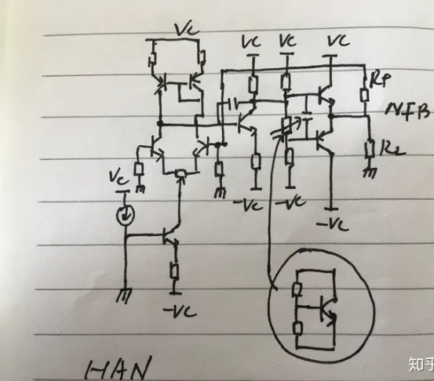

架构确定后，就是***具体设计\***了。简单来说，就是***确定架构中每一个元器件的具体参数、型号。\***

这一步也是相当关键的。对于本图中，我们可以先进行人为计算（估算，即把基射压降固定看做0.65V），利用[欧姆定律](https://www.zhihu.com/search?q=欧姆定律&search_source=Entity&hybrid_search_source=Entity&hybrid_search_extra={"sourceType"%3A"answer"%2C"sourceId"%3A920402590})即可。然后进行微调整。

此时我们可以说电路原理图已经***基本设计完毕\***。接下来一般会进行仿真，一般使用LTSPICE或者Multisim10.0。


把原理图确认无误后，输入到AD、PADS等EDA软件，即可着手进行线路板LAYOUT的设计了。

有关PCB布局（LAYOUT）的设计又是相当关键的一个步骤。尤其是高频线路板或者超高速电路。在[高频电路](https://www.zhihu.com/search?q=高频电路&search_source=Entity&hybrid_search_source=Entity&hybrid_search_extra={"sourceType"%3A"answer"%2C"sourceId"%3A920402590})中，就算原理图设计的再好再精确，不懂布局设计的话，信号会发生很多奇怪的现象。

当然，高频电路（RF）的拓扑也和低频有很大的区别。这点我会放在最后面进行一些细节描述。

以上是[模拟电路](https://www.zhihu.com/search?q=模拟电路&search_source=Entity&hybrid_search_source=Entity&hybrid_search_extra={"sourceType"%3A"answer"%2C"sourceId"%3A920402590})设计的基本思路。

对于[数字IC电路](https://www.zhihu.com/search?q=数字IC电路&search_source=Entity&hybrid_search_source=Entity&hybrid_search_extra={"sourceType"%3A"answer"%2C"sourceId"%3A920402590})，则是完全不同的所谓的HDL[设计方法](https://www.zhihu.com/search?q=设计方法&search_source=Entity&hybrid_search_source=Entity&hybrid_search_extra={"sourceType"%3A"answer"%2C"sourceId"%3A920402590})。也就是[硬件描述语言](https://www.zhihu.com/search?q=硬件描述语言&search_source=Entity&hybrid_search_source=Entity&hybrid_search_extra={"sourceType"%3A"answer"%2C"sourceId"%3A920402590})。主流的有Verilog语言。通俗的说就是利用计算机设计线路。设计人员只需要提出需求，接下来就完全交给[编译器](https://www.zhihu.com/search?q=编译器&search_source=Entity&hybrid_search_source=Entity&hybrid_search_extra={"sourceType"%3A"answer"%2C"sourceId"%3A920402590})。

比方说：

```text
module test(
input a;
input b;
output c;
);
assign c=a^b;
endmodule
```

**编译器很快识别出这是一个[异或门](https://www.zhihu.com/search?q=异或门&search_source=Entity&hybrid_search_source=Entity&hybrid_search_extra={"sourceType"%3A"answer"%2C"sourceId"%3A920402590})。**

毕竟大规模[数字电路](https://www.zhihu.com/search?q=数字电路&search_source=Entity&hybrid_search_source=Entity&hybrid_search_extra={"sourceType"%3A"answer"%2C"sourceId"%3A920402590})过于复杂，只能借助计算机。

后续我会写一个实际的例子来表明如何对数字电路进行设计。

------

**更新一些东西。**

上次写的时候对电路框架进行了简单的介绍，而关于***元件的具体设计\***没怎么说。

本次更新写一下电路具体设计时需要注意的地方。

电路架构确定后，需要对每一个元器件进行计算，从而确定每个元件的额定参数。

举个例子：

示波器是一个很常见的仪器，被誉为***[电子工程师](https://www.zhihu.com/search?q=电子工程师&search_source=Entity&hybrid_search_source=Entity&hybrid_search_extra={"sourceType"%3A"answer"%2C"sourceId"%3A920402590})的眼睛。\***

示波器的最重要的配件便是探头。一般随机配备的探头都是具有10:1和1:1两种衰减比。

最大测量电压一般不超过数百伏。（典型值300Vrms，[10:1衰减](https://www.zhihu.com/search?q=10%3A1衰减&search_source=Entity&hybrid_search_source=Entity&hybrid_search_extra={"sourceType"%3A"answer"%2C"sourceId"%3A920402590})）

如果要测量高压信号（如一些[高压脉冲](https://www.zhihu.com/search?q=高压脉冲&search_source=Entity&hybrid_search_source=Entity&hybrid_search_extra={"sourceType"%3A"answer"%2C"sourceId"%3A920402590})），显然随机的标配探头是不能进行测试的。

而设备公司售卖的专用高压探头往往是相当昂贵的。

以T公司售卖的无源高压探头为例，价格往往为四位数。

示波器用高压无源探头其本质为频率特性较好的[衰减器](https://www.zhihu.com/search?q=衰减器&search_source=Entity&hybrid_search_source=Entity&hybrid_search_extra={"sourceType"%3A"answer"%2C"sourceId"%3A920402590})。（而[万用表](https://www.zhihu.com/search?q=万用表&search_source=Entity&hybrid_search_source=Entity&hybrid_search_extra={"sourceType"%3A"answer"%2C"sourceId"%3A920402590})的衰减器虽然可能衰减比达到了要求，但频率特性不满足）

如果是为了省钱而要自制探头的话，我们设计了下图的[电路原理图](https://www.zhihu.com/search?q=电路原理图&search_source=Entity&hybrid_search_source=Entity&hybrid_search_extra={"sourceType"%3A"answer"%2C"sourceId"%3A920402590})。

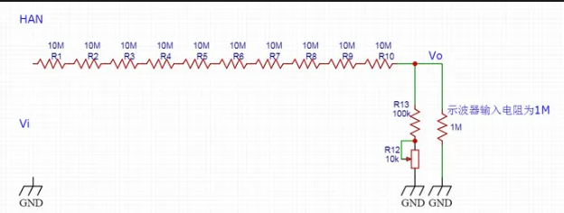

当信号最高电压为20KV时，示波器上的电压为20V，此时把示波器内探头衰减比调为1000:1，屏幕上可以观察到相应波形。

下面确定具体的元器件型。

R1至R10上的总压降为20000/1001*1000≈20KV；每个10M电阻的压降为2000V；

那么每个[电阻功率](https://www.zhihu.com/search?q=电阻功率&search_source=Entity&hybrid_search_source=Entity&hybrid_search_extra={"sourceType"%3A"answer"%2C"sourceId"%3A920402590})为P=U²/R=0.4W。

那么我们选择1W（取一倍的余量）的金属膜（或碳膜）电阻便可以了吗？

结果是自制的高压探头会被炸掉。

原因是我们只考虑了电阻的[额定功率](https://www.zhihu.com/search?q=额定功率&search_source=Entity&hybrid_search_source=Entity&hybrid_search_extra={"sourceType"%3A"answer"%2C"sourceId"%3A920402590})，而忘记了考虑其他的参数是否满足要求。

在本例中，未考虑的参数是电阻的[额定电压](https://www.zhihu.com/search?q=额定电压&search_source=Entity&hybrid_search_source=Entity&hybrid_search_extra={"sourceType"%3A"answer"%2C"sourceId"%3A920402590})。

我们看下图U公司的电阻DATASHEET。

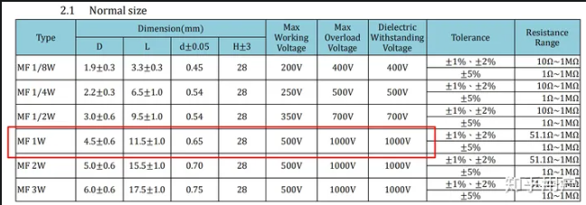

我们可以看到1W电阻额定电压只有500V，而绝缘耐受电压为1000V。所以加上2KV的电压时，电阻会被击穿，导致电阻短路，自制的高压探头自然就BOOM了。（实际情况可能会看到一些“噼啪”的小火花和爆鸣声）

而[实际电路](https://www.zhihu.com/search?q=实际电路&search_source=Entity&hybrid_search_source=Entity&hybrid_search_extra={"sourceType"%3A"answer"%2C"sourceId"%3A920402590})制作时，分压电阻必须加上[补偿电容](https://www.zhihu.com/search?q=补偿电容&search_source=Entity&hybrid_search_source=Entity&hybrid_search_extra={"sourceType"%3A"answer"%2C"sourceId"%3A920402590})，大小视示波器的输入电容而定。假定示波器输入电容为30pF，那么补偿电容一般设置为30fF。（这种电容应该买不到，所以实际电路中需要串联多个电容，以形成这么小的电容）否则会因为[示波器](https://www.zhihu.com/search?q=示波器&search_source=Entity&hybrid_search_source=Entity&hybrid_search_extra={"sourceType"%3A"answer"%2C"sourceId"%3A920402590})自身输入电容的缘故导致无法使用。

> 精选评论：
>
> [打工迷途小菜菜](https://www.zhihu.com/people/c561e5dd1944d947db42782decef3b4f)：
>
> > 电路板，首先有需求过来，我们的电路板要完成这些需求，就要有对应的功能，功能来满足需求，这个是源头。比如你家里的交换机，需要网口，这就需要交换芯片和PHY芯片，这些需要电源芯片，时钟芯片，电阻，电容一堆东西才能工作，然后你的交换机（比如带wifi的），你要设置密码，这就需要WiFi无线相关的电路和芯片，还需要cup芯片去接收密码，以及下配置到相应芯片去使密码生效。这些芯片要正常工作的话，还需要电源模块，我们进去的是220V交流电，但是我们的芯片是需要低压直流供电的。你看，电路图就是这样出来的。需求-》方案-》原理图设计（CPU芯片+各种功能的芯片+时钟芯片+电源芯片+一堆电阻电容电感磁珠等等+PCB板，再加上SMT焊接，焊接插接件），回板之后静态阻抗测试（防止电源短路），上电硬件调试，看各个电源电压是否正常，时钟波形有没有出来，再之后和软件联调，用jtag线看能不能扫到CPU（这个很关键，否则板子就是一块砖头），扫到后下载准备好的程序（就是底层驱动代码），用cpu开始调试外围期间（SPI，I2C等，或者牛一点的PCIE等），所有外围芯片都扫到后，开始调试功能，再到后期的测试+软件+硬件，进行解决测试发现的问题，再然后电路板出货。这个是数字电路板的基本流程。模拟电路板差不多，就是不太好调试，原理图设计时，电路仿真要做好，否则后期就是坑。
>
> 2021-09-16
>
> 回复14
>
> [打工迷途小菜菜](https://www.zhihu.com/people/c561e5dd1944d947db42782decef3b4f) → [千秋雪](https://www.zhihu.com/people/d4f8abd0010be7e5dc69ffb2d1069636)
>
> ：做多了，你就懂了。多做几块板子，什么都懂了。书里得来终是浅。
>
> 2022-05-23
>
> [](https://www.zhihu.com/people/d4f8abd0010be7e5dc69ffb2d1069636)
>
> [千秋雪](https://www.zhihu.com/people/d4f8abd0010be7e5dc69ffb2d1069636)
>
> ：请问有这类总的概括性的描述的书推荐吗？市场上的书都集中在技术细节，想要这种总的步骤性原理性的书籍


## 基本电路集合

>[电子电路20个经典模拟电路 - 知乎 (zhihu.com)](https://zhuanlan.zhihu.com/p/363928568)
>
>初级层次是熟练记住这二十个电路，清楚这二十个电路的作用。只要是学习自动化、电子等电控类专业的人士都应该且能够记住这二十个基本模拟电路。
>
>中级层次是能分析这二十个电路中的关键元器件的作用，每个元器件出现故障时电路的功能受到什么影响，测量时参数的变化规律，掌握对故障元器件的处理方法；定性分析电路信号的流向，相位变化；定性分析信号波形的变化过程；定性了解电路输入输出阻抗的大小，信号与阻抗的关系。有了这些电路知识，极有可能成长为电子产品和工业控制设备的出色的维修维护技师。
>
>高级层次是能定量计算这二十个电路的输入输出阻抗、输出信号与输入信号的比值、电路中信号电流或电压与电路参数的关系、电路中信号的幅度与频率关系特性、相位与频率关系特性、电路中元器件参数的选择等。达到高级层次后，电子产品和工业控制设备的开发设计工程师将是的首选职业。

1. 桥式整流电路
2. 电源滤波器
3. 信号滤波器
4. 微分和积分电路
5. 共射极放大电路
6. 分压偏置式共射极放大电路
7. 共集电极放大电路（射极跟随器）
8. 电路反馈框图
9. 二极管稳压电路
10. 串联稳压电源
11. 差分放大电路
12. 场效应管放大电路
13. 选频（带通）放大电路
14. 运算放大电路
15. 差分输入运算放大电路
16. 电压比较电路
17. RC振荡电路
18. LC振荡电路
19. 石英晶体振荡电路
20. 功率放大电路

## 关于抄板

[PCB抄板 - 知乎 (zhihu.com)](https://zhuanlan.zhihu.com/p/43278056)

>抄板：
>
>PCB抄板，业界也常被称为电路板抄板、电路板克隆、电路板复制、PCB克隆、PCB逆向设计或PCB反向研发。即在已经有电子产品实物和电路板实物的前提下，利用反向研发技术手段对电路板进行逆向解析，将原有产品的PCB文件、物料清单（BOM）文件、原理图文件等技术文件以及PCB丝印生产文件进行1：1的还原。然后再利用这些技术文件和生产文件进行PCB制板、元器件焊接、飞针测试、电路板调试，完成原电路板样板的完整复制。
>
>对于PCB抄板，很多人不了解，到底什么是PCB抄板，有些人甚至认为PCB抄板就是山寨。山寨在大家的理解中，就是模仿的意思，但是PCB抄板绝对不是模仿，PCB抄板的目的是为了学习国外最新的电子电路设计技术，然后吸收优秀的设计方案，再用来开发设计更优秀的产品。
>
>随着抄板行业的不断发展和深化，今天的PCB抄板概念已经得到更广范围的延伸，不再局限于简单的电路板的复制和克隆，还会涉及产品的二次开发与新产品的研发。比如，通过对既有产品技术文件的分析、设计思路、结构特征、工艺技术等的理解和探讨，可以为新产品的研发设计提供可行性分析和竞争性参考，协助研发设计单位及时跟进最新技术发展趋势、及时调整改进产品设计方案，研发最具有市场竞争性的新产品。
>
>PCB抄板的过程通过对技术资料文件的提取和部分修改，可以实现各类型电子产品的快速更新升级与二次开发，根据抄板提取的文件图与原理图，专业设计人员还能根据客户的意愿对PCB进行优化设计与改板。也能够在此基础上为产品增加新的功能或者进行功能特征的重新设计，这样具备新功能的产品将以最快的速度和全新的姿态亮相，不仅拥有了自己的知识产权，也在市场中赢得了先机，为客户带来的是双重的效益。
>
>无论是被用作在反向研究中分析线路板原理和产品工作特性，还是被重新用作在正向设计中的PCB设计基础和依据，PCB原理图都有着特殊的作用。


## 自学的话先学数电还是模电?


先学模电，因为数电是建立在模电基础上的，数电里面也有很多关于[三极管](https://www.zhihu.com/search?q=三极管&search_source=Entity&hybrid_search_source=Entity&hybrid_search_extra={"sourceType"%3A"answer"%2C"sourceId"%3A3380608763})的，这些东西你在学习模电之后在学数电就很简单。

模电教材推荐华成英老师的，推荐看b站[郑益慧](https://www.zhihu.com/search?q=郑益慧&search_source=Entity&hybrid_search_source=Entity&hybrid_search_extra={"sourceType"%3A"answer"%2C"sourceId"%3A3380608763})老师的视频，理解他说的每句话的含义，即使考研都没啥问题的。他讲的本来也通俗易懂，如果连他的视频都听不懂，个人觉得你自学可能更没戏。

数电教材推荐闫石老师或者康华光老师的，国内其他数电教材少看，有的书连器件的名字都不对，还被定为某些学校考研教材，想想都可笑。视频推荐[王红](https://www.zhihu.com/search?q=王红&search_source=Entity&hybrid_search_source=Entity&hybrid_search_extra={"sourceType"%3A"answer"%2C"sourceId"%3A3380608763})的，有了郑益慧老师的模电，在学王红的数电，基本没啥问题，而且王红的数电个人认为是b站最好的，而且也是数电视频中讲的最深的。

我当时电路就是为了应付考试，那时候再搞[数学建模](https://www.zhihu.com/search?q=数学建模&search_source=Entity&hybrid_search_source=Entity&hybrid_search_extra={"sourceType"%3A"answer"%2C"sourceId"%3A3380608763})，没咋学，就刷题过了期末。后面模电的时候也差不多在补电路，跟[郑老师](https://www.zhihu.com/search?q=郑老师&search_source=Entity&hybrid_search_source=Entity&hybrid_search_extra={"sourceType"%3A"answer"%2C"sourceId"%3A3380608763})视频大概学了半学期吧。没集都看了几遍，中间穿插看教材，当时他说的每句话都理解到了他想表达的意思，边学边在群里解答问题，那半学期过后，模电基本上没啥问题，拿到电路就能分析。

然后寒假学了自学数电，因为看了几集王红视频，定了2周搞定数电，其实不是我多厉害，是我看了王红的视频，讲课方式确实适合我的思维，而且讲的三极管，[mos管](https://www.zhihu.com/search?q=mos管&search_source=Entity&hybrid_search_source=Entity&hybrid_search_extra={"sourceType"%3A"answer"%2C"sourceId"%3A3380608763})这些电路也是想学的。然后就2周学完了数电（可编程逻辑器件和[硬件描述语言](https://www.zhihu.com/search?q=硬件描述语言&search_source=Entity&hybrid_search_source=Entity&hybrid_search_extra={"sourceType"%3A"answer"%2C"sourceId"%3A3380608763})章节没学，因为这个时候我已经决定数电学了之后学fpga，所以这两部分直接放后一阶段了），闫石教材上的题这两周也是全部刷完了的。

可能有人觉得两周根本做不完，其实我学习的方式是这样的，早晨起床会把昨天看过视频2倍速再看你遍，昨天没理解到的，看了书之后还有没有疑问，然后去解决。视频过完后，前一天的基本没啥问题了，然后以1.5倍速看今天需要学的内容，这一遍不需要做笔记，认真听就行，能理解多少理解多少，不理解的地方要有印象。视频看完，就开始看书，把视频内容对应的书上内容全部看完，这个时候在做笔记，把自己的理解写出来，回想看视频老师为啥那样说，他想表达什么意思，没理解的地方现在能不能理解了，这些都要想清楚，然后刷一下课后的题。第二天再把今天看的视频过一遍，这次就基本上解决第一次没看书就看视频的时候的疑问了。

这两周过的并没有那么简单，闫石的书是有五百多页的，每天要学的东西特别多，基本上早上八点开始，晚上可能到凌晨一两点。我记得最后一天学adc和dac的时候，我那个时候是感冒了，本来十二点开始睡觉的，结果睡不着，因为还没学完，压力就会特别大，然后到了2点还没睡着。就起床开始看视频学，大概4点的时候最后一点视频过完吧，然后才去睡觉，第二天再把书看一下就结束了。

第二学期疫情在家嘛，都上网课，同学才学数电我已经学完了，课基本上没去上过，那段时间在网络群里回答问题比较多，网上期末考试懂得都懂，体会了本科以上所有大分段难度的学校的数电考试，无往不利。

当你真的在规定时间内完成后，那种感觉真的爽，尤其是时间很局限。这也是为什么后面我敢说一周学完[微机原理](https://www.zhihu.com/search?q=微机原理&search_source=Entity&hybrid_search_source=Entity&hybrid_search_extra={"sourceType"%3A"answer"%2C"sourceId"%3A3380608763})的原因，因为我又找到了一个适合我学习方式的视频，周佳社老师的微机原理，那个时候我已经有了数电的坚实基础，再加上周佳社老师的讲解，微机原理的硬件部分就水到渠成，根本没有难度。硬件没问题后，[8086](https://www.zhihu.com/search?q=8086&search_source=Entity&hybrid_search_source=Entity&hybrid_search_extra={"sourceType"%3A"answer"%2C"sourceId"%3A3380608763})的汇编也就不会有问题，一周搞定就比较轻松了。


# 他山之石-软件

## 编程究竟难在哪？

>编程究竟难在哪？ - invalid s的回答 - 知乎
>https://www.zhihu.com/question/311432227/answer/706661772

>事实上，编程的整个思路就和你在中学的学习格格不入。
>
>在中学的学习中，你被要求学习一个个离散的定律、记忆一个个单一的公式，被黑体字和考题指挥着疲于奔命。
>
>你必须仰视每一门学科的每一行黑体字；没人会引导你去全览一个领域——事实上，它不允许你对哪怕一个局部发表任何看法。
>
>低头，学！记住每个问题的解决方法！
>
>这就是你唯一要做的。
>
>但是，到了学习编程时，情况有了180度的大转弯。
>你必须整个的知道计算机是什么、每个组成部分又是什么——以及它们是如何构成计算机系统这个整体的、为什么要这样构成、为什么要如此分解。
>
>你必须站在设计师的立场上看问题，把整台电脑，整个机房的所有电脑，整个国家互联网上的所有设备，统统收于囊中、置于眼前。
>
>抬头，看！自己琢磨出每个莫名其妙的难题的解决思路！
>
>只见树木，不见森林？
>那你就连个最最简单的输入输出设备的访问代码都写不出来。
>因为你完全不知道某个调用发出后，会造成什么影响。
>
>这是两个完全不同的视角。
>
>显然，掌控性的、全局的、评论性陈述性研究性的视角，比隔离出来的一个个要你学习的局部难得多。因为它对你的知识结构要求严格。
>
>你不再是一个仰着脸、接受一个个离散的知识点的学子；相反，你是脑子里有一个清晰准确的计算机/计算机网络/OS层次架构等等东西的、1：1模型的工程师——只有你知道整个计算机系统的来龙去脉，你才可能精确的影响它、从而得到你想要的一切。
>
>可惜，你从未受过这种训练。
>
>很多人的知识，压根就是散的。它就是立不起来。

>我总以为，感叹什么“没有人能知道一切”是真正大佬的专利。我这种跟着人家亦步亦趋的，并没有资格矫情什么“知道的越多未知就越多”。
>
>全都是被人趟了无数遍整理的井井有条的、开发了好多年熟地，还弄出一副“我看到了未知的边境”的沧桑样，那实在有些滑稽。
>
>某种意义上，那甚至是对初学者的一种恶意。恶意于圈定一个屁股大的边界，告诉他那是前辈我替你探知的边境，你不要试图突破它。否则我就要骂你骄傲自大。
>
>但事实上，这片熟地的疆域是如此辽阔，至少我还看不到边。
>
>不要画地为牢。有资格说“我面前的未知更多”的，显然不可能是我。
>
>我还没有这个矫情的资格。

>但是，没有人可以真的总揽全局，没有人可以把哪怕只是一只鼠标一块硬盘的每个细节都了如指掌。
>然而……前面刚刚说过，你必须学会总揽全局，你必须学着把整个互联网纳入视野……
>
>这不矛盾吗？
>
>这并不矛盾。但它需要更多的技巧，更为科学的思维能力。
>
>第一步，你需要学会分层次思考问题。
>硬盘是什么？
>它是一个文件，可以直接通过/dev/sda这个路径打开——这是OS用户层次的看法。
>它是一个块设备，有输入输出缓冲区——这是OS开发者层次的看法。
>它是一个可接受命令的远程系统，可以通过向特定地址写入命令字的方式来“遥控”它——这是驱动开发者层次的看法。
>它是一个单片机控制的、复杂的物理系统，这个系统对外抽象为“可接受命令字的设备”，对内则要管理好磁头盘片日志等等诸多细节——这是硬盘固件开发者层次的看法。
>它的磁头使用了巨磁阻技术，这种技术的原理和由来是XXOO——这是硬盘研发者的看法。
>
>看到了吗？
>你必须学会根据讨论场景，确定哪些细节需要关注、哪些细节可以无视，从而在不同层次使用不同的抽象。
>
>学不会分层次思考问题，做什么你都只能牛头不对马嘴。
>
>
>第二步，你需要学会分领域思考问题。
>我们需要在线提交订单。
>在订单管理模块，我们要如此如此；然后把订单交给通讯模块。通讯模块要做到巴拉巴拉。
>那么，切记：当讨论订单管理时，千万不要深入通讯模块，分析“网络丢包怎么办”。那是在浪费时间。
>
>我们要一个领域一个领域一个问题一个问题的解决问题，千万不要眉毛胡子一把抓。
>
>换句话说，要学会“分治”。
>只有学会合理的“分治”，才不至于不断返工。
>
>
>只有先学会在任意层次看待问题、学会任意缩放每个局部，你才可能“既总揽全局，又深入细节”。
>
>
>不光做工程要这样，学习同样必须这样。
>你的知识，必须是一个立体的网，必须像一台运转的发动机那样，每一个概念全都老老实实呆在它该呆的地方——你可以随时取下一个零件，拆解，把玩；同时，你还必须有能力随时安装、替换一个零件。

>换句话说，你必须梳理自己的知识，把它有机化；然后，你才可能得到“总揽全局”的能力。
>先有了总揽全局的能力，这才能泛化/细化任意局部；而任意局部的细化/泛化能力反过来又能帮你“总揽全局”。
>
>这和中学阶段的“泛泛而学”、“记忆考点”、“应试思维”完完全全是背道而驰——从现在起，你必须是知识的主人，你必须学会对每种技术“评头论足”；你不仅不再可以“被动学习”，甚至你还被要求“主动创新”；甚至，你不仅要“主动创新”，还要能通过数学证明证明你的创新算法和问题复杂度匹配、没有把O(N)的问题弄到O(N^2)。
>
>
>
>
>
>事实上，编程并不需要你掌握太多的新知识。
>如果你有所追求，那就尽量透彻的理解计算机本身；否则，你只理解编程语言给你的那个美好的、隐藏了一切“可怕”细节的简单抽象，其实也已经足够了。
>
>
>然后，你要把你学过的数学、物理、生物等等知识统统数字化，和你的这个知识网对接。
>
>你看，从知识网的构建、更新、纠错，再到其他领域的“触类旁通”乃至“化用”“巧用”，这里面同样有很多很多的理论，需要大量的实践帮你逐渐内化它。
>
>这个落差，显然不小。
>如果你从未自主思考过，如果你从小没有对各种器物的运行规律有过兴趣；那么现在，你将直接面对人类最为复杂最为庞大的造物之一。
>
>这里面，“层次”思想和“分治”思想是最重要的。它们可以帮你控制接触范围，一点点的窥知这个庞大的体系，一点点的更新你脑中的计算模型——而不至于给你造成太大的“惊吓”。
>
>如果没有分层思考、分领域独立理解的帮助……那就是“盲人骑瞎马，夜半临深池”了。
>
>
>
>
>
>因此，“学习思路”看似简单，似乎“只要脑子一换”就能搞定；但其中的道道……着实不少。
>
>
>
>如果你从未在这方面做过准备，那么学习编程对你旧有学习方法、思路的冲击……可没那么容易应付。

>他们不想了解加法器的详细工作原理，只想在哲学层面上被人敲一棒子顿悟而已。
>
>说白了还是“应试思维”，以为别人就应该给他一行言简意赅、很容易背的黑体字，让他把标准答案背下来就解决了全部问题；却不知道绝大部分现实问题是没有标准答案、只能自己去求索的。

>他们觉得迷惑的，是0和1这种抽象概念是怎么被电路识别的——太哲学了所以没人搞得懂。
>
>
>
>换句话说，他们的思维只有一个方向，就是“记忆某某是某某”或“记忆某某是某某和某某组成的”；但数字电路（以及其他各种工程）恰恰全都是“我们需要某某效果，所以我们活用自己头脑中的知识，凑出这个效果”。
>
>
>
>一个是“天然就存在的自然规律”，所以只要记忆就好；另一个是“活用自然规律，实现人类的目标”，所以必须自己创造。
>
>
>
>这两种截然不同的思维，导致脑子转不过来的人总想寻找“究竟是哪个自然规律决定了0和1与电路通断相连？快列出来我要背！”
>
>
>
>在他思维方式来个180度大转弯、明白“我可以强行指定通是1断是0”之前，没有人能教会他们。
>
>
>
>事实上，你背下的一切自然规律都是没有用的。抽刀断水水更流，不是吗？
>
>
>
>什么时候，自然规律才会有用？
>
>很简单，当你能想到“这些规律都可以为我所用”时，它们才开始有用。
>
>
>
>而想要“为我所用”，你就不能仅仅记忆了事。
>
>相反，你要从根本上理解它，理解到你可以hack它的程度——计算？计算不就是问题到答案的“映射”嘛？我们干嘛一定要让机器懂加法？看，这个齿轮加上这样的一个拨叉，是不是就得到加法器了？三下五去二是加法，齿轮拨叉是加法，异或门搭配与门，不同样是加法？
>
>
>
>从记忆规律到花样百出的活用规律，这中间的距离可太大了。

>是的，编程其实就是解决问题，learn programming, not programming languages. 知道解决问题的办法，一步步来，语言这种东西，对于聪明人应该是能够信手拈来的东西。可惜很多人还是在纠结语言，而不是编程。

学以致用？学以致考？


## 编程的智慧

>[编程的智慧 (yinwang.org)](https://www.yinwang.org/blog-cn/2015/11/21/programming-philosophy)

编程是一种创造性的工作，是一门艺术。精通任何一门艺术，都需要很多的练习和领悟，所以这里提出的“智慧”，并不是号称一天瘦十斤的减肥药，它并不能代替你自己的勤奋。然而由于软件行业喜欢标新立异，喜欢把简单的事情搞复杂，我希望这些文字能给迷惑中的人们指出一些正确的方向，让他们少走一些弯路，基本做到一分耕耘一分收获。

### 反复推敲代码

有些人喜欢炫耀自己写了多少多少万行的代码，仿佛代码的数量是衡量编程水平的标准。然而，如果你总是匆匆写出代码，却从来不回头去推敲，修改和提炼，其实是不可能提高编程水平的。你会制造出越来越多平庸甚至糟糕的代码。在这种意义上，很多人所谓的“工作经验”，跟他代码的质量其实不一定成正比。如果有几十年的工作经验，却从来不回头去提炼和反思自己的代码，那么他也许还不如一个只有一两年经验，却喜欢反复推敲，仔细领悟的人。

有位文豪说得好：“看一个作家的水平，不是看他发表了多少文字，而要看他的废纸篓里扔掉了多少。” 我觉得同样的理论适用于编程。好的程序员，他们删掉的代码，比留下来的还要多很多。如果你看见一个人写了很多代码，却没有删掉多少，那他的代码一定有很多垃圾。

就像文学作品一样，代码是不可能一蹴而就的。灵感似乎总是零零星星，陆陆续续到来的。任何人都不可能一笔呵成，就算再厉害的程序员，也需要经过一段时间，才能发现最简单优雅的写法。有时候你反复提炼一段代码，觉得到了顶峰，没法再改进了，可是过了几个月再回头来看，又发现好多可以改进和简化的地方。这跟写文章一模一样，回头看几个月或者几年前写的东西，你总能发现一些改进。

所以如果反复提炼代码已经不再有进展，那么你可以暂时把它放下。过几个星期或者几个月再回头来看，也许就有焕然一新的灵感。这样反反复复很多次之后，你就积累起了灵感和智慧，从而能够在遇到新问题的时候直接朝正确，或者接近正确的方向前进。

### 写优雅的代码

人们都讨厌“面条代码”（spaghetti code），因为它就像面条一样绕来绕去，没法理清头绪。那么优雅的代码一般是什么形状的呢？经过多年的观察，我发现优雅的代码，在形状上有一些明显的特征。

如果我们忽略具体的内容，从大体结构上来看，优雅的代码看起来就像是一些整整齐齐，套在一起的盒子。如果跟整理房间做一个类比，就很容易理解。如果你把所有物品都丢在一个很大的抽屉里，那么它们就会全都混在一起。你就很难整理，很难迅速的找到需要的东西。但是如果你在抽屉里再放几个小盒子，把物品分门别类放进去，那么它们就不会到处乱跑，你就可以比较容易的找到和管理它们。

优雅的代码的另一个特征是，它的逻辑大体上看起来，是枝丫分明的树状结构（tree）。这是因为程序所做的几乎一切事情，都是信息的传递和分支。你可以把代码看成是一个电路，电流经过导线，分流或者汇合。如果你是这样思考的，你的代码里就会比较少出现只有一个分支的if语句，它看起来就会像这个样子：

```
if (...) {
  if (...) {
    ...
  } else {
    ...
  }
} else if (...) {
  ...
} else {
  ...
}
```

注意到了吗？在我的代码里面，if语句几乎总是有两个分支。它们有可能嵌套，有多层的缩进，而且else分支里面有可能出现少量重复的代码。然而这样的结构，逻辑却非常严密和清晰。在后面我会告诉你为什么if语句最好有两个分支。

### 写模块化的代码

有些人吵着闹着要让程序“模块化”，结果他们的做法是把代码分部到多个文件和目录里面，然后把这些目录或者文件叫做“module”。他们甚至把这些目录分放在不同的VCS repo里面。结果这样的作法并没有带来合作的流畅，而是带来了许多的麻烦。这是因为他们其实并不理解什么叫做“模块”，肤浅的把代码切割开来，分放在不同的位置，其实非但不能达到模块化的目的，而且制造了不必要的麻烦。

真正的模块化，并不是文本意义上的，而是逻辑意义上的。一个模块应该像一个电路芯片，它有定义良好的输入和输出。实际上一种很好的模块化方法早已经存在，它的名字叫做“函数”。每一个函数都有明确的输入（参数）和输出（返回值），同一个文件里可以包含多个函数，所以你其实根本不需要把代码分开在多个文件或者目录里面，同样可以完成代码的模块化。我可以把代码全都写在同一个文件里，却仍然是非常模块化的代码。

想要达到很好的模块化，你需要做到以下几点：

- 避免写太长的函数。如果发现函数太大了，就应该把它拆分成几个更小的。通常我写的函数长度都不超过40行。对比一下，一般笔记本电脑屏幕所能容纳的代码行数是50行。我可以一目了然的看见一个40行的函数，而不需要滚屏。只有40行而不是50行的原因是，我的眼球不转的话，最大的视角只看得到40行代码。

  如果我看代码不转眼球的话，我就能把整片代码完整的映射到我的视觉神经里，这样就算忽然闭上眼睛，我也能看得见这段代码。我发现闭上眼睛的时候，大脑能够更加有效地处理代码，你能想象这段代码可以变成什么其它的形状。40行并不是一个很大的限制，因为函数里面比较复杂的部分，往往早就被我提取出去，做成了更小的函数，然后从原来的函数里面调用。

- 制造小的工具函数。如果你仔细观察代码，就会发现其实里面有很多的重复。这些常用的代码，不管它有多短，提取出去做成函数，都可能是会有好处的。有些帮助函数也许就只有两行，然而它们却能大大简化主要函数里面的逻辑。

  有些人不喜欢使用小的函数，因为他们想避免函数调用的开销，结果他们写出几百行之大的函数。这是一种过时的观念。现代的编译器都能自动的把小的函数内联（inline）到调用它的地方，所以根本不产生函数调用，也就不会产生任何多余的开销。

  同样的一些人，也爱使用宏（macro）来代替小函数，这也是一种过时的观念。在早期的C语言编译器里，只有宏是静态“内联”的，所以他们使用宏，其实是为了达到内联的目的。然而能否内联，其实并不是宏与函数的根本区别。宏与函数有着巨大的区别（这个我以后再讲），应该尽量避免使用宏。为了内联而使用宏，其实是滥用了宏，这会引起各种各样的麻烦，比如使程序难以理解，难以调试，容易出错等等。

- 每个函数只做一件简单的事情。有些人喜欢制造一些“通用”的函数，既可以做这个又可以做那个，它的内部依据某些变量和条件，来“选择”这个函数所要做的事情。比如，你也许写出这样的函数：

  ```
  void foo() {
    if (getOS().equals("MacOS")) {
      a();
    } else {
      b();
    }
    c();
    if (getOS().equals("MacOS")) {
      d();
    } else {
      e();
    }
  }
  ```

  写这个函数的人，根据系统是否为“MacOS”来做不同的事情。你可以看出这个函数里，其实只有`c()`是两种系统共有的，而其它的`a()`, `b()`, `d()`, `e()`都属于不同的分支。

  这种“复用”其实是有害的。如果一个函数可能做两种事情，它们之间共同点少于它们的不同点，那你最好就写两个不同的函数，否则这个函数的逻辑就不会很清晰，容易出现错误。其实，上面这个函数可以改写成两个函数：

  ```
  void fooMacOS() {
    a();
    c();
    d();
  }
  ```

  和

  ```
  void fooOther() {
    b();
    c();
    e();
  }
  ```

  如果你发现两件事情大部分内容相同，只有少数不同，多半时候你可以把相同的部分提取出去，做成一个辅助函数。比如，如果你有个函数是这样：

  ```
  void foo() {
    a();
    b()
    c();
    if (getOS().equals("MacOS")) {
      d();
    } else {
      e();
    }
  }
  ```

  其中`a()`，`b()`，`c()`都是一样的，只有`d()`和`e()`根据系统有所不同。那么你可以把`a()`，`b()`，`c()`提取出去：

  ```
  void preFoo() {
    a();
    b()
    c();
  ```

  然后制造两个函数：

  ```
  void fooMacOS() {
    preFoo();
    d();
  }
  ```

  和

  ```
  void fooOther() {
    preFoo();
    e();
  }
  ```

  这样一来，我们既共享了代码，又做到了每个函数只做一件简单的事情。这样的代码，逻辑就更加清晰。

- 避免使用全局变量和类成员（class member）来传递信息，尽量使用局部变量和参数。有些人写代码，经常用类成员来传递信息，就像这样：

  ```
   class A {
     String x;
  
     void findX() {
        ...
        x = ...;
     }
  
     void foo() {
       findX();
       ...
       print(x);
     }
   }
  ```

  首先，他使用`findX()`，把一个值写入成员`x`。然后，使用`x`的值。这样，`x`就变成了`findX`和`print`之间的数据通道。由于`x`属于`class A`，这样程序就失去了模块化的结构。由于这两个函数依赖于成员x，它们不再有明确的输入和输出，而是依赖全局的数据。`findX`和`foo`不再能够离开`class A`而存在，而且由于类成员还有可能被其他代码改变，代码变得难以理解，难以确保正确性。

  如果你使用局部变量而不是类成员来传递信息，那么这两个函数就不需要依赖于某一个class，而且更加容易理解，不易出错：

  ```
   String findX() {
      ...
      x = ...;
      return x;
   }
   void foo() {
     String x = findX();
     print(x);
   }
  ```

### 写可读的代码

有些人以为写很多注释就可以让代码更加可读，然而却发现事与愿违。注释不但没能让代码变得可读，反而由于大量的注释充斥在代码中间，让程序变得障眼难读。而且代码的逻辑一旦修改，就会有很多的注释变得过时，需要更新。修改注释是相当大的负担，所以大量的注释，反而成为了妨碍改进代码的绊脚石。

实际上，真正优雅可读的代码，是几乎不需要注释的。如果你发现需要写很多注释，那么你的代码肯定是含混晦涩，逻辑不清晰的。其实，程序语言相比自然语言，是更加强大而严谨的，它其实具有自然语言最主要的元素：主语，谓语，宾语，名词，动词，如果，那么，否则，是，不是，…… 所以如果你充分利用了程序语言的表达能力，你完全可以用程序本身来表达它到底在干什么，而不需要自然语言的辅助。

有少数的时候，你也许会为了绕过其他一些代码的设计问题，采用一些违反直觉的作法。这时候你可以使用很短注释，说明为什么要写成那奇怪的样子。这样的情况应该少出现，否则这意味着整个代码的设计都有问题。

如果没能合理利用程序语言提供的优势，你会发现程序还是很难懂，以至于需要写注释。所以我现在告诉你一些要点，也许可以帮助你大大减少写注释的必要：

1. 使用有意义的函数和变量名字。如果你的函数和变量的名字，能够切实的描述它们的逻辑，那么你就不需要写注释来解释它在干什么。比如：

   ```
   // put elephant1 into fridge2
   put(elephant1, fridge2);
   ```

   由于我的函数名`put`，加上两个有意义的变量名`elephant1`和`fridge2`，已经说明了这是在干什么（把大象放进冰箱），所以上面那句注释完全没有必要。

2. 局部变量应该尽量接近使用它的地方。有些人喜欢在函数最开头定义很多局部变量，然后在下面很远的地方使用它，就像这个样子：

   ```
   void foo() {
     int index = ...;
     ...
     ...
     bar(index);
     ...
   }
   ```

   由于这中间都没有使用过`index`，也没有改变过它所依赖的数据，所以这个变量定义，其实可以挪到接近使用它的地方：

   ```
   void foo() {
     ...
     ...
     int index = ...;
     bar(index);
     ...
   }
   ```

   这样读者看到`bar(index)`，不需要向上看很远就能发现`index`是如何算出来的。而且这种短距离，可以加强读者对于这里的“计算顺序”的理解。否则如果index在顶上，读者可能会怀疑，它其实保存了某种会变化的数据，或者它后来又被修改过。如果index放在下面，读者就清楚的知道，index并不是保存了什么可变的值，而且它算出来之后就没变过。

   如果你看透了局部变量的本质——它们就是电路里的导线，那你就能更好的理解近距离的好处。变量定义离用的地方越近，导线的长度就越短。你不需要摸着一根导线，绕来绕去找很远，就能发现接收它的端口，这样的电路就更容易理解。

3. 局部变量名字应该简短。这貌似跟第一点相冲突，简短的变量名怎么可能有意义呢？注意我这里说的是局部变量，因为它们处于局部，再加上第2点已经把它放到离使用位置尽量近的地方，所以根据上下文你就会容易知道它的意思：

   比如，你有一个局部变量，表示一个操作是否成功：

   ```
   boolean successInDeleteFile = deleteFile("foo.txt");
   if (successInDeleteFile) {
     ...
   } else {
     ...
   }
   ```

   这个局部变量`successInDeleteFile`大可不必这么啰嗦。因为它只用过一次，而且用它的地方就在下面一行，所以读者可以轻松发现它是`deleteFile`返回的结果。如果你把它改名为`success`，其实读者根据一点上下文，也知道它表示”success in deleteFile”。所以你可以把它改成这样：

   ```
   boolean success = deleteFile("foo.txt");
   if (success) {
     ...
   } else {
     ...
   }
   ```

   这样的写法不但没漏掉任何有用的语义信息，而且更加易读。`successInDeleteFile`这种“[camelCase](https://en.wikipedia.org/wiki/CamelCase)”，如果超过了三个单词连在一起，其实是很碍眼的东西。所以如果你能用一个单词表示同样的意义，那当然更好。

4. 不要重用局部变量。很多人写代码不喜欢定义新的局部变量，而喜欢“重用”同一个局部变量，通过反复对它们进行赋值，来表示完全不同意思。比如这样写：

   ```
   String msg;
   if (...) {
     msg = "succeed";
     log.info(msg);
   } else {
     msg = "failed";
     log.info(msg);
   }
   ```

   虽然这样在逻辑上是没有问题的，然而却不易理解，容易混淆。变量`msg`两次被赋值，表示完全不同的两个值。它们立即被`log.info`使用，没有传递到其它地方去。这种赋值的做法，把局部变量的作用域不必要的增大，让人以为它可能在将来改变，也许会在其它地方被使用。更好的做法，其实是定义两个变量：

   ```
   if (...) {
     String msg = "succeed";
     log.info(msg);
   } else {
     String msg = "failed";
     log.info(msg);
   }
   ```

   由于这两个`msg`变量的作用域仅限于它们所处的if语句分支，你可以很清楚的看到这两个`msg`被使用的范围，而且知道它们之间没有任何关系。

5. 把复杂的逻辑提取出去，做成“帮助函数”。有些人写的函数很长，以至于看不清楚里面的语句在干什么，所以他们误以为需要写注释。如果你仔细观察这些代码，就会发现不清晰的那片代码，往往可以被提取出去，做成一个函数，然后在原来的地方调用。由于函数有一个名字，这样你就可以使用有意义的函数名来代替注释。举一个例子：

   ```
   ...
   // put elephant1 into fridge2
   openDoor(fridge2);
   if (elephant1.alive()) {
     ...
   } else {
      ...
   }
   closeDoor(fridge2);
   ...
   ```

   如果你把这片代码提出去定义成一个函数：

   ```
   void put(Elephant elephant, Fridge fridge) {
     openDoor(fridge);
     if (elephant.alive()) {
       ...
     } else {
        ...
     }
     closeDoor(fridge);
   }
   ```

   这样原来的代码就可以改成：

   ```
   ...
   put(elephant1, fridge2);
   ...
   ```

   更加清晰，而且注释也没必要了。

6. 把复杂的表达式提取出去，做成中间变量。有些人听说“函数式编程”是个好东西，也不理解它的真正含义，就在代码里大量使用嵌套的函数。像这样：

   ```
   Pizza pizza = makePizza(crust(salt(), butter()),
      topping(onion(), tomato(), sausage()));
   ```

   这样的代码一行太长，而且嵌套太多，不容易看清楚。其实训练有素的函数式程序员，都知道中间变量的好处，不会盲目的使用嵌套的函数。他们会把这代码变成这样：

   ```
   Crust crust = crust(salt(), butter());
   Topping topping = topping(onion(), tomato(), sausage());
   Pizza pizza = makePizza(crust, topping);
   ```

   这样写，不但有效地控制了单行代码的长度，而且由于引入的中间变量具有“意义”，步骤清晰，变得很容易理解。

7. 在合理的地方换行。对于绝大部分的程序语言，代码的逻辑是和空白字符无关的，所以你可以在几乎任何地方换行，你也可以不换行。这样的语言设计是个好东西，因为它给了程序员自由控制自己代码格式的能力。然而，它也引起了一些问题，因为很多人不知道如何合理的换行。

有些人喜欢利用IDE的自动换行机制，编辑之后用一个热键把整个代码重新格式化一遍，IDE就会把超过行宽限制的代码自动折行。可是这种自动这行，往往没有根据代码的逻辑来进行，不能帮助理解代码。自动换行之后可能产生这样的代码：

```
   if (someLongCondition1() && someLongCondition2() && someLongCondition3() &&
     someLongCondition4()) {
     ...
   }
```

由于`someLongCondition4()`超过了行宽限制，被编辑器自动换到了下面一行。虽然满足了行宽限制，换行的位置却是相当任意的，它并不能帮助人理解这代码的逻辑。这几个boolean表达式，全都用`&&`连接，所以它们其实处于平等的地位。为了表达这一点，当需要折行的时候，你应该把每一个表达式都放到新的一行，就像这个样子：

```
   if (someLongCondition1() &&
       someLongCondition2() &&
       someLongCondition3() &&
       someLongCondition4()) {
     ...
   }
```

这样每一个条件都对齐，里面的逻辑就很清楚了。再举个例子：

```
   log.info("failed to find file {} for command {}, with exception {}", file, command,
     exception);
```

这行因为太长，被自动折行成这个样子。`file`，`command`和`exception`本来是同一类东西，却有两个留在了第一行，最后一个被折到第二行。它就不如手动换行成这个样子：

```
   log.info("failed to find file {} for command {}, with exception {}",
     file, command, exception);
```

把格式字符串单独放在一行，而把它的参数一并放在另外一行，这样逻辑就更加清晰。

为了避免IDE把这些手动调整好的换行弄乱，很多IDE（比如IntelliJ）的自动格式化设定里都有“保留原来的换行符”的设定。如果你发现IDE的换行不符合逻辑，你可以修改这些设定，然后在某些地方保留你自己的手动换行。

说到这里，我必须警告你，这里所说的“不需注释，让代码自己解释自己”，并不是说要让代码看起来像某种自然语言。有个叫Chai的JavaScript测试工具，可以让你这样写代码：

```
expect(foo).to.be.a('string');
expect(foo).to.equal('bar');
expect(foo).to.have.length(3);
expect(tea).to.have.property('flavors').with.length(3);
```

这种做法是极其错误的。程序语言本来就比自然语言简单清晰，这种写法让它看起来像自然语言的样子，反而变得复杂难懂了。

### 写简单的代码

程序语言都喜欢标新立异，提供这样那样的“特性”，然而有些特性其实并不是什么好东西。很多特性都经不起时间的考验，最后带来的麻烦，比解决的问题还多。很多人盲目的追求“短小”和“精悍”，或者为了显示自己头脑聪明，学得快，所以喜欢利用语言里的一些特殊构造，写出过于“聪明”，难以理解的代码。

并不是语言提供什么，你就一定要把它用上的。实际上你只需要其中很小的一部分功能，就能写出优秀的代码。我一向反对“充分利用”程序语言里的所有特性。实际上，我心目中有一套最好的构造。不管语言提供了多么“神奇”的，“新”的特性，我基本都只用经过千锤百炼，我觉得值得信赖的那一套。

现在针对一些有问题的语言特性，我介绍一些我自己使用的代码规范，并且讲解一下为什么它们能让代码更简单。

- 避免使用自增减表达式（i++，++i，i–，–i）。这种自增减操作表达式其实是历史遗留的设计失误。它们含义蹊跷，非常容易弄错。它们把读和写这两种完全不同的操作，混淆缠绕在一起，把语义搞得乌七八糟。含有它们的表达式，结果可能取决于求值顺序，所以它可能在某种编译器下能正确运行，换一个编译器就出现离奇的错误。

  其实这两个表达式完全可以分解成两步，把读和写分开：一步更新i的值，另外一步使用i的值。比如，如果你想写`foo(i++)`，你完全可以把它拆成`int t = i; i += 1; foo(t);`。如果你想写`foo(++i)`，可以拆成`i += 1; foo(i);` 拆开之后的代码，含义完全一致，却清晰很多。到底更新是在取值之前还是之后，一目了然。

  有人也许以为i++或者++i的效率比拆开之后要高，这只是一种错觉。这些代码经过基本的编译器优化之后，生成的机器代码是完全没有区别的。自增减表达式只有在两种情况下才可以安全的使用。一种是在for循环的update部分，比如`for(int i = 0; i < 5; i++)`。另一种情况是写成单独的一行，比如`i++;`。这两种情况是完全没有歧义的。你需要避免其它的情况，比如用在复杂的表达式里面，比如`foo(i++)`，`foo(++i) + foo(i)`，…… 没有人应该知道，或者去追究这些是什么意思。

- 永远不要省略花括号。很多语言允许你在某种情况下省略掉花括号，比如C，Java都允许你在if语句里面只有一句话的时候省略掉花括号：

  ```
  if (...)
    action1();
  ```

  咋一看少打了两个字，多好。可是这其实经常引起奇怪的问题。比如，你后来想要加一句话`action2()`到这个if里面，于是你就把代码改成：

  ```
  if (...)
    action1();
    action2();
  ```

  为了美观，你很小心的使用了`action1()`的缩进。咋一看它们是在一起的，所以你下意识里以为它们只会在if的条件为真的时候执行，然而`action2()`却其实在if外面，它会被无条件的执行。我把这种现象叫做“光学幻觉”（optical illusion），理论上每个程序员都应该发现这个错误，然而实际上却容易被忽视。

  那么你问，谁会这么傻，我在加入`action2()`的时候加上花括号不就行了？可是从设计的角度来看，这样其实并不是合理的作法。首先，也许你以后又想把`action2()`去掉，这样你为了样式一致，又得把花括号拿掉，烦不烦啊？其次，这使得代码样式不一致，有的if有花括号，有的又没有。况且，你为什么需要记住这个规则？如果你不问三七二十一，只要是if-else语句，把花括号全都打上，就可以想都不用想了，就当C和Java没提供给你这个特殊写法。这样就可以保持完全的一致性，减少不必要的思考。

  有人可能会说，全都打上花括号，只有一句话也打上，多碍眼啊？然而经过实行这种编码规范几年之后，我并没有发现这种写法更加碍眼，反而由于花括号的存在，使得代码界限明确，让我的眼睛负担更小了。

- 合理使用括号，不要盲目依赖操作符优先级。利用操作符的优先级来减少括号，对于`1 + 2 * 3`这样常见的算数表达式，是没问题的。然而有些人如此的仇恨括号，以至于他们会写出`2 << 7 - 2 * 3`这样的表达式，而完全不用括号。

  这里的问题，在于移位操作`<<`的优先级，是很多人不熟悉，而且是违反常理的。由于`x << 1`相当于把`x`乘以2，很多人误以为这个表达式相当于`(2 << 7) - (2 * 3)`，所以等于250。然而实际上`<<`的优先级比加法`+`还要低，所以这表达式其实相当于`2 << (7 - 2 * 3)`，所以等于4！

  解决这个问题的办法，不是要每个人去把操作符优先级表给硬背下来，而是合理的加入括号。比如上面的例子，最好直接加上括号写成`2 << (7 - 2 * 3)`。虽然没有括号也表示同样的意思，但是加上括号就更加清晰，读者不再需要死记`<<`的优先级就能理解代码。

- 避免使用continue和break。循环语句（for，while）里面出现return是没问题的，然而如果你使用了continue或者break，就会让循环的逻辑和终止条件变得复杂，难以确保正确。

  出现continue或者break的原因，往往是对循环的逻辑没有想清楚。如果你考虑周全了，应该是几乎不需要continue或者break的。如果你的循环里出现了continue或者break，你就应该考虑改写这个循环。改写循环的办法有多种：

  1. 如果出现了continue，你往往只需要把continue的条件反向，就可以消除continue。
  2. 如果出现了break，你往往可以把break的条件，合并到循环头部的终止条件里，从而去掉break。
  3. 有时候你可以把break替换成return，从而去掉break。
  4. 如果以上都失败了，你也许可以把循环里面复杂的部分提取出来，做成函数调用，之后continue或者break就可以去掉了。

  下面我对这些情况举一些例子。

  情况1：下面这段代码里面有一个continue：

  ```
  List<String> goodNames = new ArrayList<>();
  for (String name: names) {
    if (name.contains("bad")) {
      continue;
    }
    goodNames.add(name);
    ...
  }  
  ```

  它说：“如果name含有’bad’这个词，跳过后面的循环代码……” 注意，这是一种“负面”的描述，它不是在告诉你什么时候“做”一件事，而是在告诉你什么时候“不做”一件事。为了知道它到底在干什么，你必须搞清楚continue会导致哪些语句被跳过了，然后脑子里把逻辑反个向，你才能知道它到底想做什么。这就是为什么含有continue和break的循环不容易理解，它们依靠“控制流”来描述“不做什么”，“跳过什么”，结果到最后你也没搞清楚它到底“要做什么”。

  其实，我们只需要把continue的条件反向，这段代码就可以很容易的被转换成等价的，不含continue的代码：

  ```
  List<String> goodNames = new ArrayList<>();
  for (String name: names) {
    if (!name.contains("bad")) {
      goodNames.add(name);
      ...
    }
  }  
  ```

  `goodNames.add(name);`和它之后的代码全部被放到了if里面，多了一层缩进，然而continue却没有了。你再读这段代码，就会发现更加清晰。因为它是一种更加“正面”地描述。它说：“在name不含有’bad’这个词的时候，把它加到goodNames的链表里面……”

  情况2：for和while头部都有一个循环的“终止条件”，那本来应该是这个循环唯一的退出条件。如果你在循环中间有break，它其实给这个循环增加了一个退出条件。你往往只需要把这个条件合并到循环头部，就可以去掉break。

  比如下面这段代码：

  ```
  while (condition1) {
    ...
    if (condition2) {
      break;
    }
  }
  ```

  当condition成立的时候，break会退出循环。其实你只需要把condition2反转之后，放到while头部的终止条件，就可以去掉这种break语句。改写后的代码如下：

  ```
  while (condition1 && !condition2) {
    ...
  }
  ```

  这种情况表面上貌似只适用于break出现在循环开头或者末尾的时候，然而其实大部分时候，break都可以通过某种方式，移动到循环的开头或者末尾。具体的例子我暂时没有，等出现的时候再加进来。

  情况3：很多break退出循环之后，其实接下来就是一个return。这种break往往可以直接换成return。比如下面这个例子：

  ```
  public boolean hasBadName(List<String> names) {
      boolean result = false;
  
      for (String name: names) {
          if (name.contains("bad")) {
              result = true;
              break;
          }
      }
      return result;
  }
  ```

  这个函数检查names链表里是否存在一个名字，包含“bad”这个词。它的循环里包含一个break语句。这个函数可以被改写成：

  ```
  public boolean hasBadName(List<String> names) {
      for (String name: names) {
          if (name.contains("bad")) {
              return true;
          }
      }
      return false;
  }
  ```

  改进后的代码，在name里面含有“bad”的时候，直接用`return true`返回，而不是对result变量赋值，break出去，最后才返回。如果循环结束了还没有return，那就返回false，表示没有找到这样的名字。使用return来代替break，这样break语句和result这个变量，都一并被消除掉了。

  我曾经见过很多其他使用continue和break的例子，几乎无一例外的可以被消除掉，变换后的代码变得清晰很多。我的经验是，99%的break和continue，都可以通过替换成return语句，或者翻转if条件的方式来消除掉。剩下的1%含有复杂的逻辑，但也可以通过提取一个帮助函数来消除掉。修改之后的代码变得容易理解，容易确保正确。

### 写直观的代码

我写代码有一条重要的原则：如果有更加直接，更加清晰的写法，就选择它，即使它看起来更长，更笨，也一样选择它。比如，Unix命令行有一种“巧妙”的写法是这样：

```
command1 && command2 && command3
```

由于 Shell 语言的逻辑操作`a && b`具有“短路”的特性，如果`a`等于false，那么`b`就没必要执行了。这就是为什么当 command1 成功，才会执行 command2，当 command2 成功，才会执行 command3。同样，

```
command1 || command2 || command3
```

操作符`||`也有类似的特性。上面这个命令行，如果command1成功，那么command2和command3都不会被执行。如果command1失败，command2成功，那么command3就不会被执行。

这比起用if语句来判断失败，似乎更加巧妙和简洁，所以有人就借鉴了这种方式，在程序的代码里也使用这种方式。比如他们可能会写这样的代码：

```
if (action1() || action2() && action3()) {
  ...
}
```

你看得出来这代码是想干什么吗？action2和action3什么条件下执行，什么条件下不执行？也许稍微想一下，你知道它在干什么：“如果action1失败了，执行action2，如果action2成功了，执行action3”。然而那种语义，并不是直接的“映射”在这代码上面的。比如“失败”这个词，对应了代码里的哪一个字呢？你找不出来，因为它包含在了`||`的语义里面，你需要知道`||`的短路特性，以及逻辑或的语义才能知道这里面在说“如果action1失败……”。每一次看到这行代码，你都需要思考一下，这样积累起来的负荷，就会让人很累。

其实，这种写法是滥用了逻辑操作`&&`和`||`的短路特性。这两个操作符可能不执行右边的表达式，原因是为了机器的执行效率，而不是为了给人提供这种“巧妙”的用法。这两个操作符的本意，只是作为逻辑操作，它们并不是拿来给你代替if语句的。也就是说，它们只是碰巧可以达到某些if语句的效果，但你不应该因此就用它来代替if语句。如果你这样做了，就会让代码晦涩难懂。

上面的代码写成笨一点的办法，就会清晰很多：

```
if (!action1()) {
  if (action2()) {
    action3();
  }
}
```

这里我很明显的看出这代码在说什么，想都不用想：如果action1()失败了，那么执行action2()，如果action2()成功了，执行action3()。你发现这里面的一一对应关系吗？`if`=如果，`!`=失败，…… 你不需要利用逻辑学知识，就知道它在说什么。

### 写无懈可击的代码

在之前一节里，我提到了自己写的代码里面很少出现只有一个分支的if语句。我写出的if语句，大部分都有两个分支，所以我的代码很多看起来是这个样子：

```
if (...) {
  if (...) {
    ...
    return false;
  } else {
    return true;
  }
} else if (...) {
  ...
  return false;
} else {
  return true;
}
```

使用这种方式，其实是为了无懈可击的处理所有可能出现的情况，避免漏掉corner case。每个if语句都有两个分支的理由是：如果if的条件成立，你做某件事情；但是如果if的条件不成立，你应该知道要做什么另外的事情。不管你的if有没有else，你终究是逃不掉，必须得思考这个问题的。

很多人写if语句喜欢省略else的分支，因为他们觉得有些else分支的代码重复了。比如我的代码里，两个else分支都是`return true`。为了避免重复，他们省略掉那两个else分支，只在最后使用一个`return true`。这样，缺了else分支的if语句，控制流自动“掉下去”，到达最后的`return true`。他们的代码看起来像这个样子：

```
if (...) {
  if (...) {
    ...
    return false;
  }
} else if (...) {
  ...
  return false;
}
return true;
```

这种写法看似更加简洁，避免了重复，然而却很容易出现疏忽和漏洞。嵌套的if语句省略了一些else，依靠语句的“控制流”来处理else的情况，是很难正确的分析和推理的。如果你的if条件里使用了`&&`和`||`之类的逻辑运算，就更难看出是否涵盖了所有的情况。

由于疏忽而漏掉的分支，全都会自动“掉下去”，最后返回意想不到的结果。即使你看一遍之后确信是正确的，每次读这段代码，你都不能确信它照顾了所有的情况，又得重新推理一遍。这简洁的写法，带来的是反复的，沉重的头脑开销。这就是所谓“面条代码”，因为程序的逻辑分支，不是像一棵枝叶分明的树，而是像面条一样绕来绕去。

另外一种省略else分支的情况是这样：

```
String s = "";
if (x < 5) {
  s = "ok";
}
```

写这段代码的人，脑子里喜欢使用一种“缺省值”的做法。`s`缺省为null，如果x<5，那么把它改变（mutate）成“ok”。这种写法的缺点是，当`x<5`不成立的时候，你需要往上面看，才能知道s的值是什么。这还是你运气好的时候，因为s就在上面不远。很多人写这种代码的时候，s的初始值离判断语句有一定的距离，中间还有可能插入一些其它的逻辑和赋值操作。这样的代码，把变量改来改去的，看得人眼花，就容易出错。

现在比较一下我的写法：

```
String s;
if (x < 5) {
  s = "ok";
} else {
  s = "";
}
```

这种写法貌似多打了一两个字，然而它却更加清晰。这是因为我们明确的指出了`x<5`不成立的时候，s的值是什么。它就摆在那里，它是`""`（空字符串）。注意，虽然我也使用了赋值操作，然而我并没有“改变”s的值。s一开始的时候没有值，被赋值之后就再也没有变过。我的这种写法，通常被叫做更加“函数式”，因为我只赋值一次。

如果我漏写了else分支，Java编译器是不会放过我的。它会抱怨：“在某个分支，s没有被初始化。”这就强迫我清清楚楚的设定各种条件下s的值，不漏掉任何一种情况。

当然，由于这个情况比较简单，你还可以把它写成这样：

```
String s = x < 5 ? "ok" : "";
```

对于更加复杂的情况，我建议还是写成if语句为好。

### 正确处理错误

使用有两个分支的if语句，只是我的代码可以达到无懈可击的其中一个原因。这样写if语句的思路，其实包含了使代码可靠的一种通用思想：穷举所有的情况，不漏掉任何一个。

程序的绝大部分功能，是进行信息处理。从一堆纷繁复杂，模棱两可的信息中，排除掉绝大部分“干扰信息”，找到自己需要的那一个。正确地对所有的“可能性”进行推理，就是写出无懈可击代码的核心思想。这一节我来讲一讲，如何把这种思想用在错误处理上。

错误处理是一个古老的问题，可是经过了几十年，还是很多人没搞明白。Unix的系统API手册，一般都会告诉你可能出现的返回值和错误信息。比如，Linux的[read](http://man7.org/linux/man-pages/man2/read.2.html)系统调用手册里面有如下内容：

```
RETURN VALUE 
On success, the number of bytes read is returned...

On error, -1 is returned, and errno is set appropriately.

ERRORS

EAGAIN, EBADF, EFAULT, EINTR, EINVAL, ...
```

很多初学者，都会忘记检查`read`的返回值是否为-1，觉得每次调用`read`都得检查返回值真繁琐，不检查貌似也相安无事。这种想法其实是很危险的。如果函数的返回值告诉你，要么返回一个正数，表示读到的数据长度，要么返回-1，那么你就必须要对这个-1作出相应的，有意义的处理。千万不要以为你可以忽视这个特殊的返回值，因为它是一种“可能性”。代码漏掉任何一种可能出现的情况，都可能产生意想不到的灾难性结果。

对于Java来说，这相对方便一些。Java的函数如果出现问题，一般通过异常（exception）来表示。你可以把异常加上函数本来的返回值，看成是一个“union类型”。比如：

```
String foo() throws MyException {
  ...
}
```

这里MyException是一个错误返回。你可以认为这个函数返回一个union类型：`{String, MyException}`。任何调用`foo`的代码，必须对MyException作出合理的处理，才有可能确保程序的正确运行。Union类型是一种相当先进的类型，目前只有极少数语言（比如Typed Racket）具有这种类型，我在这里提到它，只是为了方便解释概念。掌握了概念之后，你其实可以在头脑里实现一个union类型系统，这样使用普通的语言也能写出可靠的代码。

由于Java的类型系统强制要求函数在类型里面声明可能出现的异常，而且强制调用者处理可能出现的异常，所以基本上不可能出现由于疏忽而漏掉的情况。但有些Java程序员有一种恶习，使得这种安全机制几乎完全失效。每当编译器报错，说“你没有catch这个foo函数可能出现的异常”时，有些人想都不想，直接把代码改成这样：

```
try {
  foo();
} catch (Exception e) {}
```

或者最多在里面放个log，或者干脆把自己的函数类型上加上`throws Exception`，这样编译器就不再抱怨。这些做法貌似很省事，然而都是错误的，你终究会为此付出代价。

如果你把异常catch了，忽略掉，那么你就不知道foo其实失败了。这就像开车时看到路口写着“前方施工，道路关闭”，还继续往前开。这当然迟早会出问题，因为你根本不知道自己在干什么。

catch异常的时候，你不应该使用Exception这么宽泛的类型。你应该正好catch可能发生的那种异常A。使用宽泛的异常类型有很大的问题，因为它会不经意的catch住另外的异常（比如B）。你的代码逻辑是基于判断A是否出现，可你却catch所有的异常（Exception类），所以当其它的异常B出现的时候，你的代码就会出现莫名其妙的问题，因为你以为A出现了，而其实它没有。这种bug，有时候甚至使用debugger都难以发现。

如果你在自己函数的类型加上`throws Exception`，那么你就不可避免的需要在调用它的地方处理这个异常，如果调用它的函数也写着`throws Exception`，这毛病就传得更远。我的经验是，尽量在异常出现的当时就作出处理。否则如果你把它返回给你的调用者，它也许根本不知道该怎么办了。

另外，try { … } catch里面，应该包含尽量少的代码。比如，如果`foo`和`bar`都可能产生异常A，你的代码应该尽可能写成：

```
try {
  foo();
} catch (A e) {...}

try {
  bar();
} catch (A e) {...}
```

而不是

```
try {
  foo();
  bar();
} catch (A e) {...}
```

第一种写法能明确的分辨是哪一个函数出了问题，而第二种写法全都混在一起。明确的分辨是哪一个函数出了问题，有很多的好处。比如，如果你的catch代码里面包含log，它可以提供给你更加精确的错误信息，这样会大大地加速你的调试过程。

### 正确处理null指针

穷举的思想是如此的有用，依据这个原理，我们可以推出一些基本原则，它们可以让你无懈可击的处理null指针。

首先你应该知道，许多语言（C，C++，Java，C#，……）的类型系统对于null的处理，其实是完全错误的。这个错误源自于[Tony Hoare](https://en.wikipedia.org/wiki/Tony_Hoare)最早的设计，Hoare把这个错误称为自己的“[billion dollar mistake](http://www.infoq.com/presentations/Null-References-The-Billion-Dollar-Mistake-Tony-Hoare)”，因为由于它所产生的财产和人力损失，远远超过十亿美元。

这些语言的类型系统允许null出现在任何对象（指针）类型可以出现的地方，然而null其实根本不是一个合法的对象。它不是一个String，不是一个Integer，也不是一个自定义的类。null的类型本来应该是NULL，也就是null自己。根据这个基本观点，我们推导出以下原则：

- 尽量不要产生null指针。尽量不要用null来初始化变量，函数尽量不要返回null。如果你的函数要返回“没有”，“出错了”之类的结果，尽量使用Java的异常机制。虽然写法上有点别扭，然而Java的异常，和函数的返回值合并在一起，基本上可以当成union类型来用。比如，如果你有一个函数find，可以帮你找到一个String，也有可能什么也找不到，你可以这样写：

  ```
  public String find() throws NotFoundException {
    if (...) {
      return ...;
    } else {
      throw new NotFoundException();
    }
  }
  ```

  Java的类型系统会强制你catch这个NotFoundException，所以你不可能像漏掉检查null一样，漏掉这种情况。Java的异常也是一个比较容易滥用的东西，不过我已经在上一节告诉你如何正确的使用异常。

  Java的try…catch语法相当的繁琐和蹩脚，所以如果你足够小心的话，像`find`这类函数，也可以返回null来表示“没找到”。这样稍微好看一些，因为你调用的时候不必用try…catch。很多人写的函数，返回null来表示“出错了”，这其实是对null的误用。“出错了”和“没有”，其实完全是两码事。“没有”是一种很常见，正常的情况，比如查哈希表没找到，很正常。“出错了”则表示罕见的情况，本来正常情况下都应该存在有意义的值，偶然出了问题。如果你的函数要表示“出错了”，应该使用异常，而不是null。

- 不要catch NullPointerException。有些人写代码很nice，他们喜欢“容错”。首先他们写一些函数，这些函数里面不大小心，没检查null指针：

  ```
  void foo() {
    String found = find();
    int len = found.length();
    ...
  }
  ```

  当foo调用产生了异常，他们不管三七二十一，就把调用的地方改成这样：

  ```
  try {
    foo();
  } catch (Exception e) {
    ...
  }
  ```

  这样当found是null的时候，NullPointerException就会被捕获并且得到处理。这其实是很错误的作法。首先，上一节已经提到了，`catch (Exception e)`这种写法是要绝对避免的，因为它捕获所有的异常，包括NullPointerException。这会让你意外地捕获try语句里面出现的NullPointerException，从而把代码的逻辑搅得一塌糊涂。

  另外就算你写成`catch (NullPointerException e)`也是不可以的。由于foo的内部缺少了null检查，才出现了NullPointerException。现在你不对症下药，倒把每个调用它的地方加上catch，以后你的生活就会越来越苦。正确的做法应该是改动foo，而不改调用它的代码。foo应该被改成这样：

  ```
  void foo() {
    String found = find();
    if (found != null) {
      int len = found.length();
      ...
    } else {
      ...
    }
  }
  ```

  在null可能出现的当时就检查它是否是null，然后进行相应的处理。

- 不要把null放进“容器数据结构”里面。所谓容器（collection），是指一些对象以某种方式集合在一起，所以null不应该被放进Array，List，Set等结构，不应该出现在Map的key或者value里面。把null放进容器里面，是一些莫名其妙错误的来源。因为对象在容器里的位置一般是动态决定的，所以一旦null从某个入口跑进去了，你就很难再搞明白它去了哪里，你就得被迫在所有从这个容器里取值的位置检查null。你也很难知道到底是谁把它放进去的，代码多了就导致调试极其困难。

  解决方案是：如果你真要表示“没有”，那你就干脆不要把它放进去（Array，List，Set没有元素，Map根本没那个entry），或者你可以指定一个特殊的，真正合法的对象，用来表示“没有”。

  需要指出的是，类对象并不属于容器。所以null在必要的时候，可以作为对象成员的值，表示它不存在。比如：

  ```
  class A {
    String name = null;
    ...
  }
  ```

  之所以可以这样，是因为null只可能在A对象的name成员里出现，你不用怀疑其它的成员因此成为null。所以你每次访问name成员时，检查它是否是null就可以了，不需要对其他成员也做同样的检查。

- 函数调用者：明确理解null所表示的意义，尽早检查和处理null返回值，减少它的传播。null很讨厌的一个地方，在于它在不同的地方可能表示不同的意义。有时候它表示“没有”，“没找到”。有时候它表示“出错了”，“失败了”。有时候它甚至可以表示“成功了”，…… 这其中有很多误用之处，不过无论如何，你必须理解每一个null的意义，不能给混淆起来。

  如果你调用的函数有可能返回null，那么你应该在第一时间对null做出“有意义”的处理。比如，上述的函数`find`，返回null表示“没找到”，那么调用`find`的代码就应该在它返回的第一时间，检查返回值是否是null，并且对“没找到”这种情况，作出有意义的处理。

  “有意义”是什么意思呢？我的意思是，使用这函数的人，应该明确的知道在拿到null的情况下该怎么做，承担起责任来。他不应该只是“向上级汇报”，把责任踢给自己的调用者。如果你违反了这一点，就有可能采用一种不负责任，危险的写法：

  ```
  public String foo() {
    String found = find();
    if (found == null) {
      return null;
    }
  }
  ```

  当看到find()返回了null，foo自己也返回null。这样null就从一个地方，游走到了另一个地方，而且它表示另外一个意思。如果你不假思索就写出这样的代码，最后的结果就是代码里面随时随地都可能出现null。到后来为了保护自己，你的每个函数都会写成这样：

  ```
  public void foo(A a, B b, C c) {
    if (a == null) { ... }
    if (b == null) { ... }
    if (c == null) { ... }
    ...
  }
  ```

- 函数作者：明确声明不接受null参数，当参数是null时立即崩溃。不要试图对null进行“容错”，不要让程序继续往下执行。如果调用者使用了null作为参数，那么调用者（而不是函数作者）应该对程序的崩溃负全责。

  上面的例子之所以成为问题，就在于人们对于null的“容忍态度”。这种“保护式”的写法，试图“容错”，试图“优雅的处理null”，其结果是让调用者更加肆无忌惮的传递null给你的函数。到后来，你的代码里出现一堆堆nonsense的情况，null可以在任何地方出现，都不知道到底是哪里产生出来的。谁也不知道出现了null是什么意思，该做什么，所有人都把null踢给其他人。最后这null像瘟疫一样蔓延开来，到处都是，成为一场噩梦。

  正确的做法，其实是强硬的态度。你要告诉函数的使用者，我的参数全都不能是null，如果你给我null，程序崩溃了该你自己负责。至于调用者代码里有null怎么办，他自己该知道怎么处理（参考以上几条），不应该由函数作者来操心。

  采用强硬态度一个很简单的做法是使用`Objects.requireNonNull()`。它的定义很简单：

  ```
  public static <T> T requireNonNull(T obj) {
    if (obj == null) {
      throw new NullPointerException();
    } else {
      return obj;
    }
  }
  ```

  你可以用这个函数来检查不想接受null的每一个参数，只要传进来的参数是null，就会立即触发`NullPointerException`崩溃掉，这样你就可以有效地防止null指针不知不觉传递到其它地方去。

- 使用@NotNull和@Nullable标记。IntelliJ提供了@NotNull和@Nullable两种标记，加在类型前面，这样可以比较简洁可靠地防止null指针的出现。IntelliJ本身会对含有这种标记的代码进行静态分析，指出运行时可能出现`NullPointerException`的地方。在运行时，会在null指针不该出现的地方产生`IllegalArgumentException`，即使那个null指针你从来没有deference。这样你可以在尽量早期发现并且防止null指针的出现。

- 使用Optional类型。Java 8和Swift之类的语言，提供了一种叫Optional的类型。正确的使用这种类型，可以在很大程度上避免null的问题。null指针的问题之所以存在，是因为你可以在没有“检查”null的情况下，“访问”对象的成员。

  Optional类型的设计原理，就是把“检查”和“访问”这两个操作合二为一，成为一个“原子操作”。这样你没法只访问，而不进行检查。这种做法其实是ML，Haskell等语言里的模式匹配（pattern matching）的一个特例。模式匹配使得类型判断和访问成员这两种操作合二为一，所以你没法犯错。

  比如，在Swift里面，你可以这样写：

  ```
  let found = find()
  if let content = found {
    print("found: " + content)
  }
  ```

  你从`find()`函数得到一个Optional类型的值`found`。假设它的类型是`String?`，那个问号表示它可能包含一个String，也可能是nil。然后你就可以用一种特殊的if语句，同时进行null检查和访问其中的内容。这个if语句跟普通的if语句不一样，它的条件不是一个Bool，而是一个变量绑定`let content = found`。

  我不是很喜欢这语法，不过这整个语句的含义是：如果found是nil，那么整个if语句被略过。如果它不是nil，那么变量content被绑定到found里面的值（unwrap操作），然后执行`print("found: " + content)`。由于这种写法把检查和访问合并在了一起，你没法只进行访问而不检查。

  Java 8的做法比较蹩脚一些。如果你得到一个 `Optional<String>`类型的值found，你必须使用“函数式编程”的方式，来写这之后的代码：

  ```
  Optional<String> found = find();
  found.ifPresent(content -> System.out.println("found: " + content));
  ```

  这段Java代码跟上面的Swift代码等价，它包含一个“判断”和一个“取值”操作。ifPresent先判断found是否有值（相当于判断是不是null）。如果有，那么将其内容“绑定”到lambda表达式的content参数（unwrap操作），然后执行lambda里面的内容，否则如果found没有内容，那么ifPresent里面的lambda不执行。

  Java的这种设计有个问题。判断null之后分支里的内容，全都得写在lambda里面。在函数式编程里，这个lambda叫做“[continuation](https://en.wikipedia.org/wiki/Continuation)”，Java把它叫做 “[Consumer](https://docs.oracle.com/javase/8/docs/api/java/util/function/Consumer.html)”，它表示“如果found不是null，拿到它的值，然后应该做什么”。由于lambda是个函数，你不能在里面写`return`语句返回出外层的函数。比如，如果你要改写下面这个函数（含有null）：

  ```
  public static String foo() {
    String found = find();
    if (found != null) {
      return found;
    } else {
      return "";
    }
  }
  ```

  就会比较麻烦。因为如果你写成这样：

  ```
  public static String foo() {
    Optional<String> found = find();
    found.ifPresent(content -> {
      return content;    // can't return from foo here
    });
    return "";
  }
  ```

  里面的`return a`，并不能从函数`foo`返回出去。它只会从lambda返回，而且由于那个lambda（[Consumer.accept](https://docs.oracle.com/javase/8/docs/api/java/util/function/Consumer.html#accept-T-)）的返回类型必须是`void`，编译器会报错，说你返回了String。由于Java里closure的自由变量是只读的，你没法对lambda外面的变量进行赋值，所以你也不能采用这种写法：

  ```
  public static String foo() {
    Optional<String> found = find();
    String result = "";
    found.ifPresent(content -> {
      result = content;    // can't assign to result
    });
    return result;
  }
  ```

  所以，虽然你在lambda里面得到了found的内容，如何使用这个值，如何返回一个值，却让人摸不着头脑。你平时的那些Java编程手法，在这里几乎完全废掉了。实际上，判断null之后，你必须使用Java 8提供的一系列古怪的[函数式编程操作](http://www.oracle.com/technetwork/articles/java/java8-optional-2175753.html)：`map`, `flatMap`, `orElse`之类，想法把它们组合起来，才能表达出原来代码的意思。比如之前的代码，只能改写成这样：

  ```
  public static String foo() {
    Optional<String> found = find();
    return found.orElse("");
  }
  ```

  这简单的情况还好。复杂一点的代码，我还真不知道怎么表达，我怀疑Java 8的Optional类型的方法，到底有没有提供足够的表达力。那里面少数几个东西表达能力不咋的，论工作原理，却可以扯到functor，continuation，甚至monad等高深的理论…… 仿佛用了Optional之后，这语言就不再是Java了一样。

  所以Java虽然提供了Optional，但我觉得可用性其实比较低，难以被人接受。相比之下，Swift的设计更加简单直观，接近普通的过程式编程。你只需要记住一个特殊的语法`if let content = found {...}`，里面的代码写法，跟普通的过程式语言没有任何差别。

  总之你只要记住，使用Optional类型，要点在于“原子操作”，使得null检查与取值合二为一。这要求你必须使用我刚才介绍的特殊写法。如果你违反了这一原则，把检查和取值分成两步做，还是有可能犯错误。比如在Java 8里面，你可以使用`found.get()`这样的方式直接访问found里面的内容。在Swift里你也可以使用`found!`来直接访问而不进行检查。

  你可以写这样的Java代码来使用Optional类型：

  ```
  Option<String> found = find();
  if (found.isPresent()) {
    System.out.println("found: " + found.get());
  }
  ```

  如果你使用这种方式，把检查和取值分成两步做，就可能会出现运行时错误。`if (found.isPresent())`本质上跟普通的null检查，其实没什么两样。如果你忘记判断`found.isPresent()`，直接进行`found.get()`，就会出现`NoSuchElementException`。这跟`NullPointerException`本质上是一回事。所以这种写法，比起普通的null的用法，其实换汤不换药。如果你要用Optional类型而得到它的益处，请务必遵循我之前介绍的“原子操作”写法。

### 防止过度工程

人的脑子真是奇妙的东西。虽然大家都知道过度工程（over-engineering）不好，在实际的工程中却经常不由自主的出现过度工程。我自己也犯过好多次这种错误，所以觉得有必要分析一下，过度工程出现的信号和兆头，这样可以在初期的时候就及时发现并且避免。

过度工程即将出现的一个重要信号，就是当你过度的思考“将来”，考虑一些还没有发生的事情，还没有出现的需求。比如，“如果我们将来有了上百万行代码，有了几千号人，这样的工具就支持不了了”，“将来我可能需要这个功能，所以我现在就把代码写来放在那里”，“将来很多人要扩充这片代码，所以现在我们就让它变得可重用”……

这就是为什么很多软件项目如此复杂。实际上没做多少事情，却为了所谓的“将来”，加入了很多不必要的复杂性。眼前的问题还没解决呢，就被“将来”给拖垮了。人们都不喜欢目光短浅的人，然而在现实的工程中，有时候你就是得看近一点，把手头的问题先搞定了，再谈以后扩展的问题。

另外一种过度工程的来源，是过度的关心“代码重用”。很多人“可用”的代码还没写出来呢，就在关心“重用”。为了让代码可以重用，最后被自己搞出来的各种框架捆住手脚，最后连可用的代码就没写好。如果可用的代码都写不好，又何谈重用呢？很多一开头就考虑太多重用的工程，到后来被人完全抛弃，没人用了，因为别人发现这些代码太难懂了，自己从头开始写一个，反而省好多事。

过度地关心“测试”，也会引起过度工程。有些人为了测试，把本来很简单的代码改成“方便测试”的形式，结果引入很多复杂性，以至于本来一下就能写对的代码，最后复杂不堪，出现很多bug。

世界上有两种“没有bug”的代码。一种是“没有明显的bug的代码”，另一种是“明显没有bug的代码”。第一种情况，由于代码复杂不堪，加上很多测试，各种coverage，貌似测试都通过了，所以就认为代码是正确的。第二种情况，由于代码简单直接，就算没写很多测试，你一眼看去就知道它不可能有bug。你喜欢哪一种“没有bug”的代码呢？

根据这些，我总结出来的防止过度工程的原则如下：

1. 先把眼前的问题解决掉，解决好，再考虑将来的扩展问题。
2. 先写出可用的代码，反复推敲，再考虑是否需要重用的问题。
3. 先写出可用，简单，明显没有bug的代码，再考虑测试的问题。

**完。**


## 单片机立项与模块化程序

> 原贴：[单片机如何立项？怎样编写模块化程序？ - 知乎 (zhihu.com)](https://zhuanlan.zhihu.com/p/367542938)

### 1、项目立项

>1) 首先功能需求分析，把客户的意愿写成文档完成《用户需求说明书》；
>2) 然后功能设计完成《业务总体流程图》、《产品功能图》、《功能清单》；
>3) 最后功能评审，与公司领导确认签字，启动项目。


### 2、软件部分

> 软件最重要的是数据结构定义封装、接口函数定义，这些都是在编码前就要确认好，它就好比建房子先打地基，而地基则根据具体房子架构来设计马虎不得。写程序也是一样，程序猿最怕的就是功能需求变更；好的程序猿由于编码规范，移植性高，可扩展性高，影响相对较少。足见模块化编程、编码规范是多么的重要！！！下面是一个简单的单片机项目软件框架仅供参考。


### 3、模块化编程

模块化编程已是老生常谈的话题了，在此就不再赘述。本文主要讲述如何去编写模块文件（xxx.c、xxx .h）。本人喜欢先写xxx.h，再写xxx.c。

- **.h文件：**编写一些供外部文件使用的宏定义、数据结构类型定义、全局变量声明、接口函数声明。
- **.c文件：**编写该模块文件功能描述，版本更新日志，一些全局变量、静态局部变量定义，静态函数声明、定义，接口函数定义。


### 4、示例

**DS18B20驱动模块程序编写：**单片机型号：STM32F103RCT7

**(1)** **bsp_ds18b20.h：**

**知识点：** 条件编译 #ifndef / #define / #endif 防止该头文件被重复引用。

```c
#ifndef  __XXX_H
#define  __XXX_H

#endif
```


**(2)** **bsp_ds18b20.c：**

①文件说明及静态函数声明、变量定义：


②接口函数定义：

```c
/*
*********************************************************************************************************
*	函 数 名: DS18B20_Init
*	功能说明: DS18B20 初始化函数
*	形    参：无
*	返 回 值: 无
*********************************************************************************************************
*/
uint8_t DS18B20_Init(void)
{
    DS18B20_GPIO_Config();

    DS18B20_DQ_1;

    DS18B20_Rst();

    return DS18B20_Presence();
}

/*
*********************************************************************************************************
*	函 数 名: DS18B20_GPIO_Config
*	功能说明: 配置DS18B20用到的I/O口
*	形    参：无
*	返 回 值: 无
*********************************************************************************************************
*/
void DS18B20_GPIO_Config(void)
{
    GPIO_InitTypeDef GPIO_InitStructure;

//	GPIO_PinRemapConfig(GPIO_Remap_SWJ_JTAGDisable, ENABLE);

    DS18B20_DQ_SCK_APBxClock_FUN (DS18B20_DQ_GPIO_CLK, ENABLE);

    /*选择要控制的PORT_DS18B20_DQ引脚*/
    GPIO_InitStructure.GPIO_Pin   = PIN_DS18B20_DQ;
    GPIO_InitStructure.GPIO_Mode  = GPIO_Mode_Out_PP;
    GPIO_InitStructure.GPIO_Speed = GPIO_Speed_50MHz;

    GPIO_Init(PORT_DS18B20_DQ, &GPIO_InitStructure);
}

/*
*********************************************************************************************************
*	函 数 名: DS18B20_Mode_IPU
*	功能说明: 使DS18B20-DATA引脚变为输入模式
*	形    参：无
*	返 回 值: 无
*********************************************************************************************************
*/
static void DS18B20_Mode_IPU(void)
{
    GPIO_InitTypeDef GPIO_InitStructure;

    /*选择要控制的PORT_DS18B20_DQ引脚*/
    GPIO_InitStructure.GPIO_Pin   = PIN_DS18B20_DQ;
    GPIO_InitStructure.GPIO_Mode  = GPIO_Mode_IPU;
    GPIO_InitStructure.GPIO_Speed = GPIO_Speed_50MHz;

    GPIO_Init(PORT_DS18B20_DQ, &GPIO_InitStructure);
}

/*
*********************************************************************************************************
*	函 数 名: DS18B20_Mode_Out_PP
*	功能说明: 使DS18B20-DATA引脚变为输出模式
*	形    参：无
*	返 回 值: 无
*********************************************************************************************************
*/
static void DS18B20_Mode_Out_PP(void)
{
    GPIO_InitTypeDef GPIO_InitStructure;

    /*选择要控制的PORT_DS18B20_DQ引脚*/
    GPIO_InitStructure.GPIO_Pin   = PIN_DS18B20_DQ;
    GPIO_InitStructure.GPIO_Mode  = GPIO_Mode_Out_PP;
    GPIO_InitStructure.GPIO_Speed = GPIO_Speed_50MHz;

    GPIO_Init(PORT_DS18B20_DQ, &GPIO_InitStructure);
}

/*
*********************************************************************************************************
*	函 数 名: DS18B20_Rst
*	功能说明: 主机给从机发送复位脉冲
*	形    参：无
*	返 回 值: 无
*********************************************************************************************************
*/
static void DS18B20_Rst(void)
{
    /* 主机设置为推挽输出 */
    DS18B20_Mode_Out_PP();
    DS18B20_DQ_1;
    delay_us(1);
    DS18B20_DQ_0;
    /* 主机至少产生480us的低电平复位信号 */
    delay_us(550);

    /* 主机在产生复位信号后，需将总线拉高 */
    DS18B20_DQ_1;

    /*从机接收到主机的复位信号后，会在15~60us后给主机发一个存在脉冲*/
    delay_us(15);
}

/*
*********************************************************************************************************
*	函 数 名: DS18B20_Presence
*	功能说明: 检测从机给主机返回的存在脉冲
*	形    参：无
*	返 回 值: 0：成功，1：失败
*********************************************************************************************************
*/
static uint8_t DS18B20_Presence(void)
{
    uint8_t pulse_time = 0;

    /* 主机设置为上拉输入 */
    DS18B20_Mode_IPU();

    /* 等待存在脉冲的到来，存在脉冲为一个60~240us的低电平信号
     * 如果存在脉冲没有来则做超时处理，从机接收到主机的复位信号后，会在15~60us后给主机发一个存在脉冲
     */
    while ( DS18B20_DQ_IN() && pulse_time < 240 )
    {
        pulse_time++;
        delay_us(1);
    }

    /* 经过100us后，存在脉冲都还没有到来*/
    if ( pulse_time >= 240 )
        return 1;
    else
        pulse_time = 0;

    /* 存在脉冲到来，且存在的时间不能超过240us */
    while ( !DS18B20_DQ_IN() && pulse_time < 240 )
    {
        pulse_time++;
        delay_us(1);
    }

    if ( pulse_time >= 240 )
        return 1;
    else
        return 0;
}

/*
*********************************************************************************************************
*	函 数 名: DS18B20_ReadByte
*	功能说明: 从DS18B20读一个字节，低位先行
*	形    参：无
*	返 回 值: 有
*********************************************************************************************************
*/
static uint8_t DS18B20_ReadByte(void)
{
    uint8_t i, dat = 0;

    for (i = 0; i < 8; i++)
    {
        dat >>= 1;

        DS18B20_Mode_Out_PP();
        DS18B20_DQ_0;  /* 读时间的起始：必须由主机产生 >1us <15us 的低电平信号 */
        delay_us(3);
        DS18B20_DQ_1;
        delay_us(3);

        DS18B20_Mode_IPU();

        if ( DS18B20_DQ_IN() )
        {
            dat |= 0x80;
        }
        else
        {
            ;
        }

        delay_us(60);
    }

    return dat;
}

/*
*********************************************************************************************************
*	函 数 名: DS18B20_WriteByte
*	功能说明: 写一个字节到DS18B20，低位先行
*	形    参：dat: 待写的数据
*	返 回 值: 无
*********************************************************************************************************
*/
static void DS18B20_WriteByte(uint8_t dat)
{
    uint8_t i;

    DS18B20_Mode_Out_PP();

    for ( i = 0; i < 8; i++ )
    {
        DS18B20_DQ_0; /* 拉低总线 */
        delay_us(2);

        if (dat & 0x01)
        {
            DS18B20_DQ_1;
        }
        else
        {
            DS18B20_DQ_0;
        }

        delay_us(60);

        DS18B20_DQ_1;  /* 释放总线 */
        delay_us(2);
        dat >>= 1;
    }
}

/*
*********************************************************************************************************
*	函 数 名: DS18B20_SkipRom
*	功能说明: 跳过匹配 DS18B20 ROM
*	形    参：无
*	返 回 值: 无
*********************************************************************************************************
*/
static void DS18B20_SkipRom(void )
{
    DS18B20_Rst();
    DS18B20_Presence();
    DS18B20_WriteByte(0xCC);		/* 跳过 ROM */
}

/*
*********************************************************************************************************
*	函 数 名: DS18B20_MatchRom
*	功能说明: 执行匹配 DS18B20 ROM
*	形    参：无
*	返 回 值: 无
*********************************************************************************************************
*/
static void DS18B20_MatchRom ( void )
{
    DS18B20_Rst();
    DS18B20_Presence();
    DS18B20_WriteByte(0x55);		/* 匹配 ROM */
}

/*
 * 存储的温度是16 位的带符号扩展的二进制补码形式
 * 当工作在12位分辨率时，其中5个符号位，7个整数位，4个小数位
 *
 *         |---------整数----------|-----小数 分辨率 1/(2^4)=0.0625----|
 * 低字节  | 2^3 | 2^2 | 2^1 | 2^0 | 2^(-1) | 2^(-2) | 2^(-3) | 2^(-4) |
 *
 *
 *         |-----符号位：0->正  1->负-------|-----------整数-----------|
 * 高字节  |  s  |  s  |  s  |  s  |    s   |   2^6  |   2^5  |   2^4  |
 *
 *
 * 温度 = 符号位 + 整数 + 小数*0.0625
 */

/*
*********************************************************************************************************
*	函 数 名: DS18B20_GetTemp_SkipRom
*	功能说明: 在跳过匹配 ROM 情况下获取 DS18B20 温度值
*	形    参：无
*	返 回 值: 温度值
*********************************************************************************************************
*/
float DS18B20_GetTemp_SkipRom ( void )
{
    uint8_t tpmsb, tplsb;
    short s_tem;
    float f_tem;

    DS18B20_SkipRom();
    DS18B20_WriteByte(0x44);				/* 开始转换 */

    DS18B20_SkipRom();
    DS18B20_WriteByte(0xBE);				/* 读温度值 */

    tplsb = DS18B20_ReadByte();
    tpmsb = DS18B20_ReadByte();
    g_temp.low_byte = tplsb;
    g_temp.high_byte = tpmsb;

    s_tem = tpmsb << 8;
    s_tem = s_tem | tplsb;

    if ( s_tem < 0 )		/* 负温度 */
        f_tem = -(~s_tem + 1) * 10 * 0.0625;	/* 放大10倍 */
    else
        f_tem = s_tem * 10 * 0.0625;

    return f_tem;
}

/*
*********************************************************************************************************
*	函 数 名: DS18B20_ReadId
*	功能说明: 在匹配 ROM 情况下获取 DS18B20 温度值
*	形    参：ds18b20_id：用于存放 DS18B20 序列号的数组的首地址
*	返 回 值: 无
*********************************************************************************************************
*/
void DS18B20_ReadId( uint8_t * ds18b20_id )
{
    uint8_t uc;

    DS18B20_WriteByte(0x33);       //读取序列号

    for ( uc = 0; uc < 8; uc ++ )
        ds18b20_id [ uc ] = DS18B20_ReadByte();
}

/*
*********************************************************************************************************
*	函 数 名: DS18B20_GetTemp_MatchRom
*	功能说明: 在匹配 ROM 情况下获取 DS18B20 温度值
*	形    参：ds18b20_id：存放 DS18B20 序列号的数组的首地址
*	返 回 值: 温度值
*********************************************************************************************************
*/
float DS18B20_GetTemp_MatchRom( uint8_t * ds18b20_id )
{
    uint8_t tpmsb, tplsb, i;
    short s_tem;
    float f_tem;

    DS18B20_MatchRom (); //匹配ROM

    for (i = 0; i < 8; i++)
        DS18B20_WriteByte ( ds18b20_id [ i ] );

    DS18B20_WriteByte(0x44);				/* 开始转换 */

    DS18B20_MatchRom (); //匹配ROM

    for (i = 0; i < 8; i++)
        DS18B20_WriteByte ( ds18b20_id [ i ] );

    DS18B20_WriteByte(0xBE);				/* 读温度值 */

    tplsb = DS18B20_ReadByte();
    tpmsb = DS18B20_ReadByte();

    s_tem = tpmsb << 8;
    s_tem = s_tem | tplsb;

    if ( s_tem < 0 )		/* 负温度 */
        f_tem = -(~s_tem + 1) * 0.0625;
    else
        f_tem = s_tem * 0.0625;

    return f_tem;
}
```

### 5、总结

**模块化编程实现代码高内聚低耦合。方便后续代码维护与升级，减少开发成本。**

## 裸机框架介绍

[单片机的程序架构——时间片轮询【学习笔记】_单片机 时间片轮询架构-CSDN博客](https://blog.csdn.net/weixin_44576486/article/details/108908613)

不用RTOS，裸机最好的方法就是状态机？时间片+状态机？

- 轮询系统。
- 前后台系统：中断为前台，main的while循环为后台，这种系统可以提供对外部事件的实时响应能力。短时处理在前台，长时处理在后台。
- 升级版前后台系统（软件定时器法，时间片轮询法）。
  - ①硬件定时器定时，在硬件定时器中断中对软件定时器的定时值进行递减。
  - ②软件定时器的定时值递减到0时，才会允许相对应的任务执行，并初始化定时器的定时值。
  - ③任务在后台系统等待。
  - 总结：硬件定时器用于产生周期性的定时任务事件，当事件被激活，就会触发对应任务的执行。
  - [GitHub - skb666/task_event](https://github.com/skb666/task_event)

```c
/********************************************************************************************************
** 函数: TIM1_IRQHandler,  定时器1中断服务程序
**------------------------------------------------------------------------------------------------------
** 参数: 无
** 返回: 无    
********************************************************************************************************/
void TIM1_UP_IRQHandler(void)   //TIM1中断
{
    uint8 i;
    
    if (TIM_GetITStatus(TIM1, TIM_IT_Update) != RESET)  // 检查TIM1更新中断发生与否
    {
        //-------------------------------------------------------------------------------
        // 各种定时间器计时
        for (i = 0; i < MAX_TIMER; i++)                 // 定时时间递减                   
            if( g_Timer1[i] ) g_Timer1[i]-- ;
        TIM_ClearITPendingBit(TIM1, TIM_IT_Update);     //清除TIMx更新中断标志 
    }
} 
```

```c
void Task_Led(void)
{
    //----------------------------------------------------------------
    // 等待定时时间
    if(LedTimer)    return;
    LedTimer = 1 * TIMER1_SEC;
    //----------------------------------------------------------------
    // LED任务主体
    LedToggle();
}

void Task_GetTemperature(void)
{
    //----------------------------------------------------------------
    // 等待定时时间
    if(LedTimer)    return;
    LedTimer = 2 * TIMER1_SEC;
    //----------------------------------------------------------------
    // 温度采集任务主体
    GetTemperature();
}

void Task_SendToLcd(void)
{
    //----------------------------------------------------------------
    // 等待定时时间
    if(LedTimer)    return;
    LedTimer = 2 * TIMER1_SEC;
    //----------------------------------------------------------------
    // 温度显示任务主体
    LcdDisplay();
}
```

```c
/********************************************************************************************************
** 函数: SysInit, 系统上电初始化
**------------------------------------------------------------------------------------------------------
** 参数: 
** 说明: 
** 返回: 
********************************************************************************************************/
void SysInit(void)
{
    CpuInit();                      // 配置系统信息函数
    SysTickInit();                  // 系统滴答定时器初始化函数
    UsartInit(115200);              // 串口初始化函数，波特率115200
    TIM1_Init(2000-1, 36000-1);     // 定时周期1s
    LedInit();                      // Led初始化
    TemperatureInit();              // 温度传感器初始化
    LcdInit();                      // LCD初始化
}
```

```c
int main(void)
{
	//----------------------------------------------------------------------------------------------- 
	// 上电初始化函数
	SysInit();	
	
	//----------------------------------------------------------------------------------------------- 
	// 主程序
	while (1)
	{
		//----------------------------------------------------------------------------------------------- 
		// 定时任务
		Task_Led();
		Task_GetTemperature();	
		Task_SendToLcd();
	}
}
```

>前后台的优点在于节省一部分单片机资源，同时代码易懂和更改。。
>前后台架构就是字面意思，一个前台，一个后台，就像网页的前端和后端一样。
>前台负责给用户或者其他任务提供可用的资源，而后台负责获取原始数据并进行处理，之后再以某种方法把数据传送给前台（这篇文章采用的是共享变量加标志位的方法）。
>使用前后台可以使大量的代码进行一定的功能分割，且架构更清晰，易修改。
>举一个简单的栗子：
>在网页中，后端负责处理大量的数据，并把需要的数据传给前端，而前端则是把后端传来的数据进行显示，在这里后台专注于数据处理，前台专注于数据呈现。
>放在单片机里就是：拿单片机音乐频谱为例，前台负责把处理好的频谱数据显示到屏幕上，后台则负责数据采集和傅立叶变换。
>以上是我的个人理解👀


