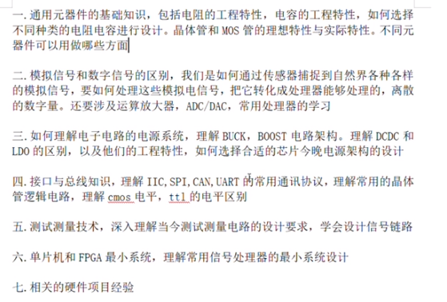
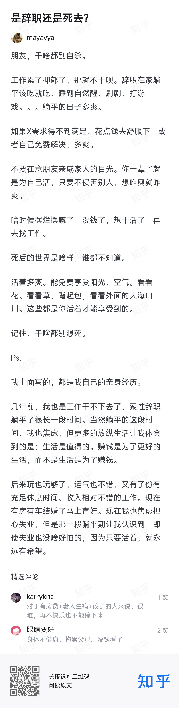
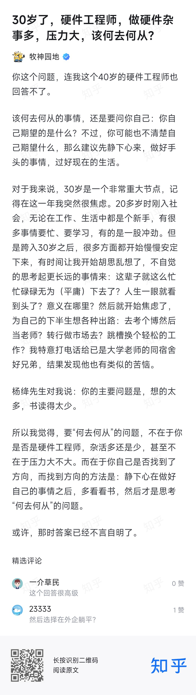
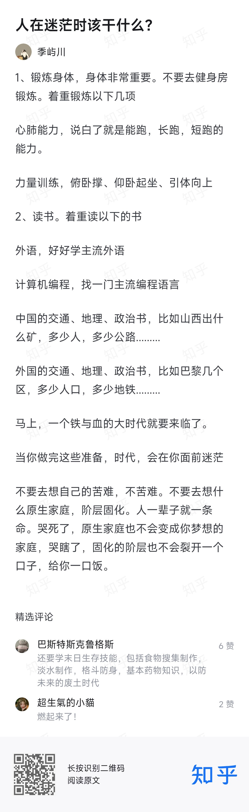

# 我的硬件之路

## 现状分析

1、个人技能：接触过很多的技能，但没有往某一方面深入过，项目经验严重缺乏。目前个人的技能优势就是单片机和硬件焊接这里，不过还是不够专注，也还是粗略知道一点点，没有形成一个整体的知识技能框架，实践与总结不够多。

2、学习能力：学习力还是老样子，三天打鱼两天晒网，学习不会捉本质，在一些细节、无关紧要的方面投入太多，就拿STM32单片机来说，学习的本质应该是单片机这个东西，而不是学某一款单片机的这些外设，应该随用随学，本质的共通的才是需要真正掌握的，比如如何快速应用一款单片机，这里面需要手册阅读能力与个人经验才能快速地上手。另外还容易分心他处，顾此失彼，白白耗掉精力，缺少了正反馈，就很容易导致自暴自弃，去舒适区逃避学习。

3、就业经验：才工作了两个月，没获得什么经验，得好好反思反思自己的问题，这才是最重要的收获。

4、控制力：差，容易放纵自己，该做什么不该做什么自己无法控制住，还是喜欢往舒适区跑，主要就是看这些短视频。

## 路线确立

### 总述

硬件为主，软件为辅，软件方面接触了这么多，是不能轻易放弃的，适当地回顾一下，做项目时也还是需要的。硬件，自己对于这方面的至少很匮乏，但还是得咬牙坚持去学，以成为能独立设计电路的工程师为目标。

硬件路线，不能再用学校的那种思维了，学校的思维是什么呢？就是从很基本的知识学起，全学完才去做实物，这是万万行不通的。目前的思维就是“边打战边学习”，在做项目的实现边补充基本知识，这里应该是两种学习路线，一边以实际项目为主，一边以基础知识为主，两边分开，最后寻求一个统一，将项目与基础知识给联系起来。

硬件学习路线①——电路设计、PCB、实物焊接、程序编写与烧录：

>总目标：原理图设计与PCB设计。总之，一切向原理图和PCB上面看齐，哪不懂的就去学，去搞懂，然后用在自己的PCB上面。能搞懂电路原理图上的东西，能进行PCB设计。
>
>①常用电子元器件。
>
>②EDA软件。
>
>③学习开源项目的电路与PCB设计。

硬件学习路线②——电路原理、模电、数电、高频电子、高数、信号与系统：

>总目标：电路原理、模电、数电、电源设计，高数、信号与系统、高频电子为提高阶段，主在基本的几门知识，先不要贪多。这里主要巩固的是自己的电路基本功，再结合路线①，从而做到理论与实践的结合，既要重理论也要重实践。
>
>至于学习资料，先学完电路原理，再去找其他，不要着急，更不要花太多的世界花在寻找学习资料上，现在网上的优质资料足够多了，不需要用太多的精力去筛选了，要花更多的精力在学习上。

### 行动

1、学习资料：

> ### 书籍：
>
> 电路原理、模拟电路、数字电路、电源设计（**《精通开关电源设计》**）、高速电路设计（**《高速电路设计实践》（王剑宇）**）、高数、信号与系统、**《HIGH-SPEED DIGITAL DESIGN》（Howard Johnson）**，俗称黑魔书
>
> >- 《晶体管电路设计》（铃木雅臣）
> >- 《你好，放大器》（杨建国）
> >- 《运算放大器权威指南》（译者姚剑清）
> >- 《新概念模拟电路》（ADI出品）
>
> **《EMC电磁兼容-设计与测试案例分析》（郑军奇）**。
>
> **《信号完整性分析》（Eric Bogatin著，李玉山译）、《于博士揭秘信号完整性》（于铮）**。
>
> ### 面试题目：
>
> 牛客网的题库 —— 通信/硬件。
>
> ### 免费教学课程：
>
> 一些大厂官网的视频课程。[这些视频课程，直接吹爆 - 知乎 (zhihu.com)](https://zhuanlan.zhihu.com/p/473889715)

2、学习路径：

>### ①电子元器件
>
>电子产品是由一个个电子元器件组成的，了解其特性、原理、学会选型，是基本功。
>
>### ②硬件开发工具
>
>Altium Designer、Tina。
>
>### ③仪器工具
>
>万用表、示波器、电源、电子负载等。
>
>### ④PCB设计和电路设计
>
>通过学习一些常见的常用的电路，来提高自己分析电路、读懂电路的能力，会看了，会模仿了，然后才能设计电路。
>
>### ⑤总线协议
>
>通信。
>
>### ⑥进阶

元件、工具、PCB设计和电路设计为一行动路径。

电路原理、模拟电路、数字电路为一行动路径。

面试题为一行动路径。

## 行动与反思

1. 电路原理、模电、数电。
2. AD、仿真软件。
3. C语言。

>**2024-01-18：**
>
>不要犹豫，尽管去做。不会？学就是了，不要想未来如何如何，尽享当下。

# 规划

## 2024

### 1.28~2.29

全力为3、4月的招聘旺季作准备。

目标：

- 软件：C语言、FreeRTOS、LVGL、常用数据结构和算法、STM32 hal&LL。（项目：OVwatch源码阅读与更改）
- 硬件：主要学画板先。AD（画一块STM32核心板，再画一块开发板）、Tian。电原（多理解总结归纳，适当做一些习题）、模电（理论→仿真→实物，多总结分析归纳）、数电。~~看书《电路基础》、《电路原理》、《实用电子元器件基础 第四版》。~~
- 学习方法：思维导图、联想回顾多重复。

顺序：

- 先全力去学电原、数电、模电，先搞定电原，然后是数电，然后就是模电。
- 开始软件的复习与学习，兼顾电原、模电、数电的复习。
- 开始画板子。
- 找面试题，准备简历。

### 3.01~4.01

边复习边投简历，使劲投递简历。

# 其他

思想内耗就是，被其他的消极想法占据了主导，而导致不能专注于当下，不能专注于解决当下的问题。

## 积极认真活着

## 何去何从

## 迷茫

