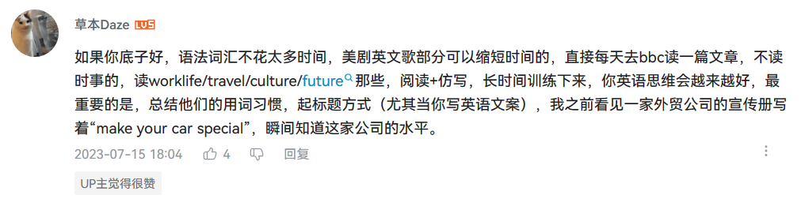

记单词：

- 最好要和生活相关。
- 要有意义，没有意义的事情做起来就没有动力。

没有学英文的必要性，那就不要学，否则徒增痛苦。学英语之前，必须要清楚自己为什么要学。

>好吧，记单词最好的方法是什么？不总结一下， 恐怕浪费了您的时间。
>
>1. **由简入繁；**
>2. **从易到难；**
>3. **不畏艰难；**
>4. **生活相关；**
>5. **多读多看；**
>6. **多听多想；**
>7. **别怕难堪。**
>
>记忆曲线/遗忘曲线大家都知道。遗忘曲线告诉您的东西就是死记硬背是一定会忘记的，要留住记忆就要不断地复习。 了解记忆曲线/遗忘曲线可以帮您卸下心理负担。遗忘是有好处的， 带来伤痛的东西， 咱们的大脑会选择抑制它。 背单词如果成了负担， 就会更快地被忘记。这是一个两难， 您要自己寻找平衡点。
>
>还有教育心理学的研究结果， 提示大家，知识的留存最好是通过交流（应用）来完成，尤其是相互教和学的时候。
>
>作者：麦文学
>链接：https://www.zhihu.com/question/310267600/answer/1392171003
>来源：知乎
>著作权归作者所有。商业转载请联系作者获得授权，非商业转载请注明出处。

《教父》、《剑桥英语词汇在用》、《双语译林：听美国之音学英文：科技·人文  [Great Voice from VOA: Science & Technology and Hum》、《新概念英语》 读&背。

# 雅思

>适合：英语基础一般的（up四级450）
>
>周期：两个月左右（up每天学习10小时）
>
>up推荐每部分要买的书：
>
>【听力】
>
>a)精听：王陆《雅思王听力》（b站有视频课）。
>up刷了五遍语料库，逐渐加速听，正确率基本 98%以上。
>up划重点：`章节3、4、5*、8、11*（*为重中之重）`
>
>b)真题：《剑桥真题4-16》up说可以最近的几本
>王路老师说的听力重点：1点听（听写文章中的名词或和名词词组）；2复数听写（听写文章中的复数名词）.
>up认为：精听最有用，坚持！（真题文章，每听一句话对应的写下来）
>
>【阅读】
>
>a)技巧：刘洪波《阅读真经》三本（b站有视频课）
>up提示：最开始可以慢慢做，但考前半月，严格掐表做题
>
>b)词汇：词汇量很重要，up用的扇贝背单词。
>up提示：检测词汇量是否够用的方式，就是看看雅思题干里的词汇是否都认识
>
>【写作】
>
>a)大作文up总结：不能套模板啦，要好好学！
>up推荐：b站杜仕明老师写作课
>
>b)小作文up总结：很重要，要好好学！
>up推荐：b站up`便便要变富`的视频——20分钟教会你写好小作文。
>up提示：关于作文付费批改，不改也行，有钱就改，特别是大作文。
>
>【口语】up：背历史题库里面的素材
>
>【up的心态建设】
>
>- 分不在高，够用就行
>- 集中备考，效率更高
>- 踏踏实实学，别想歪门邪道
>- 不用报班，学习要靠主观能动性

