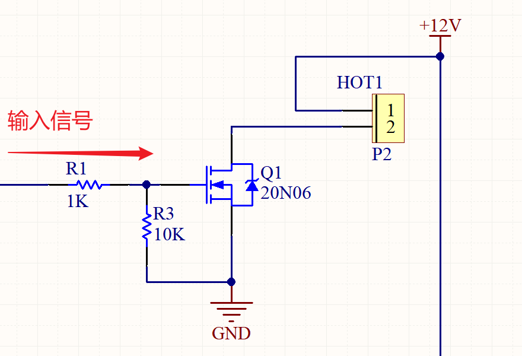
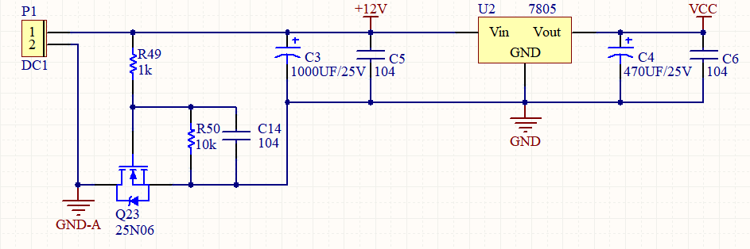

# MOS管

**MOS管应用 —— 开关控制电路：**

mos管在电路中一般用作电子开关，在开关电源中常用MOS管的漏极开路电路，漏极原封不动地接负载，叫开路漏极，开路漏极电路中不管负载接多高的电压，都能够接通和关断负载电流。MOS管是理想的模拟开关器件。

漏极开路电路，当输入信号为高电平时，P2的2引脚将会和GND导通，这样就形成一个回路，负载HOT1就能处于工作状态了。

**MOS管应用 —— 电源稳压电路防反接：**

# 滤波电容

**关于滤波：**

滤波电容：滤波电容的作用简单讲是使滤波后输出的电压为稳定的直流电压，其工作原理是**整流电压高于电容电压时电容充电，当整流电压低于电容电压时电容放电，在充放电的过程中，使输出电压基本稳定**。 滤波电容容量大，因此一般采用电解电容，在接线时要注意电解电容的正、负极。 电容滤波电路利用电容的充、放电作用，使输出电压趋于平滑。

滤波电容的选取：

- 电容对地滤波，需要一个较小的电容并联对地，对高频信号提供了一个对地通路，电源滤波中电容对地脚要尽可能靠近地，理论上说电源滤波用电容越大越好，一般大电容滤低频波，小电容滤高频波，可靠的做法是将一大一小两个电容并联，一般要求相差两个数量级以上，以获得更大的滤波频段。
- 电容的大小按电流流向应该是逐渐递减状态。

>### 详细解析电源滤波电容的选取与计算
>
>电感的阻抗与频率成正比，电容的阻抗与频率成反比。所以，电感可以阻扼高频通过，电容可以阻扼低频通过。二者适当组合，就可过滤各种频率信号。如在整流电路中，将电容并在负载上或将电感串联在负载上，可滤去交流纹波。  
>
>电容滤波属电压滤波，是直接储存脉动电压来平滑输出电压，输出电压高，接近交流电压峰值；适用于小电流，电流越小滤波效果越好。  
>
>电感滤波属电流滤波，是靠通过电流产生电磁感应来平滑输出电流，输出电压低，低于交流电压有效值；适用于大电流，电流越大滤波效果越好。电容和电感的很多特性是恰恰相反的。  
>
>一般情况下，电解电容的作用是过滤掉电流中的低频信号，但即使是低频信号，其频率也分为了好几个数量级。因此为了适合在不同频率下使用，电解电容也分为高频电容和低频电容（这里的高频是相对而言）。  
>
>低频滤波电容主要用于市电滤波或变压器整流后的滤波，其工作频率与市电一致为50Hz；而高频滤波电容主要工作在开关电源整流后的滤波，其工作频率为几千Hz到几万Hz。当我们将低频滤波电容用于高频电路时，由于低频滤波电容高频特性不好，它在高频充放电时内阻较大，等效电感较高。因此在使用中会因电解液的频繁极化而产生较大的热量。而较高的温度将使电容内部的电解液气化，电容内压力升高，最终导致电容的鼓包和爆裂。  
>
>电源滤波电容的大小，平时做设计，前级用4.7u，用于滤低频，二级用0.1u，用于滤高频，4.7uF的电容作用是减小输出脉动和低频干扰，0.1uF的电容应该是减小由于负载电流瞬时变化引起的高频干扰。一般前面那个越大越好，两个电容值相差大概100倍左右。电源滤波，开关电源，要看你的ESR(电容的等效串联电阻)有多大，而高频电容的选择最好在其自谐振频率上。大电容是防止浪涌，机理就好比大水库防洪能力更强一样；小电容滤高频干扰，任何器件都可以等效成一个电阻、电感、电容的串并联电路，也就有了自谐振，只有在这个自谐振频率上，等效电阻最小，所以滤波最好！  电容的等效模型为一电感Ｌ，一电阻Ｒ和电容Ｃ的串联， 电感Ｌ为电容引线所至，电阻Ｒ代表电容的有功功率损耗，电容Ｃ。 因而可等效为串联ＬＣ回路求其谐振频率，串联谐振的条件为WL=1/WC，W=2*PI*f，从而得到此式子f = 1/(2pi* LC)。，串联ＬＣ回路中心频率处电抗最小表现为纯电阻，所以中心频率处起到滤波效果。引线电感的大小因其粗细长短而不同，接地电容的电感一般是１ＭＭ为10nＨ左右，取决于需要接地的频率。  采用电容滤波设计需要考虑参数： ESR ESL 耐压值 谐振频率  那么如何选取电源滤波电容呢？ 电源滤波电容如何选取，掌握其精髓与方法，其实也不难  1、理论上理想的电容其阻抗随频率的增加而减少(1/jwc)，但由于电容两端引脚的电感效应，这时电容应该看成是一个LC串连谐振电路，自谐振频率即器件的FSR参数，这表示频率大于SFR值时，电容变成了一个电感，如果电容对地滤波，当频率超出SFR后，对干扰的抑制就大打折扣，所以需要一个较小的电容并联对地.原因在于小电容，SFR值大，对高频信号提供了一个对地通路。  所以在电源滤波电路中我们常常这样理解：大电容滤低频，小电容滤高频，根本的原因在于SFR(自谐振频率)值不同，想想为什么？如果从这个角度想，也就可以理解为什么电源滤波中电容对地脚为什么要尽可能靠近地了。  2、那么在实际的设计中，我们常常会有疑问，我怎么知道电容的SFR是多少？就算我知道SFR值，我如何选取不同SFR值的电容值呢？是选取一个电容还是两个电容？  电容的SFR值和电容值有关，和电容的引脚电感有关，所以相同容值的0402，0603，或直插式电容的SFR值也不会相同，当然获取SFR值的途径有两个： 1) 器件Data sheet，如22pf，0402电容的SFR值在2G左右 2) 通过网络分析仪直接量测其自谐振频率，想想如何测量S21？  知道了电容的SFR值后，用软件仿真，如RFsim99，选一个或两个电路在于你所供电电路的工作频带是否有足够的噪声抑制比。仿真完后，那就是实际电路试验，如调试手机接收灵敏度时，LNA的电源滤波是关键，好的电源滤波往往可以改善几个dB。  电容的本质是通交流，隔直流，理论上说电源滤波用电容越大越好。但由于引线和PCB布线原因，实际上电容是电感和电容的并联电路，(还有电容本身的电阻，有时也不可忽略)这就引入了谐振频率的概念：ω=1/(LC)1/2 在谐振频率以下电容呈容性，谐振频率以上电容呈感性.因而一般大电容滤低频波，小电容滤高频波。  这也能解释为什么同样容值的STM封装的电容滤波频率比DIP封装更高. 至于到底用多大的电容，这是一个参考电容谐振频率  电容值 DIP(MHz) STM(MHz) 10PF 800 1.6(GHz) 100PF 200 500 1000PF 80 160 0.01uF 25 50 0.1uF 8 16 1uF 2.5 5 不过仅仅是参考而已，老工程师说主要靠经验. 更可靠的做法是将一大一小两个电容并联， 一般要求相差两个数量级以上，以获得更大的滤波频段。  以上文章来源戳这里  看了这篇文章，也做个粗略的总结吧： 1. 电容对地滤波，需要一个较小的电容并联对地，对高频信号提供了一个对地通路。 2. 电源滤波中电容对地脚要尽可能靠近地。 3. 理论上说电源滤波用电容越大越好，一般大电容滤低频波，小电容滤高频波。 4. 可靠的做法是将一大一小两个电容并联，一般要求相差两个数量级以上，以获得更大的滤波频段。  滤波电容的选取原则 经过整流桥以后的是脉动直流，波动范围很大。后面一般用大小两个电容； 大电容用来稳定输出，众所周知电容两端电压不能突变，因此可以使输出平滑； 小电容是用来滤除高频干扰的，使输出电压纯净； 电容越小，谐振频率越高，可滤除的干扰频率越高；  容量选择 大电容，负载越重，吸收电流的能力越强，这个大电容的容量就要越大 小电容，凭经验，一般104即可 具体案例 1. AC220-9V再经过全桥整流后，需加的滤波电容是多大的？ 再经78LM05后需加的电容又是多大？  前者电容耐压应大于15V，电容容量应大于2000微发以上。 后者电容耐压应大于9V，容量应大于220微发以上。  2.有一电容滤波的单相桥式整流电路，输出电压为24V，电流为500mA，要求： （1）选择整流二极管； （2）选择滤波电容； （3）另：电容滤波是降压还是增压？  （1）因为桥式是全波，所以每个二极管电流只要达到负载电流的一半就行了，所以二极管最大电流要大于250mA；电容滤波式桥式整流的输出电压等于输入交流电压有效值的1.2倍，所以你的电路输入的交流电压有效值应是20V，而二极管承受的最大反压是这个电压的根号2倍，所以，二极管耐压应大于28.2V。 （2）选取滤波电容： 1、电压大于28.2V； 2、求C的大小：公式RC≥（3–5）×0.1秒，本题中R=24V/0.5A=48欧 所以可得出C≥（0.00625–0.0104）F，即C的值应大于6250μF。 （3）电容滤波是升高电压。  滤波电容的选用原则 在电源设计中，滤波电容的选取原则是： C≥2.5T/R 其中： C为滤波电容，单位为UF; T为频率， 单位为Hz R为负载电阻，单位为Ω  当然，这只是一般的选用原则，在实际的应用中，如条件(空间和成本)允许，都选取C≥5T/R。  滤波电容的大小的选取 PCB制版电容选择 印制板中有接触器、继电器、按钮等元件时。操作它们时均会产生较大火花放电，必须采用RC吸收电路来吸收放电电流。一般R取1~2kΩ，C取2.2~4.7μF。 一般的10PF左右的电容用来滤除高频的干扰信号，0.1UF左右的用来滤除低频的纹波干扰，还可以起到稳压的作用。  滤波电容具体选择什么容值要取决于你PCB上主要的工作频率和可能对系统造成影响的谐波频率，可以查一下相关厂商的电容资料或者参考厂商提供的资料库软件，根据具体的需要选择。至于个数就不一定了，看你的具体需要了，多加一两个也挺好的，暂时没用的可以先不贴，根据实际的调试情况再选择容值。如果你PCB上主要工作频率比较低的话，加两个电容就可以了，一个虑除纹波，一个虑除高频信号。如果会出现比较大的瞬时电流，建议再加一个比较大的钽电容。  其实滤波应该也包含两个方面，也就是各位所说的大容值和小容值的，就是去耦和旁路。原理我就不说了，实用点的，一般数字电路去耦0.1uF即可，用于10M以下；20M以上用1到10个uF，去除高频噪声好些，大概按C=1/f 。旁路一般就比较的小了，一般根据谐振频率一般为0.1或0.01uF。  说到电容，各种各样的叫法就会让人头晕目眩，旁路电容，去耦电容，滤波电容等等，其实无论如何称呼，它的原理都是一样的，即利用对交流信号呈现低阻抗的特性，这一点可以通过电容的等效阻抗公式看出来：Xcap=1/2лfC，工作频率越高，电容值越大则电容的阻抗越小。  在电路中，如果电容起的主要作用是给交流信号提供低阻抗的通路，就称为旁路电容；如果主要是为了增加电源和地的交流耦合，减少交流信号对电源的影响，就可以称为去耦电容；如果用于滤波电路中，那么又可以称为滤波电容；除此以外，对于直流电压，电容器还可作为电路储能，利用冲放电起到电池的作用。而实际情况中，往往电容的作用是多方面的，我们大可不必花太多的心思考虑如何定义。本文里，我们统一把这些应用于高速PCB设计中的电容都称为旁路电容。

