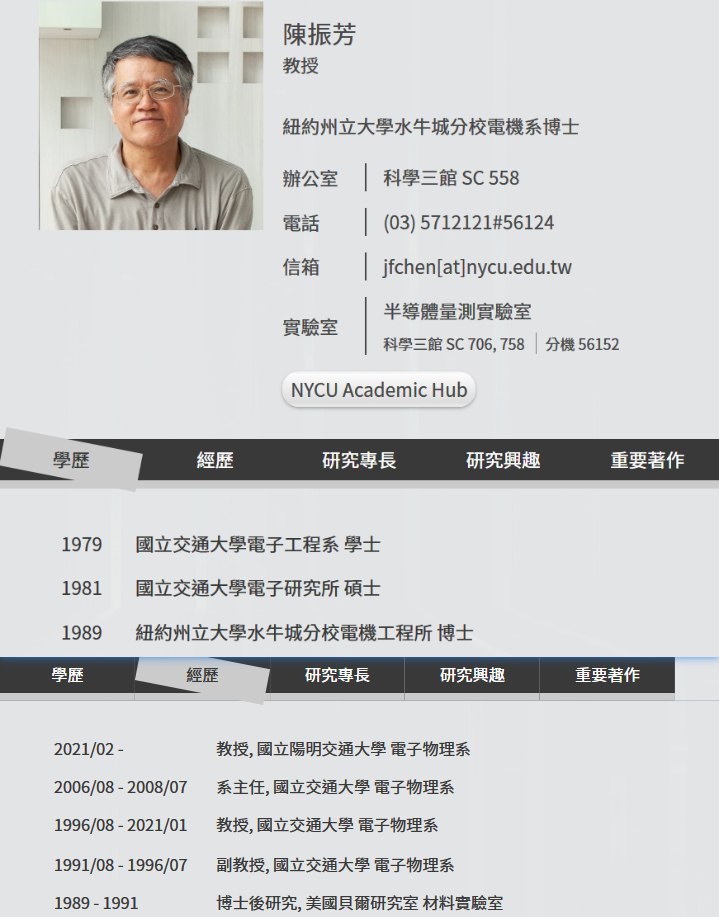

> 主讲：陳振芳 台湾国立交通大学
>
> 建议学习顺序：
>
> 1. 《电子学一、二》P20–34：MOS管工作原理
> 2. 《电子学一、二》P49–P60：单级放大器
> 3. 《电子学三》：除去BJT的所有部分
> 4. 《电子学一、二》P1-11：运放
>
> 《微电子电路》——Adel S. Sedra 、Kenneth C. Smith著；译者: 周玲玲 / 蒋乐天

# 一、电子学简介

amplifier：放大器；扬声器；扩音器。

distortion：失真；变形；扭曲；歪曲；曲解。

operating point：工作点，运行点；Q点（quiescent point，静止点，静态工作点）。

direct current（DC）：直流电。

alternating current（AC）：交流电。

# MOS管

# 单极放大器

# 除BJT外

# 运放

