# 数字电路

IC（Integrated Circuit），即集成电路，IC行业简单理解就是芯片行业/半导体行业。

模拟电路：用连续的模拟电压、电流值来表示信息。

数字电路：用离散的电压序列来表示信息。

>**各种各样的信号都可以表达信息（例如电信号的其它特性：电流、相位、频率等），为什么使用电压信号？**
>
>现在来分析电压信号的优点：
>
>1. 电压产生（电压发生器）、测量（测量仪）、分析（电压分析工具）容易。因为相关工具非常丰富。
>2. 电压值，可以产生低功耗。因为有电压存在，可以没有电流，故可以产生低功耗。而电流信号出现功耗一定存在。而数字电路选电压信号可以做到功耗几乎为0，这也是为什么现在集成电路的密度能做到这么高的原因。 
>3. 电压的缺点：容易受到环境的影响，例如远距离传输存在功耗，以及电磁的干扰等。离散的电压序列，则存在着冲击，因此变化需要快，但电压变化遇到RC环节则电压的变化就慢下来。但RC环节在电路中无处不在。
>
>作者：Aemon
>链接：https://zhuanlan.zhihu.com/p/548270227
>来源：知乎
>著作权归作者所有。商业转载请联系作者获得授权，非商业转载请注明出处。

数字电路分类：

- 电路结构特点和输入响应规则来分：组合逻辑电路、时序逻辑电路。
- 电路形式来分：集成电路、分立电路。
- 按器件不同来分：TTL电路（transistor transistor logic，晶体管-晶体管逻辑电路）、CMOS电路（场效应管）。

分析目的：根据电路确定输入、输出之间的逻辑关系，说明电路实现的逻辑功能。

分析工具：逻辑代数。

表述形式：真值表、逻辑图、逻辑表达式、卡诺图、波形图。

# 数制与码制

编码：事物的其它代表形式，特定编码对应着特定事物，**编码的目的就是将现实中的信息或事物转化进二进制世界中**。（编码的目的，就是为了用一种事物代表另一种事物）

数制：表示数量的规则，规定了数量的每一位的构成、低位向高位的进位规则。

码制：表示事物的规则，码制是编码要遵循的规则。

数制有十进制、二进制、八进制、十六进制。数的码制有原码、反码、补码、BCD码等。

Decimal：$(10)_{10} = (10)_{D}$

Binary：$(1011)_{2} = (1011)_{B}=(11)_{10}$

Octal：$(117)_{8} = (117)_{O}$

Hexadecimal：$(5EC)_{16} = (5EC)_{H}$

**1、原码、反码、补码**

原码：二进制表示，最高位表示符号位，0——正，1——负。

正数的原码、反码、补码都一样。

负数的反码为原码符号位不变，其余位取反；负数的反码为负数的补码加上1。

**2、各种码：**

BCD码：使用四位二进制数分别表示十进制数的0-9

- 8421 BCD码（掌握）：四位二进制数`xxxx`，表示十制数0~9。（Binary Code Decimal）
- 2421 BCD码：四位二进制数`xxxx`，最高位是2，依次到最低位是1。
- 5421 BCD码：四位二进制数`xxxx`，最高位是5，依次到最低位是1。
- 余3码：8421BCD码的基础上减去3来表示0-9。

格雷码（Gray码，又称循环码）。

8421奇偶校验码：添加数字1或0，使1的数量是奇数或者偶数，添加的这个数字就是校验码。

```c
// 如果是奇校验就检查1（包括校验码）是不是奇数；偶校验同理
0101    1       // 奇校验码
0101    0       // 偶校验码
```


# 逻辑代数基础

为组合逻辑电路和时序逻辑电路的设计打基础。

## 逻辑运算介绍

**与运算：**有0为0，全1为1。逻辑表达式形式——`F = A · B · C `或`F = ABC `，F为输出，A、B、C为输入；逻辑符号与真值表：

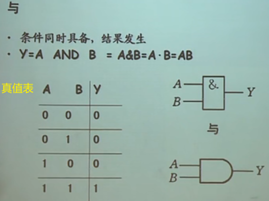

**真值表表示，罗列出所有情况。波形表示。卡诺图表示。逻辑符号表示。**

**或：**有1为1，全0为0。表达式——`F = A + B + C `。

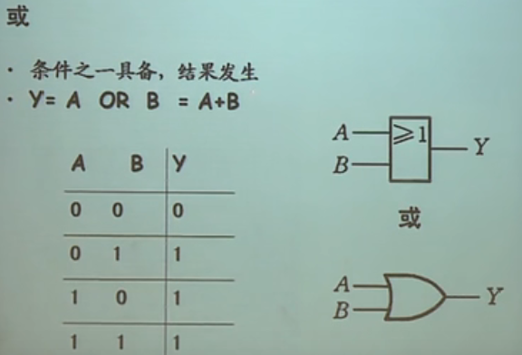

**非：$\overline{A}$**


**与非：**与之后再对结果非（$\overline{AB}$）。

**或非：**或之后再对结果非（$\overline{A+B}$）。

**与或非：**与后的结果再进行或运算，再对最后结果非。（$\overline{AB+CD}$）

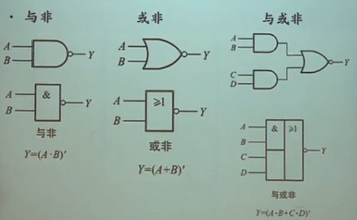

**异或：**相同为0，不同为1。（异为1，同为0）

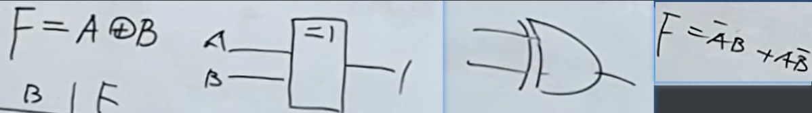

**同或：**相同为1，不同为0。$F=AB+\overline{A}\overline{B}$。（同为1，异为0）


## 定律与规则

目标：掌握基本定律、常用公式、三个重要规则（代入、反演、对偶）。

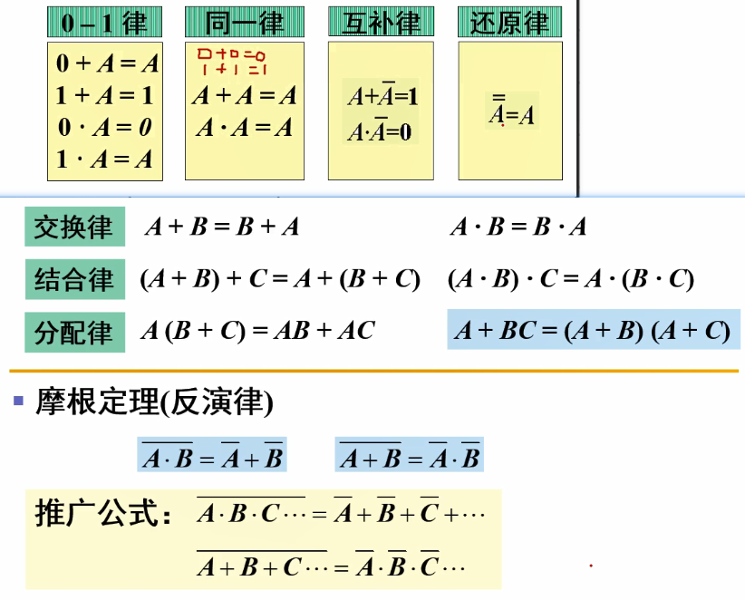

吸收律：$A+\overline{A}B = A + B$，$A(\overline{A}+B)=AB$。

反演律（摩根定律）：去掉头上的非的几个原则——1、原变量与反变量互换；2、0和1互换；3、与、或互换；4、保持原来的运算顺序。

公式集合：

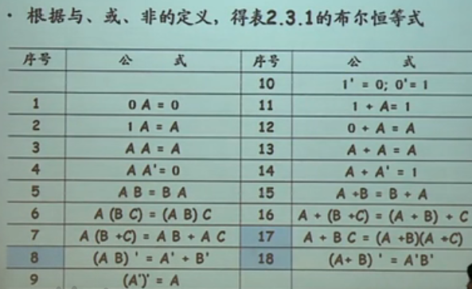


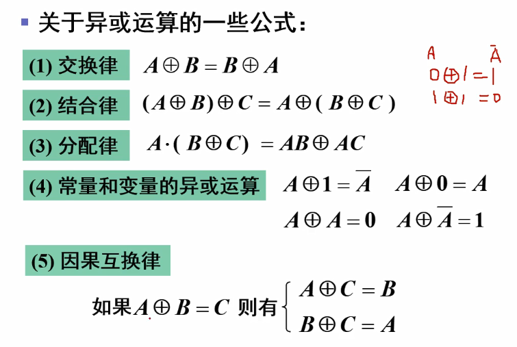

代入规则：任何一个包含A的等式中，若以另外一个逻辑式代入A的位置，等式依然成立。


反演规则——摩根定律：$Y → \overline{Y}$，与、或互换，0、1互换，原变量与反变量互换（只对单个变量），并保持原来的换算顺序不变。

对偶规则：对偶式就是原式中的与或互换后的式子。


逻辑函数的表示方法：真值表、逻辑式、逻辑图、波形图、卡诺图、EDA中的硬件描述语言。

真值表转为逻辑式：

1. 找出真值表中使输出为1的输入变量取值的组合。
2. 每组输入变量取值对应一个乘积项，取值为1的写原变量，为0的写反变量。
3. 将这些变量相加。

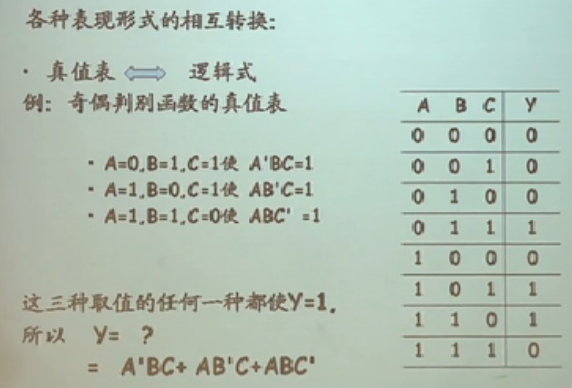

## 卡诺图化简法

**最小项：**最小项是与项——由n个变量构成的与项，与项当中出现的每一个因子要么是原变量出现、要么是反变量出现，并且只能出现一次。（n个变量，最多有$2^n$个最小项）(例如2个变量A、B，最小项有4种情况：$AB$、$\overline{AB}$、$\overline{A}B$、$A\overline{B}$。)

最大项：与最小项类似，只不过最大型的每一项都是或项，例如2个变量A、B，最大项有4种情况：$A+B$、$\overline{A}+\overline{B}$、$\overline{A}+B$、$A+\overline{B}$。

**编码**——将最小项用一些符号来表示：用m来指代最小项，m的数字下标来表示哪一项。（例如两个变量A、B的最小项编码：$AB$ — 11 — $m_3$、$\overline{AB}$ — 00 — $m_0$、$\overline{A}B$ — 01 — $m_1$、$A\overline{B}$ — 10 — $m_2$，也就是用1表示原变量、0表示反变量，按二进制数计算得到的值作为m的数字下标，要注意的是要设定好A是高位还是B是高位，一般以ABCDEF....的顺序来定高位）

**最小项的性质：**

1. 输入变量任一取值下，有且只有一个最小项值为1。
2. 所有最小项的值的和恒等于1。
3. 任何两个最小项之积为0。 $m_i*m_j=0$（`i != j`），$m_i*mi=m_i$。
4. 两个相邻的最小项之和可以合并，消去一对因子，留下公共因子。（相邻：两个最小项之中仅有一个变量不同）

**最小项表达式：**每一项都是最小项的表达式，任何表达式都可以化成最小项表达式且唯一。（例如：$L=A\overline{B}+A\overline{C}$ ===>  $L=A\overline{B}(C+\overline{C})+A\overline{C}(B+\overline{B})=A\overline{B}C+A\overline{B}\overline{C}+AB\overline{C}+A\overline{B}\overline{C}=A\overline{B}C+A\overline{B}\overline{C}+AB\overline{C}$，配项然后解开括号即可，编码后为$L_{ABC}=m_5+m_4+m_6=\sum m(4,5,6)$）	

**卡诺图：**以$2^n$个小方块分别代表n变量的所有最小项，并排列成矩阵，而且使几何位置相邻的两个最小项在几何位置上也是相邻的（只有一个变量不同谓之几何相邻），然后就得到表示n变量的卡诺图。

二变量卡诺图：

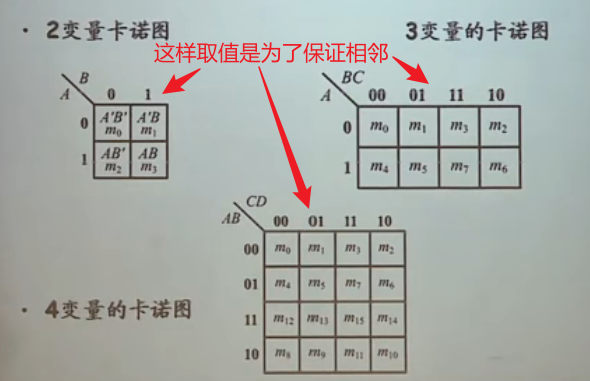

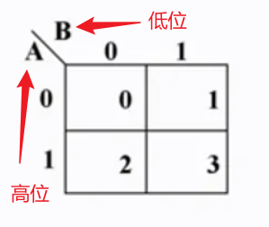

三变量卡诺图：


四变量卡诺图：

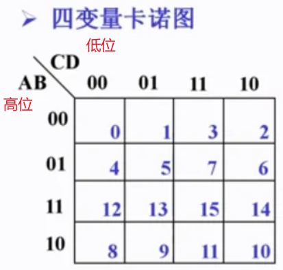

卡诺图中的相邻：除了内部的相邻，四边都是相邻的，例如$m_8$与$m_0$相邻。

五变量卡诺图：（卡诺图的局限性，不能有太多变量）（CDE列的规律：先列出000、001、011、010，然后对折过去并在每一位的最高位加上1即可）

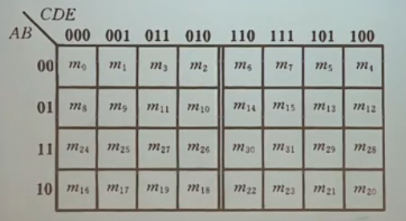

卡诺图表示逻辑函数：

1. 将函数表示为最小项之和的形式：$\sum m_i$。
2. 在卡诺图上与这些最小项对应的位置添入1，其余添加0。

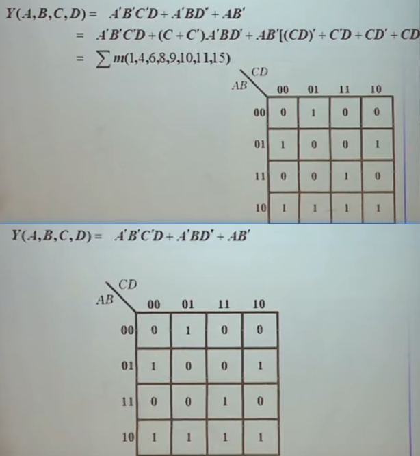

化简依据：具有相邻性的最小项可合并，消去不同的因子。

合并原则：

- 两个相邻的最小项可以合并为一项，消去一对因子。（$2^1$，一对）
- 四个排成矩形的最小项可以合并为一项，消去两对因子。（$2^2$，两对）
- 八个相邻的最小项可以合并为一项，消去三对因子。（$2^3$，三对）

化简步骤：

- 用卡诺图表示逻辑函数。
- 找出可合并的最小项。
- 化简后乘积项相加。（画圈：圈要少、圈要大（先少后大），可重复圈同一个（前提是这个圈内除了这个被圈的还有其他的没被圈过的圈进来））

画卡诺圈的规则：

1.  必须包含所有的最小项。
2. 按照“从小到大”顺序，先圈孤立的“1”．再圈只能两个组合的，再圈四个组合的……。
3. 圈的圈数要尽可能少 (乘积项总数要少)。
4.  圈要尽可能大 (乘积项中含的因子最少)。

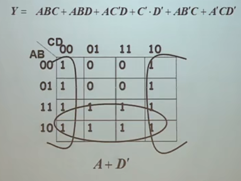

圈0后的表示$\overline{Y}$。

## 无关项


# 门电路—半导体二极管

高低电平代表逻辑。

获取高低电平的基本原理：（根据输入信号控制开关输出高、低电平信号。低电平→开关闭合则接地，高电平→开关端口接电源）


晶体二极管——PN结封装并引出电极，就构成二极管。

特性：单向导电性。二极管的开关特性。

电压大于某个值则认为是1，小于某个值则认为是0，其余的则为无效区（invalid，无效的）：

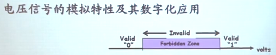

# CMOS

## CMOS反相器


