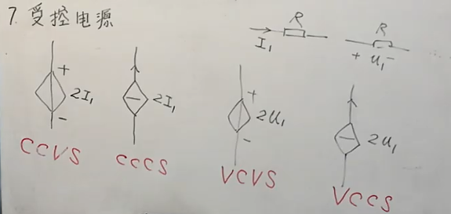
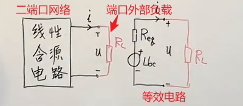

笨笨的我自学电路之路

# 自学概述

电路原理是入门电子世界的基本功夫，作为一个走了许多弯路迟迟没有找到个人方向的读了五年大学的有些失败的大学生，终于于跨过了迷茫期、焦虑期后，找到了自己所要前进的方向，那就是电子电路与嵌入式系统，此时无比热衷于设计电路与分析电路，看到别人做的精致的板子就两眼发光，想着去看懂里面的所有弯弯绕绕，但，我不懂电子啊，虽然做过一个STM32F103C8T6的系统板，但对里面的东西知之甚少，只能从庞大的互联网挖掘资源，才能去了解一些。那你大学里也有数电、模电、电路实验、电子实践啊，你怎么现在才想着搞电子啊，白花花的五年青春就这样被你丢了？嗯，算是吧，不得不承认我的整个大学生涯是非常失败的，啥靓丽的风景都没有，读了个大学，自己的心态反而乐观了，也不抱怨什么，不再去焦虑太多，也不去在意别人的看法了，也不去过多顾及别人的感受了。凡是过去，皆为序章，在2023-10-17，也就是农历九月初三这天，在此写下概述，开始了一条电子之路，从电路原理一路走过许多路！

我太笨，不知道怎么去学，又没有勇气去找人指教指教（哪有人肯指教嘛，问些属于是熟的人，一问就会被敷衍，太凄凉了，┭┮﹏┭┮。），只好去互联网上找些路子了。

电路原理，怎么学呢？嗯嗯，我先去找些学习资料吧。

看到有人推荐《电路分析导论》这本书的英文原版书，[Robert L.Boylestad](https://book.douban.com/search/Robert L.Boylestad)著的，英文原版哎，我个英语四级的菜鸡怎么看得下去，不管了，就当学英语了，学电路原理就看中译本的，再结合着英文版的一起看，嗯嗯，感觉很美好的样子，就这样决定吧。

光看一本书，这怎么能行呢，虽然我很菜，但我有野心啊，不对，应该是我乐观啊，看多几本应该也游刃有余，那我再去找一下。噢，找到了，汪建、汪泉老师的《电路原理教程》，还有人推荐于韵杰老师的网课，去B站看了一下，查“于韵杰”这三字，啥都查不出来，可能都被下架了，好在在A站找到了。

就用这些吧。

# 电路原理概述

电路：电气元件相互连接构成的电流的通路。

电路的目的：处理能量（电能的产生、传输、分配）、处理信号（电信号的获得、变换、放大）、同时处理信号和能量（天线、CPU、供电系统、智能电网等）。

电路分类——根据负荷性质分：

- 电阻电路（线性、非线性）。
- 动态电路（线性动态电路的时域分析、非线性动态电路的稳态分析（正弦激励、周期性非正弦激励））。

电路分类——根据电源性质分：

- 直流电路。
- 交流电路（正弦激励电路、周期性非正弦激励电路）。

电路原理：等效、抽象、守恒。（分析：复杂 → 简单）

这些知识是为了解决什么而发展出来的？理想情况下可以忽略掉许许多多的变化量，便于分析，但要注意理想的和实际的差别是很大的。

# 第一章：电路模型与电路定律

基础课的特点：

1. 要深刻理解一些概念。
2. 要多做些练习。

电路，重点就是学方法，当无论给你什么电路图，你都能分析出来，那你的电路理论就已经挺好的了。

## 电路模型

实际 → 抽象。将实际的电路抽象为更加简单的电路去分析。

在实际条件下，将实际的电路化为抽象的电路，便于分析。抽象时，在满足实际情况下，要尽可能地简单。

抽象出来的电路图，就是为了方便利用理论去分析实际电路的。对于复杂的电路，通过抽象，可以化繁为简，结合电路理论，方便分析。

## 参考方向

电路图上要有参考方向，电流的或电压的。

> 参考方向是一种假设方向，因为我不知道实际的电压或者电流的方向，这时就可以假设电流、电压的参考方向，然后再结合电路分析方法去分析，通过分析结果，就能判断出实际的电流、电压的方向。
>
> 比如解出来的电流是负的，那就表明实际的电流方向与参考方向相反，以此类推。

参考方向的必要性：参考方向是为了便于分析复杂的电路的，一些复杂的电路可能有多个电流源、电压源，不用测量工具的情况下，不经计算根本不知道实际的电流、电压的方向，这时就需要假定方向去分析了。

**注意：书中电路图所标方向都是参考方向。**

电路中参考方向的标示：

- ①通过箭头标示：导线或导线上方标示一个箭头。

- ②通过双下标标示：比如电路上标好a点、b点，然后$I_{ab}$，表示电流方向为 a → b，$U_{ab}$表示电压方向，a为正端、b为负端。

电压与电流的关联、非关联：电压参考方向与电流参考方向一致即关联，不一致即非关联。（关吸非发，关联的就是吸收功率，非关联的就是发出功率）

- 元件两端电压和流过它的电流，如果是同方向（电流方向和电压降方向一致）那就是关联参考方向，如果是反方向（电流方向和电压降方向相反）那就是非关联参考方向。

参考点：电位的参考点，表示地，该点电压为0。

## 独立电流源和电压源

源的理想模型：无内阻

- 流经独立电压源的电流由外部电路决定，可能是电流流出也可能是电流流入，或者电流为0。（独立电压源电压恒定不知电流流向，流过电压源的电流由外界决定）
- 独立电流源的电流是恒定的，不受外界影响，无论其两端电压是多少。（独立电流源电流恒定但不清楚其两端电压，其两端电压由外界决定）

一些结论：

- 理想电压源并上任何东西（电流源、电阻等，电压源除外）都对外部电路没有影响。（可以将并上的东西去掉，开路）
- 理想电流源串上任何东西（电流源除外），对外部电路的电流没影响。（可以将串上的东西看作是被短路的）

电气符号：

- 电压源：一个圆圈里面加一线条。（这个线条和导线重合）
- 电流源：一个圆圈里面加一线条。（这个线条和导线垂直）
- 受控电压源：菱形里面加一线条。（这个线条和导线重合）
- 受控电流源：菱形里面加一线条。（这个线条和导线垂直）

## 受控电源

受控源：其大小受其它电压或电流的大小所控制。受控电源是针对一些电子器件（例如晶体三极管、运算放大器等）而引入的理想电路模型。

四种受控源：

- 电流控制受控电压源。（流控电压源）
- 电流控制受控电流源。（流控电流源）
- 电压控制受控电压源。（压控电压源）
- 电压控制受控电流源。（压控电流源）

- CCVS：电流、控制、电压、源，流控电压源。以此类推。

## 基尔霍夫定律★

- 支路：部分电流流经的通路。
- 节点：三条或三条以上支路的交点。
- 回路：电流流通的闭合区域。
- 网孔：内部没有元件的回路。

基尔霍夫电流定律（KCL）：

- 应用于节点的。
- 内容：流进节点的电流等于从节点流出的电流。（节点数为n，KCL方程数为n-1）

基尔霍夫电压定律（KVL）：

- 应用于回路的。
- 内容：闭合回路中电压的代数和为0。（闭合回路中电压升之和等于电压降之和）
- 注意：根据回路列KVL方程时，要避开有电流源的回路。（电压升等于电压降）

 基尔霍夫定律是电路中电压和电流所遵循的基本规律，是分析和计算较为复杂电路的基础，既可以用于直流电路的分析，也可以用于交流电路的分析，还可以用于含有电子元件的非线性电路的分析。

## ~~电的相关基础~~

>电场：电场是电荷及变化磁场周围空间里存在的一种特殊物质，是客观存在的特殊物质，具有通常物质所具有的力和能量等客观属性。（带电体周围存在着由它产生的电场、变化的磁场中也会产生电场）
>
>- 电场的力的性质表现为：电场对放入其中的电荷有作用力，这种力称为电场力。
>- 电场的能的性质表现为：当电荷在电场中移动时，电场力对电荷做功，说明电场具有能量。
>
>电势：静电场的标势称为电势，或称之为静电势。（从能量的角度去描述电场，电势也被称为电位）
>
>- 定义：处于电场中某个位置的单位电荷所具有的电势能与它所带的电荷量之比。电势只有大小，没有方向。
>- 单位：伏特。
>
>电势能：电荷在电场中具有的势能。
>
>电势差：电场中两点之间的电势的差值，也叫电压。
>
>电场强度：表示电场强弱的物理量。从力的角度描述电场。

电流：电磁学上把单位时间里通过导体任一横截面的电荷量叫做电流强度，简称电流(Electric current)，电流符号为 I，单位是安培（A），简称“安”。电流即电荷的时间变化量。规定导体中正电荷的移动方向为电流的方向（导体中自由电子的移动形成电流，而正电荷是不会移动的，之所以这样规定，是历史的一个遗留问题）。

电压：$U$。电压（voltage），也被称作电势差或电位差，是衡量单位电荷在静电场中由于电势不同所产生的能量差的物理量。电压的方向为正电位指向负电位。

电位：指定是某点到某参考点的电压（参考点电压0）。$V$、$φ$。(φ，一箭斜穿一个圈)

功率、能量及损耗：

- 吸收功率：消耗能量的元件，吸收功率。
- 发出功率：提供能量的器件，发出功率。

欧姆定律 —— 线性电路：

- 电流定律：经过某元件的电流等于电压除以其电阻值。
- 电压定律：

注意：非关联的要加上负号。

# 第二章：电阻电路的等效变换

## 电路的等效变换

## 串并联

电阻的串联：总电阻等于各个电阻总和。（总电导等于各电导之和）

电阻的并联：总电阻的倒数等于各个并联电阻的倒数的和。

串联分压：$U_{a}=(R_{a}/(R_{a}+R_{b})U$。

并联分流：$I_{1}=(R_{2}/(R_{1}+R_{2}))I$。

## 混联和桥形连接

## Y-Δ以及它们的等效变换

Y形联结（星形联结、T形联结）和Δ形联结（三角形联结）之间在一定条件下可以相互等效。

若三角形联结的三个电阻相等都为R，那么等效出来的Y型联结的各个电阻为R的三分之一。

## 理想电流源、电压源的串、并联

电压源：

- 多个理想电压源串联起来可以等效于一个理想电压源，电压为各个电压源之和。
- 多个理想电压源在电压相等时才能并联，并联后等效为一个理想电压源，电压为并联前每一电压源的电压。（实际电压源的并联会导致电源环流，可通过加二极管解决环流问题）

电流源：

- 理想电流源并联可等效为一个理想电流源，电流为各个理想电流源的电流之和。
- 理想电流源在电流值相等时才能串联。串联后可等效为一个电流源。（实际电流源串联，会导致电流源内阻上产生高压，从而会导致系统被击穿）

## 实际电压源、电流源的等效

实际情况下，需要考虑源的内阻：

- 实际的电压源，可看作是一个理想电压源串上一个电阻。
- 实际的电压源，可看作是一个理想电流源并上一个电阻。
- 实际的电压源可以等效为实际的电流源，前提是对外电路有相同的VCR。

理想电压源串上一个电阻可以等效为理想电流源并上一个电阻，前提是这两个电源要对外电路有相同的VCR。

含受控源的转换：同理。

# 第三章：线性电阻电路一般分析方法

## 支路电流法

求解对象：各支路电流。

求解方法：列KCL方程和KVL方程，其中KVL方程中支路电压用支路电流表示，列出足够的独立方程后求解。

方程数：n个节点，b条支路，如果每一支路都有未知电流，那就需要列b条方程。能列n-1条KCL方程，需要列b-n+1条KVL方程。

网孔：由许多支路围成的小格子，并且这个格子中没有任何支路。网孔数为b-n+1。

## 网孔电流法

网孔电流法：以网孔电流为电路的变量来列方程的的方法，基于KVL，网孔电流法是支路电流法的升级版。使用网孔电流前先要标清楚网孔的网孔电流的方向。

公式：$自电阻*本网孔电流+\sum(\pm互电阻)*相邻网孔电流=\sum本网孔电压升$

自电阻：即本网孔中的所有电阻。自电阻永远都是大于0的。

互电阻：可看作是特殊的自电阻，互电阻是相邻网孔之间的电阻，是被共享的电阻。互电阻可能是正、负或者为零。

## 回路电流法★

与网孔电流法一样的方法，只不过不再仅仅局限于网孔，更加灵活和强大。

注意：

- 

## 节点电压法★

节点电压法是使用KCL推导出来的。对于支路多而节点少的电路使用节点电压来分析更加方便，许多分析电路的计算机程序也是使用该方法。

节点电压法：

- 设置一个电位参考点，参考点电位为0。（两节点的电压差是一致的，也就是说即使参考点实际电位不为0，但压差是不变的，这样求出来的电流也是符合实际的）
- 假设好节点电压，标好支路的电流的参考方向。
- 根据节点电压和参考电位算每一支路电流，列出KCL方程，就能求出各支路电流的一个节点电压和电导的表示式。
- 总结出节点电压的公式。

公式：$自电导*本节点电压-\sum互电导*相邻节点电压=\sum流入本节点的电流$（电流：指的是电流源或电压源直接流出的电流，如果节点与节点间、与参考电位间没有电流源或电压源，那么将流入该节点的电流看作是0）

- 自电导：与节点直接相连的电阻的电导。
- 互电导：特殊的自电导，指既与本节点相连也与其它节点相连的电阻的电导。

其它的一些特殊情况需要进行一定处理：

- 
- 

# 第四章：电路定理

## 叠加定理★

叠加定理：

>线性电阻电路中，各独立电源（电压源、电流源）共同作用时在任一支路产生的电流（任意两点间的电压），等于各独立电源单独作用时在该支路中产生的电流（该两点间的电压）的代数和。

源单独作用时：另外的电压源应该短路，当成导线；另外的电流源应该开路，断开。受控源留在电路中。

齐性定理：

>线性电阻电路中所有的电压源电压、电流源电流都同时增加或缩减K倍，那么电路中的各电压、电流都增加或缩减为原来的K倍。

## 替代定理

适用于线性和非线性电路，但有些特殊场合下不能使用。

## 戴维南定理★

戴维宁定理和诺顿定理都是关于**含有独立电源的线性二端网络**的等效电路的定理。

二端网络：仅有两端与外部电路相连，并且一个端口流入的电流等于另一个端口流出的电流。

戴维南定理：任一由独立电源和线性电阻组成的二端网络，其对外部的作用与一电压源与电阻串联的电路等效。如下图的等效：其实就是把网络内部等效为为负载提供电流的一个电路，因为端口电流输入输出一致，保证等效后的电路电流和原来的大小、方向一致即可，不会对外部电路有任何的影响。

计算等效电路的电压源电压和等效电阻：

- 先确立好端口，忽略端口所接外部电路，算出二端网络端口的开路电压。
- 从二端口视觉看二端网络内部，算出二端口网络内独立电源不作用时的电阻（这个电阻就是等效电阻，或者称为入端电阻）。（独立电源不作用：就是将电压源看作是短路、电流源看作是开路；如果是含有受控源的，使端口短路，求出短路电流，再通过开路电压除以短路电流得到等效电阻）

含受控源时的两种方法：

- ①求短路电流：往端口加导线使得端口处于短路状态，电路中的独立电源和受控源不能去掉，分析出通过端口的短路电流。求出短路电流后使用开路电压除以短路电流就可以得到等效电阻了。（无受控源时也可用）
- ②加压求流（加流求压）法：往端口加上一个独立电压源，然后端口网络的独立电源必须去掉（电压源短路、电流源开路），受控源保留，求出端口电流，再用加上的这个端口电压除以端口电流即得等效电阻。（加流求压同理，加上电流源，然后求出端口电压，再用端口电压除以端口电流即得到等效电阻）

如果电路中只有独立电源，算出的等效电阻一定是正的。如果含有受控源，等效电阻的数值可能是负的。

## 诺顿定理

诺顿定理：将二端口网络对外电路的作用等效为一个电流源并上一个电阻。

- 求出开路电压。
- 求出短路电流。
- 开路电压除以短路电流就是等效电阻。
- 电流源和等效电阻并起来构成等效电路的一部分。

## 最大功率传输定理

>### 百度百科：
>
>最大功率传输定理是关于负载与电源相匹配时，负载能获得最大功率的定理。定理分为直流电路和交流电路两部分。
>1、直流电路
>含源线性电阻单口网络($R_0>0$)向可变电阻负载传输最大功率的条件是：负载电阻与单口网络的输出电阻相等。满足条件时，称为最大功率匹配，此时负载电阻$R_L$获得的最大功率为：$P_{max}=U^2_{OC}/4R_{0}$。 
>2、交流电路
>工作于正弦稳态的单口网络向一个负载$Z_{L}=R_L+jX_L$供电，如果该单口网络可用戴维宁(也叫戴维南)等效电路(其中$Z_{0}=R_0+jX_0,R_0>0$)代替，则在负载阻抗等于含源单口网络输出阻抗的共轭复数（即电阻成份相等，电抗成份只数值相等而符号相反）时，负载可以获得最大平均功率$P_{max}=U^2_{OC}/4R_{0}$。这种匹配称为共轭匹配，在通信和电子设备的设计中，常常要求满足共轭匹配，以便使负载得到最大功率。 

## 特勒根定理

功率守恒。

特勒根定理

- 定理①功率平衡：
- 定理②拟功率定律：拓扑结构完全一样的电路图，它们之间的功率关系。

## 互易定理

## 对偶原理

# 第五章：含有运算放大器的电阻电路

# 第六章：储能元件—电阻和电感

电荷与带电粒子：电荷是物体的一种状态属性

>其实最合理的解释应该是：**电荷可以看作是一种带电粒子，自由电子是电荷的载体，就像物体是质量这一属性的载体一样，这些载体的运动才是形成电流的最本质的原因。电子只是一个载体，而真正具有效果的是电荷，这些电荷积累后面可以形成电场，从而能够推动电子运动。因此我们的教科书的理论，始终在说明电荷起作用，但根本没有说电荷为什么而起作用，教科书是对的，只是没有将电荷的本质说清楚，传递到位。**
>
>[电子基础理论(1)-学了十几年电子，到底什么是“电荷”？ - 知乎 (zhihu.com)](https://zhuanlan.zhihu.com/p/107057706)

> 在梁灿彬的教材中介绍过电荷的定义，电荷有两个概念：1. 带电体（对轻小物体有吸引作用的物体）；2. 电量：$F_库=kq$就是电量的定义（先找3个带电体a.b.c，把A带的电荷作为单位电荷，在距离r下测量A对C的库仑力F1，在距离r下测量B对C的库仑力F2，F2/F1定义为B的电量）

**在电磁学里，电荷是物质的一种物理性质，带正电的粒子叫正电荷，带负点的粒子叫负电荷，表名的是粒子具有的某种物理性质。**

电荷量：是对电荷这个物理性质的度量，电子所带电荷量为$e=1.602176634×10^{-19}$C。（注意：根据实验观测数据，实际产生的电荷量只能是电子电荷量的整数倍）

## 电容

**1、定义：**

**2、电压——电流的关系：**

**3、功率和储能：**

**4、串联：**串联的电容的总电容值为各电容的倒数的和的倒数。（类似于电阻并联）

**5、并联：**并联的电容的总电容值相当于各电容值之和。（类似于电阻串联）

## 电感

**1、定义：**

**2、电压——电流的关系：**

**3、功率和储能：**

**4、串联：**串联的电感的等效电感值相当于各电感值之和。（类似于电阻串联）

**5、并联：**并联的电感的等效电感值为各电感的倒数的和的倒数。（类似于电阻并联）

# 第七章：一阶电路的时域分析

## 名词解释

动态元件：**是指在一阶电路中，电压和电流的约束关系可以通过导数或积分来表达的电容元件和电感元件**。

动态电路：含有动态元件的电路，比如RC电路或RL电路。

一阶电路：在一个电路简化后（如电阻的串并联，电容的串并联，电感的串并联化为一个元件），含有一个动态元件的线性电路，其方程为一阶线性常微分方程，称为一阶电路。

二阶电路：含有两个独立的动态元件的线性电路，要用线性，常系数二阶微分方程来描述，故称为二阶电路。

过渡过程：原先的状态到另一个状态转变中间的这个过程。

## 换路定则和初始值

**1、换路定则：**

换路：当电路接通、断开、短路、或元件参数发生变化时，将引起电路工作状态的改变，这些情况统称为换路。

过渡过程产生的原因：换路瞬间，电路中的储能不发生突变。（也就是说储能元件存储的能量不可能一瞬间存储满或一瞬间释放完，储能元件的充能和释能都是需要一定时间的。比如当电容电流为有限值时，电容上的电压和电荷在换路瞬间是连续的而不会发生跃变）

分析电路动态过程，分析的是电路换路后的过程。

换路定则：在换路前后电容的电流和电感的电压为有限值的条件下，换路前后的电容的电压和电感的电流不能跃变，这种规律称为换路定则。（为有限值，即值不是无穷大，换路定则需要满足这个条件才成立）

换路定则用于帮助找出换路后电路的电流、电压初始值。（电容的电压初始值、电感的电流初始值）

**2、计算初始值：**

换路前的电路：

- 稳态电路：此时储能元件是已经都储满了能量的，不会有什么状态的变化。此时可将电容当开路、电感当导线来看待。

## RC电路的响应

1、RC电路的零输入响应：

2、RC电路的零状态响应：

3、RC电路的全响应：

## RL电路的响应

# 微积分

微积分：古典微积分和极限微积分。（古典微积分下的微分的意义为无穷小量）

导数（也叫微商）：**导数被定义为一个极限，**其意义就是**变化率**。当函数$y=f(x)$的自变量x在一点$x_0$上产生一个增量$Δx$时，函数输出值的增量$Δy$与自变量增量$Δx$的比值在$Δx$趋于0时的极限a如果存在，a即为在x0处的导数，记作$f’(x_0)或\frac{df(x_0)}{dx}$。

>导数是函数的局部性质。一个函数在某一点的导数描述了这个函数在这一点附近的变化率。如果函数的自变量和取值都是实数的话，函数在某一点的导数就是该函数所代表的曲线在这一点上的切线斜率。导数的本质是通过极限的概念对函数进行局部的线性逼近。导数值越大，说明变化率越大。

微分：函数的自变量出现微小的变化时，函数的因变量也会有对应的一个变化量，而微分就是指这个变化量，微小的变化量，微分一般是一个小常量。（微分是一个**线性函数**，其意义就是**变化的具体数值**）

>一个复杂的函数，自变量有微小的变化量，比如0.003，求函数的变化量是多少，也就是求函数的微分，微分就是微小的部分，微小的变化量；复杂函数意味着里面可能有$x^2,lnx,...$等很难计算的函数，所以通过导数求出微分，比如函数$y=x^2$，导数$\frac{dy}{dx}=2x$，$dy=2xdx$，$Δy=2xΔx$，在x=2时，代入Δx=0.003，就能计算出此时函数的微小变化量。
>
>作者：alphacalculus
>链接：https://www.zhihu.com/question/53159621/answer/133707294
>
>计算：x=2时，如果变化量为0.003，那x可能为2.003或者1.997，分别算出这两个自变量对应的y，即4.000009和3.988009，两者相减可得x=2、变化量为0.003时y的变化量为0.012（$dy=2xdx=2*2*0.003=0.012$）。

总结：导数是变化率的体现，微分是变化量的体现。

积分：积分是对量的极限累积，本质是对连续现象的求和，积分通常分为定积分和不定积分。（从一重定积分可看出，积分是对微分和函数的一个乘积的求和，实际意义为面的面积）

- 定积分：即有积分的上下限，积分的范围是限定了的。
- 不定积分：即无积分的上下限，不对积分的范围设限。

