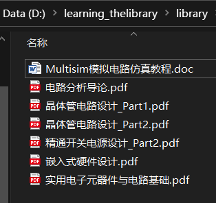
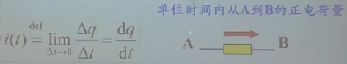
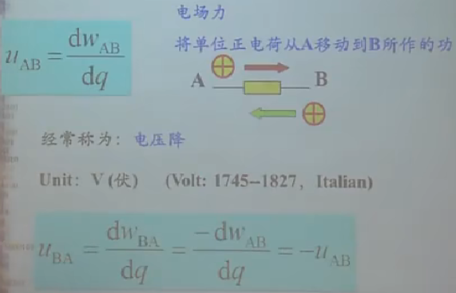
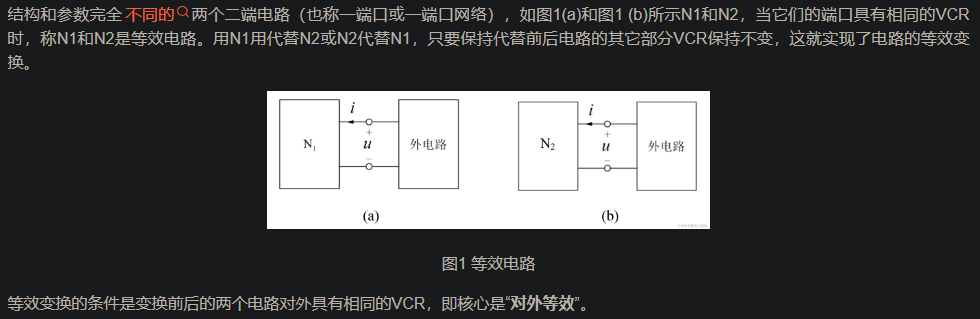
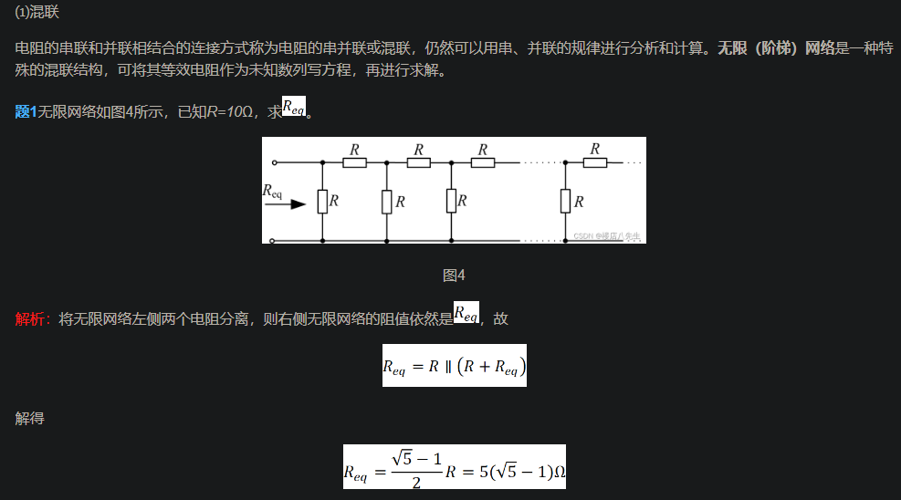
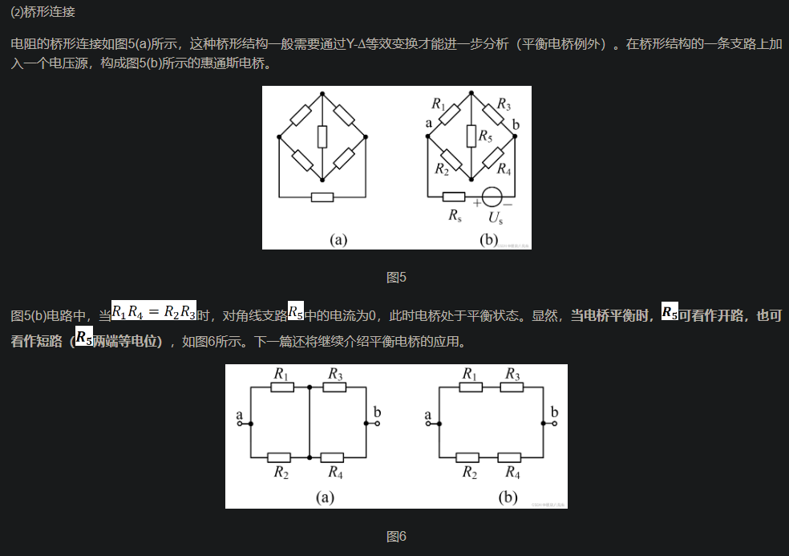
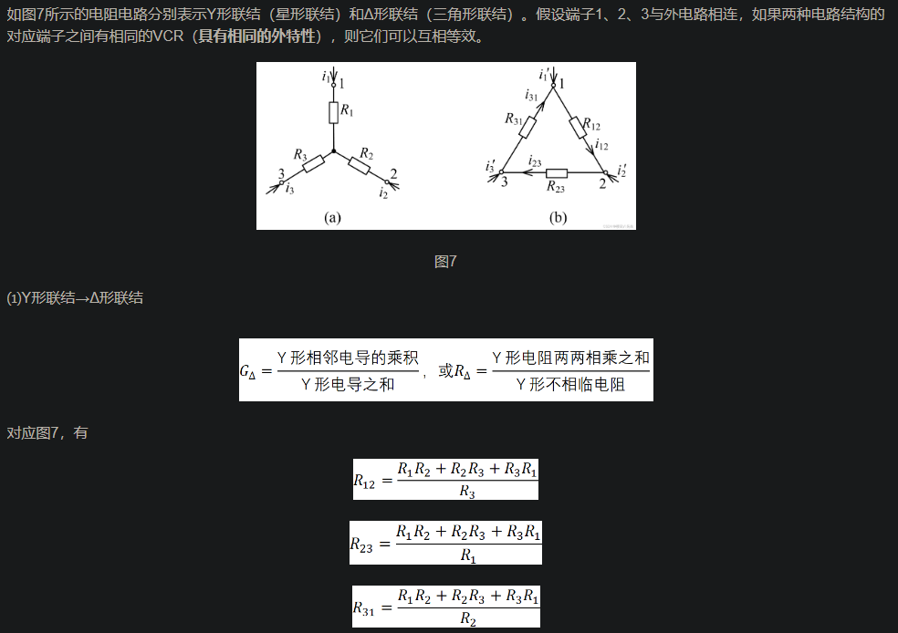
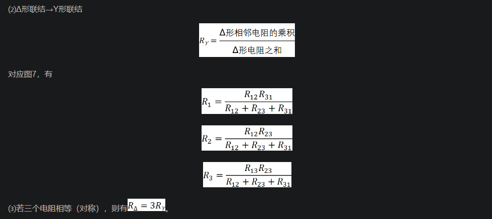

笨笨的我自学电路之路

# 自学概述

电路原理是入门电子世界的基本功夫，作为一个走了许多弯路迟迟没有找到个人方向的读了五年大学的有些失败的大学生，终于于跨过了迷茫期、焦虑期后，找到了自己所要前进的方向，那就是电子电路与嵌入式系统，此时无比热衷于设计电路与分析电路，看到别人做的精致的板子就两眼发光，想着去看懂里面的所有弯弯绕绕，但，我不懂电子啊，虽然做过一个STM32F103C8T6的系统板，但对里面的东西知之甚少，只能从庞大的互联网挖掘资源，才能去了解一些。那你大学里也有数电、模电、电路实验、电子实践啊，你怎么现在才想着搞电子啊，白花花的五年青春就这样被你丢了？嗯，算是吧，不得不承认我的整个大学生涯是非常失败的，啥靓丽的风景都没有，读了个大学，自己的心态反而乐观了，也不抱怨什么，不再去焦虑太多，也不去在意别人的看法了，也不去过多顾及别人的感受了。凡是过去，皆为序章，在2023-10-17，也就是农历九月初三这天，在此写下概述，开始了一条电子之路，从电路原理一路走过许多路！

我太笨，不知道怎么去学，又没有勇气去找人指教指教（哪有人肯指教嘛，问些属于是熟的人，一问就会被敷衍，太凄凉了，┭┮﹏┭┮。），只好去互联网上找些路子了。

电路原理，怎么学呢？嗯嗯，我先去找些学习资料吧。

看到有人推荐《电路分析导论》这本书的英文原版书，[Robert L.Boylestad](https://book.douban.com/search/Robert L.Boylestad)著的，英文原版哎，我个英语四级的菜鸡怎么看得下去，不管了，就当学英语了，学电路原理就看中译本的，再结合着英文版的一起看，嗯嗯，感觉很美好的样子，就这样决定吧。

光看一本书，这怎么能行呢，虽然我很菜，但我有野心啊，不对，应该是我乐观啊，看多几本应该也游刃有余，那我再去找一下。噢，找到了，汪建、汪泉老师的《电路原理教程》，还有人推荐于韵杰老师的网课，去B站看了一下，查“于韵杰”这三字，啥都查不出来，可能都被下架了，好在在A站找到了。

就用这些吧。

《电路原理教程》没找到电子版的，得去买实体书，没钱，不买了，先看完电路分析导论和网课，之后再说。

21:42了，有点晚了，先去洗澡了，明天再看看里面到底有些啥内容。

于韵杰的那个课太古董了，视频清晰度也不咋样，后面学完再回头看看。电路原理的视频教程，就看新手小牛老师的课了，比较新，对我这样的小白也比较友好，学慢一点，一步步啃下去。

 如何利用电路原理去分析实际的电路？

电路原理的学习方法？

# 电路原理概述

电路：电气元件相互连接构成的电流的通路。

电路的目的：处理能量（电能的产生、传输、分配）、处理信号（电信号的获得、变换、放大）、同时处理信号和能量（天线、CPU、供电系统、智能电网等）。

电路分类——根据负荷性质分：

- 电阻电路（线性、非线性）。
- 动态电路（线性动态电路的时域分析、非线性动态电路的稳态分析（正弦激励、周期性非正弦激励））。

电路分类——根据电源性质分：

- 直流电路。
- 交流电路（正弦激励电路、周期性非正弦激励电路）。

这个东西东西：是什么？做什么？怎么做？

# 第一章：电路模型与电路定律

基础课的特点：

1. 要深刻理解一些概念。
2. 要多做些练习。

电路，重点就是学方法，当无论给你什么电路图，你都能分析出来，那你的电路理论就已经挺好的了。

## 电路模型

实际 → 抽象。

在实际条件下，将实际的电路化为抽象的电路，便于分析。抽象时，在满足实际情况下，要尽可能地简单。

抽象出来的电路图，就是为了方便利用理论去分析实际电路的。对于复杂的电路，通过抽象，可以化繁为简，结合电路理论，方便分析。

将实际的电路抽象为更加简单的电路去分析。

## 参考方向

电路图上要有参考方向，电流的或电压的。

> 参考方向是一种假设方向，因为我不知道实际的电压或者电流的方向，这时就可以假设电流、电压的参考方向，然后再结合电路分析方法去分析，通过分析结果，就能判断出实际的电流、电压的方向。
>
> 比如解出来的电流是负的，那就表明实际的电流方向与参考方向相反，以此类推。

参考方向的必要性：参考方向是为了便于分析复杂的电路的，一些复杂的电路可能有多个电流源、电压源，不用测量工具的情况下，不经计算根本不知道实际的电流、电压的方向，这时就需要假定方向去分析了。

**注意：书中电路图所标方向都是参考方向。**

电路中参考方向的标示：

- ①通过箭头标示：导线或导线上方标示一个箭头。

- ②通过双下标标示：比如电路上标好a点、b点，然后$I_{ab}$，表示电流方向为 a → b，$U_{ab}$表示电压方向，a为正端、b为负端。

电压与电流的关联、非关联：电压参考方向与电流参考方向一致即关联，不一致即非关联。（关吸非发，关联的就是吸收功率，非关联的就是发出功率）

参考点：电位的参考点，表示地，该点电压为0。

## 独立电流源和电压源

源的理想模型：无内阻

- 流经独立电压源的电流由外部电路决定，可能是电流流出也可能是电流流入，或者电流为0。（独立电压源电压恒定，流过的电流由外界决定）
- 独立电流源的电流是恒定的，不受外界影响，无论其两端电压是多少。（独立电流源电流恒定，两端电压由外界决定）

一些结论：

- 理想电压源并上任何东西（电流源、电阻等，电压源除外）都对外部电路没有影响。（因为外部电路都是直接接到电压源两端，外电路两端电压一直不变。）
- 理想电流源串上任何东西（电流源除外），对外部电路的电流没影响。

电气符号：

- 电压源：一个圆圈里面加一线条。（这个线条和导线重合）
- 电流源：一个圆圈里面加一线条。（这个线条和导线垂直）
- 受控电压源：菱形里面加一线条。（这个线条和导线重合）
- 受控电流源：菱形里面加一线条。（这个线条和导线垂直）

## 受控电源

受控源：其大小受其它电压或电流的大小所控制。受控电源是针对一些电子器件（例如晶体三极管、运算放大器等）而引入的理想电路模型。

四种受控源：

- 电流控制受控电压源。
- 电流控制受控电流源。
- 电压控制受控电压源。
- 电压控制受控电流源。

## 基尔霍夫定律

- 支路：部分电流流经的通路。
- 节点：三条或三条以上支路的交点。
- 回路：电路中的闭合区域，电流流通的闭合区域。
- 网孔：内部没有元件的回路。

基尔霍夫电流定律（KCL）：

- 应用于节点的。
- 基尔霍夫电流定律（KCL）：流进节点的电流等于从节点流出的电流。（节点数为n，KCL方程数为n-1）

基尔霍夫电压定律（KVL）：

- 应用于回路的。
- 基尔霍夫电压定律（KVL）：闭合回路中电压的代数和为0。（闭合回路中电压升之和等于电压降之和）
- 注意：根据回路列KVL方程时，要避开有电流源的回路。（电压升等于电压降）

## ~~电的相关基础~~

>电场：电场是电荷及变化磁场周围空间里存在的一种特殊物质，是客观存在的特殊物质，具有通常物质所具有的力和能量等客观属性。（带电体周围存在着由它产生的电场、变化的磁场中也会产生电场）
>
>- 电场的力的性质表现为：电场对放入其中的电荷有作用力，这种力称为电场力。
>- 电场的能的性质表现为：当电荷在电场中移动时，电场力对电荷做功，说明电场具有能量。
>
>电势：静电场的标势称为电势，或称之为静电势。（从能量的角度去描述电场，电势也被称为电位）
>
>- 定义：处于电场中某个位置的单位电荷所具有的电势能与它所带的电荷量之比。电势只有大小，没有方向。
>- 单位：伏特。
>
>电势能：电荷在电场中具有的势能。
>
>电势差：电场中两点之间的电势的差值，也叫电压。
>
>电场强度：表示电场强弱的物理量。从力的角度描述电场。

电流：电磁学上把单位时间里通过导体任一横截面的电荷量叫做电流强度，简称电流(Electric current)，电流符号为 I，单位是安培（A），简称“安”。电流即电荷的时间变化量。规定导体中正电荷的移动方向为电流的方向（导体中自由电子的移动形成电流，而正电荷是不会移动的，之所以这样规定，是历史的一个遗留问题）。

电压：$U$。电压（voltage），也被称作电势差或电位差，是衡量单位电荷在静电场中由于电势不同所产生的能量差的物理量。电压的方向为正电位指向负电位。

电位：指定是某点到某参考点的电压（参考点电压0）。$V$、$φ$。(φ，一箭斜穿一个圈)

功率、能量及损耗：

- 吸收功率：消耗能量的元件，吸收功率。
- 发出功率：提供能量的器件，发出功率。

欧姆定律 —— 线性电路：

- 电流定律：经过某元件的电流等于电压除以其电阻值。
- 电压定律：

注意：非关联的要加上负号。

# 第二章：电阻电路的等效变换

## 电路的等效变换

## 串并联

电阻的串联：总电阻等于各个电阻总和。

电阻的并联：总电阻的倒数等于各个并联电阻的倒数的和。

串联分压、并联分流。

## 混连和桥形连接

## Y-Δ以及它们的等效变换

Y形联结（星形联结、T形联结）和Δ形联结（三角形联结）之间在一定条件下可以相互等效。

若三角形联结的三个电阻相等都为R，那么等效出来的Y型联结的各个电阻为R的三分之一。

## 理想电流源、电压源的串、并联

电压源：

- 多个理想电压源串联起来可以等效于一个理想电压源，电压为各个电压源之和。
- 多个理想电压源在电压相等时才能并联，并联后等效为一个理想电压源，电压为并联前每一电压源的电压。

电流源：

- 理想电流源并联可等效为一个理想电流源，电流为各个理想电流源的电流之和。
- 理想电流源在电流值相等时才能串联。串联后可等效为一个电流源。

## 实际电压、电流源的等效

实际情况下，需要考虑源的内阻。

- 实际的电压源，可看作是一个理想电压源串上一个电阻。
- 实际的电压源，可看作是一个理想电流源并上一个电阻。
- 实际的电压源可以等效为实际的电流源，前提是对外电路有相同的VCR。

理想电压源串上一个电阻可以等效为理想电流源并上一个电阻，前提是这两个电源要对外电路有相同的VCR。

含受控源的转换：同理。

## 输入电阻

# 第三章：线性电阻电路一般分析方法

## 支路电流法

求解对象：各支路电流。

求解方法：列KCL方程和KVL方程，其中KVL方程中支路电压用支路电流表示，列出足够的独立方程后求解。

方程数：n个节点，b条支路，如果每一支路都有未知电流，那就需要列b条方程。能列n-1条KCL方程，需要列b-n+1条KVL方程。

网孔：由许多支路围成的小格子，并且这个格子中没有任何支路。网孔数为b-n+1。

## 网孔电流法

网孔电流法：以网孔电流为电路的变量来列方程的的方法，基于KVL，网孔电流法是支路电流法的升级版。使用网孔电流前先要标清楚网孔的网孔电流的方向。

公式：$自电阻*本网孔电流+\sum(\pm互电阻)*相邻网孔电流=\sum本网孔电压升$

自电阻：即本网孔中的所有电阻。自电阻永远都是大于0的。

互电阻：可看作是特殊的自电阻，互电阻是相邻网孔之间的电阻，是被共享的电阻。互电阻可能是正、负或者为零。

## 回路电流法

## 节点电压法

使用KCL推导出来的。

# 第四章：电路定理

## 叠加定理

## 替代定理

## 戴维南定理

戴维宁定理。

## 诺顿定理

## 最大功率传输定理

## 特勒根定理

## 互易定理

## 对偶原理

​	

# 第五章：含有运算放大器的电阻电路

# 第六章：储能元件—电阻和电感

