# 二极管电路

[19 种典型二极管应用电路，电路图+工作原理，一文总结，快速搞懂_二极管保护电路](https://blog.csdn.net/luolt42/article/details/128811200)

## 二极管保护电路

### 反极性保护

**肖特基二极管常用于保护电路，如反极性电路，因为它的正向压降低**，下图为**常见的反极性电路。**

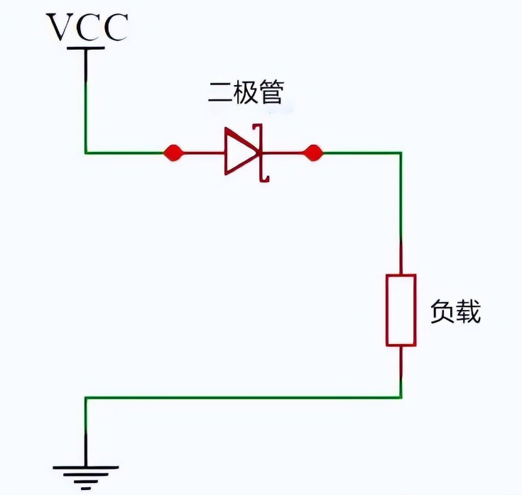

**当 Vcc 和地以正确的极性连接时，二极管正向传导，负载接收功率**。与整流二极管的 0.7V 相比，肖基特二极管上的正向压降在 0.04V 左右非常少，这样二极管上的功率损耗不会太大，而且肖特基二极管可以允许更多的电流通过它，还具有更快的开关速度，因此可以用于高频电路。

肖特基二极管：N型半导体和金属（金、银、铂等）连接形成金属-半导体结的一种二极管。其优点如下：

- 正向导通压降低：通常为0.2~0.3V。
- 恢复时间快：肖特基二极管由于存储的电荷量少，因此恢复很快，也就是说其可以应用于高速开关应用，能很快地切换状态。
- 结电容低。
- 高电流密度：肖特基二极管的耗尽区范围很小，几乎可以忽略不计，施加很小的电压就足以产生大电流。
- 产生噪声更小。
- 性能好：本身消耗功率很低，可满足低压应用。
- 反向电流较高：由于肖特基二极管是金属半导体结构，反接电压时更容易漏电流。
- 最大反向电压也较低。

肖特基二极管作用与应用：

>肖特基二极管具多有用的应用，从整流、信号调节、开关、电压钳位、太阳能电池到 TTL 和 CMOS 逻辑门，主要是因为它们的低功耗和快速开关速度。TTL 肖特基逻辑门由出现在其逻辑门电路代码中某处的字母 LS 标识，例如 74LS00。
>
>射频混频器和检波二极管
>肖特基二极管因其高开关速度和高频率能力而在射频应用中独树一帜。鉴于此，肖特基势垒二极管用于许多高性能二极管环形混频器。除此之外，它们的低开启电压和高频能力以及低电容使它们成为射频检测器的理想选择。
>
>功率整流器
>肖特基势垒二极管也用于大功率应用中，作为整流器。它们的高电流密度和低正向压降意味着与使用普通 PN 结二极管相比，浪费的功率更少。这种效率的提高意味着需要消散的热量更少，并且可以在设计中加入更小的散热器。
>
>电源或电路
>肖特基二极管可用于负载由两个独立电源驱动的应用。一个示例可以是主电源和电池电源。在这些情况下，一个电源的电源不能进入另一个电源是必要的。这可以使用二极管来实现。然而，重要的是要最小化二极管上的任何电压降以确保最大效率。
>
>与许多其他应用一样，鉴于其低正向压降，该二极管非常适合此应用。肖特基二极管往往具有较高的反向漏电流。这可能导致任何可能正在使用的传感电路出现问题。进入高阻抗电路的泄漏路径会导致错误读数。因此，这必须在电路设计中加以考虑。
>
>电压钳位/削波电路
>限幅器电路和钳位器电路通常用于波形整形应用。具有低压降特性的肖特基二极管可用作钳位二极管。
>
>反向电流和放电保护
>众所周知，肖特基二极管也被称为阻塞二极管，因为它阻止电流反向流动；可用作放电保护。例如，在应急闪光灯中，在超级电容器和直流电机之间使用了一个肖特基二极管，以防止超级电容器通过直流电机放电。
>
>采样保持电路
>正向偏置肖特基二极管没有任何少数电荷载流子，因此，它们可以比典型的 PN 结二极管更快地切换。因此使用肖特基二极管是因为它们从采样到保持步骤的转换时间较短，这会在输出端产生更准确的采样。
>
>太阳能电池
>肖特基二极管可以帮助最大限度地提高太阳能电池的效率，因为它们具有低正向电压降。它们还有助于保护电池免受反向充电。

### 二极管反向电流保护电路

与电源正极串联放置的二极管称为反向保护二极管，可以确保电流只能沿正向流动，并且电源仅向你的电路施加正电压。

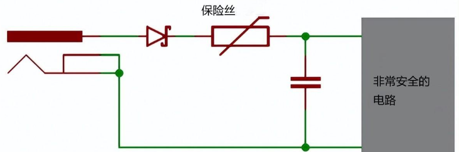

## 二极管整流电路

### 半波整流电路

仅将**交流信号的半波转换为直流信号的过程称为半波整流电路**，这种类型的整流是通过**只使用一个二极管来实现的，只留下一半信号。**

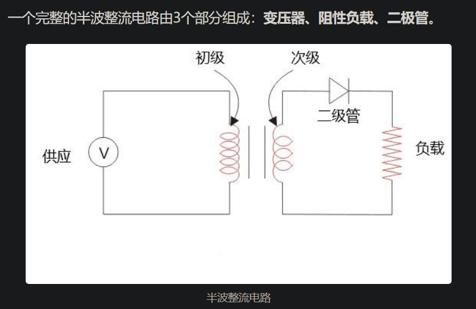

二极管的单向导通性，当交流电压正半周期时，导通；负半周期时，截止，电路相当于开路。半波整流波形如下：

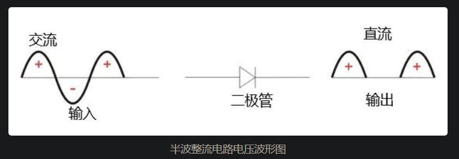

当然，改变二极管的方向，也可以得到负半波整流。

**半波整流电路参数与计算公式：**

>“纹波”是将交流电压波形转换为直流波形时剩余的不需要的交流分量。尽管我们尽最大努力去除所有交流分量，但在输出侧仍有少量残留物会产生直流波形的脉动。这种不受欢迎的交流分量称为“纹波”。
>
>为了量化半波整流器将交流电压转换为直流电压的能力，我们使用所谓的纹波系数（由 γ 或 r 表示）。纹波系数是整流器交流电压（输入侧）与直流电压（输出侧）的RMS值之比（均方根值之比）。
>
>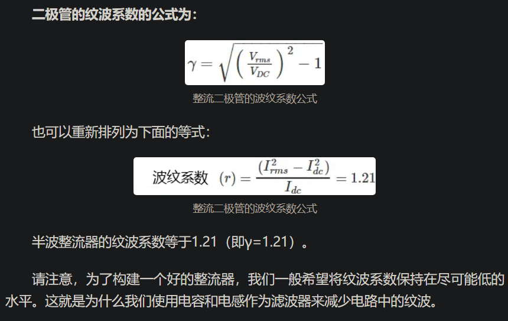
>
>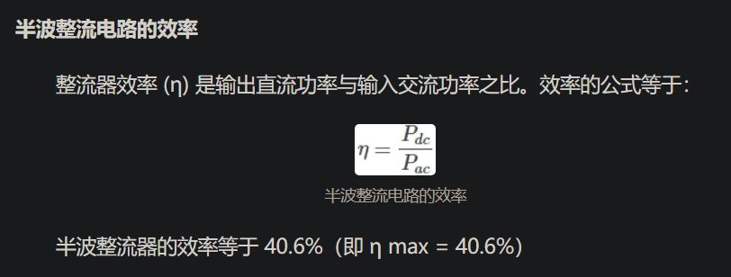
>
>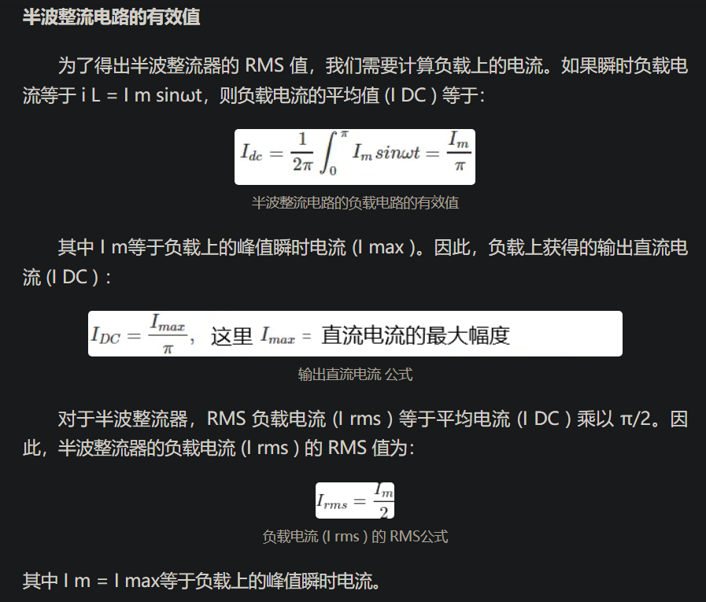
>
>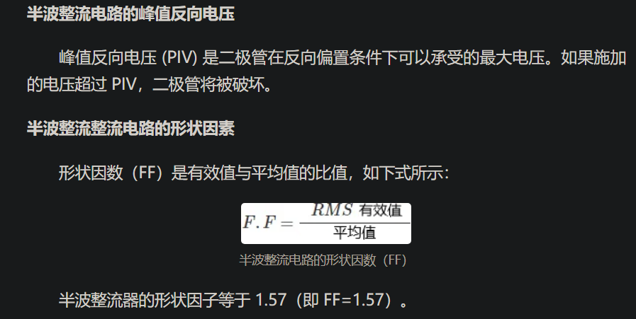
>
>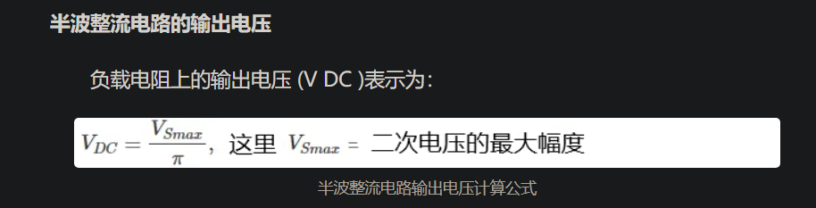

**应用：**

>虽然半波二极管整流电路基本上使用单个二极管，但二极管周围有一些电路差异，具体取决于应用。
>
>**电源整流**
>
>当用于电源整流时，半波整流电路如果要以任何方式为设备供电，则与变压器一起使用。通常在此应用中，输入交流波形是通过变压器提供的。这用于提供所需的输入电压。
>
>**AM解调**
>
>一个简单的半波二极管整流器可用于调幅信号的信号解调。整流过程使幅度调制得以恢复。当半波整流电路用于幅度调制检测时，该电路显然需要与收音机中的其他电路接口。
>
>**峰值检测**
>
>半波二极管电路通常用作简单的电压峰值检测器。通过在输出负载上放置一个电容，电容器将充电至峰值电压。如果 CR 网络、电容器和负载电阻的时间常数比波形周期长得多或足以捕获变化波形的峰值，则电路将保持电压峰值。

### 桥式全波整流电路

桥式全波整流电路，是全波整流电路中的一种，其主要优点为不需要特殊的中心抽头变压器。

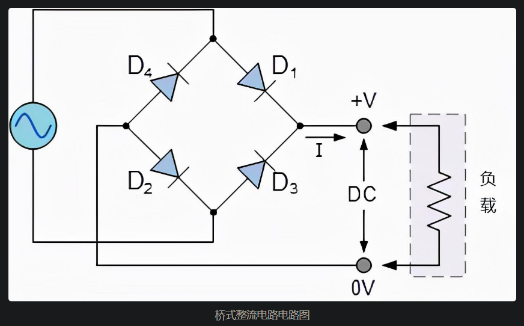

工作示意图如下：

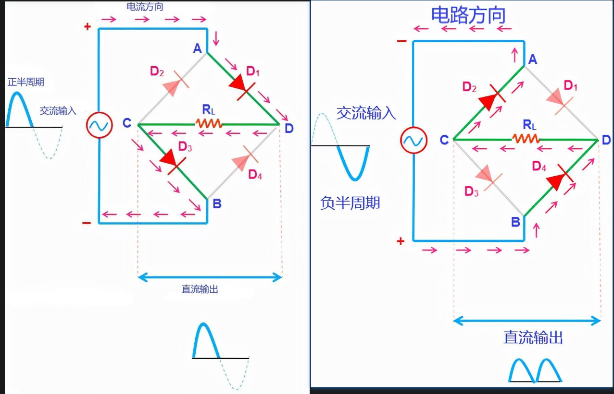

**桥式整流电路特性参数计算：**（桥式整流电路的主要参数包括以下几个：纹波系数、峰值反向电压 (PIV)、效率）

>**纹波系数**
>
>使用因子测量输出直流信号的平滑度称为纹波因子。这里，平滑的直流信号可以被认为是包括很少纹波的输出直流信号，而高脉动直流信号可以被认为是包括高纹波的输出信号。在数学上，它可以定义为纹波电压与纯直流电压的分数。
>
>对于桥式整流器，纹波因子的参数计算公式为：
>
>**Γ = √ (Vrms2/VDC)−1**
>
>桥式整流器的纹波系数值为0.48
>
>**PIV（峰值反向电压）**
>
>峰值反向电压或 PIV 可以定义为当二极管在整个负半周期内以反向偏置条件连接时来自二极管的最高电压值。桥式电路包括四个二极管，如 D1、D2、D3 和 D4。
>
>在正半周期中，两个二极管（如 D1 和 D3）处于导通位置，而 D2 和 D4 二极管均处于非导通位置。同样，在负半周，D2 和 D4 等二极管处于导通位置，而 D1 和 D3 等二极管处于非导通位置。
>
>**效率**
>
>整流器的效率主要决定整流器将AC（交流电）变为DC（直流电）的能力。整流器的效率可以定义为；它是 DC o/p 功率和 AC i/p 功率的比值。桥式整流器的最大效率为 81.2%。（输出的直流功率和输入的交流功率的比值）
>
>**η = DC o/p 功率/AC i/p 功率**

**桥式整流电路的分类：**

>桥式整流电路根据这些因素分为几种类型：电源类型、控制能力、桥式电路配置等。桥式整流电路主要分为单相和三相整流电路。这两种类型进一步分为非控制型、半控制型和全控制型整流电路。下面描述了其中一些类型的整流电路。
>
>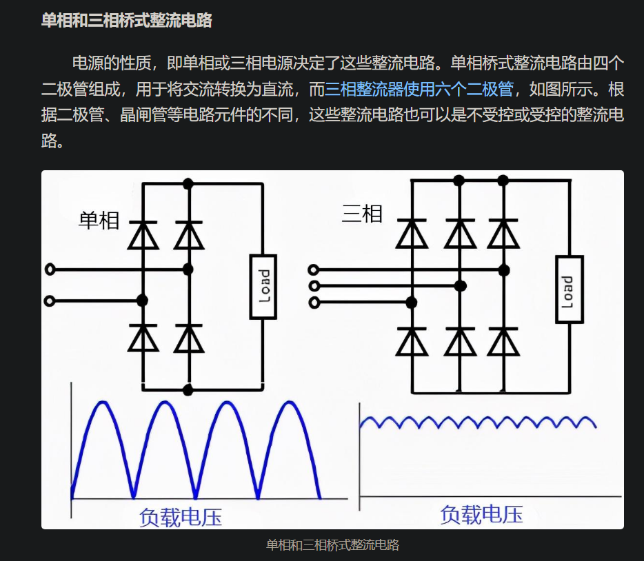
>
>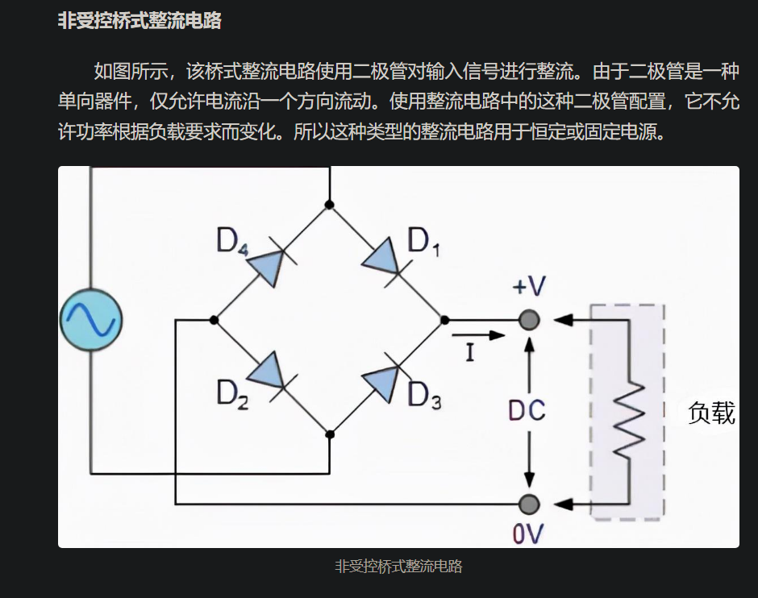
>
>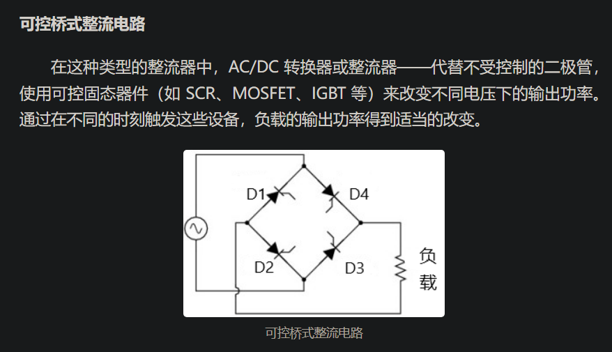

**注意事项：**

- 存在电压降。
- 计算发热量：**需要查阅桥式整流电路的二极管或整个桥式整流电路电子元件的datasheet，以查看设想电流水平的电压降。**电压降和通过整流电路的电流会产生热量，需要散热。
- 峰值反向电压不要超过桥式整流电路或单个二极管的峰值反向电压。

**桥式整流电路优缺点：**

>**优点：**
>
>- **输出直流信号中的低纹波：**桥式整流器的直流输出信号比半波整流器更平滑。换言之，与半波整流器相比，桥式整流器具有更少的纹波。但是，桥式整流器的纹波系数与中心抽头全波整流器相同。
>- **整流效率高**：与半波整流器相比，桥式整流器的整流效率非常高。但是，桥式整流器和中心抽头全波整流器的整流效率是相同的。
>- **低功耗**：在半波整流器中，只允许输入交流信号的一个半周期，而阻断输入交流信号的剩余半周期。结果，几乎一半的应用输入功率被浪费了。
>
>**缺点：**
>
>- 与中心抽头全波整流电路相比，功率损耗更大：在电子电路中，我们使用的二极管越多，电压降就会越大。桥式整流电路的功率损耗几乎等于中心抽头全波整流电路。然而，在桥式整流电路中，与中心抽头全波整流电路相比，电压降略高。这是由于两个额外的二极管（总共四个二极管）。在中心抽头全波整流电路中，每个半周期只有一个二极管导通，所以电路中的电压降为0.7伏。但在桥式整流电路中，两个串联的二极管在每个半周期导通。因此，电压降是由于两个等于 1.4 伏（0.7 + 0.7 = 1.4 伏）的二极管而发生的。但是，由于该电压降造成的功率损耗非常小。

## 二极管稳压电路

**稳压器：**用于将输入电压降低到所需的水平，并在电源波动的情况下保持不变，也可以用来调节输出电压。

**齐纳二极管：**通常用作电压调节器，因为它设计为在反向偏置条件下工作。当处于正向偏置时，它的行为就像一个正常的信号二极管。另一方面，当施加反向电压时，电压在很宽的电流范围内保持恒定。

在下面的电路中，输入电压可以在 0V 到 12V 之间变化，但输出电压永远不会超过 5.1V，因为**齐纳二极管的反向击穿电压（齐纳电压）为 5.1V，当输入电压低于 5.1V 时，输出电压将等于输入电压，但当超过 5.1V 时，输出电压将被调节为 5.1V。**

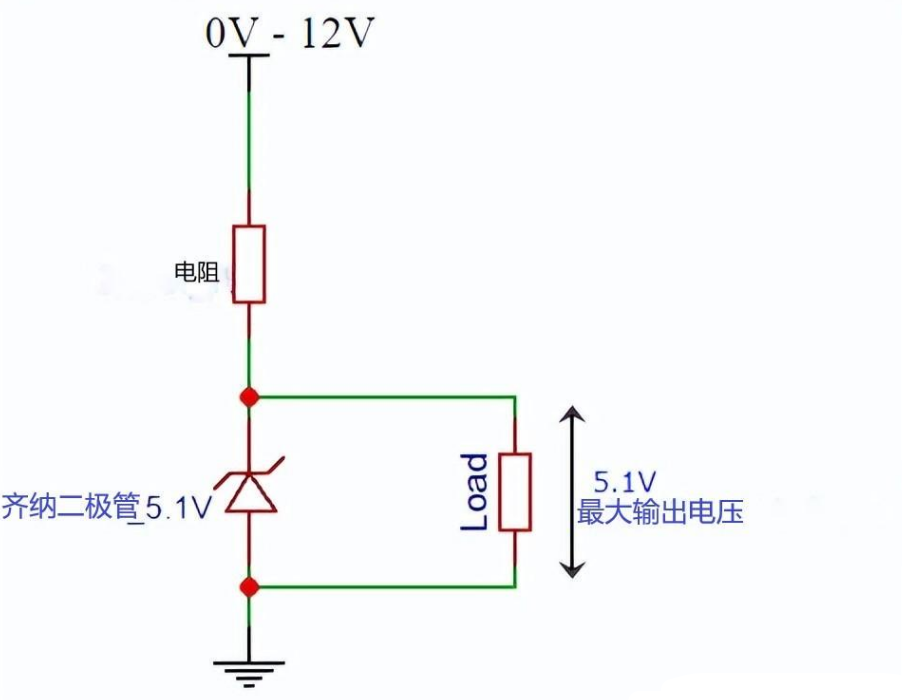

**该电路的这一特性可用于保护 5V 的 ADC 引脚（过压保护电路**），因为该引脚可以读取 0-5V 的电压，但如果超过 5V，齐纳二极管将不允许过压。同样，当输入电压很高时，可以使用相同的电路为负载调节 5.1V。但是这种电路的电流限制非常小。

在使用齐纳二极管设计电路时，要考虑的一件重要事情是齐纳电阻，**齐纳电阻用于限制通过齐纳二极管的电流，从而保护其免受加热和损坏，齐纳电阻的值取决于齐纳二极管的齐纳电压和额定功率。**

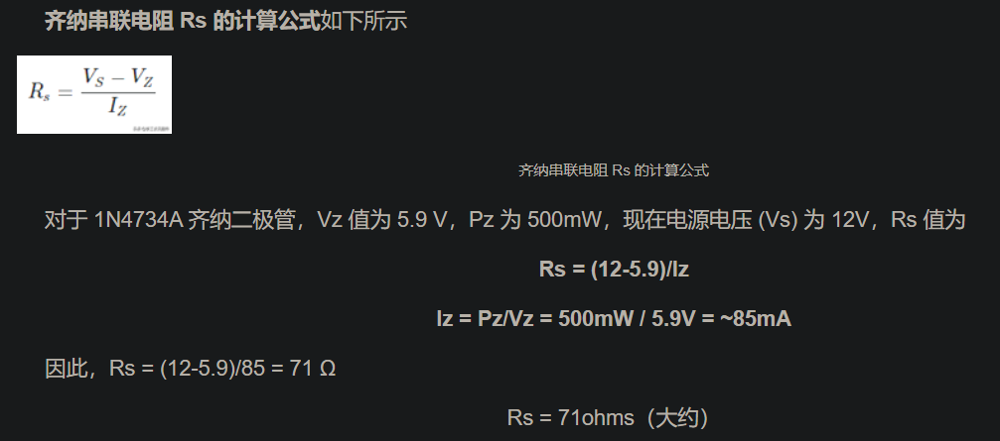

**齐纳二极管介绍：**

>齐纳二极管与普通二极管之间的区别主要有两点：
>
>- 1、**掺杂程度**，简单二极管是中度掺杂，**齐纳二极管是重掺杂，以实现更高的击穿电压。**掺杂程度的不同这有助于它们在不同电压水平下工作的规格。
>- 2、**导电情况**，由于齐纳二极管高掺杂，与简单二极管的PN结相比，齐纳二极管PN结的耗尽层很薄，这为齐纳二极管提供了特殊的特性，在**正向和反向偏置条件下都可以导电。**
>
>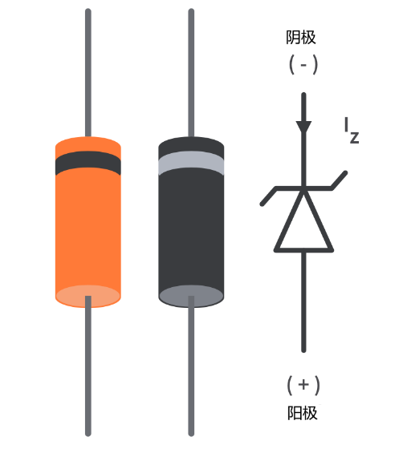
>
>齐纳二极管工作原理：齐纳二极管在正向偏置时的作用类似于普通二极管。然后，一旦反向电压等于其额定电压，就会允许电流反向流动。
>
>击穿工作的齐纳二极管充当电压调节器，因为它在指定的反向电流值范围内跨其端子保持几乎恒定的电压，该电压等于齐纳电压。
>
>反向偏置特性：普通二极管在反向偏置模式下工作时，不会有电流流过。在这种情况下，大量电子流可能会损坏二极管。然而，在齐纳二极管中，由于PN结的薄耗尽层产生的强电场而发生齐纳击穿。发生齐纳击穿的电压称为**VZ**（齐纳电压）。根据应用和电压要求，生产的齐纳二极管具有不同级别的齐纳电压。一旦发生齐纳击穿，反向电压的进一步增加不会导致任何进一步的电压下降，并且在一定的电压水平上保持恒定，直到发生雪崩击穿。
>
>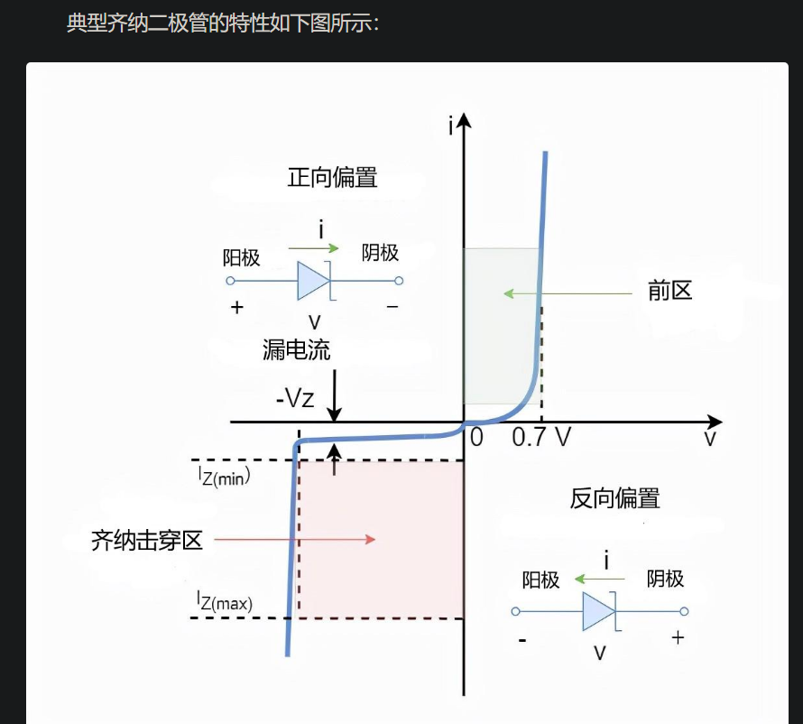
>
>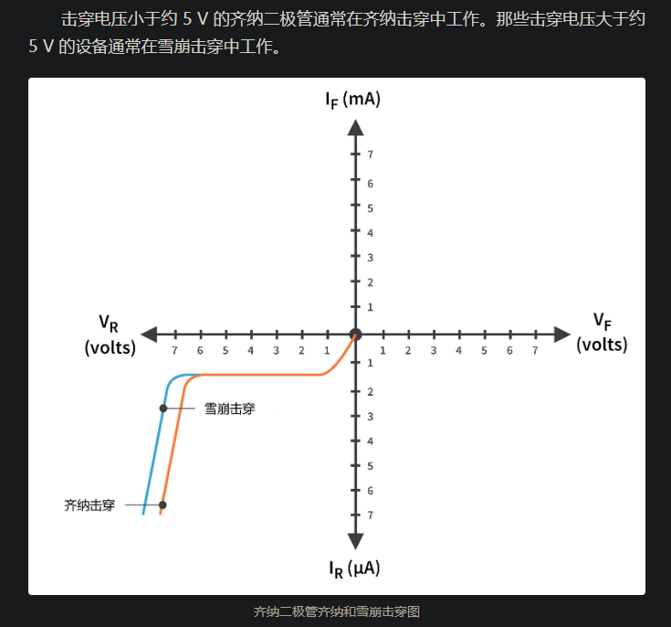
>
>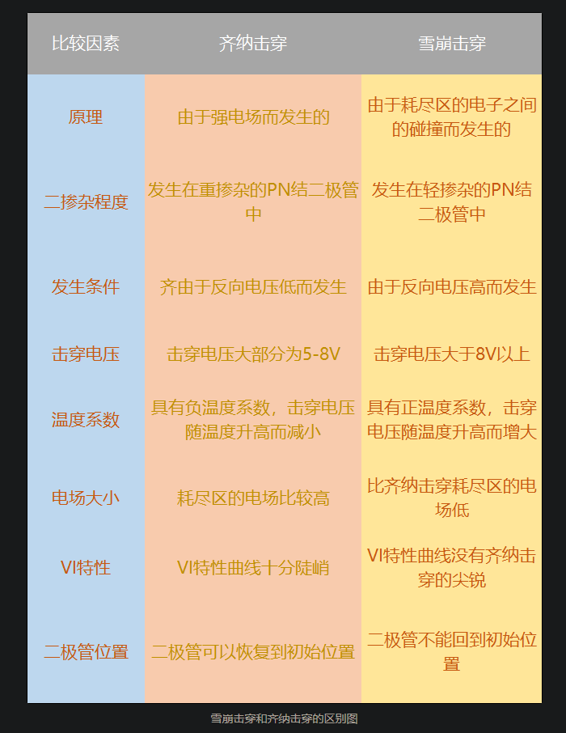
>
>齐纳二极管要注意的参数：
>
>- 齐纳定压（Vz）（也叫击穿电压）：使齐纳二极管导通电流的反向偏置电压。
>
>- 最大电流（Iz-max）：Iz-max 是在反向击穿电压下可以流过齐纳二极管的最大电流。它的范围从 200μA 到 200A。Iz-max 可以使用公式$Iz=Pz/Vz$来计算，其中 Pz 是二极管可以处理的最大功率，Vz 是反向击穿电压。
>
>- 最小电流（Iz-min）：Iz-min 是导致齐纳二极管击穿所需的最小电流量。它的范围从 5mA 到 10mA。
>
>- 测试电流（IZ）：对于每个齐纳二极管，齐纳电压 (VZ ) 是在指定的齐纳测试电流 (IZ ) 下测量的。 例如，1N4732A 的齐纳电压范围为 4.465 至 4.935V，典型值为 4.7V，测试电流为 53mA。
>
>- 拐点电流（IZK）：保持二极管击穿电压调节所需的最小电流。1 瓦齐纳二极管的典型值约为 0.25 至 1mA。如果未达到此电流，二极管将无法充分击穿以维持其额定电压。
>
>- 漏电流：反向漏电流是针对小于拐点电压的反向电压指定的。这意味着齐纳二极管对于这些测量没有反向击穿。例如，1N4728A 中的反向电压为 1V。
>
>- 额定功率（Pz）：额定功率是齐纳二极管可以安全耗散的最大功率。齐纳二极管常用的额定功率包括 400 mW、500mW、1mW、3mW 和 5mW。具有高额定功率的齐纳二极管通常很昂贵，并且它们需要额外的设备来去除多余的热量。齐纳二极管的最大功耗 (Pzm) 可以通过给定的公式计算，$P_{zm}=I_z*V_z$，其中Iz 是可以流过齐纳二极管的最大电流，Vz 是齐纳击穿电压。
>
>- 齐纳电阻（ZZ）：齐纳电阻或齐纳阻抗是齐纳二极管为电流提供的总电阻。齐纳电阻从反向 VI 特性图中也很明显，因为它不是完全垂直的，因此对于齐纳二极管两端电压的微小变化，电流会发生轻微变化，而这种电压相对于电流是齐纳二极管提供的电阻。理想情况下，它应该为零，但每个齐纳二极管都提供一定量的齐纳电阻。齐纳二极管的齐纳阻抗由下式计算：
>
>  $R=V_i-V_z/I_z$，其中Vi是输入电压，Iz是通过齐纳二极管的电流，Vz是齐纳击穿电压。
>
>- 齐纳二极管容差：纳二极管的容差被定义为接近击穿电压的电压范围，在该范围内齐纳二极管在反向偏置中传导电流。在制造稳压二极管的过程中，同一种稳压二极管的掺杂浓度可能会略有不同，这意味着它们的击穿电压也有细微的差别，因此同一种稳压二极管在不同的反向击穿电压值下会导通反向电流，而齐纳击穿电压的这个范围称为它们的容差。通常，齐纳二极管的电压容差为±5%。
>
>- 结温：为了保证二极管的可靠性，二极管结温是关键。即使外壳可能足够冷，活动区域仍然可能非常热。因此，一些制造商指定了结本身的工作范围。对于正常设计，通常在设备内的最大预期温度和结之间保留适当的余量。设备内部温度将再次高于设备外部温度。尽管设备外部的环境温度可以接受，但必须注意确保单个物品不会变得太热。
>
>- 温度系数（TC）：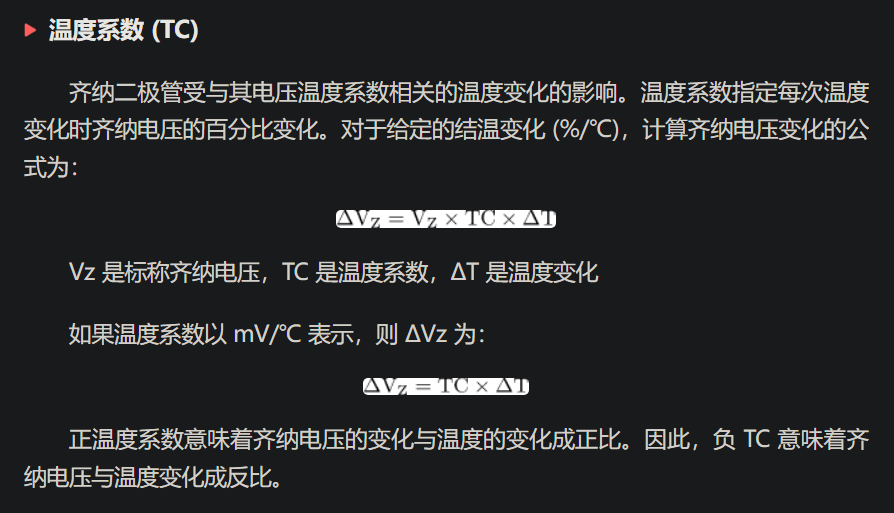

**齐纳二极管功能：**

- 电压参考。
- 稳压器。
- 过压保护。
- 限幅。
- 浪涌抑制。

>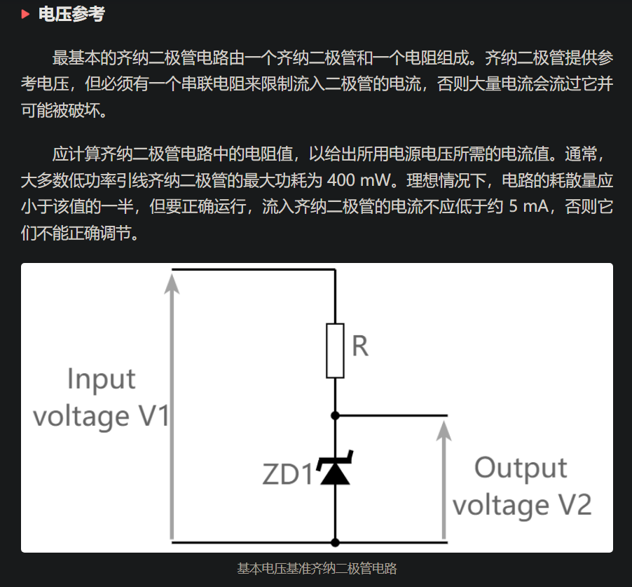

>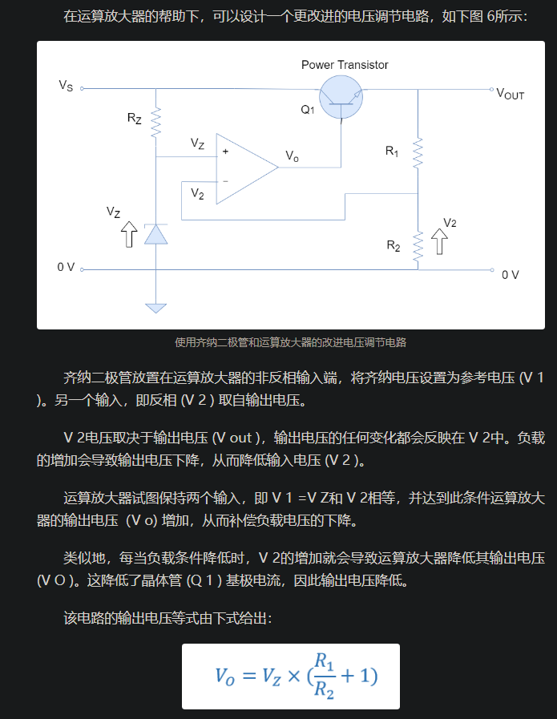
>
>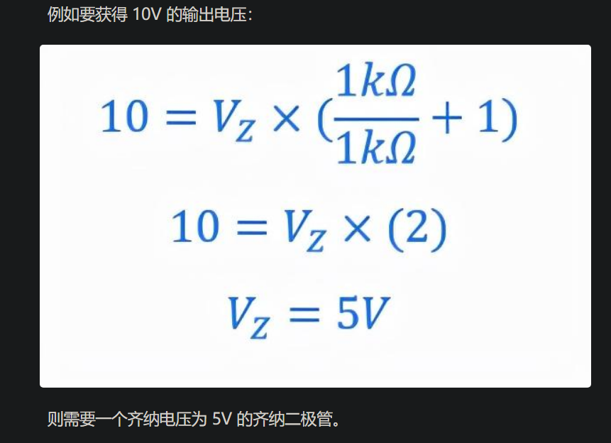

>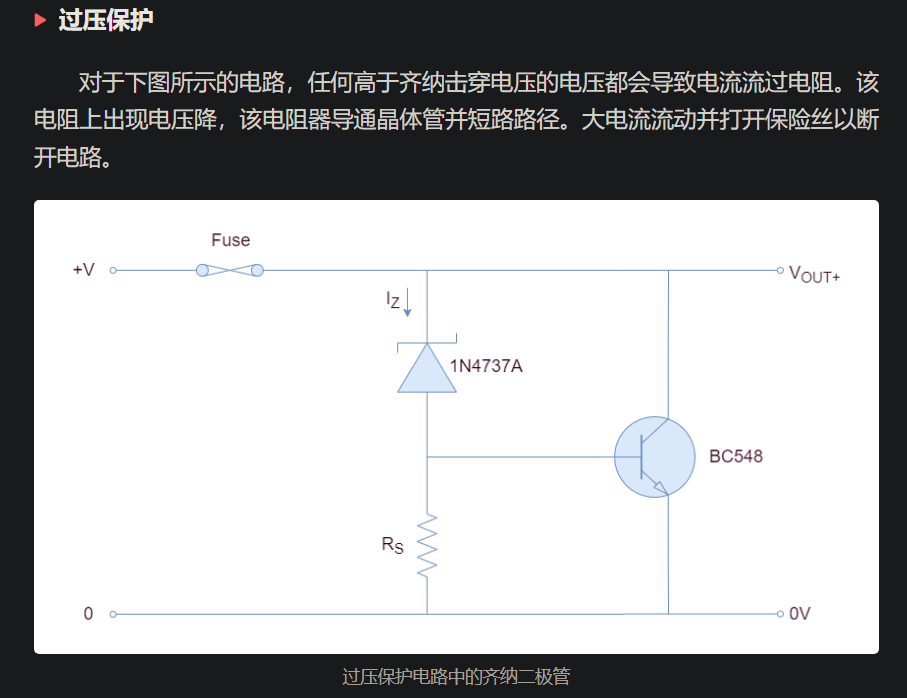

>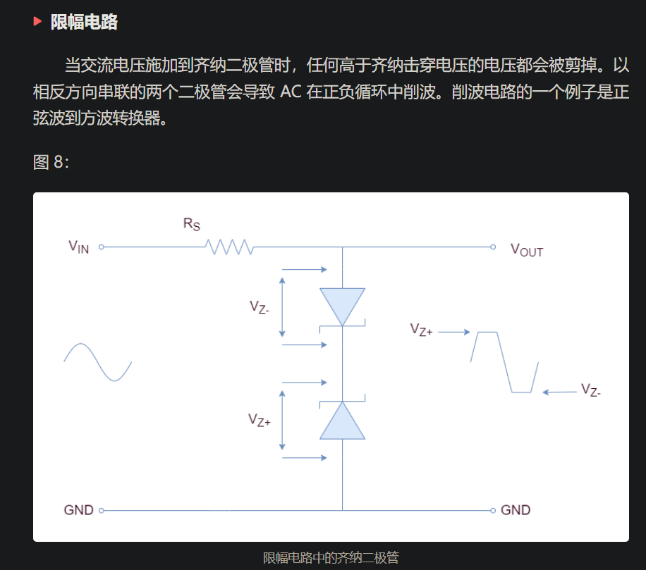

>### 齐纳二极管电路技巧
>
>齐纳二极管是一种非常灵活和有用的电路元件。然而，与任何其他电子元件一样，有一些提示和技巧可以让齐纳二极管发挥最佳性能。下面列出了一些方法：
>
>**1、用发射极或源极跟随器电路缓冲齐纳二极管电路**
>
>为了使齐纳二极管的电压尽可能稳定，流经齐纳二极管的电流必须保持恒定。负载吸收的电流的任何变化都必须最小化，因为这些变化会改变通过齐纳二极管的电流并导致轻微的电压变化。
>
>负载引起的变化可以通过使用射极跟随器电路级来减少从齐纳二极管电路获取的电流，从而减少它看到的变化，这样的话可以使用更小的齐纳二极管。
>
>**2、使用恒流源驱动以获得最佳稳定性**
>提高齐纳稳定性的另一种方法是使用良好的恒流源。仅使用一个电阻器的简单电路足以满足许多应用，但更有效的电流源可以在电路性能方面提供一些改进，因为几乎不管电源轨的任何变化都可以保持电流。
>
>**3、选择正确的电压以获得最佳稳定性**
>在需要随温度变化保持稳定性的应用中，应选择齐纳电压基准二极管，使其电压约为 5.5 伏。最接近的首选值是 5.6 伏，尽管 5.1 伏是另一个流行的值，因为它接近某些逻辑系列所需的 5 伏。
>
>如果需要不同级别的电压，可以使用 5.6 伏齐纳二极管，并且可以使用周围的电子设备将其转换为所需的输出值。
>
>**4、保证有足够的电流进行反向击穿**
>必须保证有足够的电流通过二极管，以保证其保持在反向击穿状态。对于典型的 400 mW 设备，必须保持大约 5 mA 的电流。
>
>对于最小电流的准确值，应查阅特定器件和电压的datasheet。如果未提供最小电流，则二极管将无法正常导通，整个电路将无法运行。
>
>**5、确保不超过齐纳二极管的最大电流限制**
>虽然有必要确保有足够的电流通过齐纳二极管，但不得超过最大限制。在某些电路中，这可能是一种平衡行为，因为负载电流的变化会导致齐纳二极管电流发生变化。
>
>应注意不要超过最大电流或最大功耗，也可以使用射极跟随器电路来缓冲齐纳二极管并增加电流能力。
>
>齐纳二极管非常易于使用，因此有各种各样不同的齐纳二极管电路。当使用一些预防措施时，它们运行良好，但偶尔会引起一些问题，但遵循上述提示和技巧应该有助于避免大多数问题。

## 二极管续流电路

续流二极管基本上是一个连接在感性负载端子上的二极管，以防止在开关两端产生高压。

当电感电路关闭时，续流二极管为电感衰减电流的流动提供短路路径，从而消耗电感中存储的能量。

续流或反激二极管的主要目的是通过提供短路路径来释放电感中存储的能量，否则电路电流的突然衰减将在开关触点和二极管上产生高电压。

当开关 S 闭合时，通过电路的稳态电流 I 为 (V/R)，因此电感中存储的能量为 (LI 2 )/2。当此开关 S 打开时，电流会突然从稳定值 I = (V/R) 衰减到零。

由于电流的这种突然衰减，等于 L(di/dt)的高反向电压（根据楞次定律）将出现在电感端子上，因此会出现在二极管和开关上，这将导致开关触点产生火花。

如果这个反向电压超过二极管的峰值反向电压，那么它可能会损坏。为了避免这种情况发生，一个称为续流或反激二极管的二极管连接在电感负载 RL 上，如下图所示：

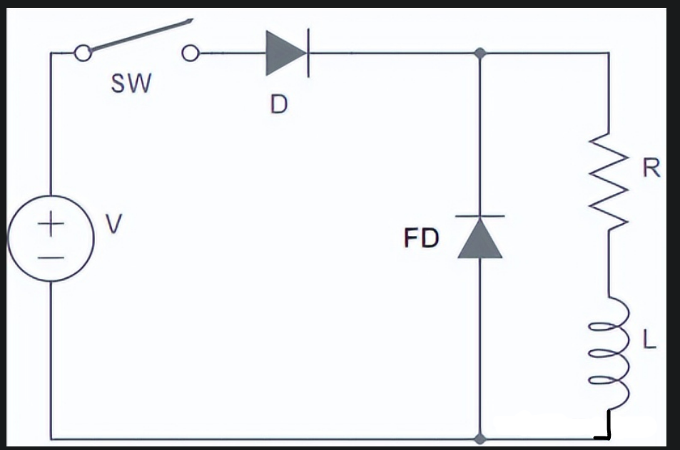

## 二极管检波电路

**峰值检测器电路**用于**确定**输入**信号**的**峰值（最大值）** ，将输入电压的峰值存储无限长的时间，直到达到复位条件。

**峰值检测器电路利用其跟踪输入信号的最大值并将其存储的特性**。

下图显示了基本正峰值检测器的电路 ：

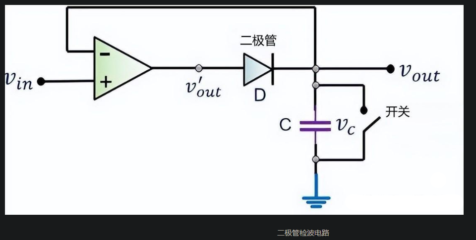

**峰值检测器由一个二极管和电容以及一个运算放大器组成，如上图所示。峰值检测电路不需要任何复杂的元件来确定输入波形的峰值。**

**工作原理**：**跟随输入波形的峰值并以电压的形式存储在电容中，到进一步移动的时间，如果电路检测到更高的峰值，新的峰值将存储在电容器中，直到它被放电。**

电路中使用的电容由施加的输入信号通过二极管充电，二极管上的小电压降被忽略，电容被充电到施加的输入信号的最高峰。

## 二极管限幅电路

**限幅电路**是由二极管制成的电路，**用于通过对信号的正半部分或负半部分或两半部分进行削波或切割来整形信号波形，它用于限制预定点的电压。**

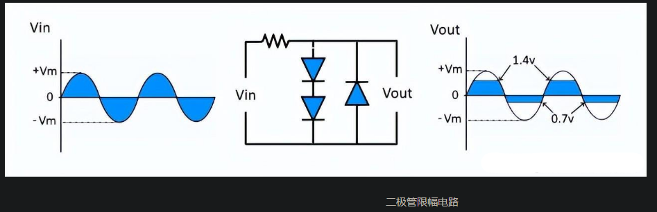

[二极管限幅电路原理分析，图文结合+实例讲解，几分钟带你搞懂-今日头条 (toutiao.com)](https://www.toutiao.com/article/7215791123036373536/)

# 三极管电路

[常用三极管入门级电路设计（如何选型和搭电路？）_三极管电路设计-CSDN博客](https://blog.csdn.net/gutie_bartholomew/article/details/122725021)

# 运放

[11个经典运放电路_运算放大器11种经典电路](https://blog.csdn.net/dianzishi123/article/details/89188894)

# 线性稳压源

[干货|稳压电路的工作原理+7种稳压电路涉及，图文结合，通俗易懂 - 知乎 (zhihu.com)](https://zhuanlan.zhihu.com/p/610965828)