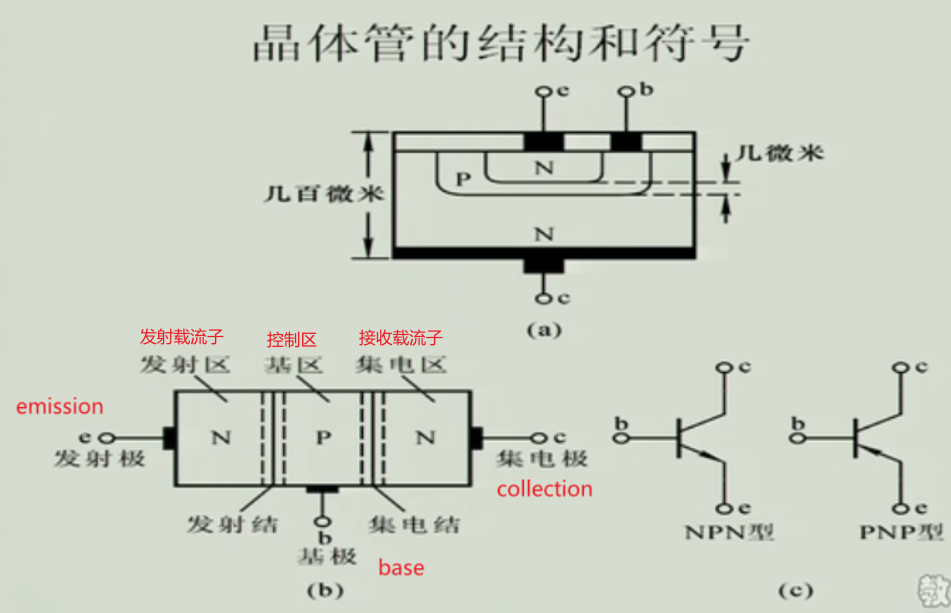
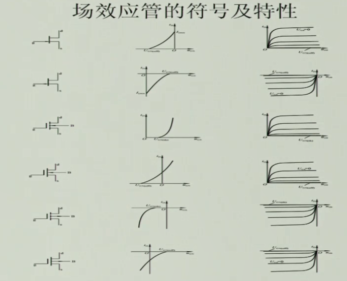
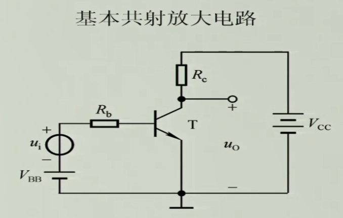
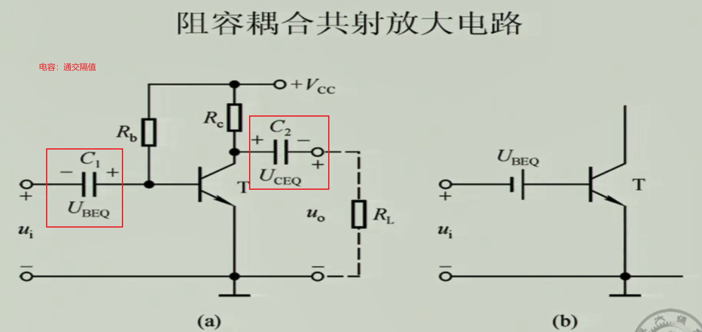
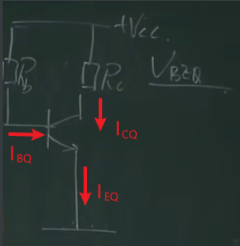

# 构建电路→电路分析→电路应用

# 概述

电子器件发展为脉络......

模拟电子技术，从发展上来说是数电的一个基础。是一门很令人兴奋的技术；模电，即处理模拟信号的电子电路（模拟信号得先转为电信号）。

1、熟悉一些电子元器件（二极管、三极管、场效应管）的基本特性、基本使用方式、工作方式。

2、电子元器件的应用：放大作用、开关作用的应用等，利用半导体器件的特性去搭建电路。

3、基于一个个半导体元器件构建的分立元件放大电路。

4、集成运放放大器。

我的学习方式：将各个元器件看作是封装好的函数一样，只需要知道如何用、用在那即可，忽略掉其内部实现。

学习目标：熟悉各个电路的搭建与应用。

# 半导体元器件

## 半导体基础

半导体：常温下导电能力基于导体与绝缘体之间的材料。半导体总体看呈电中性。

本征半导体：纯净的半导体，具有晶体结构的半导体。

**本征激发：**半导体温度 $T>0K$ 时，本征半导体里受共价键束缚的电子发生逃逸变为自由电子的过程。电子逃逸后留下的空位称为空穴（带正电）。（粒子的热运动）

**载流子：**承载电流的粒子。本征半导体的载流子有自由电子和空穴两种。

> 如果给本征半导体施加电场，那么在电场力的作用下，价电子会移动去填补空穴，也就是产生了电子的相对移动。因此如果本征激发越多，那么空穴、自由电子数就越多，导电能力就越好。

**复合：**本征激发的自由电子进入空穴重新组成共价键的过程，复合后自由电子湮灭，剩下共价键。（本征激发的逆过程）

> 温度和本征激发以及复合的速度，决定了载流子的浓度。

怎么提高半导体的导电性？提高温度来提高导电性有点不现实，那就只剩下半导体材料这一方向了，可以利用半导体材料的可掺杂性来提高导电性。

**杂质半导体：**掺入少量（这样不会改变半导体晶格结构）的杂质元素的半导体。杂质半导体又分为N型、P型。N型半导体，掺入磷元素；P型半导体，掺入硼元素。（多子——多数载流子；少子——少数载流子。）

N（negative，负电 ）型，磷原子最外层有5个电子，与Si结合成共价键形成晶格结构后还剩余一个自由电子。N型中多子为自由电子，少子为空穴，多子是少子的好多倍，可以将少子对多子的影响忽略，也就是温度对N型半导体导电能力的影响几乎可以忽略（温度影响本征激发，但由于N型半导体的自由电子数量太多了，本征激发后产生的空穴则相对自由电子来说就太少了，即对导电能力的影响不大，使得不同温度下N型半导体导电能力仍然稳定）。（N型半导体就是以电子导电为主的半导体）

P（positive，正电）型（也叫空穴型半导体），硼原子最外层有3个电子，与Si结合成共价键形成晶格结构后就会剩下一个空穴。这样的话多子就为空穴，少子就为自由电子。

**空穴其实是对P型半导体导电方式的一种形象化描述，是电子运动的结果，不存在空穴这种实际物体，当电子从原来的位置离开后，相应区域内便显正电，吸引其他电子填补这个正电区，当另一个电子离开原来的位置填补这个正电区后又形成了新的空穴，这就好比空穴移动了**，实际上是电子的移动导致空穴的移动，于是空穴的移动也可以反映电子的移动，故称空穴为载流子。

**PN结形成：**

当把P型半导体、N型半导体放在一起时，由于粒子的扩散运动（浓度高的一边的粒子会向浓度低的一边运动），就会产生一个空间电荷区——即PN结（也称为耗尽层、阻挡层），阻挡空穴、自由电子的相对移动。（扩散的结果使PN结中靠P区一侧带负电，靠N区一侧带正电，形成由N区指向P区的电场。）

>假定PN两种材料突然接触，这时候还没有空间电荷，也就没有电场。由于P区空穴浓度远高于N区空穴(少子)的浓度，这个浓度差就会造成载流子扩散，相应P区留下了带电的不可移动的带负电杂质离子（杂质离子是被共价键固定在晶格附近）。N区的电子也有类似过程，在N区留下带正电杂质离子。另外，在从P区扩散至N区的空穴使N区空穴浓度增加，提高了载流子复合率，也造成结附近N区的电子进一步减少；同样P区结附近空穴浓度也因复合减少。总的结果导致结交界面的两侧出现净电荷的存在，有了电荷，才有电场。

PN结相当于一个势垒，阻挡空穴、自由电子的移动，不过对于两边的少子，这个势垒反而是助推手，会导致一个漂移运动——N区的空穴将会飘到P区，P区的自由电子将会飘到N区，当N、P两区产生浓度差时又会产生扩散运动。

所以，一定条件下多子的扩散运动与少子的漂移运动将会达到一个动态平衡。

P型、N型的掺杂浓度一样，那么对应形成的空间电荷区，N、P形成的电荷区域是一样的，因此这样的PN结也称为对称结。当掺杂浓度不一样时，空间电荷区的宽窄将不一样，浓度高的一边就会窄，浓度低的一边就会宽一些，这种结也叫做不对称结。

PN结形成，从导电又到不导电了。

>掺杂浓度越高，空间电荷区越窄，为什么？
>
>感觉其实可以不用考虑少子的漂移问题，内电场的形成就是电子与空穴复合后剩下不能动的正负离子，电场明显会阻止多数载流子的扩散运动，高掺杂的半导体，不能动的离子密度大，较窄的耗尽层就可以阻止电子空穴继续扩散，反之亦然。

**PN结的特性——单向导电性：**

加上一个正向电压（PN结，从P到N），这个外部电场的方向与内部电场方向相反，当外部电压达到一定值时，耗尽层的电场将会被抵消，N区电子就可以冲过耗尽层了。（外电场削弱了内电场，使得扩散运动得以恢复，然后电流迅速增大，因此加上一个限流电阻R限制电路中最大电流，防止PN结烧坏）

加上一个反向电压时 ，外部电场与内部电场一致，使得PN结更厚，阻挡作用更加强，几乎不导电，从N到P的电流几乎截止，但还是有微小的电流流经，并且只有反向电压不超过击穿电压，这个电流几乎不会改变多少，因此这个电流也称为反向饱和电流。

$I_S$是反向饱和电流；$U_T$是一个温度电压常量，室温下等于26mv；U是PN结所加电压。正向导通电压，Ge管时则是0.2~0.3V，Si管时则是0.2~0.7。

>反向击穿：
>
>- 雪崩击穿（掺杂浓度低时）：外加电场足够（>=反向击穿电压），会使得载流子（少子）具有较高的能量，当这些载流子与中性原子发生碰撞时，粒子冲击共价键使得共价键内电子脱离，脱离后的电子又被电场加速去碰撞其它的原子，从而引发雪崩式的反应，使得载流子浓度迅速增大。
>- 齐纳击穿（掺杂浓度高时）：掺杂浓度高时，PN结宽度窄、空间电荷区密度大，只要加上不大的反向电压就能建立很强的电场，就能直接将束缚在共价键中的价电子拉出来，使势垒区产生大量的电子一空穴对，形成较大的反向电流，产生击穿。
>- 反向击穿后PN结并不一定烧毁，当发热量很大时才会使得PN结热击穿——烧毁，导致器件相当于导线或者开路状态。
>
>温度越高，雪崩击穿需要的电压越高；而齐纳击穿需要的电压越小。温度越高，粒子热运动越剧烈，使得载流子产生和复合的时间更短，因此为了产生雪崩击穿需要更高的电压使得载流子加速的时间变短。而粒子热运动使得电子更容易逃离共价键的束缚，因此齐纳击穿需要的电压就越小。

**反向电压击穿：**

- 雪崩击穿（掺杂浓度低的时候）：当反向电压到达一定量时，PN结将被反向击穿而导通（此时内部外部电场方向一致，电子在叠加电场中被加速，从而导致共价键被击溃而出现更多的自由电子，雪崩击穿需要PN结有一定的厚度，不然不能将电子加速到可以击穿的那个程度）。（温度越高，雪崩击穿所需电压越高）
- 齐纳击穿（掺杂浓度高的时候）：掺杂浓度高 → PN结薄，加反向电压时PN结电场场强将很大，从而导致价电子挣脱共价键束缚。（温度越高，齐纳击穿所需电压越低）

反向击穿会引起PN结温度升高从而导致PN结烧毁。只要控制好温度，不使PN结热击穿，就还是能正常工作的。利用反向击穿特性可以制作稳压二极管。

通过不同的掺杂工艺，**利用掺杂浓度来控制反向击穿电压**，得到不同规格的稳压二极管。

**PN结的电容效应：**

- 势垒电容：耗尽层的电荷量随外加电压而增多或减少，这种现象与电容器的充、放电过程相同；耗尽层宽窄变化所等效的电容称为势垒电容。利用电容效应可做出可变电容。

- 扩散电容：非平衡少子和电压之间的关系造成的。（在正向偏置时，P区中的少子(电子)，N区中的少子(空穴)，会伴着远离势垒区，数量逐渐减少。即，离结越近少子数量越多，离结越远少子的数量越少，呈现一定的浓度梯度。

  当正向电压增加时，N区将有更多的电子扩散到P区，也就是P区中的少子----电子浓度、浓度梯度增加。同理正向电压增加时，N区中的少子---空穴的浓度、浓度梯度也要增加。相反，正向电压降低时，少子浓度就要减少。

  PN结少子由于扩散引起的浓度/浓度梯度变化也就相当于电容充放电过程，也就是PN结的扩散电容效应。）

## 二极管

### 二极管伏安特性

将PN结包装起来并引出两个极，即二极管。二极管的特性：正向特性——正向导通、反向特性——反向截止、反向击穿特性。

二极管伏安特性：

二极管与PN结相比：

- 由于体电阻存在，使得相同电压下，二极管电流比PN结小。（二极管的"体电阻"，就是二极管本身在制作的时候产生的，材料本身导体电阻，就相当于直流电阻，是本身的固有特性；与动态电阻和直流电阻的关系是叠加的关系！）
- 二极管反向电流大一些。

温度对特性的影响：

- 温度上升，正向导通电压降低，反向电流变大。
- 室温每上升1℃，正向压降降少2~2.5mv；每升高10℃，反向电流增大一倍。

二极管的一些应用：

- 二极管的单向导通性，限定电流流向，可以将交流电变为直流电 —— 整流。

- 二极管反向电压的伏安特性，每升高10℃，反向电流增大一倍，可以利用这个制作温度传感器。

正向特性、反向特性，都可以利用来制作稳压二极管，不过一般利用反向特性，因为可以通过掺杂浓度来将反向击穿电压做成不同规格，而正向就不行了。

锗二极管导通压降0.1~0.3V，硅二极管导通压降0.5~0.8V。

>在电子电路中，将二极管的正极接在高电位端，负极接在低电位端，二极管就会导通，这种连接方式，称为正向偏置。必须说明，当加在二极管两端的正向电压很小时，二极管仍然不能导通，流过二极管的正向电流十分微弱。只有当正向电压达到某一数值（这一数值称为“门槛电压”，锗管约为0.2V，硅管约为0.6V）以后，二极管才能直正导通。导通后二极管两端的电压基本上保持不变（锗管约为0.3V，硅管约为0.7V），称为二极管的“正向压降”。

### 二极管主要参数

二极管主要参数：

- $I_F$：最大整流电流，二极管长期工作时所能通过的正向平均电流的最大值。
- $U_R$：最高反向工作电压。（超过这个的电压将会导致反向击穿，标定时标的要比$U_{BR}$低）
- $I_R$：未击穿时的反向电流。
- $f_M$：最高工作频率。（高频电路下，频率过高可能会导致PN结容抗过低而导通，破坏二极管的单向导电性；频率低的电路下可不用考虑，例如整流电路等）

### 直流等效与微变等效

为什么要等效电路？

二极管当电阻来使用的时候，是一种非线性的电阻，其电阻阻值是变化的。当我们对含非线性的电阻的电路进行分析时，最常用的方法是图解法，根据特性曲线和外电路的负载线算出交点——就是这个二极管的工作点。实际中这样计算太过麻烦，因此我们往往把非线性元件用其它的线性元件来表诉出来，这样的电路即等效电路，一定条件下，根据等效电路估算出来的值和通过图解法精确计算出来的值是近似相等的。

总结：非线性不好计算，等效成线性去计算。

等效的两种档次：

- 一定条件下它们的外特性等效（输出的电流和电压的关系近似等效）。（外特性等效模型）
- 根据二极管的物理原理用其它的线性元件替代。（物理等效模型）

**二极管的直流等效电路：**

三种等效替代方式：

- 方式a：使用纯理想二极管代替。（导通后直接看作是导线）
- 方式b：使用理想二极管串一个电压源代替，当两端电压大于这个电压源电压则导通，低于则截止。（导通后直接看作是一个有压降的导线）
- 方式c：考虑二极管的导通压降和导通电阻，当二极管两端电压大于导通压降时，使用直线去近似模拟，此时导通的二极管呈现出一个纯电阻状态。

二极管应用 —— 整流、限幅：

小交流分析：

二极管的微变等效：对较小的交流电来说，二极管等效为一个电阻，这个电阻阻值为$r_{d}=U_{T}/I_{D}$（$U_T$是一个温度电压常量，室温下等于26mv，$I_{D}为体电阻$。）

### 稳压二极管

在很大的电流变化范围内，工作在反向击穿电压下的二极管的输出电压变化非常小，近似于不变。

伏安特性：

主要参数：温度吸收系数α、......。（自主阅读）

稳压二极管使用示例：

①先假定稳压二极管不工作，计算出$U_0$，那么就可以知道接上稳压管后稳压管是否是正常工作的。

②假设稳压管的反向击穿电压为6V，如果直接在稳压管$D_z$接上电压源，那么稳压管将工作在10V，此时大于反向击穿电压，由稳压管的伏安特性可知，此时的电流将很大，将会导致稳压管或者电压源烧坏。因此不论是稳压二极管还是二极管，都要接上限流电阻R。接上限流电阻后，电压稳定过程为：当电压源的电压上升的时候，必然会引起稳压管两端电压有上升的趋势，根据稳压管的伏安特性曲线，此时只要稳压管两端电压上升一点点，电流就会大大上升，电流上升后必然导致过限流电阻的电流上升，那就使得限流电阻R两端的电压上升，R上升的电压将会抵消掉电源电压的上升，这就使得使用一点点电压上升的代价使得电压稳定。（总结：稳压管工作在反向击穿状态下，只要其两端电压有一点点改变就会导致电流增大而其两端电压却不会变化太大，增加的电流导致限流电阻R负担起更多的电压，实现稳压输出）

【注意】使用工程应用中，不要直接使用反向击穿电压去分析，而要先在全局下分析稳压二极管是否正常工作。另外稳压二极管的限流电阻注意要加上。

### 发光二极管

发光二极管限流电阻的计算：

直流情况下 —— $(电压电压-发光二极管正常工作电压)/发光二极管正常工作电流$。

交流情况下 —— 用220V交流电时，要考虑电阻的功率，如果功率过大会直接烧毁电阻，在交流电中限流电阻的计算是不能用正常工作电流去计算的，通常按照经验会选取0.5~2mA的工作电流去计算。总的来说就是不能使电阻超额定功率工作，通常情况都会选取一个300多kΩ的限流电阻。

## 三极管

晶体管泛指一切以半导体材料为基础的单一元件，包括各种半导体材料制成的二极管、三极管、场效应管、晶闸管（后三者均为三端子）等。

晶体管具有检波、整流、放大、开关、稳压、信号调制等多种功能，晶体管可用于各种各样的数字和模拟功能。

### 三极管结构

BJT（bipolar junction transistor）—— 双极晶体管，因为这种晶体管的导电离子有两种极性（空穴和自由电子都参与导电），所以称为双极；又称为三极管，因为有三个电极。

三极管构成 —— 三个区、三个极、两个结，如下：

- emissionor：发射极。发射区，发射载流子，掺杂浓度得高。
- collector：集电极。集电区，收集载流子，掺杂浓度不能过高但集电区面积得大。
- base electrode：基极。基区，控制区。

 

### 共射极放大电路

**1、放大作用：**

三极管的电流放大作用：利用电源的能量对信号进行放大（放大的基本要求是不能失真）。在一定的工作条件下，$I_c / I_b$近似为一个常数，$I_c = βI_b$，β——电流放大倍数。（放大的基本条件是什么？三极管工作在放大区，就是发射结正偏、集电结反偏，即b点电压大于e，c点电压大于b）（放大的能量来源于$V_{cc}$。）

PN结导通——也叫做PN结正向偏置，简称正偏，表示外加了一个正向电压使PN结导通了；PN结截止——也叫PN结反向偏置，简称反偏。（正向、反向偏置的条件是什么？PN结两端电压大于开启电压使得PN结导通，就是正向偏置；反之PN结两端电压是反向的电压，使得PN结不导通，反向截止了）

**2、内部细节与外部电流：**

1. 发射结正偏：发射区的自由电子向基区扩散，此时形成电流$I_{EN}$；基区的多子（空穴）向发射区扩散，形成$I_{EP}$。发射区掺杂浓度很高，基区掺杂浓度很低，相对于$I_{EN}$，$I_{EP}$可以忽略不计。此时大量自由电子将到达基区。
2. 基区：发射区大量的自由电子扩散到基区导致基区自由电子浓度上升，这些电子中一部分将继续向集电区扩散，另一部分与基区的多子（空穴）复合；基极那将会抽走电子——也就是会产生空穴；当扩散速度、基区条件不变时，复合的比例近似固定。（如果基区足够宽、掺杂浓度足够高，那么发射区过来的自由电子将会大部分在基区消耗掉，只留下少部分到达集电区，因此基区做得薄且掺杂浓度低，使绝大多数自由电子由基区扩散到集电区）
3. 集电结：集电结反偏，将会把电子收集起来。

$I_{CN}$和$I_{BN}$成比例，$I_{CBO}$和$I_{EP}$相当于小干扰源。对闭合回路进行KVL分析，得到共射极放大系数：（发射极为公共接地端，所以称之为共射）

$I_{CEO}$：当$I_{B}$=0（基极开路），集电极到发射极会有一个很小的电流，称之为穿透电流。（O指open，C是collection，E是emission）

$I_{CBO}$：发射极开路，反向电流。

### 共基极放大电路

共基放大电路的基极通过电容接地，因此不会发生密勒效应，频率特性非常好。

共基放大系数：$\overline{α} = I_{C} / I_{E} = \overline{β} / (1+\overline{β})$

### 三极管特性曲线

**输入特性曲线：**

在三极管共发射极连接的情况下，当集电极与发射极之间的电压$U_{CE}$维持不同的定值时，$u_{BE}$和$i_{B}$之间的关系曲线，称为共射极输入特性曲线。一般情况下，当  $U_{CE} ≥ 1V$ 时，集电结就处于反向偏置，此时再增大 $U_{CE}$ 对 $i_{B}$ 的影响很小，也即 $U_{CE}$ ＞1V 以后的输入特性与 $U_{CE} = 1V$ 的一条特性曲线重合，所以，半导体器件手册中通常只给出一条 $U_{CE} ≥ 1V$ 时的输入特性曲线，如图所示：

输入特性曲线的数学表达式为：$i_B＝f(u_{BE})|U_{CE} = 常数$。（$U_{CE}$取值为0到1V，$U_{CE}$取值越大，$U_{BE}$和$i_B$的关系曲线往右平移得越多，直到大于1V后，则几乎不会再影响）（为什么呢？$U_{CE}$的0V和1V对其有什么区别？因为$U_{CE}$的作用是把从发射区漂移到基区的电子再拉到集电区，当$U_{CE}$足够大到把所有的电子都“拉”过去后，再增大也没有电子可以拉了。）

三极管的输入特性曲线与二极管的伏安特性曲线很相似，也存在一段死区，硅管的死区电压约为0.5V，锗管的死区电压约为0.2V。导通后，硅管的$U_{BE}$约为0.7V，锗管的$U_{BE}$约为0.3V。

**输出特性曲线：**

输出特性是指以基极电流$I_B$为常数，输出电压$u_{CE}$和输出电流$i_C$之间的关系，即：$i_C＝f(u_{CE})|I_B =常数$。对于不同的$I_B$，所得到的输出特性曲线也不同，所以，三极管的输出特性曲线是一簇曲线。根据三极管的工作状态不同，可以将输出特性分为三个区域，如图所示：

（1）截止区：指$I_B=0$ 的那条特性曲线以下的区域。在此区域里，三极管的发射结和集电结都处于反向偏置状态，三极管失去了放大作用，集电极只有微小的穿透电流$I_{CEO}$。

（2）饱和区：指紫色区域。在此区域内，对应不同$I_B$值的输出特性曲线族几乎重合在一起。也就是说，$U_{CE}$较小时，$I_C$虽然增加，但$I_C$增加不大，即$I_B$失去了对$I_C$的控制能力。这种情况，称为三极管的饱和。饱和时，三极管的发射结和集电结都处于正向偏置状态。三极管集电极与发射极间的电压称为集—射饱和压降，用$U_{CES}$表示。$U_{CES}$很小，通常中小功率硅管$U_{CES} ＜0.5V$。

紫色区域右边缘线称为临界饱和线，在此曲线上的每一点应有$|U_{CE}| = |U_{BE}|$。它是各特性曲线急剧拐弯点的连线。在临界饱和状态下的三极管，其集电极电流称为临界集电极电流，用$I_{cs}$表示；其基极电流称为临界基极电流，用$I_{BS}$表示。这时$I_{CS}＝βI_{BS}$ 的关系仍然成立。

（3）放大区：在截止区以上，介于饱和区与击穿区之间的区域为放大区。在此区域内，特性曲线近似于一簇平行等距的水平线，$i_C$的变化量与$i_B$的变量基本保持线性关系，即$Δi_C=βΔi_B$，且$Δi_C>>Δi_B$ ，就是说在此区域内，三极管具有电流放大作用。此外集电极电压对集电极电流的控制作用也很弱，当$u_{CE}＞1 V$后，即使再增加$u_{CE}$，$i_C$几乎不再增加，此时，若$I_B$不变，则三极管可以看成是一个恒流源。在放大区，三极管的发射结处于正向偏置，集电结处于反向偏置状态。 

[三极管的特性曲线型图解 (ejiguan.cn)](http://www.ejiguan.cn/2021/changjianwtjd_0222/2997.html)

[三极管特性——截止区、放大区、饱和区](https://blog.csdn.net/u012351051/article/details/50896062)：

>
>
>（1）截止区：简单的讲就是三极管未导通，$U_{be}$<打开电压，一般是小于0.5或者0.7V，此时$I_b=0，I_c=I_{ceo}≈0$。
>
>（2）放大区：发射结正偏（$U_{be}>0$），集电结反偏（$U_{bc}<0$），此时$I_c=βI_b$，成线性放大关系。
>
>（3）饱和区：发射结正偏，集电结正偏（$U_{ce}<U_{be}$），$βI_b>I_c$，$U_{ce}≈0.3V$。饱和区的理解较为难，简单的讲有两种情况下会出现饱和区，一是集电极供电电压低，另外一种情况是随着基极电流Ib的不断增大，集电极电流不可能一直线性倍数增大，当基极电流增大到一定数值后，集电极的电流就不变了，此时会出现一个临界值，会导致集电结正偏，进而出现饱和区。可见，进入饱和区的一个重要点就是要$I_b$足够大。在这里不要对照曲线图，这个曲线会让你更迷糊，记住概念就好。
>
> 对于集电极电压，需要按照公式$U_{ce}=VCC-βI_bR_c$ 来计算，随着Ib的增大，Uce会减小，这样就会出现Ube>Uce即集电结正偏的情况。
>
>在嵌入式中常用三极管的截止区和饱和区配合实现“开关”的原理，当三极管处于截止区时，“开关”打开，$U_{ce}≈VCC$ ——看作是逻辑1所以是开关打开，当三极管处于饱和区时，“开关”关闭，$U_{ce}≈0V$ —— 即逻辑0。驱动三极管在截止区和饱和区之间进行切换，需要CPU输出脉冲信号，只有高低电平，而不是模拟信号。

### 主要参数

直流参数、交流参数、极限参数。“极限参数很有用啊，但是我不给你们讲啊。”

直流增益：描述三极管直流放大放大倍数的一个参数，即把电流放大的能力。$h_{FE}=I_c/I_b$

极限参数：

- 集电极最大允许电流：集电极$I_c$值超过一定限额β值会下降，当β下降到额定值的1/2～2/3时的$I_c$值称$I_{cm}$，正常工作时不允许超过$I_{cm}$。
- 集电极—发射极之间的击穿电压：基极开路时，集电极与发射极之间的击穿电压。
- 集电极最大允许耗散功率$P_{cm}$：由于集电结处于反向连接，所以，电阻很大。当电流流过集电结时，集电结就会产生热量，为了使集电结的温度不超过规定值，集电极耗散功率将受到限制，一般应使$P_{cm}≤I_cU_{ce}$。

参考文章：[全面了解三极管——三极管基本参数1_三极管手册 参数](https://blog.csdn.net/xiaoxiaodawei/article/details/126653048)

### 温度对三极管的影响

温度对晶体管输入特性的影响：

对输出特性的影响：$I_{CEO}$和放大倍数β也会受温度影响。

### 光电三极管

光电三极管（光敏三极管）的基级没有引出，作为光的接收窗口，光照强度变化会影响电极之间的电阻的变化，从而通过光来控制基极电流，从而控制集电极电流。

光耦：由发光二极管和光电三极管组成。

## MOS管

场效应管，field-effect transistor，FET。

>百度百科：
>
>场效应晶体管（Field Effect Transistor缩写(FET)）简称场效应管。主要有两种类型：结型场效应管（junction FET—JFET)和金属 - 氧化物半导体场效应管（metal-oxide semiconductor FET，简称MOS-FET）。由[多数载流子](https://baike.baidu.com/item/多数载流子/7146127?fromModule=lemma_inlink)参与导电，也称为单极型晶体管。它属于电压控制型[半导体器件](https://baike.baidu.com/item/半导体器件/1390615?fromModule=lemma_inlink)。具有[输入电阻](https://baike.baidu.com/item/输入电阻/6223919?fromModule=lemma_inlink)高（107～1015Ω）、噪声小、功耗低、动态范围大、易于集成、没有二次击穿现象、安全工作区域宽等优点，现已成为[双极型晶体管](https://baike.baidu.com/item/双极型晶体管/5364185?fromModule=lemma_inlink)和[功率晶体管](https://baike.baidu.com/item/功率晶体管/6452713?fromModule=lemma_inlink)的强大竞争者。
>
>场效应管（FET）是利用控制输入回路的电场效应来控制输出回路电流的一种半导体器件，并以此命名。
>
>由于它仅靠半导体中的多数载流子导电，又称**单极型晶体管**。
>
>FET 英文为Field Effect Transistor，简写成FET。

### 绝缘栅型场效应管

MOSFET —— 金属氧化物半导体场效应晶体管，简称摩斯管。在MOS管基础上又造出了CMOS。应用较多。

**绝缘栅型场效应管结构：**

栅极趴在$SiO_2$绝缘层上，绝缘栅。

**工作原理：**

（1）沟道的形成

$U_{DS}=0,U_{GS}>0$。往栅极g加上电压，电场方向 g→P，空穴将在电场的作用下被抽走，自由电子则往g极下面聚集，这样就在两个N之间形成了一个沟道，即将s极和d极连通了。 （$U_{GS(th)}$，开启电压，sh是threshold——阈值；当$U_{GS} > U_{GS(th)}$时，沟道形成）

沟道的宽度和$U_{GS}$的大小相关，$U_{GS}$越大，沟道越宽。沟道的宽窄可以说是代表了s极和d极之间的电阻大小，沟道越宽，它们之间电阻越小，反之越大。也就是说$U_{GS}$决定了$R_{ds}$。

电阻有了，那如何使得d极和s极之间产生电流？加上电压即可。

（2）电流产生

研究方法：使$U_{GS} > U_{GS(th)}$并且保持不变，$U_{DS}$不等于0，一步步使$U_{DS}$增大，从而得出电流的变化规律。

①往s和d极加上电压$U_{DS1}$，s极、d极的电位将不再相等。此时，s极沟道上方端点到下方端点的电压差仍然为$U_{GS}$，d极沟道上端点到下端点的电压差则为 $U_{GS}-U_{DS}$，随着$U_{DS}$的不断加大，沟道逐渐倾斜，此时电流$i_D$也逐渐增大；直到d极沟道上端点到下端点的电压差$U_{GS}-U_{DS}=U_{GS(th)}$，出现图b的情况——d极被PN结闭合（没完全闭合，还有一点缝隙），这样的情况我们称之为预夹断，预夹断之后继续加大$U_{DS}$，会发现$i_{D}$几乎不会再发生变化，此时近似于恒流。（预夹断之后自由电子在缝隙里高速通过，所以电阻阻值会增大，这个电阻的增大和电压的增大正好抵消，也就出现了近似恒流的情况）

②不同的$U_{GS}$，通过添加不同的$U_{DS}$电压来研究，最后得到不同情况下的的近似恒流$i_D$。如下（$U_{GS2}>U_{GS1}>U_{GS3}$）

得出结论：栅极和源极之间的电压$U_{GS}$，能够控制电流$i_D$，或者说$i_D$电流和$U_{GS}$成比例，前提是进入了预夹断之后的恒流区。（预夹断之前的区域称之为可变电阻区，受$U_{GS}$控制；预夹断之后称之为恒流区，$U_{GS}$控制s、d之间电流）

**关于N沟道耗尽型MOS管：**

耗尽型原理：使栅极处那$SiO_2$带正电，使得不用外加电场就可以形成沟道。

当$U_{GS}$大于夹断电压$U_{GS(off)}$，沟道关闭。

### 结型场效应管

**结型场效应管（JFET）结构：**

**工作原理：**

（1）对沟道的控制（结型不需要外加电场便存在沟道，d极、s极之间一开始便能导通）

$U_{DS}=0$，往PN结加反向偏置电压，耗尽层变大，使得d、s间的沟道变窄，待加的反向偏置电压到达一定程度，d、s极之间夹断——真正的夹断。

通过PN结的反向偏置电压控制了沟道的宽窄。$U_{GS}$不能大于0，大于0，即正向导通，PN结就导通了，就不存在什么沟道了。（P沟道则不能小于0）

（2）电流的产生

$U_{GS}$控制d、s极之间的沟道，即它们之间的电阻。$U_{GS}$不变，d、s间电阻不变。

$U_{DS}$控制了d、s间的电流的大小，在$U_{GS}$不变的情况下，$i_D$和$U_{DS}$成正比，直到出现预夹断后，$i_D$近似为恒流源。

预夹断后，$i_D$大小只和$U_{GS}$有关。

相对于绝缘栅型，结型不容易坏，绝缘栅型的绝缘层容易坏——那个绝缘层很薄，相对于一个小电容在那，容易被击穿了。

### 场效应管特性曲线

转移特性曲线：恒流区条件下，$U_{GS}$和$i_{d}$之间的关系

绝缘栅型——N沟道增强型MOS管：

$i_{D}=I_{DO}(U_{GS}/U_{GS(th)}-1)^2$

绝缘栅型——N沟道耗尽型MOS管：

$i_{D}=I_{DSS}(U_{GS}/U_{GS(th)}-1)^2$

结型——N沟道：

绝缘栅型与结型场效应管的符号及特性曲线：

### 参数

直流参数：$U_{GS(th)}$、$U_{GS(off)}$、$I_{DSS}$（耗尽型和结型）、$R_{GS(DC)}$（MOS管1kM以上）。

交流参数：

（1）跨导（低频）：$g_{m}=△i_{D}/△U_{GS}$，$U_{DS}$为常数。（$g_{m}={\frac{△i_{D}}{△U_{GS}}}\mid U_{DS}=常数$）

（2）极间电容

自行查阅：

- 晶体管的主要参数
- 温度对晶体管特性和参数的一些
- 光电三极管

# 基本共射放大电路

何为放大？

放大：从小电压、小电流的小功率信号 → 大电压、大电流的大功率信号。放大——放大的是功率。

放大电路：

- 放大电路本质：对能量的控制，对能量的转换。（将电能转化为大功率信号。）
- 必要条件：要有用于能量控制的元件（这种元件称为有源元件）。
- 放大电路的功能：用一个小信号输入，控制输出一个大信号。
- 放大的前提：放大后不失真。（不保真的放大电路，也就没有必要了）
- 放大电路的测试信号：可以使用正弦波作测试信号来测试放大电路。（交流波形都可以分解为多个频率的正弦波的叠加）

## 搭建电路

**从三极管有源元件到基本共射放大电路再到直接耦合共射放大电路**

**1、基本构建：**

如何去构建基本放大电路呢？

1. 确定目标：小功率信号 → 大功率信号。
2. 条件：有源元件、电源。
3. 技术路线：（三极管→放大状态→小信号控制$i_B$($U_{BZ}$)→合理输出$i_{c}$）。

图1：有有源元件 —— 三极管；我们的目标→让小信号$U_i$控制$i_B$。

图2：直接加上这个小信号，此时能不能控制呢？此时可以很直观看出，$U_i$的变化就是$U_{be}$的变化。此时能完成目标吗？明显不能，$U_{i}$是很小的，而b、e的开启电压为600mv到700mv，此时就相当于断路，即$i_B$为0。（此时的问题和如何让一个交流的小的电压信号在二极管上产生交流电流的问题一样，相当于同一个问题，三极管的发射结就相当于是一个二极管）

图3：为了使得b、e导通，我们加上一个直流电源。此时虽然可以导通，但会把元件烧了。

图4：避免元件烧了，再加上限流电阻。

图5：此时就可以将小交流放上去了，就可以得到一个变化的$i_B$了。这个变化的$i_B$是架在直流上的，直流电源将其提高了。这样小信号$U_i$控制$i_B$的目标就实现了。

下一个目标就是要把三极管输出大交流的那部分工作在放大状态。发射结正偏，集电结反偏。

图6：加上直流电源$E_C$，使集电结反偏，这样就会出现一个$i_C$电流，其是对$i_B$的一个放大。此时$i_B$实际上是控制了$E_C$输出多大的电流，或者说控制了输出功率。

> 此时，实现了三极管工作在放大状态：通过$E_B$使发射结反偏，通过$E_C$使集电结反偏，使得工作在放大状态。实现了小信号$U_i$控制$i_B$的变化，$i_B$已经被拉高了，有了一个静态的工作点，$U_i$的变化就能引起$i_B$的变化。工作在放大状态，$i_B$多大，$i_C$就会被放大成啥样。
>
> 问题又来了 —— 实现了小交流到大交流，那么如何输出呢？

图7：加个电阻$R_L$，这样输出可以吗？明显不行，$R_L$两端电压就是$E_C$，并没有拿到$i_C$。

图8：让这个$i_C$流经一个电阻，将交流信号转为电压信号从电阻两端取出来。然后就得到了一个基本共射放大电路。（$R_L$去掉）

以构建的思想去学模电——原理你都知道，你怎么根据需求来设计并构建出一个电路来？

基本共射放大电路，$u_i$引起电流$i_B$的变化是架在直流上的，当$u_i$引起的小交流在正半周的时候，$i_B$增大，当在负半周的时候，$i_B$减小，无论$u_i$如何变化，电流流向都不变。

上图，没有加上直流，当$u_i$很小的时候，根本就产生不了电流。

>百度百科
>
>静态工作点 是指三极管放大电路中，交流输入信号为零时，电路处于直流工作状态，这些电流、电压的数值可用BJT特性曲线上一个确定的点表示，该点习惯上称为静态工作点Q 。
>设置静态工作点的目的就是要保证在被放大的交流信号加入电路时，不论是正半周还是负半周都能满足发射结正向偏置，集电结反向偏置的三极管放大状态。  

**2、联系实际应用：**

上述的基本共射放大电路，在实际应用中，使用的是一套电源。那么如何通过一套电源来实现这个放大电路呢？

图1：假如两个电源都一样大，为使得发射结正偏、集电结反偏，能不能实现基极电位比集电极电位低？通过调节$R_C$、$R_B$的电阻阻值，使得$R_B$这里的压降大于$R_C$这里的压降。

图2：电源合并，接入$U_i$，此时$U_i$没接地，使得$U_i$的传输会受到干扰。

图3：如果这样接入，虽然接地了，但是呢还不对，基极和发射极之间的电位仍然是$U_i$，没能产生电流。

图4：加一个电阻，根据叠加定理，基极电位由两部分叠加出来，不再是直接对于$U_i$了。

图5：电源用$V_{CC}$表示，这个电路叫做直接耦合电路。（输入、输出直接接到放大电路中，没有通过任何滤波、整型等等手段，电路与电路之间信号的传递我们叫作信号的耦合，直接耦合就说明输入、输出信号和放大电路之间的这种信号传递不经过任何其他的电路直接接到了放大电路中）

直接耦合电路：输入的$U_i$效率并不高，因为产生了一个分压。输出的时候输出的电压是带着直流的，不是一个纯交流。

**3、解决其它需求：**

能不能做到纯交流进去纯交流出来呢？？？通过电容来实现：通过电容通交隔直的作用。

## 工作原理

**放大电路的工作原理——以阻容耦合电路为例**

1、直流电源的作用下，使三极管工作于放大状态

2、信号放大：$u_i$ → $u_{BE}$ → $i_B$ → $i_C$ → $u_{CE}$ → 输出$u_0$ 

## 性能指标

根据戴维南定理，等效后的放大电路示意图：

1、输入电阻：从输入端口来看，根据戴维南定理可将端口后续电路等效为一个电阻。放大电路的等效电阻$R_i$，输入电阻越大越好。（输入电阻$R_i$是相对于信号源的）

> （输入电阻越大越好。可从两方面来分析：一方面，输入电阻越大其两端电压就越大，即得到更多的信号源电压，输入到端口的电压越大，那么就可以使得信号放大得更大；另一方面，信号源功率输出要尽可能低，输入电阻越大，信号源的输出功率也就更低。）

2、输出电阻：从输出端口来看，根据戴维南定理，可将前面的电路等效为一个电压源串上一个电阻的形式，这个电阻就是输出电阻（即$R_o$）。

> 输出电阻越小越好。

放大电路的级联：前一级放大电路的负载是后一放大电路的输入电阻。

3、放大倍数：$A_{uu}$（即$U_o/U_i$）、$A_{ui}$、$A_{iu}$、$A_{ii}$。

4、通频带：

>频率越低，容抗越大，比如直流就在电容饱和时就截止了。
>
>频率不断增高，三极管的结电容的容抗不断减小，使得电流可以旁路了，就会导致放大倍数越来越小。（旁路：电流流经结电容，使得等比例放大的电流不足了）

5、非线性失真：

6、最大不失真输出电压：不失真的前提下，最大的输出电压。

7、最大输出功率与效率：不失真的前提下，在负载上输出的最大功率。

## 分析方法

分析的目的：分析电路的一些指标。（直流情况下的电路分析叫静态分析，交流情况下的电路分析叫动态分析）

如何去分析放大电路呢？分析些什么参数呢？

- 利用图解法或者等效电路法，主要分析放大电路的工作状态、放大倍数等。

### 直流通路与交流通路

为什么要先分析放大电路的直流通路再分析交流通路呢？

> 分析出静态工作点以确定交流信号的动态位置，放大电路分析的一个原则就是先分析直流再分析交流（先分析静态再分析动态）。

**一、直流通路**

直流通路：放大电路中直流所流经的通路。要令$U_i=0$（视为导线），并且电容相当于断路、电感相当于短路，这样得到的就是直流通路。

通过直流通路可以直接看出静态合不合理 —— 这是直流通路的重要作用之一。如下就可以直接看出静态不合理，基极电位与发射极电位都为0。

**二、交流通路**

交流通路，将直流源置0（即将直流源当做地），电容则视为短路。

> 注意，单独分析交流时认为三极管是正常工作的。交流流经直流电压源时，直流电压源相当于短路，交流会直接从直流电源过去；电容视为短路则是因为一般在阻容耦合电路中，对信号源的频率的要求是足够高的，频率足够高，那么电容的容抗就小了，电容近似于短路。

阻容耦合放大电路的直流通路与交流通路：

有了直流通路和交流通路，那如何分析放大电路的放大倍数等指标呢？可以使用图解法。（图解法常用于对非线性电路的分析）

### 图解法

1、直流通路：仅考虑直流电源的影响，根据三极管的输入特性曲线以及回路中$i_{B}=(V_{BB}-V_{BE})/R_{b}$，联合曲线和这个方程可得图a中的关系曲线。这个关系曲线和三极管的输入特性曲线的交点就是Q点（称之为静态工作点）。

2、然后加上交流信号源$△u_i$，就得到图a中的虚线所示的关系曲线，以及$△i_B$。

3、接着在三极管输出特性曲线图中（图b）找到$I_B=I_{BQ}$的这根曲线，再联合$i_c=(V_{CC}-u_{ce})/R_c$，可得图b的负载线，两线交点就是输出时的一个Q点。再结合变化的$△i_B$得到一个$△i_C$。

4、于是放大倍数为：$△i_{C}/△i_{B}$。

总归不能一直采用图解法去分析吧，能不能将三极管线性化？答案是可以，详情见下面的等效电路法分析放大电路。

什么是静态工作点？可以参考：[三极管静态工作点是什么？有什么作用？](https://zhuanlan.zhihu.com/p/133847010)

思考：

- 交流负载线和直流负载线到底有什么区别？
- 交流负载线和直流负载线在什么时候是一样的？在什么时候是不一样的？

### 微变等效电路法★

微变等效电路，顾名思义，就是微变的情况下的等效电路。

#### 推导-为何等效

从图解法推导到等效电路法。

如上图，$i_C=βi_B$、$U_{o}=-i_CR_c$，这都可以用线性来表示。关键的是$i_B$和$U_i$、或者$i_B$和$U_{BE}$之间的关系根本就不是线性的。

如上图，$△u_{BE}$和$△i_{B}$之间是接近于线性的。采用微分的思想，当交流的$u_{BE}$比较小的时候，$u_{BE}$和$i_{B}$之间就可以看作是线性的了，因此可以将图中回路负载线和输入特性曲线的那部分区域看作是线性的。

因此，只要知道了$△u_{BE}$→$△i_{B}$之间的线性关系，那放大电路的分析将变得简单许多了。也就是说，如果可以算出这样一个东西 —— $r_{be}=△u_{BE}/△i_{B}$，算出这样的一个动态电阻，那么就可以将基极和发射极之间看作是这样的一个动态电阻而不是看作是二极管了，这就可以将$i_B$和$U_{BE}$之间线性化了。值得注意的是，此时是纯交流的情况下，而不是$i_B$和$U_{BE}$之间是线性的关系。

那么此时这个放大电路就可以等效为以下的形式：

使用这种模型来替代三极管来分析交流小信号的时候是等效的。

那么是如何变成这样的等效呢？一个关键点就是，我们怎么承认了$r_{be}$ —— 这样一个线性的动态电阻？

如上图，其实说白了就是将坐标原点移动到了Q点，此时可将那段曲线看作是线性的，此时只关心$△u_{BE}$→$△i_{B}$，而忽略了直流。这也就是为什么在分析交流通路的时候是将直流电源置0。（此种置0并不是说交流信号单独作用的，而是交流信号架在直流信号上，然后近似地将原点移过去来看。交流单独作用是不现实的，其一定是在直流上作用的，但是我可以认为先直流后交流地起单独作用。）

所以整个等效电路的分析方法就是先进行直流通路分析，再进行交流通路分析。

#### 分析-使用等效

一、直流通路：

- 解决的问题：求出Q点，推出$r_{be}$。

推出的公式为：$r_{be}=r_{bb^/}+(1+β)\frac{U_T}{I_{EQ}}$

> 动态电阻是Q点的切线的斜率的倒数，这个$r_{be}$有$i_{c}$的影响，因此需要加$1+β$倍。$r_{bb^/}$是基区体电阻，$I_{EQ}$就是在Q点的$i_{e}$的大小，$i_{e}=i_{c}$，因此$I_{EQ}$又等于$I_{CQ}$，$U_T$是一个温度电压常量，室温下等于26mv。
>
> 基区掺杂浓度很低，因此有个体电阻，几百欧姆左右。

二、交流通路：

1. 画出交流通路。
2. 把交流通路中的三极管等效为一个等效电路：
   

此时，整个电路就可以线性化求解了。

#### 分析-例子

以以下电路为例：

1、首先列出直流通路：

开启电压$U_{BEQ}$已知。

易得：$I_{BQ}=(U_{CC}-U_{BEQ})/R_{b}$，$I_{C}=βI_{BQ}$，$I_{EQ}=I_{C}+I_{BQ}=(1+β)I_{BQ}$。

再求：$r_{be}=r_{bb^/}+(1+β)\frac{U_T}{I_{EQ}}$

如何确认静态工作点对不对？求出$I_{C}$最大电流再对比即可。

$I_{Cmax}=(V_{CC}-U_{CES})/R_c$，$U_{CES}$是三极管饱和压降，大约0.3V。

如果$βI_{B}>I_{Cmax}$，说明电路饱和了，此时$I_{C}=I_{Cmax}$；如果是小于，那么说明还能提供$βI_{B}$的电流，此时三极管工作在放大状态下。

2、列交流通路 → 微变等效电路：

交流通路如下

微变等效电路如下

（说明：$I_{B}$、$i_{B}$、$i_{b}$、$\dot{I}_{B}$、$I_b$，分别是纯直流、既含直流又含交流、纯交流、$i_{b}$的相量、$i_{b}$的有限值）

电压放大倍数：$A_{u}=U_{o}/U_{i}=-βi_{b}R_{C}/(i_{b}r_{be})$。

然后根据戴维南等效，求出输入电阻和输出电阻，输入电阻为$R_{b}$并联上$r_{be}$，输出电阻为$R_c$。

### H参数等效模型

微变等效的一个更为严谨的数学模型，只能用于放大电路低频动态小信号参数的分析，因为没有考虑三极管的结电容的作用。

- 线性双口网络。
- 网络的h参数。

推出的动态电阻：$r_{be}=r_{bb^/}+(1+β)\frac{U_T}{I_{EQ}}$或$r_{be}=r_{bb^/}+β\frac{U_T}{I_{BQ}}$

### 习题

动态分析-基本共射放大电路：

1、静态：直流通路下，求出$I_{BQ}$、$I_{CQ}$、$I_{EQ}$，从而求出$r_{be}$。

2、动态：交流通路 → h参数等效电路（微变等效电路） → 从而使用等效电路求出电压放大倍数，结合戴维南等效方法算出输入电阻、输出电阻、$A_{US}$。

- 输入电阻越大越好，当输入电阻越大时，放大电路得到的电压也就越大，放大后的数值也越大。
- 输出电阻越小越好，输出电阻越小的时候，前端的电路越像一个电压源，即输出电阻越小，输出的电压或者电流的变化就会越小，相当于电源内阻小，内阻越小，这个电源越好。
- 好不是绝对的，对于不同的应用场景，对于“好”的要求是不同的，没有绝对的好与坏。

做啥事都要清楚地知道自己的目标是啥，一切以达成目标为前提。

## 分析方法总结

## 放大电路Q点的稳定

>静态工作点是指三极管放大电路中，三极管静态工作点就是交流输入信号为零时，电路处于直流工作状态，这些电流、电压的数值可用BJT特性曲线上一个确定的点表示，该点习惯上称为静态工作点Q 。
>
>设置静态工作点的目的就是要保证在被放大的交流信号加入电路时，不论是正半周还是负半周都能满足发射结正向偏置，集电结反向偏置的三极管放大状态。
>
>对于基本共射放大电路而言，静态工作点由β和$I_{CEO}$决定，这些参数随温度而变化，温度对静态工作点的影响主要体现在这一方面。

Q点的不稳定会导致哪些问题？

- 温度降低，Q点下移，可能会导致放大出现截止失真（波形正半周头没了）。
- 温度升高，Q点上移，可能会导致放大出现饱和失真（波形负半周头没了）。

对静态工作点有影响的点？温度、电源的波动、元器件的老化。

使得Q点稳定的思路？

稳定Q点 → 相当于稳定$I_{B}$、$I_{C}$。

思路：当温度上升时，三极管的输入特性曲线将左移，也就导致Q点的上升，同理温度下降Q点也下降。温度上升，$I_{B}$上升，从而$I_{C}$上升。那我如果使得温度上升时，$I_{B}$下降，那样$I_{C}$也就下降，这样不就可以使得$I_{B}$、$I_{C}$基本不变，$I_{B}$、$I_{C}$稳定住了吗？那如何实现呢？关键点在于这两个电流上升后使得$I_{B}$下降，而$I_{B}$的电流受到基极和发射极之间的电位差的控制，如果使得这个电位差随着电流增大而增大，那么不就可以使得电流变大后$I_{B}$下降了吗。

如何实现呢？答案是发射极和地之间接上一个电阻$R_{E}$。当温度上升，$I_{B}$上升，从而$I_{C}$上升，从而$I_{CE}$上升，此时$I_{B}=(V_{CC}-U_{BE}-U_E)/R_B$，$U_{BE}$基本不变0.7v，但$U_{E}$上升，所以$I_{B}$变小，从而$I_{C}$变小。温度引起的电流的上升又会引起电流的下降，从而使得电流被稳定下来了。

>如上图，加上$R_{E}$后，温度升高 → $I_{B}$升高，$U_{E}$下降 → $I_{C}$升高 → $I_{E}$升高 → $U_{E}$升高 → $U_{E}$升高的电压远比$U_{B}$的变化量大 → $U_{BE}$下降 →  $I_{B}$下降 → $I_{C}$下降 → 上升了，但又降下来了，变得稳定了。注意$U_{E}$是变化的，只不过变化的量很小。
>
>为了使得$U_{E}$的变化量变得更小，使用分压式稳压电路，即再加上一个电阻和$R_{B}$串起来。
>
>
>
>加了一个$R_{B2}$后，从理论上讲$U_{B}$相当于$R_{B1}$和$R = R_{B2}并联上(基区体电阻+发射结电阻+R_{E})$分压后的电压，我们使$I_{B2}$远远大于$I_{B1}$时，也就是$R_{B2}$远远小于其并联上的电阻时，因并联电阻的总电阻趋向与较小的那个，此时可以将$U_{B}$看作是$R_{B2}$分得的电压，即将$U_{B}$稳定住了，就是$R_{B2}$两端的一个稳定的电压。
>
>如果是直接耦合电路：
>
>

分析Q点稳定的阻容耦合放大电路：

从直流来说，对于稳定静态工作点来说$R_E$越大越好，$R_E$越大越灵敏。但从$A_u$来看，$R_E$越大，将导致$A_u$小于1，不是放大而成缩小的了。

如何解决？思路就是解决掉$R_E$两端电压，使得$A_{u}=(-βi_{b}(R_{C}//R_{L}))/(i_{b}r_{be})$。当给$R_E$并上一个电容时，$R_E$相当于电路，即消灭了$R_E$。

阻容耦合电路不能集成进芯片，因为电容占地方太大了。要集成进芯片，那就是将直接耦合放大电路集成进去。那对于直接耦合放大电路，没有那个电容，怎么去把$R_E$干掉呢？答案是差分放大电路。

其它的Q点稳定的放大电路：

- 图a：使用稳压二极管。
- 图b：

两个原理基本都差不多，二极管反向电流温度影响比较大，温度升高，二极管所在支路分流增大，使得$I_{B}$减小。

# 基本共集放大电路

基本共射放大电路：从b极输出，从c极输出，共用e极。

基本共集放大电路：从b极输入、从e极输出，共用c极。

# 基本共基放大电路

# 派生电路

# 多级放大电路

# 差分放大电路

# 功率放大电路

