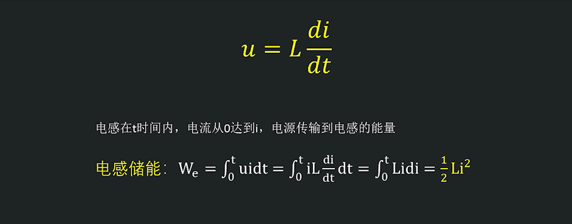

# 常用电子元器件

目标：常用电子元器件的特性、原理，学会选型。

学习资料：《实用半导体元器件基础 第四版》、网上开发视频资料等。

有源器件：需能的器件，需要外部提供电源其才能正常工作的器件。

无源器件：不需能的器件，不需要为其提供电源便能正常工作的器件。

# 电阻

常见的电阻封装：0402、0603、0805、1206。（0402，0.04英寸*0.02英寸，以此类推）

- 注意电阻的额定功率，注意额定功率和温度的关系。
- 注意电阻的耐压值，以及过流能力。

电阻工作温度有限，当给电阻施加功率时电阻就会发热。过压、过流可能会造成电阻击穿，从而导致电阻永久损坏。

# 电容

## 基础知识

电容的本质：相互靠近的导体加上它们中间的绝缘介质组成的一种储存电荷的容器。

公式：
$$
C=\frac{q}{u}\newline
i=\frac{dq}{dt}=C\frac{du}{dt}
$$
从公式可看出，当u为直流电压时 —— 变化率非常非常小，那么有$i=0$，也就是说直流不能通过电容。注意，电荷并不会穿过电容，当电容两端电压变化时，电荷就会从电容极板往导线流出或流进，电子的来回相对运动也就形成了电流。

储能公式：
$$
u=\frac{1}{C}\int_{-\infty}^{t}idt\newline
P=ui=Cu\frac{du}{dt}\newline
W=Pt=\int_{-\infty}^{t}Cu\frac{du}{dt}dt=\frac{1}{2}Cu^2|^{t}_{-\infty}
$$

电容的特性：

- 电容两端电压不能突变。（突变，就是突然发生改变，即在极短的时间内发生了变化，如果电压发生了突变，就意味着`dt`趋向于无穷小，那么$\frac{du}{dt}$趋向于无穷大，也就表明`i`也得是无穷大，可实际是不存在无穷大的电流，即不可能存在突变）
- 通交流隔直流。（直流电压的变化量很小，变化量趋向于0，那么电流趋向于0，基本没有电流。电容两极电荷满载后，电子相对移动基本停滞，也就基本没有电流了。）

电容的串并联：

- 串联：总电容值和电阻的并联一样计算。
- 并联：总电容值和电阻的串联一样计算。

电容的应用：

- 储能：开关电源电路中用作储能元件。
- 滤波：通交隔直特性，大电容充电时间稍长，用于滤低频信号；小容值电容充放电速度较快，用于滤处高频信号。电容和电阻、电感组成RC、LC滤波器等。（芯片输入脚通常都加100nF或1nF电容，旁路消振电容，防止通过电源引入干扰和寄生振荡。）
- 通过电容提供复位信号：可以利用电容来为瞬间上电的系统提供一个复位信号给MCU。
- 去耦电容、耦合电容、

# 电感

## 基础知识

电流通过线圈时会产生磁场，磁感线会穿过线圈，于是这个线圈就有了一个磁通量，磁通量与电流成正比，即磁通量$φ=Li$，其中L为自感系数，也叫电感系数，单位为亨利—H。

由法拉第电磁感应定律，当通过线圈的磁通量发生变化时，在线圈的两端会产生感应电动势，并且感应电动势的大小正比于磁通量的变化率，于是有以下公式：
$$
e=-L\frac{di}{dt},负号表示阻碍电流的变化
$$
由该公式也可以看出，当突变时，$di/dt$无穷大，感应电动势也就趋向无穷大。换句话来说就是，电感两端电流不能突变，当流过电感的电流发生突变时，电感会通过使其两端电压变大来阻碍这个变化。

电感线圈的特性：**通直流隔交流**。（通低频阻高频，从公式可看出，变化率越大，即频率越高，对电流的阻碍作用越大；越低，对电流的阻碍作用越小）

芯片引脚电感、过孔电感、导线电感？使用微分的思想，将这些都看成是无数微小段的通电导线构成，即可得出这些都会有电感属性。

电感储能：

从电感的储能格式可以看出，电感的储能依附于电流而存在，当电流发生突变时，储存的能量也会突变为0，但根据能量守恒定律，能量不会凭空消失，储存的能量将以某种形式释放出去，释放的方式就是通过产生瞬时的高压，将能量变为电场能量来释放出去。

电感的串并联：

- 串联：总电感值计算和电阻串联的总阻值计算一样。
- 并联：总电感值计算和电阻并联的总阻值计算一样。

# 晶体管

## 二极管

对二极管伏安特性曲线的理解：

- 当给二极管施加正向电压时，电压大于导通电压时二极管导通，导通后二极管两端电压将稳定在$U_{on}$，并且二极管两端电压会随着流过二极管的电流的增加而小幅度地增加。

  （要知道这个曲线的得出是二极管串联一个限流电阻的电路中测试出来的，二极管导通后其两端电压稳定在开启电压，当二极管两端电压增大时，会导致电流的增大，电流的增大会使得限流电压两端电压增大，从而稳定了二极管两端电压）

  二极管两端的电压的变化幅度很小，基本稳定在开启电压附近。
- 施加反向电压时，二极管截止，有一个由少子造成的反向饱和电流。当反向电压大到一定程度会导致二极管击穿而使得反向电流迅速增大，当导致热击穿时二极管彻底损坏。

其它类型的二极管：

- 齐纳二极管：是一种高掺杂浓度的二极管，可通过的反向电流较大，常用于当做稳压管。
- 肖特基二极管：由半导体材料和金属材料组成的二极管，其正向导通压降低，可用作保护电路，截止反向电压或反向电流。常用的肖特基二极管，比如SS14、SS24、SS34等。
- 开关二极管：与普通二极管原理没什么差别，只不过其势垒电容很小（高频下，这个势垒电容表现出极低的阻抗，并且其与二极管并联，这也就相当于高频电流会绕开二极管，从势垒电容中通过，从而影响了二极管的单向导电性），是的高频条件下仍然可以保持良好的单向导电性。常用的1N4148系列。

## 三极管

三极管：是电流控制元件，当基极和发射极之间存在持续的电流时，三极管将可能会打开。

优点：

- 耐高压、大电流。
- 便宜。

应用场景：实际工作中很少使用三极管的放大特性，几乎用不到，用到的最多的只是三极管的开关特性。现实中三极管常应用于对功耗不敏感的场景，常用于驱动LED、电平转换、驱动MOS管等，因为三极管便宜。

NPN：

PNP：

## MOS管

NMOS：N沟道型场效应晶体管。PMOS：P沟道型场效应晶体管。

NMOS和PMOS的电气符号简记：只记住NMOS的即可，PMOS的里面的二极管符号与NMOS的是反过来的、电流流向也与NMOS的相反（NMOS是漏极到源极，PMOS是源极到漏极）。

MOS管是电压控制元件，其静态电流小、导通阻抗低，在实际中大量应用。MOS管的应用场景也大都是用作开关。

由于体二极管的存在，使用MOS管要注意区分源极和漏极，否则MOS管将会处于一直导通的状态。

参数：

- $V_{GS(th)}$：栅极和源极之间的开启电压，当栅极和源极的电压差大于这个开启电压时形成沟道，MOS管导通。
- $R_{DSon}$：漏极和源极完全导通后（MOS管完全打开后），源极和漏极之间的电阻。
- $C_{gs}$：G极和S极之间的寄生电容，由于制造工艺而存在的一个问题，这个寄生电容会影响到MOS管的打开速度，因为需要先给寄生电容充电，然后再是打开MOS管。通常$R_{DSon}$和$C_{gs}$是一个反比关系，$R_{DSon}$越小，$C_{gs}$也就越大。

## IGPT

绝缘栅双极晶体管（Insulate-Gate Bipolar Transistor—IGBT）综合了电力晶体管（Giant Transistor—GTR）和电力场效应晶体管（Power MOSFET）的优点，具有良好的特性，应用领域很广泛；IGBT也是三端器件：栅极，集电极和发射极。

IGBT：如下就是一个IGBT结构，通过控制MOS管可以使得PNP三极管的be之间产生一个大电流，从而使得ce之间产生大电流。

MOS管、三极管、IGBT都有它们的优点和短板：

- MOS管的短板是耐压。
- 三极管的短板是电流和开关频率。
- IGBT的短板是频率。

新型材料碳化硅则可以做到综合这三者的优点。

# 晶振

有源晶振（oscillator，振荡器）：自身便能产生振荡信号，需要为其提供电源，通常会加上滤波网络，其精度高，稳定性好。

无源晶振（crystal，晶体）：需要借助时钟电路才能产生震荡信号，通常接到IC内部的振荡电路。

# 磁珠

磁珠的全称为铁氧体磁珠滤波器，是一种抗干扰元件，滤除高频噪声效果显著。磁珠有很高的电阻率和磁导率，它等效于电阻和电感串联，但电阻值和电感值都随频率变化。它比普通的电感有更好的高频滤波特性，在高频时呈现阻性，所以能在相当宽的频率范围内保持较高的阻抗，从而提高调频滤波效果。磁珠的电路符号就是电感，但是型号上可以看出使用的是磁珠。在电路功能上，磁珠和电感是原理相同的，只是频率特性不同而已。

磁珠与电感：

1. 电感的单位是亨H，磁珠的单位是欧姆Ω；
2. 电感是储存能量的，磁珠是通过发热来消耗能量的；
3. 磁珠是用来吸收超高频信号，多用于信号回路及EMC对策。

磁珠的原理：电感是用来储能的，理想的电感当然是希望其损耗越小越好啦。可磁珠相反，磁珠利用的正是这个损耗，来将不需要的高频信号给消除掉。

# 继电器

继电器原理：当电流流过电磁铁外的线圈时，电磁铁产生一个磁场，该磁场吸引金属触点下来，使得电路导通。继电器的线圈，是一个感性元件，其两端电流不能突变，为保护电路通常需要在其两端并上一个续流二极管。

继电器和MOS管都可以用作开关，它们的区别如下：

| 特性     | 继电器                                 | MOS管                              |
| -------- | -------------------------------------- | ---------------------------------- |
| 开关速度 | 低，最多几十赫兹                       | 高，可达几万赫兹                   |
| 声音     | 大                                     | 无                                 |
| 电流方向 | 不需要注意                             | 要注意方向                         |
| 接入方式 | 不需要注意                             | NMOS接入要靠近地那一端             |
| 隔离     | 不共地                                 | 共地，有可能被控制端干扰控制端     |
| 控制电流 | 需要较大的控制电流，通常需要加驱动电路 | 几乎不需要控制电流，是由电压控制的 |
| 体积价格 | 价格高体积较大                         | 价格低体积较小                     |

# ESD保护器件

# 电源芯片

## DC-DC

## LDO

## 充电芯片

# 存储器

