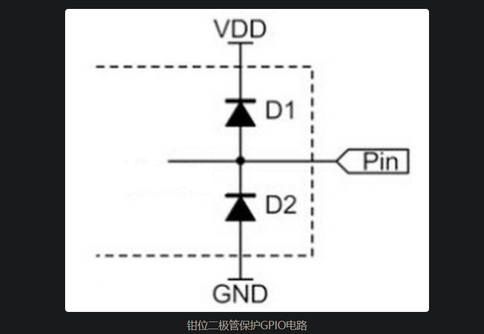

# 滤波电路

## 高通滤波

## 低通滤波

# 二极管电路

[19 种典型二极管应用电路，电路图+工作原理，一文总结，快速搞懂_二极管保护电路](https://blog.csdn.net/luolt42/article/details/128811200)

## 二极管保护电路★

### 反极性保护

**肖特基二极管常用于保护电路，如反极性电路，因为它的正向压降低**，下图为**常见的反极性电路。**

**当 Vcc 和地以正确的极性连接时，二极管正向传导，负载接收功率**。与整流二极管的 0.7V 相比，肖基特二极管上的正向压降在 0.4V 左右非常少，这样二极管上的功率损耗不会太大，而且肖特基二极管可以允许更多的电流通过它，还具有更快的开关速度，因此可以用于高频电路。

肖特基二极管：N型半导体和金属（金、银、铂等）连接形成金属-半导体结的一种二极管。其优点如下：

- 正向导通压降低：通常为0.2~0.3V。
- 恢复时间快：肖特基二极管由于存储的电荷量少，因此恢复很快，也就是说其可以应用于高速开关应用，能很快地切换状态。
- 结电容低。
- 高电流密度：肖特基二极管的耗尽区范围很小，几乎可以忽略不计，施加很小的电压就足以产生大电流。
- 产生噪声更小。
- 性能好：本身消耗功率很低，可满足低压应用。
- 反向电流较高：由于肖特基二极管是金属半导体结构，反接电压时更容易漏电流。
- 最大反向电压也较低。

肖特基二极管作用与应用：

>肖特基二极管具多有用的应用，从整流、信号调节、开关、电压钳位、太阳能电池到 TTL 和 CMOS 逻辑门，主要是因为它们的低功耗和快速开关速度。TTL 肖特基逻辑门由出现在其逻辑门电路代码中某处的字母 LS 标识，例如 74LS00。
>
>射频混频器和检波二极管
>肖特基二极管因其高开关速度和高频率能力而在射频应用中独树一帜。鉴于此，肖特基势垒二极管用于许多高性能二极管环形混频器。除此之外，它们的低开启电压和高频能力以及低电容使它们成为射频检测器的理想选择。
>
>功率整流器
>肖特基势垒二极管也用于大功率应用中，作为整流器。它们的高电流密度和低正向压降意味着与使用普通 PN 结二极管相比，浪费的功率更少。这种效率的提高意味着需要消散的热量更少，并且可以在设计中加入更小的散热器。
>
>电源或电路
>肖特基二极管可用于负载由两个独立电源驱动的应用。一个示例可以是主电源和电池电源。在这些情况下，一个电源的电源不能进入另一个电源是必要的。这可以使用二极管来实现。然而，重要的是要最小化二极管上的任何电压降以确保最大效率。
>
>与许多其他应用一样，鉴于其低正向压降，该二极管非常适合此应用。肖特基二极管往往具有较高的反向漏电流。这可能导致任何可能正在使用的传感电路出现问题。进入高阻抗电路的泄漏路径会导致错误读数。因此，这必须在电路设计中加以考虑。
>
>电压钳位/削波电路
>限幅器电路和钳位器电路通常用于波形整形应用。具有低压降特性的肖特基二极管可用作钳位二极管。
>
>反向电流和放电保护
>众所周知，肖特基二极管也被称为阻塞二极管，因为它阻止电流反向流动；可用作放电保护。例如，在应急闪光灯中，在超级电容器和直流电机之间使用了一个肖特基二极管，以防止超级电容器通过直流电机放电。
>
>采样保持电路
>正向偏置肖特基二极管没有任何少数电荷载流子，因此，它们可以比典型的 PN 结二极管更快地切换。因此使用肖特基二极管是因为它们从采样到保持步骤的转换时间较短，这会在输出端产生更准确的采样。
>
>太阳能电池
>肖特基二极管可以帮助最大限度地提高太阳能电池的效率，因为它们具有低正向电压降。它们还有助于保护电池免受反向充电。

### 二极管反向电流保护电路

与电源正极串联放置的二极管称为反向保护二极管，可以确保电流只能沿正向流动，并且电源仅向你的电路施加正电压。

## 二极管整流电路★

### 半波整流电路

仅将**交流信号的半波转换为直流信号的过程称为半波整流电路**，这种类型的整流是通过**只使用一个二极管来实现的，只留下一半信号。**

二极管的单向导通性，当交流电压正半周期时，导通；负半周期时，截止，电路相当于开路。半波整流波形如下：

当然，改变二极管的方向，也可以得到负半波整流。

**半波整流电路参数与计算公式：**

>“纹波”是将交流电压波形转换为直流波形时剩余的不需要的交流分量。尽管我们尽最大努力去除所有交流分量，但在输出侧仍有少量残留物会产生直流波形的脉动。这种不受欢迎的交流分量称为“纹波”。
>
>为了量化半波整流器将交流电压转换为直流电压的能力，我们使用所谓的纹波系数（由 γ 或 r 表示）。纹波系数是整流器交流电压（输入侧）与直流电压（输出侧）的RMS值之比（均方根值之比）。
>
>
>
>
>
>
>
>
>
>

**应用：**

>虽然半波二极管整流电路基本上使用单个二极管，但二极管周围有一些电路差异，具体取决于应用。
>
>**电源整流**
>
>当用于电源整流时，半波整流电路如果要以任何方式为设备供电，则与变压器一起使用。通常在此应用中，输入交流波形是通过变压器提供的。这用于提供所需的输入电压。
>
>**AM解调**
>
>一个简单的半波二极管整流器可用于调幅信号的信号解调。整流过程使幅度调制得以恢复。当半波整流电路用于幅度调制检测时，该电路显然需要与收音机中的其他电路接口。
>
>**峰值检测**
>
>半波二极管电路通常用作简单的电压峰值检测器。通过在输出负载上放置一个电容，电容器将充电至峰值电压。如果 CR 网络、电容器和负载电阻的时间常数比波形周期长得多或足以捕获变化波形的峰值，则电路将保持电压峰值。

### 桥式全波整流电路

桥式全波整流电路，是全波整流电路中的一种，其主要优点为不需要特殊的中心抽头变压器。

工作示意图如下：

**桥式整流电路特性参数计算：**（桥式整流电路的主要参数包括以下几个：纹波系数、峰值反向电压 (PIV)、效率）

>**纹波系数**
>
>使用因子测量输出直流信号的平滑度称为纹波因子。这里，平滑的直流信号可以被认为是包括很少纹波的输出直流信号，而高脉动直流信号可以被认为是包括高纹波的输出信号。在数学上，它可以定义为纹波电压与纯直流电压的分数。
>
>对于桥式整流器，纹波因子的参数计算公式为：
>
>**Γ = √ (Vrms2/VDC)−1**
>
>桥式整流器的纹波系数值为0.48
>
>**PIV（峰值反向电压）**
>
>峰值反向电压或 PIV 可以定义为当二极管在整个负半周期内以反向偏置条件连接时来自二极管的最高电压值。桥式电路包括四个二极管，如 D1、D2、D3 和 D4。
>
>在正半周期中，两个二极管（如 D1 和 D3）处于导通位置，而 D2 和 D4 二极管均处于非导通位置。同样，在负半周，D2 和 D4 等二极管处于导通位置，而 D1 和 D3 等二极管处于非导通位置。
>
>**效率**
>
>整流器的效率主要决定整流器将AC（交流电）变为DC（直流电）的能力。整流器的效率可以定义为；它是 DC o/p 功率和 AC i/p 功率的比值。桥式整流器的最大效率为 81.2%。（输出的直流功率和输入的交流功率的比值）
>
>**η = DC o/p 功率/AC i/p 功率**

**桥式整流电路的分类：**

>桥式整流电路根据这些因素分为几种类型：电源类型、控制能力、桥式电路配置等。桥式整流电路主要分为单相和三相整流电路。这两种类型进一步分为非控制型、半控制型和全控制型整流电路。下面描述了其中一些类型的整流电路。
>
>
>
>
>
>

**注意事项：**

- 存在电压降。
- 计算发热量：**需要查阅桥式整流电路的二极管或整个桥式整流电路电子元件的datasheet，以查看设想电流水平的电压降。**电压降和通过整流电路的电流会产生热量，需要散热。
- 峰值反向电压不要超过桥式整流电路或单个二极管的峰值反向电压。

**桥式整流电路优缺点：**

>**优点：**
>
>- **输出直流信号中的低纹波：**桥式整流器的直流输出信号比半波整流器更平滑。换言之，与半波整流器相比，桥式整流器具有更少的纹波。但是，桥式整流器的纹波系数与中心抽头全波整流器相同。
>- **整流效率高**：与半波整流器相比，桥式整流器的整流效率非常高。但是，桥式整流器和中心抽头全波整流器的整流效率是相同的。
>- **低功耗**：在半波整流器中，只允许输入交流信号的一个半周期，而阻断输入交流信号的剩余半周期。结果，几乎一半的应用输入功率被浪费了。
>
>**缺点：**
>
>- 与中心抽头全波整流电路相比，功率损耗更大：在电子电路中，我们使用的二极管越多，电压降就会越大。桥式整流电路的功率损耗几乎等于中心抽头全波整流电路。然而，在桥式整流电路中，与中心抽头全波整流电路相比，电压降略高。这是由于两个额外的二极管（总共四个二极管）。在中心抽头全波整流电路中，每个半周期只有一个二极管导通，所以电路中的电压降为0.7伏。但在桥式整流电路中，两个串联的二极管在每个半周期导通。因此，电压降是由于两个等于 1.4 伏（0.7 + 0.7 = 1.4 伏）的二极管而发生的。但是，由于该电压降造成的功率损耗非常小。

## 二极管稳压电路★

**稳压器：**用于将输入电压降低到所需的水平，并在电源波动的情况下保持不变，也可以用来调节输出电压。

**齐纳二极管：**通常用作电压调节器，因为它设计为在反向偏置条件下工作。当处于正向偏置时，它的行为就像一个正常的信号二极管。另一方面，当施加反向电压时，电压在很宽的电流范围内保持恒定。

在下面的电路中，输入电压可以在 0V 到 12V 之间变化，但输出电压永远不会超过 5.1V，因为**齐纳二极管的反向击穿电压（齐纳电压）为 5.1V，当输入电压低于 5.1V 时，输出电压将等于输入电压，但当超过 5.1V 时，输出电压将被调节为 5.1V。**

**该电路的这一特性可用于保护 5V 的 ADC 引脚（过压保护电路**），因为该引脚可以读取 0-5V 的电压，但如果超过 5V，齐纳二极管将不允许过压。同样，当输入电压很高时，可以使用相同的电路为负载调节 5.1V。但是这种电路的电流限制非常小。

在使用齐纳二极管设计电路时，要考虑的一件重要事情是齐纳电阻，**齐纳电阻用于限制通过齐纳二极管的电流，从而保护其免受加热和损坏，齐纳电阻的值取决于齐纳二极管的齐纳电压和额定功率。**

**齐纳二极管介绍：**

>齐纳二极管与普通二极管之间的区别主要有两点：
>
>- 1、**掺杂程度**，简单二极管是中度掺杂，**齐纳二极管是重掺杂，以实现更高的击穿电压。**掺杂程度的不同这有助于它们在不同电压水平下工作的规格。
>- 2、**导电情况**，由于齐纳二极管高掺杂，与简单二极管的PN结相比，齐纳二极管PN结的耗尽层很薄，这为齐纳二极管提供了特殊的特性，在**正向和反向偏置条件下都可以导电。**
>
>
>
>齐纳二极管工作原理：齐纳二极管在正向偏置时的作用类似于普通二极管。然后，一旦反向电压等于其额定电压，就会允许电流反向流动。
>
>击穿工作的齐纳二极管充当电压调节器，因为它在指定的反向电流值范围内跨其端子保持几乎恒定的电压，该电压等于齐纳电压。
>
>反向偏置特性：普通二极管在反向偏置模式下工作时，不会有电流流过。在这种情况下，大量电子流可能会损坏二极管。然而，在齐纳二极管中，由于PN结的薄耗尽层产生的强电场而发生齐纳击穿。发生齐纳击穿的电压称为**VZ**（齐纳电压）。根据应用和电压要求，生产的齐纳二极管具有不同级别的齐纳电压。一旦发生齐纳击穿，反向电压的进一步增加不会导致任何进一步的电压下降，并且在一定的电压水平上保持恒定，直到发生雪崩击穿。
>
>
>
>
>
>
>
>齐纳二极管要注意的参数：
>
>- 齐纳定压（Vz）（也叫击穿电压）：使齐纳二极管导通电流的反向偏置电压。
>
>- 最大电流（Iz-max）：Iz-max 是在反向击穿电压下可以流过齐纳二极管的最大电流。它的范围从 200μA 到 200A。Iz-max 可以使用公式$Iz=Pz/Vz$来计算，其中 Pz 是二极管可以处理的最大功率，Vz 是反向击穿电压。
>
>- 最小电流（Iz-min）：Iz-min 是导致齐纳二极管击穿所需的最小电流量。它的范围从 5mA 到 10mA。
>
>- 测试电流（IZ）：对于每个齐纳二极管，齐纳电压 (VZ ) 是在指定的齐纳测试电流 (IZ ) 下测量的。 例如，1N4732A 的齐纳电压范围为 4.465 至 4.935V，典型值为 4.7V，测试电流为 53mA。
>
>- 拐点电流（IZK）：保持二极管击穿电压调节所需的最小电流。1 瓦齐纳二极管的典型值约为 0.25 至 1mA。如果未达到此电流，二极管将无法充分击穿以维持其额定电压。
>
>- 漏电流：反向漏电流是针对小于拐点电压的反向电压指定的。这意味着齐纳二极管对于这些测量没有反向击穿。例如，1N4728A 中的反向电压为 1V。
>
>- 额定功率（Pz）：额定功率是齐纳二极管可以安全耗散的最大功率。齐纳二极管常用的额定功率包括 400 mW、500mW、1mW、3mW 和 5mW。具有高额定功率的齐纳二极管通常很昂贵，并且它们需要额外的设备来去除多余的热量。齐纳二极管的最大功耗 (Pzm) 可以通过给定的公式计算，$P_{zm}=I_z*V_z$，其中Iz 是可以流过齐纳二极管的最大电流，Vz 是齐纳击穿电压。
>
>- 齐纳电阻（ZZ）：齐纳电阻或齐纳阻抗是齐纳二极管为电流提供的总电阻。齐纳电阻从反向 VI 特性图中也很明显，因为它不是完全垂直的，因此对于齐纳二极管两端电压的微小变化，电流会发生轻微变化，而这种电压相对于电流是齐纳二极管提供的电阻。理想情况下，它应该为零，但每个齐纳二极管都提供一定量的齐纳电阻。齐纳二极管的齐纳阻抗由下式计算：
>
>  $R=V_i-V_z/I_z$，其中Vi是输入电压，Iz是通过齐纳二极管的电流，Vz是齐纳击穿电压。
>
>- 齐纳二极管容差：纳二极管的容差被定义为接近击穿电压的电压范围，在该范围内齐纳二极管在反向偏置中传导电流。在制造稳压二极管的过程中，同一种稳压二极管的掺杂浓度可能会略有不同，这意味着它们的击穿电压也有细微的差别，因此同一种稳压二极管在不同的反向击穿电压值下会导通反向电流，而齐纳击穿电压的这个范围称为它们的容差。通常，齐纳二极管的电压容差为±5%。
>
>- 结温：为了保证二极管的可靠性，二极管结温是关键。即使外壳可能足够冷，活动区域仍然可能非常热。因此，一些制造商指定了结本身的工作范围。对于正常设计，通常在设备内的最大预期温度和结之间保留适当的余量。设备内部温度将再次高于设备外部温度。尽管设备外部的环境温度可以接受，但必须注意确保单个物品不会变得太热。
>
>- 温度系数（TC）：

**齐纳二极管功能：**

- 电压参考。
- 稳压器。
- 过压保护。
- 限幅。
- 浪涌抑制。

>

>
>
>

>

>

>### 齐纳二极管电路技巧
>
>齐纳二极管是一种非常灵活和有用的电路元件。然而，与任何其他电子元件一样，有一些提示和技巧可以让齐纳二极管发挥最佳性能。下面列出了一些方法：
>
>**1、用发射极或源极跟随器电路缓冲齐纳二极管电路**
>
>为了使齐纳二极管的电压尽可能稳定，流经齐纳二极管的电流必须保持恒定。负载吸收的电流的任何变化都必须最小化，因为这些变化会改变通过齐纳二极管的电流并导致轻微的电压变化。
>
>负载引起的变化可以通过使用射极跟随器电路级来减少从齐纳二极管电路获取的电流，从而减少它看到的变化，这样的话可以使用更小的齐纳二极管。
>
>**2、使用恒流源驱动以获得最佳稳定性**
>提高齐纳稳定性的另一种方法是使用良好的恒流源。仅使用一个电阻器的简单电路足以满足许多应用，但更有效的电流源可以在电路性能方面提供一些改进，因为几乎不管电源轨的任何变化都可以保持电流。
>
>**3、选择正确的电压以获得最佳稳定性**
>在需要随温度变化保持稳定性的应用中，应选择齐纳电压基准二极管，使其电压约为 5.5 伏。最接近的首选值是 5.6 伏，尽管 5.1 伏是另一个流行的值，因为它接近某些逻辑系列所需的 5 伏。
>
>如果需要不同级别的电压，可以使用 5.6 伏齐纳二极管，并且可以使用周围的电子设备将其转换为所需的输出值。
>
>**4、保证有足够的电流进行反向击穿**
>必须保证有足够的电流通过二极管，以保证其保持在反向击穿状态。对于典型的 400 mW 设备，必须保持大约 5 mA 的电流。
>
>对于最小电流的准确值，应查阅特定器件和电压的datasheet。如果未提供最小电流，则二极管将无法正常导通，整个电路将无法运行。
>
>**5、确保不超过齐纳二极管的最大电流限制**
>虽然有必要确保有足够的电流通过齐纳二极管，但不得超过最大限制。在某些电路中，这可能是一种平衡行为，因为负载电流的变化会导致齐纳二极管电流发生变化。
>
>应注意不要超过最大电流或最大功耗，也可以使用射极跟随器电路来缓冲齐纳二极管并增加电流能力。
>
>齐纳二极管非常易于使用，因此有各种各样不同的齐纳二极管电路。当使用一些预防措施时，它们运行良好，但偶尔会引起一些问题，但遵循上述提示和技巧应该有助于避免大多数问题。

## 二极管续流电路★

续流二极管基本上是一个连接在感性负载端子上的二极管，以防止在开关两端产生高压。

当电感电路关闭时，续流二极管为电感衰减电流的流动提供短路路径，从而消耗电感中存储的能量。

**续流或反激二极管的主要目的是通过提供短路路径来释放电感中存储的能量，否则电路电流的突然衰减将在开关触点和二极管上产生高电压。**

当开关 S 闭合时，通过电路的稳态电流 I 为 (V/R)，因此电感中存储的能量为 (LI 2 )/2。当此开关 S 打开时，电流会突然从稳定值 I = (V/R) 衰减到零。

由于电流的这种突然衰减，等于 L(di/dt)的高反向电压（根据楞次定律）将出现在电感端子上，因此会出现在二极管和开关上，这将导致开关触点产生火花。

如果这个反向电压超过二极管的峰值反向电压，那么它可能会损坏。为了避免这种情况发生，一个称为续流或反激二极管的二极管连接在电感负载 RL 上，如下图所示：

## 二极管检波电路

**峰值检测器电路**用于**确定**输入**信号**的**峰值（最大值）** ，将输入电压的峰值存储无限长的时间，直到达到复位条件。

**峰值检测器电路利用其跟踪输入信号的最大值并将其存储的特性**。

下图显示了基本正峰值检测器的电路 ：

**峰值检测器由一个二极管和电容以及一个运算放大器组成，如上图所示。峰值检测电路不需要任何复杂的元件来确定输入波形的峰值。**

**工作原理**：**跟随输入波形的峰值并以电压的形式存储在电容中，到进一步移动的时间，如果电路检测到更高的峰值，新的峰值将存储在电容器中，直到它被放电。**

电路中使用的电容由施加的输入信号通过二极管充电，二极管上的小电压降被忽略，电容被充电到施加的输入信号的最高峰。

## 二极管限幅电路★

**限幅电路**是由二极管制成的电路，**用于通过对信号的正半部分或负半部分或两半部分进行削波或切割来整形信号波形，它用于限制预定点的电压。**

原理：二极管导通后，其两端压降变化很小。

应用：

- 组成调频调制的发射器。
- 可以为任何电路提供尖峰保护。
- 可以恢复任何波形的幅度。
- 常用于限制电压值。
- 整形电路。
- 也用于电视。

二极管限幅特性：

- 限幅电路将电压限制或压制在一定水平。
- 输出波形取决于输入信号和电路本身。
- 通过包含两个二极管，可以在两个周期中获得限幅。
- 通过使用与二极管串联的偏置电压可以获得不同的限幅电压电平。
- 齐纳二极管也可以通过在齐纳击穿区域工作来用于削波电路。
- 基于齐纳二极管的削波电路无需使用二极管偏置电压。

[二极管限幅电路原理分析，图文结合+实例讲解，几分钟带你搞懂-今日头条 (toutiao.com)](https://www.toutiao.com/article/7215791123036373536/)

## 二极管钳位电路★

**将输入输出信号波形的某一部分固定在选定电平的这个电路就被叫做钳位电路。**

**二极管钳位电路用于将信号的正峰值或负峰值置于所需要的电平。直流分量被简单地添加到输入信号中或从输入信号中减去，钳位电路也被称为IC 恢复器和交流信号电平转换器。**

在某些情况下，例如电视接收器，当信号通过电容耦合网络时，它会失去其直流分量。这是当使用钳位电路以将直流分量重新建立到信号输入中时。尽管在传输中丢失的直流分量与通过钳位电路引入的直流分量不同，但在某个参考电平上确定正或负信号偏移的极值的必要性很重要。

**钳位电路也称为直流电阻，主要功能是将一些直流电平添加到输入交流信号中。**下图中显示了钳位电路，它在输入交流信号中添加了一个正直流电平。

上图电路工作过程：

- ①交流信号的负半周的一半，二极管正偏，此时会给电容充电，充满电后电容两端电压为$V_{p(in)}-0.7$V。
- ②当到负半周的负峰值后的另一半时，因阴极放置在接近电容充电值的Vp(in) – 0.7 V 附近，使得二极管反偏，此时电容可以通过负载释放电荷。

>如果电容在输入信号期间失去充电，则钳位动作可能会受到干扰。
>
>如果时间常数 RC 是输入信号周期的一百倍，则钳位电路的效率会很高。
>
>如果时间常数是输入信号周期的 10 倍，那么由于充电电流，它在接地电平上的变化（失真）会更小。

**钳位电路的最终效果是电容器保持的电荷几乎等于输入信号的极值（峰值）减去二极管两端的电压降。**电容提供的电压就像与输入信号串联的电池一样工作。电容提供的直流电压将与输入信号相加并叠加。如下图所示。

如果改变二极管的位置，那么负直流电压会与输入信号相加，以产生类似于下图所示的输出，这种类型的电路布置称为负钳位。

**二极管钳位电路怎么使用？**

>对于钳位电路，至少需要三个元件——二极管、电容和电阻。有时还需要一个独立的直流电源来引起额外的转变。钳位电路的要点是：
>
>1、波形的形状相同，但其电平向上或向下移动。
>
>2、由于钳位电路，波形的峰峰值或均方根值不会发生变化。因此，输入波形和输出波形将具有相同的峰峰值，即 2Vmax。还必须注意的是，交流电压表中的输入电压和钳位输出电压的读数相同。
>
>3、电阻 R 和电容 C 的值会影响波形。
>
>4、电阻 R 和电容 C 的值应由电路的时间常数方程 t = RC 确定。这些值必须足够大，以确保电容C 两端的电压在二极管不导通的时间间隔内不会发生显着变化。在一个好的钳位电路中，电路时间常数 t = RC 应该至少是输入信号电压时间周期的十倍。

**带偏置的钳位电路：**（负二极管钳位电路同理）

**钳位二极管保护电路：**由两个**反向串联**的二极管组成。一次只能打开一个二极管，另一个处于关闭状态。结果是，它的正向和反向压降将被钳位到二极管的正向导通。电压降在0.5-0.7以下，**保护电路**。**三极管钳位电路**，如果把它的BE结也看成一个二极管，那么，就钳位原理而言，所示电路完全一样，只是电路也有放大作用。

**二极管钳位电路取值：**通常，钳位电路取决于电容时间常数的变化。时间常数应足以使电容器电压在整个非导通二极管期间不会显着放电。$τ=RC$，应该选择电容和电阻的值，以使电路保持较高的时间常数。为了防止电容器快速放电，电阻值应该很高。在整个二极管导通期间，电容充电应该是高速的，为此，我们选择较小的电容值。

**二极管钳位电路的作用：**

>**1、使用钳位二极管的瞬态保护**
>
>钳位二极管不仅仅是为了改变电压基线。它们在缓解瞬态事件方面非常有用，尤其是ESD和雷电浪涌。例如，当输入电压高于 Vh 时，D1 正向偏置。因此，过多的电流流过 D1 而不是负载。限流电阻器通常放置在二极管之前，以确保后者在限制范围内工作。
>
>
>
>当输入电压降至 VL 以下时也是如此，这将激活 D2。通过将过多的电流从负载中引开并保持电压低于 Vh，二极管有助于防止瞬态电压损坏组件。
>
>通常，选择具有较大电流处理能力、低结电压和快速导通时间的二极管用于 ESD 或浪涌保护。限流电阻器还必须能够在大量电流通过时禁用大量热量。
>
>**2、用于保护GPIO**
>
>GPIO的内部电路结构中使用了钳位二极管电路，如下图所示。它的作用是防止从外部I/O管脚输入的电压**过高或过低**对内部电路造成损坏。
>
>如果从 Pin 输入的信号（假设任何输入信号都有一定的内阻）电压超过 VDD 加上上二极管的导通压降（驱动 0.7V），二极管就会导通，多余的电流会被拉到 VDD ,并且输入到内部的真实信号电压不会超过VDD+0.7V。同样，如果从 Pin 输入的信号电压低于 VSS，由于下二极管的作用，实际输入的内部信号电压将被钳位在 VSS-0.7V 左右。
>
>
>
>***GPIO的电路配置：***GPIO的参考电源VDD由钳位二极管D1的阴极上拉，钳位二极管D2的阳极接GND。当输出电压大于VDD时；D1导通，D2截止，Pin的电压为VDD（忽略二极管的导通压降）；当输入电压小于 GND 时；D1关断，D2导通，Pin的电压为GND（忽略二极管的导通压降）；因此，可以将输入电压范围控制在 [GND, VDD] 之间，以保护 Pin 不受损坏。
>
>如何判断GPIO是否损坏？方法如下：首先**将万用表调到二极管位置**，红色表笔接到主板的GND，黑色表笔接到测试GPIO管脚。此时要测量二极管D2是否损坏。测试值为二极管的导通值，一般范围为0.4-0.6V。超出此范围是二极管击穿。其次，**将红色表笔连接到测试 GPIO 引脚**，黑色表笔连接到 GND。此时要测量二极管D1是否损坏。
>
>添加钳位二极管可以保护单片机的输入和输出端口：如上图，添加两个肖特基二极管作为钳位二极管可以有效防止GPIO被静电击穿。当电压大于VDD时，D1导通，静电通过D1释放到VDD；当电压小于GND时，D2导通，静电通过D2释放到GND。由于需要快速释放静电，一般选择肖特基二极管或快速开关二极管作为钳位二极管。
>
>**3. 其他用途**
>
>钳位电路也经常用于各种**显示装置**。在示波器和雷达显示中，采用钳位电路来恢复扫描信号的直流分量，以解决扫描速度变化引起的屏幕上图像位置移动的问题。
>
>在**电视系统**中，利用钳位电路将全电视信号的同步脉冲的顶部保持在一个固定的电压，以克服由于直流分量的丢失或干扰而引起的电平波动，从而实现信号的分离。
>
>钳位二极管会产生**钳位电压**。它限制的对象可以是需要过压保护的对象**，例如开关电源中的MOS管。需要一个钳位网络来限制 D 极和 S 极之间的电压，以保护 MOS 免受损坏。**

## 二极管倍压电路

**半波倍压器的电路图**如上所示。

工作过程：

- **正半周期**：二极管 D1 **正向偏置**，所以它允许**电流**通过它，该电流将流向电容 C1 并将其**充电至输入电压 IeVm** 的峰值。然而，电流不会流向电容 C2 ，因为二极管 D2 是**反向偏置**的，因此二极管 D2 阻止了流向电容 C2 的电流。**因此，在正半周期间，电容 C1 被充电而电容 C2 未被充电。**
- **负半周期**：二极管 D1 被反向偏置。因此二极管 D1 将不允许电流通过它。因此，**在负半周期间，电容 C1不会被充电**。然而，存储在电容 C1中的**电荷 (V m ) 被放电(释放)**。
- 另一方面，二极管 D2 在负半周期间正向偏置，所以二极管 D2 允许电流通过它。该电流将流向电容 C2 并对其充电。因为输入电压 Vm 和电容 C1 电压 Vm 被添加到电容 C2 ，所以电容 C2 充电到值 2Vm。
- **因此，在负半周期间，电容 C2 由输入电源电压 Vm 和电容 C1 电压 Vm 充电。因此，电容 C2 被充电至 2m。**

## 二极管AM包络检波器或解调器

**带电容的二极管是用于解调 AM 信号的最简单和最便宜的电路**。

**音频信息信号存储在由二极管检测的 AM 调制信号的包络中，因为它只允许信号的正半周期。**

## 二极管逻辑电路

**简单的数字逻辑门，如 AND 或 OR，可以用二极管**构建。

例如，一个二极管双输入或门可以由两个具有共享阴极节点的二极管构成。逻辑电路的输出也位于该节点。每当任一输入（或两者）为逻辑 1（高/5V）时，输出也变为逻辑 1。**当两个输入均为逻辑 0（低/0V）时，输出通过电阻拉低。**

与门的构造方式类似，两个二极管的阳极连在一起，就是电路的输出所在的位置，两个输入都必须为逻辑 1，迫使电流流向输出引脚并将其拉高。如果任一输入为低电平，来自 5V 电源的电流将流过二极管。**对于两个逻辑门，只需添加一个二极管即可添加更多输入**。

## 二极管电压尖峰抑制电路★

**瞬态电压抑制 (TVS) 二极管**通常**用于限制意外的大电压尖峰造成的潜在损害**。瞬态电压抑制 (TVS) 二极管有点像齐纳二极管，低击穿电压（通常约为 20V），但具有非常大的额定功率（通常在千瓦范围内）。

**瞬态电压抑制 (TVS) 二极管**设计目的是**在电压超过其击穿电压时分流电流并吸收能量。**

反激二极管在抑制电压尖峰方面也有类似的作用，特别是那些由电感元件（如电机）引起的尖峰。

**当通过电感的电流突然变化时，会产生一个电压尖峰，可能是一个非常大的负尖峰，放置在感性负载上的反激二极管将为负电压信号提供安全的放电路径**，实际上循环通过电感和二极管，直到它最终消失。

## 二极管电压参考电路

**齐纳二极管**在**各种电子电路中用作电压参考，为偏置提供稳定的电压**。齐纳二极管在反向偏置下作为电压调节器运行，并在宽电流范围内提供稳定的电压。

## 二极管无线电解调电路

**调幅无线电广播的解调**是**二极管的一个重要应用**。幅度调制信号由交替的正负电压峰值组成，其幅度或“包络”与原始音频信号成比例，但平均值为零。

**晶体二极管对幅度调制信号进行整流，从而产生具有所需平均幅度的信号，一个简单的过滤器用于检索平均值，然后将其放入产生声音的音频转换器中。**

## 二极管温度测量电路

**二极管可用作温度监测设备**，因为**二极管上的正向压降与温度有关**。电压看起来具有正温度系数，因此根据肖克利理想二极管方程，它取决于掺杂浓度和工作温度。

温度系数可能像普通热敏电阻一样为负，也可能像在低于 20 开氏度的温度下工作的温度感应二极管一样为正。

## 二极管倍频电路

**当电流通过二极管时，一半的周期被切断。无论频率如何，只要二极管电容不太大，从 60 Hz 电流通过 RF 都会发生这种情况。**

二极管的输出波看起来与输入波有很大不同，这种情况称为非线性。每当电路中存在任何类型的非线性时。

每当输出波形的形状与输入波形不同时，输出中就会出现谐波频率，这些是输入频率整数倍的波。

通常，非线性是不可取的，然后工程师努力使电路线性化，**使输出波形与输入波形具有完全相同的形状，但有时需要一个会产生谐波的电路.，然后故意引入非线性。**

二极管非常适合这一点，一个简单的倍频电路如图所示，**输出 LC 电路被调谐到所需的第 n 次谐波频率 nfo，而不是输入或基频 fo。**

为了使二极管用作倍频器，必须是在相同频率下也能很好地用作检测器的类型。这意味着该组件应充当整流器，而不是电容。

## 二极管频率控制电路

当二极管反向偏置时，在 PN 结处有一个具有介电特性的区域，这被称为耗尽区，因为它缺少多数电荷载流子，该区域的宽度取决于几个因素，包括反向电压。

**只要反向偏压小于雪崩电压，改变偏压就可以改变耗尽区的宽度，这导致结的电容发生变化。电容总是很小（皮法量级），与反向偏压的平方根成反比。**

**一些二极管是专门为用作可变电容而制造的，这些是变容二极管**。有时你会听到它们被称为可变电容，它们由硅或砷化镓制成。

**变容二极管**的常见用途是在**称为压控振荡器 (VCO) 的电路中。使用线圈和变容二极管的电压调谐电路如下图所示。**

下图为一个**并联调谐电路，与变容二极管**相比，**其值较大的固定电容器用于防止线圈使变容二极管两端的控制电压短路。**

## 二极管光耦隔离电路

**光电隔离器是一种设备**，它**有两个二极管**：**一个是光源或发射器**，通常是发光二极管（LED），另一个是用作光电传感器的**光电二极管**。

**LED 将电输入信号转换为光，光电二极管检测入射光并根据入射光产生相应的电能。**

**一个基本的光耦合器**如下所示：

[什么是光电二极管？光电二极管相关知识详解，图文结合，通俗易懂](https://www.toutiao.com/article/7074890439081738767/)

## 二极管混频电路

混频器是一种提供新信号的电路，其频率是两个输入信号的和或差。

**二极管**用于**混频器中以改变信号的频率**，例如**调制用于在超外差接收器中传输或解调的信号。**

双工器通过叠加输入 RF 和 LO 信号来驱动二极管。

**二极管偏置在直流电压 ，通过隔直电容 与 RF 和 LO 信号路径去耦。**RF 扼流圈阻止 RF/LO 信号进入偏置源。由于二极管非线性而产生的高频分量被中频滤波器滤除，只允许中频分量出现在输出端。

## 二极管光源电路

**LED 是电流驱动的，当置于正向偏置模式时会出现一定的电压降**，正向压降 (V F ) 范围为 1.2V 至 4.0V，取决于 LED 使用的复合材料类型。

**当施加大于正向压降的电压并且电流流过 LED 时，LED 就会发光。**

过大的电流会损坏 LED 的敏感 PN 结，因此需要在 LED 和电压源之间插入适当的串联电阻，串联电阻值不应超过 LED 额定电流的 80%，并应允许足够量的电流使 LED 显着变亮。

# 三极管电路

>[常用三极管入门级电路设计（如何选型和搭电路？）_三极管电路设计-CSDN博客](https://blog.csdn.net/gutie_bartholomew/article/details/122725021)

三极管的实际应用：

- 实际上90%的工作，只需要关注三极管的一个参数就行了，那就是电流放大倍数，其它的通通用不到。
- 做产品，如果真要放大信号，那也是使用各种集成运放。
- 绝大多数情况下，是把三极管当作一个低成本的开关来使用，作为开关，虽然MOS可能更为合适，不过**三极管价格更低**，在小电流场景，三极管反而是用得更多的。

## 电平转换

这个电路用得非常多，有两个功能：

- 一是信号反相，就是输入高电平，输出就是低电平；输入低电平，输出就是高电平
- 二是改变输出信号的电压，比如输入的电压范围是0V或者是3.3V，想要得到一个输出是0V或者是5V的电平怎么办呢？让Vcc接5V就可以了，输出高的时候，out的电平就是大约为5V的。

## 驱动指示灯

基极输入高电平时，三极管导通，从而点亮LED。

## 驱动MOS管开关

在in为低时，三极管不导通，相当于是开路，PMOS管的Vgs为0，PMOS管也不导通，Vcc2没有电。

在in为高时，三极管导通，集电极相当于是接地GND，于是PMOS管的Vgs为-Vcc1，PMOS管导通，也就是Vcc1与Vcc2之间导通，Vcc2有电。

## 电阻的选择

电平转换、驱动指示灯、驱动MOS管等，这三种电路，都是将**三极管是用作开关的，要不工作在饱和区（导通），要不工作在截止区（不导通**）**，总之就是不能工作在放大区**。如果工作在放大区，那么Vce的电压就很难确定了，这会导致当你想要高低电平的时候，结果得到一个中间态。所以，最重要的就是要**保证管子的工作状态是ok**的，也就是说我们要**选好电路中的电阻阻值**。

电路输入一般是只有两种状态，0V或者是其它的高电平（1.8V，3.3V，5V等），截止状态一般不用怎么考虑，因为如果让三极管的Vbe=0，自然就截止了，**重要的是饱和状态如何保证**。

### 饱和状态

假定三极管工作在放大状态，那么放大倍数就是β，如果基极有$I_B$电流流过，那么集电极$I_C=β*I_B$，$I_C$也会在$R_C$上面产生压降$U_{rc}$。

易得：$U_{rc}+U_{ce}=V_{cc}$

显然，$I_B$越大，那么$U_{rc}=β*I_B*R_C$就越大，如果$I_B$足够大，当$U_{rc}=V_{cc}$时，有$U_{ce}=V_{cc}-U_{rc}=0$。

如果继续增大$I_B$，使得$U_{rc}>V_{cc}$时，$U_{ce}$岂不是负的了。

$U_{ce}＜0$是不可能的，因为如果电压反向，那么电流也要反向，这显然是不成立的。实际$U_{ce}$也就继续保持接近于0，那么也就是说此时$I_C$的实际电流是小于$β*I_B$的，此时电路已经满足不了β的放大倍数，**三极管已经不是在放大状态，而是进入饱和状态了**。

从以上描述我们很容易得出来，我们只需要让计算出的$Urc=β*I_B*R_c>V_{cc}$，那么三极管就是工作在饱和状态的。

不过，上面这个电路太简单，实际电路又各种各样，那么到底该如何考虑呢？

我一般是这样考虑的：**就是假定三极管工作在放大状态，放大倍数为β，如果最终算得Rc两端电压大于Vcc（对应的Uce就是个负压），那么三极管就是工作在了饱和状态了**。

### LED驱动电路的电阻计算

已知条件：输入控制电压高电平为3.3V，电源电压为5V，灯的导通电流10mA，灯导通电压2V，三极管选用型号MMBT3904。

①三极管饱和导通时，$V_{ce}=0V$，所以$Rc=(5V-2V)/10mA=300Ω$。

②查询芯片手册，三极管MMBT3904的的放大倍数β（hfe）如下图所示：

可以看到，在Ic=10mA时，放大倍数最小为100。那么$Ib=10mA/100=100uA$，三极管导通时，$V_{be}$约为0.7V，继而求得$R_b=（3.3-0.7V)/100uA=26K$。也就是说只要$R_b<26K$，三极管就工作在了饱和状态，像这种情况，我一般取$R_b=2.2K$，或者是1K，4.7K，10K，这样$I_b$更大，更能让三极管工作在饱和状态。具体取多少，取决于整个板子的电阻使用情况，比如10K电阻用得多，那我就取10K，这样物料种类少，生产更方便。或者为了保险一点，比如要兼容别的三极管型号，可以取$R_b=1K$，这样即使别的β小于100的三极管，也能工作在饱和状态。

我们也可以反向验算下，假如$R_c=300Ω$，$R_b=10K$，那么$Ib=(3.3-0.7)/10K=0.26mA$，那么$Ic=100*0.26mA=26mA$，那么$R_c$的压降是$300Ω*26mA=7.8V$，这已经超过Vcc了，所以管子肯定是工作在饱和状态的。

### MOS开关驱动电路的阻值的计算

该电路工作原理：

- 在in为低时，三极管不导通，相当于是开路，PMOS管的$V_{gs}$为0，PMOS管也不导通，$V_{cc2}$没有电。
- 在in为高时，三极管导通，集电极相当于是接地GND，于是PMOS管的Vgs为-12V，PMOS管导通。

阻值计算：

>$R_2$接到了PMOS管的栅极，我们知道MOS管的栅极阻抗非常大，所以三极管导通稳定之后，$R_2$基本是没有电流的，所以可以看做是开路，三极管的集电极电流主要从$R_3$流动。那么三极管的$I_c$电流该如何设定呢？
>
>我们要在in是3.3V的时候，Vce基本为0，Ic倒是没有说必须要多少合适。这个时候我们可以先定一个，比如定R3=10K，4.7K，20K等等都是可以的。我们就先定$R_3=10K$吧，为什么定这个，因为这个是常用电阻。不过我们需要知道，如果电阻定太小，那么$I_c$的电流必然会比较大，就会浪费电（功耗大，发热）。
>
>电源为12V，那么$I_c=12V/10K=1.2mA$。从MMBT手册知道，1mA左右，三极管的放大倍数最小是80，所以$I_b=1.2mA/80=15uA$。那么$R_1=(3.3-0.7)/15uA=173k$。也就是说$R_1$需要满足$R_1<173K$就可以让三极管饱和导通。因为$R_3$已经选定了10K，那么$R_1$也可以选择10K了（物料归一，少些种类）。

**$R_2和C_1$有什么用呢？**

- 在上电的一瞬间，因为电容两端的电压不能突变，所以$C_1$会将MOS管的$V_{gs}$钳制在0V，让MOS管不会误导通，$C_1$通常可以选择100nF左右。
- $R_2$可以限制三极管的$I_c$电流，因为in的电压突然变化的时候，三极管状态突然改变，$V_{ce}$电压会突然改变，需要对电容$C_1$进行充放电，这个电流可以通过R2来限制。

我们也可以通过$R_2和C_1$一起来调节PMOS管的导通时间，其实本质就是RC的充放电。如果没有严格的时间要求，R2和C1的选择很宽泛，像我一般用100nF和100K。

# 运放

[11个经典运放电路_运算放大器11种经典电路](https://blog.csdn.net/dianzishi123/article/details/89188894)

遍观所有模拟电子技术的书籍和课程，在介绍运算放大器电路的时候，无非是先给电路来个定性，比如这是一个同向放大器，然后去推导它的输出与输入的关系，然后得出Vo=(1+Rf)Vi，那是一个反向放大器，然后得出Vo=-Rf*Vi。最后学生往往得出这样一个印象：记住公式就可以了！如果我们将电路稍稍变换一下，他们就找不着北了！

今天，教各位战无不胜的两招，这两招在所有运放电路的教材里都写得明白，就是“虚短”和“虚断”，不过要把它运用得出神入化，就要有较深厚的功底了。

## 虚短和虚断

由于运放的电压放大倍数很大，一般通用型运算放大器的开环电压放大倍数都在80dB以上。而运放的输出电压是有限的，一般在10V～14V。因此运放的差模输入电压不足1mV，两输入端近似等电位，相当于“短路”。开环电压放大倍数越大，两输入端的电位越接近相等。

虚短：是指在分析运算放大器处于线性状态时，可把两输入端视为等电位，这一特性称为虚假短路，简称虚短。显然不能将两输入端真正短路。

虚断：由于运放的差模输入电阻很大，一般通用型运算放大器的输入电阻都在1MΩ以上。因此流入运放输入端的电流往往不足1uA，远小于输入端外电路的电流。故通常可把运放的两输入端视为开路，且输入电阻越大，两输入端越接近开路。“虚断”是指在分析运放处于线性状态时，可以把两输入端视为等效开路，这一特性称为虚假开路，简称虚断。显然不能将两输入端真正断路。 

在分析运放电路工作原理时，首先请各位暂时忘掉什么同向放大、反向放大，什么加法器、减法器，什么差动输入……暂时忘掉那些输入输出关系的公式……这些东西只会干扰你，让你更糊涂；也请各位暂时不要理会输入偏置电流、共模抑制比、失调电压等电路参数，这是运放设计者要考虑的事情。我们理解的就是理想放大器（其实在维修中和大多数设计过程中，把实际放大器当做理想放大器来分析也不会有问题）。

## 运放的使用

根据实际应用中运放的运用，来学习运放。实践中回顾理论，而不是理论中走向实践。

# 线性稳压源

[干货|稳压电路的工作原理+7种稳压电路涉及，图文结合，通俗易懂 - 知乎 (zhihu.com)](https://zhuanlan.zhihu.com/p/610965828)

