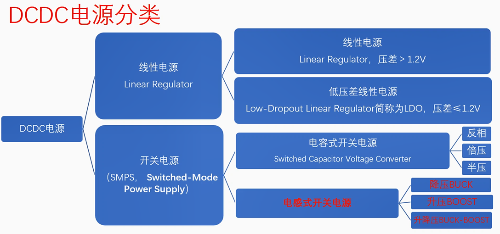
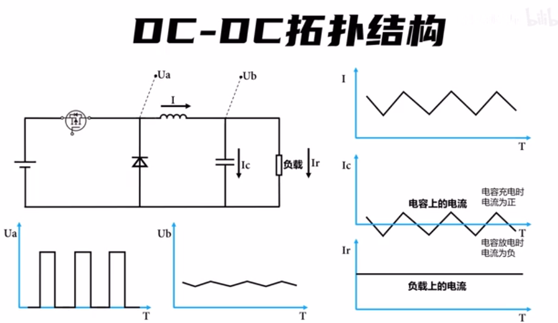

# 电源分类

## LDO

LDO（low dropout regulator，低压差线性稳压器），其功能是保证在一定的输入电压范围内和一定的负载变化范围内保证稳定的输出电压。

## 开关电源

开关电源：开关稳压电源。

LDO和开关电源的优缺点：

| LDO          | DCDC           |
| ------------ | -------------- |
| 纹波小       | 纹波大         |
| 效率低       | 效率高         |
| 发热高       | 发热低         |
| 成本低       | 成本高         |
| 简单         | 复杂           |
| 静态功耗低   | 静态功耗高     |
| 输出电流较小 | 能输出较大电流 |

# 基本原理

开关电源的原理：通过高频率的开关操作来控制输出一个PWM波，再通过一些操作使得输出特定的电压。开关电源中通常包含了两大基本构件：DC-DC变换器和电压调整器。

- DC-DC变换器：DC-DC变换器是将直流电压转换为易于使用的直流电压。
- 电压调整器：检测输出电压，并将其与内部参考电压相比较，如果出现偏差就会触发调整。

# Buck变换器

Buck变换器：即降压变换器。

1. 开关通常使用MOS管或功率三极管，由PWM信号开控制开关的高速开闭切换。
2. 

# Boost

# Buck-Boost

# 反激

FLYBACK 反激电路

# 推挽

PUSH-PULL 推挽电路

# 半桥

HALF BRIDGE 半桥电路

# 全桥

FULL BRIDGE 全桥电路

# Spice

SEPIC 电路

# LLC

# RCC

