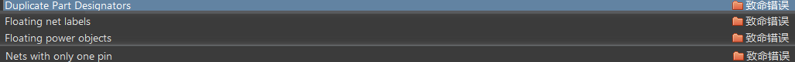

# 学习目标

学AD做什么：做电子设计，一方面是学习使用AD，另一方面是做电子设计——包括原理图设计（电路设计）和PCB设计。

初学 —— 按照看图、改图、建封装、画原理图、画PCB图、出资料这样的顺序，先把简单的学明白了：

- **看图：**会打开，会缩放，会查找，会选择
- **改图：**会改连线、改名字、调用库里的元器件
- **建封装：**建原理图封装和PCB封装
- **画原理图和PCB图：**这个就不用多说了。
- **出资料：**原理图输出BOM、PCB图输出Gerber和SMT资料等。

后续 —— 原理图设计。

总结：画元件（原理图库）、画元件封装（PCB元件库）、设计原理图（原理图）、设计PCB（PCB）。

# 0.工程创建

1、PCB工程创建：文件 → 新的 → 项目 → PCB工程。

2、为新建的工程添加：

- Schematic Library —— 原理图库。
- Schematic —— 原理图。
- PCB Library —— PCB元件库。
- PCB。

原理图：原理图只注重原理上的一个解释，注重各元件的连接。

原理图库：原理图库的元件不需要和实物尺寸有什么关系，电气管脚、管脚名称什么的标好就行。

PCB元件库：需要关注元件实际的尺寸和引脚位置。

PCB：layout、emc、阻抗匹配等。

# 1.原理图库

**1、概念 —— 关于元件符号：**

画元件模型，用于原理图绘制，原理图库的元件模型不需要和实物尺寸有什么关系（但对于管脚序号和名称则要一一对应），元件模型仅仅是充当元件的一个符号，这些元件符号是元件在原理图上的表现方式。

元件符号组成，一般由以下四部分组成：

1. 元件边框。（即元件形状，芯片、排针类元件一般是矩形、圆角矩形等来充当，电容、电阻类的就是使用线条、弧线画出图像符号）
2. 管脚（包括管脚序号和名称）。
3. Design Item ID（元件名称）。
4. Description（元件描述、说明）。

元件直接通过放置的管脚来建立电气连接关系。**对于管脚序号和名称，要严格按照元件规格书中的说明一一对应好。**

**2、操作 —— 绘制元件符号：**

1.点击进入xxx.SchLib后，在左边的Schematic Library面板中通过add...（添加）按钮来设置元件名称并添加元件。添加后双击元件可以对其属性进行设置，通常设置以下四个属性：

- design item ID：元器件名称。
- designator：元件位号，必须需要的，可以方便元件查找和设计，在PCB上一般都要求丝印出来。（xxx的文字符号加上一个问号）
- comment：填写注释，比如电容，可以在这里注释220uF（不过通常使用Value属性来设置这些信息）。
- description：器件描述，什么器件、器件作用、或者该器件是什么封装等等。
- （Footprint：该属性是用来选择元件的封装的，不过一般在后面根据选型来统一为各个元件添加封装，而不是画一个添加一个（看个人喜好）。）

 

放置功能 —— 绘制元件符号，通过放置以下一些东西来达成目标，工具栏中的放置选项或者原理图中鼠标右键 → 放置，可放置的选项如下：

属性更改 —— 在放置选项中选择好要放置的东西后，按Tab键可以对其进行属性的修改，比如颜色、长度、宽度、名称等等。

管脚 —— 可用空格对管脚进行旋转，管脚上有四个白色小矩形那侧是用于导线与导线之间的连接的，另一侧则是连接到元件边框的。

设置捕捉栅格 —— 可通过工具栏上视图 → 栅格 → 设置捕捉栅格来设置捕捉栅格，这样在原理图上画线时就会按照设置好的栅格长度进行捕捉，画出想要的线条长度（默认是一个栅格长度，也就是以栅格长度为最小值来进行线条的绘制）。

绘制元件：

- 对于**电阻电容**模型的创建：放置管脚、放置线、放置圆弧。

- 对于**IC类**元件模型的创建：放置矩形外框，然后放置管脚。

- 对于STM32之类的比较多引脚的芯片：查看芯片数据手册，找到引脚图，然后使用封装向导创建元件 —— `工具 → Symbol Wizard`，设置引脚数量和引脚排列，修改Electricl Type为Passive，然后填入管脚名称(Display Name)，填写完后点击 Place Symbol 就可以放置到原理图库中了。

- 对于一些管脚名称有上划线的，在字母后面加上反斜线即可，例如：`E\N\` → $\overline{EN}$。

- 对于**排针类**元件模型的创建：放置外框、放管脚、设置参数。（管脚放置可以使用特殊功能粘贴命令）
- 对于**二极管**元件模型的创建：放置管脚，然后使用多边形画三角形、使用多边形画长方形等。

位号总结：电阻（`R?`）、排阻（`RP?`）、电容（`C?`）、排容（`CP?`）、电感（`L?`）、集成电路芯片（IC类，一般`U?`）、排插或跳线（`J?`）、三极管（`Q?`）、二极管（`D?`）、集成电路（`IC?`）、整流桥（`DB?`）、保险丝（`F?`）、晶振（`Y?`）、连接器（`CN?`）、发光二极管（`LED?`）、蜂鸣器（`LS?`）。

对齐功能 —— 可以设置多个对象的对齐方式，具体操作为将要对齐的一些东西选中后，按`A`键就可以出现对齐选项面板，选择需要的对齐方式即可，如果需要设置快捷键，可以选中并按A键后，再按住`ctrl`键并选中某一项即可设置这一项的快捷键。

移动选中对象功能 —— 选中要移动的对象后按M键，在出现的选项面板选择`移动选中对象`，然后在编辑界面点击一下就可以对选中对象进行整体的移动了。

特殊功能粘贴命令：

1. 选中管脚并复制。
2. 然后，功能菜单栏的编辑选项 → 阵列式粘贴，设置好参数，点击确认 → 在元件编辑界面上点击一下左键即可。

关于现有元件模型库的调用：

- 有原理图的情况下：可以通过AD的功能菜单栏上的设计 → 生成原理图库 → 按默认情况分组并确认，然后就可以生成一个原理图库，然后就可以复制其中的元件符号到我们的项目中。

**3、操作总结：**

1. 重点注意管脚，管脚的序号和位置要和实际元件事物的管脚吻合。
2. 基本操作步骤：新建原理图库 → 添加元件 → 元件属性设置 → 画图 → 放管脚 → 仔细核对检查。（元件符号类先放管脚再画图）
3. 底部的状态栏：功能菜单栏的视图 → 状态栏，点击就会开启或关闭；底部状态栏的Panels用于切换到各个编辑界面。

# 2.画原理图

图纸设置：双击图纸的外边框即可弹出图纸的设置窗口，可设置图纸大小等。

原理图绘制的步骤：

- 第一步：将需要用到的元件从元件库中拿出来，放置到图纸上。
- 第二步：摆放元器件，一个一个模块去画原理图，尽量美观，以对齐为原则；各个元件要设置好位号、Value值（元件的comment）（也可画好之后再设置），连线后要适当微调以保持美观。每画完一个模块都要检查连线、检查元器件，放大仔细检查。
  `模块绘制顺序，从主控芯片开始？还是从信号走向开始？或者从电源开始？`
  `可以使用工具 → 标注 → 原理图标注，来对元件位号进行统一设置`
- 第三步：用绘图工具内的线将各个模块分隔，并使用文字标识好各个模块，画之前、之后再分割都可以。

如果需要将修改后的原理图库内的元件加载到原理图上，修改后选中该元件并右键单击更新原理图即可。

一些悬空的排针、芯片引脚，可以使用通用No ERC标号来进行一个标记，放置 → 指示 → 通用NoERC标号。

# 3.PCB封装库

PCB 封装是我们电子设计图纸和实物之间的映射体，PCB封装要求数据的精准。在实际设计中需要从对应的规格书当中获取实物的数据参数，然后利用 Altium Designer 一些便捷的功能快速地创建出元件的封装。

完整的PCB元件封装包含：

1. PCB焊盘：用于焊接器件的管脚。
2. 管脚序号：与元件的原理图的管脚是一一对应的。
3. 丝印：用于表示封装实体的大概范围。
4. 阻焊：这里的阻焊是指阻焊开窗，用于防止绿油覆盖，使得焊盘可以和元件连接。
   阻焊层是覆盖铜线和 PCB 材料的 PCB 油层，用于绝缘和保护 PCB 外部免受短路和环境的影响。在阻焊层上，你需要创建开口（窗口）以允许 PCB 焊盘焊接或连接，以及一些没有覆盖 PCB 墨水的过孔以进行散热。阻焊层上的这些开口称为阻焊开口。
   简单来说，阻焊层开孔（开窗），就是去掉电路上的漆层，使电路可以露出锡。
5. 标识：定位器件的正反方向、管脚方向，1脚标识、芯片正端标识。

1、常见CHIP类封装：电阻、电容、SOT类、贴片二极管等。

2、常见IC类封装：SOP封装等。

## 元件封装操作

**元件封装操作的基本步骤如下：**

**1、找到元件规格书，因为需要里面的实物数据参数。**

以1N5819 —— SOD-123 Plastic-Encapsulate Diode为例：

- 焊盘尺寸：宽度b的最大值为0.65mm；长度L的参考尺寸为0.5mm（E1的最大值减去E的最大值再除以2，结果也是0.5左右）。
- 焊盘中心距：E最大值加上焊盘的L即得到两个焊盘的中心距。
- 丝印：D、E的尺寸就是丝印的尺寸。
- 标识：第一个图的大黑线。

**2、放置焊盘并设置焊盘属性、大小、形状。**

双击焊盘来对焊盘进行设置，Size and Shape中用于设置焊盘形状和大小，Properties中用于设置焊盘属性，焊盘属性有以下几个：

- Designator：管脚位号。
- Layer：焊盘所在层，如果是表贴器件就是Top Layer——表贴焊盘，如果是通孔就是Multi-Layer——过孔焊盘。
- Electrical Type：电气类型。
- Pin Package Length：
- Jumper：

焊盘默认都有阻焊。

切换单位在视图 → 切换单位。

焊盘复制：选中焊盘后按Ctrl + C键，然后点击某个点，再按Ctrl + V键。（这是以某个点到复制对象的距离为偏移量来进行目标的复制粘贴）

焊盘放置之特殊粘贴：选中焊盘后按Ctrl + C键，然后点击某个点，再在功能菜单栏中的编辑 → 特殊粘贴 → 阵列粘贴 → 设置好参数点击确认，最后回到界面点击一下即可。

精确移动焊盘：先将焊盘重叠，然后选中焊盘后按M键，点击通过X、Y移动选中对象。

测量距离：Ctrl + M。

清除测量线：Shift + C。

将原点定位到两焊盘中心：功能菜单栏的编辑  → 设置参考 → 中心。

**3、放置丝印并设置。**

丝印所在层：Top Overlay。

画丝印：

- 在中心点画竖线，然后选中，通过精确移动将线移动到目标位置（根据元件规格书的D、E来确定位置）。
- 选中线段，`Ctrl + C` → 点击中心点 → `Ctrl + V` → X键——左右翻转，Y键——上下翻转。
- 横线也同以上操作。
- 提供以上操作画出了丝印的两个横线、两个竖线的位置标记，然后就可以按这些标记，使用线来画出完整丝印框体。
- 画出完整丝印框后，删除用于定位的线段。
- 放置丝印线条时可按空格键切换横走线或竖走线。

**4、标识的放置：标识一般有管脚标识、正负标识、元件正方向标识。**

使用填充、圆等来放置。

chip类封装：

IC类封装：

- （丝印油墨会覆盖掉焊盘的一部分的时候，可以将覆盖焊盘的那部分线段去掉，去掉的方法为单击 编辑 → 移动 → 打断走线，然后在要截断的导线位置双击一下即可截断，最后删除掉不需要的部分）
- 图中9焊盘为散热焊盘。

**5、数据核对：核对一下尺寸是否在最大值范围内。**

## IPC封装向导

右上角用户图标 → 拓展和更新 → 在打开面板中的 Software Extensions 找到IPC Footprint Generator，如果没有的话则需要安装。

使用IPC封装向导来对元件进行封装：单击工具 → `IPC Compliant Footprint Wizard...`打开封装向导：

1. 选择组件类型（Component Types），然后点击Next。（这里选SOP/TSOP）
2. 填写数据，这里的数据可以从元件规格书找到，填写好点击Next。
3. 是否要添加散热焊盘，Next。
4. 默认，Next。
5. 密度选择，低、中、高，一般低、中，Next。
6. Next。
7. Next。
8. Next。
9. Next。
10. Next。
11. Next。
12. Next。
13. Finish。

## 封装库的调用

建议：新手阶段多画一些封装，待熟练后再使用第三方封装库。

如果有PCB文件，可以使用 设计 → 生成PCB库来生成。

AD18的提取3D模型。

## 3D模型

画3D模型，最终目的是核对实物结构。有3D元件体和3D Body两种。

3D元件体：

- 点击放置 → 3D元件体，然后在丝印出画线即可，默认3D元件体是灰色的（可在Display中的Override Color自定义颜色），需要设置一下3D元件体的高度 —— Overall Height。
- 3D模型类型——3D Model Type：extruded长方体、cylinder圆柱体、sphere球体。
- 3D Model Type里的Source里的Embed Model，指定使用第三方3D素材文件(.step文件)。（AD20的3D Body实际上也是放置这种3D元件模型的，3D元件体即可以自定义也可以放置一些.step3D元件模型）

AD18的提取3D模型。

[IC封装网 (iclib.cn)](https://iclib.cn/)

## 安装第三方库

# 4.封装添加

绘制原理图图完毕后添加封装（没有的封装需要自己画封装），使用封装的统一管理来添加封装，在工具 → 封装管理器，单击打开封装管理面板，主要关注元件的位号、注释、当前封装。

# 5.编译(验证)原理图

原理图的编译设置及检查：编译、检查后即可导入封装到PCB，进行PCB的布局和布线。

1、点击功能菜单栏的工程 → 工程选项，来对常用的一些报告错误进行设置：

- 器件位号重复 → 设置为致命错误。
- 网络标签悬空 → 设置为致命错误。
- 电源对象悬浮 → 设置为致命错误。
- 单端网络        → 设置为致命错误。（网络只连一个管脚，没有连到其它任何地方；单端网络不一定是错误，和硬件工程师确认这些单端网络是允许存在的后，就可以忽略点不去处理）

菜单栏Project点开后选择展开的菜单的第一个，编译后发现这些错误，就会显示错误信息在Message中，要确保所有的错误都解决掉。没有就可以进行下一步了。

# 6.导入及评估

## 6.1.导入PCB

器件导入到PCB：

> 原理图编译完成后，点击 `设计 → Update PCB Document xxx.PcbDoc`，在出现的面板点击`Yes`后进入工程变更指令面板，执行`验证变更`，一般不勾选指令末尾的`Add Rooms`指令，最后点击`执行变更。`

错误解决：

>关于错误`Unknown Pin`、`Failed to add class`，出现的原因可能是：
>
>1. 元件没有对应封装。
>2. 元件管脚数与对应封装引脚数不匹配。
>3. 元件的管脚号与封装的不匹配。
>
>`Unknown Pin`解决方法：
>
>1. 方法一：根据原因，比对好管脚数、管脚位号。
>2. 方法二：如果曾经 `设计 → Update PCB Document xxx.PcbDoc`时没有任何错误并导入`xxx.PcbDoc`成功，然后要更改元件库内容并更新原理图后，再次 `设计 → Update PCB Document xxx.PcbDoc`时出现`Unknown Pin`错误，那就删除原来的`xxx.PcbDoc`，再重新新建一个`xxxx.PcbDoc`，再次 `设计 → Update PCB Document xxxx.PcbDoc`即可。
>
>常见绿色报错的消除：
>
>- 绿色报错的原因：是一些规则的问题，与规则冲突的就会报绿色错误。可以在 `工具 → 设计规则检查`中，关闭一些规则检查。
>- 元件或丝印的间距导致的绿色报错：点击`设计 → 规则`来打开PCB规则及约束编辑器，Placement → ComponentClearance，将最小水平间距和最小垂直间距设置为0。（间距的安全距离一般为8mil，最小可设置为4mil）
>- T + M，复位错误标志。

元件封装的属性里面设置元件所在层、所在位置等。

## 6.2板框评估及叠层设置

**1、板框评估——板框是否放得下所有元器件：**

1. `工具 → 器件摆放 → 在矩形区域排列`，将所有元器件摆放在一块矩形区域。
2. 进行板框评估：在Mechanical 1层放置线条，画一个矩形板框，比上面的矩形区域大一些。
3. 设置原点：原点放于板框左下角。
4. 调整板框尺寸为整数。
5. 标记尺寸：`放置 → 尺寸 → 线性尺寸`。
6. 将板框内元器件移出一边，然后进行板子形状的定义：选中板框，`设计 → 板子形状 → 按照选择对象定义`（快捷键是DSD）。
7. 固定孔放置：如果有固定孔的话，一般距离边界5mm。

关于两层板和四层板：

- 层数越高，生产成本越高。
- 两层板的设计难度比四层板高。
- 信号质量：四层板质量好一些。

**2、修改叠层：**

叠层设置：`设置 → 层叠管理器`，打开层叠管理器，默认是两层板：

- Top Overlay：丝印层。
- Top Solder：阻焊层。
- Top Layer：信号层。

打开层叠管理器后，修改为四层板——选中Top Layer，单击鼠标右键，添加两个负片层（Add Internal Plane），操作如下：（Add Layer是添加正片层，Add Internal Plane是添加负片层）

- Add layer：添加中间层（正片层）。中间层可以作为走线来用，**和普通的信号层没有什么区别，只是走线在内部了**。是正片腐蚀。
- Add Internal Plane：添加内电层（负片层）。内电层是整个完整的平面，是整个的覆铜的，是负片腐蚀，即有走线的地方是腐蚀掉的。（可以做电源层，也可以做地层）

添加层数后修改层数名称，最终如下（GND02——作地层，PWR03——作电源层）：

`Shift + S`用于切换显示模式，单层显示、多层显示等。

**4、将GND、PWR层连接到网络：**

- 选中`GND02`，双击，设置连接到`GND`网络。
- 选中`PWR03`，双击，设置连接到`VCC3.3`网络。

补充：

>**正片层就是平常用于走线的信号层（直观上看到的地方就是铜皮）**。**负片层正好相反，即默认敷铜，就是生成一个负片层之后整一层就已经被敷铜了。**pcb的制作有正负片之分，**正片就是我们平常理解的那样，画线的地方有铜皮，没画线的就没有。负片则是画线的地方没有铜皮，没画线的地方才有铜皮。**双面板的底层和顶层都是正片做的。在多层板里面，对于地平面和电源平面这样大块铜皮的层，一般用负片在制作，负片的数据量小，只需要将整个平面做一定的切割。正片就是layer，负片就是plane。在protel的层设置里面就有add layer和add plane两种新建层的命令。在正片可以走线，敷铜，放置过孔和元件等，在负片上只能通过画line来切割平面，切割开的每个部分可以单独设置net，不能在负片上走线、敷铜。当然也可以用正片加敷铜来实现地平面和电源平面，但是无疑负片更适合，数据量更小，pcb工厂也方便加工，添加过孔后也不用rebuild。敷铜的每一个改变都需要rebuild，使得软件运行速度很慢。负片是电脑慢的年代 为了画面刷新快搞得。
>
>画板建议：可以都设置成正片，正片负片只是PCB制作时的方式不同，画板时全部设成正片不易出错，负片只是为了出GERBER时更小，方便板厂制作。负片就是为了减小文件尺寸减小计算量用的。有铜的地方不显示，没铜的地方显示。这个在地层电源层能显著减小数据量和电脑显示负担。不过现在的电脑配置对这点工作量已经不在话下了，不太推荐负片使用，容易出错。焊盘没设计好有可能短路什么的。电源分割方便的话，方法有很多，正片也可以用其他方法很方便的进行电源分割，没必要一定用负片。如果是刚开始学习的话，我觉得忘记负片就好了。对你的工作不会有什么影响。
>————————————————
>版权声明：本文为CSDN博主「把钱打进来」的原创文章，遵循CC 4.0 BY-SA版权协议，转载请附上原文出处链接及本声明。
>原文链接：https://blog.csdn.net/qq_34287529/article/details/105044833

## 6.3PCB快捷键设置

PCB设计时，推荐使用快捷键。

深色的为默认的快捷键：

| 功能                                                         | 快捷键   |
| ------------------------------------------------------------ | -------- |
| 走线（在放置里）                                             | F2       |
| 过孔（在放置里）                                             | F3       |
| 铺铜（在放置里）                                             | F4       |
| 矩形区域排放器件（在工具 → 器件摆放里）                      | F6       |
| 线选（按S键 → 线接触到的对象，作用：画线来选中线触碰到的对象） |          |
| 框选（按S键 → 区域内部，作用：画框来选中框体内部对象）       |          |
| 左对齐（按A键）                                              | Num4     |
| 右对齐（按A键）                                              | Num3     |
| 顶对齐（按A键）                                              | Num8     |
| 底对齐（按A键）                                              | Num2     |
| 水平分布（按A键）                                            | Num7     |
| 垂直分布（按A键）                                            | Num9     |
| 器件位号排列                                                 | Num5     |
| 差分线（布线 → 交互式差分对布线）                            | Alt + F2 |
| 删除整根走线（即布线 → 取消布线 → 连接）                     | Alt + Q  |

# 7.PCB—布局

布局就是指器件之间的摆放关系，主要由前后板的连接关系和信号的走向来确定。

## 7.1模块化布局规划

思路：先按原理图的一个个模块，在PCB将各个模块内的元件都分别集中放于一处，区分成各个功能单元。

操作：

1. 原理图、PCB垂直分割：在原理图标签那点击右键 → 垂直分割。
2. 打开交叉选择模式：`工具 → 交叉选择模式`。
3. 原理图选中模块内的所有元件，PCB中对应的元件也会被选中。（按住Shift可以连续框选）
4. 点击一下PCB界面，`工具 → 器件摆放 → 在矩形区域排列`（或者按快捷键F6），画一个框即可将模块内的元件都放到该框位置。
5. `工具 → 交叉探针`：可以在PCB上点击器件，然后就能快速定位到该器件在原理图上的位置。
6. 将电源走线隐藏：`设计 → 类 `（快捷键DC），在Net Classes添加一个电源类`PWR`，将电源、地都添加进去；然后在右下角的Panels打开PCB侧边栏，找到PWR并点击右键，然后选择`连接 → 隐藏`，就能隐藏这部分的走线。

## 7.2布局

思路：

- 先大后小原则：先大的功能模块，再小的功能模块。（大模块太大的话，从大模块里的小模块，一步步细分布局）

- 先按**信号流向**对各个功能模块进行摆动。
- 注意一些特殊元器件的要求：比如晶振应该尽可能靠近MCU，USB的D+、D-通信线应该走线平行等长等。

操作：

- 使用交叉探针。
- 联合功能的使用：功能模块摆放好后，可以选中后点击鼠标右键，选择`联合 → 从选中的器件生成联合`，这样移动联合的器件中哪一个都会整体移动。
- 布局的时候可以先把飞线都隐藏掉，操作为`N键 → 隐藏连接 → 全部`。（显示则为：`N键 → 显示连接 → 全部`）
- 改变位号丝印大小：选中一个元件位号丝印，然后`右键 → 查找相似对象`，将String Type改为Same，点击确定，然后将Text Height改为10mil，将Stroke Width改为2mil。
- 改为位号丝印的位置：Ctrl + A选中所有器件，然后`A键 → 定位器件文本`，在标识符那里选上中心那个按钮，将位号都放在元件中心上。
- 查找模块间的相关性：使用高亮显示，`Ctrl + 鼠标左键`，点击一下就可以高亮显示。

## 7.3优化和调整

优化元件的摆放位置，对齐元器件，尽量使得布局美观。

# 8.PCB—规则及布线

## 8.1Class、设计参数、规则创建

Class：主要用于将电源走线和信号走线进行区分。

规则：`设计 → 规则`来打开PCB规则及约束编辑器：

1. Electrical：电气性能规则，包含间距、短路、开路规则。
2. Routing：包含信号线宽规则、过孔规则、拓扑结构规则、差分线规则。
3. SMT：贴片规则。
4. Mask：阻焊规则。
5. Plane：铺铜规则。
6. TestPoint：测试点规则。
7. Manufacturing：。
8. Placement：器件放置规则。
9. Signal Integrity：信号完整性规则。

**常用的规则：（打开PCB规则及约束编辑器）**

1. 间距规则：
   Electrical → Clearance → Clearance ，设置最小间距为6mil（N/A改为6mil）。
2. 线宽规则
   - Routing → Width → Width，设置最小线宽为6mil。
   - Routing → Width，右键新建一个规则，规则名称为`PWR`，然后Where The Object Matches里选择Net Class，选择PWR类（该类为新建的电源、地的类），将Min Width设置为15mil，Preferred Width 设置为15mil，Max Width设置为60mil。（需要设置该规则优先级，否则可能会被其它优先级高的覆盖；还要注意是否勾选新建规则的使能，比如PWD的使能在Routing → Width）
3. 过孔规则：
   - Routing → Routing Via Style → Routing Vias，设置过孔孔径最小、最大、优先都为12mil，过孔直径的计算公式为`过孔最小孔径 * 2，再加上2mil、减去2mil`，这就是过孔直径的范围计算公式。（12mil，因此设置直径都为22mil）
   - 设置好后放置过孔时并不是按照设置的大小来，这是需要在设置里找到`PCB Editor → Defaults`，并在Defaults里找到Via，设置Hole Size为12mil，Diameter设置为22mil，再把Tented勾选上（勾选上就是盖绿油）。
4. 铺铜规则：
   - Plane → Power Plane Clearance  → Plane Clearance，设置间距为8mil。（负片层设置）
   - Plane → Polygon Connect Style → Polygon Connect，建议设置为十字连接（考虑手工焊接——使用十字连接（relief connect，浮雕孔），考虑载流——使用全连接（direct connect，直接连接），考虑回流焊——使用全连接）。高级功能还可以对表贴焊盘、过孔焊盘等进行设置。
5. 丝印和阻焊的距离：
   - Manufacturing → Silk To Solder Mask Clearance →  SilkToSolderMaskClearance，设置对象与丝印层的最小间距为2mil，到时再去`工具 → 设置规则检查`里将丝印与对象的间距规则检查勾选上。

## 8.2扇孔及铺(敷)铜

操作：

- 铺(敷铜)：`放置 → 铺铜`，画出铺铜轮廓后鼠标右键，然后双击铺铜区域，选择网络，然后再选中铺铜区域，`鼠标右键 → 铺铜操作 → 重铺选中的铺铜`。（铺铜就是另一种走线方式，把相同网络连接起来，相当于用大而粗的导线连接起来）
- 扇孔：放过孔。

哪些要铺铜？电源、地等可能需要铺铜，通常可以先不连GND网络，最后铺铜（铺铜区都连接到网络）。

为什么要铺铜？	

>一、铺铜的原因
>1、EMC要求。对于大面积的地或电源铺铜，会起到屏蔽作用，有些特殊地，如PGND起到防护作用。
>2、PCB工艺要求。一般为了保证电镀效果，或者层压不变形，对于布线较少的PCB板层铺铜。
>3、信号完整性要求，给高频数字信号一个完整的回流路径，并减少直流网络的布线。
>当然还有散热，特殊器件安装要求铺铜等等原因。
>
>二、铺铜的好处
>降低地线阻抗，(所谓抗干扰也有很大一部分是地线阻抗降低带来的)数字电路中存在大量尖峰脉冲电流，因此降低地线阻抗显得更有必要一些，普遍认为对于全由数字器件组成的电路应该大面积铺地，而对于模拟电路，铺铜所形成的地线环路反而会引起电磁耦合干扰得不偿失(高频电路例外)。因此，并不是是个电路都要普铜的（BTW：网状铺铜比整块整块的铺性能要好）
>
>二、电路铺铜的意义在于：
>1、铺铜和地线相连，这样可以减小回路面积
>2、大面积的铺铜相当于降低了地线的电阻，减小了压降从这两点上来说，不管是数字地，或模拟地都应该铺铜以增加抗干扰的能力，而且在高频的时候还应该把数字地和模拟地分开来铺铜，然后用单点相连，该单点可以用导线在一个磁环上绕几圈，然后相连。不过如果频率不算太高的话，或者仪器的工作条件不恶劣的话，可以相对放宽些。晶振在电路中可以算做一个高频发射源，你可以在周围铺铜，然后将晶振的外壳接地，这样会好一点。
>
>三、铺铜的整块与网格有甚么区别？
>具体的来分析一下大概有3种作用：
>1、美观
>2、抑制噪声
>3、减少高频干扰（在电路板上的理由）
>根据走线的准则：电源跟地层尽可能走宽为什么要还要加网格啊不是跟原理不符合吗？如果从高频的角度来看的话更是不对了在高频布线时最忌讳的就是尖锐的走线，在电源层有n多的90度则问题多多。其实为什么那样做完全是工艺的要求：看看那种手工焊的有没有那样画，几乎没有；你看到有这样画的肯定上面有表帖芯片的那时因为在贴片的时候有一种工艺叫波峰焊他要对板子局部加热如果全铺铜的话2面的比热系数不一样板子就翘起来而板子一翘起来问题就来了，在上钢罩（也是工艺的需要）对芯片的pin很容易出错废品率就直线上去了其实这个做法也是有缺点的：在我们现在的腐蚀工艺下：菲林很容易粘在上面这样的话，在后面强酸工程中，那个点可能腐蚀不了，废品也不少，但是只有的话，只是板子坏了而上面是芯片跟板子一起完蛋！从这个角度来看的话，你懂为什么要那样画了吗？当然了，也有的表贴的没有加网格，从产品的一致性的角度来看问题的话，可能有2中情况：1、他的腐蚀工艺很好；2 、他不用波峰焊而是采用了更高级的回炉焊，但是这样的话，个水线的投资要上去3－5倍.
>————————————————
>版权声明：本文为CSDN博主「君王的羔羊」的原创文章，遵循CC 4.0 BY-SA版权协议，转载请附上原文出处链接及本声明。
>原文链接：https://blog.csdn.net/GQ_Sonofgod/article/details/104013953

扇孔的目的：

> 扇孔的目的有两个：打孔占位和减少回流路径！
>
> - 比如GND孔。就近扇孔可以做到缩短路径的目的！
> - 预先打孔是为了防止不打孔后面走线的时候很密集的时候无法打孔下去，这样就可能要绕很远连一根GND线，这样就导致很长的回流路径了。这种做高速PCB设计及多层PCB设计的时候经常遇到。预先打孔，后面删除也很方便，反之等你走线完了再想去加一个过孔就很难了，这时候你通常的想法就是随便找根线连上便是，不能考虑到信号的SI，不太符合规范做法。

## 8.3PCB布线—信号线走线

 

## 8.4PCB布线—电源线走线

## 8.5信号线优化与GND处理

## 8.6灌铜

按L，关闭显示一些层。

为整个表层、底层铺铜。（铜区一般是GND层、电源层）。

# 9.PCB—TheEnd

## 9.DRC检查及丝印调整

DRC（Design Rule Check，设计规则检查）。

## 9.2拼版

## 9.3V-cut及邮票孔拼板

## 9.4Gerber文件的输出及整理

