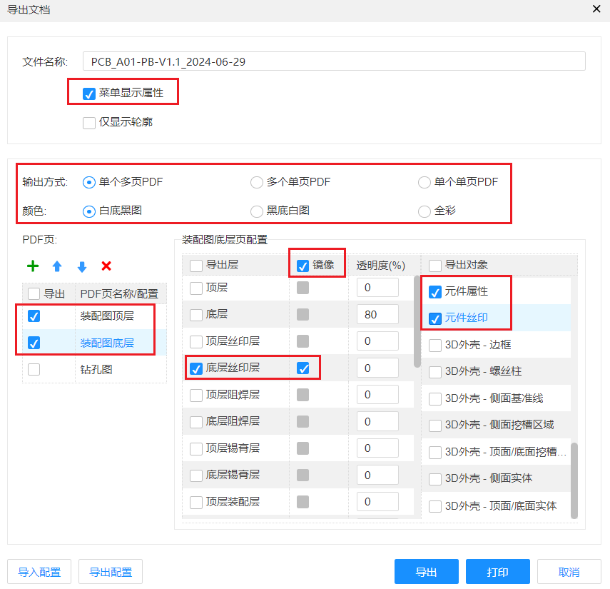

# 导出参数图

1. 打开右侧的过滤栏，然后隐藏全部，再点击“元件”的小眼睛使之可视。
2. 回到PCB界面，`Ctrl + A`快捷键全选，然后点击打开右侧的属性栏，选择对象仅选元件，然后找到里面“关键属性”的“值”勾选即可。
3. 各元件属性值会以丝印形式出现在PCB上，然后选择顶栏菜单栏的“布局”里面的“属性位置”，选择好位置即可。
4. 导出：顶层菜单栏选择“文件”  → 导出 → PDF（图片）→ 导出文档，导出时的配置如下图：

装配图顶层：导出层选择顶层丝印层，导出对象选择文本、元件属性、元件丝印。

装配图底层：导出层选择底层丝印层并且勾选上镜像，导出对象选择文本、元件属性、元件丝印。

