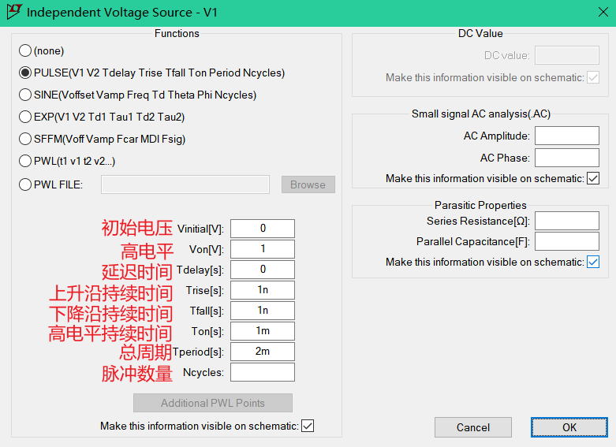
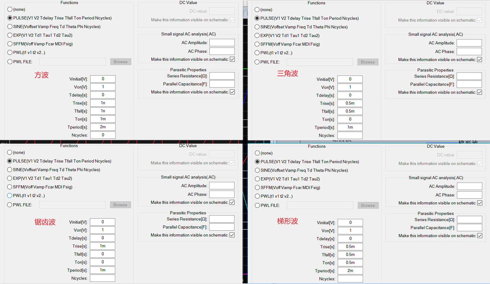

# LTspice

## 下载

[LTspice信息中心 | Analog Devices](https://www.analog.com/cn/resources/design-tools-and-calculators/ltspice-simulator.html)

安装24.0.9版本。

## 基本操作

新建原理图：File → New Schematic。

放置元件：Edit → Component，弹出选择元件窗口，然后根据名称选中所需元件，再点击Place，在原理图上点击一下即可，鼠标右键单击为取消操作。或者按快捷键`P`弹出元件窗口。

旋转元件：使用快捷键`Ctrl + R`。

设置元件参数：鼠标移动到元件上面点击鼠标右键即可打开设置面板。

放置导线来将元器件连接起来：快捷键`W`。

放置地：注意仿真都需要放置一个地并连入电路中。

仿真配置：时域的暂态分析，需要告诉软件仿真多长时间，按快捷键`A`即可打开仿真配置，点击OK后放在原理图上任意位置即可。

视图移动：按住鼠标左键拖动，即可移动整个电路。

仿真示例：

如果要删除图中所示的波形，在工具栏点击那个X（按快捷键`Ctrl + X也行`），然后移动到左图中的V(n002)点一下即可删除对应波形。

工具栏以及依次说明如下：

- 全局设置
- 新建原理图（Ctrl + N）
- 打开（Ctrl + O）
- 保存（Ctrl + S）
- 打印（Ctrl + P）
- 仿真配置（A）
- 运行仿真（Alt + R）
- 垂直平铺窗口
- 水平平铺窗口
- 级联窗口
- 放大（选中后通过鼠标框选原理图或仿真结果图可以实现局部放大）（Z）
- 缩小（Shift + Z）
- 恢复大小（Space，空格键）
- 垂直自动范围（Ctrl + Y）
- 拾取可见痕迹
- 导线（W）
- 地（G）
- 电压源（V）
- 电阻（R）
- 电容（C）
- 电感（L）
- 二极管（D）
- 元件（P）
- 网络标签（N）
- 文本（T）
- spice directive（.）
- 删除（Backspace 或 Del）
- 复制（Ctrl + C）
- 移动（M）
- 黏性移动（S）（选中的元件和接上的导线都将被移动）
- 旋转（Ctrl + R）
- 镜像（Ctrl + E）
- 撤销（Ctrl + Z）

## 量级后缀

## 独立电压源和电流源

按快捷键`V`，即可调出电压源。

**直流电压源：**在电压源上点击右键，即可设置直流电压源的电压值和内阻。（有点时候没有电源内阻，电路可能不会收敛，这时就得设置一下内阻了，当然，如果不这样设置可以外接一个电阻来充当内阻）

**网络标签与电压显示：**网络标签的PortType可设置可不设置，表示端口是输出或输出等的电气属性。

**电流源：**按快捷键`P`，然后找到current即可。

**相对测量：**测量两个端点的电压差

1、如下图，在文字那点击右键，然后编写表达式即可。

2、按住鼠标不放，这是拖动相当于探针切换为黑表笔：

3、这样也可：在弹出的窗口的Expression(s) to add来编写表达式

## 正弦波、衰减正弦波、正弦脉冲串

按快捷键`V`调出并防止好电压表，然后鼠标右键对电压表打开参数设置面板，选择高级设置Advanced：

- 直流偏置：正弦波叠加一个直流量。
- 幅度：正半周期、负半周期峰峰值是多少。
- 频率：正弦波的频率。
- 延迟：信号延迟多长时间才出现。
- 衰减系数：正弦波衰减速率。
- 相位：超前或落后多少相位。
- 正弦脉冲数量：产生多少个正弦波形，不设置或者设置为0就是默认为产生无穷多个。

衰减系数：衰减系数可以看作是RC电路中的时间常数的倒数，即$1/RC$。($F(t)=sin(x)e^{-t/τ}，t>0$)

为电容设置初始电压：

小贴士：

- 修改波形的线宽：全局设置里的Waveforms里设置线宽大小 —— Data trace width，光标大小Cursor width。

- 添加绘图窗口：添加后想使用哪个就在哪个上面点击一下就行了。

  

## 方波、锯齿波、三角波

按快捷键`V`调出并防止好电压表，然后鼠标右键对电压表打开参数设置面板，选择高级设置Advanced：

- 初始电压（低电平）：脉冲最低点电压。
- 高电平：脉冲最高点的电压。
- 延迟时间：延迟多长时间才开始产生波形。
- 上升沿：从低电平上升到高电平所需时间。
- 下降沿：从高电平下降到低电平所需时间。
- 高电平持续时间：每个周期内高电平保持多长时间。
- 总周期：脉冲的周期是多少。
- 脉冲数量：用于设置产生的脉冲的数量，设置为0或者不设置则默认为产生无数个。

通过配置上面的这些参数可以产生方波、锯齿波、梯形波等，示例如下：

注意：如果遇到不收敛的问题，可以将设置为0的参数设置成一个较小的数值。

## Exp指数函数

# circuitjs1