# 硬件工程师

- 集成电路 —— 使用硅材料做器件和电路，岗位称为“IC硬件研发工程师”。
- 单板电路 —— 使用集成电路和PCB板搭建电路，岗位称为“单板硬件研发工程师”。

基本的要求有：

1. 原理图设计：
   - 理解项目设计需求，对功能进行拆分。
   - 看懂芯片手册，选用合适芯片。
   - 根据功能设计出符合需求的电路原理图。
2. 搭建硬件平台：知道一些基本的流程，把电路图变成实物。
3. 硬件平台功能测试：测试功能的完备性。
4. 除了自己能够独立设计一些作品外，还要能看懂别人设计的电路，能够移植和借鉴一些已经成熟的模块。

需要掌握的知识：

- 电子电路基础：电路原理、模拟电路、数字电路。
- 电子器件：熟悉常用电子元器件，电阻、电容、电感、三极管、二极管、MOS管、光耦等。
- 实验仪器：万用表、示波器、逻辑分析仪、电烙铁等。
- 软件平台：Altium Designer、PADS、Cadence等一些画原理图、画PCB、电路仿真软件。
- 等等等......

# 知识扫盲

[学习PCB设计前的知识扫盲，新手向，越新手越好！哔哩哔哩  bilibili](https://www.bilibili.com/video/BV1GU4y1N7Z6/?spm_id_from=333.337.search-card.all.click&vd_source=4bcd1346329f94b01a883b5d57e2fe88)

## PCB组成结构

PCB由铜层和绝缘层堆叠组成，一般的PCB结构如下：

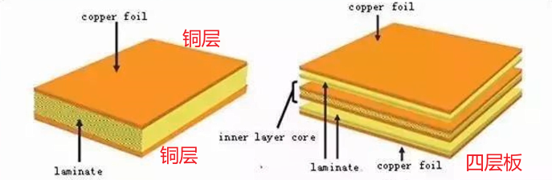

两层板，上面和地面是铜层，中间层是绝缘的，将两铜层给隔离开来。两个两层板之间加上一层叫半预制片的绝缘层，然后压制而成四层板。六层、八层等等都同理。

PCB表面的铜层上面还会有阻焊层（一层油漆），作用：①保护铜线，避免铜线氧化；②阻焊，不需要焊接的地方盖上油墨，隔离了焊盘。阻焊层上还有丝印层：用来印一些东西，比如字。

画电路板到底在画啥呢？

其实就是画电路板的顶层结构，顶层结构就是一张画，例如下面这个顶层结构图：

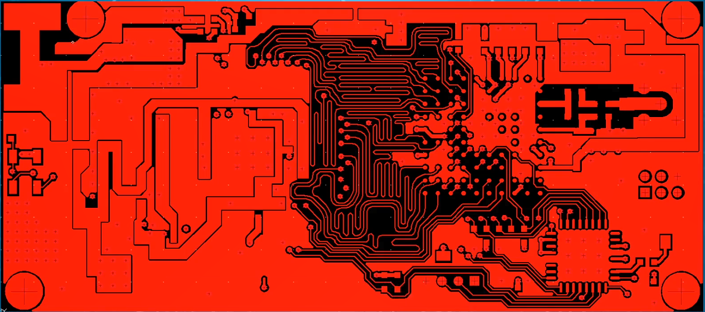

图中黑色的地方表示镂空的，红色的地方表示不透光的。有了这张画就可以给生产厂商来做板子了。顶层结构文件叫GERBER文件 —— 光绘文件。每一层都有gerber文件。

生产厂商拿到gerber文件，就会先做出来一堆胶片，胶片出来之后就再去进行后续工序 —— 在铜层上涂上光敏胶（光敏胶遇光变性），然后通过胶片和光刻机就将镂空的地方显影到了铜层上。 之后就是通过有机溶剂洗一下，将镂空的地方裸露出来，后面再经过蚀刻（三氯化铁与铜的反应），将不需要的铜都转为溶液流走。

后续还要将不同的层进行层压、钻孔、沉铜（孔壁内镀上铜）......   刷绿油、刷字、电测、出厂。

## 工艺指标

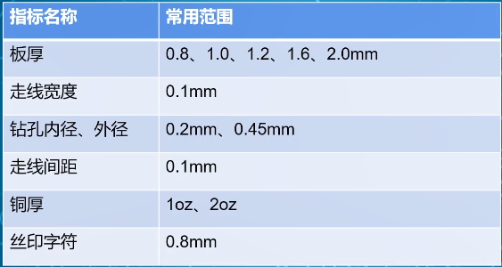

电路板的孔 —— 通过钻头来打出来。线 —— 通过腐蚀来形成的。这些精度和工艺有关。

- 板厚：电路板多厚，层数越多，板厚最小厚度越大。
- 走线宽度：常规工艺一般是0.1mm及以上。
- 钻孔内径、外径：不能太小，否则把外沿给打没了，就没法焊上了。
- 走线间距：一般和走线宽度一致。
- 走线到焊盘、过孔外沿的间距：一般比走线间距大一些，一般都是0.15mm。
- 铜厚：常规工艺一般每单位面积1盎司铜。（2盎司铜一般用于电源过大电流的情况）
- 丝印字符高度：一般的公司都给出1mm的丝印高度。

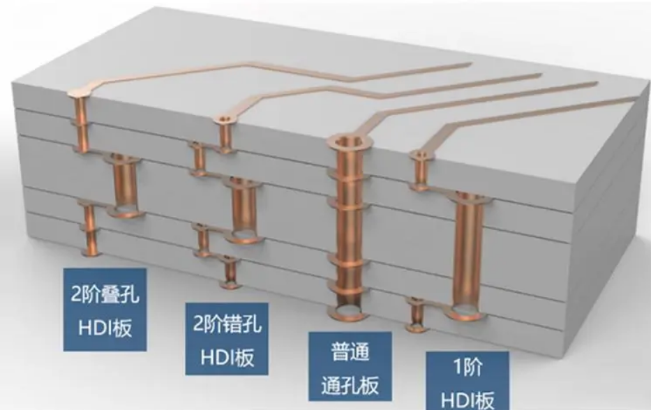

## PCB图

元件封装。

布局：器件之间的摆放关系，主要由前后板的连接关系和信号的走向来确定。

布线：连线，线就是指一根铜线，通过铜线把应该连接在一起的引脚给连接起来。

敷铜：。

PCB的叠层设计：一般六层板及以上，就需要将每一层用于做什么的给设计好。四层板的叠层设计也不多（第一层信号层、第二层地层、第三层电源层、第四层信号层）。六层板典型叠层设计：（信号1、地、信号2、信号3、电源、信号4，最近信号层是信号1、信号2，次佳信号3、信号4）

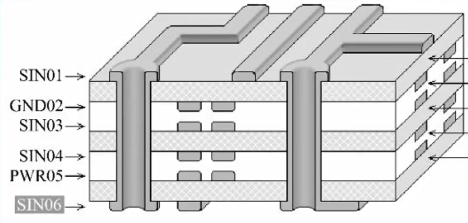

两层板比四层板麻烦，六层板比四层板麻烦。

## PCB图中的各个板层

**1.顶层信号层(TopLayer)：**也称元件层，主要用来放置元器件，对于比层板和多层板可以用来布线;

**2.中间信号层(MidLayer)：**最多可有30层，在多层板中用于布信号线。

**3.底层信号层(BootomLayer)：**也称焊接层，主要用于布线及焊接，有时也可放置元器件。

**4.顶部丝印层(TopOverlayer)：**用于标注元器件的投影轮廓、元器件的标号、标称值或型号及各种注释字符。

**5.底部丝印层(BottomOverlayer)：**与顶部丝印层作用相同，如果各种标注在顶部丝印层都含有，那么在底部丝印层就不需要了。

**6.内部电源层(InternalPlane)：**通常称为内电层，包括供电电源层、参考电源层和地平面信号层。内部电源层为负片形式输出。

**7.机械数据层(MechanicalLayer)：**定义设计中电路板机械数据的图层。电路板的机械板形定义通过某个机械层设计实现。

**8.阻焊层(SolderMask焊接面)：**有顶部阻焊层(TopsolderMask)和底部阻焊层(BootomSoldermask)两层，是ProtelPCB对应于电路板文件中的焊盘和过孔数据自动生成的板层，主要用于铺设阻焊漆。本板层采用负片输出，所以板层上显示的焊盘和过孔部分代表电路板上不铺阻焊漆的区域，也就是可以进行焊接的部分。

**9.锡膏层(PastMask-面焊面)：**有顶部锡膏层 (Top Past Mask)和底部锡膏层 (Bottom Past mask)两层，它是过焊炉时用来对应ＳＭＤ元件焊点的，也是正片形式输出，它和阻焊层的作用相似，板层上显示的焊盘和过孔部分代表电路板上不铺锡膏的区域，也就是不可以进行焊接的部分，不同的是在机器焊接时对应的表面粘贴式元件的焊盘。Protel 99 SE提供了Top Paste (顶层)和Bottom Paste (底层)两个锡膏防护层。

**10.禁止布线层(KeepOuLayer)：**定义信号线可以被放置的布线区域，放置信号线进入位定义的功能范围。

**11.多层(MultiLayer)：**通常与过孔或通孔焊盘设计组合出现，用于描述空洞的层特性。

**12.钻孔数据层(Drill)：**solder表示是否阻焊，就是PCB板上是否露铜；paste是开钢网用的，是否开钢网孔。所以画板子时两层都要画，solder是为了PCB板上没有绿油覆盖露铜)，paste上是为了钢网开孔，可以刷上锡膏。

## 原理图

各器件连接组成完整电路系统。

原理图组成：元件、导线、网络标签。

## PCB设计流程

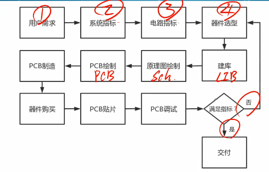

# 电路设计

# 电路系统

通过一个个小电路来搭建成一个符合自己需求的电路系统。

# STM32F103C8T6最小系统—原理图

> [STM32F103C8T6最小系统_来自比邻星的博客-CSDN博客](https://blog.csdn.net/sinat_40936062/article/details/95244689)

单片机最小系统一般组成：电源电路、晶振电路、复位电路、BOOT选择电路、调试下载电路。

阅读STM32F103x8数据手册：

- 首先需要关注数据手册中的Pinouts and pin description（引脚）和Package information（封装），用于绘制原理图元件和绘制封装。（原理图元件和PCB封装）
- 绘制原理图：关注电源、BOOT选择电路、复位、晶振这些。

电源、BOOT选择电路：

- Description → Overview（概述） →  Boot modes（启动模式） 和 Power supply schemes（供电方案）。
  Boot modes介绍了芯片有多少种启动模式，至于如何使用哪种方式来启动，需要参考STM32F10XXX参考手册，参考手册用于说明如何使用该芯片。
  Power supply schemes，即供电方案，从这可以知道芯片需要多大的电压来供芯片正常工作。

复位、晶振：

- Electrical characteristics  →  Operating conditions（工作条件）里：

  ①找到External clock source characteristics —— 外部时钟，这里面会给出晶振大小说明与参考的外部晶振电路。

  ②找到NRST pin characteristics，这里会给出说明以及给出复位电路的参考。

## 0.芯片封装

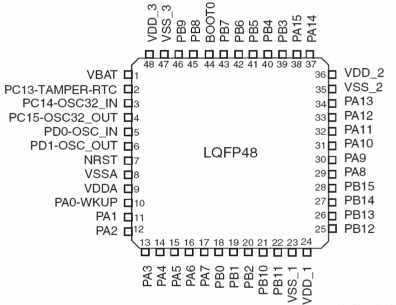

## 1.供电及串口转USB模块

### 器件选型

芯片使用USB供电并且使用USB来烧录程序。

- USB转串口芯片CH340，最小系统板通常选管脚较少的、自带时钟的。这里选CH340N。
- USB选择TYPE-C16个引脚的，选用TYPR-C 16PIN 2MD(073)。（也可以使用micro-usb）

### 使用器件—关于type-c

[Type-C引脚、24Pin Type-C、16Pin Type-C、12Pin Type-C、6Pin Type-C_繁华哟的博客-CSDN博客](https://blog.csdn.net/m0_54849806/article/details/125345444)

type-c协议：

- 《USB Type-C Specification Release 1.4.pdf》
- 《Universal Serial Bus Type-C Cable and Connector Specification Release》，2.0 August 2019。

type-c引脚：

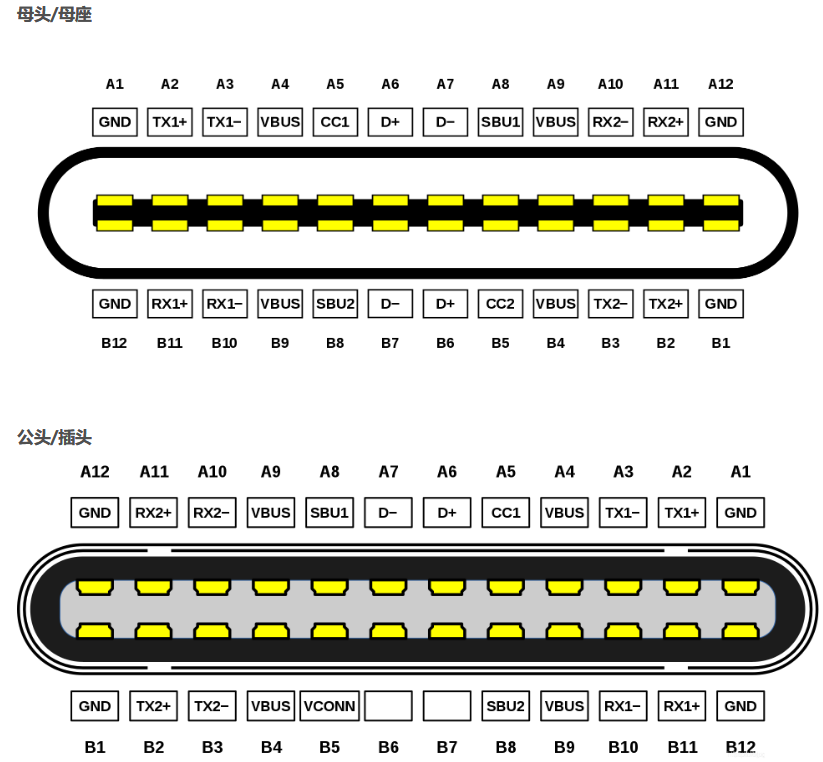

- 插口内的Pin功能相对于中心对称，因此type-c中公头插入母头，无论是正插还是反插，引脚功能都完美契合。
- 电源VBUS/GND都拥有4个Pin，最大支持5A电流，在保证高速数据传输的同时也提高了电流承载能力。
- 24Pin：全功能type-c，支持usb3.0。
- 16Pin、12Pin：普通的MCU都没有USB3.0，只有USB2.0，使用24Pin的TypeC很浪费，于是就有了16Pin的TypeC。16Pin的在24Pin的基础上阉割了USB3.0的TX1/2、RX1/2，除了没有USB3.0/3.1高速传输外，其它别无二致，同样支持 PD快充、音频设备、HDMI传输、调试模式等功能。
  16Pin TypeC和12Pin TypeC其实是同一种接口。16Pin一般为接口厂家、封装的正式名称，而日常生活中习惯称呼为12Pin。
- 6Pin：对于玩具、牙刷等生活用品，产品定位上没有USB通信的需求，只需要USB取电充电，那么连USB2.0都可以省掉了。6Pin TypeC正式出道。
  6Pin TypeC仅仅保留Vbus、GND、CC1、CC2。接口两侧对称分布着两组GND、Vbus，使得正反插功能保留，粗线也让其更为方便的传输大电流。
  CC1、CC2用于PD设备识别，承载USB-PD的通信，以向供电端请求电源供给。在传输电力的同时，USB数据传输不会受到影响。

24Pin 全功能type-c引脚说明：

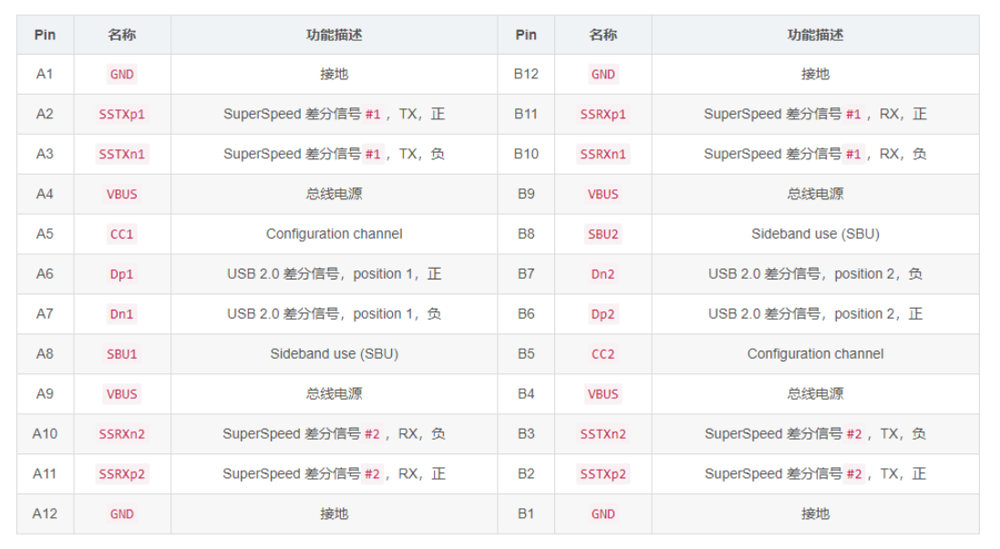

16Pin Type-C引脚：（无USB3.0）

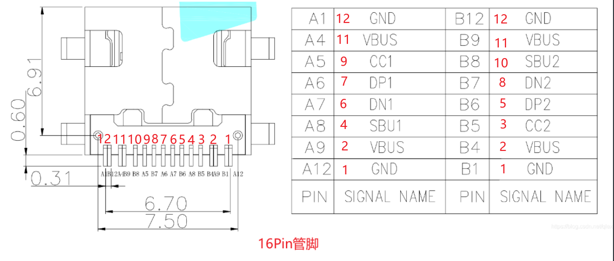

6Pin Type-C引脚：（仅用于供电）

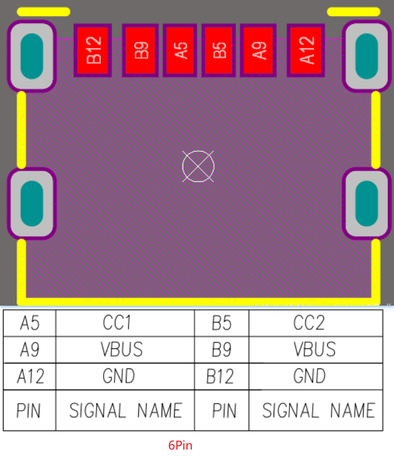

本最小系统使用到16 Pin Type的Pin：

1. 电源得接上：VBUS接电源、GND接地。
2. 使用USB2.0：与USB有关的就是Dp1\Dn1，Dp2\Dn2。

### 使用器件—关于usb转串口

使用USB转串口芯片 —— CH340N。查看CH340的数据手册：

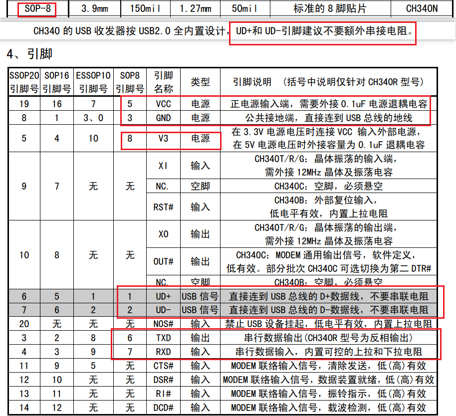

4脚用不到可以悬空。1、2脚连到USB的D+、D-。6、7脚分别接到STM32的RXD、TXD，注意不要接反，否则下载不了程序进去。

### 画原理图

TYPE-C：（外壳处理：[PCB上USB外壳的处理 - 知乎 (zhihu.com)](https://zhuanlan.zhihu.com/p/163715393)）

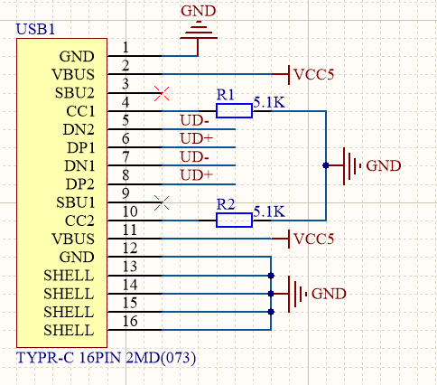

CH340：

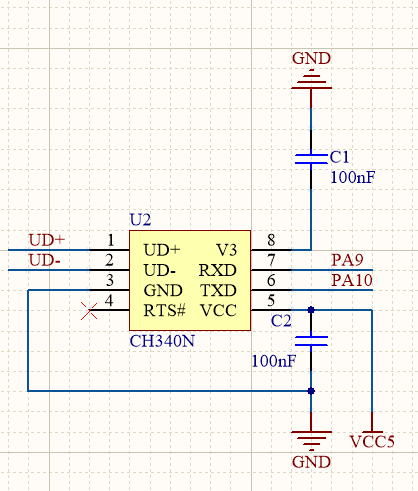

## 2.电源模块

从数据手册Description → Overview → Power supply schemes，可知芯片工作电压在1.8V ~ 3.6V。通常使用3.3V为32位单片机供电。使用USB供电，是5V电压，需要降压到3.3V，因此电源模块分为：USB供电模块以及降压模块。

关于降压：专门用于降压的元器件——LDO（low dropout regulator，低压差线性稳压器）。3.3V的稳压芯片有LB33、me6206a33、ams1117等。

这里使用ME6206A33XG芯片来稳压，下载其数据手册，参考接线：

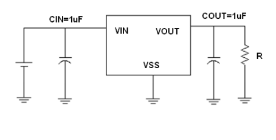

### 画出降压模块：

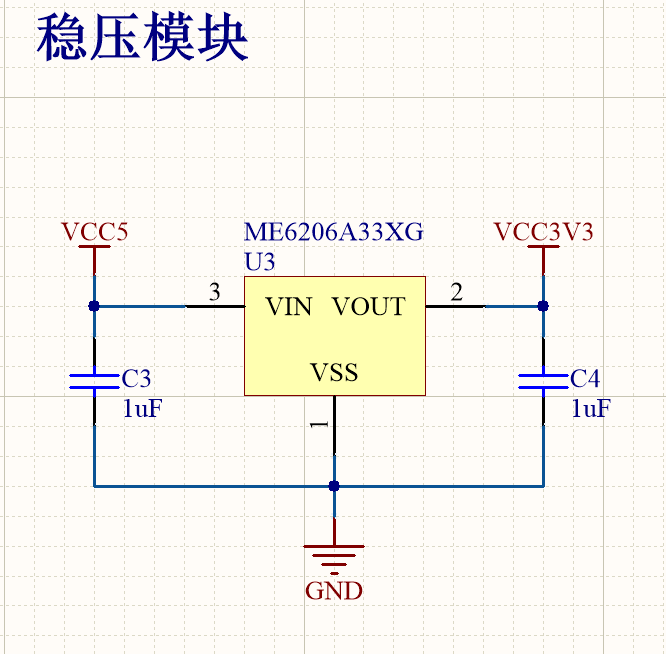

> 输入5V，输出为3.3V。
> 1、输入滤波电容的作用：
> 输入电压，当接入电源，其幅值是从零起始的，波动非常大，加入足够容量的电容进行滤波后，因电容的充放电效应，该脉动直流变成纹波不大的直流电，这是输入滤波的作用。
> 2、输出滤波电容的作用：
> 稳压电路的工作过程需要从输出采样，然后根据其反馈值调节输出以达稳压的目的。如果此时没有输出滤波电容，只要因负载变化带来的电压波动频率恰好与稳压电路的调节速率差不多就会产生振荡效应，导致输出失控，所以稳压输出也必须加滤波电容，而且增加滤波电容也可以进一步增加稳压输出的稳定性。
> 3、大电容和小电容并联的作用：
> 至于与大容量电解电容并联的小电容，其作用在于旁路频率较高的波动电压，因为铝电解电容的制造工艺导致其具有较大的ESL（等效电感），无法滤除高频成份，故需加个小电容。

### 为芯片接上电源：

- 查阅STM32F10xxx数据手册，在Electrical characteristics →  Parameter conditions  → Power supply scheme（供电方案），了解芯片的供电方案，然后接上电源。

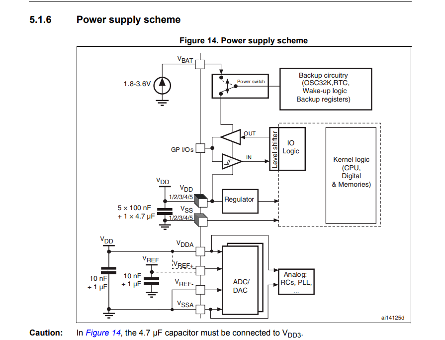

$V_{DD}$接电源（VCC3V3），$V_{SS}$接地（GND）。$V_{DDA}$、$V_{SSA}$，VDD与VSS之间需要接上滤波电容。

查看数据手册，从数据手册Description → Overview → Power supply schemes，有如下说明：

>VSSA, VDDA = 2.0 to 3.6 V: external analog power supplies for ADC, reset blocks, RCs  and PLL (minimum voltage to be applied to VDDA is 2.4 V when the ADC is used). VDDA and VSSA must be connected to VDD and VSS, respectively
>
>VSSA、VDDA=2.0至3.6 V：用于ADC、复位块、RC的外部模拟电源以及PLL（当使用ADC时，施加到VDDA的最小电压是2.4V）。VDDA和VSSA必须分别连接到VDD和VSS。

所以$V_{DDA}$、$V_{SSA}$分别直接和$V_{DD}$、$V_{SS}$接上即可，即接上3.3V和地。

### 先画出滤波电容模块：

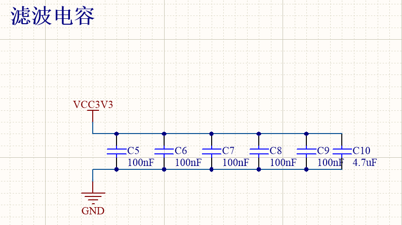

> 主要用来滤除杂波，保持引脚电压的稳定。这些电容也尽量离芯片相关引脚近一点。分布在芯片四周即可。

### 然后为芯片接电源：

$V_{DD}$接电源（VCC3V3），$V_{SS}$接地（GND）。$V_{DDA}$（VCC3V3）、$V_{SSA}$（GND）。

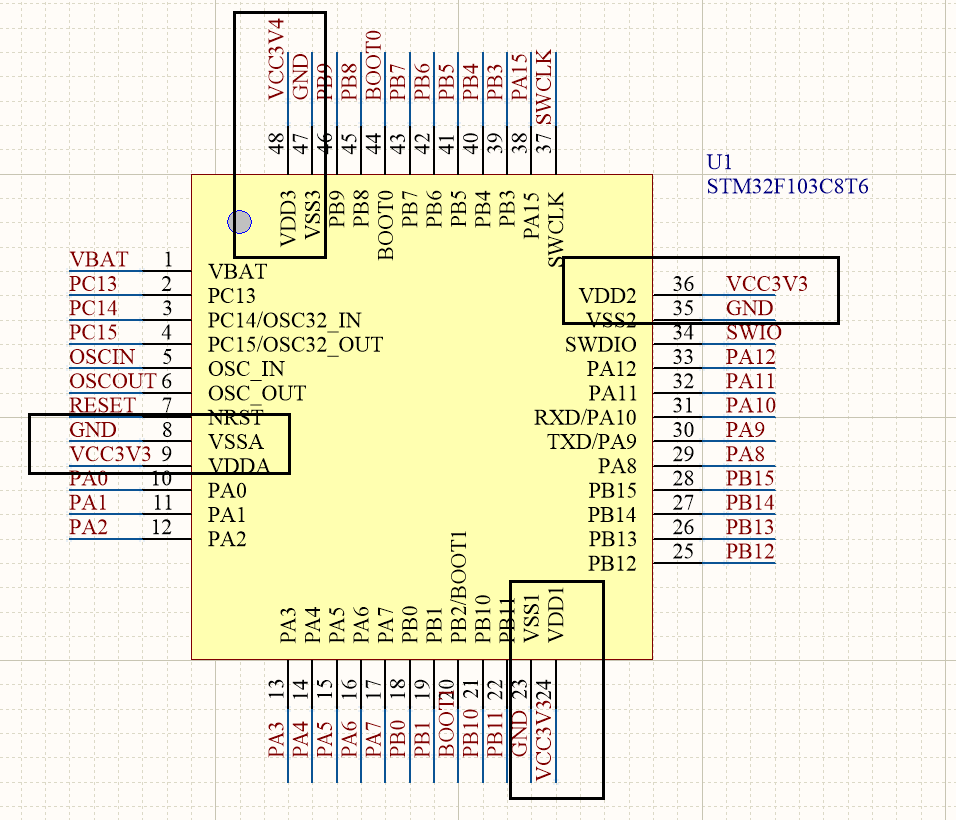

## 3.BOOT选择电路

通过STM32F10xxx数据手册中Description中Overview（概述） → Boot modes，知道了芯片的三种启动模式。

通过STM32F10xxx参考手册（中文）中的启动配置，知道通过两个BOOT引脚的高低电平选择来控制三种不同启动模式。

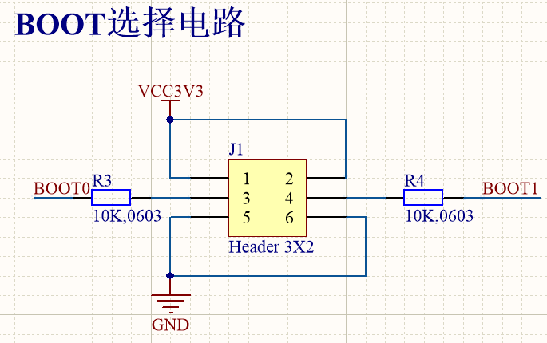

使用插针，通过跳线来实现BOOT选择。

## 4.复位电路

> stm32有三种复位方式：电源复位、系统复位和后备域复位
>
> 电源复位时，当NRST引脚被拉低，产生外部复位，并产生复位脉冲，从而使系统复位。

通过STM32F10xxx数据手册中Electrical characteristics  →  Operating conditions（工作条件） → NRST pin characteristics，阅读关于复位的相关说明：

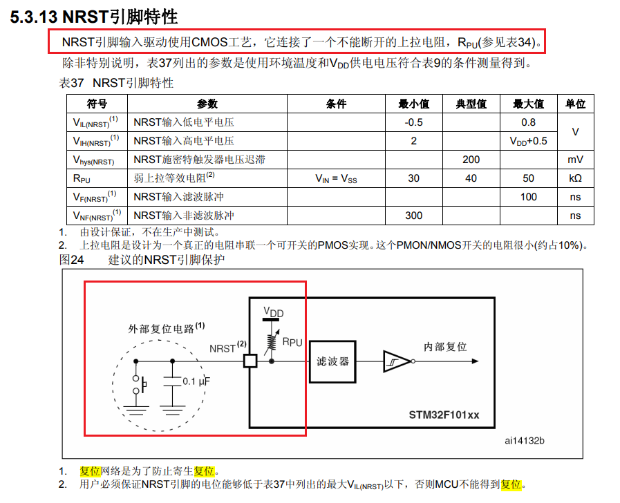

画出复位电路：（RESET网络标签连NRST管脚）

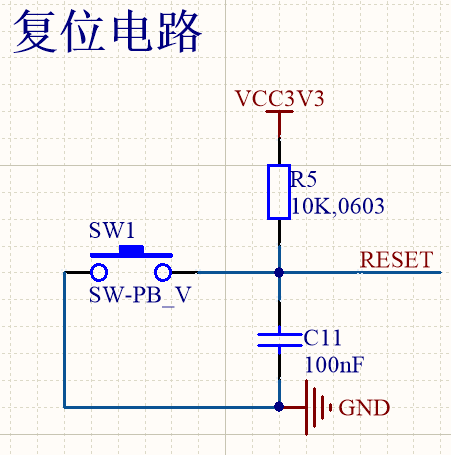

连接一个不能断开的上拉电阻。

电容：用于消抖。

按钮：当按下按钮时，接地 → 低电平 → 复位。

## 5.外部晶振电路

通过STM32F10xxx数据手册中Electrical characteristics 里的 Operating conditions（工作条件），从这里的External clock source characteristics —— 外部时钟，找到外部晶振电路及说明，从而绘制出外部晶振电路。

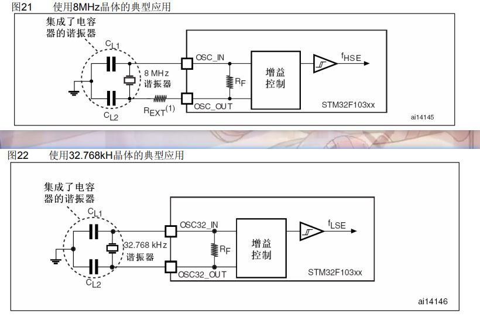

画出晶振电路：

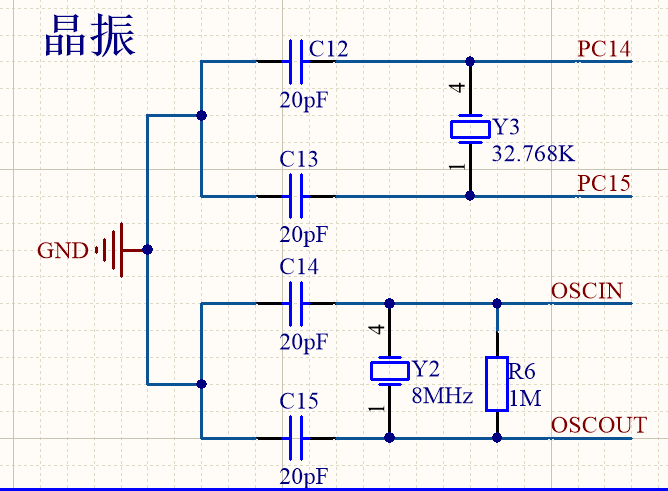

使用晶振HC-49S。

> - 画板时晶振尽量离芯片近一点
> - 晶振底部尽量不要穿过其他支路，防止信号串扰
> - 不同型号的晶振可能需要不同的电路设计，根据自己使用的晶振型号设计
> - 晶振的选择要根据数据手册来选，STM32F103C8T6可选 4~16MHz

## 6.指示灯

电源指示灯和测试指示灯：

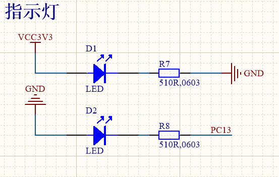

> 注意：如果要使用PC13、PC14和PC15则VBAT需要接3.3V
> 这是因为VBAT引脚和芯片的其他VSS和VDD引脚功能是一致的，都是用来给相邻片区引脚供电。每个VSS/VDD都要外接电源的目的是提供相对纯净稳定的电源。其实只接一组VSS和VDD也是可以的，但是为了保证提供给相邻片区的电源稳定纯净，通常都这样连接。

## 7.调试下载电路

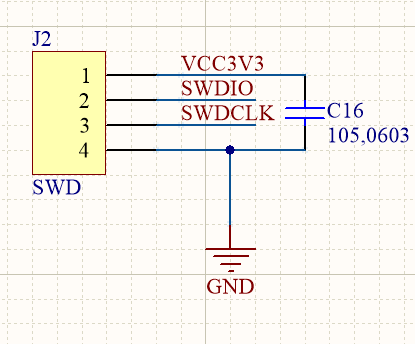

> 采用SW接线方式，PA13对应SWD，PA14对应SWC

## 8.引出引脚

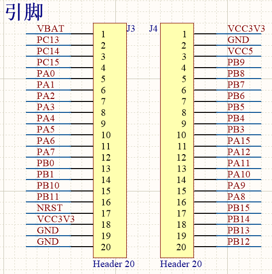

# STM32F103系统—封装

## 电阻电容

0603。

## 插针

## LED

0603、0805。

## 按键

## USB转串口芯片

CH340N —— SOP-8。

## 稳压芯片

ME6206A33 —— SOT-3

## Type-C

16Pin、24Pin、6Pin。

## 晶振

8MHz。

32.768kHz —— MC-306。

# STM32F103系统—画PCB

## 板框评估

结合需求初步决定板子尺寸大小：

- 长度：2100mil。
- 宽度：1200mil。
- 排插并行距离：900mil。

## 布局

布局即摆放元器件，结合需求，根据前后板的关系以及信号的走线来布局。

- 外围：排插放于板子两侧，USB口、SWD口放于板子两端。
- 内部：USB接USB转串口，需要靠一起；BOOT模块和复位键也不能放于底部，得安排在顶部；晶振得尽可能靠近MCU

## 布线

线宽：10mil。

电源线宽：12mil。

# 小电视—原理图

## 器件选型

0603封装的贴片电阻电容：0.1uF（100pF）、1uF、10uF、22uF、2.2nF；220R、1K、10K、12K、13K、40.2K、100K。

电感：0402 封装 6.8uH。RGB灯  WS2812B。陶瓷天线。三极管。FFC/FPC翻盖式下接8P接口。micro sd内存卡卡槽  翻盖式。

主板：

- 主控芯片：ESP32-PICO-D4。
- USB转串口驱动：CP2102 GRM。
- 稳压芯片：MP1471，封装——SOP-23-6。
- 姿态传感器：MPU6050 六轴姿态传感器。
- USB接口：Type-C 16Pin。

## 0.主控芯片封装

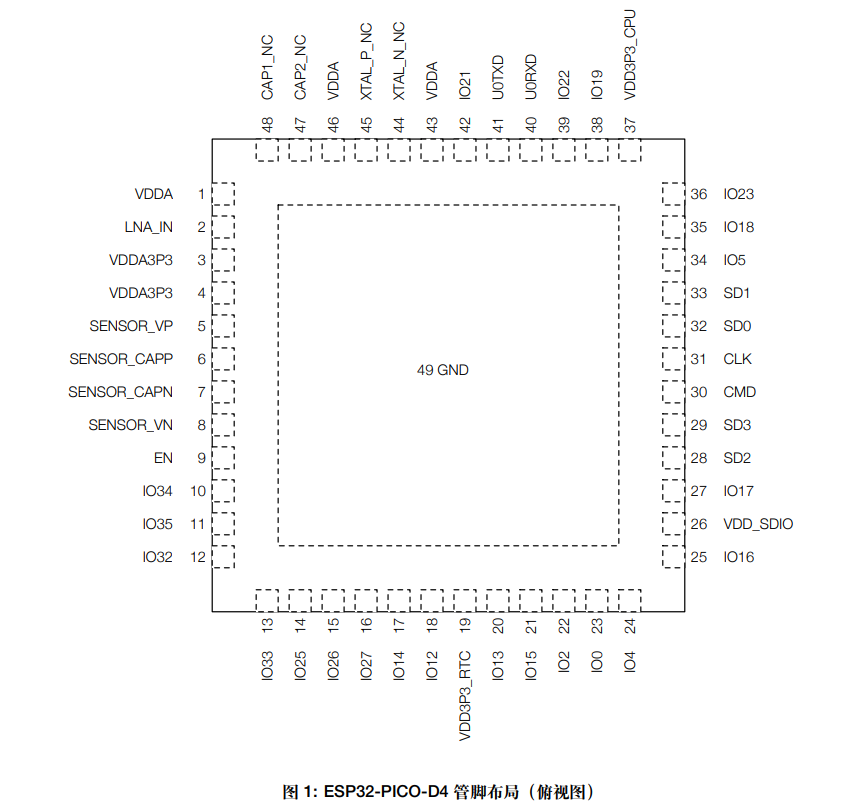

## 1.USB及USB转串口

## 2.电源稳压模块

## 3.

# 小电视—焊接及测试

**每焊一步都要先测5V和地有没有短路！**

1、先焊接Type-C。焊接完通电测试电源、地、D+、D-：

- 使用万用表的蜂鸣器档位，测试电源和地，如果没短路的话则不会滴滴响；再测试地线通不通；再测试5V电源线通不通。
- 测试D+、D-：先测短不短路，再测D+、D-各自通不通。

2、焊接CP2102以及其周边的两个电阻。

- 先测5V和地有没有短路。
- 插电，如果电脑没反应，说明D+、D-可能虚焊了；焊成功电脑会识别出串口。

3、焊接三极管、稳压模块，焊完这些电阻电容。

4、焊接ESP32及周边的几个电阻电容。

5、焊接卡座和天线。

6、焊接液晶板。

7、测试没问题再焊接主板背面的SD卡座。

8、焊接RGB灯。

