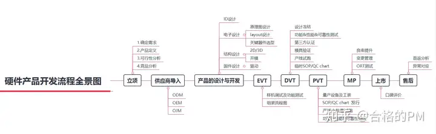
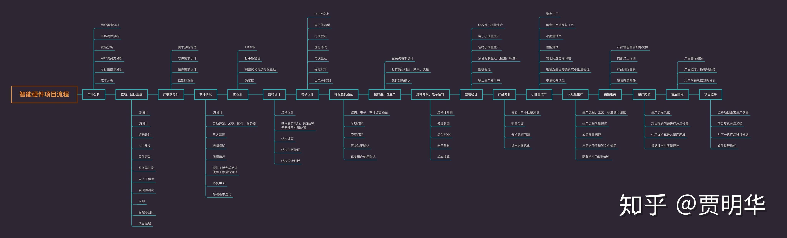
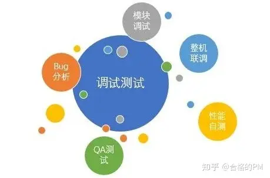
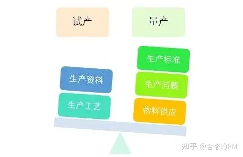

设计一款完整的产品需要经过一系列的步骤，也就是研发流程。每家硬件公司的开发流程都大同小异，只是细分和执行可能略有差异，不影响整体的流程化思想。典型的硬件产品生命周期分为如下几个阶段，硬件工程师基本上全程参与整个产品的生命周期管理。熟悉硬件开发流程，能让我们对硬件开发有一个整体的把控，让我们知道应该在什么样的时间节点，做什么，输出什么。

下面分享几个完整的硬件项目开发流程图，小伙伴们记得保存哦~

**01立项**

在立项之前首先需要确定**产品定位，对市场规模、用户需求、竞品优劣势**等多个环节进行分析。需要对市场和产品有着敏锐的直觉，通过综合分析得出是否具有可行性，若可行，则进入立项评审阶段，通过评审之后便可进入启动阶段。然后根据项目需求来指定项目团队，确定项目经理（或产品经理），由项目经理（或产品经理）发起立项研究，最后输出立项报告。

**研发参与立项评估，包括但不限于可行性、风险警示、硬件成本、热性能、demo性能指标评测、结构设计等内容**，最后输出**立项评估报告和硬件成本BOM**等技术资料支撑产品立项决策。项目经理（或产品经理）要对整个项目负责，及时向领导汇报工作进度并了解每个组员的工作情况。然后由项目经理（或产品经理）对组员进行分配工作，明确各自职责。

**02计划**

在启动阶段，我们需要组建项目团队，确定产品参与人员，沟通是项目经理（或产品经理）的一项职能，如何将所有的参与人员集合一起共事，如何更有效的沟通，明确各自的职责并为项目团队准备好办公区域及设备。以上完备之后，项目将正式启动。

组建完团队之后，进入计划阶段。这个阶段就需要对产品需求进行确定及核心功能提炼，制定进度计划表，从启动项目到完成项目的整个流程的各个时间节点及各个阶段的进度计划，规划新物料的采购、项目成本的管理、质量管理、定义产品质量度量指标等。

**03设计**

硬件工程师的主场，硬件工程师负责**参考设计分析、关键模块原理分析、物料选型、原理图设计及评审、PCB设计及评审、PCB仿真优化、物料打样、工程样机制作**等工作，需要在不同的项目节点输出相应的开发文档。

**设计可分为三个部分:**

①硬件设计（包括原理图设计，PCB设计，元器件选型等）；

②软件设计及开发；

③整机验证（结构、硬件、软件结合验证等）。其中，硬件设计过程中要跟结构工程师紧密配合，新物料的封装一定要反复确认，确保能正常安装。

在项目物料设计选型阶段，一般原厂、方案商或器件供应服务商会提供市场成熟的行业产品应用方案供硬件工程师参考

**注意，硬件设计的过程中，如果条件允许，最好能亲手搭建电路确保电路的可行性再投板。这样避免了多次投板，既节约了时间成本，又节约了经济成本。**

**04打样**

打样前，一定要仔细检查PCB的网络和走线。如果可以，最好有第三方帮忙查看。要反复检查，确认硬件电路和结构没问题，就可以开始打样了。

在打样的时间里，项目经理需要定期检查样品的进度和质量，避免出现较大的进度延迟或失误。这期间也要积极检查电子备料，是否有新物料未申请，要及时询问跟踪。即使一颗小螺丝，也要认真对待。相信不少公司出现过这种情况，新物料早早就申请了，其实就是个小配件，没有这个配件，整机就无法正常安装，从而影响这个项目的进度。但是忘记跟踪，然后去查才发现，采购忘记买了。虽然看起来是采购的问题，但是自己也有跟踪不到位的责任。

**05调试**

调试是对设计方案的验证。这一步非常重要，虽然在之前也做了很多严密的工作，但是依旧不能保证覆盖实际应用中的各种场景。有时候会很顺利，基本没什么问题，但有时候也会因为一两个问题，耽误几天甚至一两周的时间。这也是考验解决问题能力的时候。

硬件工程师主要负责**各模块的功能调试、整机的性能验证及测试bug分析**。硬件工程师的测试更侧重于技术指标，属于白盒测试；测试部的测试更侧重于产品性能体验，属于黑盒测试；两者从不同维度考量产品的性能，侧重点不一样，互为补充。

不同类型的产品会有差异化的模块，但电源、接口、存储、时序、射频等大都会涉及，硬件设计者需要理解各模块的基本原理、测试方法及评价标准，同时需要注重调测过程中的细节问题，调测阶段需要提前制定好详细的调测计划，细分拆解测试项，合理分配调测任务，设置好重要的时间节点，做好调测数据的评审与把控。

另外，设计出来的东西是要拿给客户用的，调试好后最好交给第三方进行测试验证，往往能发现新的问题，然后再解决，这样的产品才能经得起时间的考验。

**06生产**

主要涉及生产资料移交、工艺评审、生产标准制定、生产问题分析、物料替代等工作。这个阶段是将工程设计逐步转化为产品的过程，除了技术上的考量，还要兼顾生产工艺、生产效率、生产检验、生产品质、生产一致性、物料供应等问题，需要多和工程、采购部门沟通，兼顾多方利益，协调合理需求。

**① 试产小批量**经过测试，把发现的问题进行修复之后，就可以进行小批量生产了，小批量生产我们需要确定生产流程、生产工艺以及是否有更好更快的办法方便生产。此时可开始对产品进行各方面的认证申请，比如3C认证。**② 大批量**小批量生产一段时间后，如果没问题就可以大批量生产了。还要时常关注售后，收集客户反馈的信息，对产品不断升级，不断优化。批量生产前都需要先做一台样机，进行首件测试，确认贴片、插件以及打板正常。