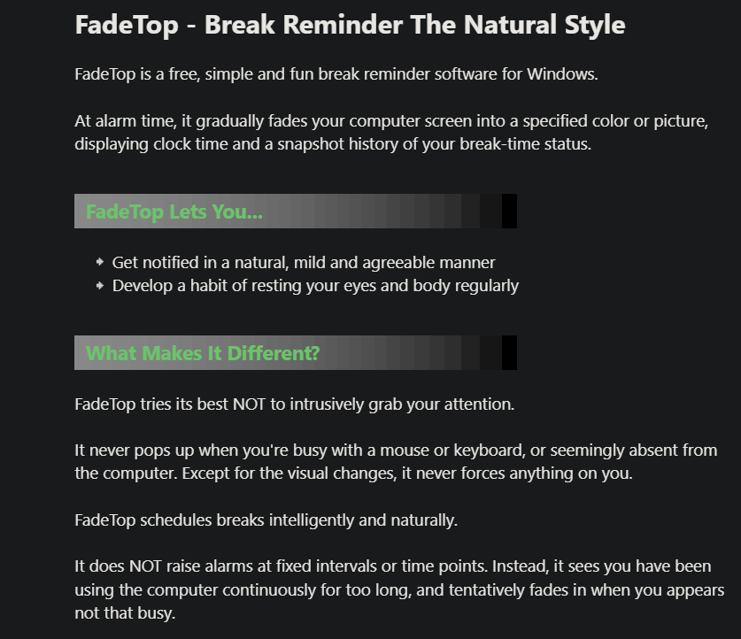
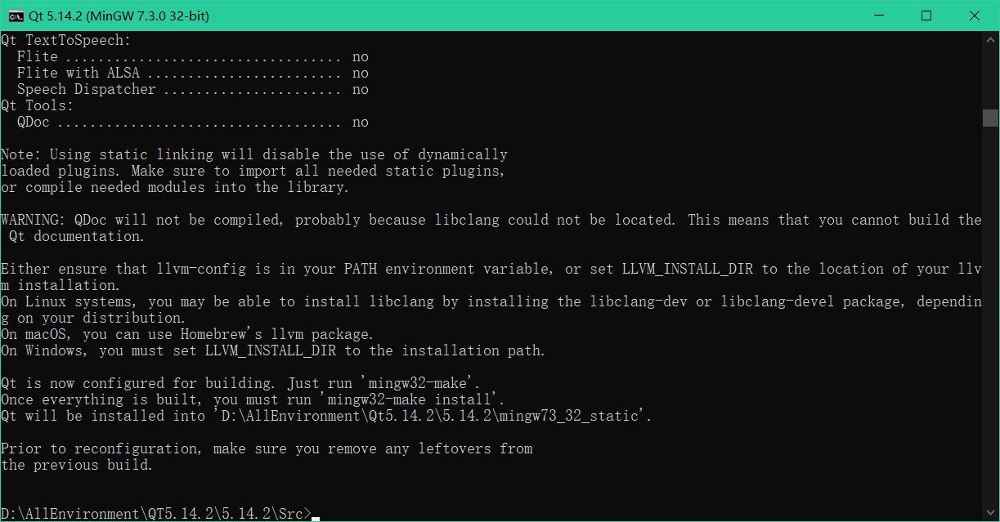
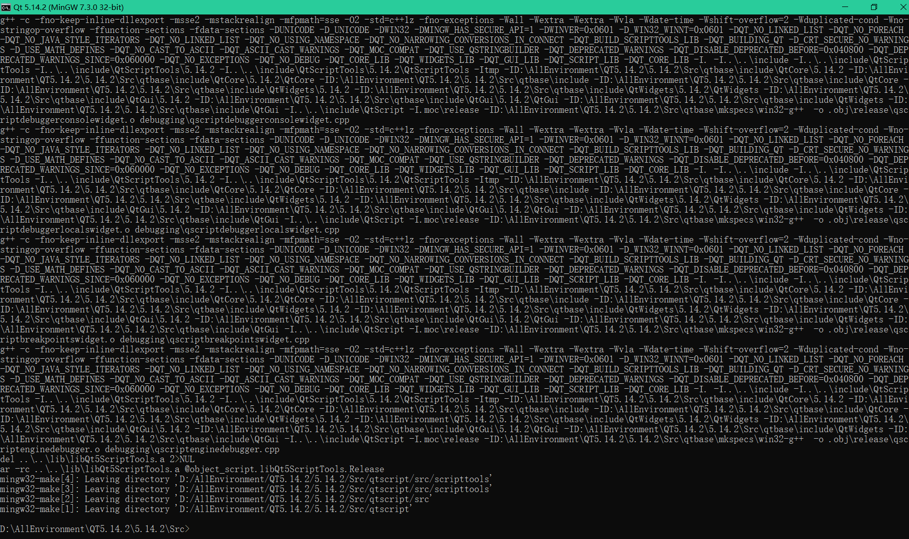
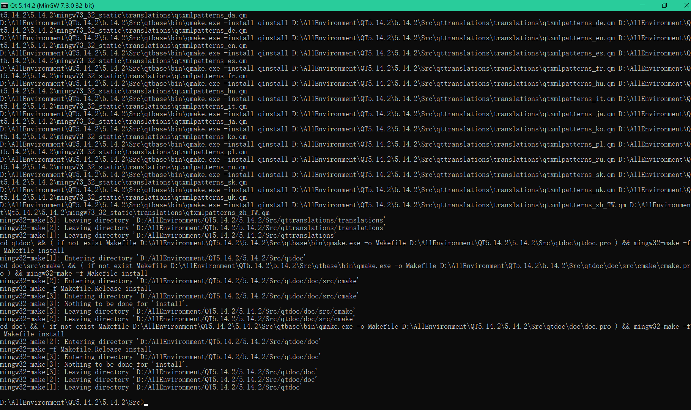
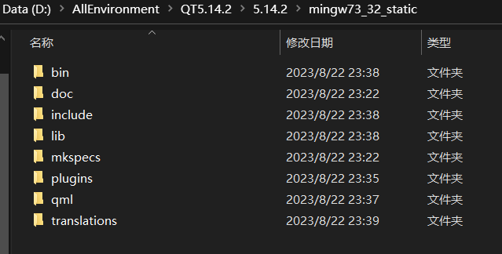
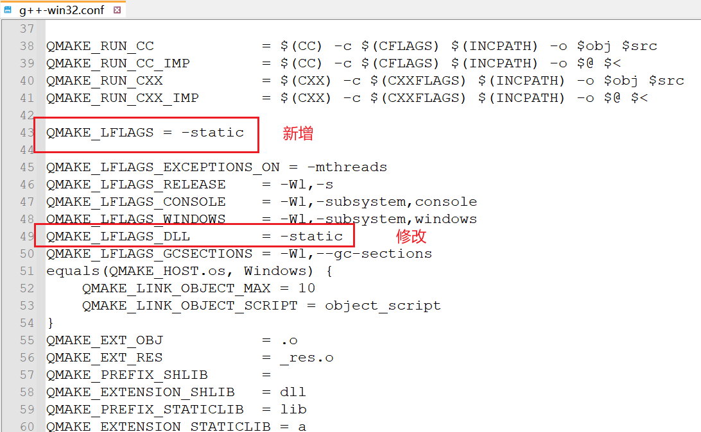
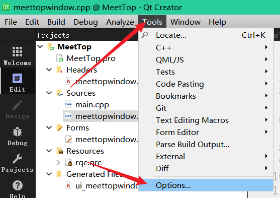
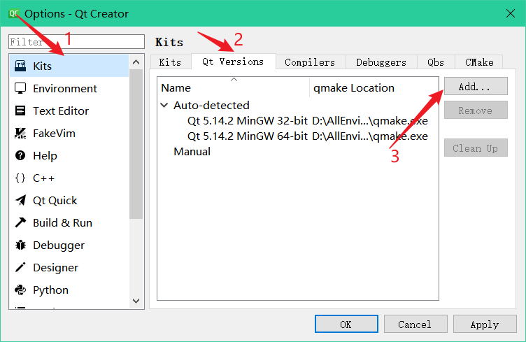
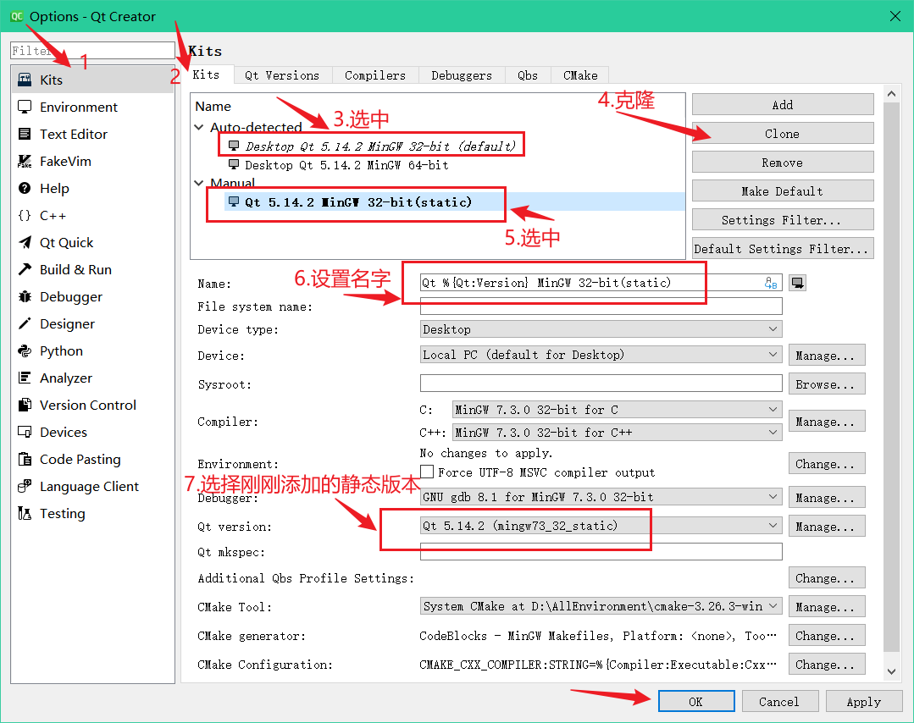
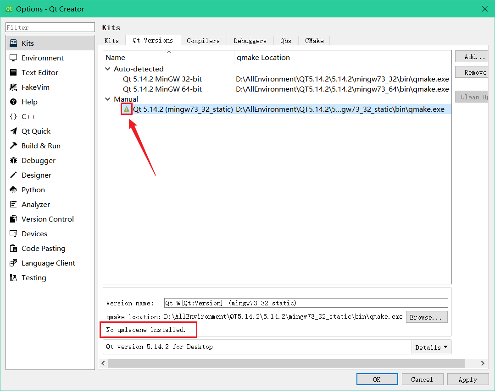

# MeetTop

软件定位——学习辅助软件，主要目标：

- 计划：可以设计短计划与计划完成时间限制。
- 提醒：可以根据时间限制来弹出提醒界面。

# 功能与界面

## 功能设计

基本功能——参考FadeTop，实现FadeTop的所有功能：

>FadeTop是一款免费，简单而有趣的Windows休息提醒软件。  在闹钟时，它会逐渐将您的计算机屏幕淡入指定的屏幕颜色或图片，显示时钟时间和快照历史记录 休息时间状态。
>
>FadeTop可以让你... 
>以自然、温和和愉快的方式获得通知
>养成定期休息眼睛和身体的习惯
>
>是什么让它与众不同？
>FadeTop尽力不打扰您的注意力。当您忙于使用鼠标或键盘时，它永远不会弹出，或者看起来 计算机中不存在。除了视觉变化，它从不强迫 你身上的任何东西。FadeTop时间表智能而自然地中断。它不会在固定的时间间隔或时间点发出警报。相反，它看到您连续使用计算机的时间过长，并且当你看起来不那么忙时，试探性地淡入。



1. 淡入淡出功能：覆盖全屏的图片会淡入或淡出显示。
2. 图片：能设置背景图，并且背景图使用居中拉伸操作（大小不够就拉伸并居中）。
3. 时间间隔：可以设置时间间隔，用于当使用电脑到达一定时间时便会淡入淡出图片。
4. 铃声：能设置铃声开启、选择铃声以及设置铃声音量。

其它功能：

- 显示：计划及计划完成时间，完成状态–已完成、未完成、稍后完成（xxx分后、xxx小时后、xxx天后）。
- 显示：休息提醒语录或者励志语录。


## 界面设计

主界面、托盘图标和菜单、设置界面（动态生成）。

# 静态编译QT

[QT静态编译程序（Mingw编译）_房东丢的猫的博客-CSDN博客](https://blog.csdn.net/gaolijing_/article/details/106822446)

**环境：**

- Windows10。
- QT Creator 4.11.1。
- QT5.14.2、Python3.11.3、GCC7.3.0 + perl5.32.1.1 。

**1、安装QT5.14.2，**安装完成后自带QTCreator。

**2、安装Strawberry Perl：**[Strawberry Perl for Windows](https://strawberryperl.com/)。

如果没有自动帮设置好环境变量，那就手动设置环境变量，将下面两个目录添加到环境变量：

- StrawberryPerl\perl\site\bin。
- StrawberryPerl\perl\bin。

**3、安装好Python3.11**并添加好环境变量。

- Python3.11\Scripts。
- Python3.11。

**4、环境检查：**

打开应用`QT 5.14.2（MinGW 7.3.0 32-bit）`。

```c
gcc -v   // 检查编译器配置是否正确
perl -v  // 检查perl解释器配置是否正确 
python   // 检查python配置是否正确，输入exit()可以退出python界面
```

**5、配置静态并编译编译QT信息：**

①在`D:\AllEnvironment\QT5.14.2\5.14.2`新建一个文件夹`mingw73_32_static`，用于存放编译后的文件。

②切换到QT的源码目录`D:\AllEnvironment\QT5.14.2\5.14.2\Src`，执行以下命令：

```c
configure.bat  -static -release -confirm-license  -opensource -opengl desktop -platform win32-g++  -prefix "D:\AllEnvironment\Qt5.14.2\5.14.2\mingw73_32_static" -sql-sqlite  -sql-odbc -qt-zlib -qt-pcre -qt-libpng -qt-libjpeg -qt-freetype -make libs  -nomake tools -nomake examples -nomake tests -skip qt3d  -skip qtcanvas3d -skip qtdatavis3d -skip qtlocation -skip qtwayland -skip qtwebchannel -skip qtwebengine -skip qtwebsockets -skip qtwebview
```

配置成功后：



**6、开始编译：**第（5）步配置完毕并且没有输出错误信息时，即可开始编译，在刚才的命令行窗口输入以下命令进行编译：

```c
mingw32-make     // 单线程编译
mingw32-make -j2 // 双线程编译
```

编译可能要3~4个小时。（使用双线程，从九点三四十分开始编译，到十一点十五编译完成。）



**7、安装：**编译成功后通过执行以下命令完成安装：

```c
mingw32-make install
```



安装完成后，便可以在`mingw73_32_static`中，看到如下内容：



**8、修改配置：**

修改`D:\AllEnvironment\Qt5.14.2\5.14.2\mingw73_32_static\mkspecs\common\g++-win32.conf`文件：

- 在conf文件中新增`QMAKE_LFLAGS = -static`。
- 在conf文件中修改`QMAKE_LFLAGS_DLL = -static`。



**9、QT Creator中配置静态编译器：**

①工具 → 选项：Kits → Qt Versions → 添加，将`D:\AllEnvironment\Qt5.14.2\5.14.2\mingw73_32_static\bin\qmake.exe`添加进去。





点击OK。

②然后再次打开工具 → 选项，如下操作：



**10、解决黄色感叹号：**



> 解决方法：从Qt动态编译的qmake.exe文件夹下拷贝“qmlscene.exe”文件到静态编译安装包的qmake.exe文件夹下。即在`D:\AllEnvironment\QT5.14.2\5.14.2\mingw73_32\bin`中找到`qmlscene.exe`，复制并粘贴到`D:\AllEnvironment\QT5.14.2\5.14.2\mingw73_32_static\bin`下。

黄色感叹号消失！

# 1.创建项目
