# 建议

1. 第一阶段：了解控件的功能、属性等特性，包括且不至于QWidget、QLabel、QPushButton、QLayout、QLineEdit、QTextEdit等（Qt设计师的里可见的所有控件）
2. 第二阶段：熟练掌握信号槽signal/slot的机制，了解每个控件的信号和参数，能自定义信号。最后要能实现父子、兄弟控件之间的信号互传、实现跨多层控件信号互传。也要会自定义注册信号槽的参数类型
3. 第三阶段：布局QLayout的使用（垂直布局QVBoxLayout、水平布局QHBoxLayout、栅格布局QGridLayout）。必须要能够实现简单的窗口控件自适应。一般到这一步，开发者的客户端布局设计风格就会固定下来，每个人对于布局的理解和实现都会出现巨大的差异。**这一阶段是菜鸟进阶的关键，拿到一个原型图后，要能立马对原型进行拆解，从底到顶进行控件组合，垂直水平布局的使用，父子、兄弟控件的摆放，决定了一个Qt研发者的基础。**
4. 第四阶段：事件机制，掌握各种事件函数的override，掌握事件筛选器eventFilter。知道重写事件函数和注册事件筛选器的区别和使用场景。
5. 第五阶段：设计师布局和代码布局的复合使用，很多场景下，光靠设计师拖拽控件是无法实现的，必须要在代码中动态创建控件。此时是需要综合以上四个阶段的所有知识点。
6. 第六阶段：复杂控件的自定义实现，将多个原生控件组合成新的控件，实现新的功能，封装接口和信号
7. 第七阶段：MV模式（Model和View），Qt的表格、树形目录等各种进阶控件的实现方式。
8. 第八阶段：QStyleSheet样式表的使用，基本上到这个阶段，80%的客户端样式都可以实现了。
9. 第九阶段：线程、容器等Qt二次封装的类的使用
10. 第十阶段：网络模块、多媒体模块的使用
11. 第十一阶段：QGraphicView（图元绘画框架），动态实现表格、统计图、仪表、复杂动画，一般这个范围很少需要用到

其他Qt规范：

1. Qt的pro文件语法
2. Qt的pri文件模块化开发使用技巧
3. QtCreator的定制化（插件、快捷键、调试器、编译环境配置）
4. Qt程序的打包
5. 跨平台代码的实现

——————————————————————

按照我负责的项目的要求来说。

如果是新手，我一般会要求达到第三阶段

如果想实现一个功能点，一般需要达到第六阶段

如果想要独立设计实现一个完整的模块，至少要到第九阶段

完整的客户端设计，至少要到第十阶段且能掌握Qt规范


抛开业务逻辑，一般一个开发者如果能用代码+设计师实现VisualStudio的主界面80%的功能，基本就算得上Qt高手了。

> 知乎用户——浪里小白浪

# 0.QT开发环境

安装最后一个开源离线版：[Index of /archive/qt/5.14/5.14.2](https://download.qt.io/archive/qt/5.14/5.14.2/)，里面自带QTCreator。（编译器选择，按需选择）

QT Creator设置：

- 设置QT Creator启动时打开上次会话：File → Sessions → Manage... → √上 `Restore last session on startup`（启动时恢复上一个会话）。
- 设置字体大小。
- 设置主题。

Qt Creator的编译与调试的说明：

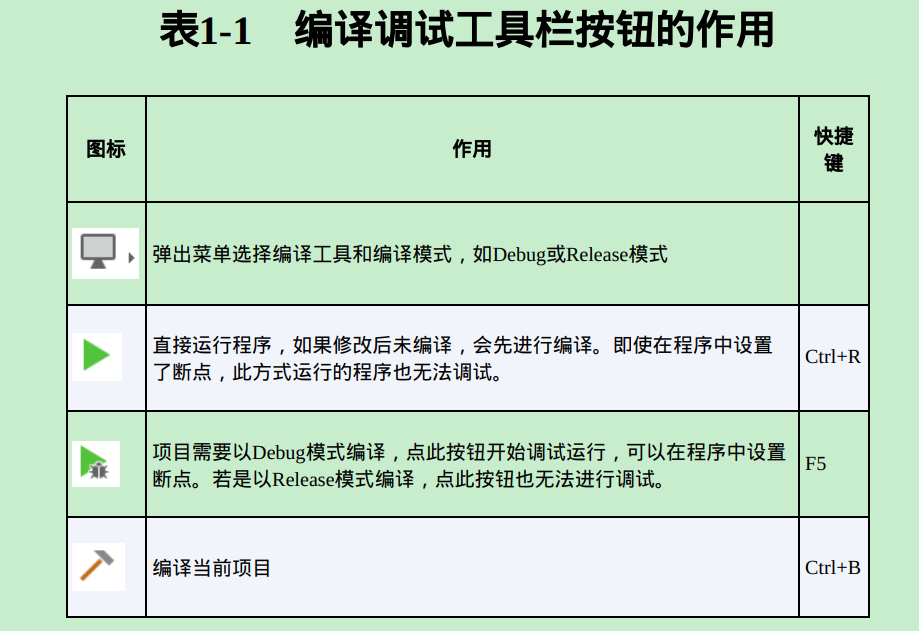

# 1.创建项目

**项目创建：**

Qt Widgets Application —— 支持桌面平台的有图形用户界面（Graphic User Interface，GUI）的应用程序。  

创建Qt Widgets Application项目的步骤：**1.**New File or Project → **2.**Qt Widgets Application → choose... → 3.Location，项目命名与项目目录选择 → **4.**Build System选择，qmake → **5.**Details，要创建的窗体类和头文件，（选上Generate form，勾了就会创建.ui文件而且生成的代码里会自动添加ui成员变量，如果你要用designer来设置ui就勾上，如果没有界面或者要自己在cpp里添加界面代码就不要勾） → **6.**Translation，默认，界面语言翻译配置 → **7.**Kits，32和64位都选上吧 → **8.**Summary，项目目录确认与更改 → **9.**Finished。

创建好的项目目录的简单说明：

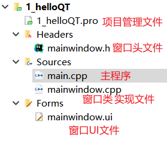

**项目基本结构说明：**

`5.Details`配置中Base Class说明——QDialog、QWidget、QMainWindow的区别：

- QWidget是所有用户界面对象的基类。QDialog和QMainWindow都继承自QWidget，也就是说QDialog和QMainWindow在QWidget的基础上拓展了一些东西。
  dialog —— 对话框；mainwindow —— 主窗口；widget —— 小部件。

> 官方文档：
> QMainWindow类：https://doc.qt.io/qt-5/qmainwindow.html 
> QWidget类：https://doc.qt.io/qt-5/qwidget.html
> QDialog类：https://doc.qt.io/qt-5/qdialog.html

其它资料：[《Qt5：Widget、Dialog和MainWindow之间的关系》_Snow__Sunny的博客-CSDN博客](https://blog.csdn.net/Snow__Sunny/article/details/108831463#:~:text=Widget翻译,立创建用户界面。)：

>### Widget（小部件）
>
>小部件是用户界面的原子：它从窗口系统接收鼠标，键盘和其他事件，并在屏幕上绘制自己（继承了绘制类）。每个小部件都是矩形的，它们按Z顺序排序。
>
>小部件包括窗口小部件和非窗口小部件。
>
>1、窗口小部件（可以称为独立窗口或者顶级窗口小部件）就是我们创建Qt桌面应用程序时，自动生成的窗口界面，包含标题栏，可以设置标题和图标，还有什么最大最小化以及退出按钮，它本身就是父窗口（未嵌入其它窗口）。MainWindow和Dialog以及Dialog的子类都是典型的窗口小部件。
>
>```cobol
>QWidget *parent = 0
>```
>
>2、非窗口小部件是子小部件，它是嵌入在父窗口中的，不能独立显示，只能显示在其父窗口小部件中。**Qt  Designer中的所有小部件都属于非窗口小部件**，都需要嵌入到父窗口小部件中，用于显示数据和状态信息，接收用户输入。
>
>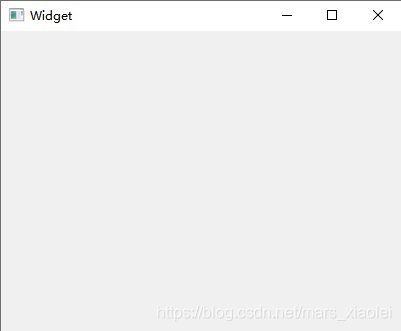
>
>### MainWindow（主窗口）
>
>主窗口提供了构建应用程序用户界面的框架。主窗口拥有自己的布局，包括中央区域、菜单栏、工具栏、状态栏以及Dock小部件，具体分布如下图所示。布局的中心区域可以被任何类型的小部件占用，也就是我们常用来拖拉控件的区域，其它区域可以没有，但是不能没有中央区域。最常见的主窗口就是WPS。**稍微大一点的项目就使用QMainWindow来创建**，嵌入到主窗口使用QWidget，辅助窗口使用QDialog，如果是内容比较单一的项目，使用QDialog基本上也可以搞定了。
>
>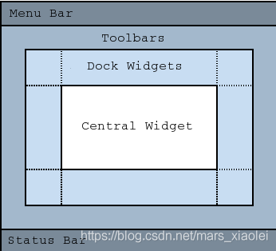
>
>### Dialog（对话框）
>
>Dialog（对话框）一般用作辅助窗口，为用户提供选项并主窗口进行交互，弹出一个对话框，然后选择“OK”或者“cannel”。此外，Qt也提供了许多现成的标准对话框，可用于标准任务，如文件对话框、字体对话框、颜色对话框、消息对话框等。 对话框又分为模态对话框和非模态对话框。
>
>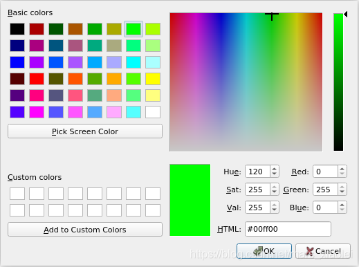

# 2.项目组成与运行机制

## 项目文件组成

Qt Widgets Application 项目的基本文件：


**目录说明：**

1. Headers：用于存放所有的头文件。
2. Sources：用于存放项目所有C++源代码文件。
3. Forms：用于存放所有窗口的界面文件。

**文件说明：**

1. .pro文件：项目管理文件，用于存储项目设置的文件。
2. main.cpp：程序入口。
3. mainwindow.ui：主窗口界面文件，是一个用XML格式来存储窗体上的元件及其布局信息的文件。
4. **mainwindow.h：所设计的窗口类的头文件。**
5. **mainwindow.cpp：**是mainwindow.h里定义的类的实现文件。
   在C++里，任何窗体或界面组件都是用类封装的，一个类一般有一个头文件(.h文件)和一个源程序文件(.cpp文件)，头文件用于类定义（类定义及类成员的声明。C++类也是用于描述对象组成，但不会被加载进程序中，编译时仅仅需要其语意），源文件用于类行为（功能函数）具体实现。

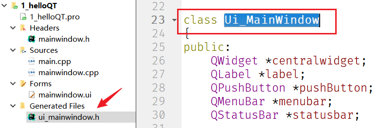

使用可视化UI设计时，当编译后，会根据每个窗体上的组件及其属性、信号与槽的关联等会自动生成的一个类的定义文件——ui_xxx.h头文件。上面只有一个主窗口，因此只会生成一个类的定义文件ui_mainwindow.h，类名为Ui_MainWindow。

可视化设计的界面的底层实现就是由ui_xxx.h头文件实现的，也就是通过 xxxx.ui → ui_xxx.h，生成了界面的底层代码（即通过可视化设计，生成了我们需要的界面的代码 —— 一个类）。


## 程序运行机制

通过分析各个窗体文件的内容及功能，就可以知道它们是如何一起工作来实现界面的创建与显示的。以上面图中创建的项目为例，通过mainwindow.ui会生成ui_mainwindow.h，那么mainwindow.cpp和mainwindow.h、main.cpp、ui_mainwindow.h之间是什么样的关系？

**1、mainwindow.ui和ui_mainwindow.h：**

mainwindow.ui：用UI设计器可视化设计的界面都将由Qt自动解析，并以XML文件的形式保存下来，保存的文件名形式为xxxx.ui，这个文件也就是窗体界面的定义文件，其是一个XML文件，里面定义了窗口上的所有组件的属性设置、布局，及其信号与槽函数的关联等。当使用Qt的UI设计器时，只需在UI设计器里进行可视化设计即可，不用管mainwindow.ui文件是怎么生成的。

ui_mainwindow.h：是对mainwindow.ui文件编译后生成的一个文件，通过UI设计器更改界面时，当再次编译后这个文件也会随之改变。它主要做以下工作：

1. 定义了一个Ui_MainWindow类，该类用于封装可视化设计的界面。

2. 自动生成了界面各个组件的类成员变量定义，在Ui_MainWindow类的public部分为窗口界面上每个组件都定义了一个指针变量。
   （指针变量的名称就是在UI设计器里设置的objectName）

3. 定义并实现了setupUi()函数，这个函数的实现分为三部分：

   一是：根据可视化设计的界面内容，用C++代码创建了界面上各个组件，并设置了各个组件的位置、大小、文字内容、字体等属性。

   二是：调用了函数retranslateUi(Widget)  ，用来设置界面各组件的文字内容属性，如标签的文字、按键的文字、窗体的标题等。将界面上的文字设置的内容独立出来作为一个函数retranslateUi()，在设计多语言界面时会用到这个函数。  

   三是：设置了信号与槽的关联。  

   **因此在MainWindow的构造函数里调用 ui->setupUI(this)，就实现了窗体上组件的创建、属性设置、信号与槽的关联。**  

4. 定义了`namespace Ui`，并在命名空间中定义了一个继承 Ui_MainWindow类的类——MainWindow。

信号与槽的关联的实现：（详细内容见*信号与槽*）

```c++
/* 信号与槽的关联 */
// 将pushButton按钮的clicked()信号与窗体MainWindow的槽函数close()关联起来
// 当点击按钮时，就会执行MainWindow的close()
QObject::connect(pushButton, SIGNAL(clicked()), MainWindow, SLOT(close()));
// 设置槽函数的关联方式，用于将UI设计器自动生成的组件信号的槽函数与组件信号相关联
QMetaObject::connectSlotsByName(MainWindow);
```


**2、mainwindow.h和mainwindow.cpp：**头文件用于声明和定义，源代码文件负责具体的实现。

mainwindow.h：窗体类头文件，创建项目时选的窗体基类是哪个，该头文件就会定义一个继承于该基类的类。

```c++
#ifndef MAINWINDOW_H
#define MAINWINDOW_H

#include <QMainWindow>
/*  声明了一个命名空间——Ui，里面包含一个类MainWindow，
	注意这个类是ui_mainwindow.h文件里定义了的类 
*/
QT_BEGIN_NAMESPACE
namespace Ui { class MainWindow; }
QT_END_NAMESPACE
/* 窗体类定义，继承于QMainWindow的类的定义 */
class MainWindow : public QMainWindow
{
    //  Q_OBJECT，是使用Qt的信号与槽（signal和slot）机制的类都必须加入的一个宏
    Q_OBJECT         

public:
    MainWindow(QWidget *parent = nullptr);  // 构造函数
    ~MainWindow();  // 析构函数

private:
    /*
    用前面声明的namespace Ui里的MainWindow类定义的，
    所以指针ui是指向可视化设计的界面，
    要访问界面上的组件，都需要通过这个指针 → ui
    */
    Ui::MainWindow *ui; 
};
#endif // MAINWINDOW_H
```

可以看出该文件中的类成员中有ui_mainwindow.h中定义的那个类 —— `Ui::MainWindow *ui; `。

mainwindow.cpp：该文件中是用于实现mainwindow.h中定义的窗体类的功能。其内容如下，可以看出实现了其头文件中声明的构造函数与析构函数：

```c++
#include "mainwindow.h"
#include "ui_mainwindow.h"   //  注意这里编译后自动加入了生成的与UI文件mainwindow.ui对应的类定义文件
/*
	构造函数，意为执行父类QMainWindow的构造函数，并创建一个Ui::MainWindow类的对象——ui。
	这个ui就是MainWindow类的private部分定义的指针变量ui。
*/
MainWindow::MainWindow(QWidget *parent)
    : QMainWindow(parent)
    , ui(new Ui::MainWindow)
{
    // 执行Ui::MainWindow类的setupUi()函数，这个函数实现窗口的生成与各种属性的设置、信号与槽的关联
    ui->setupUi(this);  
}

MainWindow::~MainWindow()
{
    // 删除用new创建的指针ui
    delete ui;
}
```

**MainWindow中的构造函数，调用了Ui_MainWindow中的构造函数，那也就是说当实例化MainWindow类的对象时，也就执行了Ui_MainWindow中的构造函数，就实现了窗体的初始化与生成。**

**因此，在main.cpp中创建对象，就实现了窗体的构建与初始化。**

**3、main.cpp：**

```c++
#include "mainwindow.h"
#include <QApplication>

int main(int argc, char *argv[])
{
    QApplication a(argc, argv);  // 定义并创建应用程序
    MainWindow w;                // 定义并创建窗口
    w.show();                    // 显示窗口，默认窗口是不可见的；另外登录窗口之类的需要在main()中创建
    // 应用程序运行，开始应用程序的消息循环和事件处理。当应用程序退出时exec()函数的值就会返回
    return a.exec();             
}
```


## 总结

- Ui::MainWindow类 是用于描述可视化设计的窗体的一个类，该类在通过mainwindow.ui生成的ui_mainwindow.h头文件中定义，用于描述整个窗体，并且提供了构造函数用于初始化并生成窗体。
- 而  MainWindow类 则是对可视化设计窗体的功能延伸的描述，是功能描述的集合。（一个用于窗体描述和窗体初始化与生成的实现，一个用于基于窗体的功能拓展）

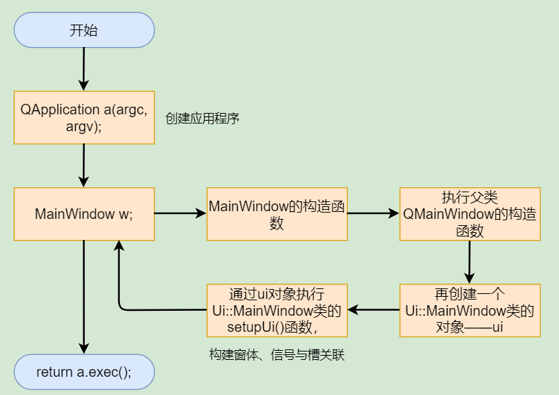

# 3.开发方式

使用Qt来开发图形界面程序，有三种：

- 使用Qt Creator的Designer来进行UI设计 —— 可视化方式。
- 纯代码实现UI —— 纯代码方式。
- 既使用Designer也使用纯代码来实现UI —— 混合方式。

## 可视化UI设计

可视化设计：利用QT Creator的Designer来生成槽函数原型和UI框架。

要使用可视化设计，需要在创建窗体类和头文件时需要勾选Generate form。

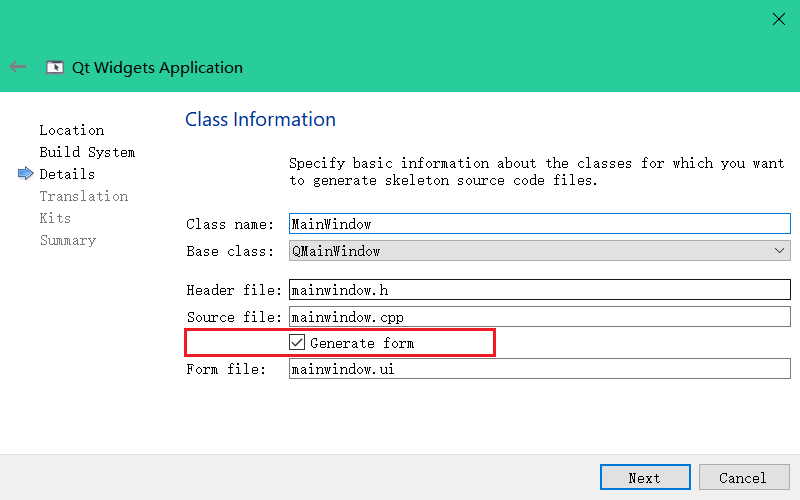

创建完毕，在Design里面拖拽控件到窗体即可导入相关控件，还可以配置信号与槽、更改控件属性等，当编译时会自动生成相关文件——比如上面的ui_mainwindow.h文件。

可视化UI设计的缺点：有些组件无法可视化添加到界面上，比如工具栏上就无法可视化添加ComboBox组件，只能通过纯代码来添加。

**通过UI设计器设置信号与槽：**

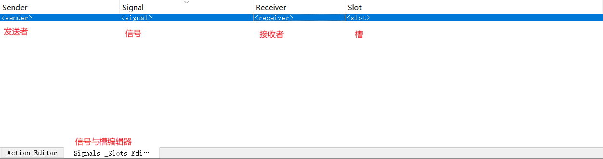

发送者发送信号给接收者，然后接收者执行相应槽函数。Sender的Signal被触发就会往Receiver发送信号，Receiver接收到信号就执行Slot。

**信号与槽的使用规则：**

1. 一个信号可以关联多个槽，当信号被触发时槽函数按建立关联的先后顺序依次执行。
2. 当信号与槽函数带参数时，在在connect()函数里，要写明参数的类型，但可以不写参数名称。  
3. 多个信号可以关联同一个槽。
4. 一个信号可以关联另外一个信号，这样当一个信号发射时另一个也会被发射。
5. 严格的情况下，信号与槽的参数个数和类型需要一致，至少信号的参数不能少于槽的参数。如果不匹配，会出现编译错误或运行错误。
6. 在使用信号与槽的类中，必须在类的定义中加入宏Q_OBJECT。  
7. 当一个信号被发射时，与其关联的槽函数通常被立即执行，就像正常调用一个函数一样。只有当信号关联的所有槽函数执行完毕后，才会执行发射信号处后面的代码。  


## 代码化UI设计

**概述：**

UI的可视化设计，只是通过一定处理使得可以根据UI来生成底层的C++代码，所有的UI底层都是C++代码实现，通过QT的Designer可以快速地进行界面设计，但可视化设计毕竟有所局限，有些控件没有或者有些功能仅仅通过可视化编程实现不了，那就需要手动通过C++代码来写UI界面了。

代码化UI设计：纯写C++代码来设计UI，界面设计的底层都是C++语言实现，使用C++直接编写UI能实现的功能更加强大，并且也更加灵活。（QT自带实例基本都是纯代码方式实现用户界面）

代码化UI设计的缺点：开发效率低，过程繁琐。

纯代码化的UI设计与QT Widgets Application的开发步骤：

1. 创建好窗体类和头文件，不勾选 Generate form。
2. 窗体头文件：添加窗体组件、声明初始化函数、声明槽函数。
3. 窗体源代码文件：对象初始化函数实现、窗体初始化函数实现、析构函数实现、槽函数实现。
4. 编译&运行。
5. 补充：需要使用到QT类库。

**示例——纯代码实现，以QDialog基类为例：**

1、基于QDialog基类创建窗体文件：

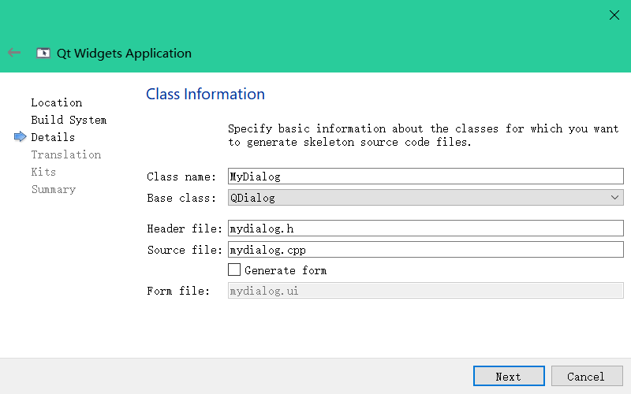

创建后的文件：

①mydialog.h文件：

```c++
#ifndef MYDIALOG_H
#define MYDIALOG_H

#include <QDialog>

class MyDialog : public QDialog
{
    Q_OBJECT

public:
    MyDialog(QWidget *parent = nullptr);
    ~MyDialog();
};
#endif // MYDIALOG_H
```

②mydialog.cpp文件：

```c++
#include "mydialog.h"

MyDialog::MyDialog(QWidget *parent)
    : QDialog(parent)
{
}

MyDialog::~MyDialog()
{
}
```

③main.cpp文件：

```c++
#include "mydialog.h"

#include <QApplication>

int main(int argc, char *argv[])
{
    QApplication a(argc, argv);
    MyDialog w;
    w.show();
    return a.exec();
}
```

可以看出，初始窗体头文件中只有` Q_OBJECT`宏定义和公有的初始化函数、析构函数（仅用于实现删除new创建的对象）；初始窗体cpp文件只有这两个函数的定义（还没有实现内容）。

2、通过代码设计实现UI，操作上来说就是在头文件中声明好一些窗体初始化的方法、组件对象、声明好槽函数等，并在头文件对应的cpp文件中实现声明的函数。

①在mydialog.h文件中声明：

```c++
#ifndef MYDIALOG_H
#define MYDIALOG_H

#include <QDialog>
#include <QCheckBox>
#include <QRadioButton>
#include <QPlainTextEdit>
#include <QPushButton>
class MyDialog : public QDialog
{
    Q_OBJECT
private:
    // 窗体对象的成员
    QCheckBox   *chkBoxUnder;
    QCheckBox   *chkBoxItalic;
    QCheckBox   *chkBoxBold;

    QRadioButton    *rBtnBlack;
    QRadioButton    *rBtnRed;
    QRadioButton    *rBtnBlue;

    QPlainTextEdit  *txtEdit;

    QPushButton     *btnOK;
    QPushButton     *btnCancel;
    QPushButton     *btnClose;
	// UI创建、信号与槽初始化
    void initUI(); // UI创建与初始化
    void iniSignalSlots(); // 初始化信号与槽的连接
private slots:  // 声明槽函数
    void on_chkBoxUnder(bool checked);  // 用于Underline 的clicked(bool)信号的槽函数
    void on_chkBoxItalic(bool checked); // 用于Italic 的clicked(bool)信号的槽函数
    void on_chkBoxBold(bool checked);   // 用于Bold 的clicked(bool)信号的槽函数
    void setTextFontColor();            // 用于设置字体颜色
public:
    MyDialog(QWidget *parent = nullptr);
    ~MyDialog();
};
#endif // MYDIALOG_H
```

②在mydialog.cpp文件中实现：

```c++
#include "mydialog.h"
#include <QHBoxLayout>
#include <QVBoxLayout>
/* 窗体建立前执行初始化 */
MyDialog::MyDialog(QWidget *parent)
: QDialog(parent)
{
    initUI(); //界面创建与布局
    iniSignalSlots(); //信号与槽的关联
    setWindowTitle("Form created manually ME");//设置窗体标题
}

MyDialog::~MyDialog()
{

}
/* 窗体界面创建与布局 */
void MyDialog::initUI()
{
    // 创建 Underline, Italic, Bold三个CheckBox，并水平布局
    chkBoxUnder = new QCheckBox(tr("Underline"));
    chkBoxItalic = new QCheckBox(tr("Italic"));
    chkBoxBold = new QCheckBox(tr("Bold"));

    QHBoxLayout *HLay1=new QHBoxLayout;
    HLay1->addWidget(chkBoxUnder);
    HLay1->addWidget(chkBoxItalic);
    HLay1->addWidget(chkBoxBold);

    // 创建 Black, Red, Blue三个RadioButton，并水平布局
    rBtnBlack=new QRadioButton(tr("Black"));
    rBtnBlack->setChecked(true);//缺省被选中
    rBtnRed=new QRadioButton(tr("Red"));
    rBtnBlue=new QRadioButton(tr("Blue"));

    QHBoxLayout *HLay2=new QHBoxLayout;
    HLay2->addWidget(rBtnBlack);
    HLay2->addWidget(rBtnRed);
    HLay2->addWidget(rBtnBlue);

    //创建 确定, 取消, 退出 三个 QPushButton, 并水平布局
    btnOK=new QPushButton(tr("确定"));
    btnCancel=new QPushButton(tr("取消"));
    btnClose=new QPushButton(tr("退出"));

    QHBoxLayout *HLay3=new QHBoxLayout;
    HLay3->addStretch();
    HLay3->addWidget(btnOK);
    HLay3->addWidget(btnCancel);
    HLay3->addStretch();
    HLay3->addWidget(btnClose);


    //创建 文本框,并设置初始字体
    txtEdit=new QPlainTextEdit;
    txtEdit->setPlainText("Hello world\n\nIt is my demo");

    QFont   font=txtEdit->font(); //获取字体
    font.setPointSize(20);//修改字体大小为20
    txtEdit->setFont(font);//设置字体

    //创建 垂直布局，并设置为主布局
    QVBoxLayout *VLay=new QVBoxLayout;
    VLay->addLayout(HLay1); //添加字体类型组
    VLay->addLayout(HLay2);//添加字体颜色组
    VLay->addWidget(txtEdit);//添加PlainTextEdit
    VLay->addLayout(HLay3);//添加按键组

    setLayout(VLay); //设置为窗体的主布局
}
/* 信号与槽的初始化：实现信号与槽的关联 */
void MyDialog::iniSignalSlots()
{
    //三个颜色  QRadioButton的clicked()事件与setTextFontColor()槽函数关联
    connect(rBtnBlue,SIGNAL(clicked()),this,SLOT(setTextFontColor()));//
    connect(rBtnRed,SIGNAL(clicked()),this,SLOT(setTextFontColor()));//
    connect(rBtnBlack,SIGNAL(clicked()),this,SLOT(setTextFontColor()));//

    //三个字体设置的  QCheckBox 的clicked(bool)事件与 相应的槽函数关联
    connect(chkBoxUnder,SIGNAL(clicked(bool)),this,SLOT(on_chkBoxUnder(bool)));//
    connect(chkBoxItalic,SIGNAL(clicked(bool)),this,SLOT(on_chkBoxItalic(bool)));//
    connect(chkBoxBold,SIGNAL(clicked(bool)),this,SLOT(on_chkBoxBold(bool)));//

    //三个按键与窗体的槽函数关联
    connect(btnOK,SIGNAL(clicked()),this,SLOT(accept()));//
    connect(btnCancel,SIGNAL(clicked()),this,SLOT(reject()));//
    connect(btnClose,SIGNAL(clicked()),this,SLOT(close()));//
}
/* 槽函数实现：点击按钮为文字添加下划线 */
void MyDialog::on_chkBoxUnder(bool checked)
{
    QFont   font=txtEdit->font();
    font.setUnderline(checked);
    txtEdit->setFont(font);
}
/* 槽函数实现：点击按钮设置字体正斜 */
void MyDialog::on_chkBoxItalic(bool checked)
{
    QFont   font=txtEdit->font();
    font.setItalic(checked);
    txtEdit->setFont(font);
}
/* 槽函数实现：点击按钮加粗文字 */
void MyDialog::on_chkBoxBold(bool checked)
{
    QFont   font=txtEdit->font();
    font.setBold(checked);
    txtEdit->setFont(font);
}
/* 槽函数实现：点击复选按钮设置文字颜色 */
void MyDialog::setTextFontColor()
{
    QPalette   plet=txtEdit->palette();
    if (rBtnBlue->isChecked())
    plet.setColor(QPalette::Text,Qt::blue);
    else if (rBtnRed->isChecked())
    plet.setColor(QPalette::Text,Qt::red);
    else if (rBtnBlack->isChecked())
    plet.setColor(QPalette::Text,Qt::black);
    else
    plet.setColor(QPalette::Text,Qt::black);

    txtEdit->setPalette(plet);
}
```

3、编译&运行：得到图形操作界面程序。


## 混合方式设计★★★

可视化设计、代码化设计两种方式可以混用，毕竟可视化设计最终也是生成C++代码的（UI → C++代码）。

尽量使用可视化UI设计，遇到可视化无法解决的才去使用纯代码方式去解决。

以一个示例操作来展示混合方式设计的开发过程。

### 1.项目创建

创建一个QT Widgets Application，选择基类QMainWindow，新建的类的名称为MyMainWindow。

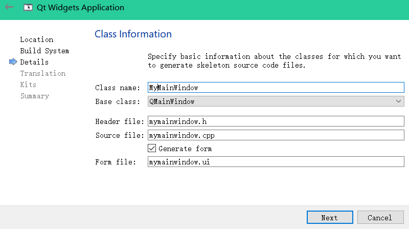

### 2.资源文件创建与导入

在QT Creator里单击 File → New File or Project ... 菜单项，然后先在新建文件与项目对话框的Files and Classes 里选择QT，再在右边选项里选中QT Resource File，点击choose...后为资源文件命名，命名为res.qrc，之后 Next → Finish即可。

上述操作完后，项目中会自动创建好一个Resources文件组，该组里有res.qrc节点。

在res.qrc上点击右键，选择 “Open in Editor”，然后点击 Add Prefix 添加前缀`/images`，再点击 Add Files 添加资源文件（资源文件最好提前放于项目目录下），如下：

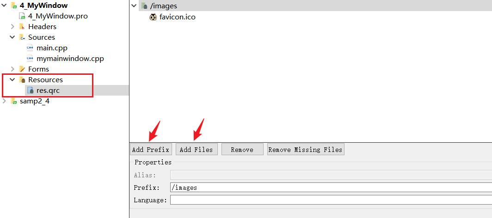

资源文件最重要的一个功能就是存储图片和图标。

将images目录下的图标都添加进去，为后面的Action做准备。

### 3.1UI设计—设计Action对象

双击mymainwindow.ui进入UI设计器，界面中央下面的 Action Editor 就是用来设计Action的。如下图：

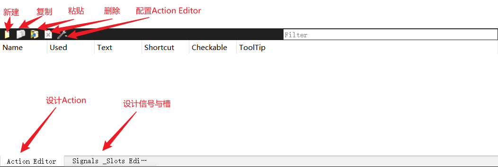

Action是Qt中单独引入的一个对象，对应QAction类。 Action表示一个独立的操作，是将界面上某个可以通过菜单、快捷键、toolBar按钮执行的同一个操作映射到同一个Action对象，由该对象通过信号触发实际的操作。（可以理解为动作按钮，点击后执行Action的槽函数）

**所有用于菜单和工具栏设计的按钮都需要用Action来实现。**

设计Action：点击新建，创建Action，示例如下

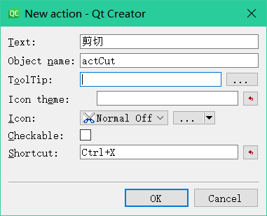

Action各设置项的说明：

- Text：Action的显示文字，该文字会作为菜单标题或工具栏按钮标题显示。若该标题后面有省略号，如“打开…”，则在工具栏按钮上显示时会自动忽略省略号，只显示“打开”。
- Object name：该Action的objectName。应该遵循自己的命名法则，如以“act”开头表示这是一个Action。
- ToolTip：这个文字内容是当鼠标在一个菜单项或工具栏按钮上短暂停留时出现的提示文字。
- Icon：设置Action的图标，单击其右侧的按钮可以从资源文件里选择图标，或者直接选择图片文件作为图标。
- Checkable：设置Action是否可以被复选，如果选中此选项，那么该Action就类似于QCheckbox可以改变其复选状态。
- Shortcut：设置快捷键，将输入光标移动到Shortcut旁边的编辑框里，然后按下想要设置的快捷键即可，如“Ctrl+O”。

需要建立的Action：

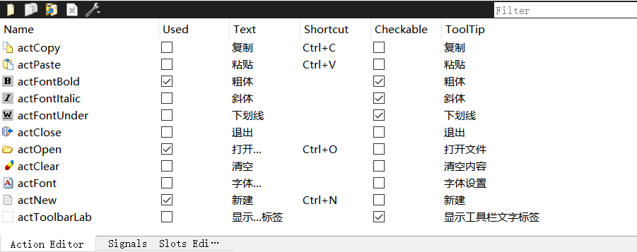

### 3.2UI设计—加入QTextEdit组件

找到TextEdit，拖入主窗口。


### 3.3UI设计—菜单栏

示例项目的窗体类MyMainWindow继承QMainWindow，因此具有菜单栏、工具栏、状态栏。

双击mymainwindow.ui进入UI设计器，“Type Here”处是菜单栏，菜单栏下方是工具栏，窗口最下方是状态栏：（下方没有工具栏，需要为窗口添加，在主窗口上单击右键选择Add Tool Bar即可）

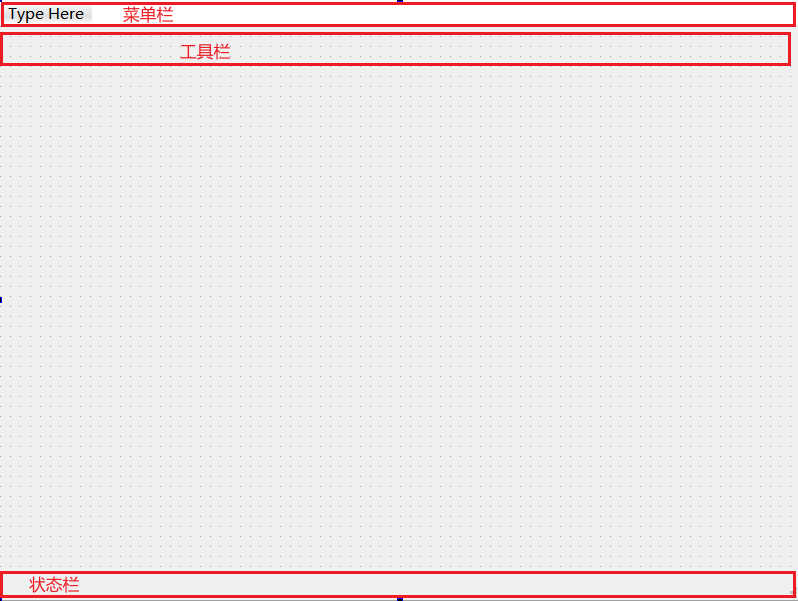

- 在菜单栏双击，输入菜单分组，名称，如“File”，然后回车，这样就创建了一个“File”菜单分组。

- 将创建好的Action拖放到窗口的菜单栏，就会新建一个菜单项。

- 将创建好的Action拖放到窗口的工具栏，就会新建一个工具栏按钮，通过设置工具栏的 toolButtonStyle 属性就可设置工具栏按钮的显示方式。

为窗口添加ToolBar后，按下图设计好，拖放Action到菜单栏的选项里：

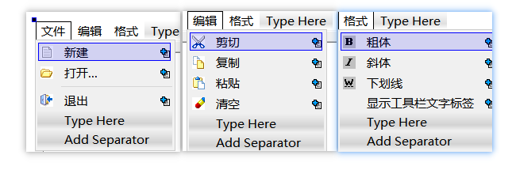

### 3.4UI设计—工具栏

SpinBox组件、FontComboBox组件无法通过可视化方式将其添加到工具栏上，需要通过编写代码实现。步骤如下：

1、在mymainwindow.h文件中为MyMainWindow添加变量和函数定义：

```c++
/* 添加头文件 */
#include    <QLabel>
#include    <QProgressBar>
#include    <QSpinBox>
#include    <QFontComboBox>
/* 添加私有变量和函数 */
QLabel      *fLabCurFile;      // 状态栏里显示当前文件的Label
QProgressBar    *progressBar1; // 状态栏上的进度条
QSpinBox        *spinFontSize; // 字体大小
QFontComboBox   *comboFont;    // 字体名称
void    iniUI();               // 代码实现UI初始化
```

2、在mymainwindow.cpp文件中实现`iniUI()`函数，创建并设置好组件属性后添加到想要添加到的地方：

```c++
void MyMainWindow::iniUI()
{
    /* 状态栏上添加组件 */
    // 创建并设置好QLabel组件
    fLabCurFile = new QLabel;
    fLabCurFile->setMinimumWidth(150);
    fLabCurFile->setText("当前文件：");
    // 将QLabel组件添加到状态栏中
    ui->statusBar->addWidget(fLabCurFile);
    // QProgressBar组件的创建与设置
    progressBar1 = new QProgressBar;
    progressBar1->setMaximumWidth(200);
    progressBar1->setMinimum(5);
    progressBar1->setMaximum(50);
    progressBar1->setValue(ui->textEdit->font().pointSize());
    // 将QProgressBar组件添加到状态栏中
    ui->statusBar->addWidget(progressBar1);

    /* 工具栏上添加组件 */
    // QSpinBox组件的创建与设置
    spinFontSize = new QSpinBox;
    spinFontSize->setMinimum(5);
    spinFontSize->setMaximum(50);
    spinFontSize->setValue(ui->textEdit->font().pointSize());
    spinFontSize->setMinimumWidth(50);
    // 将QSpinBox组件添加到工具栏中
    ui->toolBar->addWidget(new QLabel("字体大小"));
    ui->toolBar->addWidget(spinFontSize);
    ui->toolBar->addSeparator();
    ui->toolBar->addWidget(new QLabel("字体"));
    // QFontComboBox组件的创建与设置
    comboFont = new QFontComboBox;
    comboFont->setMinimumWidth(150);
    // 将QFontComboBox组件添加到工具栏中
    ui->toolBar->addWidget(comboFont);

    setCentralWidget(ui->textEdit); // 将textEdit设置为中心组件，自动填充整个工作区
}
```

3、在mymainwindow.cpp文件中实现的构造函数中调用`iniUI()`函数：

```c++
MyMainWindow::MyMainWindow(QWidget *parent)
    : QMainWindow(parent)
    , ui(new Ui::MyMainWindow)
{
    ui->setupUi(this);
    iniUI();
}
```

`ui->setupUi(this)`实现的是可视化设计的界面的创建，` iniUI()`实现的是在可视化创建的界面上添加其他组件。因此` iniUI()`必须在最后调用。

### 4.功能实现—Action的功能

编辑菜单项里有剪切、复制、清除这三个Action，对应的功能可通过QTextEdit类的槽函数实现。能通过原有槽函数实现的功能都通过原有的槽函数实现，如下：（粘贴、剪切、复制、关闭、清除）

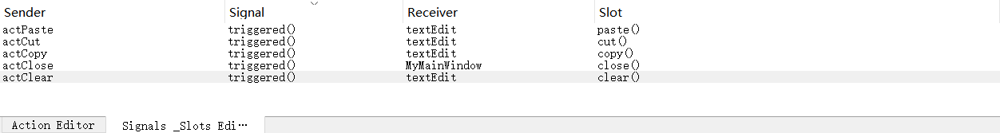

triggered()或triggered(bool)表示单击时发射信号。

格式菜单项里有粗体、斜体、下划线这三个Action，可通过生成槽函数来自己实现，在Action Editor，选中一个Action再点击鼠标右键，“go to slot”，使用triggered(bool)，点击OK后就会转到槽函数实现处了：

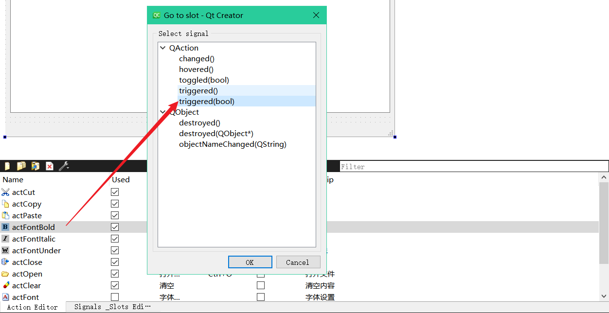

加粗功能实现：（其他的粗体、斜体功能略，本例只用于了解混合方式开发）

```c++
void MyMainWindow::on_actFontBold_triggered(bool checked)
{
    QTextCharFormat fmt;
    fmt = ui->textEdit->currentCharFormat();
    if(checked){
        fmt.setFontWeight(QFont::Bold);
    }else{
        fmt.setFontWeight(QFont::Normal);
    }
    ui->textEdit->mergeCurrentCharFormat(fmt);
}
```

功能拓展：文本框中字体变化时，也会影响Action的enabled和checked属性的更新，使用到QTextEdit的两个信号——copyAvailable(bool b)、selectionChanged()。

```c++
void MyMainWindow::on_textEdit_copyAvailable(bool b)
{
    ui->actCut->setEnabled(b);
    ui->actCopy->setEnabled(b);
    ui->actPaste->setEnabled(ui->textEdit->canPaste());
}

void MyMainWindow::on_textEdit_selectionChanged()
{
    QTextCharFormat fmt;
    fmt = ui->textEdit->currentCharFormat();
    ui->actFontItalic->setChecked(fmt.fontItalic());
    ui->actFontBold->setChecked(fmt.font().bold());
    ui->actFontUnder->setChecked(fmt.fontUnderline());
}
```

### 5.手动创建信号与槽

工具栏和菜单栏上的组件是通过代码方式添加上去的，也需要通过手动代码的方式来实现信号与槽。步骤如下：

1、在mymainwindow.h文件中为MyMainWindow类定义槽函数和用于进行信号与槽关联的函数：

```c
/* 在private slots处加上这两个函数 */
void on_spinBoxFontSize_valueChanged(int aFontSize);         // 改变字体大小
void on_comboFont_currentIndexChanged(const QString &arg1); // 选择字体
/* 在private处加上这个函数 */
void iniSignalSlots();  // 实现信号与槽的关联的函数
```

2、在mymainwindow.cpp文件中实现上述三个函数：

```c++
void MyMainWindow::on_spinBoxFontSize_valueChanged(int aFontSize)
{
    QTextCharFormat fmt;
    fmt.setFontPointSize(aFontSize);
    ui->textEdit->mergeCurrentCharFormat(fmt);
    progressBar1->setValue(aFontSize);
}
void MyMainWindow::on_comboFont_currentIndexChanged(const QString &arg1)
{
    QTextCharFormat fmt;
    fmt.setFontFamily(arg1);
    ui->textEdit->mergeCurrentCharFormat(fmt);
}
void MyMainWindow::iniSignalSlots()
{
    connect(spinFontSize,SIGNAL(valueChanged(int)),
            this,SLOT(on_spinBoxFontSize_valueChanged(int)));
    connect(comboFont,SIGNAL(currentIndexChanged(const QString &)),
            this,SLOT(on_comboFont_currentIndexChanged(const QString &)));
}
```

3、在mymainwindow.cpp文件中实现的构造函数中调用`iniSignalSlots()`函数：

```c++
MyMainWindow::MyMainWindow(QWidget *parent)
    : QMainWindow(parent)
    , ui(new Ui::MyMainWindow)
{
    ui->setupUi(this);
    iniUI();
    iniSignalSlots();
}
```

### 6.为应用程序设置图标

为项目编译后的可执行文件设置自己想要的图标，只需两步：

1. 将.ico后缀的图片文件复制到源程序目录下。

2. 在项目配置文件（.pro文件）里用RC_ICONS设置图标文件即可。

   ```
   RC_ICONS = favicon.ico
   ```

# 4.QT特性

Qt是用C++编写的跨平台开发类库，引入了元对象系统、信号与槽、对象属性等特性。

元对象编辑器（Meta-Object Compiler，MOC）：

- 一个预处理器，源程序被编译器会先将信号、槽、对象属性等Qt特性转为标准C++兼容的形式，然后再由标准C++编译器进行编译。因此，在使用信号与槽机制的类里必须添加一个 Q_OBJECT 宏，添加了这个宏，MOC才能对类里的信号与槽的代码进行预处理。
- 元对象系统实现了信号与槽机制、属性系统、动态类型转换等拓展特性。

## 元对象系统

元对象系统由以下三个基础组成。 

- QObject类是所有使用元对象系统的类的基类。 
- 在一个类的private部分声明Q_OBJECT宏，使 得类可以使用元对象的特性，如动态属性、信号与槽。 
- MOC（元对象编译器）为每个QObject的子类 提供必要的代码来实现元对象系统的特性。 

构建项目时，MOC工具读取C++源文件，当它发现类的定义里有Q_OBJECT宏时，它就会为这个类生成另外一个包含有元对象支持代码的 C++源文件，这个生成的源文件连同类的实现文 件一起被编译和连接。

元对象系统提供的一些功能函数：

- `QObject::metaObject()`：返回类关联的元对象。
- `QMeta::newInstance()`：创建类的新实例。
- `QObject::inherits(const char* className)`：用于判断一个对象是否为className类或者QObject类的子类的实例。
- `QObject::tr()`和`QObject::trUtf8()`：用于多语言界面设计。
- `QObject::setProperty()`和`QObject::property()`：设置属性或获取属性值。


## 属性系统

1、Qt提供了Q_PROPERTY()宏来定义属性。

2、属性使用：提供`QObject::setProperty()`和`QObject::property()`设置、读取属性值。

3、动态属性：`QObject::setProperty()`函数可以在运行时为类定义一个新属性。

4、类附加信息：宏Q_CLASSINFO()，可以为类元对象定义“名称——值”信息。


## 信号与槽

>信号（Signal），也就是事件。槽（Slot），也就是事件的响应函数，与普通函数的区别在于槽函数可以与信号关联，当信号被触发，槽函数就会被执行。信号与槽的补充见QT类库。
>
>**信号与槽的关联通过`QObject::connect()`函数实现：**（关联操作可由UI Designer自动生成）
>
>```c++
>/** 
>	QObject::connect()基本格式：QObject::connect(发送信号的对象，SIGNAL(信号)，接收信号的对象，SLOT(槽函数))
>**/
>QObject::connect(sender, SIGNAL(signal()),receiver, SLOT(slot()));
>```
>
>```c++
>// 关联示例：按钮的点击事件，触发窗体的close()执行
>QObject::connect(pushButton, SIGNAL(clicked()), MainWindow, SLOT(close()));
>// QObject是所有类的基类，connect()是QObject的一个静态函数，因此可以省略QObject
>connect(pushButton, SIGNAL(clicked()), MainWindow, SLOT(close()));
>```
>
>信号，可以看成是一个特殊的函数；槽函数：与信号关联后，当信号被触发时执行的函数。
>
>信号与槽机制是对象间进行通信的机制，与C++Builder中的“事件——响应”类似，但比CB的更加灵活。信号与槽相对于回调函数的执行速度慢一些，但比回调函数灵活得多。

**信号与槽的特点和用法的补充**

1、connect()函数的不同参数形式：

a.函数原型

```c++
QMetaObject::Connection QObject::connect(const QObject *sender, const char *signal, const QObject *receiver, const char *method,Qt::ConnectionType type = Qt::AutoConnection)
```

使用句法：

```c++
// 使用宏SIGNAL()、SLOT()来指定信号和槽函数
connect(sender, SIGNAL(signal()), receiver,SLOT(slot()));
```

使用示例：

```c++
// 信号或槽函数带参数，需要注明参数类型
connect(spinNum, SIGNAL(valueChanged (int)),this, SLOT(updateStatus(int));
```

b.函数原型：

```c++
// 通过函数指针形式进行关联
QMetaObject::Connection QObject::connect(const QObject *sender, const QMetaMethod &signal, const QObject *receiver, const QMetaMethod &method,Qt::ConnectionType type = Qt::AutoConnection)
```

使用场景：信号和槽函数唯一，没有不同参数的其他同名信号和槽。（使用时不用注明信号和槽的参数类型，对于参数较多的情况下使用这个函数可以更加简洁）

使用示例：

```c++
// QLineEdit只有一个textChanged信号，widget只有一个on_textChanged信号
connect(lineEdit, &QLineEdit::textChanged, this,&widget::on_textChanged);
```

c.两个connect()函数中的最后一个参数——Qt::ConnectionType的说明：

- 枚举类型Qt::ConnectionType用于表示信号与槽之间通过何种方式进行关联。
- Qt::AutoConnection：默认值是Qt::AutoConnection，表示信号发射时自动确定关联方式，此时信号的接收者和发送者在同一线程就使用Qt::DirectConnection方式，不是则用Qt::QueuedConnection方式。
- Qt::DirectConnection：信号被发射时槽函数立即执行，槽函数与信号在同一个线程。
- Qt::QueuedConnection：在事件循环回到接收者线程后执行槽函数，槽函数和信号在不同的线程。
- Qt::BlockingQueuedConnection：与Qt::QueuedConnection类似，只是信号线程会阻塞直到槽函数执行完毕。（当信号与槽函数在同一个线程则绝对不能用该种方式，否则会造成死锁）

2、在槽函数里，使用QObject::sender()可以获取信号发射者的指针，从而在槽函数里实现对信号发射者进行操作。

```c++
// 用法，槽函数内
QSpinBox *spinBox = qobject_cast<QSpinBox *>(sender());
```

3、自定义信号及使用

信号就是在类定义里声明的一个函数，声明后不需要实现，只需要发射即可。

```c++
class QPerson : public QObject
{ 
    Q_OBJECT
private:
int m_age=10;
public:
void incAge();
//   声明信号，信号必须无返回值，可以有参数
signals:
void ageChanged( int value);
}
```

```c++
// 发射信号：当执行incAge函数是信号就会被发射，是否有相关槽函数不用管。（发射，就相当于触发相关槽函数）
void QPerson::incAge()
{ 
	m_age++;
	emit ageChanged(m_age); //发射信号
}
```

# 5.QT类库

## 全局定义—QtGlobal

`<QtGlobal>`头文件，包含了Qt类库的一些全局定义，包括基本数据类型、函数、宏。

`<QtGlobal>`头文件中定义的数据类型：

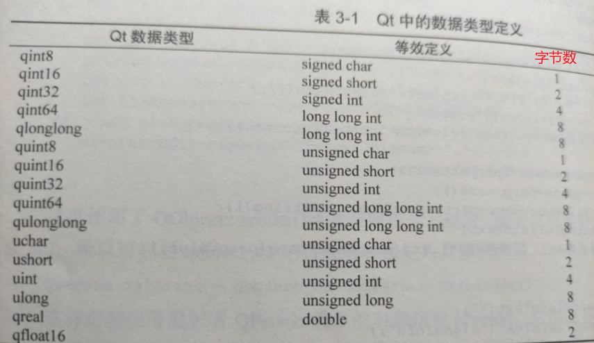

在`<QtMath>`头文件中定义了三角运算函数、弧度与角度之间的转换函数等。

## 容器类

Qt的容器类的特点：

- 基于模板。
- Qt的容器类比标准模板库（STL）中的容器类更轻巧、安全和易于使用。
- 这些容器类是隐式 共享和可重入的，而且它们进行了速度和存储优化，因此可以减少可执行文件的大小。
- 线程安全的，也就是说它们作为只读容器 时可被多个线程访问。

Qt的容器类的分类：顺序容器（sequential containers）和关联容器（associative containers）。

Qt的容器迭代类分类：Java类型的迭代类和STL类型的迭代类。

- Java类型的迭代类易于使用，提供高级功能，而STL类型的迭代类效率更高一些。

容器遍历：Qt提供了foreach宏用于遍历容器内的所有数据项。

### 顺序容器类

QList、QLinkedList、 QVector、QStack和QQueue。（类比Java中的List）

QList → insert()、replace()、removeAt()、 move()、swap()、append()、prepend()、 removeFirst()和removeLast()等。

QLinkedList → 与QList 方法基本相同。

QVector提供动态数组的功能，以下标索 引访问数据。 QVector的函数接口与QList几乎完全相同， QVector的性能比QList更高，因为 QVector的数据项是连续存储的。

QStack是提供类似于堆栈的后入先出 （LIFO）操作的容器类，push()和pop()是主要的接口函数。

QQueue是提供类似于队列先入先出 （FIFO）操作的容器类。enqueue()和dequeue()是 主要操作函数。


### 关联容器类

QMap、QMultiMap、 QHash、QMultiHash和QSet。（类似Java中的Map、Set）

## 迭代器

Java类型的迭代器和STL类型的迭代器，foreach。

## Qt组成模块

基本模块：

| 模块                  | 描述                                             |
| --------------------- | ------------------------------------------------ |
| Qt Core               | 其他模块都用到的核心非图形类                     |
| Qt GUI                | 设计GUI界面的基础类，包括OpenGL                  |
| Qt Multimedia         | 音频、视频、摄像头和广播功能的类                 |
| Qt Multimedia Widgets | 实现多媒体功能的界面组件类                       |
| Qt Network            | 使网络编程更简单和轻便的类                       |
| Qt QML                | 用于QML和JavaScript语言的类                      |
| Qt Quick              | 用于构建具有定制用户界面的动态应用程序的声明框架 |
| Qt Quick Controls     | 创建桌面样式用户界面，基于Qt Quick的用户界面控件 |
| Qt Quick Dialogs      | 用于Qt Quick的系统对话框类型                     |
| Qt Quick Layouts      | 用于Qt Quick 2界面元素的布局项                   |
| Qt SQL                | 使用SQL用于数据库操作的类                        |
| Qt Test               | 用于应用程序和库进行单元测试的类                 |
| Qt Widgets            | 用于构建GUI界面的C++图形组件类                   |

附加模块：

增值模块：


# 常用控件

QWidget、QLabel、QPushButton、QLayout、QLineEdit、QTextEdit等。

文本显示：QLabel 和QLineEdit。

字符串类：QString类。

控件的功能、属性。

## QWidget


## QLabel


## QPushButton


## QLayout


## QLineEdit


## QTextEdit


# 多窗体


