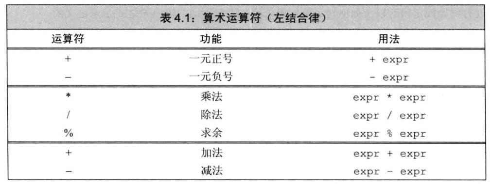
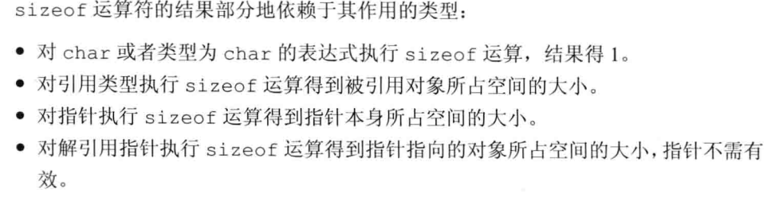
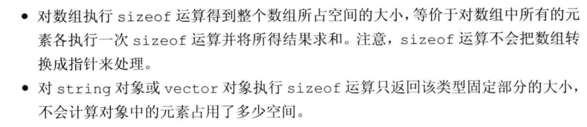
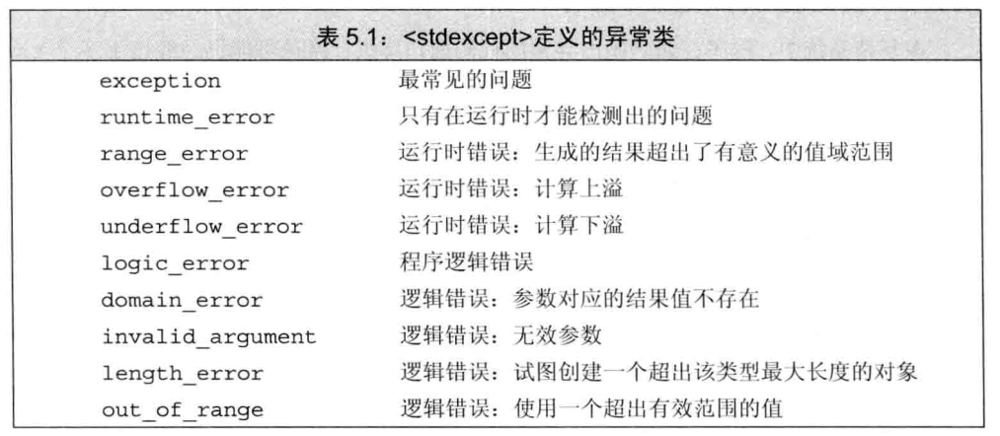

**学习一门新的编程语言的最好方法就是练习编写程序**

# Start

## 编译器

参考文章：[C++主流编译器总结 - 张小凯的博客 (jasonkayzk.github.io)](https://jasonkayzk.github.io/2022/05/28/C++主流编译器总结/)

C和C++主流的编译器GCC/G++、MSVC、clang等。

关于LLVM：全称叫`Low Level Virtual machine`，最初设计是想搭建一套虚拟机，不过后来变成了一个编译器框架，但沿袭了LLVM的简称；Clang（`/ˈklæŋ/`），是编译器前端，用来编译C、C++、Objective-C；clang则是编译器驱动。（[LLVM基本概念入门_P2Tree的博客-CSDN博客](https://blog.csdn.net/SiberiaBear/article/details/103111028)）

Windows下安装C/C++编译器：（参考C中编译器安装）

- MinGW-w64：Minimalist GNU on Windows，GNU的Windows版本，官网下载离线版并配置环境变量。（[MinGW-w64](https://www.mingw-w64.org/)）
- MSVC：安装Visual Stdio，Visual Stdio自带MSVC（Microsoft Visual C++）。 
- LLVM：安装LLVM的Windows版本，LLVM的clang默认使用MSVC，也可指定使用MinGW。

Linux下，`man gcc`可以去查看GCC支持的C++版本。


## C++程序编译过程

编译的完整过程：

- 预处理器阶段 → 实际编译阶段 → 链接阶段 → 可执行文件。
- 预编译处理(.c) → 编译、优化程序（.s）→ 汇编程序(.obj、.o、.a、.ko) →  链接程序（.exe、.elf、.axf等）。

编译命令：`gcc -o main main.cpp`，将main.cpp编译为可执行文件main.exe。

以程序`main.cpp`为例，可执行文件生成的整个过程：

1. `g++ -E main.cpp -o main.i`：预处理，此时生成`.i`文件（是一个C文件）；**预处理阶段把 `#include` 包含进来的 `.h文件` 插入到 `#include` 所在的位置，把源程序中使用到的用 `#define` 定义的宏用实际的字符串代替**。（-E参数，使编译在预处理结束后停止）
2. `g++ -S main.i -o main.s`：编译，此时生成`.s`文件；**编译阶段，GCC 首先要检查代码的规范性、是否有语法错误等**，这是为了确定代码的实际要做的工作。（-S参数，使编译结束后结束）
3. `g++ -c main.s -o main.o`：汇编，此时生成`.o`文件；**汇编阶段把 `.s`文件翻译成二进制机器指令文件`.o`，这个阶段接收 `.c` 、`.i`、`.s` 的文件都没有问题**。
4. `g++ -o main main.s`：链接，连接目标代码、分配实际内存并生成可执行程序；**链接阶段，链接的是函数库，就是将main.cpp中没有定义的函数的具体实现给连接进来（预处理引进来的一般是声明和宏定义，函数具体实现基本都不会放在头文件里）**。（函数库分为动态库和静态库两种）

关于动态库和静态库：

- **静态库：是指编译链接时，把库文件的代码全部加入到可执行文件中，因此生成的文件比较大，但在运行时也就不再需要库文件了；Linux中后缀名为 `.a`**。（静态库节省时间：不需要再进行动态链接，需要调用的代码直接就在代码内部）
- **动态库：与静态库相反，在编译链接时并没有把库文件的代码加入到可执行文件中，而是在程序执行时由运行时链接文件来加载库；Linux中动态库文件后缀名为 `.so`，如前面所述的 `libc.so` 就是动态库。**（动态库节省空间：如果一个动态库被两个程序调用，那么这个动态库只需要一份在内存中）

## make&cmake简介

make：

> 一个根据指定的Shell命令进行构建的工具。何为构建？构建就是对编译的安排，安排文件编译的先后顺序。简单来说，make就是一个批处理程序，其本身没有链接和编译的功能，只能通过调用makefile文件中用户指定的命令来编译和链接。

makefile：

> 一个包含构建规则（Shell命令）的文件，类unix环境下(比如Linux)的类似于批处理)的"脚本"文件，make工具根据里面的规则（命令）来进行源文件的编译和链接。
>
> make&makefile：在一些简单的工程下编写命令来进行构建不是什么麻烦事，但是当工程非常大的时候，makefile就会非常麻烦了；因此后面出现了cmake。

cmake：

> 可以更加简单地生成makefile，并且还有跨平台生成对应平台的makefile的功能。cmake工具通过CMakeLists.txt文件（学名：组态档）去生成makefile，这个文件一般都是由程序员来写，也有些IDE能自动写好CMakeLists.txt文件。

qmake：

> Qt公司制造出来，用来生成Qt 专用makefile文件，这种makefile文件就能自动智能调用moc和uic对源程序进行预处理和编译。qmake当然必须也是跨平台的，跟cmake一样能对应各种平台生成对应makefile文件。由于qmake很简单很好用又支持跨平台，而且是可以独立于它的IDE，所以你也可以用在非Qt工程上面，照样可以生成普通的makefile，只要在pro文件中加入CONFIG -= qt 就可以了

qmake和cmake的区别？

> cmake也是同样支持Qt程序的，cmake也能生成针对qt 程序的那种特殊makefile，只是cmake的CMakeLists.txt 写起来相对与qmake的pro文件复杂点。
> qmake 是为 Qt 量身打造的，使用起来非常方便，但是cmake功能比qmake强大。

makefile总结：  

> makefile 规定了一套编译规则，使用什么[编译器](https://www.zhihu.com/search?q=编译器&search_source=Entity&hybrid_search_source=Entity&hybrid_search_extra={"sourceType"%3A"answer"%2C"sourceId"%3A1914452432})，编译器使用什么样的编译选项，每个文件都有什么依赖关系。在编译的时候，能够直接根据 makefile 来确定哪些文件依赖于其他的哪些文件，从而把编译顺序、需不需要重新编译以及链接都自动检测出来，配合上 g++ 的 -MM 选项，这能够节约大量的编译时间，避免重新编译没有做过任何改动的文件。我们都知道 cpp 的编译速度本身就慢的感人……  
>
> 这样，有效防止了每次做一些改动就要把所有文件都编译一遍的浪费时间的做法。不然的话，一个 cpp 项目，可能编译半天也编译不完，要是想改点什么地方，难道还要等那么长时间再重新测试吗？
>
> 作者：Timothy Liu
> 链接：https://www.zhihu.com/question/461953861/answer/1914452432
> 来源：知乎
> 著作权归作者所有。商业转载请联系作者获得授权，非商业转载请注明出处。

# main()

```c
/* main.cpp */
#include <iostream>
int main(){
    std::cout << "Hello World!" << std::endl;
    return 0;
}
```

main()函数作为整个程序的入口，操作系统通过调用main()函数来运行整个C++程序。

返回值0表示成功；返回值是非0的话，非0的含义由操作系统决定。

- C++源文件后缀：.cpp、.cc、.cxx、.C、.c++、.cp。
- 头文件后缀：.h、.hpp、 .hxx。

**注释：**

```c++
/*  */   多行注释
//       单行注释
```

# 输入输出

C++中未定义任何的输入输出语句，其通过标准库（standard library）来提供IO机制，比如iostream标准库。

```c++
#include <iostream> 
int main() {
	/* cin：处理输入
	*  cout：处理输出
	*  cerr：输出警告和错误
	*  clog：输出程序运行时一般信息
	*/
	std::cout << "inter" << std::endl;
	int v1 = 0, v2 = 0;
	std::cin >> v1 >> v2;
	std::cout << v1 << "and" << v2 << std::endl;
	std::cerr << "警告~错误" << std::endl;
	std::clog << "日志" << std::endl;
    return 0; // 返回一个值给操作系统
}
```

1. `#`：#之后的都是预处理语句，编译器会优先处理并在实际编译之前就去处理。
2. `include`：include有包括的意思，其是一个预处理指令，表示当前源文件包括某个文件，此处表示找到iostream这个文件并拷贝到当前源文件中，这些文件也称之为“头文件”，通常都在源文件的头部引入，它们的文件名后缀为.h、.hpp、或.hxx。
3. `endl`：结束当前行并将缓冲器内容刷新到设备，保证所有输入输出写入输出流
4. `std`：命名空间，`std`指出cout、endl是定义在名为 std 的命名空间中的、是来自 std 命名空间中的。
5. `::`：作用域运算符，用于指出使用哪个作用域中哪个名字，如果作用域操作符左侧为空则默认在全局作用域请求数据。

```c++
while(std::cin >> xxx){   //  退出该循环：回车后按Ctrl + Z 后再按回车
    
}
```

# 变量和数据类型

## 基本数据类型

C++的基本数据类型分为算术数据类型（字符、整数、浮点数、布尔值）和空类型（void）。

**算术数据类型：字符、整数、浮点数、布尔值。**

C++标准规定的数据类型的最小尺寸：

| 数据类型    | 含义                            | 最小尺寸     |
| ----------- | ------------------------------- | ------------ |
| bool        | 布尔类型，其值取值为true或false | 未定义       |
| char        | 字符型，单个字符                | 8位          |
| wchar_t     | 宽字符                          | 16位         |
| char16_t    | Unicode字符                     | 16位         |
| char32_t    | Unicode字符                     | 32位         |
| short       | 短整型                          | 16位         |
| int         | 整形                            | 16位         |
| long        | 长整型                          | 32位         |
| long long   | 长整型                          | 64位         |
| float       | 单精度浮点型                    | 6位有效数字  |
| double      | 双精度浮点型                    | 10位有效数字 |
| long double | 拓展精度浮点数                  | 10位有效数字 |

标准中各数据类型的大小规定：

- 整型：int至少和short一样大；long至少和int一样大；long long（C11出现的）至少和一个long一样大。
  (从表中可知。int和short至少16位，long至少32位，long long至少64位)
- 浮点型：float，32 bit；double，64 bit；long double，96 bit或128 bit。通常，float有7个有效位，double有16个。

无符号类型：

- 无符号整型：unsigned short、unsigned int（简写为unsigned）、unsigned long、unsigned long long。
- 字符型的无符号类型：字符型分为三种——char、signed char、unsigned char，char的具体表现为signed char还是unsigned char是由编译器决定的。一个char的大小和一个机器字节一样。

无符号类型与有符号类型的区别在于：

1. 无符号类型不能表示负数。
2. 无符号类型全部位都表示数值位，而有符号最高位表示符号位。

**关于如何选用各种数据类型：**

1. 整数运算常用int，如果数的长度超过int那么使用long long，不用long是因为long一般和int的尺寸一样。
2. 算术运算中不要涉及char、bool，如果需要用char来定义一个不大的整数那也应该指明是无符号类型还是有符号类型。
3. 存放字符时用char，存放布尔值用bool。
4. 浮点运算常用double，float精度不够并且双精度、单精度的浮点数运算代价几乎一致。
5. 确切知道数值不为负时使用无符号类型。

## 类型转换

**赋值时数据类型的自动转换机制：**

1. 数值赋给bool类型变量，0转为false，其他的转为true；bool变量的值赋给非布尔类型，true转为1、false转为0。
2. 浮点数赋给整数，只保留小数点前的数值；整数赋给浮点数时小数部分记为0，如果该整数超过浮点数的范围那将会导致精度损失。
3. 赋给无符号类型变量的值超过该无符号类型的值的范围，结果将是该值对该类型的的最大值取模后的余数。
4. 赋给带符号类型一个超过其范围外的值，结果将是undefined的，程序可能继续工作，或者崩溃、生成垃圾数据等。

```c
#include <iostream>

int main() {
    /* 赋给无符号类型变量的值超过该无符号类型的值的范围，结果将是该值对该类型的的最大值取模后的余数。 */
    unsigned char n1 = 1226;  //  1226 % 256 = 202
    unsigned char n2 = -1;    //  -1 % 256 = 255
    int v1  = n1;
    int v2 = n2;
    std::cout << v1  << std::endl;
    std::cout << v2  << std::endl;
    std::cout << (v1 == n1) << std::endl;
    return 0;
}
```

>为什么 -1 % 256 = 255？
>
>数学角度：取模运算时,对于负数,应该加上被除数的整数倍,使结果大于或等于0之后,再进行运算。$(-1 + 256)%256=255$。
>
>类型转换角度：-1是int型，转为无符号char型，然后就是255了。
>
>[-1对256取模 - Sander_Hill - 博客园 (cnblogs.com)](https://www.cnblogs.com/houqi/p/5644384.html)

**运算时数据类型的自动转换机制：**

- 算术表达式中既有无符号数又有int时，那个int值会被转为unsigned int。（转换过程和将int赋给无符号数的机制一样，超过范围就会转换，结果就是取模后的余数） 
- 无符号减去某个数，结果仍然是无符号数，如果减去的结果是负数，那么这个负数将会转为无符号数。

```c++
/* 这样就会转 */
unsigned  a = 1;
int b = -12;
std::cout << a + b << std::endl; // 4294967285
/* 这样不会转 */
unsigned short  a = 1;
int b = -12;
std::cout << a + b << std::endl; // -11
/* 这样也会转 */
unsigned long  a = 1;
// unsigned long long a = 1;
int b = -12;
std::cout << a + b << std::endl; // 4294967285
```

```c
/* 无符号数减去某个数 */
/* 这样就会转 */
unsigned  a = 1;
int b = 12;
std::cout << a + b << std::endl; // 4294967285
/* 这样不会转 */
unsigned short  a = 1;
int b = 12;
std::cout << a - b << std::endl; // -11
/* 这样也会转 */
unsigned long  a = 1;
// unsigned long long a = 1;
int b = 12;
std::cout << a - b << std::endl; // 4294967285
```

总结：上述转换只会发生在整数之间，并且只发生在int 、long、 long long及它们的无符号类型之间。


## 字面值常量

字面值：字面意思上的值

- 整型和浮点型字面值：33、3.3。
- 字符和字符串型字面值：'a'、"string"。
- 布尔值字面值——true、false。
- 指针字面值——nullptr。

**字面值常量类型指定：**可通过前后缀，改变整型、浮点型、字符型字面值的默认类型。

字符和字符串字面值：

| 前缀 | 含义                   | 类型     |
| ---- | ---------------------- | -------- |
| u    | Unicode 16 字符        | char16_t |
| U    | Unicode 32 字符        | char32_t |
| L    | 宽字符                 | wchar_t  |
| u8   | UTF-8 （仅用于字符串） | char     |

整型字面量：

| 后缀     | 最小匹配类型 |
| -------- | ------------ |
| u 或 U   | unsigned     |
| l 或 L   | long         |
| ll 或 LL | long long    |

浮点型字面量：

| 后缀   | 类型        |
| ------ | ----------- |
| f 或 F | float       |
| l 或 L | long double |

```c++
int v1 = 12L;   //  12是long型
int v2 = 3.1415926L; //  12.0是long double型
int v3 = 33ULL; // 33是unsigned long long型
```

## 转义字符

| 转义字符 | 含义       |
| -------- | ---------- |
| \n       | 换行       |
| \t       | 横向制表符 |
| \v       | 纵向制表符 |
| \ "      | 双引号     |
| \ '      | 单引号     |
| \ \      | 反斜       |
| \r       | 回车       |
| \?       | 问号       |
| \f       | 进纸符     |
| \b       | 退格符     |

```cpp
#include <iostream>

int main() {
    std::cout << "\r" << std::endl;
    return 0;
}
```


## 变量及初始化

变量：通过变量来提供具名的、可供程序操作的存储空间，变量的类型指定了变量的取值范围、占用内存的大小、布局方式等。

```c++
/* 变量定义及初始化初始值 */
int var = 33;
int v1 = 33, v2 = 66, v3 = 99;
```

 C++中变量初始化和变量赋值是两个完全不同的操作。

- 初始化：创建变量时赋予初始值。（未初始化的变量不能被用于其它变量的初始化）
- 赋值：把对象当前值擦除，以一个新值来代替。赋值改变的永远是等号左侧的对象。

**初始化的几种方式：**

```c++
/* 使用等于号初始化变量 */
int val1 = 0;
/* 使用花括号初始化变量，也称为列表初始化；花括号还可用于初始化对象、为对象赋新值 */
// 注意：使用列表初始化来初始内置类型的变量时，如果初始值存在丢失风险则编译器会报错
int val2 = {0};
int val3{0};
long double ld = 3.1415926;
int pi{ld};   // 转为int，存在丢失信息风险，会报错
/* 使用括号初始化变量 */
int val4(0);
```

**默认初始化：**变量定义但没指定初始值时，变量会被默认初始化，被赋予一个默认值

1. 任何函数体之外定义的基本类型变量：都默认初始化为0（无论char、double等都是0）。
2. 函数体内定义的基本数据类型的变量：没有默认初始化。
3. 类：由自身决定。比如string类默认初始化为空串等。
4. 总结：局部变量没有默认初始化操作。

**声明和定义：**

c++的分离式编译机制：允许将程序分割为若干个文件，每个文件可被独立编译。而为了支持这种机制，c++语言将声明和定义区分开来。

- 声明：是指出存储类型，并给存储单元指定名称，变量可以被多次声明。声明使得名字为程序所知，一个文件如果想使用别处定义的名字则在这个文件中必须包含对那个名字的声明。（规定变量的类型和名字）
- 定义：创建与名字相关联的实体，变量只能被定义一次。（定义过程中包含了声明，并且会分配内存空间，还可为变量指定初始值）

```c++
// 声明：需要使用extern关键字修饰，并且不要初始化，才是声明
extern int i;
// 定义的两种方式：
int j;            // 声明并定义j，没有初始化
extern int i = 0; // 声明并定义i，初始化为0
```

注意：在函数体内部不能初始化 extern关键字标记的变量，否则将引发错误。

**名字的作用域：**同一名字在不同作用域下指向的实体可能不同。

1. 全局作用域：函数外定义的。
2. 块作用域：函数内定义的。

没有特别指定时作用域就近原则。如果函数中有可能使用到某全局变量，那么不宜定义同名的局部变量。

## 声明与定义

C++语言支持分离式（separate compilation）编译机制，该机制允许将程序分割为若干个文件，每个文件可被独立编译。

C++如何实现对分离式编译的支持？答案就是将声明和定义给严格区分开。

- 声明：使名字为程序所知。
- 定义：分配具体的内存空间，负责承建与名字关联的实体。

```c++
/* 仅仅声明，需要使用extern关键字 */
extern int val;
/* 定义 */
int v1;
extern int v2 = 33;
int v3 = 33;
```

函数内部不能再初始化一个由extern关键字标记的变量：

```c++
extern int vari = 33;     // 全局作用域下，则不会，定义了一个变量vari并初始化为33
int mian(){
    extern int var = 33;  // 会报错：`error: 'var' has both 'extern' and initializer`
}
```

C++是静态类型（statically typed）语言，也就是在编译阶段检查类型。检查类型的过程称为类型检查（type checking）。

## 标识符

**标识符：**

1. 标识符是由字母、数字、下划线组成，且必须以字母或下划线开头。
2. 用户自定义的标识符不能连续出现两个下划线，也不能以下划线紧连大写字母开头。
3. 定义在函数体外的标识符不能以下划线开头。（定义在函数体外的标识符只能以字母开头）

命名规范：

- 标识符要能体现实际含义。
- 变量名小写，采用UNIX风格，即`name_example`，多单词间以下划线间隔开来。
- 类名：首字母大写，驼峰式命名。

关键字见P43。

## 作用域

- 全局作用域：函数外定义的。
- 块作用域：函数内部定义的，{}内定义的。
- 嵌套作用域：内部的作用域可以访问外部的作用域，并且内部的作用域中可以再次定义外部已经定义过的变量。
  不应该再次定义全局作用域已经定义过的变量。
  访问变量，就近访问，即就近原则，也就是说块作用域内的可以覆盖全局作用域的。

# 引用和指针

复合类型：基于其他的数据类型定义的类型，例如引用、指针。

## 引用

引用即别名：（通常引用都指左值引用，C++11新增了一种叫做“右值引用”的。）

- **引用不是对象，只是为对象起了另外一个别名**，可为一个对象定义多个引用但不能直接对字面量定义引用。
- 定义引用时，引用会和初始值对象一直绑定在一起（引用无法被重新绑定到一个新对象，因此必须被初始化）。

```c++
int val = 12;
int &num = val;
int &refVal; // 错误，引用必须被初始化
int &r = num; // 正确，因为num是引用，这里相当于 int &r = val;
```

c++中不允许定义引用的引用，因为引用不是对象。

```c++
// 摘自[C++ 是否能够定义引用的引用？ (https://www.zhihu.com/question/28023545)
int ival = 1024;
int &refVal = ival;
int &(&refVal2) = refVal; // 错误，无法创建对引用的引用

// 注：类型别名和函数模板均会触发引用折叠，可间接定义引用的引用
```

了解一下：但c++中允许间接定义引用的引用（严格意义上不是引用的引用，只是引用折叠，引用折叠是std::move、std::forward等的工作基础）。

## 指针

指针是“指向”其他对象的对象，其本身是对象，指针变量存储的是指向对象的地址值。

指针与引用的区别：

- 允许对指针对象进行拷贝和赋值。
- 生命周期内指针可以先后指向不同的对象。
- 指针不需要在定义时赋予初始值。
- 块作用域内未初始化的指针将拥有一个不确定的值。

指针定义：

```c++
/* 指针定义：使用*来定义指针变量 */
int ival = 12;
// d是指向变量ival的指针，指针变量d存放了ival变量的地址；&是取地址符，此处意为取出基本类型变量ival的地址
// 什么类型的指针存放什么类型的变量的地址，必须严格匹配
int* d = &ival; 
```

注意：指针的类型实际上是被用于指定它所指向的对象的类型，也就是指针指向对象与指针对象本身类型必须匹配。

指针的值（即地址）应该是这四种状态之一：

1. 指向一个对象。
2. 指向紧邻对象所占空间的下一个位置。
3. 空指针，没有指向任何对象。
4. 无效指针，上述三种外的其他值。

```c++
/* 指针访问对象 */
int ival = 12;
int* d = &ival; // 取地址赋予指针对象
std::cout << *d << std::endl; // 使用解引用符 *，获取到的是指针对象内存放的地址所指向的值
```

```c++
/* 空指针 */
int* p1 = nullptr; // nullptr，C++11引入的等价于int *p1 = 0； 将指针初始化为0也可以得到空指针

#include <cstdlib> // NULL在头文件cstdlib中定义，值为0
int* p1 = NULL;
```

注意：

- 指针存放的是变量地址值而不能存放变量中存储的值。
- 赋值永远改变的是等号左侧的对象。

指针变量可用于条件表达式：

- 空指针为false，非空指针都为true。
- ==、!=来判断时：都是空指针则相等，都指向同一个地址则相等。

字符串字面量可赋值给指针，此时指针指向的是字符串的第一个字符。

**void*指针：**该指针可以存放任何类型变量的地址。

```c++
void* val = &obj;
```

**指向指针的指针：**

指针是内存中的一个对象，也有着自己的地址。C++中允许将指针的地址放到另一个指针中，以*的个数来区分指针层级。

```c++
// **：指针的指针。
// ***：指针的指针的指针。
int i = 12;
int* p1 = &i;
int** p2 = &p1; // p2存放的是另一个指针的地址，所以用**来表示p2是p1指针的指针
int*** p3 = &p2;
// **p2;  取出值
// ***p3; 取出值
```

**指向指针的引用：**

即指针类型的变量的引用。（`&` —— 既用于定义引用，也用于取地址）

```c++
int i = 12;
int* p1;
/* 从右往左看，根据ref最靠近的声明符就可以判断其是什么类型，
这里最靠近&，因此可看出其是一个引用，其他的用于确定这个引用是什么类型 */
int *&ref = p1; // 定义指针变量的引用，ref这个名字就可以替代p1，将ref看成p1即可
ref = &i;       // 因为是指针的引用，直接对引用赋值相当于对p1赋值
*ref = 0;       // 相当于对*p1赋值
```

对于比较复杂的指针或引用的定义语句，从右往左看可易于看清语句真实意义。

# const限定符

## const的使用

- const限定的变量经初始化后其值不能再被改变，并且const限定的对象必须被初始化；
- 可以使用变量来初始化使用了const限定符限定的对象，但只是将值拷贝。

```c++
int num = 12;
// 必须被初始化
const int val = num;
// const 限定的变量的初始值可以是表达式，如果是表达式则会在运行时完成初始化
const int val = get_size();
```

默认状态下，const限定的变量只在文件内有效，如果需要文件间共享，则需要使用extern关键字。示例如下：

```c++
// main.cpp 使用extern来定义
extern const int bufSize = bufInit();
// test.h  声明变量
extern const int bufSize;
```

这样声明后怎样才能使用？

```c++
// test.cpp
#include "test.h"

int test(){
    return bufSize;
}
int bufInit(){
    return 1024;
}
int bufPlus(){
    return bufSize << 1;
}
// test.h
extern const int bufSize;

int test();
int bufInit();
int bufPlus();
```

```c++
// main.cpp
#include <iostream>
#include "test.h"
extern const int bufSize = bufInit();
int i = 42;
int main()
{
    std::cout << bufSize << std::endl;
    std::cout << bufPlus() << std::endl;
    return 0;
}
```


## 限定引用

对引用使用const限定符限定，表示不能通过该引用去修改绑定对象的值。

对常量的引用：即将引用绑定到const对象上。

对常量的引用不能被用于修改其绑定的对象。（不能通过该引用修改引用绑定对象的值）

```c++
// 定义常量
const int val = 12;
// 定义对常量的引用，引用与常量对象绑定，引用本身也需是常量引用
const int &ref = val;  
```

对常量的引用，其类型必须与其引用的对象的类型一致，但有两个例外：

1. 初始化常量引用允许任意表达式作为初始值，只要表达式结果能转换成引用的类型即可。
2. 允许为常量引用绑定非常量的对象、字面值、甚至是一般表达式，但不允许普通引用绑定常量对象。

```c++
int val = 1;
double num = 3.14;
// 定义常量引用，只读不可写
const int &ref1 = val; 
const int &ref2 = val * 2;
const int &ref3 = 12; 
const int &ref4 = num;  // 这里编译器会创建一个临时变量将double转为int再赋值给常量引用
```

**常量引用不能转为普通引用。**

## 限定指针

使用const限定符限定的指针，只能通过这个指针去访问目标对象，而不能通过该指针修改目标对象。

指向常量的指针：其不仅仅能指向常量，也能指向非常量。普通指针不能指向常量。

```c++
/* 指向常量的指针，而不是常量指针，指针的地址初始化后能再被改变 */
int num = 10;
// 限定*cptr为常量，而不是限定cptr为常量，const限定的是 *cptr，此时不能通过对*cptr进行赋值操作，但不影响num变量
const int* cptr;
cptr = &num;
const int v2 = 100;
cptr = &v2;
std::cout << *cptr << std::endl;
```

常量指针：定义常量指针，指针的值初始化后不能再被改变

```c++
int num = 12;
// 定义常量指针，可以这样理解：从右往左看，const仅限定指针变量cptr为常量，而不是限定*cptr为常量
int* const cptr = &num;
std::cout << *cptr << std::endl;
int val = 33;
cptr = &val;  // 错误，常量指针不能再被赋值
```

综上，指向常量的常量指针：指针自身不能被改变，指向的对象也不能通过这个指针被改变

```c++
const int num = 12;
const int* const cptr = &num;  // 指向常量的常量指针
```

## 顶层const

- 用顶层const表示指针本身是一个常量（变量本身是常量也是顶层const）。（顶层——本身）
- 用底层const表示指针所指向的对象是一个常量（const修饰的引用都是底层const）。（底层——本身指向的）

**执行对象的拷贝操作时，拷入和拷出的对象——必须有相同的底层const，或者两个对象的数据类型必须能够转换。（重要）**

一般而言，非常量可以转换为常量，反之不行。

```c++
const int *p2 = 0;
const int *const p1 = p2;   // 正确，有相同的底层const
int *p = p1;   // 错误，没有相同的底层const，而且无法从const int *const转为int
int *p3 =0
p2 = p3;       // 正确int* 可以转为 const int*
			  // 对常量对象取地址也是底层const
```


## constexpr和常量表达式

常量表达式：**指值不会改变，且在编译过程中就能得到计算结果的表达式**。（比如字面值、常量值运算）

`C++11`新标准规定，允许将变量声明为`constexpr`类型以便由编译器来验证变量的值是否是一个常量的表达式。声明为constexpr的变量一定是常量并且必须使用常量表达式来初始化。

```c++
// 常量表达式
constexpr int num = 12;
constexpr int val = num + 1;
constexpr int v = size();   //  当 size()是一个constexpr函数时才正确
// constexpr函数
constexpr int size()
{
  return 1;
}

// 初始值是字面值常量，但是数据类型不是const int，还是可以被重新赋值，所以不是常量表达式
int val = 12;   
//  具体值在编译过程中不知道，运行后才知道，但如果get_size()是一个constexpr函数，那么才会是常量表达式
const int sz = get_size();   
```

字面值类型可以使用constexpr，比如算术类型、指针、引用都是，自定义的类、IO库、string类都不是字面值类型。

constexpr指针的初始值必须是nullptr、0或者存储于固定地址的对象。

在constexpr声明中定义一个指针，限定符constexpr仅对指针有效，与指针所指向对象无关。

```cpp
// 限定ptr，即指针ptr是常量指针
constexpr int* ptr = nullptr;
```

# 类型简化

## 类型别名

类型别名：为类型起一些好听的名字

```c++
/* typedef */
typedef double wages;
// 为double、double*再起别名——base、p
typedef wages base, *p;   
```

类型别名指代复合类型或常量时，把它用于声明语句会出现意料之外的效果。（先跳过）

```c++
typedef char* pstring;   // 类型char*的别名为 pstring

const pstring cstr = 0;   // const (char*) cstr = 0;   常量指针
const pstring* ps;        // const (char*) *cstr;      指针cstr指向的是一个常量指针
const char* cstr = 0;     // (const char*) cstr;     指向常量的指针
```

**别名声明：**（c++11新标准中出现的）

```c++
/* using */
using wages = double;  // double 的别名 wages
using p = wages*;      // double* 的别名 p
```

类型别名和类型名称等价，只要类型可以出现的地方，类型别名都可以出现。

不要将类型别名替换成原来的样子来去理解，这样去做有时会出现歧义，比如：

```c++
typedef char* pstring;
// 要把pstring看作是一个整体，cstr就成了指向char的常量指针，这里const pstring是基本数据类型
const pstring cstr = 0;  
// cstr2是指向常量的指针，而不是常量指针，这里const char是基本数据类型
const char* cstr2 = 0;   
```


## auto

解决场景问题：将表达式的值赋给变量时，不知道表达式的最终结果的类型。C++11就引入了auto，来使编译器去分析表达式所属类型。

**auto——类型说明符：**让编译器分析表达式所属的类型，通过初始值来推断变量的类型，使用auto必须要有初始值。

```c++
//   item的类型由表达式决定，可以是对象或者某种基本数据类型、复合数据类型
auto item = v1 + v2;  
auto i = 1, *p = &i;  //  整型和整型指针
auto data = 1, num = 2.0;   // 错误，int、double，类型不一致，一条声明语句只能有一个基本数据类型
```

auto使用注意事项：

1. 编译器推断处理的auto类型有时候可能会和初始值的类型不一致。
2. 如果使用引用初始化变量，那么auto类型是引用所绑定的对象的类型，此时auto会忽略顶层const，底层const则会保留下来。

```cpp
const int ci = 12, &cr = ci;
auto b = ci;  // 会忽略顶层const，此时b被推断为int
auto b = cr;  // 会忽略顶层const，此时b被推断为int
const auto c = cr;  // 推断后就是 const int
```

如果将引用的类型设置为auto，那么就会被推断为要绑定的对象的类型。


## decltype

解决问题场景：需要从表达式结果来推出要定义的变量的类型，但不想用该表达式的值来初始化变量。因此C++11引入了decltype，用于选择并返回操作数的数据类型。

**decltype类型说明符：**用于选择并返回操作数的类型。（从表达式的类型推断出要定义的变量的类型）

`decltype()`，括号内的仅用来确定最终数据类型，并不会执行。

```c++
decltype(fun()) sum1 = xxx;   //  函数fun的返回值类型就是sum1变量的类型，实际并没有调用该函数
decltype(i) sum2 = xxx;       //  decltype(i)的i是什么类型sum2就是什么类型，（decltype(i)可以是引用）
```

decltype和引用：

```c++
int i = 12, &ref = i, *p = &i;
decltype(ref + 0) sum3 = xxx;   // 加法的结果是int，因此推断为 int
decltype(*p) sum4 = xxx;        // 表达式的内容是解引用操作，因此推断为引用 int&

decltype((i)) sum5 = xxx;       // 变量加了括号，得到的都将是引用  int&
```

`decltype(variable)`和`decltype((variable))`：

1. `decltype(variable)`：由variable本身决定。
2. `decltype((variable))`：永远是引用。

引用产生的两种情况：

1. 变量可以作为赋值语句左值的特殊表达式，会产生引用。
2. 赋值操作也是一种会产生引用的表达式，引用类型以左值类型为准。

```c++
int a = 3, b =4;
decltype(a) c = a;     // int 
decltype(a = b) d = a; // int&
```

# 自定义数据结构

## struct

通过struct关键字定义类：类可以定义在全局作用域、函数块作用域或者头文件中。

定义类的基本语法格式：（没指定public、private，struct内的成员都默认是public）

```c++
struct 类名 {
    类数据成员
};
```

类内没有初始化的成员将默认初始化：

```c++
/* 示例：定义一个Sales_data类 */
struct Sales_data {
	std::string bookNo;       // 没有指定初始值将会默认初始化
	unsigned units_sold = 0;  // 不能使用圆括号进行初始化
	double revenue = 0;
};
```

定义结构体的同时创建类的对象：

```c++
int main() {
    // 定义结构体并创建对象
	struct Sales_data {
		std::string bookNo;
		unsigned units_sold = 0;
		double revenue = 0;
	} accum, trans, *salesptr;
    // 使用点操作符访问内部成员数据或者设置成员数据
	std::cout << trans.revenue << std::endl; 
	return 0;
}

/* 上面相当于： */
int main() {
    // 定义结构体
	struct Sales_data {
		std::string bookNo;
		unsigned units_sold = 0;
		double revenue = 0;
	};
    // 创建对象
    Sales_data accum, trans, *salesptr;
	std::cout << trans.revenue << std::endl; 
	return 0;
}
```


## 头文件

关于头文件：

- 类通常定义在头文件中而不是函数体内。
- 头文件通常包含的是只能被定义一次的实体。（例如：类、`const`和`constexpr`变量。）
- 修改头文件后需要对修改过的文件重新编译。

预处理器：编译前执行的一段程序，确保头文件多次包含仍能正常工作。

为避免头文件的重复引用，头文件保护的两种机制，一种是`#pragma once`，另一种是通过如下指令设置预处理变量：

1. `#define`：用于定义预处理变量。
2. `#ifdef`：仅当变量已定义时为真。
3. `#ifndef`：仅当变量未定义时为真。
4. `#endif`：执行停止。

示例——创建sales_data.h头文件：

```c++
#ifndef SALES_DATA_H     // 预处理变量如果没有定义则执行后面操作
#define SALES_DATA_H     // 定义预处理变量，等再一次包含sales_data.h时#ifndef为false，这样就能防止重复包含发生
#includ <string>
struct Sales_data {
	std::string bookNo;
	unsigned units_sold = 0;
	double revenue = 0;
};
#endif
```

```c++
#include "sales_data.h"   // 引入自定义的头文件
```

注意事项：

- 预处理变量无视c++中关于作用域的规则。
- 预处理变量、头文件保护符必须保持唯一，通常做法是以头文件中类名字为保护符名称并且预处理变量名称是类名的全大写形式。

# 字符串、向量

## string

**标准库类型 string：**表示可变字符。

```c++
#include <string>  // 使用标准库string需要引入string头文件 
using std::string; // 定义在std命名空间中
```

### 定义和初始化

string对象的定义和初始化的几种方式：

| string对象初始化       | 说明                                          |
| ---------------------- | --------------------------------------------- |
| `string s1;`           | 默认初始化，一个空字符串，没有任何字符        |
| `string s2(s1);`       | s2是s1的副本                                  |
| `string s2 = s1;`      | 等价于s2(s1)，s2是s1的副本                    |
| `string s3("value");`  | s3是字面值value的副本，字面值最后的空字符除外 |
| `string s3 = "value";` | 等价于s3("value")，s3是字面值value的副本      |
| `string s4(n, 'c');`   | 把s4初始化为连续n个字符c组成的串              |

使用=号来初始化的方式称为拷贝初始化，会有拷贝操作；其它的在定义时不使用赋值符`=`而直接初始化的方式称为直接初始化。

```c
/* 默认初始化 */
std::string s1;
/* 拷贝初始化，编译器将右侧的值拷贝到新创建的对象中 */
std::string s2 = "copy to init"; 
std::string s3 = s2;
/* 直接初始化 */
std::string s4(s2);
std::string s5("init");
std::string s6(2,'g');
```

### 字符串操作

字符串操作说明：（os——输出流、is——输入流、string s）

| string操作       | 说明                                                         |
| ---------------- | ------------------------------------------------------------ |
| os << s          | s写到输出流os中并返回os                                      |
| is >> s          | 从输入流is读取字符串赋给s，字符串以空白分隔（只读取到第一个空白前的字符串，开头有空白不算），返回is |
| getline(is, s)   | 从输入流is中读取一行赋给s，返回is，遇到换行符就结束并返回结果 |
| **s.empty()**    | s为空就返回true，否则返回false                               |
| **s.size()**     | 返回字符串s中字符的个数                                      |
| **s[n]**         | 返回s中第n个字符，位置n从0开始                               |
| s1 + s2          | 返回连接后的结果                                             |
| s1 = s2          | s2的副本代替s1中原来的字符                                   |
| **s1 == s2**     | 判断所含字符是否完全一样，字符完全一样则相等；对字母大小写敏感 |
| **s1 != s2**     | ~                                                            |
| **<、<=、>、>=** | 利用字符在字典中的顺序进行比较，且对字母大小写敏感           |

```c++
#include <iostream>
#include <string>
int main(){
    /**
    std::string str;
    std::cin >> str;
    std::cout << str << std::endl;
	**/
    std::string s;
    while(std::getline(std::cin, s)){
        if(s.empty()){
                break;
        }
        std::cout << s << std::endl;
        std::cout << "字数：" << s.size() << std::endl;
    }
}
```

<、<=、>、>=的比较方式：

1. 如果两个string对象的长度不同，那么并且较小长度的都和较长的对象在对应的位置上相等，那么此时就是较短的小于较长的。
2. 如果长度一样，但两个对象某些位置的字符不一致，那么就以第一对相异字符的比较为结果来区分哪个大哪个小。

注意：`size()`函数返回的是`string::size_type`类型的值，它是一个无符号整数值，**无符号类型的值与有符号类型的一个负值进行比较时，这个负值会自动转换为一个比较大的无符号值。**示例：

```c++
#include <iostream>
#include <string>
/* 最终输出“假” */
int main()
{
    std::string s = "123";
    // 无符号整型与有符号整型进行比较，-1将会被转为无符号整型
    if(s.size() > -1){
        std::cout << "真" << std::endl;
    } else {
        std::cout << "假" << std::endl;  
    }
    return 0;
}
```

getline()、empty()、size()及比较的测试：

```c++
using std::string;
using std::cout;
using std::cin;
using std::endl;

int main() {
	string str = "hello world";
	string s = "坚持和持之以恒";
	str = s;
	cout << str << endl;

	string line;
	while (getline(cin, line)) {
		if (!line.empty()) {
			if (line.size() >= 9) {
				cout << line << endl;
			}
		}
	}
    
    // 比较结果：s3>s2>s1
    string s1 = "hello";
    string s2 = "hello world";
    string s3 = "hi";
	return 0;
}
```

**字符串相加：**每个+号两侧至少有一个是string对象，并且不能把字符串字面量直接相加。

```c++
string s4 = "123456", s5 = "7890";
string s6 = s4 + "," + s5;     // 正确
string s6 = "s4" + "," + s5;   // 错误 ：不能把字面量直接相加
string s6 = "s4" + ("," + s5); // 正确，相当于string temp= "," + s5;  s6 =  "s4" + temp;
string s6 = s4 + "," + "world";// 正确，从左到右，保证了+号两侧至少一个是string对象
```

为了与C兼容，C++中的字符串字面值并不是标准库string的对象，它们两个是不同的类型。

### 字符处理

**string对象字符处理 —— 字符判断与字符转换：**（cctype头文件中定义的标准库函数）

| 处理函数      | 解释                                                         |
| ------------- | ------------------------------------------------------------ |
| `isalnum(c)`  | 当字符`c`是字母或数字时为真                                  |
| `isalpha(c)`  | 当字符`c`是字母时为真                                        |
| `iscntrl(c)`  | 当字符`c`是控制字符时为真                                    |
| `isdigit(c)`  | 当字符`c`是数字时为真                                        |
| `isgraph(c)`  | 当字符`c`不是空格但可以打印时为真                            |
| `islower(c)`  | 当字符`c`是小写字母时为真                                    |
| `isprint(c)`  | 当字符`c`是可打印字符时为真                                  |
| `ispunct(c)`  | 当字符`c`是标点符号时为真                                    |
| `isspace(c)`  | 当字符`c`是空白时为真（空格、横向制表符、纵向制表符、回车符、换行符、进纸符） |
| `isupper(c)`  | 当字符`c`是大写字母时为真                                    |
| `isxdigit(c)` | 当字符`c`是十六进制数字时为真                                |
| `tolower(c)`  | 当字符`c`是大写字母，输出对应的小写字母；否则原样输出`c`     |
| `toupper(c)`  | 当字符`c`是小写字母，输出对应的大写字母；否则原样输出`c`     |

关于C++版本的C标准库头文件：C语言中的头文件形如name.h的带.h后缀，但在C++中则命名为cname并去掉.h后缀。（这是为了方便区分从C中继承过来的头文件，故去掉后缀并在文件名前面加上一个`c`；cctype和ctype.h的内容是一样的）

C++11中基于范围的for语句使用示例：

```c++
#include <iostream>
#include <cstdlib> // 对c标准库的继承与加强
#include <string>
#include <cctype>  // c继承过来的

int main() {
	std::string s = "123 a";
	for (auto c : s) {
		if (isalnum(c)) {
			std::cout << c << std::endl;	
		}
	}
    // 改变字母大小写
    for (auto &c : s) {
		if (isalpha(c)) {
			c = toupper(c);
		}
	}
	std::cout << s << std::endl;
	return 0;
}
```

使用下标访问字符，示例 —— 将十进制转十六进制数：（不要用下标来访问空字符，尽管非法不报错）

```c++
#include <iostream>
#include <string>

int main() {
    const std::string hexdigits = "123456789ABCDEF";
    std::cout << "enter a series of numbers between 0 and 15 " << "separated by spaces. Hit '\\n' amd Enter when Finished: " << std::endl;

    std::string result = "";
    std::string::size_type n;
    while (std::cin >> n) {
        if (n < hexdigits.size()) {
            result += hexdigits[n - 1];
        }
    }
    std::cout << result << std::endl;
    return 0;
}
```

**小技巧，声明为引用类型可以避免对元素的拷贝，如下，如果string特别大时可以节省大量时间。**

```c++
vector<string> text;
for(const auto &s: text){
  cout<<s;
}
```

### C风格字符串

char型数组并且最后是`\0`空字符，在C++中不要使用C风格的字符串。

C库：cstring，C语言头文件string.h的C++版本。


## vector

标准类型库vector：表示对象的集合，vector是一个类模板，编译器可以根据类模板实例化类。（vector也被称为容器，使用vector需要包含vector头文件）

```c++
#include <string>
#include <cctype>
#include <vector>

using std::vector;
using std::string;
int main() {
	vector<int> ivec;
	//vector<Sales_item> Sales_vec;
	vector<vector<string>> file;
	vector<vector<string> > files;   //  老式编译器中的定义形式，定义vector类型元素需要加上一个空格
	return 0;
}
```

### 定义和初始化

vector对象的定义和初始化：

| 定义和初始化                     | 说明                                                         |
| -------------------------------- | ------------------------------------------------------------ |
| **`vector<T> v1;`**              | `v1`是一个空`vector`，它潜在的元素是`T`类型的，执行默认初始化不包含任何元素 |
| `vector<T> v2(v1);`              | `v2`中包含有`v1`所有元素的副本                               |
| **`vector<T> v2 = v1;`**         | 等价于`v2(v1)`，`v2`中包含`v1`所有元素的副本                 |
| `vector<T> v3(n, val);`          | `v3`包含了n个重复的元素，每个元素的值都是`val`               |
| `vector<T> v4(n);`               | `v4`包含了n个重复地执行了值初始化的对象                      |
| `vector<T> v5{a, b, c...};`      | `v5`包含了初始值个数的元素，每个元素被赋予相应的初始值       |
| **`vector<T> v5={a, b, c...};`** | 等价于`v5{a, b, c...}`                                       |

```c++
/* 默认初始化 */
vector<int> ivec;          // 空，不包含任何元素
/* 拷贝 */
vector<int> ivec2(ivec);   //  拷贝赋值
vector<int> ivec3 = ivec;  //  拷贝赋值
/* 列表初始化，0个或多个元素被赋给vector对象 */
vector<string> articles = {"a", "an", "the"};
vector<string> articles{"a", "an", "the"};

/* 创建指定数量元素 */
vector<int> ivec(10,-1);      // 10个-1
vector<string> svec(10,"hi"); // 10个hi
/* 值初始化：只指定数量，则默认初始化 */
vector<int> ivec(10);      // 10个元素，每个都为0
vector<string> svec(10);   // 10个元素，都为空字符串
/* 特殊，对于对象 */
vector<string> articles{10, "hi"};   //  此时10不能用来列表初始化，此时表示有10个hi
vector<string> articles{10};         //  此时10不能用来列表初始化，此时表示有10个默认初始化的元素
```

### 添加元素

vector对象的元素的唯一增加方式：

```c++
vector<int> v2;
v2.push_back(xxx);   //  将值插入到集合末尾
```

- 限制一：不能在范围for循环中向vector对象添加元素。（变遍历边添加元素，可能会造成死循环）

- 限制二：任何能改变vector对象容量的操作都会使该vector对象的迭代器失效。（因为可能会导致已分配给vector对象的内存不足，那就会触发内存重新分配，那样就必定导致迭代器失效，因此会有此限制来避免程序出现问题）


vector集合的其他操作：

| 操作                  | 说明                                                         |
| --------------------- | ------------------------------------------------------------ |
| `v.emtpy()`           | 如果`v`不含有任何元素，返回真；否则返回假                    |
| `v.size()`            | 返回`v`中元素的个数，类型为`vector<T>::size_type`            |
| `v.push_back(t)`      | 向`v`的尾端添加一个值为`t`的元素                             |
| `v[n]`                | 返回`v`中第`n`个位置上元素的**引用**                         |
| `v1 = v2`             | 用`v2`中的元素拷贝替换`v1`中的元素（擦除原来的再赋值）       |
| `v1 = {a,b,c...}`     | 用列表中元素的拷贝替换`v1`中的元素（擦除原来的再赋值）       |
| `v1 == v2`            | `v1`和`v2`相等当且仅当它们的元素数量相同且对应位置的元素值都相同 |
| `v1 != v2`            | 同上                                                         |
| `<`、`<=`、`>`、 `>=` | 以字典顺序进行比较                                           |

示例：

```c++
#include <string>
#include <cctype>
#include <vector>
using std::vector;
using std::string;
using std::cout;
using std::cin;
using std::endl;

int main() {
	vector<unsigned> scores(11,0);
	unsigned grade;
	while (cin >> grade) {    //   输入12 13 14 15 15，循环读取到每一个空格前的数据，遇到\n结束循环
		if (grade <= 100) {
			++scores[grade / 10];
		}
	}
	for (int i = 0; i < scores.size();i++) {
		cout << scores[i] << " " << endl;
	}
	return 0;
}
```


## 迭代器

标准库容器都可以使用迭代器，string对象不属于容器类型但也可以使用迭代器。类似于指针类型，迭代器也提供了对对象的间接访问。

获取迭代器：

1. `对象.begin()`：返回指向第一个元素（或字符）的迭代器。
2. `对象.end()`：返回指向最后一个元素的下一个位置的迭代器（也称为尾后迭代器）。当容器为空时begin()和end()返回的迭代器是同一个迭代器。

迭代器运算符：

| 运算符                             | 解释                                                         |
| ---------------------------------- | ------------------------------------------------------------ |
| `*iter`                            | 返回迭代器`iter`所指向的**元素的引用**                       |
| `iter->mem`                        | 解引用并获取该元素名为mem的成员，等价于`(*iter).mem`<br>`->`将解引用和成员访问结合在了一起 |
| `++iter`                           | 令`iter`指向下一个元素                                       |
| `--iter`                           | 令`iter`指向上一个元素                                       |
| `iter1 == iter2`、`iter1 != iter2` | 判断两个迭代器是否相等                                       |

迭代器使用示例：

```c++
#include <iostream>
#include <string>
using std::string;
int main() {
    /* 使用迭代器将字符串的首字母转为大写 */
	string s = "hello world";
	if (s.begin() != s.end()) {
		auto iterator = s.begin();
		*iterator = toupper(*iterator);   // 使用*解引用，获取值
	}
	std::cout << s << std::endl;
    /* 将字符串的首个单词转为大写形式 */
	for (auto iter = s.begin(); s.begin() != s.end() && !isspace(*iter); ++iter) {
		*iter = toupper(*iter);
	}
	std::cout << s << std::endl;
}
```

关于迭代器的类型：在可使用迭代器的标准库中，迭代器的类型一般使用`iterator`和`const_iterator`来表示。示例：

```c++
#include <iostream>
#include <string>
#include <vector>
using std::vector;
using std::string;

int main() {
	
	string s = "hello world";
	vector<int> ivec{6,3,4,5,7,8,9};
    // iterator型
	string::iterator iter1 = s.begin();
	vector<int>::iterator iter2 = ivec.begin();
    // const_iterator型
	string::const_iterator iter3 = s.begin();
	vector<int>::const_iterator iter4 = ivec.begin();

	std::cout << *iter1 << *iter2 << std::endl;
	std::cout << *iter3 << *iter4 << std::endl;
	return 0;
}
```

1. 如果string、vector的对象是const常量，那只能使用const_iterator来对对象进行操作。
2. 如果string、vector的对象不是const常量，那么iterator、const_iterator这两种类型的迭代器都可以使用。
3. 对象是const常量，那么begin()返回的就是带const的那个迭代器，否则就是返回iterator迭代器；end()同理。

**C++11：cbegin()、cend()函数——无论对象是否是常量，都返回const_iterator类型的迭代器。**（这两个函数都是为了便于专门得到`const_iterator`得到的）

**注意：凡是使用迭代器的循环体，都不要向迭代器所属容器中添加元素。**

vector和string的迭代器支持的运算：

1. 和整数的运算：`iter+ n`或`iter - n`、`iter += n`、`iter -= n`，表示向前或向后移动多少个位置。
2. 迭代器之间的运算：`iter1 - iter2`，表示它们之间的距离，结果是整数。
3. 迭代器大小比较：>、<、>=、<=，参与大小比较的两个迭代器必须是指向同一个容器的，指向越靠后。

# 数组

## 定义

数组大小定义后便已经固定，数组元素不能随意增加。

数组的定义：

1. 定义数组时，维度必须为常量表达式 。
2. 必须指定数组类型，但不能使用auto等来定义数组。
3. 数组的元素都是对象，因此不存在引用的数组（引用不是对象）。
4. 默认情况下，数组的元素将被默认初始化（全局作用域下会默认初始化，局部作用域则是未定义；std::string都是空字符串）。

```c++
/* 定义数组，默认初始化元素为0 */
int arr[10];   

unsigned cnt = 12;
int arr[cnt];  //  错误，数组的维度必须是一个常量表达式

constexpr unsigned ct = 12;   //  常量表达式
intarr[ct];    // 正确
string[get_size()]; //  get_size()为constexpr才正确
```

数组的初始化方式：

```c++
/* 定义并初始化，如果不显式初始化则还是默认初始化 */
int arr1[3] = {1,2,3};
int arr2[] = {1,2,3};
int arr3[5] = {1,2,3};   // 相当于{1,2,3,0,0}
int arr4[3] = {};   // 全部初始化为0
```

字符数组注意事项：当使用字符串字面值初始化char数组时，要保证数组中有位置放置字符串末尾的一个空字符。

```c++
char a[6] = "TeShuX";   // 报错：数组界限溢出；没有位置放置字符串末尾的一个空字符
```

复杂数组的声明与定义：

```c++
/* 定义存放指针的数组 —— 指针数组 */ 
int* pstr[10];  // 存放十个整型指针的数组
```

```c++
/* 定义数组的指针 —— 数组指针 */
int arr[3] = {3,6,9};
int (*Parry)[3] = &arr;   // Parry为数组arr的指针
std::cout << *Parry[0] << std::endl;   // 输出3
```

```c++
/* 定义数组的引用 */
int arr[3] = {3,6,9};
int (&arrRef)[3] = arr;   // arrRef为数组arr的引用
std::cout << arrRef[0] << std::endl;   // 输出3
```

理解复杂数组声明的含义的技巧 —— 从数组的名字开始由内向外解读。例子：

```c++
int* ptrs[10];
int* (&array)[10] = ptrs;
/* 一：array是引用 
   二：array引用的对象是大小为10的数组
   三：引用的数组的类型是 int*——整型指针
   四：引用的对象是——ptrs
   五：所以，array是一个数组的引用，这个数组呢是用于存储int*类型的值的
*/
/* 示例： */
int a = 3;
int* ptrs[1]{&a};
int* (&array)[1] = ptrs;
std::cout << *array[0] << std::endl;   
```

## 访问

1. 可通过下标访问或者通过范围for循环来访问数组元素。
   数组下标的类型：通常将数组下标定义为`size_t`类型，该类型在cstddef头文件中被定义（c标准库的c++版本） 。
2. 字符数组的特殊性：结尾处会有一个空字符，如 `char a[] = "hello";`，这个数组长度为6 。
3. 用数组初始化 `vector`： `int a[] = {1,2,3,4,5}; vector<int> v(begin(a), end(a));` 。

```c++
#include <cstddef>
// 使用常量表达式定义一个数组
constexpr size_t array_size = 10;
int arr[array_size];
```

范围for循环遍历数组元素：

```c++
int arr[9] = {1, 3, 5, 7, 9};
for(auto temp : arr){
    std::cout << temp << std::endl;
}
```

## 指针和数组

使用数组时编译器会将数组转换成指针，数组名称即数组元素地址。

对数组元素进行`&`取地址操作，会得到指向这个元素的指针。

```c++
int arr[3] = {3,6,9};

int* p = &arr[0];   // 指向数组的第一个元素
int* p = arr;       // 也是指向数组的第一个元素，和上面等价
auto arr2(arr);     // 即auto arr2(&arr[0])，推断arr2为int*
decltype(arr) arr2; // 根据arr推断arr2为int [3]
```

string和vector的迭代器支持的运算，数组的指针都支持，像使用迭代器遍历vector一样，使用指针也可以遍历数组。

```c++
int arr[3] = { 3,6,9 };
int* p = &arr[0];  
++p;   // 指向arr[1]
std::cout << *p; 
/* 获得尾元素下一位置的指针——尾后指针，此时不能解引用和递增，下标3这个元素并不指向具体元素 */
int* p2 = &arr[3];  // 可以这样取得尾后指针
```

```c++
/* C++11：可通过begin(数组)、end(数组)获取数组的首元素指针、尾元素下一位置的指针 */
/* begin()和end()函数定义在iterator头文件 */
int arr[3]{3,6,9};
int* beg = std::begin(arr);
int* last = std::end(arr);  // 获取数组的尾后指针
```

指针的解引用、递增、比较、与整数相加、两个指针相减等操作，用在迭代器上的意义也是完全一致的。

```c++
int arr[3]{3,6,9};
int* beg = std::begin(arr);
int* last = std::end(arr);

constexpr size_t sz = 5;
int* p = arr + sz;  // 错误，arr[0]的指针加上sz，指针超出范围将会出错
```

- 两指针相减的结果为 ptrdiff_t 的标准库类型，在cstddef 头文件中定义，是一种带符号的类型。
- 指针指向不同的对象，比较则无意义。
- 空指针可以加上或减去值为0的常量表达式；两个空指针相减结果也为0。

解引用和指针运算的交互：

```c++
int ia[]{3,6,9};
int last = *(ia + 2); // 结果为last=9；ia相当于&ia[0]，加上2就是&ia[2]，再解引用就是ia[2]的值
int last2 = *ia + 2;  // 结果为last2=5；此时等价于 ia[0] + 2
```

数组下标和指针：数组的下标是有符号的，可以处理负值（内置的下标运算符所用索引值不是无符号的）

```c++
int ia[]{3,6,9};
int i = ia[1];    // 相当于*(ia+1)
int* p = &ia[2];
int k = p[-2];    // 相当于 k=*(p-2)，k=ia[0]
```

 **尽量使用vector和迭代器，少用内置数组、指针。**


## 多维数组

严格意义上来说没有多维数组，实际是数组的数组，即数组中存储数组。

```c++
/* 二维数组的定义与初始化 */
int arr[3][3]= {{1,2,3},{1,2,3},{1,2,3}};
int arr[3][3]= {1,2,3,1,2,3,1,2,3};  // 与上面等价

int arr[3][3]= {{0},{1},{2}};   // 初始化每一行的首元素 
int arr[3][3]= {0,1,2};       // 初始化第一行的全部元素，其他的默认初始化
```

多维数组的处理：

```c++
constexpr size_t rowCnt = 3, colCnt = 3;
int arr[rowCnt][colCnt];
for(size_t i = 0; i != rowCnt; ++i){
    for(size_t j = 0; j != colCnt; ++j){
        // 初始化二维数组
		arr[i][j] = i * colCnt + j;
    }
}
// 最终结果：
0 1 2

3 4 5

6 7 8
```

```c++
/* 使用范围for循环，最终结果和上面一样 */
size_t cnt = 0;
int arr[3][3];
for(auto &row : arr){
    for(auto &col : row){
        col = cnt;
        ++cnt;
    }
}
/* 上面使用引用是为了避免数组形式的元素转为指针 */
for(const auto &row : arr) 
    for(auto col : row) // 这里可不使用引用
/* 无法编译通过： */
for(auto row : arr)  // 不使用引用，则row会自动编译为指向其数组的首元素的指针
    for(auto col : row) 
```

指针和多维数组：当使用多维数组名字时，会自动转换为指向数组首元素的指针。

```c++
int arr[3][3];
int (*p)[3] = arr;  // 数组的指针，p指向含有三个元素的数组
p = &arr[2];   // p指向二维数组的最后一个数组
```

多维数组是数组中存储数组，指针和数组的内容和一维数组差不多。

# 表达式

## 基本概念

表达式：表达式由一个或多个运算对象组成，对表达式求值将得到一个结果，比如：字面值和变量是最简单的表达式。

一元运算符：作用于一个运算对象，比如取地址符&和解引用符。

二元运算符：作用于两个运算对象，比如==、*。

三元运算符：作用于三个运算对象。

函数调用也是特殊的运算符，对对象数量没有限制。

左值和右值：当一个对象被用作右值的时候，用的是对象的值（内容）；当一个对象被用作左值的时候，用的是对象的身份（在内存中的位置）。

（左值取址(地址)，右值取值(数值)。简单深刻又容易记忆。只要能取得地址的东西，就可以做为左值被赋值。如果编译器报左值错误之类的，先查看它是不是能取地址，问题就差不多能找出来了。）

优先级：使用括号将无视优先级和结合律。

求值顺序：有些表达式行为不可预知，有四种运算符明确规定了求值顺序，那就是&&、||、三元运算符、以及逗号运算符。求值顺序和优先级、结合律无关。


## 运算符

`*`：既用于声明指针，也用于解引用。

`&`：既用于声明引用，也用于取地址。

`::`：作用域运算符，用于作用域限定，其是运算符中等级最高的，按照其作用范围可将其分为全局作用域符、类作用域符、命名空间作用域符。（`A::B`表示作用域A中的名称B，A可以是名字空间、类、结构）

- 全局作用域：如果作用域操作符左侧为空则默认在全局作用域请求数据。
- 命名空间：其左侧为命名空间则用于指出使用命名空间中的哪个名字。
- 类：其左侧为类则限定右侧为类中的成员，C++为了避免不同的类有名称相同的成员而采用作用域的方式进行区分。


**算术运算符：**



表达式求值前，小整型的会被提升为较大的整数类型，所有运算对象最终会转换成统一类型。

溢出：基本数据类型都有其一定的内存空间，当存储的值超过空间范围就会导致溢出，溢出造成的结果在不同系统中可能是不同的，通常会是结果环绕，即运算后如果溢出，结果将从最小值开始环绕计算上去。

`/`：都是整型时是整除（会忽略小数部分），当有浮点型参与时是浮点除法。

`%`：取余，`m % n`，余数的正负由m的正负决定；如果和无符号数进行运算，负数则会转为无符号然后再进行运算。

**逻辑操作符：**!、<、>、>=、<=、==、!=、&&（左侧为真时才对右侧进行运算）、||（左侧为假时才对右侧进行运算）。

```c++
//   首先判断`cp`，`cp` 不是一个空指针，因此`cp`为真。然后判断`*cp`，`*cp` 的值是字符`'H'`，非0。因此最后的结果为真。
const char *cp = "Hello World"; 
if (cp && *cp)       
```

进行比较运算时除非对象是布尔类型，否则就不要使用布尔字面量true和false来去比较。

**赋值运算符：**

1. 赋值运算的**返回结果是它的左侧运算对象**，且是一个左值。类型也就是左侧对象的类型。
2. 如果赋值运算的左右侧运算对象类型不同，则右侧运算对象将转换成左侧运算对象的类型。
3. 赋值运算符满足**右结合律**，这点和其他二元运算符不一样。 `ival = jval = 0;`等价于`ival = (jval = 0);`
4. 赋值运算优先级比较低，使用其当条件时应该加括号。
5. 复合赋值运算符，**复合运算符只求值一次**，普通运算符求值两次。（对性能有一点点点点影响）
   任意复合运算符op等价于`a = a op b;、`  `a += b;  a=a+b`

**递增递减运算符：**

- 前置版本`j = ++i`，先加一后赋值。
- 后置版本`j = i++`，先赋值后加一。
- 前置递增运算符将对象本身作为左值返回，而后置递增运算符将对象原始值的副本作为右值返回。

优先使用前置版本，后置多一步储存原始值。（除非需要变化前的值）

`++`与解引用`*`的优先级：

```c++
vector<int> v = {3,4,5};
auto pbeg = v.begin();
while(pbeg != v.end() && *pbeg >= 0){
    /* 输出当前值并将pbeg向前移动一个元素 */
    cout << *pbeg++ << endl;   //  ++优先级高于解引用符*
}
```

```c++
*(pbeg + 1) = toupper(*pbeg++);   // 错误，将产生未定义的行为，编译器不知道先求左边的还是先求右边的
```

**成员访问运算符：**

成员访问运算符有两种：点运算符`.`和箭头运算符`->`。（注意点运算符优先于解引用符）

```c++
string s = "keep", *p = &s;
s.size();
p->size();  // 相当于(*p).size()
```

**条件运算符：**`xxx ? xx : xx`

可以嵌套使用，**右结合律**，从右向左顺序组合：

```c++
finalgrade = (grade > 90) ? "high pass"
    : (grade < 60) ? "fail" : "pass";
//等价于
finalgrade = (grade > 90) ? "high pass"
    : ((grade < 60) ? "fail" : "pass");
```

输出表达式使用条件运算符记得加括号，条件运算符优先级太低。

**位运算符：**位运算符是作用于**整数类型**的运算对象。

- 左移（`<<`）：移出边界外的位就被舍弃掉了，右侧插入的值用0。
- 向右移（`>>`）：移出边界外的位就被舍弃掉了，左侧插入的值：无符号===> 0；有符号 ===> 符号位值(0或1)。
- 位取反（`~`，一元运算符，逐位求反）、与（`&`）、或（`|`）、异或（`^`）。（与或非是二元运算符）

有符号数负值可能移位后变号，所以强烈建议**位运算符仅用于无符号数**。char类型在运算中会转为int。

例子：

```c++
unsigned long quiz1 = 0;    // 每一位代表一个学生是否通过考试
1UL << 12;  // 代表第12个学生通过
quiz1 |= (1UL << 12);   // 将第12个学生置为已通过
quiz1 &= ~(1UL << 12);  // 将第12个学生修改为未通过
bool stu12 = quiz1 & (1UL << 12);   // 判断第12个学生是否通过
```

移位运算符（又称IO运算符）满足左结合律，优先级介于中间，使用时尽量加括号：

```c++
cout << "i am" << "here" << endl;
// 相当于
((cout << "i am") << "here") << endl;
```

**sizeof()运算符：**返回表达式或一个类型名字所占的字节数（也就是说返回的是类型所占内存），并不实际计算其运算对象的值；返回类型是 size_t，是常量表达式。

1. `sizeof(类型)`：返回该类型所占字节数。
2. `sizeof 表达式`：返回表达式结果类型的大小。

```c++
int a;
int* p;
size_t n1 = sizeof(int);
size_t n2 = sizeof a;
size_t n3 = sizeof *p; //sizeof(*p)
cout << n1 << endl;
```





```c++
int ia[10];
// sizeof(ia)返回整个数组所占空间的大小
// sizeof(ia)/sizeof(*ia)返回数组的大小
constexpr size_t sz = sizeof(ia)/sizeof(*ia);
int arr[sz];
```

**逗号运算符：**

从左向右依次求值。

优先级较低。

## 类型转换

隐式转换：（设计为尽可能避免损失精度，即隐式转换为更精细类型。）隐式转换触发的情况：

1. 大多数表达式中，比 `int`类型小的整数值先提升为较大的整数类型。
2. 条件表达式中，非布尔转换成布尔。
3. 初始化中，初始值转换成变量的类型。
4. 算术运算或者关系运算的运算对象有多种类型，要转换成同一种类型。（优先转换为尽量避免精度损失的类型）
5. 函数调用时也会有转换。

```c++
int sum = 3 + 3.3;  // 3转为double后相加，初始化再转为int
```

算术转换之整型提升：

* 常见的char、bool、short能存在int就会转换成int，否则提升为`unsigned int`。
* `wchar_t,char16_t,char32_t`提升为整型中`int,long,long long ……`中最小的，且能容纳原类型所有可能值的类型。

其他隐式转换：

1. 数组能自动转换成指向数组首元素的指针。
2. 指针的转换：0、nullptr能转换成任意指针类型；指向非常量的都能转为`void*`，指向任意对象的指针都能转为`const void*`。
3. 继承关系的类之间的指针转换。
4. 转为bool：指针或算术类型的值为0，转换为false；否则转换为true。
5. 转为常量：非常量指针可转为常量指针，非常量引用可转为常量引用。

显式类型转换（尽量避免）：（`cast-name<type>(expression);`：type为强制要转换成的类型，expression为要转换的值。）

- **static_cast**：任何明确定义的类型转换，只要不包含底层const，都可以使用。 

- **dynamic_cast**：支持运行时类型识别。

- **const_cast**：只能改变运算对象的底层const，一般可用于去除const性质。 

  > 只有其可以改变常量属性

- **reinterpret_cast**：通常为运算对象的位模式提供低层次上的重新解释。

```c++
int i = 1, j = 4;
void* p = &i;
// 为使用浮点除法，将i强制转换为double类型
double slope = static_cast<double>(i) / j; 
int* dp = static_cast<int*>(i);   // 将void*转换回初始的

const char* pc; 
char* p = const_cast<char*>(pc);
```

旧式强制类型转换：`type expr`。

```c++
int a = 13;
int b = 4.0;
double result = a / (double)b;
cout << result << endl;   // 3.25
result = a / b;
cout << result << endl;   // 3
```

# 语句

## 简单语句


## 语句作用域


## 条件语句


## 迭代语句


## 跳转语句


## try语句


空语句、语句作用域、if-else。

switch语句：

1. 可接受的表达式——整型或枚举类型，或者是一个 class 类型（需要 class 有一个单一的转换函数将其转换为整型或枚举类型）。
2. case后的表达式需要与switch 中的变量具有相同的数据类型，且必须是一个常量或字面量。

```c++
switch(expression){
    case constant-expression  :
       statement(s);
       break; // 可选的
    case constant-expression  :
       statement(s);
       break; // 可选的
  
    // 前面都匹配不上就执行的
    default : // 可选的
       statement(s);
}
```

迭代语句：

- **while**：当不确定到底要迭代多少次时，使用 `while`循环比较合适，比如读取输入的内容。
- **for**： `for`语句可以省略掉 `init-statement`， `condition`和 `expression`的任何一个；**甚至全部**。
- **范围for**： `for (declaration: expression) statement`

跳转语句：

- **break**：`break`语句负责终止离它最近的`while`、`do while`、`for`或者`switch`语句，并从这些语句之后的第一条语句开始继续执行。
- **continue**：终止最近的循环中的当前迭代并立即开始下一次迭代。只能在`while`、`do while`、`for`循环的内部。

goto语句，不要在程序中使用，会使程序变得难理解。

try语句和异常处理：（Java中也差不多是这样）

- **throw表达式**：异常检测部分使用 `throw`表达式来表示它遇到了无法处理的问题。我们说 `throw`引发 `raise`了异常。
- **try语句块**：以 `try`关键词开始，以一个或多个 `catch`字句结束。 `try`语句块中的代码抛出的异常通常会被某个 `catch`捕获并处理。 `catch`子句也被称为**异常处理代码**。
- **异常类**：用于在 `throw`表达式和相关的 `catch`子句之间传递异常的具体信息。



```c++
#include <exception>
#include <stdexcept>
#include <new>
#include <typeinfo>

char a;
int main() {
	int a = 13;
	int b = 4.0;
	double result = a / b;
	cout << result << endl;
	throw std::runtime_error("运行时错误");
	return 0;
}
```


# 函数

## 函数基础

函数定义和调用：

```c++
// 函数定义：返回类型、函数名和0个或者多个**形参**（parameter）组成的列表、函数体。
int fact(int val) {
    val = val + 9;
    return val;
}
// 函数调用：()为调用运算符，作用于函数或者函数的指针；该调用表达式的类型为函数返回类型
int result= fact(9);
```

函数调用时的工作：

1. 实参初始化函数形参。
2. 执行控制权转移到所调用的函数。（return语句的作用就是返回值并将执行权移回主调函数）

主调函数：程序入口。被调函数：程序中被调用的函数，在主调函数中被调用。调用被调函数时，主函数执行被暂时中断，被调函数执行。

无参函数的两种方式：

```c++
int fact(){}
int fact(void){}
```

局部对象：

- **生命周期**：对象的生命周期是程序执行过程中该对象存在的一段时间。
- **局部变量**（local variable）：形参和函数体内部定义的变量统称为局部变量。它对函数而言是局部的，对函数外部而言是**隐藏**的。
- **自动对象**：只存在于块执行期间的对象。当块的执行结束后，它的值就变成**未定义**的了。（例如形参就是一种局部对象）
- **局部静态对象**： `static`类型的局部变量，生命周期贯穿函数调用前后，程序终止才会被销毁。

```c++
size_t count_calls() {
	static size_t ctr = 0;   // 调用结束后ctr仍然有效，第二次调用时ctr初始是1再++
    return ++ctr;
}
```

函数声明（函数原型）：函数名字在使用之前必须先被声明；与建议变量在头文件中声明在源文件中定义一样，函数也建议在头文件中声明而在源文件中定义（注意，含有函数声明的头文件应该被包含到函数定义的源文件中）。

```c++
void print(vector<int>::const_iterator beg, vector<int>::const_iterator end);   // 函数声明
```

分离式编译：允许将程序分割到不同的文件，每个文件单独编译。

```c++
/* Chap6.h 头文件 */
#pragma once
void Log(const char* message);   // 声明
```

```c++
/* Log.cpp */
#include <iostream>
void Log(const char* message)
{
	std::cout << message << std::endl;
}
```

```c++
//Main.cpp
#include <iostream>
#include "Chap6.h"   // 引入头文件
using std::cout;
using std::endl;
int main() {
	Log("Hello World");
	return 0;
}
```


## 参数传递

参数传递机制：

1. 形参是引用类型：对应的实参被引用传递或函数被传引用调用，此时引用形参是对应的实参的别名。
2. 形参是非引用类型：值拷贝传递。（基本数据类型、指针等都是值的拷贝，不能在函数内通过形参影响实参）

引用类型参数传入：

- 拷贝某些类类型对象或者容器对象比较低效，可考虑使用引用避免拷贝。
- 如果函数无需改变引用形参的值，最后将其声明为常量引用。
- 使用引用形参可以用于**返回额外的信息**。
- 经常用引用形参来避免不必要的复制。
- 尽量使用常量引用形参。

const形参和实参：非常量可以转为常量，常量不能转为非常量。指针、引用和const：const的使用规则。

数组形参：

1. 数组的特性：不允许拷贝数组，使用数组时会将其转换成指针。
2. 数组的形参：因为不允许拷贝数组，所以无法以值传递的方式传递数组；因为使用数组时会将其转换成指针，所以实际传递的是指向数组的首元素的指针。

```c++
/* 三种等价声明，传入参数都是const int*类型的 */
void print(const int*);
void print(const int[]);
void print(const int[10]);   //  期望传入的数组的维度，而不是传入的必须10个长度
```

数组实参操作：传入数组的首、尾迭代器；传入数组和数组的大小。

数组引用形参：传入数组的引用。

多维数组形参：

```c++
void print(int (*matrix)[10], int rowSize){}
void print(int matrix[][10], int rowSize){}
```

可变形参：（有两种，一种是传入的类型都相同的可变形参；另一种是传入的类型不同的）

如果传入的类型都一样，那可以使用`initializer_list`提供的操作（`C++11`）：

| 操作                                 | 解释                                                         |
| ------------------------------------ | ------------------------------------------------------------ |
| `initializer_list<T> lst;`           | 默认初始化；`T`类型元素的空列表                              |
| `initializer_list<T> lst{a,b,c...};` | `lst`的元素数量和初始值一样多；`lst`的元素是对应初始值的副本；列表中的元素是`const`。 |
| `lst2(lst)`                          | 拷贝或赋值一个`initializer_list`对象不会拷贝列表中的元素；拷贝后，原始列表和副本共享元素。 |
| `lst2 = lst`                         | 同上                                                         |
| `lst.size()`                         | 列表中的元素数量                                             |
| `lst.begin()`                        | 返回指向`lst`中首元素的指针                                  |
| `lst.end()`                          | 返回指向`lst`中微元素下一位置的指针                          |

- 所有实参类型相同，可以使用 `initializer_list`的标准库类型。
- 实参类型不同，可以使用`可变参数模板`。
- 省略形参符： `...`，便于`C++`访问某些C代码，这些C代码使用了 `varargs`的C标准功能。

```c++
// 示例
#include <iostream>
#include <initializer_list>
using std::string;
using std::cout;
using std::endl;

void show(std::initializer_list<string> lst) {
	for (auto beg = lst.begin(); beg != lst.end(); ++beg) {
		cout << *beg << " ";
	}
	cout << endl;
}
int main()
{
	show({ "ABC" , "DDD"});
	return 0;
}
```


## 返回值

无返回值的函数：没有返回值的 `return`语句只能用在返回类型是 `void`的函数中，返回 `void`的函数不要求非得有 `return`语句。

有返回值的函数：

- `return`语句的返回值的类型必须和函数的返回类型相同，或者能够**隐式地**转换成函数的返回类型。
- 值的返回：返回的值用于初始化调用点的一个**临时量**，该临时量就是函数调用的结果。
- **不要返回局部对象的引用或指针**。
- **引用返回左值**：函数的返回类型决定函数调用是否是左值。调用一个返回引用的函数得到左值；其他返回类型得到右值。
- **列表初始化返回值**：函数可以返回花括号包围的值的列表。（`C++11`）
- **主函数main的返回值**：如果结尾没有`return`，编译器将隐式地插入一条返回0的`return`语句。返回0代表执行成功。

返回数组指针：

- `Type (*function (parameter_list))[dimension]`
- 使用类型别名： `typedef int arrT[10];` 或者 `using arrT = int[10;]`，然后 `arrT* func() {...}`
- 使用 `decltype`： `decltype(odd) *arrPtr(int i) {...}`
- **尾置返回类型**： 在形参列表后面以一个`->`开始：`auto func(int i) -> int(*)[10]`（`C++11`）


## 函数重载

重载函数：同一作用域下函数名相同但形参列表不同（形参的类型、名字、顺序，有一个不同即可）。

1. **重载和const形参**：
   - 一个有顶层const的形参和没有它的函数无法区分。 `Record lookup(Phone* const)`和 `Record lookup(Phone*)`无法区分。
   - 相反，是否有某个底层const形参可以区分。 `Record lookup(Account*)`和 `Record lookup(const Account*)`可以区分。
2. **重载和作用域**：若在内层作用域中声明名字，它将隐藏外层作用域中声明的同名实体，在不同的作用域中无法重载函数名。
3. `main`函数不能重载。
4. 建议：只重载一些操作非常相似的函数。


## 特殊用途语言特性

C++中，名字查找发生在类型检查前。

**默认实参：**一旦某个形参被赋予了默认值，那么它之后的形参都必须要有默认值。

```c++
typedef string::size_type sz;
string screen(sz ht = 24, sz wid = 80, char backgrnd = ' ');

string window;
window = screen();
window = screen(66);
window = screen(66, 256);
window = screen(66, 256,'#');
```

**内联（inline）函数：**

1. 普通函数的缺点：调用函数比求解等价表达式要慢得多。
2. `inline`函数可以避免函数调用的开销，可以让编译器在编译时**内联地展开**该函数。
3. `inline`函数应该在头文件中定义。

```c++
// 声明内联函数
inline int sum(int x, int y);
```

定义在类内部的函数是隐式的inline函数。

**constexpr函数：**指能用于常量表达式的函数。（会被隐式地指定为内联函数）。要遵守的约定：

1. 函数的返回类型及所有形参类型都要是字面值类型。
2. 函数体中必须有且只有一条return语句。
3. 函数体内可包含一些在执行时不执行任何操作的语句，例如空语句、类型别名、using声明。

```c++
constexpr int new_sz() {
    return 42;   //  返回值不一定要求是返回常量
}
constexpr int foo = new_sz(); // 正确
```

`constexpr`函数应该在头文件中定义。

**调试帮助：**assert和NDEBUG的使用。

assert，预处理宏：assert宏 定义在cassert头文件中。

```c++
assert(表达式);   //  表达式为假，assert输出信息并终止程序；为真则什么都不做

#include <cassert>
string a = "adf";
assert(a.size() < 4);
```

NDEBUG是一个预处理变量，默认情况下没有定义该预处理变量，如果定义了该变量，那么assert将会什么都不做。

```c
// 使用#define定义
#define NDEBUG
// 使用命令行命令定义，相当于在main.c文件中一开始写上 #define NDEBUG
CC -D NDEBUG main.C # use /D with the Microsoft complimer
```

## 函数匹配

重载函数匹配的**三个步骤**：

1. 选出**候选函数**：选定本次调用函数对应的重载函数集，集合中的函数称为候选函数（candidate function）。
2. 选出**可行函数**：考察本次调用提供的实参，选出可以被这组实参调用的函数，新选出的函数称为可行函数（viable function）。
3. **寻找最佳匹配**：基本思想——实参类型和形参类型越接近，它们匹配地越好。

## 函数指针

函数类型：由函数的返回值类型和形参列表共同决定。

```c++
int sum(int,int);   // 该函数的类型是int(int,int)
// 声明可以指向该函数的指针：用指针替代函数名即可
int (*pf)(int, int);    // 没有初始化的一个可指向函数的指针
```

函数指针，指向的是函数而不是对象，指针类型必须要和函数中某一个函数精确匹配上。

函数指针的使用：把函数名作为一个值使用，该函数名自动转为指针。

```c++
/* 下面两个等价：pf指向名为sum的函数 */
pf = sum;
pf = &sum;
/* 通过函数指针调用函数 */
int r1 = pf(9,9);
int r2 = (*pf)(9,9);
```

函数指针可以作为函数的形参：

```c++
int sum(int x, int y) {
    return x+y;
}
int (*p)(int x, int y) = sum;
// 函数类型形参，会自动转换成指向函数的指针
void useSum(int pf(int x, int y)){
    
}
// 等价声明
void useSum(int (*pf)(int x, int y)){
    
}
useSum(sum);  // 函数作为实参，会转化为指向该函数的指针
```

使用类型别名或decltype简化：（先略过）

```c++
typedef int Func1(int x, int y);   // Func1是函数类型
typedef decltype(sum) Func2;       // Func2是函数类型

typedef int (*Func1P)(int x, int y);   // Func1P是能指向函数的指针
typedef decltype(sum) *Func2P;         // Func2P是能指向函数的指针
```

返回函数的指针：1.类型别名；2.尾置返回类型。

# 命名空间

[详解c++的命名空间namespace - 知乎 (zhihu.com)](https://zhuanlan.zhihu.com/p/126481010)

**命名空间的using声明：**

using声明的语法格式：`using namespace::name;`；当使用name时将从命名空间namespace中获取它。

使用示例：

```c++
using std::cout;   // 使用到cout时，将是std命名空间中的cout
using std::cin;
using std::endl;
int main() {
	cout << "hello world" << endl;
	return 0;
}
```

注意：为避免始料未及的名字冲突，头文件中不应该使用using 声明。

补充——命名空间的定义：

```c++
#include <iostream>
#include <string>
namespace my_space{
    void say(std::string str){
        std::cout << str << std::endl;
    }
}
int main()
{
    my_space::say("wa,use my namespace");
    return 0;
}
```

# 类

类思想：数据抽象和封装。数据抽象是一种依赖于**接口**（interface）和**实现**（implementation）分离的编程技术。

## 类成员

1. 必须在类的内部声明，不能在其他地方增加成员。
2. 成员可以是数据，函数，类型别名。

```c++
/* 定义一个类 */
struct 类名 {
    // 数据成员、函数成员等
}[结构体变量，可选];
struct Books {
    // 数据成员、函数成员等
}book;   // book为结构体的一个变量
```

**类的成员函数：**

1. 声明和定义：成员函数的**声明必须在类的内部**，但是成员函数的**定义既可以在类的内部也可以在外部**。
2. 调用：使用点运算符 `.` 调用成员函数。
3. 定义在类内部的函数是隐式的inline函数。
4. 必须对任何`const`或引用类型成员以及没有默认构造函数的类类型的任何成员使用初始化式。

```c++
#include <iostream>
using std::cout;
using std::endl;

struct Student {
	void sleeps();   // 声明类的成员函数，定义可在类外部
	void talk() {
		cout << "我话超多！" << endl;
	}
	unsigned int age = 0;
};
void Student::sleeps() {
	cout << "哎，睡懒觉就是好" << endl;
}
int main()
{	
	Student s;
	s.talk();
	s.sleeps();
	return 0;
}
```

关于`this`：每个成员函数都有一个额外的，隐含的形参`this`，`this`总是指向当前对象，因此`this`是一个常量指针。

**const成员函数：**

成员函数形参表后面加上`const`，作用是修改隐含的`this`指针的类型，如 `std::string isbn() const {return bookNo;};`，这种函数称为“常量成员函数”（`this`指向的当前对象是常量）（加上const表示this是一个指向常量的指针）。

（补充：默认情况下，this的类型是类类型非常量版本的常量指针（例如上面的Student的非const成员函数中，this的类型将会是 `Student *const`），this也就不能绑定到一个常量对象上，也就是说不能在一个常量对象上调用普通的成员函数。但加了const后，this就是一个指向常量的指针）

返回this对象的函数：

```c++
#include <iostream>
using std::cout;
using std::endl;

struct Student {
	Student& combine();
	void talk() {
		cout << "我话超多！" << endl;
	}
	unsigned int age = 0;
};
Student& Student::combine() {
	return *this;   //  解引用this，获得指向该函数的对象，返回s的引用
}
int main()
{	
	Student s;
	s.combine().talk();   // `return *this;`可以让成员函数连续调用。
	return 0;
}
```

**构造函数：**

构造函数——用于对象初始化的函数。关于构造函数：

1. 构造函数名的函数名与类名一致，构造函数的形参列表为0~n个。
2. 无返回值、可重载。
3. 不能被声明为const。
4. 当没有显式定义构造函数，编译器才会为类定义一个默认的无参构造函数，这个构造函数的初始化规则为：
   - 类内的数据成员存在初始值，则用默认值初始化数据成员。
   - 否则，执行默认初始化。

```c++
#include <iostream>
using std::cout;
using std::endl;

struct Student {
	// 定义构造函数
	Student() = default;   // 默认的无参构造函数
    Student(std::string s) : name(s) {}
	Student(unsigned int a,std::string s) : age(a), name(s) {}
	unsigned int age = 12;
	std::string name;
};
int main()
{	
	Student s;
	cout << s.age << endl;
	Student* s2 = new Student(33,"耸耸肩");
	cout << (*s2).name << endl;
	delete s2;
	return 0;
}
```

上面的只有一个参数的构造函数，等价写法为：（参数不全的都可按这规则写）

```c++
Student(std::string s) : age(0), name(s) {}
Student(std::string s) : name(s), age(0) {}
```

类外部定义的构造函数：


## 拷贝、赋值、析构：

除了定义类如何初始化，类还需要控制拷贝、赋值、销毁对象时发生的行为。


## 访问控制与封装

**访问说明符：**

1. `public`：在整个程序内可被访问。
2. `private`：只能被类的成员函数访问，不能被使用该类的代码使用。
3. 一个类可以出现0到n个访问说明符。

```c++
#include <iostream>
using std::cout;
using std::endl;

struct Student {
public:
	Student() = default;
	Student(std::string s) : name(s), age(0) {}
	Student(unsigned int a,std::string s) : age(a), name(s) {}
	std::string name;
	int show();
private:
	unsigned int age = 12;
};
int Student::show() {
	return this->age;
}
int main()
{	
	Student s;
	//cout << s.age << endl;  // 错误，age为private，只能被类的成员函数访问
	Student* s2 = new Student("耸耸肩");
	int age = s.show();
	cout << age << endl;
	cout << (*s2).name << endl; // 正确，name为public
	delete s2;
	return 0;
}
```

**class与struct：**都可以用来定义类，唯一的区别是它们的默认访问权限不一样。

类可以在它的第一个访问说明符之前定义成员，而使用class与struct定义类的区别就是在第一个访问说明符之前定义的成员的访问权限不同，使用struct——则这些成员的权限是public的；使用class——则这些成员的权限是private的。（没有使用访问说明符，那么：class——全部成员为private；struct——全部成员为public）

出于统一风格考虑，定义类的所有成员是public的，就使用struct；反之，希望是private的，用class。

```c++
#include <iostream>
using std::cout;
using std::endl;

class Student {
	unsigned int age = 12;
public:
	Student() = default;
	Student(std::string s) : name(s), age(0) {}
	Student(unsigned int a,std::string s) : age(a), name(s) {}
	
	std::string name;
};

int main()
{	
	Student s;
	cout << s.age << endl;  // 错误，class默认第一个访问说明符前的成员都为private
	return 0;
}
```

**友元：**friend关键字，允许其他类或函数访问它的非公有成员。友元虽然定义在类内部，但是却不是类成员，不受访问控制级别约束。

```c++
/* 友元定义 */
class Student {
    friend int sum(int,int);   // 将该函数声明为友元
    friend int sum2(int x,int y){
        return x + y;
    }
}
// 一般在类开头或末尾处集中声明友元，注意友元不是类成员，不能通过类调用，还需要在类外声明或定义
int sum(int x, int y){
    return x + y;
}
int sum2(int x,int y);
```


## 类其他特性

### 类成员

1、内联函数成员：通过使用inline关键字可以将类内的只声明但没有定义的函数声明为内联函数。

```c++
class Student {
	inline 
	int sum1(int x, int y);
	int sum2(int,int);
};
```

2、类成员函数可以重载。

3、可变数据成员：通过在变量声明时加上mutable关键字，即使在一个const对象类也可以修改mutable关键字修饰的变量。

4、提供类内初始值，必须以=或花括号表示。

**返回*this的成员函数：**

1、返回*this的成员函数，返回的是当前对象本身；其返回值类型不是引用类型时，返回的将是对象的副本。

2、一个const成员函数如果以引用形式返回*this，那么它的返回值类型将是常量引用。

3、非常量版本的函数对于常量对象是不可用的，只能在一个const常量对象上调用const成员函数。

```c++
class Screen {
public:
    Screen& display(std::ostream &os){
        //  非常量*this传入do_display(os)后隐式转为常量的，其调用完毕后返回原来的非常量this
        do_display(os);  
        return *this;
    }
    const Screen& display(std::ostream &os) const{
        //  常量*this传入do_display(os)，其调用完毕后返回原来的常量this
        do_display(os);
        return *this;
    }
private:
    void do_display(std::ostream &os) const{
        os << "contents";
    }
}
/* 如上，某个对象是不是const决定了调用display的哪个版本 */

```

建议：对于公共代码使用私有功能函数。（理由：复用、拓展方便）

### 类类型

每个类都有其唯一的类类型，我们把类名作为类型的名字使用。

```c++
/* 声明类对象的两种等价方式 */
Student s;
class Student s2;  //  从C继承而来，在C++中也合法
```


### 友元补充

不仅可把函数定义为友元，类还可以把其他的类定义为友元，也可以把其他的类的成员函数定义为友元。

1、将其他的类定义为自己的友元：作用是这个其他类可以访问当前类内的私有成员

```c++
#include <iostream>
using std::cout;
using std::endl;
class Student {
	friend class School;   //  允许School对象访问Student的私有成员
	unsigned int age = 12;
	Student() = default;
	Student(std::string s) : name(s), age(0) {}
	Student(unsigned int a,std::string s) : age(a), name(s) {}
	std::string name = "s";
};
class School {
	Student s;
public:
	void getName() {
		cout << s.name;   //  访问Student的私有成员
	}
};

int main()
{	
	School s;
	s.getName();      //  正常允许，删去Student的friend class School;将不能通过编译
	return 0;
}
```

> 每个类负责控制自己类的友元类或者友元函数

2、令其他类的成员函数作为自己的友元，允许其他类的这些函数访问自己的私有域。

```c++
#include <iostream>
using std::cout;
using std::endl;
public:
	void getName();
};
class Student {
	friend void School::getName();
	unsigned int age = 12;
	Student() = default;
	Student(std::string s) : name(s), age(0) {}
	Student(unsigned int a,std::string s) : age(a), name(s) {}
	
	std::string name = "s";
};
void School::getName() {
	Student s;
	cout << s.name;
}

int main()
{	
	School s;
	s.getName();
	return 0;
}
```

如上，要在Student类之前定义School类并声明`void getName();`函数（不要定义），然后才可以将`getName()`函数声明为友元；最后才可以定义` getName()`。

3、友元都得带有friend关键字。


## 类的作用域

1. 每个类都会定义它自己的作用域。在类的作用域之外，普通的数据和函数成员只能由引用、对象、指针使用成员访问运算符来访问。
2. 函数的**返回类型**通常在函数名前面，因此当成员函数定义在类的外部时，返回类型中使用的名字都位于类的作用域之外。
3. 如果成员使用了外层作用域中的某个名字，而该名字代表一种**类型**，则类不能在之后重新定义该名字。
4. 类中的**类型名定义**都要放在一开始。


## 构造函数补充

**1、构造函数初始值列表：**

- 最好让构造函数初始值的顺序和成员声明的顺序保持一致。
- 如果一个构造函数为所有参数都提供了默认参数，那么它实际上也定义了默认的构造函数。

**2、委托构造函数：**使用其它构造函数来帮助自己的初始化过程

```c++
#include <iostream>
using std::cout;
using std::endl;
class Student {
public:
	// 非委托构造函数
	Student(unsigned int a,std::string s) : age(a), name(s) {}
	// 委托构造函数
	Student() : Student(33, "流氓兔") {}
	Student(std::string s) : Student(0,s) {}
	Student(std::ostream& os) : Student() {
		os << "初始化完成！";
	}
private:
	unsigned int age = 12;
	std::string name = "s";
};


int main()
{	
	Student* s1 = new Student();
	Student* s2 = new Student(cout);
	Student* s3 = new Student("皮海豹");
	return 0;
}
```

**3、隐式的类类型转换：**

转换构造函数：只接受一个实参的构造函数，这种函数会隐式地将传进来的实参转换为类类型。

暂时略过。

**4、聚合类：**

满足以下条件时，可以说它是聚合的：

1. 所有成员都是`public`的。
2. 没有定义任何构造函数。
3. 没有类内初始值。
4. 没有基类，也没有`virtual`函数。

```c++
//  聚合类示例
class Student {
public:
    int age;
    std::string name;
}
int main()
{	
	Student s = {12,"哈哈"};   // 初始化实参顺序要与类中声明的一致
	return 0;
}
```

**5、字面值常量类：**

数据成员都是字面值类型（编译时就能得到结果的类型，包括算术、引用、指针）的聚合类是字面值常量类。

符合以下要求的也是字面值常量类：

1. 数据成员必须是字面值类型。
2. 类必须至少含有一个`constexpr`构造函数。
3. 如果一个数据成员含有类内部初始值，则内置类型成员的初始值必须是一条常量表达式；或者如果成员属于某种类类型，则初始值必须使用成员自己的`constexpr`构造函数。
4. 类必须使用析构函数的默认定义，该成员负责销毁类的对象。

**字面值类型**：除了算术类型、引用和指针外，某些类也是字面值类型。


## 静态成员

类的静态成员：

1. 声明：声明之前加上关键词`static`。
2. 使用：
   - 使用**作用域运算符**`::`直接访问静态成员:`r = Account::rate();`。
   - 使用对象访问：`r = ac.rate();`。
3. 定义：可以在类内部定义也可以在类的外部定义，在类外部定义时不用再加`static`（static只能出现在类内部）。
4. 初始化：
   - 通常不在类的内部初始化，而是在定义时进行初始化，如 `double Account::interestRate = initRate();`
   - 如果一定要在类内部定义，则要求必须是字面值常量类型的`constexpr`。

静态成员说明：

1. 非`static`数据成员存在于类类型的每个对象中。
2. `static`数据成员独立于该类的任意对象而存在。
3. 每个`static`数据成员是与类关联的对象，并不与该类的对象相关联。

```c++
#include <iostream>
using std::cout;
using std::endl;
class Account {
public:
	void calculate(){
		amount += amount * interestRate;
	}
	// 1.1声明静态成员
	static double rate() {
		return interestRate;
	}
	static void rate(double);
	static int accId;
private:
	std::string owner;
	double amount = 0;
	// 1.2声明私有静态成员
	static constexpr double interestRate = 0;  //  初始化
	static double initRate();
};
// 1.2即使一个常量静态数据成员在类内初始化了，也要在类外部定义一下，初始值由类内的定义提供
constexpr double Account::interestRate;
int Account::accId = 10;  //  定义并初始化
// 1.2定义私有静态成员函数
double Account::initRate() {
	return 0.0;
}
// 1.1定义静态成员函数
void Account::rate(double m) {
	// 调用私有静态成员函数
	double r = Account::initRate() + m;
	cout << r;
}
int main()
{	
	Account a;
	Account* b = &a;
	Account& c = a;
	// a.通过类调用，使用作用域运算符
	double r;
	r= Account::rate();
	// b.通过类的对象、指针或引用使用静态成员
	a.rate();
	b->rate();
	c.rate();
	// c.
	Account::rate(33);
	cout << Account::accId << endl;
	return 0;
}
```


# 标准库 

## IO库

  

## 顺序容器


## 泛型算法


## 关联容器


## 动态内存


# 类设计

## 拷贝控制


## 操作重载和类型转换


## 面向对象程序设计


## 模板与泛型编程


# 工具与技术

## 标准库特殊实施


## 用于大型程序的工具


## 特殊工具和技术	


# ~~OpenCV安装~~

Open CV和Visual Stdio2022

官方：[Releases - OpenCV](https://opencv.org/releases/)

安装与环境变量配置：

1. Windows下下载.exe文件安装 。
2. 安装完成配置环境变量（将`opencv\build\x64\vc15` 目录下的两个文件夹添加到环境变量Path）。

配置visual stdio 2022（创建C++空项目并配置属性）：（本地配置方式）

1. 创建C++空项目。

2. 打开项目的属性管理器（如果视图中没看到，可在 视图 ===> 其他窗口 ===> 属性管理器找到）。

3. 选择属性管理器（以Debug X64为例），在Debug X64那右键添加新项目属性表——属性表名称自定义。

4. 双击打开创建的新项目属性表：（实际添加目录以opencv安装目录为准）

   - 通用属性 ==> VC++ 目录 ==> 包含目录，添加`D:\AllEnvironment\opencv\build\include`和`D:\AllEnvironment\opencv\build\include\opencv2`。
   - 通用属性 ==> VC++ 目录 ==> 库目录，添加`D:\AllEnvironment\opencv\build\x64\vc15\lib`。
   - 通用属性 ==> 连接器 ===> 附加依赖项，添加`opencv_world460.lib`和`opencv_world460d.lib`。
   - 退出项目，再重新进入项目。

5. 创建cpp源文件测试：

   ```c++
   #include <iostream>
   #include  <opencv2/highgui.hpp>
   #include <opencv2/opencv.hpp>
   
   using namespace std;
   using namespace cv;
   /* 打开电脑摄像头 */
   int main()
   {
   	VideoCapture cap(0);
   	Mat frame;
   	while (1) {
   		cap >> frame;
   		if (frame.empty())  break;
   		imshow("Example", frame);
   		waitKey(30);
   	}
   	return 0;
   }
   ```

6. 复制一份那个项目属性表，保存到合适地方，新建项目时就可以通过添加现有属性表来完成配置了。

`opencv_world460.lib`和`opencv_world460d.lib`的补充说明：带d的表示debug调试方法，不带d的表示realse调试方法，两者如果一同添加，会导致一些玄学问题，所以大家可以只加带d的，然后只用debug方法调试运行。两者如果一同添加的bug：

```c++
/* 网友说OpenCV 4.10版本下下面程序会出现三个窗口：一个cmd窗口，一个全灰色的小窗口，一个显示照片的窗口 */
int main()
{
	// 读入一张图片（游戏原画）
	Mat img = imread("D:\\hh\\pic.jpg");
	// 创建一个名为 "游戏原画"窗口
	namedWindow("picture1");
	// 在窗口中显示游戏原画
	imshow("picture1", img);
	// 等待6000 ms后窗口自动关闭
	waitKey(6000);
}
/* 经测试，OpenCV 4.60版本没有出现问题； */
```

其他资料：[Opencv4.60最新版本安装和下载指南 - 知乎 (zhihu.com)](https://zhuanlan.zhihu.com/p/544467828)

文档：

- 第三方：[OpenCV官方文档_w3cschool](https://www.w3cschool.cn/opencv/#:~:text=OpenCV（开源计算机视觉库）是一个开源的BSD许可库，其中包含数百种计算机视觉算法。 该文档描述了所谓的OpenCV 2.x API，它本质上是一个C,%2B%2B API，与基于C的OpenCV 1.x API相反。)
- 官方：[OpenCV: OpenCV modules](https://docs.opencv.org/4.x/)


