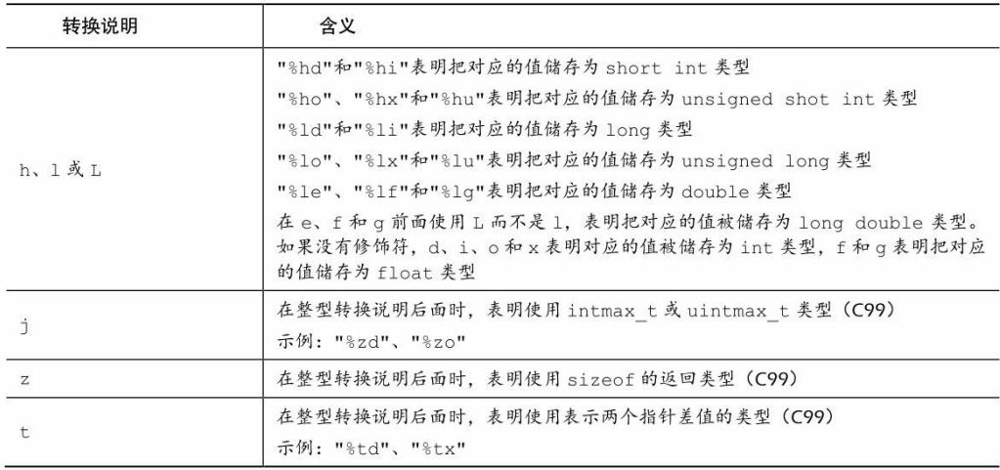
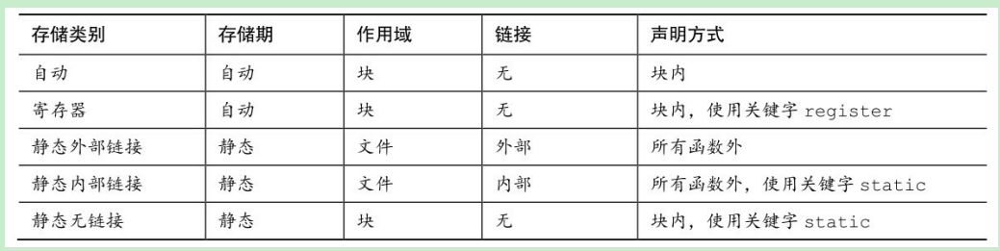

# 语言学习

多写项目，多回顾基本语法知识，广泛涉猎，多看看别人的优秀代码。

学习时需要注意的主要是基本的语法知识，其次就是严格遵守编程七步去进行开发，然后去找点自己感兴趣的项目敲或看。

>代码的能力你说是什么能力？
>
>可读性？可维护性？扩展性？执行效率？
>
>好多呢～
>
>参考 code complete  第二版 。
>
>绝对不是抄出来的！不断思考，重构，改进。
>
>尽量做功能完整的东西，而不是四处抄代码。
>
>除了写代码 还要分析代码的执行。
>
>不断的写，不断的琢磨，改进。

语法重点：

- 数据类型及类型转换。
- 运算符。
- 语句：分支和循环。
- 数组、函数、指针、结构体、预处理器。
- C标准库。

# C语言

## 概述

> C设计理念：让用户轻松自顶向下的规划、结构化编程、**模块化设计**。
>
> C程序思想：“针对目标计算机来定义最合适的某种操作”。
>
> C标准：从“不要妨碍程序员做需要做的事 ”（1994年——C99）到“不那么信任程序员”（2011年 ——C11）。
>
> C编程七步骤：
>
> 1. 第一步——定义程序目标：描述问题，为解决问题做准备。
>    明确自己想做什么、程序预期是什么， 思考你的程序需要哪些信息和要进行哪些计算和控制，以及程序应该要报告什么信息。
>    你要解决的问题是什么？
> 2. 第二步——设计程序：设计程序处理模块，为编码做准备。
>    用户界面、程序结构、目标用户、时间限制、如何表示数据、处理数据等。“程序 = 数据结构 + 算法”。
> 3. 第三步——编写代码。
> 4. 第四步——编译。
> 5. 第五步——运行。
> 6. 第六步——测试和调试。
> 7. 第七步——维护和修改。

C程序源代码文件——通常为.c文件，需要通过程序将其转换为可执行文件才能执行，而实现这一过程需要通过编译和链接这两步来实现。编译器把源代码转换成中间代码（机器码）， 链接器把中间代码和其他代码合并， 生成可执行文件。  

- 编译器的作用：编译为机器可识别的代码——机器码。
- 链接器的作用：把你**编写的目标代码、 系统的标准启动代码和库代码**这 3 部分合并成一个文件， 即可执行文件。 对于库代码， 链接器只会把程序中要用到的库函数代码提取出来链接进可执行文件。


## C编译器安装

### 主流编译器

参考文章：[C++主流编译器总结 - 张小凯的博客 (jasonkayzk.github.io)](https://jasonkayzk.github.io/2022/05/28/C++主流编译器总结/)

主流的C/C++编译器：GCC/G++、Clang（苹果公司开源的，是在 LLVM 项目中一个很重要的前端工具）、MSVC（微软的）。

Windows平台：

1. **MSVC**：微软自家的编译器，Microsoft Visual C++ Compiler。
2. **MinGW**：Minimalist GNU for Windows，GNU在Linux下的gcc/g++编译器向Windows平台拓展的产物。

Linux平台：GCC/G++。（GCC/G++只是负责Driver，调用真正的编译器来将源码编译成汇编代码）

> GCC/G++的区别：
>
> - **G++** 会把 `.c` 文件当做是 C++ 语言 (在 `.c` 文件前后分别加上 `-xc++` 和 `-xnone`, 强行变成 C++)，从而调用 `cc1plus` 进行编译。
> - **G++** 遇到 `.cpp` 文件也会当做是 C++，调用 `cc1plus` 进行编译。
> - **G++** 还会默认告诉链接器，让它链接上 C++ 标准库。
> - **GCC** 会把 `.c` 文件当做是 C 语言，从而调用 `cc1` 进行编译。
> - **GCC** 遇到 `.cpp` 文件，会处理成 C++ 语言，调用 `cc1plus` 进行编译。
> - **GCC** 默认不会链接上 C++ 标准库。
> - **GCC** 不会定义 **__cplusplus** 宏，而 **G++** 会。

### 编译器安装

Windows下安装MinGW：

- [MinGW-w64 - for 32 and 64 bit Windows - Browse /mingw-w64/mingw-w64-release at SourceForge.net](https://sourceforge.net/projects/mingw-w64/files/mingw-w64/mingw-w64-release/)，滑到后面找到MinGW-W64-install.exe，或者下载免安装压缩包x86_64-posix-sjlj或x86_64-posix-seh。
- 或者去Github上下载更新的版本：[Releases · niXman/mingw-builds-binaries (github.com)](https://github.com/niXman/mingw-builds-binaries/releases)，x86_64-12.2.0-release-win32-seh-ucrt-rt_v10-rev2.7z，解压配环境变量即可。
- 下载免安装压缩包解压后将里面的bin目录添加到Path环境变量里，然后打开cmd执行`gcc -v`，出现gcc版本信息即可。

Linux下安装：

1、CentOS：安装gcc、g++及vum，安装完执行`gcc -v`查看安装版本。

```
yum -y install gcc gcc-c++ autoconf pcre pcre-devel make automake
yum -y install wget httpd-tools vim
```

2、Ubuntu：`sudo apt install gcc`。（安装完执行`gcc --version`查看版本）

## 编译过程

摘自[C++主流编译器总结 - 张小凯的博客 (jasonkayzk.github.io)](https://jasonkayzk.github.io/2022/05/28/C++主流编译器总结/)。

**GCC/G++ 在执行编译工作的时候，总共需要4步：**

1. **预处理，生成 `.i` 的文件（预处理器cpp），此时对应的参数是 `-E`；**
2. **将预处理后的文件转换成汇编语言，生成文件`.s`（编译器egcs），对应的参数是 `-S`；**
3. **由汇编代码变为目标代码（机器代码）生成 `.o` 的文件（汇编器as），对应的参数是 `-c`；**
4. **链接目标代码，分配实际的内存地址并生成可执行程序（链接器ld），无参数；**

即：一个C/C++文件要经过预处理(preprocessing)、编译(compilation)、汇编(assembly)、和连接(linking)才能变成可执行文件。

1、预处理：`gcc -E main.c -o main.i `。（删除所有注释、宏扩展、文件包含）

`-E` 的作用是让 GCC 在预处理结束后停止编译；预处理阶段**主要处理 `include和define`** 等；它把 `#include` 包含进来的 `.h文件` 插入到 `#include` 所在的位置，把源程序中使用到的用 `#define` 定义的宏用实际的字符串代替。

2、编译：`gcc -S main.i -o main.s`。（将预处理后的临时文件中的代码转换为汇编代码）

`-S` 的作用是编译后结束，编译生成了汇编文件；在这个阶段中，GCC 首先要检查代码的规范性、是否有语法错误等；以确定代码的实际要做的工作，在检查无误后，GCC 把代码翻译成汇编语言。

3、汇编：`gcc -c main.s -o main.o`。（将汇编文件中的代码转为机器码）

汇编阶段把 `.s`文件翻译成二进制机器指令文件`.o`，这个阶段接收 `.c` 、`.i`、`.s` 的文件都没有问题。

4、链接：`gcc -o main main.s`。（链接并生成可执行文件）

链接阶段，链接的是函数库；在 `main.c` 中并没有定义 `printf` 的函数实现，且在预编译中包含进的 `stdio.h` 中也只有该函数的声明；而系统把这些函数实现都被做到名为`libc.so`的动态库。

**函数库一般分为静态库和动态库两种：**（GCC 在编译时默认使用动态库）

- **静态库是指编译链接时，把库文件的代码全部加入到可执行文件中，因此生成的文件比较大，但在运行时也就不再需要库文件了；Linux中后缀名为 `.a`**。
- **动态库与之相反，在编译链接时并没有把库文件的代码加入到可执行文件中，而是在程序执行时由运行时链接文件加载库；Linux中后缀名为 `.so`，如 `libc.so` 就是动态库。**

动态与静态库：

- **静态库节省时间：不需要再进行动态链接，需要调用的代码直接就在代码内部。**
- **动态库节省空间：如果一个动态库被两个程序调用，那么这个动态库只需要一份在内存中。**

## Start C

单文件程序main.c：

```c
#include <stdio.h>
int main(){
   
    return 0;
}
```

编译与运行：

```c
gcc -o main main.c  // 将main.c编译为可执行文件main
main                // 运行可执行文件main
```

# 变量&常量

变量名：字母、数字、下划线，不能以数字开头。

“定义”表示创建变量或分配存储单元；“声明”指的是说明变量的性质（类型和名称），但并不分配存储单元（变量纯声明，C、C++中都是使用extern关键字）。

- 声明： 用于向程序表明变量的类型和名字，表示这个名字已经匹配到一块内存上，并且声明可以出现多次。
- 定义： 编译器创建一个对象，为这个对象分配一块内存并给它取上一个名字，并且这块内存的位置也不能被改变。

```c
/* 声明：需要使用extern关键字修饰，并且不要初始化，才是声明 */
extern int i;
/* 定义的两种方式：（定义也是声明，但声明不是定义）*/
int j;             // 声明并定义j，没有初始化
int j = 0;         // 声明并定义j，并初始化
extern int i = 0;  // 声明并定义i，初始化为0
/* extern（外部），通常用于引用不在同一个文件中的变量或者函数 */
```

>初始化与赋值，参考 —— 变量的声明、定义、赋值和初始化有什么区别？ - wtngng的回答 - 知乎 https://www.zhihu.com/question/27639400/answer/489853106
>
>初始化完全是编译器的行为，赋值则是运行时的行为。
>
>标准 C 后来统一了初始化这个概念，全局变量的初始化和自动变量的默认值赋值都叫初始化。

**1、变量定义与赋值：**以int类型变量为例（建议变量都显式初始化）

```c
#include <stdio.h>
int main(){
	/* 数据类型  变量名  =  值; */
	int num;  
	num = 0;    // 赋值
	int n1 = 1, n2 = 2, n3 = 3; // 定义并初始化
	int n4 = n5 = n6 = 3;  // 不能这样定义
}
/* 一行只定义一个变量 */
```

**2、常量：**

使用`#define`定义常量：

```c
#include <stdio.h>
#define VALUE 12
#define BEEP '\a'
#define STR "我是一个常量字符串"
#define INT_MAX +32767
int main(){
	/* 编译程序时， 程序中所有的宏定义都会被替换成对应的字符。 这一过程被  
    称为编译时替换（compile-time substitution）*/
	printf("%d",VALUE);  // VALUE 会被替换为12
	printf("%c",BEEP);   // 同理
	printf("%s",STR);    // 同理
}
```

使用const限定符定义只读变量：

```c
#include <stdio.h>
/* 声明为只读,不能被修改 */
const int NUM1 = 99;
int main(){
    /* 局部作用域下使用const声明的变量可以通过指针修改其内容 */
	const int NUM2 = 99;
    int* b = &NUM2;
    printf("%d\n", NUM2);
    *b = 33;
    printf("%d\n", NUM2);
    /* 如果局部变量同时使用static和const，那则不能通过指针去修改 */
    static const int NUM3 = 66;
}
```

一些头文件定义了关于类型信息的一些常量：如`#include <limits.h>` —— 整型限制  ，`#include <float.h>`—— 浮点型限制。

# 数据类型

C中的基本数据类型：整型、浮点型、字符型、布尔型、可移植型、复数虚数类型。

正数的原码、补码、反码一致，负数的反码为除符号位其余的取反、补码为反码末位加1。计算机内存中数的存储形式为二进制补码。

## 整型

1、C中的整型以有无符号分类，可分为：

- 有符号整型：short（short int）、int、long（long int）、long long（long long int）。（也可以使用signed来强调这是有符号类型）
- 无符号整型：加上unsigned关键字即可，比如`unsigned int`。
- 补充：为了适应不同机器的规定：short——占用两个字节；int——16位以上；long——占用存储空间不能少于int；long long —— 至少64位，为了存储64位整数才引入的。（`short <= int <= long`）
- 目前常见的存储：short ——16位，int ——16位或32位，long —— 32位，long long —— 64位。

**通常的整数字面值都默认是int型**，如果字面值超了int的范围，编译器会尝试使用unsigned int，如果还不够大， 编译器会依次使用long、 unsigned long、 long  long、和unsigned long long类型。

```c
    long testNumber1 = 0;
    // unsigned lone lone, 2^64: 18446744073709551616 - 1
    // 字面值为unsigned long long, 然后强转为long
    // 补码：0xFFFFFFFFFFFFFFFF
    testNumber1 = 18446744073709551615;
    printf("%d\n",testNumber1);           // -1
    printf("%zd\n", sizeof(testNumber1)); // 4


    int testNumber2 = 0;
    testNumber2 = 18446744073709551615;        // 字面值为unsigned long long, 然后强转为int
    printf("%d\n",testNumber2);         //  -1
    printf("%zd", sizeof(testNumber2)); // 4
    return 0;
```

2、int类型取值范围：取值范围具体由计算机系统决定，但通常int类型都是32位存储。**C规定int的取值范围最小为-32768～32767（即16位存储）。**（int —— 整数的默认类型）

```c
// 打印int值：
#include <stdio.h>
int main(){
	int num = 9;
	int val = 99;
	// %d是转换说明，代表值顺序和后面的num、val一致
	printf("num是%d；val是%d",num,val);  
}
```

3、字面量数值的表示方式，科学计数法或进制表示法：

```c
#include <stdio.h>
int main(){
	int num = 011;  // 八进制，表示十进制数9
	int val = 0b11; // 二进制，表示十进制3
	int temp = 0x12;// 十六进制，表示十进制18
    int n1 = 2e3;
    int n1 = 2e+3;
    int n1 = 2e-3;
	// %d是转换说明，代表值顺序和后面的num、val一致
	printf("num是%d；val是%d；temp是%d",num,val,temp);  
}
```

4、数值后缀：后缀的意义在于**明确声明字面量的类型，而不是使用该类字面量的默认类型**。

```c
#include <stdio.h>
int main(){
    long n1 = 12L;
    long long n1 = 12LL;
    unsigned long long n3 = 12LLU;
}
```

5、整数溢出：当数值大小超过相应类型的取值范围，那么就会从类型最小值开始重新计数。

- 无符号整型溢出：C规范——“溢出后的数会以`2^(8*sizeof(type))`作模运算”，比如`unsigned char` 变量被赋予258时，由于溢出 → `258 % (2^8)=258%256=2`。

- 有符号整型溢出：C规范——“undefined behavior”，即没有定义这种行为，由各编译器自己决定。大部分编译器的溢出机制基本一致，有符号整型溢出分为向上溢出和向下溢出。
  向上溢出：大于最大值即为向上溢出。
  向下溢出：小于最小值即为向下溢出。

  向上溢出会从最小值往最大值方向开始重新计数；向下溢出会从最大值往最小值方向开始重新计数。

- 总结：整数溢出，只会在数据的范围内进行循环表示，当数值大小超过相应类型的最大取值范围，那么就会从该类型最小值开始重新计数，反之超过最小取值范围那就会从最大值那一边开始往最小值方向进行计数。

6、整数选择：考虑内存节省、移植等。

7、使用printf打印的转换符说明：

| 转换符 | 类型                     |
| ------ | ------------------------ |
| %u     | unsigned int             |
| %ld    | long                     |
| %lx    | 以十六进制数打印long类型 |
| %lo    | 以八进制数打印long类型   |
| %hd    | short                    |
| %lu    | unsigned long            |
| %lld   | long long                |
| %llu   | unsigned long long       |


## 浮点型

**默认情况下， 编译器假定浮点型字面量是double类型的精度。**  

1、**float类型**取值范围：C标准规定， float类型必须至少能表示**6位有效数字**， 且取值范围至少是10-37～10+37（至少为32位）。  

> 浮点数存储：通常，系统储存一个浮点数要占用32位。 其中8位用于表示指数的值和符号， 剩下24位用于表示非指数部分（也叫作尾数或有效数） 及其符号。（有效数乘以以十为低的指数即浮点数，指数越大，小数点就移动越大）

2、**double类型**：double类型和float类型的最小取值范围相同， 但至少必须能表示**10位有效数字**。

> 一般情况下， double占用64位，多的32位有的系统用来表示非指数部分，也有的分配给指数。不过无论哪种，都至少有13位有效数。

3、**long double类型**：C只保证long double类型至少与double类型的精度相同。  

4、使用进制表示：C99 标准——用16进制表示浮点型字面量，即在十六进制数前加上十六进制前缀（0x或0X） ， 用p和P分别代替e和
E， 用2的幂代替10的幂（即， p计数法）  

```c
#include <stdio.h>
int main(){
    // a=十进制10，1f = 1/16 + 15/256，p10 = 2^10
    // (10 + 1/16 +15/256) × 1024（即， 十进制10364.0）
    float num1 = 0xa.1fp10;
    printf("%f",num1);
}
```

5、使用科学计数法表示浮点数：

```c
#include <stdio.h>
int main(){
	float num1 = 1.013e-5; // 1.013 * 10^(-5)
	float num2 = 3e8;      // 3 * 10^8
	printf("%f",num1);
}
```

6、使用printf()函数打印浮点数：

```c
#include <stdio.h>
int main(){
    float num1 = 0xa.1fp10;
    printf("%f",num1);  
}
```

1. %f：转换说明打印十进制记数法的float和double类型浮点数。
2. %e：打印指数记数法的浮点数。
3. 如果系统支持十六进制格式的浮点数， 可用a和A分别代替e和E。
4. 打印long double类型要使用%Lf、 %Le或%La转换说明。

## sizeof()

>[C语言基础——sizeof的用法总结-CSDN博客](https://blog.csdn.net/u013812502/article/details/81198452)

`sizeof`既作为关键字，也可认为是一种单目运算符。

`sizeof`实际上是获取了数据在内存中所占用的存储空间，以字节为单位来计数。

C/C++中，`sizeof()`只是运算符号，**是编译的时候确定大小的**。动态分配是运行过程中得到大小的，也就是说C++中new出来的内存，sizeof都无法统计的，退一步说，即使是new出来的空间也有可能失败，所以sizeof无法统计动态分配的内存大小。

```c
#include <stdio.h>
int main(void){
    /* C99为类型大小提供%zd转换说明  一些不支持C99和C11的编译器可用%u或%lu代替%zd */
    // 查看各类型所占字节数
    printf("Type int has a size of %zd bytes.\n", sizeof(int));
    printf("Type char has a size of %zd bytes.\n", sizeof(char));
    printf("Type long has a size of %zd bytes.\n", sizeof(long));
    printf("Type long long has a size of %zd bytes.\n",
           sizeof(long long));
    printf("Type double has a size of %zd bytes.\n",
           sizeof(double));
    printf("Type long double has a size of %zd bytes.\n",
           sizeof(long double));
    
    int a = 12;
    printf("%zd", sizeof(a));
    return 0;
}
```

```c
#include <stdio.h>
int main(void){
    /* sizeof无法计算出动态分配的内存的大小 */
    char* s = malloc(12 * sizeof (char));
    /* 64位系统下输出8，其实就是存储指针变量的内存的大小，无法计算出指向的内存的大小 */
    printf("%d\n",  sizeof (s)); // 8
    printf("%d\n",  sizeof (*s)); // 1
    return 0;
}
```


## 字符

char类型，表示单个字符，占用一个字节，实际上存放的不是字符而是一个整数值，通过该整数值编码显示一个字符。

```c
#include <stdio.h>
int main(){
    char a = 'A';
    char b = 'ABCD';  // int为32位char为8位的系统下可行，这样的话只有最后一个有效
    char c = 77; // M，使用ASCII值表示
    char f = '\a'; // 蜂鸣字符
    char beep = '\007'; // 有没有0，这种写法下都解释为八进制
    printf('%c',beep);
}
```

打印不出来的一些字符，比如蜂鸣等符号，可以用以下方式表示：

1. 使用字符的ASCII值 。
2. 使用转义序列。
3. 用十六进制形式表示字符常量 。（例如&，`char a = '\x026';`）

无符号与有符号，unsigned char、signed char。（8位，有符号 -128~127，无符号 0~255）

**Keil中，默认char为无符号型char。**


## 布尔值

C99标准添加的布尔值类型，仅占用1位存储空间，可以看作是特殊的整型。

布尔值：`_Bool`，存储0和1。

`#include <stdbool.h>`内将`_Bool`宏定义为bool，将1宏定义为true，将0宏定义为false。


## 可移植类型

C99 新增了两个头文件 `stdint.h` 和 `inttypes.h`， 以确保C语言的类型在各系统中的功能相同，利用了`typedef`和`define`。

```c
#include <stdio.h>
#include <stdint.h>
int main(){
    // 后缀t是指typedef，表示是自定义过的类型
    int32_t n = 99;
}
```


```c
/* stdint.h */

/* 7.18.1.1 */
    /* exact-width signed integer types */
typedef   signed          char int8_t;
typedef   signed short     int int16_t;
typedef   signed           int int32_t;
typedef   signed       __INT64 int64_t;

    /* exact-width unsigned integer types */
typedef unsigned          char uint8_t;
typedef unsigned short     int uint16_t;
typedef unsigned           int uint32_t;
typedef unsigned       __INT64 uint64_t;
```


## 类型转换规则

自动转换：

1. 表达式中：无论是unsigned还是signed的char和short都会被自动转换成int， 如有必要会被转换成unsigned int（如果short与int的大小相同， unsigned short就比int大， 这种情况下， unsigned short会被转换成unsigned int） 。 在K&R那时的C中， float会被自动转换成double（目前的C不是这样） 。 （从较小类型转换为较大类型）
2. 两种类型运算：两个值会被分别转换成两种类型的更高级别。
3. 类型级别（高 ===> 低 ）：long double、 double、 float、 unsigned long long、 long long、 unsigned long、 long、 unsigned int、 int。  （例外：当 long 和 int 的大小相同时， unsigned int比long的级别高；short、int大小一致时，unsigned short就比int的级别高，unsigned short 就会被转为unsigned int ）
4. 赋值表达式中：计算的最终结果会被转换成被赋值变量的类型。   
5. 作为参数传递给函数时，char 和 short 会被转换成 int，float 会被转换成 double。使用函数原型可以避免这种自动升级。
6. Java中，级别高的数据类型只能通过手动强制转换转换为低级别类型的；而C中高 → 低、低 → 高都可以是隐式转换的，当然，手动使用强制转换提高可读性。

强制转换：使用`(type)data`，比如`int num = (int)12.34;`。

关于表达式：https://blog.csdn.net/astrotycoon/article/details/50857326

总结：

1. 赋值操作时会发生自动类型转换，转换为要赋予的那个对象的类型然后才能完成赋值。
2. 不同类型之间的运算时，也会发生自动类型转换：
   - char和short的运算，都会先转为int再进行运算。
   - 不同类型的混合运算，转换按数据长度增加的方向进行，以保证数值不失真，或者精度不降低，之后再进行运算。（即统一为同一数据类型再进行运算）

# 字符串初识

C中用char型数组来存储字符串，存储的字符串会在末尾自动加上一个`\0`，表示字符串结束，char类型一般占用一个字节。

数组末尾的`\0`表示空字符（null character），是非打印字符，其ASCII码为0。

```c
#include <stdio.h>
int main(){
    // 字符串的两种定义方式
    char s[10] = "一九九八";  // 一个中文占用两个字节
    char str[6] = {'h','e','l','l','o','\0'};
    printf("%s\n",s);
    printf(str);
    char string[] = {'H','e','l','l','o','\0','g','g','\0'}; 
    printf("%s\n", string); // 输出：Hello，遇到'\0'就代表了字符串结束，后面是将被忽略
    printf("%zd", sizeof (string)); // 输出：9
    printf("%zd",strlen(string));   // 输出：5
    return 0;
}
```

`strlen(str)`库函数：返回数组的有效存储的字节个数（以字节为单位），不包括空字符（不是指空格，空格也是一个字符），该函数的原型在string.h头文件中声明，返回值为size_t（即unsigned int）。

```c
#include <stdio.h>
#include <string.h>
int main(){
	char str[10] = "ABCDEFGHI";
	int n1 = strlen(str);
    int n2 = sizeof(str);          // 返回所占内存总数
	printf("有效存储单元：%d",n1);  // 9
	printf("总存储单元：%d",n2);    // 10
}
```

# 格式化输入输出

## printf()

print（打印）、formatted（格式化）。

1、用于打印字符到控制台。使用格式：`printf("要打印的字符、变量值、表达式结果等",变量或表达式列表);`
如果要打印变量、表达式结果，需要使用转换说明，基本的转换说明如下：

| 转换说明 | 输出                                    |
| -------- | --------------------------------------- |
| %a   %A  | 浮点数、十六进制数和p计数法 （C99/C11） |
| %c       | 单个char字符                            |
| %d  %i   | 有符号十进制整数                        |
| %e  %E   | 浮点数，使用e计数法                     |
| %f       | 浮点数，使用十进制计数法                |
| %g   %G  | 根据值不同自动选择%f或%e                |
| %o       | 无符号八进制数                          |
| %u       | 无符号十进制数                          |
| %x  %X   | 无符号十六进制数                        |
| %%       | 打印一个百分号                          |
| %p       | 指针                                    |
| %s       | 字符串                                  |

```c
#include <stdio.h>
int main(){
    int age = 199;
    printf("我的年龄：%d\n", age);
    /* 打印地址 */
    printf("address: %p\n", &age);
    printf("address: %x\n", (uint32_t)&age); /* 32位平台下 */
    printf("address: %x\n", (uint64_t)&age); /* 64位平台下 */
    return 0;
}
```

2、转换说明的修饰符：

| 修饰符 | 含义                                                         |
| ------ | ------------------------------------------------------------ |
| 标记   | 可在%后使用一个或多个标记，也可不使用。<br>有五种标记：-、+、空格、#和0 |
| 数字   | 标记后、说明符前使用，用于表示最小字段宽度，<br>但是如果设置的宽度不能容纳打印的数字或字符串，系统会使用更宽的字段 |
| .数字  | 用于表示精度，标记后、说明符前使用<br>%e、%E、%f  ===>  表示小数点右边数字的位数<br>%g、%G ===>   表示有效数字的最大位数<br>%s   ===>   表示待打印字符的最大数量<br>整型  ===>  表示待打印数字的最小位数<br>实例：`%5.2f`  打印浮点数，字段宽度为5字符，小数点后保留两位数字 |
| h      | 和整型转换说明一起使用，表示short int 或 unsigned int类型的值，实例：`%hu`、`%hx`、`%6.5hd` |
| hh     | 和整型转换说明一起使用，表示signed char 或 unsigned char类型的值，实例：`%hhu`、`%hhx`、`%6.4hhd` |
| j      | 和整型转换说明一起使用，表示intmax_t 或 uintmax_t类型的值（类型定义在stdint.h），实例：`%jd` |
| l      | 和整型转换说明一起使用，表示long int 或 unsigned long int类型的值，实例：`%ld`、`%8lu` |
| ll     | 和整型转换说明一起使用，表示long long int 或 unsigned long long int类型的值，实例：`%lld` |
| L      | 和整型转换说明一起使用，表示long double类型的值，实例：`%Ld` |
| t      | 和整型转换说明一起使用，表示ptrdiff_t类型（两个指针差值的类型）的值，实例：`%td` |
| z      | 和整型转换说明一起使用，表示size_t类型的值，实例：`%zd`      |

在K&R C中， **表达式或参数中的float类型值会被自动转换成double类型**。 一般而言， ANSI C不会把float自动转换成double。 然而， 为保护大量假设float类型的参数被自动转换成double的现有程序，  **printf()函数中所有float类型的参数（对未使用显式原型的所有C函数都有效）仍自动转换成double类型。**

修饰符——标记：

| 标记 | 含义                                                         |
| ---- | ------------------------------------------------------------ |
| -    | 打印左对齐（`%-20s`）                                        |
| +    | 用于显示正负号，有符号正值前显示+，负值前显示-   （`%+6.2f`） |
| 空格 | 正数的正号用空格显示，负数的负号则用-显示   （`%6.2f`即为空格标记） |
| #    | 把结果转换为另一种形式                                       |
| 0    | 对于数值，用前导0代替空格填充字段宽度（`%08.0f`，数值占不满8字段宽度就前面填充0）<br>对于整数如果出现-标记或者指示精度，则忽略该标记 |

3、传入参数与返回值：

- 传入参数要与转换说明一一对应，不能多不能少，否则打印将不符合预期，可使用变量、常量、表达式。
- 返回值为打印的字符的个数，如果打印失败则返回一个负值。


## scanf()

1、scanf()使用指向变量的指针，用于读取输入的不同格式的数据。读取基本数据类型数据需要使用&——取地址符，读取字符串则不需要。

```c
#include <stdio.h>
int main(){
    int age; // 变量
    float assets; // 变量
    char pet[30]; // 字符数组， 用于储存字符串
    
    printf("Enter your age, assets, and favorite pet.\n");
    scanf("%d %f", &age, &assets); // 这里要使用&，读取
    scanf("%s", pet); // 字符数组不使用&
    printf("%d $%.2f %s\n", age, assets, pet);
    return 0;
}
```

2、scanf的读取过程：

- 读取数值：第一个非数值，不会把值赋给变量，会把非数值放回输入中。第一个是正号或符合，则保护符号后继续往后读取数据直到不能读取（空格或非数字），然后计算数值赋值给变量；使用字段宽度，则最多只读取宽度范围内的数。
- 读取字符：会读取除空白以外的所有字符，直到再次遇到空白就读取结束。scanf读取字符会把字符放进数组中，数组中末尾是`\0`。

其它的读取输入的函数：getchar()、fgets()。

3、参数和返回值：

```c
#include <stdio.h>
int main(){
    int age;
    char name[10];
    scanf("%d %s",&age,name);
    printf("age:%d\n",age);
    printf("name:%s\n",name);
    return 0;
}
```

- 读取成功：scanf()函数返回成功读取的项数。 
- 读取失败：如果没有读取任何项， 且需要读取一个数字而用户却输入一个非数值字符串，scanf()便返回0。 
- 读取结束：当scanf()检测到“文件结尾”时， 会返回EOF（EOF是stdio.h中定义的特殊值，通常用\#define指令把EOF定义为-1）。  

4、补充——转换说明修饰符：





## *修饰符

对于printf，修饰符*可以充当标识变量：

```c
#include <stdio.h>
int main(){
    unsigned width, precision;  //  字符宽度，精度
    int number = 256;
    double weight = 242.5;
    printf("Enter a field width:\n");
    scanf("%d", &width);
    printf("The number is :%*d:\n", width, number); // *就是width的值
    printf("Now enter a width and a precision:\n");
    scanf("%d %d", &width, &precision);
    printf("Weight = %*.*f\n", width, precision, weight); // *.*相当于width.precision
    printf("Done!\n");
    return 0;
}
```

对于scanf：把*放在%和转换字符之间时， 会使得scanf()跳过相应的输出项 。

```c
int main(){
    int n;
    printf("Please enter three integers:\n"); 
    // 输入：12 34 56，最后将输出56，前两项被跳过
    scanf("%*d %*d %d", &n); 
    printf("The last integer was %d\n", n);
    return 0;
}
```

# 运算符

加（+）、减（-）、乘（*）、除（/，分为整除和浮点除法）、取余（%，只能用于整数）、自增（++）、自减（--）。

自增和自减：（只能用于变量）（直接将自增自减当做一个表达式来看）

- 总结：后加加的被访问时返回的是原值，但加加的对象的值进行了自增操作。

1、后缀自增：先计算表达式，然后对运算符作用的对象进行自增——将运算对象进行拷贝(Copy)生成拷贝对象，然后对原操作对象进行增1操作，最后返回拷贝对象（返回的是右值）

```c++
const Type function_postfix_increment(Type& obj){
	Type copyObj = obj;
	obj += 1; // 假定Type支持+=整数的操作
	return copyObj;
}
```

2、前缀自增：直接对运算对象进行增1，然后直接返回，因而没有拷贝操作（返回的左值）

```c++
Type& function_prefix_increment(Type& obj){
	obj += 1; // 假定Type支持+=整数的操作
	return obj;
}
```

**`&`：取地址运算符。**

**`*`：解引用运算符，后跟指针或地址，会给出存储在指针指向地址上的值或者该地址指向内存的值。（指针的值是一个地址，大部分系统中这个地址值用无符号整数表示）**

**sizeof运算符：以字节为单位返回运算对象的大小（运算对象可以是变量名或类型，如果是类型则要加上圆括号）**

```c
int num = 12;
size_t intsize = sizeof(int);
printf("%zd",intsize);
```

**`.`运算符和`->`运算符：**均用于访问结构体变量的成员，操作对象是变量，不能是常量（C++中箭头运算符还用于通过对象指针访问对象中的成员、成员函数等）。

```c
#include <stdio.h>
#include "string.h"
#define MAX_SIZE 64
struct Book{
    char name[MAX_SIZE];
    int id;
};
int main()
{
    struct Book b;
    strcpy_s(b.name, MAX_SIZE, "The Self Cultivation of Programmers");
    b.id = 12;
    /* 运算符`->`：取出结构体指针指向的结构体中的内容 */
    printf("b.id=%d\n", (&b)->id);
    /* 运算符`·`： 直接通过结构体变量来访问其成员*/
    printf("b.name=%s\n", b.name);
    return 0;
}

```

三元运算符：`表达式1 ? 表达式2 : 表达式3;`。

位运算符：&、|、~、^（异或，异则真）、<<（左移，低位补0，高位溢出则移掉）、>>（右移，对于无符号数是逻辑右移，高位都补0，移出去的位都丢弃；对于有符号数是算术右移，会保持符号位不变，并且符号位是啥高位就补啥，移出去的位都丢弃）。

```c
void main(){
    int num = -5; // 原码：-101 反码：-010 补码：-011
    int num1 = num << 29; // 补码：0110 0000 0000 0000 0000 0000 0000 0000
    int num2 = num << 30; // 补码：1100 0000 0000 0000 0000 0000 0000 0000
    printf("%d\n", num1);
    printf("%d\n", num2);
}
```

比较运算符：>、<、>=、<=、==、!=。

逻辑运算符：!、&&（短路与，左边部分为真才会执行右边的）、||（短路或，左边为假才会执行右边的）。

# 位操作

| 位运算符    |                                                              |
| ----------- | ------------------------------------------------------------ |
| `&`    与   | 全1则1，有0则0                                               |
| `|`    或   | 有1则1，全0则0                                               |
| `~`    取反 | 取反操作                                                     |
| `^`    异或 | 相同为0，不同为1（异真同假）                                 |
| `<<`   左移 | 低位都填充0，移到到高位发生溢出时则丢弃，注意符号位          |
| `>>`   右移 | 符号位不变，移出去的丢失，符号位是啥高位就填充啥<br>（无符号的则是填充0） |

`&`、`|`的运用：掩码、打开位、关闭位、切换位、检查位

1、掩码：`&`，只有有0就是0，那么可以通过与上1来决定哪一位可见。

```c
// 如下，将低四位清0，高四位不变
unsigned char n = 0x11 & 0xF0;
```

2、打开位（设置位）：`|`，使用或运算符，任何位与0都将是本身，与1都将为1，就可以决定将哪一位打开。（将指定位置为1）

```c
// 置最低位为1
unsigned char n = 0xF0 | 0x01;
```

3、关闭位（清空位）：关闭所想要关闭的位。（将指定为置为0）

```c
// flags中与MASK为0的位相应的位在结果中都未改变。
unsigned char flags=0x0F, MASK=0xB6;
unsigned char n = flags &~ MASK;  // 即 flags & (~MASK)
unsigned char flags &= ~MASK;  // 简化
// 通过&实现，将0x0F的除低一位、低四位外的都置为0
unsigned char y = 0x0F & 0x09;
```

4、切换位：打开已关闭的，或者关闭已打开的，使用异或实现。

```c
// flags中与MASK为1的位相对应的位都被切换了	
unsigned flags=0b00001111, MASK = 0b10110110;
flags = flags ^ MASK;  // 0b10111001
```

5、检查位：检查某些位是不是置1了。

```c
// 取出那些位，然后再比较
// 检测最低位是否置1：
unsigned flags=0b00001111, MASK = 0b00000001;
if((flags & MASK) == MASK)
```

6、位字段：1位的字段，只能表示0或1。

```c
// 为字段变量声明4个位字段，字段变量prnt占用一个int的内存大小
// （也就是说一个字段变量最多可以声明 sizeof(int)*8 个字段变量 ）
struct {
    // 字段标签 : 字段宽度
    unsigned int autfd : 1;
    unsigned int bldfc : 1;
    unsigned int undln : 1;
    unsigned int itals : 1;
} prnt;
void main(){
    // 字段赋值
    prnt.itals = 0;
    prnt.undln = 1;
}
```

字段的详细用法见《C primer plus》P1167

# 运算符优先级


# 语句

**1、判断语句：**

- if和if的嵌套。
- 三元表达式。
- switch语句。

```c
/* switch的圆括号内只能是整数值（包括char类型） 
	case 后的也得是整型常量或者整型常量表达式，不能使用变量作为case标签
	使用switch会比for快一些
*/
switch(表达式或变量){
    case 常量:
        语句;
        break;
    case 常量:
        语句;
        break;
    ......
    default:
        语句;
        break;
        
}
```

**2、循环语句：**for、while、do……while。

- beak：结束当前循环。
- continue：只能用于循环中，表示结束当前循环的当前这次执行流程，执行到continue时只会结束当前循环中的一次循环过程中的后续程序。

**3、goto语句：**程序跳转到标签所在的语句，用于跳出多重循环，并且将从跳转到的标签所在语句继续向下执行。

[(c语言，goto用法，goto最强使用方法_c语言goto的用法_搏云圣的博客-CSDN博客](https://blog.csdn.net/qq_35683626/article/details/78263379)

单个函数中使用goto基本不可能出错：

```c
/*
goto label;
......
label : statement
*/
int main()
{
    int i = 0;
    while (1){
        ++i;
        printf("start......\n");
        if(i >= 3){
            goto label;
        }
    }
    /* i大于大于3时，主程序跳转到这并向下执行 */
    label : printf("end......");
    return 0;
}
```

```c
/*
*函数功能：返回图片信息结构体p_inf
*    参数：图片路径字符串picture_file_path
*  返回值：返回图片信息，NULL时为读取图片信息失败
*    作者：搏云圣
*/
p_info *readPicInf(char *pfilepath)
{    
    FIL fileDescriptor;		  //文件体或者称文件描述符
    uint32_t readByteResult;  //作为f_read的最后一个参数，接受读到了多少个字节
    char fOptResult;	     //接受文件操作返回值（也就是返回结果）
    p_info *infReturn;		//图片信息结构体，最后作为返回值
   
    fOptResult = f_open(&fileDescriptor, (const TCHAR*)pfilepath, FA_READ);
    if ((fOptResult != FR_OK) || (fileDescriptor.obj.objsize > BMPMEMORYSIZE))
        return NULL;
  
    infReturn = (p_inf *)malloc(sizeof(p_inf));
    if (infReturn == NULL) 
        goto INFRETURN_MALLOC_ERR;
    
    infReturn->pfilestring = (char *)malloc(fileDescriptor.obj.objsize);
    if (infReturn->pfilestring == NULL) 
        goto INFRETURN_PFILESTRING_MALLOC_ERR;
 
    fOptResult = f_read(&fileDescriptor,infReturn->pfilestring,fileDescriptor.obj.objsize, (UINT *)&readByteResult);
    if ((fOptResult != FR_OK) || (readByteResult != fileDescriptor.obj.objsize)) 
        goto F_READ_ERR;
 
    infReturn->pfilesize = fileDescriptor.obj.objsize;
    
    f_close(&fileDescriptor);
    return infReturn;
F_READ_ERR:
    free(infReturn->pfilestring);
INFRETURN_PFILESTRING_MALLOC_ERR:
    free(infReturn);
INFRETURN_MALLOC_ERR:
    f_close(&fileDescriptor);
    return NULL;
}
```

# 数组

## 一维数组

1、数组声明和初始化：

```c
#include <stdio.h>
int main(){
    int arr0[6];     // 定义一个数组，数组里的值由内存中的值决定，没有默认值
    int arr1[6]={3}; // 只要定义并初始化一些元素，其它的才会默认初始化为0
    // 定义并初始化
    int arr2[3]={0,1,2};
    int arr3[]={1,2,3,4,5,6,7,8,9,0};
    return 0;
}
```

```c
/* 指定初始化器 */
int arr[6] = {[5]=12};   // 只将最后一个初始化为12，其它的将默认初始化为0
int arr3[]={1,2,3,[9]=9}; // 数组元素为10个
```

2、编译器不会检查数组越界访问。

3、声明大小时，`[]`内可以是表达式，但值必须大于0。

4、一维数组，数组名表示指向首元素的一个地址，可以使用解引用操作  `*{arr+index}`  取出数组中的值；注意数组名不是指针，但可以将它看作是一个指针常量（不能更改的），通过它可以访问到数组中数据。

5、数组声明并初始化后里面的数才会有默认初始值，只声明后再为某个元素赋值也是不会有默认初始值。


## 二维数组

二维数组，即数组中存储数组。（数组中存储另一个数组的首地址常量）

``` c
// 定义并初始化 两个二维数组内的值一致
int arr1[2][3] = {1,2,3,4,5,6};
int arr2[2][3] = {{1,2,3},{4,5,6}};
// 定义后再初始化
int arr2[2][3];
for(int i = 0; i < 2; i++)
{
    for(int j = 0; j < 3; j++)
    {
        arr[i][j] = 1;
    }
}
```

理解二维数组：

- 可以理解为由两个数组组成，第一个数组（看作是指针数组）用于存储第二个数组的首地址常量，第二个数组中存储具体的值。
- 以二维数组`int arr[3][3]`为例，`arr`表示第一个数组的首地址常量，`arr[0]`表示第一个数组中存储的值 —— 第二个数组的首地址常量，`arr[0][0]`则是第二个数组的首地址所对应的内存中存储的值 —— 即第二个数组中存储的第一个值。
- 数组指针，指向数组的指针 —— 存储数组首地址常量，二维数组中的arr可以看作是数组指针，不过实际上arr也是地址常量，不是什么指针。


## 变长数组

动态数组：可以在程序运行时选择数组的大小和分配内存的数组。

变长数组：C11标准将其作为C的一个可选特性，不是必须实现的，目前完全支持这一特性的编译器不多。—— 《C Primer plus》

>[C语言变长数组讲解_猴子居士的博客](https://blog.csdn.net/houzijushi/article/details/80245894)
>
>变长数组：数组大小待定的数组；C语言中结构体的最后一个元素可以是大小未知的数组，也就是所谓的0长度，所以我们可以用结构体来创建变长数组。通过变长数组可以创建动态数组，另一种创建动态数组的方式是通过malloc函数。
>
>用途：主要用途是为了满足需要变长度的结构体，为了解决使用数组时内存的冗余和数组的越界问题。
>
>用法：在一个结构体的最后 ，申明一个长度为空的数组（或长度为0的数组），就可以使得这个结构体是可变长的。
>对于编译器来说，此时长度为0的数组并不占用空间，因为数组名本身不占空间，它只是一个偏移量， 数组名这个符号本身代表了一个不可修改的地址常量 （注意：数组名永远都不会是指针！ ），但对于这个数组的大小，我们可以进行动态分配，对于编译器而言，数组名仅仅是一个符号，它不会占用任何空间，它在结构体中，只是代表了一个偏移量，代表一个不可修改的地址常量！**对于变长数组的这个特点，很容易构造出变长结构体，如缓冲区，数据包等等。**
>
>```c
>/* 这样的变长数组常用于网络通信中构造不定长数据包，不会浪费空间浪费网络流量 */
>typedef struct {
>	int len;
>	int array[];
>}SoftArray;
>```
>
>示例：
>
>```c
>#include<stdio.h>
>#include<malloc.h>
>
>typedef struct {
>	int len;
>	int array[];
>}SoftArray;
>
>int main() {
>	/* 通过len，构造适合的内存来存储数据，根据需要开辟空间 */
>	/* 需要知道数据的大小，才能按需去创建 */
>	int len=10, i=0;
>	SoftArray* p = (SoftArray*)malloc(sizeof(SoftArray) + sizeof(int)*len);
>	p->len=len;
>	for(i = 0;i < p->len; i++) {
>	   p->array[i] = i+1;
>	}
>	for(i = 0;i < p->len; i++) {
>	   printf("%d\n", p->array[i]);
>	}
>	free(p);
>	/* 空间不够的话，可以新开辟 */
>	return 0;
>}
>```

# 函数

函数：完成特定任务的独立程序代码单元。C的设计思想是把函数用作构件块，通过一个个函数之间的协调来完成整体功能的构建。使用函数可减少重复代码的编写。

**函数使用三步骤：**1、函数原型声明；2、函数体编写；3、函数调用。

K&R C中，无参函数中形参处空着而不写void，现在各个标准也兼容经典C，所以这一写法不会被报错。不过推荐无参函数都使用void。

**1、无参函数：**

```c
#include <stdio.h>
// 指定函数返回值、函数名、函数形参；void表示没有，没有返回值、没有形参
void show(void); 
int main(void){
	// 函数声明也可以放在main函数内：
    // void show(void);
    show();
    show();
	return 0;
}
void show(void){
    int count;
    for(count=1;count <= 10;count++) putchar('*');
    putchar('\n');
}
```

**2、有参数的函数：**

```c
#include <stdio.h>
void show(char c, int num);  // 形参名是假名，定义时可与其不一样
// 有参函数声明也可以不声明形参名，到定义的时候再指定形参名
// 比如：void show(char, int);
int main(){
    show('&',12);
	return 0;
}
void show(char c, int num) {
    int count;
    for(count=1;count <= num;count++) putchar(c);
    putchar('\n');

}
```

```c
/* 指针形参，传进去的将是地址值，指针是存储地址的一个玩意*/
void swap(uint8_t *temp, uint8_t *humi)
{
    uint8_t t = 0;
    t = *temp;
    *temp = *humi;
    *humi = t;
}
```

**3、对于较小的函数，常不单独声明，而是直接将定义放在第一次调用函数前。**

```c
#include <stdio.h>
void show(char c, int num) {
    int count;
    for(count=1;count <= num;count++) putchar(c);
    putchar('\n');
}
int main(){
    show('&',12);
    return 0;
}
```

**4、已经废弃的但需要了解一下的：**

```c
#include <stdio.h>
void old(n1,n2);
// 函数形参可以在函数声明后再声明
int n1,n2;
int main(){
    old(12,12);
	return 0;
}

void old(n1,n2){
    printf("%d",n1 * n2);
}

```

**5、有返回值的函数：**

返回值类型：指针类型、基本类型（整型、浮点型、布尔型、字符型）。

```c
/* 使用return可以从函数中返回值 */
int test(void){
    return 3*3;
}
```

```c
/* 返回指针 */
#include "stdlib.h"
int* test(void){
    int* arr = malloc(sizeof(int) * 8);
    for(int i = 0; i < 8; i++){
        arr[i] = i;
    }
    return arr;
}
int main() {
    int* array = test();
    for (int i = 0; i < 8; ++i) {
        printf("%d\t", array[i]);
    }
    free(array);
   	array = 0;
    return 0;
}
```

# 指针

指针变量，存储地址编号的变量。在32位平台下，任何类型的指针变量占用内存空间都是4字节大小；64位平台下则是8字节大小。对应类型的指针，只能存放对应类型的变量的地址，或者说指针类型指定的是指针所指向的内存区域里的数据类型。

本质上，内存就是个字节数组，你把它当成什么类型来看是你的程序的事情，指针类型的强制转化就是让你在C中能方便地用不同的观点来看内存。

```c
int main(void)
{
    int a = 6 + '0';
    uint64_t addr = (uint64_t)&a;
    /* 将地址强制转为char*，也就是将地址对应那块内存看作是char类型的数据 */
    char* s = (char*)addr;
    printf("%s\n", s);
    /* 只是看待内存的方式改变了，内存还是4字节一个坑位来存储数据 */
    /* 这里输出8，也就是'6'和'\0'一共占了8字节，而不是2字节或5字节 */
    printf("%zd\n", sizeof s);
}
```


## 声明&定义&分类

1、简单的指针的声明与定义：`数据类型*  指针变量名;`

```c
/* 示例 */
int* ptr;   //  声明指向int型的指针
// int *p1,*p2; // 声明多个
int arr[3]={};
ptr = arr;  // 指向arr数组的首元素
```

2、关于指针的操作符：

- `*`：既是指针声明操作符，也是解引用符（一元间接寻址运算符），用于获取指针存储的地址所指向的内存中的值。
- `&`：取地址符，用于取出地址。

```c
int* ptr;
int val = 12;
ptr = &val;
printf("%d",*ptr);
```

```c
/* 对于数组和函数，有着arr==&arr这样的关系，所以本质上给指针初始化或赋值都使用了& */
int main(void)
{
    int arr[10] = {[3]=3};
    if (arr == &arr){
        printf("%d\n", arr[3]);

    }
    int (*p)[10] = &arr;
    printf("%d", *(*p+3));
    return 0;
}
```

3、指针声明规范：`*`靠近类型还是变量，看个人喜好，保持风格统一即可。

```c
int* ptr1;
int* ptr2;
```

>C 语言设计的本意并不是把 `int*` 作为类型声明。它的设计本意是解一个方程，`int ....;`让 `.... `的类型是 int。也就是 `*ptr` 的类型是 `int`。从而反推出 `ptr` 是 `int` 指针。
>解方程的语义，才是`int *pt, *pt2;`的写法的由来。函数指针也是这样，`int (*func)();`
>最早调用是必须写成 `(*func)()` 的。后来变成写 `func()` 也可以了。但是本意是解方程，`(*func)()` 表达式是 int 类型。后来 C++ 加了 `&` 搞乱了这个规矩。但是为了对 C 兼容很多文化还是保留下来了。
>
>我自己还是写成 `int* ptr` 的。
>
>作者：冯东
>链接：https://www.zhihu.com/question/52305847/answer/129937288
>来源：知乎
>著作权归作者所有。商业转载请联系作者获得授权，非商业转载请注明出处。

>结合硬件层面来说，指针只是保存内存的一个地址，不管你保存的是int、char还是long，指针就是个固定长度的内存地址，**它本身没有类型**，只是可以把它指向的内存中保存的数据解析为各种类型。
>
>所以，指针没有类型，所以不存在`**`类型的指针这一说，只存在这个指针保存的数据是什么类型。因此，星号（*）应该和变量结合，而不应该和类型结合。
>
>C中强调表达式，`*`是运算符，运算符作用于操作数上，`int *p;`，(*p)的结果是int类型的数据。
>
>C++中强调类型，`int*`看作是一个类型。
>
>使用`int *p`还是`int* p`看个人的语言风格，要保持风格的统一，不要`int *p`、`int* p`混着用。

4、指针分类：指向基本数据类型的指针、函数指针、结构体指针、数组指针、通用指针——`void*`。


## 指针操作

指针操作：

- 赋值（地址、指针可以赋值给指针，不同类型的指针间赋值可以使用强制转换）。

- 解引用（使用 `*` 将指针里存储的地址中的值取出来）。

- 递增递减（指向地址的移动） 。

  >要注意的是编译器不会检查指针是否仍指向数组元素，C 只能保证指向数组任意元素的指针和指向数组后面第 1 个位置的指针有效。指针指向数组后一个也是有限的，其他的就是未定义的了。  

- 与整数相加相减（指向地址的移动）。

- 取地址（使用 `&` 取指针的地址）。

```c
#include <stdio.h>
int main() {
    int arr[] = {3,6,9};
    int* ptr;
    ptr = arr;
    printf("%d\n",*ptr);  // 3
    printf("%d\n",*(ptr+2)); // 9
    printf("%d\n",*(++ptr)); // 6
    printf("%d\n",*ptr);     // 6
    return 0;
}
```

指针大小比较：两个相同类型的指针可以比较大小，只不过只有两个相同类型的指针指向同一个数组的元素的时候，比较大小才有意义，指向前面的指针的大小将小于指向后面的。

```c
int arr[] = {3,6,9};
int* p1 = &arr[2];
int* p2 = &arr[0];
if(p1 > p2){
    printf("p1大于p2，也就是后面的大于前面的");
}
```

**不要解引用未初始化的指针。**为什么呢？因为“创建一个指针时， 系统只分配了储存指针本身的内存， 并未分配储存数据的内存”，访问没有分配的内存，就无法安全访问，因此就很容易出错。（不要访问未分配的内存）

```c
int* ptr;
printf("%d", *ptr);  // 不要对未初始化的指针使用 * 来解引用，会造成错误
```

>内存空间不是你分配了才可以使用的，只是你分配了之后使用才安全，为什么要进行对指针进行初始化呢？
>
>如果不初始化指针，那么指针的指向是随机的，如果引用这个野指针并修改就很有可能修改到了另一个程序的数据，然后导致这个程序的异常。因此，使用指针时一定要先进行初始化确定好指向。程序最怕滴就是不确定性。


## 指针数组

指针数组——指针类型数组，数组里是存放指针变量的数组，即数组里面的值为地址值。

```c
int* arr[10];  // 存储指向int类型的指针变量的数组
			  // arr[2] 与 *(arr + 2)等价：取得数组里存储的值
```

arr是数组的首元素地址，对其解引用，得到的是首地址里面的值。可以将数组名看作是一个指针常量，这个指针常量指向的类型和数组元素的类型一致，arr是不可更改的。


## 指针的指针

指针的指针，就是指向指针的指针，该指针中存储的地址值所指向的内容是另一个指针的地址。

```c
/* 存放指针的指针及它们的取值 */
int val = 999;
int* p1 = &val;    // int*类型：存放的是int类型数据的地址
int** p2 = &p1;    // int**类型：存放的是int类型数据的地址的地址
int*** p3 = &p2;   // 同理
/* 一个*表示解引用一个地址，解引用后再解引用，解到最后的一个指向实际值的指针就可以取得值了 */
printf("%d\n",*p1);
printf("%d\n",**p2);
printf("%d\n",**p3);
```


## 数组指针

数组指针，就是指向数组类型数据的指针，或者说是存储数组类型数据的地址。如何使一个指针指向一个数组，答案就是将数组的首地址赋给这个指针即可，通过首地址可以访问到数组内的任一成员。

```c
/* 对于数组arr, arr = &arr[0],都是指数组的首地址常量 */
int arr[3] = {3,3,3};
```

1、数组指针定义：`指向的数组的类型 (*指针变量名)[数组元素个数]; `，意为该指针变量指向有n个数组元素的数组，指针存储的是数组首元素的地址值。

```c
#include <stdio.h>
int main() {
    int arr[3] = {33};
    int (*p0)[] = arr;
    /* 对于数组arr,arr=&arr=&arr[0] */
    /* 将地址常量赋给数组指针变量p，看作是&arr赋给p好理解一些 */
    int (*p)[3] = arr;
    printf("%d", **p);
    printf("%d", *(*p+1));  /* 相当于 *(arr+1) 或 arr[1] */
    return 0;
}
```

```c
/* 这样定义也行 */
int arr1[]={7,8,9};
int (*p1)[] = arr1;
int (*p2)[6] = arr1;
printf("%d\n", *(*(p1)+2));
printf("%d", *(*p2+1));
```

```c
int main(void)
{
    int a[3] = {1,2,3};
    int (*arr)[3] = a;
    /* 三个地址是一样的 */
    printf("%p\n", *arr);
    printf("%p\n", a);
    printf("%p\n", arr);
}
```


2、一维数组指针与二维数组：

```c
/* 一维数组指针配合二维数组使用 */
int arr[2][3] = {{1,2,3},{4,5,6}};
int (*p)[3] = arr;         // 将地址常量赋给p
int (*p1)[3] = arr + 1;    // 将地址常量赋给p1
/* 数组指针存储的是数组的地址，*p1就可以解引用得到二维数组首元素里面的地址
	*(*p1)就可以解引用出首元素里的地址所指向的数组里的值
*/
printf("%d", *(*(p1)+2));
```

```c
/* 如果对数组名取地址，那么就会得到一个数组指针 */
int arr[] = {1,2,3};
printf("&arr=%p", &arr);
printf("&arr+1=%p", &arr+1);
```

```c
/* 数组的首地址常量与数组指针的值是一样的，arr = &arr，注意首地址常量并不是指针 */
int main(void)
{
    int arr[3] = {1, 2, 3};
    printf("%p\n", &arr);
    printf("%p\n", arr);
    if (arr == (&arr)){
        printf("arr = &arr");
    }
    return 0;
}
```

同理，二维数组指针，配合三维数组使用。

总结：

- 数组指针指向二维数组，是将二维数组的首地址赋给了数组指针，这个首地址存储着另一个数组的首地址，这样解引用后得到的是里面存储的另一个数组的首地址，再解引用就能得到这个地址指向的内存中的值了。（二维数组中理解起来是最方便的）
- 那将一维数组的首地址赋给数组指针，为什么还是要两次解引用才能访问到数组中的值呢？为了方便理解，一维数组首地址赋给指针变量时，看作是`&arr`赋值过去即可，方便理解一些（对数组进行取地址操作得到一个数组指针，然后将得到的数组指针赋值给这个数组指针，因此通过两次解引用操作取出值）。


## 函数与指针

**1、指针形参：**

```c
/* 使用指针形参，把地址传过去，传入的地址值是不会被改变的（因为是值传递） */
/* 通过解引用后赋值会改变传入的地址所对应的内存中的值，地址本身不会被改变，但存储的值可以被改变 */
void swap(int* a, int* b){
    int temp = *b;
    *b = *a;
    *a = temp;
}
void main(){
    int a = 10, b = 20;
    swap(&a,&b);
    printf("a=%d\n",a);
    printf("b=%d",b)
}
```

**2、数组形参：**

```c
/* 传一维数组，传的是数组首元素地址 */
void test1(int[] arr){
    
}
void test2(int* ptr, int length){
    
}
/* 传二维数组，传的是二维数组首地址常量，首元素地址指向内存中存储着指向另一个数组的首地址常量 */
void test3(int (*ptr)[9]){
    
}
void test4(int (*ptr)[]){
    
}
```

**3、指针型返回值：**

```c
/* 不要直接返回指针 */
char* test(void){
    char* str = "string";
    /* 返回局部数组地址，函数执行完毕就会被释放，返回的地址指向的内存内的内容可能不再是预期的，存在风险 */
    return str;  
}

/* 使用动态内存分配，free()后或程序结束后分配的内存才释放 */
#include <string.h>
char* test(void){
    char* str;
    str = (char*)malloc(100 * sizeof(char));
    strcpy_s(str,100,"string");
    return str;  
}
void main(){
    char* p = test();
    printf("%s",p);
    free(p); // 手动释放
}
```

**4、函数指针：**

程序运行时也会将函数加载到内存中，函数的名字就是指函数的首地址，即函数入口地址，函数指针就是存放函数入口地址的指针。

```c
/* 函数指针变量定义：`函数返回值类型 (*函数指针变量名)(形参列表)` */
/* 定义了一个函数指针—fun，其指向的函数必须有两个整型形参和整型返回值 */
int (*fun)(int,int);  
```


```c
int test1(int n1, int n2){
    return n1*n2;
}
void test2(void){
    printf("it is function 2.");
}
void main(){
    /* 函数指针, */
    int (*fun1)(int,int) = test1; // int型返回值，int型形参
    void (*fun2)(void);   // 无返回值无形参
    fun2 = test2;
    printf("%d\n",fun1(12,12));
    fun2();
    /* 这样也能调用 */
    (*fun2)();
}
```

函数指针的两种调用方式：

>```c
>void test(int);
>int main(void){
>        void (*fp)(int);
>        fp=test;
>        /* 方式1 */
>        (*fp)(9);  
>        /* 方式2 */
>        fp(9);
>        return 0;
>}
>void test(int a)
>{
>    	printf( "%d\n", a );
>}
>```
>
>这两种形式是等价的，都是为ANSI C所接受的。
>历史上，贝尔实验室的C和UNIX的开发者采用的是第一种观点：
>
>```c
>QUOTE:
>(*fp)(9);
>```
>
>而Berkeley的UNIX的扩展者采用第二种观点：
>
>```c
>QUOTE:
>fp(9);
>```
>
>K&R C不允许第二种形式。但是为了保持与现有代码的兼容性，ANSI C把这两者作为等价形式全部接受。正如 kernelxu 所言，按照标准 C 的规定两种函数调用方式都是正确的。这是因为在 C/C++ 中总是使用函数指针的形式来调用函数。即使在函数调用中使用的是函数指示符（代表函数类型），也会被转换为函数指针使用，这就是默认的 function-to-pointer 转换。
>
>例如，楼主程序中的 `test` 函数可以直接使用函数指示符形式来调用：`test(9);`。然而，在这里的函数指示符 `test` 其实被编译器自动转换为了函数指针来使用，即从函数类型转换为了函数指针类型，最终是使用函数指针的形式来完成对函数调用的。
>
>程序中的`fp(9); `是直接使用函数指针`fp`来调用。既然`fp`已经是函数指针了，所以在类型上就不需要任何转换了。`(*fp)(9); `也是合法的函数调用，在这里，`fp`是函数指针，所以`*fp`是对于函数的引用，是函数类型，根据标准规定的 function-to-pointer 转换又把`*fp`由函数类型转换为了函数指针类型，所以实际上`(*fp)(9);`相当于`fp(9);`这种直接的函数指针调用方式。
>
>另外，`test`函数也可这样调用：`(*test)(9);`。可以这样来理解：根据   function-to-pointer 转换规定首先`test`由函数类型转换为函数指针，那么`*test`表示的又是函数类型，最后又根据   function-to-pointer 转换为函数指针来调用函数。这其实和 `(*fp)(9);`是等价的。甚至`test`函数还可以这样调用：`(**test)(9);`、`(***test)(9);`、`(****test)(9);` 等等，
>或者函数指针形式：`(**fp)(9);`、`(***fp)(9);`、`(****fp)(9); `等等。对此的理解可参看上段中的分析。
>
>从上面的分析可以看出，函数调用的时候可以使用函数指针的方式，也可以使用函数指示符的方式。不过，后者会由编译器自动转换为前者的形式，即函数指针的形式。和指向对象的指针相比，这是函数指针一个比较特殊的地方。


**5、函数指针数组：**

函数指针数组，存放函数指针的数组，即存放函数地址的数组。

```c
/* 定义：`函数返回值类型 (*数组名[数组个数])(函数形参列表)` */
int f1(int a,int b);
int f2(int a,int b);
void main(){
	/* 定义函数指针数组，pFun是数组的首地址 */
    int (*pFun[2])(int,int) = {f1,f2};
    printf("乘积:%d\n", pFun[0](12,12));
    /* pFun+1 是数组第二个元素的地址 */
    printf("乘积:%d\n", (*(pFun+1))(12,12));
    printf("max:%d", pFun[1](9,6));
}

int f1(int n1, int n2){
    return n1*n2;
}
int f2(int a,int b){
    return a > b ? a : b;
}
```

**6、函数指针作函数形参：**

将函数作为参数传入，这个函数也被叫做回调函数，回调函数的主要作用就是解耦。

```c
int max(int a,int b);
int min(int a,int b);
int process(int (*p)(int, int), int x, int y);
void main(){
    printf("min:%d\n", process(min,9,6));
    printf("max:%d", process(max,9,6));
}

int max(int a, int b){
    return a>b?a:b;
}
int min(int a, int b){
    return a<b?a:b;
}
// 回调函数的参数通过形参x、y传入
int process(int (*p)(int,int), int x, int y){
    return (*p)(x,y);
}
```


## void*与NULL

`void*`，是一个通用指针，任何类型的指针都可以给 `void*` 类型的指针赋值。

NULL，空指针，内存编号`0x00000000`（32位平台）、`0x0000000000000000`（64位平台），常用于指针初始化（用0也是一样的）。


## 回调函数

回调函数的定义：

> 百度百科：
>
> **回调函数就是一个被作为参数传递的函数**。在C语言中，回调函数只能使用函数指针实现，在C++、Python、ECMAScript等更现代的编程语言中还可以使用仿函数或匿名函数。
>
> 最著名的回调函数调用有C/C++标准库 stdlib.h/cstdlib 中的快速排序函数 qsort 和二分查找函数 bsearch 中都会要求的一个与strcmp类似的参数，用于设置数据的比较方法。

> 维基百科：
>
> In computer programming, a callback is any executable code that is passed as an argument to other code, which is expected to call back (execute) the argument at a given time. This execution may be immediate as in a synchronous callback, or it might happen at a later time as in an asynchronous callback.
>
> 在计算机编程中，**回调是作为参数传递给其他代码的任何可执行代码**，这些代码期望在给定时间回调（执行）参数。这种执行可能是即时的，就像在同步回调中一样，也可能在稍后的时间发生，就像在异步回调中一样。

回调函数的项目实战：[C语言回调函数的实现与应用（保姆级讲解）_c语言 回调函数_Dev_XH的博客-CSDN博客](https://blog.csdn.net/weixin_45636395/article/details/118733583)

```c
#include <stdio.h>

/*使用 typedef 关键字给函数指针起个别名（typedef 项目常用关键字，使得代码简洁）*/
// 1.声明函数指针，该函数作为回调函数用
typedef void (*fun_callback_t)(int number); 
// 2.定义一个回调函数的函数指针
fun_callback_t g_fun_cb = NULL;             
// 3.声明设置函数，用于某个将函数设置为回调函数
int set_callback(fun_callback_t cb);	

void my_fun(int number )
{
	number = number*100;
	printf("In {my_fun} number:<%d>\n",number);
}

int main()
{
   printf("callback test start !\n");
   set_callback(my_fun);	// 将my_fun设置为回调函数
	
	for(int i=0; i<5; i++ )
	{
		printf("In {main} i:<%d>\n",i);
        // 通过函数指针，在某一时刻调用回调函数
		g_fun_cb(i);		
		printf("\n");
	}
	
   return 0;
}
// 函数实现：将函数设置为回调函数
int set_callback(fun_callback_t cb)
{
	if (g_fun_cb != NULL){
		printf("g_fun_cb is not NULL!\n");
		return 0;
	} else {
	    g_fun_cb = cb;
    	return 1;
	}
}
```

>回调函数在项目中的应用，大多数在应用分层和数据分流中使用最多，就比如A应用：在串口一直读数据，数据不断地产生；B应用：需要拿到A产生的数据加工，再传给别的应用。

回调函数的作用：解耦。（通过传入不同的函数指针，使得函数可以灵活地实现多种功能而不需要改变原函数的实现（变的只会是传入的这个函数变量）。）


## 悬空指针、野指针

**1、C语言中的悬空指针？**

C语言中的指针可以指向一块内存，如果这块内存稍后被操作系统回收（被释放），但是指针仍然指向这块内存，那么，此时该指针就是“悬空指针”。下面这段C语言代码是一个例子，请看：

```c
void* p = malloc(size);
assert(p);
free(p);        /* 现在 p 是“悬空指针”，p指向的将是一块被释放了的内存 */
```

C语言中的“悬空指针”会引发不可预知的错误，而且这种错误一旦发生，很难定位。这是因为在 free(p) 之后，p 指针仍然指向之前分配的内存，如果这块内存暂时可以被程序访问并且不会造成冲突，那么之后使用 p 并不会引发错误。

最难调试的 bug 总是不能轻易复现的 bug，对不？

所以在实际的C语言程序开发中，为了避免出现“悬空指针”引发不可预知的错误，**在释放内存之后，常常会将指针 p 赋值为 NULL：**

```c
void* p = malloc(size);
assert(p);
free(p);
/* 避免“悬空指针” */
p = NULL;
```

这么做的好处是一旦再次使用被释放的指针 p，就会立刻引发“段错误”，程序员也就能立刻知道应该修改C语言代码了。

**2、C语言中的“野指针”是什么？**

“悬空指针”是指向被释放内存的指针，“野指针”则是不确定其具体指向的指针。“野指针”最常来自于未初始化的指针，例如下面这段C语言代码：

```c
/* 此时 p 是“野指针” */
void* p;	
```

因为“野指针”可能指向任意内存段，因此它可能会损坏正常的数据，也有可能引发其他未知错误，所以C语言中的“野指针”危害性甚至比“悬空指针”还要严重。在实际的C语言程序开发中，定义指针时，一般都要尽量避免“野指针”的出现（赋初值）：

```c
void* p = NULL;
void* data = malloc(size);
```

**3、C语言中的指针可以做加法运算吗？**

C语言中的指针包含地址详细信息，一般是不可以直接做加法运算的，例如下面这段C语言代码：

```C
void* p1 = (void*)1;
void* p2 = (void*)2; 
/* 下面是非法的 */
void* p = p1 + p2;
```

读者可自行尝试，指针 p1 和指针 p2 是无法直接相加的，否则编译器就会报错。但是如果想对指针 p1 和 p2 的地址值相加，可以将其强制转换为整数类型，例如：

```C
void* p1 = (void*)1;
void* p2 = (void*)2;
longp = (long)p1 + (long)p2;
```

应该确保强制转换的整数类型宽度大于指针类型宽度，否则可能会因为数值截断导致得到错误的结果。

虽然C语言中的指针不能直接与指针相加，但是却可以与其他整数相加，例如下面这段C语言代码：

```C
char* p1 = (char*)1;
char* p = p1 + 1;
```

指针p1 指向地址 1，因此指针 p 指向地址 2，这没什么好说的。但是，读者应该注意下面这样的“陷阱”：

```C
int* p1 = (int*)1;
int* p = p1 + 1;
```

与上面的C语言代码例子相比，这里仅仅将 char 换成 int。那么，指针 p 指向哪个地址呢？编写打印代码：

```c
int* p1 = (int*)1;
int* p = p1 + 1;
printf("p1=%p, p=%p\n", p1, p);
```

编译并执行上面这段C语言代码，会发现输出如下：

```C
p1=0x1, p=0x5
```

可见，“1+1”并不等于 2，而是等于 5 了。这其实是因为C语言中的指针是有其自己的含义的，不同的指针类型索引内存的大小也往往不同，我的机器上 int 类型占用 4 个字节内存空间，因此指针 p1+1 实际上是往后移动了 4 个字节。

**4、什么时候会用到空指针？**

有三种情况，在c语言中会用到空指针。

1. 作为一个错误值。

2. 作为一个监测值。

3. 在一个递归数据结构中终止indirection。

NULL==ptr

**5、内存泄漏？**

> 内存泄漏（**memory leak**）是指你向系统申请分配内存进行使用（new/malloc），然后系统在堆内存中给这个对象申请一块内存空间，但当我们使用完了却没有释放这些内存（没有delete/free），导致这个不使用的对象一直占据内存单元，造成系统不能再把它分配给需要的程序。 
>
> 一次内存泄漏的危害可以忽略不计，但是内存泄漏堆积则后果很严重，无论多少内存，迟早会被占完，造成内存溢出。

内存泄漏（**memory leak**）：向系统申请分配内存（new/malloc）进行使用，当使用完毕后没有释放这些内存（没有delete/free），导致这些内存变为了无法分配的内存。这就是内存泄漏。（内存泄漏，相当于丢失 —— 丢失了一些内存）

内存泄漏不断堆积，直到消耗完系统的内存，就会导致内存溢出。

内存溢出：简单来说，就是没有内存可用了。为什么会导致内存溢出？那就是申请内存后没有及时地释放，待这些申请后没有释放的内存越堆越多直到消耗完系统的内存的时候，就是内存溢出了，内存溢出会导致整个系统崩溃。

# 字符串补充

字符串字面量（字符串常量）：双引号包住的就是，也是指针，字符串字面量中可以使用转义字符，字符串字面量末尾会被自动加上`\0`。

```c
/* 双引号包住的就是字符串字面量 */
char* s = "string literal";
```

字符串常量属于静态存储类别，存于常量区，且同一字面量只被保存一份。

**1、字符串初始化：**

```c
#define ISSTRING "我是一个字符串"
#define MAXLENGTH 81
/* 数组表示法，注意字符串数组的数组名是数组首元素的地址常量，不能进行自加自减操作 */
char str[] = {'a','\0'};      /* 最后不加'\0'则只是一个字符数组 */
char str[] = "我是一个字符串"; /* 表示将字符串字面量拷贝到数组中，末尾会自动加上'\0' */
const char ar1[] = "Something is pointing at me.";  
const char ar2[MAXLENGTH] = "Something is pointing at me.";
printf("%s", str);


/* 指针表示法，使用字面量初始化字符串，该字符串为只读字符串 */
const char* pt1 = str1; /* 使用const使得不能通过指针修改字符内容 */
/* 指针表示法创建字符串，可更改指针指向，注意指针指向字符串字面量时不能通过指针修改字符串字面量的值 */
char* s = "string";
printf("%s",ar1);
printf("%s",pt1);  
printf("%s",s);  
printf("%c",*ar1);
printf("%c",*pt1); 
s++;
printf("%s", s); // tring
```

- 数组形式的字符串：如果使用字面量来初始化，那么将会是将字符串字面量拷贝到数组中。
- 指针形式的字符串：如果使用字面量来初始化，那么指针将直接指向字面量所在内存，而字面量是存在于内存中的常量区的，是不能更改的。

初始化字符数组是把静态存储区的字符串拷贝到数组中， 而初始化字符指针是把字符串的地址拷贝给指针。  

**2、两种字符串形式：**

数组形式的字符串：

- 字符串存储在静态存储区，程序运行时将字符串**拷贝**到数组中，**然后将数组的别名识别为数组首元素地址的别名**，**这个地址是一个地址常量**，只能对这个别名进行读操作，不能进行赋值操作。
- 在程序运行后为数组分配内存空间，然后每个元素被初始化为字符串字面量对应的字符，数组末尾自动加上`\0`。

指针形式的字符串：（如果使用malloc()函数来分配内存的就是在动态存储区）

- 字符串存在静态存储区，只不过指针存储了这个字符串在静态存储区的地址，**最开始存储的是首元素的地址**，并且这个指针变量可以改变（因为改变的是指针变量存储的地址值，并没有改变所指向的那部分内存的地址）。
- **因为字符串字面量被看作是const数据，其值应该是不可变的，如果使用指针指向字符串字面量，那么这个指针也应该声明为指向const数据的指针，以确保不能通过指针修改字符串数据。**（如果不声明为const指针，那么能通过指针修改字符串内数据）

数组形式的字符串和指针形式的字符串的区别：数组的数组名是常量，指针的指针名是变量（数组名是只读，指针是可读可写）。实际使用上，数组读取单个字符的方式，指针也可以使用，并且指针可以自增自减，但数组就不能进行自增自减。

```c
char s1[] = "is string";
const char* s2 = "string";
printf("%c",s2[3]);  // 相当于`*(s2+3)`，不会改变指向的地址
// 使用自增自减会改变指针存储的地址
while((*s2)!='\0') printf("%c\n",*(s2++));
```

**3、字符串数组：**

```c
int main() {
    /* 使用const修饰，不能再修改存储的字符串中的元素，指针指向的是字面量，不能通过指针修改值 */
    const char* s1[3] = {"ptr-string 1","ptr-string 1","ptr-string 1"};
    /* 可以修改存储的字符串中的元素，字符串形式的字符串是有拷贝操作的 */
    char s2[3][40]={"array---string 1","array---string 2","array---string 3"};
    puts(s1[0]);
    puts(s2[0]);
    return 0;
}
```

指针数组，存储指针的数组，存储的指针指向的是静态内存中的字符串的地址。

存储字符串的数组，存储的是字符串字面量的一份副本（拷贝了静态存储区中的字符串放到数组）。

```c
char str[] = "string";   // 运行时，字符串字面量被拷贝到数组中
```

# 作用域&链接、存储类别

>**从硬件方面来看， 被储存的每个值都占用一定的物理内存， C 语言把这样的一块内存称为对象（object） 。**   

一些术语和概念：

- 存储期（storage duration） ：用于描述对象，“ 所谓存储期是指对象在内存中保留了多长时间”，即内存中存储的值的生存期。
- “标识符用于访问对象， 可以用作用域（scope） 和链接（linkage） 描述标识符， 标识符的作用域和链接表明了程序的哪些部分可
  以使用它”。

## 1、作用域和链接

**作用域和链接 —— 描述标识符的可见性。**

①翻译单元：一个源代码文件和它所包含的头文件。

②C中的作用域：块作用域（{}）、 函数作用域（函数内）、 函数原型作用域（函数原型声明内）、文件作用域（或称作全局作用域，文件中函数外所声明的变量有文件作用域）。（即全局作用域和局部作用域，全局作用域的变量在整个翻译单元中可见，局部作用域的变量在所在的代码块中可见）

③C变量的三种链接属性：

- 外部链接：外部链接变量可以在多文件程序中使用。
- 内部链接：内部链接变量只能在一个翻译单元中使用。**（文件作用域里使用static声明的变量，就是内部链接的文件作用域；否则就是外部链接的文件作用域）**。

- 无链接：具有块作用域、 函数作用域或函数原型作用域的变量都是无链接变量，这些变量属于定义它们的块、 函数或原型私有。（局部变量）

C 标准用“内部链接的文件作用域”描述仅限于一个翻译单元（即一个源代码文件和它所包含的头文件） 的作用域， 用“外部链接的文件作用域”描述可延伸至其他翻译单元的作用域。

---


## 2、存储期

**存储期 —— 描述通过标识符访问的这些对象的生存期。**

存储期分为四种：（静态存储期、 线程存储期、 自动存储期、 动态分配存储期）

- 静态存储期：程序执行期间一直存在，所有的文件作用域都具有静态存储期。（和static无关，static是表明链接属性的，不过在块内使用static声明的变量属于静态无链接的存储类别）

- 线性存储期：多线程，表示线程的；具有线性存储期的对象，在到线程结束前一直存在。（_Thread_local声明一个对象时， 每个线程都获得该变量的私有备份  ）
- 自动存储期：块作用域的变量通常都是具有自动存储期。（例如函数中的变量在调用时才初始化，函数结束时便销毁；局部变量都是自动类别；块级作用域内使用static，就能使变量具有静态存储期）
- 动态分配存储期：是不是程序员手动使用malloc()等函数分配内存，手动使用free()等函数释放内存？

---


## 3、存储类别

存储类别 —— 即变量的存储形参分类，主要可以分为静态存储和动态存储，可以通过存储类别说明符来告诉编译器要处理的是什么样的类型变量。

### 五种存储类别



自动存储类别的变量 —— 自动变量，依此类推。

- **自动变量：**块内或在函数头声明的变量，没有默认初始化，可以使用`auto`存储类型说明符强调这是个自动存储类别变量。
- **寄存器变量：**和自动变量一样都是块作用域、 无链接和自动存储期。使用存储类别说明符`register`便可声明寄存器变量，需要注意的是只是申请，如果被CPU忽略了就只是自动变量。（可在函数形参中使用）
- **块作用域的静态变量：**这种变量具有块作用域、 无链接， 但是具有静态存储期，也就是说程序运行期该变量会一直存在、只能在声明其的编译单元内的块内被使用，是一个静态的局部变量。这种变量使用存储类别说明符`static`来声明，有默认初始化。不能在函数形参中使用。
- **外部链接的静态变量：**这种变量具有文件作用域、 外部链接和静态存储期。  这些变量是在源代码文件（注意不是头文件）的函数外部定义的（也就是全局变量），可以被其它的源代码文件所使用，不过呢其它的源代码文件使用这些变量时需要使用`extern`关键字再次进行声明（可以在函数外或函数内使用extern声明）。（存储类别说明符 extern  可以在函数中重复声明任何具有文件作用域的变量）
- **内部链接的静态变量：**这种变量具有文件作用域、内部链接和静态存储期。即使用 `static`关键字的全局变量，这种变量只能在编译单元内使用，不能在其它的源代码文件使用。 

```c
/* main.c文件 */
#include <stdio.h>
//  引用式声明，关键字extern表明该声明不是定义， 因为它指示编译器去别处查询其定义
extern int num;
void main(){
    register unsigned char i = 11;  // 请求寄存器变量
    if(){
        int n1 = 11;    // 自动变量
    }
}
void test(){
    static int n2 = 10; // 块作用域静态变量
}

```

```c
/* test.c文件 */
int num = 12;  // 定义式声明，声明并定义一个外部变量、全局变量，也是外部链接的静态变量

```

**注意：全局作用域的变量声明，右值必须是常量或常量表达式，不能包含变量。**

---

### 存储类别说明符

| 存储类别说明符 | 说明                                                         |
| :------------- | ------------------------------------------------------------ |
| auto           | 表明变量是自动存储期， **只能用于块作用域的变量声明中**。  <br>由于在块中声明的变量本身就具有自动存储期， 所以使用auto主要是为了明<br/>确表达要使用与外部变量同名的局部变量的意图。 |
| register       | 只用于块作用域的变量， 它把变量归为寄存器存储类类别， 请求最快速度访问该变量。<br/>同时， 还保护了该变量的地址不被获取。 |
| static         | static 用于文件作用域声明， 作用域受限于该文件。 如果 static 用于块作用域声明， 作用域则受限于该块。<br>块作用域的静态变量无链接。 文件作用域的静态变量具有内部链接。 |
| extern         | 如果包含 extern 的声明具有文件作用域， 则引用的变量必须具有外部链接。 <br>如果包含 extern 的声明具有块作用域， 则引用的变量可能具有外部链接或内部链接。 |
| Thread_local   | 可以和static或extern一起使用。                               |
| typedef        | typedef关键字与任何内存存储无关， 把它归于此类有一些语法上的原因 |

---


### 函数的存储类别

函数的存储类别可以分为外部函数、静态函数、内联函数。

```c
double gamma(double);             // 外部函数，其实也是默认为 extern了
extern double delta(double, int); 

static double beta(int, int);     // 内部函数
```

标准规定具有内部链接的函数可以成为内联函数， 还规定了内联函数的定义与调用该函数的代码必须在同一个文件中。   

```c
/* 内联函数 */
inline static void Foo(int x, int y)
{
	
}
```

一般都不在头文件中放置可执行代码， 内联函数是个特例。因为内联函数具有内部链接。  

# static

static 用于文件作用域声明，作用域受限于该文件，作用总结如下：

- 全局变量是静态存储期的，不过全局变量可以被其它翻译单元所使用。
- 使用static声明的全局变量，该变量的作用域就受限于该翻译单元，对其它翻译单元不可见。如果 static 用于块作用域声明，那么变量的作用域则受限于该块。块作用域的静态变量无链接，只能在该块内使用； 文件作用域的变量使用了static声明则只有内部链接（没了外部链接），仅在该文件内使用。
- 使用static声明的块作用域变量，会有默认初始化，编译器会将其进行初始化。

**总的来说：使用了static的函数（称之为静态函数）或变量（称之为静态变量），具有静态存储期，并且作用域不变，即具有全局作用域的在整个翻译单元可见，具有块作用域的仅在其所在块可见。**

```c
void getStaticValue(void){
    static int val1 = 12;     /* 在该函数内可见 */
    {
        static int val2 = 12; /* 在该块内可见 */
    }
    printf("%d\n", val1);    /* 正确，在函数内可见，可以调用 */
    printf("%d\n", val2);    /* 错误，val2仅在其所在块内可见 */
    val1++;
}
int main() {
    while(1){
        getStaticValue();
        printf("%d\n", val1); /* 错误，val1仅在其所在函数内有效 */
    }
    return 0;
}
```

# 内存

## 内存分配函数

- 动态分配内存，通过`malloc`函数系列中的一个函数来进行分配，这种函数可返回一个可用于访问内存的指针。
- 调用 free()函数或结束程序可以释放动态分配的内存。
- exit()、malloc()和free()的原型都在 `stdlib.h` 头文件中。  

**1、malloc()函数：**（memory allocation （内存分配））

- 参数：该函数接受一个参数—— 所需的内存**字节数**，malloc()函数会找到合适的空闲内存块，但不会赋名。
- 返回值：返回动态分配内存块的首字节地址。
  因为char表示1字节，malloc()的返回类型通常被定义为指向char的指针。 然而，从ANSI C标准开始， C使用一个新的类型—— 指向void的指针，该类型相当于一个“通用指针”。 malloc()函数可用于返回指向数组的指针、 指向结构的指针等， 所以通常该函数的返回值会需要被强制转换为所匹配的类型。  

**2、free()函数：**free()函数的参数是之前malloc()返回的地址， 该函数释放之前malloc()分配的内存。  

```c
#include <stdio.h>
#include <stdlib.h>
int main() {
    double * ptd;
    ptd = (double *) malloc(30 * sizeof(double));
    if (ptd == NULL)
    {
        puts("Memory allocation failed. Goodbye.");
        exit(EXIT_FAILURE);
    }
    printf("%zd",sizeof(double));
    // 释放malloc()分配的内存
    free(ptd);
    // EXIT_SUCCESS（或者， 相当于0） 表示普通的程序结束， EXIT_FAILURE 表示程序异常中止。
    exit(EXIT_FAILURE);
    return 0;
}
```

**内存池泄漏问题——示例：**

```c
#include <stdio.h>
#include <stdlib.h>
void gobble(double ar[], int n);
int main() {
    double glad[2000];
    /* 每调用一次gobble()，即使temp指针被销毁，但malloc()分配的内存仍然存在，
    正由于temp指针被销毁导致无法再访问这块内存 */
    /* 可能在循环结束之前，内存就被消耗完了，这类问题就是内存泄漏问题 */
    /* 泄漏的内存过多，将可能导致内存被消耗完 */
    for (int i = 0; i < 1000; i++)
        gobble(glad, 2000);
    return 0;
}
void gobble(double ar[], int n)
{
    double * temp = (double *) malloc( n * sizeof(double));
    /* free(temp); // 假设忘记使用free() */
}
```

内存泄漏：向系统申请了内存，使用完后不释放内存，导致申请的这块内存再也无法访问（把指针给弄丢了，无法寻址到这块内存），系统也无法再将其分配给需要的程序。

**3、分配内存还可以使用calloc()  ：**（contiguous allocation —— 连续分配，Allocates an array in memory with elements initialized to 0.）

```c
long * newmem;
// 返回值类型：void*，参数1：存储单元数量，参数2：存储单元大小
// 创建 100个4字节的存储单元
newmem = (long *)calloc(100, sizeof (long));
free(newmem);
```

calloc()的特性：会把块中所有位都设置为0。

cma，全称（contiguous memory allocation），**在内存初始化时预留一块连续内存**，可以在内存碎片化严重时通过调用**dma_alloc_contiguous**接口并且gfp指定为`__GFP_DIRECT_RECLAIM`从预留的那块连续内存中分配大块连续内存。


## 动态数组

动态数组：通过变长数组创建（也使用了malloc），或者只通过malloc()创建。

```c
 /* 通过变量n，动态创建一定内存大小的数组 */
int n = 12;
double* ptd = (double *) malloc(n * sizeof(double));
```


## 大小端

对于一个由2个字节组成的16位整数，在内存中存储这两个字节有两种方法：一种是将低序字节存储在起始地址，这称为小端（little-endian)）字节序；另一种方法是将高序字节存储在起始地址，这称为大端(big-endian)字节序。

- 说白了，就是一个n字节的数据，这几个字节存储在内存中按低位到高位存储或者高位到低位存储。


## C中的内存


**1、栈区：**

- 栈区由编译器自动分配释放，由操作系统自动管理，无须手动管理。
- 栈区上的内容只在函数范围内存在，当函数运行结束，这些内容也会自动被销毁。
- 栈区按内存地址由高到低方向生长，其最大大小由编译时确定，速度快，但自由性差，最大空间不大。
- 栈区是**先进后出原则**，即先进去的被堵在屋里的最里面，后进去的在门口，释放的时候门口的先出去。
- 栈区存放的内容：局部变量、const修饰的局部变量、函数调用和返回时函数的入口参数和返回值等都放在栈内。
- 总结：栈区是由操作系统自动管理并自动分配的一段存储区域，栈区按内存地址是由高到低生长的，因此它是遵循的是先进后出的原则，栈区大小在编译时就已经被决定了，存放的内容都是和函数相关的，比如函数内的局部变量、用const定义的局部变量、函数入口形参和返回值等。

**2、堆区：**

- 堆区是由程序员来进行内存分配和释放的的。
- 堆区按内存地址由低到高方向生长，其大小由系统内存/虚拟内存上限决定，速度较慢，但自由性大，可用空间大。
- 调用malloc等函数实现动态分配内存，用free函数进行内存释放，否则会造成内存泄漏。

3、全局（静态）存储区：

- 通常是用于那些在编译期间就能确定存储大小的变量的存储区，但它用于的是在整个程序运行期间都可见的全局变量和静态变量。
- 全局区有 .bss段 和 .data段组成，可读可写。

>.bss段
>未初始化的全局变量和未初始化的静态变量存放在.bss段。
>初始化为0的全局变量和初始化为0的静态变量存放在.bss段。
>.bss段不占用可执行文件空间，其内容由操作系统初始化。
>.data段
>已初始化的全局变量存放在.data段。
>已初始化的静态变量存放在.data段。
>.data段占用可执行文件空间，其内容有程序初始化。
>————————————————
>版权声明：本文为CSDN博主「根号五」的原创文章，遵循CC 4.0 BY-SA版权协议，转载请附上原文出处链接及本声明。
>原文链接：https://blog.csdn.net/MQ0522/article/details/114823770

**4、常量区：**

- 字符串、数字等常量存放在常量区。
- const修饰的全局变量存放在常量区。
- 程序运行期间，常量区的内容不可以被修改。

**5、代码区：**

- 程序执行代码存放在代码区，其值不能修改（若修改则会出现错误）。
- 字符串常量和define定义的常量也有可能存放在代码区。


## C内存区域详解

C语言在内存中一共分为如下几个区域，分别是：

1. 内存栈区： 存放局部变量名；
2. 内存堆区： 存放new或者malloc出来的对象；
3. 常数区： 存放局部变量或者全局变量的值；
4. 静态区： 用于存放全局变量或者静态变量；
5. 代码区：二进制代码。
   知道如上一些内存分配机制，有助于我们理解指针的概念。

C/C++不提供垃圾回收机制，因此需要对堆中的数据进行及时销毁，防止内存泄漏，使用free和delete销毁new和malloc申请的堆内存，而栈内存是动态释放。

全局变量、静态局部变量保存在全局数据区，初始化的和未初始化的分别保存在一起；普通局部变量保存在堆栈中；全局变量和局部变量在内存里的区别？ 

### 一、预备知识—程序的内存分配 

一个由c/C++编译的程序占用的内存分为以下几个部分：

1. 栈区（stack）—— 由编译器自动分配释放 ，存放函数的参数值，局部变量的值等。其操作方式类似于数据结构中的栈。 
2. 堆区（heap）——  一般由程序员分配释放， 若程序员不释放，程序结束时可能由OS回收 。注意它与数据结构中的堆是两回事，分配方式倒是类似于链表，呵呵。 
3. 全局区（静态区）（static）—— 全局变量和静态变量的存储是放在一块的，初始化的全局变量和静态变量在一块区域（RW）， 未初始化的全局变量和未初始化的静态变量在相邻的另一块区域（ZI）。 ——程序结束后由系统释放 
4. 文字常量区 —— 常量字符串就是放在这里的。 程序结束后由系统释放 （RO）
5. 程序代码区 —— 存放函数体的二进制代码。 （RO）

注：

- 1、对于RO、RW和WI的概念不是特别清楚的朋友，可以参考我的另外一篇文章，里边有详细的解释。
- 2、按我个人理解为了减少内存碎片的产生，编译器可能会将堆区又分为block和heap区。block由一系列大小相等的内存块组成。分配内存时先在block中分配，如果block占满则从heap区中分配。同时block的大小和个数可以通过配置文件进行配置，使之达到一个合适的数量。

例：

```c
/* =========================== */
/*  HEAP CONF                  */
/* =========================== */
/*  General configuration for both linear heap and block based heap
 *  define this list to the size and count of individual fixed-size pools
 */
#define BLOCK_LIST \
    /*    size count */ \
    BLOCK(  22,   80 )  \
    BLOCK(  44,   64 )  \
    BLOCK(  56,   16 )
```


### 二、例子程序 

```c
/* main.cpp */ 

int a = 0; 全局初始化区 
char *p1; 全局未初始化区 
 
main() { 
    int b;// 栈 
    char s[] = "abc"; //"abc"在常量区，s在栈上。 
    char *p2; //栈 
    char *p3 = "123456"; //123456\0";在常量区，p3在栈上。 
    static int c =0； //全局（静态）初始化区 
    p1 = (char *)malloc(10); 
    p2 = (char *)malloc(20); 
    //分配得来得10和20字节的区域就在堆区。 
    strcpy(p1, "123456"); //123456\0放在常量区，编译器可能会将它与p3所指向的"123456"优化成一个地方。 
} 
```


一个由C/C++编译的程序占用的内存分为以下几个部分

- 1、栈区（stack）— 程序运行时由编译器自动分配，存放函数的参数值，局部变量的值等。

  其操作方式类似于数据结构中的栈。

- 2、堆区（heap） — 在内存开辟另一块存储区域。

   一般由程序员分配释放， 若程序员不释放，程序结束时可能由OS回收 。
    注意它与数据结构中的堆是两回事，分配方式倒是类似于链表。

- 3、全局区（静态区）（static）—编译器编译时即分配内存。

  全局变量和静态变量的存储是放在一块的，
  初始化的全局变量和静态变量在一块区域，
  未初始化的全局变量和未初始化的静态变量在相邻的另一块区域。 
  程序结束后由系统释放

- 4、文字常量区 —常量字符串就是放在这里的。 程序结束后由系统释放。

- 5、程序代码区—存放函数体的二进制代码。


注意：静态局部变量和静态全局变量，属于静态存储方式的量不一定就是静态变量。 例如：全局变量虽属于静态存储方式，但不一定是静态变量，必须由 static加以定义后才能成为静态外部变量，或称静态全局变量。

把局部变量改变为静态变量后是改变了它的存储方式，即改变了它的生存期。
把全局变量改变为静态变量后是改变了它的作用域，限制了它的使用范围。

### 楔子

一个可执行程序文件需要在计算机硬件上运行起来，其实质就是静态的文件被加载到内存中的过程，可执行程序文件只是一个程序的载体。那么执行一个应用后，它在内存中是一个怎样的结构呢，请关注今天的走进科学——《C/C++ 程序内存结构》。

### 动&静

一个程序被加载到内存中，这块内存首先就存在两种属性：静态分配内存和动态分配内存。 

- 静态分配内存：是在程序编译和链接时就确定好的内存。 
- 动态分配内存：是在程序加载、调入、执行的时候分配/回收的内存。

### Text & Data & Bss

- .text：也称为代码段(Code)，用来存放程序执行代码，同时也可能会包含一些常量(如一些字符串常量等）。该段内存为静态分配，只读(某些架构可能允许修改)。 
  这块内存是共享的,当有多个相同进程(Process)存在时，共用同一个text段。
- .data：也有的地方叫GVAR(global value)，用来存放程序中已经初始化的非零全局变量。静态分配。
- data又可分为读写（RW）区域和只读（RO）区域。 
  -> RO段保存常量所以也被称为.constdata 
  -> RW段则是普通非常全局变量，静态变量就在其中
- .bss：存放程序中为初始化的和零值全局变量。静态分配，在程序开始时通常会被清零。

text和data段都在可执行文件中，由系统从可执行文件中加载；而bss段不在可执行文件中，由系统初始化。 
这三段内存就组成了我们编写的程序的本体，但是一个程序运行起来，还需要更多的数据和数据间的交互，否则这个程序就是死的，无用的。所以我们还需要为更多的数据和数据交互提供一块内存——堆栈。

### 堆栈（Heap& Stack）

堆和栈都是动态分配内存，两者空间大小都是可变的。

- Stack： 栈，存放Automatic Variables，按内存地址由高到低方向生长，其最大大小由编译时确定，速度快，但自由性差，最大空间不大。
- Heap： 堆，自由申请的空间，按内存地址由低到高方向生长，其大小由系统内存/虚拟内存上限决定，速度较慢，但自由性大，可用空间大。 
  每个线程都会有自己的栈，但是堆空间是共用的。

Tips：

```c
char* p = new char[20];
// 这行代码在Heap中开辟了20个char长度的空间，同时在Stack上压入了p，
// 指针变量p存在于栈上，其值为刚刚在堆上开辟的空间的首地址。
```


### 图解

在 sw-at 的博客上扒了一张图，这张图中所示内存空间，地址由下往上增长，分别标示了 .text、.data、.bss、stack和heap的内存分部情况。 
我们可以看到：

- text、data(gvar)、bss 在内存中地址较低低的位置（low level address），而堆栈则在相对较搞的位置。
- 堆(Heap)往高地址方向生长，栈(Stack)往低地址方向生长。


在C\C++中，通常可以把内存理解为4个分区：栈、堆、全局/静态存储区和常量存储区。下面我们分别简单地介绍一下各自的特点。

- 1 栈
          通常是用于那些在编译期间就能确定存储大小的变量的存储区，用于在函数作用域内创建，在离开作用域后自动销毁的变量的存储区。通常是局部变量，函数参数等的存储区。他的存储空间是连续的，两个紧密挨着定义的局部变量，他们的存储空间也是紧挨着的。栈的大小是有限的，通常Visual C++编译器的默认栈的大小为1MB，所以不要定义int a[1000000]这样的超大数组。
- 2 堆
          通常是用于那些在编译期间不能确定存储大小的变量的存储区，它的存储空间是不连续的，一般由malloc（或new）函数来分配内存块，并且需要用free（delete）函数释放内存。如果程序员没有释放掉，那么就会出现常说的内存泄漏问题。需要注意的是，两个紧挨着定义的指针变量，所指向的malloc出来的两块内存并不一定的是紧挨着的，所以会产生内存碎片。另外需要注意的一点是，堆的大小几乎不受限制，理论上每个程序最大可达4GB。
- 3 全局/静态存储区
          和“栈”一样，通常是用于那些在编译期间就能确定存储大小的变量的存储区，但它用于的是在整个程序运行期间都可见的全局变量和静态变量。
- 4 常量存储区
          和“全局/静态存储区”一样，通常是用于那些在编译期间就能确定存储大小的常量的存储区，并且在程序运行期间，存储区内的常量是全局可见的。这是一块比较特殊的存储去，他们里面存放的是常量，不允许被修改。
- 5 总结：根据上面的内容，分别将栈和堆、全局/静态存储区和常量存储区进行对比，结果如下：

表1 栈和堆的对比：

|                      | 栈                       | 堆                       |
| -------------------- | ------------------------ | ------------------------ |
| 存储内容             | 局部变量                 | 变量                     |
| 作用域               | 函数作用域、语句块作用域 | 函数作用域、语句块作用域 |
| 编译期间大小是否确定 | 是                       | 否                       |
| 大小                 | 1MB                      | 4GB                      |
| 内存分配方式         | 地址由高向低减少         | 地址由低向高增加         |
| 内容是否可以修改     | 是                       | 是                       |

表2 全局/静态存储区和常量存储区的对比：

|                      | 全局/静态存储区    | 常量存储区 |
| -------------------- | ------------------ | ---------- |
| 存储内容             | 全局变量、静态变量 | 常量       |
| 编译期间大小是否确定 | 是                 | 是         |
| 内容是否可以修改     | 是                 | 否         |

> 栈区：主要用来存放局部变量, 传递参数, 存放函数的返回地址。.esp 始终指向栈顶, 栈中的数据越多, esp的值越小。
>
>堆区：用于存放动态分配的对象, 当你使用 malloc和new 等进行分配时,所得到的空间就在堆中。动态分配得到的内存区域附带有分配信息, 所以你能够 free和delete它们。
>
>数据区：全局，静态和常量是分配在数据区中的，数据区包括bss（未初始化数据区）和初始化数据区。

注意：

- 堆向高内存地址生长；
- 栈向低内存地址生长；
- 堆和栈相向而生，堆和栈之间有个临界点，称为stkbrk。

#### 1、一条进程在内存中的映射

假设现在有一个程序，它的函数调用顺序如下：

>main(...) ->; func_1(...) ->; func_2(...) ->; func_3(...)，即：主函数main调用函数func_1; 函数func_1调用函数func_2; 函数func_2调用函数func_3。

当一个程序被操作系统调入内存运行, 其对应的进程在内存中的映射如下图所示：

 


注意：

- 随着函数调用层数的增加，函数栈帧是一块块地向内存低地址方向延伸的；

- 随着进程中函数调用层数的减少（即各函数调用的返回），栈帧会一块块地被遗弃而向内存的高址方向回缩；

- 各函数的栈帧大小随着函数的性质的不同而不等, 由函数的局部变量的数目决定。


—未初始化数据区(BSS)：用于存放程序的静态变量，这部分内存都是被初始化为零的；而初始化数据区用于存放可执行文件里的初始化数据。这两个区统称为数据区。

—Text(代码区)：是个只读区，存放了程序的代码。任何尝试对该区的写操作会导致段违法出错。代码区是被多个运行该可执行文件的进程所共享的。   

—进程对内存的动态申请是发生在Heap(堆)里的。随着系统动态分配给进程的内存数量的增加，Heap(堆)有可能向高址或低址延伸, 这依赖于不同CPU的实现，但一般来说是向内存的高地址方向增长的。

—在未初始化数据区（BSS）或者Stack(栈区)的增长耗尽了系统分配给进程的自由内存的情况下，进程将会被阻塞, 重新被操作系统用更大的内存模块来调度运行。

—函数的栈帧：包含了函数的参数(至于被调用函数的参数是放在调用函数的栈帧还是被调用函数栈帧, 则依赖于不同系统的实现)。函数的栈帧中的局部变量以及恢复该函数的主调函数的栈帧(即前一个栈帧)所需要的数据, 包含了主调函数的下一条执行指令的地址。

#### 2、  函数的栈帧

函数调用时所建立的栈帧包含下面的信息：

1. 函数的返回地址。返回地址是存放在主调函数的栈帧还是被调用函数的栈帧里，取决于不同系统的实现；
2. 主调函数的栈帧信息, 即栈顶和栈底；
3. 为函数的局部变量分配的栈空间；
4. 为被调用函数的参数分配的空间取决于不同系统的实现。


注意：

- BSS区（未初始化数据段）：并不给该段的数据分配空间，仅仅是记录了数据所需空间的大小。

- DATA（初始化的数据段）：为数据分配空间，数据保存在目标文件中。


基本上程序员在开始接触Linux编程时就大抵就都听过代码段、数据段等等概念，它们是各种数据存放的位置。通过objdump -h命令可以查看一个.o文件(已编译成二进制文件但未链接)的各个段：


1. 代码段(.txt)
   .txt段存放代码(如函数)与部分整数常量，.txt段的数据可以被执行

2. 数据段(.data)
   .data用于存放初始化过的全局变量。若全局变量值为0，为了优化编译器会将它放在.bss段中

3. bss段(.bss)
   .bss段被用来存放那些没有初始化或者初始化为0的全局变量。bss段只占运行时的内存空间而不占文件空间。在程序运行的整个周期内，.bss段的数据一直存在。

.data和.bss段的区别可以通过下面程序验证：

```c
#include <stdio.h>
 
char global_arr[1024 * 1024];    //存放在.bss段
int main(void)
{
    return 0;
}
```

编译后查看大小： 


显然，global_arr数组占据的1M空间并没有占据文件空间。将global_arr数组改放在.data段中：

```c
char global_arr[1024 * 1024] = {4}; //存放在.data段
```

编译后查看大小： 


文件变成了1M多，显然.data段上的数据是占据文件空间的。

4. 常量数据段(.rodata)
   ro表read only，用于存放不可变修改的常量数据，一旦程序中对其修改将会出现段错误： 
     (1) 程序中的常量不一定就放在rodata中，有的立即数和指令编码放在.text中 
     (2) 对于字符串常量，若程序中存在重复的字符串，编译器会保证只存在一个 
     (3) rodata是在多个进程间共享的 
     (4) 有的嵌入式系统，rodata放在ROM(或者NOR FLASH)中，运行时直接读取无需加载至RAM( 哈佛和冯诺依曼，从STM32的const全局变量说起有所记录) 
   想要将数据放在.rodata只需要加上const属性修饰即可。
5. 栈
   栈是用于存放临时变量和函数调用的。栈也是一种先进后出的数据结构，函数的递归调用正得益于栈的存在。需注意存在栈的数据只在当前函数和子函数中有效，一旦函数返回数据将会被自动释放。
6. 堆
   堆的使用周期有使用者控制，程序中的内存泄漏多因程序员对堆的管理不当引起，需谨慎。
7. .comment段
   在上图中还看到.comment段，它存放的是编译器版本等信息。除了.comment，还有.note、.hash等其他段，了解即可。

> ————————————————
> 版权声明：本文为CSDN博主「jirryzhang」的原创文章，遵循CC 4.0 BY-SA版权协议，转载请附上原文出处链接及本声明。
> 原文链接：https://blog.csdn.net/jirryzhang/article/details/79518408

# 类型限定符

C99 为类型限定符增加了一个新属性：幂等，即一条声明中多次使用同一个限定词，多余的限定词会被忽略。

```c
const const const int n = 6; // 与 const int n = 6;相同

typedef const int zip;
const zip q = 8;       // const const int q = 8;
```


## const

用const修饰普通变量、数组，表示**只读不能写**，const修饰的变量必须声明并初始化。

- 全局下修饰基本数据类型变量，变量不能被修改。
- 局部下修饰基本数据类型变量，可以通过指针对变量进行修改。
- 局部下同时使用static、const修饰基本数据类型变量，变量不能被修改。

```c
void main(){
    const int a = 12;
    //a=22; // 会报错
    int* ap = &a;
    *ap = 22;
    printf("%d", a); // 22
    
    const int arr[] = {1,2,3};
    //arr[0] = 2;
    int* arrp = arr;
    arrp[0] = 2;
    printf("%d", arr[0]);
    
    const char str[] = {'1','2','3','\0'};
    //str[0] = '2';
    char* sp = str;
    sp[0] = '2';
    printf("%s", str);
}
```

用const修饰指针：

```c
/* 这两个限定指针变量指向的对象的值——不能通过指针修改指向对象值 */
const int* n1;
int const *n1;
/* 限定指针变量本身，指针变量初始化后不能再指向别的对象 */
int* const n1;
/* 限定指针本身，并且限定指向的对象的值 */
const int* const n1;
```


## 关键字新位置

C99允许把类型限定符和存储类别说明符static放在函数原型和函数头的形式参数的初始方括号中。 

```c
void ofmouth(int * const a1, int * restrict a2, int n); // 以前的风格
void ofmouth(int a1[const], int a2[restrict], int n); // C99允许

// 函数调用中的实际参数应该是一个指向数组首
// 元素的指针， 且该数组至少有20个元素
double stick(double ar[static 20]);
```


## `volatile`

[C语言丨深入理解volatile关键字 - 知乎 (zhihu.com)](https://zhuanlan.zhihu.com/p/343688629)

>[C语言丨深入理解volatile关键字 - 知乎 (zhihu.com)](https://zhuanlan.zhihu.com/p/343688629)
>
>Volatile意思是“易变的”，应该解释为“直接存取原始内存地址”比较合适。“易变”是因为外在因素引起的，像多线程，中断等。
>
>>**C语言书籍这样定义volatile关键字：**
>>
>>volatile提醒编译器它后面所定义的变量随时都有可能改变，因此编译后的程序每次需要存储或读取这个变量的时候，告诉编译器对该变量不做优化，都会直接从变量内存地址中读取数据，从而可以提供对特殊地址的稳定访问。
>>
>>如果没有volatile关键字，则编译器可能优化读取和存储，可能暂时使用寄存器中的值，如果这个变量由别的程序更新了的话，将出现不一致的现象。（简洁的说就是：volatile关键词影响编译器编译的结果，用volatile声明的变量表示该变量随时可能发生变化，与该变量有关的运算，不要进行编译优化，以免出错）
>

STM32寄存器编程：

```c
#include "stm32f10x.h"
/* 用引号表示在当前工程目录下找，找不到再去软件根目录 */
/* stm32f10x.h这个文件可以自己新建，里面什么都不用写 */


int main(void)
{
    
    /* 地址转为指针，再通过指针修改地址中的内容 */
    /* 通过与、或操作，实现修改寄存器指定的位而不修改其它的位 */
    /* 打开GPIOC端口的时钟 */
    *(volatile unsigned int *)0x40021018 |= (1 << 4);
    
    /* 配置IO口输出模式：位22、23配置为00则是推挽输出模式 */
    *(volatile unsigned int *)0x40011004 &= ~(1111 << 20);
    
    /* 配置为50MHz：位20、21配置为10则是最大速度10MHz，设置为11则是50MHz*/
    *(volatile unsigned int *)0x40011004 |= (1 << 20);
    
    /* 控制ODR寄存器来使IO口输出低电平：位13置0 */
    *(volatile unsigned int *)0x4001100C &= ~(1 << 13);
    
	/* 控制ODR寄存器来使IO口输出高电平：位13置1 */
    *(volatile unsigned int *)0x4001100C |= (1 << 13);
	while(1)
    {
        
    }
}
 
void SystemInit(void)
{ 
    /* 函数体为空，骗过编译器不报错 */
}
```


## `restrict`

restrict 关键字允许编译器优化某部分代码以更好地支持计算。 它只能用于指针， 表明该指针是访问数据对象的唯一且初始的方式。  

restrict 限定符还可用于函数形参中的指针。  


## `_Atomic `

并发编程中的原子性操作限定。

# 结构体

## 定义与使用

结构体 —— 是一个数据类型，其是不同类型变量的集合，区别于数组（同一类型的值的集合）。

结构体是一个类型，其本身没有内存可言，定义结构体变量时才会为结构体变量分配内存，结构体和数组一样，分配给其的内存是连续的。

```c
/* 声明一个结构体类型 */
struct Book {
    char title[20];
    char author[10];
    float value;
    char* s; 
};
int main(void)
{
 	/* sizeof能在编译期获取数据类型所占用空间的字节数，并不是说类型会被分配内存。
       类型，没有内存；类型是用来如何看待内存存储的数据的
    */
	printf("%d\n", sizeof(struct Book));   
}
```


### 1.声明结构模板

全局作用域下声明结构：（注意全局作用域下的变量如果不显式初始化的话会有默认初始化操作）

```c
/* 结构体的全局声明，声明一个结构模板 */
struct Book {
    char title[20];
    char author[10];
    float value;
    char* s;
};
```

```c
/* 在声明结构体模板的同时定义一个结构体变量b，这样也能继续使用 struct Book 定义结构体变量 */
/* 全局下的变量都有默认初始化操作，全局结构体变量内成员也有 */
struct Book {
    char title[20];
    char author[10];
    float value;
    char* s;
}b;
```

```c
/* 只使用一次时可不声明结构标记，声明并定义匿名结构体变量 */
struct {
    char title[20];
    char author[10];
    float value;
    char* s;
}b;
```

在局部作用域下声明结构：

```c
int main(void){
    /* 局部声明结构体，同时定义一个结构体变量，不会对内部成员进行默认初始化操作 */
    struct student {
        char name[20];
        int age;
        char* s;
    }s;
}
```

```c
int main(void){
    /* 局部声明结构体 */
    struct student {
        char name[20];
        int age;
        char* s;
    };
    struct student s;
    s.age = 18;
}
```

### 2.定义与初始化

**①定义结构体变量：**

```c
/* 声明结构模板 */
struct Book {
    char title[20];
    char author[10];
    float value;
};
int main(void)
{
    /* 定义一个局部结构变量 */
    struct Book b;
}
```

**②结构变量的成员的初始化：**

初始化结构体变量成员的几种方式：（变量的默认值赋值也可以叫做初始化）

- ①与数组类似，通过`{}`来进行结构成员的初始化。
- ②通过初始化器来初始化成员。
- ③结构变量之间可以直接进行赋值操作，是将一个结构变量成员值拷贝到另一个变量，注意需要是同类型的结构变量。
- ④定义变量后，通过`.`或`->`来访问成员，从而为结构成员赋值，需要注意的是指针成员存储的是地址值。

```c
int main(void)
{
    /* 定义方式1：定义使用Book结构布局的结构变量并初始化 */
    struct Book surprise = {"C++ primer","外国人",80};
    struct Book gift = {.title="QT 开发指南",.value=12}; /* 使用初始化器 */
    
    /* 定义方式2：定义后使用已经初始化好的结构变量来初始化，是整体拷贝过去 */
    struct Book g = gift;
    
    /* 定义方式3：定义后再初始化 */
    struct Book power;
    /* 这样必须使用强制转换，因为{}也可以用来初始化数组 */
    power =  (struct Book){"知识就是力量","培根",999};
    
    /* 定义方式4：定义后通过.操作符来进行初始化 */
    struct Book b;
    b.value = 12;
    /* 初始化数组，可以通过strcpy_s()函数，也可以自己写for循环来初始化 */
    /* 数组名称代表着一个地址常量，是不能被更改的，也就不能直接赋地址给它了 */
    strcpy_s(b.author, 20, "作者的名字");
}
```

>如果初始化静态存储期的变量（如，静态外部链接、静态内部链接或静态无链接），必须使用常量值。 
>
>这同样适用于结构。 如果初始化一个静态存储期的结构变量， 初始化列表中的值必须是常量表达式。 如果是自动存储期， 初始化列表中的值可以不是常量。  
>
>```c
>/* 全局变量是静态存储期的，不能通过变量来初始化，必须使用常量表达式来初始化 */
>int n1 = 11;
>/* 如果n1使用 static const来修饰，那就是一个常量了，就可以这样用了 */
>int n2 = n1;
>
>struct Book {
>    	char title[10];
>    	char author[8];
>    	float value;
>    	char* s;
>}b;
>float n = 33L;
>/* 这里使用n是不被允许的，必须使用常量表达式来进行全局变量的初始化 */
>struct Book c = {"","",n,"44"};
>```

**③指针成员初始化：**

```c
struct test {
    int* a;
    char* b;
    struct test* c;
};
int main(void)
{
    struct test t;
    /* 开辟一块内存，并将其地址赋给结构体变量的成员a */
    int* buff_a = (int*)malloc(sizeof(int));
    *buff_a = 12;
    t.a = buff_a;
    /* 开辟一块内存，并将其地址赋给结构体变量的成员b */
    char* buff_b = (char*)malloc(sizeof(char) * 20);
    strcpy(buff_b, "hello test");
    t.b = buff_b;
    /* 开辟一块内存，并将其地址赋给结构体变量的成员c */
    struct test* buff_c = (struct test*)malloc(sizeof(struct test));
    t.c = buff_c;
    printf("%s\n", t.b);
    /* 定义一个字符变量，将其地址赋给结构体变量的成员b */
    char s[] = "hello";
    t.b = s;
    printf("%s\n", t.b);
}
```

总结：

- 指针存储的是地址，初始化结构体的指针成员，就是将已经分配好的内存的地址赋给指针成员，如果将一个地址赋给了指针成员，但这地址指向的内存没有分配，那就会导致程序崩溃。
- 如果指针成员是NULL，访问时不会报错，指向的是`0x00000000`这个地址的内存。

>```c
>struct Book {
>    	char title[10];
>    	char author[8];
>    	float value;
>    	char* s;
>}b;
>
>void main(){
>    	/* 该地址的内存没有分配 */
>    	b.s = (char*) 0x00000011;
>    	/* 程序不会崩溃，因为访问的是地址值 */
>    	printf("%p\n", b.s);
>    	/* 程序会崩溃，因为访问的是地址指向的内存 */
>    	printf("%s\n", b.s);
>}
>```
>

**④结构体变量的默认初始化：**

```c
/* 全局变量都有默认初始化操作，局部变量没有默认初始化操作，
如果局部变量没有初始化，那么其值将由所在的内存中的值决定，与数组的类似 */
#include <stdio.h>
#define MAX_SIZE 8
struct Book{
    char name[MAX_SIZE];
    int id;
}book;
int main(void)
{
    struct Book book1;
    printf("book:");
    /* 全部变量，会被默认初始化 */
    for (int i = 0; i < MAX_SIZE; i++) {
        printf("%d,", book.name[i]);
    }
    printf("\n");
    printf("book1:");
    /* 局部变量，不会被默认初始化 */
    for (int i = 0; i < MAX_SIZE; i++) {
        printf("%d,", book1.name[i]);
    }
    return 0;
}
```

**⑤结构体初始化方式的补充：**

```c
/* Describe how a standard IOCTL looks like. */
struct ty_ioctl_description{
    uint8_t header_type;
    uint8_t token_type;
    uint16_t token_size;
    uint16_t min_tokens;
    uint16_t max_tokens;
    uint32_t flags;
};

int main(void)
{
    /* 结构数组的初始化 */
    static const struct ty_ioctl_description standard_event_descr[] = {
            [0] = {.header_type = 1,},
            [1] = {.header_type = 2,},
            [2] = {.header_type = 3, .token_size = 12, .max_tokens = 64},
            [3] = {.header_type = 4},
            [4] = {0},
            [5] = {},
    };
    printf("%d\n", standard_event_descr[4].max_tokens);
}
```


### 3.访问结构成员

①访问结构体的成员，可以通过`.`、`->`这两个操作符来访问，这两个操作符均用于访问结构体变量的成员，操作对象是变量，不能是常量（C++中箭头运算符还用于通过对象指针访问对象中的成员、成员函数等），它们的主要区别是，一个用于通过结构指针来访问结构变量的成员，另一个则是直接通过结构变量访问结构成员。

```c
struct Book {
    float value;
    char title[30];
    char author[30];
    char* desc;
};
int main(void)
{
    struct Book b = {12L, "The C Programming Language", "M", "a good book"};
    /* 访问普通成员，访问的两种方式：.与-> */
    printf("%f\n", b.value);       /* 12.000000 */
    printf("%f\n", (&b)->value);   /* 12.000000 */
    /* 访问数组成员 */
    printf("%p\n", b.title);       /* 000000000061FDF4 */
    printf("%c\n", b.title[0]);    /* T */
    printf("%c\n", (&b)->title[4]);/* C */
    printf("%s\n", (&b)->title);   /* The C Programming Language */
    /* 访问指针成员 */
    printf("%s\n", (&b)->desc);    /* a good book */
    printf("%p\n", (&b)->desc);    /* 0000000000405000 */
}
```

②访问结构体变量的指针成员或者数组成员，要记住：数组名代表数组的首地址常量，指针变量存储的是地址。

```c
struct test{
    int a;
    int* b;
};
int main(void)
{
    /* 创建并初始化结构变量 */
    struct test t1 = {0};
    /* 访问成员，成员a已初始化为0，b初始化为NULL，即b存的地址是0x0000000000000000 */
    printf("%p\n", &t1.a);
    printf("%p\n", t1.b);
    /* 如果不初始化，那么值不确定，普通成员的内存中存着啥值就是啥值
    *  而指针因为未初始化，只能访问指针存储的地址，不能访问存储的地址所指向的内存
    **/
    struct test t2;
    printf("%p\n", &t2.a);
    printf("%p\n", &t2.a);
    printf("%p\n", t2.b);
    /* 访问未分配内存，会导致程序崩溃 */
    printf("%d\n", *t2.b);
}
```

③通过结构体指针访问结构成员：

```c
struct test{
    int i;
    short c;
    char *p;
    int arr[10];
};
int main(){
    struct test* pt = NULL;
    /* 查看地址，会得到一个地址偏移量，因为访问结构体成员就是访问一个偏移地址 
    *  这里的pt指针为NULL，那么访问结构体成员就是访问相对这个NULL的一个偏移地址
    *  当然，有地址，但是没有为地址分配相应内存，如果访问这个地址指向的内存就会导致程序崩溃
    */
    printf("%p\n", &pt->i); /* 0 */
    printf("%p\n", &pt->c); /* 4 */
    printf("%p\n", &pt->p); /* 8 */
    
    /* 数组是特殊的, 对于数组arr = &arr，访问地址常量不会导致程序崩溃 */
    printf("%p\n", pt->arr);/* 10 */
    
    /* 会导致程序崩溃的操作，因为pt不指向任何结构体变量，
    *  访问不到那块内存就会导致程序崩溃
    *  以下访问的对象都是没有分配的内存
    **/
    printf("%x\n", pt->i);
    printf("%x\n", pt->c);
    printf("%x\n", pt->p);
    printf("%x\n", pt->arr[0]);
    return 0;
}
```

④嵌套结构，访问结构变量中的结构指针：

```c
#include <stdio.h>
struct str{
   int len;
   char s[0];
};
struct foo {
   struct str* a;
};
int main(int argc, char** argv) {
   /* 结构变量内成员a初始化为NULL */
   struct foo f = {0};
   /* a为NULL，通过a访问结构体变量的成员s，会得到一个相对于NULL的偏移地址 */
   if (f.a->s) {
       /* 此处printf操作是访问地址指向内存内的值,会导致程序崩溃 */
       printf(f.a->s);
       /* 此处printf仅仅用来打印右边的地址值,不会导致程序崩溃 */
       printf("%p\n", f.a->s);
   }
   return 0;
}
```


### 4.结构体的初始化器

```c
struct Book {
    char title[20];
    char author[10];
    float value;
};
int main(void)
{
    /* 通过.操作符访问结构体变量成员 */
    struct Book surprise = {.value=80};
    struct Book surprise = {.value=90, .title="C++ primer", .author="外国人"};
}
```


### 5.伸缩性数组成员

C99新增了一个特性 —— 伸缩型数组成员（flexible array member） ，该数组不会立即存在。  带伸缩型数组成员的结构体确实有一些特殊的处理要求：

- 第一， 不能用结构体进行赋值或拷贝。
- 第二， 不要以按值方式把这种结构传递给结构。（传地址）
- 第三， 不要使用带伸缩型数组成员的结构作为数组成员或另一个结构的成员  。  

```c
struct flex
{ 
    ......           /*伸缩型数组成员必须是结构的最后一个成员，结构中必须至少有一个成员*/
    double scores[]; /* 伸缩型数组成员 */
    //double arr[0];		/* 括号内有0，这样也是伸缩型数组成员声明的一种方式 */
}
```

>[【精通C语言】C99伸缩型数组成员（Flexible array member）_从善若水的博客-CSDN博客](https://blog.csdn.net/qq_31985307/article/details/117620319)

### 4.匿名结构体

C11增加的匿名结构体：匿名结构，一个没有名称的结构成员。

```c
struct Student {
    char name[99];
    int age;
    /* 匿名结构体 */
    struct{
        int year;
        int month;
        int day;
    };
};
void main(){
    /* 匿名结构体的初始化 */
    struct Student s = {"王霸天",33,{1990,9,9}};
    printf("%d",s.year);
}
```


## 结构内存计算

首先要清楚结构体是以何种存储方式存于内存中的：

- 结构模板声明时是不会被被分配内存的（声明结构模板，其实就是声明了一个类型，与int等类型一样，编译器并不会为类型分配内存），其成员按顺序存储于内存中，由低地址向高地址的内存存储。


>[C语言结构体占用内存总结_c语言 结构体中有所占内存-CSDN博客](https://blog.csdn.net/Y_peak/article/details/110469575)
>
>C语言结构体所占内存大小，里面涉及到C语言内存对齐，提高寻址效率的一种思想在里面。
>
>如何计算结构体的内存大小？
>
>1、对于不包含数组和指针的结构体，知道各个成员所占内存大小后，可以直接相加，不过相加的时候需要满足这些条件：
>
>- **必须保证前面的变量的所占内存或者前面相加的成员变量的总的所占内存是下一个成员变量所占内存的整倍数**，如果不够就补上；并且**最后的结果必须要是所占内存空间最大的成员变量的整倍数**。
>
>```c
>struct Test1
>{
>    double c; 	//8
>    int a;		//4
>    char b;		//1
>} test1;
>struct Test2
>{
>    int a;		//4
>    double c; 	//8
>    char b;		//1
>} test2;
>struct Test3
>{
>    int a;		//4
>    char b;		//1
>    double c; 	//8
>} test3;
>int main(void)
>{
>    /* test1,8是4的整数倍,8+4后也是1的整数倍,所以
>     * 8 + 4 + 1 = 13,因为最后结果要是所占内存最大的成员的整数倍，所以取8 + 4 + 4 = 16
>     * */
>    printf("Test1: %d\n", sizeof(test1));
>    /* test2,4不是8的整数倍,前面相加后永远都是1的整数倍,所以
>     * 8 + 8 + 1 = 17,最终结果要为8的整数倍,所以8 + 8 + 8 = 24
>     * */
>    printf("Test2: %d\n", sizeof(test2));
>    /* test3,4是1的整数倍,4加1后不是8的整数倍,所以
>     * 4 + 1 + 8 = 13,最终结果要为8的整数倍,所以4 + 4 + 8=16
>     * */
>    printf("Test3: %d\n", sizeof(test3));
>}
>```
>
>2、对于包含数组和指针的结构体，可以用和上面相同的方法进行计算，一般指针的大小都是固定的4个字节（32位平台下是4字节，64位平台下是8字节），因为不管什么类型的指针只需要储存地址，不需要储存地址指向的内存空间的内容。
>
>```c
>/* 含指针的，64平台下，以下都为24字节 */
>struct Test1
>{
>    char a;		//1
>    char *b;	//8
>    double c;	//8
>} test1;
>struct Test2
>{
>    char a;		//1
>    int *b;	    //8
>    double c;	//8
>} test2;
>struct Test3
>{
>    char a;		//1
>    double *b;	//8
>    double c;	//8
>} test3;
>```
>
>```c
>/* 含指针和数组的，以下为 16 + 8 + 8 = 32 */
>struct Test1
>{
>    char a[10];  //10
>    char *b;	 //8
>    double c;	 //8
>} test1;
>```

C语言的内存对齐到底是什么呢？

>[C/C++内存对齐详解 - 知乎 (zhihu.com)](https://zhuanlan.zhihu.com/p/30007037)
>
>[C语言--结构体内存对齐规则_结构体对齐原则-CSDN博客](https://blog.csdn.net/weixin_45157820/article/details/112755832)
>
>对齐规则:
>1.基本类型的对齐值就是其sizeof值;
>2.结构体的对齐值是其成员的最大对齐值;
>3.编译器可以设置一个最大对齐值，类型的实际对齐值是该类型的对齐值与默认对齐值取最小值得来。
>
>尽管内存是以字节为单位，但是大部分处理器并不是按字节块来存取内存的，它一般会以2字节、4字节、8字节、16字节甚至32字节为单位来存取内存，我们将上述这些存取单位称为内存存取粒度。内存对齐，正是基于此，来提高计算机访问内存的效率。

## 结构数组

结构数组：成员是结构体类型的数组。

```c
struct Book {
    char title[20];
    char author[30];
    float value;
};
void main(){
    /* 结构数组，数组的元素是Book结构类型的 */
    struct Book library[99];
    library[0] = (struct Book){"L给你的惊喜╰(*°▽°*)╯","可爱的人",99};
    printf("%s\n",library[0].title);
    printf("%c\n",library[0].title[4]);
    printf("%c\n",library[0].title[0]);
}
```

定义的结构数组过大，可能会导致栈溢出（栈空间不够），因为编译器可能使用了一个默认大小的栈，这个栈对于这个结构数组可能太小，就会导致运行时的出错。如果栈太小，可以通过编译器选项来改变栈的大小，可以设置栈大小为10000或者更大。


## 嵌套结构

结构体可以作为另一个结构体的成员类型。

```c
struct Birthday {
    int year;
    int month;
    int day;
};
struct Student {
    char name[30];
    int age;
    struct Birthday birthday;
};
void main(){
    /* 定义与初始化 */
    struct Student std = {"L Sir",133,{1949,1,1}};
    printf("%d",std.birthday.year);
}
```


## 结构指针

指向结构的指针：

```c
struct Birthday {
    int year;
    int month;
    int day;
};
struct Student {
    char name[30];
    int age;
    struct Birthday birthday;
};
int main(void){
    struct Student std = {"L Sir",133,{1949,1,1}};
    /* 定义结构指针 */
    struct Student* s;
    /* 指向结构体 std，需要使用& —— 把结构体变量看作是一种基本类型的变量来辅助记忆 */
    /* 和数组不同，结构名并不是结构变量的地址，因此需要加上& */
    s = &std;
    /* 运算符`->`，s->name即为std.name，通过指针访问结构体成员 */
    printf("%s\n", s->name);
    printf("%d\n", s->age);
    printf("%d\n", (*s).birthday.year);
    printf("%d\n", s->birthday.month);
}
```


## 结构体与函数

1、向函数中传递结构信息的三种方式：传递结构、传递结构地址、传递结构成员。

```c
struct Student {
    char name[30];
    int age;
};
void showInfo1(char name[],int age);
void showInfo2(struct Student s);
void showInfo3(struct Student* p);
void main(){
    struct Student std = {"王秋",33};
    /* 三种信息传递方式*/
    showInfo1(std.name, std.age); /* 传递结构成员 */
    showInfo2(std);    /* 传递结构 */
    showInfo3(&std);   /* 传递结构地址 */
}
void showInfo1(char name[], int age){
    printf("姓名：%s，年龄：%d\n", name, age);
}
void showInfo2(struct Student s){
    printf("姓名：%s，年龄：%d\n", s.name, s.age);
}
void showInfo3(struct Student* p){
    printf("姓名：%s，年龄：%d\n", p->name, p->age);
}
```

2、结构体变量与结构体变量之间可以赋值，结构体可以使用其它同类结构体初始化。

3、往函数传递结构体信息，如果直接传递结构体可能会消耗较大内存，可通过传递地址以减少内存消耗，但使用指针可能会修改结构体信息，可以再使用const限定不能修改。

4、结构体中的字符可以使用char数组也可以使用char型指针。使用char指针表示时因为未初始化指针，当为其添加字符值时地址可能会是任何一个地方，会有可能出现问题而导致程序崩溃，所以使用char指针时需要慎重，不过也可以使用malloc()来为char指针动态分配内存：

```c
#include <stdio.h>
#include <stdlib.h>
#include <string.h>
struct Student {
    char* name;
    int age;
};
void name_init(struct Student*, const char[]);
void name_clear(struct Student*);
void main(){
    /* 定义一个结构变量 */
    struct Student std;
    /* 传入地址和要初始化的内容 */
    name_init(&std, "王良秋");
    std.age = 33;
    printf("名字：%s，年龄：%d\n", std.name, std.age);
    /* 动态开辟了内存，使用完要及时释放 */
    name_clear(&std);
}
void name_init(struct Student* stu, const char temp[]){
    int n = strlen(temp);
    stu->name = (char*) malloc(n*sizeof (temp));
    strcpy_s(stu->name, n*2, temp);
}
void name_clear(struct Student* stu){
    free(stu->name);
}
```

5、使用结构数组的函数：

```c
struct Student {
    char name[99];
    int age;
};
void show(const struct Student[], int);
int main(void){
    struct Student std[3]={{"牛牛", 1}, {"兔兔", 2}, {"狗狗", 3}};
    show(std, 3);
}
void show(const struct Student s[],int n){
    for (int i = 0; i < n; ++i) {
        printf("名字：%s，年龄：%d\n", s[i].name, s[i].age);
    }
}
```

## 结构体题目

```c
struct test{
    char* s;
};
/* 使得传入的字符指针指向传入的结构指针的字符指针成员 */
void getPointer(struct test* t, char* temp)
{
    strcpy(temp, t->s);
    t->s = temp;
}
int main(void)
{
   struct test tp;
   char* str = "hello";
   tp.s = str;
   char* c;
   getPointer(&tp, c);
   printf("%p\n", c);
   printf("%p\n", tp.s);
}
```

strcpy()类似函数的实现：（内存重叠问题？原字符大于copy字符的问题？）

```c
#include <stdio.h>
char* strcpy(char* strDest, const char* strSrc)
{
    char* p = NULL;
    if(strDest == NULL || strSrc == NULL)
    {
        return NULL;
    }
    p = strDest;
    while((*strDest++ = *strSrc ++) != '\0');
    return p;
}
```

获取字符串有效字符的函数的实现：

```c
int getStrLen(const char* str)
{
    int len = 0;
    while( *str ++ != '\0')
    {
        len ++;
    }
    return len;
}
```


## 博文转记

### 结构体成员数组与指针

>[深入理解指针—>结构体里的成员数组和指针 - _tham - 博客园 (cnblogs.com)](https://www.cnblogs.com/tham/p/6827260.html)
>
>
>
>补充：程序崩溃，叫“Core”掉。
>
>代码如下：
>
>```c
>#include <stdio.h>
>struct str{
>    	int len;
>    	char s[0];
>};
>struct foo {
>    	struct str *a;
>};
>int main(int argc, char** argv) {
>    	struct foo f = {0};
>    	if (f.a->s) {
>      		printf(f.a->s);
>    	}
>    	return 0;
>}
>```
>
>你编译一下上面的代码，在VC++和GCC下都会在if里的的printf处crash掉你的程序。[@Laruence](http://weibo.com/laruence) 说这个是个经典的坑，我觉得这怎么会是经典的坑呢？上面这代码，你一定会问，为什么if语句判断的不是f.a？而是f.a里面的数组？写这样代码的人脑子里在想什么？还是用这样的代码来玩票？不管怎么样，看过原微博的回复，我个人觉得大家主要还是对C语言理解不深，如果这算坑的话，那么全都是坑。
>
>接下来，你调试一下，或是你把if里的的printf语句改成：
>
>> `printf("%x\n", f.a->s);`
>
>你会看到程序不crash了。程序输出：4。 这下你知道了，访问0x4的内存内容，不crash才怪。于是，你一定会有如下的问题：
>
>**1）为什么不是if语句出错？f.a被初始化为空了嘛，用空指针访问成员变量为什么不crash？**
>
>**2）为什么会访问到了0x4的地址？靠，4是怎么出来的？**
>
>**3）代码中的char s[0] 是个什么东西？零长度的数组？为什么要这样玩？**
>
>让我们从基础开始一点一点地来解释C语言中这些诡异的问题。
>
>### 结构体中的成员
>
>首先，我们需要知道——**所谓变量，其实是内存地址的一个抽像名字罢了**。在静态编译的程序中，所有的变量名都会在编译时被转成内存地址。机器是不知道我们取的名字的，只知道地址。
>所以有了——栈内存区，堆内存区，静态内存区，常量内存区，我们代码中的所有变量都会被编译器预先放到这些内存区中。有了上面这个基础，我们来看一下结构体中的成员的地址是什么？我们先简单化一下代码：
>
>```c
>struct test{
>  int i;
>  char *p;
>};
>```
>
>上面代码中，test结构中i和p指针，在C的编译器中保存的是相对地址——也就是说，他们的地址是相对于struct test的实例的。如果我们有这样的代码：
>
>```c
>struct test t;
>```
>
>我们用gdb跟进去，对于实例t，我们可以看到：
>
>```c
># t实例中的p就是一个野指针
>(gdb) p t
>$1 = {i = 0, c = 0 '\000', d = 0 '\000', p = 0x4003e0 "1\355I\211\..."}
># 输出t的地址
>(gdb) p &t
>$2 = (struct test *) 0x7fffffffe5f0
>#输出(t.i)的地址
>(gdb) p &(t.i)
>$3 = (char **) 0x7fffffffe5f0
>#输出(t.p)的地址
>(gdb) p &(t.p)
>$4 = (char **) 0x7fffffffe5f4
>```
>
>我们可以看到，t.i的地址和t的地址是一样的，t.p的址址相对于t的地址多了个4。说白了，**t.i 其实就是(&t + 0x0)**，**t.p 的其实就是 (&t + 0x4)**。0x0和0x4这个偏移地址就是成员i和p在编译时就被编译器给hard code了的地址。于是，你就知道，**不管结构体的实例是什么——访问其成员其实就是加成员的偏移量**。
>
>下面我们来做个实验：
>
>```c
>struct test{
>  int i;
>  short c;
>  char *p;
>};
>int main(){
>  struct test* pt = NULL;
>  return 0;
>}
>```
>
>编译后，我们用gdb调试一下，当初始化pt后，我们看看如下的调试：（我们可以看到就算是pt为NULL，访问其中的成员时，其实就是在访问相对于pt的内址）
>
>```c
>(gdb) p pt
>$1 = (struct test *) 0x0
>(gdb) p pt->i
>Cannot access memory at address 0x0
>(gdb) p pt->c
>Cannot access memory at address 0x4
>(gdb) p pt->p
>Cannot access memory at address 0x8
>```
>
>注意：上面的`pt->p`的偏移之所以是0x8而不是0x6，是因为内存对齐了（我在64位系统上）。关于内存对齐，可参看《[深入理解C语言](http://coolshell.cn/articles/5761.html)》一文。
>
>好了，现在你知道为什么原题中会访问到了0x4的地址了吧，因为是相对地址。
>
>相对地址有很好多处，其可以玩出一些有意思的编程技巧，比如把C搞出面向对象式的感觉来，你可以参看我正好11年前的文章《[用C写面向对像的程序](http://blog.csdn.net/haoel/article/details/2864)》（用指针类型强转的危险玩法——相对于C++来说，C++编译器帮你管了继承和虚函数表，语义也清楚了很多）
>
>### 指针和数组的差别
>
>有了上面的基础后，你把源代码中的struct str结构体中的char s[0];改成char *s;试试看，你会发现，在if条件的时候，程序因为Cannot access memory就直接挂掉了。为什么声明成char s[0]，程序会在if里面的printf挂掉，而声明成char *s，程序会在if挂掉呢？**那么char \*s 和 char s[0]有什么差别呢**？
>
>在说明这个事之前，有必要看一下汇编代码，用GDB查看后发现：
>
>- 对于char s[0]来说，汇编代码用了lea指令，lea  0x04(%rax),  %rdx
>- 对于char*s来说，汇编代码用了mov指令，mov 0x04(%rax),  %rdx
>
>lea全称load effective address，是把地址放进去，而mov则是把地址里的内容放进去。所以，就crash了。
>
>从这里，我们可以看到，**访问成员数组名其实得到的是数组的相对地址，而访问成员指针其实是相对地址里的内容**（这和访问其它非指针或数组的变量是一样的）
>
>换句话说，**对于数组 char s[10]来说，数组名 s 和 &s 都是一样的**（不信你可以自己写个程序试试）。在我们这个例子中，也就是说，都表示了偏移后的地址。这样，如果我们访问 指针的地址（或是成员变量的地址），那么也就不会让程序挂掉了。
>
>正如下面的代码，可以运行一点也不会crash掉（你汇编一下你会看到用的都是lea指令）：
>
>```c
>struct test{
>    int i;
>    short c;
>    char *p;
>    char s[10];
>};
>int main(){
>    struct test *pt = NULL;
>    printf("&s = %x\n", pt->s); //等价于 printf("%x\n", &(pt->s) );
>    printf("&i = %x\n", &pt->i); //因为操作符优先级，我没有写成&(pt->i)
>    printf("&c = %x\n", &pt->c);
>    printf("&p = %x\n", &pt->p);
>    return 0;
>}
>```
>
>**看到这里，你觉得这能算坑吗？不要出什么事都去怪语言，大家要想想是不是问题出在自己身上。**
>
>#### 关于零长度的数组
>
>首先，我们要知道，**0长度的数组在ISO C和C++的规格说明书中是不允许的**。这也就是为什么在VC++2012下编译你会得到一个警告：“arning C4200: 使用了非标准扩展 : 结构/联合中的零大小数组”。
>
>那么为什么gcc可以通过而连一个警告都没有？那是因为gcc 为了预先支持C99的这种玩法，所以，让“零长度数组”这种玩法合法了。关于GCC对于这个事的文档在这里：“[Arrays of Length Zero](http://gcc.gnu.org/onlinedocs/gcc/Zero-Length.html)”，文档中给了一个例子（我改了一下，改成可以运行的了）：
>
>```c
>#include <stdlib.h>
>#include <string.h>
>struct line {
>    int length;
>    char contents[0]; // C99的玩法是：char contents[]; 没有指定数组长度
>};
>int main(){
>    int this_length=10;
>    struct line *thisline = (struct line *)
>                   malloc (sizeof (struct line) + this_length);
>    thisline->length = this_length;
>    memset(thisline->contents, 'a', this_length);
>    return 0;
>}
>```
>
>上面这段代码的意思是：我想分配一个不定长的数组，于是我有一个结构体，其中有两个成员，一个是length，代表数组的长度，一个是contents，代码数组的内容。后面代码里的 this_length（长度是10）代表是我想分配的数据的长度。（这看上去是不是像一个C++的类？）这种玩法英文叫：Flexible Array，中文翻译叫：柔性数组。
>
>我们来用gdb看一下：
>
>```c
>(gdb) p thisline
>$1 = (struct line *) 0x601010
>(gdb) p *thisline
>$2 = {length = 10, contents = 0x601010 "\n"}
>(gdb) p thisline->contents
>$3 = 0x601014 "aaaaaaaaaa"
>```
>
>我们可以看到：在输出*thisline时，我们发现其中的成员变量contents的地址居然和thisline是一样的（偏移量为0x0??!!）。但是当我们输出thisline->contents的时候，你又发现contents的地址是被offset了0x4了的，内容也变成了10个‘a’。（我觉得这是一个GDB的bug，VC++的调试器就能很好的显示）
>
>我们继续，如果你sizeof(char[0])或是 sizeof(int[0]) 之类的零长度数组，你会发现sizeof返回了0，这就是说，零长度的数组是存在于结构体内的，但是不占结构体的size。你可以简单的理解为一个没有内容的占位标识，直到我们给结构体分配了内存，这个占位标识才变成了一个有长度的数组。
>
>看到这里，你会说，为什么要这样搞啊，把contents声明成一个指针，然后为它再分配一下内存不行么？就像下面一样。
>
>```c
>struct line {
> int length;
> char *contents;
>};
>int main(){
>  int this_length=10;
>  struct line *thisline = (struct line *)malloc (sizeof (struct line));
>  thisline->contents = (char*) malloc( sizeof(char) * this_length );
>  thisline->length = this_length;
>  memset(thisline->contents, 'a', this_length);
>  return 0;
>}
>```
>
>这不一样清楚吗？而且也没什么怪异难懂的东西。是的，这也是普遍的编程方式，代码是很清晰，也让人很容易理解。即然这样，那为什么要搞一个零长度的数组？有毛意义？！
>
>这个事情出来的原因是——**我们想给一个结构体内的数据分配一个连续的内存！**这样做的意义有两个好处：
>
>- **第一个意义是，方便内存释放**。如果我们的代码是在一个给别人用的函数中，你在里面做了二次内存分配，并把整个结构体返回给用户。用户调用free可以释放结构体，但是用户并不知道这个结构体内的成员也需要free，所以你不能指望用户来发现这个事。所以，如果我们把结构体的内存以及其成员要的内存一次性分配好了，并返回给用户一个结构体指针，用户做一次free就可以把所有的内存也给释放掉。（读到这里，你一定会觉得C++的封闭中的析构函数会让这事容易和干净很多）
>- **第二个原因是，这样有利于访问速度**。连续的内存有益于提高访问速度，也有益于减少内存碎片。（其实，我个人觉得也没多高了，反正你跑不了要用做偏移量的加法来寻址）
>
>我们来看看是怎么个连续的，用gdb的x命令来查看：(我们知道，用struct line {}中的那个char contents[]不占用结构体的内存，所以，struct line就只有一个int成员，4个字节，而我们还要为contents[]分配10个字节长度，所以，一共是14个字节)
>
>```c
>(gdb) x /14b thisline
>0x601010:       10      0       0       0       97      97      97      97
>0x601018:       97      97      97      97      97      97
>```
>
>从上面的内存布局我们可以看到，前4个字节是 int length，后10个字节就是char contents[]。
>如果用指针的话，会变成这个样子：
>
>```c
>(gdb) x /16b thisline
>0x601010:       1       0       0       0       0       0       0       0
>0x601018:       32      16      96      0       0       0       0       0
>(gdb) x /10b this->contents
>0x601020:       97      97      97      97      97      97      97      97
>0x601028:       97      97
>```
>
>
>上面一共输出了四行内存，其中，
>
>- 第一行前四个字节是 int length，第一行的后四个字节是对齐。
>- 第二行是char* contents，64位系统指针8个长度，他的值是0x20 0x10 0x60 也就是0x601020。
>- 第三行和第四行是char* contents指向的内容。
>
>从这里，我们看到，**其中的差别——数组的原地就是内容，而指针的那里保存的是内容的地址**。
>
>### 后记
>
>好了，我的文章到这里就结束了。但是，请允许我再唠叨两句。
>
>**1）看过这篇文章，你觉得C复杂吗？我觉得并不简单。某些地方的复杂程度不亚于C++。**
>
>**2）那些学不好C++的人一定是连C都学不好的人。连C都没学好，你们根本没有资格鄙视C++。**
>
>**3）当你们在说有坑的时候，你得问一下自己，是真有坑还是自己的学习能力上出了问题。**
>
>如果你觉得你的C语言还不错，欢迎你看看《[C语言的谜题](http://coolshell.cn/articles/945.html)》还有《[谁说C语言很简单？](http://coolshell.cn/articles/873.html)》还有《[语言的歧义](http://coolshell.cn/articles/830.html)》以及《[深入理解C语言](http://coolshell.cn/articles/5761.html)》一文。


# 联合和枚举

## 联合类型

union（联合）是一种数据类型，它能在同一个内存空间中储存不同的数据类型（不是同时储存，一个联合只能存储一个数据类型的值），几个类型的变量是共享一段内存空间的。

>在The C Programming Language里面讲述union内存分配的原话是：
>
>1）联合体就是一个结构；
>
>2）联合体的所有成员相对于基地址的偏移量为0；
>
>3）此结构空间要大到总够容纳最“宽”的成员；
>
>4）并且，其对齐方式要适合于联合体中所有类型的成员。

1、模板声明与初始化：

```c
// 联合模板
union hold {
    int n;
    double m;
    char letter;
};
void main(){
    union hold h;
    h.letter = 'L';
    // 一个联合只能存储一个类型的数据，因此h.letter的数据将会被覆盖掉
    h.m = 20;     
    printf("%c\n",h.letter);
    union hold save[10];
    union hold* pu;
	// 联合初始化方式
    union hold valB = h; // 用另一个联合来初始化
	union hold valC = {88}; // 初始化联合的n成员
	union hold valD = {.m = 118.2}; // 指定初始化器
}
```

2、联合的使用：

```c
union hold {
    int n;
    double m;
    char letter;
};
void main(){
    union hold h={.letter='L'};
    union hold* ph = &h;
    printf("%c\n",ph->letter);
    printf("%c\n",(*ph)->letter);
}
```

3、匿名联合。


## 枚举类型

在K&R的《C程序设计语言》中2.3节提到：“尽管可以声明enum类型的变量，但编译器不检查这种类型的变量中存储的值是否为该枚举的有效值。不过，枚举变量提供这种检查，因此枚举比#define更具优势。”提供这种检查是指提供枚举类型的检查，会检查变量的赋值是否是该枚举类型值，但是不会检查赋值本身是否合法。也就是说#define没有类型检查而enum有类型检查，虽然有类型检查，但是你仍然可以赋一些不是枚举类型的值给枚举类型变量，并且编译器不会报错，不管这个值是不是枚举常量中的值（也就是不管这个值是否有效）。

（如上面所述，那既然这样，枚举类型怎么起限制变量取值范围的作用？）

枚举类型用来表示整型常量，常用来表示取值受限制的常量，是宏定义的集合。**在 C 语言中，枚举类型是被当做 int 或者 unsigned int 类型来处理的。**

1、声明枚举类型：

```c
// 声明枚举类型，当枚举类型变量定义时里面的常量的值依次为0~5（默认情况下从0开始）
enum spectrum {red, orange, yellow, green, blue, violet};
void main() {
    // 定义枚举类型变量color，color只能取枚举类型里面的枚举常量值
    enum spectrum color;
    printf("%d\n",color);  // 0
    color = blue;          
    printf("%d\n",color);  // 4
    // 可用任意整数类型表示枚举变量，前提是这个类型可以存储下枚举常量
    unsigned char c = violet;
    printf("%d\n",c);      // 5
}
```

2、枚举常量的赋值：

```c
// 默认情况下，每个枚举常量的值从0开始依次递增
enum spectrum {red, orange, yellow, green, blue, violet};
```

```c
// 常量yellow前面的为0、1，后面的则为12、13、14
enum spectrum {red, orange, yellow=11, green, blue, violet};
```

3、使用：

```c
// 枚举类型的变量的值可以是枚举中的，也可以将其他值赋给它
enum spectrum color; 
for (color = red; color <= violet; color++){ 
   
}
```

4、强制转换：（将不是枚举常量值赋予枚举类型变量，此时值是无效值（因为枚举类型里面的枚举常量没有），但是类型有效）

```c
#include <stdio.h>
enum value{v1,v2,v3,v4};
void main() {
    enum value test;
    test = (enum value)0x80;
    printf("test:%d\n",test);

}
```

>按“c++之父”的原话 ：
>
>“#define无类型检查，enum有。是否有效不管。”
>
>“ 比如`typedef enum{ ALPHA, GAMMA, BETA } EnType;`”
>
>“我声明个`EnType eType = 5;` 如果`ALPHA = 0`，那么`eType`是无效的。但是类型是有效的，所以编译器不会报错。”

# typedef

typedef——为某一类型自定义名称（也就是定义类型别名）。  与 `#define`的区别：

1. typedef只能为类型定义名称。
2. typedef由编译器解释，不是预处理器。    
3. 在其受限范围内，typedef比`#define`更灵活。  

```c
typedef unsigned char BYTE;
typedef unsigned char byte;
typedef char * STRING;
typedef char * String;

String s1,s2;   // char *s1,*s2;
```

```c++
typedef char String[];
int main() {
    String s = "你好";
    printf("%s",s);
    return 0;
}
```

使用 typedef 为结构体类型定义类型别名：

```c
typedef struct complex {
    float real;
    float imag;
} COMPLEX;
COMPLEX c;   //  相当于 struct complex c;
/* 可以省略结构体名称 */
typedef struct {double x; double y;} rect;
rect r1={3.0,6.0};   //  将被翻译为 struct {double x; double y;} r1= {3.0, 6.0}; 
```

使用 typedef 为枚举类型定义类型别名：

```c
typedef enum spectrum {
    red, orange, yellow, green, blue, violet
}COLOR;
void main(){
    COLOR c = red;
}
```

# C预处理器

预处理器：程序执行前查看程序，将符号缩写替换成其表示的内容，基本上它的工作是把一些文本转换成另外一些文本。

预处理前编译器会对程序进行翻译处理：

1. 首先编译器把源代码中出现的字符映射到源字符集。  
2. 其次编译器定位每个反斜杠后面跟着换行符的实例，并删除它们。  
3. 最后编译器把文本划分成预处理记号序列、 空白序列和注释序列。

## #define

宏与参数宏：

```c
//  Num 称之为宏，后面的称之为替换体，宏只做替换不会进行运算
#define Num 12
// 参数宏
#define SUM(X,Y) X+Y
void main()
{
    int x=12, y=12;
    int sum = SUM(x,y);  // SUM(x,y) 会被替换成 x+y
    printf("%d",sum);
}
```

字符串中的宏参数：

```c
#define PRI(x) printf("The square of "#x" is %d\n",(x)*(x)) 
void main()
{
    PRI(2);  // The square of 2 is 4
}
```

`##`——记号黏合：

```c
#define NAME(n) x##n
#define PRINT(n) printf("x" #n " = %d\n", x##n);
void main()
{
    int NAME(1) = 12;   // int x1 = 12; NAME(1)相当于就是x1
    PRINT(1);  // x1 = 12
}
```

变参宏：`...`和`__VA_ARGS__`

```c
#define PR(X, ...) printf("Message " #X ": " __VA_ARGS__)
void main()
{
    int num = 12;
    // printf("Message " #X ": ""%d\n",num)
    PR(num,"%d\n",num);  // Message num: 12
}
```

使用宏表示简单函数：

```c
#define MAX(X,Y) ((X) > (Y) ? (X) : (Y))
#define ABS(X) ((X) < 0 ? -(X) : (X))
#define ISSIGN(X) ((X) == '+' || (X) == '-' ? 1 : 0)
```

## #include

当预处理器发现`#include`指令时， 会查看后面的文件名并把文件的内容包含到当前文件中，即用文件中的内容替换了源文件中的`#include`指令。 这相当于把被包含文件的全部内容输入到源文件中`#include`指令所在的位置。  

`include`指令的两种形式：

1. `#include <stdio.h>`：在 UNIX 系统中， 尖括号告诉预处理器在标准系统目录中查找该文件。
2. `#include "myh.h"`：双引号告诉预处理器首先在当前目录中（或文件名中指定的其他目录） 查找该文件， 如果未找到再查找标准系统目录。

头文件中常见的内容： #define指令、 结构声明、typedef和函数原型。  

## #undef

“取消”已定义的#define指令。  如果想使用一个名称， 又不确定之前是否已经用过， 为安全起见， 可以用#undef 指令取消该名字的定
义。  

```c
#define LIMIT 400

#undef LIMIT   // 移除宏 LIMIT
```

## else

### 条件编译

#ifdef、 #else和#endif指令。

```c
#ifdef 宏
// 如果定义了这个宏，就执行这里的指令
#else
// 如果没有定义这个宏，就执行这里的指令
#endif
```

`#ifndef`，如果未定义：

```c
#ifndef __DELAY_H  // 如果未定义__DELAY_H，就执行其后面的指令
#define __DELAY_H

void Delay_us(uint32_t us);
void Delay_ms(uint32_t ms);
void Delay_s(uint32_t s);

#endif
```

`#if` 和 `#elif`指令  ：\#if后面跟整型常量表达式， 如果表达式为非零， 则表达式为真，类似if-else

```c
#if SYS == 1
#include "ibmpc.h"
#elif SYS == 2
#include "vax.h"
#elif SYS == 3
#include "mac.h"
#else
#include "general.h"
#endif
```

### 预定义宏


### #line和#error


### \#pragma   


### 泛型


# 模块化

>模块化要点：
>
> （1） 模块即是一个.c文件和一个.h文件的结合，头文件(.h)中是对于该模块接口的声明；
>
> （2） 某模块提供给其它模块调用的外部函数及数据需在.h中文件中冠以extern关键字声明；
>
> （3） 模块内的函数和全局变量需在.c文件开头冠以static关键字声明；
>
> （4） 永远不要在.h文件中定义变量！定义变量和声明变量的区别在于定义会产生内存分配的操作，是汇编阶段的概念；而声明则只是告诉包含该声明的模块在链接阶段从其它模块寻找外部函数和变量。

# C标准库

https://blog.csdn.net/weixin_44793491/article/details/107644666

## 字符串函数

### 字符串I/O函数

- Input：`scanf()`、`fgets()`、`gets_s()`。
- Output：`puts()`、`fputs()`、`printf()`。

**1、字符串的输入：**

读取键盘输入的字符串，第一步是初始化内存，第二步是使用函数来获取到输入的字符。

```c
// 指针未初始化，因此指针指向的地址可能是程序中存放了数据的地址，
// 再赋值会导致原来的数据丢失，从而导致程序异常
char* name;
scanf("%s",name);

char str[99];
scanf("%s",str);
char address[20];
gets(address);
```

`scanf()`只能读取一个单词，遇到空格会停止读取；而`gets()`函数则可以读取一行字符，当遇到换行符时会停止读取。`gets()`存在安全隐患，已经不再推荐使用。读取字符过长时，`scanf()`和`gets()`都会导致数据溢出。

*A、*`fgets(参数1, 参数2, 参数3)`函数：参数1为字符数组，参数2为读取个数，参数3为读入的文件当读取的字符及加上'\0'后，如果长度不超过参数2，其会在前面加上换行符。

```c
int main() {
    char str[10];
    // (存储到的数组, 读取最大数, 读入的文件); stdin ===> 标准输入
    // 最多读取 12-1个字符存储到str，留一位放'\0'，如果仍然有多余的就会加上换行符'\n'有效字符末尾
    fgets(str,12,stdin);
    // stdout ===> 标准输出
    printf("%s",str);
    // puts()打印时会在末尾加上换行符，fputs()则不会
    fputs(str,stdout);
    return 0;
}
```

空字符是'\0'，是一个整数类型，空指针是指针类型并占四个字节，两者都可以用0表示。

*B、*`gets_s(参数1, 参数2)`：参数1为字符数组，参数2为读取个数。只从标准输入中读取，不会存储换行符。

```c
char str[10];
gets_s(str,12);
printf("%s",str);
```


**2、字符串的输出：**

`puts()`、`fputs()`、`printf()`。

```c
char address[20];
gets(address);
puts(address);          // 打印字符串并换行
fputs(address,stdout);  // 打印但不换行
printf("%s",address);   // 打印
```


### C库字符串函数

`#include <string.h>`，sprintf()的原型在`#include <stdio.h>`。

| 函数                     | 作用                                                         |
| ------------------------ | ------------------------------------------------------------ |
| **strlen(str)**          | 返回字符串str的长度（不包括'\0'）                            |
| **strcat(参数1，参数2)** | 将参数2拼接到参数1的末尾（会覆盖掉参数1的`\0`），返回拼接后参数1的地址 |
| strncat(参数1，参数2，n) | 将参数2的最多n个字符拼接到参数1的末尾，返回拼接后参数1的地址<br>n指定最大添加字符串 |
| **strcmp(s1，s2)**       | 比较字符串大小，s1=s2，返回0；s1<s2，返回负值                |
| **strncmp(s1，s2，n)**   | 在字符串s1中查找s2中的前n个字符，找到就返回0，没找到就返回-1 |
| **strcpy(s1，s2)**       | 复制s2到s1，s1原先的字符串将丢失                             |
| **strncpy(s1，s2，n)**   | 复制s2中的n个字符到s1，如果复制有'\0'那么s1中后续的数据将会丢失<br>如果只复制s2中的n个字符但没有复制'\0'，那么s1中会保留有一些原始数据 |
| sprintf(formal，s1，s2)  | 获取输入， 并将其格式化为标准形式， 然后把格式化后的<br/>字符串储存在formal中 |
| strchr(s1，ch)           | 返回一个指针，指向字符串 s1 中字符 ch 的第一次出现的位置。   |
| strstr(s1，s2)           | 返回一个指针，指向字符串 s1 中字符串 s2 的第一次出现的位置。 |

```c
int main() {
    char s[60]="it is a ";
    printf("%d\n", strlen(s));
    char* s2 = strcat(s,MESSAGE);
    puts(s2);
    // 将MESSAGE的前3个字符添加到s的末尾
    strncat(s,MESSAGE,3);
    puts(s2);
    return 0;
}
```

```c
#define M_PI 3.1415926
int main() {
    char str[80];
    sprintf(str, "Pi 的值 = %f", M_PI);
    puts(str);
    return 0;
}
```

### 字符串排序

1. 字符串数组。
2. 指向字符串数组的各元素的指针赋给另一个指针数组。
3. 对这个指针数组的指针进行排序，即对字符串进行排序（按字母顺序进行排序）。

```c
#include <stdio.h>
#include "string.h"

void SelectionSort_ForString(char* strings[], int num){
    char* temp;
    int top, seek;
    /* 排序，将指针依次放入指针数组 */
    for (top = 0; top < num - 1; top++){
        for (seek = top + 1; seek < num; seek++){
            /* 比较大小 */
            if (strcmp(strings[top], strings[seek]) > 0)
            {
                temp = strings[top];
                strings[top] = strings[seek];
                strings[seek] = temp;
            }
        }
    }
}
int main() {
    printf("Hello, World!Happy Programming!\n");
    /* 存储字符数组 */
    char* strings[] = {"O that I was where I would be,",
                       "Then would I be where I am not;",
                       "But where I am I must be,",
                       "And where I would be I can not."};
    /* 存储指针变量 */
    char* ptstr[4];
    int i;
    /* 将字符串的各字符指针存入指针数组 */
    for (i = 0; i < 4; ++i) {
        ptstr[i] = strings[i];
    }
    SelectionSort_ForString(ptstr, 4);
    for (int j = 0; j < 4; j++){
        printf("%s", ptstr[j]);
    }
    return 0;
}
```


### ctype.h字符函数

处理字符串中的字符。

- `toupper()`：将字符转为大写。
- `tolower()`：将字符转为小写。

```c
#include "ctype.h"
void ToUpper(char* string){
    while(*string != '\0'){
        *string = toupper(*string);
        string++;
    }
}
int main() {
    char s[] = "aabbAA";
    /* 如果传入char* s = "aabbAA"，则会出问题，为什么？*/
    /* 因为指针s指向的是在静态存储区的字符串常量，是不可被修改的 */
    /* 数组形式的字符串是从静态存储区的字符串常量拷贝过来的，可以被修改 */
    ToUpper(s);
    printf("%s", s);
    return 0;
}
```

## 文件IO函数

fopen、fclose、fgetc、fputc、fgets、fputs、fread、fwrite、fseek、ftell、rewind。

文件（file） 通常是在磁盘或固态硬盘上的一段已命名的存储区。   

C中的文件：把文件看作是一系列连续的字节， 每个字节都能被单独读取。  

C中的两种文件格式：文本模式和二进制模式。


## ~~内存分配函数~~

malloc、free、calloc、realloc、memset、memcpy、memmove、memcmp。

string.h中的memcpy、memmove，用于处理任意类型的数组。

```c
/* 从 s2 指向的位置拷贝 n 字节到 s1 指向的位置， 而且都返回 s1 的值 */
// 假设两个内存之间无重叠，两区域重叠的行为未定义
void *memcpy(void * restrict s1, const void * restrict s2, size_t n);
// 不假设两个内存之间无重叠
void *memmove(void *s1, const void *s2, size_t n);
```


## ~~I/O格式化函数~~

printf、fprintf、sprintf、scanf、fscanf、sscanf。


# 内联和_Noreturn

## 内联函数

函数调用都有一定的开销， 因为函数的调用过程包括建立调用、传递参数、 跳转到函数代码并返回。  

使用宏使代码内联， 可以避免这样的开销。

C99还提供另一种方法： 内联函数（inline function）。（类似宏定义，使用内联代码代替函数调用）    

其实C99和C11标准中叙述的是： “把函数变成内联函数建议尽可能快地调用该函数， 其具体效果由实现定义”。 因此， 把函数变成内联函数， 编译器可能会用内联代码替换函数调用， 并（或） 执行一些其他的优化， 但是也可能不起作用。  （**内联只是建议，编译器可能会将内联代码来替代函数调用，也可能不会）**

**内联函数定义：**

1. 规定具有内部链接的函数可以成为内联函数。
2. 规定内联函数的定义与调用该函数的代码必须在同一个文件中。

```c
inline static void eatline() // 内联函数定义/原型
{ 
	while (getchar() != '\n')
	continue;
}
void main(){
    eatline();
}
// 相当于
void main(){
    while (getchar() != '\n')
	continue;
}
```

如果多个文件需要使用内联函数，那么可以将内联函数放进头文件中。一般都不在头文件中放置可执行代码， 内联函数是个特例。 因为内联函数具有内部链接， 所以在多个文件中定义同一个内联函数不会产生什么问题。  


## _Noreturn函数

函数说明符`_Noreturn`， 表明调用完成后函数不返回主调函数。  

```c
/* _Noreturn的放置位置 */
_Noreturn void test(void)
{

}
void _Noreturn test(void)
{

}
```

