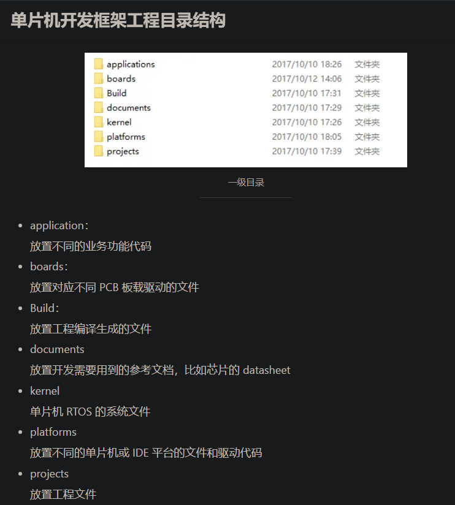
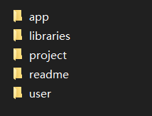

# 我的编码规范

参考：[编程（代码、软件）规范（适用嵌入式、单片机、上位机等）_编程规范-CSDN博客](https://blog.csdn.net/weixin_46672094/article/details/124852340)

## 关于代码规范

一个项目中的代码绝大部分都不会只有一种书写风格，比如使用了STM32标准库和FreeRTOS，标准库是一种风格，FreeRTOS又是一种风格，再加上自己的编写规范，又是一种风格。那这样几种风格混合，岂不是很混乱了？

我：以自己的风格为主，自己的风格参考各大厂的规范，整理出自己的一套规范。


## .c文件

.c文件：包含同名头文件、内部类型和枚举、内部宏(常量)定义、内部变量定义、内部函数定义与实现。

1. **一个模块通常包含多个.c文件，建议放在同一个目录下，目录名即为模块名。为方便外部使用者，建议每一个模块提供一个.h，文件名为目录名。**
   - 需要注意的是，这个.h并不是简单的包含所有内部的.h，它是为了模块使用者的方便，对外整体提供的模块接口。
2.  **一个函数仅完成一件功能。**
3. **重复代码应该尽可能提炼成函数。**
4. **避免函数过长，新增函数不超过50行（非空非注释行）。**（仅对新增函数进行规定，对已有的函数进行修改，建议不增加代码化）
5. **避免函数的代码块嵌套过深，新增函数的代码块嵌套不超过4层。**
6. **废弃代码（没有被调用的函数和变量)要及时清除。**
7. **函数不变参数使用const。**
8. **函数应避免使用全局变量、静态局部变量和I/O操作，不可避免的地方应集中使用。**
9. **函数的参数个数不超过5个。**
10. **除打印类函数外，不要使用可变长参函数。**
11. **在源文件范围内声明和定义的所有函数，除非外部可见，否则应该增加static关键字。**

文件名要全部首字母大写，可以包含下划线：

```c
Serial.c
Serial.h
BT_HC06.c  // 使用模块名称命名
DHT11.c    // 使用模块名称命名
```

## .h文件

h文件：包含需用头文件、对外类型和枚举、对外宏(常量)定义、对外变量声明（尽量不用）、对外函数声明。

1.  **头文件适合放置对外接口的声明，不适合放置实现，实现应放在定义文件中。**
   - 说明：头文件是模块(Module)或单元(Unit)的对外接口。变量定义应在.c中定义，在.h中仅声明，尽量不要使用全局变量作为接口，变量是程序内部实现细节，应通过函数接口的方式对外暴露。
2. **头文件应当职责单一**。
3. **禁止头文件循环依赖。**
4. **为防止头文件被重复引用，应用ifndef/define/endif 结构产生预处理。命名格式：FILENAME_H_。**
5.  **禁止在头文件中定义变量。**
   - 说明：在头文件中定义变量，将会由于头文件被其他.c文件包含而导致变量重复定义。
6. **禁止在extern "C"中包含头文件。（来自华为编程规范）**
7. **不提倡使用全局变量，尽量不要在头文件中出现象 extern int value 这类声明。**
8. 

段落安排：

```c
// 1、文件头注释
// 2、防止重复引用头文件的设置，如下：
#ifndef XXX_H_ /* 文件名前名加两个下划线__，后面加 _H，都大写 */
#define XXX_H_
// 3、#include 部分
#include "/project/inc/hello.h" /* 不要使用绝对路径 */
#include "../inc/hello.h"       /* 可以使用相对路径 */
#include <stdio.h>      /* 标准库的头文件 */
#include "global.h"     /* 自定义的头文件都用"" */
// 4、enum 常量声明
// 5、类型声明和定义，包括 struct、union、typedef 等
// 6、全局变量声明
// 7、文件级变量声明
// 8、全局或文件级函数声明
                        /*注意头文件通常都存放声明而不是定义*/
// 9、函数实现。按函数声明的顺序排列
// 10、文件尾注释
#endif
```

> 用`<>`包含，编译器会先在系统目录下搜索；用`""` 包含，编译器会先在用户目录下搜索。所以，如果使用系统标准库，要使用`<>`来包含头文件；使用自定义头文件用`""`包含最好

支持C++：

```c
/*  
*	使用 #ifdef __cplusplus 可以增加对C++项目引用的支持，
*	当在一个C++项目引用这个头文件时，
*	编译器能知道要按照C语言对此文件进行编译。
*/
#ifndef _ESPJARVIS_H 
#define _ESPJARVIS_H

#ifdef __cplusplus
extern "C" {
#endif

/*
*  头文件内容
*/
#ifdef __cplusplus
}
#endif

#endif	// _ESPJARVIS_H
```


## 注释

1. **优秀的代码可以自我解释，不通过注释即可轻易读懂。**

2. **注释的内容要清楚、明了，含义准确，防止注释二义性。**

3. **在代码的功能、意图层次上进行注释，提供有用、额外的信息。** 

   - 注释的目的是解释代码的目的、功能和采用的方法，提供代码以外的信息，帮助读者理解代码，防止没必要的重复注释信息。

   - >```c
     >/* if receive_flag is TRUE */
     >if (receive_flag)
     >```
     >
     >```c
     >/* if mtp receive a message from links */
     >if (receive_flag)
     >```

4. **边写代码边注释，修改代码同时修改相应的注释，以保证注释与代码的一致性。不再有用的注释要删除。**

5. **避免在注释中使用缩写，除非是通用或标准的缩写。** 

6. **标识符命名中若使用特殊约定或缩写，则要有注释说明。**

7. **同一产品或项目组 注释格式统一。**

8. **注释应与其描述的代码相靠近。**

9. **注释应考虑程序易读及外观排版的因素，使用的语言若是中、英兼有的，建议多使用中文，除非能用非常流利准确的英文表达。** 


### 模块注释

1、一般情况下，源程序有效注释量必须在 20％以上。（注释的原则是有助于对程序的阅读理解，在该加的地方都加，注释不宜太多也不能太少，注释语言必须准确、易懂、简洁 。）

2、在文件的开始部分，应该给出关于文件版权、内容简介、修改历史等项目的说明。

在创建代码和每次更新代码时，都必须在文件的历史记录中标注版本号、日期、作者、更改说明等项目。 下面是一个范例，当然，并不局限于此格式，但上述信息建议要包含在内。

```c
/*
**********************************************************(76个*号)
*	Copyright (C)，2222-3333，xxx有限责任公司
*	文件名称 : MyDHT11.c
*	内容简述 : 利用协议实现温湿度数据读取
*	文件历史: 
*		版本号     日期        作者        说明
*		v1.0	2023-07-05     lsl    利用DHT11的单总线协议实现驱动
*
*/
```

### 函数注释

对于函数，在函数实现之前，应该给出和函数的实现相关的足够而精练的注释信息：

```c
/*
**********************************************************(76个*号)
*函数名 ： SendToCard()
*功  能 ： 初始化STM32的一个IO口，用于对DHT11进行数据读取
*输  入 ： 全局变量 gaTxCard[]存放待发的数据
*全局变量 gbTxCardLen 存放长度
*输  出 ： 无
*/
```

注意：

- 边写代码边注释，修改代码同时修改相应的注释，以保证注释与代码的一致性。不再有用的注释要删除。
- 注释的内容要清楚、明了，含义准确，防止注释二义性。（错误的注释不但无益反而有害。注释主要阐述代码做了什么（What），或者如果有必要的话，阐述为什么要这么做（Why），注释并不是用来阐述它究竟是如何实现算法（How）的。）

其它参考：

```c
/* 比较标准的注释，英文不是很好的情况下建议仅使用中文注释 */
Function: // 函数名称
Description: // 函数功能、性能等的描述
Calls: // 被本函数调用的函数清单
Called By: // 调用本函数的函数清单
Table Accessed: // 被访问的表（此项仅对于牵扯到数据库操作的程序）
Table Updated: // 被修改的表（此项仅对于牵扯到数据库操作的程序）
Input: // 输入参数说明，包括每个参数的作// 用、取值说明及参数间关系。
Output: // 对输出参数的说明。
Return: // 函数返回值的说明
Others: // 其它说明
```


### 代码注释

1、注释格式尽量统一，建议使用“/* …… */”，因为 C++注释“//”并不被所有 C 编译器支持。

2、注释应与其描述的代码靠近，对代码的注释应放在其上方或右方（对单条语句的注释）相邻位置，不可放在下面，如放于上方则需与其上面的代码用空行隔开。

```c
/* 注释 */
xxx代码
    
/* 注释 */
xxx代码 
```

3、对变量的定义和分支语句（条件分支、循环语句等）必须编写注释。（这些语句往往是程序实现某一特定功能的关键，对于维护人员来说，良好的注释帮助更好的理解程序，有时甚至优于看设计文档。）

```c
/* 时序  */
for()
{}
```

4、对于 switch 语句下的 case 语句，如果因为特殊情况需要处理完一个 case 后进入下一个 case 处理，必须在该 case 语句处理完、下一个 case 语句前加上明确的注释。（这样比较清楚程序编写者的意图，有效防止无故遗漏 break 语句。）

5、注释应考虑程序易读及外观排版的因素，使用的语言若是中、英兼有的，建议多使用中文，除非能非常流利准确的用英文表达。（注释语言不统一，影响程序易读性和外观排版，出于对维护人员的考虑，建议使用中文。）


## 程序排版

1、程序块要采用缩进风格编写，缩进的空格数为 4 个。不要轻易使用TAB键，编辑器可用TAB键代替空格时方可使用，否则程序会因缩进不同而变乱。

2、相对独立的程序块之间、变量说明之后必须加空行 。

```c
void Example_Function()
{
    uint_8 i;
              // 局部变量和语句之间空一行
    for(){}  
              // 不同功能块之间空一行
    for(){}
}
```

3、较长的语句或函数过程参数（大于80 字符）要分成多行书写，长表达式要在低优先级操作符处划分新行，操作符放在新行之首，划分出的新行要进行适当的缩进，使排版整齐，语句可读。

```c
if((exParm1 ==0) && (exParm2 ==0) && (exParm3 ==0)
  || (exParm4 ==0))
{}
```

4、 一行只写一条语句。

5、程序块的分界符（如大括号‘{’和‘}’ ）应各独占一行并且位于同一列。

```c
for()
{
    for()
    {
        
    }
}
```

```c
​​​​如下例子不符合规范。 
if (pUserCR == NULL) return;
 
应如下书写： 
if (pUserCR == NULL)
{
    return;
}
```

```c
/* 长行规范 */
if( (very_longer_variable1 >= very_longer_variable12)
 && (very_longer_variable3 <= very_longer_variable14)
 && (very_longer_variable5 <= very_longer_variable16))
{
    dosomething();
}
```


## 标识符

1. **标识符的命名要清晰、明了，有明确含义，使用完整的英文单词或大家基本可以理解的缩写，避免使人产生误解，让人快速理解你的代码很重要。**
2.  **标识符前不应添加模块、项目、产品、部门的名称作为前缀。**
3.  **平台/驱动等适配代码的标识符命名风格保持和平台/驱动一致。**
4. **重构/修改部分代码时，应保持和原有代码的命名风格一致。**
5. 采用UNIX风格进行标识符命名。

命名风格：

- UINX风格：单词用小写字母，每个单词直接用下划线`_`分割，所以可以称为下划线法命法，例如`text_mutex`。
- Windows风格：大小写字母混用，单词连在一起，每个单词首字母大写，也叫帕斯卡命名，例如：UserName。
- 匈牙利命名: 计算机程序设计中的一种命名规则，用这种方法命名的变量显示了其数据类型，匈牙利命名主要包括基本类型、一个或更多的前缀、一个限定词这三部分，例如：m_lpszStr ，表示指向一个以0字符结尾的字符串的长指针成员变量。。（不要使用这种命名方法）
- 建议使用unix命名或者驼峰法命名，变量的名字应当使用“名词”或者“形容词＋名词”。

```c
/* unix命名 */
float old_value;
float new_value;
/* 驼峰法 */
float Value;
float OldValue;
float NewValue;
```

命名规范必须与所使用的系统风格保持一致，并在同一项目中统一。（比如采用 UNIX 的全小写加下划线的风格或大小写混排的方式，不要使用大小写与下划线混排的方式，用作特殊标识如标识成员变量或全局变量的 m_和 g_，其后加上大小写混排的方式是允许的。
示例： Add_User不允许，add_user、AddUser、m_AddUser允许。）


## 变量命名

1. **全局变量应增加“g_”前缀。**
   - 全局变量十分危险，增加前缀更加醒目，名字丑陋，促使开发人员小心和少使用。从根本上来说，尽量不使用全局变量。
2. **静态变量应增加“s_”前缀。**
3. **变量的名字应当使用“名词”或者“形容词＋名词”。**
4. **全局函数的名字应当使用“动词”或者“动词＋名词”（动宾词组）。类的成员函数应当只使用“动词”，被省略掉的名词就是对象本身。**


1、标识符的命名要清晰、明了、有明确含义，同时使用完整的单词或大家基本可以理解的缩写，避免使人产生误解。

```c
int book_number;
int number_of_beautiful_gril;
```

>argument 可缩写为 arg
>buffer 可缩写为 buff
>clock 可缩写为 clk
>command 可缩写为 cmd
>compare 可缩写为 cmp
>configuration 可缩写为 cfg
>device 可缩写为 dev
>error 可缩写为 err
>hexadecimal 可缩写为 hex
>increment 可缩写为 inc、
>initialize 可缩写为 init
>maximum 可缩写为 max
>message 可缩写为 msg
>minimum 可缩写为 min
>parameter 可缩写为 para
>previous 可缩写为 prev
>register 可缩写为 reg
>semaphore 可缩写为 sem
>statistic 可缩写为 stat
>synchronize 可缩写为 sync
>temp 可缩写为 tmp

2、命名中若使用特殊约定或缩写，则要有注释说明。（应该在源文件的开始之处，对文件中所使用的缩写或约定，特别是特殊的缩写，进行必要的注释说明。）

3、` i、j、k `等仅能用于作局部循环变量。

## 函数命名

1. **函数命名应以函数要执行的动作命名，一般采用动词或者动词+名词的结构。**
2. **函数指针除了前缀，其他按照函数的命名规则命名。**
3. 

1、函数的命名规则：每一个函数名前缀需包含模块名，模块名为小写，与函数名区别开。(对于非常简单的程序，可以不加模块名；模块名可以用器件模块名称来充当)

```c
/* uart为模块名 */
void uartReceive(void)
{
    
}
```

```c
/* 采用动词+名词的格式，大驼峰命名 */
GetName()
SetMotorSpeed()
InitHardware()
PublishLightValue()
```

```c
/* 驱动代码：设备名称_函数名称；stm32标准库命名方式 */
void OLCD_ShowString()
{
    
}
```

2、函数名应准确描述函数的功能，使用动宾词组为执行某操作的函数命名，“动词”或者“动词＋名词”（动宾词组）。（避免用含义不清的动词如`process`、`handle`等为函数命名，因为这些动词并没有说明要具体做什么）

```c
/* 采用动词+名词的格式，大驼峰命名 */
void PrintRecord(uint32_t _RecInd);
int32_t InputRecord(void);
uint8_t GetCurrentColor();
```

3、函数的形参：函数的的形参都以下划线_开头，以便与普通变量进行区分，对于没有形参的函数(void)括号紧跟函数后面。

```c
uint32_t uartConvUartBaud(uint32_t _ulBaud)
{

}
void uartReceive(void)
{
    
}
```

4、一个函数仅完成一个功能。

5、避免设计五个以上参数函数，不使用的参数从接口中去掉。（目的减少函数间接口的复杂度，复杂的参数可以使用结构传递）

6、在调用函数填写参数时，应尽量减少没有必要的默认数据类型转换或强制数据类型转换。（因为数据类型转换或多或少存在危险）

7、 防止把没有关联的语句放到一个函数中。

## 括号和空格

非函数程序块：if、 switch、 for、 do、 while等，应该把起始大括号`{`放到行尾，把结束大括号`}`放到行首。

```c
if (x is true) {

}
/* C中还是以这种来吧 */
if (x is true) 
{

}
```

if、 swich、 case、 for、 do、 while后面要添加空格。

如果要定义指针类型，或者函数返回指针类型时，`*`应该放到靠近变量名或者函数名的一侧，而不是类型名：（不过我喜欢靠近类型名）

```c
char *linux_banner;
unsigned long long memparse(char *ptr, char **retptr);
char *match_strdup(substring_t *s);
```


## 宏、结构和枚举

1、宏命名建议使用大写，单词之间使用下划线“_”连接在一起，比如`define PI_ROUNDED 3.14`。

2、函数宏的命名：宏的名字一般用大写，但是形如函数的宏，其名字可以用小写，如果能写成内联函数的就不要写成像函数的宏：

```c
#define macrofun(a, b, c) \
do { \
if (a == 5) \ 
    do_this(b, c); \
} while (0)
```

3、使用宏的注意事项——避免影响控制流程的宏，如下：

```c
#define FOO(x) \
do { \
if (blah(x) < 0) \
	return -EBUGGERED; \
} while (0)
```

作为左值的带参数的宏：FOO(x) = y，如果有人把 FOO 变成一个内联函数的话，这种用法就会出错了。

忘记优先级：使用表达式定义常量的宏必须将表达式置于一对小括号之内

4、常量建议使用 const 定义来代替宏。

5、对于枚举定义全部采用大写，结尾`_E标识`。

```c
typedef enum 
{
    KB_F1 = 0;
    KB_F2,
    KB_F3
}KEY_CODE_E;
```

6、常量、宏、模版的名字应该全部大写。如果这些名字由多个单词组成，则单词之间用下划线分隔。

```c
#define LOG_BUF_SIZE 8000
```

7、结构体命名，采用首字母大写的驼峰式命名，结构体变量命名使用小驼峰式命名。（还是去参考stm32标准库的命名方式吧...）


## 变量

1. **一个变量只有一个功能，不能把一个变量作多种用途。**
2. **结构单一，不要设计面面俱到的结构。**
3. **不用或者少用全局变量。**
4. **防止局部变量与全局变量重名。**
5. **通讯过程中使用的结构，必须注意字节序。**
6. **严禁使用未经初始化的变量作为右值。**
   - 说明：在首次使用前初始化变量，初始化的地方离使用的地方越近越好，可以有效避免未初始化错误。
7. **构造仅有一个模块或函数可以修改、创建，而其余有关模块或函数只访问全局变量，防止多个模块或函数都可以修改、创建同一全局变量的现象。**
   - 说明：降低全局变量耦合度。
8. **使用面向接口编程思想，通过API访问数据：如果本模块的数据需要对外部模块开放，应提供接口函数来设置、获取，同时注意注意全局数据的访问互斥。**
9. **明确全局变量初始化的顺序，避免跨模块初始化的依赖。**
10. **尽量减少没有必要的数据类型默认转换或强制转换。**

## 常量

1. **不允许直接使用魔鬼数字（没有具体含义的数字，字符串）。**

2. **除非必要，应尽可能使用函数代替宏。**

3. **常量建议使用const定义代替宏。**

4. **宏定义中尽量不使用return、goto、continue、break等改变程序流程的语句。**

5. **常量后加后缀。32位常量要加ul。**

   U 或 u 无符号数

   L 或 l 长整型

   F 或 f 浮点数

   

## 数据类型

1、**应使用指示了 大小 和 符号 的typedef以替代基本数据类型。**

```c
例如:32位计算机
typedef char                char_t;
typedef signed char         int8_t;
typedef unsigned char       uint8_t;
typedef signed short        int16_t;
typedef unsigned short      uint16_t;
typedef signed int          int32_t;
typedef unsigned int        uint32_t;
typedef signed long long    int64_t;
typedef unsigned long long  uint64_t;
typedef float               float32_t;
typedef double              float64_t;
```


# 单片机开发框架工程目录结构

工程目录结构应该根据项目的复杂度来进行设计，并不是一成不变的。

## 目录结构参考1

[单片机开发框架工程目录结构 - 简书 (jianshu.com)](https://www.jianshu.com/p/98bedde02db2)



- applications/xxx:
   不同的应用功能，对应新建不同的目录
- boards/xxx:
   存放不同的 PCB 板载驱动文件
- Build/demos/xxx:
   由工程配置文件把编译输出的文件设置放到此目录下
- kernel/RTOS/xxx:
   以后方便扩展，可以能会用到不同的 RTOS，或不使用 RTOS 时，放置空的系统接口文件
   目录 `kernel/xxx` 除了 `kernel/RTOS` 外，可能以后还会扩展 RTOS 级的其他文件
- platforms/Cortex-M3：
   放置 Cortex-M3 的内核的平台文件
- platforms/MCUs/xxx:
   放置不同单片机外设库文件和对应 IDE 的平台文件
- projects/STM32F1xx/demo/EWARM:
   对应 IAR 的工程文件
- projects/STM32F1xx/demo/RVMDK:
   对应 KEIL 的工程文件

## 目录结构参考2



- app里面放各种模块代码，比如与LED相关的，就将一个LED目录表示一个模块，里面放具体的源码文件和头文件。
- libraries：stm32标准库代码。
- project：keil工程目录。
- user：main.c函数和中断相关的。


