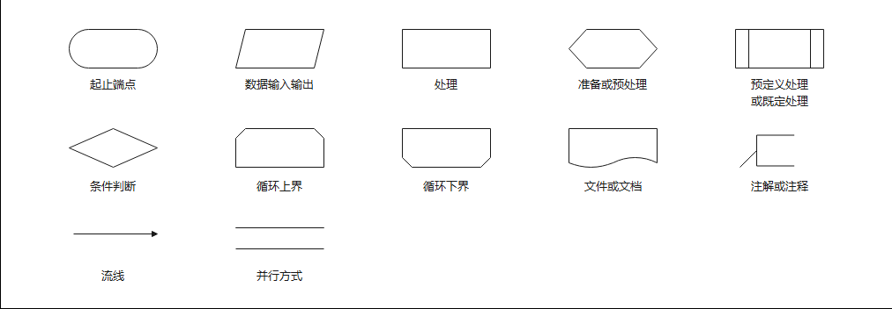

# 程序开发步骤

程序开发七步骤：

1. 需求分析 → 程序目标。
2. 设计程序。（程序流程设计、算法设计、数据结构设计）
3. 编写程序。
4. 编译、运行、测试与调试、维护与修改。

# 程序流程图

>百度百科：
>
>程序流程图又称程序框图，是用统一规定的标准符号描述程序运行具体步骤的图形表示。 程序框图的设计是在处理流程图的基础上，通过对输入输出数据和处理过程的详细分析，将计算机的主要运行步骤和内容标识出来。

简单来说，流程图就是**一种描述程序流向的图形**。一般由处理框、判断框、起止框、连接点、流程线、注释框等元素构成。

设计程序的一个工具。

基本结构：顺序结构，条件结构（又称选择结构），循环结构，分支结构。

