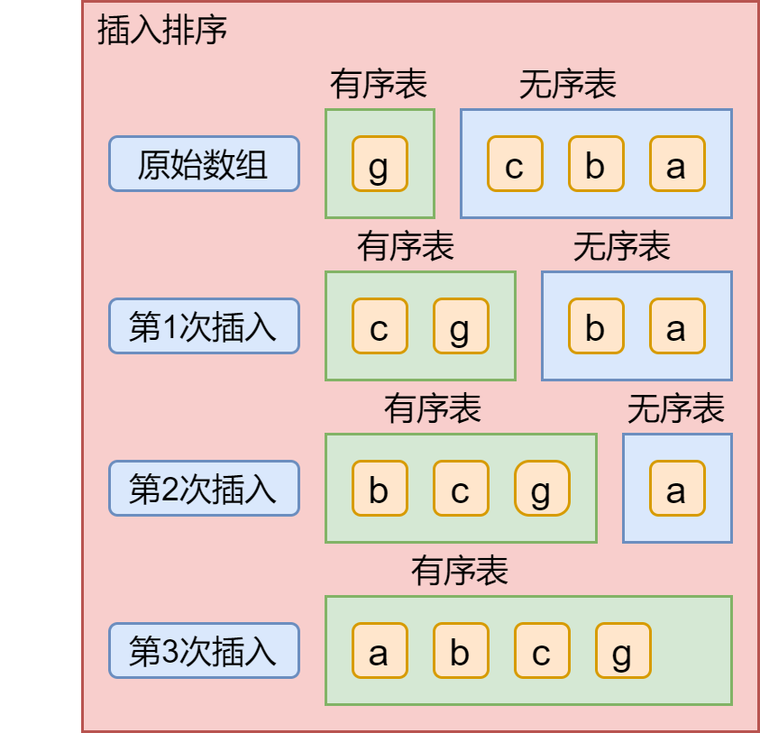

# 排序算法

## 初级排序

### 选择排序

从索引为0处开始，找到数组中最小的那个元素，再将其和数组的第一个元素交换，然后从第二个开始再继续找到第二个最小的数，再和第二个元素交换，以此类推。

```java
public static void selectionSort(Comparable[] a){
    int n = a.length;
    int min = 0;
    // 第一层循环：用于选择数组的索引值
    for (int i = 0; i < n; i++) {
        // 第二层循环：用于比较，找出最小的那个数的索引值
        min = i;
        for (int j = i+1; j < n; j++) {
            if (a[j].compareTo(a[min]) < 0){
                min = j;
            }
        }
        Comparable t = a[i];
        a[i] = a[min];
        a[min] = t;
    }
}
```

时间复杂度：O(n) = (n-1) + (n-2) + (n-3) + 2 + 1 = n(n-1)/2 = n^2/2 -n/2 = n^2/2

空间复杂度：S(n) = O(1)

### 插入排序

插入排序的思想是：把n个待排序的元素看成一个有序表和一个无序表，将无序表中的元素与有序表的元素进行比较来确定该元素应该插入到有序表中的哪个位置。如下图，对数组中元素进行升序排序，将第一个元素看成有序表，其余为无序表。



- 第一次插入实现过程：无序表的c和有序表的g比较，g>c，所以c应该在g之后，c和g交换位置；
- 第二次插入实现过程：无序表中的b和有序表中的元素进行比较，从g开始比较，g>b，所以b、g互换位置，然后b和c比较，b<c，b、c又互换位置，得到b c g；
- 依此类推。

```java
public static void insertSort(Comparable[] a){
    int n = a.length;
    // 第一场循环：选中无序表元素
    for (int i = 1; i < n; i++) {
        // 第二层循环：无序表元素和有序表元素进行比较、交换
        for (int j = i; j > 0; j--) {
            // 比较
            if (a[j].compareTo(a[j-1]) < 0){
                // 交换
                Comparable t = a[j];
        		a[j] = a[j-1];
        		a[j-1] = t;
            }
        }
    }
}
```

### 希尔排序

基于插入排序。希尔排序思想：将数组中任意间隔为h后的元素当成有序表，然后将无序表中元素和有序表中的进行比较，如果大于或小于就进行数的交换。

```java
public static void shellSort(Comparable[] a){
    int n = a.length;
    int h = 1;
    while (h < n/3){
        h = 3 * h + 1; // 1 4 7 10 13 ...直到得到一个最大的数
    }
    while (h >= 1){
        for (int i = h; i < n; i++) {
            for (int j = i; j >= h;j -= h){
                if (a[j].compareTo(a[j-1]) < 0) {
                    Comparable temp = a[j];
                    a[j] = a[j-1];
                    a[j-1] = temp;
                }
            }
        }
        h = h / 3;
    }
}
```


## 冒泡排序

从0下标的数开始，依次和余下的比较，在升序排序中，如果比较的数比自身小，就交换位置；每一次比较，都得到一个最大值。

```java
public static void bubbleSort(int[] arr){
    int temp = 0;
    for (int i = 0; i < arr.length - 1; i++) {
        for (int j = 0; j < arr.length - i - 1; j++) {
            if (arr[j] > arr[j+1]){
                temp = arr[j];
                arr[j] = arr[j+1];
                arr[j+1] = temp;
            }
        }
    }
}
```


## 快速排序

快速排序是对冒泡排序的改进。快速排序是一种划分交换排序，采取分治策略。快排基本思想为：

1. 从数列中取出一个数作为基准。
2. 分治：将比这个数大的数全放到它的右边，小于或等于它的数全放到它的左边。
3. 递归：再对左右区间重复第二步，直到各区间只有一个数。  

```java
public class QuickSort {
    public static void main(String[] args) {
        int[] arr = new int[]{-1,2,0,3,-2,4};
        quickSort(arr,0,arr.length-1);
        System.out.println(Arrays.toString(arr));
    }

    public static void quickSort(int[] arr, int left, int right){
        int l = left; // 左下标
        int r = right; // 右下标
        int picot = arr[(l+r)/2]; // 中轴值
        int temp = 0;
        // 将比picot值小的放到左边，大的放到右边
        while (l < r){
            // 在中值左边找，找到大于的就退出
            while (arr[l] < picot){
                l += 1;
            }
            // 在中值右边找，找到小于的就退出
            while (arr[r] > picot){
                r -= 1;
            }
            if (l >= r) break;
            temp = arr[l];
            arr[l] = arr[r];
            arr[r] = temp;
            // 如果arr[l] == picot 前移
            if (arr[l] == picot){
                r -=1;
            }
            // 如果arr[r] == picot 后移
            if (arr[r] == picot){
                l +=1;
            }
        }
        // 左右递归 如果l==r，则要l++、r--，否则会栈溢出
        if (l == r){
            l +=1;
            r -=1;
        }
        // 向左递归
        if (left < r){
            quickSort(arr,left,r);
        }
        // 向右递归
        if (right > l){
            quickSort(arr,l,right);
        }
    }
}
```


## 归并排序

归并排序思想：将数组（递归地）分成两半分别排序，然后再将排序好的结果归并起来，从而完成排序。


## 优先队列


## 排序算法的应用


