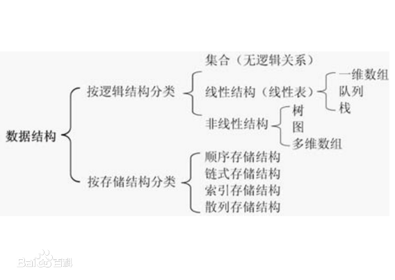
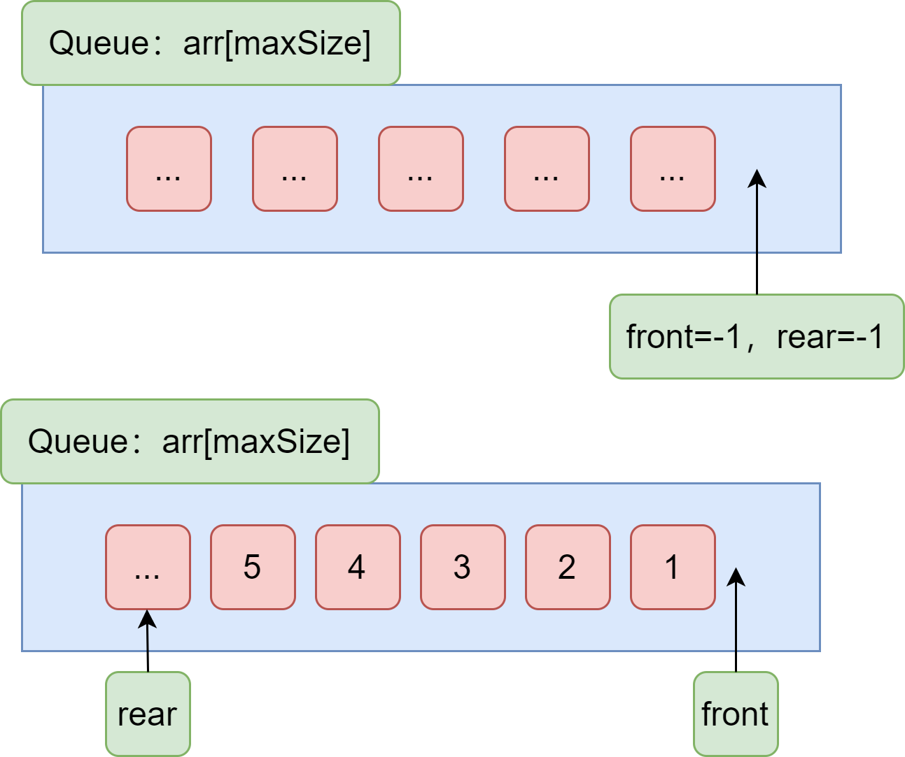
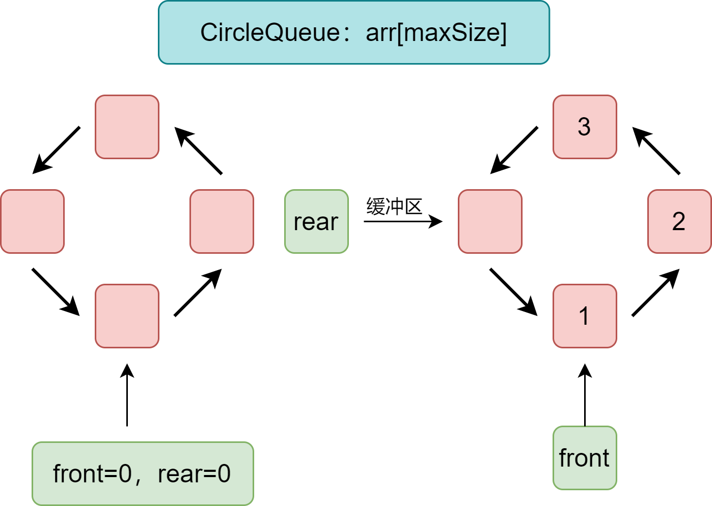
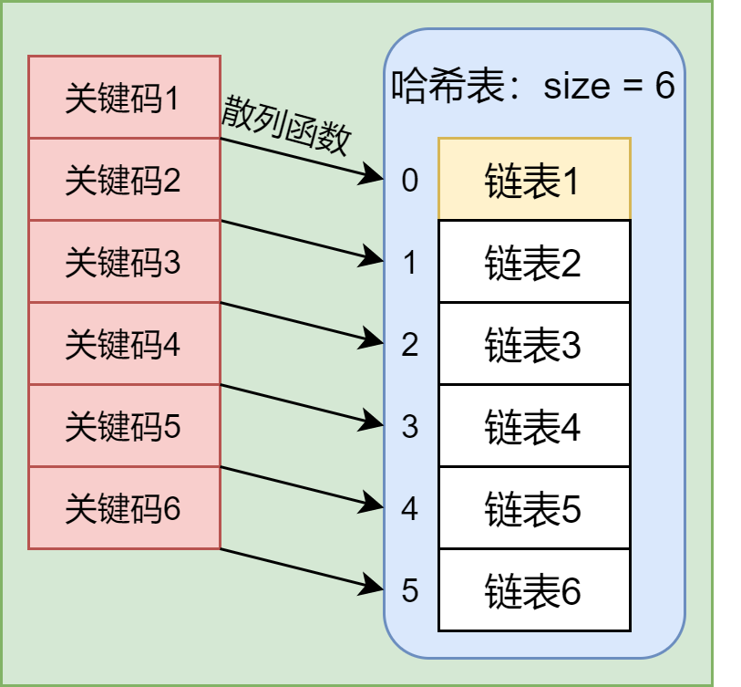
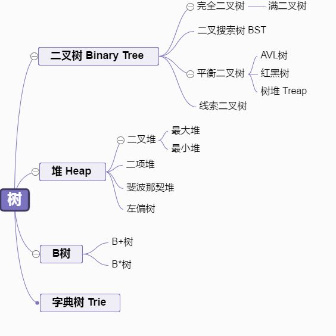
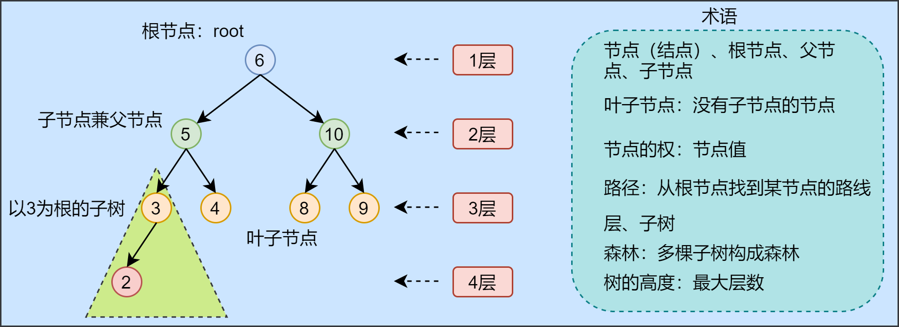
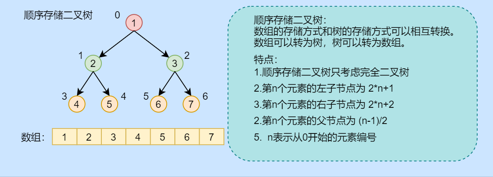
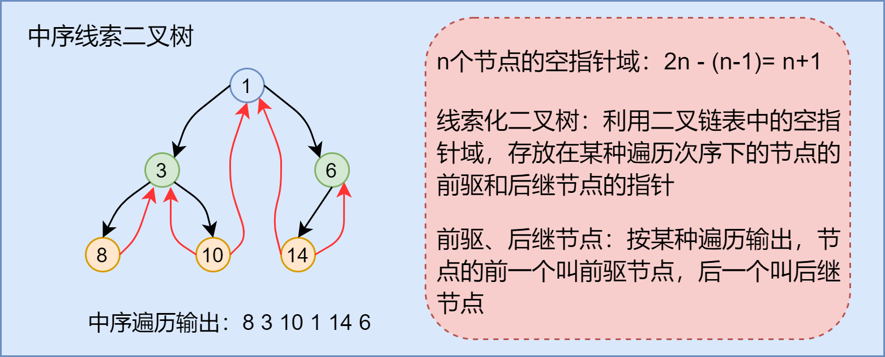

# 数据结构与算法

作者：王boy
链接：https://www.zhihu.com/question/28873750/answer/170477311
来源：知乎
著作权归作者所有。商业转载请联系作者获得授权，非商业转载请注明出处。

**总起**
先放结论，根据实际问题去设计数据结构，在数据结构基础上进行算法设计。即，**数据结构特点决定了算法的设计。**
举一些简单的例子，如果数据结构是链式存储的二叉树，那么就可以在其上面使用深度优先搜索以及广度优先搜索。如果是图数据结构，需要根据图的特点来设计算法，在深度优先遍历或广度优先遍历的时候就需要考虑记录访问过的结点。

**数据结构**
数据结构很重要。一些大师在进行编程之前在[数据结构](https://www.zhihu.com/search?q=数据结构&search_source=Entity&hybrid_search_source=Entity&hybrid_search_extra={"sourceType"%3A"answer"%2C"sourceId"%3A"170477311"})上花费的时间是最多的。只有将数据结构设计好了，才能在此基础上使用算法。
接下来，介绍一下数组，[链表](https://www.zhihu.com/search?q=链表&search_source=Entity&hybrid_search_source=Entity&hybrid_search_extra={"sourceType"%3A"answer"%2C"sourceId"%3A"170477311"})，树，图，队列，栈相关的内容以及它们之间存在的一些关系。
数组这种数据结构有其随机访问的特点，靠下标就能访问。这种访问方式十分高效。
链表虽然不能利用下标访问，但对于内存的使用很具有灵活性，所以这个优点让它应用也十分广泛。因为在实际程序我们不能总是确定内存中有合适的空间。链表最大的作用感觉也在于此，其更适用于[非随机访问](https://www.zhihu.com/search?q=非随机访问&search_source=Entity&hybrid_search_source=Entity&hybrid_search_extra={"sourceType"%3A"answer"%2C"sourceId"%3A"170477311"})的情况。
但是显然链表这种结构存在查找效率低的特点，这种问题应该如何解决呢？有没有一种办法既可以灵活分配内存，同时又能提高查找效率呢？（查找这个动作，往往是程序必不可少的一部分，几乎所有的程序都会涉及到查找这个动作，所以其效率便十分重要了）
先说一下总的方法，有序是查询得以优化的重要原因。先来说说树，树的组织一般也是[链式存储](https://www.zhihu.com/search?q=链式存储&search_source=Entity&hybrid_search_source=Entity&hybrid_search_extra={"sourceType"%3A"answer"%2C"sourceId"%3A"170477311"})的，好处就在于原来n个条目的数据存储在链表中，当我们进行查询时，查询第3个就必须经过第2个。查询第n个，就必须得经过前n-1个[结点](https://www.zhihu.com/search?q=结点&search_source=Entity&hybrid_search_source=Entity&hybrid_search_extra={"sourceType"%3A"answer"%2C"sourceId"%3A"170477311"})。那么问题来了，难道结点n前面的那些结点都需要经过吗？显然不是，这也说明了链表的局限性。相对而言，树的组织方式使我们在遍历时可以进行选择，比如说，二叉树中我们需要选定一个分支，相对而言，链表中我们没得选择。选择的出现带来了一定的优化。比如[二叉排序树](https://www.zhihu.com/search?q=二叉排序树&search_source=Entity&hybrid_search_source=Entity&hybrid_search_extra={"sourceType"%3A"answer"%2C"sourceId"%3A"170477311"})，堆等。这些树的构建，都是根据我们的目的来进行构建的。
栈，队列，则是由现实世界借鉴而来的。首先，现实世界中，[队列栈](https://www.zhihu.com/search?q=队列栈&search_source=Entity&hybrid_search_source=Entity&hybrid_search_extra={"sourceType"%3A"answer"%2C"sourceId"%3A"170477311"})这些形式普遍存在于现实生活中，而程序从某种角度是服务于现实生活中，所以就抽象出了计算机中的所谓栈，[队列](https://www.zhihu.com/search?q=队列&search_source=Entity&hybrid_search_source=Entity&hybrid_search_extra={"sourceType"%3A"answer"%2C"sourceId"%3A"170477311"})的概念。思想体现在程序的执行过程中，体现在程序开发设计中。事实上，栈，队列的思想不仅体现在了软件层面，计算机硬件层面也是很多地方应用了这中思想，比如[指令队列](https://www.zhihu.com/search?q=指令队列&search_source=Entity&hybrid_search_source=Entity&hybrid_search_extra={"sourceType"%3A"answer"%2C"sourceId"%3A"170477311"})（指令执行的先后顺序决定了队列适用于它），比如说寄存器栈（计算的次序决定了可以用栈来实现）。另外，[函数](https://www.zhihu.com/search?q=函数&search_source=Entity&hybrid_search_source=Entity&hybrid_search_extra={"sourceType"%3A"answer"%2C"sourceId"%3A"170477311"})调用机制也是栈的应用，a调用b、b调用c，这个过程在我们看来比较简单，但是在计算机中，在调用时则需要保存一系列信息，调用的过程以及返回的过程（c只能返回到b，不能直接返回到c）这个过程适合通过栈这种结构来进行模拟。

**算法**
设计了好的数据结构，只是成功了一半，因为数据结构是静态的，只是组织数据的一种方式，你不去操作它（如访问），它是无法发挥它的作用的。所以，我们需要在此基础上去根据我们的目的进行相应的操作，而操作的方式不同，耗费的时间也是不一样的，我们需要找到好的操作方案。这里所说的方案，就是算法。
举一个简单的例子，你打算从家到学校，有多个[公交](https://www.zhihu.com/search?q=公交&search_source=Entity&hybrid_search_source=Entity&hybrid_search_extra={"sourceType"%3A"answer"%2C"sourceId"%3A"170477311"})可以坐，可以产生很多方案，每一种方案都是你对于达成目标的一种设计，我们称之为算法。人们往往会在众多方案中寻找最优的算法。我们这里的方案的数量是有限的，但是事实上，很多问题的方案是无限的，或者巨大的，我们无法一一去尝试这些方案。所以我们总结了一些优秀算法的准则、思想，比如说[贪心算法](https://www.zhihu.com/search?q=贪心算法&search_source=Entity&hybrid_search_source=Entity&hybrid_search_extra={"sourceType"%3A"answer"%2C"sourceId"%3A"170477311"})，动态规划等思想。
算法为何依赖于数据结构呢？为回答这个问题，举一个通俗的例子。你在学校捡到了一张[饭卡](https://www.zhihu.com/search?q=饭卡&search_source=Entity&hybrid_search_source=Entity&hybrid_search_extra={"sourceType"%3A"answer"%2C"sourceId"%3A"170477311"})，上面有姓名，学院，班级。然后你要去将饭卡还给失主。接下来，你会找到其学院，然后找到班级，然后在班级中通过询问同学找到[失主](https://www.zhihu.com/search?q=失主&search_source=Entity&hybrid_search_source=Entity&hybrid_search_extra={"sourceType"%3A"answer"%2C"sourceId"%3A"170477311"})。（姓名，学院，班级）在这里我们认为是数据结构，因其把这些数据组织到一张卡上了。接下来，想象另一种情形，假如说饭卡上只有姓名，而学院，班级在另一张信息卡上。那么你可能找遍全校也找不到失主。
将一些数据组织在一起，能够为算法提供必要的基础信息，关联信息，使得算法在执行过程中能够快速找到相关信息（比如，上面例子中的学院，班级）。

# 学习建议

作者：垃圾知乎
链接：https://zhuanlan.zhihu.com/p/58810399
来源：知乎
著作权归作者所有。商业转载请联系作者获得授权，非商业转载请注明出处。


大家好，我叫小鹿，目前正在上大三。今天呢，我想简单的分享一下半年来自学数据结构与算法学习方法和技巧。写这篇文章主要目的还是重在让刚刚接触数据结构的读者按照总结步骤进行阶段性学习。

小鹿上的一所普通的三本大学，大学的三年时间基本在自学编程，毕竟课上老师所授的课程很浅，老师讲述一个知识点是要考虑到大部分不同理解能力学生的，所以对于我这种喜欢刨根问底的学生从大一开始不得不花费大量的时间来自学编程。自学呢，我更注重效率，效率在哪里来？我相信很多自学编程的人最讲究的就是方法和技巧，而小鹿的学习方法是不断的几个阶段循环总结而出的，那就是**动机、目标、实践、反馈、提高标准**。

## 我的基础

先说一下学习数据结构之前处于一个什么的基础，大二的时候就开设了数据结构的课程，但是当时对数据结构并没有什么兴趣，再加上学校环境的原因，期末考试背一下原题就过了。再一次接触到数据结构的时候（也就是一年后），几乎和零基础没什么本质上的区别，所以说才有了下边的对于零基础的学习数据结构的方法。 

## 我的学习动机

学习一门技术首先要有动机。那什么是动机呢？我们经常看到减肥的人通常在房间里放一张好身材的图片，就是为了产生动机每天坚持减肥。学习也是一样的，没有动机就没有的学习下去的动力。那我学习数据结构的最初动机是什么呢？快实习了，想让自己找一家好的公司实习，没有数据结构与算法的基础不可能进入一家理想的公司的，所以我将进入一家理想的公司作为学习的动机。

## 我的收获

经过大三上半年对数据结构的自学，和以前那个自己相比有了质的飞跃，从最基础的某一数据结构的由来、是什么，特点以及优缺点到实际项目中应该如何运用，再到如何培养自己下意识的数据结构(遇到问题，根据问题的特性就能下意识的想到用哪个数据结构来解决)。到后来逐渐的学会了将多种数据结构联系起来进行解决问题，这样做的目的就是能够让程序性能更加稳定，效率更加高效。

这些都是这半年来每天和数据结构打交道不断的训练出来的，这半年基本没有一天放松过，我相信功夫不负有心人，即使基础再不好，头脑再笨，通过我总结的操作步骤也能学好数据结构。

## 我的实践

因为我上的是一所三流大学，大多数时间考自学，总结了很多的提高学习效率的方法，那么在学习数据结构上我是怎么做的呢？我将数据结构的学习分为了三个阶段。

**第一阶段：认识数据结构**

第一步：学习它就应该知道数组、链表、栈、队列、散列表、跳表、图、树、堆、字典树10种数据结构用来干什么，为什么，怎么做，小鹿建议去看一些基础的数据结构书籍或者借助百度和谷歌简单了解一下每种数据结构用来干什么，为什么，怎么做就可以了，然后可以简单做一下笔记和博客。

第二步：每种数据结构都有它的优缺点和性能的好坏，那我们以什么标准来衡量数据结构与算法的性能好快呢？那第二步就学习时间复杂度、空间复杂度相关的复杂度分析的内容，这部分内容至关重要，因为后边要学到的数据结构与算法都要有一个衡量性能标准的，为了能够不同的问题解决选择出性能最优的数据结构和算法。

**第二阶段：深入数据结构**

第一步：写代码。上边最基本的十种数据结构相关特性和使用条件都做笔记了，然后我们从头开始对每种数据结构进入深入研究，首先数据结构涉及到的操作，比如增、删、改、查等操作要自己实现一遍，在机器上运行一遍，写代码的时候一定要注意以下几点：边界条件、指针、代码的规范。

这样会使你更加的对代码有颗敬畏之心，每次写代码都要认真对待，如果机器上写代码没问题了，可以自己通过在笔记本上用笔手写亲自实现一遍，有利于你加深你的代码逻辑的理解。

第二步：在第一阶段中我们了解到性能的衡量标准，那下一步就再回过头来对10种最常用的几种数据结构涉及到的操作进行性能分析。你可能会问，为什么不边写代码边进行性能分析呢？我觉得分阶段的好处就是能集中解决问题，写代码就是要锻炼写代码的思维逻辑能力，性能分析就是要提高自己的分析能力，性能分析完成之后再看一下之前写的代码有哪些可以进行优化改进的。这期间你会遇到各种问题，遇到问题怎么做，我通常会去百度或者谷歌借助别人写的文章进行总结记录到笔记本上。

第三步：每种数据结构的性能分析完成之后，再进行对每种数据进行深入。第一阶段我推荐的是看一些基础的书籍，涉及到的知识层次不深。但是我们还是要至少手中有一本具有权威性深入解析的数据结构书籍才能对一些概念进行深入的理解。基础书籍毕竟是让你入门的嘛，我们可以通过这些权威性高、内容全面的对已学到的数据结构知识点进行查缺补漏。

第四步：单独的深入学习真的很枯燥杂么办，那么我们就实际生活中的例子去分析，比如猜数字游戏、0/1背包问题、走迷宫、八皇后问题以及满减凑单问题等。如猜数字游戏，我们可以想想怎么才能在最短的时间内猜到正确的数字呢，可能你会想到使用二分查找。那好了，我们问一下自己二分查找存在的问题，这个过程中一定要多问自己为什么，只有这样你的知识层次才会得到扩展，比如二分查找如果数据中有重复数据怎么解决？

我还是要强调一下，一定要多问自己为什么，因为从心理学上来讲，人的大脑符合最小阻力原则，就是思考的事情最不喜欢做，所以这里我们要逆着来，才能进一步进行突破。如果你觉的上述两个阶段没有问题了，我们就进行下面的第三个阶段检索数据结构。

**第三阶段：检索数据结构**

第一步： 这时你可能学的非常多的关于数据结构的内容，但是很难运用，那怎么能够在实际实际问题中运用起来呢？我们前边已经将零碎的知识点整理到笔记本上了？接下来该怎么做呢？我们可以借助思维导图，对知识体系化整理，无论是复习巩固都利于我们进一步加强。

第二步：上述整理成体系之后完毕之后，然后去谷歌或者百度搜索一下有明确解决方案的实际问题拿来进行分析学习，你到这些实际项目中会发现，很多问题涉及到多个数据结构问题，我们前边解决的还不过是针对单一的数据结构，那就尝试着自己将数据结构之间建立联系，比如数组和链表，每种数据结构都有优缺点，你在学习的过程中你会发现一个数据结构的优点正是另一数据结构的缺点，数组在内存空间是连续的，对CPU缓存友好，而链表在内存中是零碎内存空间，对CPU缓存不友好，但是链表可以动态扩容而数组不可以。

再比如为了提高程序的效率不得不用消耗更多的内存空间的数据结构去代替另一数据结构，如果内存紧张，对执行效率要求不高的话，我们又用省内存执行效率稍有不高的数据结构去代替占内存大而执行快的数据结构。

第三步：学会将实际问题转换成所学的数据结构。怎么转化呢？如：假如你是一名工程师，要对链表实现缓存的算法进行优化你会怎么解决？我们先将问题转换成学过的数据结构，里边提到链表，好那我们知道有链表了，在分析用链表实现了那些操作？淘汰数据、查找数据、缓存数据，这三个操作里边都涉及到查找，我们不得不遍历整个链表，时间复杂度为O(n)。

那我们就想能不能对查找进行优化呢？根据问题或者数据的特征找适用的数据结构，缓存的三个操作涉及到快速的插入、删除、查询数据，我们在大脑中快速的检索可以快速的实现插入、删除、查询的数据结构有哪些？平衡二叉树、散列表、跳表等，比如我们选择散列表，最后分析一下时间复杂度是不是优化了很多，否则我们再换另一种数据结构进行性能分析。

我们不难发现，实际问题就会一步一步的分解成了我们学习到的数据结构的基本操作分析，然后利用我们学到的数据结构的优缺点和性能分析得出最优解绝方法，但是在企业中遇到实际问题中往往比我们拿一些做练习的实际问题复杂的要多。

## 我的反馈

我们把每次解决问题或者每一遍去复习数据结构都要有所收获，同样的知识怎么增加自己的收获呢？那就是要不断的反馈给自己信息，比如，散列冲突当前的解决方法在实际项目中不适用，那我将这个信息反馈给自己，问一下自己有没有更好的解决办法？反馈之后，接下来就是提高学习的标准了。

## 提高标准

学习数据结构总会遇到瓶颈的，当我们走出瓶颈之后就会很顺利很多，那你会问接下来有没有再提高的可能了？会有的，接下来你就讲提高自身的标准，比如你解决生活中的实际问题让自己有下意识解决问题的能力，不借助任何参考数据，这方面对自身的要求很高的，再比如提高工作的效率，看起来非常高标准的，我相信每个人只有不断的通过努力的实践、反馈总有一天会锻炼出来这种能力的，相信你。

文章中可能有很多不足，也希望你能提出宝贵的意见反馈给小鹿，小鹿会不断以高标准提高自己，写出更多有益于读者的学习的方法。

# ~~概念~~

数据项：数据的不可分的最小单位，一个数据元素可由若干个数据项组成。

数据元素：组成数据的、有一定意义的基本单位。

数据：描述客观事物的符号（对于计算机来说是可输入、可识别、可操作的）。

数据对象：性质相同的数据元素的集合。

数据结构：相互之间存在一种或多种特定关系的数据元素的集合。（分为逻辑结构和物理结构（存储结构））

**逻辑结构：数据对象中数据元素之间的相互关系**

- 集合结构：数据元素同属一个集合，此外没有其他的相互关系。
- 线性结构：数据元素一对一的关系所组成的线性关系。
- 树形结构：数据元素一对多的关系所形成的的层次关系。
- 图形结构：数据元素多对多的关系。

**物理结构（存储结构）：数据逻辑结构在计算机中的存储形式**（将数据及其逻辑关系存储到计算机中的结构方法）

- 顺序存储结构：数据元素存放在地址连续的存储单元。
- 链式存储结构：数据元素存放在任意的存储单元，存储单元可连续也可不连续（依靠存放地址的指针来定位数据元素）。

数据类型：一组性质相同的值的集合及定义在此集合上的一些操作的总称。（值的不同，所需要的内存大小不同，根据值来设定好一个内存大小）

抽象数据类型：对已有的数据类型的抽象，是操作，一个数学模型及定义在该模型上的操作。（抽象数据类型体现了程序设计中问题分解、抽象和信息隐藏的特性。抽象数据类型把实际生活中的问题分解为多个规模小且易处理的问题，然后建立一个计算机能处理的数据模型，并把每个功能模块的实现细节作为一个独立的单元，从而使具体实现过程隐藏起来）

**算法：解决特定问题的求解的步骤的描述（计算机中表现为指令的有限序列）**

算法特性：输入、输出、有穷性（在可接受时间内完成）、确定性（每一步骤都有确定含义且不会出现二义性）、可行性（每一步都能通过有限次数完成）。

好的算法：正确性、可读性、健壮性、高效率、低存储量。

# 数据结构



**概述：**抽象的终要落地，逻辑数据结构无非是在顺序存储和链式存储的基础上的抽象延伸。

**线性表：**

线性表是零个或多个的数据元素的有限序列，元素之间有顺序，除了第一个和最后一个，其余的都有一个直接前驱元素和一个直接后驱元素。在线性表的顺序存储结构中，元素在存储空间中是紧密相连的、一个挨着一个的，如果需要删除某个元素则又需要把空出来的内存补上，如果需要插入则又需要移动元素来挪出一块地方来供插入。所以线性表的顺序存储的最大的缺点就是对插入和删除不友好，无论插入或删除都会有几率要移动元素。

线性结构：具体的常见的线性结构有：数组、链表、栈、队列和串等。

非线性结构：具体的结构形式为二维数组、多维数组、广义表、树结构和图结构等。

常用的数据结构：数组（array）、栈（stack）、队列（queue）、链表（linked list）、树（tree）、图（graph）、堆（heap）、散列表（hash）。


数据结构的学习：xxx结构是是什么？说出其优缺点和应用场景，如何实现。

# 复杂度

算法效率度量方法：

- 事后统计方法：完成算法后测试不同情况下的运行时间。
- 事前分析估算方法：算法程序编制前使用统计方法对算法进行估算（时间复杂度、空间复杂度）。

## 时间复杂度

**决定程序运行时间的因素：**时间复杂度，用来度量算法的运行时间，程序运行时的消耗时间取决于：

1. 算法采用的策略和方法；（算法好坏的根本）
2. 编译产生的代码质量；（软件因素）
3. 问题的输入规模；
4. 机器执行指令的速度。（硬件因素）

参考时间复杂度的方法由来：[（数据结构）十分钟搞定时间复杂度（算法的时间复杂度） - 简书 (jianshu.com)](https://www.jianshu.com/p/f4cca5ce055a)

**使用大O阶方法：**（函数的阶数对函数的增长速率影响最大）

- 记法：记总执行次数`T(n) = O(f(n))`，n为问题规模，**随着输入大小 n 的增大，算法执行需要的时间的增长速度可以用 f(n) 来描述**。
- 大O阶方法推导时间复杂度：（通过计算程序执行次数再使用下式推导）
  1. 用常数1取代运行时间中的所有加法常数；
  2. 修改后的运行次数函数中只保留最高阶；
  3. 如果最高阶项存在且不是1，则去掉和这个项相乘的常数。

```java
public void runTime() {
   int i = 0;               // 需要执行1次
   System.out.println(i);   // 需要执行1次
}
// 运算次数：T(n)=2 ===> 复杂度O(1)   用1取代加法次数
```

```java
public void runTime() {
     for(int i = 0; i<n; i++) {      // 需要执行 (n + 1) 次
        System.out.println(i);       // 需要执行 n 次
    }
   System.out.println("Hi");            // 需要执行 1 次
} 
// 运算次数：T(n)=(n+1)+n+1=2n+2 ===> 复杂度O(n)   有阶数去除常数项
```

```java
public void runTime() {
     for(int i = 0; i< n; i++) {       // 需要执行 (n + 1) 次
         for(int i = 0; j < n; j++){   // 需要执行 (n + 1) 次
         	System.out.println(i);     // 需要执行（n * n）次
         }
    }
   System.out.println("Hi");            // 需要执行 1 次
} 
// 运算次数：T(n)= n^2 + 2n+1 ===> 复杂度O(n^2)   有阶数取最高阶
```

常见时间复杂度所耗费的时间：

```xml
O(1) < O(logn) < O(n) < O(nlogn) < O(n^2) < O(n^3) < O(2^n) < O(n!) < O(n^n) 
```

| **时间复杂度** | **阶**             | **f(n) 举例** |
| :------------: | :----------------- | :------------ |
|   常数复杂度   | O(1)               | 1             |
|   对数复杂度   | O(logn)            | logn + 1      |
|   线性复杂度   | O(n)               | n + 1         |
| 线性对数复杂度 | O(nlogn)           | nlogn + 1     |
|   k 次复杂度   | O(n²)、O(n³)、.... | n² + n +1     |
|   指数复杂度   | O(2^n)             | 2^n + 1       |
|   阶乘复杂度   | O(n!)              | n! + 1        |

最好情况时间复杂度，最坏情况时间复杂度。平均情况时间复杂度。一般都算最坏的。


## 空间复杂度

**空间复杂度：**（程序运行中需要的存储）

- 空间复杂度和时间复杂度一样，反映的也是一种趋势，只不过这种趋势是代码运行过程中**临时变量**占用的内存空间。
- S(n)=O(f(n))，n为问题规模（数据集大小），f(n)为关于n所占存储空间的函数。

代码在计算机中的运行所占用的存储空间呐，主要分为 3 部分：

- 代码本身所占用的。
- 输入数据所占用的。
- 临时变量所占用的。
- 前面两个部分是本身就要占这些空间，与代码的性能无关，所以我们**在衡量代码的空间复杂度的时候，只关心运行过程中临时占用的内存空间。**

空间复杂度分析例如：

```java
// 传入的数据所占内存不计，临时变量sum和i都只开一份内存，是常阶数
// 空间复杂度就是 O(1)
public void sum(int arr[]){
    int sum = 0;
    for(int i = 0; i < arr.length; i++){
    	sum += arr[i];
    }
}
// O(n)  new ArrayList()节点数随着arr.length增而增
public void appendNum(int arr[]){
    ArrayList list = new ArrayList();
    for(int i = 0; i < arr.length; i++){
    	list.add(i);
    }
}
```


# 数组

**数组**

数组是可以在内存中连续存储多个数据元素的结构，在内存中的分配也是连续的，数组中的元素通过数组下标进行访问，数组下标从0开始。

优点：

1. 随机访问性比较强，可以通过下标进行快速定位。
2. 查找速度快。

缺点：（初始化长度固定、内存连续、插入删除需移动元素）

1. 插入和删除的效率低，需要移动其他元素。
2. 会造成内存的浪费，因为内存是连续的，所以在申请数组的时候就必须规定其内存的大小，如果不合适，就会造成内存的浪费。
3. 内存空间要求高，创建一个数组，必须要有足够的连续内存空间。
4. 数组的大小是固定的，在创建数组的时候就已经规定好，不能动态拓展，如果要扩容得新建另一个数组。

适用场景：频繁查询，对存储空间要求不大、很少增加和删除的场景下。

**稀疏数组**

- 使用场景：当一个数组中大部分元素是同一个值时。
- 稀疏数组处理方法：把一个数组中不同值的信息（行、列和对应值）以及数组的信息（row、column、有多少个不同的值）都记录进另一个小规模的数组（稀疏数组）。

# 队列Queue

## 思想及应用

队列是一个有序列表，遵循先入先出原则（first in first out，简称“FIFO”），可用数组和链表实现。队列的实现同样有两种方式：顺序存储和链式存储。


## **单队列实现：**



队列可以使用顺序存储或链式存储，顺序存储中使用数组来存储数据，另外还需要两个变量（front（前）、rear（后））来定位头部与尾部的数据，以方便先进先出的实现。

将队列使用类来描述，其基本属性如下：

1. front：用于定位数组的头部，取值-1，头部索引=(front+1)，每取出一次数据front要加1。
2. rear：用于定位队列的最后一个数据，队列中每加入一个数据rear就加1，实现定位。

3. maxSize：用于数组的初始化，用于充当队列的最大容量。


队列需要的功能：（进、出、判空、判满、遍历）

1. 创建队列：初始化队列的容量（arr[maxSize]）、初始化“指针”（front、rear）；
2. 往队列中添加数据：如果队列满载则不能添加；
3. 从队列中取出数据：要符合先进先出，队列中没有数据时无法取出；
4. 队列是否满载的判断；
5. 队列数据是否为空的判断；
6. 展示队列全部数据、展示队列头部数据。

```java
public class ArrayQueue {
    private int rear;
    private int front;
    private int maxSize;
    private int[] arr;
    public ArrayQueue(int arrayMaxSize){
        maxSize = arrayMaxSize;
        arr = new int[maxSize];
        // 头部前
        front = -1;
        // 指向队列最后一个数据
        rear = -1;
    }
    // 判断队列是否已经满
    public boolean isFull(){
        return rear == maxSize - 1;
    }
    // 判断队列是否为空
    public boolean isEmpty(){
        return front == rear;
    }
    // 添加数据进队列
    public void addQueue(int n){
        if (isFull()){
            throw new RuntimeException("队列已满！");
        }
        rear++;
        arr[rear] = n;
    }
    // 取出队列中数据
    public int getQueue(){
        if (isEmpty()){
            throw new RuntimeException("队列为空！");
        }
        front++;
        return arr[front];
    }
    // 显示队列中所有数据
    public void showQueue(){
        if (isEmpty()){
            throw new RuntimeException("队列为空！");
        }
        for (int i = 0; i < arr.length;i++){
            System.out.printf("arr[%d]=%d\n",i,arr[i]);
        }
    }
    // 获取队列的头数据
    public int showHead(){
        if (isEmpty()){
            throw new RuntimeException("队列为空！");
        }
        return arr[front+1];
    }
}
```

## **循环队列实现：**

**使用环形数组实现：**



使用数据简单实现队列中存在一个问题：就是一个队列满载后，即使取出一些数据把位置“空出来”，但空出来的位置已经是不能复用的了，那怎么才能实现一个当满载后再取出数据后还能往队列添加数据的队列呢？答案就是：在数组中把一个位置当为缓冲区，满载时，当取出一个数据，就把这个缓冲区转化为队列的有效位置，而取出数据后空出来的位置就再次充当缓冲区，这样就能把头尾“相连”起来了，就实现了一个环形的数组充当的队列。（如果不满载，缓冲区就逐渐后移就好）

具体实现思路：

1. 先要初始化队列（包含数组、front（队列头数据索引）、rear（缓冲区索引）），注意环形数组需要一个容量充当缓冲区，所以实现的队列的有效容量为最大容量减去1；
2. 考虑maxSize、front、rear的联系（这里利用了它们之间的一些算法）。

```java
public class CircleQueue {
    // 队列最大容量 注意此时有效容量是(maxSize - 1) 多出来的一个用于实现环形
    private int maxSize;
    // front指向队列头
    private int front;
    // rear 队列尾部
    private int rear;
    // 存放数据的地方
    private int[] arr;

    public CircleQueue(int maxSize) {
        this.maxSize = maxSize;
        front = 0;
        rear = 0;
        arr = new int[this.maxSize];
    }
    // 队列是否满了
    public boolean isFull(){
       return  ((rear + 1) % maxSize) == front;
    }
    // 判断队列是否为空
    public boolean isEmpty(){
        return rear == front;
    }
    // 添加数据 进队列
    public void addQueue(int n) {
        if (isFull()) {
            System.out.println("队列已满，不能添加！");
            return;
        }
        arr[rear] = n;
        // 一个数除以另一个数，如果被除数比除数小，那么余数就是被除数本身
        rear = (rear + 1) % maxSize;
    }
    // 出队列
    public void getQueue(){
        if (isEmpty()){
            System.out.println("队列为空，不能取数据！");
            return;
        }
        int value = arr[front];
        front = (front + 1) % maxSize;
    }
    // 显示队列数据
    public void showQueue(){
        if (isEmpty()){
            System.out.println("队列为空，没有数据！");
            return;
        }
        for (int i = front; i < front + size(); i++) {
            System.out.printf("arr[%d]=%d\n",i % maxSize,arr[i % maxSize]);
        }
    }
    // 队列有效个数
    public int size(){
        return (rear + maxSize - front) % maxSize;
    }
    // 显示头部数据
    public int showHead(){
        if (isEmpty()){
            System.out.println("队列为空，没有数据！");
            return 0;
        }
        return arr[front];
    }
}
```


# 链表LinkedList

链表就是链式存储实现的线性表。链表使用节点来存储数据，所谓节点，只不过是一个包含这些信息的类的对象：包含要存储的信息和其他存储着相同类型信息的节点对象。可组成八种形式的链表（单向、双向、带头、不带头、循环、非循环），常用的：

1. 无头单向非循环链表：结构简单，一般不会单独用来存数据。实际中更多是作为其他数据结构的子结构，如哈希桶、图的邻接表等等。另外这种结构在笔试面试中出现很多。
2. 带头双向循环链表：结构最复杂，一股用在单独存储数据。 实际中使用的链表数据结构，都是带头双向循环链表。另外这个结构虽然结构复杂，但是使用代码实现以后会发现结构会带来很多优势，实现反而简单了，后面我们代码实现了就知道了。

```java
// 一个简单的节点类（一般是声明好要存储的数据、前节点引用或后节点引用等信息）
class Node{
    private String info; // 存储的信息
    private Node next; // 节点对象
    其他方法...
}
```

链表的优点：

1. 插入和删除的效率高，只需要改变指针的指向就可以进行插入和删除。
2. 内存利用率高，不会浪费内存，可以使用内存中细小的不连续的空间，只有在需要的时候才去创建空间。大小不固定，拓展很灵活。

链表的缺点：查找的效率低，因为链表是从第一个节点向后遍历查找。

链表与数组的区别：

1. 存储上的区别：数组静态分配内存，链表动态分配内存；数组在内存中是连续的，链表是不连续的。
2. 元素访问上的区别：数组利用下标定位，查找的时间复杂度是O(1)，链表通过遍历定位元素，查找的时间复杂度是O(N)。
3. 元素操作上的区别：数组插入和删除需要移动其他元素，时间复杂度是O(N)，链表的插入或删除不需要移动其他元素，时间复杂度是O(1)。

## 单链表

单向链表的节点只能单向指向下一个节点，也可以通过节点存储的信息确定存储的顺序。单向链表结构简单，一般不会单独用来存放数据。实际中更多是作为其他数据结构的子结构，比如说哈希桶等等。

**1.确定节点要存储的信息：**

```java
class HeroNode {
    // 节点要存储的信息
    public int no;
    public String name;
    public String nickname;
    // 指向下一个节点
    public HeroNode next;
    // 已经忽略节点的构造方法和toString方法
}
```

**2.链表功能的实现：**（增、删、改、查、判空、遍历）

```java
// 这是一个单向链表
class SingleLinkedList {
    // 链表头部不存储数据，只用于定位首个节点有无
    private HeroNode head = new HeroNode(0,"","");
    // 显示链表所有数据
    public void show(){
        if (head.next == null) {
            System.out.println("链表为空");
            return;
        }
        HeroNode temp = head.next;
        while (true){
            System.out.println(temp.toString());
            if (temp.next == null){
                break;
            }
            temp = temp.next;
        }
    }
}
```

a.链表操作：简单的节点添加操作

```java
// 添加节点：遍历到列表的最后一个数据，加上引用完成节点添加
public void add(HeroNode heroNode){
    HeroNode temp = head;
    // 如果遍历到最后一个节点，退出循环
    while (true){
        if (temp.next == null) {
            break;
        }
        temp = temp.next;
    }
    // 添加节点
    temp.next = heroNode;
}
```

b.链表操作：节点存储信息带序号，要求链表中节点按序号排序并且序号不重复

```java
// 有编号的节点，按编号顺序添加
public void addByOrder(HeroNode heroNode){
    HeroNode temp = head;
    // 判断是否有已经有相同编号的标志位
    boolean falg = false;
    // 遍历查询
    while (true) {
        // 如果遍历到末尾，说明可以直接在末尾添加节点
        if (temp.next == null){
            break;
        }
        // 判断是否存在重复的编号
        if (temp.next.no > heroNode.no){
            break;
        }else if (temp.next.no == heroNode.no){
            falg = true;
            break;
        }
        // 指针后移，实现遍历
        temp = temp.next;
    }
    // 添加操作，flag为true表示存在相同编号的节点，不能再进行添加操作
    if (falg) {
        System.out.println("存在相同编号的数据，不能再添加！");
    }else {
        heroNode.next = temp.next;
        temp.next = heroNode;
    }
}
```

c.链表操作：根据传入的节点来修改节点的信息

```java
// 修改节点信息
public void update(HeroNode newNode){
    HeroNode temp = head.next;
    if (temp == null){
        System.out.println("没有节点！");
        return;
    }
    // 标志位，存在相同编号的节点即视为能进行修改操作
    boolean flag = false;
    while (true) {
        if (temp == null) {
            System.out.println("已经遍历完全部节点。");
            break;
        }
        if (temp.no == newNode.no){
            flag = true;
            break;
        }
        temp = temp.next;
    }
    if (flag) {
        temp.name = newNode.name;
        temp.nickname = newNode.nickname;
    }else {
        System.out.println("该节点不存在，无法更改！");
    }
}
```

d.链表操作：根据编号删除节点，失去引用的节点会被垃圾回收

```java
// 删除节点
public void delete(int no) {
    HeroNode temp = head;
    boolean flag =false;
    if (temp.next == null){
        System.out.println("链表为空！");
        return;
    }
    while (true){
        if (temp.next == null){
            break;
        }
        if (temp.next.no == no){
            flag = true;
            break;
        }
        temp = temp.next;
    }
    if (flag){
        temp.next = temp.next.next;
    }else {
        System.out.println("要删除的节点不存在！");
    }
}
```


## 双向链表

双向链表即在单链表的每个节点，再设置一个指向其前驱节点的指针域。

**1.确定节点要存储的信息：**

```java
class Node {
    // 节点要存储的信息
    public int no;
    public String name;
    public String nickname;
    // 指向下一个节点
    public Node next;
    // 指向前一个节点
    public Node pre;
}
```

**2.链表功能的实现：**（增、删、改、查、判空、遍历）

```java
public class DoubleLinkedList {
    // 链表头
    private Node head = new Node(0,"","");
    // 返回头节点
    public Node returnHeadNode(){
        return head;
    }
```

功能1：显示全部节点信息

```java
public void show(){
    if (head.next == null){
        System.out.println("链表为空！");
        return ;
    }
    Node temp = head.next;
    while (true){
        if (temp == null){
            break;
        }
        System.out.println(temp);
        temp = temp.next;
    }
}
```

功能2：添加节点进链表

```java
public void add(Node node){
    Node temp = head;
    while (true){
        if (temp.next == null){
            break;
        }
        temp = temp.next;
    }
    temp.next = node;
    node.pre = temp;
}
```

功能3：修改指定节点

```java
public void update(Node node){
    if (head.next == null){
        System.out.println("链表为空！");
        return;
    }
    Node temp = head.next;
    boolean flag = false;
    // 遍历寻找要修改的节点
    while (true){
        if (temp == null){
            System.out.println("已经遍历完全部链表！");
            break;
        }
        if (temp.no == node.no){
            flag = true;
            break;
        }
        temp = temp.next;
    }
    if (flag){
        temp.name = node.name;
        temp.nickname = node.nickname;
    }else {
        System.out.println("不存在");
    }
}
```

功能4：删除指定节点

```java
public void delete(int no) {
    Node temp = head.next;
    boolean flag =false;
    if (temp.next == null){
        System.out.println("链表为空！");
        return;
    }
    // 遍历：找到要删除的节点 temp.next
    while (true){
        if (temp == null){
            System.out.println("已经遍历全部节点！");
            break;
        }
        if (temp.no == no){
            flag = true;
            break;
        }
        temp = temp.next;
    }
    if (flag){
        temp.pre.next = temp.next;
        if (temp.next != null){
            temp.next.pre = temp.pre;
        }
    }else {
        System.out.println("要删除的节点不存在！");
    }
}
```

## 环形链表

### 单向环形链表：

```java
public class CircleLinkedList {
    private Girl headFirst = new Girl(-1);
    public void addGirl(int nums){
        if (nums < 1){
            System.out.println("nums的值错误！");
            return;
        }
        Girl curGirl = null;
        for (int i = 1; i <= nums; i++) {
            Girl girl = new Girl(i);
            if (i == 1){
                headFirst = girl;
                headFirst.setNext(girl);
                curGirl = headFirst;
            }else {
                curGirl.setNext(girl);
                girl.setNext(headFirst);
                curGirl = girl;
            }
        }
    }
    // 遍历
    public void showGirl(){
        if (headFirst == null){
            System.out.println("链表为空！");
            return;
        }
        Girl curGirl = headFirst;
        while (true){
            System.out.printf("小孩 %d \n", curGirl.getNo());
            if (curGirl.getNext() == headFirst){
                break;
            }
            curGirl =curGirl.getNext();
        }
    }

}

class Girl {
    private int no;
    private Girl next;
    public Girl(int no) {
        this.no = no;
    }
	...
}
```

### 解决约瑟夫问题：

```txt
设编号为1、2、3、...、n的n个人围成一圈，约定编号为k(1<=k<=n)，的人从1开始报数，数到m的那个人出列，他的下一位又从1开始报数，数到m的那个人又出列，直到所有人出列为止（由此产生一个出队编号的序列）。
```

```java
// 根据用户输入形成出圈的序列: 从哪开始数 每次数多少下 最初圈中有多少个
public void countGirl(int startNo, int countNum, int nums){
    if (headFirst == null || startNo < 1 || startNo > nums){
        System.out.println("参数有误！");
        return;
    }
    Girl helper = headFirst;
    while (true) {
        if (helper.getNext() == headFirst){
            break;
        }
        helper = helper.getNext();
    }
    // 确定到起始位置
    for (int i = 0; i < startNo - 1; i++) {
        headFirst = headFirst.getNext();
        helper = helper.getNext();
    }
    // 从起始位置开始报数出圈，直到只有一个节点
    while (true){
        if (helper == headFirst) {
            break;
        }
        // 按countNum移动，到达位置就出圈
        for (int i = 0; i < countNum - 1; i++) {
            headFirst = headFirst.getNext();
            helper = helper.getNext();
        }
        System.out.printf("小孩%d出圈\n",headFirst.getNo());
        headFirst = headFirst.getNext();
        helper.setNext(headFirst);
    }
    System.out.printf("最后留在圈中的是：%d\n",headFirst.getNo());
}
```

### 双向环形链表

带头双向循环链表：结构最复杂，一般单独存储数据。实际中经常使用的链表数据结构，都是带头双向循环链表。这个结构虽然复杂，但是使用代码实现后会发现这个结构会带来很多优势，实现反而简单了。


# 栈

## 概述

1. 栈（stack，又名堆栈）是一个先入后出（FILO-First In Last Out）的有序列表。 
2. 栈(stack)是一种特殊线性表，其元素的插入和删除只能在线性表的同一端进行。允许插入和删除的一端，也就是能变化的一端，称为栈顶(Top)，另一端为固定的一端，称为栈底(Bottom)。 
3. 根据栈的定义可知，最先放入栈中元素在栈底，最后放入的元素在栈顶，而删除元素刚好相反，最后放入的元素最先删除，最先放入的元素最后删除。

## 应用场景

1. 子程序的调用：在跳往子程序前，会先将下个指令的地址存到堆栈中，直到子程序执行完后再将地址取出，以回到原来的程序中。
2. 处理递归调用：和子程序的调用类似，只是除了储存下一个指令的地址外，也将参数、区域变量等数据存入堆栈中。
3. 表达式的转换[中缀表达式转后缀表达式]与求值(实际解决)。 
4. 二叉树的遍历。 
5.  图形的深度优先(depth 一 first)搜索法。

# 哈希(散列)表

散列表（Hash table，也叫哈希表），是根据关键码值(Key value)而直接进行访问的数据结构。也就是说，它通过把关键码值映射到表中的一个位置来访问该位置记录有的数据，以加快查找的速度。这个把关键码值映射到表中具体位置的映射函数叫做散列函数，存放记录的数组叫做散列表（哈希表）。高效的数据存储和查找均可以用哈希表。



**实现hash表，以存储员工名字的hash表为例：**

## 实体类：

```java
public class Emp {
    private int id;
    private String name;
    private Emp next;
    // 构造器、get/set方法略
}
```

## 链表：

```java
public class EmpLinkedList {
    private Emp head;

    public EmpLinkedList(Emp head) {
        this.head = head;
    }

    public EmpLinkedList() {
    }
}
```

链表的功能函数：

```java
public void add(Emp emp){
    if (head == null){
        head = emp;
        return;
    }
    Emp curEmp = head;
    while (true) {
        if (curEmp.getNext() == null){
            break;
        }
        curEmp = head.getNext();
    }
    curEmp.setNext(emp);
}
// 遍历链表的信息
public void list(int no){
    if (head == null){
        System.out.println("第" + (no+1) + "条链表为空！");
        return;
    }
    System.out.print("第" + (no+1) + "条链表信息为");
    Emp curEmp = head;
    while (true){
        System.out.printf("=> id=%d name=%s\t",curEmp.getId(),curEmp.getName());
        if (curEmp.getNext() == null){
            break;
        }
        curEmp = curEmp.getNext();
    }
    System.out.println();
}
public Emp findEmpById(int id) {
    if (head == null) {
        System.out.println("链表为空~~~");
        return null;
    }
    Emp curEmp = head;
    while (true) {
        if (curEmp.getId() == id) {
            break;
        }
        if (curEmp.getNext() == null) {
            curEmp = null;
            break;
        }
        curEmp = curEmp.getNext();
    }
    return curEmp;
}
```

## 哈希表：

哈希表初始化：

```java
public class HashTable {
    private EmpLinkedList[] empLinkedLists;
    private int size;
    // 初始化哈希表结构
    public HashTable(int size){
        this.size = size;
        this.empLinkedLists = new EmpLinkedList[size];
        for (int i = 0; i < size; i++) {
            empLinkedLists[i] = new EmpLinkedList();
        }
    }
```

哈希表的映射函数：（以简单的求余运算为例）

```java
public int hashFun(int id){
    // 余数都不会超过模数size，因此求余出来的在整型值在 [0,size)，能映射到数组的下标
    return id % size; 
}
```

为哈希表添加功能函数，例如遍历所有存储在哈希表中的值、通过关键码查出含该关键码的数据、往表中加数据等：

```java
// 遍历哈希表
public void list(){
    for (int i = 0; i < size; i++) {
        empLinkedLists[i].list(i);
    }
}
// 往指定的EmpLinkedList添加雇员
public void add(Emp emp){
    int empLinkedListNo = hashFun(emp.getId());
    empLinkedLists[empLinkedListNo].add(emp);
}
```

通过关键码找数据：

```java
public void findEmpById(int id){
    int empLinkedListNo = hashFun(id);
    Emp emp = empLinkedLists[empLinkedListNo].findEmpById(id);
    if (emp == null){
        System.out.println("在哈希表中没有找到！");
    }else {
        System.out.printf("在第%d条链表中找到了 雇员id=%d name=%s \n",(empLinkedListNo + 1),id,emp.getName());
    }
}
```


# 树Tree

树，一种数据结构 ，它是由 n (n>=1 )个有限节点组成一个具有层次关系的集合 。

这种数据结构能提高数据存储、读取的效率，例如利用二叉排序树(Binary Sort Tree)，既可以保证数据的检索速度，同时也可以保证数据的插入、删除和修改的速度。



## 二叉树

二叉树：每个节点最多只能有两个子节点。



- 满二叉树：所有子节点都在最后一层，并且节点总数是2^-1（n为层数）的树。
- 完全二叉树：叶子结点只能出现在最下层和次下层，且最下层的叶子结点集中在树的左部并连续，次下层的叶子节点集中在树的右部且连续。（需要注意的是，满二叉树肯定是完全二叉树，而完全二叉树不一定是满二叉树。）

### **创建二叉树：**

1.二叉树使用节点存储信息，所以先把节点建起来：

```java
public class Node {
    private int id;
    ......                  // 节点存储的信息
    private Node leftNode;  // 存储左节点的地址
    private Node rightNode; // 存储右节点的地址

    public Node(int id) {
        this.id = id;
    }
    ...... // get、set方法
}
```

2.创建节点并把节点连成树：（这里使用手动方式）

```java
public class ThisIsATree {
    public static void main(String[] args) {
        Node root = new Node(6);
        Node n1 = new Node(5);
        Node n2 = new Node(10);
        Node n3 = new Node(3);
        Node n4 = new Node(4);
        Node n5 = new Node(8);
        Node n6 = new Node(9);
        Node n7 = new Node(2);
        // 第一层root
        // 第二层
        root.setLeftNode(n1);
        root.setRightNode(n2);
        // 第三层
        n1.setLeftNode(n3);
        n1.setRightNode(n4);
        n2.setLeftNode(n5);
        n2.setRightNode(n6);
        // 第四层
        n3.setLeftNode(n7);
    }
}
```

### **二叉树遍历：**

- 前序遍历：先输出父节点，再遍历左子树，最后遍历右子树。
- 中序遍历：先遍历左子树，再输出父节点，再遍历右子树。
- 后续遍历：先遍历左子树，再遍历右子树，最后再输出父节点。
- （看父节点输出顺序，就可以确定是哪个遍历）

```java
// 前序遍历
public void preOrder(){ 
    System.out.println(this);
    // 遍历树中所有左节点
    if (this.leftNode != null){
        this.leftNode.preOrder();
    }
    // 遍历树中所有右节点
    if (this.rightNode != null){
        this.rightNode.preOrder();
    }
}
// 中序遍历
public void infixOrder(){
    if (this.leftNode != null){
        this.leftNode.infixOrder();
    }
    System.out.println(this);
    if (this.rightNode != null){
        this.rightNode.infixOrder();
    }
}
// 后续遍历
public void postOrder(){
    if (this.leftNode != null){
        this.leftNode.postOrder();
    }
    if (this.rightNode != null){
        this.rightNode.postOrder();
    }
    System.out.println(this);
}
```

总结：

1. 使用了递归实现左节点、右节点的遍历。
2. 快速确定遍历输出：可看成一颗颗小树，父、左（父、左、右）、右（父、左、右）。

### 二叉树查找：

```java
// 节点
public Node preOrderSearch(int id){
    if (this.id == id){
        return this;
    }
    Node result = null;
    if (this.leftNode != null){
        result = this.leftNode.preOrderSearch(id);
    }
    if (result != null){
        return result;
    }
    if (this.rightNode != null){
        result = this.rightNode.preOrderSearch(id);
    }
    return result;
}
public Node infixOrderSearch(int id){
    Node result = null;
    if (this.leftNode != null){
        result = this.leftNode.preOrderSearch(id);
    }
    if (result != null){
        return result;
    }
    if (this.id == id){
        return this;
    }
    if (this.rightNode != null){
        result = this.rightNode.preOrderSearch(id);
    }
    return result;
}
public Node postOrderSearch(int id){
    Node result = null;
    if (this.leftNode != null){
        result = this.leftNode.preOrderSearch(id);
    }
    if (result != null){
        return result;
    }
    if (this.rightNode != null){
        result = this.rightNode.preOrderSearch(id);
    }
    if (result != null){
        return result;
    }
    if (this.id == id){
        return this;
    }
    // 如果找不到，返回null
    return result;
}
```

```java
// 树
public Node preOrderSearch(int id){
    if (root != null){
        return root.preOrderSearch(id);
    }else {
        return null;
    }
}
public Node infixOrderSearch(int id){
    if (root != null){
        return root.infixOrderSearch(id);
    }else {
        return null;
    }
}
public Node postOrderSearch(int id){
    if (root != null){
        return root.postOrderSearch(id);
    }else {
        return null;
    }
}
```

### 删除节点:

```java
// 节点：删除叶子节点或父子节点的子树
public void delNode(int id){
    if (this.leftNode != null && this.leftNode.id == id){
        this.leftNode = null;
        return;
    }
    if (this.rightNode != null && this.rightNode.id == id){
        this.leftNode = null;
        return;
    }
    if (this.leftNode != null){
        this.leftNode.delNode(id);
    }
    if (this.rightNode != null){
        this.rightNode.delNode(id);
    }
}
```

```java
// 树
public void delNode(int id){
    if (root != null){
        if (root.getId() == id){
            root = null;
        }else {
            root.delNode(id);
        }
    }else {
        System.out.println("空树！");
    }
}
```

如果目标节点是非叶子节点，如何只删除该节点但不删除其下面的子节点？

- 如果是叶子节点就可以直接删除。
- 如果不是叶子节点，那么可以指定如下规则：
  1. 如果该非叶子节点只有一个子节点，那么该子节点就替代被删除的节点的位置。
  2. 如果该非叶子节点有两个子节点，那么左子节点就替代被删除的节点的位置，右子节点就变为该子节点的右子节点。


## 顺序存储二叉树



```java
public class ArrayBinaryTree {
    private int[] arr;
    public ArrayBinaryTree(int[] arr){
        this.arr = arr;
    }

    public static void main(String[] args) {
        ArrayBinaryTree arrayBinaryTree = new ArrayBinaryTree(new int[]{1,2,3,4,5,6,7});
        arrayBinaryTree.preOrder(); // 1245367
    }
    // 树的前序遍历
    public void preOrder(){
        this.preOrder(0);
    }
    public void preOrder(int index){
        if (arr == null || arr.length == 0){
            System.out.println("空数组，不能转为二叉树！");
        }
        // 输出当前元素
        System.out.println(arr[index]);
        if ((index*2+1) < arr.length){
            preOrder(2*index + 1);
        }
        if ((index*2+2) < arr.length){
            preOrder(2*index + 2);
        }
    }
}
```

实际应用：堆排序。

## 线索化二叉树



如上图，当线索化二叉树后，Node节点属性的leftNode、rightNode有以下两种情况：

1. leftNode可能指向的是其节点对象的左子树或前驱节点。（如：节点1的指向左子树，节点10的指向前驱节点）
2. rightNode可能指向的是其节点对象的右子树或后继节点。（如：节点1的指向右子树，节点14的指向后继节点）

代码实现中序线索二叉树，在二叉树的基础上加上线索化的功能：

### 节点:

```java
public class Node {
    private int id;
    private Node leftNode;
    private Node rightNode;
    // leftType为0则表示指向左子树，为1则指向前驱节点
    // rightType为0表示指向右子树，为1则指向后继节点
    private int leftType;
    private int rightType;

    public int getLeftType() {
        return leftType;
    }
    public void setLeftType(int leftType) {
        this.leftType = leftType;
    }
    public int getRightType() {
        return rightType;
    }
    public void setRightType(int rightType) {
        this.rightType = rightType;
    }

    public Node(int id) {
        this.id = id;
    }

    public int getId() {
        return id;
    }

    public void setId(int id) {
        this.id = id;
    }

    public Node getLeftNode() {
        return leftNode;
    }

    public void setLeftNode(Node leftNode) {
        this.leftNode = leftNode;
    }

    public Node getRightNode() {
        return rightNode;
    }

    public void setRightNode(Node rightNode) {
        this.rightNode = rightNode;
    }


    public Node preOrderSearch(int id){
        if (this.id == id){
            return this;
        }
        Node result = null;
        if (this.leftNode != null){
            result = this.leftNode.preOrderSearch(id);
        }
        if (result != null){
            return result;
        }
        if (this.rightNode != null){
            result = this.rightNode.preOrderSearch(id);
        }
        return result;
    }
    public Node infixOrderSearch(int id){
        Node result = null;
        if (this.leftNode != null){
            result = this.leftNode.preOrderSearch(id);
        }
        if (result != null){
            return result;
        }
        if (this.id == id){
            return this;
        }
        if (this.rightNode != null){
            result = this.rightNode.preOrderSearch(id);
        }
        return result;
    }
    public Node postOrderSearch(int id){
        Node result = null;
        if (this.leftNode != null){
            result = this.leftNode.preOrderSearch(id);
        }
        if (result != null){
            return result;
        }
        if (this.rightNode != null){
            result = this.rightNode.preOrderSearch(id);
        }
        if (result != null){
            return result;
        }
        if (this.id == id){
            return this;
        }
        // 如果找不到，返回null
        return result;
    }
    public void delNode(int id){
        if (this.leftNode != null && this.leftNode.id == id){
            this.leftNode = null;
            return;
        }
        if (this.rightNode != null && this.rightNode.id == id){
            this.leftNode = null;
            return;
        }
        if (this.leftNode != null){
            this.leftNode.delNode(id);
        }
        if (this.rightNode != null){
            this.rightNode.delNode(id);
        }
    }

    public void preOrder(){
        System.out.println(this);
        // 左子树遍历
        if (this.leftNode != null){
            this.leftNode.preOrder();
        }
        // 右子树遍历
        if (this.rightNode != null){
            this.rightNode.preOrder();
        }
    }
    public void infixOrder(){
        if (this.leftNode != null){
            this.leftNode.infixOrder();
        }
        System.out.println(this);
        if (this.rightNode != null){
            this.rightNode.infixOrder();
        }
    }
    public void postOrder(){
        if (this.leftNode != null){
            this.leftNode.postOrder();
        }
        if (this.rightNode != null){
            this.rightNode.postOrder();
        }
        System.out.println(this);
    }
}
```

### 中序线索二叉树:

```java
public class ThreadBinaryTree {
    private Node root;
    // 在递归时，pre总是保留前一个节点
    private Node pre = null;

    public void setRoot(Node root) {
        this.root = root;
    }
    // 线索化
    public void threadNodes(){
        this.threadNodes(root);
    }
    // 线索化的方法
    public void threadNodes(Node node){
        if (node == null){
            return;
        }
        // 1.中序遍历，先线索化左子树
        threadNodes(node.getLeftNode());
        // 2.中序遍历，线索化当前节点
        // 处理当前节点的前驱节点
        if (node.getLeftNode() == null){
            // 当前节点的左指针指向前驱节点
            node.setLeftNode(pre);
            // 修改当前节点的做指针的类型，指向前驱节点
            node.setLeftType(1);
        }
        // 处理当前节点的后继节点
        if (pre != null && pre.getRightNode() == null){
            pre.setRightNode(node);
            pre.setRightType(1);
        }
        // 每处理一个节点后，让当前节点是下一个节点的前驱节点
        pre = node;
        // 3.中序遍历，线索化右子树
        threadNodes(node.getRightNode());
    }
    // 中序线索化二叉树的遍历
    public void threadedList(){
        // 定义变量存储当前遍历的节点，从root开始
        Node node = root;
        while (node != null){
            // 找到leftType=1的节点
            while (node.getLeftType() == 0){
                node = node.getLeftNode();
            }
            System.out.print(node.getId() + " ");
            // 如果当前指针指向的是后继节点，就一直输出
            while (node.getRightType() == 1){
                // 获取后继节点
                node = node.getRightNode();
                System.out.print(node.getId() + " ");
            }
            // 替换这个遍历的节点
            node = node.getRightNode();
        }
    }

    public Node preOrderSearch(int id){
        if (root != null){
            return root.preOrderSearch(id);
        }else {
            return null;
        }
    }
    public Node infixOrderSearch(int id){
        if (root != null){
            return root.infixOrderSearch(id);
        }else {
            return null;
        }
    }
    public Node postOrderSearch(int id){
        if (root != null){
            return root.postOrderSearch(id);
        }else {
            return null;
        }
    }
    public void delNode(int id){
        if (root != null){
            if (root.getId() == id){
                root = null;
            }else {
                root.delNode(id);
            }
        }else {
            System.out.println("空树！");
        }
    }

    @Override
    public String toString() {
        return "ThreadBinaryTree{" +
                "root=" + root +
                ", pre=" + pre +
                '}';
    }
}
```

### 中序遍历:

线索化二叉树后，各个节点的指向有所变化，因此原来的遍历方式不可以用了，这时可以通过线型方式来遍历，不需要使用递归，这样效率会提高。

```java
// 中序线索化二叉树的遍历
public void threadedList(){
    // 定义变量存储当前遍历的节点，从root开始
    Node node = root;
    while (node != null){
        // 找到leftType=1的节点
        while (node.getLeftType() == 0){
            node = node.getLeftNode();
        }
        System.out.print(node.getId() + " ");
        // 如果当前指针指向的是后继节点，就一直输出
        while (node.getRightType() == 1){
            // 获取后继节点
            node = node.getRightNode();
            System.out.print(node.getId() + " ");
        }
        // 替换这个遍历的节点
        node = node.getRightNode();
    }
}
```

### 测试:

```java
public class TestThreadBT {
    public static void main(String[] args) {
        Node root = new Node(1);
        Node node2 = new Node(3);
        Node node3 = new Node(6);
        Node node4 = new Node(8);
        Node node5 = new Node(10);
        Node node6 = new Node(14);
        // 手动创建二叉树
        root.setLeftNode(node2);
        root.setRightNode(node3);
        node2.setLeftNode(node4);
        node2.setRightNode(node5);
        node3.setLeftNode(node6);
        // 测试线索化二叉树
        ThreadBinaryTree tbt = new ThreadBinaryTree();
        tbt.setRoot(root);
        tbt.threadNodes();
        // 测试：以10号节点测试
        Node leftNode = node5.getLeftNode();
        Node rightNode = node5.getRightNode();
        System.out.println("10号节点的前驱节点是"+leftNode.getId()); // 3
        System.out.println("10号节点的后继节点是" + rightNode.getId()); // 1
        // 中序遍历
        System.out.print("使用线索化的方式遍历线索化二叉树：");
        tbt.threadedList(); // 8 3 10 1 14 6
    }
}
```


# 堆heap

堆是什么？堆就是用数组实现的二叉树，所以它没有使用父指针或者子指针；堆是一类特殊的树，是为了实现排序而设计的一种数据结构，它不是面向查找操作的。堆的通用特点就是父节点会大于或小于所有子节点。堆并不一定就是完全二叉树，平时使用完全二叉树的原因是易于存储、便于索引。堆分为有序堆和无序堆，当一颗二叉树的每个节点大于等于或小于等于其他两个子节点时，这棵二叉树被称为堆有序：

- 大顶堆：每个结点的值都**大于**或**等于**其左右孩子结点的值。
- 小顶堆：每个结点的值都**小于**或**等于**其左右孩子结点的值。
- 一般升序使用大顶堆，降序使用小顶堆。

## 二叉堆

二叉堆是一组这样的元素：堆有序的完全二叉树排序的元素，并且这些元素是在数组中按层级关系存储的（数组第一个位置不使用）。


# 图graph


