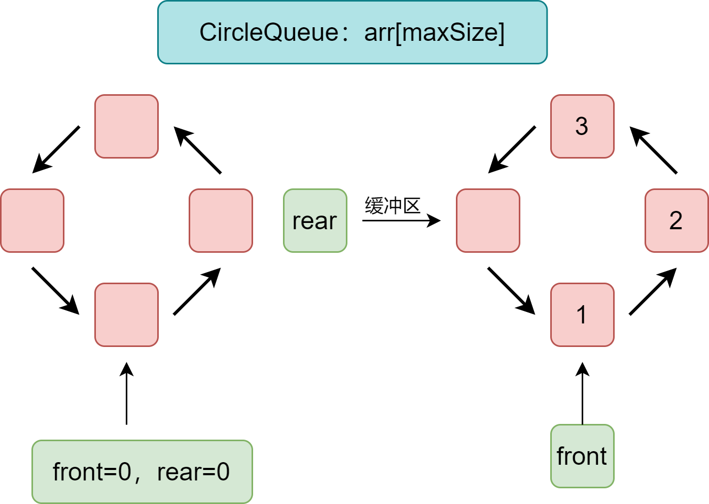

# 学习目标

## 目标、路线和方法

**确定学习目标：**

- 知道有哪些常用的数据结构和算法。
- 能够写出高性能的底层轮子。
- 知道如何进行复杂度分析、性能分析。
- 通过不断训练，具备“算法思维”，提高分析和解决实际问题的能力。
- 能够自如地应付大厂面试。

**制定学习路线：**

- 入门：什么是数据结构和算法?常用数据结构和算法的优缺点？如何分析算法复杂度？
- 基础：结合实例学习常用的数据结构和算法；知道各常用数据结构和算法的优缺点；会分析算法复杂度。
- 进阶：不太常用的数据结构和算法，比如红黑树。
- 实战：研究开源项目中对数据结构和算法的使用。

**明确学习方法（重点）：**

1. **不要死记硬背算法实现**，你应该试着去理解不同的数据结构、算法的原理是什么，它们是怎么来的，是如何解决不同的问题的。
2. **分析时间和空间复杂度**，知道各个算法和数据结构的优点、缺点是什么，以及适用于解决什么问题，什么情况下更适合采用哪种算法和数据结构。
3. **算法思想才是更重要的**，比如：分而治之、动态规划、贪婪算法等，学习算法思想可以帮你更好地理解算法之间的快慢差异，并学会在算法对时间和空间的使用上做出平衡。
4. 尝试把数据结构图形化，视觉化。
5. 一定要自己动手实现一遍。
6. 学到的知识需要时间慢慢消化、沉淀，不要试图一下子就全部掌握，学习本身就是反复迭代和不断思考的过程。如果学习过程中遇到挫败感，想想“书读百遍其义自见”这句话，可以先跳过这部分理解不了的，后面回过头再学习。
7. 要做些LeetCode上的题目。

## 学习重点

**明确学习重点：**（树、图简单了解一下即可，重要的数据结构是数组、链表、队列）

- 必须熟练复杂度分析。
- 链表和双向链表。
- 哈希表/散列表：哈希函数、碰撞解决。
- 字符串算法：排序、查找（BF算法、KMP算法、BM算法）、正则表达式、数据压缩。
- 树：二叉树、二叉查找树、伸展树(splay tree 分裂树)、平衡二叉树AVL、红黑树、B树,B+,B*、R树、Trie树(前缀树)、后缀树、最优二叉树(赫夫曼树)、二叉堆 （大根堆，小根堆）、二项树、二项堆、斐波那契堆(Fibonacci Heap)。
- 图：图的存储结构和基本操作（建立，遍历，删除节点，添加节点）、最小生成树、拓扑排序、关键路径、最短路径: Floyd、Dijkstra、bellman-ford、spfa。

## 算法

**算法：**

1、排序算法：

- 交换排序算法：冒泡排序、插入排序、选择排序、希尔排序、快排、归并排序、堆排序。
- 线性排序算法：桶排序。

2、查找算法：

- 顺序表查找：顺序查找。
- 有序表查找：二分查找。
- 分块查找： 块内无序，块之间有序；可以先二分查找定位到块，然后再到块中顺序查找。
- 动态查找: 二叉排序树，AVL树，B- ，B+ （这里之所以叫 `动态查找表`，是因为表结构是查找的过程中动态生成的）。
- 哈希表： O(1)。

**15个经典基础算法：**

- Hash
- 快速排序
- 快递选择SELECT
- BFS/DFS （广度/深度优先遍历）
- 红黑树 （一种自平衡的`二叉查找树`）
- KMP 字符串匹配算法
- DP (动态规划 dynamic programming)
- A*寻路算法： 求解最短路径
- Dijkstra：最短路径算法 （八卦下：Dijkstra是荷兰的计算机科学家,提出”信号量和PV原语“,"解决哲学家就餐问题",”死锁“也是它提出来的）
- 遗传算法
- 启发式搜索
- 图像特征提取之SIFT算法
- 傅立叶变换
- SPFA(shortest path faster algorithm) 单元最短路径算法

**海量数据处理：**

- Hash映射/分而治之
- Bitmap
- Bloom filter(布隆过滤器)
- Trie树
- 数据库索引
- 倒排索引(Inverted Index)
- 双层桶划分
- 外排序
- simhash算法
- 分布处理之Mapreduce

## 算法思想

**算法设计思想：**

- 迭代法
- 穷举搜索法
- 递推法
- 动态规划
- 贪心算法
- 回溯
- 分治算法

## 算法题目

**算法题目选编：**这是一个算法题目合集，题目是我从网络和书籍之中整理而来，部分题目已经做了思路整理。问题分类包括：

- 字符串
- 堆和栈
- 链表
- 数值问题
- 数组和数列问题
- 矩阵问题
- 二叉树
- 图
- 海量数据处理
- 智力思维训练
- 系统设计

# 数据结构

## 数组

**数组**

概念：数组是可以在内存中连续存储多个数据元素的结构，在内存中的分配也是连续的，数组中的元素通过数组下标进行访问，数组下标从0开始。

优点：

1. 随机访问性比较强，可以通过下标进行快速定位。
2. 查找速度快。

缺点：（初始化长度固定、内存连续、插入删除需移动元素）

1. 插入和删除的效率低，需要移动其他元素。
2. 会造成内存的浪费，因为内存是连续的，所以在申请数组的时候就必须规定其内存的大小，如果不合适，就会造成内存的浪费。
3. 内存空间要求高，创建一个数组，必须要有足够的连续内存空间。
4. 数组的大小是固定的，在创建数组的时候就已经规定好，不能动态拓展，如果要扩容得新建另一个数组。

适用场景：频繁查询，对存储空间要求不大、很少增加和删除的场景下。

**稀疏数组**

- 使用场景：当一个数组中大部分元素是同一个值时。
- 稀疏数组处理方法：把一个数组中不同值的信息（行、列和对应值）以及数组的信息（row、column、有多少个不同的值）都记录进另一个小规模的数组（稀疏数组）。


## 队列

队列是一个有序列表，遵循先入先出原则（first in first out，简称“FIFO”），可用数组和链表实现。队列的实现同样有两种方式：顺序存储（使用数组）和链式存储（使用链表）。

### 单队列

单队列：数据从一头进，从另一头取出，先进的数据先出。


- front、rear标记用来分别标记队列的头部和尾部。
- maxSize为队列最大容量。

实现思路：当数据进入时，rear（尾部标记）往后移动并存入数据；当数据取出时，头部标记往尾部移动；这样就实现了先进先出。

功能实现：队列初始化、判空、判满、存入数据、取出数据、数据显示、获取头部数据。


### 循环队列

**使用环形数组实现：**



- front：用于定位数组的头部，初始取值0。
- rear：用于定位队列的最后一个数据，初始取值0。

- maxSize：用于数组的初始化，用于充当队列的最大容量。

实现思路：

- 队列是否为空：头指针、尾指针是否相等。
- 队列是否已满：尾指针加1后对最大容量进行取余操作，得到的余数等于尾指针则已满。
- 入队：如果队列没满，就入队，尾指针位置为原来的加一后对最大容量进行取余后的余数。
- 出队：如果队列不为空，则出队，头指针位置变为原来的加一后对最大容量进行取余后的余数。
- 队列有效个数：尾指针剪去头指针再加上最大容量后，再对最大容量进行取余操作，即得有效个数。

功能实现：队列初始化、判空、判满、存入数据、取出数据、数据显示、获取头部数据。


## 链表


# 复杂度

算法效率度量方法：

- 事后统计方法：完成算法后测试不同情况下的运行时间。
- 事前分析估算方法：算法程序编制前使用统计方法对算法进行估算（时间复杂度、空间复杂度）。

## 时间复杂度

**决定程序运行时间的因素：**时间复杂度，用来度量算法的运行时间，程序运行时的消耗时间取决于：

1. 算法采用的策略和方法；（算法好坏的根本）
2. 编译产生的代码质量；（软件因素）
3. 问题的输入规模；
4. 机器执行指令的速度。（硬件因素）

参考时间复杂度的方法由来：[（数据结构）十分钟搞定时间复杂度（算法的时间复杂度） - 简书 (jianshu.com)](https://www.jianshu.com/p/f4cca5ce055a)

**使用大O阶方法：**（函数的阶数对函数的增长速率影响最大）

- 记法：记总执行次数`T(n) = O(f(n))`，n为问题规模，**随着输入大小 n 的增大，算法执行需要的时间的增长速度可以用 f(n) 来描述**。
- 大O阶方法推导时间复杂度：（通过计算程序执行次数后再使用下式推导）
  1. 用常数1取代运行时间中的所有加法常数；
  2. 修改后的运行次数函数中只保留最高阶；
  3. 如果最高阶项存在且不是1，则去掉和这个项相乘的常数。

```java
public void runTime() {
   int i = 0;               // 需要执行1次
   System.out.println(i);   // 需要执行1次
}
// 运算次数：T(n)=2 ===> 复杂度O(1)   用1取代加法次数
```

```java
public void runTime() {
     for(int i = 0; i<n; i++) {      // 需要执行 (n + 1) 次
        System.out.println(i);       // 需要执行 n 次
    }
   System.out.println("Hi");            // 需要执行 1 次
} 
// 运算次数：T(n)=(n+1)+n+1=2n+2 ===> 复杂度O(n)   有阶数去除常数项
```

```java
public void runTime() {
     for(int i = 0; i< n; i++) {       // 需要执行 (n + 1) 次
         for(int i = 0; j < n; j++){   // 需要执行 (n + 1) 次
         	System.out.println(i);     // 需要执行（n * n）次
         }
    }
   System.out.println("Hi");            // 需要执行 1 次
} 
// 运算次数：T(n)= n^2 + 2n+1 ===> 复杂度O(n^2)   有阶数取最高阶
```

常见时间复杂度所耗费的时间：

```xml
O(1) < O(logn) < O(n) < O(nlogn) < O(n^2) < O(n^3) < O(2^n) < O(n!) < O(n^n) 
```

| **时间复杂度** | **阶**             | **f(n) 举例** |
| :------------: | :----------------- | :------------ |
|   常数复杂度   | O(1)               | 1             |
|   对数复杂度   | O(logn)            | logn + 1      |
|   线性复杂度   | O(n)               | n + 1         |
| 线性对数复杂度 | O(nlogn)           | nlogn + 1     |
|   k 次复杂度   | O(n²)、O(n³)、.... | n² + n +1     |
|   指数复杂度   | O(2^n)             | 2^n + 1       |
|   阶乘复杂度   | O(n!)              | n! + 1        |

最好情况时间复杂度，最坏情况时间复杂度。平均情况时间复杂度。一般都算最坏的。


## 空间复杂度

**空间复杂度：**（程序运行中需要的存储）

- 空间复杂度和时间复杂度一样，反映的也是一种趋势，只不过这种趋势是代码运行过程中**临时变量**占用的内存空间。
- S(n)=O(f(n))，n为问题规模（数据集大小），f(n)为关于n所占存储空间的函数。

代码在计算机中的运行所占用的存储空间呐，主要分为 3 部分：

- 代码本身所占用的。
- 输入数据所占用的。
- 临时变量所占用的。
- 前面两个部分是本身就要占这些空间，与代码的性能无关，所以我们**在衡量代码的空间复杂度的时候，只关心运行过程中临时占用的内存空间。**

空间复杂度分析例如：

```java
// 传入的数据所占内存不计，临时变量sum和i都只开一份内存，是常阶数
// 空间复杂度就是 O(1)
public void sum(int arr[]){
    int sum = 0;
    for(int i = 0; i < arr.length; i++){
    	sum += arr[i];
    }
}
// O(n)  new ArrayList()节点数随着arr.length增而增
public void appendNum(int arr[]){
    ArrayList list = new ArrayList();
    for(int i = 0; i < arr.length; i++){
    	list.add(i);
    }
}
```

## 练习题


# 算法


