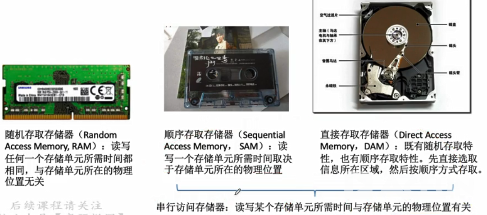
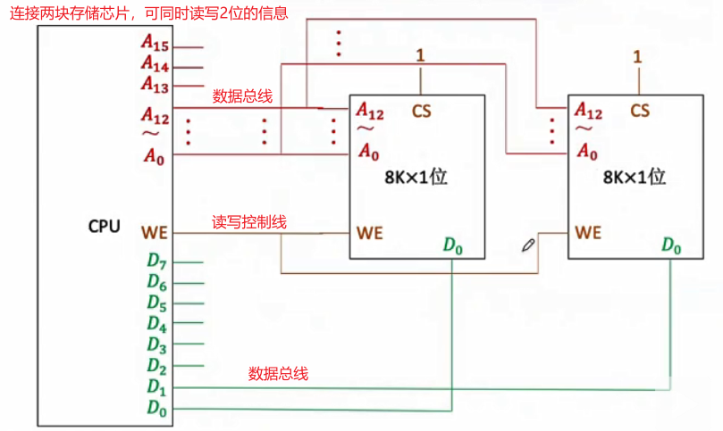
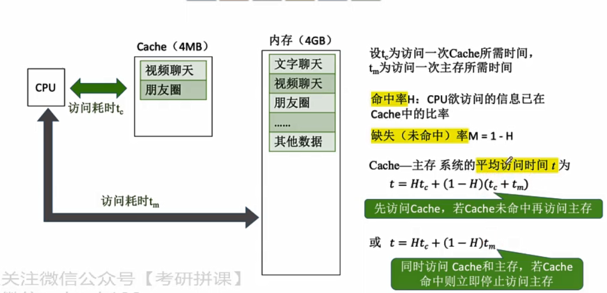

# 计算机组成原理

# 计算机组成结构

机器字长：计算机一次整数运算所能处理的二进制数。（8位平台、32位平台、64位平台等）

## 冯·诺依曼结构

计算机的运算程序过程最先是通过工作人员手动接线来控制计算机计算过程的（编程——编辑运算过程）；针对手动操作的弊端，冯·诺依曼后来提出“存储程序”的概念。

**“存储程序”：**将指令以二进制代码的形式事先输入到计算机主存储器中，然后按其在存储器中的首地址执行程序的第一条指令，以后就按照该程序的规定顺序执行其他指令， 直至程序执行结束。

第一台采用冯·诺依曼结构的计算机——EDVAC（electronic discrete variable automatic computer，离散变量自动电子计算机），其结构如下：

1. 输入设备：其作用是将数据输入到计算机中，数据包含数学运算的数据和程序（指令集合）；输入设备另一个作用是将输入的数据转换为计算机能识别的形式——**机器码**（机器码 machine code，学名`机器语言指令`，有时也被称为`原生码（Native Code）`，是电脑的CPU可直接解读的数据(计算机只认识0和1)，**用机器语言编写程序，编程人员要首先熟记所用计算机的全部指令代码和代码的含义**）。
2. 运算器：运算器既用来运算也用来中转，其接收输入设备转换后的数据并将数据转运待存储器里存储，其也可以读取存储器里的数据并执行运算。
3. 输出设备：将运算器运算后的结果输出，将结果转为人所熟悉的。
4. 控制器：通过电信号来控制协调其它部件间的相互配合，也负责解析存储器里存储的程序指令，根据程序指令来指挥运算器进行运算。
5. 为什么说计算机系统中软件和硬件在逻辑上等效？对于同一功能，既可以通过软件来实现也可以通过硬件来实现，通过软件实现其实还是操作硬件的相关功能来实现。

**冯·诺依曼计算机的特点：**

1. **计算机硬件系统组成：由运算器、存储器、控制器、输入设备和输出设备5大部件组成。**
2. 指令和数据以同等地位存于存储器内，并可按地址寻访。
3.  指令和数据均用二进制代码表示。 
4.  指令由操作码和地址码组成，操作码用来表示操作的性质，地址码用来表示操作数 在存储器中的位置。
5.  指令在存储器内按顺序存放。通常，指令是顺序执行的，在特定条件下，可根据运算结果或根据设定的条件改变执行顺序。 
6. **早期的冯·诺依曼机以运算器为中心**，输入/输出设备通过运算器与存储器传送数据。

## 现代计算机结构

现代计算机结构——以存储器为中心，使运算器只专注于运算。

以上结构的简化：

## 硬件工作原理

**1、主存储器：**

主存储器由存储体、MAR、MDR组成：

1. Memory Adress Register 存储地址寄存器：**地址的临时存储器**，CPU读取/写入数据时需要先将地址写入MAR。
2. Memory Data Register 存储数据寄存器：**数据的临时存储器**。CPU读取数据时主存储器会根据MAR的地址取出CPU请求访问的数据并写入到MDR中，然后CPU即可从MDR中读取到请求访问的数据；CPU写入数据时会将数据写入到MDR、数据存储地址写入到MAR并通过控制总线发出写指令，然后主存储器就会将数据存储到存储体中的指定位置。
3. 存储体：数据在存储体内按地址存储。

存储单元：

- 存储体内分为一个个的存储单元，用于存放一串二进制代码，存储的这一串二进制代码被称为存储字。
- 存储单元内存储的二进制代码的位数则称之为存储字长（存储字节的长度，1byte=8bit，字长的单位为bit）。
- 存储单元都有一个与之对应的地址信息，地址从0开始。
- 存储单元内分为一个个存储元——即存储二进制的电子元件（一般为电容），每个存储元为1bit；存储元加上线路就构成了存储单元。

（注：现在的MAR、MDR通常都集成在CPU中）

**2、运算器：**核心是ALU（Arithmetic and Logic Unit）—— 算术逻辑单元

**3、控制器：**

## 程序执行过程

程序执行过程示例：

- 编译器将程序编译为机器码，编译后装入主存中。（CPU会根据操作码和地址码对数据进行操作）
- 程序执行：（取数指令的执行过程，2-4是取指令，5是分析指令，6-8是执行取数指令）
  1. 初：(PC)= 0，将0地址的指令取出。
  2. (PC) → MAR，PC通过地址总线将地址传到MAR中，MAR=0，控制器会通过控制总线告诉主存储器进行读操作。
  3. (MAR) → MDR，主存储器根据MAR内地址从存储体里找到相应位置的指令并放到MDR，(MDR) = 000001 0000000101。
  4. (MDR) → IR，主存储器通过数据总线将MDR的指令传到指令寄存器IR中，(IR) =  000001 0000000101。
  5. OP(IR) → CU，IR中指令的操作码将会被送到逻辑控制单元CU中，CU将对操作码进行分析，然后知道是“取数”指令。
  6. Ad(IR) → MAR，指令的地址码传到MAR，导致(MAR)=5。
  7. M(MAR) → MDR，主存储器根据MAR中地址取出数据放到MDR中，(MDR)=0000000000000010=2。
  8. M(MDR) → ACC，CU控制下将MDR数据传送到累加寄存器中，(ACC)=0000000000000010=2。

操作码对应的操作已经定义好的。取指令完成后，PC就会自动加1，指向下一条需要执行的指令，然后执行过程和上面的取数指令过程类似，(PC)=1，(ACC)=2：（乘法指令的执行过程，2-3是取指令，4是分析指令，5-9是执行乘法指令，分析指令前基本都差不多的）

1. (PC)=1。
2. (PC) → MAR，(MAR)=1。
3. (MDR) → IR，(IR) =  000100 0000000110。
4. OP(IR) → CU，IR中指令的操作码将会被送到逻辑控制单元CU中，CU将对操作码进行分析，然后知道是“乘法”指令。
5. Ad(IR) → MAR，指令的地址码传到MAR，导致(MAR)=6。
6. M(MAR) → MDR，主存储器根据MAR中地址取出数据放到MDR中，(MDR)=0000000000000011=3。
7. (MDR) → MQ，(MQ)=3。
8. (ACC) → X，导致(X)=0000000000000010=2。
9. (MQ) * (X) → ACC，由ALU实现乘法运算，导致(ACC)=6，如果乘积太大则需要MQ辅助存储。

取指令完成后，PC就会自动加1，(PC)=2，(ACC)=6：（加法指令的执行过程，2-3是取指令，4是分析指令，5-8是执行加法指令）

1. (PC)=2。
2. (PC) → MAR，(MAR)=2。
3. (MDR) → IR，(IR) =  000011 0000000111。
4. OP(IR) → CU，IR中指令的操作码将会被送到逻辑控制单元CU中，CU将对操作码进行分析，然后知道是“加法”指令。
5. Ad(IR) → MAR，指令的地址码传到MAR，导致(MAR)=7。
6. M(MAR) → MDR，主存储器根据MAR中地址取出数据放到MDR中，(MDR)=0000000000000001=1。
7. (MDR) → X，导致(X)=0000000000000001=1。
8. (ACC) + (X) ，由ALU实现加法运算，导致(ACC)=7。

取指令完成后，PC就会自动加1，(PC)=3，(ACC)=7：

1. (PC)=3。
2. (PC) → MAR，(MAR)=3。
3. M(MAR) → MDR，(MDR)=000010 0000001000。
4. (MDR) → IR，(IR) =  000010 0000001000。
5. OP(IR) → CU，IR中指令的操作码将会被送到逻辑控制单元CU中，CU将对操作码进行分析，然后知道是“存数”指令。
6. Ad(IR) → MAR，指令的地址码传到MAR，导致(MAR)=8。
7. (ACC) → MDR，(MDR)=7。
8. CU通过控制总线告诉主存储器进行写操作，(MDR) → 地址为8的存储单元，最终得到y=7。

取指令完成后，PC就会自动加1，(PC)=4：

1. (PC)=4。
2. (PC) → MAR，(MAR)=4。
3. M(MAR) → MDR，(MDR)=000110 0000001000。
4. (MDR) → IR，(IR) =  000110 0000001000。
5. OP(IR) → CU，IR中指令的操作码将会被送到逻辑控制单元CU中，CU将对操作码进行分析，然后知道是“停机”指令。
6. （利用中断机制通知操作系统终止该进程）

总结：无论执行什么指令，前面的取指令和分析指令过程是固定的，分析指令执行后的后续操作由CU控制单元来控制。

CPU区分指令和数据的依据：指令周期的不同阶段。（现在的MAR、MDR通常都集成在CPU中）

## 计算机系统的层次结构

计算机的五层结构：

三个级别的语言：

注：编译、汇编、解释程序，可以统称为“翻译程序”。

《计算机体系结构》：机器语言程序员所见到的计算机系统的属性概念性的结构与功能特性。（探讨指令系统、数据类型、寻址技术、I/O机理）

《计算机组成原理》：实现计算机体系结构所体现的属性，对程序员“透明”。（探讨具体指令的实现）

## 计算机性能指标

**1、度量存储器的指标：**存储器容量

MAR位数反应存储单元个数。MDR位数=存储字长=每个存储单元的大小。

存储器总容量 = 存储单元个数 $*$ 存储字长 bit= 存储单元个数 $ * $ 存储字长/8 byte  。

例如：MAR为32位，MDR为8位，那么总容量 = $2^{32}*8 $  bit= 4 GB。

**2、CPU性能指标：**

CPU主频（时钟频率）：CPU内数字脉冲信号震荡的频率（每一个脉冲信号周期则称为CPU时钟周期，单位微秒、纳秒）。（可以理解为CPU指挥计算机内所有固件一步一步工作的节奏）

CPI（Clock cycle Per Instruction）：执行一条指令所需要的时钟周期数。

$执行一条指令所需时间 = CPI * CPU时钟周期$。

$CPU执行时间(整个程序执行耗时)=CPU时钟周期数/主频=(指令条数*CPI)/主频$

IPS（Instructions Per Second）：每秒执行多少条指令。（$IPS=\frac{主频}{平均CPI}$）

FLOPS（Floating-point Operations Per Second）：每秒执行多少次浮动运算。

**3、系统整体性能的指标：**

数据通路带宽：数据总线一次所能并行传送信息的位数。（各硬件部件都是通过数据总线来传输数据的）

吞吐量：指系统在单位时间内处理请求的数量。 它取决于信息能多快地输入内存，CPU能多快地取指令，数据能多快地从内存取出或存入，以及所得结果能多快地从内存送给一台外部设备。这些步骤中的每一步都关系到主存，因此系统吞吐量主要取决于主存的存取周期。

 响应时间：指从用户向计算机发送一个请求，到系统对该请求做出响应并获得它所需 要的结果的等待时间。 通常包括CPU时间（运行一个程序所花费的时间）与等待时间（用于磁盘访问、存储 器访问、I/O操作、操作系统开销等时间）。

# 运算器—数据的表示和运算

计算机内数与字符的表示

计算机内数的运算

计算机内数的运算的具体实现原理

# 存储器—存储系统

## 结构、分类、指标

**存储器结构层次**

CPU读写速度很快，如果其它存储器速度跟不上那就会拖累CPU的读写速度。（木桶效应）

主存的读取速度与CPU的还是有点差距，加上一层高速缓冲存储器来提高读取速度，频率访问的数据会被复制放到Cache来，这样CPU直接访问Cache的副本即可。（Cache也是为了缓解CPU与主存的速度矛盾；缓存就是数据交换的缓冲区（称作Cache），是存贮数据（使用频繁的数据）的临时地方。）

寄存器：

- 含义：寄存器是**CPU内部用来存放数据的一些小型存储区域**，用来暂时存放参与运算的数据和运算结果。其实寄存器就是一种常用的时序逻辑电路，但这种时序逻辑电路只包含存储电路。
- 功能：用于存储二进制代码，寄存器是由具有存储功能的触发器组合起来构成的。一个触发器可以存储1位二进制代码，故存放n位二进制代码的寄存器，需用n个触发器来构成。

**存储器分类**

分类——按层次分：

分类——按存储介质分：

1. 半导体存储器。（主存、Cache）
2. 磁表面存储器。（磁盘磁带）
3. 光存储器。（光盘）

分类——按存取方式分：

分类——按信息的是否可改变分：

1. 读写存储器，Read/Write Memory，可读写。（磁盘、内存、Cache）
2. 只读存储器，Read Only Memory，只读。

分类——按信息的可保存性。

**存储器性能指标**

存储容量：存储字数乘以字长。

单位成本：总成本除以总容量。

存储带宽：数据宽度除以存储周期。

## 主存底层组成

**1、半导体元器件存储存储二进制0和1的原理：**

主存基本结构如下：

主存基本上由存储体加两个寄存器组成，通过时序逻辑控制可以使它们之间相互配合地进行工作。

存储体是用来存储具体二进制数据的地方，存储体由一个个存储元组成，一个个存储元构成一个存储体（存储矩阵）。 

存储元的电路基本构造如下：

MOS管可以理解为一种电控开关，当输入电压达到某个阈值时其就可以导通。电容可以用来存放电荷，可以根据电容是否存放电荷来表示0和1。

- 写入：MOS管A端加上合适的电压使MOS管可以导通，当在B端加上一个电压时就会使电容充电，那么就写入了1。
- 读出：MOS管A端加上合适的电压使MOS管可以导通，然后在B端检测是否有输出电流，就能知道电容保存的是0还是1。（疑问：如果读出时电容的电荷都放完了，那得靠什么来判断、补充，以便保留原来的状态？）

存储体（存储矩阵）：

多个存储元（至于是多少个由平台决定）组成一个存储单元，存储单元组成一个存储体。如上图，红色线都连接了MOS管，当给这条线接入适合电压时MOS管将导通，然后通过检查绿色线的电流就可以判断每一条线所对应的二进制数是0还是1，这样就可以读出一整行的存储元的信息，就是读出一个存储单元的存储字（存储字就是整个存储单元存储的东西，存储字长度就是对应存储单元里的多少个存储元存储的bit的总和）。

**2、存储芯片的基本原理：**

如何根据地址来决定读写哪个？

1、读出指定地址的数据：通过地址总线往MAR输入三个电信号，通过译码器译码决定读取哪个存储单元，会给指定的字选线输出一个高电平信号使MOS管导通，就可读出每一位的信息，然后通过数据线将信息转存到MDR，最后CPU会通过数据总线从MDR取走数据。

2、控制电路：用于控制MAR、译码器、MDR。使用电信号来传送二进制数据，为了避免电信号的不稳定时造成的影响，使用控制电路来控制MAR，当电路稳定时MAR的数据才能送往译码器，即电路稳定后译码器才会工作。同理，输出时当电信号稳定时MDR才能给数据总线输出数据。

3、片选线：芯片开关。

4、读、写控制线：用来控制读操作与写操作。

上述结构封装：

**3、寻址的实现：**

现代计算机通常按字节编址，即每个字节对应一个地址。1KB容量的存储矩阵，那么需要10根地址线才能为所有的字节都编上一个地址。

## RAM

SRAM和DRAM存储芯片：Dynamic Random Access Memory —— 动态RAM；Static Random Access Memory —— 静态RAM。

SRAM用于主存，DRAM用于Cache。

SRAM使用的是栅极电容，DRAM使用的是双稳态触发器。

双稳态触发器数据的读出与写入：

- 读出：字选数据线高电平，如果双稳态触发器存储的是1，那么A高B低；如果存储的是0，那么A低B高。根据BL、BLX数据线哪个输出低电平就可读取0或1。
- 写入：字选数据线高电平，给BL输入低电平、BLX输入高电平，那么就是存储0；BL输入高、BLX输入低那就是存储1。

栅极电容存储元和双稳态触发器存储元的特点：

- 栅极电容存储元：每个存储元制造成本更低，集成度高（单位体积内可集成的数量更多），功耗低。
- 双稳态触发器存储元：每个存储元制造成本更高，集成度低（单位体积内可集成的数量更少），功耗大。

DRAM的刷新：

3.如何刷新？有硬件支持，读出一行的信息后重新写入，占用1个读写周期。

4.何时刷新？

现在的计算机主存基本都是SDRAM，比如DDR4等。

## ROM

RAM芯片，易失性芯片，断电后数据消失。ROM芯片，非易失性芯片，断电后数据不会丢失。

BIOS芯片：

## 存储器与CPU的连接

CPU与单块存储芯片的连接：CPU → 译码器 → 存储芯片，地址总线、数据总线。

CPU与多存储芯片的连接：位拓展、字拓展、位与字同时拓展。

**CPU与单块存储芯片的连接**

**CPU与多存储芯片的连接**

CPU如何与存储器进行连接？

1、位拓展：

从一地址1位到一地址8位，8K个地址→ $8K * 8bit = 8K * 1byte = 8Kb$。

2、字拓展：连接n位的存储芯片。

线选法：

译码片选法：

字位同时拓展：

## 双口RAM&多模块存储器

存储器与CPU的连接访问速度优化——双口RAM&多模块存储器——优化读写速度。

解决策略：

双端口RAM：解决多核访问。

多模块存储器：提高访问连续空间的访问速度。

为什么探讨的是“连续访问”的情况？因为实际中程序指令、数组等都是连续存放于主存中。

双通道，就是插入内存，实现低位交叉的多体存储器。（插进颜色相同的内存卡槽里）

## Cache

双端口RAM、多模块存储器都可以提高存储器工作速度，但优化后和CPU的差距还是很大，利用局部性原理在主存和CPU之间加上Cache来缓和CPU和主存之间的速度矛盾。（实际上Cache用SRAM实现，被集成在CPU中）

Cache有效工作的依据——局部性原理：

- 空间局部性：在**最近的未来**要使用到的信息（指令和数据），很可能是**与现在正在**使用的信息在存储空间上相邻的。（现在访问的地址，其附近地址可能即将被访问到）
- 时间局部性：在**最近的未来**要使用到的信息（指令和数据），很可能是**现在正在**使用的信息。（现在访问的地址，不久之后可能再次被访问）
- （基于这两个局部性，那么当前访问地址的周围的数据可能是未来需要使用到的数据）。

基于局部性原理，可以把CPU目前访问的地址“周围”的部分数据放到（复制到）Cache中。

性能分析——使用Cache后的CPU访问时间：

如何限定“周围”？块与行的概念的引出：

每次被访问的主存块，一定会被立即调入Cache。

1. 如何区分Cache与主存的数据块对应关系？—— Cache和主存的映射关系
2. Cache存储空间很小，如果满了咋办？—— 替换算法
3. CPU修改了Cache中的数据副本，如何确保主存中数据与母本的一致性？—— Cache写策略

### Cache和主存的映射关系

全相联映射：

直接映射：

如上，标记都用整个主存块号来充当，那么是否可以优化标记？可以，`主存块在Cache中的位置 = 主存块号 % Cache总块数`，即$2^{22}％2^3$，相当于留下最后三位二进制数就可以代表了主存块在Cache中的位置，那么就可以截取主存块号的最后三位来判断出位置，其它的19位用于标记，就达到了简化标记的目的。

组相联映射：

组映射访问：

三种映射关系的优缺点：

1. 全相联映射：Cache存储空间利用充分 ，命中率高，缺点是可能需要对比所有的标记。
2. 直接映射：对于任意一个地址只需要对比一个标记，速度快，缺点是Cache存储空间利用不充分，命中率低。
3. 组相联映射：综合效果最好，另外两种方式的折中。

### 替换算法

替换触发：

1. 全相联映射：整个Cache满了才会触发替换，随机替换Cache中某一块。
2. 直接映射：对应位置非空时就会直接替换。（无需考虑替换算法）
3. 组相联映射：分组内满了才会需要替换，需要在分组内选择替换哪一块。

随机算法：Cache满了，随机找一块进行替换。

先进先出算法：若Cache已满，则最先放到Cache中的最先被替换。（可能会出现刚被替换的块很快又被调入）

近期最少使用算法（Least Recently Used）：近期最少被访问的就先被替换（每次访问Cache时都会为其它的非空Cache块的计数器加1，而被访问的这个块则清0，这样最大的那个就是近期最少被访问的，就会优先被替换）。

最不经常使用算法（Least Frequently Used）：近期最少被访问的就先被替换（也是为每个Cache块设立计数器，只不过计数器用来记录被访问的次数，当Cache满后次数最少的则最先被替换，如果有多个计数器最小的行，那么有先进先出、按行号递增这两种方式决定哪个被替换）。（不完全遵循局部性原理，曾经经常访问的未来不一定会用到）

### Cache写策略

Cache写策略：

1. 写命中：全写法、写回法。
2. 写不命中：写分配法、非写分配法。

写回法（write-back）：当CPU对Cache写命中时，只修改Cache中的内容而不立刻写入主存，只有当此块被替换时才写会主存。（存在数据不一致的隐患）

全写法（write-through）：当CPU对Cache写命中时，必须把数据同时写入Cache和主存，一般使用写缓冲（write buffer）。（访存次数增加，速度变慢，但更能保证数据一致性）（写缓冲是SRAM实现的FIFO队列，CPU写命中时也会往写缓冲写入一个数据，有专门的控制电路将写缓冲的数据逐一写入到主存中）（写操作频繁时写缓冲会导致阻塞）

写分配法（write-allocate）：当CPU对Cache写不命中时，把主存的块调入Cache中，在Cache中修改。通常搭配写回法进行使用。

非写分配法（not-write-allocate）：当CPU对Cache写不命中时只写入主存，不调入Cache。常搭配全写法使用。

现代计算机的Cache：

## 页式存储器

## 虚拟存储器

# 控制器—指令系统

指令（又称机器指令）： 

- 是指示计算机执行某种操作的命令， 是计算机运行的最小功能单位，是一组有意义的二进制代码。 
- 一台计算机的所有指令的集合构成该机的指令系统，也称为指令集。
-  注：一台计算机只能执行自己指令系 统中的指令，不能执行其他系统的指

X86架构（Intel，PC端常用）和ARM架构（ARM公司，移动端常用）。

## 指令格式

指令组成——操作码（操作）和地址码（操作对象）。

# CPU—中央处理器

# 总线

# 输入输出系统

