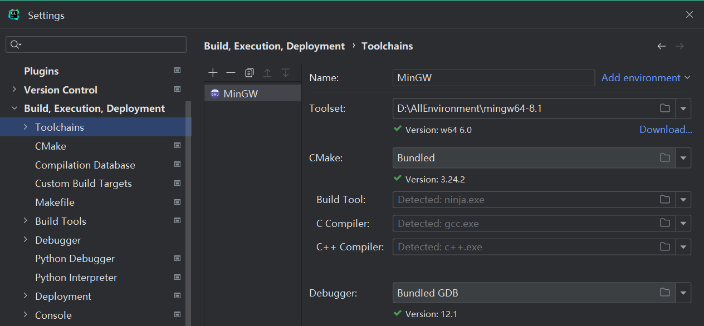

# CLoin

使用CLoin来开发Cube MX项目。

## 环境准备

MinGW：[MinGW-w64 - for 32 and 64 bit Windows - Browse /mingw-w64/mingw-w64-release at SourceForge.net](https://sourceforge.net/projects/mingw-w64/files/mingw-w64/mingw-w64-release/)

OpenOCD：[Download OpenOCD for Windows (gnutoolchains.com)](https://gnutoolchains.com/arm-eabi/openocd/)

交叉编译工具链arm-eabi-gcc：[Downloads | GNU Arm Embedded Toolchain Downloads – Arm Developer](https://developer.arm.com/downloads/-/gnu-rm)

下载好后配置环境变量：MinGW64的bin目录、OpenOCD 的bin目录、交叉编译工具链的arm-none-eabi目录里的bin目录。

## CLoin环境准备

1、toolchains：

2、安装OpenOCD插件。

# 快捷键

| **尚硅谷·宋红康 设置版** |                                                            |                                                        |
| ------------------------ | ---------------------------------------------------------- | ------------------------------------------------------ |
| **1**                    | **执行\****(run)**                                         | **alt+r**                                              |
| **2**                    | **提示补全**  **(Class Name Completion)**                  | **alt+/**                                              |
| **3**                    | **单行注释**                                               | **ctrl + /**                                           |
| **4**                    | **多行注释**                                               | **ctrl  + shift + /**                                  |
| **5**                    | **向下复制一行** **(Duplicate  Lines)**                    | **ctrl+alt+down**                                      |
| **6**                    | **删除一行或选中行** **(delete  line)**                    | **ctrl+d**                                             |
| **7**                    | **向下移动行\****(move statement down)**                   | **alt+down**                                           |
| **8**                    | **向上移动行\****(move  statement up)**                    | **alt+up**                                             |
| **9**                    | **向下开始新的一行\****(start  new line)**                 | **shift+enter**                                        |
| **10**                   | **向上开始新的一行**  **(Start New Line before  current)** | **ctrl+shift+enter**                                   |
| **11**                   | **如何查看源码**  **(class)**                              | **ctrl +** **选中指定的结构 或**  **ctrl + shift + t** |
| **12**                   | **万能解错\****/生成返回值变量**                           | **alt  + enter**                                       |
| **13**                   | **退回到前一个编辑的页面** **(back)**                      | **alt + left**                                         |
| **14**                   | **进入到下一个编辑的页面\****(针对于上条) (forward)**      | **alt + right**                                        |
| **15**                   | **查看继承关系\****(type hierarchy)**                      | **F4**                                                 |
| **16**                   | **格式化代码\****(reformat code)**                         | **ctrl+alt+L**                                         |
| **17**                   | **提示方法参数类型\****(Parameter Info)**                  | **ctrl+alt+/**                                         |
| **18**                   | **复制代码**                                               | **ctrl  + c**                                          |
| **19**                   | **撤销**                                                   | **ctrl  + z**                                          |
| **20**                   | **反撤销**                                                 | **ctrl  + y**                                          |
| **21**                   | **剪切**                                                   | **ctrl  + x**                                          |
| **22**                   | **粘贴**                                                   | **ctrl  + v**                                          |
| **23**                   | **保存**                                                   | **ctrl  + s**                                          |
| **24**                   | **全选**                                                   | **ctrl  + a**                                          |
| **25**                   | **选中数行，整体往后移动**                                 | **tab**                                                |
| **26**                   | **选中数行，整体往前移动**                                 | **shift  + tab**                                       |
| **27**                   | **查看类的结构：类似于**  **eclipse** **的** **outline**   | **ctrl+o**                                             |
| **28**                   | **重构：修改变量名与方法名\****(rename)**                  | **alt+shift+r**                                        |
| **29**                   | **大写转小写\****/小写转大写(toggle case)**                | **ctrl+shift+y**                                       |

