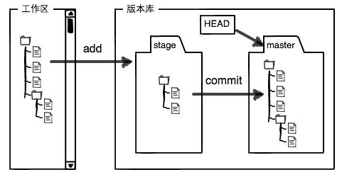

# Git

**简单介绍：**

Git —— 分布式版本控制系统，由Linux用C语言创建的。

集中式版本控制与分布式版本控制：

- 集中式版本控制有一个中央服务器，提交代码或下载代码需要联网。（例如SVN）
- 分布式版本控制，可以有中央服务器，只是用来方便交换，每一台电脑都相当于一个版本库。（例如Git）

学习目标：

- 结构。
- 基本使用。
- 多人协同。

学习资料：[Git教程 - 廖雪峰 (liaoxuefeng.com)](https://www.liaoxuefeng.com/wiki/896043488029600)

**安装与配置：**

下载：[Git - Downloads (git-scm.com)](https://git-scm.com/downloads)，默认形式安装。

安装完成后运行Git Bash，出现类似命令行的窗口则安装完成，然后在显示的窗口进行设置全局信息：

1. `git config --global user.name "Your Name"`：设置全局用户名。
2. `git config --global user.email "email@example.com"`：设置全局email地址。
3. 注意`git config`命令的`--global`，表示你这台机器上所有的Git仓库都会使用这个配置，也可以对某个仓库指定不同的用户名和Email地址，指定的方法——进入要单独设置的仓库的.git文件夹后运行下面的命令：

   - `git config user.name "Your Name"`。

   - `git config user.email "email@example.com"`。


查看用户名和email地址：

- `git config user.name`
- `git config user.email`

查看配置：

- `git config --system --list`：查看系统配置
- `git config --global --list`：查看当前用户(global)全局配置
- `git config --local --list`：查看仓库配置信息

# 结构



- 工作区（Working Directory）：当将某目录初始化为仓库时，该目录就成为了一个工作区。

- 版本库（Repository）：工作区中的隐藏目录`.git`，就是Git的版本库。


版本库中存了很多东西，其中最重要的就是称为stage（或者叫index，暂存区就是.git目录下的index目录）的暂存区，还有Git为我们自动创建的第一个分支`master`，以及指向`master`的一个叫`HEAD`的指针。

Git使用的基本流程：

1. `git init `：仓库初始化，当前目录就会成为一个Git仓库，目录下的`.git`就是版本库。
2. `git add xxx`：添加文件，文件会添加到暂存区。
3. `git commit xxx`：提交文件，文件会提交到所在分支上，默认是在master分支上操作，那就是提交到master分支。
4. `git push xxx xxx分支`：将某分支推送到远程。

# 基本使用

## 0.创建版本库

| 命令            | 说明             |
| --------------- | ---------------- |
| `git clone url` | 克隆远程版本库   |
| `git init`      | 初始化本地版本库 |

## 1.状况查看

查看版本库情况:

| 命令                | 说明                                         |
| ------------------- | -------------------------------------------- |
| `git status`        | 查看版本库状态                               |
| `git diff [file]`   | 查看变更内容，注意是版本库中的与工作区的对比 |
| `git diff --staged` | 比对已暂存文件与最后一次提交的文件差异       |
| `git diff --cached` | 查看已经暂存起来的变化                       |
| `cat file`          | 显示文件全部内容                             |
| `git ls-files `     | 查看提交到了版本仓库中的文件                 |

## 2.忽略文件

>在工程中，并不是所有文件都需要保存到版本库中的，例如“target”目录及其目录下的文件就可以忽略。
>
>在Git工作区的根目录下创建一个特殊的.gitignore文件，然后把要忽略的文件名填进去，Git就会自动忽略这些文件或目录。

仓库目录下新建`.gitignore`文件。

```ini
*.[oa]
*~
*.txt
```

> 第一行告诉 Git 忽略所有以 `.o` 或 `.a` 结尾的文件。
>
> 第二行告诉 Git 忽略所有名字以波浪符（~）结尾的文件。
>
> 第三行告诉 Git 忽略所有名字以后缀（.txt）结尾的文件。

```bash
# 忽略所有的 .a 文件
*.a

# 但跟踪所有的 lib.a，即便你在前面忽略了 .a 文件
!lib.a

# 只忽略当前目录下的 TODO 文件，而不忽略 subdir/TODO
/TODO

# 忽略任何目录下名为 build 的文件夹
build/

# 忽略 doc/notes.txt，但不忽略 doc/server/arch.txt
doc/*.txt

# 忽略 doc/ 目录及其所有子目录下的 .pdf 文件
doc/**/*.pdf
```

## 3.提交修改

已修改 —— 已暂存 —— 已提交

添加到暂存区：

| 命令                          | 说明                                                         |
| ----------------------------- | ------------------------------------------------------------ |
| `git add .`                   | 添加当前目录下所有修改到暂存区                               |
| `git add --all`、`git add -A` | 会将项目里所有文件的变动都加到暂存区，无论在项目的哪级目录执行，都有同样的效果 |
| `git add file`                | 添加某个修改过的文件到暂存区                                 |

将暂存区的文件添加到本地仓库：

| 命令                            | 说明                                                         |
| ------------------------------- | ------------------------------------------------------------ |
| ` git commit -m "本次提交说明"` | 把文件提交到本地仓库                                         |
| `git commit --amend`            | 将暂存区的提交并合并进上一次没有push的commit<br>可以使用`git commit --amend -m "提交描述"` 修改comment<br>可以使用 -a 把工作区的文件也一起加入 |
| `git commit -a -m "xxx"`        | 自动把所有已经**跟踪过的**文件暂存起来并提交                 |


## 4.日志查看

| 命令                       | 说明                                                         |
| -------------------------- | ------------------------------------------------------------ |
| `git log`                  | 从最近时间开始显示所有的commit历史                           |
| `git log --pretty=oneline` | 将各次的提交记录分别在另一行上显示出来，一行则为一次提交记录 |
| `git log -p file`          | 查看指定文件的提交历史                                       |
| `git blame file`           | 以列表形式查看指定文件的历史                                 |


## 5.版本回退

| 命令                         | 说明                                                         |
| ---------------------------- | ------------------------------------------------------------ |
| `git reset --hard HEAD~`     | 退回当前版本的前一个版本，回退后，原版本提交会被丢失<br>`HEAD`：指当前版本；`HEAD^`、`HEAD~1`：都是指当前版本的前一个版本；`HEAD~n`：回退n次，即回退n个版本 |
| `git reset --hard commit-id` | 使用commit id来指定要回退到哪个版本，日志查看中会显示出commit-id |
| `git reflog`                 | 用于显示曾执行过的历史指令（提交和回退的），这样可以找到版本的commit-id，以便确定要回到哪个版本 |
|                              |                                                              |

```bash
git reset [--soft | --mixed | --hard] xxx

--soft 回退时保留源码，仅仅回退 commit，修改的文件仍然保存在暂存区,再次提交时只需要 git commit
--mixed（默认）回退时保留源码，回退 commit 同时修改的文件会置于 工作区，再次提交时需要 git add
--hard 回退时清除提交的源码（危险操作），源码和commit 都会回滚到某个版本
```


## 6.撤销操作

撤销（unstage）还未提交到暂存区的修改：`git checkout -- file`——丢弃工作区的修改，file为带后缀的文件全名，或者手动撤销。

撤销 git add操作：

| 命令                      | 说明                                  |
| ------------------------- | ------------------------------------- |
| `git reset HEAD file`     | 撤销默认分支下某个文件的 git add 操作 |
| ` git reset HEAD -- file` | 撤销默认分支下某个文件的 git add 操作 |

撤销 git commit操作：

| 命令                  | 说明         |
| --------------------- | ------------ |
| `git revert <commit>` | 撤销指定提交 |

git revert 和 reset 最本质的区别为两点：

1. revert 使用一个新的commit 来回滚你希望回滚的commit， reset 是直接HEAD 指向回退的commit。
2. revert 只会回滚你希望回滚的哪一个commit的操作，不会影响其他的，reset 由于指针回退了，因此这个commit 之后的commit都会消失。

（一般使用时，如果已经push了，使用revert，如果没有，就是用reset）。

**Git中任何已提交的都是可恢复的。**

## 7.文件变动

| 命令                 | 说明                                                         |
| -------------------- | ------------------------------------------------------------ |
| `git rm file`        | 将文件从工作区、版本库中删除（此时暂存区不能存在该文件），并把此次删除的修改git add到暂存区，因此还需要commit |
| `git rm -f file`     | 删除工作区和暂存区中的该文件，并且将这次删除的修改动作记录进暂存区，因此还需要commit |
| `git mv <old> <new>` | 更改工作区文件的文件名，并且更改操作会被提交到暂存区         |

# 多人协同

## 分支

| 命令                                               | 说明                                        |
| -------------------------------------------------- | ------------------------------------------- |
| ~~`git check -b dev `~~                            | ~~**创建并切换**到dev分支~~                 |
| `git switch -c dev`                                | **创建并切换**到dev分支                     |
| `git branch dev`                                   | **创建**dev分支                             |
| ~~`git checkout dev`~~                             | ~~**切换**到dev分支~~                       |
| `git switch master`                                | **切换**到dev分支                           |
| `git branch -d dev`                                | **删除**分支                                |
| `git branch`                                       | **查看**所有分支，当前所在分支前用`*`来标记 |
| `git log --oneline --graph --decorate --all`       | **查看**分支图                              |
| `git log --graph --pretty=oneline --abbrev-commit` | **查看**分支合并情况                        |
| `git log --graph`                                  | **查看**分支合并图                          |
| `git merge dev`                                    | **合并**指定分支到当前分支                  |

分支用来干活的，主分支用来发布版本的。

## 标签

**标签概述：**

1. 标签就相当于版本库的一个快照，实际是指向commit的一个指针（与分支的区别是分支可以移动，而tag不能）。
2. tag就是一个让人容易记住的有意义的名字，它跟某个commit绑在一起。
3. 常用于版本发布时打上标签。

**创建、查看标签：**

| 命令                                   | 说明                                    |
| -------------------------------------- | --------------------------------------- |
| `git tag tagName`                      | 在当前分支创建标签                      |
| `git tag tagName commid-id`            | 使用commit id来打上标签                 |
| `git tag -a <name> -m "..." commit-id` | 为commit id所对应commit创建带说明的标签 |
| `git show tagName `                    | 查看某个标签的信息                      |
| `git tag`                              | 列出所有标签                            |

**【注意】：**

1. 标签不是按时间顺序列出，而是按字母排序的。
2. 标签总是和某个commit挂钩。如果这个commit既出现在master分支，又出现在dev分支，那么在这两个分支上都可以看到这个标签。

**操作标签：**

| 命令                                 | 说明                               |
| ------------------------------------ | ---------------------------------- |
| `git tag -d tagName`                 | 本地标签删除                       |
| `git push origin tagName`            | 推送标签到远程                     |
| `git push origin :refs/tags/tagName` | 先删除本地的标签，然后再删除远程的 |

**小结:**

1. 命令`git push origin <tagname>`可以推送一个本地标签。
2. 命令`git push origin --tags`可以推送全部未推送过的本地标签。
3. 命令`git tag -d <tagname>`可以删除一个本地标签。
4. 命令`git push origin :refs/tags/<tagname>`可以删除一个远程标签。

## 远程

### 1.本地SSH key

在C盘用户主目录下，看看有没有.ssh目录，如果有，再看看这个目录下有没有`id_rsa`和`id_rsa.pub`这两个文件。

如果没有这两个文件，进入.ssh目录执行`ssh-keygen -t rsa -C "youremail@example.com`生成SSH key。

### 2.远程仓库添加SSH key

在GitHub或Gitee添加SSH key，key内容就是`id_rsa.pub`文件的内容。

### 3.远程库建立

在GitHub或Gitee创建好仓库。

### 4.本地关联远程

创建好本地版本库或者从远程版本库克隆到本地。

1. `git remote add origin 远程库ssh地址`：关联远程库。（origin可以看做是后面仓库链接的一个替代词，push时可通过该代名词来push。）
2. `git remote -v`：查看当前仓库所关联的远程版本库链接。
3. `git remote rm origin`：删除与远程版本库的origin链接。
4. `git remote show origin`：查看远程版本库信息。

### 5.版本库提交与更新

| 命令                              | 说明                                                         |
| --------------------------------- | ------------------------------------------------------------ |
| `git push -u origin master`       | 推送主分支到远程版本库                                       |
| `git pull`、`git pull origin`     | 更新操作，将远程版本库拉取到本地库合并来完成更新             |
| `git pull origin master:brantest` | 将远程主机 origin 的 master 分支拉取过来，与本地的 brantest 分支合并 |

## 技巧

1. `git commit --amend`：新提交合并进上一次提交。
2. `git cherry-pick commit-Hash、分支名`：将某个提交或者某个分支的最新提交应用到当前分支。
3. `git rebase -i `：
4. `git rebase branch`
5. `git rebase --abort`：撤销rebase操作。


