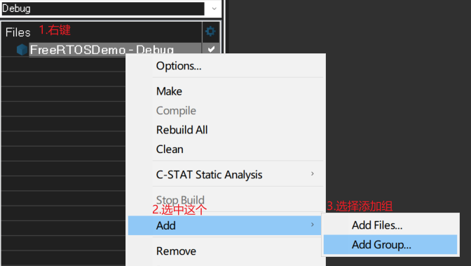
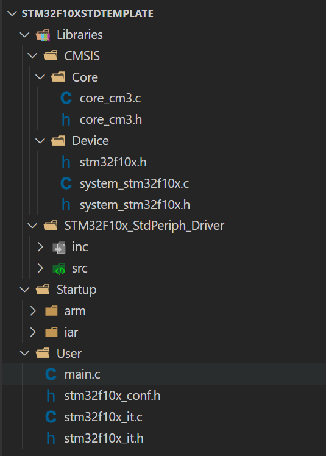
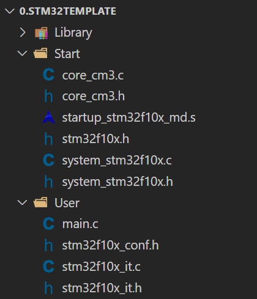
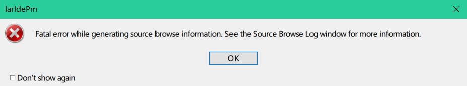

# IAR的安装

安装，注册。默认安装，更改一下安装路径即可，安装中的"USB driver"也可以勾选上。

# 项目创建流程

**0、新建工作空间，创建项目。**

先创建一个目录——`IARworkspaces`，用于当作工作空间，在该目录下创建项目目录，将项目所需的文件都放在该目录里面，里面可以创建一个`Project`目录，用于存放工作空间文件和项目工程文件。

接着打开IAR，选择 File → New Workspace 建立好工作空间，然后通过 File → Save Workspase As...  保存到Project目录下，名字就设为项目目录一样的。

然后 Project → Create New Project，选择Empty project，再点OK，仍然保存到Project，保存名字也是和项目目录名称一致。

项目创建完毕。

**1、移植固件库。**

先将所需的库文件都放进项目目录里。

接着在IAR中为项目创建好组，再为每个组添加固件库源码文件即可。



**2、项目配置。**

先选中`FreeRTOSDemo-Debug`，点击右键选择Options（从Project → Options打开也可）的打开配置面板，需要进行以下操作：

- 芯片选择：在General Options → Target → Device 选好使用的芯片型号（STM32F103C8），然后 General Options → Library Configuration 里勾上Use CMSIS5.7。
- 配置头文件目录和全局宏：C/C++Compiler → Preprocessor里，配置头文件目录（为了在include时不用加上路径）和定义全局宏。
- Linker里勾上`Override default`，并且选好.icf文件。
- 调试器配置：Debugger → Setup 里的Driver选择使用的调试器（我是ST-LINK），再在Download里将`Verify download`勾上。

**3、编译。**

点击make进行编译。

**4、烧录~测试。**

# STM32F10x固件库

下载标准外设库：[STM32标准外设软件库 - 意法半导体STMicroelectronics](https://www.st.com/zh/embedded-software/stm32-standard-peripheral-libraries.html)

最后的版本是3.6，标准库已经不再更新了，官方整HAL库去了。

**下载STM32F10x的v3.5版本，目录结构：**

```
STM32F10x_StdPeriph_Lib_V3.5.0:
├──Libraries
|  └──CMSIS
|  |  └─CM3
|  |    └─CoreSupport
|  |      └─DeviceSupport
|  |        └─ST
|  |          └─STM32F10x
|  |            └─startup
|  |              ├─arm
|  |              ├─gcc_ride7
|  |              ├─iar
|  |              └─TrueSTUDIO
|  └──STM32F10x_StdPeriph_Driver
|     ├─inc
|     └─src
├──Project
│  ├─STM32F10x_StdPeriph_Examples
│  └─STM32F10x_StdPeriph_Template
├──Utilities
   └─STM32_EVAL
```

**STM32F10x固件库文件分析：**

文件分类：启动文件、外设相关文件、内核相关文件、用户相关文件。

1、启动文件：

> 在STM32F10x_StdPeriph_Lib_V3.5.0\ **Libraries\CMSIS\CM3\DeviceSupport\ST\STM32F10x\startup**下的目录中，其中arm目录下的可用于Keil平台下开发，iar目录里的可用于IAR开发平台下进行开发。

2、外设相关：

> 在STM32F10x_StdPeriph_Lib_V3.5.0\ **Libraries\CMSIS\CM3\DeviceSupport\ST\STM32F10x**目录下的`stm32f10x.h`、`system_stm32f10x.c`、`system_stm32f10x.h`，第一个是外设寄存器定义文件，后面两个是用于系统初始化和配置时钟的文件；
>
> 在STM32F10x_StdPeriph_Lib_V3.5.0\ **Libraries\STM32F10x_StdPeriph_Driver**目录下的inc目录和src目录里的stm32f103x_xxx.h和stm32f103x_xxx.c文件，是外设固件库的头文件和源代码文件，如GPIO、ADC、SPI、I2C等外设的。

3、内核相关：

> 在STM32F10x_StdPeriph_Lib_V3.5.0\ **Libraries\CMSIS\CM3\CoreSupport**目录里的core_cm3.h头文件用于内核寄存器的定义，core_cm3.c源代码文件用于控制内核外设的相关函数，这些函数我们用得很少；
>
> 在STM32F10x_StdPeriph_Lib_V3.5.0\ **Libraries\STM32F10x_StdPeriph_Driver**目录下的ins目录和src目录里的misc.h和misc.c文件则是NVIC和SysTick相关的函数定义有关的。

4、用户相关：

> 在STM32F10x_StdPeriph_Lib_V3.5.0\ **Project\STM32F10x_StdPeriph_Template**目录里的main.c文件即是main函数所在的文件，stm32f10x_it.c、stm32f10x_it.h则是用户编写的中断服务函数所在文件；stm32f10x_conf.h则是一个用于配置的头文件，当使用某个外设库时需要通过`#include `导入这些外设库的头文件，为了方便，ST就设置了一个stm32f10x_conf.h头文件，里面通过`#include`包含了所有外设库的头文件，但是都注释掉了，需要用到哪个外设库文件就解除注释，再在需要的地方`#include stm32f10x_conf.h`即可，就不需要一个一个地去`#include`外设库头文件。

**抽离固件库文件：**

创建一个`Stm32F10xStdTemplate`文件夹，里面包含这些目录和文件（参照标准库目录结构设计）：（如果是在IAR下进行开发，通常创建一个Config目录，用于存放`STM32F10x_StdPeriph_Lib_V3.5.0\Project\STM32F10x_StdPeriph_Template\EWARM `下的所有.icf文件，这个.icf文件是用于配置IAR工程的Linker的，需要使用这个文件覆盖掉IAR自带的）



将`STM32F10x_StdPeriph_Lib_V3.5.0\Libraries\CMSIS\CM3\DeviceSupport\ST\STM32F10x\startup`独立出去，CMSIS下的Device就只剩三个文件。独立出来的Startup，Keil平台下使用arm中的启动文件，IAR平台下使用iar目录中的启动文件。

比如：我使用的是STM32F103C8T6，在Keil下，我就将arm中的`startup_stm32f10x_md.s`文件拿出来放到Startup即可。其它保持不变。

日常学习中，在Keil下进行开发，也有这样的目录结构：



这种目录结构将STM32F10x_StdPeriph_Driver的所有文件都放到了Library目录里，CoreSupport、DeviceSupport中需要的都放到Start目录里，User里则都一样。

# 项目创建示例

IAR工程：

1. 新建工作空间，然后新建项目。
2. 往项目新建组并加入文件。（加入STM32标准库必要的文件）
3. 工程配置：General Options、C/C++Complier、Linker、Debugger，有时还要配置Assembler（移植FreeRTOS时）。
4. 解决错误和警告。
5. make。

**第二步**和Keil中新建组与加入文件是类似的操作，在选中项目名称那单击右键打开选项面板，找到add就能添加组了，往组添加文件也是单击右键然后找到add选择add files。

**第三步：**

- General Options：选择芯片型号和是否使用IAR的CMSIS，General Options中的Target中的Device，Library Configuration中的Use CMISIS5.7（通常都选用，选用后就不需要我们从固件库抽出来的core_cm3.c、core_cm3.h了，直接删除掉）。（如果不勾选Use CMISIS5.7，那就需要使用从固件库抽出来的core_cm3.c、core_cm3.h，但需要注释掉`core_cm3.h`里的第93行的`#include <intrinsics.h>`，）

- C/C++Complier：头文件包含路径和宏定义，C/C++Complier中Preprocessor中的Additional include directories里添加包含路径，Defined symbols里添加宏。
  ```c
  // 这样表示项目工程保存路径的前一个路径下
  $PROJ_DIR$\..\
  // User
  $PROJ_DIR$\..\User
  ```

  ```c
  // STM32F103C8要添加的宏
  USE_STDPERIPH_DRIVER
  STM32F10X_MD
  ```

  

- Linker：设置链接文件，默认使用IAR提供的，需要改成从STM32F10x固件库中提供的stm32f10x_flash.icf文件，Linker中Config中的Linker configuration file，勾选Override default并设置为`$PROJ_DIR$\..\Config\stm32f10x_flash.icf` 。

- Debugger：选择调试器，Debugger中的Setup中的Driver选择好ST-LINK，Download中勾选Verify download。

**第四步：**

STM32F10x官方固件库的启动文件，在IAR编译器编译时会出现一些警告，解决办法就是，修改startup_stm32f10x_xd.s文件，通过编辑软件编辑该文件然后另存为另一个同名文件，然后使用这个文件替代掉原来的。修改内容如下：（startup_stm32f10x_xd.s为标准库文件中iar目录下的）

```c
// 找到Reset_Handler这里，最后的SECTION修改 SECTION .text:CODE:REORDER:NOROOT(1)
// SECTION .text:CODE:REORDER(1)  改为 SECTION .text:CODE:REORDER:NOROOT(1)
Reset_Handler
        LDR     R0, =SystemInit
        BLX     R0
        LDR     R0, =__iar_program_start
        BX      R0

        PUBWEAK NMI_Handler
        SECTION .text:CODE:REORDER:NOROOT(1)
```

NOROOT表示如果符号没有被关联的时候是被优专化掉的， 如果想不被优化则使属用ROOT。

**main.c，测试：**

```c

static void LED_GPIO_Init(void);
static void delay(int n);
 
int main(void)
{
    LED_GPIO_Init();
    while(1){
        GPIO_SetBits(GPIOC,GPIO_Pin_13);
        delay(100);
        GPIO_ResetBits(GPIOC,GPIO_Pin_13);
        delay(100);
    }

}
 
static void LED_GPIO_Init(void)
{
    GPIO_InitTypeDef GPIO_InitStruct = {0};
   
    RCC_APB2PeriphClockCmd(RCC_APB2Periph_GPIOC,ENABLE);
    GPIO_InitStruct.GPIO_Pin   = GPIO_Pin_13;
    GPIO_InitStruct.GPIO_Mode  = GPIO_Mode_Out_PP;
    GPIO_InitStruct.GPIO_Speed = GPIO_Speed_50MHz;
    GPIO_Init(GPIOC, &GPIO_InitStruct);
}
 
static void delay(int n)
{
 
    int i;
   
    while(n--){
      for(i = 0;i<0xFFFF;i++);
    }
}
```

关于这个错误：



错误分析：这是由于工程各个源文件之间无法关联，无法建立依赖关系，即无法建立 Generating browse information。

解决方法：把IAR工程目录内List 和Obj目录删除，再重新编译项目即可。


