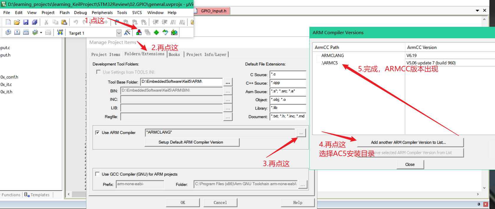

# Keil5

## 下载安装

ARM版本下载：https://armkeil.blob.core.windows.net/eval/MDK538a.EXE

51版本官方下载：https://www.keil.com/demo/eval/c51.htm

Keil ARM版本、Keil C51版本，两个都安装后激活，那就既可以开发51又可以开发STM32了。


## 菜单栏字体设置

**解决WIN10下uvision字体模糊的问题：**（该方法适用于解决大部分win10软件字体模糊的问题，而不仅是Keil）

1、打开属性：

2、选择DPI设置：

3、设置：

建议高DPI缩放替代设置为应用即可，不用设置为系统(增强)，这样使用下面的编程界面配置文件进行美化编辑器界面时就不会出现什么问题。

## 编辑器界面设置

打开`D:\EmbeddedSoftware\Keil5\UV4`，创建一个global.prop文件，替换掉里面的同名文件，内容如下：

```c
# properties for all file types
indent.automatic=1
virtual.space=0
view.whitespace=0
view.endofline=0
code.page=936
caretline.visible=1
highlight.matchingbraces=1
print.syntax.coloring=1
use.tab.color=1
create.backup.files=0
auto.load.ext.modfiles=0
save.prj.before.dbg=0
save.files.before.dbg=0
function.scanner.project=1
function.scanner.files=1
function.scanner.modules=1

# properties for c/cpp files
syntax.colouring.cpp=1
use.tab.cpp=1
tabsize.cpp=4
line.margin.visible.cpp=1
fold.cpp=0
monospaced.font.cpp=1

# properties for asm files
syntax.colouring.asm=1
use.tab.asm=1
tabsize.asm=4
line.margin.visible.asm=1
monospaced.font.asm=1

# properties for other files
use.tabs=1
tabsize=4
line.margin.visible.txt=1
monospaced.font.txt=1

# setting for code completion and syntax check
cc.autolist=1
cc.highlightsyntax=1
cc.showparameters=1
cc.triggerlist=1
cc.triggernumchars=3
cc.enter.as.fillup=0

# autosave for editor files
autosave=0
autosave.interval=5

# vertical edge at right margin
edge.mode=0
edge.column=80


# Specification for text selection and caret line
selection.fore=#FFFFFF
selection.back=#3B575A
caret.fore=#FFFFFF
caret.back=#263238

# Color for vertical edge
edge.colour=#66FAFA

# C/C++ Editor files
template.cpp="#define","#define |";"#if","#if |\r\n\r\n#endif";\\
    "#ifndef","#ifndef __|_H\r\n#define \r\n\r\n\r\n#endif\r\n";\\
    "#include","#include ";"Header","// Header:\r\n// File Name: |\r\n// Author:\r\n// Date:\r\n";\\
    "continue","continue;";"do","do\r\n{\r\n\t// TODO: enter the block content here\r\n\t\r\n\t|\r\n} while ();\r\n";\\
    "enum","enum |\r\n{\r\n\t\r\n};\r\n";"for","for(|;;)\r\n{\r\n}";\\
    "fpointer_type","typedef int (* |F)();\r\n";"function","void function(|)\r\n{\r\n\r\n}\r\n";\\
    "if","if (|)";"ifelse","if (|)\r\n{\r\n}\r\nelse\r\n{\r\n}";\\
    "struct","struct | \r\n{\r\n\r\n};\r\n";"switch","switch (|)\r\n{\r\n\tcase:\r\n\t\tbreak;\r\n\tcase:\r\n\t\tbreak;\r\n\tdefault:\r\n\t\tbreak;\r\n}";\\
    "void","void | ();\r\n";"while","while (|)\r\n{\r\n}";\\
    
font.monospace.cpp=Consolas
style.cpp.32=font:Consolas,size:16,fore:#FFFFFF,back:#263238
style.cpp.4=font:Consolas,size:16,fore:#F78C6B,back:#263238
style.cpp.10=font:Consolas,size:16,fore:#89FFFF,back:#263238
style.cpp.1=font:Consolas,size:16,fore:#546E76,back:#263238
style.cpp.2=font:Consolas,size:16,fore:#546E76,back:#263238
style.cpp.5=font:Consolas,size:16,fore:#C792EA,back:#263238
style.cpp.6=font:Consolas,size:16,fore:#C3E88D,back:#263238
style.cpp.11=font:Consolas,size:16,fore:#FFFFFF,back:#263238
style.cpp.9=font:Consolas,size:16,fore:#9370DB,back:#263238
style.cpp.7=font:Consolas,size:16,fore:#AAAAAA,back:#263238
style.cpp.34=font:Consolas,size:16,fore:#FFFFFF,back:#20FFFF
style.cpp.35=font:Consolas,size:16,fore:#CCCCCC,back:#263238
style.cpp.16=font:Consolas,size:16,fore:#DDDDDD,back:#263238
style.cpp.12=font:Consolas,size:16,fore:#EEEEEE,back:#E0C0E0


# Asm Editor files
font.monospace.asm=Consolas
style.asm.32=font:Consolas,size:16,fore:#263238,back:#F07178
style.asm.1=font:Consolas,size:16,fore:#616161,back:#F07178
style.asm.2=font:Consolas,size:16,fore:#FF0000,back:#F07178
style.asm.3=font:Consolas,size:16,fore:#7F007F,back:#F07178
style.asm.4=font:Consolas,size:16,fore:#263238,back:#F07178
style.asm.5=font:Consolas,size:16,fore:#263238,back:#F07178
style.asm.6=font:Consolas,size:16,fore:#C792EA,back:#F07178
style.asm.7=font:Consolas,size:16,fore:#C792EA,back:#F07178
style.asm.9=font:Consolas,size:16,fore:#C792EA,back:#F07178
style.asm.10=font:Consolas,size:16,fore:#C792EA,back:#F07178
style.asm.11=font:Consolas,size:16,fore:#007F00,back:#F07178
style.asm.12=font:Consolas,size:16,fore:#7F007F,back:#F07178
style.asm.8=font:Consolas,size:16,fore:#46AA03,back:#F07178


# Editor Text files
font.monospace.txt=Consolas
style.txt.32=font:Consolas,size:16,fore:#263238,back:#FFFFFF
    
```

最终效果：


## 安装芯片支持包

以安装STM32F4系列为例：


这样下载安装太慢，网上找相关包下载后直接安装即可：


## 添加AC5编译器

> Keil5 —— 538a版本，安装完成默认使用AC6编译，而旧版Keil使用的是AC5（即Arm Compiler 5）编译器。如果为了以后也使用AC6，那么方法是将AC5的代码移植为AC6；如果工程相当庞大，也可以让新版Keil使用AC5。
>
> Arm Compiler 5（即AC5），在Keil MDK V4版本及V5早期的版本都是使用AC5。在2015年的时候，AC6发布了，并在随后新版本的MDK中集成了AC6，直到现在最新版本的MDK集成了AC6.18。
>
> 前往[Arm Compiler 5 (ACOMP5)](https://developer.arm.com/downloads/view/ACOMP5)下载AC5，笔者选择的版本是Arm Compiler 5.06 update 7。

下载5.06版本后，安装时更改一下安装路径即可：


安装完成进入Keil：



## 关于一些函数或关键字有下划线的问题

>一些关键字或函数出现下划线，这是由于使用了Keil自带的软件包，是Keil 5.25的新特性，不用Keil自带的库就不会出现，
>Keywords that have contextual help (F1) available will be highlighted with a light grey underline.
>
>可以去Manage Run-Time Environment把使用的软件包去掉勾选。


## 调试

debug：寄存器值、变量值、单步运行......


