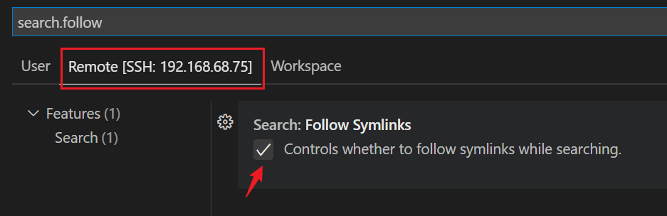
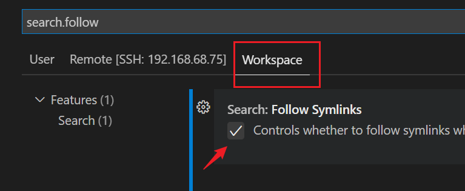

# 连接远程服务器

1、安装Remote—SSH插件。

2、添加服务器配置：

方法1：

- 打开Remote Explorer，点击`+`。
- 然后出现`Enter SSH Connection Command`，输入SSH连接命令`ssh 用户名@目标服务器地址`，示例`ssh lsl@192.168.68.75`。
- 然后按回车，选择`C:\用户\用户名\.ssh\config`。

方法2：打开Remote Explorer，点击配置图标，就会打开config文件，直接配置：

```ssh
Host 192.168.68.75
	HostName 随便取一个名字
	User lsl
```

3、然后选择`File ——> Open Folder... `，就可以打开Linux的目录（需要输入密码）；`Terminal ——> New Terminal  `打开终端。

使用VSCode连接占用的内存有点多，使用MobaXtterm占用只要不到100M。

使用VSCode连接服务器导致服务器CPU占满：

- 使用top命令监控，如果是rg占用CPU过高：打开设置，搜索 `search.followSymlinks`，将`远程`和`工作区`对应设置置为 `False` 即可（把√去掉）。





