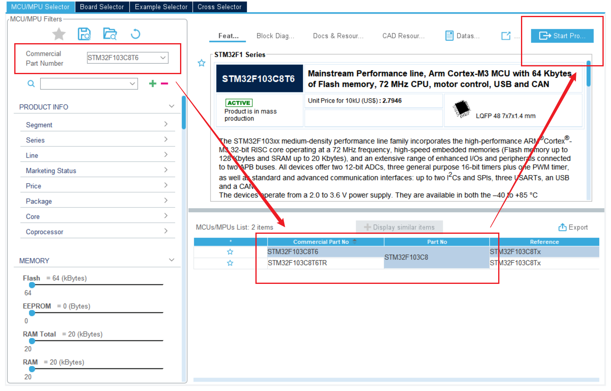
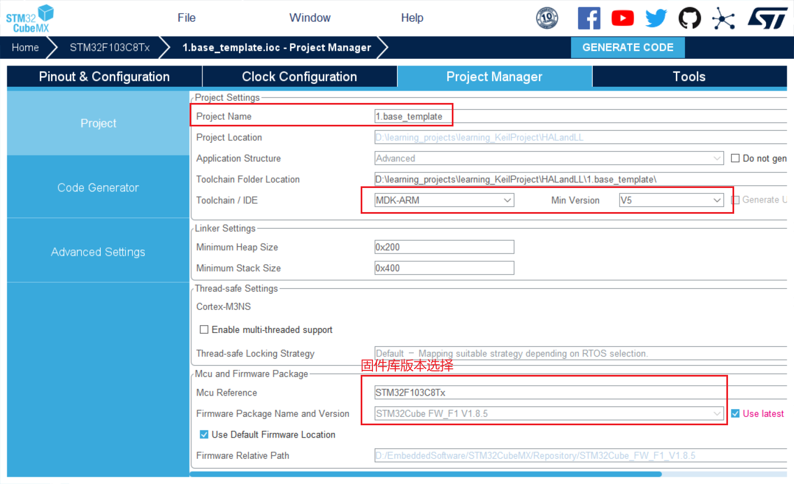

# STM32CubdMX

## 下载安装

安装包下载：[STM32CubeMX - STM32Cube initialization code generator - STMicroelectronics](https://www.st.com/en/development-tools/stm32cubemx.html)。

安装：默认安装即可。

> STM32CubeMX与STM32CubeIDE的区别：
> Cubemx 是个图形化配置工具，最大的好处是帮用户生成相应的初始化代码。
> CubeIde 是编译器，最大的功能是帮助用户编译调试代码，包括cubemx 生成的项目代码。cubeide 也同时集成了cubemx工具。
> cubeIDE = cubeMX + Keil;[如您用 keil]
> cubeIDE = cubeMX + IAR;[如您用 IAR]
> cubeIDE = cubeMX + STUDIO;[如您用 Studio]
>
> 通常使用STM32CubeMX+其它的方式。STM32CubeIDE也还可以。

安装STM32CubeMX后，打开软件，点击Help，在下拉菜单里找到 Updater Settings并点击打开，配置好Repository Folder（由你随意配置），下载固件库时将会下载到这个目录。


## 下载库


点击这个，然后进去选择好自己需要下载的库后`Install`即可。

# 基本工程

打开STM32CubeMX，以STM32F103C8T6为例。

## 1.芯片型号选择

点击Start My project from MCU —— ACCESS TO MCU SELECTOR 或者 File → New Project...创建工程，在弹出界面选择好对应芯片型号：



然后Start Project即可创建工程，创建好后弹出工程界面如下：


## 2.配置下载接口


## 3.RCC时钟源配置


## 4.时钟配置

Clock Configuration —— 时钟配置，按需所需配置。

STM32F103C876最小系统板，外接8MHz晶振，经PLL倍频最高可达72MHz：


## 5.项目管理

Project Manager —— 项目管理，配置如下：

项目配置：



生成配置：


库配置：


选项解释：

```
copy all used libraries into the projectfolder：复制所有库文件（不管工程需要用到还是没用到）到生成的工程目录中，此做法可以使在不使用Cubemx或者电脑没有安装cubemx,依然可以按照标准库的编程习惯调用HAL库函数进行程序编写。
Copy only the necessary library files： 只复制必要的库文件。这个相比上一个减少了很多文件。比如你没有使用CAN、SPI…等外设，就不会拷贝相关库文件到你工程下。
Add necessary library files as reference in the toolchain projectconfiguration file：在工具链项目配置文件中添加必要的库文件作为参考。这里没有复制HAL库文件，只添加了必要文件（如main.c）。相比上面，没有Drivers相关文件。
```

```
Generate peripheral initialization as a pair of’.c/.h’ files perperipheral：每个外设生成独立的.C .H文件，方便独立管理。不勾：所有初始化代码都生成在main.c勾选：初始化代码生成在对应的外设文件。 如UART初始化代码生成在uart.c中。
Backup previously generated files whenre-generating：在重新生成时备份以前生成的文件。重新生成代码时，会在相关目录中生成一个Backup文件夹，将之前源文件拷贝到其中。
keep user code when re-generating：重新生成代码时，保留用户代码(前提是代码写在规定的位置。也就是生成工程文件中的BEGIN和END之间。否则同样会删除。后面会根据生成的工程进行说明)
delete previously generated files when not re-generated：删除以前生成但现在没有选择生成的文件比如：之前生成了led.c，现在重新配置没有led.c，则会删除之前的led.c文件。(此功能根据自身要求进行取舍)
```

到这里基本配置已经配置好了，然后点一个灯 —— 配置GPIOA的PA0输出高电平，点亮LED。

## 6.外设配置

示例 —— 配置GPIO外设，使输出高电平，点亮LED灯：

配置IO口模式：


设置IO口参数：


>没有对SYS外设的参数进行配置就会出现那个警告。

## 7.代码生成

配置好后，执行GENERATE CODE来生成代码（如果没安装HAL固件库会提示你安装，按提示直接安装就好，固件库将下载在你配置好的Repository Folder 下）。


## 8.编译&烧录

生成代码后用Keil打开项目，编译程序，再烧录进STM32F103C8T6就行了，烧录完成后需要按一下复位键才能使程序运行起来。


## CubeMX使用总结

1. 选择好芯片型号，然后Start Project。
2. SYS：配置Debug下载调试接口与SysTick。
3. RCC时钟来源设置 —— ：设置为外部晶振。
4. 外设配置：配置其它外设，要用哪个外设就配置哪个。
5. 时钟配置：系统时钟配置，外设时钟配置。配置好外部时钟源的倍频、分频什么的，对有特殊要求的外设进行配置（比如ADC的就不能超过14MHz）。
6. 项目管理：
   - Project中：配置好项目名称、项目存放路径、使用的工具链/IDE、固件库版本等。（Keil —— ARM-MDK；EWARM —— IAR；CMake —— SW4STM32）
   - Code Generator中：前两个部分中都将第一个选中即可，其它按默认。

# 学习方法

1. 官方手册，会使用LL库&HAL库跑通外设。
2. 项目，看别人的源码。

# GPIO

- 实现流水灯。

```c
void MX_GPIO_Init(void)
{
  LL_GPIO_InitTypeDef GPIO_InitStruct = {0};

  /* GPIO Ports Clock Enable */
  LL_APB2_GRP1_EnableClock(LL_APB2_GRP1_PERIPH_GPIOC);
  LL_APB2_GRP1_EnableClock(LL_APB2_GRP1_PERIPH_GPIOD);
  LL_APB2_GRP1_EnableClock(LL_APB2_GRP1_PERIPH_GPIOA);

  /**/
  LL_GPIO_SetOutputPin(GPIOC, LL_GPIO_PIN_13);

  /**/
  GPIO_InitStruct.Pin = LL_GPIO_PIN_13;
  GPIO_InitStruct.Mode = LL_GPIO_MODE_OUTPUT;
  GPIO_InitStruct.Speed = LL_GPIO_SPEED_FREQ_HIGH;
  GPIO_InitStruct.OutputType = LL_GPIO_OUTPUT_PUSHPULL;
  LL_GPIO_Init(GPIOC, &GPIO_InitStruct);

}
```

```c
/* 置1 */
LL_GPIO_SetOutputPin(GPIOC, LL_GPIO_PIN_13);
/* 延时 */
LL_mDelay(500);
/* 置0 */
LL_GPIO_ResetOutputPin(GPIOC, LL_GPIO_PIN_13);
```


# LL库

1、搭建好项目模板工程。

2、清楚库里面有哪些东西，如何从底层封装成库，提供的API以及API的功能。

3、使用库函数进行开发。


