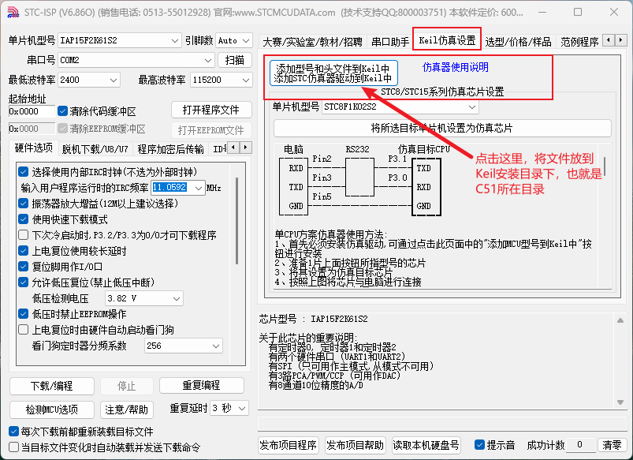
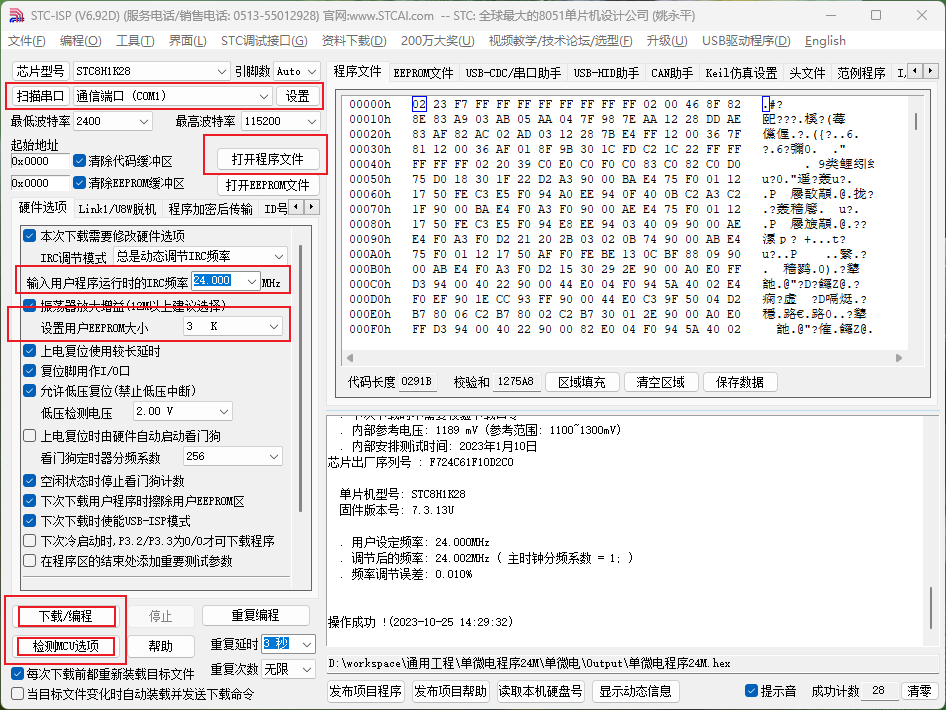
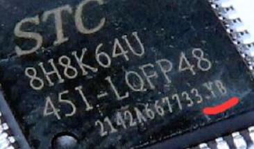
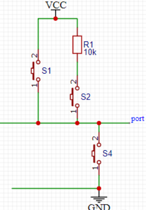

# 编程环境配置

1、安装Keil4。

2、打开STC-ISP，添加STC的头文件支持。



3、程序烧录：（常用24MHz、3K EEPROM）



串口选好后，可点击“监测MCU选项”来检测单片机型号。

# STC8H概述

主要使用STC8H1K16和STC8H1K24这两种型号，我以STC8H8K64U核心板来学习这两种型号单片机的外设，51系列单片机的操作基本都差不多的。

| 单片机型号 | 外设                                                         | 存储                                |
| ---------- | ------------------------------------------------------------ | ----------------------------------- |
| STC8H1K16  | 最多29个IO口；19个中断源，4级优先级；2个高速UART；5个16位定时器；10位ADC；高级PWM；比较器；SPI；I2C。 | Flash：16K；SRAM：1K；EEPROM：12K。 |
| STC8H1K24  |                                                              | Flash：24K；SRAM：1K；EEPROM：4K。  |
| STC8H8K64U | 最多60个IO口；22个中断源，4级优先级；4个高速UART；5个16位定时器；12位ADC；DMA；高级PWM；比较器；SPI；I2C。<br>注意该芯片分为A版和B版： | Flash：64K；SRAM：8K；EEPROM：IAP。 |

# 模块化编程

把各个模块的代码放在`.c`文件中，`.h`文件中提供外部可调用的函数声明，其它想要调用`.c`里的代码时，通过`#include "xxx.h"`来引入声明，从而调用。

优点：提高代码的可阅读性、可维护性、可移植性。

模块：以硬件模块来划分模块。

# 开发方式

8位单片机的开发方式：

- 语言工具：汇编、C语言。
- 都是寄存器编程方式，直接操作寄存器进行开发。

`sfr`和`sbit`关键字：

- `sfr`：C51单片机特有的关键字，用于定义变量与地址的对应关系，定义后可通过变量去对对应地址内容进行读写操作。（用于将单片机的特殊功能寄存器（special function register）赋值给一个变量，这样就可以通过该变量赋值对寄存器进行读写操作）

- `sbit`与`sfr`用法类似，只是`sbit`是位操作，用于将某个`sfr`中具体位赋值给一个变量，这样就可通过该变量对寄存器某位进行清0或置1操作。

  >sbit是指可位寻址变量其中的某一位。至于这个“可位寻址的变量”究竟是不是寄存器，没有任何关系。换句话说，就算一个普通的变量，只要定义在位寻址区，那它也是可以用sbit声明各位的。（51内部RAM的data段，地址20H~2FH有一个长度为16字节的位寻址区，称为bdata段，把普通变量定义在这个位置就能用sbit声明各个位。
  >
  >```c
  >/** 示例：变量x定义在位存储区 **/
  >uchar bdata x; //普通变量
  >sbit x0 = x^0;
  >…
  >sbit x7 = x^7;
  >```

```c
/* sfr与sbit使用示例 */
sfr P0 = 0x80;
sbit P00 = P0^0; /* 0x80 */
void mian()
{
    P0 = 0xFF;
    P00 = 1;
}
```

# 延时

## 软件延时

>$时钟周期 = 1 / 时钟频率$
>$机器周期 = 完成一个基本操作所需要的时间 = 时钟周期*n（n取决于单片的不同而不同）$
>$指令周期 = 完成一次指令所需的时间 = 一或者两个机器周期 $
>
>时间计算公式：
>$（count(次数)*指令周期所需的时钟周期数（例如c51就是12）*循环中的指令数）/ 时钟频率$

```c
/* STC8H系列 */
void Delay_1ms()		//@24.000MHz
{
	unsigned char i, j;
	_nop_();
	i = 32;
	j = 40;
	do
	{
		while (--j);
	} while (--i);
}

void Delay_nms(unsigned int nms)
{
	do{
		Delay_1ms();
	}while(--nms);
}
```

>关于`_nop_()`：
>
>标准的C语言中没有空语句。但在单片机的C语言编程中，经常需要用几个空指令产生短延时的效果。这在汇编语言中很容易实现，写几个nop就行了。
>
>在keil C51中，直接调用库函数：
>
>```c
>#include<intrins.h>     // 声明了void _nop_(void);
>_nop _();            // 产生一条NOP指令
>
>```
>
>`_nop_()`函数，这个函数相当汇编NOP指令，延时几微秒。NOP指令为单周期指令，可由晶振频率算出延时时间，对于12M晶振，延时1uS。对于延时比较长的，要求在大于10us，采用C51中的循环语句来实现。
>在选择C51中循环语句时，要注意以下几个问题
>第一、定义的C51中循环变量，尽量采用无符号字符型变量。
>第二、在FOR循环语句中，尽量采用变量减减来做循环。
>第三、在do…while，while语句中，循环体内变量也采用减减方法。
>这因为在C51编译器中，对不同的循环方法，采用不同的指令来完成的。


## 硬件延时

通过定时器外设来实现延时。

# GPIO

最多有29个IO口，除 P3.0 和 P3.1 外，其余所有IO口上电后的状态均为高阻输入状态，用户在使用这些IO口时必须先设置 IO口模式。

## 工作模式

IO口的工作模式：（除高阻输入为纯输入模式外，其它的模式都可以进行输入、输出）

- 准双向口/弱上拉：该模式下的IO口可用于输出或输入，如果用作输入时，读时要先写1才能读取正常。
- 推挽输出/强上拉：既可输出高电平也可输出低电平。
- 高阻输入：实际使用可看作是浮空输入状态，高阻态的重要作用就是在输入时读取外部电平。
- 开漏输出/弱上拉：只能输出低电平，输出高电平时需要依靠外部上拉电阻提供高电平。开漏输出模式下，如要正确读外部状态或需要对外输出高电平，需外加上拉电阻。

输入输出引脚内部结构简化：



> - 准双向口输出1：则S2闭合，S4断开，此时单片机的引脚通过 R1拉到电源上，输出高电平。
> - 准双向口输出0：则S2闭合，S4闭合，此时单片机的引脚通过S4接地，输出低电平。
> - 推免输出1：则S1闭合，S4断开，此时单片机的引脚直接接到电源上，输出高电平。
> - 推免输出0：则S1断开，S4闭合，此时单片机的引脚通过S4接地，输出低电平。
>
> - 开漏输出1：则开关全部断开，外接上拉电阻，输出高电平。
>
> - 开口输出0：则S4闭合，此时单片机的引脚通过S4接地，输出低电平。
>
> - 高阻输入：  则开关全部断开。
>
> 原文链接：https://blog.csdn.net/chanchairen/article/details/123300181

## 寄存器

相关寄存器：

- PxM0、PxM1：端口配置寄存器，配置IO口工作模式，x为管脚号。
- Px：端口数据寄存器，写0 —— 输出低电平；写1 —— 输出高电平。读取：直接读端口管脚的电平。
- （端口上拉电阻控制寄存器）、（端口施密特触发控制寄存器）。

GPIO的使用步骤：

- ①通过寄存器配置端口模式；
- ②通过端口数据寄存器读取或输出。

```c
void main() 
{ 
	P0M0 = 0x00; //设置 P0.0~P0.7 为双向口模式
	P0M1 = 0x00; 
	P1M0 = 0xff; //设置 P1.0~P1.7 为推挽输出模式
	P1M1 = 0x00; 
	P2M0 = 0x00; //设置 P2.0~P2.7 为高阻输入模式
	P2M1 = 0xff; 
	P3M0 = 0xff; //设置 P3.0~P3.7 为开漏模式
	P3M1 = 0xff; 
	while (1); 
}
```

```c
/* 板级示例：呼吸灯 */
void main()
{
    /* 推挽输出 */
    P2M0 |= (1 << 5);
    P2M1 = 0;
    while(1){
        P25 = 0;
        Delay_nms(500);
        P25 = 1;
        Delay_nms(500);
    } 
}
```


# 中断

## EXTI

五个外部中断：INT0、INT1、INT2、INT3、INT4。

触发方式：0、1上升沿、下降沿触发，2、3、4只能下降沿触发。

INT0、INT1相关寄存器：（INT0 —— P3.2，INT1 —— P3.3）

- 中断使能寄存器。
- 中断优先级寄存器。
- 定时器控制寄存器。

```c
/* 外部中断0使用示例 */
/* 51单片机的中断函数名随意，后面加上interrupt n 即可，n为中断序号  */
void INT0_Isr() interrupt 0 
{ 
	/* 中断处理程序 */
} 
void main() 
{ 
    IT0 = 0; /* 使能 INT0 上升沿和下降沿中断 */
    EX0 = 1; /* 使能 INT0 中断 */
    EA = 1;  /* 总中断使能 */
    while (1); 
}
```

INT2、INT3、INT4相关寄存器：（INT2 —— P3.6，INT3 —— P3.7，INT4 —— P3.0）

- 中断使能寄存器。
- 中断与时钟输出控制寄存器 —— INTCLKO。

```c
sfr INTCLKO = 0x8f; 
#define EX2 0x10 
#define EX3 0x20 
#define EX4 0x40 

void INT2_Isr() interrupt 10 
{ 
	/* 中断处理程序 */
} 
void main() 
{ 
    INTCLKO = EX2; /* 使能 INT2 中断 */
    EA = 1; /* 开总中断 */
    while (1); 
}
```

总结 —— EXTI的使用：

- 外部中断触发模式选择（外部中断0、外部中断1的）。
- 使能外部中断。
- 开总中断。
- 中断处理程序。

## 中断号

51系列单片机，通过`interrupt`关键字指定中断号来确定中断函数。	

中断列表在文档的第533个页面。


## using关键字

```c
void UART2_int (void) interrupt 8 using 1
/* 8为中断次序号 */
/* 1为寄存器组序号 */
```

>楼上qmt已经大致给你介绍清楚了中断函数的定义，值得提出的是，中断函数类型void，说明中断函数是不能有返回值的，这点要明确，所以不要企图让中断函数给你个返回值。还有，函数名后面括弧内是没有参数的。。。这点也需要注意，中断函数不能传递参数。 interrupt 后面的点是中断号。重点我给你解释下using。 这是C51编译器扩展的关键字。用来选择80c51单片机中不同的寄存器组，你也知道R0-R7总共有4组，那么using 后面的数字也就是0-3范围里的一个数了。如果不需要using的话，编译器会自动选择一组寄存器作为绝对寄存器访问的。 using对代码是有一定的影响的。 给你说个简单的例子，你可以想下， 如果定义  void time0() interrupt 1 using 1 假设，我们又在中断里调用了一个delay();这个delay是起延时作用。 那么，我们就需要确保我们使用的寄存器组是同一组，否则，就会出现混乱。 这样说你能明白么？ 所以，我建议你，不必要时不要使用using。不过，你可以试下这个关键字。 祝你学习顺利。
>
>LX efenwu：简单来说，51有4组通用寄存器，R0~R7，我们在使用的时候，从来就没有指明用的是哪个R0，编译器就会自动选一组通用寄存器作为绝对地址访问。在c语言中，我们写一个函数，例如延时函数，里面用的变量，反汇编之后就是在使用R0-R7，那么你能确定你使用的是哪一组寄存器吗？ 所以说，使用using能选择使用的寄存器组，但同时在“切换”时要特别小心。你在中断程序里调用别的程序就会出现寄存器组切换问题。。 其实using还有其他的注意地方，因为使用麻烦，我从来不用这个关键字。这也就是我为什么不推荐楼主用using。编译器会自己选择一组嘛。 所以只要这样定义一个中断函数就行了：`void FuncName() interrupt lvl` 其中lvl就是中断的优先级序号。 要是还有什么地方不明白的地方，请指出来，共同学习嘛。

# TIM

5个16位定时/计数器 —— T0、T1、T2、T3 和 T4，都有计数和定时两种工作模式。

## 模式与分频

定时/计数的本质：定时器/计数器的核心部件是一个加法计数器，其本质是对脉冲进行计数，只是计数脉冲来源不同：**如果计数脉冲来自系统时钟，则为定时方式**，此时定时器/计数器每 12 个时钟或者每 1 个时钟得到一个计数脉冲，计数值加 1；如果计数脉冲来自单片机外部引脚，则为计数方式，每来一个脉冲加 1。

时钟分频：

- T0、T1、T2工作在定时模式：由特殊功能寄存器来决定是否分频，可选12分频或者1分频。
- T3、T4工作在定时模式：由特殊功能寄存器T4T3M来决定是否分频，可选12分频或者1分频。
- 定时/计数器工作在计数模式，对外部脉冲计数是不分频的。

工作模式：

- 模式0：16 位自动重装载模式。
- 模式1：16 位不可重装载模式。
- 模式2：8 位自动重装模式。
- 模式3：不可屏蔽中断的 16 位自动重装载模式。

各定时/计数器的模式：（经常使用T0和T1）

- T0：四种工作模式都有。
- T1：只有模式0、模式1、模式2，没有模式3。
- T2、T3、T4：固定为16位重装载模式，可以当定时器使用，也可以当串口的波特率发生器和可编程时钟输出。

## 寄存器

相关寄存器：

- 定时器0/1控制寄存器TCON：定时器0、定时器1的中断与启动控制。
- 定时器0/1模式寄存器TMOD：定时器0、定时器1的工作模式选择。
- 定时器数据寄存器：由高8和低8为组成；T0的 —— TL0、TH0；T1的 —— TL1、TH1；T2\T3\T4的 —— T2L、T2H、T3L、T3H、T4L、T4H。
- 辅助寄存器：AUXR，用来控制定时0、定时器1、定时器2的定时模式下的时钟分频。
- 中断与时钟控制寄存器：INTCLKO  ，定时器0、定时器1的时钟输出功能控制，时钟输出：定时器溢出时对应的IO口的电平翻转，从而实现时钟信号输出。
- 定时器4/3控制寄存器：T4T3M，定时器3、定时器4的时钟输出控制、速度控制、运行控制都在这里进行配置。

定时器的使用步骤：

- 第一步：设置定时器模式与分频系数。
- 第二步：设置定时器初始值。
- 第三步：清除掉溢出标志位与启动定时器。
- 第四步：启动定时器中断。
- 第五步：开总中断。
- 第六步：定时器中断处理函数。

```c
/* 定时器示例 */
void Timer0_Init(void)		//100微秒@24.000MHz
{
	TMOD = 0x00;			//设置定时器模式
 	/* 计数24次 —— 1us，2400次 —— 100us */
	TL0 = 63135%256;	     //设置定时初始值
	TH0 = 63135/256;		 //设置定时初始值
	TR0 = 1;				//定时器0开始计时
	ET0 = 1;                 //开定时中断
	EA=1;                    //开总中断
}
void TM0_Isr() interrupt 1
{
    P25 = !P25;
}
void main()
{
    Timer0_Init();
    P2M0 |= (1 << 5);
    P2M1 = 0;
    P25 = 0;
    while(1){   

    } 
}
```

```c
void Timer0_Init(void)		//32毫秒@24.000MHz
{
	AUXR &= 0x7F;			//定时器时钟12T模式
	TMOD &= 0xF0;			//设置定时器模式
	TL0 = 0x00;				//设置定时初始值
	TH0 = 0x06;				//设置定时初始值
	TF0 = 0;				//清除TF0标志
	TR0 = 1;				//定时器0开始计时
	ET0 = 1; 
	EA = 1;
}
```

# ADC

ADC的参考电源：芯片的外部参考电源管脚 ADC_VRef+，不能浮空，必须接外部参考电源或者直接连到VCC。

## 寄存器

ADC相关寄存器：

- ADC控制寄存器：电源控制、启动控制、转换结束标志位等。
- ADC转换结果高位寄存器：存储转换完成后的数据。
- ADC转换结果低位寄存器：存储转换完成后的数据。
- ADC配置寄存器：ADC转换结果格式控制。
- ADC时序控制寄存器。
- ADC拓展配置寄存器：ADC中断相关的、自动转换次数等。

ADC输入通道的IO口，需要设置为高阻输入模式。

ADC转换速度：见手册第855页（P832）。

注意：

>1、给 MCU 的 内部 ADC 模块电源打开后，需等待约 1ms，等 MCU 内部的 ADC 电源稳定后再让 ADC 工作；
>2、适当加长对外部信号的采样时间，就是对 ADC 内部采样保持电容的充电或放电时间，时间够，内部才能和外部电势相等。  

## 使用

使用步骤：

- 第一步：开启特殊功能寄存器区的读写访问权利。（通过P_SW2寄存器开启）
- 第二步：模拟信号输入的IO口要配置为高阻输入模式。
- 第三步：配置ADC时序。
- 第四步：配置ADC数据对齐方式与工作频率。
- 第五步：使能ADC。（通过ADC_CONTR，为ADC上电）
- [第六步：开启ADC中断与总中断。]（如果使用中断方式的话）
- 第七步：触发ADC转换。（通过ADC_CONTR，开始进行ADC转换，会由硬件自动清零开始转换标志位 ）

ADC操作方式：

- 查询方式：程序等待ADC转换完成（查询标志位），转换完成后再取ADC转换完成的值。（等待标志位置1，再读取转换值）
- 中断方式：ADC转换完成触发中断来读取转换结果，程序无效等待ADC转换过程，只需要处理一下中断。（ADC中断中读取转换值）

```c
/* 查询方式示例 */
#include "stc8h.h"
#include "intrins.h"
void main()
{
 	P_SW2 |= 0x80;
	P1M0 = 0x00;   // 设置 P1.0 为 ADC 口
	P1M1 = 0x01;
	ADCTIM = 0x3f; // 设置 ADC 内部时序
	ADCCFG = 0x0f; // 设置 ADC 时钟为系统时钟/2/16
	ADC_CONTR = 0x80; // 打开ADC电源
    
    while(1){
		ADC_CONTR |= 0x40; // 触发 AD 转换
		_nop_();
		_nop_();
		while (!(ADC_CONTR & 0x20)); // 查询 ADC 完成标志
		ADC_CONTR &= ~0x20;      // 清标志位
		P2 = ADC_RES;
    }
}
```

```c
/* 中断方式 */
#include "stc8h.h"
#include "intrins.h"
void ADC_Isr() interrupt 5
{
    ADC_CONTR &= ~0x20; // 清中断标志
    P2 = ADC_RES;       // 读取 ADC 结果
    ADC_CONTR |= 0x40;  //继续触发 AD 转换
}
void main()
{
    P_SW2 |= 0x80; //使能访问 XFR
    /* 官方示例里为什么要将这些IO口设置为00模式？ */
    P0M0 = 0x00;
    P0M1 = 0x00;
    P1M0 = 0x00;
    P1M1 = 0x00;
    P2M0 = 0x00;
    P2M1 = 0x00;
    P3M0 = 0x00;
    P3M1 = 0x00;
    P4M0 = 0x00;
    P4M1 = 0x00;
    P5M0 = 0x00;
    P5M1 = 0x00;
    P1M0 = 0x00; // 设置 P1.0 为 ADC 口
    P1M1 = 0x01;
    ADCTIM = 0x3f; // 设置 ADC 内部时序
    ADCCFG = 0x0f; // 设置 ADC 时钟为系统时钟/2/16
    ADC_CONTR = 0x80; // 打开 ADC 电源
    EADC = 1; // 使能 ADC 中断
    EA = 1;   // 开总中断
    ADC_CONTR |= 0x40; // 触发 AD 转换
    while (1);
}
```


# UART

波特率：码元传输速率，二进制调制下，波特率等于比特率，比特率的单位为bit/s。波特率为9600，那么理论上每秒传输的$9600/8=1200byte$的数据量。

串行口组成：由 2 个数据缓冲器、一个移位寄存器、一个串行控制寄存器和一个波特率发生器等组成  。每个串行口的数据缓冲器由 2 个互相独立的接收、发送缓冲器构成，可以同时发送和接收数据。  

## 工作方式和寄存器

4种工作方式：（常用模式1）

- 模式0：同步移位串行。
- 模式1：可变波特率8位数据方式。
- 模式2：固定波特率9位数据方式。
- 模式3：可变波特率9位数据方式。

串口1四种模式都具备；串口2/3/4只有模式1和模式3。

相关寄存器：

- 串口控制寄存器：串口工作模式、收发控制、中断请求位控制。
- 串口数据寄存器：串口数据收发。
- 电源控制寄存器：串口1波特率控制与帧错误检测控制。
- 辅助寄存器：串口1模式0的通讯速度控制与波特率发生器选择。
- 从机地址寄存器：
- 从机地址屏蔽寄存器：

使用总结：

- IO口设置。
- 定时器设置。（需要使用定时器来充当波特率发生器）
- 串口设置。
- 数组收发函数实现。

## 使用示例

```c
#define FOSC 24000000UL  // 晶振震荡频率，f=frequency；osc=oscillate
#define BRT (65536 - (FOSC / 115200+2) / 4) // 波特率
//加 2 操作是为了让 Keil 编译器
//自动实现四舍五入运算

bit busy;
char wptr;  // 读指针
char rptr;  // 写指针
char buffer[16];
void UartInit()
{
    SCON = 0x50;
    T2L = BRT;
    T2H = BRT >> 8;
    AUXR = 0x15;
    wptr = 0x00;
    rptr = 0x00;
    busy = 0;
}

void UartSend(char dat)
{
    while (busy);
    busy = 1;
    SBUF = dat;
}

unsigned char Math_pow(char x, char y)
{
    unsigned int temp_value = 1;
    while(y--){
        temp_value *= x;
    }
    return temp_value;
}
void UartSendNumChar(unsigned int num, unsigned char len)
{
    int i;
    for(i = 0; i < len; i++) {
		// Number=321 Length=3，则会将3、2、1的ASCII码依次发送出去
		UartSend(num / Math_pow(10, len - i - 1) % 10 + '0');
	}
    
}

void UartSendStr(char *p)
{
    while (*p != '\0')
    {
        UartSend(*p++);
    }
}

void UartIsr() interrupt 4
{
    if (TI){
        TI = 0;
        busy = 0;
    }
    if (RI){
        RI = 0;
        buffer[wptr++] = SBUF;
        wptr &= 0x0f;
    }
}
```


# I2C


# SPI


# PWM


