# 52单片机

用处：信息采集、处理，硬件设备控制。

烧录工具STC-ISP：选择好对应的芯片型号，然后选择好.hex文件，点击下载编程后再启动单片机的电源。

掌握：

1. 最小系统：电源、晶振、复位电路。
2. IO口。
3. 定时器：重点是模式2。
4. 中断：外部中断、定时器中断、串口中断。
5. 串口通信。

# 单片机结构


# 单片机程序组成

启动文件、main.c文件。

`REGX52.h`：

```c
```


# oo

## 延时函数

通过计数方式实现，指令周期。

硬件延时。

中断、定时器延时。

## 按键消抖

按钮按下和按钮升起时电信号会有波动，一般20ms内，通过延时函数延时使电平稳定即可。

判断按下——延时（按下时会抖动到低电平，拖过波动时间范围）——按下不放时，进入死循环（以低电平为循环条件）——高电平时死循环退出——延时——功能代码（设置键值）。

## 数码管

共阴、共阳数码管。

位选：选择哪个数码管亮。

段选：数码管上哪几个LED亮。

动态数码管：利用人眼暂留，实际上仍然只有一位数码管亮，只不过是频率快人眼分辨不出来。

代码封装：使用数组存储段选码，利用switch函数来进行位选操作。（段选、位选操作封装）

## 矩阵键盘

独立按键扫描原理：独立按键一端接上GND，一端接上IO口，按键按下时IO口和GND导通，此时IO口由高电平变为了低电平，通过判断相应的IO口的电平的高低则可判断哪个按键被按下。

矩阵键盘扫描原理：和独立键盘类似，只不过矩阵键盘的两端都连接到单片机的IO口上，通过控制行或列的IO口高低电平来实现按钮的状态读取。

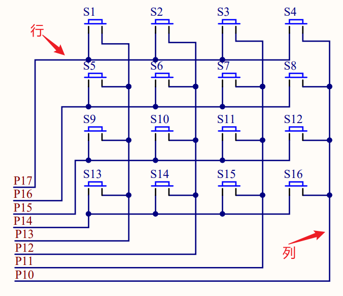

逐行逐列扫描：将P1口都置1，行线或者列线依次置0，当读取到低电平时即可知道按键被按下，此时要设置键值。

# 中断

## 概述

**不可位寻址和可位寻址：不可位寻址的必须8位同时赋值，可位寻址的可以直接定位到某一个位上**

中断系统：实现中断的部件。

中断过程：中断触发后，CPU停止执行当前程序转而去处理事件，待处理完毕返回到原来被中断的地方继续执行。

中断源：请示CPU中断的请求源。

中断服务程序：中断触发后交由CPU执行的程序。

中断优先级：当有多个中断源的时候，CPU根据中断的级别来决定优先响应。

中断嵌套：一个中断服务程序中有比其更高优先级的中断源，触发这个中断源请求后将去处理这个高优先级的中断服务程序再返回处理低优先级的中断服务程序。多级中断系统，单级中断系统——有无中断嵌套功能。

STC89C52的4个外部中断、3个定时器中断、一个串口中断：

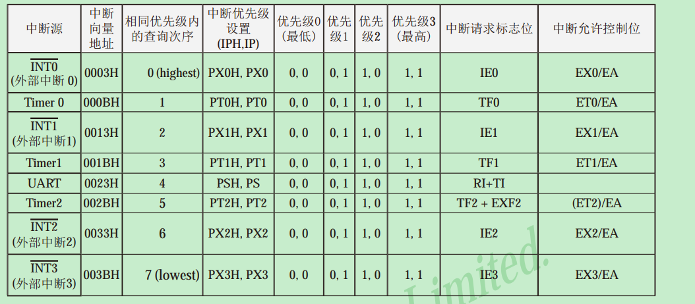

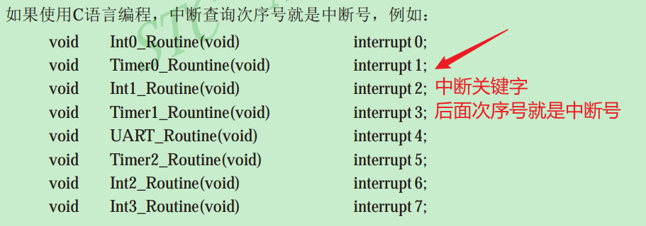

外部中断的触发方式：低电平触发、下降沿触发。四个外部中断的标志位位于寄存器TCON中，通过其选择中断触发方式，并且当中断服务程序被响应后，中断请求标志位IE0、IE1、IE2、IE3会自动清0。

## 中断寄存器

### 中断允许寄存器

CPU对中断源的开发与屏蔽由中断允许寄存器决定。

中断控制寄存器：总中断控制，三个定时计数器中断控制、串口中断控制、外部中断0和中断1控制。

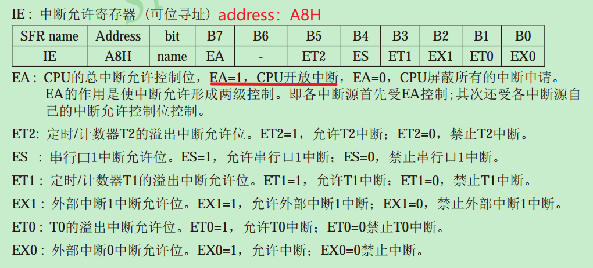

辅助中断控制寄存器：外部中断2、3的控制，以及这两个中断优先级的控制。

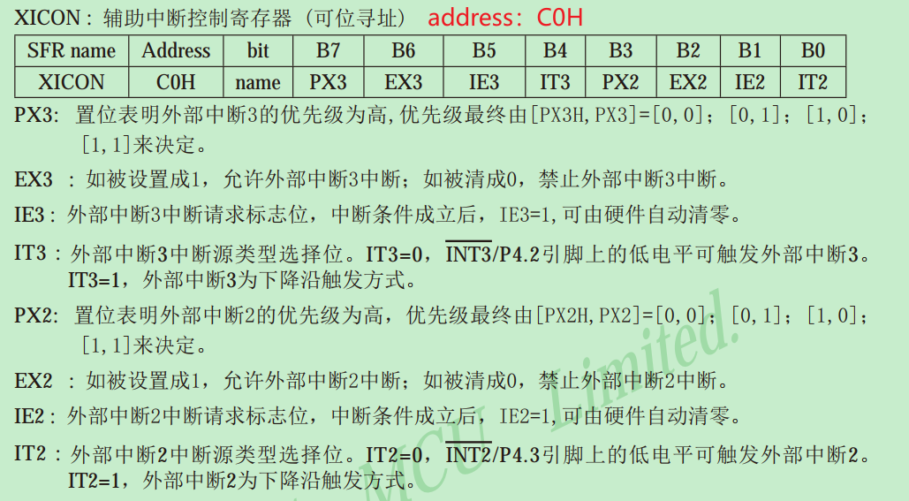

### 中断优先级控制寄存器

STC89C52通过新增加的特殊功能寄存器中的相应位，可将中断设置为4个优先级。如果只设置IP，则中断优先级只有高优先级、低优先级两种。

中断优先级基本规则：

1. 低优先级可以被高优先级的中断所中断。
2. 任何一种中断一旦被响应不会被它同级的中断所中断。

IPH（中断优先级控制寄存器高）、XICON（辅助中断控制寄存器）、IP（中断优先级控制寄存器低）。

### 定时/计数器—控制寄存器TCON

Timer/Counter Control Register。既控制外部中断0、1，也控制定时计数器的中断请求和定时器的运行。

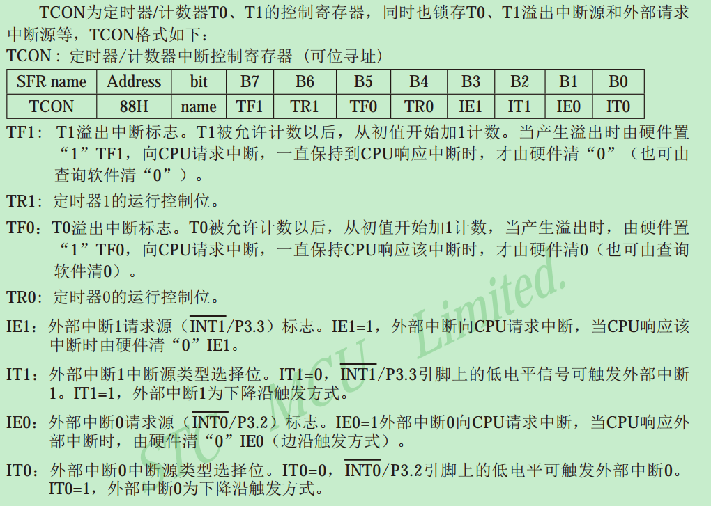

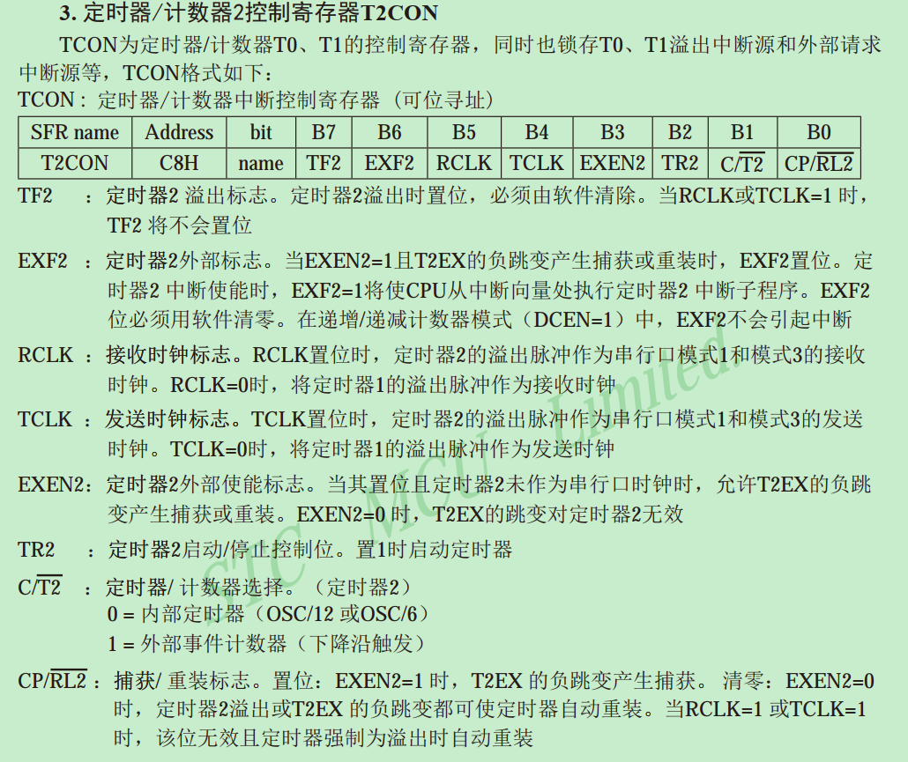

### 串行口控制寄存器

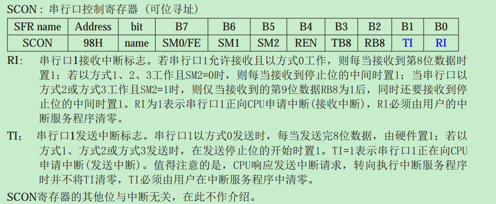

## 中断优先级

STC89C52通过新增加的特殊功能寄存器中的相应位，可将中断设置为4个优先级。如果只设置IP，则中断优先级只有高优先级、低优先级两种。

中断优先级基本规则：

1. 低优先级可以被高优先级的中断所中断。
2. 任何一种中断一旦被响应不会被它同级的中断所中断。

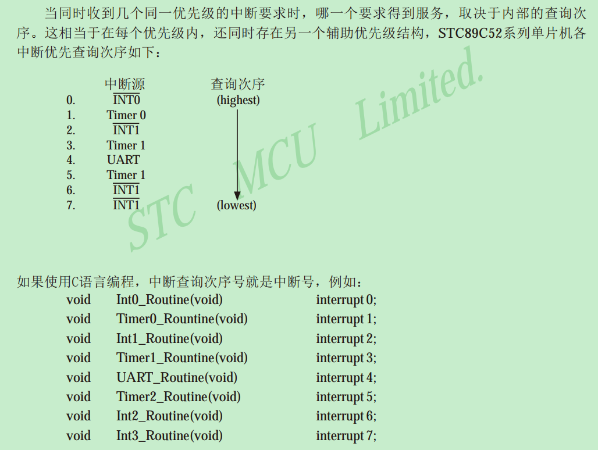

## 中断处理

中断产生并被CPU响应，主程序被中断，接下来：

1. 当前正在执行的指令被全部执行完毕。
2. PC值压如栈。
3. 现场保护。
4. 阻止同级别中断。
5. 中断向量地址装载到程序计数器PC。
6. 执行相应的中断服务程序。

## 外部中断的使用

外部中断的四个中断，主要涉及中断允许控制寄存器（IE）、辅助中断控制寄存器（XICON）、定时/计数控制寄存器（TCON）。

使用使用中断的基本步骤：

1. 选择外部中断源触发方式：0——低电平触发；1——下降沿触发。（TCON（IT0、IT1）；XICON（IT2、IT3））
2. 选择外部中断：置为1即可。（IE（EX0、EX1），XICON（EX2、EX3））
3. 开放中断：置为1即可。（IE的EA）

# 定时/计数器

## TCON

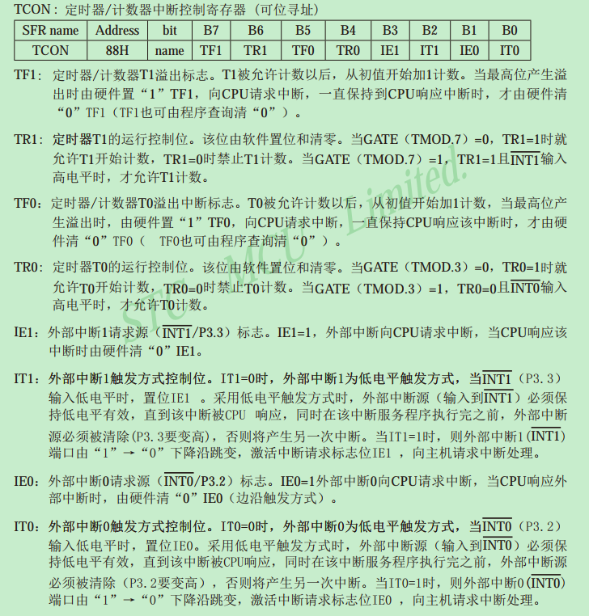


## TMOD

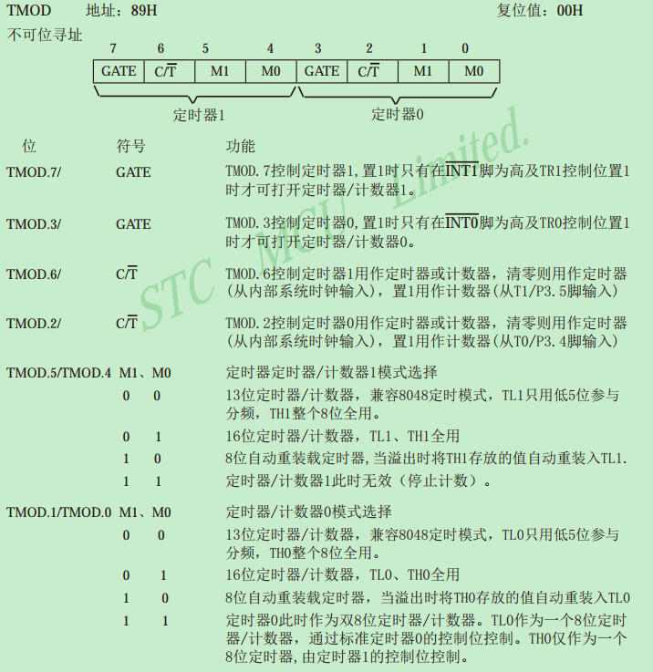

## 使用

计数器每隔1微秒加1。

1. 选择定时/计数器的工作模式。（常用的是模式1——16位定时/计数器，设置：`TMOD = 0x01;`）
2. 赋初值。（16位定时计数器使用TL的8位和TH的8位，需要为这两个设置初值）。
3. 设置定时/计数器开始计时。
4. 如果开启了定时/计数器的中断，需要设置IE来允许中断。
5. 如果开启了定时/计数器的中断，需要指定中断服务函数。

初值设置：

```c
// 这样就可以把高位取出赋给高位，低位给低位
// 例如十进制：1234    1234/100=12   1234%100=34，就把高位、低位分别取出来了
// 十六进制同理  2^2  8^2  10^2=100  16^2=256
TL0 = 64535/256;
TH0 = 64535%256;
```

TMOD 不可位寻址必须8位同时赋值，那么选择定时/计数器的工作模式时，如何不影响另外四位？（针对定时器1定时器2都使用的情况）

利用与、或逻辑运算。任何数与1，都将是本身；任何数或0，都将是本身。

```c
/* 不改变高四位，设置TMOD = 0x01; */
TMOD = TMOD&0xF0;  //  这样可以把低四位清0，高四位保持不变
TMOD = TMOD|0x01;  //  这样可以把最低位置1，高位不变
/* 不改变低四位，设置TMOD = 0x01; */
TMOD = TMOD&0x0F;  // 将高四位清0，低四位保持不变 
TMOD = TMOD|0x10;  // 设置高四位，第四位保持不变
```


示例：

```c
TMOD = TMOD&0xF0; // 选择定时器模式
TMOD = TMOD|0x01;
TF0 = 0;  // 软件清除TF0溢出标志
TH0 = 64535/256;  // 设置定时初始值
TL0 = 64535%256;  // 设置定时初始值
TR0 = 1;  // 开启定时器0中断
ET0 = 1;  // 允许定时器0中断
EA = 1;   // 总中断开关，开启中断
PT0 = 0;  // 设置定时器中断优先级，1——高优先级，0——低优先级
```

## 模块化

Timer0.c：

```c
#include <REGX52.H>
/*
  *@brief 定时器初始化 1ms @12MHz
  *@param
  *@retval 
  */
void Timer0_Init(){

	TMOD &= 0xF0;			//设置定时器模式
	TMOD |= 0x01;			//设置定时器模式
	TL0 = 0x18;				//设置定时初始值
	TH0 = 0xFC;				//设置定时初始值
	TF0 = 0;				  //清除TF0标志
	TR0 = 1;				  //定时器0开始计时	
	ET0 = 1;					//允许定时器中断
	EA = 1;						//开启中断
	PT0 = 0; 					// 低优先级
}

/** 中断处理程序模板
void Timer0_Routine() interrupt 1 
{
	static unsigned int T0Count;
	TL0 = 0x18;				//设置定时初始值
	TH0 = 0xFC;		
	T0Count++;
	if(T0Count>=1000){
		T0Count=0;
		P2_0 = ~P2_0;
	}
	
}
**/
```

Timer0.h：

```c
#ifndef __Timer0_H__
#define __Timer0_H__
void Timer0_Init();
#endif
```


# 串口通信

串口，通信接口，实现两设备间通信。（单片机内自带UART，用于实现串口通信）

学串口需要了解的：

- 电平标准
- 接口及引脚定义
- 通信方式

先略过~32再详细学习


# 64LED点阵屏

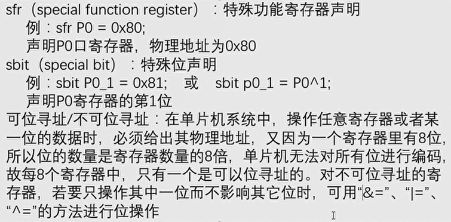

声明特殊功能寄存器，使用sfr关键字，并使用寄存器的物理地址。

特殊位声名，使用sbit关键字，并使用位地址或者`P0^1`（特殊功能寄存器P0的1位（从0开始数起0~7））这样声明。

74HC595的使用

8*8LED点阵模块的使用

# 时钟芯片DS1302Z

