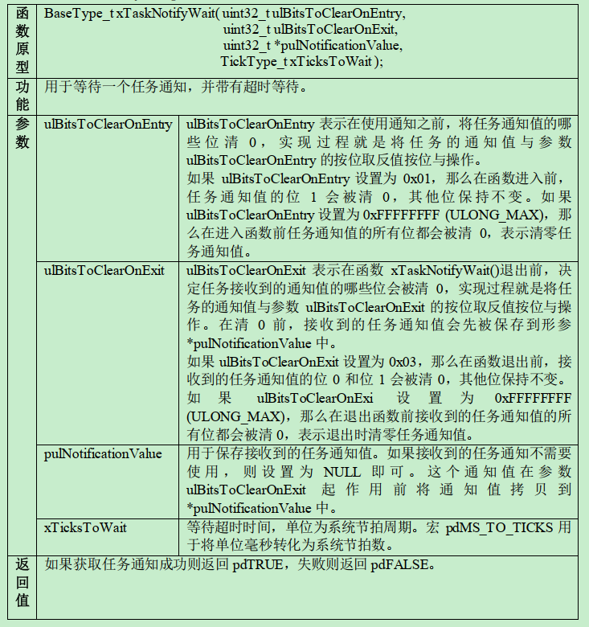

# FreeRTOS

## 概述

FreeRTOS相关网站：

- 官方：[FreeRTOS - Market leading RTOS (Real Time Operating System) for embedded systems with Internet of Things extensions](https://www.freertos.org/zh-cn-cmn-s/)
- 源代码托管：[FreeRTOS Real Time Kernel (RTOS) - Browse /FreeRTOS at SourceForge.net](https://sourceforge.net/projects/freertos/files/FreeRTOS/)
- 野火教程：[RTOS-实时操作系统 — 野火产品资料下载中心 文档 (embedfire.com)](https://doc.embedfire.com/products/link/zh/latest/tutorial/index-rtos.html?highlight=rtos)

FreeRTOS：面向微控制器和小型微处理器的实时操作系统。

> 历史：由美国的Richard Barry于2003年发布，后于2018年被亚马逊收购，改名为AWS FreeRTOS，版本号升级为V10，且开源协议也由原来的GPLv2+ 修改为 MIT，与 GPLv2+ 相比，MIT更加开放。V9以前的版本还是维持原样，V10版本相比于V9就是加入了一些物联网相关的组件，内核基本不变。

实时操作系统：[什么是实时操作系统（RTOS） - 知乎 (zhihu.com)](https://zhuanlan.zhihu.com/p/86861756)

>维基百科上对于实时操作系统的定义：
>实时操作系统（Real-time operating system, RTOS），又称即时操作系统，它会按照排序运行、管理系统资源，并为开发应用程序提供一致的基础。
>实时操作系统与一般的操作系统相比，最大的特色就是“实时性”，如果有一个任务需要执行，实时操作系统会马上（在较短时间内）执行该任务，不会有较长的延时。这种特性保证了各个任务的及时执行。
>
>对于实时操作系统有一些常见的误区，比如：速度快，吞吐量大，代码精简，代码规模小等等。其实这些都不算是实时操作系统的特性，别的操作系统也可以做到。**只有“实时性”才是RTOS的最大特征，其它的都不算是。**
>
>维基百科上关于实时性的定义：
>实时运算（Real-time computing）是计算机科学中对受到“实时约束”的计算机硬件和计算机软件系统的研究，实时约束像是从事件发生到系统回应之间的最长时间限制。实时程序必须保证在严格的时间限制内响应。

为何发展出实时操作系统，相对于轮询来说，有什么优缺点呢？

## 学习目标

先会用，再深入：（项目永远是第一要义，能用来做出成果再谈其他）

1. 先熟练使用FreeRTOS的API，能够使用FreeRTOS进行实际的项目开发。（多手敲用于熟悉API，多做项目、看开源项目用于熟悉基于FreeRTOS的项目开发流程）
2. 再深入学习，关心FreeRTOS的底层实现与思想：
   - 任务如何定义？
   - 系统如何调度？
   - 多任务优先级如何实现？
   - ......各个组件的实现方式。

>[如何快速入门RTOS - 知乎 (zhihu.com)](https://zhuanlan.zhihu.com/p/426285792)
>
>摘要：本文结合自己学习RTOS的经历，来谈谈如何快速入门一款RTOS，希望能够给初学者以启发，找到适合自己的学习思路和方法。
>
>## 我的学习经历
>
>### ucos学习
>
>- 我是在上学期间接触到了RTOS，当时学习的是ucos-II。首次接触RTOS，许多概念都是全新的，找了两本书就开始学习了。《嵌入式操作系统uCOS-II(第二版)》（邵贝贝译著）、《嵌入式实时操作系统μCOS-II原理及应用》（任哲编著）。
>- 说实话，对于初学者来说，《嵌入式实时操作系统μCOS-II原理及应用》这本书更合适一些，门槛低一些。《嵌入式操作系统uCOS-II(第二版)》这本书涉及到内容太多而且繁杂，不利于初学者学习。
>- 经历缓慢而痛苦的学习后，终于把这两本书各啃了两遍，对uCOS涉及到的理论知识进行了系统的学习，算是入门了。
>
>### FreeRTOS学习
>
>- 工作后，由于项目用的是FreeRTOS，便开始学习FreeRTOS。当时，它的中文资料很少。我在官网上下载了一些官方文档（全是英文），利用上下班坐车的时候，将官方指导手册读了一遍，熟悉了FreeRTOS提供的资源和API的用法。
>- 接着就是在实际项目中应用。经历过一个项目之后，基本上能够熟练使用FreeRTOS完成需求的功能了。
>
>### RT-Thread学习
>
>- 机缘巧合接触到了RT-Thread。这是一款国产的RTOS，现在发展势头很猛。当时，有幸参加了官方组织的RT_thread内核视频培训，以及网络实战训练营。同时，将官方文档《RT-THread编程指南》刷了一遍。经过理论+实践的学习方式，很快便掌握了RT-Thread内核编程。
>- 后来将内核源码研究了一遍，弄懂了其设计思想和实现方法。不得不说，代码写的非常棒。基于此，较深入地理解了RTOS内核工作原理。功力又上升了一个层次。
>- 同年，官方组织提前阅读评审书籍《嵌入式实时操作系统：RT-Thread设计与实现》，参与了评审并提供了一些修改建议，此过程相当于重新系统地学习了一下RT-Thread。
>- 通过对RT-Thread的学习，对RTOS的原理有了较深入的理解。自认为把RTOS相关的基础知识夯实了。在看其他RTOS，很快便能上手应用。其他RTOS的实现大同小异，只是具体的设计思想和实现有差别。
>
>## 我的学习方法
>
>- 看资料。多看官方发布的资料，因为只有官方才能真正明白系统的设计思路和使用方法。官方的资料更能简单明了地介绍RTOS，以及快速指导使用者用到自己的项目中去。
>- 做笔记。看资料的同时，要做学习笔记。我当时学习RTOS的时候，新的概念记不住，我就用笔抄一遍关键的知识点。记得当时抄了将近三个笔记本。
>- 动手练习。一定要动手练习，只有经过亲自实践之后才能真正掌握。否则，只是纸上谈兵，时间长了，便会忘记。
>- 多回顾。 动手练习的同时要回顾学过的理论知识。古人有云：“温故而知新”。只有理论加实践，才能快速掌握一项新的知识。
>
>## 需要具备的基础
>
>- 具备C语言的基础知识，能够自己编写简单的程序代码。
>- 学习过MCU裸机编程，最好了解中断、常用外设接口等知识
>
>## 选择一款RTOS
>
>目前比较有名的几款RTOS有以下几种，根据需要选择一款适合自己的进行学习。
>
>- ucos 资料丰富，但是代码结构复杂。
>- FreeRTOS 轻量级的RTOS，市场占用率比较高。
>- RT-Thread 国产RTOS，中文资料丰富，代码优美。
>- LiteOS 华为出品，定位物联网操作系统。
>
>## 准备学习资料
>
>### 获取系统源码
>
>上官方网站下载即可，官方网站均提供下载支持。
>
>### 文档资料
>
>官方会提供指导学习手册或者使用指南。建议以官方资料为主，如果资料为英文的，可以去网上找大佬总结的学习资料或者翻译过来的中文资料。
>
>## 熟悉RTOS的基础内容
>
>对于初学者，在学习过程中会涉及很多全新的概念。若一时理解不了，不要灰心，先放一放。随着学习的深入，自然会慢慢理解。RTOS会涉及到基础内容如下
>
>- 任务（有的系统叫线程）
>- 任务调度
>- 任务优先级
>- 信号量（包括计数信号量、二值信号量、互斥信号量）
>- 事件标志组
>- 消息队列
>- 内存管理
>- 内核时钟周期
>- 优先级反转
>- 空闲任务
>- 临界区

# 源码下载与移植

## 源码

FreeRTOS的源代码托管网址：[FreeRTOS Real Time Kernel (RTOS) - Browse /FreeRTOS at SourceForge.net](https://sourceforge.net/projects/freertos/files/FreeRTOS/)

**1、下载：**进入到源代码托管网站，找到需要的版本进行下载 —— 下载V9.0.0版本，下载`FreeRTOSv9.0.0.zip`文件。

**2、目录说明：**

解压文件，找到FreeRTOS目录里面的Demo和Source目录：（FreeRTOS-Plus目录可不了解，一般不用）

- Demo目录：FreeRTOS 官方为各个单片机移植好的工程代码，一些评估板的完整的工程文件，里面包含了不同开发平台、不同芯片的工程文件，可以参考这些文件来进行开发。
- Source目录：内核源代码，都要使用到。

关于Source目录：

- include目录下的文件和Source目录下的直接子文件：FreeRTOS 的通用的头文件和 C 文件，适用于各种编译器和处理器。
- portable目录：里面是需要根据情况进行移植的文件，需要移植的头文件和 C文件都在该目录下。

关于portable目录：对于不同编译器的支持文件

- Keil目录和RVDS目录：两个目录内的文件是一样的，都是Keil下用的，因此官方只将文件放在了RVDS目录里。RVDS 目录里包含了各种处理器相关的文件目录，根据目录名称可以指定是哪个内核（STM32的M0、M3、M4等内核）的支持文件，里面提供了 cortex-m0、m3、m4 和 m7 等内核的单片机的接口文件。**RVDS目录里的文件就是用来将FreeRTOS和MCU联系起来的接口文件。**
- IAR目录，IAR下的cortex-m0、m3、m4 和 m7 等内核的单片机的接口文件。
- MemMang目录： 存放的是跟内存管理相关的，总共有五个 heap 文件以及一个 readme 说明文件，这五个 heap 文件在移植的时候必须使用一个，因为 **FreeRTOS 在创建内核对象的时候使用的是动态分配内存**，而这些动态内存分配的函数则在这几个文件里面实现，不同的分配算法会导致不同的效率与结果。（初学，选用heap_4.c即可）

> FreeRTOS 是一个软件，单片机是一个硬件，FreeRTOS 要想运行在一个单片机上面，它们就必须关联在一起，如何关联？还是得通过写代码来关联，这部分关联的文件叫接口文件，通常由汇编和 C 联合编写。这些接口文件都是跟硬件密切相关的，不同的硬件接口文件是不一样的，但都大同小异。**编写这些接口文件的过程我们就叫移植**，移植的过程通常由 FreeRTOS 和 mcu 原厂 的人来负责，移植好的这些接口文件就放在 RVDS 这个文件夹的目录下。FreeRTOS 为我们提供了 cortex-m0、m3、m4 和 m7 等内核的单片机的接口文件，只要 是使用了这些内核的 mcu 都可以使用里面的接口文件。
>
> 这里使用FreeRTOS，准确来说是使用官方的移植，而不是移植FreeRTOS到xxxMCU。

关于RVDS目录里只有“port.c”与“portmacro.h”两个文件，以里面的ARM_CM3目录为例：

- port.c：里面的内容是由 FreeRTOS 官方的技术人员为 Cortex-M3 内核的处理器写的接口文件，里面核心的上下文切换代码是由汇编语言编写而成。
- portmacro.h： 则是 port.c 文件对应的头文件，主要是一些数据类型和宏定义

此外还需要一个FreeRTOS的配置头文件，该文件见Demo目录里的STM32相关的demo目录中文件名为`FreeRTOSConfig.h`的文件。

**3、总结：**

使用官方的FreeRTOS的移植时，涉及的文件如下：

1. FreeRTOS源代码文件：include目录下的头文件和Source目录下的子文件。
2. 软件、硬件之间的接口文件：如果是STM32并在Keil下进行开发，那就是portable目录中RVDS目录下的文件；如果是在IAR下进行开发，那就是在portable目录中的IAR目录下的文件。
3. 内存管理文件：MemMang目录下的文件，一般使用heap_4.c即可。
4. 配置文件：`FreeRTOSConfig.h`。

移植时只将这些文件分离出来即可，目录结构也可以按照官方的FreeRTOS目录结构来设置，即分离出来的文件放到另一个FreeRTOS目录里，然后源代码文件和目录照搬，portable目录里只留需要的内存管理文件、软硬件接口文件即可。以Keil下开发为例，目录结构和文件示例如下：


protable内的文件，对于不同平台是不同的，对于Keil来则是RVDS目录里的，对于IAR则是IAR目录里的。`FreeRTOSConfig.h`，也是如此，IAR下则找到IAR后缀的demo目录里的，Keil下则找到Keil后缀的demo目录里的。

**4、移植FreeRTOS：**

将FreeRTOS添加进STM32F103C8的工程里，总的来说可以分为两步：

1. 创建好STM32F103C8的工程：创建项目，创建好组并加载好相关文件，再搞好工程配置（Debug中选用ST-Link Debug并设置其Flash Download为Reset and Run；配好C/C++的include path和宏定义）。（如何创建移植STM32F103C8T6的标准库及创建Keil工程，见`STM32-Std.md`的`start-基本工程`）
2. 移植FreeRTOS：将涉及的文件加入到项目组里，修改好一些文件，再搞好项目的工程配置。

## Keil下移植

使用Keil开发工具来进行开发。

1、创建好工程项目：STM32F103C8的工程创建过程说明见`STM32.md`。

2、移植FreeRTOS：

- 工程中创建好FreeRTOS/src、FreeRTOS/portable组，将相关文件添加进去。（组命名，看你）

  FreeRTOS/src：将源码中Source目录下的**直接子文件**都放进去。
  FreeRTOS/portable：heap_4.c、port.c、portmacro.h。
- 将`FreeRTOSConfig.h`文件添加到User组里，需要修改该文件。

  该配置文件一般放在User里。
- 编译的时候需要为FreeRTOS源文件指定头文件的路径，不然编译会报错，因此需要在C/C++的 include path 添加FreeRTOS目录下的include、portable目录。
- 修改`stm32f10x_it.c`文件。

> FreeRTOSConfig.h 是直接从 demo 文件夹中某些demo目录下面拷贝过来的，该头文件对裁剪整个 FreeRTOS 所需的功能的宏均做了定义，有些宏定义被使能，有些宏定义被失能，一开始我们只需要配置最简单的功能即可。要想随心所欲的配置 FreeRTOS 的功能，我们必须对这些宏定义的功能有所掌握。野火修改过的`FreeRTOSConfig.h`文件，里面添加了一些中文注释，并且把相关的头文件进行分类，方便查找宏定义和阅读，见《FreeRTOS 内核实现与应用开发实战指南》。

修改`FreeRTOSConfig.h`，在末尾的`#endif`前添加以下内容：

```c
#define xPortPendSVHandler 	PendSV_Handler
#define vPortSVCHandler 	SVC_Handler
#define xPortSysTickHandler	SysTick_Handler
```

修改`stm32f10x_it.c`文件：（上面添加的内容会导致重复定义的错误，因此需要修改该文件，把重复的给注释掉）

```c
// 在stm32f10x_it.c文件中找到以下三个函数并注释掉
void SVC_Handler(void)
{
}
void PendSV_Handler(void)
{
}
void SysTick_Handler(void)
{
}
```

3、修改`main.c`，测试：（通过FreeRTOS实现流水灯）

```c
#include "stm32f10x.h"                  // Device header
#include "OLED.h"
#include "FreeRTOS.h"
#include "task.h"
#include "portmacro.h"

static TaskHandle_t led_task_handle0 = NULL;
static TaskHandle_t led_task_handle1 = NULL;
static TaskHandle_t led_task_handle2 = NULL;

void led_init(void)
{
	RCC_APB2PeriphClockCmd(RCC_APB2Periph_GPIOA, ENABLE);
	
	GPIO_InitTypeDef GPIO_InitStructure;
	GPIO_InitStructure.GPIO_Mode = GPIO_Mode_Out_PP;
	GPIO_InitStructure.GPIO_Pin = GPIO_Pin_0 | GPIO_Pin_2 | GPIO_Pin_4;
	GPIO_InitStructure.GPIO_Speed =  GPIO_Speed_50MHz;
	GPIO_Init(GPIOA, &GPIO_InitStructure);
}
void led_task0(void *arg)
{
	while(1)                            
	{
		GPIO_SetBits(GPIOA, GPIO_Pin_0);
		vTaskDelay(500/portTICK_PERIOD_MS);
		GPIO_ResetBits(GPIOA, GPIO_Pin_0);
		vTaskDelay(500/portTICK_PERIOD_MS);
	}
}
void led_task1(void *arg)
{
	while(1)                            
	{
		GPIO_SetBits(GPIOA, GPIO_Pin_2);
		vTaskDelay(1000/portTICK_PERIOD_MS);
		GPIO_ResetBits(GPIOA, GPIO_Pin_2);
		vTaskDelay(1000/portTICK_PERIOD_MS);
	}
}
void led_task2(void *arg)
{
	while(1)                            
	{
		GPIO_SetBits(GPIOA, GPIO_Pin_4);
		vTaskDelay(2000/portTICK_PERIOD_MS);
		GPIO_ResetBits(GPIOA, GPIO_Pin_4);
		vTaskDelay(2000/portTICK_PERIOD_MS);
	}
}
int main(void) 
{
	led_init();
	OLED_Init();
	OLED_ShowString(1,1,"FreeRTOSv9.0.0");
	xTaskCreate(led_task0, "led_task0", 1024, NULL, 20, &led_task_handle0);
	xTaskCreate(led_task1, "led_task1", 1024, NULL, 20, &led_task_handle1);
	xTaskCreate(led_task2, "led_task2", 1024, NULL, 20, &led_task_handle2);
	vTaskStartScheduler();
	while(1);
}
```

## IAR下移植

使用IAR开发工具来进行开发。同理：

1. 创建STM32F103C8的工程项目。
2. 移植FreeRTOS。

### 创建STM32工程

**0、新建工作空间，并创建项目。**

先创建一个目录——`IARworkspaces`，用于当作工作空间，在该目录下创建`FreeRTOSDemo`目录，`FreeRTOSDemo`目录里创建好以下文件夹：


将需要的FreeRTOS支持文件、STM32103C8固件库文件放进这些目录里。

> FreeRTOS目录里放FreeRTOS支持文件；
> Hardware用于放一些驱动代码和头文件；
> Libraries用于放STM32的外设库文件；
> Start放启动文件和内核文件；
> User放`main.c`、`FreeRTOSConfig.h`、`stm32f10x_conf.h`、`stm32f10x_it.c`、`stm32f10x_it.h`；
> Project目录用于存放一会创建的IAR工程文件；
> Config，存放固件库STM32F10x_StdPeriph_Lib_V3.5.0\Project\STM32F10x_StdPeriph_Template\EWARM 文件夹里的所有.icf文件。

做好上面这些后，就打开IAR，选择 File → New Workspace 建立好工作空间，然后通过 File → Save Workspase As...  保存到Project目录下，名字就设为项目名称吧——FreeRTOSDemo；接着Project → Create New Project，选择Empty project，再点OK，选择保存路径仍然是刚才新建的FreeRTOSDemo目录下的Project文件夹里，保存名字也是FreeRTOSDemo。

**1、移植固件库：添加组，然后再添加源文件。**

添加组：（FreeRTOS、Hardware、Libraries、Start、System、User，六个组，由你自己决定，知道组里有啥就行）


添加源文件：操作和上图类似，只不过是在组上面右键，然后选择添加文件。

修改启动文件：（可以先不操作这一步，看看最后编译会不会出现那些警告）

官方固件库的启动文件，在IAR编译器编译时会出现一些警告，解决办法就是，修改startup_stm32f10x_xd.s文件，通过编辑软件编辑该文件然后另存为另一个同名文件，然后使用这个文件替代掉原来的。修改内容如下：

```c
// 找到Reset_Handler这里，最后的SECTION修改 SECTION .text:CODE:REORDER:NOROOT(1)
// SECTION .text:CODE:REORDER(1)  改为 SECTION .text:CODE:REORDER:NOROOT(1)
// 这样也行 SECTION .text:CODE:REORDER(1)  改为 SECTION .text:CODE:NOROOT:REORDER(1)
Reset_Handler
        LDR     R0, =SystemInit
        BLX     R0
        LDR     R0, =__iar_program_start
        BX      R0

        PUBWEAK NMI_Handler
        SECTION .text:CODE:REORDER:NOROOT(1)
```

NOROOT表示如果符号没有被关联的时候是被优专化掉的， 如果想不被优化则使用ROOT。

**2、工程配置。**

先选中`FreeRTOSDemo-Debug`，点击右键选择Options（从Project → Options打开也可）的打开配置面板：

①在General Options → Target → Device 选好使用的芯片型号（STM32F103C8），然后 General Options → Library Configuration 里勾上Use CMSIS5.7。

> 注意，勾选了`Use CMSIS5.7`，Start文件夹中的`core_cm3.h`、`core_cm3.c`就得去掉，表示不使用STM32F10x固件库的core；如果不勾选，使用下载的固件库的`core_cm3.c`和`core_cm3.h`，直接编译将会出现一个Core_cm3版本的问题，错误的原因是因为新版本CMSIS的intrinsics.h等文件与之前的版本不兼容，而解决方法就是注释掉`core_cm3.h`里的93行的`#include <intrinsics.h>`，源文件只有只读权限，要修改可以通过编辑软件编辑后另存为一个新的文件，然后替代掉原来的即可。

②然后，C/C++Compiler → Preprocessor里，配置头文件目录（为了在include时不用加上路径）和定义全局宏，配置分别如下：

```
$PROJ_DIR$\..\
$PROJ_DIR$\..\Libraries
$PROJ_DIR$\..\Start
$PROJ_DIR$\..\Hardware
$PROJ_DIR$\..\System
$PROJ_DIR$\..\User
$PROJ_DIR$\..\FreeRTOS\include
$PROJ_DIR$\..\FreeRTOS\portable
```

```
USE_STDPERIPH_DRIVER
STM32F10X_MD
```

③接着，Linker里勾上`Override default`，并且设置为`$PROJ_DIR$\..\Config\stm32f10x_flash.icf`，选择到stm32f10x_flash.icf文件。

④最后，配置Debugger：Debugger → Setup 里的Driver选择使用的调试器（我是ST-LINK），再在Download里将`Verify download`勾上。

⑤修改startup_stm32f10x_xd.s文件：通过编辑软件编辑后另存为另一个文件，然后使用这个文件替代掉原来的。修改内容如下：

```c
// 找到Reset_Handler这里，最后的SECTION修改 SECTION .text:CODE:REORDER:NOROOT(1)
Reset_Handler
        LDR     R0, =SystemInit
        BLX     R0
        LDR     R0, =__iar_program_start
        BX      R0

        PUBWEAK NMI_Handler
        SECTION .text:CODE:REORDER:NOROOT(1)
```

⑥点击OK，然后点击make进行编译，无错误无警告即可。

官方固件库的启动文件，在IAR编译器编译时会出现一些警告，解决办法就是，修改startup_stm32f10x_xd.s文件，通过编辑软件编辑该文件然后另存为另一个同名文件，然后使用这个文件替代掉原来的。修改内容如下：

```c
// 找到Reset_Handler这里，最后的SECTION修改 SECTION .text:CODE:REORDER:NOROOT(1)
// SECTION .text:CODE:REORDER(1)  改为 SECTION .text:CODE:REORDER:NOROOT(1)
Reset_Handler
        LDR     R0, =SystemInit
        BLX     R0
        LDR     R0, =__iar_program_start
        BX      R0

        PUBWEAK NMI_Handler
        SECTION .text:CODE:REORDER:NOROOT(1)
```

NOROOT表示如果符号没有被关联的时候是被优专化掉的， 如果想不被优化则使属用ROOT。

### 移植FreeRTOS

①为FreeRTOS添加src组、protable组，添加好文件：


②User组里添加好`FreeRTOSConfig.h`文件，并在末尾的`#endif`前添加以下内容：

```c
#define xPortPendSVHandler 	PendSV_Handler
#define vPortSVCHandler 	SVC_Handler
#define xPortSysTickHandler	SysTick_Handler
```

③在stm32f10x_it.c文件中找到以下三个函数并注释掉：

```c
void SVC_Handler(void)
{
}
void PendSV_Handler(void)
{
}
void SysTick_Handler(void)
{
}
```

④错误解决：

```
Error[2]: Failed to open #include file 'FreeRTOSConfig.h' xxx\portasm.s
```

解决办法：工程名右键 → Options... → Assembler → Preprocesser，在`Additional include directories`添加`FreeRTOSConfig.h`所在目录 —— `$PROJ_DIR$\..\User`。

⑤编译，无错误，无警告。

⑥测试，main.c，和Keil下测试代码的一致：

```c
#include "stm32f10x.h"                  // Device header
#include "OLED.h"
#include "FreeRTOS.h"
#include "task.h"
#include "portmacro.h"

static TaskHandle_t led_task_handle0 = NULL;
static TaskHandle_t led_task_handle1 = NULL;
static TaskHandle_t led_task_handle2 = NULL;

void led_init(void)
{
	RCC_APB2PeriphClockCmd(RCC_APB2Periph_GPIOA, ENABLE);
	
	GPIO_InitTypeDef GPIO_InitStructure;
	GPIO_InitStructure.GPIO_Mode = GPIO_Mode_Out_PP;
	GPIO_InitStructure.GPIO_Pin = GPIO_Pin_0 | GPIO_Pin_2 | GPIO_Pin_4;
	GPIO_InitStructure.GPIO_Speed =  GPIO_Speed_50MHz;
	GPIO_Init(GPIOA, &GPIO_InitStructure);
}
void led_task0(void *arg)
{
	while(1)                            
	{
		GPIO_SetBits(GPIOA, GPIO_Pin_0);
		vTaskDelay(500/portTICK_PERIOD_MS);
		GPIO_ResetBits(GPIOA, GPIO_Pin_0);
		vTaskDelay(500/portTICK_PERIOD_MS);
	}
}
void led_task1(void *arg)
{
	while(1)                            
	{
		GPIO_SetBits(GPIOA, GPIO_Pin_2);
		vTaskDelay(1000/portTICK_PERIOD_MS);
		GPIO_ResetBits(GPIOA, GPIO_Pin_2);
		vTaskDelay(1000/portTICK_PERIOD_MS);
	}
}
void led_task2(void *arg)
{
	while(1)                            
	{
		GPIO_SetBits(GPIOA, GPIO_Pin_4);
		vTaskDelay(2000/portTICK_PERIOD_MS);
		GPIO_ResetBits(GPIOA, GPIO_Pin_4);
		vTaskDelay(2000/portTICK_PERIOD_MS);
	}
}
int main(void) 
{
	led_init();
	OLED_Init();
	OLED_ShowString(1,1,"FreeRTOSv9.0.0");
	xTaskCreate(led_task0, "led_task0", 1024, NULL, 20, &led_task_handle0);
	xTaskCreate(led_task1, "led_task1", 1024, NULL, 20, &led_task_handle1);
	xTaskCreate(led_task2, "led_task2", 1024, NULL, 20, &led_task_handle2);
	vTaskStartScheduler();
	while(1);
}
```


## 配置文件说明

V9.0.0版本的FreeRTOS的默认配置文件`FreeRTOSConfig.h`的内容如下：

```c
#ifndef FREERTOS_CONFIG_H
#define FREERTOS_CONFIG_H
// 置1：RTOS使用抢占式调度器；置0：RTOS使用协作式调度器（时间片）
#define configUSE_PREEMPTION		1
// 置1：使用空闲钩子（Idle Hook类似于回调函数）；置0：忽略空闲钩子
#define configUSE_IDLE_HOOK			0
// 置1：使用时间片钩子（Tick Hook）；置0：忽略时间片钩子
#define configUSE_TICK_HOOK			0
// CPU内核时钟频率，也就是CPU指令执行频率，通常称为Fclk
#define configCPU_CLOCK_HZ			( ( unsigned long ) 72000000 )	
// RTOS系统节拍中断的频率。即一秒中断的次数，每次中断RTOS都会进行任务调度
#define configTICK_RATE_HZ			( ( TickType_t ) 1000 )
// 可使用的最大优先级
#define configMAX_PRIORITIES		( 5 )
// 空闲任务使用的堆栈大小
#define configMINIMAL_STACK_SIZE	( ( unsigned short ) 128 )
// 系统所有总的堆大小
#define configTOTAL_HEAP_SIZE		( ( size_t ) ( 17 * 1024 ) )
// 任务名字字符串长度
#define configMAX_TASK_NAME_LEN		( 16 )
// 启用可视化跟踪调试
#define configUSE_TRACE_FACILITY	0
// 系统节拍计数器变量数据类型，1表示为16位无符号整形，0表示为32位无符号整形
#define configUSE_16_BIT_TICKS		0
// 空闲任务放弃CPU使用权给其他同优先级的用户任务
#define configIDLE_SHOULD_YIELD		1

/* Co-routine definitions. */
// 启用协程，启用协程以后必须添加文件croutine.c
#define configUSE_CO_ROUTINES 		0
// 协程的有效优先级数目
#define configMAX_CO_ROUTINE_PRIORITIES ( 2 )

/* FreeRTOS可选函数配置选项 */
#define INCLUDE_vTaskPrioritySet         1
#define INCLUDE_uxTaskPriorityGet        1
#define INCLUDE_vTaskDelete              1
#define INCLUDE_vTaskCleanUpResources    0
#define INCLUDE_vTaskSuspend             1
#define INCLUDE_vTaskDelayUntil          1
#define INCLUDE_vTaskDelay               1

/* 系统可管理的最高中断优先级 */
#define configKERNEL_INTERRUPT_PRIORITY         255
/* !!!! configMAX_SYSCALL_INTERRUPT_PRIORITY must not be set to zero !!!!
See http://www.FreeRTOS.org/RTOS-Cortex-M3-M4.html. */
#define configMAX_SYSCALL_INTERRUPT_PRIORITY    191 /* equivalent to 0xb0, or priority 11. */

/* 中断最低优先级 */
/* This is the value being used as per the ST library which permits 16
priority values, 0 to 15.  This must correspond to the
configKERNEL_INTERRUPT_PRIORITY setting.  Here 15 corresponds to the lowest
NVIC value of 255. */
#define configLIBRARY_KERNEL_INTERRUPT_PRIORITY	15

#endif /* FREERTOS_CONFIG_H */
```

全部配置可分为以下几部分：

- 基础配置。
- 内存申请有关的配置。
- 与钩子函数有关的配置。
- 与运行时间和任务状态收集有关的配置。
- 与协程有关的配置。
- 与软件定时器有关的配置。
- 可选函数配置选项。
- 与中断有关的配置选项。
- 与中断服务函数有关的配置选项。
- 使用Percepio Tracealyzer需要的配置。      

# 编程风格

FreeRTOS 有其独特的编程风格，以里面的数据类型、变量名、函数名和宏为例进行说明。

## 数据类型

在 FreeRTOS 中，对标准 C 的数据类型又进行了重定义，比如 char 重新 定义了一个名字 portCHAR，，这里面的 port 表示接口的意思，就是 FreeRTOS 要移植到这些 处理器上需要这些接口文件来把它们连接在一起。

在 FreeRTOS 中，int 型从不使用，只使用 short 和 long 型。（在 Cortex-M 内核的 MCU 中，short 为 16 位，long 为 32 位）

数据类型重定义在 portmacro.h 这个头文件中。

| 重定义的      | 实际的C标准类型    | 说明                                                         |
| ------------- | ------------------ | ------------------------------------------------------------ |
| portCHAR      | char               |                                                              |
| portSHORT     | short              |                                                              |
| portLONG      | long               |                                                              |
| portTickType  | unsigned short int | 用于定义系统时基计数器的值和阻塞时间的值。当 FreeRTOSConfig.h 头文件中的宏 configUSE_16_BIT_TICKS 为 1 时则为 16 位。 |
| portTickType  | unsigned int       | 用于定义系统时基计数器的值和阻塞时间 的值。FreeRTOSConfig.h 头文件中的宏 configUSE_16_BIT_TICKS 为 0 时则为 32 位。 |
| portBASE_TYPE | long               | 根据处理器的架构来决定是多少位的，如果是 32/16/8bit 的处理器则是 32/16/8bit 的数据类型。一般用于定义函数的返回值或者布尔类型。 |

```c
/* Type definitions. */
#define portCHAR		char
#define portFLOAT		float
#define portDOUBLE		double
#define portLONG		long
#define portSHORT		short
#define portSTACK_TYPE	uint32_t
#define portBASE_TYPE	long

typedef portSTACK_TYPE StackType_t;
typedef long BaseType_t;
typedef unsigned long UBaseType_t;

#if( configUSE_16_BIT_TICKS == 1 )
	typedef uint16_t TickType_t;
	#define portMAX_DELAY ( TickType_t ) 0xffff
#else
	typedef uint32_t TickType_t;
	#define portMAX_DELAY ( TickType_t ) 0xffffffffUL
```

## 变量名

采用匈牙利命名法：该命名规范，要求前缀字母用变量类型的缩写，其余部分用变量的英文或英文的缩写，单词第一个字母大写。

在FreeRTOS中，正是采用匈牙利命名法。

- char 型变量的前缀是 c。
- short 型变量的前缀是 s。
- long 型变量的前缀是 l。
-  portBASE_TYPE 型变量的前缀是 x。
- 数据结构、任务句柄、队列句柄等定义的变量名的前缀也是 x。
-  无符号型的会有一个前缀 u，指针变量的会有一个前缀 p。因此，当定义一个无符号的 char 型变量的时候会加一个 uc 前缀，当定义一个 char 型的指针变量的时候会有一个 pc 前缀。

```c
char cVariable = 'A';
short sVarible = 12;
portBASE_TYPE xVariable = 12;
```

## 函数名

函数名包含了函数返回值的类型、函数所在的文件名和函数的功能，如果是私有的函数则还会加一个 prv（private）的前缀。

函数名解读示例：（`前缀+所在文件名+函数功能`）

1. vTaskPrioritySet()：返回值为 void 型，在task.c 这个文件中定义。 
2. xQueueReceive()：返回值为 portBASE_TYPE 型，在 queue.c 这个文件中定义。
3. vSemaphoreCreateBinary()：返回值为 void 型，在 semphr.h 这个文件中定义。

## 宏

宏的格式：`小写前缀+大写字母`，前缀用于表示宏在哪个头文件中定义。

| 前缀                               | 所在文件         |
| ---------------------------------- | ---------------- |
| port (举例, portMAX_DELAY)         | portable.h       |
| task (举例, taskENTER_CRITICAL())  | task.h           |
| pd (举例, pdTRUE)                  | projdefs.h       |
| config(举例, configUSE_PREEMPTION) | FreeRTOSConfig.h |
| err (举例, errQUEUE_FULL)          | projdefs.h       |

注意：信号量的函数都是一个宏定义，但是它的函数的命名方法是遵循函数的命名方法而不是宏定义的方法。

通用的宏定义 —— 均表示0、1的宏定义：

| 宏      | 实际值 |
| ------- | ------ |
| pdTRUE  | 1      |
| pdFALSE | 0      |
| pdPASS  | 1      |
| pdFAIL  | 0      |

## Tab键与空格

最好使用空格，因为当两个编译器的Tab键设置的大小不一致时，代码移植的时候就会出现格式变乱的情况。

# 多线程

**任务：**在FreeRTOS中，线程（Thread）和任务（Task）的概念是相同的（有的系统叫任务，有的叫线程）。每个任务就是一个线程，有着自己的一个程序执行路径。

**单任务系统：**

- 51、32位等单片机裸机中，如果未使用系统，那都是在main函数中通过`while(1)`死循环来不断依次执行各个处理程序的，对于一些突发处理事件有时会通过中断来完成。这种宏观上串行执行任务中程序的系统，称之为单任务系统，也称为前后台系统（死循环内的程序作为后台程序，而中断服务函数则作为前台程序）。

- 缺点：前后台系统各个任务（应用程序）都是得排队来轮流执行的，因此系统的实时性差，不适合于大一点的嵌入式应用。

  > 实时性：如果有一个任务需要执行，CPU就能马上（在较短时间内）执行该任务，不会有较长的延时，这就是实时性。
  > 实时性可以保证各个任务的及时执行。

- 优点：简单，资源消耗少。

**多任务系统：**宏观上，可以看成是并行地“同时”执行多个任务的系统。（调度器会不断的启动、停止每一个任务，宏观看上去所有的任务都同时在执行）

**FreeRTOS中任务（线程）的创建，有两种方式：**

- 静态创建：任务控制块和任务堆栈都事先定义好，即定义好全局变量（全局的都有静态存储期），任务删除时所占内存不会被释放，实际中使用较少。

  > （线程占用的内存不可释放）

- 动态创建：动态创建任务控制块和任务堆栈（由FreeRTOS动态分配），任务删除时占用的内存可释放，实际应用中使用最多。

  > （线程占用的内存可释放）

# 任务创建

## 基本概念

任务：可以将任务看作是一个线程，多个任务就是多个线程，任务之间都是互相独立的，FreeRTOS 中，任务是竞争系统资源的最小运行单位。

> ### 1、任务控制块：
>
> 任务控制块实际上就是一个结构体。在FreeRTOS中，系统为了顺利的调度任务，为每个任务都额外定义了一个任务控制块，这个任务控制块就相当于任务的身份证，里面存有任务的所有信息，比如任务的栈指针，任务名称，任务的形参等。有了这个任务控制块之后，以后**系统对任务的全部操作都可以通过这个任务控制块（结构体）来实现**。
>
> ```c
> typedef struct tskTaskControlBlock
> {
> 	volatile StackType_t *pxTopOfStack;	 /* 栈顶 */ 
> 	ListItem_t xStateListItem;
> 	ListItem_t xEventListItem;		
> 	UBaseType_t uxPriority;			
> 	StackType_t *pxStack;	/* 栈底 */ 		
> 	char pcTaskName[ configMAX_TASK_NAME_LEN ];
> }tskTCB;
> 
> ```
>
> 可知每个任务控制块都有一个栈底指针和栈顶指针，从而实现任务控制块包含对应任务的所有信息，而**任务句柄指向的是对应的任务控制块**，所以最终可以使用任务句柄来对任务进行控制。
>
> ### 2、任务句柄：
>
> **任务句柄是一个指针，用于指向一个任务。**我们想要操作任务就得都需要通过这个任务句柄。通常句柄为void型指针。
>
> ### 3、内核对象句柄：
>
> 信号量、消息队列、事件标志组、软件定时器这些都属于内核的对象，要想使用这些内核对象，必须先创建，**创建成功之后会返回一个相应的句柄。实际上就是一个指针。**
>
> 内核对象说白了就是一种全局的数据结构，通过这些数据结构我们可以实现任务间的通信、任务间的事件同步等各种功能，至于这些功能的实现则是通过调用这些内核对象的函数来完成的。

**通过点亮LED，来了解FreeRTOS任务创建的方式和流程：**

- ①基于静态单任务实现一个LED呼吸灯。
- ②基于动态单任务实现一个LED呼吸灯。
- ③基于动态多任务实现两个LED呼吸灯。


## ①静态创建单任务

静态创建单任务方式，任务使用的栈和任务控制块都使用静态内存（程序运行结束后才会释放的内存，或者说静态创建单任务方式，任务使用的栈和任务控制块都是具有静态存储期的），即预先定义好的全局变量，这些预先定义好的全局变量都是存于内部的 SRAM 中。

静态存储期：程序执行期间一直存在，所有的文件作用域都具有静态存储期。

### 1、静态支持的开启

开启静态创建支持，在`FreeRTOSConfig.h`配置文件添加以下：

```c
/* 开启静态支持，使用heap.c中的动态内存管理函数来自动地申请RAM */
#define configSUPPORT_STATIC_ALLOCATION 1
/* 设置定时器服务任务的任务堆栈大小 */
#define configTIMER_TASK_STACK_DEPTH	      (configMINIMAL_STACK_SIZE*2)
```

### 2、静态创建示例

main.c，创建静态单任务，具体步骤：

1. 定义任务函数、任务句柄。（任务实际上就是一个无限循环且不带返回值的C函数）
2. 空闲任务与定时器任务堆栈函数的实现。
   - 需要实现`vApplicationGetIdleTaskMemory()`与 `vApplicationGetTimerTaskMemory()`，这两个函数是用户设定的空闲（Idle）任务与定时器（Timer）任务的堆栈大小，必须由用户自己分配，而不能是动态分配。
   - 先定义好空闲、定时器任务栈和空闲、定时器任务控制块，再实现函数。

3. 定义任务堆栈和控制块。
4. 静态创建任务与启动。

```c
#include "stm32f10x.h"                  // Device header
#include "OLED.h"
#include "FreeRTOS.h"
#include "task.h"
/* GPIO初始化 */
static void LED_Init(void)
{
    RCC_APB2PeriphClockCmd(RCC_APB2Periph_GPIOC, ENABLE);
	
	GPIO_InitTypeDef GPIO_InitStructure;
	GPIO_InitStructure.GPIO_Mode = GPIO_Mode_Out_PP;
	GPIO_InitStructure.GPIO_Pin = GPIO_Pin_13;
	GPIO_InitStructure.GPIO_Speed =  GPIO_Speed_50MHz;
	GPIO_Init(GPIOC, &GPIO_InitStructure);
}
/* 一：定义任务函数句柄 */
static TaskHandle_t AppTaskCreate_Handle;
static TaskHandle_t LED_Task_Handle;

/* 二：空闲、定时器任务堆栈与控制块的定义 */
static StackType_t Idle_Task_Stack[configMINIMAL_STACK_SIZE];      /* 空闲任务任务堆栈 */  
static StackType_t Timer_Task_Stack[configTIMER_TASK_STACK_DEPTH]; /* 定时器任务堆栈 */ 
static StaticTask_t Idle_Task_TCB;   /* 空闲任务控制块 */
static StaticTask_t Timer_Task_TCB;  /* 定时器任务控制块 */

/* 三：定义任务堆栈、任务控制块 */
static StackType_t AppTaskCreate_Stack[128]; /* AppTaskCreate 任务任务堆栈 */
static StackType_t LED_Task_Stack[128];      /* LED 任务堆栈 */
static StaticTask_t AppTaskCreate_TCB;  /* AppTaskCreate 任务控制块 */
static StaticTask_t LED_Task_TCB;       /* LED 任务控制块 */

/* 任务函数声明 */
static void LED_Task(void* parameter);
static void AppTaskCreate(void);
/* 用于设定堆栈的函数的声明 */
void vApplicationGetIdleTaskMemory(StaticTask_t **ppxIdleTaskTCBBuffer, 
StackType_t **ppxIdleTaskStackBuffer, uint32_t *pulIdleTaskStackSize);
void vApplicationGetTimerTaskMemory(StaticTask_t **ppxTimerTaskTCBBuffer, 
StackType_t **ppxTimerTaskStackBuffer, uint32_t *pulTimerTaskStackSize) ;

int main(void) 
{
	NVIC_PriorityGroupConfig(NVIC_PriorityGroup_4); /* 设置系统中断优先级分组4 */
	OLED_Init();
    LED_Init();
	OLED_ShowString(1,1,"FreeRTOSv9.0.0");
	/* 静态创建任务 start */
    AppTaskCreate_Handle= xTaskCreateStatic((TaskFunction_t)AppTaskCreate,
    (const char*)"AppTaskCreate",(uint32_t)128,(void*)NULL,(UBaseType_t)3,
    (StackType_t*)AppTaskCreate_Stack,
    (StaticTask_t*)&AppTaskCreate_TCB);
    if (NULL != AppTaskCreate_Handle)
    vTaskStartScheduler();
    /* 静态创建任务 end */
	while(1);
}
/* 一：定义任务函数 */
static void LED_Task(void* parameter)
{
    while(1){
         GPIO_SetBits(GPIOC, GPIO_Pin_13);
         vTaskDelay(500);
		GPIO_ResetBits(GPIOC, GPIO_Pin_13);
		vTaskDelay(500);
    }
}
/*  一：定义任务函数，该任务函数用于创建任务，集中起来方便管理 */
static void AppTaskCreate(void)
{
    taskENTER_CRITICAL(); /* 进入临界区 */
    /* 创建 LED_Task 任务 */
    LED_Task_Handle = xTaskCreateStatic((TaskFunction_t)LED_Task, //任务函数
    (const char*)"LED_Task",  // 指定要创建的任务的名称，即任务函数名
    (uint32_t)128,            // 任务堆栈大小
    (void* )NULL,             // 传递给任务函数的参数
    (UBaseType_t)4,           // 任务优先级设置
    (StackType_t*)LED_Task_Stack,  // 任务堆栈
    (StaticTask_t*)&LED_Task_TCB); // 任务控制块
    if (NULL != LED_Task_Handle)   /* 创建成功 */
        OLED_ShowString(2,1,"success");
    else
        OLED_ShowString(2,1,"fail");
    
    vTaskDelete(AppTaskCreate_Handle); //删除 AppTaskCreate 任务
    taskEXIT_CRITICAL(); //退出临界区
}
/* 二：实现函数 */
/* 空闲任务堆栈函数实现 */
void vApplicationGetIdleTaskMemory(StaticTask_t **ppxIdleTaskTCBBuffer, 
StackType_t **ppxIdleTaskStackBuffer, uint32_t *pulIdleTaskStackSize) 
{ 
    *ppxIdleTaskTCBBuffer = &Idle_Task_TCB;           /* 任务控制块内存 */ 
    *ppxIdleTaskStackBuffer = Idle_Task_Stack;        /* 任务堆栈内存 */ 
    *pulIdleTaskStackSize = configMINIMAL_STACK_SIZE; /* 任务堆栈大小 */ 
}
/* 定时器任务堆栈函数实现 */
void vApplicationGetTimerTaskMemory(StaticTask_t **ppxTimerTaskTCBBuffer, 
StackType_t **ppxTimerTaskStackBuffer, uint32_t *pulTimerTaskStackSize) 
{ 
    *ppxTimerTaskTCBBuffer=&Timer_Task_TCB;              /* 任务控制块内存 */ 
    *ppxTimerTaskStackBuffer=Timer_Task_Stack;           /* 任务堆栈内存 */ 
    *pulTimerTaskStackSize=configTIMER_TASK_STACK_DEPTH; /* 任务堆栈大小 */ 
}
```


## ②动态创建单任务

### 0、关于堆

关于动态内存空间的堆：

> 静态创建单任务方式：任务控制块和任务栈的内存空间都是从内部的 SRAM 里面分配的，具体分配到哪个地址由编译器决定。
>
> 动态单任务方式：使用动态内存，即堆（堆也是内存，也属于SRAM）。**FreeRTOS 创建堆的做法是在 SRAM 里面定义一个大数组，也就是所谓的堆内存**，用于供 FreeRTOS 的动态内存分配函数使用，在第一次使用的时候，系统会将定义的堆内存进行初始化，这些初始化代码在 FreeRTOS 提供的内存管理方案中实现（heap_1.c、heap_2.c、heap_4.c 等）。
>
> FreeRTOS.h中：
> ```c
> /* 系统所有堆的大小 */
> /* 使用动态时，需要将宏configSUPPORT_DYNAMIC_ALLOCATION开启 */
> #define configTOTAL_HEAP_SIZE		( ( size_t ) ( 17 * 1024 ) )
> ```
>
> heap_x.c中：
>
> ```c
> /* 从内部 SRAMM 里面定义一个静态数组 ucHeap，大小由configTOTAL_HEAP_SIZE 这个宏决定，
> 不能超过内部SRAM的总大小 */
> #if( configAPPLICATION_ALLOCATED_HEAP == 1 )
> 	/* The application writer has already defined the array used for the RTOS
> 	heap - probably so it can be placed in a special segment or address. */
> 	extern uint8_t ucHeap[ configTOTAL_HEAP_SIZE ];
> #else
> 	static uint8_t ucHeap[ configTOTAL_HEAP_SIZE ];
> #endif /* configAPPLICATION_ALLOCATED_HEAP */
> 
> /* 如果这是第一次调用 malloc 那么需要将堆进行初始化，以设置空
> 闲块列表，方便以后分配内存，初始化完成之后会取得堆的结束地址 */
> if( pxEnd == NULL )
> {
>     prvHeapInit();
> }
> else
> {
>     mtCOVERAGE_TEST_MARKER();
> }
> ```
>
> 

### 1、动态支持的开启

开启动态创建支持，在`FreeRTOSConfig.h`配置文件添加以下：

```c
#define configSUPPORT_DYNAMIC_ALLOCATION 1
```


### 2、动态创建示例

main.c，创建动态单任务，具体步骤：

1. 定义任务句柄、任务函数。
2. 创建任务。
3. 启动任务调度。

>动态创建任务不需要定义任务栈和控制块：
>
>1. 定义任务栈：使用动态内存的时候，任务栈在任务创建的时候创建，不需要像使用静态内存那样要预先定义好一个全局的静态的栈空间，动态内存就是按需分配内存，随用随取。
>2. 定义任务控制块指针：使用动态内存时候，不用跟使用静态内存那样要预先定义好一个全局的静态的任务控制块空间。任务控制块是在任务创建的时候分配内存空间创建，任务创建函数会返回一个指针，用于指向任务控制块，**所以要预先为任务栈定义一个任务控制块指针，也是我们常说的任务句柄，这个指针用于接收返回的这个指针（指向任务控制块）**。

```c
#include "stm32f10x.h"                  // Device header
#include "OLED.h"
#include "FreeRTOS.h"
#include "task.h"

/* GPIO初始化 */
static void LED_Init(void)
{
    RCC_APB2PeriphClockCmd(RCC_APB2Periph_GPIOC, ENABLE);
	
	GPIO_InitTypeDef GPIO_InitStructure;
	GPIO_InitStructure.GPIO_Mode = GPIO_Mode_Out_PP;
	GPIO_InitStructure.GPIO_Pin = GPIO_Pin_13;
	GPIO_InitStructure.GPIO_Speed =  GPIO_Speed_50MHz;
	GPIO_Init(GPIOC, &GPIO_InitStructure);
}
/* 一：定义任务句柄 */
static TaskHandle_t AppTaskCreate_Handle = NULL;/* App任务句柄 */
static TaskHandle_t LED_Task_Handle = NULL;     /* LED任务句柄 */
/* 一：声明任务函数 */
static void AppTaskCreate(void);          /* 用于创建任务 */
static void LED_Task(void* pvParameters); /* LED_Task 任务实现 */

int main(void) 
{
	LED_Init();
	BaseType_t xReturn = pdPASS;  /* 定义一个任务创建信息返回值 */
	/* 二：创建 AppTaskCreate 任务 */
	xReturn = xTaskCreate((TaskFunction_t )AppTaskCreate, /* 任务入口函数 */
		(const char* )"LED_Task", /* 任务名字 */
		(uint16_t )512,           /* 任务栈大小 */ 
		(void* )NULL,             /* 任务入口函数参数 */ 
		(UBaseType_t )1,          /* 任务的优先级 */ 
		(TaskHandle_t* )&AppTaskCreate_Handle); /* 任务控制块指针 */
	/* 三：启动任务调度 */
	if (pdPASS == xReturn)
		vTaskStartScheduler(); /* 启动，开启调度 */
	else
		return -1;
	while(1);
}
/* 一：定义任务函数 */
static void LED_Task(void* parameter)
{
    while(1)
    {
        GPIO_SetBits(GPIOC, GPIO_Pin_13);
        vTaskDelay(500);
        GPIO_ResetBits(GPIOC, GPIO_Pin_13);
		vTaskDelay(500);
    }
}
/* 一：定义任务函数，为了方便管理所有，所有的任务创建都使用这个任务进行创建 */
static void AppTaskCreate(void)
{
	BaseType_t xReturn = pdPASS;/* 定义一个创建信息返回值，pdPASS = 1 */
	taskENTER_CRITICAL(); //进入临界区

	/* 二：创建 LED_Task 任务 */
	xReturn = xTaskCreate((TaskFunction_t )LED_Task, /* 任务函数入口 */
	(const char* )"LED_Task",/* 任务名字 */
	(uint16_t )512, /* 任务栈大小 */
	(void* )NULL,   /* 任务函数参数 */
	(UBaseType_t )2, /* 任务的优先级 */
	(TaskHandle_t* )&LED_Task_Handle);/* 任务控制块指针-任务句柄 */
	if (pdPASS == xReturn)
		vTaskDelete(AppTaskCreate_Handle); //删除 AppTaskCreate 任务
	taskEXIT_CRITICAL(); //退出临界区
}
```


## ③动态创建多任务

按照动态单任务的创建流程，再创建其它的任务即可。示例如下 —— main.c，点亮A5、A6口的两个LED灯：

```c
#include "stm32f10x.h"                  // Device header
#include "OLED.h"
#include "FreeRTOS.h"
#include "task.h"

static void LED_Init(void)
{
	RCC_APB2PeriphClockCmd(RCC_APB2Periph_GPIOA, ENABLE);
	GPIO_InitTypeDef GPIO_InitStructure;
	GPIO_InitStructure.GPIO_Mode = GPIO_Mode_Out_PP;
	GPIO_InitStructure.GPIO_Pin = GPIO_Pin_5 | GPIO_Pin_6;
	GPIO_InitStructure.GPIO_Speed =  GPIO_Speed_50MHz;
	GPIO_Init(GPIOA, &GPIO_InitStructure);
}
/* 定义任务句柄 */
static TaskHandle_t AppTaskCreate_Handle = NULL;
static TaskHandle_t LED1_Task_Handle = NULL;
static TaskHandle_t LED2_Task_Handle = NULL;
/* 声明 */
static void AppTaskCreate(void);           /* 用于创建任务 */
static void LED1_Task(void* pvParameters); /* LED_Task 任务实现 */
static void LED2_Task(void* pvParameters); /* LED_Task 任务实现 */
int main(void) 
{
	LED_Init();
	BaseType_t xReturn = pdPASS;/* 定义一个创建信息返回值*/
	/* 创建 AppTaskCreate 任务 */
	xReturn = xTaskCreate((TaskFunction_t )AppTaskCreate, /* 任务入口函数 */
		(const char* )"LED_Task",/* 任务名字 */
		(uint16_t )512, /* 任务栈大小 */ 
		(void* )NULL,/* 任务入口函数参数 */ 
		(UBaseType_t )1, /* 任务的优先级 */ 
		(TaskHandle_t* )&AppTaskCreate_Handle);/* 任务控制块指针 */
	/* 启动任务调度 */
	if (pdPASS == xReturn)
		vTaskStartScheduler(); /* 启动任务，开启调度 */
	else
		return -1;
	while(1);
}

static void AppTaskCreate(void)
{
	BaseType_t xReturn = pdPASS;/* 定义一个创建信息返回值，默认为 pdPASS */
	taskENTER_CRITICAL(); //进入临界区

	/* 创建 LED1_Task 任务 */
	xReturn = xTaskCreate((TaskFunction_t )LED1_Task, /* 任务入口函数 */
	(const char* )"LED1_Task",/* 任务名字 */
	(uint16_t )512, /* 任务栈大小 */
	(void* )NULL, /* 任务入口函数参数 */
	(UBaseType_t )2, /* 任务的优先级 */
	(TaskHandle_t* )&LED1_Task_Handle);/* 任务控制块指针 */
	
	/* 创建 LED2_Task 任务 */
	xReturn = xTaskCreate((TaskFunction_t )LED2_Task, /* 任务入口函数 */
	(const char* )"LED2_Task",/* 任务名字 */
	(uint16_t )512, /* 任务栈大小 */
	(void* )NULL, /* 任务入口函数参数 */
	(UBaseType_t )3, /* 任务的优先级 */
	(TaskHandle_t* )&LED2_Task_Handle);/* 任务控制块指针 */
	
	if (pdPASS == xReturn)
		vTaskDelete(AppTaskCreate_Handle); //删除 AppTaskCreate 任务
	taskEXIT_CRITICAL(); //退出临界区
}

static void LED1_Task(void* parameter)
{
    while(1){
        GPIO_SetBits(GPIOA, GPIO_Pin_5);
        vTaskDelay(500);
        GPIO_ResetBits(GPIOA, GPIO_Pin_5);
        vTaskDelay(500);
    }
}
static void LED2_Task(void* parameter)
{
    while(1){
        GPIO_SetBits(GPIOA, GPIO_Pin_6);
        vTaskDelay(1000);
        GPIO_ResetBits(GPIOA, GPIO_Pin_6);
        vTaskDelay(1000);
    }
}
```

## ④函数说明

**1、任务创建函数：**

```c
/* 动态创建 */
BaseType_t xTaskCreate(	TaskFunction_t pxTaskCode,
							const char* const pcName,
							const uint16_t usStackDepth,
							void * const pvParameters,
							UBaseType_t uxPriority,
							TaskHandle_t * const pxCreatedTask);
xTaskCreate(函数入口-即函数名, 函数名称, 任务栈大小, 任务入口函数参数, 优先级, 任务句柄);
/* 创建完成，返回1 */
```

| 形参                                 | 说明                                                         |
| ------------------------------------ | ------------------------------------------------------------ |
| `TaskFunction_t pxTaskCode`          | 一个void*，用于传入函数入口                                  |
| `const char* const pcName`           | 函数名，字符串形式，最大长度由 FreeRTOSConfig.h 中定义的<br>configMAX_TASK_NAME_LEN 宏指定，多余部分会被自动截掉，<br>**这里任务名字最好要与任务函数入口名字一致，方便进行调试** |
| `const uint16_t usStackDepth`        | 栈深度，即任务栈大小，单位为字，即32位机器下1字为4字节       |
| `void * const pvParameters`          | 任务函数的参数，没有就设置为0或NULL                          |
| `UBaseType_t uxPriority`             | 任务优先级，数值越大表示优先级越大，优先级范围根据 FreeRTOSConfig.h 中的宏configMAX_PRIORITIES 决定，如果使能<br> configUSE_PORT_OPTIMISED_TASK_SELECTION，则最多支持 32 个优先级 |
| `TaskHandle_t * const pxCreatedTask` | 任务句柄，会指向任务控制块                                   |

```c
/* 动态创建 */
xTaskCreate(task_monitor,  "MONITOR", 600, NULL, 7, NULL);
```

```c
/* 静态创建，不常用 */
xTaskCreateStatic();
```

**2、任务删除函数：**

```c
/* 传入任务的句柄，将任务删除 */
void vTaskDelete( TaskHandle_t xTaskToDelete );
```


**3、启动调度器：**

```c
/* 调用即可启动调度器 */
void vTaskStartScheduler( void );
```

> 当任务创建好后，是处于任务就绪（Ready） ，在就绪态的任务可以参与操作系统的调度。但是此时任务仅仅是创建了，还未开启任务调度器，也没创建空闲任务与定时器任务（如果使能了 configUSE_TIMERS 这个宏定义），那这两个任务就是在启动任务调度器中实现，每个操作系统，任务调度器只启动一次，之后就不会再次执行了， FreeRTOS 中启动任务调度器的函数是 vTaskStartScheduler()，并且启动任务调度器的时候就不会返回，从此任务管理都由FreeRTOS管理，此时才是真正进入实时操作系统中的第一步。

**4、进入临界区函数：**

```c
#define taskENTER_CRITICAL() portENTER_CRITICAL()
#define taskENTER_CRITICAL_FROM_ISR() portSET_INTERRUPT_MASK_FROM_ISR()
/* taskENTER_CRITICAL()是一个宏，实际调用的是vPortEnterCritical()，进入临界区 */
#define portENTER_CRITICAL() vPortEnterCritical()
void vPortEnterCritical( void );
```

`taskENTER_CRITICAL()`：调用其进入临界区。

**5、退出临界区函数：**

```c
#define taskEXIT_CRITICAL()			portEXIT_CRITICAL()
#define taskEXIT_CRITICAL_FROM_ISR( x ) portCLEAR_INTERRUPT_MASK_FROM_ISR( x )

#define portEXIT_CRITICAL()						vPortExitCritical()
#define portSET_INTERRUPT_MASK_FROM_ISR()		ulPortRaiseBASEPRI()
/* taskEXIT_CRITICAL()是一个宏，实际调用的是vPortExitCritical()，退出临界区	 */
void vPortExitCritical( void );
```

`taskEXIT_CRITICAL()`：调用其退出临界区。


## ⑤动态总结

动态创建任务的流程：

1. 外设初始化，写好将要使用的外设的初始化函数。
2. 定义任务句柄，用于指向创建任务时返回的任务控制块，以便可以通过句柄操作任务。（如果需要操作任务自身的话就定义，不需要就传入`NULL`就行了）
3. 声明并定义任务函数，分为App任务函数和实际应用任务函数：
   - AppTaskCreate：用于创建任务的任务。
   - xxxTask：实际应用任务，用于实现具体的任务逻辑。
4. main()：调用外设初始化函数、创建App任务、启动调度器。

```c
/* main()模板示例： */
int main(void) 
{
	STM32F103_Init();
	BaseType_t xReturn = pdPASS;
    /* 创建App任务 */
	xReturn = xTaskCreate((TaskFunction_t)AppTaskCreate,
		(const char*)"AppTaskCreate",
		(uint16_t)512,
		(void*)NULL,
		(UBaseType_t)1,
		(TaskHandle_t*)&AppTaskCreate_Handle);
    /* 任务创建完成后，启动调度器 */
	if(xReturn == pdPASS){
		vTaskStartScheduler();
	}else{
		return -1;
	}
	while(1);
}
```

```c
/* App任务定义模板： */
static void AppTaskCreate(void)
{
	BaseType_t xReturn = pdPASS;
	taskENTER_CRITICAL(); /* 进入临界区 */
	/* 创建任务1 */
	xReturn = xTaskCreate((TaskFunction_t)LED1Task,
		(const char*)"LED1Task",
		(uint16_t)512,
		(void*)NULL,
		(UBaseType_t)2,
		(TaskHandle_t*)&LED1Task_Handle);
    /* 创建任务2 */
    xReturn = xTaskCreate((TaskFunction_t)LED2Task,
		(const char*)"LED2Task",
		(uint16_t)512,
		(void*)NULL,
		(UBaseType_t)3,
		(TaskHandle_t*)&LED2Task_Handle);
    /* 创建任务n */
    ......
    /* 创建完成全部任务，删除App任务，只执行一次的任务，任务执行完毕就应该删除 */
	if(xReturn == pdPASS){
		vTaskDelete(AppTaskCreate_Handle);
	}
	taskEXIT_CRITICAL(); /* 退出临界区 */
}
```


## ⑥启动与执行

使用FreeRTOS的步骤通常为（动态创建方式）：

1. 硬件外设初始化。
2. （如果使用到FreeRTOS的一些API或开启一些功能，注意是否需要在配置文件添加上相关配置）。
3. 创建任务（App任务和应用任务，在App任务中去创建应用任务，某些只执行一次的任务在执行完毕后要删除，比如App任务）。
4. 开启FreeRTOS，开始任务调度。

### 启动流程介绍

FreeRTOS的启动流程主要分为两种：

- 一种是事先准备好所有资源，再启用RTOS的调度器。（硬件外设初始化 → RTOS系统的初始化 → 创建任务 → 启动RTOS，开始调度）
- 另一种是不需要准备好所有资源就启用RTOS的调度器。（硬件外设初始化 → RTOS系统的初始化 → 创建初始任务 → 启动RTOS，开始调度，初始任务用于创建各种应用任务，并且当初始任务创建完成后需要把自己给删除掉，只执行一次的任务执行完成必须删除掉）

野火伪代码生动展示两种流程：

```c
/* 第一种 */
int main (void){
	/* 硬件外设初始化、系统初始化好、任务创建全都准备好 */
	HardWare_Init(); /* 硬件外设初始化 */
	RTOS_Init();     /* RTOS 系统初始化 */
	RTOS_TaskCreate(Task1); /* 创建任务 1，但任务 1 不会执行，因为调度器还没有开启 */ 
	RTOS_TaskCreate(Task2); /* 创建任务 2，但任务 2 不会执行，因为调度器还没有开启 */
	/* ......继续创建各种任务 */

	/* 都准备好了，可以启动 RTOS了，开始调度 */
	RTOS_Start();
}

void Task1( void *arg ) {
	while (1){
	/* 任务实体，必须有阻塞的情况出现 */
	}
}

void Task1( void *arg ) {
	while (1){
	/* 任务实体，必须有阻塞的情况出现 */
	}
}
```

```c
/* 第二种 */
int main (void){
	/* 准备好一部分先：硬件外设初始化、系统初始化、初始任务创建 */
	HardWare_Init(); /* 硬件外设初始化 */
	RTOS_Init();     /* RTOS 系统初始化 */
	RTOS_TaskCreate(AppTaskCreate); /* 只创建一个启动任务，用于创建各种应用任务 */

	/* 启动 RTOS，开始调度 */
	RTOS_Start();
}
 /* 起始任务，用于在里面创建应用任务 */
void AppTaskCreate( void *arg ) {
	/* 创建任务 1，然后执行 */
	RTOS_TaskCreate(Task1);
    /* 当任务 1 阻塞时，继续创建任务 2，然后执行 */
    RTOS_TaskCreate(Task2);
	/* ......继续创建各种任务 */
    
    /* 当任务创建完成，删除起始任务~把自己给咔嚓掉 */
    RTOS_TaskDelete(AppTaskCreate);
}
void Task1( void *arg ) {
	while (1){
	/* 任务实体，必须有阻塞的情况出现 */
	}
}

void Task1( void *arg ) {
	while (1){
	/* 任务实体，必须有阻塞的情况出现 */
	}
}
```

这两种启动流程，就好像第二种流程是对第一种流程进行了封装，将应用任务的创建操作封装到了一个任务函数里，方便管理。

LiteOS 和 ucos 第一种和第二种都可以使用，由用户选择；而RT-Thread 和 FreeRTOS 则默认使用第二种。两种启动流程没有啥优势区别，喜欢哪种就用哪种。


### 启动流程解析

从上面动态创建任务的main函数开始：

1. 硬件外设的初始化。
2. 任务创建：FreeRTOS通过xTaskCreate()函数来创建任务，并且在创建任务时进行一些列的初始化操作，例如初始化好堆内存等。FreeRTOS默认是第二种流程，此处会创建一个起始任务用于创建其它的应用任务，并且该起始任务会自删除。

3. 启动RTOS，开启调度器：FreeRTOS通过开启调度函数 vTaskStartScheduler()来开启调度器，并且该函数内实现了空闲任务、定时器任务等的创建。当调用该函数，就表示FreeRTOS启动了，FreeRTOS 一旦启动，就必须要保证系统中每时每刻都有一个任务处于运行态（Runing），因此需要空闲任务。空闲任务不可以被挂起、删除，空闲任务的优先级是最低的，系统中其它任务随时都可以抢占空闲任务的CPU使用权。（如果在 FreeRTOSConfig.h 中使能了 `configUSE_TIMERS` 这个宏定义，那么系统初始化时就会创建这个定时器任务。）
4. 阻塞与`while(1);`，任务都需要阻塞（阻塞时会释放CPU执行权，执行vTaskDelay(500)时任务会进入阻塞状态），否则高优先级的任务会一直占用CPU执行权，`while(1);`使程序一直运行中。

当创建的应用任务的优先级比 AppTaskCreate 任务（起始任务、启动任务）的优先级高、低或者相等时候，程序是如何执行的？

> 有两种情况：一是使用临界区的情况下；另一种是不使用临界区。
>
> 使用临界区：在临界区创建任务，任务只能在退出临界区的时候才执行最高优先级任务。（是不是当AppTaskCreate 这个初始任务执行完毕后才去执行那些创建好的应用任务？）
>
> 没有使用临界区：会有三种情况
>
> 1. 应用任务的优先级 > 初始任务的优先级：应用任务创建完成后会立刻被执行，当这个应用任务被阻塞时CPU才会回到初始任务被打断的地方继续往下执行，按照这样的方式直到将所有的应用任务创建完毕，最后初始任务把自己删除，完成自己的使命。
> 2. 应用任务的优先级 = 初始任务的优先级：应用任务创建完成后会根据任务的时间片来执行，直到所有的应用任务创建完成，最后初始任务把自己删除，完成使命。（初始任务和创建好的应用任务根据时间片来执行，即轮流执行，各自轮流着被执行一段时间）
> 3. 应用任务的优先级 < 初始任务的优先级：应用任务创建完成后不会被执行，如果后面还有应用任务需要创建，那就接着继续创建任务，如果后续出现比初始任务高或相等的，那就参考1、2的处理方式，直到所有任务创建完毕，最后初始任务将自己删除，完成使命。（如果都是低于起始任务的，那就是待起始任务执行完毕后再开始调度应用任务）


# 任务管理

## 基本概念

**1、任务：**可以将任务看作是一个线程，多个任务就是多个线程，任务之间都是互相独立的，FreeRTOS 中，任务是竞争系统资源的最小运行单位。

>在 FreeRTOS 中，任务可以被CPU执行或等待 CPU响应后执行，可以使用内存空间等系统资源，并且各个任务之间是独立运行的，任何数量的任务可以共享同一个优先级， 如果宏 `configUSE_TIME_SLICING` 定义为 1，处于就绪态的多个相同优先级的任务将会以时间片切换的方式共享处理器，轮流被CPU执行一段时间。

**2、调度器：**调度器用于决定运行哪个任务，调度器会不断地启动、停止每一个任务。**调度器的主要职责就是在任务切入切出时保存上下文环境（寄存器值、堆栈内容），以便在再次执行到该任务时可以从任务原来执行到的位置继续执行。**

**3、如何实现上下文环境的保存呢？**

>每个FreeRTOS 任务都需要有自己的栈空间。当任务切出时，它的执行环境会被保存在该任务的栈空间中，这样当任务再次运行时，就能从堆栈中正确的恢复上次的运行环境。
>
>**任务越多，需要的堆栈空间也就越大，而一个系统能运行多少个任务，取决于系统的可用的 SRAM。**

**4、调度机制：**FreeRTOS 既支持抢占式调度机制，也支持时间片轮转调度方式。

- FreeRTOS 中的任务是抢占式调度机制，即高优先级的任务可打断低优先级任务，低优先级任务必须在高优先级任务阻塞或结束后才能得到调度。
- FreeRTOS 也支持时间片轮转调度方式，只不过时间片的调度是不允许抢占任务的 CPU 使用权，各个任务都将获得被分配的一定时长的CPU使用权。

**5、FreeRTOS 中的任务上下文切换和任务状态切换：**

>1、任务状态切换是指任务从一种状态切换到另一种状态。FreeRTOS 中的任务状态包括就绪态、阻塞态和运行态。当任务从就绪态切换到运行态时，任务开始执行；当任务由于等待某个事件而进入阻塞态时，任务将不再参与调度，直到等待的事件发生时才会重新进入就绪态。任务状态切换是由 FreeRTOS 的调度器来管理和控制的。
>
>2、任务上下文切换是指当任务从运行态切换到就绪态或阻塞态时，FreeRTOS 会将当前任务的执行环境（包括寄存器、栈指针等）保存到任务控制块中，并将下一个任务的执行环境从任务控制块中恢复出来。这个过程称为任务上下文切换。任务上下文切换是由 FreeRTOS 的内核来管理和控制的，其目的是让多个任务能够在同一个处理器上共享资源，并且在时间上互不干扰。
>
>3、任务状态切换和任务上下文切换之间存在着联系。当任务从就绪态切换到运行态时，FreeRTOS 会进行任务上下文切换，从任务控制块中恢复出任务的执行环境。当任务由于等待某个事件而进入阻塞态时，FreeRTOS 会将任务的执行环境保存到任务控制块中，并选择下一个任务进行调度。当等待的事件发生时，任务将重新进入就绪态，并在需要时进行任务上下文切换，从任务控制块中恢复出任务的执行环境。
>
>总之，任务状态切换和任务上下文切换是 FreeRTOS 调度器和内核的两个核心概念。通过任务状态切换，调度器能够选择合适的任务进行调度；通过任务上下文切换，内核能够让多个任务在同一个处理器上共享资源，并且在时间上互不干扰。
>————————————————
>版权声明：本文为CSDN博主「qq_40823714」的原创文章，遵循CC 4.0 BY-SA版权协议，转载请附上原文出处链接及本声明。
>原文链接：https://blog.csdn.net/qq_40823714/article/details/129081290


## 任务调度器

**1、任务调度器：**

> FreeRTOS 中提供的任务调度器是基于优先级的全抢占式调度。

**2、最高优先级任务的寻找：**

> FreeRTOS 内核中寻找最高优先级任务的两种方法：
>
> 第一种是通用的方法，在就绪链表中查找，从高优先级往低查找 uxTopPriority，因为在创建任务的时候已经将优先级进行排序，查找到的第一个 uxTopPriority 就是我们需要的任务，然后通过 uxTopPriority 获取对应的任务控制块。
>
> 第二种方法则是特殊方法，利用计算前导零指令 CLZ，直接在 uxTopReadyPriority 这个 32 位的变量中直接得出 uxTopPriority，这样子就知道哪一个优先级任务能够运行，这种调度算法比普通方法更快捷，但受限于平台（在 STM32 中我们就使用这种方法）。

**3、关于相同优先级的任务：**

>FreeRTOS 内核中也允许创建相同优先级的任务。相同优先级的任务采用时间片轮转方式进行调度（也就是通常说的分时调度器），时间片轮转调度仅在当前系统中无更高优先级就绪任务存在的情况下才有效。为了保证系统的实时性，系统尽最大可能地保证高优先级的任务得以运行。任务调度的原则是一旦任务状态发生了改变，并且当前运行的任务优先级小于优先级队列组中任务最高优先级时，立刻进行任务切换（除非当前系统处于中断处理程序中或禁止任务切换的状态）。


## 任务状态

### 状态概念

FreeRTOS 系统中的每一个任务都有多种运行状态。系统初始化完成后，创建的任务就可以在系统中竞争一定的资源，由内核进行调度。 

任务状态通常分为以下四种：

1. **就绪（Ready）：**该任务在就绪列表中，就绪的任务已经具备执行的能力，只等待调度器进行调度。新创建的任务会初始化为就绪态，等待调度器调度。**（创建完任务）**
2. **运行（Running）：**该状态表明任务正在执行，此时它占用处理器，FreeRTOS 调度器选择运行的永远是处于最高优先级的就绪态任务，当任务被运行的一刻，它的任务状态就变成了运行态。 **（任务被执行中）**
3. **阻塞（Blocked）：**如果任务当前正在等待某个时序或外部中断，我们就说这个任务处于阻塞状态，该任务不在就绪列表中。包含任务被挂起、任务被延时、任务正在等待信号量、读写队列或者等待读写事件等。**（任务暂时停摆不执行）**
4. **挂起态(Suspended)：**处于挂起态的任务对调度器而言是不可见的，让一个任务进入挂起状态的唯一办法就是调用 vTaskSuspend()函数；而把一个挂起状态的任务恢复的唯一途径就是调用 vTaskResume() 或 vTaskResumeFromISR()函数。

挂起态与阻塞态的区别：

- 当任务有较长的时间不允许运行的时候，可以挂起任务，这样子调度器就不会管这个任务的任何信息，直到调用恢复任务的 API 函数。（挂一边去，不受调度器管制，直到恢复任务的API函数被执行才重新被调度器接管）
- 而任务处于阻塞态的时候，系统还需要判断阻塞态的任务是否超时，是否可以解除阻塞。（阻塞后仍然被调度器监管着）


### 状态迁移


①：创建任务→就绪态（Ready）：任务创建完成后进入就绪态，表明任务已准备就绪，随时可以运行，只等待调度器进行调度。 

②：就绪态→运行态（Running）：发生任务切换时，就绪列表中最高优先级的任务被执行，从而进入运行态。

③：运行态→就绪态：有更高优先级任务创建或者恢复后，会发生任务调度， 此刻就绪列表中最高优先级任务变为运行态，那么原先运行的任务由运行态变为就绪态， 依然在就绪列表中，等待最高优先级的任务运行完毕继续运行原来的任务（此处可以看做 是 CPU 使用权被更高优先级的任务抢占了）。

 ④：运行态→阻塞态（Blocked）：正在运行的任务发生阻塞（挂起、延时、读信号量等待）时，该任务会从就绪列表中删除，任务状态由运行态变成阻塞态，然后发生任务切换，运行就绪列表中当前最高优先级任务。 

⑤：阻塞态→就绪态：阻塞的任务被恢复后（任务恢复、延时时间超时、读 信号量超时或读到信号量等），此时被恢复的任务会被加入就绪列表，从而由阻塞态变成 就绪态；如果此时被恢复任务的优先级高于正在运行任务的优先级，则会发生任务切换， 将该任务将再次转换任务状态，由就绪态变成运行态。 

⑥⑦⑧：就绪态、阻塞态、运行态→挂起态（Suspended）：任务可以通过调用 vTaskSuspend() API 函数都可以将处于任何状态的任务挂起，被挂起的任务得不到 CPU 的使用权，也不会参与调度，除非它从挂起态中解除。

 ⑨：挂起态→就绪态：把一个挂起状态的任务恢复的唯一途径就是调用 vTaskResume() 或 vTaskResumeFromISR() API 函数，如果此时被恢复任务的优先级高于正在运行任务的优先级，则会发生任务切换，将该任务将再次转换任务状态，由就绪态变成运行态。


## 常用任务函数

### 任务挂起

**1、vTaskSuspend()：**

**如果想要使用任务挂起函数 vTaskSuspend()则必须将宏定义`INCLUDE_vTaskSuspend` 配置为 1。**  （默认配置中已开启）

```c
/* 将任务挂起 */
void vTaskSuspend( TaskHandle_t xTaskToSuspend );
```

vTaskSuspend()函数用于挂起指定的任务，操作对象是任何状态的任务。当任务被挂起后，任务将没有CPU执行权，并且不参与调度器调度，直到从挂起状态中解除才恢复CPU执行权并参与调度。

使用说明：

- 传入任务句柄，即可挂起对应任务。
- 在某任务中执行该函数并传入`NULL`，则是将该任务挂起，挂起自身的时候会进行一次任务上下文切换。
-  任何状态下的任务都可以被挂起，只要调用了` vTaskSuspend()`这个函数就会挂起成功  

实际应用：比如想暂停某个任务，运行一段时间后再将其恢复，继续工作。  

**2、vTaskSuspendAll()：**

```c
/* 关掉调度器的支持，也就是挂起了所有任务 */
void vTaskSuspendAll( void )
{
	/* A critical section is not required as the variable is of type
	BaseType_t.  Please read Richard Barry's reply in the following link to a
	post in the FreeRTOS support forum before reporting this as a bug! -
	http://goo.gl/wu4acr */
	++uxSchedulerSuspended;
}
```

vTaskSuspendAll()函数用于将所有的任务都挂起，本质就是挂起任务调度器。调度器被挂起后不能进行上下文切换， 但是中断还是使能的。 当调度器被挂起的时候，如果有中断需要进行上下文切换， 那么这个任务将会被挂起，在调度器恢复之后才执行切换任务。  

调度器恢复可以调用 xTaskResumeAll() 函数，调用了多少次 的 vTaskSuspendAll() 就要调用多少次xTaskResumeAll()进行恢复。  


### 任务恢复

**1、vTaskResume()：**

**如果想要使用任务挂起函数 vTaskResume()则必须将宏定义`INCLUDE_vTaskSuspend` 配置为 1。**  （默认配置中已开启）

```c
/* 将挂起的任务恢复为就绪态 */
void vTaskResume( TaskHandle_t xTaskToResume );
```

vTaskResume()函数，用于让挂起的任务重新进入就绪状态，任务在挂起时会保留其挂起时的状态信息，然后在恢复的时候就可以根据挂起时的状态继续运行。如果被恢复任务在所有就绪态任务中处于最高优先级列表的第一位，那么系统将进行任务上下文的切换。

使用说明：

- 传入任务句柄，即可恢复对应任务。
- 无论任务在挂起时候调用过多少次这个vTaskSuspend()函数，也只需调用一次 vTaskResume ()函数即可将任务恢复运行，当然，无
  论调用多少次的 vTaskResume()函数，也只在任务是挂起态的时候才进行恢复。
- 直接在任务中调用即可。


**2、xTaskResumeFromISR()：**

**要想使用该函数必须在 FreeRTOSConfig.h 中把`INCLUDE_vTaskSuspend `和 `INCLUDE_vTaskResumeFromISR` 都定义为 1 才有效。**

```c
/* 在中断服务程序中恢复被挂起的任务 */
BaseType_t xTaskResumeFromISR( TaskHandle_t xTaskToResume );
```

xTaskResumeFromISR() 专门用于在中断服务程序中恢复被挂起的任务。 无论通过调用一次或多次vTaskSuspend()函数而被挂起的任务，也只需调用一次 xTaskResumeFromISR()函数即可解挂。任务还没有处于挂起态的时候，调用 xTaskResumeFromISR()函数是没有任何意义的。

使用说明：传入任务句柄，即可恢复对应任务。

注意事项：

- 该函数的返回值为 pdTRUE 时：表示恢复运行的任务的优先级等于或高于正在运行的任务，表明在中断服务函数退出后必须进行一次上下文切换，使用portYIELD_FROM_ISR()进行上下文切换。
- 当函数返回值为 pdFALSE 时：表示恢复运行的任务的优先级低于当前正在运行的任务，表明在中断服务函数退出后不需要进行上下文切换。
- xTaskResumeFromISR() 通常被认为是一个危险的函数，因为它的调用并非是固定的，中断可能随时来来临。所以， xTaskResumeFromISR()不能用于任务和中断间的同步，如果中断恰巧在任务被挂起之前到达，这就会导致一次中断丢失（任务还没有挂起，调用 xTaskResumeFromISR()函数是没有意义的，只能等下一次中断）。这种情况下，可以使用信号量或者任务通知来同步就可以避免这种情况。  

```c
/* 使用示例： */
void vAnExampleISR( void ){
    BaseType_t xYieldRequired;
    /* 恢复被挂起的任务 */
    xYieldRequired = xTaskResumeFromISR( xHandle );
    if ( xYieldRequired == pdTRUE ) {
    /* 执行上下文切换， ISR 返回的时候将运行另外一个任务 */
    portYIELD_FROM_ISR();
    }
}
```


**3、xTaskResumeAll()：**

```c
/* 恢复调度器 */
BaseType_t xTaskResumeAll( void );
```

xTaskResumeAll()函数用于恢复调度器，与vTaskSuspendAll()相对。

注意：调用了多少次vTaskSuspendAll()函数就必须同样调用多少次 xTaskResumeAll()函数。


### 任务删除

**vTaskDelete()：**

 **要想使用该函数必须在FreeRTOSConfig.h 中把 `INCLUDE_vTaskDelete` 定义为 1。**

```c
/* 用于删除任务 */
void vTaskDelete( TaskHandle_t xTaskToDelete );
```

vTaskDelete()函数用于删除一个任务，当一个任务删除另外一个任务时，形参为要删除任务创建时返回的任务句柄，如果是删除自身， 则形参为 NULL（可在任务中调用该函数来删除任务自身）。删除的任务将从所有就绪、阻塞、挂起和事件列表中删除。

```c
/* 使用示例： */
TaskHandle_t DeleteHandle;
if (xTaskCreate(DeleteTask,"DeleteTask",
	STACK_SIZE, NULL, PRIORITY, &DeleteHandle) != pdPASS ){
    /* 创建任务失败，因为没有足够的堆内存可分配。 */
}
void DeleteTask( void ){
	/* 用户代码 xxxxx */
	/* ............ */
	/* 删除任务本身 */
	vTaskDelete( NULL );
}
/* 在其他任务删除 DeleteTask 任务，直接调用即可 */
vTaskDelete( DeleteHandle );
```


### 任务延时

**1、vTaskDelay()：**

**要想使用 FreeRTOS 中的 vTaskDelay() 函数必须在 FreeRTOSConfig.h 中把 `INCLUDE_vTaskDelay` 定义为 1 来使能。**

```c
/* 阻塞延时函数，是相对延时 */
void vTaskDelay( const TickType_t xTicksToDelay );
```

相对延时函数vTaskDelay()用于阻塞延时，调用该函数后，任务将进入阻塞状态，进入阻塞态的任务将让出 CPU 资源。延时的时长由形参 xTicksToDelay 决定，单位为系统节拍周期， 比如系统的时钟节拍周期为 1ms，那么调用vTaskDelay(1)的延时时间则为1ms。

>vTaskDelay()延时是相对性的延时，它指定的延时时间是从调用 vTaskDelay()结束后开始计算的，经过指定的时间后延时结束。比如 vTaskDelay(100)， 从调用 vTaskDelay()结束后，任务进入阻塞状态，经过 100 个系统时钟节拍周期后，任务解除阻塞。因此，vTaskDelay()并不适用与周期性执行任务的场合。此外，其它任务和中断活动， 也会影响到 vTaskDelay()的调用（比如调用前高优先级任务抢占了当前任务），进而影响到任务的下一次执行的时间。

使用：直接在任务中调用即可。


**2、vTaskDelayUntil()：**

**要想使用该函数必须在 FreeRTOSConfig.h 中把 `INCLUDE_vTaskDelayUntil `定义为 1 来 使能。**

```c
/* 阻塞延时函数，是绝对延时 */
void vTaskDelayUntil( TickType_t * const pxPreviousWakeTime,
const TickType_t xTimeIncrement );
```

绝对延时函数vTaskDelayUntil()常用于较精确的周期运行任务，比如我有一个任务，希望它以固定频率定期执行，而不受外部的影响，任务从上一次运行开始到下一次运行开始的时间间隔是绝对的，而不是相对的，那这就是绝对延时。

>vTaskDelayUntil() 与 vTaskDelay () 都是用来实现任务的周期性延时。 但 vTaskDelay ()的延时是相对的，是不确定的，它的延时是等 vTaskDelay()调用完毕后才开始计算的，并且 vTaskDelay ()延时的时间到了之后，如果有高优先级的任务或者中断正在执 行，被延时阻塞的任务并不会马上解除阻塞，所有每次执行任务的周期并不完全确定。而 vTaskDelayUntil()延时是绝对的，适用于周期性执行的任务。当(*pxPreviousWakeTime +  xTimeIncrement)时间到达后，vTaskDelayUntil()函数立刻返回，如果任务是最高优先级的， 那么任务会立马解除阻塞，所以说 vTaskDelayUntil()函数的延时是绝对性的。


```c
/* 使用示例 */
void vTaskExampleA( void * pvParameters )
{
	/* 用于保存上次时间。 */
	static portTickType PreviousWakeTime;
	/* 设置延时时间，将时间转为节拍数 */
    const portTickType TimeIncrement = pdMS_TO_TICKS(1000);
	/* 获取当前系统时间 */
    PreviousWakeTime = xTaskGetTickCount();
    while (1) {
 		/* 调用绝对延时函数,任务时间间隔为 1000 个 tick */
    	vTaskDelayUntil( &PreviousWakeTime， TimeIncrement );
 		/**
 		任务主体代码
 		**/
	}
}
```

>注意：在使用的时候要将延时时间转化为系统节拍，并且要在任务主体之前调用。任务会先调用 vTaskDelayUntil()使任务进入阻塞态，等到时间到了就从阻塞中解除，然后执行主体代码，任务主体代码执行完毕，会继续调用 vTaskDelayUntil()使任务进入阻塞态，然后就是循环这样子执行。即使任务在执行过程中发生中断，那么也不会影响这个任务的运行周期，仅仅是缩短了阻塞的时间而已，到了要唤醒的时间依旧会将任务唤醒。 


## 任务管理实例

实例：挂起和恢复的测试。

三步骤：

1. 硬件外设初始化。
2. 创建APP应用任务。
3. 启动FreeRTOS，开始多任务调度。

两应用任务：

- LED任务：用于显示任务运行状态。
- 按键任务：用于控制LED任务的挂起和恢复。

**1、硬件外设初始化：**初始化GPIOA的0、2、4脚，4脚用于控制LED亮灭（LED的正端接3.3V，负端接4脚），0、2脚接按键，并且按键的另一端接3.3。

```c
#define KEY_ON	1
#define KEY_OFF	0

void LED_GPIO_Config(void)
{
	RCC_APB2PeriphClockCmd(RCC_APB2Periph_GPIOA, ENABLE);
	GPIO_InitTypeDef GPIO_InitStructure;
	GPIO_InitStructure.GPIO_Mode = GPIO_Mode_Out_PP;
	GPIO_InitStructure.GPIO_Pin = GPIO_Pin_4;
	GPIO_InitStructure.GPIO_Speed =  GPIO_Speed_50MHz;
	GPIO_Init(GPIOA, &GPIO_InitStructure);

}
void Key_GPIO_Config(void)
{
	RCC_APB2PeriphClockCmd(RCC_APB2Periph_GPIOA, ENABLE);
	GPIO_InitTypeDef GPIO_InitStructure;
	GPIO_InitStructure.GPIO_Mode = GPIO_Mode_IPD;
	GPIO_InitStructure.GPIO_Pin = GPIO_Pin_0 | GPIO_Pin_2;
	GPIO_InitStructure.GPIO_Speed =  GPIO_Speed_50MHz;
	GPIO_Init(GPIOA, &GPIO_InitStructure);
}
uint8_t Key_Scan(GPIO_TypeDef* GPIOx,uint16_t GPIO_Pin)
{			
	if(GPIO_ReadInputDataBit(GPIOx,GPIO_Pin) == 1 )  {	 
		while(GPIO_ReadInputDataBit(GPIOx,GPIO_Pin) == 1);   
		return 	KEY_ON;	 
	}else {
		return KEY_OFF;
	}
}
static void STM32F103_Init(void)
{
	NVIC_PriorityGroupConfig( NVIC_PriorityGroup_2);
	LED_GPIO_Config();
	Key_GPIO_Config();
}
```

**2、任务创建与启动：**

```c
#include "stm32f10x.h"                  // Device header
#include "OLED.h"
#include "FreeRTOS.h"
#include "task.h"
static TaskHandle_t AppTaskCreate_Handle = NULL;
static TaskHandle_t LED_Task_Handle = NULL;
static TaskHandle_t KEY_Task_Handle = NULL;

static void AppTaskCreate(void);/* 用于创建任务 */
static void LED_Task(void* pvParameters);/* LED_Task 任务实现 */
static void KEY_Task(void* pvParameters);/* LED_Task 任务实现 */

int main(void) 
{
	BaseType_t xReturn = pdPASS;/* 定义一个创建信息返回值 */
	STM32F103_Init();
	
	/* 创建 AppTaskCreate 任务 */
	xReturn = xTaskCreate((TaskFunction_t )AppTaskCreate, 
		(const char* )"AppTaskCreate",
		(uint16_t )512, /* 2048byte,2KB */
		(void* )NULL,
		(UBaseType_t )1, 
		(TaskHandle_t* )&AppTaskCreate_Handle);
	/* 启动任务调度 */
	if (pdPASS == xReturn)
		vTaskStartScheduler(); /* 启动任务，开启调度 */
	else
		return -1;
	while(1);
}

static void LED_Task(void* parameter)
{
    while(1){
		GPIO_ResetBits(GPIOA, GPIO_Pin_4);
		vTaskDelay(500);
		GPIO_SetBits(GPIOA, GPIO_Pin_4);
		vTaskDelay(500);
    }
}

static void KEY_Task(void* parameter)
{	
  while (1){
    if( Key_Scan(GPIOA, GPIO_Pin_0) == KEY_ON ){	
	  /* 按键1被按下 */
      vTaskSuspend(LED_Task_Handle);/* 挂起LED任务 */
    } 
    if( Key_Scan(GPIOA, GPIO_Pin_2) == KEY_ON ){	
	  /* 按键2被按下 */
      vTaskResume(LED_Task_Handle);/* 恢复LED任务！ */
    }
    vTaskDelay(20);/* 延时20个tick */
  }
}

static void AppTaskCreate(void)
{
	BaseType_t xReturn = pdPASS;/* 定义一个创建信息返回值 */
	
	taskENTER_CRITICAL(); //进入临界区

	/* 创建 LED_Task 任务 */
	xReturn = xTaskCreate((TaskFunction_t )LED_Task, /* 任务入口函数 */
	(const char* )"LED_Task",/* 任务名字 */
	(uint16_t )512, /* 任务栈大小 */
	(void* )NULL, /* 任务入口函数参数 */
	(UBaseType_t )2, /* 任务的优先级 */
	(TaskHandle_t* )&LED_Task_Handle);/* 任务控制块指针 */
	
	/* 创建 KEY_Task 任务 */
	xReturn = xTaskCreate((TaskFunction_t )KEY_Task, /* 任务入口函数 */
	(const char* )"KEY_Task",/* 任务名字 */
	(uint16_t )512, /* 任务栈大小 */
	(void* )NULL, /* 任务入口函数参数 */
	(UBaseType_t )3, /* 任务的优先级 */
	(TaskHandle_t* )&KEY_Task_Handle);/* 任务控制块指针 */
	
	if (pdPASS == xReturn)
		vTaskDelete(AppTaskCreate_Handle); //删除 AppTaskCreate 任务
	taskEXIT_CRITICAL(); //退出临界区
}
```

# 任务设计

根据实时操作系统的任务调度机制和运行原理，设计好各个任务何时执行，实现任务的实时性，任务与任务之间不应该彼此打断，除非打断了也没什么影响。

实时操作系统的实时性不是说你创建好任务之后各个任务的执行就具备实时性了，而是得经过设计之后，才具备实时性，运用实时操作系统的的这些组件和机制，来设计出你要的任务的实时性执行。

>作为一个嵌入式开发人员，要对自己设计的嵌入式系统要了如指掌，任务的优先级信息，任务与中断的处理，任务的运行时间、逻辑、状态等都要知道，才能设计出好的系统， 所以，在设计的时候需要根据需求制定框架。在设计之初就应该考虑下面几点因素：任务运行的上下文环境、任务的执行时间的合理设计。
>
>FreeRTOS 中程序运行的上下文包括：中断服务函数、普通任务、空闲任务。
>
>1、中断服务函数：
>中断服务函数是一种需要特别注意的上下文环境，它运行在非任务的执行环境下（一般为芯片的一种特殊运行模式（也被称作特权模式）），在这个上下文环境中不能使用挂起当前任务的操作，不允许调用任何会阻塞运行的 API 函数接口。另外需要注意的是，中断服务程序最好保持精简短小，快进快出，**一般在中断服务函数中只做标记事件的发生，然后通知任务，让对应任务去执行相关处理**，因为中断服务函数的优先级高于任何优先级的任务，如果中断处理时间过长，将会导致整个系统的任务无法正常运行。所以在设计的时候必须考虑中断的频率、中断的处理时间等重要因素，以便配合对应中断处理任务的工作。
>
>2、任务：
>任务看似没有什么限制程序执行的因素，似乎所有的操作都可以执行。但是作为一个优先级明确的实时系统，如果一个任务中的程序出现了死循环操作（此处的死循环是指没 有阻塞机制的任务循环体），那么比这个任务优先级低的任务都将无法执行，当然也包括 了空闲任务，因为死循环的时候，任务不会主动让出 CPU，低优先级的任务是不可能得到CPU 的使用权的，而高优先级的任务就可以抢占 CPU。这个情况在实时操作系统中是必须 注意的一点，所以在任务中不允许出现死循环。如果一个任务只有就绪态而无阻塞态，势 必会影响到其他低优先级任务的执行，所以在进行任务设计时，就应该保证任务在不活跃 的时候，任务可以进入阻塞态以交出 CPU 使用权，这就需要我们自己明确知道什么情况下 让任务进入阻塞态，保证低优先级任务可以正常运行。在实际设计中，一般会将紧急的处理事件的任务优先级设置得高一些。
>
>3、空闲任务：
>空闲任务（idle 任务）是 FreeRTOS 系统中没有其他工作进行时自动进入的系统任务。因为处理器总是需要代码来执行——所以至少要有一个任务处于运行态。FreeRTOS 为了保证这一点，当调用 vTaskStartScheduler()时，调度器会自动创建一个空闲任务，空闲任务是一个非常短小的循环。用户可以通过空闲任务钩子方式，在空闲任务上钩入自己的功能函数。通常这个空闲任务钩子能够完成一些额外的特殊功能，例如系统运行状态的指示，系统省电模式等。除了空闲任务钩子，FreeRTOS 系统还把空闲任务用于一些其他的功能，比如当系统删除一个任务或一个动态任务运行结束时，在执行删除任务的时候，并不会释放任务的存空间，只会将任务添加到结束列表中，真正的系统资源回收工作在空闲任务完成，空闲任务是唯一一个不允许出现阻塞情况的任务，因为 FreeRTOS 需要保证系统永远都有一个可运行的任务。
>对于空闲任务钩子上挂接的空闲钩子函数，它应该满足以下的条件：
> 永远不会挂起空闲任务；
> 不应该陷入死循环，需要留出部分时间用于系统处理系统资源回收。
>
>4、任务的执行时间：
>任务的执行时间一般是指两个方面，一是任务从开始到结束的时间，二是任务的周期。在系统设计的时候这两个时间候我们都需要考虑，例如，对于事件 A 对应的服务任务Ta，系统要求的实时响应指标是 10ms，而 Ta 的最大运行时间是 1ms，那么 10ms 就是任务Ta 的周期了，1ms 则是任务的运行时间，简单来说任务 Ta 在 10ms 内完成对事件 A 的响应即可。此时，系统中还存在着以 50ms 为周期的另一任务 Tb，它每次运行的最大时间长度是 100us。在这种情况下，即使把任务 Tb 的优先级抬到比 Ta 更高的位置，对系统的实时性指标也没什么影响，因为即使在 Ta 的运行过程中，Tb 抢占了 Ta 的资源，等到 Tb 执行完毕，消耗的时间也只不过是 100us，还是在事件 A 规定的响应时间内(10ms)，Ta 能够安全完成对事件 A 的响应。但是假如系统中还存在任务 Tc，其运行时间为 20ms，假如将 Tc的优先级设置比 Ta 更高，那么在 Ta 运行的时候，突然间被 Tc 打断，等到 Tc 执行完毕，那 Ta 已经错过对事件 A（10ms）的响应了，这是不允许的。所以在我们设计的时候，必须考虑任务的时间，一般来说处理时间更短的任务优先级应设置更高一些。

# 消息队列

## 基本概念

队列：一种数据结构，有先进先出、后进先出两种队列。

应用：队列又称消息队列，常用于任务间通信，队列可以在任务与任务间、中断和任务间传递信息，实现任务接收来自其他任务或中断的不固定长度的消息。

通信方式：消息队列是一种异步的通信。

消息队列服务：任务和中断程序可以将一条或者多条消息放入消息队列，一个或多个任务可以从消息队列中获取消息。获取的消息有先进先出、先进后出两种情况。

运作逻辑：

- 任务可以读取队列中的消息。

- 当队列中的消息是空时，读取消息的任务将被阻塞，用户可以指定阻塞的任务时间（xTicksToWait）。

- 在任务被阻塞的这段时间中：

  如果队列为空，那么任务将保持阻塞状态以等待队列数据有效。直到队列中有新消息时，被阻塞的任务就会被唤醒并处理新消息。

  如果等待的时间超过了指定的阻塞时间，即使队列中尚无有效数据，任务也会自动从阻塞态转为就绪态。

FreeRTOS 中使用队列数据结构实现任务异步通信工作，具有如下特性：

- 支持先进先出方式排队，支持异步读写工作方式。 
- 读写队列均支持超时机制。 
- 支持后进先出方式排队，往队首发送消息（LIFO）。 
- 可以允许不同长度（不超过队列节点最大值）的任意类型消息。 
- 一个任务能够从任意一个消息队列接收和发送消息。 
- 多个任务能够从同一个消息队列接收和发送消息。 
- 当队列使用结束后，可以通过删除队列函数进行删除。


## 运作机制

**1、消息队列的创建：**

- 内存空间分配：创建消息队列时，FreeRTOS 会先给消息队列分配一块内存空间，这块内存大小的计算公式为：$内存大小=消息队列控制块大小+(单个消息空间大小*消息队列长度)$。
- 初始化：接着再初始化消息队列，此时消息队列为空。

> FreeRTOS 的消息队列控制块由多个元素组成，当消息队列被创建时，系统会为控制块分配对应的内存空间，用于保存消息队列的一些信息如消息的存储位置，头指针 pcHead、尾指针 pcTail、消息大小 uxItemSize 以及队列长度 uxLength 等。同时每个消息队列都与消息空间在同一段连续的内存空间中，在创建成功的时候，这些内存就被占用了，只有删除了消息队列的时候，这段内存才会被释放掉，创建成功的时候就已经分配好每个消息空间与消息队列的容量，无法更改，每个消息空间可以存放不大于消息大小 uxItemSize 的任意类型的数据，所有消息队列中的消息空间总数即是消息队列的长度，这个长度可在消息队列创建时指定。

**2、消息发送：**

发送者：任务或者中断服务程序都可以给消息队列发送消息。

发送机制：

- 普通消息的发送：发送消息时，如果队列未满或者允许覆盖入队，FreeRTOS 会将消息拷贝到消息队列队尾；如果队列已满或者不允许覆盖入队，将会根据用户指定的阻塞超时时间进行阻塞，在这段时间中，如果队列一直不允许入队，该任务将保持阻塞状态以等待队列允许入队。当其它任务从其等待的队列中读出了数据（使得队列未满），该任务将自动由阻塞态转移为就绪态。如果当等待的时间超过了指定的阻塞时间，即使队列中还不允许入队，这个任务也会自动从阻塞态转移为就绪态，此时发送消息的任务或者中断程序会收到一 个错误码 `errQUEUE_FULL`。 
- 紧急消息的发送：发送紧急消息的过程与发送消息几乎一样，唯一的不同是，当发送紧急消息时，发送的位置是消息队列队头而非队尾，这样，接收者就能够优先接收到紧急消息，从而及时进行消息处理。

**3、消息读取：**

读取者：等待消息的任务。

读取机制：

- 某个任务试图读一个队列时，其可以指定一个阻塞超时时间。

- 读取队列数据时：

  在阻塞超时时间内：如果队列为空，该任务将保持阻塞状态以等待队列数据有效。当其它任务或中断服务程序往其等待的队列中写入了数据，该任务将自动由阻塞态转移为就绪态。

  在阻塞超时时间外：如果等待的时间超过了指定的阻塞时间，即使队列中尚无有效数据，任务也会自动从阻塞态转移为就绪态。

- 当消息队列不再被使用时，应该删除它以释放系统资源，一旦操作完成，消息队列将被永久性的删除。

**4、阻塞机制：**

读取消息时，发现队列中没有消息，三种应对方法：

- 直接退出消息读取，不阻塞。
- 等一下（等待时间为设定的超时时间），如果等太久了还没有消息，那我就退出消息读取，退出阻塞并进入就绪状态。
- 死等，你不给我消息我永不退出，给我了那我才退出。

发送消息时：

- 仅当队列允许入队的时候，发送者才能成功发送消息。
- 如果队列已满，系统会根据用户指定的阻塞超时时间将任务阻塞，在指定的超时时间内如果还不能完成入队操作，发送消息的任务或者中断服务程序会收到一个错误码 `errQUEUE_FULL`，然后解除阻塞状态。
- 中断中发送消息不允许带有阻塞机制，只有在任务中发送消息才允许进行阻塞状态。

多个任务阻塞在一个消息队列中：假如有多个任务阻塞在一个消息队列中，那么这些阻塞的任务将按照任务优先级进行 排序，优先级高的任务将优先获得队列的访问权。


## 应用场景

消息队列可以应用于发送不定长消息的场合，包括任务与任务间的消息交换，队列是 FreeRTOS 主要的任务间通讯方式，可以在任务与任务间、中断和任务间传送信息，发送到队列的消息是通过拷贝方式实现的，这意味着队列存储的数据是原数据，而不是原数据的引用。


## 队列控制块

FreeRTOS 的消息队列控制块由多个元素组成，当消息队列被创建时，系统会为控制块分配对应的内存空间，用于保存消息队列的一些信息如消息的存储位置，头指针 `pcHead`、 尾指针 `pcTail`、消息大小 `uxItemSize` 以及队列长度 `uxLength`，以及当前队列消息个数 `uxMessagesWaiting`等。

```c
/* queue.c中对消息队列控制块的声明 */
typedef struct QueueDefinition
{
	int8_t *pcHead;					/*< Points to the beginning of the queue storage area. */
	int8_t *pcTail;					/*< Points to the byte at the end of the queue storage area.  Once more byte is allocated than necessary to store the queue items, this is used as a marker. */
	int8_t *pcWriteTo;				/*< Points to the free next place in the storage area. */

	union							/* Use of a union is an exception to the coding standard to ensure two mutually exclusive structure members don't appear simultaneously (wasting RAM). */
	{
		int8_t *pcReadFrom;			/*< Points to the last place that a queued item was read from when the structure is used as a queue. */
		UBaseType_t uxRecursiveCallCount;/*< Maintains a count of the number of times a recursive mutex has been recursively 'taken' when the structure is used as a mutex. */
	} u;

	List_t xTasksWaitingToSend;		/*< List of tasks that are blocked waiting to post onto this queue.  Stored in priority order. */
	List_t xTasksWaitingToReceive;	/*< List of tasks that are blocked waiting to read from this queue.  Stored in priority order. */

	volatile UBaseType_t uxMessagesWaiting;/*< The number of items currently in the queue. */
	UBaseType_t uxLength;			/*< The length of the queue defined as the number of items it will hold, not the number of bytes. */
	UBaseType_t uxItemSize;			/*< The size of each items that the queue will hold. */

	volatile int8_t cRxLock;		/*< Stores the number of items received from the queue (removed from the queue) while the queue was locked.  Set to queueUNLOCKED when the queue is not locked. */
	volatile int8_t cTxLock;		/*< Stores the number of items transmitted to the queue (added to the queue) while the queue was locked.  Set to queueUNLOCKED when the queue is not locked. */

	#if( ( configSUPPORT_STATIC_ALLOCATION == 1 ) && ( configSUPPORT_DYNAMIC_ALLOCATION == 1 ) )
		uint8_t ucStaticallyAllocated;	/*< Set to pdTRUE if the memory used by the queue was statically allocated to ensure no attempt is made to free the memory. */
	#endif

	#if ( configUSE_QUEUE_SETS == 1 )
		struct QueueDefinition *pxQueueSetContainer;
	#endif

	#if ( configUSE_TRACE_FACILITY == 1 )
		UBaseType_t uxQueueNumber;
		uint8_t ucQueueType;
	#endif

} xQUEUE;
```


## 常用队列函数

### 创建队列

**1、xQueueCreate()：**

**要想使用该函数必须在 FreeRTOSConfig.h 中把 `configSUPPORT_DYNAMIC_ALLOCATION` 定义为 1 来使能。**

```c
/* 创建一个特定元素大小、特定长度的队列 */
QueueHandle_t xQueueCreate( UBaseType_t uxQueueLength, UBaseType_t uxItemSize );
```


xQueueCreate()函数用于创建一个新的队列并返回可用于访问这个队列的队列句柄。队列句柄其实就是一个指向队列数据结构类型的指针。

如果想使用静态内存，则可以使用 xQueueCreateStatic() 函数来创建一个队列。使用静态创建消息队列函数创建队列时需要的形参更多，需要的内存由编译的时候预先分配好，一般很少使用这种方法。

**2、xQueueCreateStatic()：**

**使用 xQueueCreateStatic()创建队列时，使用的是静态内存分配，所以要想使用该函数必须在 FreeRTOSConfig.h 中把 `configSUPPORT_STATIC_ALLOCATION `定义为 1 来使能。**

```c
/* 静态创建队列 */
#define xQueueCreateStatic( uxQueueLength, uxItemSize, pucQueueStorage, pxQueueBuffer ) xQueueGenericCreateStatic( ( uxQueueLength ), ( uxItemSize ), ( pucQueueStorage ), ( pxQueueBuffer ), ( queueQUEUE_TYPE_BASE ) )


QueueHandle_t xQueueGenericCreateStatic( const UBaseType_t uxQueueLength, const UBaseType_t uxItemSize, uint8_t *pucQueueStorage, StaticQueue_t *pxStaticQueue, const uint8_t ucQueueType );
```


### 删除队列

```c
/* 删除队列 */
void vQueueDelete( QueueHandle_t xQueue );
```

vQueueDelete()：用于删除队列，只需传入消息队列的句柄即可。

> 队列删除函数是根据消息队列句柄直接删除的，删除之后这个消息队列的所有信息都会被系统回收清空，而且不能再次使用这个消息队列了，但是需要注意的是，如果某个消息队列没有被创建，那也是无法被删除的，没创建的东西就不存在，不可能被删除。xQueue 是 vQueueDelete()函数的形参，即消息队列句柄。

注意：

- 调用删除消息队列函数前，系统应存在 xQueueCreate()或 xQueueCreateStatic()函数创建的消息队列。
- vQueueDelete()也可用于删除信号量**。如果删除消息队列时，有任务正在等待消息，则不应该进行删除操作**（官方说的是不允许进行删除操作，但是源码并没有禁止删除的操作，使用的时候注意一下就行了）。

```c
/* 使用示例 */
QueueHandle_t xQueue; 
xQueue = xQueueCreate( QUEUE_LENGTH, QUEUE_ITEM_SIZE ); /* 创建消息队列 */ 
if ( xQueue == NULL ) {
 	/* 消息队列创建失败 */
} else {
 	/* 删除已创建的消息队列 */
 	vQueueDelete( xQueue );
}
```


### 发送消息

**1、xQueueSend()与 xQueueSendToBack()：**服务中往队尾发消息，以拷贝的形式

```c
/* 往某个队列尾部发送消息 */
#define xQueueSend( xQueue, pvItemToQueue, xTicksToWait ) \
xQueueGenericSend( ( xQueue ), ( pvItemToQueue ), \
( xTicksToWait ), queueSEND_TO_BACK )
#define xQueueSendToBack( xQueue, pvItemToQueue, xTicksToWait ) \
xQueueGenericSend( ( xQueue ), ( pvItemToQueue ), \
( xTicksToWait ), queueSEND_TO_BACK )
```

xQueueSend()：

- xQueueSend()是一个宏，宏展开是调用函数 xQueueGenericSend()，该宏是为了向后兼容没有包含xQueueSendToFront() 和 xQueueSendToBack() 这两个宏的 FreeRTOS 版本 。 xQueueSend() 等同于 xQueueSendToBack()。
- xQueueSend()用于向队列尾部发送一个队列消息，消息以拷贝的形式入队，而不是以引用的形式。该函数不能在中断服务函数中使用。


**2、xQueueSendFromISR()与 xQueueSendToBackFromISR()：**中断中往队尾发消息，以拷贝的形式

```c
/* 在中断处理函数中往某个队列尾部发送消息 */
#define xQueueSendToFrontFromISR(xQueue,pvItemToQueue,pxHigherPriorityTaskWoken) \
xQueueGenericSendFromISR( ( xQueue ), ( pvItemToQueue ),\
( pxHigherPriorityTaskWoken ), queueSEND_TO_FRONT )
#define xQueueSendToBackFromISR(xQueue,pvItemToQueue,pxHigherPriorityTaskWoken) \
xQueueGenericSendFromISR( ( xQueue ), ( pvItemToQueue ), \
( pxHigherPriorityTaskWoken ), queueSEND_TO_BACK )
```

xQueueSendFromISR()是一个宏，宏展开是调用函数 xQueueGenericSendFromISR()。该 宏是 xQueueSend()的中断保护版本，用于在中断服务程序中向队列尾部发送一个队列消息， 等价于 xQueueSendToBackFromISR()。


**3、xQueueSendToFront()：**任务中往队首发消息，以拷贝的形式

```c
/* 往队首发送消息 */
#define xQueueSendToFront( xQueue, pvItemToQueue, xTicksToWait ) \
xQueueGenericSend( ( xQueue ), ( pvItemToQueue ), \
( xTicksToWait ), queueSEND_TO_FRONT )
```

xQueueSendToFron() 是一个宏 ， 宏展开也是调用函 数 xQueueGenericSend() 。 xQueueSendToFront()用于向队列队首发送一个消息，消息以拷贝的形式入队，而不是以引用的形式。该函数不能在中断服务函数中使用。


**4、xQueueSendToFrontFromISR()：**中断中往队首发消息，以拷贝的形式

```c
/* 中断处理函数中往队首发送消息 */
#define xQueueSendToFrontFromISR( xQueue,pvItemToQueue,pxHigherPriorityTaskWoken ) \
xQueueGenericSendFromISR( ( xQueue ), ( pvItemToQueue ), \
( pxHigherPriorityTaskWoken ), queueSEND_TO_FRONT )
```

xQueueSendToFrontFromISR() 是一个宏 ， 宏展开是调用函数 xQueueGenericSendFromISR()。该宏是 xQueueSendToFront()的中断保护版本，用于在中断服务程序中向消息队列队首发送一个消息。


**5、通用消息队列发送函数 xQueueGenericSend()（任务）：**

上面看到的那些在任务中发送消息的函数都是 xQueueGenericSend()展开的宏定义，真正起作用的就是 xQueueGenericSend()函数，根据指定的参数不一样，发送消息的结果就不一样。


**6、消息队列发送函数 xQueueGenericSendFromISR()（中断）：**

这个函数 跟 xQueueGenericSend() 函数很像，只不过是执行的上下文环境是不一样的， xQueueGenericSendFromISR()函数只能用于中断中执行，是不带阻塞机制的。


### 读取消息

**1、xQueueReceive()与 xQueuePeek()：**

```c
/* 读取消息，接收消息后会将消息从队列中删除 */
#define xQueueReceive( xQueue, pvBuffer, xTicksToWait ) \
xQueueGenericReceive( ( xQueue ), ( pvBuffer ), \
( xTicksToWait ), pdFALSE )
/* xQueuePeek()函数接收消息完毕不会删除消息队列中的消息*/
#define xQueuePeek( xQueue, pvBuffer, xTicksToWait ) \
xQueueGenericReceive( ( xQueue ), ( pvBuffer ), \
( xTicksToWait ), pdTRUE )
```

xQueueReceive()用于从一个队列中接收消息并把消息从队列中删除。接收的消息是以拷贝的形式进行的，所以必须提供一个足够大空间的缓冲区，具体能够拷贝多少数据到缓冲区，这个在队列创建的时候已经设定。注意该函数不能在中断服务函数中调用。


**2、xQueueReceiveFromISR()与 xQueuePeekFromISR()：**

xQueueReceiveFromISR()是 xQueueReceive ()的中断版本，用于在中断服务程序中接收 一个队列消息并把消息从队列中删除；xQueuePeekFromISR()是 xQueuePeek()的中断版本， 用于在中断中从一个队列中接收消息，但并不会把消息从队列中移除。


**3、关于 xQueueGenericReceive()：**

xQueueGenericReceive用于读取队列中的消息；在中断中接收消息的函数用得并不多，中断中接收队列消息的函数可大致了解一下即可。


## 注意事项

在使用 FreeRTOS 提供的消息队列函数的时候，需要注意以下几点：

- 使用 xQueueSend()、xQueueSendFromISR()、xQueueReceive()等这些函数之前应先创建消息队列，并根据队列句柄进行操作。
- 队列读取采用的是先进先出（FIFO）模式，会先读取先存储在队列中的数据。当然也 FreeRTOS 也支持后进先出（LIFO）模式，那么读取的时候就会读取到后进队列的数据。
- 在获取队列中的消息时候，我们必须要定义一个存储读取数据的地方，并且该数据区域大小不小于消息大小，否则，很可能引发地址非法的错误。
- **无论是发送或者是接收消息都是以拷贝的方式进行，如果消息过于庞大，可以将消息的地址作为消息进行发送、接收。**
- 队列是具有自己独立权限的内核对象，并不属于任何任务。所有任务都可以向同一队列写入和读出。一个队列由多任务或中断写入是经常的事，但由多个任务读出倒是用的比较少。


## 使用—示例

使用队列模块的典型流程如下： 

1. 创建消息队列。 
2. 写队列操作。 
3. 读队列操作。 
4. 删除队列。

示例：通过按键控制数据的发送，将发送后接收到的数据通过串口进行显示。（按键接PA0、PA2，按键另一端接高电平，这两个IO口设置为下拉输入模式；串口使用USART1，PA9（Tx）、PA10（Rx））

**0、配置：**

```c
/* 开启动态内存分配 */
#define configSUPPORT_DYNAMIC_ALLOCATION 1
```

**1、硬件外设初始化：**

```c
/* bsp.c */
void USART1_Config(void)
{
	RCC_APB2PeriphClockCmd(RCC_APB2Periph_GPIOA, ENABLE);
	RCC_APB2PeriphClockCmd(RCC_APB2Periph_USART1, ENABLE);
	
	GPIO_InitTypeDef GPIO_InitStruct;
	GPIO_InitStruct.GPIO_Mode = GPIO_Mode_IPD;
	GPIO_InitStruct.GPIO_Pin = GPIO_Pin_10;         // rx
	GPIO_InitStruct.GPIO_Speed = GPIO_Speed_50MHz;
	GPIO_Init(GPIOA, &GPIO_InitStruct);
	GPIO_InitStruct.GPIO_Mode = GPIO_Mode_AF_PP;
	GPIO_InitStruct.GPIO_Pin = GPIO_Pin_9;         // tx
	GPIO_Init(GPIOA, &GPIO_InitStruct);
	
	USART_InitTypeDef USART_InitStruct;
	USART_InitStruct.USART_BaudRate = 115200;
	USART_InitStruct.USART_HardwareFlowControl = USART_HardwareFlowControl_None;
	USART_InitStruct.USART_Mode = USART_Mode_Rx | USART_Mode_Tx;
	USART_InitStruct.USART_Parity = USART_Parity_No;
	USART_InitStruct.USART_StopBits = USART_StopBits_1;
	USART_InitStruct.USART_WordLength = USART_WordLength_8b;
	USART_Init(USART1, &USART_InitStruct);

	USART_Cmd(USART1, ENABLE);
}
void USART1_SendByte(uint16_t byte)
{
	USART_SendData(USART1, byte);
	while(USART_GetFlagStatus(USART1, USART_FLAG_TXE) == RESET);
}
void USART1_SendString(char* str)
{
	uint16_t i;
	for(i = 0; str[i] != '\0'; i++){
		USART1_SendByte(*(str+i));
	}
}

void Key_Init(void)
{
	RCC_APB2PeriphClockCmd(RCC_APB2Periph_GPIOA, ENABLE);
	GPIO_InitTypeDef GPIO_InitStruct;
	GPIO_InitStruct.GPIO_Mode = GPIO_Mode_IPD;
	GPIO_InitStruct.GPIO_Pin = GPIO_Pin_0 |GPIO_Pin_2;         
	GPIO_InitStruct.GPIO_Speed = GPIO_Speed_50MHz;
	GPIO_Init(GPIOA, &GPIO_InitStruct);
}
uint8_t Key_Scan(GPIO_TypeDef* GPIOx, uint16_t GPIO_Pin)
{
	if(GPIO_ReadInputDataBit(GPIOx, GPIO_Pin) == 1){
		while(GPIO_ReadInputDataBit(GPIOx, GPIO_Pin) == 1);
		return 1;
	}
	return 0;
}
```

**2、外设初始化、创建APP应用任务、启动FreeRTOS，开始多任务调度：**

```c
/* main.c */
#include "FreeRTOS.h"
#include "task.h"
#include "queue.h"
#include "bsp.h"

static void STM32F103_Init(void)
{
	NVIC_PriorityGroupConfig(NVIC_PriorityGroup_2);
	USART1_Config();
	Key_Init();
}
/* 任务句柄接收 */
static TaskHandle_t AppTaskCreate_Handle = NULL;
static TaskHandle_t Receive_Task_Handle = NULL;
static TaskHandle_t Send_Task_Handle = NULL;

QueueHandle_t Test_Queue =NULL;
#define QUEUE_LEN 4 /* 队列的长度，最大可包含多少个消息 */ 
#define QUEUE_SIZE 4 /* 队列中每个消息大小（字节） */ 

static void AppTaskCreate(void);/* 用于创建任务 */
static void Receive_Task(void* pvParameters);/* Receive_Task 任务实现 */
static void Send_Task(void* pvParameters);/* Send_Task 任务实现 */

int main(void) 
{
	BaseType_t xReturn = pdPASS;/* 定义一个创建信息返回值 */
	STM32F103_Init();
	
	USART1_SendString("---message queue start---\r\n");
	USART1_SendString("A0-key-send   A2-key-receive\n");
	xReturn = xTaskCreate((TaskFunction_t )AppTaskCreate,  /* 任务函数入口 */
                        (const char*    )"AppTaskCreate",/* 任务名字 */
                        (uint16_t       )512,  /* 任务栈大小 */
                        (void*          )NULL, /* 函数参数 */
                        (UBaseType_t    )1, /* 任务的优先级 */
                        (TaskHandle_t*  )&AppTaskCreate_Handle);/* 任务控制块指针 */ 
	if(pdPASS == xReturn)
		vTaskStartScheduler();
	else
		return -1;  
	while(1);
}
static void AppTaskCreate(void)
{
	BaseType_t xReturn = pdPASS;/* 定义一个创建信息返回值 */
  
	taskENTER_CRITICAL();           //进入临界区
  
	/* 创建Test_Queue */
	Test_Queue = xQueueCreate((UBaseType_t ) QUEUE_LEN,/* 消息队列的长度 */
                            (UBaseType_t ) QUEUE_SIZE);/* 消息的大小 */
	if(NULL != Test_Queue)
		USART1_SendString("create Test_Queue success!\r\n");
  
	/* 创建Receive_Task任务 */
	xReturn = xTaskCreate((TaskFunction_t )Receive_Task, /* 任务函数入口 */
                        (const char*    )"Receive_Task", /* 任务函数名字 */
                        (uint16_t       )512,   /* 任务栈大小 */
                        (void*          )NULL,	/* 任务函数参数 */
                        (UBaseType_t    )2,	    /* 任务的优先级 */
                        (TaskHandle_t*  )&Receive_Task_Handle);/* 任务控制块指针 */
	if(pdPASS == xReturn)
		USART1_SendString("create Receive_Task success!\r\n");
  
  /* 创建Send_Task任务 */
	xReturn = xTaskCreate((TaskFunction_t )Send_Task,  /* 任务函数入口 */
                        (const char*    )"Send_Task",  /* 任务函数名字 */
                        (uint16_t       )512,  /* 任务栈大小 */
                        (void*          )NULL, /* 任务函数参数 */
                        (UBaseType_t    )3,    /* 任务的优先级 */
                        (TaskHandle_t*  )&Send_Task_Handle);/* 任务控制块指针 */ 
	if(pdPASS == xReturn)
		USART1_SendString("create Send_Task success!\n\n");
 
	vTaskDelete(AppTaskCreate_Handle); //删除AppTaskCreate任务
	taskEXIT_CRITICAL();            //退出临界区
}


static void Receive_Task(void* parameter)
{	
  BaseType_t xReturn = pdTRUE;
  uint8_t r_queue = 0;	/* 定义一个接收消息的变量 */
  while (1){
    xReturn = xQueueReceive( Test_Queue,    /* 消息队列的句柄 */
                             &r_queue,      /* 发送的消息内容 */
                             portMAX_DELAY); /* 等待时间 一直等 */
    if(pdTRUE == xReturn){
		USART1_SendString("receive =======> receive data is: ");
		char sb[2] = {0,'\0'}; 
		sb[0] = r_queue + 48;
		USART1_SendString(sb);
		USART1_SendString("\n");
	}else {
		USART1_SendString("receive data error:");
		USART1_SendByte(xReturn);
		USART1_SendString("\n");
	}
  }
}


static void Send_Task(void* parameter)
{	 
  BaseType_t xReturn = pdPASS;
  uint32_t send_data1 = 1;
  uint32_t send_data2 = 2;
  while (1){
	if(Key_Scan(GPIOA, GPIO_Pin_0) == 1){
		USART1_SendString("send =========> ");
		xReturn = xQueueSend( Test_Queue, /* 消息队列的句柄 */
                            &send_data1,/* 发送的消息内容 */
                            0 );        /* 等待时间 0 */
		if(pdPASS == xReturn)
        USART1_SendString("message data1 send success!\r\n");
    } 
    if(Key_Scan(GPIOA, GPIO_Pin_2) == 1){
		USART1_SendString("send =========> ");
		xReturn = xQueueSend( Test_Queue, /* 消息队列的句柄 */
                            &send_data2,/* 发送的消息内容 */
                            0 );        /* 等待时间 0 */
		if(pdPASS == xReturn)
        USART1_SendString("message data2 send success!\r\n");
    }
    vTaskDelay(20);/* 延时20个tick */
  }
}
```

**3、结果展示：**


# 信号量

## 基本概念

**1、信号量：**

>信号量（Semaphore）是一种**实现任务间通信的机制**，可以实现任务之间同步或临界资源的互斥访问，常用于协助一组相互竞争的任务来访问临界资源。
>
>在多任务系统中，各任务之间需要同步或互斥实现临界资源的保护，信号量功能可以为用户提供这方面的支持。 抽象的来讲，信号量是一个非负整数，所有获取它的任务都会将该整数减一（获取它当然是为了使用资源），当该整数值为零时，所有试图获取它的任务都将处于阻塞状态。 通常一个信号量的计数值用于对应有效的资源数，表示剩下的可被占用的互斥资源数。其值的含义分两种情况： 
>
>- 0：表示没有积累下来的释放信号量操作，且有可能有在此信号量上阻塞的任务。
>- 正值：表示有一个或多个释放信号量操作。
>
>信号量：可以理解为代表某个信号的消息，可以认为信号量就是某个状态标记。信号量其实就是队列的一种应用，信号量的各种操作都是在队列的基础上建立起来的。
>
>**通俗地说，信号量就是一个令牌，哪个任务发起请求获取信号量并且拿到了，才能放行通过（运行态），发起请求但没有拿到信号量，那就不放行（阻塞态）。**

>1.临界资源
>  临界资源是一次仅允许一个进程使用的共享资源。各进程采取互斥的方式，实现共享的资源称作临界资源。属于临界资源的硬件有，打印机，磁带机等；软件有消息队列，变量，数组，缓冲区等。诸进程间采取互斥方式，实现对这种资源的共享。
>
>2.临界区：
>  每个进程中访问临界资源的那段代码称为临界区（criticalsection），每次只允许一个进程进入临界区，进入后，不允许其他进程进入。不论是硬件临界资源还是软件临界资源，多个进程必须互斥的对它进行访问。多个进程涉及到同一个临界资源的的临界区称为相关临界区。使用临界区时，一般不允许其运行时间过长，只要运行在临界区的线程还没有离开，其他所有进入此临界区的线程都会被挂起而进入等待状态，并在一定程度上影响程序的运行性能。
>————————————————
>版权声明：本文为CSDN博主「「已注销」」的原创文章，遵循CC 4.0 BY-SA版权协议，转载请附上原文出处链接及本声明。
>原文链接：https://blog.csdn.net/u013272948/article/details/53929572

同步：你干完，我再干，我们是有配合的，商量好了等你允许我干的时候我就可以开始干。

异步：你干你的，我干我的。

**2、二值信号量：**

>二值信号量既可以用于临界资源访问也可以用于同步功能。 
>
>二值信号量和互斥信号量（以下使用互斥量表示互斥信号量）非常相似，但是有一些细微差别：互斥量有优先级继承机制，二值信号量则没有这个机制。这使得二值信号量更偏向应用于同步功能（任务与任务间的同步或任务和中断间同步），而互斥量更偏向应用于临界资源的访问。用作同步时，信号量在创建后应被置为空，任务 1 获取信号量而进入阻塞，任务 2 在某种条件发生后，释放信号量，于是任务 1 获得信号量得以进入就绪态，如果任务 1 的优先级是最高的，那么就会立即切换任务，从而达到了两个任务间的同步。同样的，在中断服务函数中释放信号量，任务 1 也会得到信号量，从而达到任务与中断间的同步。 还记得我们经常说的中断要快进快出吗，在裸机开发中我们经常是在中断中做一个标记，然后在退出的时候进行轮询处理，这个就是类似我们使用信号量进行同步的，当标记发生了，我们再做其他事情。在 FreeRTOS 中我们用信号量用于同步，任务与任务的同步， 中断与任务的同步，可以大大提高效率。 可以将二值信号量看作只有一个消息的队列，因此这个队列只能为空或满（因此称为二 值），我们在运用的时候只需要知道队列中是否有消息即可，而无需关注消息是什么。

**3、计数信号量：**

>二进制信号量可以被认为是长度为 1 的队列，而计数信号量则可以被认为长度大于 1 的队列，信号量使用者依然不必关心存储在队列中的消息，只需关心队列是否有消息即可。 顾名思义，计数信号量肯定是用于计数的，在实际的使用中，我们常将计数信号量用于事件计数与资源管理。每当某个事件发生时，任务或者中断将释放一个信号量（信号量计数值加 1），当处理被事件时（一般在任务中处理），处理任务会取走该信号量（信号 量计数值减 1），信号量的计数值则表示还有多少个事件没被处理。此外，系统还有很多资源，我们也可以使用计数信号量进行资源管理，信号量的计数值表示系统中可用的资源数目，任务必须先获取到信号量才能获取资源访问权，当信号量的计数值为零时表示系统没有可用的资源，但是要注意，在使用完资源的时候必须归还信号量，否则当计数值为 0 的时候任务就无法访问该资源了。 计数型信号量允许多个任务对其进行操作，但限制了任务的数量。比如有一个停车场， 里面只有 100 个车位，那么能停的车只有 100 辆，也相当于我们的信号量有 100 个，假如一开始停车场的车位还有 100 个，那么每进去一辆车就要消耗一个停车位，车位的数量就要减一，对应的，我们的信号量在使用之后也需要减一，当停车场停满了100 辆车的时候， 此时的停车位为 0，再来的车就不能停进去了，否则将造成事故，也相当于我们的信号量 为 0，后面的任务对这个停车场资源的访问也无法进行，当有车从停车场离开的时候，车位又空余出来了，那么，后面的车就能停进去了，我们信号量的操作也是一样的，当我们 释放了这个资源，后面的任务才能对这个资源进行访问。

**4、互斥信号量：**

>互斥信号量其实是特殊的二值信号量，由于其特有的优先级继承机制从而使它更适用 于简单互锁，也就是保护临界资源（什么是优先级继承在后续相信讲解）。 用作互斥时，信号量创建后可用信号量个数应该是满的，任务在需要使用临界资源时， （临界资源是指任何时刻只能被一个任务访问的资源），先获取互斥信号量，使其变空， 这样其他任务需要使用临界资源时就会因为无法获取信号量而进入阻塞，从而保证了临界 资源的安全。 在操作系统中，我们使用信号量的很多时候是为了给临界资源建立一个标志，信号量 表示了该临界资源被占用情况。这样，当一个任务在访问临界资源的时候，就会先对这个 资源信息进行查询，从而在了解资源被占用的情况之后，再做处理，从而使得临界资源得 到有效的保护。

**5、递归信号量：**

> 递归信号量，见文知义，递归嘛，就是可以重复获取调用的，本来按照信号量的特性， 每获取一次可用信号量个数就会减少一个，但是递归则不然，对于已经获取递归互斥量的任务可以重复获取该递归互斥量，该任务拥有递归信号量的所有权。任务成功获取几次递 归互斥量，就要返还几次，在此之前递归互斥量都处于无效状态，其他任务无法获取，只 有持有递归信号量的任务才能获取与释放。


## 二值信号量

### 应用场景

二值信号量：

- 值为0：信号量资源被获取。
- 值为1：信号资源被释放。

>在嵌入式操作系统中二值信号量是任务间、任务与中断间同步的重要手段，**信号量使用最多的一般都是二值信号量与互斥信号量**（互斥信号量在下一章讲解）。为什么叫二值信号量呢？因为信号量资源被获取了，信号量值就是 0，信号量资源被释放，信号量值就是 1，把这种只有 0 和 1 两种情况的信号量称之为二值信号量。 
>
>在多任务系统中，我们经常会使用这个二值信号量，比如，某个任务需要等待一个标 记，那么任务可以在轮询中查询这个标记有没有被置位，但是这样子做，就会很消耗 CPU 资源并且妨碍其它任务执行，更好的做法是任务的大部分时间处于阻塞状态（允许其它任务执行），直到某些事件发生该任务才被唤醒去执行。可以使用二进制信号量实现这种同 步，当任务取信号量时，因为此时尚未发生特定事件，信号量为空，任务会进入阻塞状态； 当事件的条件满足后，任务/中断便会释放信号量，告知任务这个事件发生了，任务取得信号量便被唤醒去执行对应的操作，任务执行完毕并不需要归还信号量，这样子的 CPU 的效 率可以大大提高，而且实时响应也是最快的。 
>
>再比如某个任务使用信号量在等中断的标记的发生，在这之前任务已经进入了阻塞态， 在等待着中断的发生，当在中断发生之后，释放一个信号量，也就是我们常说的标记，当 它退出中断之后，操作系统会进行任务的调度，如果这个任务能够运行，系统就会把等待 这个任务运行起来，这样子就大大提高了我们的效率。
>
> 二值信号量在任务与任务中同步的应用场景：假设我们有一个温湿度的传感器，假设是 1s 采集一次数据，那么我们让他在液晶屏中显示数据出来，这个周期也是要 1s 一次的， 如果液晶屏刷新的周期是 100ms 更新一次，那么此时的温湿度的数据还没更新，液晶屏根本无需刷新，只需要在 1s 后温湿度数据更新的时候刷新即可，否则 CPU 就是白白做了多 次的无效数据更新，CPU的资源就被刷新数据这个任务占用了大半，造成 CPU 资源浪费， 如果液晶屏刷新的周期是 10s更新一次，那么温湿度的数据都变化了 10 次，液晶屏才来更新数据，那拿这个产品有啥用，根本就是不准确的，所以，还是需要同步协调工作，在温湿度采集完毕之后，进行液晶屏数据的刷新，这样子，才是最准确的，并且不会浪费 CPU 的资源。 
>
>同理，二值信号量在任务与中断同步的应用场景：我们在串口接收中，我们不知道啥时候有数据发送过来，有一个任务是做接收这些数据处理，总不能在任务中每时每刻都在 任务查询有没有数据到来，那样会浪费 CPU 资源，所以在这种情况下使用二值信号量是很 好的办法，当没有数据到来的时候，任务就进入阻塞态，不参与任务的调度，等到数据到 来了，释放一个二值信号量，任务就立即从阻塞态中解除，进入就绪态，然后运行的时候处理数据，这样子系统的资源就会很好的被利用起来。

### 运作机制

1、创建信号量时，系统会为创建的信号量对象分配内存，并把可用信号量初始化为用户自定义的个数，二值信号量的最大可用信号量个数为 1。

2、 二值信号量获取：任何任务都可以从创建的二值信号量资源中获取一个二值信号量， 获取成功则返回正确，否则任务会根据用户指定的阻塞超时时间来等待其它任务/中断释放信号量。在等待这段时间，系统将任务变成阻塞态，任务将被挂到该信号量的阻塞等待列表中。

3、 在二值信号量无效的时候，如果此时有任务来获取该信号量，那么该任务将进入阻塞状态。


## 计数信号量

计数信号量可以用于资源管理，允许多个任务获取信号量访问共享资源，但会限制任务的最大数目。访问的任务数达到可支持的最大数目时，会阻塞其他试图获取该信号量的任务，直到有任务释放了信号量。这就是计数型信号量的运作机制。

虽然计数信号量允许多个任务访问同一个资源，但是也有限定，比如某个资源限定只能有 3 个任务访问，那么第4 个任务访问的时候，会因为获取不到信号量而进入阻塞，等到有任务（比如任务 1） 释放掉该资源的时候，第 4 个任务才能获取到信号量从而进行资源的访问。


## 信号量控制块

信号量 API 函数实际上都是宏，它使用现有的队列机制，这些宏定义在 semphr.h 文件 中，如果使用信号量或者互斥量，需要包含 semphr.h 头文件。所以 FreeRTOS 的信号量控制块结构体与消息队列结构体是一模一样的，只不过结构体中某些成员变量代表的含义不 一样而已。

```c
typedef struct QueueDefinition
{
	int8_t *pcHead;					
	int8_t *pcTail;					
	int8_t *pcWriteTo;				

	union							
	{
		int8_t *pcReadFrom;			
		UBaseType_t uxRecursiveCallCount;
	} u;

	List_t xTasksWaitingToSend;		
	List_t xTasksWaitingToReceive;	

	volatile UBaseType_t uxMessagesWaiting;    ①
	UBaseType_t uxLength;			          ②
	UBaseType_t uxItemSize;			          ③

	volatile int8_t cRxLock;		
	volatile int8_t cTxLock;		

	#if( ( configSUPPORT_STATIC_ALLOCATION == 1 ) && ( configSUPPORT_DYNAMIC_ALLOCATION == 1 ) )
		uint8_t ucStaticallyAllocated;	
	#endif

	#if ( configUSE_QUEUE_SETS == 1 )
		struct QueueDefinition *pxQueueSetContainer;
	#endif

	#if ( configUSE_TRACE_FACILITY == 1 )
		UBaseType_t uxQueueNumber;
		uint8_t ucQueueType;
	#endif

} xQUEUE;
```

①如果控制块结构体是用于消息队列：uxMessagesWaiting 用来记录 当前消息队列的消息个数；如果控制块结构体被用于信号量的时候，这个值就表示有效信 号量个数，有以下两种情况：

- 如果信号量是二值信号量、互斥信号量，这个值是 1 则表示有可用信号量，如果 是 0 则表示没有可用信号量。 
- 如果是计数信号量，这个值表示可用的信号量个数，在创建计数信号量的时候会 被初始化一个可用信号量个数 uxInitialCount，最大不允许超过创建信号量的初始 值 uxMaxCount。

②如果控制块结构体是用于消息队列：uxLength 表示队列的长度， 也就是能存放多少消息；如果控制块结构体被用于信号量的时候，uxLength 表示最大的信 号量可用个数，会有以下两种情况：

- 如果信号量是二值信号量、互斥信号量，uxLength 最大为 1，因为信号量要么是 有效的，要么是无效的。
- 如果是计数信号量，这个值表示最大的信号量个数，在创建计数信号量的时候将 由用户指定这个值 uxMaxCount。

③如果控制块结构体是用于消息队列：uxItemSize 表示单个消息的大小；如果控制块结构体被用于信号量的时候，则无需存储空间，为 0 即可。

## 常用信号量函数

### 创建信号量

**1、创建二值信号量 xSemaphoreCreateBinary()  ：**

使用该函数需要将`configSUPPORT_DYNAMIC_ALLOCATION`定义为 1，即开启动态内存分配。

```c
/* 用于创建二值信号量 */
#define xSemaphoreCreateBinary() xQueueGenericCreate( ( UBaseType_t ) 1, semSEMAPHORE_QUEUE_ITEM_LENGTH, queueQUEUE_TYPE_BINARY_SEMAPHORE)

QueueHandle_t xQueueGenericCreate( const UBaseType_t uxQueueLength, const UBaseType_t uxItemSize, const uint8_t ucQueueType );
```

xSemaphoreCreateBinary()用于创建一个二值信号量， 并返回一个句柄。  

>其实二值信号量和互斥量都共同使用一个类型 SemaphoreHandle_t 的句柄（semphr.h文件79行），该句柄的原型是一个void型的指针。使用该函数创建的二值信号量是空的，在使用函数xSemaphoreTake()获取之前必须先调用函数 xSemaphoreGive()释放后才可以获取。 如果是使用老式的函数 vSemaphoreCreateBinary()创建的二值信号量，则为 1， 在使用之前不用先释放。


**2、创建计数信号量 xSemaphoreCreateCounting()：**  

```c
/* 创建计数信号量 */
#define xSemaphoreCreateCounting( uxMaxCount, uxInitialCount ) xQueueCreateCountingSemaphore( ( uxMaxCount ), ( uxInitialCount ) )

QueueHandle_t xQueueCreateCountingSemaphore( const UBaseType_t uxMaxCount, const UBaseType_t uxInitialCount );
```

xSemaphoreCreateCounting()用于创建一个计数信号量。使用计数信号量除了需要将`configSUPPORT_DYNAMIC_ALLOCATION`定义为 1外，还需要将`configUSE_COUNTING_SEMAPHORES`定义为1。


### 删除信号量

```c
/* 删除信号量 */
#define vSemaphoreDelete( xSemaphore ) vQueueDelete( ( QueueHandle_t ) ( xSemaphore ) )

void vQueueDelete( QueueHandle_t xQueue );
```

vSemaphoreDelete()用于删除一个信号量，包括二值信号量，计数信号量，互斥量和递归互斥量。 如果有任务阻塞在该信号量上，那么不要删除该信号量。

删除信号量过程其实就是删除消息队列过程， 因为信号量其实就是消息队列， 只不过是无法存储消息的队列而已。


### 释放信号量

**1、xSemaphoreGive()（任务）：**  

```c
/* 信号量 */
#define xSemaphoreGive( xSemaphore ) xQueueGenericSend( ( QueueHandle_t ) ( xSemaphore ), NULL, semGIVE_BLOCK_TIME, queueSEND_TO_BACK )

BaseType_t xQueueGenericSend( QueueHandle_t xQueue, const void * const pvItemToQueue, TickType_t xTicksToWait, const BaseType_t xCopyPosition );
```

xSemaphoreGive()是一个用于释放信号量的宏， 真正的实现过程是调用消息队列通用发送函数， xSemaphoreGive()函数原型具体见代码清单 18-8。 释放的信号量对象必须是已经被创建的， 可以用于二值信号量、 计数信号量、 互斥量的释放，但不能释放由函数
xSemaphoreCreateRecursiveMutex()创建的递归互斥量。 此外该函数不能在中断中使用。


**2、xSemaphoreGiveFromISR()（中断）：** 

用于释放一个信号量，带中断保护。被释放的信号量可以是二进制信号量和计数信号量。和普通版本的释放信号量 API 函数有些许不同，它不能释放互斥量，这是因为互斥量不可以在中断中使用， 互斥量的优先级继承机制只能在任务中起作用，而在中断中毫无意义。带中断保护的信号量释放其实也是一个宏，真正调用的函数是 xQueueGiveFromISR ()。


### 获取信号量

**1、xSemaphoreTake()（任务）：** 

xSemaphoreTake()函数用于获取信号量，不带中断保护。获取的信号量对象可以是二值信号量、计数信号量和互斥量，但是递归互斥量并不能使用这个 API 函数获取。  


**2、xSemaphoreTakeFromISR()（中断）：**

xSemaphoreTakeFromISR()是函数 xSemaphoreTake()的中断版本，用于获取信号量， 是一个不带阻塞机制获取信号量的函数， 获取对象必须由是已经创建的信号量， 信号量类型可以是二值信号量和计数信号量，它与 xSemaphoreTake()函数不同，它不能用于获取互斥  量，因为互斥量不可以在中断中使用，并且互斥量特有的优先级继承机制只能在任务中起作用， 而在中断中毫无意义。


## 二值—使用示例

**0、配置：**

`#define configSUPPORT_DYNAMIC_ALLOCATION 1`，开启动态内存分配。

**1、硬件外设初始化：**

```c
/* bsp.c */
void USART1_Config(void)
{
	RCC_APB2PeriphClockCmd(RCC_APB2Periph_GPIOA, ENABLE);
	RCC_APB2PeriphClockCmd(RCC_APB2Periph_USART1, ENABLE);
	
	GPIO_InitTypeDef GPIO_InitStruct;
	GPIO_InitStruct.GPIO_Mode = GPIO_Mode_IPD;
	GPIO_InitStruct.GPIO_Pin = GPIO_Pin_10;         // rx
	GPIO_InitStruct.GPIO_Speed = GPIO_Speed_50MHz;
	GPIO_Init(GPIOA, &GPIO_InitStruct);
	GPIO_InitStruct.GPIO_Mode = GPIO_Mode_AF_PP;
	GPIO_InitStruct.GPIO_Pin = GPIO_Pin_9;         // tx
	GPIO_Init(GPIOA, &GPIO_InitStruct);
	
	USART_InitTypeDef USART_InitStruct;
	USART_InitStruct.USART_BaudRate = 115200;
	USART_InitStruct.USART_HardwareFlowControl = USART_HardwareFlowControl_None;
	USART_InitStruct.USART_Mode = USART_Mode_Rx | USART_Mode_Tx;
	USART_InitStruct.USART_Parity = USART_Parity_No;
	USART_InitStruct.USART_StopBits = USART_StopBits_1;
	USART_InitStruct.USART_WordLength = USART_WordLength_8b;
	USART_Init(USART1, &USART_InitStruct);
	
//	USART_ITConfig(USART1, USART_IT_RXNE, ENABLE);
//	NVIC_InitTypeDef NVIC_InitStruct;
//	NVIC_InitStruct.NVIC_IRQChannel = USART1_IRQn;
//	NVIC_InitStruct.NVIC_IRQChannelCmd = ENABLE;
//	NVIC_InitStruct.NVIC_IRQChannelPreemptionPriority = 1;
//	NVIC_InitStruct.NVIC_IRQChannelSubPriority = 1;
//	NVIC_Init(&NVIC_InitStruct);
	
	USART_Cmd(USART1, ENABLE);
}
void USART1_SendByte(uint16_t byte)
{
	USART_SendData(USART1, byte);
	while(USART_GetFlagStatus(USART1, USART_FLAG_TXE) == RESET);
}
void USART1_SendString(char* str)
{
	uint16_t i;
	for(i = 0; str[i] != '\0'; i++){
		USART1_SendByte(*(str+i));
	}
}

void Key_Init(void)
{
	RCC_APB2PeriphClockCmd(RCC_APB2Periph_GPIOA, ENABLE);
	GPIO_InitTypeDef GPIO_InitStruct;
	GPIO_InitStruct.GPIO_Mode = GPIO_Mode_IPD;
	GPIO_InitStruct.GPIO_Pin = GPIO_Pin_0 |GPIO_Pin_2;         
	GPIO_InitStruct.GPIO_Speed = GPIO_Speed_50MHz;
	GPIO_Init(GPIOA, &GPIO_InitStruct);
}
uint8_t Key_Scan(GPIO_TypeDef* GPIOx, uint16_t GPIO_Pin)
{
	if(GPIO_ReadInputDataBit(GPIOx, GPIO_Pin) == 1){
		while(GPIO_ReadInputDataBit(GPIOx, GPIO_Pin) == 1);
		return 1;
	}
	return 0;
}
void LED_Init(void)
{
	RCC_APB2PeriphClockCmd(RCC_APB2Periph_GPIOA, ENABLE);
	GPIO_InitTypeDef GPIO_InitStruct;
	GPIO_InitStruct.GPIO_Mode = GPIO_Mode_Out_PP;
	GPIO_InitStruct.GPIO_Pin = GPIO_Pin_4;         
	GPIO_InitStruct.GPIO_Speed = GPIO_Speed_50MHz;
	GPIO_Init(GPIOA, &GPIO_InitStruct);

}
```

**2、外设初始化、创建APP应用任务、启动FreeRTOS，开始多任务调度：**

```c
/* main.c */
#include "FreeRTOS.h"
#include "task.h"
#include "queue.h"
#include "semphr.h"
#include "bsp.h"

static void STM32F103_Init(void)
{
	NVIC_PriorityGroupConfig(NVIC_PriorityGroup_2);
	LED_Init();
	USART1_Config();
	Key_Init();
}

static TaskHandle_t AppTaskCreate_Handle = NULL;/* 创建任务句柄 */
static TaskHandle_t Receive_Task_Handle = NULL;/* LED 任务句柄 */
static TaskHandle_t Send_Task_Handle = NULL;

SemaphoreHandle_t BinarySem_Handle =NULL;

#define QUEUE_LEN 4 /* 队列的长度，最大可包含多少个消息 */ 
#define QUEUE_SIZE 4 /* 队列中每个消息大小（字节） */ 

static void AppTaskCreate(void);/* 用于创建任务 */
static void Receive_Task(void* pvParameters);/* Receive_Task 任务实现 */
static void Send_Task(void* pvParameters);/* Send_Task 任务实现 */

int main(void) 
{
	BaseType_t xReturn = pdPASS;/* 定义一个创建信息返回值  */
	STM32F103_Init();
	
	USART1_SendString("---FreeRTOS Binary Semaphore Test---\r\n");
	USART1_SendString("A0-key   A2-key\n");
	xReturn = xTaskCreate((TaskFunction_t )AppTaskCreate,  /* 任务入口函数 */
                        (const char*    )"AppTaskCreate",/* 任务名字 */
                        (uint16_t       )512,  /* 任务栈大小 */
                        (void*          )NULL,/* 任务入口函数参数 */
                        (UBaseType_t    )1, /* 任务的优先级 */
                        (TaskHandle_t*  )&AppTaskCreate_Handle);/* 任务控制块指针 */ 
	if(pdPASS == xReturn)
		vTaskStartScheduler();
	else
		return -1;  
	while(1);
}
static void AppTaskCreate(void)
{
  BaseType_t xReturn = pdPASS;/* 定义一个创建信息返回值 */
  
  taskENTER_CRITICAL();           //进入临界区
  
  /* 创建 BinarySem */
  BinarySem_Handle = xSemaphoreCreateBinary();	 
  if(NULL != BinarySem_Handle)
    USART1_SendString("BinarySem_Handle Binary Semaphore create success!\r\n");

  /* 创建Receive_Task任务 */
  xReturn = xTaskCreate((TaskFunction_t )Receive_Task, /* 任务入口函数 */
                        (const char*    )"Receive_Task",/* 任务名字 */
                        (uint16_t       )512,   /* 任务栈大小 */
                        (void*          )NULL,	/* 任务入口函数参数 */
                        (UBaseType_t    )2,	    /* 任务的优先级 */
                        (TaskHandle_t*  )&Receive_Task_Handle);/* 任务控制块指针 */
  if(pdPASS == xReturn)
    USART1_SendString("create Receive_Task success!\r\n");
  
  /* 创建Send_Task任务 */
  xReturn = xTaskCreate((TaskFunction_t )Send_Task,  /* 任务入口函数 */
                        (const char*    )"Send_Task",/* 任务名字 */
                        (uint16_t       )512,  /* 任务栈大小 */
                        (void*          )NULL,/* 任务入口函数参数 */
                        (UBaseType_t    )3, /* 任务的优先级 */
                        (TaskHandle_t*  )&Send_Task_Handle);/* 任务控制块指针 */ 
  if(pdPASS == xReturn)
    USART1_SendString("create Send_Task success!\n\n");
  vTaskDelete(AppTaskCreate_Handle); //删除AppTaskCreate任务
  taskEXIT_CRITICAL();            //退出临界区
}

static void Receive_Task(void* parameter)
{	
  BaseType_t xReturn = pdPASS;/* 定义一个创建信息返回值 */
  while (1){
    //获取二值信号量 xSemaphore,没获取到则一直等待
	xReturn = xSemaphoreTake(BinarySem_Handle,/* 二值信号量句柄 */
                              portMAX_DELAY); /* 等待时间 */
    if(pdTRUE == xReturn)
		USART1_SendString("BinarySem_Handle Binary Semaphore receive success!\n\n");
	GPIO_WriteBit(GPIOA, GPIO_Pin_4, (BitAction)(GPIO_ReadOutputDataBit(GPIOA, GPIO_Pin_4)^1));
  }
}

static void Send_Task(void* parameter)
{	 
  BaseType_t xReturn = pdPASS;/* 定义一个创建信息返回值 */
  while (1)
  {
    if( Key_Scan(GPIOA, GPIO_Pin_0) == 1 )
    {
      xReturn = xSemaphoreGive( BinarySem_Handle );//给出二值信号量
      if( xReturn == pdTRUE )
        USART1_SendString("BinarySem_Handle Binary Semaphore release success!\r\n");
      else
        USART1_SendString("BinarySem_Handle Binary Semaphore release fail!\r\n");
    } 
    if( Key_Scan(GPIOA, GPIO_Pin_2) == 1 )
    {
      xReturn = xSemaphoreGive( BinarySem_Handle );//给出二值信号量
      if( xReturn == pdTRUE )
        USART1_SendString("BinarySem_Handle Binary Semaphore release success!\r\n");
      else
        USART1_SendString("BinarySem_Handle Binary Semaphore release fail!\r\n");
    }
    vTaskDelay(20);
  }
}
```

**3、结果展示：**


## 计数—使用示例

**0、配置：**

```c
#define configSUPPORT_DYNAMIC_ALLOCATION    1 // 开启动态内存分配
#define configUSE_COUNTING_SEMAPHORES       1 // 使用计数信号量
```

**1、硬件外设初始化：**和上面的一致。

**2、外设初始化、创建APP应用任务、启动FreeRTOS，开始多任务调度：**

```c
#include "FreeRTOS.h"
#include "task.h"
#include "queue.h"
#include "semphr.h"
#include "bsp.h"

static void STM32F103_Init(void)
{
	NVIC_PriorityGroupConfig(NVIC_PriorityGroup_2);
	LED_Init();
	USART1_Config();
	Key_Init();
}

static TaskHandle_t AppTaskCreate_Handle = NULL;/* 创建任务句柄 */
static TaskHandle_t Take_Task_Handle = NULL;/* LED 任务句柄 */
static TaskHandle_t Give_Task_Handle = NULL;

SemaphoreHandle_t CountSem_Handle =NULL;

static void AppTaskCreate(void);/* 用于创建任务 */
static void Take_Task(void* pvParameters);/* Receive_Task 任务实现 */
static void Give_Task(void* pvParameters);/* Send_Task 任务实现 */

int main(void) 
{
	BaseType_t xReturn = pdPASS;/* 定义一个创建信息返回值  */
	STM32F103_Init();
	
	USART1_SendString("---FreeRTOS Count Semaphore Test---\r\n");
	USART1_SendString("A0-key-apply   A2-key-release\n");
	xReturn = xTaskCreate((TaskFunction_t )AppTaskCreate,  /* 任务入口函数 */
                        (const char*    )"AppTaskCreate",/* 任务名字 */
                        (uint16_t       )512,  /* 任务栈大小 */
                        (void*          )NULL,/* 任务入口函数参数 */
                        (UBaseType_t    )1, /* 任务的优先级 */
                        (TaskHandle_t*  )&AppTaskCreate_Handle);/* 任务控制块指针 */ 
	if(pdPASS == xReturn)
		vTaskStartScheduler();
	else
		return -1;  
	while(1);
}
static void AppTaskCreate(void)
{
	BaseType_t xReturn = pdPASS;/* 定义一个创建信息返回值 */
	taskENTER_CRITICAL();           //进入临界区
	CountSem_Handle = xSemaphoreCreateCounting(5,5); // 计数信号量
  	if(NULL != CountSem_Handle)
    	USART1_SendString("CountSem_Handle Count Semaphore create success!\r\n");

  /* 创建Receive_Task任务 */
  xReturn = xTaskCreate((TaskFunction_t )Take_Task, /* 任务入口函数 */
                        (const char*    )"Take_Task",/* 任务名字 */
                        (uint16_t       )512,   /* 任务栈大小 */
                        (void*          )NULL,	/* 任务入口函数参数 */
                        (UBaseType_t    )2,	    /* 任务的优先级 */
                        (TaskHandle_t*  )&Take_Task_Handle);/* 任务控制块指针 */
  if(pdPASS == xReturn)
    USART1_SendString("create Take_Task success!\r\n");
  
  /* 创建Send_Task任务 */
  xReturn = xTaskCreate((TaskFunction_t )Give_Task,  /* 任务入口函数 */
                        (const char*    )"Give_Task",/* 任务名字 */
                        (uint16_t       )512,  /* 任务栈大小 */
                        (void*          )NULL,/* 任务入口函数参数 */
                        (UBaseType_t    )3, /* 任务的优先级 */
                        (TaskHandle_t*  )&Give_Task_Handle);/* 任务控制块指针 */ 
  if(pdPASS == xReturn)
	USART1_SendString("create Give_Task success!\n\n");
    
  vTaskDelete(AppTaskCreate_Handle); //删除AppTaskCreate任务
  taskEXIT_CRITICAL();            //退出临界区
}

static void Take_Task(void* parameter)
{	
	BaseType_t xReturn = pdTRUE;/* 定义一个创建信息返回值，默认为pdPASS */
	/* 任务都是一个无限循环，不能返回 */
	while (1)
	{
		if( Key_Scan(GPIOA,GPIO_Pin_0) == 1 )       
		{
			/* 获取一个计数信号量 */
			xReturn = xSemaphoreTake(CountSem_Handle,	/* 计数信号量句柄 */
                             0); 	/* 等待时间：0 */
			if ( pdTRUE == xReturn ) 
				USART1_SendString( "PA0-KEY1 was pressed,Successfully applied for parking space!\n" );
			else
				USART1_SendString( "PA0-KEY1 was pressed,so sorry,The parking lot is now full!\n\n" );
		}
		vTaskDelay(20);     //每20ms扫描一次		
  }
}

static void Give_Task(void* parameter)
{	 
  BaseType_t xReturn = pdTRUE;/* 定义一个创建信息返回值 */
  /* 任务都是一个无限循环，不能返回 */
  while (1)
  {
    //如果KEY2被单击
		if( Key_Scan(GPIOA, GPIO_Pin_2) == 1 )       
		{
			/* 获取一个计数信号量 */
      xReturn = xSemaphoreGive(CountSem_Handle);//给出计数信号量                  
			if ( pdTRUE == xReturn ) 
				USART1_SendString( "PA2-KEY2 was pressed,Successfully released a parking space!\n" );
			else
				USART1_SendString( "PA2-KEY2 was pressed,But there's no parking space to release!\n\n" );
		}
		vTaskDelay(20);     //每20ms扫描一次	
  }
}
```

**3、结果展示：**


## 同步—应用示例


# 互斥量

## 1.理解基本概念

互斥量：互斥量是特殊的二值信号量，其主要特殊之处在于有一个优先级继承机制，互斥量以锁的形式存在，可以用线程中的锁的角度去理解。

互斥量的两种状态：开锁和闭锁。

互斥量的三个特性：

- 互斥量所有权：互斥量被任务持有时，互斥量处于闭锁状态，任务获得互斥量的所有权，直到任务释放，互斥量开锁，所有权释放。
- 递归访问：一个任务获取互斥量后，可以再次获取到互斥量，而不是获取不到而进入阻塞状态形成死锁。可以理解为，互斥量被任务获取，那么这个互斥量的作用域就是在这个任务中，只要不是释放后被其它任务获取了，就能在这个任务中继续获取到互斥量而不用进入阻塞状态。（递归互斥量才有的特性）
- 防止优先级翻转。

优先级翻转与优先级继承机制：

要知道优先级继承作何用，就得先知道优先级翻转的问题。

优先级翻转，简而言之就是低优先级的比高优先级的任务先执行，为什么会发生这种情况呢？在某些情况下，可访问的资源只有一个并且同一时间内只能被一个任务所访问，当低优先级的先访问了这个资源，此时如果出现从阻塞态醒来了的更高优先级的任务也要访问这个资源，可是由于资源已经被霸占了（被锁了），高优先级的这个任务只能进入阻塞状态等待低优先级的将资源释放，就出现了低优先级的任务先于高优先级的任务运行的情况。
那这有什么问题呢？如果只有这两个任务那当然没什么问题；但是，如果在这个低优先级的任务执行过程中出现了一个比其优先级高的任务，那么其也就被打断了，直到这个出现的高优先级的执行完，其继续执行直到释放资源，这个过程将会导致原来那个等待访问被锁资源的高优先级任务的阻塞时间变长。如果高优先级的阻塞时间变长了，那就会有因处理不及时而出现问题的风险，一旦出现，对于系统来说可是致命的。而优先级继承机制正是将这种危害降到最低的一种解决方法。

高优先级的任务代表着需要尽快地被执行。优先级继承机制，是用来确保高优先级任务进入阻塞状态的时间尽可能短的，比如确保优先级翻转时高优先级的阻塞时间不会过长。那是如何实现的？思路也很简单，那就把占用资源的那个低优先级任务的优先级临时提高，等执行完后再恢复到原来的优先级。这样就能极大地使得这个低优先级任务尽快执行完成以释放保护资源，将高优先级任务的阻塞延时降到最低。

FreeRTOS的互斥量的运作机制：任务获取互斥量后，互斥量立刻被变成闭锁状态，互斥量释放后才变为开锁状态，闭锁状态下，任何试图获取互斥量的都将进入阻塞状态。

注意：互斥量不能在中断服务函数中使用，因为其特有的优先级继承机制只在普通任务中起作用，在中断的上下文环境毫无意义。  


## 2.应用场景

应用场景：有优先级翻转的情况或需要递归访问的场景。

>多任务环境下往往存在多个任务竞争同一临界资源的应用场景，互斥量可被用于对临界资源的保护从而实现独占式访问。另外，互斥量可以降低信号量存在的优先级翻转问题带来的影响。
>比如有两个任务需要对串口进行发送数据，其硬件资源只有一个，那么两个任务肯定不能同时发送，不然会导致数据错误，那么，就可以用互斥量对串口资源进行保护，当一个任务正在使用串口的时候，另一个任务则无法使用串口，等到任务使用串口完毕之后，另外一个任务才能获得串口的使用权。  
>
>《FreeRTOS内核实现与应用开发实战——基于STM32》  P281

## 3.常用互斥量操作函数

### 互斥量创建

1、创建互斥量 —— xSemaphoreCreateMutex()：

```c
/* 创建互斥量 */
#if(configSUPPORT_DYNAMIC_ALLOCATION == 1)
	#define xSemaphoreCreateMutex() xQueueCreateMutex(queueQUEUE_TYPE_MUTEX)
#endif
/* 互斥量，其类型就是 queueQUEUE_TYPE_MUTEX */
/* 无形参，返回值为互斥量句柄或者NULL */
```

必须在 FreeRTOSConfig.h 中把宏 `configSUPPORT_DYNAMIC_ALLOCATION` 定义为 1，即开启动态内存分配；还要将将宏`configUSE_MUTEXES `定义为 1，即使用互斥量。

2、创建递归互斥量 —— xSemaphoreCreateRecursiveMutex()：

```c
/* 创建递归互斥量 */
#if((configSUPPORT_DYNAMIC_ALLOCATION==1) && (configUSE_RECURSIVE_MUTEXES ==1))
	#define xSemaphoreCreateRecursiveMutex() xQueueCreateMutex(queueQUEUE_TYPE_RECURSIVE_MUTEX)
#endif
/* 无形参，返回值为递归互斥量句柄或者NULL */
```

必须在 FreeRTOSConfig.h 中把宏 `configSUPPORT_DYNAMIC_ALLOCATION` 定义为 1，即开启动态内存分配；还要将`configUSE_RECURSIVE_MUTEXES`定义为1，即使用递归互斥量。

```c
/* 使用示例 */
SemaphoreHandle_t xMutex;
void vATask( void * pvParameters )
{
	/* 创建一个递归互斥量 */
	xMutex = xSemaphoreCreateRecursiveMutex();
	if ( xMutex != NULL ) {
	/* 递归互斥量创建成功 */
}
```


### 互斥量删除

调用vSemaphoreDelete()函数，传入互斥量句柄进行删除即可。

### 互斥量获取

1、获取互斥量 —— xSemaphoreTake()：

```c
/* 获取互斥量 */
#define xSemaphoreTake(xSemaphore, xBlockTime) \
xQueueGenericReceive((QueueHandle_t) (xSemaphore),NULL,(xBlockTime ), pdFALSE)
```

- 形参：传入互斥量句柄以及阻塞超时时间。
- 返回值：pdTRIE、errQUEUE_EMPTY 。


2、获取递归互斥量 —— xSemaphoreTakeRecursive()：

```c
/* 获取递归互斥量 */
#if(configUSE_RECURSIVE_MUTEXES == 1)
#define xSemaphoreTakeRecursive(xMutex, xBlockTime)
xQueueTakeMutexRecursive((xMutex), (xBlockTime))
#endif
```

- 形参：信号量句柄和阻塞超时时间。如果宏 `INCLUDE_vTaskSuspend` 定义为 1 且形参 `xTicksToWait` 设置为`portMAX_DELAY` ， 则任务将一直阻塞在该递归互斥量上（即没有超时时间）。
- 返回值：获取成功则返回 pdTRUE， 在超时之前没有获取成功则返回errQUEUE_EMPTY。

注意：在任务中，获取递归信号量多少次，就要释放递归信号量多少次。


### 互斥量释放

1、释放互斥量 —— xSemaphoreGive()：

```c
/* 释放互斥量 */
#define xSemaphoreGive(xSemaphore) \
xQueueGenericSend((QueueHandle_t)(xSemaphore), NULL, semGIVE_BLOCK_TIME, queueSEND_TO_BACK)
```

- 形参：互斥量句柄。
- 返回值：pdTRUE、errQUEUE_EMPTY。

2、释放递归互斥量 —— xSemaphoreGiveRecursive()：

```c
/* 释放递归互斥量 */
#if(configUSE_RECURSIVE_MUTEXES == 1)
#define xSemaphoreGiveRecursive(xMutex) xQueueGiveMutexRecursive((xMutex))
#endif
```

- 形参：互斥量句柄。
- 返回值：pdTRUE、errQUEUE_EMPTY。

使用 xSemaphoreTakeRecursive() 函数成功获取几次递归互斥量，就要使用 xSemaphoreGiveRecursive()函数返还几次。

```c
/* 使用示例 */
SemaphoreHandle_t xMutex = NULL;
void vATask(void* pvParameters)
{
    /* 创建一个递归互斥量用于保护共享资源 */
	xMutex = xSemaphoreCreateRecursiveMutex();
}
void vAnotherTask(void* pvParameters)
{
	if ( xMutex != NULL ) {
		/* 尝试获取递归互斥量，如果不可用则等待 10 个 ticks */
		if(xSemaphoreTakeRecursive(xMutex,( TickType_t ) 10 )== pdTRUE) {
			/* 获取到递归信号量，可以访问共享资源 */
			/* ... 其他功能代码 */

			/* 重复获取递归互斥量 */
			xSemaphoreTakeRecursive( xMutex, ( TickType_t ) 10 );
			xSemaphoreTakeRecursive( xMutex, ( TickType_t ) 10 );

			/* 释放递归互斥量，获取了多少次就要释放多少次 */
			xSemaphoreGiveRecursive( xMutex );
			xSemaphoreGiveRecursive( xMutex );
			xSemaphoreGiveRecursive( xMutex );

			/* 现在递归互斥量可以被其他任务获取 */
		} else {
			/* 没能成功获取互斥量，所以不能安全的访问共享资源 */
		}
	}
}
```

## 4.模拟优先级翻转现象

操作逻辑：在 FreeRTOS 中创建了三个任务与一个二值信号量， 任务分别是高优先级任务、中优先级任务、低优先级任务， 用于模拟产生优先级翻转。低优先级任务在获取信号量后，被中优先级打断，中优先级的任务执行时间较长，因为此时低优先级还未释放信号量，所以高优级任务也就无法取得信号量继续运行，此时就发生了任务优先级翻转。任务在运行中，使用串口打印出相关信息。

结果显示：


代码：

0、在`FreeRTOSConfig.h`配置文件中添加以下：

```c
#define configSUPPORT_DYNAMIC_ALLOCATION 1
```

1、STM32F103C8_BSP.c：

```c
#include "stm32f10x.h"                  // Device header

void USART1_Init(void)
{
    RCC_APB2PeriphClockCmd(RCC_APB2Periph_USART1, ENABLE);
    RCC_APB2PeriphClockCmd(RCC_APB2Periph_GPIOA,ENABLE);
    
    GPIO_InitTypeDef GPIO_InitStruct;
    GPIO_InitStruct.GPIO_Mode = GPIO_Mode_AF_PP;
    GPIO_InitStruct.GPIO_Pin = GPIO_Pin_9;
    GPIO_InitStruct.GPIO_Speed = GPIO_Speed_50MHz;
    GPIO_Init(GPIOA, &GPIO_InitStruct);
    GPIO_InitStruct.GPIO_Mode = GPIO_Mode_IPU;
    GPIO_InitStruct.GPIO_Pin = GPIO_Pin_10;
    GPIO_Init(GPIOA, &GPIO_InitStruct);
    
    USART_InitTypeDef USART_InitStruct;
    USART_InitStruct.USART_BaudRate = 115200;
    USART_InitStruct.USART_HardwareFlowControl = USART_HardwareFlowControl_None;
    USART_InitStruct.USART_Mode = USART_Mode_Rx | USART_Mode_Tx;
    USART_InitStruct.USART_Parity = USART_Parity_No;
    USART_InitStruct.USART_StopBits = USART_StopBits_1;
    USART_InitStruct.USART_WordLength = USART_WordLength_8b;
    USART_Init(USART1, &USART_InitStruct);
    
    USART_Cmd(USART1, ENABLE);
    
}
void KEY_GPIO_Init(void)
{
    RCC_APB2PeriphClockCmd(RCC_APB2Periph_GPIOA,ENABLE);
    
    GPIO_InitTypeDef GPIO_InitStruct;
    GPIO_InitStruct.GPIO_Mode = GPIO_Mode_IPD;
    GPIO_InitStruct.GPIO_Pin = GPIO_Pin_0 | GPIO_Pin_2;
    GPIO_InitStruct.GPIO_Speed = GPIO_Speed_50MHz;
    GPIO_Init(GPIOA, &GPIO_InitStruct);
}

void USART1_SendByte(uint8_t byte){
    USART_SendData(USART1, byte);
    while(USART_GetFlagStatus(USART1, USART_FLAG_TXE) == RESET);
}
void USART1_SendString(char* str)
{
    uint16_t i;
    for(i = 0; str[i] != '\0'; i++){
        USART1_SendByte(*(str+i));
    }
}
```

2、main.c：

```c
#include "stm32f10x.h"                  // Device header
#include "FreeRTOS.h"
#include "task.h"
#include "STM32F103C8_BSP.h"
#include "semphr.h"

static void STM32F103_Init(void)
{
    NVIC_PriorityGroupConfig(NVIC_PriorityGroup_2);
    USART1_Init();
}
/* 定义二值信号量句柄 */
SemaphoreHandle_t BinarySem_Handle = NULL;

/* 声明任务 */
void LowPriority_Task(void);
void MiddlePriority_Task(void);
void HighPriority_Task(void);

int main(void) 
{
    STM32F103_Init();
    taskENTER_CRITICAL();
    /* 二值信号量 */
    BinarySem_Handle = xSemaphoreCreateBinary();
    xSemaphoreGive(BinarySem_Handle);
    /* 创建任务 */
    xTaskCreate((TaskFunction_t)LowPriority_Task, "LowPriority_Task",512, NULL, 2, NULL);
    xTaskCreate((TaskFunction_t)MiddlePriority_Task, "MiddlePriority_Task",512, NULL, 3, NULL);
    xTaskCreate((TaskFunction_t)HighPriority_Task, "HighPriority_Task",512, NULL, 4, NULL);
    vTaskStartScheduler();
    taskEXIT_CRITICAL();
    while(1);
}

void LowPriority_Task(void)
{
    static uint32_t i;
    BaseType_t xReturn = pdPASS;
    while(1){
        USART1_SendString("LowPriority_Task ======> Obtaining semaphores.\n");
        xReturn = xSemaphoreTake(BinarySem_Handle, portMAX_DELAY);
        /* 获取信号量成功，则任务开始执行后续处理 */
        if ( xReturn == pdTRUE )
            USART1_SendString("LowPriority_Task Runing\n\n");
        /* 模拟低优先级任务占用信号量, 发起任务调度 */
        for (i=0; i < 2000000; i++){ 
            taskYIELD();
        }
        USART1_SendString("LowPriority_Task ======> Release Semaphore.\n");
        xReturn = xSemaphoreGive(BinarySem_Handle);
        vTaskDelay(500);
    }
}

void MiddlePriority_Task(void)
{
    while(1){
        USART1_SendString("MiddlePriority_Task Runing\n\n");
        vTaskDelay(500);
    }
}
void HighPriority_Task(void)
{
    BaseType_t xReturn = pdTRUE;
    while(1){
        USART1_SendString("HighPriority_Task ======> Obtaining semaphores.\n");
        xReturn = xSemaphoreTake(BinarySem_Handle, portMAX_DELAY);
        /* 获取信号量成功，则任务开始执行后续处理 */
        if (xReturn == pdTRUE)
            USART1_SendString("HighPriority_Task Runing\n\n");
        /* 释放二值信号量 */
        xReturn = xSemaphoreGive( BinarySem_Handle );
        vTaskDelay(500);
    }
}
```


## 5.互斥量使用示例

示例：基于优先级翻转，测试互斥量的优先级继承释放有效。

最终结果：


代码：

0、在`FreeRTOSConfig.h`配置文件中添加以下：

```c
#define configSUPPORT_DYNAMIC_ALLOCATION 1
#define configUSE_MUTEXES 1
```

1、STM32F103C8_BSP.c：和上面一样。

2、main.c：与上面的差不多，将二值信号量改为互斥量即可。

```c
#include "stm32f10x.h"                  // Device header
#include "FreeRTOS.h"
#include "task.h"
#include "STM32F103C8_BSP.h"
#include "semphr.h"

static void STM32F103_Init(void)
{
	NVIC_PriorityGroupConfig(NVIC_PriorityGroup_2);
    USART1_Init();
}
/* 定义互斥量句柄 */
SemaphoreHandle_t MuxSem_Handle = NULL;

/* 声明任务 */
void LowPriority_Task(void);
void MiddlePriority_Task(void);
void HighPriority_Task(void);

int main(void) 
{
    STM32F103_Init();
    taskENTER_CRITICAL();
    /* 互斥量 */
    MuxSem_Handle = xSemaphoreCreateMutex();
    xSemaphoreGive(MuxSem_Handle);
    /* 创建任务 */
    xTaskCreate((TaskFunction_t)LowPriority_Task, "LowPriority_Task",512, NULL, 2, NULL);
    xTaskCreate((TaskFunction_t)MiddlePriority_Task, "MiddlePriority_Task",512, NULL, 3, NULL);
    xTaskCreate((TaskFunction_t)HighPriority_Task, "HighPriority_Task",512, NULL, 4, NULL);
    vTaskStartScheduler();
    taskEXIT_CRITICAL();
    while(1);
}

void LowPriority_Task(void)
{
    static uint32_t i;
    BaseType_t xReturn = pdPASS;
    while(1){
        USART1_SendString("LowPriority_Task ======> Obtaining semaphores.\n");
        xReturn = xSemaphoreTake(MuxSem_Handle, portMAX_DELAY);
        /* 获取信号量成功，则任务开始执行后续处理 */
        if ( xReturn == pdTRUE )
            USART1_SendString("LowPriority_Task Runing\n\n");
        /* 模拟低优先级任务占用信号量, 发起任务调度 */
        for (i=0; i < 2000000; i++){ 
            taskYIELD();
        }
        USART1_SendString("LowPriority_Task ======> Release Semaphore.\n");
        xReturn = xSemaphoreGive(MuxSem_Handle);
        vTaskDelay(1000);
    }
}

void MiddlePriority_Task(void)
{
    while(1){
        USART1_SendString("MiddlePriority_Task Runing\n\n");
        vTaskDelay(1000);
    }
}
void HighPriority_Task(void)
{
    BaseType_t xReturn = pdTRUE;
    while(1){
        USART1_SendString("HighPriority_Task ======> Obtaining semaphores.\n");
        xReturn = xSemaphoreTake(MuxSem_Handle, portMAX_DELAY);
        /* 获取信号量成功，则任务开始执行后续处理 */
        if (xReturn == pdTRUE)
            USART1_SendString("HighPriority_Task Runing\n\n");
        /* 释放二值信号量 */
        xReturn = xSemaphoreGive(MuxSem_Handle);
        vTaskDelay(1000);
    }
}
```

END


# 事件

## 1.理解基本概念

事件：事件 → 触发任务；可以将事件看作是一种标记，对应的任务需要这种标记来进入就绪态，当这种标记被激活，所对应的任务就会被唤醒，进入就绪态；如果没有被激活，那对应的任务就会处于阻塞态，等待事件触发。

>事件是一种实现任务间通信的机制，主要用于实现多任务间的同步，但事件通信只能是事件类型的通信，无数据传输。与信号量不同的是，它可以实现一对多、多对多的同步。即一个任务可以等待多个事件的发生：可以是任意一个事件发生时唤醒任务进行事件处理；也可以是几个事件都发生后才唤醒任务进行事件处理。
>
>同样，也可以是多个任务同步多个事件。  

事件组（事件标志组）：一组事件，即不同事件的集合体，通过设置和清除特定的位来表示不同的事件状态，任务可以通过等待或等待指定的事件标志组来同步。

- 事件组存储在一个`EventBits_t`类型的变量中，该变量在事件组结构体中定义，每一个事件组需要占用很少的RAM空间来保存状态，状态信息存储在变量`uxEventBits`中。

- 事件组的存储：

  如果宏`configUSE_16_BIT_TICKS`定义为1，那么变量`uxEventBits`就是16位的，其中有8个位用来存储事件组。
  如果宏`configUSE_16_BIT_TICKS`定义为0，那么变量`uxEventBits`就是32位的，其中有24个位用来存储事件组。

- STM32中，通常将`configUSE_16_BIT_TICKS`定义为0，即`uxEventBits`是32位的，也就是有24个位都用来实现事件标志组，每一位都代表着一个事件，任务可通过“逻辑与”或“逻辑或”与一个或多个事件建立关联，形成多事件对一任务的关系。

事件的两种同步：

- 独立型同步：即事件的“逻辑或”，任务感兴趣的所有事件，只要任意一个发生就可以将任务唤醒。
- 关联型同步：即事件的“逻辑与”，任务感兴趣的若干事件都发生时才能将任务唤醒，并且事件发生的时间可以不同步。

两种事件同步模型：

- 一对多同步模型：比较常见的一种模型，即一个任务需要多个事件来触发。
- 多对多同步模型：多个任务等待多个事件的触发。

>FreeRTOS的事件的特点：
>
>1. 事件只与任务相关联，事件相互独立，一个32位的事件集合（EventBits_t 类型的变量，实际可用与表示事件的只有24位），用于标识该任务发生的事件类型，其中每一位表示一种事件类型（0表示该事件类型未发生、1表示该事件类型已经发生），一共24种事件类型。
>2. 事件仅用于同步，不提供数据传输功能。
>3. 事件无排队性，即多次向任务设置同一事件(如果任务还未来得及读走)，等效于只设置一次。
>4. 允许多个任务对同一事件进行读写操作。  
>5. 支持事件等待超时机制。  

## 2.事件的应用场景

1. 可用做标志位。
2. 在一定程度上可替代信号量，用于任务与任务间、中断与任务间的同步。

## 3.事件的运作机制

1. 任务接收事件，接收感兴趣的单个或者多个事件类型。任务接收事件成功后，需要使用xClearOnExit选项来清除已接收到的事件类型，否则不会清除已接收到的事件，这样就需要手动去清除事件位。另外通过传入参数xWaitForAllBits可选择事件读取模式。
2.  设置事件时，需要对指定事件写入指定的事件类型、设置事件集合的对应事件位为1。可以一次同时写多个事件类型，设置事件成功可能会触发任务调度。
3. 清除事件时，根据传入的事件句柄和待清除的事件类型，可以对事件对应位进行清0操作。
4. 事件是独立的，事件不是和任务绑定的，任务只是接收事件，就像在等待标志位变为true，使得可以执行if判断里面的代码一样。
5. 一个32位的变量（事件集合，实际用于表示事件的只有24位，一共24种事件类型），用于标识任务发生的事件类型，其中每一位表示一种事件类型（0 表示该事件类型未发生、 1 表示该事件类型已经发生）。

事件唤醒机制：

- 任务等待事件发生时，任务将进入阻塞态。
- 任务所等待的事件发生后，任务将由阻塞态转为就绪态，此时任务被唤醒。

## 4.事件操作常用函数

### ①事件创建函数

xEventGroupCreate()：

```c
/* 用于创建一个事件组，返回一个事件组句柄 */
EventGroupHandle_t xEventGroupCreate(void);
```

要想使用该函数必须在头文件 FreeRTOSConfig.h 定义宏 `configSUPPORT_DYNAMIC_ALLOCATION`为1（在FreeRTOS.h中默认定义为1）。且需要把`FreeRTOS/source/event_groups.c` 这个C文件添加到工程中。

`xEventGroupCreateStatic()`：静态分配。

### ②事件删除函数

vEventGroupDelete()：

```c
/* 用于删除一个事件组，传入事件组句柄即可 */
void vEventGroupDelete(EventGroupHandle_t xEventGroup);
```

> vEventGroupDelete()用于删除由函数xEventGroupCreate()创建的事件组， 只有被创建成功的事件组才能被删除，该函数不允许在中断中使用。 当事件组被删除之后，阻塞在该事件组上的任务都会被解锁，并向等待事件的任务返回事件组的值，值为0。

### ③事件组置位函数

1、xEventGroupSetBits()：任务中使用

```c
/* 用于将事件组中指定的位设置为1 */
EventBits_t xEventGroupSetBits( EventGroupHandle_t xEventGroup,
const EventBits_t uxBitsToSet );
```

- 形参xEventGroup：事件句柄。
- 形参uxBitsToSet：指定事件中的事件标志位。如设置`uxBitsToSet`为0x08则只置位位3，如果设置`uxBitsToSet`为0x09则位3和位0都会被置位。
- 返回值：返回在调用xEventGroupSetBits()时事件组中的值。

xEventGroupSetBits()用于置位事件组中指定的位，当位被置位之后，阻塞在该位上的任务将会被解锁。不能用于中断。


2、xEventGroupSetBitsFromISR()：中断中使用

```c
/* 用于将事件组中指定的位设置为1 */
BaseType_t xEventGroupSetBitsFromISR(EventGroupHandle_t xEventGroup,
const EventBits_t uxBitsToSet,
BaseType_t *pxHigherPriorityTaskWoken);
```

>- 形参xEventGroup：事件句柄。
>- 形参uxBitsToSet：指定事件组中的哪些位需要置位。如设置 uxBitsToSet 为0x08 则只置位位 3， 如果设置 uxBitsToSet 为 0x09 则位 3和位 0 都需要被置位。
>- 形参pxHigherPriorityTaskWoken：pxHigherPriorityTaskWoken在使用之前必须初始化成pdFALSE。调用 xEventGroupSetBitsFromISR()会给守护任务发送一个消息， 如果守护任务的优先级高于当前被中断的任务的优先级的话（一般情况下都需要将守护任务的优先级设置为所有任务中最高优先级），pxHigherPriorityTaskWoken会被置为pdTRUE，然后在中断退出前执行一次上下文切换。
>
>返回值：消息成功发送给守护任务之后则返回pdTRUE，否则返回 pdFAIL。如果定时器服务队列满了将返回pdFAIL。

要想使用该函数，必须把`configUSE_TIMERS`和`INCLUDE_xTimerPendFunctionCall`这些宏在FreeRTOSConfig.h中都定义为1，并且把
`FreeRTOS/source/event_groups.c`这个C文件添加到工程中编译。 


### ④事件等待函数

xEventGroupWaitBits()：通过这个函数，任务可以知道事件标志组中的（哪些位）什么事件发生了，也就是那些位是1，用于判断出哪个事件发生。


```c
/* 使用示例 */
static void LED_Task(void* parameter)
{
	EventBits_t r_event; /* 定义一个事件接收变量 */
	while (1) {
		/* 等待接收事件标志 */
	
		r_event = xEventGroupWaitBits(Event_Handle, /* 事件对象句柄 */
		KEY1_EVENT|KEY2_EVENT,/* 接收任务感兴趣的事件 */
		pdTRUE, /* 退出时清除事件位 */
		pdTRUE, /* 满足感兴趣的所有事件 */
		portMAX_DELAY);/* 指定超时事件,一直等 */
		/* 取出标志位并判断是否符合 */
		if ((r_event & (KEY1_EVENT | KEY2_EVENT)) == (KEY1_EVENT | KEY2_EVENT)) {
            /* 事件处理 */
		} else {
            /* error  */
        }
	}
}
```


### ⑤位清除函数

1、xEventGroupClearBits()：


```c
/* 使用示例 */
#define BIT_0 (1 << 0)
#define BIT_4 (1 << 4)

void aFunction(EventGroupHandle_t xEventGroup)
{
	EventBits_t uxBits;

	/* 清除事件组的 bit 0 and bit 4，1则清除 */
	uxBits = xEventGroupClearBits(xEventGroup, BIT_0 | BIT_4);

	if ((uxBits & (BIT_0 | BIT_4)) == (BIT_0 | BIT_4)) {
		/* 在调用 xEventGroupClearBits()之前 bit0 和 bit4 都置位但是现在是被清除了*/
	} else if ((uxBits & BIT_0) != 0) {
		/* 在调用 xEventGroupClearBits()之前 bit0 已经置位但是现在是被清除了*/
	} else if ((uxBits & BIT_4) != 0 ) {
		/* 在调用 xEventGroupClearBits()之前 bit4 已经置位但是现在是被清除了*/
	} else {
		/* 在调用 xEventGroupClearBits()之前 bit0 和 bit4 都没被置位 */
	}
}
```


2、xEventGroupClearBitsFromISR()：

中断中使用，要使用该函数需要将`configTIMER_TASK_PRIORITY  `定义为1。


## 5.使用示例

示例：PA0的按键0 —— 事件1，触发LED灯亮；PA2的按键1 —— 事件2，触发LED等灭；通过串口输出信息。

最终效果：按下按键1，事件1被触发，点亮LED；按下按键2，时间2被触发，点亮LED；事件1、事件2都被触发后，关掉LED。


代码：

0、在`FreeRTOSConfig.h`配置文件中添加以下：

```c
#define configSUPPORT_DYNAMIC_ALLOCATION 1
```

1、STM32F103C8_BSP.c：

```c
#include "stm32f10x.h"                  // Device header
void USART1_Init(void)
{
    RCC_APB2PeriphClockCmd(RCC_APB2Periph_USART1, ENABLE);
    RCC_APB2PeriphClockCmd(RCC_APB2Periph_GPIOA,ENABLE);
    
    GPIO_InitTypeDef GPIO_InitStruct;
    GPIO_InitStruct.GPIO_Mode = GPIO_Mode_AF_PP;
    GPIO_InitStruct.GPIO_Pin = GPIO_Pin_9;
    GPIO_InitStruct.GPIO_Speed = GPIO_Speed_50MHz;
    GPIO_Init(GPIOA, &GPIO_InitStruct);
    GPIO_InitStruct.GPIO_Mode = GPIO_Mode_IPU;
    GPIO_InitStruct.GPIO_Pin = GPIO_Pin_10;
    GPIO_Init(GPIOA, &GPIO_InitStruct);
    
    USART_InitTypeDef USART_InitStruct;
    USART_InitStruct.USART_BaudRate = 115200;
    USART_InitStruct.USART_HardwareFlowControl = USART_HardwareFlowControl_None;
    USART_InitStruct.USART_Mode = USART_Mode_Rx | USART_Mode_Tx;
    USART_InitStruct.USART_Parity = USART_Parity_No;
    USART_InitStruct.USART_StopBits = USART_StopBits_1;
    USART_InitStruct.USART_WordLength = USART_WordLength_8b;
    USART_Init(USART1, &USART_InitStruct);
    
    USART_Cmd(USART1, ENABLE);
}
void KEY_GPIO_Init(void)
{
    RCC_APB2PeriphClockCmd(RCC_APB2Periph_GPIOA,ENABLE);
    
    GPIO_InitTypeDef GPIO_InitStruct;
    GPIO_InitStruct.GPIO_Mode = GPIO_Mode_IPD;
    GPIO_InitStruct.GPIO_Pin = GPIO_Pin_0 | GPIO_Pin_2;
    GPIO_InitStruct.GPIO_Speed = GPIO_Speed_50MHz;
    GPIO_Init(GPIOA, &GPIO_InitStruct);
}
void LED_GPIO_Init(void)
{
    RCC_APB2PeriphClockCmd(RCC_APB2Periph_GPIOC,ENABLE);
    
    GPIO_InitTypeDef GPIO_InitStruct;
    GPIO_InitStruct.GPIO_Mode = GPIO_Mode_Out_PP;
    GPIO_InitStruct.GPIO_Pin = GPIO_Pin_13;
    GPIO_InitStruct.GPIO_Speed = GPIO_Speed_50MHz;
    GPIO_Init(GPIOC, &GPIO_InitStruct);
    GPIO_SetBits(GPIOC, GPIO_Pin_13);
}

void USART1_SendByte(uint8_t byte){
    USART_SendData(USART1, byte);
    while(USART_GetFlagStatus(USART1, USART_FLAG_TXE) == RESET);
}
void USART1_SendString(char* str)
{
    uint16_t i;
    for(i = 0; str[i] != '\0'; i++){
        USART1_SendByte(*(str+i));
    }
}

uint8_t KEY_Scan(GPIO_TypeDef* GPIOx, uint16_t GPIO_Pin)
{
    if(GPIO_ReadInputDataBit(GPIOx, GPIO_Pin) == 1){
        while(GPIO_ReadInputDataBit(GPIOx, GPIO_Pin) == 1);
        return 1;
    }
    return 0;
}
```


2、main.c：

```c
#include "stm32f10x.h"                  // Device header
#include "FreeRTOS.h"
#include "task.h"
#include "STM32F103C8_BSP.h"
#include "semphr.h"
#include "event_groups.h"

static void STM32F103_Init(void)
{
	NVIC_PriorityGroupConfig(NVIC_PriorityGroup_2);
    USART1_Init();
    KEY_GPIO_Init();
    LED_GPIO_Init();
}
/* 定义两个事件 */
#define KEY1_EVENT (0x01 << 0) // 位0
#define KEY2_EVENT (0x01 << 1) // 位1

/* 定义事件句柄 */
EventGroupHandle_t Event_Handle;

/* 声明任务 */
void EventTask(void);
void LEDTask(void);

int main(void) 
{
    STM32F103_Init();
    taskENTER_CRITICAL();
    /* 创建事件 */
    Event_Handle = xEventGroupCreate();
    if(Event_Handle != NULL)
        USART1_SendString("create event successfully!\n");
    /* 创建任务 */
    xTaskCreate((TaskFunction_t)EventTask, "EventTask", 512, NULL, 3, NULL);
    USART1_SendString("create EventTask successfully!\n");
    xTaskCreate((TaskFunction_t)LEDTask, "LEDTask", 512, NULL, 2, NULL);
    USART1_SendString("create LEDTask successfully!\n\n");
    vTaskStartScheduler();
    taskEXIT_CRITICAL();
    while(1);
}
void EventTask(void)
{
    while(1){
        if(KEY_Scan(GPIOA, GPIO_Pin_0) == 1){
            /* 按钮按下，按钮1事件被触发，将位0置为1 */
            xEventGroupSetBits(Event_Handle, KEY1_EVENT);
            GPIO_ResetBits(GPIOC, GPIO_Pin_13);
            USART1_SendString("Event1 triggered!LED ON.\n");
        }
        if(KEY_Scan(GPIOA, GPIO_Pin_2) == 1){
            /* 按钮按下，按钮2事件被触发，将位1置为1 */
            xEventGroupSetBits(Event_Handle, KEY2_EVENT);
            GPIO_ResetBits(GPIOC, GPIO_Pin_13);
            USART1_SendString("Event2 triggered!LED ON.\n");
        }
        vTaskDelay(20);
    }
}

void LEDTask(void)
{
    EventBits_t r_event;
    while(1){
        r_event = xEventGroupWaitBits(Event_Handle, KEY1_EVENT | KEY2_EVENT,
        pdTRUE, pdTRUE, portMAX_DELAY);
        if((r_event & (KEY1_EVENT|KEY2_EVENT)) == (KEY1_EVENT|KEY2_EVENT)){
            USART1_SendString("Event1 & Event2 triggered!LED OFF.\n\n");
            GPIO_SetBits(GPIOC, GPIO_Pin_13);
        }
        vTaskDelay(20);
    }
}
```

END

# 软件定时器

## 1.理解基本概念

>**定时器概念：**
>
>定时器，是指从指定的时刻开始，经过一个指定时间，然后触发一个超时事件，用户可以自定义定时器的周期与频率。类似生活中的闹钟，我们可以设置闹钟每天什么时候响，还能设置响的次数，是响一次还是每天都响。  
>
>硬件定时器是芯片本身提供的定时功能。一般是由外部晶振提供给芯片输入时钟，芯片向软件模块提供一组配置寄存器，接受控制输入，到达设定时间值后芯片中断控制器产生时钟中断。硬件定时器的精度一般很高，可以达到纳秒级别，并且是中断触发方式。  
>
>软件定时器，软件定时器是由操作系统提供的一类系统接口，它构建在硬件定时器基础之上，使系统能够提供不受硬件定时器资源限制的定时器服务，它实现的功能与硬件定时器也是类似的。  
>
>- 使用硬件定时器时，每次在定时时间到达之后就会自动触发一个中断，用户在中断中处理信息。
>- 使用软件定时器时，需要在创建软件定时器时指定时间到达后要调用的函数（也称超时函数/回调函数），在回调函数中处理信息。  

>- 软件定时器回调函数的上下文是任务。
>- 软件定时器在被创建之后，当经过设定的时钟计数值后会触发用户定义的回调函数。
>- 定时精度与系统时钟的周期有关。
>- 一般系统利用 SysTick 作为软件定时器的基础时钟， 软件定时器的回调函数类似硬件的中断服务函数，所以， 回调函数也要快进快出，而且回调函数中不能有任何阻塞任务运行的情况（软件定时器回调函数的上下文环境是任务） ，比如 vTaskDelay()以及其它能阻塞任务运行的函数 。
>- 两次触发回调函数的时间间隔xTimerPeriodInTicks 叫定时器的定时周期。  

>FreeRTOS 操作系统提供软件定时器功能，软件定时器的使用相当于扩展了定时器的数量，允许创建更多的定时业务。 FreeRTOS 软件定时器功能上支持：
>
>- 裁剪：能通过宏关闭软件定时器功能。
>- 软件定时器创建。
>- 软件定时器启动。
>- 软件定时器停止。
>- 软件定时器复位。
>- 软件定时器删除。  
>
>FreeRTOS 软件定时器的两种模式：
>
>- 单次模式：当用户创建了定时器并启动了定时器后，定时时间到了，只执行一次回调函数之后就将该定时器进入休眠状态，不再重新执行。
>- 周期模式：这个定时器会按照设置的定时时间循环执行回调函数，直到用户将定时器删除。  

>启用FreeRTOS定时器：
>
>FreeRTOS 通过一个 prvTimerTask 任务（也叫守护任务 Daemon）管理软件定时器，它是在启动调度器时自动创建的。 prvTimerTask 任务会在其执行期间检查用户启动的时间周期溢出的定时器，并调用其回调函数。 只有将`FreeRTOSConfig.h`中的宏定义`configUSE_TIMERS`设置为 1 ，将相关代码编译进来，才能正常使用软件定时器相关功能。  

## 2.应用场景

>在很多应用中，我们需要一些定时器任务，硬件定时器受硬件的限制，数量上不足以满足用户的实际需求，无法提供更多的定时器，那么可以采用软件定时器来完成，由软件定时器代替硬件定时器任务。 但需要注意的是软件定时器的精度是无法和硬件定时器相比的， 而且在软件定时器的定时过程中是极有可能被其它中断所打断，因为软件定时器的执行上下文环境是任务。所以，软件定时器更适用于对时间精度要求不高的任务，一些辅助型的任务。  
>
>《FreeRTOS内核实现与应用开发实战——基于STM32》  P336

用于硬件定时器不够用，并且对时间精度要求不高的任务。

## 3.软件定时器的精度

系统节拍：

- 通常软件定时器以系统节拍周期为计时单位，系统节拍配置为`configTICK_RATE_HZ`，该宏在`FreeRTOSConfig.h`中有定义，默认是1000，意为1s内跳动1000次，也就是系统节拍周期为1ms。
- 软件定时器的所定时数值必须是这个节拍周期的整数倍。
- 系统节拍越小，精度也就越高，但是系统开销也将越大，因为这代表在 1 秒中系统进入时钟中断的次数也就越多。

## 4.使用注意事项

>使用软件定时器时候要注意以下几点：
>
>- 软件定时器的回调函数中应快进快出，绝对不允许使用任何可能引软件定时器起任务挂起或者阻塞的 API 接口，在回调函数中也绝对不允许出现死循环。
>- 软件定时器使用了系统的一个队列和一个任务资源，软件定时器任务的优先级默认为`configTIMER_TASK_PRIORITY`，为了更好响应，该优先级应设置为所有任务中最高的优先级。
>- 创建单次软件定时器，该定时器超时执行完回调函数后，系统会自动删除该软件定时器，并回收资源。
>- 定时器任务的堆栈大小默认为`configTIMER_TASK_STACK_DEPTH`个字节。  

## 5.常用函数

### ①创建定时器

xTimerCreate()：

```c
/* 创建定时器，返回定时器句柄 */
TimerHandle_t xTimerCreate(const char * const pcTimerName, 
const TickType_t xTimerPeriodInTicks,
const UBaseType_t uxAutoReload, 
void * const pvTimerID,
TimerCallbackFunction_t pxCallbackFunction);
```

- 形参pcTimerName：软件定时器的名字，调试用的。

- 形参xTimerPeriodInTicks：软件定时器周期，单位为系统节拍周期。
  >`pdMS_TO_TICKS()`可以把时间单位从 ms 转换为系统节拍周期。 如果软件定时器的周期为100 个 tick， 那么只需要简单的设置 `xTimerPeriod `的值为 100 即可。如果软件定时器的周期为 500ms， 那么 `xTimerPeriod` 应设置为 `pdMS_TO_TICKS(500)`。 宏 pdMS_TO_TICKS()只有当 `configTICK_RATE_HZ` 配置成小于或者等于 1000HZ 时才可以使用。  

- 形参uxAutoReload：自动重装，即设置定时器模式，周期运行还是单次运行。pdTRUE —— 周期运行，pdFALSE —— 单次运行。

- 形参pvTimerID：软件定时器 ID， 数字形式。 该 ID 典型的用法是当一个回调函数分配给一个或者多个软件定时器时，在回调函数里面根据 ID 号来处理不同的软件定时器。

- 形参pxCallbackFunction：软件定时器的回调函数， 当定时时间到达的时候就会调用这个函数。

要想使用该函数函数必须在头文件`FreeRTOSConfig.h`中把宏`configUSE_TIMERS`和`configSUPPORT_DYNAMIC_ALLOCATION`均定义为1， 并且需要把`times.c` 这个C文件添加到工程中。

将`configUSE_TIMERS`设置为1后还需要设置以下：

```c
/* 定时器守护任务的优先级 */
#define configTIMER_TASK_PRIORITY (configMAX_PRIORITIES-1)       
/* 定时器队列的长度 */
#define configTIMER_QUEUE_LENGTH 10        
/* 定时器任务的栈深度，即要为定时器任务分配的内存大小 */
#define configTIMER_TASK_STACK_DEPTH (configMINIMAL_STACK_SIZE*2)  
```

定时器创建完成处于休眠状态，需要调用启动函数使定时器运行。

静态创建：`xTimerCreateStatic()  `。

### ②启动定时器

1、xTimerStart()：

```c
/* 传入定时器句柄，启动定时器 */
#define xTimerStart(xTimer, xTicksToWait) 
xTimerGenericCommand((xTimer), tmrCOMMAND_START, (xTaskGetTickCount()), NULL, (xTicksToWait));
```

2、xTimerStartFromISR()：

```c
/* 中断中启动定时器 */
#define xTimerStartFromISR(xTimer, pxHigherPriorityTaskWoken)
xTimerGenericCommand((xTimer), tmrCOMMAND_START_FROM_ISR,
(xTaskGetTickCountFromISR()),
(pxHigherPriorityTaskWoken), 0U);
/*
形参pxHigherPriorityTaskWoken，会被设置为pdTRUE或pdFALSE
如果定时器守护任务的优先级大于或者等于当前被中断的任务的优先级，那么 pxHigherPriorityTaskWoken 的值会在函数
xTimerStartFromISR()内部设置为 pdTRUE，然后在中断退出之前执行一次上下文切换。
*/
```

- 返回值：pdFAIL或pdPASS。

```c
/* 使用示例 */
 void vKeyPressEventInterruptHandler( void )
{
	BaseType_t xHigherPriorityTaskWoken = pdFALSE;
	/* 启动软件定时器 */
	if (xTimerStartFromISR(xBacklightTimer, &xHigherPriorityTaskWoken) != pdPASS) {
    	/* 软件定时器开启命令没有成功执行 */
	}
	if (xHigherPriorityTaskWoken != pdFAIL) {
		/* 执行上下文切换 */
	}
}
```


### ③暂停定时器

1、xTimerStop()：

```c
/* 传入定时器句柄，暂停定时器，使其进入休眠状态 */
BaseType_t xTimerStop(TimerHandle_t xTimer, TickType_t xBlockTime);
/*
形参xBlockTime：指定超时时间
返回值：pdFAIL、pdPASS
*/
```

要想使函数xTimerStop()必须在头文件`FreeRTOSConfig.h`中把宏 `configUSE_TIMERS`定义为1。

2、xTimerStopFromISR()：

```c
/* 中断中暂停定时器 */
BaseType_t xTimerStopFromISR(TimerHandle_t xTimer,
BaseType_t *pxHigherPriorityTaskWoken);
/*
形参pxHigherPriorityTaskWoken，会被设置为pdTRUE或pdFALSE
如果定时器守护任务的优先级大于或者等于当前被中断的任务的优先级，那么 pxHigherPriorityTaskWoken 的值会在函数
xTimerStopFromISR()内部设置为 pdTRUE，然后在中断退出之前执行一次上下文切换。
*/
```

```c
/* 使用示例 */
/* 停止软件定时器的中断服务函数*/
void vAnExampleInterruptServiceRoutine( void )
{
	BaseType_t xHigherPriorityTaskWoken = pdFALSE;
	if (xTimerStopFromISR(xTimer, &xHigherPriorityTaskWoken) != pdPASS) {
		/* 软件定时器停止命令没有成功执行 */
	}
	if (xHigherPriorityTaskWoken != pdFALSE) {
		/* 执行上下文切换 */
	}
}
```


### ④删除定时器

xTimerDelete()：

```c
/* 传入句柄，删除定时器 */
#define xTimerDelete(xTimer, xTicksToWait)
xTimerGenericCommand((xTimer),
tmrCOMMAND_DELETE, 0U, NULL, (xTicksToWait));
/*
形参xTicksToWait：指定超时时间，单位为系统节拍周期(即 tick)，如果在FreeRTOS调度器开启之前调用了xTimerStart()，该形参将不起作用。
返回值：pdPASS、pdFAILE
*/
```

要想使函数 xTimerStop()必须在头文件`FreeRTOSConfig.h`中把宏`configUSE_TIMERS`定义为1。  

## 6.软件定时器任务

软件定时器任务在启动调度器之前被创建，前提是要将`FreeRTOSConfig.h`中的宏定义` configUSE_TIMERS`设置为1。

在调用xTimerCreate()时，指定好了定时器回调函数，由系统帮创建好这个回调函数任务，并不需要手动去调用xTaskCreate()来创建好任务。


## 7.使用示例

示例：在 FreeRTOS 中创建了两个软件定时器，其中一个软件定时器是单次模式， 5000个tick 调用一次回调函数，另一个软件定时器是周期模式， 1000个tick 调用一次回调函数，在回调函数中输出相关信息。

结果：


代码：

0、在`FreeRTOSConfig.h`配置文件中添加以下：

```c
#define configSUPPORT_DYNAMIC_ALLOCATION 1
/* 定时器相关配置 */
#define configUSE_TIMERS 1
#define configTIMER_TASK_PRIORITY (configMAX_PRIORITIES-1)  
#define configTIMER_QUEUE_LENGTH  10
#define configTIMER_TASK_STACK_DEPTH (configMINIMAL_STACK_SIZE*2)  
```

1、`STM32F103C8_BSP.c`：

```c
#include "stm32f10x.h"                  // Device header

void USART1_Init(void)
{
    RCC_APB2PeriphClockCmd(RCC_APB2Periph_USART1, ENABLE);
    RCC_APB2PeriphClockCmd(RCC_APB2Periph_GPIOA,ENABLE);
    
    GPIO_InitTypeDef GPIO_InitStruct;
    GPIO_InitStruct.GPIO_Mode = GPIO_Mode_AF_PP;
    GPIO_InitStruct.GPIO_Pin = GPIO_Pin_9;
    GPIO_InitStruct.GPIO_Speed = GPIO_Speed_50MHz;
    GPIO_Init(GPIOA, &GPIO_InitStruct);
    GPIO_InitStruct.GPIO_Mode = GPIO_Mode_IPU;
    GPIO_InitStruct.GPIO_Pin = GPIO_Pin_10;
    GPIO_Init(GPIOA, &GPIO_InitStruct);
    
    USART_InitTypeDef USART_InitStruct;
    USART_InitStruct.USART_BaudRate = 115200;
    USART_InitStruct.USART_HardwareFlowControl = USART_HardwareFlowControl_None;
    USART_InitStruct.USART_Mode = USART_Mode_Rx | USART_Mode_Tx;
    USART_InitStruct.USART_Parity = USART_Parity_No;
    USART_InitStruct.USART_StopBits = USART_StopBits_1;
    USART_InitStruct.USART_WordLength = USART_WordLength_8b;
    USART_Init(USART1, &USART_InitStruct);
    
    USART_Cmd(USART1, ENABLE);
}
void USART1_SendByte(uint8_t byte){
    USART_SendData(USART1, byte);
    while(USART_GetFlagStatus(USART1, USART_FLAG_TXE) == RESET);
}
uint32_t Serial_Pow(uint32_t X, uint8_t Y){
	uint32_t Result = 1;
	while(Y--)	
		Result *= X;
	return Result;
}
// 取出数字各位的数并转为char形式数据来发送
void USART1_SendStringNumber(uint32_t Number, uint8_t Length)
{
	uint16_t i;
	for(i = 0; i < Length; i++) {
		// Number=321 Length=3，则会将3、2、1的ASCII码依次发送出去
		USART1_SendByte(Number / Serial_Pow(10,Length - i - 1) % 10 + '0');
	}
}
void USART1_SendString(char* str)
{
    uint16_t i;
    for(i = 0; str[i] != '\0'; i++){
        USART1_SendByte(*(str+i));
    }
}
```

2、`main.c`：

```c
#include "stm32f10x.h"                  // Device header
#include "FreeRTOS.h"
#include "task.h"
#include "timers.h"
#include "STM32F103C8_BSP.h"

static void STM32F103_Init(void)
{
	NVIC_PriorityGroupConfig(NVIC_PriorityGroup_2);
    USART1_Init();
    KEY_GPIO_Init();
}
/* 定义定时器句柄 */
TimerHandle_t Timer1_Handle = NULL;
TimerHandle_t Timer2_Handle = NULL;
/* 记录定时器执行次数 */
uint32_t Timer1_Count = 0;
uint32_t Timer2_Count = 0;
/* 定义定时器任务 */
void Timer1_Callback(void);
void Timer2_Callback(void);

int main(void)
{
    STM32F103_Init();
    taskENTER_CRITICAL();
    
    Timer1_Handle = xTimerCreate("Timer1-AutoReload", 1000, pdTRUE, (void*)1,
    (TimerCallbackFunction_t)Timer1_Callback);
    if(Timer1_Handle != NULL){
        /* 如果在启动调度程序之前调用 xTimerStart()，则忽略xTicksToWait，将其设置为0 */
        xTimerStart(Timer1_Handle, 0);
    }
    
    Timer2_Handle = xTimerCreate("Timer1-AutoReload", 5000, pdFALSE, (void*)1,
    (TimerCallbackFunction_t)Timer2_Callback);
    if(Timer2_Handle != NULL){
        /* 如果在启动调度程序之前调用 xTimerStart()，则忽略xTicksToWait，将其设置为0 */
        xTimerStart(Timer2_Handle, 0);
        
    }
    
    vTaskStartScheduler();
    taskEXIT_CRITICAL();
    while(1);
}
void Timer1_Callback(void)
{
    TickType_t tick_num1;
    Timer1_Count++;
    /* 获取滴答定时器的计数值 */
    tick_num1 = xTaskGetTickCount();
    USART1_SendString("Timer1_Callback executed ");
    USART1_SendStringNumber(Timer1_Count, 5);
    USART1_SendString(" times! ===>");
    USART1_SendString("Tick Timer1 Value = ");
    USART1_SendStringNumber(tick_num1, 5);
    USART1_SendString(".\n");
}

void Timer2_Callback(void)
{
    TickType_t tick_num2;
    Timer2_Count++;
    /* 获取滴答定时器的计数值 */
    tick_num2 = xTaskGetTickCount();
    USART1_SendString("Timer2_Callback executed ");
    USART1_SendStringNumber(Timer2_Count, 5);
    USART1_SendString(" times! ===>");
    USART1_SendString("Tick Timer2 Value = ");
    USART1_SendStringNumber(tick_num2, 5);
    USART1_SendString(".\n");
}
```

END

# 任务通知

## 1.任务通知基本概念

>FreeRTOS 从V8.2.0版本开始提供任务通知这个功能，每个任务都有一个32位的通知值，在大多数情况下，任务通知可以替代二值信号量、计数信号量、事件组， 也可以替代长度为1的队列（可以保存一个32位整数或指针值）。相对于以前使用FreeRTOS 内核通信的资源，必须创建队列、二进制信号量、计数信号量或事件组的情况，使用任务通知显然更灵活。 按照 FreeRTOS 官方的说法，使用任务通知比通过信号量等ICP通信方式解除阻塞的任务要快 45%，并且更加省 RAM 内存空间（使用GCC编译器， -o2 优化级别），任务通知的使用无需创建队列。 想要使用任务通知，必须将 FreeRTOSConfig.h 中的宏定义 `configUSE_TASK_NOTIFICATIONS`设置为 1，其实默认是为1的， 所以任务通知是默认使能的。
>
>FreeRTOS 提供以下几种方式发送通知给任务 ：
>
>- 发送通知给任务， 如果有通知未读，不覆盖通知值。
>- 发送通知给任务，直接覆盖通知值。
>- 发送通知给任务，设置通知值的一个或者多个位，可以当做事件组来使用。
>- 发送通知给任务，递增通知值，可以当做计数信号量使用。
>
>通过对以上任务通知方式的合理使用，可以在一定场合下替代FreeRTOS的信号量，队列、事件组等。当然，凡是都有利弊，不然的话FreeRTOS还要内核的IPC通信机制干嘛，消息通知虽然处理更快，RAM开销更小，但也有以下限制 ：
>
>- 只能有一个任务接收通知消息， 因为必须指定接收通知的任务。。
>- 只有等待通知的任务可以被阻塞， 发送通知的任务，在任何情况下都不会因为发送失败而进入阻塞态。  
>
>《FreeRTOS内核实现与应用开发实战——基于STM32》  P361
>
>（IPC，InterProcess Communication，进程间通信方式）

## 2.运作机制

1. 任务被创建的时候，任务通知也会被初始化。
2. 可以在任务中向指定任务发送通知，也可以在中断中向指定任务发送通知。
3. 只能在任务中可以等待通知，不能在中断中等待通知。
4. 任务等待通知时处于阻塞状态，可以设置阻塞超时时间。

## 3.常用函数

### ①发送任务通知

FreeRTOS中发送任务通知的函数有6个，但实际只能完成三种发送操作，这三种操作又分为了带中断保护的和不带中断保护的。任务中发送任务通知的函数均是调用xTaskGenericNotify()函数来进行发送通知的。  

#### a.xTaskNotifyGive()  


该函数可以作为二值信号量和计数信号量的一种轻量型的实现，速度更快， 在这种情况下对象任务在等待任务通知的时候应该是使用函 数ulTaskNotifyTake() 而不是 xTaskNotifyWait() 。

```c
/* 使用示例 */
/* 任务声明 */
static void prvTask1(void *pvParameters);
static void prvTask2(void *pvParameters);
/*定义任务句柄 */
static TaskHandle_t xTask1 = NULL;
static TaskHandle_t xTask2 = NULL;
/* 主函数:创建两个任务，然后开始任务调度 */
void main( void )
{
	xTaskCreate(prvTask1, "Task1", 200, NULL, tskIDLE_PRIORITY, &xTask1);
	xTaskCreate(prvTask2, "Task2", 200, NULL, tskIDLE_PRIORITY, &xTask2);
	vTaskStartScheduler();
}
static void prvTask1( void *pvParameters )
{
	for ( ;; ) {
		/* 向 prvTask2()发送一个任务通知，让其退出阻塞状态 */
		xTaskNotifyGive( xTask2 );

		/* 等待通知 */
		ulTaskNotifyTake(pdTRUE, portMAX_DELAY);
	}
}
static void prvTask2( void *pvParameters )
{
	for ( ;; ) {
		/* 等待通知 */
		ulTaskNotifyTake( pdTRUE, portMAX_DELAY );
		/* 向 prvTask1()发送一个任务通知，让其退出阻塞状态 */
   		 xTaskNotifyGive( xTask1 );
	}
}
```


#### b.vTaskNotifyGiveFromISR()  


vTaskNotifyGiveFromISR()是vTaskNotifyGive()的中断保护版本。  

#### c.xTaskNotify()  


```c
/* 使用示例 */
/* 将任务 xTask1Handle 的任务通知值的位 8 设置为 1*/
xTaskNotify( xTask1Handle, ( 1UL << 8UL ), eSetBits );

/* 向任务 xTask2Handle 发送一个任务通知，有可能会解除该任务的阻塞状态，
但是并不会更新该任务自身的任务通知值 */
xTaskNotify( xTask2Handle, 0, eNoAction );

/* 向任务 xTask3Handle 发送一个任务通知并把该任务自身的任务通知值更新为 0x50，
尽管没有读取该任务的上一次的任务通知，也就是覆盖并写入任务通知 */
xTaskNotify( xTask3Handle, 0x50, eSetValueWithOverwrite );

/* 向任务 xTask4Handle 发送一个任务通知，并把该任务自身的任务通知值更新为 0xfff
但是并不会覆盖该任务之前接收到的任务通知值 */
if(xTaskNotify(xTask4Handle, 0xfff, eSetValueWithoutOverwrite)==pdPASS )
{
	/* 任务 xTask4Handle 的任务通知值已经更新 */
} else
{
	/* 任务 xTask4Handle 的任务通知值没有更新，即上一次的通知值还没有被取走*/
}
```

#### d.xTaskNotifyFromISR()  


#### e.xTaskNotifyAndQuery()  

xTaskNotifyAndQuery()与 xTaskNotify()很像，都是调用通用的任务通知发送函数xTaskGenericNotify()来实现通知的发送，不同的是多了一个附加的参数pulPreviousNotifyValue，该参数用于回传接收任务的上一个通知值。


```c
/* 使用示例 */
uint32_t ulPreviousValue;
/* 设置对象任务 xTask1Handle 的任务通知值的位 8 为 1，
在更新位 8 的值之前把任务通知值回传存储在变量 ulPreviousValue 中*/
xTaskNotifyAndQuery( xTask1Handle, ( 1UL << 8UL ), eSetBits,&ulPreviousValue );


/* 向对象任务 xTask2Handle 发送一个任务通知，有可能解除对象任务的阻塞状态
但是不更新对象任务的通知值，并将对象任务的通知值存储在变量 ulPreviousValue 中 */
xTaskNotifyAndQuery( xTask2Handle, 0, eNoAction, &ulPreviousValue );
/* 覆盖式设置对象任务的任务通知值为 0x50
且对象任务的任务通知值不用回传，则最后一个形参设置为 NULL */
xTaskNotifyAndQuery( xTask3Handle, 0x50, eSetValueWithOverwrite, NULL );

/* 设置对象任务的任务通知值为 0xfff，但是并不会覆盖对象任务通过
xTaskNotifyWait()和 ulTaskNotifyTake()这两个函数获取到的已经存在
的任务通知值。对象任务的前一个任务通知值存储在变量 ulPreviousValue 中*/
if ( xTaskNotifyAndQuery( xTask4Handle,0xfff,eSetValueWithoutOverwrite,
	&ulPreviousValue ) == pdPASS )
{
	/* 任务通知值已经更新 */
} else
{
	/* 任务通知值没有更新 */
}
```


#### f.xTaskNotifyAndQueryFromISR()  


```c
/* 使用示例 */
void vAnISR( void )
{
	/* xHigherPriorityTaskWoken 在使用之前必须设置为 pdFALSE */
	BaseType_t xHigherPriorityTaskWoken = pdFALSE.
	uint32_t ulPreviousValue;

	/* 设置目标任务 xTask1Handle 的任务通知值的位 8 为 1
	在任务通知值的位 8 被更新之前把上一次的值存储在变量 ulPreviousValue 中*/
	xTaskNotifyAndQueryFromISR( xTask1Handle, ( 1UL << 8UL ),eSetBits,
		&ulPreviousValue,
		&xHigherPriorityTaskWoken );
	/* 如果任务 xTask1Handle 阻塞在任务通知上，那么现在已经被解锁进入就绪态
	如果其优先级比当前正在运行的任务的优先级高，则 xHigherPriorityTaskWoken
	会被设置为 pdRTUE，然后在中断退出前执行一次上下文切换，在中断退出后则去
	执行这个被唤醒的高优先级的任务 */
	portYIELD_FROM_ISR( xHigherPriorityTaskWoken );
}
```


### ②获取任务通知

>获取任务通知函数只能用在任务中，没有带中断保护版本，因此只有两个API函 数： ulTaskNotifyTake() 和
>xTaskNotifyWait ()。前者是为代替二值信号量和计数信号量而专门设计的，它和发送通知API 函数 xTaskNotifyGive()、 vTaskNotifyGiveFromISR()配合使用；后者是全功能版的等待通知，可以根据不同的参数实现轻量级二值信号量、计数信号量、事件组和长度为 1 的队列。
>所有的获取任务通知 API 函数都带有指定阻塞超时时间参数，当任务因为等待通知而进入阻塞时，用来指定任务的阻塞时间，这些超时机制与 FreeRTOS 的消息队列、信号量、事件等的超时机制一致。  

1、ulTaskNotifyTake()：


当一个任务使用其自身的任务通知值作为二值信号量或者计数信号量时， 其他任务应该使用函数`xTaskNotifyGive()`或者`xTaskNotify(( xTaskToNotify), ( 0 ), eIncrement )`来向其发送信号量。 如果是在中断中，则应该使用他们的中断版本函数。

```c
/* 使用示例 */
/* 中断 */
void vANInterruptHandler( void )
{
	BaseType_t xHigherPriorityTaskWoken;
	/* 清除中断 */
	prvClearInterruptSource();
	/* xHigherPriorityTaskWoken 在使用之前必须设置为 pdFALSE
	如果调用 vTaskNotifyGiveFromISR()会解除 vHandlingTask 任务的阻塞状态，
	并且 vHandlingTask 任务的优先级高于当前处于运行状态的任务，
	则 xHigherPriorityTaskWoken 将会自动被设置为 pdTRUE */
	xHigherPriorityTaskWoken = pdFALSE;

	/* 发送任务通知，并解锁阻塞在该任务通知下的任务 */
	vTaskNotifyGiveFromISR( xHandlingTask, &xHigherPriorityTaskWoken );

	/* 如果被解锁的任务优先级比当前运行的任务的优先级高
	则在中断退出前执行一次上下文切换，在中断退出后去执行
	刚刚被唤醒的优先级更高的任务*/
	portYIELD_FROM_ISR( xHigherPriorityTaskWoken );
}

/* 任务：阻塞在一个任务通知上 */
void vHandlingTask( void *pvParameters )
{
	BaseType_t xEvent;
	for ( ;; ) {
		/* 一直阻塞（没有时间限制，所以没有必要检测函数的返回值）
		这里 RTOS 的任务通知值被用作二值信号量，所以在函数退出
		时，任务通知值要被清 0 。要注意的是真正的应用程序不应该
		无限期的阻塞*/
		ulTaskNotifyTake(pdTRUE, portMAX_DELAY);
		/* RTOS 任务通知被当作二值信号量使用当处理完所有的事情后继续等待下一个任务通知*/
		do {
			xEvent = xQueryPeripheral();
			if ( xEvent != NO_MORE_EVENTS ) {
				vProcessPeripheralEvent( xEvent );
			}
		} while ( xEvent != NO_MORE_EVENTS );
	}
}
```


2、xTaskNotifyWait()：



```c
/* 使用示例 */
void vAnEventProcessingTask(void* pvParameters)
{
	uint32_t ulNotifiedValue;
    for (;;){
        /* 等待通知 */
        xTaskNotifyWait(0x00, /* 在进入的时候不清除通知值的任何位 */
		ULONG_MAX, /* 在退出的时候复位通知值为 0 */
		&ulNotifiedValue, /* 任务通知值传递到变量ulNotifiedValue 中*/
		portMAX_DELAY ); /* 一直等待 */
        /* 根据任务通知值里面的各个位的值处理事情 */
		if ( ( ulNotifiedValue & 0x01 ) != 0 ) {
			/* 位 0 被置 1 */
			prvProcessBit0Event();
		}
        if ( ( ulNotifiedValue & 0x02 ) != 0 ) {
			/* 位 1 被置 1 */
			prvProcessBit0Event();
		}
        if ( ( ulNotifiedValue & 0x04 ) != 0 ) {
			/* 位 2 被置 1 */
			prvProcessBit0Event();
		}
    }
}
```

## 4.使用示例1-替代消息队列

示例：通过PA0的按键0来控制任务通知的发送，将任务通知发送到接收任务1；通过PA2的按键1来控制任务通知的发送，将任务通知发送到接收任务2；接收任务1、接收任务2等待任务通知的来临，接收到任务通知就往串口发送一组数据表示接收到通知了。

结果：


代码：

0、在`FreeRTOSConfig.h`配置文件中添加以下：

```c
#define configSUPPORT_DYNAMIC_ALLOCATION 1
```

1、`STM32F103C8_BSP.c`：

```c
#include "stm32f10x.h"                  // Device header

void USART1_Init(void)
{
    RCC_APB2PeriphClockCmd(RCC_APB2Periph_USART1, ENABLE);
    RCC_APB2PeriphClockCmd(RCC_APB2Periph_GPIOA,ENABLE);
    
    GPIO_InitTypeDef GPIO_InitStruct;
    GPIO_InitStruct.GPIO_Mode = GPIO_Mode_AF_PP;
    GPIO_InitStruct.GPIO_Pin = GPIO_Pin_9;
    GPIO_InitStruct.GPIO_Speed = GPIO_Speed_50MHz;
    GPIO_Init(GPIOA, &GPIO_InitStruct);
    GPIO_InitStruct.GPIO_Mode = GPIO_Mode_IPU;
    GPIO_InitStruct.GPIO_Pin = GPIO_Pin_10;
    GPIO_Init(GPIOA, &GPIO_InitStruct);
    
    USART_InitTypeDef USART_InitStruct;
    USART_InitStruct.USART_BaudRate = 115200;
    USART_InitStruct.USART_HardwareFlowControl = USART_HardwareFlowControl_None;
    USART_InitStruct.USART_Mode = USART_Mode_Rx | USART_Mode_Tx;
    USART_InitStruct.USART_Parity = USART_Parity_No;
    USART_InitStruct.USART_StopBits = USART_StopBits_1;
    USART_InitStruct.USART_WordLength = USART_WordLength_8b;
    USART_Init(USART1, &USART_InitStruct);
    
    USART_Cmd(USART1, ENABLE);
    
}
void KEY_GPIO_Init(void)
{
    RCC_APB2PeriphClockCmd(RCC_APB2Periph_GPIOA,ENABLE);
    
    GPIO_InitTypeDef GPIO_InitStruct;
    GPIO_InitStruct.GPIO_Mode = GPIO_Mode_IPD;
    GPIO_InitStruct.GPIO_Pin = GPIO_Pin_0 | GPIO_Pin_2;
    GPIO_InitStruct.GPIO_Speed = GPIO_Speed_50MHz;
    GPIO_Init(GPIOA, &GPIO_InitStruct);
}

void USART1_SendByte(uint8_t byte){
    USART_SendData(USART1, byte);
    while(USART_GetFlagStatus(USART1, USART_FLAG_TXE) == RESET);
}
uint32_t Serial_Pow(uint32_t X, uint8_t Y){
	uint32_t Result = 1;
	while(Y--)	
		Result *= X;
	return Result;
}
/* 取出数字各位的数并转为char形式数据来发送 */
void USART1_SendStringNumber(uint32_t Number, uint8_t Length)
{
	uint16_t i;
	for(i = 0; i < Length; i++) {
		/* Number=321 Length=3，则会将3、2、1的ASCII码依次发送出去 */
		USART1_SendByte(Number / Serial_Pow(10,Length - i - 1) % 10 + '0');
	}
}
void USART1_SendString(char* str)
{
    uint16_t i;
    for(i = 0; str[i] != '\0'; i++){
        USART1_SendByte(*(str+i));
    }
}

uint8_t KEY_Scan(GPIO_TypeDef* GPIOx, uint16_t GPIO_Pin)
{
    if(GPIO_ReadInputDataBit(GPIOx, GPIO_Pin) == 1){
        while(GPIO_ReadInputDataBit(GPIOx, GPIO_Pin) == 1);
        return 1;
    }
    return 0;
}
```


2、`main.c`：

```c
#include "stm32f10x.h"                  // Device header
#include "FreeRTOS.h"
#include "task.h"
#include "STM32F103C8_BSP.h"

/* 定义任务句柄，任务通知需要使用到句柄 */
TaskHandle_t Receive1Task_Handle = NULL;
TaskHandle_t Receive2Task_Handle = NULL;
TaskHandle_t SendTask_Handle = NULL;
/* 声明任务 */
void Receive1Task(void);
void Receive2Task(void);
void SendTask(void);

static void STM32F103_Init(void)
{
	NVIC_PriorityGroupConfig(NVIC_PriorityGroup_2);
    USART1_Init();
    KEY_GPIO_Init();
}
int main(void)
{
    STM32F103_Init();
    taskENTER_CRITICAL();
    
    xTaskCreate((TaskFunction_t)Receive1Task, "Receive1Task", 512, NULL, 2,
    (TaskHandle_t *)&Receive1Task_Handle);
    
    xTaskCreate((TaskFunction_t)Receive2Task, "Receive2Task", 512, NULL, 3,
    (TaskHandle_t *)&Receive2Task_Handle);
    
    xTaskCreate((TaskFunction_t)SendTask, "SendTask", 512, NULL, 4,
    (TaskHandle_t *)&SendTask_Handle);
    
    vTaskStartScheduler();
    taskEXIT_CRITICAL();
    while(1);
}

void Receive1Task(void)
{
    BaseType_t xReturn = pdTRUE;
    uint32_t r_num;
    while(1){
        /* 等待任务通知，一直等待 */
        xReturn=xTaskNotifyWait(0x0, 0xFFFFFFFF, &r_num, portMAX_DELAY);
        if(pdTRUE == xReturn){
            USART1_SendString("Receive1_Task Task notification is ");
            USART1_SendStringNumber(r_num, 1);
            USART1_SendString(".\n\n");
        }
    }
}
void Receive2Task(void)
{
    BaseType_t xReturn = pdTRUE;
    uint32_t r_num;
    while(1){
        /* 等待任务通知，一直等待 */
        xReturn=xTaskNotifyWait(0x0, 0xFFFFFFFF, &r_num, portMAX_DELAY);
        if(pdTRUE == xReturn){
            USART1_SendString("Receive2_Task Task notification is ");
            USART1_SendStringNumber(r_num, 1);
            USART1_SendString(".\n\n");
        }
    }
}
void SendTask(void)
{
    BaseType_t xReturn = pdPASS;
    uint32_t send1 = 1;
    uint32_t send2 = 2;
    while(1){
        if(KEY_Scan(GPIOA, GPIO_Pin_0) == 1){
            /* 往接收任务1发送任务通知 */
            xReturn = xTaskNotify(Receive1Task_Handle, send1, eSetValueWithOverwrite);
            if(pdTRUE == xReturn){
                USART1_SendString("KEY0 ===> Receive1Task_Handle : Task notification successfully released!\n");
            }
        }
        /* 往接收任务2发送任务通知 */
        if(KEY_Scan(GPIOA, GPIO_Pin_2) == 1){
            xReturn = xTaskNotify(Receive2Task_Handle, send2, eSetValueWithOverwrite);
            if(pdTRUE == xReturn){
                USART1_SendString("KEY1 ===> Receive2Task_Handle : Task notification successfully released!\n");
            }
        }
        vTaskDelay(20);
    }
}
```


## 5.使用示例2-替代二值信号量

示例：通过PA0的按键0来控制任务通知的发送，将任务通知发送到接收任务1；通过PA2的按键1来控制任务通知的发送，将任务通知发送到接收任务2；接收任务1、接收任务2等待任务通知的来临，接收到任务通知就往串口发送一组数据表示接收到通知了。

结果：


代码：

0、在`FreeRTOSConfig.h`的配置，和示例1一样。

1、`STM32F103C8_BSP.c`：和示例1一样

2、`main.c`：

```c
#include "stm32f10x.h"                  // Device header
#include "FreeRTOS.h"
#include "task.h"
#include "STM32F103C8_BSP.h"

/* 定义任务句柄，任务通知需要使用到句柄 */
TaskHandle_t Receive1Task_Handle = NULL;
TaskHandle_t Receive2Task_Handle = NULL;
TaskHandle_t SendTask_Handle = NULL;
/* 声明任务 */
void Receive1Task(void);
void Receive2Task(void);
void SendTask(void);

static void STM32F103_Init(void)
{
	NVIC_PriorityGroupConfig(NVIC_PriorityGroup_2);
    USART1_Init();
    KEY_GPIO_Init();
    LED_GPIO_Init();
}
int main(void)
{
    STM32F103_Init();
    taskENTER_CRITICAL();
    
    xTaskCreate((TaskFunction_t)Receive1Task, "Receive1Task", 512, NULL, 2,
    (TaskHandle_t*)&Receive1Task_Handle);
    
    xTaskCreate((TaskFunction_t)Receive2Task, "Receive2Task", 512, NULL, 3,
    (TaskHandle_t*)&Receive2Task_Handle);
    
    xTaskCreate((TaskFunction_t)SendTask, "SendTask", 512, NULL, 4,
    (TaskHandle_t*)&SendTask_Handle);
    
    vTaskStartScheduler();
    taskEXIT_CRITICAL();
    while(1);
}

void Receive1Task(void)
{
    while(1){
        /* 获取任务通知，一直等待 */
        ulTaskNotifyTake(pdTRUE, portMAX_DELAY);
        USART1_SendString("Receive1_Task ===> Task notification obtained successfully!\n\n");
    }
}
void Receive2Task(void)
{
    while(1){
        /* 获取任务通知，一直等待 */
        ulTaskNotifyTake(pdTRUE, portMAX_DELAY);
        USART1_SendString("Receive2_Task ===> Task notification obtained successfully!\n\n");
    }
}
void SendTask(void)
{
    BaseType_t xReturn = pdPASS;
    while(1){
        if(KEY_Scan(GPIOA, GPIO_Pin_0) == 1){
            xReturn = xTaskNotifyGive(Receive1Task_Handle);
            /* 此函数只会返回 pdPASS */
            if (xReturn == pdTRUE){
                USART1_SendString("KEY0 ===> Receive1_Task Task notification successfully released!\n");
            }
        }
        if(KEY_Scan(GPIOA, GPIO_Pin_2) == 1){
            xReturn = xTaskNotifyGive(Receive2Task_Handle);
            /* 此函数只会返回 pdPASS */
            if (xReturn == pdTRUE){
                USART1_SendString("KEY1 ===> Receive2_Task Task notification successfully released!\n");
            }
        }
        vTaskDelay(20);
    }
}
```


## 6.使用示例3-替代计数信号量

示例：

- 通过PA2的按键1来控制任务通知的发送，发送通知到TakeTask任务。
- 通过PA0的按键0来控制任务通知的接收，接收从GiveTask任务发送过来的通知。

结果：


代码：

0、在`FreeRTOSConfig.h`的配置，和示例1一样。

1、`STM32F103C8_BSP.c`：和示例1一样

2、`main.c`：

```c
#include "stm32f10x.h"                  // Device header
#include "FreeRTOS.h"
#include "task.h"
#include "STM32F103C8_BSP.h"

/* 定义任务句柄，任务通知需要使用到句柄 */
TaskHandle_t TakeTask_Handle = NULL;
TaskHandle_t GiveTask_Handle = NULL;

/* 声明任务 */
void TakeTask(void);
void GiveTask(void);
static uint32_t give_num = 0; /* 用于记录发送的任务通知次数 */

static void STM32F103_Init(void)
{
	NVIC_PriorityGroupConfig(NVIC_PriorityGroup_2);
    USART1_Init();
    KEY_GPIO_Init();
    LED_GPIO_Init();
}
int main(void)
{
    STM32F103_Init();
    taskENTER_CRITICAL();
    
    xTaskCreate((TaskFunction_t)TakeTask, "TakeTask", 512, NULL, 2,
    (TaskHandle_t*)&TakeTask_Handle);
    
    xTaskCreate((TaskFunction_t)GiveTask, "GiveTask", 512, NULL, 3,
    (TaskHandle_t*)&GiveTask_Handle);
    
    
    vTaskStartScheduler();
    taskEXIT_CRITICAL();
    while(1);
}
void TakeTask(void)
{
    uint32_t take_num = 1;
    while(1){
        if(KEY_Scan(GPIOA, GPIO_Pin_0) == 1) {
            /* 获取任务通知，并且获取不到不进入阻塞态 */
            take_num = ulTaskNotifyTake(pdFALSE, 0);
            if(take_num > 0){
                give_num--;
                USART1_SendString("KEY0 pressed,The number obtained is: ");
                USART1_SendStringNumber(take_num - 1, 1);
                USART1_SendString("\n");
            }else {
                USART1_SendString("======KEY0 pressed,But no numbers======\n\n");
            }
            vTaskDelay(20);
        }
    }
}
void GiveTask(void)
{
    BaseType_t xReturn = pdPASS;
    while(1){
        if(KEY_Scan(GPIOA, GPIO_Pin_2) == 1) {
            /* 往任务1发送通知 */
            xReturn = xTaskNotifyGive(TakeTask_Handle);
            if (pdPASS == xReturn){
                give_num++;
                USART1_SendString("KEY1 pressed,Release a number!Now there are ");
                USART1_SendStringNumber(give_num, 1);
                USART1_SendString(" numbers\n");
            }
        }
        vTaskDelay(20);
    }
}
```


## 7.使用示例4-替代事件组

示例：PA0接按键0，PA2接按键2，按键0、按键1都按下了为一个事件组，都按下时LED亮。按键按下时设置LED等为熄灭状态；通过串口发送提示信息。

结果：单独将按键0按下，LED灭，再单独按下按键1，此时两个按键都按下了一次，事件组发生，LED亮。


代码：

0、在`FreeRTOSConfig.h`的配置，和示例1一样。

1、`STM32F103C8_BSP.c`：

```c
#include "stm32f10x.h"                  // Device header

void USART1_Init(void)
{
    RCC_APB2PeriphClockCmd(RCC_APB2Periph_USART1, ENABLE);
    RCC_APB2PeriphClockCmd(RCC_APB2Periph_GPIOA,ENABLE);
    
    GPIO_InitTypeDef GPIO_InitStruct;
    GPIO_InitStruct.GPIO_Mode = GPIO_Mode_AF_PP;
    GPIO_InitStruct.GPIO_Pin = GPIO_Pin_9;
    GPIO_InitStruct.GPIO_Speed = GPIO_Speed_50MHz;
    GPIO_Init(GPIOA, &GPIO_InitStruct);
    GPIO_InitStruct.GPIO_Mode = GPIO_Mode_IPU;
    GPIO_InitStruct.GPIO_Pin = GPIO_Pin_10;
    GPIO_Init(GPIOA, &GPIO_InitStruct);
    
    USART_InitTypeDef USART_InitStruct;
    USART_InitStruct.USART_BaudRate = 115200;
    USART_InitStruct.USART_HardwareFlowControl = USART_HardwareFlowControl_None;
    USART_InitStruct.USART_Mode = USART_Mode_Rx | USART_Mode_Tx;
    USART_InitStruct.USART_Parity = USART_Parity_No;
    USART_InitStruct.USART_StopBits = USART_StopBits_1;
    USART_InitStruct.USART_WordLength = USART_WordLength_8b;
    USART_Init(USART1, &USART_InitStruct);
    
    USART_Cmd(USART1, ENABLE);
    
}
void KEY_GPIO_Init(void)
{
    RCC_APB2PeriphClockCmd(RCC_APB2Periph_GPIOA,ENABLE);
    
    GPIO_InitTypeDef GPIO_InitStruct;
    GPIO_InitStruct.GPIO_Mode = GPIO_Mode_IPD;
    GPIO_InitStruct.GPIO_Pin = GPIO_Pin_0 | GPIO_Pin_2;
    GPIO_InitStruct.GPIO_Speed = GPIO_Speed_50MHz;
    GPIO_Init(GPIOA, &GPIO_InitStruct);
}
void LED_GPIO_Init(void)
{
    RCC_APB2PeriphClockCmd(RCC_APB2Periph_GPIOC,ENABLE);
    
    GPIO_InitTypeDef GPIO_InitStruct;
    GPIO_InitStruct.GPIO_Mode = GPIO_Mode_Out_PP;
    GPIO_InitStruct.GPIO_Pin = GPIO_Pin_13;
    GPIO_InitStruct.GPIO_Speed = GPIO_Speed_50MHz;
    GPIO_Init(GPIOC, &GPIO_InitStruct);
    GPIO_SetBits(GPIOC, GPIO_Pin_13);
}

void USART1_SendByte(uint8_t byte){
    USART_SendData(USART1, byte);
    while(USART_GetFlagStatus(USART1, USART_FLAG_TXE) == RESET);
}
uint32_t Serial_Pow(uint32_t X, uint8_t Y){
	uint32_t Result = 1;
	while(Y--)	
		Result *= X;
	return Result;
}
// 取出数字各位的数并转为char形式数据来发送
void USART1_SendStringNumber(uint32_t Number, uint8_t Length)
{
	uint16_t i;
	for(i = 0; i < Length; i++) {
		// Number=321 Length=3，则会将3、2、1的ASCII码依次发送出去
		USART1_SendByte(Number / Serial_Pow(10,Length - i - 1) % 10 + '0');
	}
}
void USART1_SendString(char* str)
{
    uint16_t i;
    for(i = 0; str[i] != '\0'; i++){
        USART1_SendByte(*(str+i));
    }
}

uint8_t KEY_Scan(GPIO_TypeDef* GPIOx, uint16_t GPIO_Pin)
{
    if(GPIO_ReadInputDataBit(GPIOx, GPIO_Pin) == 1){
        while(GPIO_ReadInputDataBit(GPIOx, GPIO_Pin) == 1);
        return 1;
    }
    return 0;
}
```

2、`main.c`：

```c
#include "stm32f10x.h"                  // Device header
#include "FreeRTOS.h"
#include "task.h"
#include "STM32F103C8_BSP.h"
#include "event_groups.h"

/* 定义事件组句柄 */
EventGroupHandle_t Event_Handle = NULL;
/* 定义事件掩码 */
#define KEY0_EVENT (0x01 << 0) /* 位0 */
#define KEY1_EVENT (0x01 << 1) /* 位1 */
/* 定义任务句柄 */
TaskHandle_t LEDTask_Handle = NULL;
TaskHandle_t KEYTask_Handle = NULL;

/* 声明任务 */
void LEDTask(void);
void KEYTask(void);

static void STM32F103_Init(void)
{
	NVIC_PriorityGroupConfig(NVIC_PriorityGroup_2);
    USART1_Init();
    KEY_GPIO_Init();
    LED_GPIO_Init();
}
int main(void)
{
    STM32F103_Init();
    taskENTER_CRITICAL();
    /* 创建事件组 */
    Event_Handle = xEventGroupCreate();
    
    xTaskCreate((TaskFunction_t)LEDTask, "LEDTask", 512, NULL, 2,
    (TaskHandle_t*)&LEDTask_Handle);
    
    xTaskCreate((TaskFunction_t)KEYTask, "KEYTask", 512, NULL, 3,
    (TaskHandle_t*)&KEYTask_Handle);
    
    
    vTaskStartScheduler();
    taskEXIT_CRITICAL();
    while(1);
}

void LEDTask(void)
{
    uint32_t r_event = 0;   /* 用于接收事件 */
    uint32_t last_event = 0;/* 用于保存事件 */
    BaseType_t xReturn = pdTRUE;
    while(1){
        /* 等待通知 */
        xReturn = xTaskNotifyWait(0x0,0xFFFFFFFF, &r_event, portMAX_DELAY);
        /* 实现事件组，通过两个变量保存通知，此时的通知可以看作是事件状态标志 */
        if (pdTRUE == xReturn) {
            last_event |= r_event;
            /* 如果接收完成并且正确 */
            if (last_event == (KEY0_EVENT | KEY1_EVENT)) {
                last_event = 0; /* 将上一次的事件清零 */
                USART1_SendString("Both button 1 and button 2 have been pressed.LED OPEN!\n");
                GPIO_ResetBits(GPIOC, GPIO_Pin_13);
            } else 
                last_event = r_event; 
        }
    }
}
void KEYTask(void)
{
    while(1){
        if(KEY_Scan(GPIOA, GPIO_Pin_0) == 1){
            USART1_SendString("Key 0 pressed!\n");
            /* 往任务LEDTask发送任务通知：事件KEY0_EVENT */
            xTaskNotify(LEDTask_Handle, KEY0_EVENT, eSetBits);
            GPIO_SetBits(GPIOC, GPIO_Pin_13);
        }
        if(KEY_Scan(GPIOA, GPIO_Pin_2) == 1){
            USART1_SendString("Key 1 pressed!\n");
            /* 往任务LEDTask发送任务通知，事件KEY1_EVENT */
            xTaskNotify(LEDTask_Handle, KEY1_EVENT, eSetBits);
            GPIO_SetBits(GPIOC, GPIO_Pin_13);            
        }
        vTaskDelay(20);
    }
}
```

END

# 内存管理


# 中断管理


# CPU使用率统计


# 常用函数总结

| 函数 | 作用 | 需要的配置 |
| ---- | ---- | ---------- |
|      |      |            |
|      |      |            |
|      |      |            |


