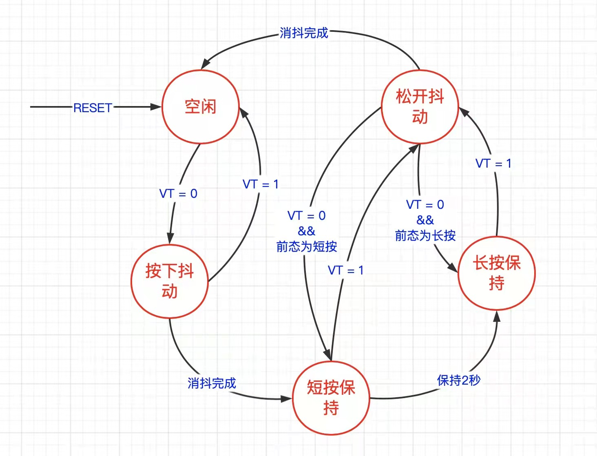

# 嵌入式代码规范

https://ilcc.gitbooks.io/wiki/content/StyleGuide/Huawei-C/index.html


# 裸机程序架构

轮询模式：一个while循环里包含所有的操作函数，当某一操作执行时间太长时会影响到另一函数的执行，从而导致实时性问题。

状态机＋时间片前后台：

- 状态机：任务状态分解。
- 前后台：主轮询和定时器中断。（时间片前后台系统，是前后台系统中的一种）

前后台系统中，同样有着轮询模式的缺点，也就是函数之间的相互影响并没有消除。不过可以通过引入状态机来降低两个很耗时函数之间的相互影响。如果遇到不易拆分为多个状态的两个函数，并且这些状态的执行时间不好控制时，就需要引入多任务系统了。

总结：裸机程序框架中，只要需求不是太过于复杂，状态机+时间片前后台系统至少可以满足至少90%的裸机开发需求。什么时候能上实时操作系统？单片机资源充足，程序过于复杂不好把控的时候，使用实时操作系统可以大大提高开发效率，如果你觉得裸机开发不爽了但单片机资源足够上操作系统的时候，那就使用实时系统。


## 时间片

TMT和MultiTimer。

时间片：

1. 硬件定时器提供时间基准：tick_1ms、tick_10ms、tick_100ms。
2. 定时中断中对时间进行计数：如果定时中断为1ms进入一次，那么计数到10就表示时间轴上的10ms处。
3. 对时间的不同的计数值对应不同的任务，当计数值到达后，就允许执行相应任务，并且将当前技术值归0。（相当于一个状态标志一样，例如时间轴上10ms这个点到了，然后置个标志位，通知相应任务可以去执行了，只不过要注意一个时间片内必须执行完任务，或者加入状态机进行更细致的控制。）

```c
static unsigned char flag_1ms;
static unsigned char flag_10ms;
static unsigned char flag_100ms;
static unsigned char flag_1000ms;
// 时间片：1ms
void timer_irq() //1ms中断中调用
{
	static unsigned char tick_1ms;
	static unsigned char tick_10ms;
	static unsigned char tick_100ms;
	tick_1ms++;
	if(tick_1ms >= 10)
	{
		tick_1ms = 0;
		flag_10ms = 1;
		tick_10ms++;
		if(tick_10ms >= 10)
		{
			tick_10ms = 0;
			flag_100ms = 1;
			tick_100ms++;
			if(tick_100ms >= 10)
			{
				tick_100ms = 0;
				flag_1000ms = 1;
			}
		}
	}
}

void timer_loop()// while(1)大循环中调用
{
	if(flag_1ms == 1)
	{
		flag_1ms = 0;
		// 1ms时间片程序——任务1
	}
	if(flag_10ms == 1)
	{
		flag_10ms = 0;
		// 10ms时间片程序——任务2
	}
	if(flag_100ms == 1)
	{
		flag_100ms = 0;
		// 100ms时间片程序——任务3
	}
	if(flag_1000ms == 1)
	{
		flag_1000ms = 0;
		// 1000ms时间片程序——任务4
	}
}
```


### TMT架构

TMT简介：

>一个采用面向对象思想封装的适用于裸机的前后台系统框架，本质是时间片运行机制，类似软件定时器。支持市面上所有常见的MCU，移植非常简单。

前后台系统：

>裸机开发中常用的一种框架，即中断服务函数为前台，main函数内的无限循环体为后台。变量在前台计数，到达设定的计数值（即一定时间）后，置出相应的标志位，然后在后台判断，并执行相应的代码。
>
>- 中断服务函数（前台）：通常是一个定时器中断服务函数，该函数中通常是用于对事件进行监听，置相应的状态后进行状态转移。前台的主要作用就是，及时接收外部信息。（接收）（事件）
>- 主循环（后台）：执行实现操作的具体代码，处理信息并进行相对应操作，后台是对前台接收到的信息后的进一步响应。（处理）（响应）
>
>时间片前后台系统：每一个时间片区，都有对应要运行的代码。


### MultiTimer架构


## 状态机

状态机四要素：状态、状态转移、转移条件、动作。

从大到小，大任务包含小任务，大状态机包含小状态机。


## 案例

按键功能需求：通过按键控制一个变量

- 按键按下，变量加1
- 按键按下并保持2s后，进入长按状态
- 长按状态下，每间隔200ms，变量自动加1
- 按键按下和弹起需要做防抖

状态转移图——按键：



```c
switch(state)
    {
        /*
         * 空闲状态下检测按键电平，如果检测到低电平，表示可能按键被按下
         */
        case state_idle:
        {
            if(HAL_GetTick() - old_time > 1000)  //空闲时，每间隔1秒输出等待按键提示信息
            {
                    printf("state idle, waiting for key press...\n");
                    old_time = HAL_GetTick();
            }

            if(func_isKeyLevelLow())		//检测到低电平，按键可能被按下，需要进行消抖来进一步判断
            {
                check_time = HAL_GetTick();	//为state_press_and_vibration初始化check_time，设置首次开始消抖检测的时间
                counter = 5;	//为state_press_and_vibration初始化counter，设置消抖检测次数为5

                state = state_press_and_vibration;	//跳转到state_press_and_vibration状态
            }
            } break;
            /*
             * 对按下动作进行消抖，每间隔10ms检测一次按键状态，如果连续counter(5)次检测到低电平，表示按键稳定按下，
             否则表示仍处于抖动中
             */
        case state_press_and_vibration:
        {
            if(counter)			//检测次数没用完，仍需接着检测按键电平
            {
                if(HAL_GetTick() - check_time > 10)		//每隔10ms检测一次按键电平
                {
                    if(!func_isKeyLevelLow())		//如果检测到一次高电平，表明有抖动，则返回空闲状态
                    {
                        old_time = HAL_GetTick();		//为state_idle初始化old_time

                        state = state_idle;
                    }
                    else	//如果未检测到抖动，则更新本次检测的时间，将counter减1
                    {
                        check_time = HAL_GetTick();					//记录本次消抖时间
                        counter--;													//检测次数减1
                    }
                }
            }
            else																										//已经检测到5次低电平，表示按键确实按下，并且已经处于稳定状态
            {
                printf(">>>>>>> short press, value = %u\n", ++value);	//将value的计数值加1并打印输出
                old_time = HAL_GetTick();					//为state_short_press初始化old_time

                state = state_short_press;					//跳转到state_short_press状态	
            }
        } break;
            /*
             * 按键状态稳定之后，需要继续监测按键电平的状态，如果按下的时间超过2秒，则判断为长按按键
             */
            case state_short_press:
            {
                if(HAL_GetTick() - old_time > 2000)		//短按已经保持了2秒，进入长按状态
                {
                    old_time = HAL_GetTick();			//为state_long_press初始化old_time

                    state = state_long_press;			//跳转到state_long_press状态
                }
                else if(func_isKeyLevelHigh())//如果短按的过程中，检测到按键高电平，表示有可能放开了按键，需要消抖来进一步判断
                {
                    check_time = HAL_GetTick();	//为state_release_and_vibration初始化check_time
                    counter = 5;    			//为state_release_and_vibration初始化counter

                    last_state = state;			 	//备份当前状态，方便从消抖状态中返回
                    state = state_release_and_vibration;	 //切换状态至消抖
                }
            } break;
            /*
             * 长按状态下，需要继续监测按键电平的状态，并且每间隔200ms，将value加1，打印输出
             * 如果检测到有高电平，表示发生抖动
             */
            case state_long_press:
            {
                if(HAL_GetTick() - old_time > 200)		 //每间隔200ms，value增加1
                {
                    printf(">>>>>>> long press, value = %u\n", ++value);
                    old_time = HAL_GetTick();
                }

                if(func_isKeyLevelHigh())//如果长按的过程中，检测到按键高电平，表示有可能放开了按键，需要消抖来进一步判断
                {
                    check_time = HAL_GetTick();		//为state_release_and_vibration初始化check_time
                    counter = 5;				//为state_release_and_vibration初始化counter

                    last_state = state;				//备份当前状态，方便从消抖状态中返回
                    state = state_release_and_vibration;      //切换状态至消抖
                }
            } break;
            /*
             * 对松开的动作进行消抖，每间隔10ms检测按键状态，如果连续counter(5)次检测到高电平，表示按键稳定松开，否则表示仍处于抖动中
             */
            case state_release_and_vibration:
            {
                if(counter)						//检测次数没用完，仍需接着检测按键电平
                {
                    if(HAL_GetTick() - check_time > 10)			//每隔10ms检测一次按键电平
                    {
                        if(!func_isKeyLevelHigh())		//如果检测到一次低电平，表明有抖动，则返回之前的状态
                        {
                            state = last_state;
                        }
                        else						//如果未检测到抖动，则更新本次检测的时间，将counter减1
                        {
                            check_time = HAL_GetTick();
                            counter--;
                        }
                    }
                }
                else			//已经检测到counter(5)次高电平，表示按键确实松开，并且已经处于稳定状态
                {
                    old_time = HAL_GetTick();

                    state = state_idle;		//跳转到state_idle状态	
                }
            } break;
            default: break;
        }
```

实现方式二：

```c
void func_keyDetect(uint8_t *p_keyPress, uint8_t *p_longPress)
{
	static uint8_t counter, last_state, state = state_idle;
	static uint32_t check_time, old_time;
	
	if(!p_keyPress || !p_longPress) return;
	
	switch(state)
	{
		/*
		 * 空闲状态下检测按键电平，如果检测到低电平，表示可能按键被按下
		 */
		case state_idle:
		{
			if(HAL_GetTick() - old_time > 1000) 	//空闲时，每间隔1秒输出等待按键提示信息
			{
					printf("state idle, waiting for key press...\n");
					old_time = HAL_GetTick();
			}
			
			if(func_isKeyLevelLow())		//检测到低电平，按键可能被按下，需要进行消抖来进一步判断
			{
				check_time = HAL_GetTick();	//为state_press_and_vibration初始化check_time，设置首次开始消抖检测的时间
				counter = 5;		//为state_press_and_vibration初始化counter，设置消抖检测次数为5
				
				state = state_press_and_vibration;		//跳转到state_press_and_vibration状态
			}
		} break;
		/*
		 * 对按下动作进行消抖，每间隔10ms检测一次按键状态，如果连续counter(5)次检测到低电平，表示按键稳定按下，否则表示仍处于抖动中
		 */
		case state_press_and_vibration:
		{
			if(counter)					//检测次数没用完，仍需接着检测按键电平
			{
				if(HAL_GetTick() - check_time > 10)			//每隔10ms检测一次按键电平
				{
					if(!func_isKeyLevelLow())			//如果检测到一次高电平，表明有抖动，则返回空闲状态
					{
						old_time = HAL_GetTick();			//为state_idle初始化old_time
						
						state = state_idle;
					}
					else		//如果未检测到抖动，则更新本次检测的时间，将counter减1
					{
						check_time = HAL_GetTick();			//记录本次消抖时间
						counter--;							//检测次数减1
					}
				}
			}
			else																										//已经检测到5次低电平，表示按键确实按下，并且已经处于稳定状态
			{
				if(*p_keyPress == 0) *p_keyPress = 1; 			//按下按键，设置keyPress标志
				old_time = HAL_GetTick();			//为state_short_press初始化old_time
				
				state = state_short_press;														//跳转到state_short_press状态	
			}
		} break;
		/*
		 * 按键状态稳定之后，需要继续监测按键电平的状态，如果按下的时间超过2秒，则判断为长按按键
		 */
		case state_short_press:
		{
			if(*p_keyPress == 1) *p_keyPress = 0; 		//短按过程中，value不需要自加，所以要清除keyPress标志
			
			if(HAL_GetTick() - old_time > 2000)			//短按已经保持了2秒，进入长按状态
			{
				if(*p_longPress == 0) *p_longPress = 1;		//长按按键，设置longPress标志
				old_time = HAL_GetTick();			//为state_long_press初始化old_time
				
				state = state_long_press;			//跳转到state_long_press状态
			}
			else if(func_isKeyLevelHigh())			//如果短按的过程中，检测到按键高电平，表示有可能放开了按键，需要消抖来进一步判断
			{
				check_time = HAL_GetTick();			//为state_release_and_vibration初始化check_time
				counter = 5;			//为state_release_and_vibration初始化counter
					
				last_state = state;					//备份当前状态，方便从消抖状态中返回
				state = state_release_and_vibration;			//切换状态至消抖
			}
		} break;
		/*
		 * 长按状态下，需要继续监测按键电平的状态，并且每间隔200ms，将value加1，打印输出
		 * 如果检测到有高电平，表示发生抖动
		 */
		case state_long_press:
		{
			if(HAL_GetTick() - old_time > 200)			//每间隔200ms，value增加1
			{
				old_time = HAL_GetTick();
			}
			
			if(func_isKeyLevelHigh())	//如果长按的过程中，检测到按键高电平，表示有可能放开了按键，需要消抖来进一步判断
			{
				check_time = HAL_GetTick();			//为state_release_and_vibration初始化check_time
				counter = 5;					//为state_release_and_vibration初始化counter
				
				last_state = state;						//备份当前状态，方便从消抖状态中返回
				state = state_release_and_vibration;      //切换状态至消抖
			}
		} break;
		/*
		 * 对松开的动作进行消抖，每间隔10ms检测按键状态，如果连续counter(5)次检测到高电平，表示按键稳定松开，否则表示仍处于抖动中
		 */
		case state_release_and_vibration:
		{
			if(counter)						//检测次数没用完，仍需接着检测按键电平
			{
				if(HAL_GetTick() - check_time > 10)		//每隔10ms检测一次按键电平
				{
					if(!func_isKeyLevelHigh())			//如果检测到一次低电平，表明有抖动，则返回之前的状态
					{
						state = last_state;
					}
					else																		//如果未检测到抖动，则更新本次检测的时间，将counter减1
					{
						check_time = HAL_GetTick();
						counter--;
					}
				}
			}
			else				//已经检测到counter(5)次高电平，表示按键确实松开，并且已经处于稳定状态
			{
				if(*p_longPress == 1) *p_longPress = 0;	  //长按结束，清除longPress标志
				old_time = HAL_GetTick();
				
				state = state_idle;						//跳转到state_idle状态	
			}
		} break;
		default: break;
	}
}
```

```c
void func_valueControl(uint32_t *p_value, uint8_t shortPress, uint8_t longPress)
{
	static uint32_t old_time;
	
	if(!p_value) return;
	
	if(shortPress)                         //按下按键，value增加1
	{
		printf(">>>>>>> short press, value = %u\n", ++(*p_value));
	}
	
	if(longPress)
	{
		if(HAL_GetTick() - old_time > 200)			//长按按键，每间隔200ms，value增加1
		{
			printf(">>>>>>> long press, value = %u\n", ++(*p_value));
			old_time = HAL_GetTick();
		}
	}
}
```

```c
/* 状态检测与功能实现进行解耦 */  
while (1)
  {
    /* USER CODE END WHILE */

    /* USER CODE BEGIN 3 */
        //检测按键
        func_keyDetect(&shortPress, &longPress);

        //控制value
        func_valueControl(&value, shortPress, longPress);
  }
```


## 分层状态机＋事件驱动


# 实时操作系统


# 超低功耗方案

就一个思路，工作时、休眠时电流要尽可能地小。

1. 不影响使用体验的情况下，外接模块能关则关。
2. 软件，尽量使用中断驱动，去唤醒主控。
3. 合适的主频，不影响实时性的情况下，可以关掉一些时钟、调低主频。
4. 主控的低功耗支持——睡眠休眠等。

>1：选型：
> 选型是一个系统工程，需要兼顾性能、成本、供货、交期等多种因素。
>
>选择合适的MCU内核：MCU内核选型以“够用就好”为原则。在8位机能满足系统需求时，就没有必须选择当前更为流行的32位机；在32位机中可选择cortex-m3/m0等不同构架时，选择m0。单片机的构架越复杂，集成度越高，功能越强大，就意味着片内集体管越多，往往总漏电流也越大。虽然目前ARM结构的32为单片机大行其道，但是也有很多芯片厂商的低功耗8位单片机产品可供选择，如ST的STM8L系列，Silicon Labs的EFM8系列等。
>
>选择低电压供电，更宽的电压范围的MCU：MCU供电电压低，可以有效降低功耗。更宽的供电范围意味着可延长电池的使用时间，不至于电池电压下降后，MCU就无法正常工作。
>
>选择多更多低功耗模式的MCU：带低功耗模式的MCU，往往具有多种不同的运行模式可供选择。不同的运行模式意味着不同的功耗级别，开发者可根据不同的应用级别进入不同的功耗模式。
>
>外围电路芯片选型也执行同样的原则，工作电压尽量低，工作电流/待机电流尽量小，如低功耗LDO，升压芯片等。
>
>在满足同等功能情况下，外部器件选型应优先选择带触发输出功能的器件而非需查询的器件。触发输出器件可在达到触发条件之后通过中断唤醒MCU，处理触发逻辑，平时MCU可一直处于睡眠状态。而查询类器件需MCU做定时唤醒功能来查询外部器件状态。
>
>2：硬件设计
>外围电路电源管理：对于不需要一直工作的外围器件，不工作时应关断该部分电源已达到最低功耗。可采用MOS管电路配合MCU控制实现局部电源开关实现电源管理。
>
>在GPIO口输入输出设计上应该注意触发时的电平状态，是否存在待机模式下漏电可能。如普通电路设计上，按键一般设计为低电平有效，通过上拉电阻确定在普通状态下的电平。在低功耗系统中，系统基本处于睡眠状态，按钮须用于外部中断唤醒，无法通过软件来设置GPIO状态达到节能状态。此时若使用上拉方式，上拉10K的电阻，就意味着300uA的电流消耗。这种应用就应该改为默认是低电平，按下按钮为高电平有效，可有效降低功耗。
>
>关注上拉/下拉电阻值，如I2C电路必须使用上拉电阻，该上拉电阻阻值在低功耗产品中，既影响I2C总线通讯速度，又影响系统功耗，应综合取舍。
>
>3：嵌入式软件设计
>降低时钟频率：更高的时钟频率意味着更快的MCU运行速度，那么MCU内部CMOS电路就更快的开关频率，导致更高的运行电流和待机电流。在低功耗软件设计中，进入睡眠模式后应关闭倍频。
>
>合理使用低功耗MCU的多种待机模式：低功耗MCU都具有不同的待机模式，同时不同的待机模式具有不同的功能和不同的功耗。在某些深度睡眠模式下可能需要特殊的唤醒方式，唤醒后处理方式也不尽相同。合理的配置进入不同的待机模式/唤醒模式，对于延长待机时间有重要意思。
>
>睡眠状态下尽可能使用中断唤醒：一般的低功耗单片机中断都具有唤醒功能，在软件设计时就应使用这些中断达到睡眠状态快速唤醒，避免过多的定时唤醒。
>
>合理处理外设：使能的外设越多，功耗越大。不需要使用的外设，一定要关闭，需要临时使用的外设只能在使用期间使能，使用完成后立即关闭。进入睡眠状态下只开启需要唤醒的外设。
>
>合理配置GPIO：GPIO在唤醒后，处理对应功能才恢复对应GPIO口，如需内置上拉/下拉功能在此时才使能，使用完成后立刻恢复，避免由于上拉或下拉形成回路产生不必要的功耗。在未启用对应GPIO功能状态时，如果此GPIO口带上拉，设置为高电平输出；如此GPIO带下拉，设置为低电平输出。
>
>合理配置未使用的GPIO口：应将未使用的GPIO口输出至高电平或低电平
>
>重点关注模拟接口：模拟功能一般都是耗电大户，在MCU使用中最常使用的AD/DA功能，在软件设计中应重点关注，控制使用模拟功能的时间。
>
>合理使用DMA和FIFO缓冲区：DMA控制器是功能强大的可降低功耗的工具。DMA通过分担CPU的数据传输任务来提高性能，同时减少CPU运行时间。
>
>LED：LED在低功耗系统中也是耗电大户，可通过PWM方式驱动LED，有效降低功耗。
>
>测量功耗时，断开调试器。由于连接调试器后，调试器会拉高/低当前连接芯片的调试口，会导致功耗异常。
>————————————————
>
>原文链接：https://blog.csdn.net/flyingcys/article/details/81842362

>下面列出在设计低功耗时需要注意的五点。
>
>​    1、掐断外设命脉——关闭外设时钟
>
>​    先说最直观的，也是我们都比较注意的方面，就是关闭MCU的外设时钟。对于现在大多数的MCU，其外设模块都对应着一个时钟开关，只要打开这个外设时钟，就可以正常使用该外设了，当然，该外设也就会产生相应的功耗；反之，如果想要让这个外设不产生功耗，一般只需要关闭该外设时钟即可。
>
>​    2、让工作节奏慢下来——时钟不要倍频
>
>​    除了外设模块功耗消耗之外，还有一个功耗大户，那就是PLL和FLL模块。PLL和FLL主要是用来对原始的时钟信号进行倍频操作，从而提高系统得整体时钟，相应的其功耗也会被提上去。所以在进入低功耗前，需要切换时钟模式，旁路掉PLL和FLL模块，等到MCU唤醒之后再把时钟切换回去。
>
>​    3、围堵涓涓细流——注意IO口的电平状态
>
>​    如果认为只要关闭外设时钟就能够保证外设不在耗电，那你就真的太年轻了。如果IO口没有做好处理的话，它就会在暗地里偷走功耗，而你却浑然不知。具体原因是这样的，一般IO内部或者外部都会有上下拉电阻，举个例子如下图所示，假设某个IO口有个10KΩ的上拉电阻，根据欧姆定律，此引脚就会消耗3.3V/10K=0.33mA的电流，假如有四、五个这样的IO口，那么几个毫安的电流就这样贴进去了，太可惜了。
>
>​    所以在进入低功耗之前，请逐个检查IO的状态：
>
>​    如果该IO口带上拉，请设置为高电平输出或者高阻态输入；
>
>​    如果该IO口带下拉，请设置为低电平输出或者高阻态输入；
>
>​    4、睦邻友好合作——注意IO与外设IC的统筹
>
>​    IO口的上下拉电阻消耗电流这一因素相抵比较明显，下面咱们来说一个不明显的因素：IO口与外部IC相连时的电流消耗。假如某个IO口自带上拉，而与此IO相连的IC引脚偏偏是自带下拉的，那么无论这个引脚处于什么样的电平输出，都不可避免的会产生一定的电流消耗。所以凡是遇到这一类的情况，首先需要阅读外设IC的手册，确定好此引脚的状态，做到心中有数；然后再控制MCU睡眠前，设置好MCU的IO的上下拉模式及输入输出状态，要保证一丝儿电流都不要被它消耗掉。
>
>​    5、断开调试器连接——不要被假象所迷惑
>
>​    还有一类比较奇特，检测出来的电流消耗很大，可实际结果是自己杞人忧天，什么原因呢？是因为在测试功耗的时候MCU还连着调试器呢！这时候大部分电流就会被调试器给掳走，平白无故的让我们产生极度郁闷的心情。所以在测试低功耗的时候，一定不要连接着调试器，更不要边调试边测电流。
>
>[MCU设计低功耗时需要注意的五点 - wdliming - 博客园 (cnblogs.com)](https://www.cnblogs.com/CodeWorkerLiMing/p/14496715.html)


# 软件框架

[嵌入式开发绝招：状态机+事件驱动框架_嵌入式状态机框架-CSDN博客](https://blog.csdn.net/FMgxth/article/details/135100923)

架构：时间片+状态机+事件+消息队列。

- 时间片：低功耗定时器驱动。
- 状态机：表驱动or switch case。
- 事件：伪事件，上层状态机。
- ~~消息队列：~~


# Module

## 面向对象


## 触摸&背光

硬件：

- 触摸芯片GTX314L。
- 背光 —— 高亮LED。

>这份文档是针对使用GTX314L,GTX312L芯片做智能锁产品的时候的设计建议和注意事项，根据项目形态不同会略有差异，可以根据客户实际情况进行调整。
>
>硬件设计注意事项：
>
>1）VDD供电要稳定，电池通过LDO后单独拉线供电,建议不要和主控和其他芯片串在一起供电。
>
>2）RIN 脚的电容挂10PF左右，智能锁上现有客户主要都是挂6.8PF和10PF为主。
>
>3）芯片VDD电压和外围上拉的VDD要一致，不一致的时候和请单独咨询。
>
>4）从芯片的SIN脚到按键焊盘的走线尽量短，SIN线和SIN线之间的间距越大越好，平行走线数量越少越好。
>
>5）SIN线上的电阻靠近芯片，也可以根据版型情况去掉这个电阻。
>
>6）SIN和RIN线的旁边和底层不要有地，旁边的地和底层的地要和SIN线的距离保持 0.5mm以上，越大越好，若是无法保证0.5mm以上间距的时候也可以缩短，请具体咨询技术支持人员。
>
>7）SIN线和天线的间距越大越好，SIN线和天线不管是在同一层或者不同层，平行走的距离越短越好，SIN线和天线在不同层之间可以交叉走线,SIN线和天线走线尽量不要重叠，稍微重叠一点没关系,但不要完全重叠。
>
>8）音频线不要走芯片下面,晶振尽量不要放在芯片和按键焊盘背面。

电容式触摸按键原理：

- 金属板与地之间有一个杂散电容，人也相当于一个电容，当人手指按到金属板时，金属板对地总电容就为杂散电容加上人体等效电容。电容分压，按按键后电压值会变低，根据这个状态变化，再利用ADC来检测出高低压，这样就能知道是否触摸。
- （注：电容触摸原理就两种，一种是检测交流信号的幅值，另一种是检测交流信号的频率。）

GTX314的使用：

- I2C通讯。


触摸按键使用面向对象来写：

- 结构体：struct TouchKey。
- 属性：从机地址、设备ID号。
- 方法：I2C方法——指定地址写、指定地址读，读取按键状态。
- [BS814A触摸芯片用法，IIC(I2C)使用讲解以及实例代码基于C语言-CSDN博客](https://blog.csdn.net/weixin_47869185/article/details/121377166)
- [C语言，在定时器中断模式中，单个按键 连续按下两次（开关灯） 和长时间按下（开关灯）功能_再次按下用c语言怎么表达-CSDN博客](https://blog.csdn.net/weixin_47869185/article/details/117412440?spm=1001.2014.3001.5502)


背光灯使用宏与FSP库方法来写。

https://blog.csdn.net/qq_43499622/article/details/97164881


https://www.cnblogs.com/debugdabiaoge/p/15772780.html


# 基本功能

模块：

- 指纹模块。
- RF-IC card模块。
- touch key 模块+指示灯。
- 语音模块。
- 电机模块。
- RGB提示灯。
- 独立按键：开关锁按键、重置按键、防盗按键、门铃按键（触摸的#号键）。
- Flash模块：存储信息。

基本功能：触摸按键及拨码菜单，指纹、密码、卡片解锁，各种提示灯，开关锁、重置、防撬、门铃单独按键，语音提示，休眠——低功耗。

触摸按键&拨码菜单：

- 触摸时唤醒，使用MCU中断唤醒功能，从休眠状态中唤醒。唤醒后拨码菜单（未进入菜单前）、指纹、卡片均正常工作——此时指纹、卡片可触发中断并解锁。
- 进入拨码菜单后，拨码菜单独占线程，指纹、卡片关断。
- 拨码菜单：各种设置功能。
- 特殊按键功能：*号键——退出与删除；#号键——确认与门铃。

RFIC-Card：

- 低功耗唤醒，读取与校验卡密。
- 卡密读取与存储。
- 刷卡灵敏度调整。

指纹：

- 唤醒主控。
- 串口通信，传递指纹模块学习。
- 

## 触摸按键

触摸芯片：GTX314L

通讯方式：I2C

逻辑流程：

1. 初始状态——状态0，中断触发状态转移 → 状态1，唤醒与按键指示灯亮起，开始按键扫描。
2. 按键扫描——状态1，数据存入先进后出队列，
   - 当队列为空并按3次*号键触发状态转移 → 转移回初始状态0，进入休眠；
   - 当队列不为空，按到#号键，触发校验，发生状态转移 → 状态2，校验数据并提示，校验失败后退回上一状态—— 状态1
     - 校验成功后，发生状态转移，进入状态3（拨码菜单）——开始新一层状态机
   - 当无任何操作，5s号退出状态，状态转移到初始状态并进入休眠。
3. 拨码菜单首页——状态3，数据存入先进后出队列，
   - 当队列为空并按3次*号键触发状态转移 → 转移回初始状态0，进入休眠；
   - 当队列不为空，按到#号键，触发校验，发生状态转移 → 状态x，校验数据并提示，校验失败后退回上一状态—— 状态1
   - 同理套娃


## RFID CARD

读卡芯片：WS1850S

通讯方式：SPI


## 指纹

通讯：异步串口。

指令格式：

- 指令：包头（命令包）+数据（数据包）+包尾（结束包）。（主机 → 从机）
- 应答：确认码。（从机 → 主机）


# 蓝牙


# WiFi

## 涂鸦WiFi模块

通讯：异步串口。


## 猫眼WiFi

通讯：异步串口。


# 雷达&人脸

人脸识别模块通讯：异步串口。


