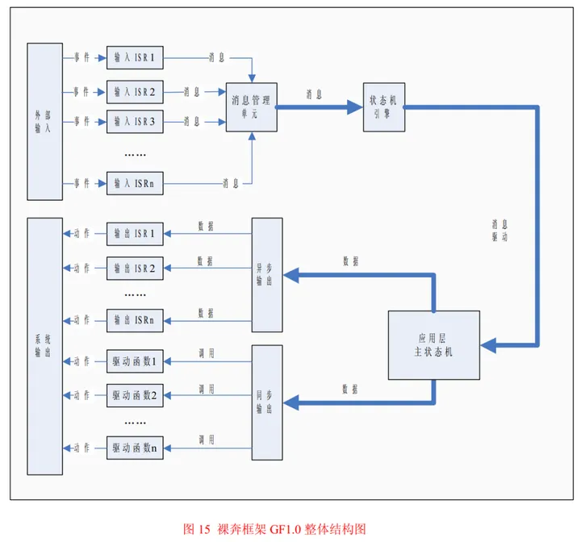

# 嵌入式代码规范

https://ilcc.gitbooks.io/wiki/content/StyleGuide/Huawei-C/index.html


# 裸机程序架构

轮询模式：一个while循环里包含所有的操作函数，当某一操作执行时间太长时会影响到另一函数的执行，从而导致实时性问题。

状态机＋时间片前后台：

- 状态机：任务状态分解。
- 前后台：主轮询和定时器中断。（时间片前后台系统，是前后台系统中的一种）

前后台系统中，同样有着轮询模式的缺点，也就是函数之间的相互影响并没有消除。不过可以通过引入状态机来降低两个很耗时函数之间的相互影响。如果遇到不易拆分为多个状态的两个函数，并且这些状态的执行时间不好控制时，就需要引入多任务系统了。

总结：裸机程序框架中，只要需求不是太过于复杂，状态机+时间片前后台系统至少可以满足至少90%的裸机开发需求。什么时候能上实时操作系统？单片机资源充足，程序过于复杂不好把控的时候，使用实时操作系统可以大大提高开发效率，如果你觉得裸机开发不爽了但单片机资源足够上操作系统的时候，那就使用实时系统。


## 时间片

TMT和MultiTimer。

时间片：

1. 硬件定时器提供时间基准：tick_1ms、tick_10ms、tick_100ms。
2. 定时中断中对时间进行计数：如果定时中断为1ms进入一次，那么计数到10就表示时间轴上的10ms处。
3. 对时间的不同的计数值对应不同的任务，当计数值到达后，就允许执行相应任务，并且将当前技术值归0。（相当于一个状态标志一样，例如时间轴上10ms这个点到了，然后置个标志位，通知相应任务可以去执行了，只不过要注意一个时间片内必须执行完任务，或者加入状态机进行更细致的控制。）

```c
static unsigned char flag_1ms;
static unsigned char flag_10ms;
static unsigned char flag_100ms;
static unsigned char flag_1000ms;
// 时间片：1ms
void timer_irq() //1ms中断中调用
{
	static unsigned char tick_1ms;
	static unsigned char tick_10ms;
	static unsigned char tick_100ms;
	tick_1ms++;
	if(tick_1ms >= 10)
	{
		tick_1ms = 0;
		flag_10ms = 1;
		tick_10ms++;
		if(tick_10ms >= 10)
		{
			tick_10ms = 0;
			flag_100ms = 1;
			tick_100ms++;
			if(tick_100ms >= 10)
			{
				tick_100ms = 0;
				flag_1000ms = 1;
			}
		}
	}
}

void timer_loop()// while(1)大循环中调用
{
	if(flag_1ms == 1)
	{
		flag_1ms = 0;
		// 1ms时间片程序——任务1
	}
	if(flag_10ms == 1)
	{
		flag_10ms = 0;
		// 10ms时间片程序——任务2
	}
	if(flag_100ms == 1)
	{
		flag_100ms = 0;
		// 100ms时间片程序——任务3
	}
	if(flag_1000ms == 1)
	{
		flag_1000ms = 0;
		// 1000ms时间片程序——任务4
	}
}
```


### TMT架构

TMT简介：

>一个采用面向对象思想封装的适用于裸机的前后台系统框架，本质是时间片运行机制，类似软件定时器。支持市面上所有常见的MCU，移植非常简单。

前后台系统：

>裸机开发中常用的一种框架，即中断服务函数为前台，main函数内的无限循环体为后台。变量在前台计数，到达设定的计数值（即一定时间）后，置出相应的标志位，然后在后台判断，并执行相应的代码。
>
>- 中断服务函数（前台）：通常是一个定时器中断服务函数，该函数中通常是用于对事件进行监听，置相应的状态后进行状态转移。前台的主要作用就是，及时接收外部信息。（接收）（事件）
>- 主循环（后台）：执行实现操作的具体代码，处理信息并进行相对应操作，后台是对前台接收到的信息后的进一步响应。（处理）（响应）
>
>时间片前后台系统：每一个时间片区，都有对应要运行的代码。


### MultiTimer架构


## 状态机

状态机四要素：状态、状态转移、转移条件、动作。

从大到小，大任务包含小任务，大状态机包含小状态机。


## 案例

按键功能需求：通过按键控制一个变量

- 按键按下，变量加1
- 按键按下并保持2s后，进入长按状态
- 长按状态下，每间隔200ms，变量自动加1
- 按键按下和弹起需要做防抖

状态转移图——按键：


```c
switch(state)
    {
        /*
         * 空闲状态下检测按键电平，如果检测到低电平，表示可能按键被按下
         */
        case state_idle:
        {
            if(HAL_GetTick() - old_time > 1000)  //空闲时，每间隔1秒输出等待按键提示信息
            {
                    printf("state idle, waiting for key press...\n");
                    old_time = HAL_GetTick();
            }

            if(func_isKeyLevelLow())		//检测到低电平，按键可能被按下，需要进行消抖来进一步判断
            {
                check_time = HAL_GetTick();	//为state_press_and_vibration初始化check_time，设置首次开始消抖检测的时间
                counter = 5;	//为state_press_and_vibration初始化counter，设置消抖检测次数为5

                state = state_press_and_vibration;	//跳转到state_press_and_vibration状态
            }
            } break;
            /*
             * 对按下动作进行消抖，每间隔10ms检测一次按键状态，如果连续counter(5)次检测到低电平，表示按键稳定按下，
             否则表示仍处于抖动中
             */
        case state_press_and_vibration:
        {
            if(counter)			//检测次数没用完，仍需接着检测按键电平
            {
                if(HAL_GetTick() - check_time > 10)		//每隔10ms检测一次按键电平
                {
                    if(!func_isKeyLevelLow())		//如果检测到一次高电平，表明有抖动，则返回空闲状态
                    {
                        old_time = HAL_GetTick();		//为state_idle初始化old_time

                        state = state_idle;
                    }
                    else	//如果未检测到抖动，则更新本次检测的时间，将counter减1
                    {
                        check_time = HAL_GetTick();					//记录本次消抖时间
                        counter--;													//检测次数减1
                    }
                }
            }
            else																										//已经检测到5次低电平，表示按键确实按下，并且已经处于稳定状态
            {
                printf(">>>>>>> short press, value = %u\n", ++value);	//将value的计数值加1并打印输出
                old_time = HAL_GetTick();					//为state_short_press初始化old_time

                state = state_short_press;					//跳转到state_short_press状态	
            }
        } break;
            /*
             * 按键状态稳定之后，需要继续监测按键电平的状态，如果按下的时间超过2秒，则判断为长按按键
             */
            case state_short_press:
            {
                if(HAL_GetTick() - old_time > 2000)		//短按已经保持了2秒，进入长按状态
                {
                    old_time = HAL_GetTick();			//为state_long_press初始化old_time

                    state = state_long_press;			//跳转到state_long_press状态
                }
                else if(func_isKeyLevelHigh())//如果短按的过程中，检测到按键高电平，表示有可能放开了按键，需要消抖来进一步判断
                {
                    check_time = HAL_GetTick();	//为state_release_and_vibration初始化check_time
                    counter = 5;    			//为state_release_and_vibration初始化counter

                    last_state = state;			 	//备份当前状态，方便从消抖状态中返回
                    state = state_release_and_vibration;	 //切换状态至消抖
                }
            } break;
            /*
             * 长按状态下，需要继续监测按键电平的状态，并且每间隔200ms，将value加1，打印输出
             * 如果检测到有高电平，表示发生抖动
             */
            case state_long_press:
            {
                if(HAL_GetTick() - old_time > 200)		 //每间隔200ms，value增加1
                {
                    printf(">>>>>>> long press, value = %u\n", ++value);
                    old_time = HAL_GetTick();
                }

                if(func_isKeyLevelHigh())//如果长按的过程中，检测到按键高电平，表示有可能放开了按键，需要消抖来进一步判断
                {
                    check_time = HAL_GetTick();		//为state_release_and_vibration初始化check_time
                    counter = 5;				//为state_release_and_vibration初始化counter

                    last_state = state;				//备份当前状态，方便从消抖状态中返回
                    state = state_release_and_vibration;      //切换状态至消抖
                }
            } break;
            /*
             * 对松开的动作进行消抖，每间隔10ms检测按键状态，如果连续counter(5)次检测到高电平，表示按键稳定松开，否则表示仍处于抖动中
             */
            case state_release_and_vibration:
            {
                if(counter)						//检测次数没用完，仍需接着检测按键电平
                {
                    if(HAL_GetTick() - check_time > 10)			//每隔10ms检测一次按键电平
                    {
                        if(!func_isKeyLevelHigh())		//如果检测到一次低电平，表明有抖动，则返回之前的状态
                        {
                            state = last_state;
                        }
                        else						//如果未检测到抖动，则更新本次检测的时间，将counter减1
                        {
                            check_time = HAL_GetTick();
                            counter--;
                        }
                    }
                }
                else			//已经检测到counter(5)次高电平，表示按键确实松开，并且已经处于稳定状态
                {
                    old_time = HAL_GetTick();

                    state = state_idle;		//跳转到state_idle状态	
                }
            } break;
            default: break;
        }
```

实现方式二：

```c
void func_keyDetect(uint8_t *p_keyPress, uint8_t *p_longPress)
{
	static uint8_t counter, last_state, state = state_idle;
	static uint32_t check_time, old_time;
	
	if(!p_keyPress || !p_longPress) return;
	
	switch(state)
	{
		/*
		 * 空闲状态下检测按键电平，如果检测到低电平，表示可能按键被按下
		 */
		case state_idle:
		{
			if(HAL_GetTick() - old_time > 1000) 	//空闲时，每间隔1秒输出等待按键提示信息
			{
					printf("state idle, waiting for key press...\n");
					old_time = HAL_GetTick();
			}
			
			if(func_isKeyLevelLow())		//检测到低电平，按键可能被按下，需要进行消抖来进一步判断
			{
				check_time = HAL_GetTick();	//为state_press_and_vibration初始化check_time，设置首次开始消抖检测的时间
				counter = 5;		//为state_press_and_vibration初始化counter，设置消抖检测次数为5
				
				state = state_press_and_vibration;		//跳转到state_press_and_vibration状态
			}
		} break;
		/*
		 * 对按下动作进行消抖，每间隔10ms检测一次按键状态，如果连续counter(5)次检测到低电平，表示按键稳定按下，否则表示仍处于抖动中
		 */
		case state_press_and_vibration:
		{
			if(counter)					//检测次数没用完，仍需接着检测按键电平
			{
				if(HAL_GetTick() - check_time > 10)			//每隔10ms检测一次按键电平
				{
					if(!func_isKeyLevelLow())			//如果检测到一次高电平，表明有抖动，则返回空闲状态
					{
						old_time = HAL_GetTick();			//为state_idle初始化old_time
						
						state = state_idle;
					}
					else		//如果未检测到抖动，则更新本次检测的时间，将counter减1
					{
						check_time = HAL_GetTick();			//记录本次消抖时间
						counter--;							//检测次数减1
					}
				}
			}
			else																										//已经检测到5次低电平，表示按键确实按下，并且已经处于稳定状态
			{
				if(*p_keyPress == 0) *p_keyPress = 1; 			//按下按键，设置keyPress标志
				old_time = HAL_GetTick();			//为state_short_press初始化old_time
				
				state = state_short_press;														//跳转到state_short_press状态	
			}
		} break;
		/*
		 * 按键状态稳定之后，需要继续监测按键电平的状态，如果按下的时间超过2秒，则判断为长按按键
		 */
		case state_short_press:
		{
			if(*p_keyPress == 1) *p_keyPress = 0; 		//短按过程中，value不需要自加，所以要清除keyPress标志
			
			if(HAL_GetTick() - old_time > 2000)			//短按已经保持了2秒，进入长按状态
			{
				if(*p_longPress == 0) *p_longPress = 1;		//长按按键，设置longPress标志
				old_time = HAL_GetTick();			//为state_long_press初始化old_time
				
				state = state_long_press;			//跳转到state_long_press状态
			}
			else if(func_isKeyLevelHigh())			//如果短按的过程中，检测到按键高电平，表示有可能放开了按键，需要消抖来进一步判断
			{
				check_time = HAL_GetTick();			//为state_release_and_vibration初始化check_time
				counter = 5;			//为state_release_and_vibration初始化counter
					
				last_state = state;					//备份当前状态，方便从消抖状态中返回
				state = state_release_and_vibration;			//切换状态至消抖
			}
		} break;
		/*
		 * 长按状态下，需要继续监测按键电平的状态，并且每间隔200ms，将value加1，打印输出
		 * 如果检测到有高电平，表示发生抖动
		 */
		case state_long_press:
		{
			if(HAL_GetTick() - old_time > 200)			//每间隔200ms，value增加1
			{
				old_time = HAL_GetTick();
			}
			
			if(func_isKeyLevelHigh())	//如果长按的过程中，检测到按键高电平，表示有可能放开了按键，需要消抖来进一步判断
			{
				check_time = HAL_GetTick();			//为state_release_and_vibration初始化check_time
				counter = 5;					//为state_release_and_vibration初始化counter
				
				last_state = state;						//备份当前状态，方便从消抖状态中返回
				state = state_release_and_vibration;      //切换状态至消抖
			}
		} break;
		/*
		 * 对松开的动作进行消抖，每间隔10ms检测按键状态，如果连续counter(5)次检测到高电平，表示按键稳定松开，否则表示仍处于抖动中
		 */
		case state_release_and_vibration:
		{
			if(counter)						//检测次数没用完，仍需接着检测按键电平
			{
				if(HAL_GetTick() - check_time > 10)		//每隔10ms检测一次按键电平
				{
					if(!func_isKeyLevelHigh())			//如果检测到一次低电平，表明有抖动，则返回之前的状态
					{
						state = last_state;
					}
					else																		//如果未检测到抖动，则更新本次检测的时间，将counter减1
					{
						check_time = HAL_GetTick();
						counter--;
					}
				}
			}
			else				//已经检测到counter(5)次高电平，表示按键确实松开，并且已经处于稳定状态
			{
				if(*p_longPress == 1) *p_longPress = 0;	  //长按结束，清除longPress标志
				old_time = HAL_GetTick();
				
				state = state_idle;						//跳转到state_idle状态	
			}
		} break;
		default: break;
	}
}
```

```c
void func_valueControl(uint32_t *p_value, uint8_t shortPress, uint8_t longPress)
{
	static uint32_t old_time;
	
	if(!p_value) return;
	
	if(shortPress)                         //按下按键，value增加1
	{
		printf(">>>>>>> short press, value = %u\n", ++(*p_value));
	}
	
	if(longPress)
	{
		if(HAL_GetTick() - old_time > 200)			//长按按键，每间隔200ms，value增加1
		{
			printf(">>>>>>> long press, value = %u\n", ++(*p_value));
			old_time = HAL_GetTick();
		}
	}
}
```

```c
/* 状态检测与功能实现进行解耦 */  
while (1)
  {
    /* USER CODE END WHILE */

    /* USER CODE BEGIN 3 */
        //检测按键
        func_keyDetect(&shortPress, &longPress);

        //控制value
        func_valueControl(&value, shortPress, longPress);
  }
```


## 分层状态机＋事件驱动

[嵌入式开发绝招：状态机+事件驱动框架_嵌入式状态机框架-CSDN博客](https://blog.csdn.net/FMgxth/article/details/135100923)

>嵌入式开发绝招：状态机+事件驱动框架
>
>小董技术派
>
>于 2023-12-20 10:07:09 发布
>
>阅读量1.8k
> 收藏 46
>
>点赞数 44
>文章标签： 经验分享 其他 单片机 学习方法 面试
>
>### 事件驱动的概念
>
>生活中有很多事件驱动的例子，上自习瞒着老师偷睡觉就是很生动的一个。
>
>我们都是从高中时代走过来的，高中的学生苦啊，觉得睡觉是世界上最奢侈的东西， 有时候站着都能睡着啊！老师看的严，上课睡觉不允许 啊，要挨批啊！有木有！相比而言，晚自习是比较宽松的，老师只是不定时来巡视，还是有机会偷偷睡一会儿的。
>
>现在的问题是，怎么睡才能既睡得好又不会让老师发现呢？ 晚自习是比较宽松的，老师只是不定时来巡视，还是有机会偷偷睡一会儿的。现在的问题是，怎么睡才能既睡得好又不会让老师发现呢？
>
>我们现在有三种睡觉方案：
>
>- 方案 A：倒头就睡，管你三七二十一，睡够了再说，要知道有时候老师可能一整晚上都不来的。
>
>- 方案 B：间歇着睡，先定上闹钟， 5 分钟响一次，响了就醒，看看老师来没来，没来的话定上闹钟再睡，如此往复。
>- 方案 C：睡之前让同桌给放哨，然后自己睡觉，什么也不用管，什么时候老师来了，就让同桌戳醒你。
>
>不管你们选择的是哪种方案，我高中那会儿用的可是方案 C，安全又舒服。
>
>方案 C 是很有特点的：本来自习课偷睡觉是你自己的事儿， 有没有被老师抓着也是你自己的事儿，这些和同桌是毫无利害关系的，但是同桌这个环节对方案 C 的重要性是不言而喻的，他肩负着监控老师巡视和叫醒睡觉者两项重要任务，是事件驱动机制实现的重要组成部分 。
>
>在事件驱动机制中，对象对于外部事件总是处于“休眠” 状态的，而把对外部事件的检测和监控交给了第三方组件。
>
>一旦第三方检测到外部事件发生， 它就会启动某种机制， 将对象从“休眠” 状态中唤醒， 并将事件告知对象。对象接到通知后， 做出一系列动作， 完成对本次事件响应，然后再次进入“休眠” 状态，如此周而复始。
>
>有没有发现，事件驱动机制和单片机的中断原理上很相似 。
>
>### 事件驱动与单片机编程
>
>在我们再回到单片机系统中来，看看事件驱动思想在单片机程序设计中的应用。当我还是一个单片机菜鸟的时候(当然，我至今也没有成为单片机高手)，网络上的大虾们就谆谆教导：一个好的单片机程序是要分层的。曾经很长一段时间， 我对分层这个概念完全没有感觉。
>
>- 什么是程序分层？
>- 程序为什么要分层？
>- 应该怎么给程序分层？
>
>随着手里的代码量越来越多，实现的功能也越来越多，软件分层这个概念在我脑子里逐渐地清晰起来，我越来越佩服大虾们的高瞻远瞩。
>
>单片机的软件确实要分层的，最起码要分两层：驱动层和应用层。应用是单片机系统的核心，与应用相关的代码担负着系统关键的逻辑和运算功能，是单片机程序的灵魂。
>
>硬件是程序感知外界并与外界打交道的物质基础，硬件的种类是多种多样的，各类硬件的操作方式也各不相同，这些操作要求严格、精确、琐细、繁杂。
>
>与硬件打交道的代码只钟情于时序和寄存器，我们可以称之为驱动相关代码；与应用相关的代码却只专注于逻辑和运算， 我们可称之为应用相关代码。
>
>这种客观存在的情况是单片机软件分层最直接的依据，所以说，将软件划分为驱动层和应用层是程序功能分工的结果。那么驱动层和应用层之间是如何衔接的呢？
>
>在单片机系统中，信息的流动是双向的，由内向外是应用层代码主动发起的，实现信息向外流动很简单， 应用层代码只需要调用驱动层代码提供的 API 接口函数即可， 而由外向内则是外界主动发起的， 这时候应用层代码对于外界输入需要被动的接收， 这里就涉及到一个接收机制的问题，事件驱动机制足可胜任这个接收机制。
>
>外界输入可以理解为发生了事件，在单片机内部直接的表现就是硬件生成了新的数据，这些数据包含了事件的全部信息， 事件驱动机制的任务就是将这些数据初步处理(也可能不处理)，然后告知应用层代码， 应用代码接到通知后把这些数据取走， 做最终的处理， 这样一次事件的响应就完成了。
>
>说到这里，可能很多人突然会发现，这种处理方法自己编程的时候早就用过了，只不过没有使用“事件驱动” 这个文绉绉的名词罢了。其实事件驱动机制本来就不神秘， 生活中数不胜数的例子足以说明它应用的普遍性。下面的这个小例子是事件驱动机制在单片机程序中最常见的实现方法，假设某单片机系统用到了以下资源：
>
>- 一个串口外设 Uart0，用来接收串口数据；
>
>- 一个定时器外设 Tmr0，用来提供周期性定时中断；
>- 一个外部中断管脚 Exi0，用来检测某种外部突发事件；
>- 一个 I/O 端口 Port0，连接独立式键盘，管理方式为定时扫描法，挂载到 Tmr0 的 ISR；
>
>这样，系统中可以提取出 4 类事件，分别是 UART、 TMR、 EXI、 KEY ，其中 UART 和KEY 事件发生后必须开辟缓存存储事件相关的数据。所有事件的检测都在各自的 ISR 中完成，然后 ISR 再通过事件驱动机制通知主函数处理。
>
>为了实现 ISR 和主函数通信， 我们定义一个数据类型为INT8U的全局变量 g_u8EvntFlgGrp，称为事件标志组，里面的每一个 bit 位代表一类事件，如果该 bit 值为 0，表示此类事件没有发生，如果该 bit 值为 1，则表示发生了此类事件，主函数必须及时地处理该事件。图 5 所示为g_u8EvntFlgGrp 各个 bit 位的作用 。
>
>
>
>程序清单 List9 所示就是按上面的规划写成的示例性代码 。
>
>程序清单List9：
>
>```c
>#define FLG_UART 0x01
>#define FLG_TMR 0x02
>#define FLG_EXI 0x04
>#define FLG_KEY 0x08
>volatile INT8U g_u8EvntFlgGrp = 0; /*事件标志组*/
>INT8U read_envt_flg_grp(void);
>/***************************************
>*FuncName : main
>*Description : 主函数
>*Arguments : void
>*Return : void
>*****************************************/
>void main(void)
>{
> INT8U u8FlgTmp = 0;
> sys_init();
> while(1)
> {
>  u8FlgTmp = read_envt_flg_grp(); /*读取事件标志组*/
>  if(u8FlgTmp ) /*是否有事件发生？ */
>  {
>   if(u8FlgTmp & FLG_UART)
>   {
>    action_uart(); /*处理串口事件*/
>   }
>   if(u8FlgTmp & FLG_TMR)
>   {
>    action_tmr(); /*处理定时中断事件*/
>   }
>   if(u8FlgTmp & FLG_EXI)
>   {
>    action_exi(); /*处理外部中断事件*/
>   }
>   if(u8FlgTmp & FLG_KEY)
>   {
>    action_key(); /*处理击键事件*/
>   }
>  }
>  else
>  {
>   ;/*idle code*/
>  }
> }
>}
>/*********************************************
>*FuncName : read_envt_flg_grp
>*Description : 读取事件标志组 g_u8EvntFlgGrp ，
>* 读取完毕后将其清零。
>*Arguments : void
>*Return : void
>*********************************************/
>INT8U read_envt_flg_grp(void)
>{
> INT8U u8FlgTmp = 0;
> gbl_int_disable();
> u8FlgTmp = g_u8EvntFlgGrp; /*读取标志组*/
> g_u8EvntFlgGrp = 0; /*清零标志组*/
> gbl_int_enable();
> return u8FlgTmp;
>}
>/*********************************************
>*FuncName : uart0_isr
>*Description : uart0 中断服务函数
>*Arguments : void
>*Return : void
>*********************************************/
>void uart0_isr(void)
>{
> ......
> push_uart_rcv_buf(new_rcvd_byte); /*新接收的字节存入缓冲区*/
> gbl_int_disable();
> g_u8EvntFlgGrp |= FLG_UART; /*设置 UART 事件标志*/
> gbl_int_enable();
> ......
>}
>/*********************************************
>*FuncName : tmr0_isr
>*Description : timer0 中断服务函数
>*Arguments : void
>*Return : void
>*********************************************/
>void tmr0_isr(void)
>{
> INT8U u8KeyCode = 0;
> ......
> gbl_int_disable();
> g_u8EvntFlgGrp |= FLG_TMR; /*设置 TMR 事件标志*/
> gbl_int_enable();
> ......
> u8KeyCode = read_key(); /*读键盘*/
> if(u8KeyCode) /*有击键操作？ */
> {
>  push_key_buf(u8KeyCode); /*新键值存入缓冲区*/
>  gbl_int_disable();
>  g_u8EvntFlgGrp |= FLG_KEY; /*设置 TMR 事件标志*/
>  gbl_int_enable();
> }
> ......
>}
>/*********************************************
>*FuncName : exit0_isr
>*Description : exit0 中断服务函数
>*Arguments : void
>*Return : void
>*********************************************/
>void exit0_isr(void)
>{
> ......
> gbl_int_disable();
> g_u8EvntFlgGrp |= FLG_EXI; /*设置 EXI 事件标志*/
> gbl_int_enable();
> ......
>}
>```
>
>
>看一下程序清单 List9 这样的程序结构，是不是和自己写过的某些程序相似？对于事件驱动机制的这种实现方式， 我们还可以做得更绝一些， 形成一个标准的代码模板，做一个包含位段和函数指针数组的结构体，位段里的每一个元素作为图 5 那样的事件标志位，然后在函数指针数组中放置各个事件处理函数的函数地址， 每个处理函数对应位段里的每个标志位。
>
>这样， main()函数中的事件处理代码就可以做成标准的框架代码。应该说，这样的实现方式是很好的，足以轻松地应对实际应用中绝大多数的情况。但是，事件驱动机制用这样的方式实现真的是完美的么？在我看来，这种实现方式至少存在两个问题：
>
>- 不同事件集中爆发时，无法记录事件发生的前后顺序。
>
>- 同一事件集中爆发时，容易遗漏后面发生的那次事件。
>
>图 6 所示为某一时段单片机程序的执行情况，某些特殊情况下，会出现上面提到的两个问题。
>
>
>
>图中， f1 为某事件的处理函数， f2 为另一事件的处理函数， I1、 I2、 I3 为 3 个不同事件触发的 ISR，假定 I1、 I2、 I3 分别对应事件 E1、 E2、 E3。从图中可以看出，主函数在调用事件处理函数 f1 的时候，发生了 2 次事件，主函数被 I1和 I2 中断了 2 次， I1 和 I2 执行的时候各自置位了相应的事件标志位。
>
>函数 f1 返回后， 主函数又调用了另一个事件处理函数 f2， f2 执行期间先后发生了 2 次同样的事件， f2 被 I3 中断了 2次，对应的事件标志位被连续置位了 2 次。
>
>在图 6 中我们当然可以看出 I1 先于 I2 执行，即事件 E1 发生在事件 E2 之前，但是主函数再次读取事件标志组 g_u8EvntFlgGrp 的时候， 看到的是两个“同时” 被置位的标志位， 无法判断出事件 E1 和 E2 发生的先后顺序， 也就是说有关事件发生先后顺序的信息丢失了， 这就是前面说的第 1 个问题：不同事件集中爆发时，无法记录事件发生的前后顺序。
>
>在程序清单 List9 中， 主函数在处理事件时， 按照程序预先设定好的顺序， 一个一个地处理发生的事件， 如果不同事件某时段集中爆发， 可能会出现事件的发生顺序和事件的处理顺序不一致的情况。倘若系统功能对事件的发生顺序敏感，那么程序清单 List9 中的程序就不能满足要求了。
>
>同样的道理，如果 I3 对应的事件 E3 是程序清单 List9 中 EXI 那样的事件(这种事件没有缓冲机制)， 事件 E3 第 2 次的发生就被遗漏了， 这就是前面所说的第 2 个问题：同一事件集中爆发时，容易遗漏后后面发生的事件。
>
>如果系统功能对事件 E3 的发生次数敏感，程序清单 List9 中的程序也是不能满足要求的。既然事件驱动机制这样的实现方式存在缺陷， 那么有没有一种更好的实现方式呢？当然有！把事件转换成消息存入消息队列就能完美解决这个问题， 只不过大家不要对我这种自导自演的行文方式产生反感就好 。
>
>### 事件驱动与消息
>
>什么是消息？消息是数据信息的一种存储形式。从程序的角度看，消息就是一段存储着特定数据的内存块， 数据的存储格式是设计者预先约定好的， 只要按照约定的格式读取这段内存， 就能获得消息所承载的有用信息。
>
>消息是有时效性的。任何一个消息实体都是有生命周期的，它从诞生到消亡先后经历了生成、 存储、 派发、 消费共 4 个阶段：消息实体由生产者生成， 由管理者负责存储和派发， 最后由消费者消费。
>
>被消费者消费之后， 这个消息就算消亡了， 虽然存储消息实体的内存中可能还残留着原来的数据， 但是这些数据对于系统来讲已经没有任何意义了， 这也就是消息的时效性。说到这里，大家有没有发现，这里的“消息” 和前面一直在说的“事件” 是不是很相似？把“消息” 的这些特点套用在“事件” 身上是非常合适的， 在我看来， 消息无非是事件的一个马甲而已。
>
>我们在设计单片机程序的时候，都怀着一个梦想，即让程序对事件的响应尽可能的快，理想的情况下，程序对事件要立即响应，不能有任何延迟。这当然是不可能的，当事件发生时，程序总会因为这样那样的原因不能立即响应事件。
>
>为了不至于丢失事件，我们可以先在事件相关的 ISR 中把事件加工成消息并把它存储在消息缓冲区里， ISR 做完这些后立即退出。主程序忙完了别的事情之后，去查看消息缓冲区，把刚才 ISR 存储的消息读出来， 分析出事件的有关信息， 再转去执行相应的响应代码， 最终完成对本次事件的响应。
>
>只要整个过程的时间延迟在系统功能容许的范围之内， 这样处理就没有问题。将事件转化为消息，体现了以空间换时间的思想。再插一句，虽然事件发生后对应的 ISR 立即被触发，但是这不是严格意义上的“响应”， 顶多算是对事件的“记录”， “记录” 和“响应” 是不一样的。事件是一种客观的存在，而消息则是对这种客观存在的记录。
>
>对于系统输入而言，事件是其在时间维度上的描述；消息是其在空间维度上的描述，所以，在描述系统输入这一功能上，事件和消息是等价的。对比一下程序清单 List9 中的实现方式， 那里是用全局标志位的方式记录事件， 对于某些特殊的事件还配备了专门的缓冲区， 用来存储事件的额外信息， 而这些额外信息单靠全局标志位是无法记录的。
>
>现在我们用消息+消息缓冲区的方式来记录事件，消息缓冲区就成了所有事件共用的缓冲区，无论发生的事件有没有额外的信息，一律以消息的形式存入缓冲区 。
>
>为了记录事件发生的先后顺序，消息缓冲区应该做成以“先入先出” 的方式管理的环形缓冲队列。事件生成的消息总是从队尾入队，管理程序读取消息的时候总是从队头读取，这样，消息在缓冲区中存储的顺序就是事件在时间上发生的顺序，先发生的事件总是能先得到响应。
>
>一条消息被读取之后， 管理程序回收存储这个消息的内存， 将其作为空闲节点再插入缓冲队列的队尾，用以存储将来新生成的消息。图 7 所示为使用了消息功能的事件驱动机制示意图。不知道有没有人对图中的“消费者”有疑问， 这个“消费者” 在程序中指的是什么呢？
>
>既然这个事件/消息驱动机制是为系统应用服务的， 消费者当然就是指应用层的代码了， 更明确一点儿的话， 消费者就是应用代码中的状态机 。
>
>
>
>用消息的方法来实现事件驱动机制完全解决了前面提到的那两个问题，即不同事件集中爆发时，无法记录事件发生的前后顺序。同一事件集中爆发时，容易遗漏后面发生的那次事件。对于第一种情况，消息(事件)在缓冲队列中是以“先入先出” 的方式存储的，存储顺序就代表了事件发生的先后顺序。
>
>对于第二种情况， 任何被 ISR 捕捉到的事件都会以一个独立的消息实体存入缓冲队列， 即使前后两个是同一个事件， 只要 ISR 反应够快就不会遗漏事件。实际上， ISR 的主要工作就是填写消息实体， 然后将其存入缓冲队列， 做这些工作只占用 CPU 很短的时间。
>
>接下来再说一说这个消息机制在程序中如何实现。在程序中，消息机制可以看做是一个独立的功能模块，一个功能模块的实现无非就是数据结构+算法。先来看消息机制的数据结构。这里的数据结构是指和消息机制有关的数据组织形式，包含 2 个部分：
>
>- 消息节点自身的数据组织形式
>
>- 消息缓冲区的数据组织形式
>
>程序清单 List10 所示就是消息机制的数据结构 。
>
>**「程序清单List10：」**
>
>```c
>typedef union msg_arg /*消息参数共用体*/
>{
> INT8U u8Arg; /*成员：8 位无符号*/
> INT8U s8Arg; /*成员：8 位有符号*/
> #if CFG_MSG_ARG_INT16_EN>0
> INT16U u16Arg; /*可选成员：16 位无符号*/
> INT16S s16Arg; /*可选成员：16 位有符号*/
> #endif
> #if CFG_MSG_ARG_INT32_EN>0
> INT32U u32Arg; /*可选成员：32 位无符号*/
> INT32S s32Arg; /*可选成员：32 位有符号*/
> #endif
> #if CFG_MSG_ARG_FP32_EN>0
> FP32 f32Arg; /*可选成员：32 位单精度浮点*/
> #endif
> #if CFG_MSG_ARG_PTR_EN>0
> void* pArg; /*可选成员：void 指针*/
> #endif
>}MSG_ARG;
> 
>typedef struct _msg /*消息结构体*/
>{
> INT8U u8MsgID; /*消息 ID*/
> #if CFG_MSG_USR_SUM > 1
> INT8U u8UsrID; /*消费者 ID*/
> #endif
> MSG_ARG uMsgArg; /*应用消息参数*/
>} MSG;
> 
>typedef struct msg_box /*消息缓冲区结构体*/
>{
> INT8U u8MBLock; /*队列上锁标识*/
> INT8U u8MsgSum; /*队列长度*/
> INT8U u8MQHead; /*队列头结点位置*/
> INT8U u8MQTail; /*队列尾节点位置*/
> MSG arMsgBox[CFG_MSG_SUM_MAX]; /*存放队列的数组*/
>} MB;
>static MB g_stMsgUnit; /*消息管理单元全局变量*/
>```
>
>
>消息的数据结构包含 2 部分：消息头和消息参数，在消息结构体 MSG 中， u8MsgID 和u8UsrID 就是消息头，共用体 MSG_ARG 就是消息参数。
>
>u8MsgID 是消息的类型标志，也就是生成此消息的事件的事件类型标志，程序根据这个成员选择对应的事件处理函数；u8UsrID 是消息的消费者代号， 如果应用代码中只有一个消费者，则成员 u8UsrID 可以忽略。MSG_ARG 就是消息附带的参数，也就是事件的内容信息。
>
>系统中的事件是多种多样的，有的事件只需要类型标志即可， 有的事件可能还需要整型变量存储事件内容， 还有的事件可能需要大块的内存来存储一些附带的数据。为了将各种类型的事件生成的消息纳入统一管理， 要求 MSG_ARG 必须能存储各种类型的数据，因此 MSG_ARG 被定义成了共用体。
>
>从程序清单 List10 中可以看出， MSG_ARG 既可以存储 8 位~32 位有符号无符号整型数据，又可以存储单精度浮点， 还可以存储 void* 型的指针变量， 而 void*的指针又可以强制转换成任意类型的指针，所以 MSG_ARG 可以存储指向任意类型的指针。
>
>对于MSG_ARG中的某些成员， 还配备了预编译常量 CFG_MSG_ARG_XXX_EN加以控制，如果实际应用中不需要这些耗费内存较大的数据类型， 可以设置CFG_MSG_ARG_XXX_EN 去掉它们。全开的情况下， 每个消息节点占用 6 个字节的内存， 最精简的情况下， 每个消息节点只占用 2 个字节。
>
>全局结构体变量 g_stMsgUnit 是消息缓冲区的数据结构。消息缓冲区是一个环形缓冲队列，这里将环形队列放在了一个一维数组中，也就是g_stMsgUnit 的成员 arMsgBox[]，数组元素的数据类型就是消息结构体 MSG ，数组的大小由预编译常量 CFG_MSG_SUM_MAX 控制，该常量是环形缓冲队列的最大容量。
>
>理论上， CFG_MSG_SUM_MAX 值的选取越大越好，但考虑到单片机的 RAM 资源有CFG_MSG_SUM_MAX 值的选取要在资源消耗和实际最大需求之间折中， 只要能保证在最坏情况下环形缓冲队列仍有裕量即可。用数组实现环形队列还需要一些辅助变量，也就是 g_stMsgUnit 剩余的成员。
>
>u8MBLock 是队列的控制变量， u8MBLock>0 表示队列处于锁定/保护状态，不能写也不能读， u8MBLock=0 表示队列处于正常状态，可写可读；u8MsgSum 是队列长度计数器，记录着当前队列中存有多少条消息，存入一条消息u8MsgSum++，读出一条消息 u8MsgSum--；
>
>u8MQHead 记录着当前队头消息节点在数组 arMsgBox[]中的位置，其值就是数组元素的下标，消息读取的时候所读出的就是 u8MQHead 所指向的节点，读完之后 u8MQHead 向队尾方向移动一个位置，指向新的队头节点；u8MQTail 记录着当前队尾消息节点在数组 arMsgBox[]中的位置，其值是数组元素的下标，新消息写入之前， u8MQTail 向队尾方向后移一个位置， 然后新写入的消息存入 u8MQTail 所指向的空闲节点；
>
>图 8 所示为消息缓冲区结构体变量 g_stMsgUnit 的示意图 。
>
>
>
>有了数据结构，还要有对应的算法实现，消息机制的数据主体就是一个数组化了的环形队列，环形队列的算法就是我们所要的算法。消息机制是一个独立的功能模块，应该对外屏蔽其内部实现细节，而仅对外界开放一定数量的接口函数，外界通过调用这些接口来使用消息功能，这也就是我在声明 g_stMsgUnit 变量的时候使用了 static 关键词的原因。
>
>消息模块的接口函数一共有 9 个：
>
>- void mq_init(void) 消息队列初始化，负责初始化 g_stMsgUnit 。
>
>- void mq_clear(void) 清空消息队列，效果同 mq_init()，可有可无。
>- void mq_lock(void) 消息队列锁定，锁定的消息队列不可读不可写。
>- void mq_unlock(void) 消息队列解锁，解锁后消息队列恢复正常功能。
>- BOOL mq_is_empty(void) 消息队列判空，返回 TRUE 表示消息队列当前为空，返回 FALSE 表示有消息存储。
>- INT8U mq_get_msg_cur_sum(void) 查询消息队列中当前存储的消息总数，函数返回值为查询结果
>- INT8U mq_get_msg_sum_max(void) 查询消息队列的最大容量，函数返回值为查询结果。
>- INT8U mq_msg_post_fifo(MSG* pMsg) 向消息队列中寄送消息，方式为先入先出，形参 pMsg 指向消息的备份内存，函数返回操作结果。该函数多被 ISR 调用，所以必须为可重入函数。
>- INT8U mq_msg_req_fifo(MSG* pMsg) 从消息队列中读取消息， 方式为先入先出， 函数将读出的消息存入形参 pMsg 指向的内存，函数返回操作结果。该函数被主程序调用， 可以不是可重入函数， 但要对共享数据进行临界保护 。
>
>事件/消息驱动机制是一个标准的通用的框架，配合 ISR，对任何系统输入都能应对自如。事件/消息驱动机制屏蔽了应用层程序获取各种系统输入的工作细节，将系统输入抽象整合， 以一种标准统一的格式提交应用代码处理， 极大地减轻了应用层代码获取系统输入的负担， 应用层只需要专注于高级功能的实现就可以了。
>
>从软件分层的角度来看， 事件/消息驱动机制相当于驱动层和应用层之间的中间层， 这样的层次结构如图 9 。
>
>
>
>图9 中之所以驱动层和应用层之间还有接触，是因为系统输出响应的时候，应用层可能还需要直接调用驱动层提供的函数接口。如果一个单片机的软件是图 9 这样的结构，并且应用层的程序使用状态机来实现，在消息的驱动下使应用层的状态机运转起来， 那么这个软件的设计思想就是整篇文章的主题：基于事件/消息驱动+状态机结构的裸奔通用框架 。
>
>### 程序框架：状态机+事件/消息驱动
>
>事件/消息驱动和状态机是天生的搭档，这对黄金组合是分析问题解决问题的利器 。
>
>#### 1、牛刀小试
>
>规则描述：
>
>- L1L2 状态转换顺序 OFF/OFF--->ON/OFF--->ON/ON--->OFF/ON--->OFF/OFF
>
>- 通过按键控制 L1L2 的状态,每次状态转换只需按键 1 次
>- 从上一次按键的时刻开始计时，如果 10 秒钟之内没有按键事件，则不管当前 L1L2 状态如何，一律恢复至初始状态。
>- L1L2 的初始状态 OFF/OFF
>
>现在我们用状态机+事件/消息驱动的思想来分析问题。系统中可提取出两个事件：按键事件和超时事件，分别用事件标志 KEY 和 TOUT 代替。L1L2 的状态及转换关系可做成一个状态机，称为主状态机，共 4 个状态：LS_OFFOFF、LS_ONOFF、 LS_ONON、 LS_OFFON 。主状态机会在事件 KEY 或 TOUT 的驱动下发生状态迁移，各个状态之间的转换关系比较简单，在此略过。
>
>事件/消息驱动机制的任务就是检测监控事件 KEY 和 TOUT，并提交给主状态机处理。检测按键需要加入消抖处理，消抖时间定为 20ms， 10S 超时检测需要一个定时器进行计时。
>
>这里将按键检测程序部分也做成一个状态机，共有 3 个状态：
>
>- WAIT_DOWN ：空闲状态，等待按键按下
>
>- SHAKE ：初次检测到按键按下，延时消抖
>- WAIT_UP ：消抖结束，确认按键已按下，等待按键弹起
>
>按键状态机的转换关系可在图 10 中找到。按键检测和超时检测共用一个定时周期为 20ms 的定时中断，这样就可以把按键检测和超时检测的代码全部放在这个定时中断的 ISR 中。我把这个中断事件用 TICK 标记， 按键状态机在 TICK 的驱动下运行， 按键按下且消抖完毕后触发 KEY 事件， 而超时检测则对 TICK 进行软时钟计数，记满 500 个 TICK 则超时 10S，触发 TOUT 事件。
>
>有了上面的分析，实现这个功能的程序的结构就十分清晰了， 图 10 是这个程序的结构示意图，这张图表述问题足够清晰了，具体的代码就不写了。仔细瞅瞅，是不是有点儿那个意思了？
>
>
>
>如果忽略定时中断 ISR 中的细节，图 10 中的整个程序结构就是事件/消息驱动+主状态机的结构， ISR 是消息的生产者，与消息缓冲、派发相关的程序部分是管理者，而主状态机则是消息的消费者，应用层代码中只有这一个状态机，是消息的唯一消费者。
>
>这个结构就是通用框架 GF1.0 的标准结构：多个 ISR + 一个消息缓冲区 + 一个应用层主状态机。ISR 生成的消息(事件)全部提交主状态机处理， 在消息的驱动下主状态机不断地迁移。
>
>如果把应用层主状态机看做是一台发动机， 那么 ISR 生成的消息则是燃料， 事件不断的发生， 消息不断的生成，有了燃料(消息)的供给，发动机(主状态机)就能永不停息地运转。
>
>接下来关注一下图 10 中的 ISR， 这个 ISR 里面的内容是很丰富的， 里面还套着 2 个小状态机：按键状态机和计时状态机。按键状态机自不必说， 这个计时部分也可以看做是一个状态机，不过这个状态机比较特殊，只有一个状态 DELAY。
>
>既然是状态机， 想要跑起来就需要有事件来驱动， 在这个 ISR 里， 定时器的中断事件 TICK就是按键状态机和计时状态机的驱动，只不过这两个事件驱动+状态机结构没有消息缓冲，当然也不需要消息缓冲，因为状态机在 ISR 中，对事件是立即响应的。
>
>从宏观上看，图 10 中是事件/消息驱动+状态机，从微观上看，图 10 中的 ISR 也是事件驱动+状态机。ISR 中的状态机在迁移过程中生成消息(事件)，而这些消息(事件)对于主状态机来讲又是它自己的驱动事件。事件的级别越高， 事件自身也就越抽象， 描述的内容也就越接近人的思维方式。我觉得这种你中有我我中有你的特点正是事件驱动+状态机的精髓所在 。
>
>2、通用框架GF1.0
>前面说过， 状态机总是被动地接受事件， 而 ISR 也只是负责将消息(事件)送入消息缓冲区，这些消息仅仅是数据，自己肯定不会主动地跑去找状态机。那么存储在缓冲区中的消息(事件)是怎么被发送到目标状态机呢？
>
>把消息从缓冲区中取出并送到对应的状态机处理，这是状态机调度程序的任务，我把这部分程序称作状态机引擎(State Machine Engine ， 简写作 SME)。图 11 是 SME 的大致流程图。
>
>从图 11 可以看出， SME 的主要工作就是不断地查询消息缓冲队列，如果队列中有消息，则将消息按先入先出的方式取出， 然后送入状态机处理。SME 每次只处理一条消息， 反复循环，直到消息队列中的消息全部处理完毕。
>
>当消息队列中没有消息时， CPU 处于空闲状态， SME 转去执行“空闲任务”。空闲任务指的是一些对单片机系统关键功能的实现无关紧要的工作，比如喂看门狗、算一算 CPU 使用率之类的工作，如果想降低功耗，甚至可以让 CPU 在空闲任务中进入休眠状态，只要事件一发生， CPU 就会被 ISR 唤醒，转去执行消息处理代码。
>
>实际上， 程序运行的时候 CPU 大部分时间是很“闲” 的， 所以消息队列查询和空闲任务这两部分代码是程序中执行得最频繁的部分，也就是图 11 的流程图中用粗体框和粗体线标出的部分。
>
>
>
>如果应用层的主状态机用压缩表格驱动法实现，结合上面给出的消息模块， 则GF1.0 的状态机引擎代码如程序清单 List11 所示。
>
>**「程序清单List11：」**
>
>```c
>void sme_kernel(void);
>/***************************************
>*FuncName : main
>*Description : 主函数
>*Arguments : void
>*Return : void
>*****************************************/
>void main(void)
>{
> sys_init();
> sme_kernel(); /*GF1.0 状态机引擎*/
>}
>/***************************************
>*FuncName : sme_kernel
>*Description : 裸奔框架 GF1.0 的状态机引擎函数
>*Arguments : void
>*Return : void
>*****************************************/
>void sme_kernel(void)
>{
> extern struct fsm_node g_arFsmDrvTbl[]; /*状态机压缩驱动表格*/
> INT8U u8Err = 0; /**/
> INT8U u8CurStat = 0; /*状态暂存*/
> MSG stMsgTmp; /*消息暂存*/
> struct fsm_node stNodeTmp = {NULL, 0}; /*状态机节点暂存*/
> memset((void*)(&stMsgTmp), 0, sizeof(MSG)); /*变量初始化*/
> gbl_int_disable(); /*关全局中断*/
> mq_lock(); /*消息队列锁定*/
> mq_init(); /*消息队列初始化*/
> mq_unlock(); /*消息队列解锁*/
> fsm_init(); /*状态机初始化*/
> gbl_int_enable(); /*开全局中断*/
> 
> while(1)
> {
>  if(mq_is_empty() == FALSE)
>  {
>   u8Err = mq_msg_req_fifo(&stMsgTmp); /*读取消息*/
>   if(u8Err == MREQ_NOERR)
>   {
>    u8CurStat = get_cur_state(); /*读取当前状态*/
>    stNodeTmp = g_arFsmDrvTbl[u8CurStat]; /*定位状态机节点*/
>    if(stNodeTmp.u8StatChk == u8CurStat)
>    {
>     u8CurStat = stNodeTmp.fpAction(&stMsgTmp); /*消息处理*/
>     set_cur_state(u8CurStat ); /*状态迁移*/
>    }
>    else
>    {
>     state_crash(u8CurStat ); /*非法状态处理*/
>    }
>   }
>  }
>  else
>  {
>   idle_task(); /*空闲任务*/
>  }
> }
>}
>```
>
>### 3、状态机与ISR在驱动程序中的应用
>
>在驱动层的程序中使用状态机和 ISR 能使程序的效率大幅提升。这种优势在通信接口中最为明显，以串口程序为例。
>
>单片机和外界使用串口通信时大多以数据帧的形式进行数据交换，一帧完整的数据往往包含帧头、接收节点地址、帧长、数据正文、校验和帧尾等内容，图 12 所示为这种数据帧的常见结构。
>
>
>
>图12 表明的结构只是数据帧的一般通用结构， 使用时可根据实际情况适当简化， 例如如果是点对点通信， 那么接收节点地址 FRM_USR 可省略；如果通信线路没有干扰， 可确保数据正确传输，那么校验和 FRM_CHKSUM 也可省略。
>
>假定一帧数据最长不超过 256 个字节且串口网络中通信节点数量少于 256 个，那么帧头、接收节点地址、帧长、帧尾都可以用 1 个字节的长度来表示。虽然数据的校验方式可能不同，但校验和使用 1~4 个字节的长度来表示足以满足要求。
>
>先说串口接收， 在裸奔框架 GF1.0 的结构里， 串口接收可以有 2 种实现方式：ISR+消息 orISR+缓冲区+消息。ISR+消息比较简单， ISR 收到一个字节数据，就把该字节以消息的形式发给应用层程序，由应用层的代码进行后续处理。这种处理方式使得串口接收 ISR 结构很简单，负担也很轻， 但是存在 2 个问题。
>
>数据的接收控制是一个很底层的功能， 按照软件分层结构， 应用代码不应该负责这些工作，混淆职责会使得软件的结构变差；用消息方式传递单个的字节效率太低， 占用了太多的消息缓冲资源，如果串口波特率很高并且消息缓冲区开的不够大，会直接导致消息缓冲区溢出。
>
>相比之下， ISR+缓冲区+消息的处理方式就好多了， ISR 收到一个字节数据之后， 将数据先放入接收缓冲区，等一帧数据全部接收完毕后(假设缓冲区足够大)，再以消息的形式发给应用层，应用层就可以去缓冲区读取数据。
>
>对于应用层来讲，整帧数据只有数据正文才是它想要的内容，数据帧的其余部分仅仅是数据正文的封皮， 没有意义。从功能划分的角度来看， 确保数据正确接收是 ISR 的职责， 所以这部分事情应该放在 ISR 中做，给串口接收 ISR 配一个状态机，就能很容易的解决问题。图 13为串口接收 ISR 状态转换图。
>
>
>
>图13 中的数据帧使用 16 位校验和，发送顺序高字节在前，低字节在后。接收缓冲区属于 ISR 和主程序的共享资源，必须实现互斥访问，所以 ISR 收完一帧数据之后对缓冲区上锁， 后面再发生的 ISR 发现缓冲区上锁之后， 不接收新的数据， 也不修改缓冲区中的数据。
>
>应用层程序收到消息， 读取缓冲区中的数据之后再对缓冲区解锁， 使能 ISR 接收串口数据和对缓冲区的写入。数据接收完毕后，应该校验数据，只有校验结果和收到的校验和相符，才能确信数据正确接收。
>
>数据校验比较耗时，不适合在 ISR 中进行，所以应该放在应用代码中处理。这样实现的串口接收 ISR 比较复杂，代码规模比较大，看似和 ISR 代码尽量简短，执行尽量迅速的原则相悖， 但是由于 ISR 里面是一个状态机， 每次中断的时候 ISR 仅执行全部代码的一小部分，之后立刻退出，所以执行时间是很短的，不会比“ISR+消息” 的方式慢多少。
>
>串口发送比串口接收要简单的多，为提高效率也是用 ISR+缓冲区+消息的方式来实现。程序发送数据时调用串口模块提供的接口函数， 接口函数通过形参获取要发送的数据， 将数据打包后送入发送缓冲区， 然后启动发送过程， 剩下的工作就在硬件和串口发送 ISR 的配合下自动完成，数据全部发送完毕后， ISR 向应用层发送消息，如果有需要，应用层可以由此获知数据发送完毕的时刻。图 14 为串口发送 ISR 的状态转换图。
>
>
>
>上面只是讨论了串口设备的管理方法， 其实这种状态机+ISR 的处理方式可以应用到很多的硬件设备中，一些适用的场合：
>
>- 标准的或自制的单总线协议 (状态机+定时中断+消息)
>
>- 用 I/O 模拟 I2C 时序并且通信速率要求不高 (状态机+定时中断+消息)
>- 数码管动态扫描 (状态机+定时中断)
>- 键盘动态扫描 (状态机+定时中断 ）
>
>### 小结
>
>裸奔框架 GF1.0 处处体现着事件驱动+状态机的思想， 大到程序整体的组织结构， 小到某个ISR 的具体实现，都有这对黄金组合的身影。从宏观上看， 裸奔框架 GF1.0 是一个 ISR+消息管理+主状态机的结构， 如图 15 所示。
>
>不管主状态机使用的是 FSM(有限状态机)还是 HSM(层次状态机)， GF1.0 中有且只有 1 个主状态机。主状态机位于软件的应用层， 是整个系统绝对的核心， 承担着逻辑和运算功能， 外界和单片机系统的交互其实就是外界和主状态机之间的交互， 单片机程序的其他部分都是给主状态机打杂 的。
>
>从微观上看， 裸奔框架 GF1.0 中的每一个 ISR 也是事件驱动+状态机的结构。ISR 的主要任务是减轻主状态机获取外界输入的负担， ISR 负责处理获取输入时硬件上繁杂琐细的操作，将各种输入抽象化，以一种标准统一的数据格式(消息)提交给主状态机，好让主状态机能专注于高级功能的实现而不必关注具体的细节。
>
>
>
>裸奔框架 GF1.0 应用的难点在于主状态机的具体实现，对于一个实际的应用，不管功能多复杂， 都必须将这些功能整合到一个主状态机中来实现。这既要求设计者对系统的目标功能有足够详细的了解， 还要求设计者对状态机理论有足够深的掌握程度， 如果设计出的状态机不合理，程序的其他部分设计得再好，也不能很好的实现系统的要求。
>
>将实际问题状态机化，最重要的是要合理地划分状态，其次是要正确地提取系统事件，既不能遗漏， 也不能重复。有了状态和事件， 状态转换图的骨架就形成了， 接下来就是根据事件确定状态之间的转换关系，自顶向下，逐步细化，最终实现整个功能。
>————————————————
>
>                            原文链接：https://blog.csdn.net/FMgxth/article/details/135100923
>                            版权声明：本文为博主原创文章，遵循 CC 4.0 BY-SA 版权协议，转载请附上原文出处链接和本声明。
>


# 实时操作系统


# 超低功耗方案

就一个思路，工作时、休眠时电流要尽可能地小。

1. 不影响使用体验的情况下，外接模块能关则关。
2. 软件，尽量使用中断驱动，去唤醒主控。
3. 合适的主频，不影响实时性的情况下，可以关掉一些时钟、调低主频。
4. 主控的低功耗支持——睡眠休眠等。

>1：选型：
> 选型是一个系统工程，需要兼顾性能、成本、供货、交期等多种因素。
>
>选择合适的MCU内核：MCU内核选型以“够用就好”为原则。在8位机能满足系统需求时，就没有必须选择当前更为流行的32位机；在32位机中可选择cortex-m3/m0等不同构架时，选择m0。单片机的构架越复杂，集成度越高，功能越强大，就意味着片内集体管越多，往往总漏电流也越大。虽然目前ARM结构的32为单片机大行其道，但是也有很多芯片厂商的低功耗8位单片机产品可供选择，如ST的STM8L系列，Silicon Labs的EFM8系列等。
>
>选择低电压供电，更宽的电压范围的MCU：MCU供电电压低，可以有效降低功耗。更宽的供电范围意味着可延长电池的使用时间，不至于电池电压下降后，MCU就无法正常工作。
>
>选择多更多低功耗模式的MCU：带低功耗模式的MCU，往往具有多种不同的运行模式可供选择。不同的运行模式意味着不同的功耗级别，开发者可根据不同的应用级别进入不同的功耗模式。
>
>外围电路芯片选型也执行同样的原则，工作电压尽量低，工作电流/待机电流尽量小，如低功耗LDO，升压芯片等。
>
>在满足同等功能情况下，外部器件选型应优先选择带触发输出功能的器件而非需查询的器件。触发输出器件可在达到触发条件之后通过中断唤醒MCU，处理触发逻辑，平时MCU可一直处于睡眠状态。而查询类器件需MCU做定时唤醒功能来查询外部器件状态。
>
>2：硬件设计
>外围电路电源管理：对于不需要一直工作的外围器件，不工作时应关断该部分电源已达到最低功耗。可采用MOS管电路配合MCU控制实现局部电源开关实现电源管理。
>
>在GPIO口输入输出设计上应该注意触发时的电平状态，是否存在待机模式下漏电可能。如普通电路设计上，按键一般设计为低电平有效，通过上拉电阻确定在普通状态下的电平。在低功耗系统中，系统基本处于睡眠状态，按钮须用于外部中断唤醒，无法通过软件来设置GPIO状态达到节能状态。此时若使用上拉方式，上拉10K的电阻，就意味着300uA的电流消耗。这种应用就应该改为默认是低电平，按下按钮为高电平有效，可有效降低功耗。
>
>关注上拉/下拉电阻值，如I2C电路必须使用上拉电阻，该上拉电阻阻值在低功耗产品中，既影响I2C总线通讯速度，又影响系统功耗，应综合取舍。
>
>3：嵌入式软件设计
>降低时钟频率：更高的时钟频率意味着更快的MCU运行速度，那么MCU内部CMOS电路就更快的开关频率，导致更高的运行电流和待机电流。在低功耗软件设计中，进入睡眠模式后应关闭倍频。
>
>合理使用低功耗MCU的多种待机模式：低功耗MCU都具有不同的待机模式，同时不同的待机模式具有不同的功能和不同的功耗。在某些深度睡眠模式下可能需要特殊的唤醒方式，唤醒后处理方式也不尽相同。合理的配置进入不同的待机模式/唤醒模式，对于延长待机时间有重要意思。
>
>睡眠状态下尽可能使用中断唤醒：一般的低功耗单片机中断都具有唤醒功能，在软件设计时就应使用这些中断达到睡眠状态快速唤醒，避免过多的定时唤醒。
>
>合理处理外设：使能的外设越多，功耗越大。不需要使用的外设，一定要关闭，需要临时使用的外设只能在使用期间使能，使用完成后立即关闭。进入睡眠状态下只开启需要唤醒的外设。
>
>合理配置GPIO：GPIO在唤醒后，处理对应功能才恢复对应GPIO口，如需内置上拉/下拉功能在此时才使能，使用完成后立刻恢复，避免由于上拉或下拉形成回路产生不必要的功耗。在未启用对应GPIO功能状态时，如果此GPIO口带上拉，设置为高电平输出；如此GPIO带下拉，设置为低电平输出。
>
>合理配置未使用的GPIO口：应将未使用的GPIO口输出至高电平或低电平
>
>重点关注模拟接口：模拟功能一般都是耗电大户，在MCU使用中最常使用的AD/DA功能，在软件设计中应重点关注，控制使用模拟功能的时间。
>
>合理使用DMA和FIFO缓冲区：DMA控制器是功能强大的可降低功耗的工具。DMA通过分担CPU的数据传输任务来提高性能，同时减少CPU运行时间。
>
>LED：LED在低功耗系统中也是耗电大户，可通过PWM方式驱动LED，有效降低功耗。
>
>测量功耗时，断开调试器。由于连接调试器后，调试器会拉高/低当前连接芯片的调试口，会导致功耗异常。
>————————————————
>
>原文链接：https://blog.csdn.net/flyingcys/article/details/81842362

>下面列出在设计低功耗时需要注意的五点。
>
>​    1、掐断外设命脉——关闭外设时钟
>
>​    先说最直观的，也是我们都比较注意的方面，就是关闭MCU的外设时钟。对于现在大多数的MCU，其外设模块都对应着一个时钟开关，只要打开这个外设时钟，就可以正常使用该外设了，当然，该外设也就会产生相应的功耗；反之，如果想要让这个外设不产生功耗，一般只需要关闭该外设时钟即可。
>
>​    2、让工作节奏慢下来——时钟不要倍频
>
>​    除了外设模块功耗消耗之外，还有一个功耗大户，那就是PLL和FLL模块。PLL和FLL主要是用来对原始的时钟信号进行倍频操作，从而提高系统得整体时钟，相应的其功耗也会被提上去。所以在进入低功耗前，需要切换时钟模式，旁路掉PLL和FLL模块，等到MCU唤醒之后再把时钟切换回去。
>
>​    3、围堵涓涓细流——注意IO口的电平状态
>
>​    如果认为只要关闭外设时钟就能够保证外设不在耗电，那你就真的太年轻了。如果IO口没有做好处理的话，它就会在暗地里偷走功耗，而你却浑然不知。具体原因是这样的，一般IO内部或者外部都会有上下拉电阻，举个例子如下图所示，假设某个IO口有个10KΩ的上拉电阻，根据欧姆定律，此引脚就会消耗3.3V/10K=0.33mA的电流，假如有四、五个这样的IO口，那么几个毫安的电流就这样贴进去了，太可惜了。
>
>​    所以在进入低功耗之前，请逐个检查IO的状态：
>
>​    如果该IO口带上拉，请设置为高电平输出或者高阻态输入；
>
>​    如果该IO口带下拉，请设置为低电平输出或者高阻态输入；
>
>​    4、睦邻友好合作——注意IO与外设IC的统筹
>
>​    IO口的上下拉电阻消耗电流这一因素相抵比较明显，下面咱们来说一个不明显的因素：IO口与外部IC相连时的电流消耗。假如某个IO口自带上拉，而与此IO相连的IC引脚偏偏是自带下拉的，那么无论这个引脚处于什么样的电平输出，都不可避免的会产生一定的电流消耗。所以凡是遇到这一类的情况，首先需要阅读外设IC的手册，确定好此引脚的状态，做到心中有数；然后再控制MCU睡眠前，设置好MCU的IO的上下拉模式及输入输出状态，要保证一丝儿电流都不要被它消耗掉。
>
>​    5、断开调试器连接——不要被假象所迷惑
>
>​    还有一类比较奇特，检测出来的电流消耗很大，可实际结果是自己杞人忧天，什么原因呢？是因为在测试功耗的时候MCU还连着调试器呢！这时候大部分电流就会被调试器给掳走，平白无故的让我们产生极度郁闷的心情。所以在测试低功耗的时候，一定不要连接着调试器，更不要边调试边测电流。
>
>[MCU设计低功耗时需要注意的五点 - wdliming - 博客园 (cnblogs.com)](https://www.cnblogs.com/CodeWorkerLiMing/p/14496715.html)


# 软件框架

[嵌入式开发绝招：状态机+事件驱动框架_嵌入式状态机框架-CSDN博客](https://blog.csdn.net/FMgxth/article/details/135100923)

架构：时间片+状态机+事件+消息队列。

- 时间片：低功耗定时器驱动。
- 状态机：表驱动or switch case。
- 事件：伪事件，上层状态机。
- ~~消息队列：~~


# 基本功能

模块：

- 指纹模块。
- RF-IC card模块。
- touch key 模块+指示灯。
- 语音模块。
- 电机模块。
- RGB提示灯。
- 独立按键：开关锁按键、重置按键、防盗按键、门铃按键（触摸的#号键）。
- Flash模块：存储信息。

基本功能：触摸按键及拨码菜单，指纹、密码、卡片解锁，各种提示灯，开关锁、重置、防撬、门铃单独按键，语音提示，休眠——低功耗。

触摸按键&拨码菜单：

- 触摸时唤醒，使用MCU中断唤醒功能，从休眠状态中唤醒。唤醒后拨码菜单（未进入菜单前）、指纹、卡片均正常工作——此时指纹、卡片可触发中断并解锁。
- 进入拨码菜单后，拨码菜单独占线程，指纹、卡片关断。
- 拨码菜单：各种设置功能。
- 特殊按键功能：*号键——退出与删除；#号键——确认与门铃。

RFIC-Card：

- 低功耗唤醒，读取与校验卡密。
- 卡密读取与存储。
- 刷卡灵敏度调整。

指纹：

- 唤醒主控。
- 串口通信，传递指纹模块学习。
- 


## 背光灯&RGB

使用到的函数：

```c
/* IO初始化 */
R_IOPORT_OPEN(&g_ioport_ctrl, g_ioport.p_cfg);
/* 控制IO口输出高低电平 */
R_IOPORT_PinWrite(&g_ioport_ctrl, BSP_IO_PORT_03_PIN_03, BSP_IO_LEVEL_LOW);
R_IOPORT_PinWrite(&g_ioport_ctrl, BSP_IO_PORT_03_PIN_03, BSP_IO_LEVEL_HIHG);
/* 延时函数 BSP_DELAY_UNITS_SECONDS BSP_DELAY_UNITS_MILLISECONDS BSP_DELAY_UNITS_MICROSECONDS */
R_BSP_SoftwareDelay(xms, BSP_DELAY_UNITS_MILLISECONDS);
```

背光灯使用宏与FSP库方法来写，封装好。


## 触摸按键

### 硬件与原理

硬件：

- 触摸芯片GTX314L。
- 背光 —— 高亮LED。

>这份文档是针对使用GTX314L,GTX312L芯片做智能锁产品的时候的设计建议和注意事项，根据项目形态不同会略有差异，可以根据客户实际情况进行调整。
>
>硬件设计注意事项：
>
>1）VDD供电要稳定，电池通过LDO后单独拉线供电,建议不要和主控和其他芯片串在一起供电。
>
>2）RIN 脚的电容挂10PF左右，智能锁上现有客户主要都是挂6.8PF和10PF为主。
>
>3）芯片VDD电压和外围上拉的VDD要一致，不一致的时候和请单独咨询。
>
>4）从芯片的SIN脚到按键焊盘的走线尽量短，SIN线和SIN线之间的间距越大越好，平行走线数量越少越好。
>
>5）SIN线上的电阻靠近芯片，也可以根据版型情况去掉这个电阻。
>
>6）SIN和RIN线的旁边和底层不要有地，旁边的地和底层的地要和SIN线的距离保持 0.5mm以上，越大越好，若是无法保证0.5mm以上间距的时候也可以缩短，请具体咨询技术支持人员。
>
>7）SIN线和天线的间距越大越好，SIN线和天线不管是在同一层或者不同层，平行走的距离越短越好，SIN线和天线在不同层之间可以交叉走线,SIN线和天线走线尽量不要重叠，稍微重叠一点没关系,但不要完全重叠。
>
>8）音频线不要走芯片下面,晶振尽量不要放在芯片和按键焊盘背面。

电容式触摸按键原理：

- 金属板与地之间有一个杂散电容，人也相当于一个电容，当人手指按到金属板时，金属板对地总电容就为杂散电容加上人体等效电容。电容分压，按按键后电压值会变低，根据这个状态变化，再利用ADC来检测出高低压，这样就能知道是否触摸。
- （注：电容触摸原理就两种，一种是检测交流信号的幅值，另一种是检测交流信号的频率。）

https://www.cnblogs.com/debugdabiaoge/p/15772780.html


### 按键扫描实现

触摸芯片：GTX314L

通讯方式：I2C

逻辑流程：

1. 初始状态——状态0，中断触发状态转移 → 状态1，唤醒与按键指示灯亮起，开始按键扫描。
2. 按键扫描——状态1，数据存入先进后出队列，
   - 当队列为空并按3次*号键触发状态转移 → 转移回初始状态0，进入休眠；
   - 当队列不为空，按到#号键，触发校验，发生状态转移 → 状态2，校验数据并提示，校验失败后退回上一状态—— 状态1
     - 校验成功后，发生状态转移，进入状态3（拨码菜单）——开始新一层状态机
   - 当无任何操作，5s号退出状态，状态转移到初始状态并进入休眠。
3. 拨码菜单首页——状态3，数据存入先进后出队列，
   - 当队列为空并按3次*号键触发状态转移 → 转移回初始状态0，进入休眠；
   - 当队列不为空，按到#号键，触发校验，发生状态转移 → 状态x，校验数据并提示，校验失败后退回上一状态—— 状态1
   - 同理套娃

>触摸按键使用面向对象来写：
>
>- 结构体：struct TouchKey。
>- 属性：从机地址、设备ID号。
>- 方法：I2C方法——指定地址写、指定地址读，读取按键状态。
>- [BS814A触摸芯片用法，IIC(I2C)使用讲解以及实例代码基于C语言-CSDN博客](https://blog.csdn.net/weixin_47869185/article/details/121377166)
>- [C语言，在定时器中断模式中，单个按键 连续按下两次（开关灯） 和长时间按下（开关灯）功能_再次按下用c语言怎么表达-CSDN博客](https://blog.csdn.net/weixin_47869185/article/details/117412440?spm=1001.2014.3001.5502)
>
>https://blog.csdn.net/qq_43499622/article/details/97164881
>


### 按键功能实现


### 休眠实现


## 语音

### 硬件与原理


### 语音播放实现


### 语音切换实现


## RFID CARD

### 硬件与原理

读卡芯片：WS1850S

通讯方式：SPI


### 读卡实现


### 灵敏度调节实现


### 休眠实现


## 指纹

### 硬件与原理

通讯：异步串口。

指令格式：

- 指令：包头（命令包）+数据（数据包）+包尾（结束包）。（主机 → 从机）
- 应答：确认码。（从机 → 主机）


### 指纹录入实现


### 指纹校验实现


### 指纹删除实现


### 指纹模块休眠实现


## 电机

### 硬件与原理


### 正转实现


### 反转实现


### 快速停止实现


### PWM调速实现


# 蓝牙

## 硬件与原理


## 通信协议


## 实现


# WiFi

## 涂鸦WiFi模块

通讯：异步串口。


## 猫眼WiFi

通讯：异步串口。


# 雷达&人脸

人脸识别模块通讯：异步串口。


