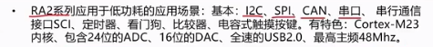
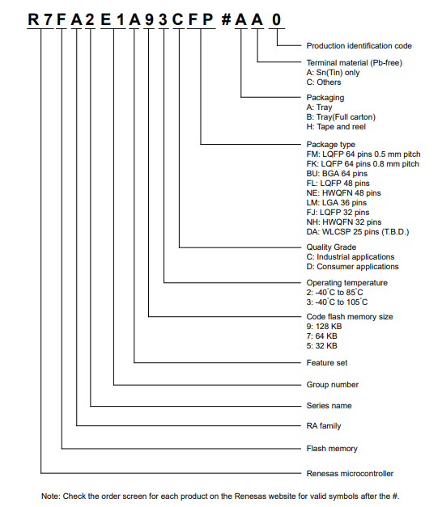
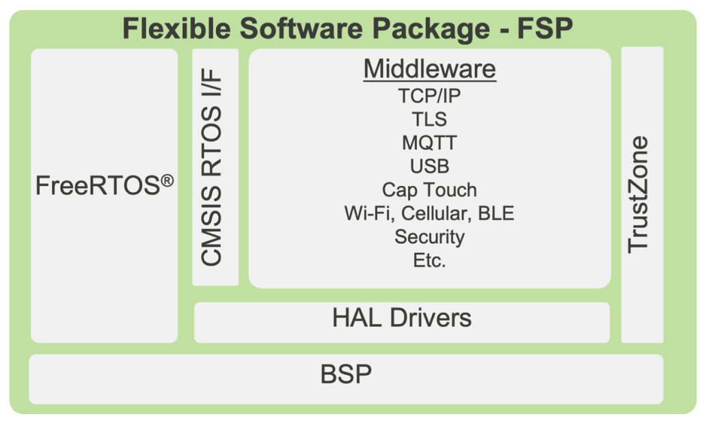
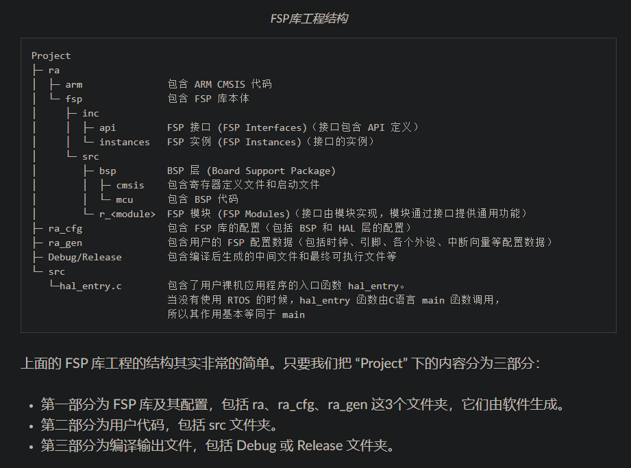

# 		RA2

## 概述





R7FA2E1A92DFM：

- FLASH：128KB；SREAM：16KB。data flash：4KB。（FLASH：存储代码和常量；SRAM：存储程序运行过程中产生的临时数据；data flash：类似51里的EEPROM。）
- -40°C~86°C。
- Consumer applications。
- 64Pin——0.5mm。

## 开发工具与烧录

RA系列开发与调试工具：

- e2 stdio：可用图形化配置工具，生成的代码也简洁高效。（选择快速安装即可，默认）
- Keil。

RA系列库：FSP库（灵活配置软件包）。实时操作系统：支持FreeRTOS。烧录：SWD或串口烧录。


## 存储

存储：

- RAM：程序运行内存。
- Flash：保存程序。
- 寄存器：保存芯片功能状态，配置和操作芯片功能。

存储器映射：给存储器分配地址的过程，通常是产家规定好的。

存储器重映射：重复的映射，即给存储空间再分配一个地址。

寄存器：有特定的功能的内存单元，该内存单元内的每一位通常都有相对应的控制功能。

寄存器映射：给已分配好地址(通过存储器映射实现)的有特定功能的内存单元取别名的过程。

>寄存器映射是在存储器映射的基础上进行的。
>
>以STM32为例，操作硬件本质上就是操作寄存器。**在存储器片上外设区域，四字节为一个单元，每个单元对应不同的功能。**当我们控制这些单元时就可以驱动外设工作，我们可以找到每个单元的起始地址，然后通过C 语言指针的操作方式来访问这些单元。但若每次都是通过这种方式访问地址，不好记忆且易出错。**这时我们可以根据每个单元功能的不同，以功能为名给这个内存单元取一个别名，这个别名实质上就是寄存器名字。给已分配好地址(通过存储器映射实现)的有特定功能的内存单元取别名的过程就叫寄存器映射。**
>
>原文链接：https://blog.csdn.net/FRIGIDWINTER/article/details/106826511

32位CPU：

>32 位和 64 位中的“位”，也叫字长，是 CPU 通用寄存器的数据宽度，是数据传递和处理的基本单位。字长是 CPU 的主要技术指标之一，指的是 CPU 一次能并行处理的二进制位数。32位平台中，CPU内部寄存器和寻址总线是32位，CPU一次最多只能同时处理32bit的数据。

为什么能通过地址去访问存储单元？

>地址，表示了地址总线上各线路高低电平状态，可以理解为通过地址总线输入一些数据经译码器解析后来寻址到具体的存储单元，然后通过控制器来控制对这些存储单元进行读或写操作，数据经数据总线写入或读出。
>
>**总结：地址总线控制访问哪个存储单元，控制器控制写入或读出，数据总线是数据进出的通道。**（通常一个地址对应一个存储单元，一个存储单元即1byte=8bit。但有的硬件会做特殊处理，如STM32会把一片内存映射成位带，一个地址对应1位。）
>
>32位平台下是32位地址（$2^{32个}地址$），$2^{32}=4*2^{30}=4GB$，即最大可支持4GB的线性地址空间。

瑞萨RA2单片机中，一个地址对应1bit，存储器片上外设区域，四字节为一个内存单元。

```c
/* 指向存储int类型数据的内存区域的指针 */
/* 指向的内存区域为从 0x40040020~0x4004003F */
*(uint32_t*)(0x40040000+0x0020*1) |= 0x00000101;   //  通过绝对地址访问寄存器
```


## J-Link RTT View

安装J-Link后，找到`SEGGER_RTT_V794f.zip`文件。解压后将Config目录里的SEGGER_RTT_Conf.h放到RTT文件夹里，里面的五个文件就是需要使用到的。

将这五个文件放入到工程中编译，添加头文件`#include "SEGGER_RTT.h"`即可使用相关函数来打印信息，J-Link的上位机软件RTT Viewer中可用来接收或发送信息，RTT Logger可用于导出打印信息到日志文件。

RTT Viewer：选中USB、目标MCU设备即可，其它默认。

使用示例：

```c
#include "SEGGER_RTT.h"
int main(void)
{
    SEGGER_RTT_WriteString(0, "Hello World from SEGGER!\r\n");
}
```

```c
/* STM32->RTT Viewer */
 SEGGER_RTT_ConfigUpBuffer(0, "RTTUP", NULL, 0, SEGGER_RTT_MODE_NO_BLOCK_SKIP);
 SEGGER_RTT_ConfigUpBuffer(1, "RTTUP", NULL, 0, SEGGER_RTT_MODE_NO_BLOCK_SKIP);
 
  /* RTT Viewer->STM32 */ 
 SEGGER_RTT_ConfigDownBuffer(0, "RTTDOWN", NULL, 0, SEGGER_RTT_MODE_NO_BLOCK_SKIP);
 SEGGER_RTT_ConfigDownBuffer(1, "RTTDOWN", NULL, 0, SEGGER_RTT_MODE_NO_BLOCK_SKIP);
 
 printf("%s\r\n","Hello World from SEGGER, Terminal 0!");
 SEGGER_RTT_SetTerminal(0);
 SEGGER_RTT_WriteString(0, "Hello World from SEGGER, Terminal 0!\r\n");
 
 printf("%s\r\n","Hello World from SEGGER, Terminal 1!"); 
 SEGGER_RTT_SetTerminal(1);
 SEGGER_RTT_WriteString(0, "Hello World from SEGGER, Terminal 1!\r\n");
 SEGGER_RTT_printf(0, RTT_CTRL_TEXT_GREEN"Hello World from SEGGER, Terminal 1!\r\n");
```

重定向printf：

```c
int fputc(int ch, FILE *f)
{
    #if defined (RTT)
     SEGGER_RTT_PutChar(0, ch); 
    #else
     /*清除标志位*/
     USART_ClearFlag(USART1,USART_FLAG_TC);
     /* 发送一个字节数据到USART1 */
     USART_SendData(USART1, (uint8_t) ch);
     /* 等待发送完毕 */
     while (USART_GetFlagStatus(USART1, USART_FLAG_TC) == RESET); 
    #endif

     return (ch);
}


printf("printf: %s\r\n","Hello World from SEGGER, Terminal 0!");
```


# 工程创建

File → New → 瑞萨C/C++项目 → Renesas RA → Renesas RA C/C++ Project → 项目名称 → 选择芯片型号（RA2E1A92DFM） → Executable → Bare Metal - Minimal  → Finish。

工程迁移：

1. 复制工程并重命名。
2. 删除里面的一些配置文件，工程里带项目名称的文件都删除掉，然后使用文件搜索功能输入工程名称头几个关键字即可，将搜索发现的文件都给删除掉。
3. 然后打开e2s，然后点击`File → Import`，将项目导入进去即可。

# 启动文件

启动文件是系统上电复位后执行的第一个程序。主要做了以下工作：

1. 初始化堆栈。
2. 使能FPU（float-point unit，即浮点单元）。
3. 定位中断向量表。
4. 配置系统时钟。
5. 启用CORTEX-M33栈监视器。
6. 初始化C语言运行环境。
7. 初始化变量SystemCoreClock，这个变量存放的是处理器时钟的频率。
8. 初始化用于触发NVIC中断的ELC（Event Link Controller）事件。
9. **初始化IO口。**

瑞萨RA单片机，启动文件是C编写的，名称为`startup.c`，进行的操作主要如以下：

- 复位程序。
- 栈区初始化。
- 堆区初始化。
- 中断向量表初始化。


## SystemInit()


# 寄存器开发

通过指针直接访问寄存器进行功能开发。例如操作GPIO口，通过查阅硬件手册找到相关寄存器，操作寄存器完成对IO口的开放、配置、输入读取、输出等操作。

寄存器到库的转变：

- 通过枚举封装端口地址、引脚、片上外设功能配置参数、常用常量等。
- 通过结构体封装片上外设的所有初始化参数。
- 通过初始化函数来封装对外设初始化的具体操作。
- 通过函数来封装对外设寄存器的数据的读取操作。

寄存器数据重映射 → 封装 → 函数 → 函数库：

- 访问到寄存器，从寄存器数据读取数据，往寄存器写入数据。

```c
while(1){
    *(volatile uint32_t*)(0x40040000 + 0x0020 * 3) |= 0x00100010;
    R_BSP_SoftwareDelay(500, BSP_DELAY_UNITS_MILLISECONDS);

    *(volatile uint32_t*)(0x40040000 + 0x0020 * 3) &= 0x11011101;
    R_BSP_SoftwareDelay(500, BSP_DELAY_UNITS_MILLISECONDS);
}
```


# FSP库

## 介绍

>**瑞萨电子灵活配置软件包** (FSP) 是用于嵌入式系统设计的高质量增强型软件包，支持瑞萨电子 RA 产品家族 Arm 微控制器，提供用户友好的界面且可灵活扩展，确保从入门级到高性能的整个 RA 微控制器的软件兼容性。
>
>FSP 全称为 “Flexible Software Package”，中文译为“灵活配置软件包”。FSP 旨在以较低的内存占用量提供快速高效的驱动程序和协议栈。 FSP 集成了中间件协议栈、独立于 RTOS 的硬件抽象层（HAL）驱动程序， 以及最基础的板级支持包（BSP）驱动程序。FSP 还支持 FreeRTOS™ 实时操作系统（RTOS）。
>
>FSP基于C99编写。

## 架构

着重点：BSP、HAL、FreeRTOS、MQTT、WiFi、BLE。





## 开发

1. 创建工程。
2. 通过图形化界面配置引脚。
3. 通过开发帮助找到相关FSP库函数。
4. src里面建立模块文件夹，创建模块的头文件和源文件，结合FSP库函数编写功能代码。
5. `hal_entry()`函数里调用功能函数以实现各种功能。

需要掌握FSP库的底层实现逻辑，这样可以更好地熟悉FSP库的API。

## 命名

BSP：BSP 函数名称以 **R_BSP_** 开头，BSP 宏以 **BSP_** 开头，数据类型定义以 **_bsp** 开头。

HAL 层的函数的名称以 **R_** 开头，格式一般为**` R_<MODULE>_<Function>`**。 默认情况下，所有驱动函数都是非阻塞的，并返回执行状态。驱动函数本身不分配任何内存，调用时需要将内存传递给函数。

FSP 中间件函数的名称命名格式一般为：**`RM_<MODULE>_<Function>`**。

应用层：自己定。

- `R_BSP_xxx`： BSP 函数的前缀，例如 `R_BSP_VersionGet()`。
- `BSP_xxx`： BSP 宏的前缀，例如 `BSP_IO_LEVEL_LOW`。
- `FSP_xxx`： 常用的 FSP的前缀，主要定义错误代码（例如 `FSP_ERR_INVALID_ARGUMENT`）和版本信息（例如 `FSP_VERSION_BUILD`）。
- ` g_<interface>_on_<instance>`： 实例的常量全局结构体的名称，用这个结构体管理 API 的各个实现函数，比如 `g_ioport_on_ioport` 结构体里是` r_ioport.c` 实现的各个 API 函数。
- `r_<interface>_api.h`：接口模块头文件的名称，例如` r_spi_api.h`。
- `R_<MODULE>_<Function>`： FSP 驱动程序 API 的名称，例如 `R_SPI_WriteRead()`。
- `RM_<MODULE>_<Function>`： 中间件函数的名称，例如 `RM_BLE_ABS_Open()`。  


## 理念

FSP库的理念：（其实就是高内聚低耦合的实践）

- 配置与接口分离：外设的配置被封装进结构体游离接口函数之外，配置传入接口函数从而实现外设硬件的初始化与相关寄存器操作，也就是说接口函数的一些配置参数被抽离出来了，这样更改配置时就不用去函数内部更改了 —— 即不改变函数本身。（接口规定了做什么，是一系列方法的声明。FSP中通常会将接口集合到一个结构体中，构建成一个接口集合）
- 接口与实例分离：实例是指对象的具体表示，C语言中可将结构体视为一个类，而结构体变量就是一个实例。FSP中的模块实例往往包含配置、接口和模块标记，通过模块实例去调用里面的接口和配置信息从而来完成应用层的操作。

配置 + 功能接口 → 实例 → 应用层调用实例内容以实现需求。

总结：

- 配置放一边，函数声明放一边，函数实现放一边。
- 配置信息集合成一个配置结构体；函数构建一个接口集合；整个外设模块看成是一个对象，里面包含了配置信息和接口实例，当使用某个外设模块时，通过调用这个对象的配置信息和接口实例即可。


## 术语

FSP库中的一些术语：

- 模块-Module：整个外设驱动程序、某块功能实现的整体等。
- 模块实例-Module Instance：单个、独立的实例化配置模块。在FSP中，其实就是个结构体常量，里面通常包含配置信息和接口信息，通过调用实例的配置信息和接口信息来实现各种操作，比如GPIO模块，通过其实例可以操作引脚。
- 接口-Interfaces：接口是一系列方法的声明（函数声明），FSP中会使用结构体构建一个接口集合。（xxx.h）
- 实例-Instances：接口规定了有哪些功能，而实例则是实现这些功能，说白了就是函数实现。（xxx.c）
- 驱动程序-Drivers：驱动程序是一种特定类型的模块，可以直接修改 RA 产品家族MCU 上的寄存器。
- 堆叠-Stacks：这个单词很容易跟 C 语言里的堆（heap）、栈（stack）混淆，但是在这里它不是堆栈的意思。 FSP 架构所采用的设计方式是，模块可以协同工作以形成一个堆叠。堆叠就是由顶层模块及其所有依赖项组成，**简单地说就是多个有依赖关系的模块**。  （比如I2C模块，需要依赖GPIO模块）
- 应用程序-Application：用户编写与维护的代码。
- 回调函数-Callback Functions：使用函数指针传入函数中的再函数内部调用的函数，通常在函数内部还对其有着事件约束。

总结：FSP库是应用面向对象编程思想来设计的。

# CGC

RA2E1的时钟：

- 主时钟（MOSC）：1~20MHz。（需外接晶体振荡器）
- 副时钟（SOSC）：32.768kHz。（需外接晶体振荡器，通常为RTC准备的）
- 高速片上振荡器（HOCO）：24、32、48、64MHz。
- 中速片上振荡器（MOCO）：8MHz。
- 低速片上振荡器（LOCO）：32.768kHz。（RTC）
- HOCO、MOCO、LOCO时钟微调功能：
- IWTD专用片上振荡器：15kHz。
- 支持时钟信号输出。

CGC：clock generation circuit，即时钟生成电路，通常称之为“时钟控制电路”。

可通过图形化配置来进行时钟配置。

# IO Ports

## 概述


## 寄存器操作


## FSP

`r_ioport.h`、`r_ioport.c`：

```c
fsp_err_t R_IOPORT_Open(ioport_ctrl_t * const p_ctrl, const ioport_cfg_t * p_cfg);
fsp_err_t R_IOPORT_Close(ioport_ctrl_t * const p_ctrl);
fsp_err_t R_IOPORT_PinsCfg(ioport_ctrl_t * const p_ctrl, const ioport_cfg_t * p_cfg);
fsp_err_t R_IOPORT_PinCfg(ioport_ctrl_t * const p_ctrl, bsp_io_port_pin_t pin, uint32_t cfg);
fsp_err_t R_IOPORT_PinEventInputRead(ioport_ctrl_t * const p_ctrl, bsp_io_port_pin_t pin, bsp_io_level_t * p_pin_event);
fsp_err_t R_IOPORT_PinEventOutputWrite(ioport_ctrl_t * const p_ctrl, bsp_io_port_pin_t pin, bsp_io_level_t pin_value);
fsp_err_t R_IOPORT_PinRead(ioport_ctrl_t * const p_ctrl, bsp_io_port_pin_t pin, bsp_io_level_t * p_pin_value);
fsp_err_t R_IOPORT_PinWrite(ioport_ctrl_t * const p_ctrl, bsp_io_port_pin_t pin, bsp_io_level_t level);
fsp_err_t R_IOPORT_PortDirectionSet(ioport_ctrl_t * const p_ctrl,
                                    bsp_io_port_t         port,
                                    ioport_size_t         direction_values,
                                    ioport_size_t         mask);
fsp_err_t R_IOPORT_PortEventInputRead(ioport_ctrl_t * const p_ctrl, bsp_io_port_t port, ioport_size_t * event_data);
fsp_err_t R_IOPORT_PortEventOutputWrite(ioport_ctrl_t * const p_ctrl,
                                        bsp_io_port_t         port,
                                        ioport_size_t         event_data,
                                        ioport_size_t         mask_value);
fsp_err_t R_IOPORT_PortRead(ioport_ctrl_t * const p_ctrl, bsp_io_port_t port, ioport_size_t * p_port_value);
fsp_err_t R_IOPORT_PortWrite(ioport_ctrl_t * const p_ctrl, bsp_io_port_t port, ioport_size_t value, ioport_size_t mask);
```


# ICU-EXTI

ICU（Interrupt Controller Unit），中断控制单元。


# Timer

## GPT

通用PWM定时器。


## AGT

低功耗异步通用定时器。


## WDT


## IWDT


# SysTick


# SCI


# SPI


# DTC


# I2C


# LPM

LowPowerModes


# RTC


