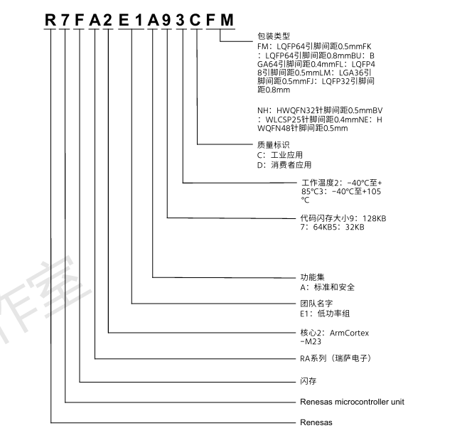
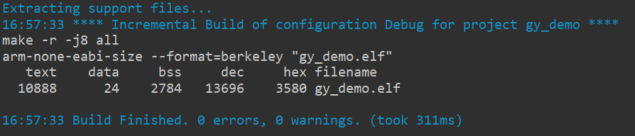
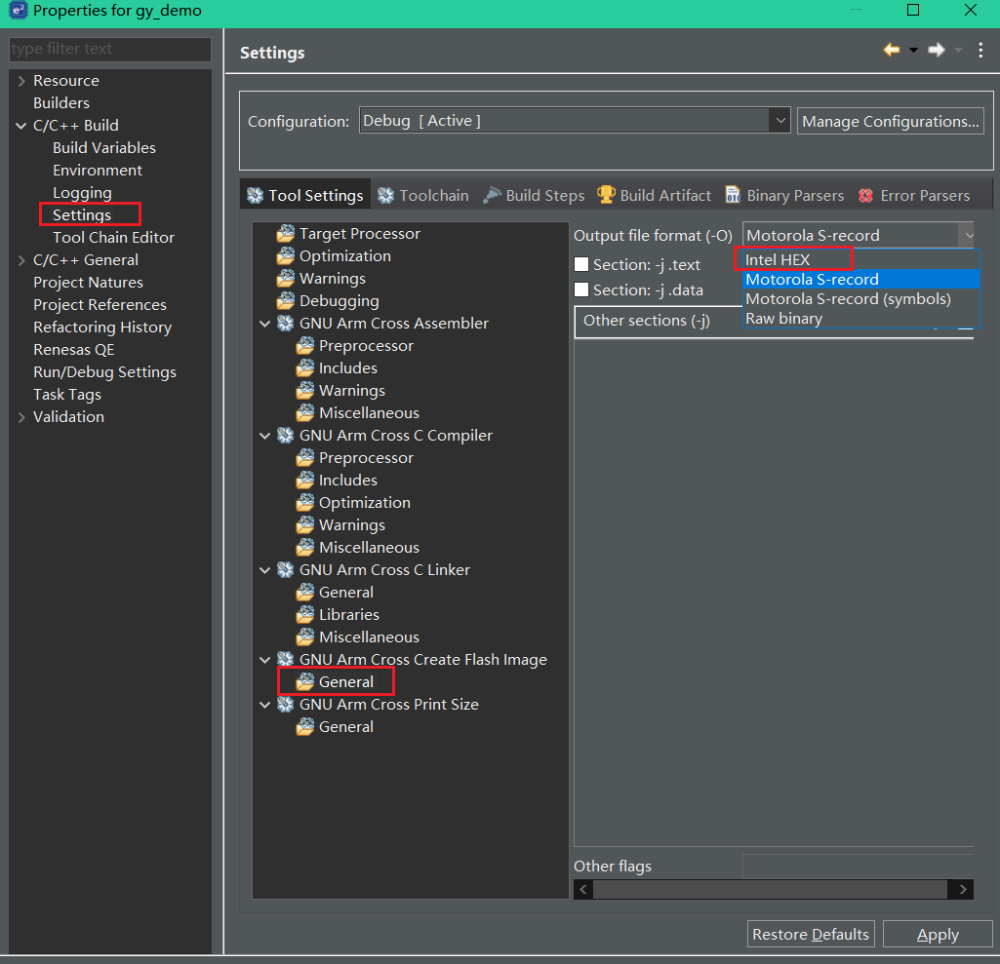

# 		RA2

## 概述




R7FA2E1A92DFM：

- FLASH：128KB；SREAM：16KB。data flash：4KB。（FLASH：存储代码和常量；SRAM：存储程序运行过程中产生的临时数据；data flash：类似51里的EEPROM。）
- -40°C~86°C。
- Consumer applications。
- 64Pin——0.5mm。


## 开发工具与烧录

RA系列开发与调试工具：

- e2 stdio：可用图形化配置工具，生成的代码也简洁高效。（选择快速安装该工具即可，默认选项安装）
- Keil。

RA系列库：FSP库（灵活配置软件包）。实时操作系统：支持FreeRTOS。烧录：SWD或串口烧录。


## 存储

存储：

- RAM：程序运行内存。
- Flash：保存程序。
- 寄存器：保存芯片功能状态，配置和操作芯片功能。

存储器映射：给存储器分配地址的过程，通常是产家规定好的。

存储器重映射：重复的映射，即给存储空间再分配一个地址。

寄存器：有特定的功能的内存单元，该内存单元内的每一位通常都有相对应的控制功能。

寄存器映射：给已分配好地址（通过存储器映射实现）的有特定功能的内存单元取别名的过程。

>寄存器映射是在存储器映射的基础上进行的。
>
>以STM32为例，操作硬件本质上就是操作寄存器。**在存储器片上外设区域，四字节为一个单元，每个单元对应不同的功能。**当我们控制这些单元时就可以驱动外设工作，我们可以找到每个单元的起始地址，然后通过C语言指针的操作方式来访问这些单元。但若每次都是通过这种方式访问地址，不好记忆且易出错。**这时我们可以根据每个单元功能的不同，以功能为名给这个内存单元取一个别名，这个别名实质上就是寄存器名字。给已分配好地址(通过存储器映射实现)的有特定功能的内存单元取别名的过程就叫寄存器映射。**
>
>原文链接：https://blog.csdn.net/FRIGIDWINTER/article/details/106826511

32位CPU：

>32 位和 64 位中的“位”，也叫字长，是 CPU 通用寄存器的数据宽度，是数据传递和处理的基本单位。字长是 CPU 的主要技术指标之一，指的是 CPU 一次能并行处理的二进制位数。32位平台中，CPU内部寄存器和寻址总线是32位，CPU一次最多只能同时处理32bit的数据。

为什么能通过地址去访问存储单元？

>地址，表示了地址总线上各线路高低电平状态，可以理解为通过地址总线输入一些数据经译码器解析后来寻址到具体的存储单元，然后通过控制器来控制对这些存储单元进行读或写操作，数据经数据总线写入或读出。
>
>**总结：地址总线控制访问哪个存储单元，控制器控制写入或读出，数据总线是数据进出的通道。**（通常一个地址对应一个存储单元，一个存储单元即1byte=8bit。但有的硬件会做特殊处理，如STM32会把一片内存映射成位带，一个地址对应1位。）
>
>32位平台下是32位地址（$2^{32个}地址$），$2^{32}=4*2^{30}=4GB$，即最大可支持4GB的线性地址空间。
>
>计算机组成原理里有很好的解释。

瑞萨RA2单片机中，一个地址对应1bit，存储器片上外设区域，四字节为一个内存单元。

```c
/* 指向存储int类型数据的内存区域的指针 */
/* 指向的内存区域为从 0x40040020~0x4004003F */
*(uint32_t*)(0x40040000+0x0020*1) |= 0x00000101;   //  通过绝对地址访问寄存器
```


## BOOT模式

RA2的MD引脚就是用于切换BOOT模式的，当MD引脚电平为低时就是串口烧录模式，此时可通过P110、P109进行烧录。

下载软件：Renesas Flash Programmer。


## J-Link RTT View

安装J-Link后，找到`SEGGER_RTT_V794f.zip`文件。解压后将Config目录里的SEGGER_RTT_Conf.h放到RTT文件夹里，里面的五个文件就是需要使用到的。

将这五个文件放入到工程中编译，添加头文件`#include "SEGGER_RTT.h"`即可使用相关函数来打印信息，J-Link的上位机软件RTT Viewer中可用来接收或发送信息，RTT Logger可用于导出打印信息到日志文件。

RTT Viewer：选中USB、目标MCU设备即可，其它默认。

使用示例：

```c
#include "SEGGER_RTT.h"
int main(void)
{
    SEGGER_RTT_WriteString(0, "Hello World from SEGGER!\r\n");
}
```

```c
/* STM32->RTT Viewer */
 SEGGER_RTT_ConfigUpBuffer(0, "RTTUP", NULL, 0, SEGGER_RTT_MODE_NO_BLOCK_SKIP);
 SEGGER_RTT_ConfigUpBuffer(1, "RTTUP", NULL, 0, SEGGER_RTT_MODE_NO_BLOCK_SKIP);
 
  /* RTT Viewer->STM32 */ 
 SEGGER_RTT_ConfigDownBuffer(0, "RTTDOWN", NULL, 0, SEGGER_RTT_MODE_NO_BLOCK_SKIP);
 SEGGER_RTT_ConfigDownBuffer(1, "RTTDOWN", NULL, 0, SEGGER_RTT_MODE_NO_BLOCK_SKIP);
 
 printf("%s\r\n","Hello World from SEGGER, Terminal 0!");
 SEGGER_RTT_SetTerminal(0);
 SEGGER_RTT_WriteString(0, "Hello World from SEGGER, Terminal 0!\r\n");
 
 printf("%s\r\n","Hello World from SEGGER, Terminal 1!"); 
 SEGGER_RTT_SetTerminal(1);
 SEGGER_RTT_WriteString(0, "Hello World from SEGGER, Terminal 1!\r\n");
 SEGGER_RTT_printf(0, RTT_CTRL_TEXT_GREEN"Hello World from SEGGER, Terminal 1!\r\n");
```

重定向printf：

```c
int fputc(int ch, FILE *f)
{
    #if defined (RTT)
     SEGGER_RTT_PutChar(0, ch); 
    #else
     /*清除标志位*/
     USART_ClearFlag(USART1,USART_FLAG_TC);
     /* 发送一个字节数据到USART1 */
     USART_SendData(USART1, (uint8_t) ch);
     /* 等待发送完毕 */
     while (USART_GetFlagStatus(USART1, USART_FLAG_TC) == RESET); 
    #endif

     return (ch);
}


printf("printf: %s\r\n","Hello World from SEGGER, Terminal 0!");
```


# e2 Stdio

## 工程创建

File → New → 瑞萨C/C++项目 → Renesas RA → Renesas RA C/C++ Project → 项目名称 → 选择芯片型号（RA2E1A92DFM） → Executable → Bare Metal - Minimal  → Finish。

工程迁移：

1. 复制工程并重命名。
2. 删除里面的一些配置文件，工程里带项目名称的文件都删除掉，然后使用文件搜索功能输入工程名称头几个关键字即可，将搜索发现的文件都给删除掉。
3. 然后打开e2s，然后点击`File → Import`，将项目导入进去即可。


## 工程设置

字体：

- 放大：`Ctrl + shift + "+"`。
- 缩小：`Ctrl + "-"`。


## 图形配置

可用于配置各种外设，时钟、IO口、SPI、I2C、RTC、timer等。


## 编译&构建

编译&构建：点击小锤子。



摘自：[text data bss dec 代表的含义 - K_Code - 博客园 (cnblogs.com)](https://www.cnblogs.com/z3286586/p/14817832.html)

其它资料：[text、data、bss、RO、RW、ZI、Code、elf、bin、hex扫盲 - solonj - 博客园 (cnblogs.com)](https://www.cnblogs.com/solo666/p/16619167.html)

text：

>‘text’ is what ends up in FLASH memory. I can show this with adding.
>
>text段最终是存放在FLASH存储器中的。通过增加如下代码到程序中：
>
>```c
>void foo(void) {
>
>  /* dummy function to show how this adds to 'text' */
>
>}
>```
>
>但text段不仅包含函数，还有常量。例如我有如下的一个常量表：
>
>```c
>const int table[] = {5,0,1,5,6,7,9,10};
>```

data：

>‘data’ is used for initialized data. This is best explained with the following (global/extern) variable:
>
>data段是用于初始化数据。用如下的变量（全局/外部）可以解释得很清楚：
>
>```c
>int32_t myVar = 0x12345678;
>```
>
>Adding above variable to my application will increase the ‘data’ portion by 4 bytes:
>
>加入上述变量会导致我的应用的data部分增长四个字节

bss：

>The ‘bss’ contains all the uninitalized data.
>
>bss段包含着所有未初始化的数据。
>
>bss (or .bss, or BSS) is the abbreviation for ‘Block Started by Symbol’ by an old assembler (see this [link](https://www.oschina.net/action/GoToLink?url=http%3A%2F%2Fen.wikipedia.org%2Fwiki%2F.bss)).
>
>bss（.bss, BSS ) 是旧式汇编器中‘Block Started by Symbol’的简称（详情参看 [link](https://www.oschina.net/action/GoToLink?url=http%3A%2F%2Fen.wikipedia.org%2Fwiki%2F.bss)）。
>
>This is best explained with following (global/extern) variable:
>
>用如下的变量（全局/外部）可以解释得很清楚：
>
>```c
>int32_t myGlobal;
>```
>
>Adding this variable will increase the ‘bss’ portion by 4:
>
>加入上述变量会导致bss部分增长4个字节：

dec：

>The ‘dec’ (as a decimal number) is the sum of text, data and bss:
>
>dec（decimal的缩写，即十进制数）是text，data和bss的算术和。
>
>```c
>dec = text + data + bss
>```

hex：

>hex是十六进制数，是text，data和bss的算术和。
>
>```c
>hex = text + data + bss
>```

总结：

- text：`（.text）= (Code + RO data)`，存放代码、常量及向量表，只读，在Flash中存放。
- data：`(.data) = (RW data)`，存放已初始化的全局/静态变量，可读可写，最终存放在FLASH。
- bss：`(.bss) = (ZI data)`，存放所有未初始化的全局/静态变量，可读可写。 最终存放在RAM。

疑问：我添加一个全局变量，没看到有哪一项增加了啊，是不是被优化了？


## hex文件




# 寄存器开发

通过指针直接访问寄存器进行功能开发。例如操作GPIO口，通过查阅硬件手册找到相关寄存器，操作寄存器完成对IO口的开放、配置、输入读取、输出等操作。

寄存器到库的转变：

- 通过枚举封装端口地址、引脚、片上外设功能配置参数、常用常量等。
- 通过结构体封装片上外设的所有初始化参数。
- 通过初始化函数来封装对外设初始化的具体操作。
- 通过函数来封装对外设寄存器的数据的读取操作。

寄存器数据重映射（利用宏定义或枚举映射好地址） → 封装 → 函数 → 函数库：

- 访问到寄存器，从寄存器数据读取数据，往寄存器写入数据。
- 本质：控制寄存器，从而控制单片机按照预设的路径进行工作，以实现我们的需求。

示例：通过使用指针来控制IO相关寄存器，以便控制IO口输出

```c
while(1){
    *(volatile uint32_t*)(0x40040000 + 0x0020 * 3) |= 0x00100010;
    R_BSP_SoftwareDelay(500, BSP_DELAY_UNITS_MILLISECONDS);

    *(volatile uint32_t*)(0x40040000 + 0x0020 * 3) &= 0x11011101;
    R_BSP_SoftwareDelay(500, BSP_DELAY_UNITS_MILLISECONDS);
}
```


# FSP库开发

## 基本知识

### 关于FSP库

>**瑞萨电子灵活配置软件包** (FSP) 是用于嵌入式系统设计的高质量增强型软件包，支持瑞萨电子 RA 产品家族 Arm 微控制器，提供用户友好的界面且可灵活扩展，确保从入门级到高性能的整个 RA 微控制器的软件兼容性。
>
>FSP 全称为 “Flexible Software Package”，中文译为“灵活配置软件包”。FSP 旨在以较低的内存占用量提供快速高效的驱动程序和协议栈。 FSP 集成了中间件协议栈、独立于 RTOS 的硬件抽象层（HAL）驱动程序， 以及最基础的板级支持包（BSP）驱动程序。FSP 还支持 FreeRTOS™ 实时操作系统（RTOS）。
>
>FSP基于C99编写。

### 库架构

着重点：BSP、HAL、FreeRTOS、MQTT、WiFi、BLE。


总结：

- 底层：BSP：
- 硬件抽象层：HAL。
- 中间件：freertos、MQTT等。
- 软件生成代码、用户代码、编译输出文件。


### 基于库的开发

e2Stdio：

1. 创建工程。
2. 通过图形化界面配置引脚。
3. 通过开发帮助找到相关FSP库函数。
4. src里面建立模块文件夹，创建模块的头文件和源文件，结合FSP库函数编写功能代码。
5. `hal_entry()`函数里调用功能函数以实现各种功能。

需要掌握FSP库的底层实现逻辑，这样可以更好地熟悉FSP库的API。

FSP库开发总结：

- 工具：熟悉使用e2Stdio开发工具，熟悉使用其生成片上外设初始化代码，熟悉FSP库架构和FSP库函数。
- 开发：配置好片上外设后，基于片上外设开进行应用开发。
- 图形化界面配置的好处：使得配置单片机的外设更加便捷，使开发者的精力能够更多的聚焦于应用开发中。坏处：不利于开发者理解底层寄存器操作。


### FSP文档

下载FSP库后，里面会包含有库文档，有关于各种接口和函数的说明。

安装e2Stdio后，安装FSP库后，在e2Stdio安装目录里就能找到FSP库文档。


### 库命名格式

BSP：BSP 函数名称以 **R_BSP_** 开头，BSP 宏以 **BSP_** 开头，数据类型定义以 **_bsp** 开头。

HAL 层的函数的名称以 **R_** 开头，格式一般为**` R_<MODULE>_<Function>`**。 默认情况下，所有驱动函数都是非阻塞的，并返回执行状态。驱动函数本身不分配任何内存，调用时需要将内存传递给函数。

FSP 中间件函数的名称命名格式一般为：**`RM_<MODULE>_<Function>`**。

应用层：自己定。

- `R_BSP_xxx`： BSP 函数的前缀，例如 `R_BSP_VersionGet()`。
- `BSP_xxx`： BSP 宏的前缀，例如 `BSP_IO_LEVEL_LOW`。
- `FSP_xxx`： 常用的 FSP的前缀，主要定义错误代码（例如 `FSP_ERR_INVALID_ARGUMENT`）和版本信息（例如 `FSP_VERSION_BUILD`）。
- ` g_<interface>_on_<instance>`： 实例的常量全局结构体的名称，用这个结构体管理 API 的各个实现函数，比如 `g_ioport_on_ioport` 结构体里是` r_ioport.c` 实现的各个 API 函数。
- `r_<interface>_api.h`：接口模块头文件的名称，例如` r_spi_api.h`。
- `R_<MODULE>_<Function>`： FSP 驱动程序 API 的名称，例如 `R_SPI_WriteRead()`。
- `RM_<MODULE>_<Function>`： 中间件函数的名称，例如 `RM_BLE_ABS_Open()`。  


### FSP理念

FSP库的理念：（其实就是高内聚低耦合的实践）

- 配置与接口分离：外设的配置被封装进结构体游离接口函数之外，配置传入接口函数从而实现外设硬件的初始化与相关寄存器操作，也就是说接口函数的一些配置参数被抽离出来了，这样更改配置时就不用去函数内部更改了 —— 即不改变函数本身。（接口规定了做什么，是一系列方法的声明。FSP中通常会将接口集合到一个结构体中，构建成一个接口集合）
- 接口与实例分离：实例是指对象的具体表示，C语言中可将结构体视为一个类，而结构体变量就是一个实例。FSP中的模块实例往往包含配置、接口和模块标记，通过模块实例去调用里面的接口和配置信息从而来完成应用层的操作。

配置 + 功能接口 → 实例 → 应用层调用实例内容以实现需求。

总结：

- 配置放一边，函数声明放一边，函数实现放一边。
- 配置信息集合成一个配置结构体；函数构建一个接口集合；整个外设模块看成是一个对象，里面包含了配置信息和接口实例，当使用某个外设模块时，通过调用这个对象的配置信息和接口实例即可。


### 相关术语

FSP库中的一些术语：

- 模块-Module：整个外设驱动程序、某块功能实现的整体等。
- 模块实例-Module Instance：单个、独立的实例化配置模块。在FSP中，其实就是个结构体常量，里面通常包含配置信息和接口信息，通过调用实例的配置信息和接口信息来实现各种操作，比如GPIO模块，通过其实例可以操作引脚。
- 接口-Interfaces：接口是一系列方法的声明（函数声明），FSP中会使用结构体构建一个接口集合。（xxx.h）
- 实例-Instances：接口规定了有哪些功能，而实例则是实现这些功能，说白了就是函数实现。（xxx.c）
- 驱动程序-Drivers：驱动程序是一种特定类型的模块，可以直接修改 RA 产品家族MCU 上的寄存器。
- 堆叠-Stacks：这个单词很容易跟 C 语言里的堆（heap）、栈（stack）混淆，但是在这里它不是堆栈的意思。 FSP 架构所采用的设计方式是，模块可以协同工作以形成一个堆叠。堆叠就是由顶层模块及其所有依赖项组成，**简单地说就是多个有依赖关系的模块**。  （比如I2C模块，需要依赖GPIO模块）
- 应用程序-Application：用户编写与维护的代码。
- 回调函数-Callback Functions：使用函数指针传入函数中的再函数内部调用的函数，通常在函数内部还对其有着事件约束。

总结：FSP库是应用面向对象编程思想来设计的。

## 模块设计详解

层次结构划分：

- Application 是用户编写的。
- Middleware 是第 3 方的代码。 
- BSP 的代码量很少：启动、系统初始化、时钟、中断。
- HAL 层是 FSP 的核心。  （HAL层的主要作用：各模块的驱动程序——称为Module；HAL层的两个作用，一是提供接口，另一个就是调用其它的底层接口以实现功能。）

**FSP库源码设计理念：配置与接口分离、接口与实例分离。**

**以GPIO为例展示FSP库设计理念：**

1、配置与接口分离：配置，即对IO口的设置，设置哪个引脚，设置为输入还是输出模式，是否设置内部上拉或下拉等；接口，其实就是一些函数，这些函数接口都是用来操作IO口的，将其放于结构体中完成封装。

配置的封装：（pin_data.c）

- 将一个IO口抽象为一个个体，其包含的信息——引脚配置和引脚号等。（结构体`ioport_pin_cfg_t`——ioport模块的一个pin的configuration）
- 如果是多个IO口呢？那么可以使用数组来存储相同数据类型的数据。（数组`ioport_pin_cfg_t  g_bsp_pin_cfg_data[]`）
- C中，在函数中使用数组，可不仅仅只是传入数组指针，还得传入数组的长度来对数据进行遍历，所以使用面向对象的思想，这些信息也应该被封装起来。（结构体`ioport_cfg_t`，里面包含了引脚数量（也就是数组长度），数组指针，以及提供一个接口以便适应硬件的拓展性）

```c
/* 1、ioport模块的总配置信息，包含了引脚数、全部io口的配置信息、以及一个拓展配置接口 */
/** Multiple pin configuration data for loading into registers by R_IOPORT_Open() */
typedef struct st_ioport_cfg
{
    uint16_t                 number_of_pins; ///< Number of pins for which there is configuration data
    ioport_pin_cfg_t const * p_pin_cfg_data; ///< Pin configuration data
    const void             * p_extend;       ///< Pointer to hardware extend configuration
} ioport_cfg_t;

/* 2、一个引脚的配置信息，包含了引脚定义 */
/** Pin identifier and pin configuration value */
typedef struct st_ioport_pin_cfg
{
    uint32_t          pin_cfg;         ///< Pin configuration - Use ioport_cfg_options_t parameters to configure
    bsp_io_port_pin_t pin;             ///< Pin identifier
} ioport_pin_cfg_t;

/* 3、一个数组，定义一个包含了全部已配置引脚的数组 */
const ioport_pin_cfg_t g_bsp_pin_cfg_data[] =
        {
        { .pin = BSP_IO_PORT_00_PIN_11, .pin_cfg = ((uint32_t) IOPORT_CFG_PORT_DIRECTION_OUTPUT
                | (uint32_t) IOPORT_CFG_PORT_OUTPUT_LOW) },
          { .pin = BSP_IO_PORT_01_PIN_05, .pin_cfg = ((uint32_t) IOPORT_CFG_PORT_DIRECTION_OUTPUT
                  | (uint32_t) IOPORT_CFG_PORT_OUTPUT_LOW) },
          { .pin = BSP_IO_PORT_01_PIN_06, .pin_cfg = ((uint32_t) IOPORT_CFG_PORT_DIRECTION_OUTPUT
                  | (uint32_t) IOPORT_CFG_PORT_OUTPUT_LOW) },
          { .pin = BSP_IO_PORT_01_PIN_07, .pin_cfg = ((uint32_t) IOPORT_CFG_PORT_DIRECTION_OUTPUT
                  | (uint32_t) IOPORT_CFG_PORT_OUTPUT_LOW) },
          { .pin = BSP_IO_PORT_01_PIN_08, .pin_cfg = ((uint32_t) IOPORT_CFG_PERIPHERAL_PIN
                  | (uint32_t) IOPORT_PERIPHERAL_DEBUG) },
          { .pin = BSP_IO_PORT_01_PIN_11, .pin_cfg = ((uint32_t) IOPORT_CFG_PORT_DIRECTION_OUTPUT
                  | (uint32_t) IOPORT_CFG_PORT_OUTPUT_LOW) },
          { .pin = BSP_IO_PORT_02_PIN_01, .pin_cfg = ((uint32_t) IOPORT_CFG_PORT_DIRECTION_OUTPUT
                  | (uint32_t) IOPORT_CFG_PORT_OUTPUT_LOW) },
          { .pin = BSP_IO_PORT_02_PIN_04, .pin_cfg = ((uint32_t) IOPORT_CFG_PORT_DIRECTION_OUTPUT
                  | (uint32_t) IOPORT_CFG_PORT_OUTPUT_LOW) },
          { .pin = BSP_IO_PORT_02_PIN_06, .pin_cfg = ((uint32_t) IOPORT_CFG_PORT_DIRECTION_OUTPUT
                  | (uint32_t) IOPORT_CFG_PORT_OUTPUT_HIGH) },
          { .pin = BSP_IO_PORT_02_PIN_08, .pin_cfg = ((uint32_t) IOPORT_CFG_PORT_DIRECTION_OUTPUT
                  | (uint32_t) IOPORT_CFG_PORT_OUTPUT_LOW) },
          { .pin = BSP_IO_PORT_03_PIN_00, .pin_cfg = ((uint32_t) IOPORT_CFG_PERIPHERAL_PIN
                  | (uint32_t) IOPORT_PERIPHERAL_DEBUG) },
          { .pin = BSP_IO_PORT_03_PIN_04, .pin_cfg = ((uint32_t) IOPORT_CFG_PORT_DIRECTION_OUTPUT
                  | (uint32_t) IOPORT_CFG_PORT_OUTPUT_LOW) },
          { .pin = BSP_IO_PORT_04_PIN_00, .pin_cfg = ((uint32_t) IOPORT_CFG_PERIPHERAL_PIN
                  | (uint32_t) IOPORT_PERIPHERAL_IIC) },
          { .pin = BSP_IO_PORT_04_PIN_01, .pin_cfg = ((uint32_t) IOPORT_CFG_PERIPHERAL_PIN
                  | (uint32_t) IOPORT_PERIPHERAL_IIC) },
          { .pin = BSP_IO_PORT_04_PIN_02, .pin_cfg = ((uint32_t) IOPORT_CFG_IRQ_ENABLE
                  | (uint32_t) IOPORT_CFG_PORT_DIRECTION_INPUT) },
          { .pin = BSP_IO_PORT_04_PIN_03, .pin_cfg = ((uint32_t) IOPORT_CFG_PORT_DIRECTION_OUTPUT
                  | (uint32_t) IOPORT_CFG_PORT_OUTPUT_LOW) },
          { .pin = BSP_IO_PORT_05_PIN_01, .pin_cfg = ((uint32_t) IOPORT_CFG_PORT_DIRECTION_OUTPUT
                  | (uint32_t) IOPORT_CFG_PORT_OUTPUT_LOW) },
          { .pin = BSP_IO_PORT_05_PIN_02, .pin_cfg = ((uint32_t) IOPORT_CFG_PORT_DIRECTION_OUTPUT
                  | (uint32_t) IOPORT_CFG_PORT_OUTPUT_LOW) },
          { .pin = BSP_IO_PORT_09_PIN_13, .pin_cfg = ((uint32_t) IOPORT_CFG_PORT_DIRECTION_OUTPUT
                  | (uint32_t) IOPORT_CFG_PORT_OUTPUT_LOW) },
          { .pin = BSP_IO_PORT_09_PIN_14, .pin_cfg = ((uint32_t) IOPORT_CFG_PORT_DIRECTION_OUTPUT
                  | (uint32_t) IOPORT_CFG_PORT_OUTPUT_LOW) },
          { .pin = BSP_IO_PORT_09_PIN_15, .pin_cfg = ((uint32_t) IOPORT_CFG_PORT_DIRECTION_OUTPUT
                  | (uint32_t) IOPORT_CFG_PORT_OUTPUT_LOW) }, };
/* 4、全部引脚的配置信息，包含了多个引脚配置信息，其实就是数组长度和数组指针，为了遍历到各个引脚的配置信息 */
const ioport_cfg_t g_bsp_pin_cfg =
{ .number_of_pins = sizeof(g_bsp_pin_cfg_data) / sizeof(ioport_pin_cfg_t), .p_pin_cfg_data = &g_bsp_pin_cfg_data[0], };

```

接口函数：（r_ioport.h）

- 在Java中，接口是抽象函数的集合，具体实现由实现此接口的类来进行具体定义。而在C中，可将函数指针看作是一个接口，具体实现由此函数指针所指向的那个函数所决定。不同于面向对象的语言，在C中，可通过使用结构体来定义一个接口，只不过这个结构体内都是函数指针。面向对象、接口、抽象等都是一种思想，封装、继承、多态是面向对象的三大特性，当我们基于这些思想的指导去实践出的东西具有某种契合的特质，就可以说这是XXX了，就比如我用C的结构体去装了一些函数指针，我对其进行抽象，进行高度概括，发现这不就和接口的原本的意义一致么——只言其用处，不言其实现。至于思想从何而来，又是如何反哺到现实实践活动中的呢？思想是对现实世界抽象后的高度概括，其反哺形式为在基于人所实践的各种活动之中。
- FSP库中，定义了一个IO口的驱动程序接口——具体实现形式为成员为函数指针的结构体。
- 定义了一个实例结构体，可将其看作是一个类，其内部成员包含接口结构体，即可看作是这个类实现了这个接口（ioport_api_t const * p_api）。里面还包括引脚的配置信息（ioport_cfg_t const * p_cfg;）。以及一个辅助成员，用于记录。

```c
/** IOPort driver structure. IOPort functions implemented at the HAL layer will follow this API. */
typedef struct st_ioport_api
{
    /** Initialize internal driver data and initial pin configurations.  Called during startup.  Do
     * not call this API during runtime.  Use @ref ioport_api_t::pinsCfg for runtime reconfiguration of
     * multiple pins.
     *
     * @param[in]      p_ctrl     Pointer to control structure. Must be declared by user. Elements set here.
     * @param[in]      p_cfg      Pointer to pin configuration data array.
     */
    fsp_err_t (* open)(ioport_ctrl_t * const p_ctrl, const ioport_cfg_t * p_cfg);

    /** Close the API.
     *
     * @param[in]   p_ctrl  Pointer to control structure.
     **/
    fsp_err_t (* close)(ioport_ctrl_t * const p_ctrl);

    /** Configure multiple pins.
     *
     * @param[in]  p_ctrl     Pointer to control structure.
     * @param[in]  p_cfg      Pointer to pin configuration data array.
     */
    fsp_err_t (* pinsCfg)(ioport_ctrl_t * const p_ctrl, const ioport_cfg_t * p_cfg);

    /** Configure settings for an individual pin.
     *
     * @param[in]  p_ctrl               Pointer to control structure.
     * @param[in]  pin                  Pin to be read.
     * @param[in]  cfg                  Configuration options for the pin.
     */
    fsp_err_t (* pinCfg)(ioport_ctrl_t * const p_ctrl, bsp_io_port_pin_t pin, uint32_t cfg);

    /** Read the event input data of the specified pin and return the level.
     *
     * @param[in]  p_ctrl              Pointer to control structure.
     * @param[in]  pin                 Pin to be read.
     * @param[in]  p_pin_event         Pointer to return the event data.
     */
    fsp_err_t (* pinEventInputRead)(ioport_ctrl_t * const p_ctrl, bsp_io_port_pin_t pin, bsp_io_level_t * p_pin_event);

    /** Write pin event data.
     *
     * @param[in]  p_ctrl               Pointer to control structure.
     * @param[in]  pin                  Pin event data is to be written to.
     * @param[in]  pin_value            Level to be written to pin output event.
     */
    fsp_err_t (* pinEventOutputWrite)(ioport_ctrl_t * const p_ctrl, bsp_io_port_pin_t pin, bsp_io_level_t pin_value);

    /** Read level of a pin.
     *
     * @param[in]  p_ctrl               Pointer to control structure.
     * @param[in]  pin                  Pin to be read.
     * @param[in]  p_pin_value          Pointer to return the pin level.
     */
    fsp_err_t (* pinRead)(ioport_ctrl_t * const p_ctrl, bsp_io_port_pin_t pin, bsp_io_level_t * p_pin_value);

    /** Write specified level to a pin.
     *
     * @param[in]  p_ctrl               Pointer to control structure.
     * @param[in]  pin                  Pin to be written to.
     * @param[in]  level                State to be written to the pin.
     */
    fsp_err_t (* pinWrite)(ioport_ctrl_t * const p_ctrl, bsp_io_port_pin_t pin, bsp_io_level_t level);

    /** Set the direction of one or more pins on a port.
     *
     * @param[in]  p_ctrl               Pointer to control structure.
     * @param[in]  port                 Port being configured.
     * @param[in]  direction_values     Value controlling direction of pins on port.
     * @param[in]  mask                 Mask controlling which pins on the port are to be configured.
     */
    fsp_err_t (* portDirectionSet)(ioport_ctrl_t * const p_ctrl, bsp_io_port_t port, ioport_size_t direction_values,
                                   ioport_size_t mask);

    /** Read captured event data for a port.
     *
     * @param[in]  p_ctrl               Pointer to control structure.
     * @param[in]  port                 Port to be read.
     * @param[in]  p_event_data         Pointer to return the event data.
     */
    fsp_err_t (* portEventInputRead)(ioport_ctrl_t * const p_ctrl, bsp_io_port_t port, ioport_size_t * p_event_data);

    /** Write event output data for a port.
     *
     * @param[in]  p_ctrl               Pointer to control structure.
     * @param[in]  port                 Port event data will be written to.
     * @param[in]  event_data           Data to be written as event data to specified port.
     * @param[in]  mask_value           Each bit set to 1 in the mask corresponds to that bit's value in event data.
     * being written to port.
     */
    fsp_err_t (* portEventOutputWrite)(ioport_ctrl_t * const p_ctrl, bsp_io_port_t port, ioport_size_t event_data,
                                       ioport_size_t mask_value);

    /** Read states of pins on the specified port.
     *
     * @param[in]  p_ctrl               Pointer to control structure.
     * @param[in]  port                 Port to be read.
     * @param[in]  p_port_value         Pointer to return the port value.
     */
    fsp_err_t (* portRead)(ioport_ctrl_t * const p_ctrl, bsp_io_port_t port, ioport_size_t * p_port_value);

    /** Write to multiple pins on a port.
     *
     * @param[in]  p_ctrl               Pointer to control structure.
     * @param[in]  port                 Port to be written to.
     * @param[in]  value                Value to be written to the port.
     * @param[in]  mask                 Mask controlling which pins on the port are written to.
     */
    fsp_err_t (* portWrite)(ioport_ctrl_t * const p_ctrl, bsp_io_port_t port, ioport_size_t value, ioport_size_t mask);
} ioport_api_t;

/** This structure encompasses everything that is needed to use an instance of this interface. */
typedef struct st_ioport_instance
{
    ioport_ctrl_t      * p_ctrl;       ///< Pointer to the control structure for this instance
    ioport_cfg_t const * p_cfg;        ///< Pointer to the configuration structure for this instance
    ioport_api_t const * p_api;        ///< Pointer to the API structure for this instance
} ioport_instance_t;
/******** r_ioport.h ********/
/** IOPORT private control block. DO NOT MODIFY. Initialization occurs when R_IOPORT_Open() is called. */
typedef struct st_ioport_instance_ctrl
{
    uint32_t     open;
    void const * p_context;
} ioport_instance_ctrl_t;
```

（r_ioport.c）

```c
/* IOPort Implementation of IOPort Driver  */
const ioport_api_t g_ioport_on_ioport =
{
    .open                 = R_IOPORT_Open,
    .close                = R_IOPORT_Close,
    .pinsCfg              = R_IOPORT_PinsCfg,
    .pinCfg               = R_IOPORT_PinCfg,
    .pinEventInputRead    = R_IOPORT_PinEventInputRead,
    .pinEventOutputWrite  = R_IOPORT_PinEventOutputWrite,
    .pinRead              = R_IOPORT_PinRead,
    .pinWrite             = R_IOPORT_PinWrite,
    .portDirectionSet     = R_IOPORT_PortDirectionSet,
    .portEventInputRead   = R_IOPORT_PortEventInputRead,
    .portEventOutputWrite = R_IOPORT_PortEventOutputWrite,
    .portRead             = R_IOPORT_PortRead,
    .portWrite            = R_IOPORT_PortWrite,
};
```

实例：（`ra_gen/common_data.c`）

```c
ioport_instance_ctrl_t g_ioport_ctrl;
/* ioport模块的实例，实例 = 配置 + 接口 + 其他 */
const ioport_instance_t g_ioport =
{ .p_api = &g_ioport_on_ioport, .p_ctrl = &g_ioport_ctrl, .p_cfg = &g_bsp_pin_cfg, };
```


总结：

1. 运用面向对象思想，使用结构体将目标封装成对象。
2. 如果目标对象有很多，那就使用数组将同类对象聚合在一起。
3. 因为C中，数组当作形参时，往往是传入数组指针和数组长度，所以基于面向对象的思想，再次将这些东西封装进结构体。
4. FSP使用配置、接口、实例相分离的理念，所以需再对接口进行定义；接口是抽象方法的集合，所以在C中，使用结构体＋函数指针来实现。
5. FSP中的完整对象应该是`实例=配置+接口+辅助信息/标记`。为什么不像C++中的结构体就是类那样去做呢？可能是基于单一职责的原因，FSP的理念是配置、接口、实例分离，再者C++中的struct的特性对于C99中的也有些差别。

## 如何学习库？

目标：

1. 先熟练使用库进行开发，再学习学习库源码。

2. 熟悉FSP库开发的基本流程，从创建项目到最终交付项目的这个过程所用到的都应该搞清楚。

   - 创建项目。

   - 配置芯片外设，并且官方提供的可视化配置工具到底生成了些什么代码得知道。

   - 基于芯片外设写驱动——得熟悉FSP库函数，后续还得深入底层到寄存器层次，搞清楚这些库函数底层到底干了什么，怎么去干的。

   - 基于驱动写功能——业务代码主要就在这里了，得做好架构，然后基于框架去进行开发。

     ​	①理解清楚需求先，不知道干什么你是写不好代码的，就算写好了，那也不是人家想要的。

     ​	②要会分而治之，复杂的需求先分解成小需求去解决。

     ​	③流程图要做好，多花点时间去思考逻辑流程而不是急着写代码。

     ​	④程序复盘是必要的，即使项目已经结束了，但仍然需要找点时间想想还有没有更好的实现方式。

     ​	⑤切忌浮躁，无论怎样，都得学会冷静应对各种各样的麻烦与问题。

3. 多看看官方的资料，数据手册、API文档等。

4. 注重积累，做好记录，遇到奇奇怪怪的问题也不要慌，尽力去解决。


# 启动文件

## About

启动文件是系统上电复位后执行的第一个程序。主要做了以下工作：

1. 初始化堆栈。
2. 使能FPU（float-point unit，即浮点单元）。
3. 定位中断向量表。
4. 配置系统时钟。
5. 启用CORTEX-M33栈监视器。
6. 初始化C语言运行环境。
7. 初始化变量SystemCoreClock，这个变量存放的是处理器时钟的频率。
8. 初始化用于触发NVIC中断的ELC（Event Link Controller）事件。
9. **初始化IO口。**

瑞萨RA单片机，启动文件是C编写的，名称为`startup.c`，进行的操作主要如以下：

- 复位程序。
- 栈区初始化。
- 堆区初始化。
- 中断向量表初始化。

疑问：引脚悬空了一些，运行时会在SystemInit()堵塞住，然后摸一下芯片上面就能继续运行了，为什么呢？引脚没配置好会导致系统初始化卡在某一处，那到底是哪个引脚导致的呢？


## SystemInit()

目标：搞清楚芯片复位后到程序执行的这段时间里所执行的程序做了些什么。


# CGC

学习目标：了解清楚各个时钟所作用的对象，熟练控制时钟的设置、开启与关闭。

RA2E1的时钟：（主要使用片上时钟和外接的32.768kHz的时钟，外接主时钟基本不用）

- 主时钟（MOSC）：1~20MHz。（需外接晶体振荡器）
- 副时钟（SOSC）：32.768kHz。（需外接晶体振荡器，通常为RTC准备的）
- 高速片上振荡器（HOCO）：24、32、48、64MHz。
- 中速片上振荡器（MOCO）：8MHz。
- 低速片上振荡器（LOCO）：32.768kHz。（RTC）
- HOCO、MOCO、LOCO时钟微调功能：
- IWTD专用片上振荡器：15kHz。
- 支持时钟信号输出。

CGC：clock generation circuit，即时钟生成电路，通常称之为“时钟控制电路”。


# IO Ports

## 寄存器操作

通过寄存器的地址，直接对寄存器进行操作，从而控制IO口。IO口相关的寄存器详细信息见数据手册。

```c
while(1){
    *(volatile uint32_t*)(0x40040000 + 0x0020 * 3) |= 0x00100010;
    R_BSP_SoftwareDelay(500, BSP_DELAY_UNITS_MILLISECONDS);

    *(volatile uint32_t*)(0x40040000 + 0x0020 * 3) &= 0x11011101;
    R_BSP_SoftwareDelay(500, BSP_DELAY_UNITS_MILLISECONDS);
}
```


## IO初始化

FSP的理念是配置、接口、实例分离，IO模块的初始化通过配置信息来完成一次性地初始化全部已配置的IO口。

初始化IO模块的库函数：

- `g_ioport_ctrl`是控制块参数，用于标记是否进行了IO初始化？
  - `g_ioport.p_cfg`，IO口的配置参数。g_ioport是IO模块的实例，里面有着全部已配置IO的信息，通过该实例可调用IO的配置信息。

```c
R_IOPORT_Open (&g_ioport_ctrl, g_ioport.p_cfg);
```


## 相关库函数

函数的形参与功能。

`r_ioport.h`、`r_ioport.c`：

```c
fsp_err_t R_IOPORT_Open(ioport_ctrl_t * const p_ctrl, const ioport_cfg_t * p_cfg);
fsp_err_t R_IOPORT_Close(ioport_ctrl_t * const p_ctrl);
fsp_err_t R_IOPORT_PinsCfg(ioport_ctrl_t * const p_ctrl, const ioport_cfg_t * p_cfg);
fsp_err_t R_IOPORT_PinCfg(ioport_ctrl_t * const p_ctrl, bsp_io_port_pin_t pin, uint32_t cfg);
fsp_err_t R_IOPORT_PinEventInputRead(ioport_ctrl_t * const p_ctrl, bsp_io_port_pin_t pin, bsp_io_level_t * p_pin_event);
fsp_err_t R_IOPORT_PinEventOutputWrite(ioport_ctrl_t * const p_ctrl, bsp_io_port_pin_t pin, bsp_io_level_t pin_value);
fsp_err_t R_IOPORT_PinRead(ioport_ctrl_t * const p_ctrl, bsp_io_port_pin_t pin, bsp_io_level_t * p_pin_value);
fsp_err_t R_IOPORT_PinWrite(ioport_ctrl_t * const p_ctrl, bsp_io_port_pin_t pin, bsp_io_level_t level);
fsp_err_t R_IOPORT_PortDirectionSet(ioport_ctrl_t * const p_ctrl,
                                    bsp_io_port_t         port,
                                    ioport_size_t         direction_values,
                                    ioport_size_t         mask);
fsp_err_t R_IOPORT_PortEventInputRead(ioport_ctrl_t * const p_ctrl, bsp_io_port_t port, ioport_size_t * event_data);
fsp_err_t R_IOPORT_PortEventOutputWrite(ioport_ctrl_t * const p_ctrl,
                                        bsp_io_port_t         port,
                                        ioport_size_t         event_data,
                                        ioport_size_t         mask_value);
fsp_err_t R_IOPORT_PortRead(ioport_ctrl_t * const p_ctrl, bsp_io_port_t port, ioport_size_t * p_port_value);
fsp_err_t R_IOPORT_PortWrite(ioport_ctrl_t * const p_ctrl, bsp_io_port_t port, ioport_size_t value, ioport_size_t mask);
```

常用的：

```c
/* 1、IO初始化 */
R_IOPORT_Open(&g_ioport_ctrl, g_ioport.p_cfg);
/* 2、关闭IO模块 */
R_IOPORT_Close(&g_ioport_ctrl);
/* 3、读取某个引脚输入的高低电平，读取到指定电平时返回1，否则返回0 */
R_IOPORT_PinRead(&g_ioport_ctrl, BSP_IO_PORT_03_PIN_03, BSP_IO_LEVEL_LOW);
R_IOPORT_PinRead(&g_ioport_ctrl, BSP_IO_PORT_03_PIN_03, BSP_IO_LEVEL_HIGH);
/* 4、控制IO输出高低电平 */
R_IOPORT_PinWrite(&g_ioport_ctrl, BSP_IO_PORT_03_PIN_03, BSP_IO_LEVEL_LOW);
R_IOPORT_PinWrite(&g_ioport_ctrl, BSP_IO_PORT_03_PIN_03, BSP_IO_LEVEL_HIHG);
```


# 延时

软件延时：

```c
/*
/** Available delay units for R_BSP_SoftwareDelay(). These are ultimately used to calculate a total # of microseconds 
typedef enum
{
    BSP_DELAY_UNITS_SECONDS      = 1000000, ///< Requested delay amount is in seconds
    BSP_DELAY_UNITS_MILLISECONDS = 1000,    ///< Requested delay amount is in milliseconds
    BSP_DELAY_UNITS_MICROSECONDS = 1        ///< Requested delay amount is in microseconds
} bsp_delay_units_t;

*/
R_BSP_SoftwareDelay(xms, BSP_DELAY_UNITS_MILLISECONDS);
```


# ICU-EXTI

ICU（Interrupt Controller Unit），中断控制单元。

## 结构框图


## 库函数


## 使用


# Timer

## 结构框图


## GPT

通用PWM定时器。


### 库函数


### 使用


## AGT

低功耗异步通用定时器。


### 库函数


### 使用


## WDT

### 库函数


### 使用


## IWDT

### 库函数


### 使用


# SysTick

## 寄存器


## 库函数


## 使用


# SCI

## 结构框图


## 库函数


## 使用


# SPI

## 结构框图


## 库函数


## 使用


# DTC

## 结构框图


## 库函数


## 使用


# I2C

## 结构框图


## 库函数


## 使用


# LPM

LowPowerModes

## 结构框图


## 库函数


## 使用


# RTC

## 结构框图


## 库函数


## 使用


# ~~CTSU~~

## 自电容按键原理


## 配置

1、配置好TSCAP和支持触摸引脚的IO口。

2、堆栈内在CapTouch模块创建一个Touch。

3、修改创建的Touch的CTSU，通常默认即可。

4、生成代码。

5、使用QE工具，根据QE 的Cap Touch Workflow来设置，注意第一次根据流程一路执行下去生成代码，并把样例程序输出出来即可。

6、然后再**hal_entry**中调用`qe_touch_main();`，再次使用QE进行仿真，就可以灵敏度设置了。


