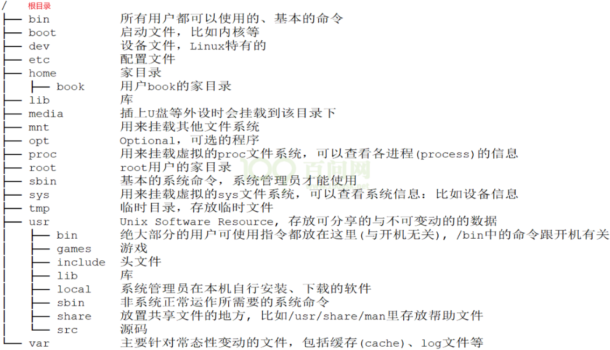

# VMware安装ubuntu

## 1.下载镜像文件

> 国内镜像源：
> 中国科学技术大学开源软件镜像：http://mirrors.ustc.edu.cn/ubuntu-releases/
> 清华大学开源软件镜像站：https://mirrors.tuna.tsinghua.edu.cn/ubuntu-releases/
> 下载ubuntu-18.04.6-desktop-amd64.iso

[Index of /ubuntu-releases/18.04.6/ (ustc.edu.cn)](http://mirrors.ustc.edu.cn/ubuntu-releases/18.04.6/)

## 2.安装VMware

下载VMware Workstation Pro 17。安装。

[VMware 17 下载安装及永久激活使用教程 - 嘿笨笨熊 - 博客园 (cnblogs.com)](https://www.cnblogs.com/hellogmy/p/17253041.html)

## 3.创建虚拟机并安装

打开VMware，文件 → 新建虚拟机，进入虚拟机配置向导：

1. 选择自定义。
2. 默认。
3. 选择稍后安装。
4. 选择Linux、Ubuntu 64位。
5. 设置虚拟机名称和安装位置。
6. 处理器配置默认。
7. 内存设置默认。
8. 选择使用桥接网络。
9. 默认。
10. 默认。
11. 选择创建新的虚拟磁盘。
12. 设置最大40GB，勾选将虚拟磁盘存储为单个文件。
13. 下一步。
14. 打开自定义硬件在CD处选择使用ISO镜像文件并选中下载好的镜像文件，打印机可移除。设置完毕就点击完成。
15. 开启该虚拟机，进入Ubuntu的安装流程。（建议使用英文环境下的乌班图）

## 4.配置

1、更改下载源：打开软件和更新，将下载源选择阿里的。

2、修改root密码：`sudo passwd`。

3、安装vim：`sudo apt install vim`。
如果出现`E: 无法修正错误，因为您要求某些软件包保持现状，就是它们破坏了软件包间的依赖关系`的错误，那就安装aptitude ——`sudo apt-get install aptitude`，然后`sudo aptitude install vim`，再`sudo apt install vim`。

4、开启root用户登录：

a.注释如下两个文件的对应行：文件为/etc/pam.d/gdm-password和/etc/pam.d/gdm-autologin，找到如下代码后在文件前面加入#注释：

```ssh
auth required pam_succeed_if.so user != root quiet_success
```

b.修改profile文件（重新设置了root密码才会有该文件）：`sudo vim /root/.profile`，注释掉或者删除下面的行

```sshd
#mesg n 2＞ /dev/null || true   # 注释这行
tty -s && mesg n || true        # 添加这行
```

5、配置远程登录：

1. **安装net-tools：**`sudo apt install net-tools `。
2. 安装openssh：`sudo apt install openssh-server`。
3. 修改配置文件：`vim /etc/ssh/sshd_config `，将`#PermitRootLogin prohibit-password`改为`PermitRootLogin yes`，StrictModes改为yes，`#Port 22`的`#`去掉，`LoginGraceTime 2m`改为`LoginGraceTime 120`。
4. 设置ssh服务开机启动——`sudo systemctl enable ssh`，重启ssh服务：`sudo systemctl restart ssh`。

6、配置静态IP：

>作者：沧海无雨
>链接：https://www.jianshu.com/p/d69a95aa1ed7
>来源：简书
>著作权归作者所有。商业转载请联系作者获得授权，非商业转载请注明出处。

首先，使用`ifconfig`查出网络网卡名称，我这里是ens33；使用`route -n`查出网关端口。

其次，打开这个文件进行配置——`sudo vi /etc/network/interfaces`，加上以下：（ens33、网关、子网掩码的要和自己的对应，dns-nameservers要设置为和网关一样）

```c
auto ens33
iface ens33 inet static
address 192.168.3.168
netmask 255.255.255.0
gateway 192.168.3.212
dns-nameservers 192.168.3.212
```

```c
auto ens33 // 使用的网络接口，之前查询接口是为了这里
iface ens33 inet static // ens33这个接口，使用静态ip设置
address 192.168.3.168 // 设置ip地址
netmask 255.255.255.0 // 设置子网掩码
gateway 192.168.3.212 // 设置网关
dns-nameservers 192.168.3.212 // 设置dns服务器地址
```

然后，使用以下两个命令刷新与重启：

```c
sudo ip addr flush ens33
sudo systemctl restart networking.service
```

最后，修改配置`sudo gedit /etc/NetworkManager/NetworkManager.conf`，打开文件后将将“managed=false”修改为“managed=true”，意为将网络连接设置为自定义或手动。再重启network manager：`sudo service network-manager restart`。
再重启系统。

7、更改系统语言：

```c
vim /etc/default/locale
/*
***********************
更改内容：
	LANG="zh_CN.UTF-8"
	LANGUAGE="zh_CN:zh"
修改为：
	LANG="en_US.UTF-8"
	LANGUAGE="en_US:en" 
**********************
*/
```

8、修改Ubuntu的屏幕分辨率：打开Settings，找到 Devices，点进去选择Displays，在Resolution这一项选择分辨率：1680X1050。

# Linux目录与命令

## 目录



## Shell


## 常用命令


**常用命令：**

- 显示当前所在路径（pwd）。
- 查看目录下目录和文件（ls -lah，list、all、human）。
- 进入目录（`cd  xxx`）、目录创建与删除（mkdir、rmdir，创建多级目录`mkdir -p x/xx/xxx`，删除多级目录`rmdir -p a/b/c`会删除掉a、b、c目录）。
- 文件创建（`touch 文件名`）。
- 拷贝（cp）：将目录或文件拷贝到某个目录下
  `cp 选项 目录或文件 目录2`：选项有r—recursive，表示递归地复制所有文件；f—force，表示强制覆盖；d——如果源文件为链接文件，那么只把链接文件复制过去
  示例：`cp -rfd dir_a dir_b`，复制dir_a的所有到dir_b目录下
- 删除（rm）：`rm -rf xxx`。
- 打印（cat）：`cat 一个或多个文件`，例如：`cat file1.txt file2.txt`，将这两个文件的内容都打印出来。
- 文件权限和属性管理（chgrp—改变组、chown—改变所有者、chmod—改变权限）。
- 查找搜索（find、grep）。
- 压缩与解压（gzip、bzip2、tar）。
- 网络命令、vi和vim编辑器命令。

其它命令：查看文件类型（`file 文件名`）、查找指令和应用程序所在位置（`which 指令或应用程序名`、`whereis 命令名或应用程序名`）。

关于相对路径与绝对路径：

- 绝对路径：从根目录开始表示目录或文件的方法称为“绝对路径”  。
- 相对路径：
  


## 包管理

1.搜索软件：其中还可以使用正则表达式 sudo apt-cache search sof* 这样就可以搜索到源上面所有以sof开头的软件包。

```
sudo  apt-cache  search  package_name
```

2.查看软件包信息

```
sudo apt-cache show package_name
```

3.查看软件包依赖关系

```
sudo apt-cache show depends package_name
```

4.查看每个软件包的简要信息

```
sudo apt-cache dump
```

5.安装软件

```
sudo apt-get install  package_name
```

6.更新已安装的软件包

```
sudo apt-get  upgrade
```

7.更新软件包列表

```
sudo apt-get update
```

8.卸载一个软件包但是保留相关的配置文件

```
sudo apt-get remove package_name
```

9.卸载一个软件包同时删除配置文件

```
apt-get -purge remove package_name
```

10.删除软件包的备份

```
apt-get clean
```

引用： https://www.sysgeek.cn/apt-vs-apt-get/


# Linux C

## Linux下C编程基础

1. 熟悉Linux系统下的开发环境。
2. 熟悉vi、vim操作。
3. 熟悉gcc编译基本原理。
4. 熟练使用gcc编译器的常用选项。
5. 熟练使用gdb调试技术（建议使用CGDB）。
6. 熟悉makefile基本原理及语法规范。
7. 掌握静态库和动态库的生成。

## 安装GCC/G++

1、先检查是否安装有GCC/G++：

```c
gcc --version
g++ --version
```

2、安装GCC/G++：

```c
// 刷新存储库索引
sudo apt-get update
// 安装GCC/G++，这样默认安装最新版
sudo apt-get install gcc g++
// 下载安装指定版本
sudo apt-get install gcc -5
sudo apt install g++ -5
```

3、调试工具GDB：

```c
sudo apt-get install gdb
```

4、调试工具CGDB：（还是不用这个吧）

```c
sudo apt-get install cgdb
```


## 编译与链接

```c
// 1.编译：编译源文件main.c为main.o文件
gcc -c main.c
// 2.链接：链接main.o生成main.out可执行文件
gcc -o main.out main.o
// 3.执行：
./main.out
/* 编译链接可以合并为：gcc -o main.out main.c */
```

## make与cmake简介

make：

>简介：一个根据指定的Shell命令对项目进行构建的工具。何为构建？构建就是对编译的安排，安排文件编译的先后顺序。简单来说，make就是一个批处理程序，其本身没有编译和链接的功能，只能通过调用makefile文件中写好的命令来进行编译和链接。
>
>应用：主要用于管理源代码文件较多、依赖复杂的C、C++项目。
>
>make构建流程：在shell中使用make命令，make会寻找当前目录下的Makefile文件，然后

makefile：

> 一个包含构建规则（Shell命令）的文件，类Unix环境下（比如Linux）的类似于批处理的"脚本"文件。

make&makefile的缺点：对于大工程，makefile编写不友好。于是后面出现cmake来便于生成makefile文件。

cmake：

> 简介：其是一个生成工具，用于生成makefile文件，其通过CMakeList.txt文件可以生成各个平台下的makefile文件。
>
> CMakeList.txt：学名“组态档”，一般由程序员编写，一些IDE可自动生成CMakeList.txt文件。

qmake：

> 简介：QT公司的，可以生成Qt专用的makefile文件，并且也是跨平台的，不仅仅用于Qt，也可用于为非Qt工程生成makefile文件。
>
> 与cmake对比：比cmake更加方便，不过cmake的功能比qmake强大一些。

## vi&vim


## GDB的使用


## GCC常用操作


## makefile


## cmake

# vi与vim指令

## vi

vi的三种模式：

1. 命令模式：使用`vi xxx文件`打开文件时的默认模式，此时可以执行一些命令来操作文件。
2. 编辑模式：在命令模式下，执行插入命令i、附加命令a、打开命令o、修改命令c、取代命令r、替换命令s，都会进入到编辑模式。
   按Esc可以退回到命令模式。
3. 末行模式（命令模式下，按“：”即可进入末行模式）。

### 末行模式命令

```c
/* 在命令模式下，先按`:`，再按指令w、q等 */
【:w】 保存文件
【:w!】 若文件为只读，强制保存文件
【:q】 离开vi
【:q!】 不保存强制离开vi
【:wq】 保存后离开
【:wq!】 强制保存后离开
【:! command】 暂时离开vi到命令行下执行一个命令后的显示结果
【:set nu】 显示行号
【:set nonu】 取消显示行号
【:w newfile】 另存为
```

### 命令行模式命令

**插入指令：**

```c
i       // 插入光标前一个字符
I       // 插入行首
a       // 插入光标后一个字符
A       // 插入行末
o       // 向下新开一行，插入行首
O       // 向上新开一行，插入行首
```

**移动光标：**

```c
h       // 左移     
j       // 下移        
k       // 上移      
l       // 右移      
M       // 光标移动中间行      
L       // 光标移动到屏幕最后一行行首      
行号G   // 移动到指定行，比如按3G，移动到第三行       
{       // 按段移动，上移      
}       // 按段移动，下移     
Ctrl d   // Ctrl+d，向下翻半屏     
Ctrl u   // Ctrl+u，向上翻半屏     
gg      // 光标移动文件开头      
G       // 光标移动文件末尾   
```

**删除命令：**

```c
x   // 删除光标后一个字符，相当于del
X   // 删除光标前一个字符，相当于Backspace
dd  // 删除光标所在行，n dd删除指定的行数D:删除光标后本行所有的内容，包括光标所在字符
```

**撤销命令：**

```c
u       // 一步一步撤销
ctrl r  // 反撤销
```

**重复命令：**

```c
.     // 重复上一次操作的命令
```

**文本移动：**

```c
>>   // 文本行右移
<<   // 文本行左移
```

**复制粘贴：**

```c
yy  // 复制当前行，n yy 复制n行
p   // 在光标所在位置向下新开辟一行，粘贴
```

**可视模式：**

```c
v  // 按字符移动，选中文本
V  // 按行移动，选中文本可视模式可以配合d，y,>>,<< 实现对文本块的删除，复制，左右移动
```

**替换操作：**

```c
r   // 替换当前字符
R   // 替换当前行光标后的字符
```

**选择、替换与搜索：**

```c
/string　　向光标之下寻找一个名称为string字符串

?string 　　向光标之上寻找一个名称为string字符串

n　　正向查找，搜索出的string,可以理解成next

N　　反向查找，搜索出的string,可以理解成Not next

n是从上到下，N是从下到上

v和V主要的是进行行选择,而Ctrl+v是进行的列选择，从灵活性上来说，ctrl+v更加的灵活一点

:n1,n2s/string1/string2/g　　这里的n1是查找的开始行数，n2是查找结束的行数。【:2,7s/ddd/fff/g】在第2行,第7行之间，将ddd替换成fff

:1,$s/string1/string2/g　　　从第一行到最后一行寻找 string1 字符串，并将该字符串替换为 string2 ！(常用)

:1,$s/string1/string2/gc　　从第一行到最后一行寻找 string1 字符串，并将该字符串替换为 string2 ！且在替换前显示提示字符给用户确认 (confirm) 是否需要替换！(常用)

：s/vivian/sky/ 　　　　替换当前行第一个 vivian 为 sky
：s/vivian/sky/g 　　　　替换当前行所有 vivian 为 sky

：n，$s/vivian/sky/ 　　替换第 n 行开始到最后一行中每一行的第一个 vivian 为 sky
：n，$s/vivian/sky/g 　　替换第 n 行开始到最后一行中每一行所有 vivian 为 sky
n 为数字，若 n 为 .，表示从当前行开始到最后一行

：%s/vivian/sky/（等同于 ：g/vivian/s//sky/） 替换每一行的第一个 vivian 为 sky
：%s/vivian/sky/g（等同于 ：g/vivian/s//sky/g） 替换每一行中所有 vivian 为 sky

：s#vivian/#sky/# 替换当前行第一个 vivian/ 为 sky/
：%s+/oradata/apras/+/user01/apras1+ （使用+ 来 替换 / ）： /oradata/apras/替换成/user01/apras1/

不加 g，表示只对搜索字符串的首次出现进行替换；

 g放在命令末尾，表示对搜索字符串的每次出现进行替换；

g 放在命令开头，表示对正文中所有包含搜索字符串的行进行替换操作

```

**其它：**

```c
shift + g  // 跳到尾行
gg         // 跳到首行
o          // 在当前行下一行插入
ggdG       // 删除所有内容
:set nu    // 显示行号
```


# ~~Linux & STM32~~

## 搭建编译环境

>系统：VMware + Ubuntu
>
>编译工具链：gcc-arm-none-eabi  
>
>下载工具：OpenOCD（支持stlink，ulink，jlink等） 、STM32CubeProgrammer（仅支持ST-LINK）
>
>STM32标准库：stm32-standard-peripheral-libraries

1、下载编译工具链：

>交叉编译器 gcc-arm-none-eabi：
>
>- Ubuntu 安装的GCC编译器是针对X86架构的，不能编译针对ARM架构的代码。
>- 在X86架构上运行的，可以编译ARM架构代码的GCC编译器，就是交叉编译器（在一个架构主机上编译出另一个架构的能执行的代码）。
>
>GNU Arm Embedded Toolchain：
>
>- 是用于 C、C++ 和汇编编程的即用型开源工具套件。
>- GNU Arm 嵌入式工具链适用于 32 位 Arm Cortex-A、Arm Cortex-M 和 Arm Cortex-R 处理器系列。
>- GNU Arm 嵌入式工具链包括 GNU 编译器 (GCC)，可直接从 Arm 免费获得，用于在 Windows、Linux 和 Mac OS X 操作系统上进行嵌入式软件开发。

使用apt自动下载gcc-arm-none-eabi：（更改软件源为国内镜像源一般下载速度还行）

```c
/* 下载 */
sudo apt-get install gcc-arm-none-eabi
/* 查看工具链的gcc版本 */
arm-none-eabi-gcc -v
/* 卸载 */
sudo apt-get remove gcc-arm-none-eabi
```

手动安装gcc-arm-none-eabi：

（1）官方网址：[Downloads | GNU Arm Embedded Toolchain Downloads – Arm Developer](https://developer.arm.com/downloads/-/gnu-rm)

（2）找到**gcc-arm-none-eabi-10.3-2021.10-x86_64-linux.tar.bz2**，选择你需要的版本，我选用10.3版本。

（3）通过工具将安装文件上传至Ubuntu的/opt目录。

（4）开始安装：

```c
/* 1、解压 */
tar -jxvf gcc-arm-none-eabi-10.3-2021.10-x86_64-linux.tar.bz2
/* 2、添加环境变量到用户目录下的 .profile 文件（仅为某个用户配置，`cd ~`中可以查到该文件） */
exportline="export PATH=/opt/gcc-arm-none-eabi-10.3-2021.10/bin:\$PATH"
/* 3、检查环境变量是否成功 */
if grep -Fxq "$exportline" ~/.profile; then echo nothing to do ; else echo $exportline >> ~/.profile; fi
/* 4、重新载入 */
source ~/.profile
/* 5、查看版本 */
arm-none-eabi-gcc -v
/* 卸载 */
sudo rm -rf /opt/gcc-arm-none-eabi-10.3-2021.10/
sudo vim ~/.profile  // 注释掉export PATH=/opt/gcc-arm-none-eabi-10.3-2021.10/bin:$PATH
source ~/.profile
```

如果使用多个版本，那就使用到哪一个的时候就切换到哪一个——通过更改环境变量来实现。

如果设置为全局环境变量，那就在`/etc/profile`文件添加环境变量：

```c
/* 操作 */
export GCC_ARM_NONE_EABI=/opt/gcc-arm-none-eabi-10.3-2021.10
export PATH=$GCC_ARM_NONE_EABI/bin:$PATH  
/* 多个路径 */
export GCC_ARM_NONE_EABI=/opt/gcc-arm-none-eabi-10.3-2021.10
export JAVA_HOME=/opt/jdk-12.0.2  
export PATH=$PATH:$GCC_ARM_NONE_EABI/bin
/* 更新 */
source /etc/profile
```

手动安装：下载gcc-arm-none-eabi-7-2018-q2-update安装，解压后配置环境变量。

## 编译STM32标准库


## 烧录软件安装

> STM32CubeProg下载地址：
> [STM32CubeProg - 用于STM32产品编程的STM32CubeProgrammer软件 ](https://www.st.com/zh/development-tools/stm32cubeprog.html#overview)。

**安装OpenOCD：**

1、安装软件依赖

```c
sudo apt-get install build-essential pkg-config autoconf automake libtool libusb-dev libusb-1.0-0-dev libhidapi-dev
sudo apt-get install libtool libsysfs-dev
```

>libtool-bin：通用库支持脚本，可以在不同平台上创建并调用动态库
>libhidapi-dev：CMSIS支持
>libusb++-dev：基于usb的适配器依赖于libusb-1.0和一些旧的驱动

2、下载OpenOCD并上传到/opt：[OpenOCD - Open On-Chip Debugger download | SourceForge.net](https://sourceforge.net/projects/openocd/)

```c
/* 解压 */
unzip openocd-0.12.0.zip
/* 进入openocd的文件夹,使用以下命令可以列出调试器及其开关情况： */
./configure   // 执行配置，配置完成后可以看到支持的适配器列表，执行这个就行
./configure --prefix=/usr/local/openocd // 配置安装路径
./configure --enable-jlink              // 配置开启J-LINK，0.12.0默认开启了
/* 编译、安装：好像默认安装到/usr/local/share/目录 */
make
make install
/* 查看openocd版本 */
openocd -v
/* 如果后续想要卸载OpenOCD，可以到刚刚解压编译后的openocd-0.12.0
目录，使用 make uninstall 进行卸载。 */
make uninstall
```

3、安装在`/usr/local/share`目录下的openocd目录（有三个文件：contrib、OpenULINK、scripts）。

`scripts`文件夹存放着openocd使用到的文件，该文件下还有：

- `interface`：存放着下载器接口的文件，
- `target`：存放着目标芯片的配置文件。

## 烧录


