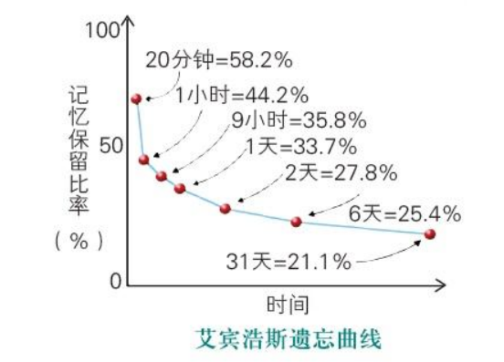
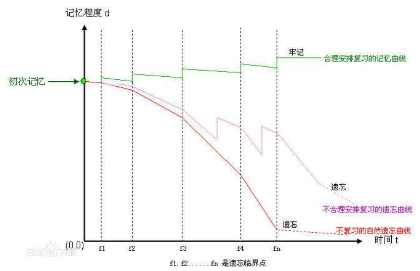
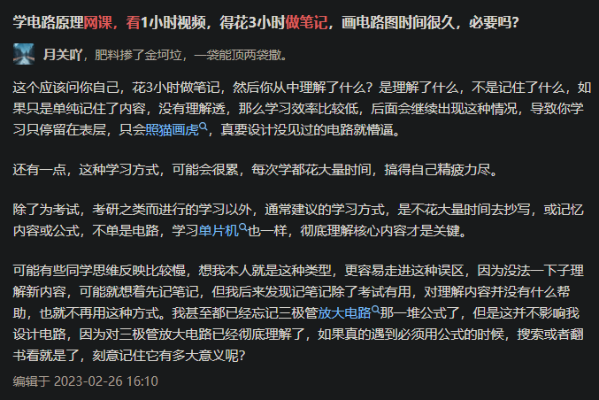
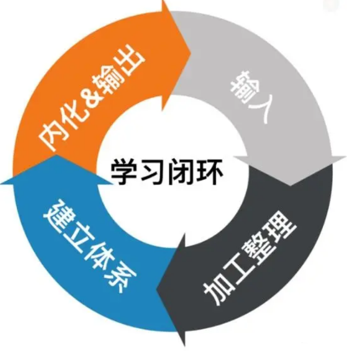

# 高效学习方法？

>你有什么值得分享的高效学习方法？ - 高太爷的回答 - 知乎 https://www.zhihu.com/question/50343728/answer/121158416
>
>作者：高太爷
>链接：https://www.zhihu.com/question/50343728/answer/121158416
>来源：知乎
>著作权归作者所有。商业转载请联系作者获得授权，非商业转载请注明出处。

从小被教育好好学习，但却从没人教我怎样好好学习，直到接触心理学尤其是认知心理学，才发现以前的学习多么低效，高效的学习又多么迷人！知其然更要知其所以然，心理学视角探究学习理论，既能将常用的老方法化腐朽为神奇，又能指导我们培养新的高效方法。
以下 6 个方法，每个方法都从两个方面详细阐述：「为什么有效」（认知心理学理论），以及「怎样高效利用」（理论照进现实），另外，部分理论还结合了年初参加职业考试的经历，这场考试也让我真切体会到高效学习的威力和魅力，学习真不是一件苦差事！

**1、注意力稳定性理论：必须有目的的预习。**

注意力稳定性。注意力不能长时间保持稳定，而是周期性起伏变化，通俗讲就是课堂 45 分钟，真正有效时间大约不到 20 分钟，这不是以个人意志为转移的。因此，要成为学霸，有效的课堂时间必须用来听重点，听难点，听方法思路的，而要做到这一点，有目的的提前预习非常重要，必须要带着问题听讲。很多人不明白这一点，要么不预习，要么稀里糊涂预习，虽然瞪大眼睛听讲，最后只能自证智商确实存在差异！

之所以将这条放到第一点，一是课堂听重点太重要了，另外就是对于 N 多年没踏入课堂的人来讲，集中精神听讲基本不可能，时不时就刷刷朋友圈、看看新闻，坐立难安，尽管大多数时候在开小差，但我对上课内容吸收非常高效，这归功于有目的的预习，带着问题听课，一旦老师讲解到问题内容，自然就全神贯注！

**2、记忆衰退理论：必须及时复习。**

德国心理学家艾宾浩斯研究发现，遗忘在学习之后立即开始，而且遗忘的进程并不是均匀的。最初遗忘速度很快，以后逐渐缓慢。

上面曲线告诉我们及时复习非常重要，但实验又证实，合理安排复习时间也非常重要，并非复习就有效果，正确的时间点进行复习就会事半功倍！

什么才是最佳的时间节点，实验给出的建议是 5 分钟后重复一遍，20 分钟后再重复一遍，1 小时后，12 小时后，1 天后，2 天后，5 天后，8 天后，14 天后就会记得很牢，很难再遗忘。但对于较为繁重的学习，这近乎不太可能，我个人的实践是：即时复述很关键（短期记忆转化成长期记忆），12 小时或睡前温习很重要（最好是通过题目巩固），1 天后、2 天后、8 天后三次复习，效果通常就已经非常不错。

**3、记忆编码理论：必须动手构建知识树。**

认知心理学研究指出，记忆效果取决于信息编码方式，「深层次」加工比「浅层次」加工更有利于知识的记忆和提取。换句话说，记忆和理解取决于如何加工信息。加工深度很难衡量、定义，因时而异，但有效的深加工肯定是在记忆内容和已知信息间建立联系，而建立知识树是最为有效的方式，通过树形结构把知识串联、和组织！

以年初的考试学习为例，在我眼中，书本不是一个个知识点的无序堆积，而是一个树形结构，一个节点就是一个问题，我要做的，就是建立并完善这课知识树，在学习中不断调整、增删节点，不断发展、壮大这棵知识树。知识树一旦被搭建出来，每一个节点就是一次思考，每一次思考就是与周边知识节点的一次连接，知识之间的联系就越来越紧密，知识树也就越来越有条理，越来越有生命力，很多问题自然而然就能触类旁通、融会贯通，而不是杂乱无章的一团浆糊，毫无头绪！

具体搭建方法可参见思维导图，为限制篇幅这里不细述，已经发布在公众号《终身学习？不懂这个方法都是白学》。

**4、内隐语言理论：打破学习错觉。**

很多时候我们自认为学得好，是错将熟悉当做知道。比如我们学习一个章节内容，画了重点记号，甚至还做了笔记，这时我们可能会认为学得很好，对知识点也了如指掌，但如果合上书做个简单的自我检测，瞬间就会忘掉三四成。再比如，问自己一个经典问题：「什么是囚徒困境」？心里是不是很快闪出「两个人」、「博弈」、「策略」等关键词，觉得对这个问题很熟悉，但如果我要求用你完整描述出来，你真的知道吗？

这种学习错觉（误将熟悉当知道）是内隐语言与外部语言的差异造成的。语言分为内隐语言和外部语言。通俗讲，内隐语言是我们自问自答或不出声的言语，外部语言就是我们正常交谈或小声默念。内隐语言过于隐秘、快捷、破碎，而外部语言（或者书写表达）是逻辑、完整、成体系的，但如果一个知识点能用内隐语言描述，我们就误以为很熟悉。

具体到学习中，对一个知识点进行复习时，内隐语言抓住了几个关键点，我们就会产生学习错觉，误以为都知道，但知识点不是孤岛，是由逻辑关系构成的，这需要外部语言去描述、串联，唯有经过外部语言检验，才是真正的掌握理解！因此，必须将内部语言转换成外部语言。认知心理学推荐生成与测试两种办法：

生成效应是指向同学、朋友、家人解释解释所学知识，在解释过程中，主动思考组织知识，构建出知识的逻辑性和条理性。有经验的童鞋都知道，很多灵感都是在给别人讲题中产生，甚至是请教别人时恍然大悟，另外做讲座之类的对掌握知识非常有用！

测试是指对知识点进行自我提问，然后将答案小声说出来，或者完整写出来，不能心里一晃而过几个关键词就觉得了解然后测试结束。

**5、情绪绩效理论：压力是资源。**

学习是为了提高自身，但对学生及成人教育而言，考场发挥也非常重要，临场心态非常关键，那一刻的心态抵得上几个礼拜、几个月甚至几年的苦功！这就涉及情绪绩效理，即情绪唤醒水平和绩效间存在着倒 U 型曲线的关系，情绪太低或太高都会损害绩效。所以适当的压力是有好处的，完全没有压力或压力过高都会影响发挥。

压力的最新研究还表明，我们对压力的认知会改变这一压力曲线（大致是左、右平移）。比如一个实验证实，如果人们被简单告知「你是那种在压力下表现更好的人」，他们实际表现会提高 33%，即使这只是随便说说也无妨，重要的是信息改变了个人对压力的评估方式。所以，视压力为资源，会让我们在压力下表现更好（向右平移），而谈压色变则会让哪怕一丁点的压力都影像我们发挥（向左平移）。

**6、合理休息：休息也是学习。**

曾翻译一篇长达 44 页的学习论文《The Role of Deliberate Practice in the Acquisition of Expert Performance》（《异类》等畅销书就是以该论文为原型），译文为《刻意练习：成就天才表现》，该论文对合理休息的描述非常精准：

>A number of training studies in real life have compared the efficiency of practice durations ranging from 1 -8 hr per day. These studies show essentially no benefit from dura-tions exceeding 4 hr per day and reduced benefits from practice exceeding 2 hr (Welford, 1968; Woodworth & Schlosberg, 1954). 
>
> 有很多关于学习时间与效率的研究，这些研究证实：超过 2 小时学习效果就逐渐递减，超过 4 小时根本就没有效果了。因此合理的休息与高效率的学习同等重要，长时间无效学习尤其会让人心生厌恶。 
> one would expect that the level of practice an individual can sustain for long periods of time is limited by the individual's ability to recover and thereby main-tain a steady state from day to day. After the individual has slowly adapted to a constant level of practice, increases ought to be possible. In contrast, if an individual cannot recover each day from a given level of practice, sustaining that level will lead to exhaustion and mental fatigue. 
> 要想长期能够保持稳定的学习效率，就不能一次过度消耗甚至透支，要确保每次学习时精力都能够恢复。一旦过度透支，不仅会造成效率低下，甚至带来精神疲劳，削弱动机和坚持动力，很多少年天才通常过于急功近利（或被迫），致使兴趣、热情被消耗干净，最后无法坚持而失败。

对于长期的学习，明智的做法是，控制每天的高强度学习时间，避免精神疲劳或逆反心理，简而言之：

1）短期内，要合理调配好学习与休息，避免过度透支精力和兴趣，要细水长流。

2）长期看，长时间的坚持学习，能够让身心能逐步适应，之后可逐渐增加学习量和学习强度。

另外，认知心理学有一个「间隔效应」：分几段时间来学习，不要试图一次学完所有东西，这会大大提高学习效率（在知乎答题更是如此，比如本题我陆陆续续写了快 3 天，每天写一点压力不大，状态还好，如果非要一次性写完，答案要么太水，要么兴趣透支就此封笔）。此外，研究还证实，学习之后休息或睡一会，能有效提高记忆效果。

以上。影响学习效率的理论还有很多，比如注意力切换损耗理论，记忆构建理论，格式塔理论，学习区理论等等，将在下篇分享。

>总结：
>
>1、要有重点的先预习，了解一下全貌；
>
>2、要记住，要定期复习；
>
>3、要整理，系统化；
>
>4、要输出，要去实践检验自己的知识；
>
>5、要做好情绪管理，压力管理；
>
>6、要善于休息，学习是消耗精力的事，没有良好的精力，是不可能高效地学习的。

# 终身学习？

学习正在成为一项终身事业，不学习很快就会被时代落下，很多人因此热衷追求高效的学习方法，但真的有用吗？或者说，你能让它真的对你有用吗？

最近在看芭芭拉.奥克利的《学习之道》，即使以挑剔的专业眼光，这本书也堪称学习经典，书中总结了十个非常有用的学习方法：

【注：限于篇幅只介绍方法，但方法背后的学习原理才是关键，有兴趣可自行阅读，或观看上传的学习笔记】

**1、运用回想**

读完一章节后，主动回想章节内容，既加深对知识的理解和记忆，又构建出章节内知识体系，大幅提升学习效果。

**2、自我测试**

低效的学习容易产生“学习错觉”，即似懂实则非懂，自我测试一方面能检测知识掌握程度，另一方面运用了“生成效应”，有效建立、加固知识间联系。

**3、对知识进行组块**

这是一个学习、练习的过程，通过不断的有意识联系，将分散的知识构成小的体系，类似于“打包”。

**4、间隔开重复学习**

长时间学习某门课程，效果只会适得其反，对较大的学习任务要分解为几个部分，一次只处理一个部分，总体学习效率会大幅提升。

**5、交替使用不同解题技巧**

集中练习一种解题技巧，只是在自动化的按部就班，起不到练习效果，可以平时用卡片积累一些经典题库，通过抽签等方式随机测试自己。

**6、注意休息**

高效学习耗费大量资源，必须及时休息进行调整恢复，高效休息是高效学习的前提。

**7、使用解释性的提问和简单类比**

遇到难懂、晦涩的概念，都要想一想，怎样让10岁小孩都能明白这个概念，深入浅出将知识表达出来，这才是真正的理解了。

**8、专注**

利用番茄工作法，在25分钟内集中注意力，专注做一件事，不在乎结果，只在乎过程，培养专注一件事情的能力。

**9、困难的事情最先做**

精力充沛时，首先做最困扰的事情。

**10、心理对照**

想象过去的你，对比通过学习能够成就的那个自己，为学习注入心理动力。

>上面十个学习法则，细细品来都非常实用，每读一个都倍感收获，太激动了，但请先冷静一下，现在回想下：这10个法则是什么？
>
>你已经忘记了几个？
>
>这么有用的知识忘记太可惜，请再快速浏览下，然后再次回想，你又能记住几个？
>
>试想，5分钟后，你还能记住几个？
>
>以这样的遗忘速度，你最终能记住几个？
>
>那具体到实践中呢，有几个真正能指导你高效学习？
>
>学习方法再好，哪怕我们看的热血沸腾，鸡血满满，但那只是别人的，怎么把别人的东西变成自己的？
>
>我的方法是**构建知识树。**

上述10个方法都非常实用，但就好像平面的东西，没能建立立体体系，懂记忆原理的童鞋都知道，知识孤岛很快就被遗忘，也根本无法指导实践，必须寻找它们内部之间的联系，建立立体的知识体系，也就是知识树。

建立知识树其实非常简单，只需要3步：

**1、界定“元知识”**

即最小的知识合集，也就是知识树的树叶，这里面就是10个学习方法。

【注：本篇对这一步不多做解释，但并不意味着非常简单，元知识通常是一个知识合集，是一个知识组块，是需要被熟练掌握的，就好像这10个学习方法，只是简单说了怎么做，但为什么要这样，如何运用到现实中，这些复杂的信息并没有体现出来，建议看看《学习之道》，只有真正被熟练掌握的知识集才能称之为元知识】

**2、提炼**

对不同的元知识进行分类合并，挖掘彼此间的联系，并形成提纲挈领的总结，这一步非常考验对元知识的真实掌握水平。以这10个方法而言：

- 回想、自我测试、交替使用不用解题技巧、使用简单性的提问和类比，其实质是对知识进行检测、加工，并能够灵活的、深入浅出的输出，故可归类到“知识检测”；
- 专注、困难的事情先做、间隔开重复学习、注意休息，其实质是学习过程中的“时间管理”。
- “心理对照”解决的是学习中的动力问题，故归类到“学习动力”。
- “对知识进行组块”其实就是构建元知识的过程，这是一个学习、练习的过程，通过不断的练习解题技巧，对分散的知识构成一个个小体系，故单独归类“学习过程”。

10个学习方法可简单归结为四类：**学习动力，时间管理，学习过程，知识检测**。

1. 学习动力：解决学习坚持的问题；
2. 时间管理：合理安排学习时间，提高学习效率；
3. 学习过程：通过练习加固对新知识的理解；
4. 知识检测：既是对知识的自我检测，也是培养灵活解决问题的能力。如果有心，我们会发现，这四类正好是学习的四个方面（这种分类能力，需要在实践中不断提高，并非一蹴而就）。

**3、画出知识树**

这一步非常简单，就是将上面的逻辑关系图形化，我习惯用思维导图，简单实用，但限于审美能力，无法做得美观。

至此，一棵知识树构建完毕。用知识树串联起来的知识，将知识从平面变成立体，从知识孤岛挖掘出了知识间的横向联系、纵向联系，加深了对知识的理解，尤其是构建出了知识体系，这就相当于有了自己的方法论，我们就可以据此指导实践，并且在实践中，对知识树进行更新，不断修剪、壮大知识树，更加精确地指导实践！

最后，对构建知识树的两个关键步骤再强调下：

- 第一步：自下而上形成元知识。这里介绍的10个学习法则非常笼统，其背后都有最前沿的科学实验作支撑，对于学生而言，一个元知识可能是一个章、一节的知识内容，如何将一个章节压缩成一个元知识，这考验功底。
- 第二步：自上而下的宏观视角。很多人经过长期的学习、练习，对第一步的掌握比较到位，每个知识点单独拎出来都非常擅长，但涉及到考试或者知识运用就蒙圈了，这是因为宏观的知识框架没有搭建出来，不知道何时该用、能用什么知识解决问题，这就需要构建自上而下的宏观视角，这也是建立知识树的关键意义。

**知识树有多重要**？根据“使用解释性的提问和简单类比”原则进行解释，我打两个比方：

1：对于百思不得其解的难题，我们通常瞟一眼答案，或者别人一句提示，我们马上就知道怎么做，知识树就相当于这种高屋建瓴的瞟一眼，帮助我们找到解决问题的方向和思路，至于具体怎么做，这就考验元知识功底，也就是我们平时的练习程度。

2：将军和元帅有什么区别？元帅制定战略，对于一场战争，他只需要解决三个问题：要不要发动战争，从哪里发动战争，用哪个将军打，这是战略层面，而将军则考虑现实技术性问题：如何打赢战斗，这是战术层面。知识树就相当于元帅，元知识就相当于将军，未经整合的知识点则是散兵游勇，毫无战斗力。

至此，知识树构建完毕。老实说，构建一个知识树很简单，用时也很少，只需要在学习之余，多一点点反思、提炼，但就这一丁点的额外努力，却能为我们的腾飞插上翅膀，**人与人之间的差距，有时候就是这么拉开的**。

>高太爷还准备了一个福利：经典学习图书《学习之道》有20多章100多个知识点，用知识树思维整理成4篇笔记及4棵知识树，在公众号“高太爷”后台回复“学习之道”，自动获取笔记及思维导图。

# 笔记？

>这个应该问你自己，花3小时做笔记，然后你从中理解了什么？是理解了什么，不是记住了什么，如果只是单纯记住了内容，没有理解透，那么学习效率比较低，后面会继续出现这种情况，导致你学习只停留在表层，只会照猫画虎，真要设计没见过的电路就懵逼。
>
>还有一点，这种学习方式，可能会很累，每次学都花大量时间，搞得自己精疲力尽。
>
>除了为考试，考研之类而进行的学习以外，通常建议的学习方式，是不花大量时间去抄写，或记忆内容或公式，不单是电路，学习单片机也一样，彻底理解核心内容才是关键。
>
>可能有些同学思维反映比较慢，想我本人就是这种类型，更容易走进这种误区，因为没法一下子理解新内容，可能就想着先记笔记，但我后来发现记笔记除了考试有用，对理解内容并没有什么帮助，也就不再用这种方式。我甚至都已经忘记三极管放大电路那一堆公式了，但是这并不影响我设计电路，因为对三极管放大电路已经彻底理解了，如果真的遇到必须用公式的时候，搜索或者翻书看就是了，刻意记住它有多大意义呢？
>
>作者：月关吖
>链接：https://www.zhihu.com/question/586355220/answer/2911822165
>来源：知乎
>著作权归作者所有。商业转载请联系作者获得授权，非商业转载请注明出处。

# MyLearningMethods

# 费曼学习法

费曼说：“最好是几岁的小孩也能明白你在说什么。”

为此，他制定了一个简单易行的流程： 

- 第一，确立你要学习的目标。

  找到和列出自己想要了解的知识，可以是一本书，也可以是一门技术，甚至是你能想象到的任意领域和事物。 

- 第二，理解你要学习的对象。

  针对这个目标，准备好和筛选相关的资料，选择可靠和多个角度的信息来源，把这些内容系统化地归纳整理出来。 

- 第三，以教代学，用输出代替输入。

  模拟一个传授的场景，用自己的语言把这些知识讲给别人，用以检查自己是否已经掌握了这些知识。 

-  第四，进行回顾和反思。

  对其中遇到阻碍、模糊不清和有疑义的知识重新学习、回顾和反思。如有必要，可以重整旗鼓，进行再一次输出。 

-  第五，实现知识的简化和吸收。

  最后，通过针对性的简化和整合，实现这些知识的内化和有效的应用。

费曼技巧的具体应用方式如下：向不熟悉知识的人解释该知识，用他们能理解的方式及最简单的语言向他们解释。发现自己不能理解的地方或不能简单解释某知识的地方并记录，回头查看资料来源并研读自己薄弱的地方，直到能用简单的语言来解释。

>费曼学习法 - 杨京京的文章 https://zhuanlan.zhihu.com/p/686975352

# 学过与学会

>尝试解答一下片头的问题
>书籍看过后容易忘用不出，本质上是因为看的还不够，知识还没有为自己完全掌握。
>类比一下，就像是岸上模仿了一遍游泳的动作，就希望学会游泳。先不说看过一遍后能不能学会游泳（实践的掌握），首先可能看过一遍动作都记不住（理论的掌握）。
>想要学会一项技能或知识，只能理论不断的重复把游泳的动作顺序搞熟练，然后在水里而不是岸上，一遍一遍的练习，直到像呼吸一样自然。
>这时候才算是学会，否则只能算是学过。

