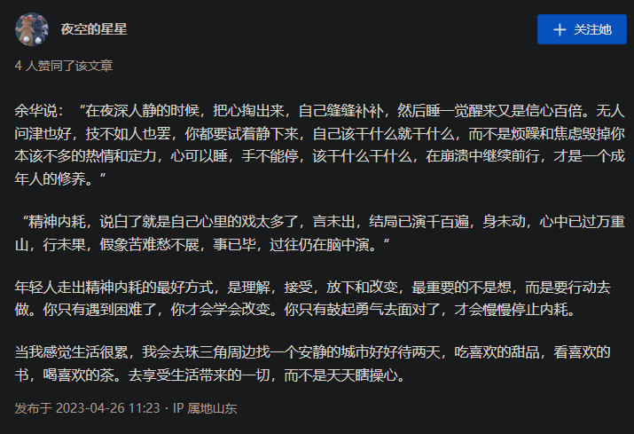

# 往前走

>如果有时候实在不想去学习了，那就放空自己，转移注意力 —— 不要将注意力放在我不想干啥干啥上，不想做事的时候那就适当地停一会，去买点零食吃吃、去散散步走一走、去看看风景、去打坐冥想等等等，保证自己的冷静，才能不浮躁，之后的学习效率才能更高。做事要静，才能专注起来，才能事半功倍。
>
>每一天固定要做的事就是：
>
>- ①回顾自己的目标 —— 不要在匆匆忙忙的学习之中失掉了本心，每天都看看自己的目标，才不至于在浩瀚的知识海洋中迷失；
>- ②做好每一天的简单规划，不必苛求计划全部严格按质按量完成，但要保证自己去做的时候自己是处于专注的一个状态下去做，计划也不必过多，不必精确到哪一个时间段自己该做什么，只列出一天中主要做的事即可；
>- ③回顾自己的一天，这个应该在睡觉前来做，想想自己一天干了啥、自己的感觉如何、自己对自己这一天是啥感受、自己这一天的情绪、这一天遇到哪些好玩的事和物、自己工作情况如何等等等，总之就是记录自己所做、所感、所悟、所学、所想、所遇，当然重点是回顾自己的学习，学到了哪些、真的搞懂了哪些、自己学习中的不足之处、哪些亟待解决的问题等，这里说了很多，但目标就两个，一是自己 —— 自己的感觉、感受、收获，二是做事 —— 做得怎样、如何做得更好。
>- ④就是每天要来这里看看，先明确知道今天一定要做的就是这三件事，然后就可以开始新的一天了。有始有终，始 —— 做好简单的规划；终 —— 反思所做、回顾所学（人人都会遗忘，不复习是不行滴）。

>你有什么问题要问你自己呢？
>
>- 你真的有努力过吗？你是如何衡量你努力了的呢？再仔细想想，算得上努力了吗？
>- 对某些事情畏手畏脚的时候，你到底再害怕些什么呢？害怕过程、还是害怕结果、还是质疑自己的能力？
>- 你有每天仔细想想自己做了什么吗？如果你发现自己好像什么都没做，一天过去了没有任何收获，那你愿意想些办法来使得自己的每一天更加丰富多彩，使得自己每一天收获更多的知识或技能吗？
>- 你有每一天都明确自己的目标吗？如果没有目标的话，那你试过努力去寻找一下目标吗？
>- 你有记录下自己遇到的难题并尝试去解决它们吗？如果遇到了一些难题并解决了，你有去记录下来你解决问题的过程和方法吗？
>- 对于“你想要的”，你能付出多少时间、多少精力？
>- 没有得到“想要的”，你是否付出了足够多的时间与精力？
>- 你浮躁吗？
>- 有觉得自己笨吗？你想想自己写过多少代码、交流过多少问题、看过多少技术博客、看过多少书？很多时候并不是由于自己笨的缘故，而是没有下足功夫，要想学懂一些事儿，是需要做够必要的工作、必要的实践的。
>
>如果都没有的话，你就根本没有努力过，你对一切一无所知，你目前所做过的一切根本微不足道，谈不上努力。
>引用一段话 —— “你要耐得住不断延迟的时间线，要交付出足够的努力堆砌在沉闷、晦涩的时光里”。拼尽你的全力吧！

# 继续前行

# 草台班子

我对于这个论点有种相见恨晚的感觉。

以前懵懂无知的时候总是将有些事情看的特别理想化，什么大公司怎么高大上，政府的政策都是精英制定我等不明觉厉，某某事务的流程怎么怎么标准化和严谨，后来我一圈走下来，这些滤镜已经碎的连渣渣都不剩了。只剩下四个字再我的脑海：不过如此。

本质就是明白了，都是人，都带着与生俱来的人性的弱点和缺陷，人群只要凑在一起，就一定会有干事扯皮偷奸耍滑的时候，谁管你造的航天飞机还是手套连裤袜呢？

当然话说回来，就是不要理想化任何一个人或者群体，但也不能因此降低对自己的要求。

更新一下最近的感悟。

引用一下某音上一位经济时事博主的话：这个社会各行各业充斥着的大量的糊涂混子，少数干实事的人在无处不在的推诿和敷衍中勉强的将集体工作维持在底线之上，整个社会运转的晃晃悠悠撒汤漏水，一切都是对付着能用就行。

其实早点想通这些，你就不会带着滤镜去看任何的人和事。予我这种从小有些自卑的人来说，真的是一个很重要的跨越性的认知。我不再苛求自己，不再妄自菲薄，向着自信而又强大的自己又迈出了重要的一步。

希望你也可以。

> 作者：飞鱼酱
> 链接：https://www.zhihu.com/question/589964007/answer/3045510034
> 来源：知乎
> 著作权归作者所有。商业转载请联系作者获得授权，非商业转载请注明出处。

# 思考—何为工具？

>问题：
>
>>Golang和Java到底怎么选?
>
>>我们计科不教Java，但我想深入学一门后端当主力语言，所以不知道Java和go怎么选，有人说转go是趋势，也有人说Java还是很热门，不知道咋选了，求大佬指点
>
>作者：圆胖肿
>链接：https://www.zhihu.com/question/463826127/answer/3265756458
>来源：知乎
>著作权归作者所有。商业转载请联系作者获得授权，非商业转载请注明出处。
>
>
>
>你这个问题，犯了两个错误，一个是学生思维，还有一个是打工仔思维。
>
>我们一个个展开。
>
>第一个，学生思维，学生总以为，尤其是本科生，以为，大学里教的那些东西，是教他们技术，教他们操作，教他们将来怎么找工作。
>
>错了，不是的，教你怎么找工作，教你具体操作的，那是职业技术学校，这个在我们国家的教育体系中，基本上是以专科为主。
>
>你是计科，计算机科学，你看清楚这个专业是什么，是科学，技术只是科学的应用，不是科学本身，计算机科学是本科阶段的专业。
>
>而大学本科，是为将来搞研究筛选人才，所以大学里不教你这些编程语言的语法，是对的，因为在大学老师看来，编程语言的语法，你自己随便看看就会了，现在ide都很智能，你自己动手试试看，以java为例，你想写错都很难啊，以前用黑框在那边编辑，手动输入javac那些，一不小心就写错。
>
>现在不是了，现在都是ide，打开向导，直接帮你全套生成了，然后你填的那些代码，你想写错，其实ide都会在第一时间就提示你，经常遇到一些在校生来问，为什么错，我说，你把ide提示你的英语看懂，不懂就找个翻译工具来翻译，其实你就知道原因了，哪里需要你来问，问个p问。
>
>所以这么简单的东西，你自己去搞搞就是了，我经常挂嘴边说的，mcgill的computer 101（203其实）就是开放性全校选修的大课，很多专业是arts（国外arts是文科不是艺术）的女孩子，就选这课，目的是为了凑学分，然后老师教他们java，一个学期，就一个学期下来，很多女孩子都能拿a。
>
>她们并不是什么技术宅，不懂什么编译器，操作系统，跟她们没什么关系，人家就是单纯用这个工具实现一个软件，就这么原始简单的目的，在老师的引导下，一个学期就学会了，掌握了。
>
>她们可以，你为什么不行？
>
>普通老外的智商也没有说多高，当然不排除有天赋异禀的数学天才之类的，但是这东西不需要你是啥天才也能掌握。
>
>第二，打工仔思维，打工仔犯的一个错误就是，他们会天真滴以为，给人打工很有前途，我才不管这个是什么人，管他是张一鸣还是马化腾，给这种人打工，你就已经被打为校友里面的下等了，你放心，只要你不改变给人打工这个前提，你这辈子都不可能成为那个知名校友。
>
>就学校从本质上就没打算培养你去做这种人。
>
>而且给人打工确实没什么前途。
>
>提心吊胆的，你也可以感觉出来，现在给人打工，是越来越难。
>
>就你指望说，谋求一份好的工作，然后就有车有房，现在不说完全不可能吧，但是难度也要大很多了，对吧，你想一下，你在深圳打工，多少年才能靠你那点工资买一套房子。
>
>但是以前不是这样，在03年左右，华为一个月工资，轻松购买深圳一平米，现在，你觉得呢？有多少打工仔可以一月入10万？
>
>当然，为了谋生，为了活下去，给人打工，无可厚非，但这个并不高级。
>
>你应该转变思路，大学培养了你，尤其是985，培养了你，你或许会辜负了大学的期许，没能读下phd也就是博士，没能继续在科研机构搞研究，科研机构都是事业单位，现在进事业单位很难，你最好要国外phd毕业，然后回国青椒，非升即走一段时间之后，才能真正进体制。
>
>但即便是大学把你淘汰了，大学也希望你成为老板，带着一大堆人去赚钱，而不是以给某个人打工为荣，那在大学看来，真林北丢人，你自己看看你们学校的校友，知名校友，科学家比如院士，blablabla，很多，政府官员，blablabla，很多，企业家，也有，blablabla，很多，但是你见过，哪个学校，会把那些给人打工的人糊墙上的吗？
>
>没有嘛，所以给人打工，越来越难，而且学校也不提倡你这么干，那你就应该转变思路。
>
>王侯将相宁有种乎嘛，谁说你不能成为企业家？
>
>那技术是啥玩意？技术只是在你自己创办你自己的事业的时候，的工具罢了。
>
>其实所有的技术都是工具，科学是贵族们的爱好，历史上为什么会有科学，是因为那些欧洲贵族衣食无忧，每天闲着无所事事，所以凑在一起研究这个世界的规律，然后因为科学发展了，人类摸清楚规律了，所以他们开始应用这些规律，这就是技术嘛，技术是科学的应用，是人类用来改造自然的工具。
>
>那既然是工具，我们就应该找准那种多快好省的工具，不要在技术和工具上浪费时间。
>
>我经常说的，我有三个学位，我跑出国去又跑回国来，然后还创业，为什么我可以呢？
>
>因为我会观察，哪些工具，可以用最短时间将其掌握，然后实现我的目的。
>
>其他的那些工具，比较难用的，我就不学了，浪费时间嘛。
>
>我们的群友有一个草原猎豹，豹哥，豹哥什么都会，但是豹哥一直在找工作，类似的程序员，你会遇到不少，比如派派，派派之前很喜欢在我们群里展示，rust写的leetcode题目，0ms通过，超过了100%的人，结果你猜派派最后找啥工作？
>
>对啊，还是java。
>
>为什么？明明派派会rust啊，为什么还是找java呢？
>
>因为社会不需要他写rust啊。
>
>0ms有没有价值？有，但是要看岗位，压根没啥岗位，你会又如何？
>
>这就好比，你没有个大学学位，就算你真的证明了某个数学原理，你觉得你的成果能发表出来吗？
>
>放心，你写出来的那些东西，会直接在门卫那边被丢掉。
>
>所以千里马常有，伯乐不常有，千里马成才的关键，是要遇到伯乐，而不是自身是千里马。
>
>那种骈死于槽枥之间的千里马，不计其数，更何况，绝大多数千里马都是自诩的，其实资质平平。
>
>[发布于 2023-10-26 20:16](http://www.zhihu.com/question/463826127/answer/3265756458)・IP 属地广东

# 思考—钱哪来的？

