# FreeRTOS：从基本使用到实际应用

## 1.基本使用篇

1、[FreeRTOS学习篇一：STM32F103C8T6下的移植，基于Keil、IAR开发环境_不似年少的博客-CSDN博客](https://blog.csdn.net/weixin_45647341/article/details/132739213)

2、[FreeRTOS学习篇二：任务创建与操作流程_不似年少的博客-CSDN博客](https://blog.csdn.net/weixin_45647341/article/details/132744430)

3、[FreeRTOS学习篇三：任务管理_不似年少的博客-CSDN博客](https://blog.csdn.net/weixin_45647341/article/details/132779475)

4、[FreeRTOS学习篇四：消息队列_不似年少的博客-CSDN博客](https://blog.csdn.net/weixin_45647341/article/details/132793725)

5、[FreeRTOS学习篇五：信号量_不似年少的博客-CSDN博客](https://blog.csdn.net/weixin_45647341/article/details/132797137)

6、[FreeRTOS学习篇六：互斥量_不似年少的博客-CSDN博客](https://blog.csdn.net/weixin_45647341/article/details/132813278)

7、[FreeRTOS学习篇七：事件_不似年少的博客-CSDN博客](https://blog.csdn.net/weixin_45647341/article/details/132818924)

8、[FreeRTOS学习篇八：软件定时器_不似年少的博客-CSDN博客](https://blog.csdn.net/weixin_45647341/article/details/132827812)

9、[FreeRTOS学习篇九：任务通知_不似年少的博客-CSDN博客](https://blog.csdn.net/weixin_45647341/article/details/132839398)

10、FreeRTOS的内存管理

11、FreeRTOS的中断管理

12、

END

## 2.实际应用篇


## 3.内核源码篇


# FreeRTOS学习篇一：源码下载与移植

本文从FreeRTOS 9.0版本的源码下载开始，讲解了FreeRTOS源码文件的结构，并基于STM32F103C8T6标准库，详细介绍了在Keil平台、IAR平台下移植FreeRTOS的步骤。

## 1.源码下载

FreeRTOS的源代码托管网址：[FreeRTOS Real Time Kernel (RTOS) - Browse /FreeRTOS at SourceForge.net](https://sourceforge.net/projects/freertos/files/FreeRTOS/)

进入到源代码托管网站，找到需要的版本进行下载 —— 下载V9.0.0版本，即下载`FreeRTOSv9.0.0.zip`文件。

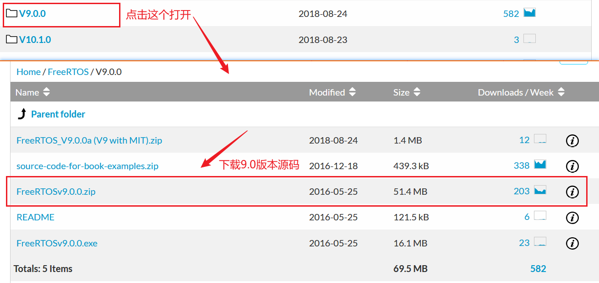

V10版本相比于V9就是加入了一些物联网相关的组件，内核基本不变。

## 2.文件结构

解压`FreeRTOSv9.0.0.zip`文件后的目录：

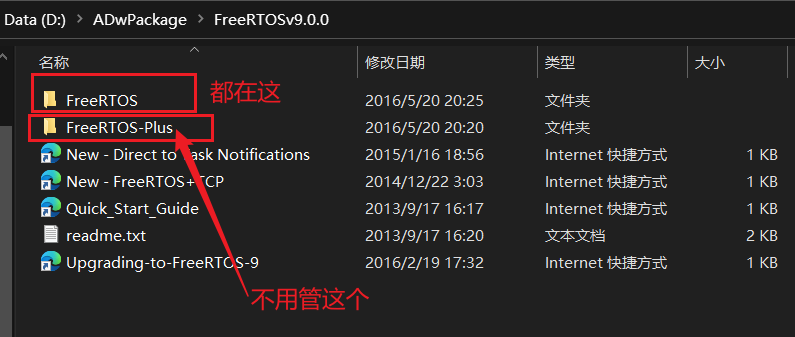

进入FreeRTOS目录，重点关注里面的Demo目录、Source目录：

- Demo目录：FreeRTOS 官方为各个单片机平台移植好的工程代码，一些评估板的完整的工程文件等，里面包含了不同开发平台、不同芯片的工程文件，可以参考这些文件来进行移植、开发。
- Source目录：里面存放着内核源代码，要移植的文件就在这里面。

Source目录：

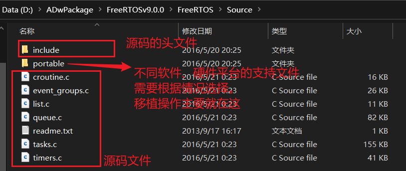

portable目录里，主要了解这几个文件夹：Keil、IAR、RVDS。

>其它参考资料：
>
>- Keil目录和RVDS目录：两个目录内的文件是一样的，都是Keil下用的，因此官方只将文件放在了RVDS目录里。RVDS 目录里包含了各种处理器相关的文件目录，根据目录名称可以指定是哪个内核（STM32的M0、M3、M4等内核）的支持文件，里面提供了 cortex-m0、m3、m4 和 m7 等内核的单片机的接口文件。**RVDS目录里的文件就是用来将FreeRTOS和MCU联系起来的接口文件。**
>- IAR目录，IAR下的cortex-m0、m3、m4 和 m7 等内核的单片机的接口文件。
>- MemMang目录： 存放的是跟内存管理相关的，总共有五个 heap 文件以及一个 readme 说明文件，这五个 heap 文件在移植的时候必须使用一个，因为 **FreeRTOS 在创建内核对象的时候使用的是动态分配内存**，而这些动态内存分配的函数则在这几个文件里面实现，不同的分配算法会导致不同的效率与结果。（初学，选用heap_4.c即可）
>
>> FreeRTOS 是一个软件，单片机是一个硬件，FreeRTOS 要想运行在一个单片机上面，它们就必须关联在一起，如何关联？还是得通过写代码来关联，这部分关联的文件叫接口文件，通常由汇编和 C 联合编写。这些接口文件都是跟硬件密切相关的，不同的硬件接口文件是不一样的，但都大同小异。**编写这些接口文件的过程我们就叫移植**，移植的过程通常由 FreeRTOS 和 mcu 原厂的人来负责，移植好的这些接口文件就放在 RVDS 这个文件夹的目录下。FreeRTOS 为我们提供了 cortex-m0、m3、m4 和 m7 等内核的单片机的接口文件，只要 是使用了这些内核的 mcu 都可以使用里面的接口文件。
>>
>> 这里使用FreeRTOS，准确来说是使用官方的移植，而不是移植FreeRTOS到xxxMCU。
>
>关于RVDS目录，以里面的ARM_CM3目录为例，里面只有“port.c”与“portmacro.h”两个文件：
>
>- port.c：里面的内容是由 FreeRTOS 官方的技术人员为 Cortex-M3 内核的处理器写的接口文件，里面核心的上下文切换代码是由汇编语言编写而成。
>- portmacro.h： 则是 port.c 文件对应的头文件，主要是一些数据类型和宏定义。


## 3.提取FreeRTOS的源码

>百度百科：软件工程中，程序往往被视为有生命的机体，将源代码从一种环境下放到另一种环境下运行也可以称为移植。

将FreeRTOS移植到STM32F103C8T6下运行，提取出需要的代码，需要提取的文件如下：

- 一：include目录里的和Source目录下的直接子文件、portable目录中MemMang目录里的文件（通常使用里面的`heap_4.c`）。
- 二：根据需要从portable的IAR、RVDS目录提取文件。
- 三：提取配置文件 —— FreeRTOSConfig.h文件，这时需要用到那个Demo里的文件了。

1、Keil下进行开发：选择portable目录中RVDS目录下的文件。

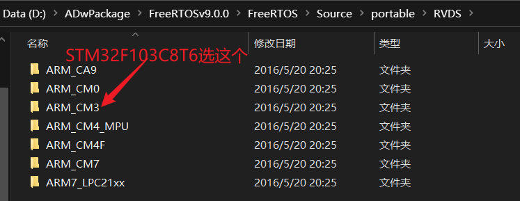

2、在IAR下进行开发：选择portable目录中的IAR目录下的文件。

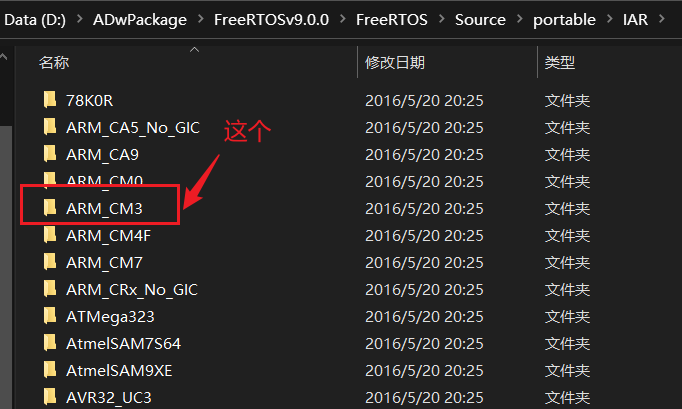

3、提取 FreeRTOSConfig.h文件：点进去后就能找到`FreeRTOSConfig.h`文件了，如下图

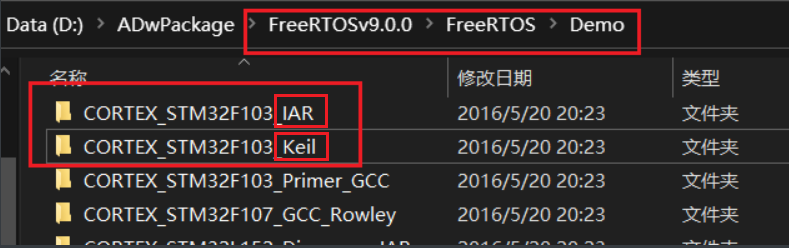

提取=====>：

移植完成 —— keil下：（我将源码放到了src文件夹里）


移植完成 —— IAR下：


基于STM32F103C8T6下的FreeRTOS源文件提取到这里就结束了。可以分别创建两个文件夹，一个用于存放在Keil下使用的（`FreeRTOS_Keil`），一个用于存放在IAR下使用的（`FreeRTOS_IAR`）。

## 3.提取STM32F1标准库

1、STM32F1固件库下载：[STM32标准外设软件库 - 意法半导体STMicroelectronics](https://www.st.com/zh/embedded-software/stm32-standard-peripheral-libraries.html)，下载3.5.0版本。

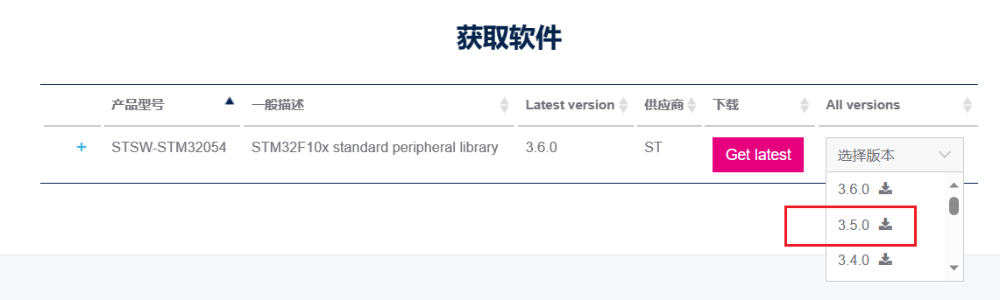

2、解压 —— `STM32F10x_StdPeriph_Lib_V3.5.0`，关注Libraries和Project就可以了：

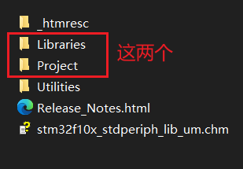

3、提取：

①先创建三个文件夹 —— `Start`、`StdLibrary`、`User`，用于存放提取出来的文件。

②提取外设库文件，即Libraries目录中STM32F10x_StdPeriph_Driver文件夹里inc和src文件夹里的所有文件，将它们都复制出来放到新建的`StdLibrary`里即可：

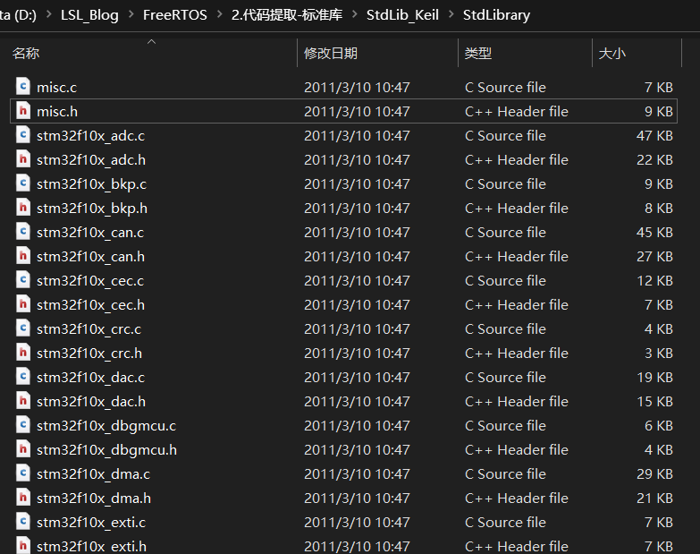

③提取核心支持文件，即Libraries目录中CMSIS目录里的一些文件，在CMSIS目录中这几个目录里：

- `Libraries\CMSIS\CM3\CoreSupport`：这里面的`core_cm3.c`和`core_cm3.h`，复制到Start目录。

- `Libraries\CMSIS\CM3\DeviceSupport\ST\STM32F10x\startup`：这里是启动文件，在Keil下就使用arm目录里的启动文件，在IAR开发的话就使用iar目录里的文件；STM32F103C8T6，选择里面的`startup_stm32f10x_md.s`，复制到Start目录。

  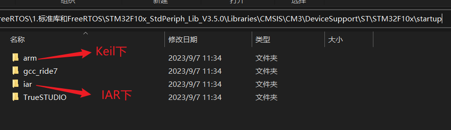

- `Libraries\CMSIS\CM3\DeviceSupport\ST\STM32F10x`：将这里的stm32f10x.h、system_stm32f10x.c、system_stm32f10x.h复制出来。

- 最终Start目录里的文件：

  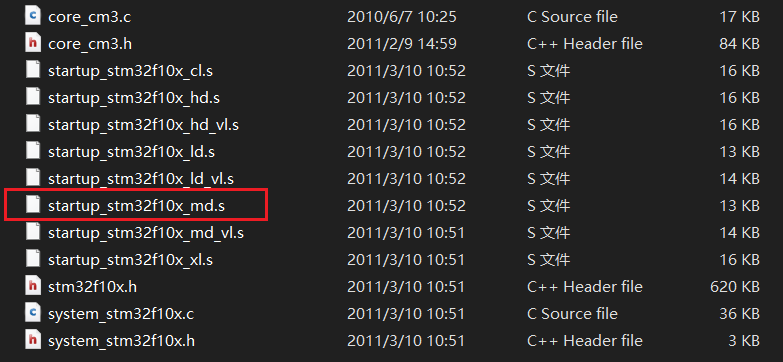

④User文件夹，复制`Project\STM32F10x_StdPeriph_Template`中以下文件进去：

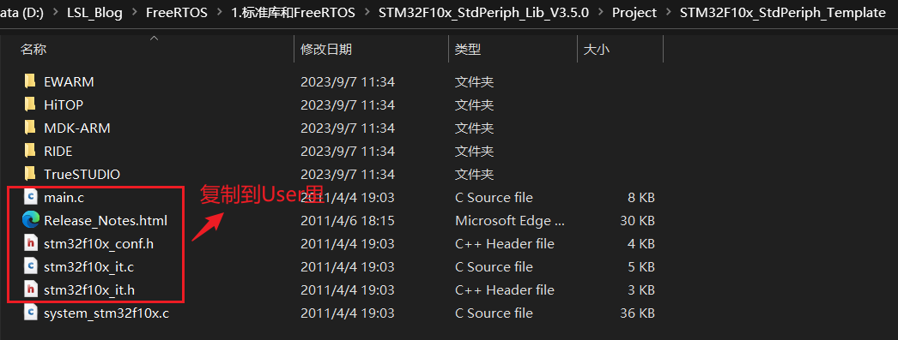

⑤如果在IAR下进行开发，除了第③步要使用iar目录里的启动文件外，还要`Project\STM32F10x_StdPeriph_Template\EWARM`中的以下文件：（创建一个Config目录来放置该文件）

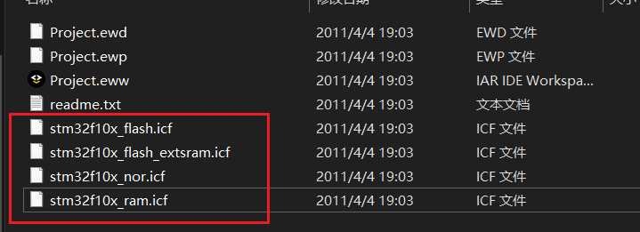

提取完毕。


## 4.Keil下移植

1、将提取后的基于Keil平台的FreeRTOS文件、标准库文件都放进一个`3.free-rtos_Keil`目录里，再在创建一个Hardware目录，用于放置自己创建的源代码文件，`3.free-rtos_Keil`目录内容如下：

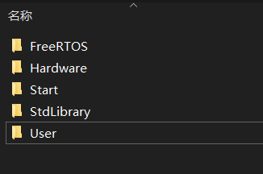

2、打开Keil，点击Project → New μVision Project来新建Keil工程，工程保存目录为，型号选择STM32F103C8，点击完成后弹出的界面直接改变即可。

3、项目里创建好组：

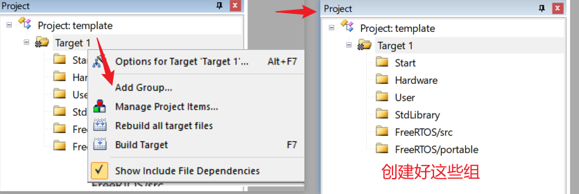

4、往组里添加好文件：

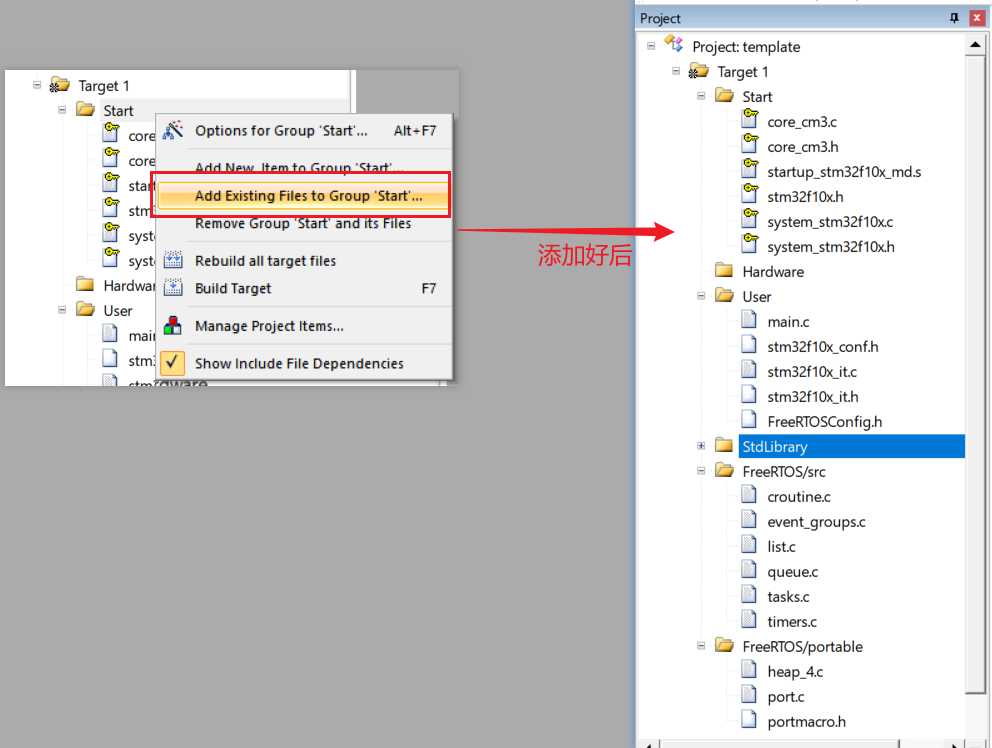

5、项目的C/C++编译设置：

> 点击`Project  ===>  Options for Target ...`，选中`C/C++`后找到`Include Paths`，然后点击`Include Paths`那行末尾的`...`按钮，然后在打开的页面中点击第一个`New`按钮后再点击出现的`...`按钮并选中工程目录下的Start目录，OKOK，添加完成。示意图如下：（点这个图标也是打开`Options for Target ...`）

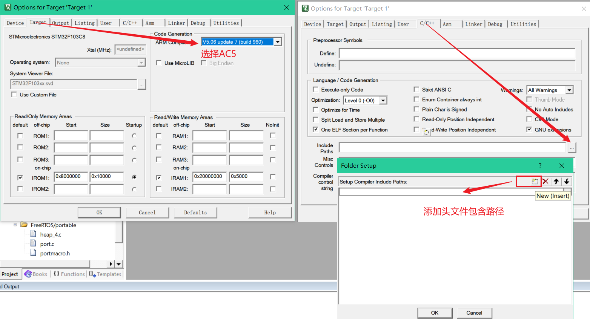

添加宏`USE_STDPERIPH_DRIVER`：

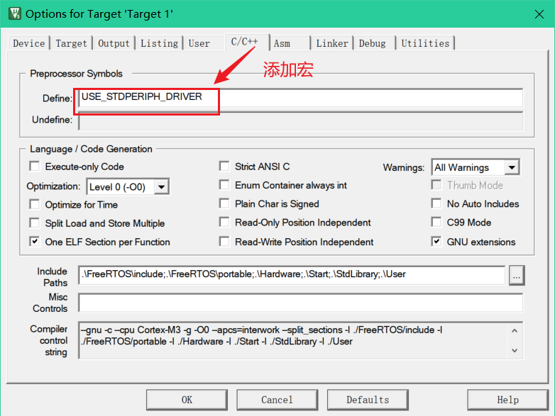

6、项目的Debug设置：

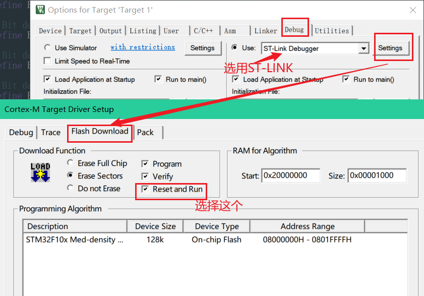

7、要修改一些文件：

①修改FreeRTOS配置文件：

```c
/* 修改`FreeRTOSConfig.h`，在末尾的`#endif`前添加以下内容： */
#define xPortPendSVHandler 	PendSV_Handler
#define vPortSVCHandler 	SVC_Handler
#define xPortSysTickHandler	SysTick_Handler
```

②修改User组里的`stm32f10x_it.c`文件，将下面的内容注释掉：

```c
/* 在stm32f10x_it.c文件中找到以下三个函数并注释掉 */
void SVC_Handler(void)
{
}
void PendSV_Handler(void)
{
}
void SysTick_Handler(void)
{
}
```

8、打开main.c，删除里面的所有代码，更改为以下代码用于测试：

```c
#include "stm32f10x.h"                  // Device header

#include "FreeRTOS.h"
#include "task.h"
#include "portmacro.h"
/* 初始化GPIO口 */
static void led_init(void)
{
	RCC_APB2PeriphClockCmd(RCC_APB2Periph_GPIOC, ENABLE);
	
	GPIO_InitTypeDef GPIO_InitStructure;
	GPIO_InitStructure.GPIO_Mode = GPIO_Mode_Out_PP;
	GPIO_InitStructure.GPIO_Pin = GPIO_Pin_13;
	GPIO_InitStructure.GPIO_Speed =  GPIO_Speed_50MHz;
	GPIO_Init(GPIOC, &GPIO_InitStructure);
}
/* 定义一个任务句柄 */
static TaskHandle_t led_task_handle = NULL;
/* 声明一个任务 */
static void led_task(void* arg);

int main(void) 
{
	led_init();
    /* 创建任务 */
	xTaskCreate(led_task, "led_task", 512, NULL, 2, &led_task_handle);
    /* 启动FreeRTOS的调度器 */
	vTaskStartScheduler();
	while(1);
}
/* 任务的实现 */
static void led_task(void* arg)
{
    while(1){
		GPIO_SetBits(GPIOC, GPIO_Pin_13);
		vTaskDelay(500); // 相对延时
		GPIO_ResetBits(GPIOC, GPIO_Pin_13);
		vTaskDelay(500);
    }
}
```

9、编译，烧录进STM32F103C8T6核心板：

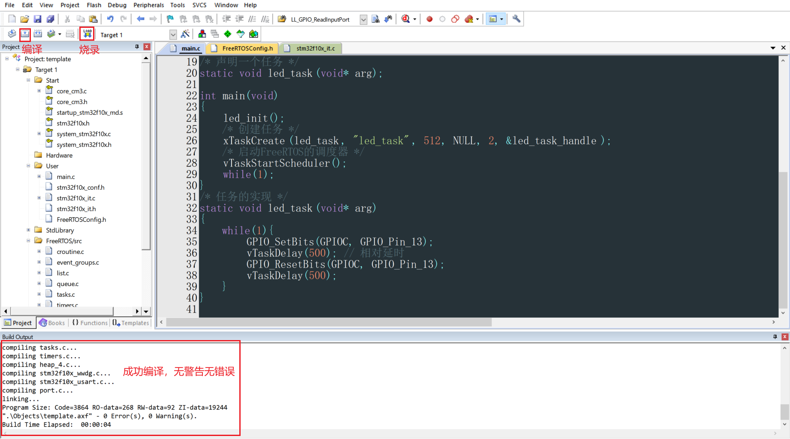

10、最终现象：那个绿色的灯一闪一闪地亮，亮—灭—亮—灭

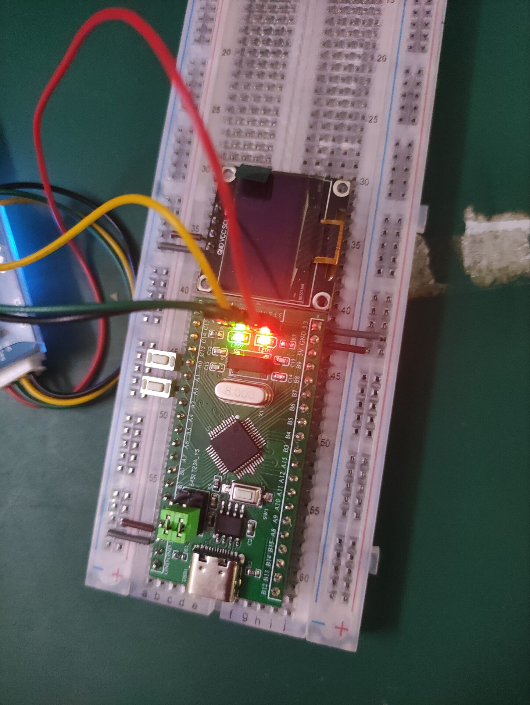


## 5.IAR下移植

懒得整理了，不常用这个。

整理了一下笔记分享出来，希望可以帮助到首次接触FreeRTOS的小伙伴。

# FreeRTOS学习篇二：任务创建与流程

## 1.了解一些基本概念

1、任务：可以将任务看作是一个线程，多个任务就是多个线程，任务之间都是互相独立的，FreeRTOS 中，任务是竞争系统资源的最小运行单位。（在FreeRTOS中，线程（Thread）和任务（Task）的概念是相同的（有的系统叫任务，有的叫线程）。每个任务就是一个线程，有着自己的一个程序执行路径）

2、任务控制块：本质就是一个结构体，这个结构体用于存储着任务的一些信息，比如任务的栈指针、任务名称、任务的形参等。系统对任务的全部操作都可以通过这个任务控制块（结构体）来实现。

3、任务句柄：本质就是一个指向任务控制块的指针，通过指针来对任务控制块进行访问，通常句柄为`void*`型指针。

4、内核对象句柄：信号量、消息队列、事件标志组、软件定时器等都属于内核的对象，实际就是在内核代码中定义好的一些全局数据结构，调用FreeRTOS提供的函数去创建这些东西，创建完成后会返回一个指向这些东西的指针 —— 即内核对象句柄。

## 2.创建任务的两种方式

### 任务创建方式

1、单任务系统：

- 51、32位等单片机裸机中，如果未使用系统，那都是在main函数中通过`while(1)`死循环来不断依次执行各个处理程序的，对于一些突发处理事件有时会通过中断来完成。这种宏观上串行执行任务中程序的系统，称之为单任务系统，也称为前后台系统（死循环内的程序作为后台程序，而中断服务函数则作为前台程序）。

- 缺点：前后台系统各个任务（应用程序）都是得排队来轮流执行的，因此系统的实时性差，不适合于大一点的嵌入式应用。

  > 实时性：如果有一个任务需要执行，CPU就能马上（在较短时间内）执行该任务，不会有较长的延时，这就是实时性。
  > 实时性可以保证各个任务的及时执行。

- 优点：简单，资源消耗少。

2、多任务系统：宏观上，可以看成是并行地“同时”执行多个任务的系统。（调度器会不断地启动、停止每一个任务，宏观看上去所有的任务都是在同时执行）

3、FreeRTOS中任务的创建，有两种方式：

- 静态创建：任务控制块和任务堆栈都事先定义好，即定义好全局变量（全局的都有静态存储期），任务删除时所占内存不会被释放，实际中使用较少。

  > （线程占用的内存不可释放）

- 动态创建：动态创建任务控制块和任务堆栈（由FreeRTOS动态分配），任务删除时占用的内存可释放，实际应用中使用最多。

  > （线程占用的内存可释放）

### 动态创建

介绍几个函数：

```c
/* 用于创建任务 */
BaseType_t xTaskCreate(	TaskFunction_t pxTaskCode,
							const char* const pcName,
							const uint16_t usStackDepth,
							void * const pvParameters,
							UBaseType_t uxPriority,
							TaskHandle_t * const pxCreatedTask);
xTaskCreate(函数入口-即函数名, 函数名称, 任务栈大小, 任务入口函数参数, 优先级, 任务句柄);
/* 用于删除任务：传入任务的句柄，将任务删除 */
void vTaskDelete( TaskHandle_t xTaskToDelete );
/* 进入临界区：调用其进入临界区，taskENTER_CRITICAL()是一个宏 */
taskENTER_CRITICAL()
/* 退出临界区：调用其退出临界区，taskEXIT_CRITICAL()是一个宏 */
taskEXIT_CRITICAL()
/* 启动调度器：调用即可启动调度器 */
void vTaskStartScheduler( void );
```

以点亮一个LED灯为例，展示动态创建操作的流程，动态创建是最常用的，示例代码都写在main.c里。

①首先就是开启动态支持，在`FreeRTOSConfig.h`配置文件中添加以下：

```c
#define configSUPPORT_DYNAMIC_ALLOCATION 1
```

②定义任务与任务句柄：

```c
/* 定义任务与任务句柄：TaskHandle_t就是`void*` */
static TaskHandle_t AppTaskCreate_Handle = NULL;
static TaskHandle_t LEDTask_Handle = NULL;
static void AppTaskCreate(void* pvParameters);
static void LEDTask(void* pvParameters);

static void AppTaskCreate(void* pvParameters)
{
    taskENTER_CRITICAL(); /* 进入临界区 */
    BaseType_t xReturn = pdPASS;
    xReturn = xTaskCreate(LEDTask,"LEDTask",512,NULL,3,LEDTask_Handle);
    if(xReturn == pdPASS)
        vTaskDelete(AppTaskCreate_Handle); /* 创建任务完成，任务App就已经结束使命了，删除以释放内存 */
    taskEXIT_CRITICAL();  /* 退出临界区 */
}
static void LEDTask(void* pvParameters)
{
    while(1){
        GPIO_SetBits(GPIOC, GPIO_Pin_13);
        vTaskDelay(1500);
        GPIO_ResetBits(GPIOC, GPIO_Pin_13);
		vTaskDelay(1500);
    }
}
```

③任务创建与FreeRTOS的启动：

```c
/* GPIO初始化 */
static void LED_Init(void)
{
    RCC_APB2PeriphClockCmd(RCC_APB2Periph_GPIOC, ENABLE);
	GPIO_InitTypeDef GPIO_InitStructure;
	GPIO_InitStructure.GPIO_Mode = GPIO_Mode_Out_PP;
	GPIO_InitStructure.GPIO_Pin = GPIO_Pin_13;
	GPIO_InitStructure.GPIO_Speed =  GPIO_Speed_50MHz;
	GPIO_Init(GPIOC, &GPIO_InitStructure);
}

int main(void){
    LED_Init();
    BaseType_t xReturn = pdPASS;
    xReturn = xTaskCreate(AppTaskCreate, "AppTaskCreate",512,NULL,2,AppTaskCreate_Handle);
    if(xReturn == pdPASS)
        vTaskStartScheduler();
    else
        return -1;
    while(1);
}
```

main.c全貌：

```c
#include "stm32f10x.h"                  // Device header
#include "FreeRTOS.h"
#include "task.h"

/* GPIO初始化 */
static void LED_Init(void)
{
    RCC_APB2PeriphClockCmd(RCC_APB2Periph_GPIOC, ENABLE);
	GPIO_InitTypeDef GPIO_InitStructure;
	GPIO_InitStructure.GPIO_Mode = GPIO_Mode_Out_PP;
	GPIO_InitStructure.GPIO_Pin = GPIO_Pin_13;
	GPIO_InitStructure.GPIO_Speed =  GPIO_Speed_50MHz;
	GPIO_Init(GPIOC, &GPIO_InitStructure);
}

/* 定义任务与任务句柄：TaskHandle_t就是`void*` */
static TaskHandle_t AppTaskCreate_Handle = NULL;
static TaskHandle_t LEDTask_Handle = NULL;
static void AppTaskCreate(void* pvParameters);
static void LEDTask(void* pvParameters);

int main(void){
    LED_Init();
    BaseType_t xReturn = pdPASS;
    xReturn = xTaskCreate(AppTaskCreate, "AppTaskCreate",512,NULL,2,AppTaskCreate_Handle);
    if(xReturn == pdPASS)
        vTaskStartScheduler();
    else
        return -1;
    while(1);
}
static void AppTaskCreate(void* pvParameters)
{
    taskENTER_CRITICAL(); /* 进入临界区 */
    BaseType_t xReturn = pdPASS;
    xReturn = xTaskCreate(LEDTask,"LEDTask",512,NULL,3,LEDTask_Handle);
    if(xReturn == pdPASS)
        vTaskDelete(AppTaskCreate_Handle); /* 创建任务完成，任务App就已经结束使命了，删除以释放内存 */
    taskEXIT_CRITICAL();  /* 退出临界区 */
}
static void LEDTask(void* pvParameters)
{
    while(1){
        GPIO_SetBits(GPIOC, GPIO_Pin_13);
        vTaskDelay(2000);
        GPIO_ResetBits(GPIOC, GPIO_Pin_13);
		vTaskDelay(2000);
    }
}
```

通常并不需要操作任务本身，上面可以简化为以下流程：

```c
#include "stm32f10x.h"                  // Device header
#include "FreeRTOS.h"
#include "task.h"

/* GPIO初始化 */
static void LED_Init(void)
{
    RCC_APB2PeriphClockCmd(RCC_APB2Periph_GPIOC, ENABLE);
	GPIO_InitTypeDef GPIO_InitStructure;
	GPIO_InitStructure.GPIO_Mode = GPIO_Mode_Out_PP;
	GPIO_InitStructure.GPIO_Pin = GPIO_Pin_13;
	GPIO_InitStructure.GPIO_Speed =  GPIO_Speed_50MHz;
	GPIO_Init(GPIOC, &GPIO_InitStructure);
}

/* 定义任务：TaskHandle_t就是`void*` */
static void LEDTask(void* pvParameters);

int main(void){
    LED_Init();
    BaseType_t xReturn = pdPASS;
    taskENTER_CRITICAL();  /* 进入临界区 */
    xReturn = xTaskCreate(LEDTask, "LEDTask",512,NULL,2,NULL); /* 创建任务 */
    taskEXIT_CRITICAL();   /* 退出临界区 */
    if(xReturn == pdPASS)
        vTaskStartScheduler(); /* 启动调度器 */
    else
        return -1;
    while(1);
}

static void LEDTask(void* pvParameters)
{
    while(1){
        GPIO_SetBits(GPIOC, GPIO_Pin_13);
        vTaskDelay(500);
        GPIO_ResetBits(GPIOC, GPIO_Pin_13);
		vTaskDelay(500);
    }
}
```

### 启动与执行流程

上面动态创建任务中，展示的就是两种流程：

- 第一种流程是在一个任务中去创建其它的任务，就像是任务嵌套任务一样，当这个用于创建其它任务的任务创建完成后，就启动调度器使其运行去创建其它任务。
- 而另一种流程是创建完所有的任务，然后再启动调度器调度执行。

这两种流程看自己习惯哪种，选用一种流程使用即可。

这些任务是如何执行的呢？

如果使用的是第二种流程，那么任务创建完成后并不会立刻执行，而是调度器开启后才开始调度执行，执行时优先级高的优先执行，如果是相同优先级的任务，那就是时间片轮转调度执行，任务执行过程中必须出现释放CPU执行权的状态，否则将会把CPU给霸占了。

如果使用的是第一种流程，那么当调度器启动就开始执行任务了，执行时从AppTaskCreate任务开始执行，执行过程中：

- 使用临界区的情况下：当退出临界区，才开始调度执行那些由AppTaskCreate任务创建的任务，执行时也是高优先级的优先执行，同优先级的时间片轮转调度执行。
- 不使用临界区的情况下：
  - ①：如果AppTaskCreate任务执行时创建的任务优先级比其高，那么创建的任务就会立刻执行。
  - ②：如果AppTaskCreate任务执行时创建的任务优先级比其低，那AppTaskCreate继续向下执行。
  - ③：如果AppTaskCreate任务执行时创建的任务优先级等于其本身的，那AppTaskCreate任务与这个同优先级的任务将按时间片轮转调度的方式执行。


### 静态创建

以点亮一个LED灯为例，展示静态创建操作的流程，了解一下即可。

1、配置：静态创建，需要在`FreeRTOSConfig.h`配置文件中设置相关宏。

```c
/* 在`FreeRTOSConfig.h`配置文件添加以下内容： */
#define configSUPPORT_STATIC_ALLOCATION 1 /* 设置为1，即开启静态支持 */
#define configTIMER_TASK_STACK_DEPTH (configMINIMAL_STACK_SIZE*2) /* 设置定时器服务任务的任务堆栈大小 */
```

2、创建任务，具体步骤：

①引入`#include "FreeRTOS.h"`和`#include "task.h"`。

②空闲任务与定时器任务堆栈函数的实现：

```c
/* 空闲任务与定时器任务：先定义好堆栈和控制块，再实现函数 */
static StackType_t Idle_Task_Stack[configMINIMAL_STACK_SIZE];      /* 空闲任务任务堆栈 */  
static StackType_t Timer_Task_Stack[configTIMER_TASK_STACK_DEPTH]; /* 定时器任务堆栈 */ 
static StaticTask_t Idle_Task_TCB;   /* 空闲任务控制块 */
static StaticTask_t Timer_Task_TCB;  /* 定时器任务控制块 */
/* 函数声明 */
void vApplicationGetIdleTaskMemory(StaticTask_t **ppxIdleTaskTCBBuffer, 
StackType_t **ppxIdleTaskStackBuffer, uint32_t *pulIdleTaskStackSize);
void vApplicationGetTimerTaskMemory(StaticTask_t **ppxTimerTaskTCBBuffer, 
StackType_t **ppxTimerTaskStackBuffer, uint32_t *pulTimerTaskStackSize) ;
/* 函数实现 */
void vApplicationGetIdleTaskMemory(StaticTask_t **ppxIdleTaskTCBBuffer, 
StackType_t **ppxIdleTaskStackBuffer, uint32_t *pulIdleTaskStackSize) 
{ 
    *ppxIdleTaskTCBBuffer = &Idle_Task_TCB;           /* 任务控制块内存 */ 
    *ppxIdleTaskStackBuffer = Idle_Task_Stack;        /* 任务堆栈内存 */ 
    *pulIdleTaskStackSize = configMINIMAL_STACK_SIZE; /* 任务堆栈大小 */ 
}
void vApplicationGetTimerTaskMemory(StaticTask_t **ppxTimerTaskTCBBuffer, 
StackType_t **ppxTimerTaskStackBuffer, uint32_t *pulTimerTaskStackSize) 
{ 
    *ppxTimerTaskTCBBuffer=&Timer_Task_TCB;              /* 任务控制块内存 */ 
    *ppxTimerTaskStackBuffer=Timer_Task_Stack;           /* 任务堆栈内存 */ 
    *pulTimerTaskStackSize=configTIMER_TASK_STACK_DEPTH; /* 任务堆栈大小 */ 
}
```

③定义任务：

```c
/* 定义任务：句柄、堆栈、控制块、任务 */
static TaskHandle_t AppTaskCreate_Handle; /* 任务句柄 */
static TaskHandle_t LED_Task_Handle;

static StackType_t AppTaskCreate_Stack[128]; /* 任务堆栈 */
static StackType_t LED_Task_Stack[128];     

static StaticTask_t AppTaskCreate_TCB;  /* 任务控制块 */
static StaticTask_t LED_Task_TCB;      

static void LED_Task(void* parameter);  /* 任务声明*/
static void AppTaskCreate(void);

/* 任务函数实现： */
static void LED_Task(void* parameter)
{
    while(1){
         GPIO_SetBits(GPIOC, GPIO_Pin_13);
         vTaskDelay(500);
		GPIO_ResetBits(GPIOC, GPIO_Pin_13);
		vTaskDelay(500);
    }
}
/* 任务函数实现，该任务函数用于创建任务 */
static void AppTaskCreate(void)
{
    taskENTER_CRITICAL(); /* 进入临界区 */
    /* 创建 LED_Task 任务 */
    LED_Task_Handle = xTaskCreateStatic((TaskFunction_t)LED_Task, /*任务函数*/
    (const char*)"LED_Task",  /* 指定要创建的任务的名称，即任务函数名*/
    (uint32_t)128,            /* 任务堆栈大小*/
    (void* )NULL,             /* 传递给任务函数的参数*/
    (UBaseType_t)4,           /* 任务优先级设置*/
    (StackType_t*)LED_Task_Stack,  /* 任务堆栈*/
    (StaticTask_t*)&LED_Task_TCB); /* 任务控制块*/
    if (NULL != LED_Task_Handle)   /* 创建成功 */
        /* 创建完成 */;
    vTaskDelete(AppTaskCreate_Handle); /*删除 AppTaskCreate 任务*/
    taskEXIT_CRITICAL(); /*退出临界区*/
}
```

④任务创建与FreeRTOS的启动：

```c
/* GPIO初始化 */
static void LED_Init(void)
{
    RCC_APB2PeriphClockCmd(RCC_APB2Periph_GPIOC, ENABLE);
	GPIO_InitTypeDef GPIO_InitStructure;
	GPIO_InitStructure.GPIO_Mode = GPIO_Mode_Out_PP;
	GPIO_InitStructure.GPIO_Pin = GPIO_Pin_13;
	GPIO_InitStructure.GPIO_Speed =  GPIO_Speed_50MHz;
	GPIO_Init(GPIOC, &GPIO_InitStructure);
}
int main(void) 
{
    NVIC_PriorityGroupConfig(NVIC_PriorityGroup_4);
    LED_Init();
	/* 静态创建任务 start */
    AppTaskCreate_Handle= xTaskCreateStatic((TaskFunction_t)AppTaskCreate,
    (const char*)"AppTaskCreate",(uint32_t)128,(void*)NULL,(UBaseType_t)3,
    (StackType_t*)AppTaskCreate_Stack,
    (StaticTask_t*)&AppTaskCreate_TCB);
    /* 静态创建任务 end */
    /* 启动FreeRTOS，即开启任务调度 */
    if (NULL != AppTaskCreate_Handle)
    vTaskStartScheduler();
	while(1);
}
```

3、总结：

1. 修改配置。
2. 引入`#include "FreeRTOS.h"`和`#include "task.h"`。
3. 空闲任务与定时器任务堆栈函数的实现。
   - 静态任务中需要实现`vApplicationGetIdleTaskMemory()`与 `vApplicationGetTimerTaskMemory()`，这两个函数是用户设定的空闲（Idle）任务与定时器（Timer）任务的堆栈大小，必须由用户自己分配，而不能是动态分配。
   - 先定义好空闲、定时器任务栈和空闲、定时器任务控制块，再实现函数这两个函数。
4. 定义任务：句柄、堆栈、控制块、任务。
5. 静态创建任务与启动。
6. 静态创建方式需要自己去定义一大堆的东西。

代码全貌，main.c：（实现效果，PC13口的LED闪烁）

```c
#include "stm32f10x.h"                  // Device header
#include "FreeRTOS.h"
#include "task.h"

/* GPIO初始化 */
static void LED_Init(void)
{
    RCC_APB2PeriphClockCmd(RCC_APB2Periph_GPIOC, ENABLE);
	GPIO_InitTypeDef GPIO_InitStructure;
	GPIO_InitStructure.GPIO_Mode = GPIO_Mode_Out_PP;
	GPIO_InitStructure.GPIO_Pin = GPIO_Pin_13;
	GPIO_InitStructure.GPIO_Speed =  GPIO_Speed_50MHz;
	GPIO_Init(GPIOC, &GPIO_InitStructure);
}

/* 空闲任务与定时器任务：先定义好堆栈和控制块，再实现函数 */
static StackType_t Idle_Task_Stack[configMINIMAL_STACK_SIZE];      /* 空闲任务任务堆栈 */  
static StackType_t Timer_Task_Stack[configTIMER_TASK_STACK_DEPTH]; /* 定时器任务堆栈 */ 
static StaticTask_t Idle_Task_TCB;   /* 空闲任务控制块 */
static StaticTask_t Timer_Task_TCB;  /* 定时器任务控制块 */

/* 定义任务：句柄、堆栈、控制块、任务 */
static TaskHandle_t AppTaskCreate_Handle; /* 任务句柄 */
static TaskHandle_t LED_Task_Handle;

static StackType_t AppTaskCreate_Stack[128]; /* 任务堆栈 */
static StackType_t LED_Task_Stack[128];     

static StaticTask_t AppTaskCreate_TCB;  /* 任务控制块 */
static StaticTask_t LED_Task_TCB;      

static void LED_Task(void* parameter);  /* 任务声明*/
static void AppTaskCreate(void);

/* 函数声明 */
void vApplicationGetIdleTaskMemory(StaticTask_t **ppxIdleTaskTCBBuffer, 
StackType_t **ppxIdleTaskStackBuffer, uint32_t *pulIdleTaskStackSize);
void vApplicationGetTimerTaskMemory(StaticTask_t **ppxTimerTaskTCBBuffer, 
StackType_t **ppxTimerTaskStackBuffer, uint32_t *pulTimerTaskStackSize) ;

int main(void) 
{
    NVIC_PriorityGroupConfig(NVIC_PriorityGroup_4);
    LED_Init();
	/* 静态创建任务 start */
    AppTaskCreate_Handle= xTaskCreateStatic((TaskFunction_t)AppTaskCreate,
    (const char*)"AppTaskCreate",(uint32_t)128,(void*)NULL,(UBaseType_t)3,
    (StackType_t*)AppTaskCreate_Stack,
    (StaticTask_t*)&AppTaskCreate_TCB);
    /* 静态创建任务 end */
    /* 启动FreeRTOS，即开启任务调度 */
    if (NULL != AppTaskCreate_Handle)
    vTaskStartScheduler();
	while(1);
}

/* 任务函数实现： */
static void LED_Task(void* parameter)
{
    while(1){
         GPIO_SetBits(GPIOC, GPIO_Pin_13);
         vTaskDelay(500);
		GPIO_ResetBits(GPIOC, GPIO_Pin_13);
		vTaskDelay(500);
    }
}
/* 任务函数实现，该任务函数用于创建任务 */
static void AppTaskCreate(void)
{
    taskENTER_CRITICAL(); /* 进入临界区 */
    /* 创建 LED_Task 任务 */
    LED_Task_Handle = xTaskCreateStatic((TaskFunction_t)LED_Task, /*任务函数*/
    (const char*)"LED_Task",  /* 指定要创建的任务的名称，即任务函数名*/
    (uint32_t)128,            /* 任务堆栈大小*/
    (void* )NULL,             /* 传递给任务函数的参数*/
    (UBaseType_t)4,           /* 任务优先级设置*/
    (StackType_t*)LED_Task_Stack,  /* 任务堆栈*/
    (StaticTask_t*)&LED_Task_TCB); /* 任务控制块*/
    if (NULL != LED_Task_Handle)   /* 创建成功 */
        /* 创建完成 */;
    vTaskDelete(AppTaskCreate_Handle); /*删除 AppTaskCreate 任务*/
    taskEXIT_CRITICAL(); /*退出临界区*/
}

/* 函数实现 */
void vApplicationGetIdleTaskMemory(StaticTask_t **ppxIdleTaskTCBBuffer, 
StackType_t **ppxIdleTaskStackBuffer, uint32_t *pulIdleTaskStackSize) 
{ 
    *ppxIdleTaskTCBBuffer = &Idle_Task_TCB;           /* 任务控制块内存 */ 
    *ppxIdleTaskStackBuffer = Idle_Task_Stack;        /* 任务堆栈内存 */ 
    *pulIdleTaskStackSize = configMINIMAL_STACK_SIZE; /* 任务堆栈大小 */ 
}
void vApplicationGetTimerTaskMemory(StaticTask_t **ppxTimerTaskTCBBuffer, 
StackType_t **ppxTimerTaskStackBuffer, uint32_t *pulTimerTaskStackSize) 
{ 
    *ppxTimerTaskTCBBuffer=&Timer_Task_TCB;              /* 任务控制块内存 */ 
    *ppxTimerTaskStackBuffer=Timer_Task_Stack;           /* 任务堆栈内存 */ 
    *pulTimerTaskStackSize=configTIMER_TASK_STACK_DEPTH; /* 任务堆栈大小 */ 
}
```

# FreeRTOS学习篇三：任务管理

FreeRTOS任务管理的基本知识与常用函数。

## 1.理解基本概念

FreeRTOS中的任务：任务是独立的一条程序执行路径，被调度器控制着何时运行，任务的具体形式是一个函数。

任务的状态 —— FreeRTOS中的任务有以下状态：

- 就绪态：调用FreeRTOS的函数将任务创建完成后，任务处于就绪态，表示可以被执行了，等待CPU执行权。
- 运行态：调度器将CPU执行权分配到一个处于就绪态的任务，该任务就会进入运行态，即开始执行。
- 阻塞态：任务等待某个时序或外部中断时处于阻塞态，处于阻塞态时执行权释放，调度器调度，CPU执行权就会被分配到其它任务。
- 挂起态：调用 vTaskSuspend()后可将指定任务挂起，处于挂起态的任务不参与CPU执行权的分配，可以看作是一个已经死亡的任务，不过等调用vTaskResume() 或 vTaskResumeFromISR()函数后，任务复活，将处于就绪态等待CPU执行权的到来。

任务的状态切换：

- 当任务创建完成，就处于就绪态，此时等待CPU执行权的到来。
- 当CPU执行权到来，处于就绪态的任务就进入了运行态。
- 运行态的任务，进行了挂起、延时或读信号量等待等操作的任务，就进入了阻塞态，这些操作结束后任务将会重新进入就绪态。
- 只要调用了vTaskSuspend()，指定的任务无论处于就绪态或者运行态，还是阻塞态，都将进入挂起态。

任务调度器：可以简单地看作是用来调度CPU执行权的，调度执行权给哪个任务，哪个任务才可以被CPU执行。

任务调度机制：通常都是基于优先级的抢占式调度和时间片轮询调度两种，任务优先级高的将优先执行，优先级相同的任务将时间片轮询调度执行。

## 2.常用任务管理函数

常用的就这几个：任务挂起、任务恢复、任务删除、任务延时。

1、任务挂起：将任务切换至挂起态

```c
/* 传入任务句柄，将指定任务挂起 */
void vTaskSuspend(TaskHandle_t xTaskToSuspend);
/* 挂起了所有任务，实际操作是关掉调度器的支持 */
void vTaskSuspendAll( void )
{
	/* A critical section is not required as the variable is of type
	BaseType_t.  Please read Richard Barry's reply in the following link to a
	post in the FreeRTOS support forum before reporting this as a bug! -
	http://goo.gl/wu4acr */
	++uxSchedulerSuspended;
}
```

如果想要使用任务挂起函数则必须将宏定义`INCLUDE_vTaskSuspend` 配置为 1。

2、任务恢复：将任务从挂起态恢复到就绪态

①vTaskResume()：

```c
/* 传入任务句柄，将指定的挂起了的任务恢复为就绪态 */
void vTaskResume(TaskHandle_t xTaskToResume);
```

如果想要使用任务挂起恢复函数 vTaskResume()则必须将宏定义`INCLUDE_vTaskSuspend` 配置为 1。（默认配置中已开启）

②xTaskResumeFromISR()，用于在中断函数中调用的任务恢复函数：

```c
/* 在中断服务程序中使用的，传入任务句柄，用于恢复指定的被挂起的任务 */
BaseType_t xTaskResumeFromISR(TaskHandle_t xTaskToResume);
```

要想使用该函数必须在 FreeRTOSConfig.h 中把`INCLUDE_vTaskSuspend `和 `INCLUDE_vTaskResumeFromISR` 都定义为 1 才有效。

注意事项：

- 该函数的返回值为 pdTRUE 时：表示恢复运行的任务的优先级等于或高于正在运行的任务，表明在中断服务函数退出后必须进行一次上下文切换，使用portYIELD_FROM_ISR()进行上下文切换。
- 当函数返回值为 pdFALSE 时：表示恢复运行的任务的优先级低于当前正在运行的任务，表明在中断服务函数退出后不需要进行上下文切换。
- xTaskResumeFromISR() 通常被认为是一个危险的函数，因为它的调用并非是固定的，中断可能随时来来临。所以， xTaskResumeFromISR()不能用于任务和中断间的同步，如果中断恰巧在任务被挂起之前到达，这就会导致一次中断丢失（任务还没有挂起，调用 xTaskResumeFromISR()函数是没有意义的，只能等下一次中断）。这种情况下，可以使用信号量或者任务通知来同步就可以避免这种情况。  

```c
/* 使用示例： */
void vAnExampleISR( void ){
    BaseType_t xYieldRequired;
    /* 恢复被挂起的任务 */
    xYieldRequired = xTaskResumeFromISR( xHandle );
    if ( xYieldRequired == pdTRUE ) {
    /* 执行上下文切换， ISR 返回的时候将运行另外一个任务 */
    portYIELD_FROM_ISR();
    }
}
```

③xTaskResumeAll()：

```c
/* 恢复所有被挂起的任务 */
BaseType_t xTaskResumeAll(void);
```

xTaskResumeAll()函数用于恢复调度器，与vTaskSuspendAll()相对。

如果想要使用任务挂起恢复函数 vTaskResume()则必须将宏定义`INCLUDE_vTaskSuspend` 配置为 1。（默认配置中已开启）

注意：调用了多少次vTaskSuspendAll()函数就必须同样调用多少次 xTaskResumeAll()函数。

3、任务删除：将任务删除掉，释放该任务所占用的内存空间

```c
/* 传入任务句柄，用于删除指定任务 */
void vTaskDelete(TaskHandle_t xTaskToDelete);
```

要想使用该函数必须在FreeRTOSConfig.h 中把 `INCLUDE_vTaskDelete` 定义为 1。

vTaskDelete()函数用于删除一个任务，当一个任务删除另外一个任务时，形参为要删除任务创建时返回的任务句柄，如果是删除自身， 则形参为 NULL（可在任务中调用该函数来删除任务自身）。删除的任务将从所有就绪、阻塞、挂起和事件列表中删除。

```c
/* 使用示例： */
TaskHandle_t DeleteHandle;
if (xTaskCreate(DeleteTask,"DeleteTask",
	STACK_SIZE, NULL, PRIORITY, &DeleteHandle) != pdPASS ){
    /* 创建任务失败，因为没有足够的堆内存可分配。 */
}
void DeleteTask( void ){
	/* 用户代码 xxxxx */
	/* ............ */
	/* 删除任务本身 */
	vTaskDelete(NULL);
}
/* 在其他任务删除 DeleteTask 任务，直接调用即可 */
vTaskDelete( DeleteHandle );
```

4、任务延时：将任务从运行态切换至阻塞态

①vTaskDelay()：

```c
/* 阻塞延时函数，是相对延时 */
void vTaskDelay(const TickType_t xTicksToDelay);
```

要想使用 FreeRTOS 中的 vTaskDelay() 函数必须在 FreeRTOSConfig.h 中把 `INCLUDE_vTaskDelay` 定义为 1 来使能。

>相对延时函数vTaskDelay()用于阻塞延时，调用该函数后，任务将进入阻塞状态，进入阻塞态的任务将让出 CPU 资源。延时的时长由形参 xTicksToDelay 决定，单位为系统节拍周期， 比如系统的时钟节拍周期为 1ms，那么调用vTaskDelay(1)的延时时间则为1ms。
>
>vTaskDelay()延时是相对性的延时，它指定的延时时间是从调用 vTaskDelay()结束后开始计算的，经过指定的时间后延时结束。比如 vTaskDelay(100)， 从调用 vTaskDelay()结束后，任务进入阻塞状态，经过 100 个系统时钟节拍周期后，任务解除阻塞。因此，vTaskDelay()并不适用于周期性执行任务的场合。此外，其它任务和中断活动， 也会影响到 vTaskDelay()的调用（比如调用前高优先级任务抢占了当前任务），进而影响到任务的下一次执行的时间。

使用：直接在任务中调用即可。

②vTaskDelayUntil()：

```c
/* 阻塞延时函数，是绝对延时 */
void vTaskDelayUntil( TickType_t * const pxPreviousWakeTime, const TickType_t xTimeIncrement );
```

应用场景：常用于较精确的周期性运行的任务，比如一个需要以固定频率定期执行的任务，不受外部的影响，任务从上一次运行开始到下一次运行开始的时间间隔是绝对的。

- `pxPreviousWakeTime`：上一次唤醒任务的时间点。
- `xTimeIncrement`：任务周期时间。
- `xTimeToWake`：本次要唤醒的时间点。
- `xConstTickCount`：进入延时的时间点。

```c
/* 使用示例 */
void vTaskExampleA( void * pvParameters )
{
	/* 用于保存上次时间。 */
	static portTickType PreviousWakeTime;
	/* 设置延时时间，将时间转为节拍数 */
    const portTickType TimeIncrement = pdMS_TO_TICKS(1000);
	/* 获取当前系统时间 */
    PreviousWakeTime = xTaskGetTickCount();
    while (1) {
 		/* 调用绝对延时函数,任务时间间隔为 1000 个 tick */
    	vTaskDelayUntil( &PreviousWakeTime， TimeIncrement );
 		/**
 		任务主体代码
 		**/
	}
}
```

>注意：在使用的时候要将延时时间转化为系统节拍，并且要在任务主体之前调用。任务会先调用 vTaskDelayUntil()使任务进入阻塞态，等到时间到了就从阻塞中解除，然后执行主体代码，任务主体代码执行完毕，会继续调用 vTaskDelayUntil()使任务进入阻塞态，然后就是循环这样子执行。即使任务在执行过程中发生中断，那么也不会影响这个任务的运行周期，仅仅是缩短了阻塞的时间而已，到了要唤醒的时间依旧会将任务唤醒。  

总结：某个时间节点为基准，一定的时间间隔后，任务将被唤醒。


## 3.任务管理函数使用示例

通过按键控制任务的挂起和恢复。

0、在`FreeRTOSConfig.h`配置文件中添加以下：

```c
#define configSUPPORT_STATIC_ALLOCATION 1 /* 设置为1，即开启静态支持 */
/* 使用挂起时要配置该宏，默认是1——开启 */
#define INCLUDE_vTaskSuspend 1
```

1、硬件初始化：PA0、PA2接按键，按下时输入高电平；初始化接了LED的PC13。

```c
void LED_GPIOInit(void)
{
    RCC_APB2PeriphClockCmd(RCC_APB2Periph_GPIOC, ENABLE);
	GPIO_InitTypeDef GPIO_InitStructure;
	GPIO_InitStructure.GPIO_Mode = GPIO_Mode_Out_PP;
	GPIO_InitStructure.GPIO_Pin = GPIO_Pin_13;
	GPIO_InitStructure.GPIO_Speed =  GPIO_Speed_50MHz;
	GPIO_Init(GPIOC, &GPIO_InitStructure);
}
void Key_GPIOInit(void)
{
    RCC_APB2PeriphClockCmd(RCC_APB2Periph_GPIOA, ENABLE);
	GPIO_InitTypeDef GPIO_InitStructure;
	GPIO_InitStructure.GPIO_Mode = GPIO_Mode_IPD;
	GPIO_InitStructure.GPIO_Pin = GPIO_Pin_0 | GPIO_Pin_2;
	GPIO_InitStructure.GPIO_Speed =  GPIO_Speed_50MHz;
	GPIO_Init(GPIOA, &GPIO_InitStructure);
}
uint8_t Key_Scan(GPIO_TypeDef* GPIOx, uint16_t GPIO_Pin)
{
    if(GPIO_ReadInputDataBit(GPIOx, GPIO_Pin) == 1){
        while(GPIO_ReadInputDataBit(GPIOx, GPIO_Pin) == 1);
        return 1;
    }else 
    return 0;
}
static void STM32F103_Init(void)
{
	NVIC_PriorityGroupConfig(NVIC_PriorityGroup_2);
    LED_GPIOInit();
    Key_GPIOInit();
}
```

2、定义任务与任务句柄：

```c
/* 定义任务句柄 */
TaskHandle_t LedTask_Handle = NULL;
TaskHandle_t KeyTask_Handle = NULL;
/* 声明任务 */
static void LedTask(void);
static void KeyTask(void);
/* 任务实现 */
static void LedTask(void) 
{
    while(1){
        GPIO_SetBits(GPIOC, GPIO_Pin_13);
        vTaskDelay(500);
        GPIO_ResetBits(GPIOC, GPIO_Pin_13);
        vTaskDelay(500);
    }
}
static void KeyTask(void) 
{
    while(1){
        if(Key_Scan(GPIOA, GPIO_Pin_0) == 1){
            vTaskSuspend(LedTask_Handle);
        }
        if(Key_Scan(GPIOA, GPIO_Pin_2) == 1){
            vTaskResume(LedTask_Handle);
        }
        vTaskDelay(20);
    }
}
```

3、main()，创建任务与调度器的开启：

```c
int main(void) 
{
	STM32F103_Init();
    BaseType_t xReturn = pdPASS;
    taskENTER_CRITICAL();
    xReturn = xTaskCreate((TaskFunction_t)LedTask, "LedTask", 512, NULL, 2, &LedTask_Handle);
    xReturn = xTaskCreate((TaskFunction_t)KeyTask, "KeyTask", 512, NULL, 3, &KeyTask_Handle);
    if(xReturn == pdPASS){
        vTaskStartScheduler();
    }else {
        return -1;
    }
    taskEXIT_CRITICAL();
	while(1);
}
```

最终效果：按下PA0的按钮，LED停止闪烁，然后按下PA2的按钮，LED恢复闪烁。

完整代码：

```c
#include "stm32f10x.h"                  // Device header
#include "FreeRTOS.h"
#include "task.h"
void LED_GPIOInit(void)
{
    RCC_APB2PeriphClockCmd(RCC_APB2Periph_GPIOC, ENABLE);
	GPIO_InitTypeDef GPIO_InitStructure;
	GPIO_InitStructure.GPIO_Mode = GPIO_Mode_Out_PP;
	GPIO_InitStructure.GPIO_Pin = GPIO_Pin_13;
	GPIO_InitStructure.GPIO_Speed =  GPIO_Speed_50MHz;
	GPIO_Init(GPIOC, &GPIO_InitStructure);
}
void Key_GPIOInit(void)
{
    RCC_APB2PeriphClockCmd(RCC_APB2Periph_GPIOA, ENABLE);
	GPIO_InitTypeDef GPIO_InitStructure;
	GPIO_InitStructure.GPIO_Mode = GPIO_Mode_IPD;
	GPIO_InitStructure.GPIO_Pin = GPIO_Pin_0 | GPIO_Pin_2;
	GPIO_InitStructure.GPIO_Speed =  GPIO_Speed_50MHz;
	GPIO_Init(GPIOA, &GPIO_InitStructure);
}
uint8_t Key_Scan(GPIO_TypeDef* GPIOx, uint16_t GPIO_Pin)
{
    if(GPIO_ReadInputDataBit(GPIOx, GPIO_Pin) == 1){
        while(GPIO_ReadInputDataBit(GPIOx, GPIO_Pin) == 1);
        return 1;
    }else 
    return 0;
}
static void STM32F103_Init(void)
{
	NVIC_PriorityGroupConfig(NVIC_PriorityGroup_2);
    LED_GPIOInit();
    Key_GPIOInit();
}

/* 定义任务句柄 */
TaskHandle_t LedTask_Handle = NULL;
TaskHandle_t KeyTask_Handle = NULL;
//TaskHandle_t AppTask_Handle = NULL;
/* 声明任务 */
static void LedTask(void);
static void KeyTask(void);

int main(void) 
{
	STM32F103_Init();
    BaseType_t xReturn = pdPASS;
    taskENTER_CRITICAL();
    xReturn = xTaskCreate((TaskFunction_t)LedTask, "LedTask", 512, NULL, 2, &LedTask_Handle);
    xReturn = xTaskCreate((TaskFunction_t)KeyTask, "KeyTask", 512, NULL, 3, &KeyTask_Handle);
    if(xReturn == pdPASS){
        vTaskStartScheduler();
    }else {
        return -1;
    }
    taskEXIT_CRITICAL();
	while(1);
}

/* 任务实现 */
static void LedTask(void) 
{
    while(1){
        GPIO_SetBits(GPIOC, GPIO_Pin_13);
        vTaskDelay(500);
        GPIO_ResetBits(GPIOC, GPIO_Pin_13);
        vTaskDelay(500);
    }
}
static void KeyTask(void) 
{
    while(1){
        if(Key_Scan(GPIOA, GPIO_Pin_0) == 1){
            vTaskSuspend(LedTask_Handle);
        }
        if(Key_Scan(GPIOA, GPIO_Pin_2) == 1){
            vTaskResume(LedTask_Handle);
        }
        vTaskDelay(20);
    }
}
```

END

`欢迎━(*｀∀´*)ノ亻!`批评指正！

# FreeRTOS学习篇三：任务设计

1、设计目标：任务的优先级信息，任务与中断的处理，任务的运行时间、逻辑、状态等。

2、主要考虑因素：任务运行的上下文环境（中断服务函数、普通任务、空闲任务）、任务的执行时间的合理设计。

①中断服务函数：

- 中断：中断是用来处理突发事件的，因此中断必须尽快处理，中断发生时CPU执行权将全权交给中断服务函数，中断发生时不允许对中断处理程序进行阻塞、挂起等操作。
- 设计：设计的时候必须考虑中断的频率、中断的处理时间等重要因素。
- 应用：中断应快进快出，处理时间不要过长，中断常只做标志性事件。

②

>作为一个嵌入式开发人员，要对自己设计的嵌入式系统要了如指掌，任务的优先级信息，任务与中断的处理，任务的运行时间、逻辑、状态等都要知道，才能设计出好的系统， 所以，在设计的时候需要根据需求制定框架。在设计之初就应该考虑下面几点因素：任务运行的上下文环境、任务的执行时间的合理设计。
>
>FreeRTOS 中程序运行的上下文包括：中断服务函数、普通任务、空闲任务。
>
>1、中断服务函数：
>中断服务函数是一种需要特别注意的上下文环境，它运行在非任务的执行环境下（一般为芯片的一种特殊运行模式（也被称作特权模式）），在这个上下文环境中不能使用挂起当前任务的操作，不允许调用任何会阻塞运行的 API 函数接口。另外需要注意的是，中断服务程序最好保持精简短小，快进快出，**一般在中断服务函数中只做标记事件的发生，然后通知任务，让对应任务去执行相关处理**，因为中断服务函数的优先级高于任何优先级的任务，如果中断处理时间过长，将会导致整个系统的任务无法正常运行。所以在设计的时候必须考虑中断的频率、中断的处理时间等重要因素，以便配合对应中断处理任务的工作。
>
>2、任务：
>任务看似没有什么限制程序执行的因素，似乎所有的操作都可以执行。但是作为一个优先级明确的实时系统，如果一个任务中的程序出现了死循环操作（此处的死循环是指没 有阻塞机制的任务循环体），那么比这个任务优先级低的任务都将无法执行，当然也包括 了空闲任务，因为死循环的时候，任务不会主动让出 CPU，低优先级的任务是不可能得到CPU 的使用权的，而高优先级的任务就可以抢占 CPU。这个情况在实时操作系统中是必须 注意的一点，所以在任务中不允许出现死循环。如果一个任务只有就绪态而无阻塞态，势 必会影响到其他低优先级任务的执行，所以在进行任务设计时，就应该保证任务在不活跃 的时候，任务可以进入阻塞态以交出 CPU 使用权，这就需要我们自己明确知道什么情况下 让任务进入阻塞态，保证低优先级任务可以正常运行。在实际设计中，一般会将紧急的处理事件的任务优先级设置得高一些。
>
>3、空闲任务：
>空闲任务（idle 任务）是 FreeRTOS 系统中没有其他工作进行时自动进入的系统任务。因为处理器总是需要代码来执行——所以至少要有一个任务处于运行态。FreeRTOS 为了保证这一点，当调用 vTaskStartScheduler()时，调度器会自动创建一个空闲任务，空闲任务是一个非常短小的循环。用户可以通过空闲任务钩子方式，在空闲任务上钩入自己的功能函数。通常这个空闲任务钩子能够完成一些额外的特殊功能，例如系统运行状态的指示，系统省电模式等。除了空闲任务钩子，FreeRTOS 系统还把空闲任务用于一些其他的功能，比如当系统删除一个任务或一个动态任务运行结束时，在执行删除任务的时候，并不会释放任务的存空间，只会将任务添加到结束列表中，真正的系统资源回收工作在空闲任务完成，空闲任务是唯一一个不允许出现阻塞情况的任务，因为 FreeRTOS 需要保证系统永远都有一个可运行的任务。
>对于空闲任务钩子上挂接的空闲钩子函数，它应该满足以下的条件：
> 永远不会挂起空闲任务；
> 不应该陷入死循环，需要留出部分时间用于系统处理系统资源回收。
>
>4、任务的执行时间：
>任务的执行时间一般是指两个方面，一是任务从开始到结束的时间，二是任务的周期。在系统设计的时候这两个时间候我们都需要考虑，例如，对于事件 A 对应的服务任务Ta，系统要求的实时响应指标是 10ms，而 Ta 的最大运行时间是 1ms，那么 10ms 就是任务Ta 的周期了，1ms 则是任务的运行时间，简单来说任务 Ta 在 10ms 内完成对事件 A 的响应即可。此时，系统中还存在着以 50ms 为周期的另一任务 Tb，它每次运行的最大时间长度是 100us。在这种情况下，即使把任务 Tb 的优先级抬到比 Ta 更高的位置，对系统的实时性指标也没什么影响，因为即使在 Ta 的运行过程中，Tb 抢占了 Ta 的资源，等到 Tb 执行完毕，消耗的时间也只不过是 100us，还是在事件 A 规定的响应时间内(10ms)，Ta 能够安全完成对事件 A 的响应。但是假如系统中还存在任务 Tc，其运行时间为 20ms，假如将 Tc的优先级设置比 Ta 更高，那么在 Ta 运行的时候，突然间被 Tc 打断，等到 Tc 执行完毕，那 Ta 已经错过对事件 A（10ms）的响应了，这是不允许的。所以在我们设计的时候，必须考虑任务的时间，一般来说处理时间更短的任务优先级应设置更高一些。

# FreeRTOS学习篇四：消息队列

## 1.理解基本概念

队列：一种数据结构，常用的有先进先出、后进先出两种队列。队列又称消息队列，常用于任务间通信，队列可以在任务与任务间、中断和任务间传递信息，实现任务接收来自其他任务或中断的不固定长度的消息。

通信方式：消息队列是一种异步的通信。

消息队列服务：任务和中断程序可以将一条或者多条消息放入消息队列，一个或多个任务可以从消息队列中获取消息。获取的消息有先进先出、先进后出两种情况。

## 2.运作机制

创建 、发送、读取、阻塞。

**1、消息队列的创建：**

- 内存空间分配：创建消息队列时，FreeRTOS 会先给消息队列分配一块内存空间，这块内存大小的计算公式为：$内存大小=消息队列控制块大小+(单个消息空间大小*消息队列长度)$。
- 初始化：接着再初始化消息队列，此时消息队列为空。

> FreeRTOS 的消息队列控制块由多个元素组成，当消息队列被创建时，系统会为控制块分配对应的内存空间，用于保存消息队列的一些信息如消息的存储位置，头指针 pcHead、尾指针 pcTail、消息大小 uxItemSize 以及队列长度 uxLength 等。同时每个消息队列都与消息空间在同一段连续的内存空间中，在创建成功的时候，这些内存就被占用了，只有删除了消息队列的时候，这段内存才会被释放掉，创建成功的时候就已经分配好每个消息空间与消息队列的容量，无法更改，每个消息空间可以存放不大于消息大小 uxItemSize 的任意类型的数据，所有消息队列中的消息空间总数即是消息队列的长度，这个长度可在消息队列创建时指定。

**2、消息发送：**

发送者：任务或者中断服务程序都可以给消息队列发送消息。

发送机制：

- 普通消息的发送：发送消息时，如果队列未满或者允许覆盖入队，FreeRTOS 会将消息拷贝到消息队列队尾；如果队列已满或者不允许覆盖入队，将会根据用户指定的阻塞超时时间进行阻塞，在这段时间中，如果队列一直不允许入队，该任务将保持阻塞状态以等待队列允许入队。当其它任务从其等待的队列中读出了数据（使得队列未满），该任务将自动由阻塞态转移为就绪态。如果当等待的时间超过了指定的阻塞时间，即使队列中还不允许入队，这个任务也会自动从阻塞态转移为就绪态，此时发送消息的任务或者中断程序会收到一 个错误码 `errQUEUE_FULL`。 
- 紧急消息的发送：发送紧急消息的过程与发送消息几乎一样，唯一的不同是，当发送紧急消息时，发送的位置是消息队列队头而非队尾，这样，接收者就能够优先接收到紧急消息，从而及时进行消息处理。

**3、消息读取：**

读取者：等待消息的任务。

读取机制：

- 某个任务试图读一个队列时，其可以指定一个阻塞超时时间。

- 读取队列数据时：

  在阻塞超时时间内：如果队列为空，该任务将保持阻塞状态以等待队列数据有效。当其它任务或中断服务程序往其等待的队列中写入了数据，该任务将自动由阻塞态转移为就绪态。

  在阻塞超时时间外：如果等待的时间超过了指定的阻塞时间，即使队列中尚无有效数据，任务也会自动从阻塞态转移为就绪态。

- 当消息队列不再被使用时，应该删除它以释放系统资源，一旦操作完成，消息队列将被永久性的删除。

**4、阻塞机制：**

读取消息时，发现队列中没有消息，三种应对方法：

- 直接退出消息读取，不阻塞。
- 等一下（等待时间为设定的超时时间），如果等太久了还没有消息，那我就退出消息读取，退出阻塞并进入就绪状态。
- 死等，你不给我消息我永不退出，给我了那我才退出。

发送消息时：

- 仅当队列允许入队的时候，发送者才能成功发送消息。
- 如果队列已满，系统会根据用户指定的阻塞超时时间将任务阻塞，在指定的超时时间内如果还不能完成入队操作，发送消息的任务或者中断服务程序会收到一个错误码 `errQUEUE_FULL`，然后解除阻塞状态。
- 中断中发送消息不允许带有阻塞机制，只有在任务中发送消息才允许进行阻塞状态。

多个任务阻塞在一个消息队列中：假如有多个任务阻塞在一个消息队列中，那么这些阻塞的任务将按照任务优先级进行 排序，优先级高的任务将优先获得队列的访问权。

## 3.常用消息队列函数

### 1、创建队列：

①xQueueCreate()：

```c
/* 用于创建一个特定元素大小、特定长度的队列，返回消息队列句柄 */
/* uxQueueLength ：队列能够存储的最大消息单元数 */
/* uxItemSize ：消息单元的大小，单位为字节*/
QueueHandle_t xQueueCreate( UBaseType_t uxQueueLength, UBaseType_t uxItemSize);
```

要想使用该函数必须在 FreeRTOSConfig.h 中把 `configSUPPORT_DYNAMIC_ALLOCATION` 定义为 1 来使能。

②xQueueCreateStatic()：

```c
/* 静态创建队列 */
#define xQueueCreateStatic( uxQueueLength, uxItemSize, pucQueueStorage, pxQueueBuffer ) xQueueGenericCreateStatic( ( uxQueueLength ), ( uxItemSize ), ( pucQueueStorage ), ( pxQueueBuffer ), ( queueQUEUE_TYPE_BASE ) )

QueueHandle_t xQueueGenericCreateStatic( const UBaseType_t uxQueueLength, const UBaseType_t uxItemSize, uint8_t *pucQueueStorage, StaticQueue_t *pxStaticQueue, const uint8_t ucQueueType );
```

须在 FreeRTOSConfig.h 中把 `configSUPPORT_STATIC_ALLOCATION `定义为 1 来使能。

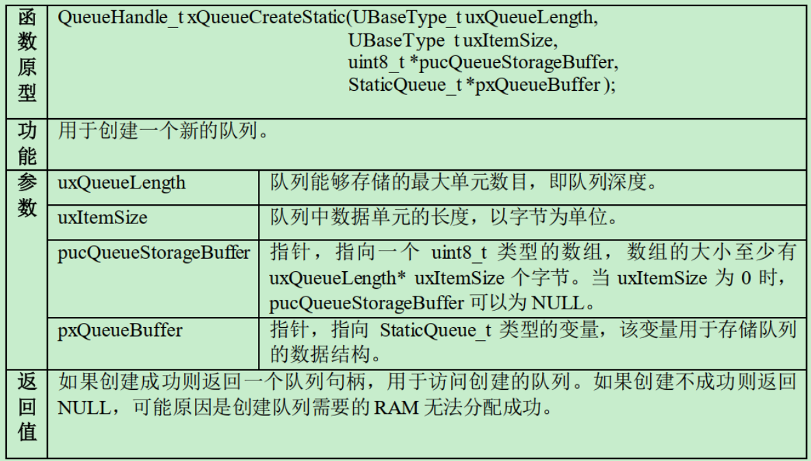


### 2、删除队列：

```c
/* 传入句柄，删除指定队列 */
void vQueueDelete( QueueHandle_t xQueue );
```

注意：

- 调用vQueueDelete()前，系统应存在 xQueueCreate()或 xQueueCreateStatic()函数创建的消息队列。
- vQueueDelete()也可用于删除信号量。
- **如果删除消息队列时，有任务正在等待消息，则不应该进行删除操作**（官方说的是不允许进行删除操作，但是源码并没有禁止删除的操作，使用的时候注意一下就行了）。

```c
/* 使用示例 */
QueueHandle_t xQueue; 
xQueue = xQueueCreate( QUEUE_LENGTH, QUEUE_ITEM_SIZE ); /* 创建消息队列 */ 
if ( xQueue == NULL ) {
 	/* 消息队列创建失败 */
} else {
 	/* 删除已创建的消息队列 */
 	vQueueDelete( xQueue );
}
```


### 3、发送消息

- xQueueSend()与 xQueueSendToBack()：任务中使用，用于往队尾发消息，以拷贝的形式。
- xQueueSendFromISR()与xQueueSendToBackFromISR()：用于在中断中使用的，用于往队尾发消息，以拷贝的形式。
- xQueueSendToFront()：任务中使用，用于往队首发消息，以拷贝的形式。
- xQueueSendToFrontFromISR()：在中断中使用，用于往队首发消息，以拷贝的形式。

①xQueueSend()与 xQueueSendToBack()：往队尾发消息，以拷贝的形式

```c
/* 往某个队列尾部发送消息 */
#define xQueueSend( xQueue, pvItemToQueue, xTicksToWait ) \
xQueueGenericSend( ( xQueue ), ( pvItemToQueue ), \
( xTicksToWait ), queueSEND_TO_BACK )

#define xQueueSendToBack( xQueue, pvItemToQueue, xTicksToWait ) \
xQueueGenericSend( ( xQueue ), ( pvItemToQueue ), \
( xTicksToWait ), queueSEND_TO_BACK )
```

xQueueSend()：

- xQueueSend()是一个宏，宏展开是调用函数 xQueueGenericSend()，该宏是为了向后兼容没有包含xQueueSendToFront() 和 xQueueSendToBack() 这两个宏的 FreeRTOS 版本 。 xQueueSend() 等同于 xQueueSendToBack()。
- xQueueSend()用于向队列尾部发送一个队列消息，消息以拷贝的形式入队，而不是以引用的形式。该函数不能在中断服务函数中使用。

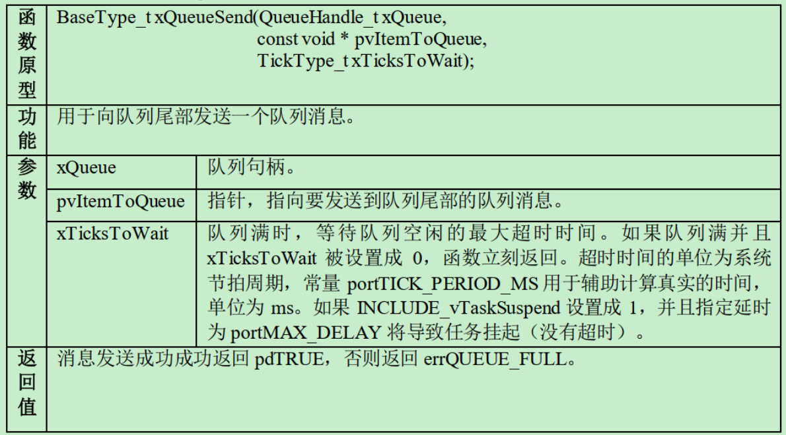

②xQueueSendFromISR()与xQueueSendToBackFromISR()：用于在中断中使用的，往队尾发消息，以拷贝的形式

```c
/* 在中断处理函数中往某个队列尾部发送消息 */
#define xQueueSendToFrontFromISR(xQueue,pvItemToQueue,pxHigherPriorityTaskWoken) \
xQueueGenericSendFromISR( ( xQueue ), ( pvItemToQueue ),\
( pxHigherPriorityTaskWoken ), queueSEND_TO_FRONT )

#define xQueueSendToBackFromISR(xQueue,pvItemToQueue,pxHigherPriorityTaskWoken) \
xQueueGenericSendFromISR( ( xQueue ), ( pvItemToQueue ), \
( pxHigherPriorityTaskWoken ), queueSEND_TO_BACK )
```

xQueueSendFromISR()是一个宏，宏展开是调用函数 xQueueGenericSendFromISR()。该 宏是 xQueueSend()的中断保护版本，用于在中断服务程序中向队列尾部发送一个队列消息， 等价于 xQueueSendToBackFromISR()。

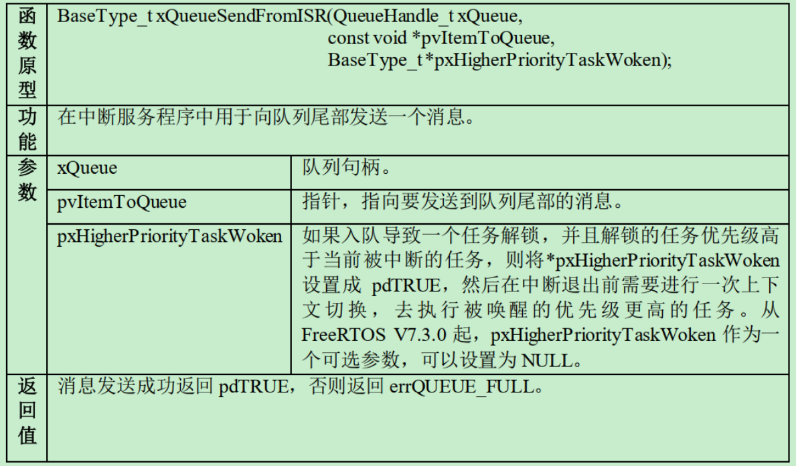

③xQueueSendToFront()：任务中往队首发消息，以拷贝的形式。

```c
/* 往队首发送消息，传入参数分别为目标队列、消息、阻塞超时时间 */
#define xQueueSendToFront( xQueue, pvItemToQueue, xTicksToWait ) \
xQueueGenericSend( ( xQueue ), ( pvItemToQueue ), \
( xTicksToWait ), queueSEND_TO_FRONT )
```

xQueueSendToFron() 是一个宏 ， 宏展开也是调用函 数 xQueueGenericSend() 。

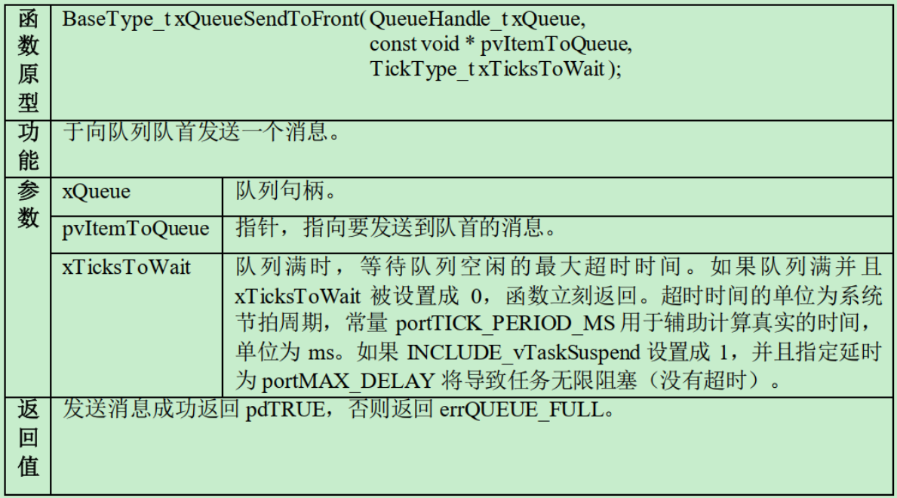

④xQueueSendToFrontFromISR()：在中断中使用，用于往队首发消息，以拷贝的形式。

```c
/* 中断处理函数中往队首发送消息 */
#define xQueueSendToFrontFromISR( xQueue,pvItemToQueue,pxHigherPriorityTaskWoken ) \
xQueueGenericSendFromISR( ( xQueue ), ( pvItemToQueue ), \
( pxHigherPriorityTaskWoken ), queueSEND_TO_FRONT )
```

xQueueSendToFrontFromISR() 是一个宏 ， 宏展开是调用函数 xQueueGenericSendFromISR()。

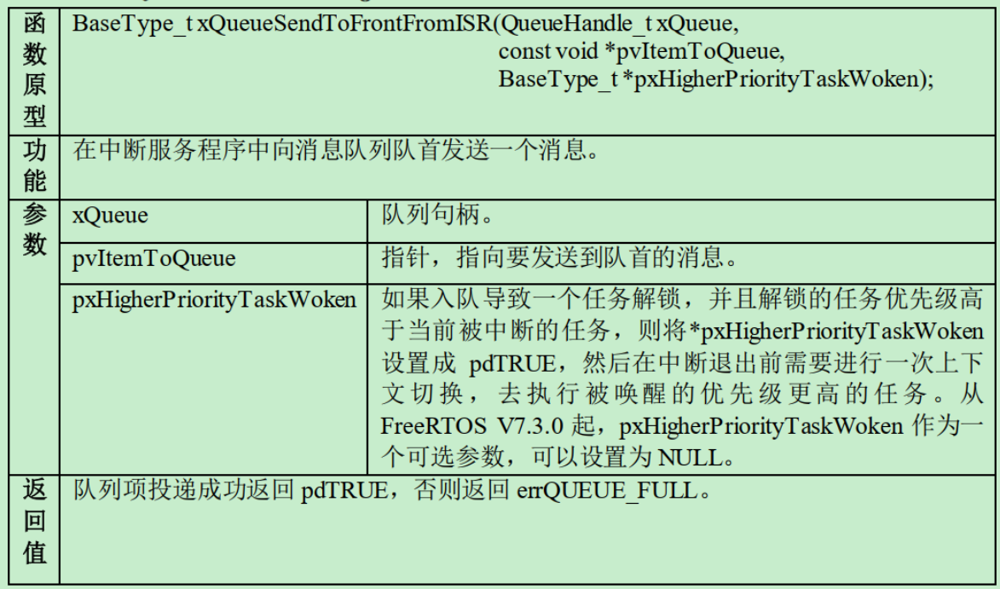

⑤通用消息队列发送函数 xQueueGenericSend()（任务）：上面看到的那些在任务中发送消息的函数都是 xQueueGenericSend()展开的宏定义，真正起作用的就是 xQueueGenericSend()函数，根据指定的参数不一样，发送消息的结果就不一样。

⑥消息队列发送函数 xQueueGenericSendFromISR()（中断）：这个函数 跟 xQueueGenericSend() 函数很像，只不过是执行的上下文环境是不一样的， xQueueGenericSendFromISR()函数只能用于中断中执行，是不带阻塞机制的。

### 4、读取消息

①xQueueReceive()与 xQueuePeek()：

```c
/* 读取消息，接收消息后会将消息从队列中删除 */
#define xQueueReceive( xQueue, pvBuffer, xTicksToWait ) \
xQueueGenericReceive( ( xQueue ), ( pvBuffer ), \
( xTicksToWait ), pdFALSE )
/* xQueuePeek()函数接收消息后不会删除消息队列中的消息*/
#define xQueuePeek( xQueue, pvBuffer, xTicksToWait ) \
xQueueGenericReceive( ( xQueue ), ( pvBuffer ), \
( xTicksToWait ), pdTRUE )
```

xQueueReceive()用于从一个队列中接收消息并把消息从队列中删除。

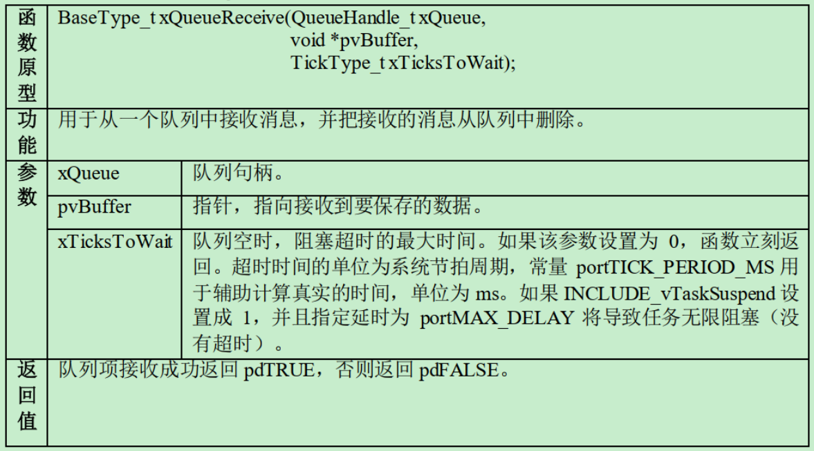

②xQueueReceiveFromISR()与 xQueuePeekFromISR()：

xQueueReceiveFromISR()是 xQueueReceive ()的中断版本，用于在中断服务程序中接收 一个队列消息并把消息从队列中删除；xQueuePeekFromISR()是 xQueuePeek()的中断版本， 用于在中断中从一个队列中接收消息，但并不会把消息从队列中移除。

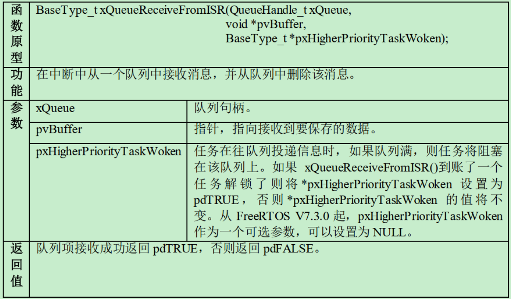

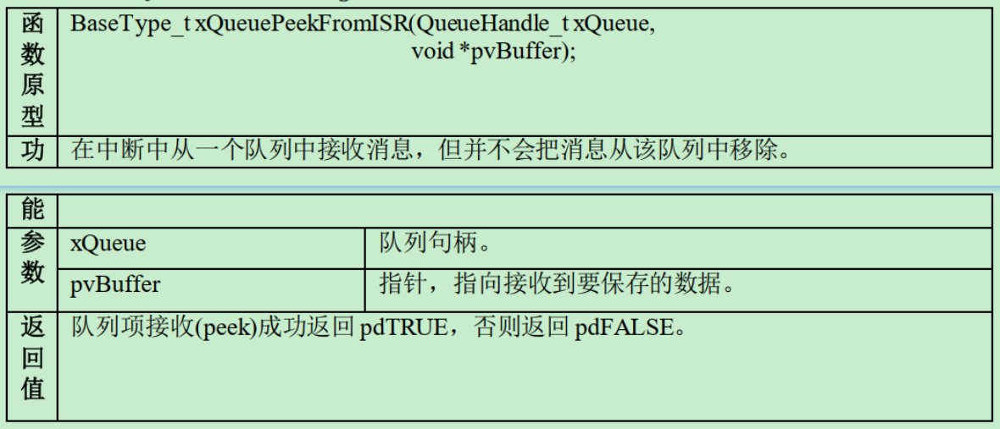

③ xQueueGenericReceive()：

xQueueGenericReceive用于读取队列中的消息；在中断中接收消息的函数用得并不多，中断中接收队列消息的函数可大致了解一下即可。

### 5、使用注意事项

1. FreeRTOS 既支持先进先出队列，也支持先进后出队列。
2. 消息的发送与接收都以拷贝形式进行，如果消息过于庞大，可将消息的地址作为消息进行发送、接收。
3. 所有任务都可以往队列发送消息或读出队列的信息，常见的是多任务往队列发送消息、较少任务读出消息，多任务向队列读取消息的情况并不多见。


## 4.简单使用

使用队列模块的典型流程如下： 

1. 创建消息队列。 
2. 写队列操作。 
3. 读队列操作。 
4. 删除队列。

示例：通过按键控制数据的发送，将发送后接收到的数据通过串口进行显示。（按键接PA0、PA2，按键另一端接高电平，这两个IO口设置为下拉输入模式；串口使用USART1，PA9（Tx）、PA10（Rx））

最终效果展示：

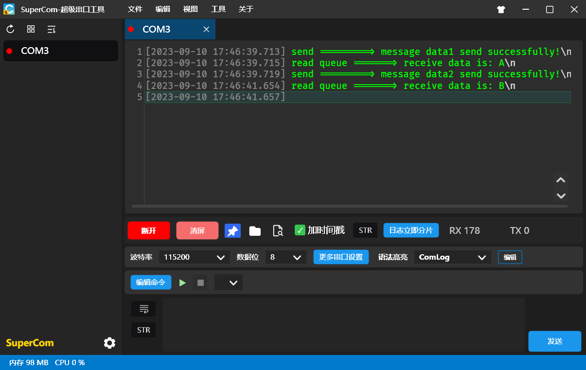

0、在`FreeRTOSConfig.h`配置文件中添加以下：

```c
/* 开启动态内存分配 */
#define configSUPPORT_DYNAMIC_ALLOCATION 1
```

1、硬件初始化：PA0、PA2接按键，按下时输入高电平；初始化串口外设USART1。

```c
/* 将这部分放于STM32F103C8_BSP.c */
void USART1_Init(void)
{
    RCC_APB2PeriphClockCmd(RCC_APB2Periph_USART1, ENABLE);
    RCC_APB2PeriphClockCmd(RCC_APB2Periph_GPIOA,ENABLE);
    
    GPIO_InitTypeDef GPIO_InitStruct;
    GPIO_InitStruct.GPIO_Mode = GPIO_Mode_AF_PP;
    GPIO_InitStruct.GPIO_Pin = GPIO_Pin_9;
    GPIO_InitStruct.GPIO_Speed = GPIO_Speed_50MHz;
    GPIO_Init(GPIOA, &GPIO_InitStruct);
    GPIO_InitStruct.GPIO_Mode = GPIO_Mode_IPU;
    GPIO_InitStruct.GPIO_Pin = GPIO_Pin_10;
    GPIO_Init(GPIOA, &GPIO_InitStruct);
    
    USART_InitTypeDef USART_InitStruct;
    USART_InitStruct.USART_BaudRate = 115200;
    USART_InitStruct.USART_HardwareFlowControl = USART_HardwareFlowControl_None;
    USART_InitStruct.USART_Mode = USART_Mode_Rx | USART_Mode_Tx;
    USART_InitStruct.USART_Parity = USART_Parity_No;
    USART_InitStruct.USART_StopBits = USART_StopBits_1;
    USART_InitStruct.USART_WordLength = USART_WordLength_8b;
    USART_Init(USART1, &USART_InitStruct);
    
    USART_Cmd(USART1, ENABLE);
    
}
void KEY_GPIO_Init(void)
{
    RCC_APB2PeriphClockCmd(RCC_APB2Periph_GPIOA,ENABLE);
    
    GPIO_InitTypeDef GPIO_InitStruct;
    GPIO_InitStruct.GPIO_Mode = GPIO_Mode_IPD;
    GPIO_InitStruct.GPIO_Pin = GPIO_Pin_0 | GPIO_Pin_2;
    GPIO_InitStruct.GPIO_Speed = GPIO_Speed_50MHz;
    GPIO_Init(GPIOA, &GPIO_InitStruct);
}

void USART1_SendByte(uint8_t byte){
    USART_SendData(USART1, byte);
    while(USART_GetFlagStatus(USART1, USART_FLAG_TXE) == RESET);
}
void USART1_SendString(char* str)
{
    uint16_t i;
    for(i = 0; str[i] != '\0'; i++){
        USART1_SendByte(*(str+i));
    }
}

uint8_t KEY_Scan(GPIO_TypeDef* GPIOx, uint16_t GPIO_Pin)
{
    if(GPIO_ReadInputDataBit(GPIOx, GPIO_Pin) == 1){
        while(GPIO_ReadInputDataBit(GPIOx, GPIO_Pin) == 1);
        return 1;
    }
    return 0;
}
```

2、定义初始化函数、任务与消息队列句柄：

```c
static void STM32F103_Init(void)
{
	NVIC_PriorityGroupConfig(NVIC_PriorityGroup_2);
    USART1_Init();
    KEY_GPIO_Init();
    
}

QueueHandle_t Test_Queue = NULL; /* 队列句柄 */
#define QUEUE_LEN 5  /* 队列的长度，最大可包含多少个消息 */ 
#define QUEUE_SIZE 1 /* 队列中每个消息大小（字节） */ 
/* 声明任务 */
static void ReceiveTask(void);
static void SendTask(void);

static void ReceiveTask(void) 
{
    BaseType_t xReturn = pdTRUE;
    char msg;
	while(1){
        /* 接收队列中的消息 */
        xReturn = xQueueReceive(Test_Queue, &msg, portMAX_DELAY);
        if(xReturn == pdTRUE){
            USART1_SendString("read queue =======> receive data is: ");
            USART1_SendByte(msg);
            USART1_SendString("\n");
        }else {
            USART1_SendString("read queue =======> receive data error:");
            USART1_SendByte(xReturn);
            USART1_SendString("\n");
        } 
        vTaskDelay(20);
    }
}
static void SendTask(void)
{
    BaseType_t xReturn = pdPASS;
    char send_data1 = 'A';
    char send_data2 = 'B';
    while(1){
        if(KEY_Scan(GPIOA, GPIO_Pin_0) == 1){
            USART1_SendString("send =========> ");
            /* 发送消息到队列 */
            xReturn = xQueueSend( Test_Queue, &send_data1, 0);        
            if(xReturn == pdPASS)
                USART1_SendString("message data1 send success!\r\n");
        }
        if(KEY_Scan(GPIOA, GPIO_Pin_2) == 1){
            /* 发送消息到队列 */
            USART1_SendString("send =========> ");
            xReturn = xQueueSend( Test_Queue, &send_data2,0);        
            if(xReturn == pdPASS)
                USART1_SendString("message data2 send success!\r\n");
        }
        vTaskDelay(20);
    }
} 
```

3、main()：创建任务、创建队列、开启调度器

```c
int main(void) 
{
	STM32F103_Init();
    
    BaseType_t xReturn = pdPASS;
    taskENTER_CRITICAL();
    /* 创建一个队列 */
    Test_Queue = xQueueCreate((UBaseType_t)QUEUE_LEN, (UBaseType_t)QUEUE_SIZE);
    
    xReturn = xTaskCreate((TaskFunction_t)ReceiveTask, "ReceiveTask", 512, NULL, 2, NULL);
	xReturn = xTaskCreate((TaskFunction_t)SendTask, "SendTask", 512, NULL, 3, NULL);
    
    if(xReturn == pdPASS){
        vTaskStartScheduler();
    }else {
        return -1;
    }
    taskEXIT_CRITICAL();
	while(1);
}
```

4、main.c代码全貌：

```c
#include "stm32f10x.h"                  // Device header
#include "FreeRTOS.h"
#include "task.h"
#include "queue.h"
#include "STM32F103C8_BSP.h"

static void STM32F103_Init(void)
{
	NVIC_PriorityGroupConfig(NVIC_PriorityGroup_2);
    USART1_Init();
    KEY_GPIO_Init();
}

QueueHandle_t Test_Queue = NULL; /* 队列句柄 */
#define QUEUE_LEN 5  /* 队列的长度，最大可包含多少个消息 */ 
#define QUEUE_SIZE 1 /* 队列中每个消息大小（字节） */ 

static void ReceiveTask(void);
static void SendTask(void);

int main(void) 
{
	STM32F103_Init();
    
    BaseType_t xReturn = pdPASS;
    taskENTER_CRITICAL();
    /* 创建一个队列 */
    Test_Queue = xQueueCreate((UBaseType_t)QUEUE_LEN, (UBaseType_t)QUEUE_SIZE);
    
    xReturn = xTaskCreate((TaskFunction_t)ReceiveTask, "ReceiveTask", 512, NULL, 2, NULL);
	xReturn = xTaskCreate((TaskFunction_t)SendTask, "SendTask", 512, NULL, 3, NULL);
    
    if(xReturn == pdPASS){
        vTaskStartScheduler();
    }else {
        return -1;
    }
    taskEXIT_CRITICAL();
	while(1);
    
}
static void ReceiveTask(void) 
{
    BaseType_t xReturn = pdTRUE;
    char msg;
	while(1){
        /* 接收队列中的消息 */
        xReturn = xQueueReceive(Test_Queue, &msg, portMAX_DELAY);
        if(xReturn == pdTRUE){
            USART1_SendString("read queue =======> receive data is: ");
            USART1_SendByte(msg);
            USART1_SendString("\n");
        }else {
            USART1_SendString("read queue =======> receive data error:");
            USART1_SendByte(xReturn);
            USART1_SendString("\n");
        } 
        vTaskDelay(20);
    }
}
static void SendTask(void)
{
    BaseType_t xReturn = pdPASS;
    char send_data1 = 'A';
    char send_data2 = 'B';
    while(1){
        if(KEY_Scan(GPIOA, GPIO_Pin_0) == 1){
            USART1_SendString("send =========> ");
            /* 发送消息到队列 */
            xReturn = xQueueSend( Test_Queue, &send_data1, 0);        
            if(xReturn == pdPASS)
                USART1_SendString("message data1 send successfully!\r\n");
        }
        if(KEY_Scan(GPIOA, GPIO_Pin_2) == 1){
            /* 发送消息到队列 */
            USART1_SendString("send =========> ");
            xReturn = xQueueSend( Test_Queue, &send_data2,0);        
            if(xReturn == pdPASS)
                USART1_SendString("message data2 send successfully!\r\n");
        }
        vTaskDelay(20);
    }
} 
```


END

# FreeRTOS学习篇五：信号量

## 1.理解基本概念

>\#百度百科
>
>信号量（Semaphore），有时被称为信号灯，是在多线程环境下使用的一种设施，是可以用来保证两个或多个关键代码段不被并发调用。在进入一个关键代码段之前，线程必须获取一个信号量；一旦该关键代码段完成了，那么该线程必须释放信号量。其它想进入该关键代码段的线程必须等待直到第一个线程释放信号量。为了完成这个过程，需要创建一个信号量VI，然后将Acquire Semaphore VI以及Release Semaphore VI分别放置在每个关键代码段的首末端，确认这些信号量VI引用的是初始创建的信号量。

①如何理解信号量？

- 简单的理解就是，信号量就像是通行令牌，当在某段路（某段代码前）加上关卡后，就必须申请并且拿到令牌（信号量）才能放行，并且放行后令牌（信号量）得归还，以便分配给其它的申请者。（通俗地说，信号量就是一个令牌，哪个任务发起请求获取信号量并且获取到了，才能放行通过（运行态），发起请求但没有获取到信号量，那就不放行（阻塞态）。）

②信号量的应用：

- 信号量（Semaphore）是一种实现任务间通信的机制，可以实现任务之间同步或临界资源的互斥访问，常用于协助一组相互竞争的任务来访问临界资源。（同步、互斥、临界资源访问？）
- 信号量机制可通过消息队列来实现。

>百度百科 —— 线程同步：
>
>线程同步：即当有一个线程在对内存进行操作时，其他线程都不可以对这个内存地址进行操作，直到该线程完成操作， 其他线程才能对该内存地址进行操作，而其他线程又处于等待状态，实现线程同步的方法有很多，临界区对象就是其中一种。
>
>在一般情况下，创建一个线程是不能提高程序的执行效率的，所以要创建多个线程。但是多个线程同时运行的时候可能调用线程函数，在多个线程同时对同一个内存地址进行写入，由于CPU时间调度上的问题，写入数据会被多次的覆盖，所以就要使线程同步。
>
>**同步就是协同步调，按预定的先后次序进行运行。如：你说完，我再说。**（反之，异步就是：“你说你的，我说我的”、“你干你的，我干我的”）
>
>“同”字从字面上容易理解为一起动作，其实不是，“同”字应是指协同、协助、互相配合。
>
>如进程、线程同步，可理解为进程或线程A和B一块配合，A执行到一定程度时要依靠B的某个结果，于是停下来，示意B运行；B依言执行，再将结果给A；A再继续操作。
>
>所谓同步，就是在发出一个功能调用时，在没有得到结果之前，该调用就不返回，同时其它线程也不能调用这个方法。按照这个定义，其实绝大多数函数都是同步调用（例如sin, isdigit等）。但是一般而言，我们在说同步、异步的时候，特指那些需要其他部件协作或者需要一定时间完成的任务。例如Window API函数SendMessage。该函数发送一个消息给某个窗口，在对方处理完消息之前，这个函数不返回。当对方处理完毕以后，该函数才把消息处理函数所返回的LRESULT值返回给调用者。
>
>在多线程编程里面，一些敏感数据不允许被多个线程同时访问，此时就使用同步访问技术，保证数据在任何时刻，最多有一个线程访问，以保证数据的完整性。

③二值信号量：

- 只有两个值 —— 0和1。0表示信号量资源被获取，也就是没有信号量了；1表示信号量资源被释放了，此时有信号量资源。
- 应用：常用于任务同步。在任务同步中，信号量在创建后应被置为空，任务A请求获取信号量获取不到从而进入阻塞态，任务B在某种条件发生后释放信号量，于是任务A就能获取到信号量得以进入就绪态，如果任务A的优先级是最高的，那么就会立即切换任务，从而达到了两个任务间的同步。同样的，在中断服务函数中释放信号量，任务A也会得到信号量，从而达到任务与中断间的同步。

④计数信号量：

- 可看作是一个数n，获取信号量时n会减1，释放时n会加1。只要n不为0则表示有信号量资源。
- 应用：实际使用中常将计数信号量用于事件计数与资源管理。

总结：

```c
/* 信号量就相当于这个getSem()，和标记、状态机的状态概念是差不了多少的 */
if(getSem() == true){
    
}else {
    /* 阻塞 */
}
```


## 2.二值信号量

### 2.1应用场景

>在嵌入式操作系统中二值信号量是任务间、任务与中断间同步的重要手段，信号量使用最多的一般都是二值信号量与互斥信号量。为什么叫二值信号量呢？因为信号量资源被获取了，信号量值就是 0，信号量资源被释放，信号量值就是 1，把这种只有 0 和 1 两种情况的信号量称之为二值信号量。 
>
>在多任务系统中，我们经常会使用这个二值信号量，比如，某个任务需要等待一个标 记，那么任务可以在轮询中查询这个标记有没有被置位，但是这样子做，就会很消耗 CPU 资源并且妨碍其它任务执行，更好的做法是任务的大部分时间处于阻塞状态（允许其它任务执行），直到某些事件发生该任务才被唤醒去执行。可以使用二进制信号量实现这种同 步，当任务取信号量时，因为此时尚未发生特定事件，信号量为空，任务会进入阻塞状态； 当事件的条件满足后，任务/中断便会释放信号量，告知任务这个事件发生了，任务取得信号量便被唤醒去执行对应的操作，任务执行完毕并不需要归还信号量，这样子的 CPU 的效 率可以大大提高，而且实时响应也是最快的。 
>
>再比如某个任务使用信号量在等中断的标记的发生，在这之前任务已经进入了阻塞态， 在等待着中断的发生，当在中断发生之后，释放一个信号量，也就是我们常说的标记，当 它退出中断之后，操作系统会进行任务的调度，如果这个任务能够运行，系统就会把等待 这个任务运行起来，这样子就大大提高了我们的效率。
>
>二值信号量在任务与任务中同步的应用场景：假设我们有一个温湿度的传感器，假设是 1s 采集一次数据，那么我们让他在液晶屏中显示数据出来，这个周期也是要 1s 一次的， 如果液晶屏刷新的周期是 100ms 更新一次，那么此时的温湿度的数据还没更新，液晶屏根本无需刷新，只需要在 1s 后温湿度数据更新的时候刷新即可，否则 CPU 就是白白做了多 次的无效数据更新，CPU的资源就被刷新数据这个任务占用了大半，造成 CPU 资源浪费， 如果液晶屏刷新的周期是 10s更新一次，那么温湿度的数据都变化了 10 次，液晶屏才来更新数据，那拿这个产品有啥用，根本就是不准确的，所以，还是需要同步协调工作，在温湿度采集完毕之后，进行液晶屏数据的刷新，这样子，才是最准确的，并且不会浪费 CPU 的资源。 
>
>同理，二值信号量在任务与中断同步的应用场景：我们在串口接收中，我们不知道啥时候有数据发送过来，有一个任务是做接收这些数据处理，总不能在任务中每时每刻都在 任务查询有没有数据到来，那样会浪费 CPU 资源，所以在这种情况下使用二值信号量是很 好的办法，当没有数据到来的时候，任务就进入阻塞态，不参与任务的调度，等到数据到 来了，释放一个二值信号量，任务就立即从阻塞态中解除，进入就绪态，然后运行的时候处理数据，这样子系统的资源就会很好的被利用起来。
>
>——《FreeRTOS内核实现与应用开发实战——基于STM32》        页码：第253页

### 2.2运作机制

1、创建信号量：创建信号量时，系统会为创建的信号量对象分配内存，并把可用信号量初始化为用户自定义的个数，二值信号量的最大可用信号量个数为 1。

2、 获取二值信号量：任何任务都可以从创建的二值信号量资源中获取一个二值信号量， 获取成功则返回正确，否则任务会根据指定好的阻塞超时时间来等待其它任务或中断释放信号量。在等待的这段时间，系统将任务切换到了阻塞态，任务将被挂到该信号量的阻塞等待列表中。

3、释放二值信号量：调用函数释放信号量后，其它等待信号量的任务将从阻塞态切换位就绪态。

### 2.3常用函数

#### 创建信号量

**①xSemaphoreCreateBinary()  ：**用于创建一个二值信号量

```c
/* 用于创建二值信号量 */
#define xSemaphoreCreateBinary() xQueueGenericCreate( ( UBaseType_t ) 1, semSEMAPHORE_QUEUE_ITEM_LENGTH, queueQUEUE_TYPE_BINARY_SEMAPHORE )

QueueHandle_t xQueueGenericCreate( const UBaseType_t uxQueueLength, const UBaseType_t uxItemSize, const uint8_t ucQueueType );
```

使用该函数需要将`configSUPPORT_DYNAMIC_ALLOCATION`定义为 1，即开启动态内存分配。

xSemaphoreCreateBinary()用于创建一个二值信号量， 并返回一个信号量句柄。  

>其实二值信号量和互斥量都共同使用一个类型 SemaphoreHandle_t 的句柄（semphr.h文件79行），该句柄的原型是一个void型的指针。使用该函数创建的二值信号量是空的，在使用函数xSemaphoreTake()获取之前必须先调用函数 xSemaphoreGive()释放后才可以获取。 如果是使用老式的函数 vSemaphoreCreateBinary()创建的二值信号量，则为 1， 在使用之前不用先释放。

#### 删除信号量

②vSemaphoreDelete()：用于删除一个信号量

```c
/* 传入信号量句柄，删除信号量 */
#define vSemaphoreDelete(xSemaphore) vQueueDelete((QueueHandle_t)(xSemaphore))

/* 删除信号量的过程实际就是删除消息队列的过程，
因为信号量实际就是消息队列，只不过信号量是无法存储消息的队列而已。 */
void vQueueDelete(QueueHandle_t xQueue);
```

vSemaphoreDelete()用于删除一个信号量，包括二值信号量、计数信号量、互斥量和递归互斥量。 如果有任务阻塞在该信号量上，那么不要删除该信号量。

#### 释放信号量

  ③xSemaphoreGive()：任务中使用的，用于释放信号量

```c
/* 释放信号量 */
#define xSemaphoreGive( xSemaphore ) xQueueGenericSend( ( QueueHandle_t ) ( xSemaphore ), NULL, semGIVE_BLOCK_TIME, queueSEND_TO_BACK )
/* 释放信号量的实现，实际上是调用消息队列通用发送函数 */
BaseType_t xQueueGenericSend( QueueHandle_t xQueue, const void * const pvItemToQueue, TickType_t xTicksToWait, const BaseType_t xCopyPosition );
```

释放的信号量对象必须是已经被创建的， 可以用于释放二值信号量、 计数信号量、 互斥量等，但不能释放由函数
xSemaphoreCreateRecursiveMutex()创建的递归互斥量。 此外该函数不能在中断中使用。

④xSemaphoreGiveFromISR()：中断中使用的，用于释放信号量

```c
/* 在中断中释放信号量，实际调用函数是 xQueueGiveFromISR () */
#define xSemaphoreGiveFromISR(xSemaphore, pxHigherPriorityTaskWoken) \
xQueueGiveFromISR((QueueHandle_t)(xSemaphore), (pxHigherPriorityTaskWoken))
/*
参数1：信号量句柄
参数2：pxHigherPriorityTaskWoken，即释放信号量后唤醒的任务是否比进入中断前的任务更高优先级的，
是的话该变量就会被设置为1
*/
```

被释放的信号量可以是二值信号量和计数信号量。它不能释放互斥量，这是因为互斥量不可以在中断中使用， 互斥量的优先级继承机制只能在任务中起作用，而在中断中毫无意义。

```c
/* 使用示例 */
void vTestISR( void )
{
	BaseType_t pxHigherPriorityTaskWoken;
	uint32_t ulReturn;
	/* 进入临界段，临界段可以嵌套 */
	ulReturn = taskENTER_CRITICAL_FROM_ISR();

	/* 判断是否产生中断 */
	{
	/* 如果产生中断，清除中断标志位 */

	//释放二值信号量，发送接收到新数据标志，供前台程序查询
	xSemaphoreGiveFromISR(BinarySem_Handle,&
	pxHigherPriorityTaskWoken);

	//如果需要的话进行一次任务切换，系统会判断是否需要进行切换
	portYIELD_FROM_ISR(pxHigherPriorityTaskWoken);
	}
    
	/* 退出临界段 */
	taskEXIT_CRITICAL_FROM_ISR( ulReturn );
}
```


#### 获取信号量

⑤xSemaphoreTake()：获取信号量，任务中使用

```c
/* 获取信号量 */
#define xSemaphoreTake(xSemaphore, xBlockTime)
xQueueGenericReceive((QueueHandle_t) (xSemaphore), NULL, (xBlockTime), pdFALSE)
/*
xBlockTime：等待信号量的最大超时时间，单位为 tick，即系统节拍周期。
如果宏 INCLUDE_vTaskSuspend 定义为 1 且形参 xTicksToWait 设置为
portMAX_DELAY，则任务将一直阻塞在该信号量上（即没有超时时间）
*/
```

xSemaphoreTake()函数用于获取信号量，获取的信号量对象可以是二值信号量、计数信号量和互斥量，但是递归互斥量并不能使用这个 API 函数获取。  

⑥xSemaphoreTakeFromISR()：获取信号量，中断中使用

```c
/* 获取信号量 */
xSemaphoreTakeFromISR(SemaphoreHandle_t xSemaphore,
signed BaseType_t *pxHigherPriorityTaskWoken)
```

xSemaphoreTakeFromISR()函数用于获取信号量， 是一个不带阻塞机制获取信号量的函数， 信号量类型可以是二值信号量和计数信号量，但不能用于获取互斥量。

>关于形参pxHigherPriorityTaskWoken：
>
>一个或者多个任务有可能阻塞在同一个信号量上，调用函数 xSemaphoreTakeFromISR()会唤醒阻塞在该信号量上优先级最高的信号量入队任务，如果被唤醒的任务的优 先级大于或者等于被中断的任务的优先级，那么形参 pxHigherPriorityTaskWoken 就会被设置为 pdTRUE， 然后 在中断退出前执行一次上下文切换，中断退出后则直接 返回刚刚被唤醒的高优先级的任务。 从 FreeRTOS V7.3.0 版本开始， pxHigherPriorityTaskWoken 是一个可选的参数，可以设置为 NULL。
>
>返回值：pdTRUE、errQUEUE_EMPTY

### 2.4使用示例

示例：通过PA0口的按键控制信号量的释放，通过串口发送数据显示出信号量的释放和获取。

最终效果展示：

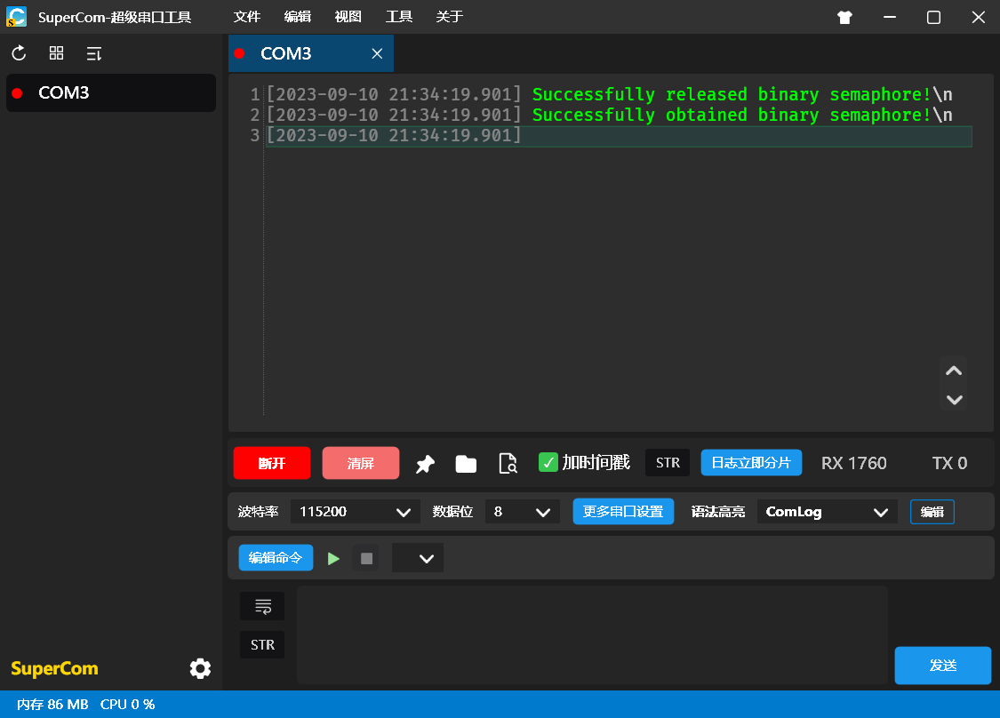

0、在`FreeRTOSConfig.h`配置文件中添加以下：

```c
#define configSUPPORT_DYNAMIC_ALLOCATION 1
```

1、`main.c`：（使用信号量需要添加`semphr.h`头文件）

```c
#include "stm32f10x.h"                  // Device header
#include "FreeRTOS.h"
#include "task.h"
#include "STM32F103C8_BSP.h"
#include "semphr.h"

static void STM32F103_Init(void)
{
	NVIC_PriorityGroupConfig(NVIC_PriorityGroup_2);
    USART1_Init();
    KEY_GPIO_Init();
}
/* 二值信号量句柄 */
SemaphoreHandle_t BinarySem_Handle = NULL;

/* 声明任务 */
static void GiveTask(void);
static void TakeTask(void);

int main(void) 
{
	STM32F103_Init();
    taskENTER_CRITICAL();
    /* 创建一个二值信号量，默认为0 */
    BinarySem_Handle = xSemaphoreCreateBinary();
    xTaskCreate((TaskFunction_t)TakeTask, "TakeTask", 512, NULL, 2, NULL);
    xTaskCreate((TaskFunction_t)GiveTask, "GiveTask", 512, NULL, 3, NULL);
    vTaskStartScheduler();
    taskEXIT_CRITICAL();
	while(1);
    
}
/* 任务：提供信号量 */
static void GiveTask(void)
{
    BaseType_t xReturn = pdFALSE;
    while(1){
        if(KEY_Scan(GPIOA, GPIO_Pin_0)){
            /* 提供一个信号量 */
            xReturn = xSemaphoreGive(BinarySem_Handle);
            if(xReturn == pdTRUE)
            USART1_SendString("Successfully released binary semaphore!\n");
        }
        vTaskDelay(20);
    }
}
/* 任务：拿信号量 */
static void TakeTask(void)
{
    BaseType_t xReturn = pdFALSE;
    while(1){
        xReturn = xSemaphoreTake(BinarySem_Handle, portMAX_DELAY);
        if(xReturn == pdTRUE){
            USART1_SendString("Successfully obtained binary semaphore!\n");
        }
        vTaskDelay(20);
    }
}
```

2、`STM32F103C8_BSP.c`：

```c
#include "stm32f10x.h" 
void USART1_Init(void)
{
    RCC_APB2PeriphClockCmd(RCC_APB2Periph_USART1, ENABLE);
    RCC_APB2PeriphClockCmd(RCC_APB2Periph_GPIOA,ENABLE);
    
    GPIO_InitTypeDef GPIO_InitStruct;
    GPIO_InitStruct.GPIO_Mode = GPIO_Mode_AF_PP;
    GPIO_InitStruct.GPIO_Pin = GPIO_Pin_9;
    GPIO_InitStruct.GPIO_Speed = GPIO_Speed_50MHz;
    GPIO_Init(GPIOA, &GPIO_InitStruct);
    GPIO_InitStruct.GPIO_Mode = GPIO_Mode_IPU;
    GPIO_InitStruct.GPIO_Pin = GPIO_Pin_10;
    GPIO_Init(GPIOA, &GPIO_InitStruct);
    
    USART_InitTypeDef USART_InitStruct;
    USART_InitStruct.USART_BaudRate = 115200;
    USART_InitStruct.USART_HardwareFlowControl = USART_HardwareFlowControl_None;
    USART_InitStruct.USART_Mode = USART_Mode_Rx | USART_Mode_Tx;
    USART_InitStruct.USART_Parity = USART_Parity_No;
    USART_InitStruct.USART_StopBits = USART_StopBits_1;
    USART_InitStruct.USART_WordLength = USART_WordLength_8b;
    USART_Init(USART1, &USART_InitStruct);
    
    USART_Cmd(USART1, ENABLE);
    
}
void KEY_GPIO_Init(void)
{
    RCC_APB2PeriphClockCmd(RCC_APB2Periph_GPIOA,ENABLE);
    
    GPIO_InitTypeDef GPIO_InitStruct;
    GPIO_InitStruct.GPIO_Mode = GPIO_Mode_IPD;
    GPIO_InitStruct.GPIO_Pin = GPIO_Pin_0 | GPIO_Pin_2;
    GPIO_InitStruct.GPIO_Speed = GPIO_Speed_50MHz;
    GPIO_Init(GPIOA, &GPIO_InitStruct);
}

void USART1_SendByte(uint8_t byte){
    USART_SendData(USART1, byte);
    while(USART_GetFlagStatus(USART1, USART_FLAG_TXE) == RESET);
}
void USART1_SendString(char* str)
{
    uint16_t i;
    for(i = 0; str[i] != '\0'; i++){
        USART1_SendByte(*(str+i));
    }
}

uint8_t KEY_Scan(GPIO_TypeDef* GPIOx, uint16_t GPIO_Pin)
{
    if(GPIO_ReadInputDataBit(GPIOx, GPIO_Pin) == 1){
        while(GPIO_ReadInputDataBit(GPIOx, GPIO_Pin) == 1);
        return 1;
    }
    return 0;
}
```


## 3.计数信号量

### 3.1常用函数

xSemaphoreCreateCounting()：创建计数信号量

```c
/* 创建计数信号量，将返回一个计数信号量句柄 */
#define xSemaphoreCreateCounting( uxMaxCount, uxInitialCount ) xQueueCreateCountingSemaphore( ( uxMaxCount ), ( uxInitialCount ) )

QueueHandle_t xQueueCreateCountingSemaphore( const UBaseType_t uxMaxCount, const UBaseType_t uxInitialCount );
```

- 形参uxMaxCount：最大计数值。当达到这个值后计数信号量将不能再释放。
- 形参uxInitialCount：初始计数值。

使用计数信号量除了需要将`configSUPPORT_DYNAMIC_ALLOCATION`定义为 1外，还需要将`configUSE_COUNTING_SEMAPHORES`定义为1。

计数信号量的其它函数见二值信号量中常用函数，当调用释放信号量的函数时，计数信号量的计数值增加，调用获取信号量的函数时，计数信号量的计数值减少。

### 3.2使用示例

示例：通过接着PA0的按钮控制信号量的释放，通过接着PA2的按钮控制信号量的获取，设置计数信号量的初始值为0，最大值为5。信号量的释放和获取通过串口往电脑发字符来监控。

最终结果：

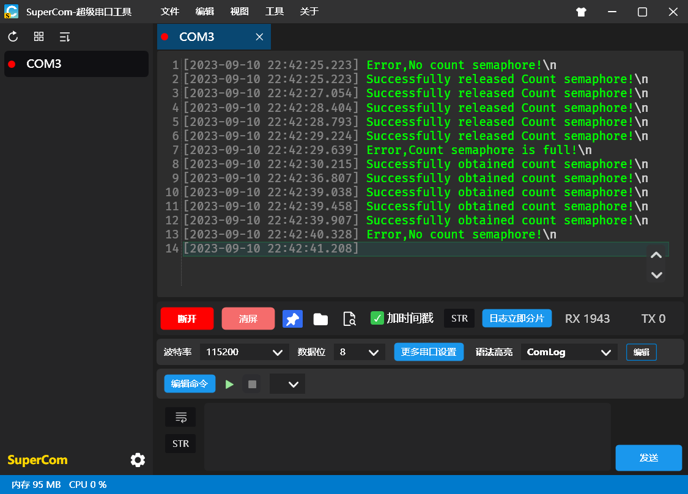

0、在`FreeRTOSConfig.h`配置文件中添加以下：

```c
#define configSUPPORT_DYNAMIC_ALLOCATION 1
#define configUSE_COUNTING_SEMAPHORES       1 // 使用计数信号量
```

1、`main.c`：（使用信号量需要添加`semphr.h`头文件）

```c
#include "stm32f10x.h"                  // Device header
#include "FreeRTOS.h"
#include "task.h"
#include "STM32F103C8_BSP.h"
#include "semphr.h"

static void STM32F103_Init(void)
{
	NVIC_PriorityGroupConfig(NVIC_PriorityGroup_2);
    USART1_Init();
    KEY_GPIO_Init();
}
/* 定义计数信号量句柄 */
SemaphoreHandle_t CountSem_Handle;

/* 定义两个任务 */
void GiveTask(void);
void TakeTask(void);

int main(void) 
{
	STM32F103_Init();
    taskENTER_CRITICAL();
    /* 创建计算信号量，最大计数值设置为5，初始计数值设置为0，即没有信号量 */
    CountSem_Handle = xSemaphoreCreateCounting(5, 0);
    /* 创建任务 */
    xTaskCreate((TaskFunction_t)TakeTask, "TakeTask", 512, NULL, 2, NULL);
    xTaskCreate((TaskFunction_t)GiveTask, "GiveTask", 512, NULL, 3, NULL);
    
    vTaskStartScheduler();
    taskEXIT_CRITICAL();
	while(1);
    
}
void GiveTask(void)
{
    BaseType_t xReturn = pdPASS;
    while(1){
        if(KEY_Scan(GPIOA, GPIO_Pin_0) == 1){
            xReturn = xSemaphoreGive(CountSem_Handle);
            if(xReturn == pdPASS){
                USART1_SendString("Successfully released Count semaphore!\n");
            }else {
                USART1_SendString("Error,Count semaphore is full!\n");
            }
        }
        vTaskDelay(20);
    }
}
void TakeTask(void)
{
    BaseType_t xReturn = pdPASS;
    while(1){
        if(KEY_Scan(GPIOA, GPIO_Pin_2) == 1){
            xReturn = xSemaphoreTake(CountSem_Handle, 0);
            if(xReturn == pdPASS){
                USART1_SendString("Successfully obtained count semaphore!\n");
            }else {
                USART1_SendString("Error,No count semaphore!\n");
            }
        }
        vTaskDelay(20);
    }
}
```

2、`STM32F103C8_BSP.c`：内容和二值信号量的一致。

END

# FreeRTOS学习篇六：互斥量

## 1.理解基本概念

互斥量：互斥量是特殊的二值信号量，其主要特殊之处在于有一个优先级继承机制，互斥量以锁的形式存在，可以用线程中的锁的角度去理解。

互斥量的两种状态：开锁和闭锁。

互斥量的三个特性：

- 互斥量所有权：互斥量被任务持有时，互斥量处于闭锁状态，任务获得互斥量的所有权，直到任务释放，互斥量开锁，所有权释放。
- 递归访问：一个任务获取互斥量后，可以再次获取到互斥量，而不是获取不到而进入阻塞状态形成死锁。可以理解为，互斥量被任务获取，那么这个互斥量的作用域就是在这个任务中，只要不是释放后被其它任务获取了，就能在这个任务中继续获取到互斥量而不用进入阻塞状态。（递归互斥量才有的特性）
- 防止优先级翻转。

优先级翻转与优先级继承机制：

要知道优先级继承作何用，就得先知道优先级翻转的问题。

优先级翻转，简而言之就是低优先级的比高优先级的任务先执行，为什么会发生这种情况呢？在某些情况下，可访问的资源只有一个并且同一时间内只能被一个任务所访问，当低优先级的先访问了这个资源，此时如果出现从阻塞态醒来了的更高优先级的任务也要访问这个资源，可是由于资源已经被霸占了（被锁了），高优先级的这个任务只能进入阻塞状态等待低优先级的将资源释放，就出现了低优先级的任务先于高优先级的任务运行的情况。
那这有什么问题呢？如果只有这两个任务那当然没什么问题；但是，如果在这个低优先级的任务执行过程中出现了一个比其优先级高的任务，那么其也就被打断了，直到这个出现的高优先级的执行完，其继续执行直到释放资源，这个过程将会导致原来那个等待访问被锁资源的高优先级任务的阻塞时间变长。如果高优先级的阻塞时间变长了，那就会有因处理不及时而出现问题的风险，一旦出现，对于系统来说可是致命的。而优先级继承机制正是将这种危害降到最低的一种解决方法。

高优先级的任务代表着需要尽快地被执行。优先级继承机制，是用来确保高优先级任务进入阻塞状态的时间尽可能短的，比如确保优先级翻转时高优先级的阻塞时间不会过长。那是如何实现的？思路也很简单，那就把占用资源的那个低优先级任务的优先级临时提高，等执行完后再恢复到原来的优先级。这样就能极大地使得这个低优先级任务尽快执行完成以释放保护资源，将高优先级任务的阻塞延时降到最低。

FreeRTOS的互斥量的运作机制：任务获取互斥量后，互斥量立刻被变成闭锁状态，互斥量释放后才变为开锁状态，闭锁状态下，任何试图获取互斥量的都将进入阻塞状态。

注意：互斥量不能在中断服务函数中使用，因为其特有的优先级继承机制只在普通任务中起作用，在中断的上下文环境毫无意义。  


## 2.应用场景

应用场景：有优先级翻转的情况或需要递归访问的场景。

>多任务环境下往往存在多个任务竞争同一临界资源的应用场景，互斥量可被用于对临界资源的保护从而实现独占式访问。另外，互斥量可以降低信号量存在的优先级翻转问题带来的影响。
>比如有两个任务需要对串口进行发送数据，其硬件资源只有一个，那么两个任务肯定不能同时发送，不然会导致数据错误，那么，就可以用互斥量对串口资源进行保护，当一个任务正在使用串口的时候，另一个任务则无法使用串口，等到任务使用串口完毕之后，另外一个任务才能获得串口的使用权。  
>
>《FreeRTOS内核实现与应用开发实战——基于STM32》  P281

## 3.常用互斥量操作函数

### 互斥量创建

1、创建互斥量 —— xSemaphoreCreateMutex()：

```c
/* 创建互斥量 */
#if(configSUPPORT_DYNAMIC_ALLOCATION == 1)
	#define xSemaphoreCreateMutex() xQueueCreateMutex(queueQUEUE_TYPE_MUTEX)
#endif
/* 互斥量，其类型就是 queueQUEUE_TYPE_MUTEX */
/* 无形参，返回值为互斥量句柄或者NULL */
```

必须在 FreeRTOSConfig.h 中把宏 `configSUPPORT_DYNAMIC_ALLOCATION` 定义为 1，即开启动态内存分配；还要将将宏`configUSE_MUTEXES `定义为 1，即使用互斥量。

2、创建递归互斥量 —— xSemaphoreCreateRecursiveMutex()：

```c
/* 创建递归互斥量 */
#if((configSUPPORT_DYNAMIC_ALLOCATION==1) && (configUSE_RECURSIVE_MUTEXES ==1))
	#define xSemaphoreCreateRecursiveMutex() xQueueCreateMutex(queueQUEUE_TYPE_RECURSIVE_MUTEX)
#endif
/* 无形参，返回值为递归互斥量句柄或者NULL */
```

必须在 FreeRTOSConfig.h 中把宏 `configSUPPORT_DYNAMIC_ALLOCATION` 定义为 1，即开启动态内存分配；还要将`configUSE_RECURSIVE_MUTEXES`定义为1，即使用递归互斥量。

```c
/* 使用示例 */
SemaphoreHandle_t xMutex;
void vATask( void * pvParameters )
{
	/* 创建一个递归互斥量 */
	xMutex = xSemaphoreCreateRecursiveMutex();
	if ( xMutex != NULL ) {
	/* 递归互斥量创建成功 */
}
```


### 互斥量删除

调用vSemaphoreDelete()函数，传入互斥量句柄进行删除即可。

### 互斥量获取

1、获取互斥量 —— xSemaphoreTake()：

```c
/* 获取互斥量 */
#define xSemaphoreTake(xSemaphore, xBlockTime) \
xQueueGenericReceive((QueueHandle_t) (xSemaphore),NULL,(xBlockTime ), pdFALSE)
```

- 形参：传入互斥量句柄以及阻塞超时时间。
- 返回值：pdTRIE、errQUEUE_EMPTY 。


2、获取递归互斥量 —— xSemaphoreTakeRecursive()：

```c
/* 获取递归互斥量 */
#if(configUSE_RECURSIVE_MUTEXES == 1)
#define xSemaphoreTakeRecursive(xMutex, xBlockTime)
xQueueTakeMutexRecursive((xMutex), (xBlockTime))
#endif
```

- 形参：信号量句柄和阻塞超时时间。如果宏 `INCLUDE_vTaskSuspend` 定义为 1 且形参 `xTicksToWait` 设置为`portMAX_DELAY` ， 则任务将一直阻塞在该递归互斥量上（即没有超时时间）。
- 返回值：获取成功则返回 pdTRUE， 在超时之前没有获取成功则返回errQUEUE_EMPTY。

注意：在任务中，获取递归信号量多少次，就要释放递归信号量多少次。


### 互斥量释放

1、释放互斥量 —— xSemaphoreGive()：

```c
/* 释放互斥量 */
#define xSemaphoreGive(xSemaphore) \
xQueueGenericSend((QueueHandle_t)(xSemaphore), NULL, semGIVE_BLOCK_TIME, queueSEND_TO_BACK)
```

- 形参：互斥量句柄。
- 返回值：pdTRUE、errQUEUE_EMPTY。

2、释放递归互斥量 —— xSemaphoreGiveRecursive()：

```c
/* 释放递归互斥量 */
#if(configUSE_RECURSIVE_MUTEXES == 1)
#define xSemaphoreGiveRecursive(xMutex) xQueueGiveMutexRecursive((xMutex))
#endif
```

- 形参：互斥量句柄。
- 返回值：pdTRUE、errQUEUE_EMPTY。

使用 xSemaphoreTakeRecursive() 函数成功获取几次递归互斥量，就要使用 xSemaphoreGiveRecursive()函数返还几次。

```c
/* 使用示例 */
SemaphoreHandle_t xMutex = NULL;
void vATask(void* pvParameters)
{
    /* 创建一个递归互斥量用于保护共享资源 */
	xMutex = xSemaphoreCreateRecursiveMutex();
}
void vAnotherTask(void* pvParameters)
{
	if ( xMutex != NULL ) {
		/* 尝试获取递归互斥量，如果不可用则等待 10 个 ticks */
		if(xSemaphoreTakeRecursive(xMutex,( TickType_t ) 10 )== pdTRUE) {
			/* 获取到递归信号量，可以访问共享资源 */
			/* ... 其他功能代码 */

			/* 重复获取递归互斥量 */
			xSemaphoreTakeRecursive( xMutex, ( TickType_t ) 10 );
			xSemaphoreTakeRecursive( xMutex, ( TickType_t ) 10 );

			/* 释放递归互斥量，获取了多少次就要释放多少次 */
			xSemaphoreGiveRecursive( xMutex );
			xSemaphoreGiveRecursive( xMutex );
			xSemaphoreGiveRecursive( xMutex );

			/* 现在递归互斥量可以被其他任务获取 */
		} else {
			/* 没能成功获取互斥量，所以不能安全的访问共享资源 */
		}
	}
}
```

## 4.模拟优先级翻转现象

操作逻辑：在 FreeRTOS 中创建了三个任务与一个二值信号量， 任务分别是高优先级任务、中优先级任务、低优先级任务， 用于模拟产生优先级翻转。低优先级任务在获取信号量后，被中优先级打断，中优先级的任务执行时间较长，因为此时低优先级还未释放信号量，所以高优级任务也就无法取得信号量继续运行，此时就发生了任务优先级翻转。任务在运行中，使用串口打印出相关信息。

结果显示：


代码：

0、在`FreeRTOSConfig.h`配置文件中添加以下：

```c
#define configSUPPORT_DYNAMIC_ALLOCATION 1
```

1、STM32F103C8_BSP.c：

```c
#include "stm32f10x.h"                  // Device header

void USART1_Init(void)
{
    RCC_APB2PeriphClockCmd(RCC_APB2Periph_USART1, ENABLE);
    RCC_APB2PeriphClockCmd(RCC_APB2Periph_GPIOA,ENABLE);
    
    GPIO_InitTypeDef GPIO_InitStruct;
    GPIO_InitStruct.GPIO_Mode = GPIO_Mode_AF_PP;
    GPIO_InitStruct.GPIO_Pin = GPIO_Pin_9;
    GPIO_InitStruct.GPIO_Speed = GPIO_Speed_50MHz;
    GPIO_Init(GPIOA, &GPIO_InitStruct);
    GPIO_InitStruct.GPIO_Mode = GPIO_Mode_IPU;
    GPIO_InitStruct.GPIO_Pin = GPIO_Pin_10;
    GPIO_Init(GPIOA, &GPIO_InitStruct);
    
    USART_InitTypeDef USART_InitStruct;
    USART_InitStruct.USART_BaudRate = 115200;
    USART_InitStruct.USART_HardwareFlowControl = USART_HardwareFlowControl_None;
    USART_InitStruct.USART_Mode = USART_Mode_Rx | USART_Mode_Tx;
    USART_InitStruct.USART_Parity = USART_Parity_No;
    USART_InitStruct.USART_StopBits = USART_StopBits_1;
    USART_InitStruct.USART_WordLength = USART_WordLength_8b;
    USART_Init(USART1, &USART_InitStruct);
    
    USART_Cmd(USART1, ENABLE);
    
}
void KEY_GPIO_Init(void)
{
    RCC_APB2PeriphClockCmd(RCC_APB2Periph_GPIOA,ENABLE);
    
    GPIO_InitTypeDef GPIO_InitStruct;
    GPIO_InitStruct.GPIO_Mode = GPIO_Mode_IPD;
    GPIO_InitStruct.GPIO_Pin = GPIO_Pin_0 | GPIO_Pin_2;
    GPIO_InitStruct.GPIO_Speed = GPIO_Speed_50MHz;
    GPIO_Init(GPIOA, &GPIO_InitStruct);
}

void USART1_SendByte(uint8_t byte){
    USART_SendData(USART1, byte);
    while(USART_GetFlagStatus(USART1, USART_FLAG_TXE) == RESET);
}
void USART1_SendString(char* str)
{
    uint16_t i;
    for(i = 0; str[i] != '\0'; i++){
        USART1_SendByte(*(str+i));
    }
}
```

2、main.c：

```c
#include "stm32f10x.h"                  // Device header
#include "FreeRTOS.h"
#include "task.h"
#include "STM32F103C8_BSP.h"
#include "semphr.h"

static void STM32F103_Init(void)
{
    NVIC_PriorityGroupConfig(NVIC_PriorityGroup_2);
    USART1_Init();
}
/* 定义二值信号量句柄 */
SemaphoreHandle_t BinarySem_Handle = NULL;

/* 声明任务 */
void LowPriority_Task(void);
void MiddlePriority_Task(void);
void HighPriority_Task(void);

int main(void) 
{
    STM32F103_Init();
    taskENTER_CRITICAL();
    /* 二值信号量 */
    BinarySem_Handle = xSemaphoreCreateBinary();
    xSemaphoreGive(BinarySem_Handle);
    /* 创建任务 */
    xTaskCreate((TaskFunction_t)LowPriority_Task, "LowPriority_Task",512, NULL, 2, NULL);
    xTaskCreate((TaskFunction_t)MiddlePriority_Task, "MiddlePriority_Task",512, NULL, 3, NULL);
    xTaskCreate((TaskFunction_t)HighPriority_Task, "HighPriority_Task",512, NULL, 4, NULL);
    vTaskStartScheduler();
    taskEXIT_CRITICAL();
    while(1);
}

void LowPriority_Task(void)
{
    static uint32_t i;
    BaseType_t xReturn = pdPASS;
    while(1){
        USART1_SendString("LowPriority_Task ======> Obtaining semaphores.\n");
        xReturn = xSemaphoreTake(BinarySem_Handle, portMAX_DELAY);
        /* 获取信号量成功，则任务开始执行后续处理 */
        if ( xReturn == pdTRUE )
            USART1_SendString("LowPriority_Task Runing\n\n");
        /* 模拟低优先级任务占用信号量, 发起任务调度 */
        for (i=0; i < 2000000; i++){ 
            taskYIELD();
        }
        USART1_SendString("LowPriority_Task ======> Release Semaphore.\n");
        xReturn = xSemaphoreGive(BinarySem_Handle);
        vTaskDelay(500);
    }
}

void MiddlePriority_Task(void)
{
    while(1){
        USART1_SendString("MiddlePriority_Task Runing\n\n");
        vTaskDelay(500);
    }
}
void HighPriority_Task(void)
{
    BaseType_t xReturn = pdTRUE;
    while(1){
        USART1_SendString("HighPriority_Task ======> Obtaining semaphores.\n");
        xReturn = xSemaphoreTake(BinarySem_Handle, portMAX_DELAY);
        /* 获取信号量成功，则任务开始执行后续处理 */
        if (xReturn == pdTRUE)
            USART1_SendString("HighPriority_Task Runing\n\n");
        /* 释放二值信号量 */
        xReturn = xSemaphoreGive( BinarySem_Handle );
        vTaskDelay(500);
    }
}
```


## 5.互斥量使用示例

示例：基于优先级翻转，测试互斥量的优先级继承释放有效。

最终结果：

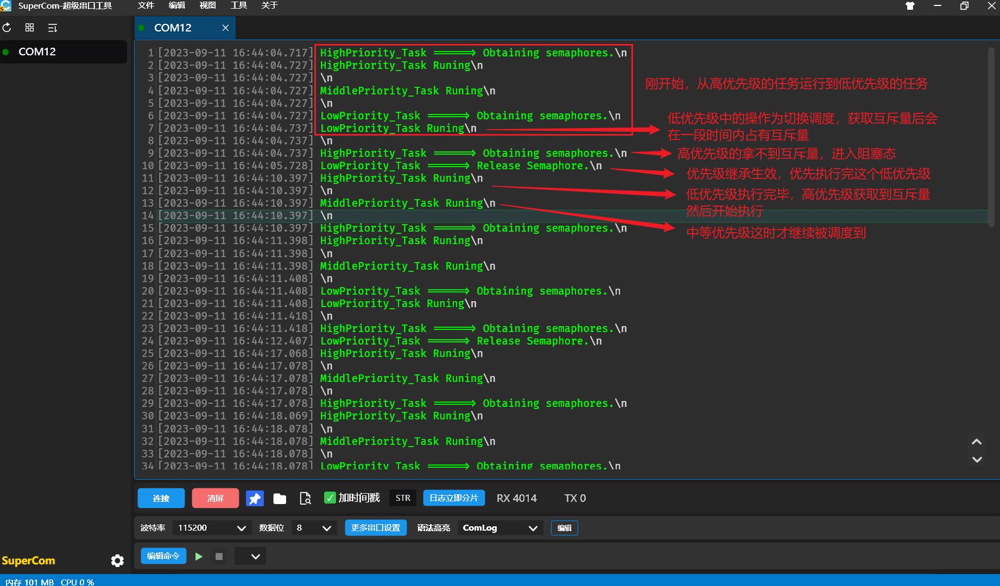

代码：

0、在`FreeRTOSConfig.h`配置文件中添加以下：

```c
#define configSUPPORT_DYNAMIC_ALLOCATION 1
#define configUSE_MUTEXES 1
```

1、STM32F103C8_BSP.c：和上面一样。

2、main.c：与上面的差不多，将二值信号量改为互斥量即可。

```c
#include "stm32f10x.h"                  // Device header
#include "FreeRTOS.h"
#include "task.h"
#include "STM32F103C8_BSP.h"
#include "semphr.h"

static void STM32F103_Init(void)
{
	NVIC_PriorityGroupConfig(NVIC_PriorityGroup_2);
    USART1_Init();
}
/* 定义互斥量句柄 */
SemaphoreHandle_t MuxSem_Handle = NULL;

/* 声明任务 */
void LowPriority_Task(void);
void MiddlePriority_Task(void);
void HighPriority_Task(void);

int main(void) 
{
    STM32F103_Init();
    taskENTER_CRITICAL();
    /* 互斥量 */
    MuxSem_Handle = xSemaphoreCreateMutex();
    xSemaphoreGive(MuxSem_Handle);
    /* 创建任务 */
    xTaskCreate((TaskFunction_t)LowPriority_Task, "LowPriority_Task",512, NULL, 2, NULL);
    xTaskCreate((TaskFunction_t)MiddlePriority_Task, "MiddlePriority_Task",512, NULL, 3, NULL);
    xTaskCreate((TaskFunction_t)HighPriority_Task, "HighPriority_Task",512, NULL, 4, NULL);
    vTaskStartScheduler();
    taskEXIT_CRITICAL();
    while(1);
}

void LowPriority_Task(void)
{
    static uint32_t i;
    BaseType_t xReturn = pdPASS;
    while(1){
        USART1_SendString("LowPriority_Task ======> Obtaining semaphores.\n");
        xReturn = xSemaphoreTake(MuxSem_Handle, portMAX_DELAY);
        /* 获取信号量成功，则任务开始执行后续处理 */
        if ( xReturn == pdTRUE )
            USART1_SendString("LowPriority_Task Runing\n\n");
        /* 模拟低优先级任务占用信号量, 发起任务调度 */
        for (i=0; i < 2000000; i++){ 
            taskYIELD();
        }
        USART1_SendString("LowPriority_Task ======> Release Semaphore.\n");
        xReturn = xSemaphoreGive(MuxSem_Handle);
        vTaskDelay(1000);
    }
}

void MiddlePriority_Task(void)
{
    while(1){
        USART1_SendString("MiddlePriority_Task Runing\n\n");
        vTaskDelay(1000);
    }
}
void HighPriority_Task(void)
{
    BaseType_t xReturn = pdTRUE;
    while(1){
        USART1_SendString("HighPriority_Task ======> Obtaining semaphores.\n");
        xReturn = xSemaphoreTake(MuxSem_Handle, portMAX_DELAY);
        /* 获取信号量成功，则任务开始执行后续处理 */
        if (xReturn == pdTRUE)
            USART1_SendString("HighPriority_Task Runing\n\n");
        /* 释放二值信号量 */
        xReturn = xSemaphoreGive(MuxSem_Handle);
        vTaskDelay(1000);
    }
}
```

END

# FreeRTOS学习篇七：事件

## 1.理解基本概念

事件：事件 → 触发任务；可以将事件看作是一种标记，对应的任务需要这种标记来进入就绪态，当这种标记被激活，所对应的任务就会被唤醒，进入就绪态；如果没有被激活，那对应的任务就会处于阻塞态，等待事件触发。

>事件是一种实现任务间通信的机制，主要用于实现多任务间的同步，但事件通信只能是事件类型的通信，无数据传输。与信号量不同的是，它可以实现一对多、多对多的同步。即一个任务可以等待多个事件的发生：可以是任意一个事件发生时唤醒任务进行事件处理；也可以是几个事件都发生后才唤醒任务进行事件处理。
>
>同样，也可以是多个任务同步多个事件。  

事件组（事件标志组）：一组事件，即不同事件的集合体，通过设置和清除特定的位来表示不同的事件状态，任务可以通过等待或等待指定的事件标志组来同步。

- 事件组存储在一个`EventBits_t`类型的变量中，该变量在事件组结构体中定义，每一个事件组需要占用很少的RAM空间来保存状态，状态信息存储在变量`uxEventBits`中。

- 事件组的存储：

  如果宏`configUSE_16_BIT_TICKS`定义为1，那么变量`uxEventBits`就是16位的，其中有8个位用来存储事件组。
  如果宏`configUSE_16_BIT_TICKS`定义为0，那么变量`uxEventBits`就是32位的，其中有24个位用来存储事件组。

- STM32中，通常将`configUSE_16_BIT_TICKS`定义为0，即`uxEventBits`是32位的，也就是有24个位都用来实现事件标志组，每一位都代表着一个事件，任务可通过“逻辑与”或“逻辑或”与一个或多个事件建立关联，形成多事件对一任务的关系。

事件的两种同步：

- 独立型同步：即事件的“逻辑或”，任务感兴趣的所有事件，只要任意一个发生就可以将任务唤醒。
- 关联型同步：即事件的“逻辑与”，任务感兴趣的若干事件都发生时才能将任务唤醒，并且事件发生的时间可以不同步。

两种事件同步模型：

- 一对多同步模型：比较常见的一种模型，即一个任务需要多个事件来触发。
- 多对多同步模型：多个任务等待多个事件的触发。

>FreeRTOS的事件的特点：
>
>1. 事件只与任务相关联，事件相互独立，一个32位的事件集合（EventBits_t 类型的变量，实际可用与表示事件的只有24位），用于标识该任务发生的事件类型，其中每一位表示一种事件类型（0表示该事件类型未发生、1表示该事件类型已经发生），一共24种事件类型。
>2. 事件仅用于同步，不提供数据传输功能。
>3. 事件无排队性，即多次向任务设置同一事件(如果任务还未来得及读走)，等效于只设置一次。
>4. 允许多个任务对同一事件进行读写操作。  
>5. 支持事件等待超时机制。  

## 2.事件的应用场景

1. 可用做标志位。
2. 在一定程度上可替代信号量，用于任务与任务间、中断与任务间的同步。

## 3.事件的运作机制

1. 任务接收事件，接收感兴趣的单个或者多个事件类型。任务接收事件成功后，需要使用xClearOnExit选项来清除已接收到的事件类型，否则不会清除已接收到的事件，这样就需要手动去清除事件位。另外通过传入参数xWaitForAllBits可选择事件读取模式。
2. 设置事件时，需要对指定事件写入指定的事件类型、设置事件集合的对应事件位为1。可以一次同时写多个事件类型，设置事件成功可能会触发任务调度。
3. 清除事件时，根据传入的事件句柄和待清除的事件类型，可以对事件对应位进行清0操作。
4. 事件是独立的，事件不是和任务绑定的，任务只是接收事件，就像在等待标志位变为true，使得可以执行if判断里面的代码一样。
5. 一个32位的变量（事件集合，实际用于表示事件的只有24位，一共24种事件类型），用于标识任务发生的事件类型，其中每一位表示一种事件类型（0 表示该事件类型未发生、 1 表示该事件类型已经发生）。

事件唤醒机制：

- 任务等待事件发生时，任务将进入阻塞态。
- 任务所等待的事件发生后，任务将由阻塞态转为就绪态，此时任务被唤醒。

## 4.事件操作常用函数

### ①事件创建函数

xEventGroupCreate()：

```c
/* 用于创建一个事件组，返回一个事件组句柄 */
EventGroupHandle_t xEventGroupCreate(void);
```

要想使用该函数必须在头文件 FreeRTOSConfig.h 定义宏 `configSUPPORT_DYNAMIC_ALLOCATION`为1（在FreeRTOS.h中默认定义为1）。且需要把`FreeRTOS/source/event_groups.c` 这个C文件添加到工程中。

`xEventGroupCreateStatic()`：静态分配。

### ②事件删除函数

vEventGroupDelete()：

```c
/* 用于删除一个事件组，传入事件组句柄即可 */
void vEventGroupDelete(EventGroupHandle_t xEventGroup);
```

> vEventGroupDelete()用于删除由函数xEventGroupCreate()创建的事件组， 只有被创建成功的事件组才能被删除，该函数不允许在中断中使用。 当事件组被删除之后，阻塞在该事件组上的任务都会被解锁，并向等待事件的任务返回事件组的值，值为0。

### ③事件组置位函数

1、xEventGroupSetBits()：任务中使用

```c
/* 用于将事件组中指定的位设置为1 */
EventBits_t xEventGroupSetBits( EventGroupHandle_t xEventGroup,
const EventBits_t uxBitsToSet );
```

- 形参xEventGroup：事件句柄。
- 形参uxBitsToSet：指定事件中的事件标志位。如设置`uxBitsToSet`为0x08则只置位位3，如果设置`uxBitsToSet`为0x09则位3和位0都会被置位。
- 返回值：返回在调用xEventGroupSetBits()时事件组中的值。

xEventGroupSetBits()用于置位事件组中指定的位，当位被置位之后，阻塞在该位上的任务将会被解锁。不能用于中断。


2、xEventGroupSetBitsFromISR()：中断中使用

```c
/* 用于将事件组中指定的位设置为1 */
BaseType_t xEventGroupSetBitsFromISR(EventGroupHandle_t xEventGroup,
const EventBits_t uxBitsToSet,
BaseType_t *pxHigherPriorityTaskWoken);
```

>- 形参xEventGroup：事件句柄。
>- 形参uxBitsToSet：指定事件组中的哪些位需要置位。如设置 uxBitsToSet 为0x08 则只置位位 3， 如果设置 uxBitsToSet 为 0x09 则位 3和位 0 都需要被置位。
>- 形参pxHigherPriorityTaskWoken：pxHigherPriorityTaskWoken在使用之前必须初始化成pdFALSE。调用 xEventGroupSetBitsFromISR()会给守护任务发送一个消息， 如果守护任务的优先级高于当前被中断的任务的优先级的话（一般情况下都需要将守护任务的优先级设置为所有任务中最高优先级），pxHigherPriorityTaskWoken会被置为pdTRUE，然后在中断退出前执行一次上下文切换。
>
>返回值：消息成功发送给守护任务之后则返回pdTRUE，否则返回 pdFAIL。如果定时器服务队列满了将返回pdFAIL。

要想使用该函数，必须把`configUSE_TIMERS`和`INCLUDE_xTimerPendFunctionCall`这些宏在FreeRTOSConfig.h中都定义为1，并且把
`FreeRTOS/source/event_groups.c`这个C文件添加到工程中编译。 


### ④事件等待函数

xEventGroupWaitBits()：通过这个函数，任务可以知道事件标志组中的（哪些位）什么事件发生了，也就是那些位是1，用于判断出哪个事件发生。

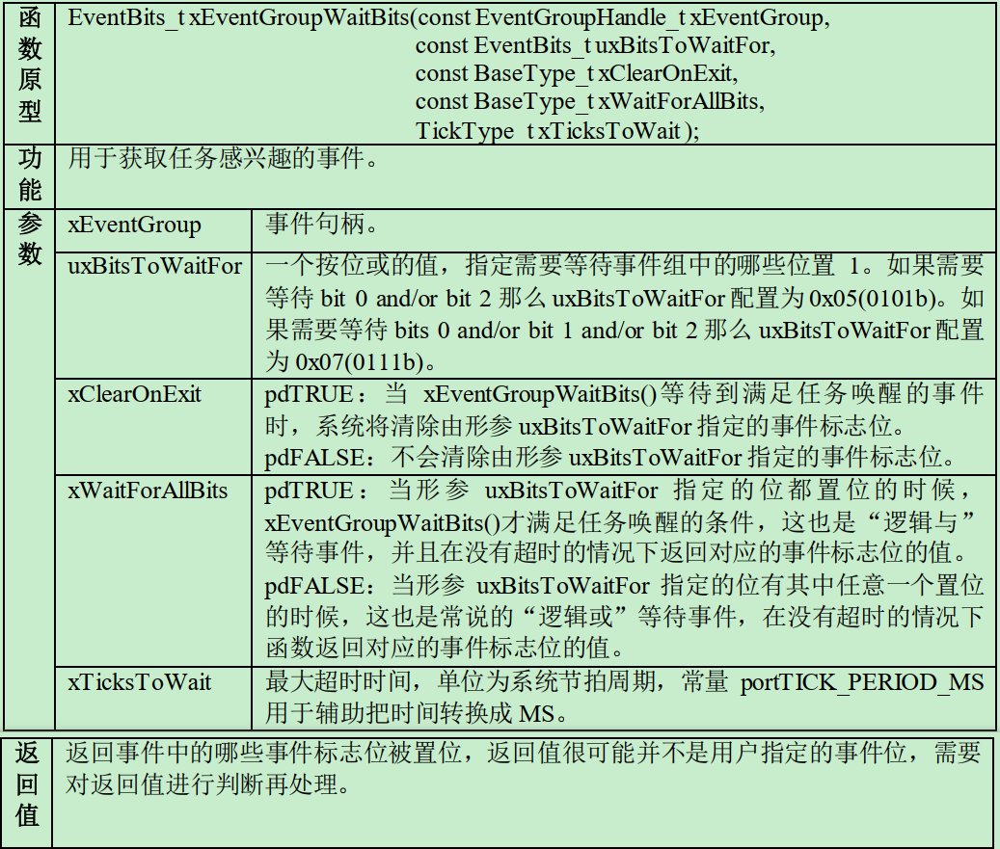

```c
/* 使用示例 */
static void LED_Task(void* parameter)
{
	EventBits_t r_event; /* 定义一个事件接收变量 */
	while (1) {
		/* 等待接收事件标志 */
	
		r_event = xEventGroupWaitBits(Event_Handle, /* 事件对象句柄 */
		KEY1_EVENT|KEY2_EVENT,/* 接收任务感兴趣的事件 */
		pdTRUE, /* 退出时清除事件位 */
		pdTRUE, /* 满足感兴趣的所有事件 */
		portMAX_DELAY);/* 指定超时事件,一直等 */
		/* 取出标志位并判断是否符合 */
		if ((r_event & (KEY1_EVENT | KEY2_EVENT)) == (KEY1_EVENT | KEY2_EVENT)) {
            /* 事件处理 */
		} else {
            /* error  */
        }
	}
}
```


### ⑤位清除函数

1、xEventGroupClearBits()：

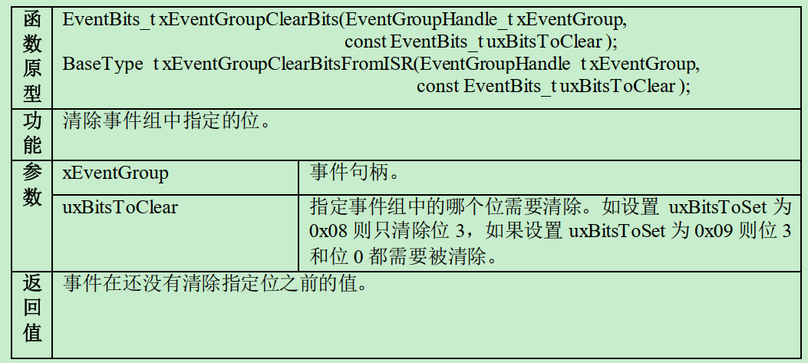

```c
/* 使用示例 */
#define BIT_0 (1 << 0)
#define BIT_4 (1 << 4)

void aFunction(EventGroupHandle_t xEventGroup)
{
	EventBits_t uxBits;

	/* 清除事件组的 bit 0 and bit 4，1则清除 */
	uxBits = xEventGroupClearBits(xEventGroup, BIT_0 | BIT_4);

	if ((uxBits & (BIT_0 | BIT_4)) == (BIT_0 | BIT_4)) {
		/* 在调用 xEventGroupClearBits()之前 bit0 和 bit4 都置位但是现在是被清除了*/
	} else if ((uxBits & BIT_0) != 0) {
		/* 在调用 xEventGroupClearBits()之前 bit0 已经置位但是现在是被清除了*/
	} else if ((uxBits & BIT_4) != 0 ) {
		/* 在调用 xEventGroupClearBits()之前 bit4 已经置位但是现在是被清除了*/
	} else {
		/* 在调用 xEventGroupClearBits()之前 bit0 和 bit4 都没被置位 */
	}
}
```


2、xEventGroupClearBitsFromISR()：

中断中使用，要使用该函数需要将`configTIMER_TASK_PRIORITY  `定义为1。


## 5.使用示例

示例：PA0的按键0 —— 事件1，触发LED灯亮；PA2的按键1 —— 事件2，触发LED等灭；通过串口输出信息。

最终效果：按下按键1，事件1被触发，点亮LED；按下按键2，时间2被触发，点亮LED；事件1、事件2都被触发后，关掉LED。

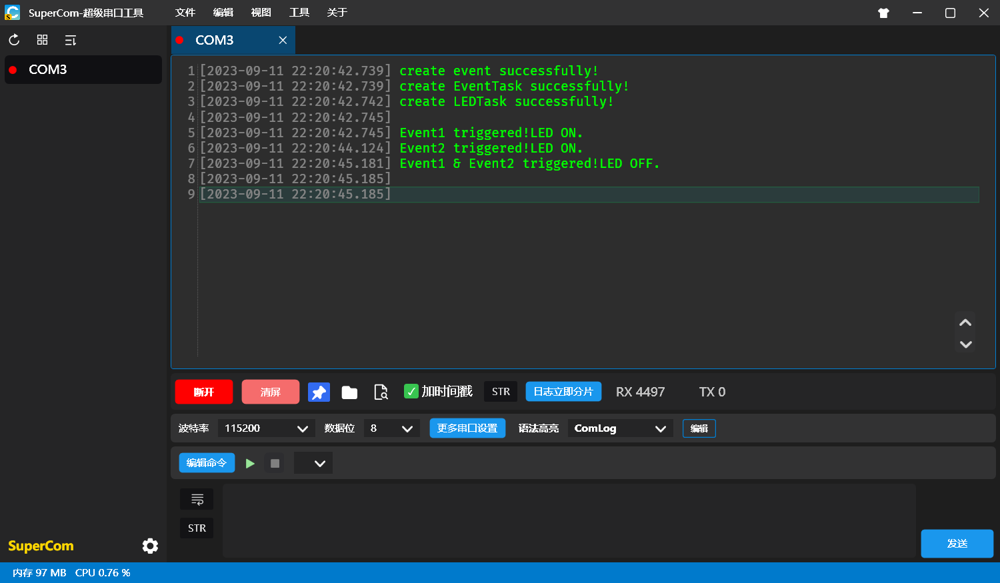

代码：

0、在`FreeRTOSConfig.h`配置文件中添加以下：

```c
#define configSUPPORT_DYNAMIC_ALLOCATION 1
```

1、STM32F103C8_BSP.c：

```c
#include "stm32f10x.h"                  // Device header
void USART1_Init(void)
{
    RCC_APB2PeriphClockCmd(RCC_APB2Periph_USART1, ENABLE);
    RCC_APB2PeriphClockCmd(RCC_APB2Periph_GPIOA,ENABLE);
    
    GPIO_InitTypeDef GPIO_InitStruct;
    GPIO_InitStruct.GPIO_Mode = GPIO_Mode_AF_PP;
    GPIO_InitStruct.GPIO_Pin = GPIO_Pin_9;
    GPIO_InitStruct.GPIO_Speed = GPIO_Speed_50MHz;
    GPIO_Init(GPIOA, &GPIO_InitStruct);
    GPIO_InitStruct.GPIO_Mode = GPIO_Mode_IPU;
    GPIO_InitStruct.GPIO_Pin = GPIO_Pin_10;
    GPIO_Init(GPIOA, &GPIO_InitStruct);
    
    USART_InitTypeDef USART_InitStruct;
    USART_InitStruct.USART_BaudRate = 115200;
    USART_InitStruct.USART_HardwareFlowControl = USART_HardwareFlowControl_None;
    USART_InitStruct.USART_Mode = USART_Mode_Rx | USART_Mode_Tx;
    USART_InitStruct.USART_Parity = USART_Parity_No;
    USART_InitStruct.USART_StopBits = USART_StopBits_1;
    USART_InitStruct.USART_WordLength = USART_WordLength_8b;
    USART_Init(USART1, &USART_InitStruct);
    
    USART_Cmd(USART1, ENABLE);
}
void KEY_GPIO_Init(void)
{
    RCC_APB2PeriphClockCmd(RCC_APB2Periph_GPIOA,ENABLE);
    
    GPIO_InitTypeDef GPIO_InitStruct;
    GPIO_InitStruct.GPIO_Mode = GPIO_Mode_IPD;
    GPIO_InitStruct.GPIO_Pin = GPIO_Pin_0 | GPIO_Pin_2;
    GPIO_InitStruct.GPIO_Speed = GPIO_Speed_50MHz;
    GPIO_Init(GPIOA, &GPIO_InitStruct);
}
void LED_GPIO_Init(void)
{
    RCC_APB2PeriphClockCmd(RCC_APB2Periph_GPIOC,ENABLE);
    
    GPIO_InitTypeDef GPIO_InitStruct;
    GPIO_InitStruct.GPIO_Mode = GPIO_Mode_Out_PP;
    GPIO_InitStruct.GPIO_Pin = GPIO_Pin_13;
    GPIO_InitStruct.GPIO_Speed = GPIO_Speed_50MHz;
    GPIO_Init(GPIOC, &GPIO_InitStruct);
    GPIO_SetBits(GPIOC, GPIO_Pin_13);
}

void USART1_SendByte(uint8_t byte){
    USART_SendData(USART1, byte);
    while(USART_GetFlagStatus(USART1, USART_FLAG_TXE) == RESET);
}
void USART1_SendString(char* str)
{
    uint16_t i;
    for(i = 0; str[i] != '\0'; i++){
        USART1_SendByte(*(str+i));
    }
}

uint8_t KEY_Scan(GPIO_TypeDef* GPIOx, uint16_t GPIO_Pin)
{
    if(GPIO_ReadInputDataBit(GPIOx, GPIO_Pin) == 1){
        while(GPIO_ReadInputDataBit(GPIOx, GPIO_Pin) == 1);
        return 1;
    }
    return 0;
}
```


2、main.c：

```c
#include "stm32f10x.h"                  // Device header
#include "FreeRTOS.h"
#include "task.h"
#include "STM32F103C8_BSP.h"
#include "semphr.h"
#include "event_groups.h"

static void STM32F103_Init(void)
{
	NVIC_PriorityGroupConfig(NVIC_PriorityGroup_2);
    USART1_Init();
    KEY_GPIO_Init();
    LED_GPIO_Init();
}
/* 定义两个事件 */
#define KEY1_EVENT (0x01 << 0) // 位0
#define KEY2_EVENT (0x01 << 1) // 位1

/* 定义事件句柄 */
EventGroupHandle_t Event_Handle;

/* 声明任务 */
void EventTask(void);
void LEDTask(void);

int main(void) 
{
    STM32F103_Init();
    taskENTER_CRITICAL();
    /* 创建事件 */
    Event_Handle = xEventGroupCreate();
    if(Event_Handle != NULL)
        USART1_SendString("create event successfully!\n");
    /* 创建任务 */
    xTaskCreate((TaskFunction_t)EventTask, "EventTask", 512, NULL, 3, NULL);
    USART1_SendString("create EventTask successfully!\n");
    xTaskCreate((TaskFunction_t)LEDTask, "LEDTask", 512, NULL, 2, NULL);
    USART1_SendString("create LEDTask successfully!\n\n");
    vTaskStartScheduler();
    taskEXIT_CRITICAL();
    while(1);
}
void EventTask(void)
{
    while(1){
        if(KEY_Scan(GPIOA, GPIO_Pin_0) == 1){
            /* 按钮按下，按钮1事件被触发，将位0置为1 */
            xEventGroupSetBits(Event_Handle, KEY1_EVENT);
            GPIO_ResetBits(GPIOC, GPIO_Pin_13);
            USART1_SendString("Event1 triggered!LED ON.\n");
        }
        if(KEY_Scan(GPIOA, GPIO_Pin_2) == 1){
            /* 按钮按下，按钮2事件被触发，将位1置为1 */
            xEventGroupSetBits(Event_Handle, KEY2_EVENT);
            GPIO_ResetBits(GPIOC, GPIO_Pin_13);
            USART1_SendString("Event2 triggered!LED ON.\n");
        }
        vTaskDelay(20);
    }
}

void LEDTask(void)
{
    EventBits_t r_event;
    while(1){
        r_event = xEventGroupWaitBits(Event_Handle, KEY1_EVENT | KEY2_EVENT,
        pdTRUE, pdTRUE, portMAX_DELAY);
        if((r_event & (KEY1_EVENT|KEY2_EVENT)) == (KEY1_EVENT|KEY2_EVENT)){
            USART1_SendString("Event1 & Event2 triggered!LED OFF.\n\n");
            GPIO_SetBits(GPIOC, GPIO_Pin_13);
        }
        vTaskDelay(20);
    }
}
```

END

# FreeRTOS学习篇八：软件定时器

## 1.理解基本概念

>**定时器概念：**
>
>定时器，是指从指定的时刻开始，经过一个指定时间，然后触发一个超时事件，用户可以自定义定时器的周期与频率。类似生活中的闹钟，我们可以设置闹钟每天什么时候响，还能设置响的次数，是响一次还是每天都响。  
>
>硬件定时器是芯片本身提供的定时功能。一般是由外部晶振提供给芯片输入时钟，芯片向软件模块提供一组配置寄存器，接受控制输入，到达设定时间值后芯片中断控制器产生时钟中断。硬件定时器的精度一般很高，可以达到纳秒级别，并且是中断触发方式。  
>
>软件定时器，软件定时器是由操作系统提供的一类系统接口，它构建在硬件定时器基础之上，使系统能够提供不受硬件定时器资源限制的定时器服务，它实现的功能与硬件定时器也是类似的。  
>
>- 使用硬件定时器时，每次在定时时间到达之后就会自动触发一个中断，用户在中断中处理信息。
>- 使用软件定时器时，需要在创建软件定时器时指定时间到达后要调用的函数（也称超时函数/回调函数），在回调函数中处理信息。  

>- 软件定时器回调函数的上下文是任务。
>- 软件定时器在被创建之后，当经过设定的时钟计数值后会触发用户定义的回调函数。
>- 定时精度与系统时钟的周期有关。
>- 一般系统利用 SysTick 作为软件定时器的基础时钟， 软件定时器的回调函数类似硬件的中断服务函数，所以， 回调函数也要快进快出，而且回调函数中不能有任何阻塞任务运行的情况（软件定时器回调函数的上下文环境是任务） ，比如 vTaskDelay()以及其它能阻塞任务运行的函数 。
>- 两次触发回调函数的时间间隔xTimerPeriodInTicks 叫定时器的定时周期。  

>FreeRTOS 操作系统提供软件定时器功能，软件定时器的使用相当于扩展了定时器的数量，允许创建更多的定时业务。 FreeRTOS 软件定时器功能上支持：
>
>- 裁剪：能通过宏关闭软件定时器功能。
>- 软件定时器创建。
>- 软件定时器启动。
>- 软件定时器停止。
>- 软件定时器复位。
>- 软件定时器删除。  
>
>FreeRTOS 软件定时器的两种模式：
>
>- 单次模式：当用户创建了定时器并启动了定时器后，定时时间到了，只执行一次回调函数之后就将该定时器进入休眠状态，不再重新执行。
>- 周期模式：这个定时器会按照设置的定时时间循环执行回调函数，直到用户将定时器删除。  

>启用FreeRTOS定时器：
>
>FreeRTOS 通过一个 prvTimerTask 任务（也叫守护任务 Daemon）管理软件定时器，它是在启动调度器时自动创建的。 prvTimerTask 任务会在其执行期间检查用户启动的时间周期溢出的定时器，并调用其回调函数。 只有将`FreeRTOSConfig.h`中的宏定义`configUSE_TIMERS`设置为 1 ，将相关代码编译进来，才能正常使用软件定时器相关功能。  

## 2.应用场景

>在很多应用中，我们需要一些定时器任务，硬件定时器受硬件的限制，数量上不足以满足用户的实际需求，无法提供更多的定时器，那么可以采用软件定时器来完成，由软件定时器代替硬件定时器任务。 但需要注意的是软件定时器的精度是无法和硬件定时器相比的， 而且在软件定时器的定时过程中是极有可能被其它中断所打断，因为软件定时器的执行上下文环境是任务。所以，软件定时器更适用于对时间精度要求不高的任务，一些辅助型的任务。  
>
>《FreeRTOS内核实现与应用开发实战——基于STM32》  P336

用于当硬件定时器不够用，并且任务对时间精度要求不高时。

## 3.软件定时器的精度

系统节拍：

- 通常软件定时器以系统节拍周期为计时单位，系统节拍配置为`configTICK_RATE_HZ`，该宏在`FreeRTOSConfig.h`中有定义，默认是1000，意为1s内跳动1000次，也就是系统节拍周期为1ms。
- 软件定时器的所定时数值必须是这个节拍周期的整数倍。
- 系统节拍越小，精度也就越高，但是系统开销也将越大，因为这代表在 1 秒中系统进入时钟中断的次数也就越多。

## 4.使用注意事项

>使用软件定时器时候要注意以下几点：
>
>- 软件定时器的回调函数中应快进快出，绝对不允许使用任何可能引软件定时器起任务挂起或者阻塞的 API 接口，在回调函数中也绝对不允许出现死循环。
>- 软件定时器使用了系统的一个队列和一个任务资源，软件定时器任务的优先级默认为`configTIMER_TASK_PRIORITY`，为了更好响应，该优先级应设置为所有任务中最高的优先级。
>- 创建单次软件定时器，该定时器超时执行完回调函数后，系统会自动删除该软件定时器，并回收资源。
>- 定时器任务的堆栈大小默认为`configTIMER_TASK_STACK_DEPTH`个字节。  

## 5.常用函数

### ①创建定时器

xTimerCreate()：

```c
/* 创建定时器，返回定时器句柄 */
TimerHandle_t xTimerCreate(const char * const pcTimerName, 
const TickType_t xTimerPeriodInTicks,
const UBaseType_t uxAutoReload, 
void * const pvTimerID,
TimerCallbackFunction_t pxCallbackFunction);
```

- 形参pcTimerName：软件定时器的名字，调试用的。

- 形参xTimerPeriodInTicks：软件定时器周期，单位为系统节拍周期。

  >`pdMS_TO_TICKS()`可以把时间单位从 ms 转换为系统节拍周期。 如果软件定时器的周期为100 个 tick， 那么只需要简单的设置 `xTimerPeriod `的值为 100 即可。如果软件定时器的周期为 500ms， 那么 `xTimerPeriod` 应设置为 `pdMS_TO_TICKS(500)`。 宏 pdMS_TO_TICKS()只有当 `configTICK_RATE_HZ` 配置成小于或者等于 1000HZ 时才可以使用。  

- 形参uxAutoReload：自动重装，即设置定时器模式，周期运行还是单次运行。pdTRUE —— 周期运行，pdFALSE —— 单次运行。

- 形参pvTimerID：软件定时器 ID， 数字形式。 该 ID 典型的用法是当一个回调函数分配给一个或者多个软件定时器时，在回调函数里面根据 ID 号来处理不同的软件定时器。

- 形参pxCallbackFunction：软件定时器的回调函数， 当定时时间到达的时候就会调用这个函数。

要想使用该函数函数必须在头文件`FreeRTOSConfig.h`中把宏`configUSE_TIMERS`和`configSUPPORT_DYNAMIC_ALLOCATION`均定义为1， 并且需要把`times.c` 这个C文件添加到工程中。

将`configUSE_TIMERS`设置为1后还需要设置以下：

```c
/* 定时器守护任务的优先级 */
#define configTIMER_TASK_PRIORITY (configMAX_PRIORITIES-1)       
/* 定时器队列的长度 */
#define configTIMER_QUEUE_LENGTH 10        
/* 定时器任务的栈深度，即要为定时器任务分配的内存大小 */
#define configTIMER_TASK_STACK_DEPTH (configMINIMAL_STACK_SIZE*2)  
```

定时器创建完成处于休眠状态，需要调用启动函数使定时器运行。

静态创建：`xTimerCreateStatic()  `。

### ②启动定时器

1、xTimerStart()：

```c
/* 传入定时器句柄，启动定时器 */
#define xTimerStart(xTimer, xTicksToWait) 
xTimerGenericCommand((xTimer), tmrCOMMAND_START, (xTaskGetTickCount()), NULL, (xTicksToWait));
```

2、xTimerStartFromISR()：

```c
/* 中断中启动定时器 */
#define xTimerStartFromISR(xTimer, pxHigherPriorityTaskWoken)
xTimerGenericCommand((xTimer), tmrCOMMAND_START_FROM_ISR,
(xTaskGetTickCountFromISR()),
(pxHigherPriorityTaskWoken), 0U);
/*
形参pxHigherPriorityTaskWoken，会被设置为pdTRUE或pdFALSE
如果定时器守护任务的优先级大于或者等于当前被中断的任务的优先级，那么 pxHigherPriorityTaskWoken 的值会在函数
xTimerStartFromISR()内部设置为 pdTRUE，然后在中断退出之前执行一次上下文切换。
*/
```

- 返回值：pdFAILE或pdPASS。

```c
/* 使用示例 */
 void vKeyPressEventInterruptHandler( void )
{
	BaseType_t xHigherPriorityTaskWoken = pdFALSE;
	/* 启动软件定时器 */
	if (xTimerStartFromISR(xBacklightTimer, &xHigherPriorityTaskWoken) != pdPASS) {
    	/* 软件定时器开启命令没有成功执行 */
	}
	if (xHigherPriorityTaskWoken != pdFALSE) {
		/* 执行上下文切换 */
	}
}
```


### ③暂停定时器

1、xTimerStop()：

```c
/* 传入定时器句柄，暂停定时器，使其进入休眠状态 */
BaseType_t xTimerStop(TimerHandle_t xTimer, TickType_t xBlockTime);
/*
形参xBlockTime：指定超时时间
返回值：pdFAIL、pdPASS
*/
```

要想使函数xTimerStop()必须在头文件`FreeRTOSConfig.h`中把宏 `configUSE_TIMERS`定义为1。

2、xTimerStopFromISR()：

```c
/* 中断中暂停定时器 */
BaseType_t xTimerStopFromISR(TimerHandle_t xTimer,
BaseType_t *pxHigherPriorityTaskWoken);
/*
形参pxHigherPriorityTaskWoken，会被设置为pdTRUE或pdFALSE
如果定时器守护任务的优先级大于或者等于当前被中断的任务的优先级，那么 pxHigherPriorityTaskWoken 的值会在函数
xTimerStopFromISR()内部设置为 pdTRUE，然后在中断退出之前执行一次上下文切换。
*/
```

```c
/* 使用示例 */
/* 停止软件定时器的中断服务函数*/
void vAnExampleInterruptServiceRoutine( void )
{
	BaseType_t xHigherPriorityTaskWoken = pdFALSE;
	if (xTimerStopFromISR(xTimer, &xHigherPriorityTaskWoken) != pdPASS) {
		/* 软件定时器停止命令没有成功执行 */
	}
	if (xHigherPriorityTaskWoken != pdFALSE) {
		/* 执行上下文切换 */
	}
}
```


### ④删除定时器

xTimerDelete()：

```c
/* 传入句柄，删除定时器 */
#define xTimerDelete(xTimer, xTicksToWait)
xTimerGenericCommand((xTimer),
tmrCOMMAND_DELETE, 0U, NULL, (xTicksToWait));
/*
形参xTicksToWait：指定超时时间，单位为系统节拍周期(即 tick)，如果在FreeRTOS调度器开启之前调用了xTimerStart()，该形参将不起作用。
返回值：pdPASS、pdFAILE
*/
```

要想使函数 xTimerStop()必须在头文件`FreeRTOSConfig.h`中把宏`configUSE_TIMERS`定义为1。  

## 6.软件定时器任务

软件定时器任务在启动调度器之前被创建，前提是要将`FreeRTOSConfig.h`中的宏定义` configUSE_TIMERS`设置为1。

在调用xTimerCreate()时，指定好了定时器回调函数，由系统帮创建好这个回调函数任务，并不需要手动去调用xTaskCreate()来创建好任务。


## 7.使用示例

示例：在 FreeRTOS 中创建了两个软件定时器，其中一个软件定时器是单次模式， 5000个tick 调用一次回调函数，另一个软件定时器是周期模式， 1000个tick 调用一次回调函数，在回调函数中输出相关信息。

结果：


代码：

0、在`FreeRTOSConfig.h`配置文件中添加以下：

```c
#define configSUPPORT_DYNAMIC_ALLOCATION 1
/* 定时器相关配置 */
#define configUSE_TIMERS 1
#define configTIMER_TASK_PRIORITY (configMAX_PRIORITIES-1)  
#define configTIMER_QUEUE_LENGTH  10
#define configTIMER_TASK_STACK_DEPTH (configMINIMAL_STACK_SIZE*2)  
```

1、`STM32F103C8_BSP.c`：

```c
#include "stm32f10x.h"                  // Device header

void USART1_Init(void)
{
    RCC_APB2PeriphClockCmd(RCC_APB2Periph_USART1, ENABLE);
    RCC_APB2PeriphClockCmd(RCC_APB2Periph_GPIOA,ENABLE);
    
    GPIO_InitTypeDef GPIO_InitStruct;
    GPIO_InitStruct.GPIO_Mode = GPIO_Mode_AF_PP;
    GPIO_InitStruct.GPIO_Pin = GPIO_Pin_9;
    GPIO_InitStruct.GPIO_Speed = GPIO_Speed_50MHz;
    GPIO_Init(GPIOA, &GPIO_InitStruct);
    GPIO_InitStruct.GPIO_Mode = GPIO_Mode_IPU;
    GPIO_InitStruct.GPIO_Pin = GPIO_Pin_10;
    GPIO_Init(GPIOA, &GPIO_InitStruct);
    
    USART_InitTypeDef USART_InitStruct;
    USART_InitStruct.USART_BaudRate = 115200;
    USART_InitStruct.USART_HardwareFlowControl = USART_HardwareFlowControl_None;
    USART_InitStruct.USART_Mode = USART_Mode_Rx | USART_Mode_Tx;
    USART_InitStruct.USART_Parity = USART_Parity_No;
    USART_InitStruct.USART_StopBits = USART_StopBits_1;
    USART_InitStruct.USART_WordLength = USART_WordLength_8b;
    USART_Init(USART1, &USART_InitStruct);
    
    USART_Cmd(USART1, ENABLE);
}
void USART1_SendByte(uint8_t byte){
    USART_SendData(USART1, byte);
    while(USART_GetFlagStatus(USART1, USART_FLAG_TXE) == RESET);
}
uint32_t Serial_Pow(uint32_t X, uint8_t Y){
	uint32_t Result = 1;
	while(Y--)	
		Result *= X;
	return Result;
}
// 取出数字各位的数并转为char形式数据来发送
void USART1_SendStringNumber(uint32_t Number, uint8_t Length)
{
	uint16_t i;
	for(i = 0; i < Length; i++) {
		// Number=321 Length=3，则会将3、2、1的ASCII码依次发送出去
		USART1_SendByte(Number / Serial_Pow(10,Length - i - 1) % 10 + '0');
	}
}
void USART1_SendString(char* str)
{
    uint16_t i;
    for(i = 0; str[i] != '\0'; i++){
        USART1_SendByte(*(str+i));
    }
}
```

2、`main.c`：

```c
#include "stm32f10x.h"                  // Device header
#include "FreeRTOS.h"
#include "task.h"
#include "timers.h"
#include "STM32F103C8_BSP.h"

static void STM32F103_Init(void)
{
	NVIC_PriorityGroupConfig(NVIC_PriorityGroup_2);
    USART1_Init();
    KEY_GPIO_Init();
    LED_GPIO_Init();
}
/* 定义定时器句柄 */
TimerHandle_t Timer1_Handle = NULL;
TimerHandle_t Timer2_Handle = NULL;
/* 记录定时器执行次数 */
uint32_t Timer1_Count = 0;
uint32_t Timer2_Count = 0;
/* 定义定时器任务 */
void Timer1_Callback(void);
void Timer2_Callback(void);

int main(void)
{
    STM32F103_Init();
    taskENTER_CRITICAL();
    
    Timer1_Handle = xTimerCreate("Timer1-AutoReload", 1000, pdTRUE, (void*)1,
    (TimerCallbackFunction_t)Timer1_Callback);
    if(Timer1_Handle != NULL){
        /* 如果在启动调度程序之前调用 xTimerStart()，则忽略xTicksToWait，将其设置为0 */
        xTimerStart(Timer1_Handle, 0);
    }
    
    Timer2_Handle = xTimerCreate("Timer1-AutoReload", 5000, pdFALSE, (void*)1,
    (TimerCallbackFunction_t)Timer2_Callback);
    if(Timer2_Handle != NULL){
        /* 如果在启动调度程序之前调用 xTimerStart()，则忽略xTicksToWait，将其设置为0 */
        xTimerStart(Timer2_Handle, 0);
        
    }
    
    vTaskStartScheduler();
    taskEXIT_CRITICAL();
    while(1);
}
void Timer1_Callback(void)
{
    TickType_t tick_num1;
    Timer1_Count++;
    /* 获取滴答定时器的计数值 */
    tick_num1 = xTaskGetTickCount();
    USART1_SendString("Timer1_Callback executed ");
    USART1_SendStringNumber(Timer1_Count, 5);
    USART1_SendString(" times! ===>");
    USART1_SendString("Tick Timer1 Value = ");
    USART1_SendStringNumber(tick_num1, 5);
    USART1_SendString(".\n");
}

void Timer2_Callback(void)
{
    TickType_t tick_num2;
    Timer2_Count++;
    /* 获取滴答定时器的计数值 */
    tick_num2 = xTaskGetTickCount();
    USART1_SendString("Timer2_Callback executed ");
    USART1_SendStringNumber(Timer2_Count, 5);
    USART1_SendString(" times! ===>");
    USART1_SendString("Tick Timer2 Value = ");
    USART1_SendStringNumber(tick_num2, 5);
    USART1_SendString(".\n");
}
```

END

# FreeRTOS学习篇九：任务通知

## 1.任务通知基本概念

>FreeRTOS 从V8.2.0版本开始提供任务通知这个功能，每个任务都有一个32位的通知值，在大多数情况下，任务通知可以替代二值信号量、计数信号量、事件组， 也可以替代长度为1的队列（可以保存一个32位整数或指针值）。相对于以前使用FreeRTOS 内核通信的资源，必须创建队列、二进制信号量、计数信号量或事件组的情况，使用任务通知显然更灵活。 按照 FreeRTOS 官方的说法，使用任务通知比通过信号量等ICP通信方式解除阻塞的任务要快 45%，并且更加省 RAM 内存空间（使用GCC编译器， -o2 优化级别），任务通知的使用无需创建队列。 想要使用任务通知，必须将 FreeRTOSConfig.h 中的宏定义 `configUSE_TASK_NOTIFICATIONS`设置为 1，其实默认是为1的， 所以任务通知是默认使能的。
>
>FreeRTOS 提供以下几种方式发送通知给任务 ：
>
>- 发送通知给任务， 如果有通知未读，不覆盖通知值。
>- 发送通知给任务，直接覆盖通知值。
>- 发送通知给任务，设置通知值的一个或者多个位，可以当做事件组来使用。
>- 发送通知给任务，递增通知值，可以当做计数信号量使用。
>
>通过对以上任务通知方式的合理使用，可以在一定场合下替代FreeRTOS的信号量，队列、事件组等。当然，凡是都有利弊，不然的话FreeRTOS还要内核的IPC通信机制干嘛，消息通知虽然处理更快，RAM开销更小，但也有以下限制 ：
>
>- 只能有一个任务接收通知消息， 因为必须指定接收通知的任务。。
>- 只有等待通知的任务可以被阻塞， 发送通知的任务，在任何情况下都不会因为发送失败而进入阻塞态。  
>
>《FreeRTOS内核实现与应用开发实战——基于STM32》  P361
>
>（IPC，InterProcess Communication，进程间通信方式）

## 2.运作机制

1. 任务被创建的时候，任务通知也会被初始化。
2. 可以在任务中向指定任务发送通知，也可以在中断中向指定任务发送通知。
3. 只能在任务中可以等待通知，不能在中断中等待通知。
4. 任务等待通知时处于阻塞状态，可以设置阻塞超时时间。

## 3.常用函数

### ①发送任务通知

FreeRTOS中发送任务通知的函数有6个，但实际只能完成三种发送操作，这三种操作又分为了带中断保护的和不带中断保护的。任务中发送任务通知的函数均是调用xTaskGenericNotify()函数来进行发送通知的。  

#### a.xTaskNotifyGive()  


该函数可以作为二值信号量和计数信号量的一种轻量型的实现，速度更快， 在这种情况下对象任务在等待任务通知的时候应该是使用函 数ulTaskNotifyTake() 而不是 xTaskNotifyWait() 。

```c
/* 使用示例 */
/* 任务声明 */
static void prvTask1(void *pvParameters);
static void prvTask2(void *pvParameters);
/*定义任务句柄 */
static TaskHandle_t xTask1 = NULL;
static TaskHandle_t xTask2 = NULL;
/* 主函数:创建两个任务，然后开始任务调度 */
void main( void )
{
	xTaskCreate(prvTask1, "Task1", 200, NULL, tskIDLE_PRIORITY, &xTask1);
	xTaskCreate(prvTask2, "Task2", 200, NULL, tskIDLE_PRIORITY, &xTask2);
	vTaskStartScheduler();
}
static void prvTask1( void *pvParameters )
{
	for ( ;; ) {
		/* 向 prvTask2()发送一个任务通知，让其退出阻塞状态 */
		xTaskNotifyGive( xTask2 );

		/* 等待通知 */
		ulTaskNotifyTake(pdTRUE, portMAX_DELAY);
	}
}
static void prvTask2( void *pvParameters )
{
	for ( ;; ) {
		/* 等待通知 */
		ulTaskNotifyTake( pdTRUE, portMAX_DELAY );
		/* 向 prvTask1()发送一个任务通知，让其退出阻塞状态 */
   		 xTaskNotifyGive( xTask1 );
	}
}
```


#### b.vTaskNotifyGiveFromISR()  

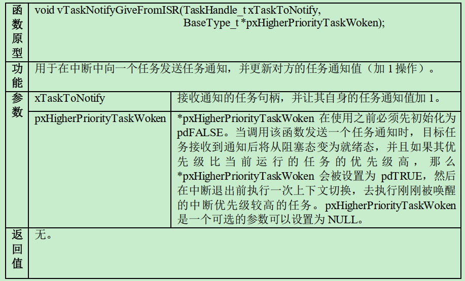

vTaskNotifyGiveFromISR()是vTaskNotifyGive()的中断保护版本。  

#### c.xTaskNotify()  


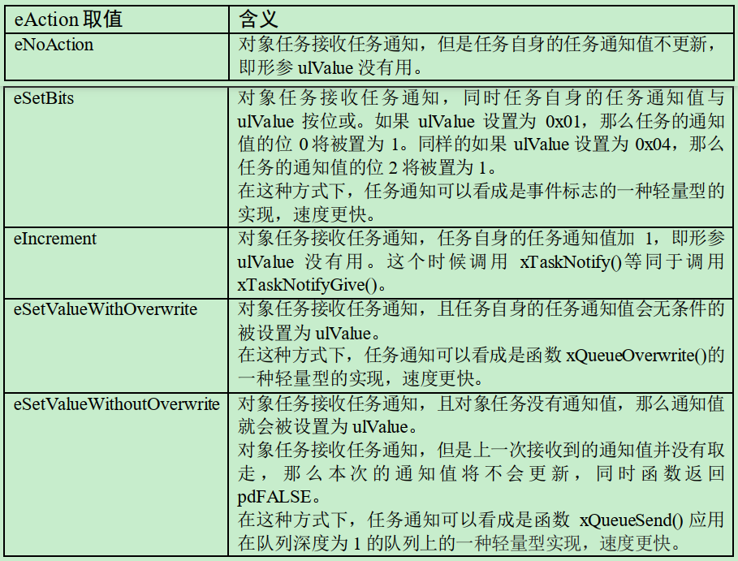

```c
/* 使用示例 */
/* 将任务 xTask1Handle 的任务通知值的位 8 设置为 1*/
xTaskNotify( xTask1Handle, ( 1UL << 8UL ), eSetBits );

/* 向任务 xTask2Handle 发送一个任务通知，有可能会解除该任务的阻塞状态，
但是并不会更新该任务自身的任务通知值 */
xTaskNotify( xTask2Handle, 0, eNoAction );

/* 向任务 xTask3Handle 发送一个任务通知并把该任务自身的任务通知值更新为 0x50，
尽管没有读取该任务的上一次的任务通知，也就是覆盖并写入任务通知 */
xTaskNotify( xTask3Handle, 0x50, eSetValueWithOverwrite );

/* 向任务 xTask4Handle 发送一个任务通知，并把该任务自身的任务通知值更新为 0xfff
但是并不会覆盖该任务之前接收到的任务通知值 */
if(xTaskNotify(xTask4Handle, 0xfff, eSetValueWithoutOverwrite)==pdPASS )
{
	/* 任务 xTask4Handle 的任务通知值已经更新 */
} else
{
	/* 任务 xTask4Handle 的任务通知值没有更新，即上一次的通知值还没有被取走*/
}
```

#### d.xTaskNotifyFromISR()  

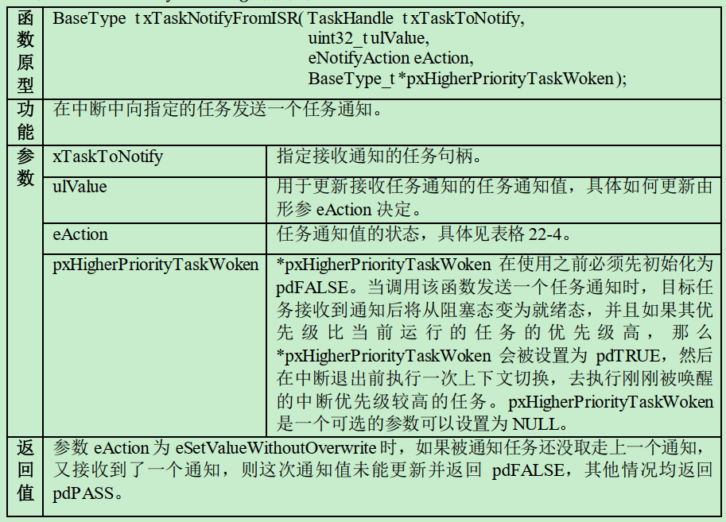

#### e.xTaskNotifyAndQuery()  

xTaskNotifyAndQuery()与 xTaskNotify()很像，都是调用通用的任务通知发送函数xTaskGenericNotify()来实现通知的发送，不同的是多了一个附加的参数pulPreviousNotifyValue，该参数用于回传接收任务的上一个通知值。

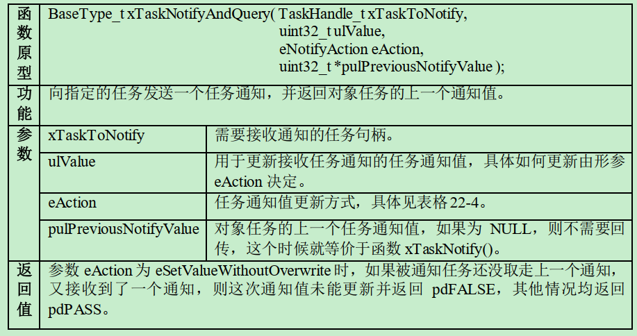

```c
/* 使用示例 */
uint32_t ulPreviousValue;
/* 设置对象任务 xTask1Handle 的任务通知值的位 8 为 1，
在更新位 8 的值之前把任务通知值回传存储在变量 ulPreviousValue 中*/
xTaskNotifyAndQuery( xTask1Handle, ( 1UL << 8UL ), eSetBits,&ulPreviousValue );


/* 向对象任务 xTask2Handle 发送一个任务通知，有可能解除对象任务的阻塞状态
但是不更新对象任务的通知值，并将对象任务的通知值存储在变量 ulPreviousValue 中 */
xTaskNotifyAndQuery( xTask2Handle, 0, eNoAction, &ulPreviousValue );
/* 覆盖式设置对象任务的任务通知值为 0x50
且对象任务的任务通知值不用回传，则最后一个形参设置为 NULL */
xTaskNotifyAndQuery( xTask3Handle, 0x50, eSetValueWithOverwrite, NULL );

/* 设置对象任务的任务通知值为 0xfff，但是并不会覆盖对象任务通过
xTaskNotifyWait()和 ulTaskNotifyTake()这两个函数获取到的已经存在
的任务通知值。对象任务的前一个任务通知值存储在变量 ulPreviousValue 中*/
if ( xTaskNotifyAndQuery( xTask4Handle,0xfff,eSetValueWithoutOverwrite,
	&ulPreviousValue ) == pdPASS )
{
	/* 任务通知值已经更新 */
} else
{
	/* 任务通知值没有更新 */
}
```


#### f.xTaskNotifyAndQueryFromISR()  


```c
/* 使用示例 */
void vAnISR( void )
{
	/* xHigherPriorityTaskWoken 在使用之前必须设置为 pdFALSE */
	BaseType_t xHigherPriorityTaskWoken = pdFALSE.
	uint32_t ulPreviousValue;

	/* 设置目标任务 xTask1Handle 的任务通知值的位 8 为 1
	在任务通知值的位 8 被更新之前把上一次的值存储在变量 ulPreviousValue 中*/
	xTaskNotifyAndQueryFromISR( xTask1Handle, ( 1UL << 8UL ),eSetBits,
		&ulPreviousValue,
		&xHigherPriorityTaskWoken );
	/* 如果任务 xTask1Handle 阻塞在任务通知上，那么现在已经被解锁进入就绪态
	如果其优先级比当前正在运行的任务的优先级高，则 xHigherPriorityTaskWoken
	会被设置为 pdRTUE，然后在中断退出前执行一次上下文切换，在中断退出后则去
	执行这个被唤醒的高优先级的任务 */
	portYIELD_FROM_ISR( xHigherPriorityTaskWoken );
}
```


### ②获取任务通知

>获取任务通知函数只能用在任务中，没有带中断保护版本，因此只有两个API函 数： ulTaskNotifyTake() 和
>xTaskNotifyWait ()。前者是为代替二值信号量和计数信号量而专门设计的，它和发送通知API 函数 xTaskNotifyGive()、 vTaskNotifyGiveFromISR()配合使用；后者是全功能版的等待通知，可以根据不同的参数实现轻量级二值信号量、计数信号量、事件组和长度为 1 的队列。
>所有的获取任务通知 API 函数都带有指定阻塞超时时间参数，当任务因为等待通知而进入阻塞时，用来指定任务的阻塞时间，这些超时机制与 FreeRTOS 的消息队列、信号量、事件等的超时机制一致。  

1、ulTaskNotifyTake()：


当一个任务使用其自身的任务通知值作为二值信号量或者计数信号量时， 其他任务应该使用函数`xTaskNotifyGive()`或者`xTaskNotify(( xTaskToNotify), ( 0 ), eIncrement )`来向其发送信号量。 如果是在中断中，则应该使用他们的中断版本函数。

```c
/* 使用示例 */
/* 中断 */
void vANInterruptHandler( void )
{
	BaseType_t xHigherPriorityTaskWoken;
	/* 清除中断 */
	prvClearInterruptSource();
	/* xHigherPriorityTaskWoken 在使用之前必须设置为 pdFALSE
	如果调用 vTaskNotifyGiveFromISR()会解除 vHandlingTask 任务的阻塞状态，
	并且 vHandlingTask 任务的优先级高于当前处于运行状态的任务，
	则 xHigherPriorityTaskWoken 将会自动被设置为 pdTRUE */
	xHigherPriorityTaskWoken = pdFALSE;

	/* 发送任务通知，并解锁阻塞在该任务通知下的任务 */
	vTaskNotifyGiveFromISR( xHandlingTask, &xHigherPriorityTaskWoken );

	/* 如果被解锁的任务优先级比当前运行的任务的优先级高
	则在中断退出前执行一次上下文切换，在中断退出后去执行
	刚刚被唤醒的优先级更高的任务*/
	portYIELD_FROM_ISR( xHigherPriorityTaskWoken );
}

/* 任务：阻塞在一个任务通知上 */
void vHandlingTask( void *pvParameters )
{
	BaseType_t xEvent;
	for ( ;; ) {
		/* 一直阻塞（没有时间限制，所以没有必要检测函数的返回值）
		这里 RTOS 的任务通知值被用作二值信号量，所以在函数退出
		时，任务通知值要被清 0 。要注意的是真正的应用程序不应该
		无限期的阻塞*/
		ulTaskNotifyTake(pdTRUE, portMAX_DELAY);
		/* RTOS 任务通知被当作二值信号量使用当处理完所有的事情后继续等待下一个任务通知*/
		do {
			xEvent = xQueryPeripheral();
			if ( xEvent != NO_MORE_EVENTS ) {
				vProcessPeripheralEvent( xEvent );
			}
		} while ( xEvent != NO_MORE_EVENTS );
	}
}
```


2、xTaskNotifyWait()：


```c
/* 使用示例 */
void vAnEventProcessingTask(void* pvParameters)
{
	uint32_t ulNotifiedValue;
    for (;;){
        /* 等待通知 */
        xTaskNotifyWait(0x00, /* 在进入的时候不清除通知值的任何位 */
		ULONG_MAX, /* 在退出的时候复位通知值为 0 */
		&ulNotifiedValue, /* 任务通知值传递到变量ulNotifiedValue 中*/
		portMAX_DELAY ); /* 一直等待 */
        /* 根据任务通知值里面的各个位的值处理事情 */
		if ( ( ulNotifiedValue & 0x01 ) != 0 ) {
			/* 位 0 被置 1 */
			prvProcessBit0Event();
		}
        if ( ( ulNotifiedValue & 0x02 ) != 0 ) {
			/* 位 1 被置 1 */
			prvProcessBit0Event();
		}
        if ( ( ulNotifiedValue & 0x04 ) != 0 ) {
			/* 位 2 被置 1 */
			prvProcessBit0Event();
		}
    }
}
```

## 4.使用示例1-替代消息队列

示例：通过PA0的按键0来控制任务通知的发送，将任务通知发送到接收任务1；通过PA2的按键1来控制任务通知的发送，将任务通知发送到接收任务2；接收任务1、接收任务2等待任务通知的来临，接收到任务通知就往串口发送一组数据表示接收到通知了。

结果：

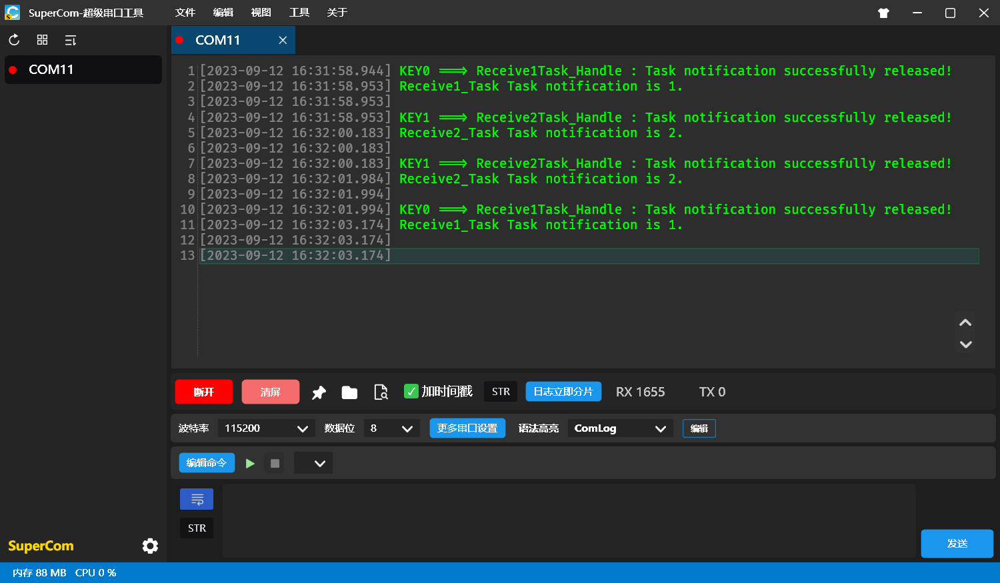

代码：

0、在`FreeRTOSConfig.h`配置文件中添加以下：

```c
#define configSUPPORT_DYNAMIC_ALLOCATION 1
```

1、`STM32F103C8_BSP.c`：

```c
#include "stm32f10x.h"                  // Device header

void USART1_Init(void)
{
    RCC_APB2PeriphClockCmd(RCC_APB2Periph_USART1, ENABLE);
    RCC_APB2PeriphClockCmd(RCC_APB2Periph_GPIOA,ENABLE);
    
    GPIO_InitTypeDef GPIO_InitStruct;
    GPIO_InitStruct.GPIO_Mode = GPIO_Mode_AF_PP;
    GPIO_InitStruct.GPIO_Pin = GPIO_Pin_9;
    GPIO_InitStruct.GPIO_Speed = GPIO_Speed_50MHz;
    GPIO_Init(GPIOA, &GPIO_InitStruct);
    GPIO_InitStruct.GPIO_Mode = GPIO_Mode_IPU;
    GPIO_InitStruct.GPIO_Pin = GPIO_Pin_10;
    GPIO_Init(GPIOA, &GPIO_InitStruct);
    
    USART_InitTypeDef USART_InitStruct;
    USART_InitStruct.USART_BaudRate = 115200;
    USART_InitStruct.USART_HardwareFlowControl = USART_HardwareFlowControl_None;
    USART_InitStruct.USART_Mode = USART_Mode_Rx | USART_Mode_Tx;
    USART_InitStruct.USART_Parity = USART_Parity_No;
    USART_InitStruct.USART_StopBits = USART_StopBits_1;
    USART_InitStruct.USART_WordLength = USART_WordLength_8b;
    USART_Init(USART1, &USART_InitStruct);
    
    USART_Cmd(USART1, ENABLE);
    
}
void KEY_GPIO_Init(void)
{
    RCC_APB2PeriphClockCmd(RCC_APB2Periph_GPIOA,ENABLE);
    
    GPIO_InitTypeDef GPIO_InitStruct;
    GPIO_InitStruct.GPIO_Mode = GPIO_Mode_IPD;
    GPIO_InitStruct.GPIO_Pin = GPIO_Pin_0 | GPIO_Pin_2;
    GPIO_InitStruct.GPIO_Speed = GPIO_Speed_50MHz;
    GPIO_Init(GPIOA, &GPIO_InitStruct);
}

void USART1_SendByte(uint8_t byte){
    USART_SendData(USART1, byte);
    while(USART_GetFlagStatus(USART1, USART_FLAG_TXE) == RESET);
}
uint32_t Serial_Pow(uint32_t X, uint8_t Y){
	uint32_t Result = 1;
	while(Y--)	
		Result *= X;
	return Result;
}
/* 取出数字各位的数并转为char形式数据来发送 */
void USART1_SendStringNumber(uint32_t Number, uint8_t Length)
{
	uint16_t i;
	for(i = 0; i < Length; i++) {
		/* Number=321 Length=3，则会将3、2、1的ASCII码依次发送出去 */
		USART1_SendByte(Number / Serial_Pow(10,Length - i - 1) % 10 + '0');
	}
}
void USART1_SendString(char* str)
{
    uint16_t i;
    for(i = 0; str[i] != '\0'; i++){
        USART1_SendByte(*(str+i));
    }
}

uint8_t KEY_Scan(GPIO_TypeDef* GPIOx, uint16_t GPIO_Pin)
{
    if(GPIO_ReadInputDataBit(GPIOx, GPIO_Pin) == 1){
        while(GPIO_ReadInputDataBit(GPIOx, GPIO_Pin) == 1);
        return 1;
    }
    return 0;
}
```


2、`main.c`：

```c
#include "stm32f10x.h"                  // Device header
#include "FreeRTOS.h"
#include "task.h"
#include "STM32F103C8_BSP.h"

/* 定义任务句柄，任务通知需要使用到句柄 */
TaskHandle_t Receive1Task_Handle = NULL;
TaskHandle_t Receive2Task_Handle = NULL;
TaskHandle_t SendTask_Handle = NULL;
/* 声明任务 */
void Receive1Task(void);
void Receive2Task(void);
void SendTask(void);

static void STM32F103_Init(void)
{
	NVIC_PriorityGroupConfig(NVIC_PriorityGroup_2);
    USART1_Init();
    KEY_GPIO_Init();
}
int main(void)
{
    STM32F103_Init();
    taskENTER_CRITICAL();
    
    xTaskCreate((TaskFunction_t)Receive1Task, "Receive1Task", 512, NULL, 2,
    (TaskHandle_t *)&Receive1Task_Handle);
    
    xTaskCreate((TaskFunction_t)Receive2Task, "Receive2Task", 512, NULL, 3,
    (TaskHandle_t *)&Receive2Task_Handle);
    
    xTaskCreate((TaskFunction_t)SendTask, "SendTask", 512, NULL, 4,
    (TaskHandle_t *)&SendTask_Handle);
    
    vTaskStartScheduler();
    taskEXIT_CRITICAL();
    while(1);
}

void Receive1Task(void)
{
    BaseType_t xReturn = pdTRUE;
    uint32_t r_num;
    while(1){
        /* 等待任务通知，一直等待 */
        xReturn=xTaskNotifyWait(0x0, 0xFFFFFFFF, &r_num, portMAX_DELAY);
        if(pdTRUE == xReturn){
            USART1_SendString("Receive1_Task Task notification is ");
            USART1_SendStringNumber(r_num, 1);
            USART1_SendString(".\n\n");
        }
    }
}
void Receive2Task(void)
{
    BaseType_t xReturn = pdTRUE;
    uint32_t r_num;
    while(1){
        /* 等待任务通知，一直等待 */
        xReturn=xTaskNotifyWait(0x0, 0xFFFFFFFF, &r_num, portMAX_DELAY);
        if(pdTRUE == xReturn){
            USART1_SendString("Receive2_Task Task notification is ");
            USART1_SendStringNumber(r_num, 1);
            USART1_SendString(".\n\n");
        }
    }
}
void SendTask(void)
{
    BaseType_t xReturn = pdPASS;
    uint32_t send1 = 1;
    uint32_t send2 = 2;
    while(1){
        if(KEY_Scan(GPIOA, GPIO_Pin_0) == 1){
            /* 往接收任务1发送任务通知 */
            xReturn = xTaskNotify(Receive1Task_Handle, send1, eSetValueWithOverwrite);
            if(pdTRUE == xReturn){
                USART1_SendString("KEY0 ===> Receive1Task_Handle : Task notification successfully released!\n");
            }
        }
        /* 往接收任务2发送任务通知 */
        if(KEY_Scan(GPIOA, GPIO_Pin_2) == 1){
            xReturn = xTaskNotify(Receive2Task_Handle, send2, eSetValueWithOverwrite);
            if(pdTRUE == xReturn){
                USART1_SendString("KEY1 ===> Receive2Task_Handle : Task notification successfully released!\n");
            }
        }
        vTaskDelay(20);
    }
}
```


## 5.使用示例2-替代二值信号量

示例：通过PA0的按键0来控制任务通知的发送，将任务通知发送到接收任务1；通过PA2的按键1来控制任务通知的发送，将任务通知发送到接收任务2；接收任务1、接收任务2等待任务通知的来临，接收到任务通知就往串口发送一组数据表示接收到通知了。

结果：

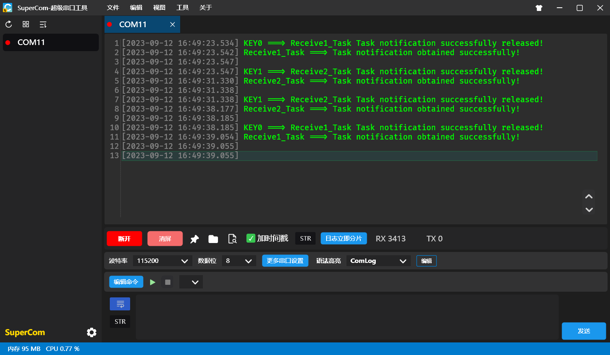

代码：

0、在`FreeRTOSConfig.h`的配置，和示例1一样。

1、`STM32F103C8_BSP.c`：和示例1一样

2、`main.c`：

```c
#include "stm32f10x.h"                  // Device header
#include "FreeRTOS.h"
#include "task.h"
#include "STM32F103C8_BSP.h"

/* 定义任务句柄，任务通知需要使用到句柄 */
TaskHandle_t Receive1Task_Handle = NULL;
TaskHandle_t Receive2Task_Handle = NULL;
TaskHandle_t SendTask_Handle = NULL;
/* 声明任务 */
void Receive1Task(void);
void Receive2Task(void);
void SendTask(void);

static void STM32F103_Init(void)
{
	NVIC_PriorityGroupConfig(NVIC_PriorityGroup_2);
    USART1_Init();
    KEY_GPIO_Init();
    LED_GPIO_Init();
}
int main(void)
{
    STM32F103_Init();
    taskENTER_CRITICAL();
    
    xTaskCreate((TaskFunction_t)Receive1Task, "Receive1Task", 512, NULL, 2,
    (TaskHandle_t*)&Receive1Task_Handle);
    
    xTaskCreate((TaskFunction_t)Receive2Task, "Receive2Task", 512, NULL, 3,
    (TaskHandle_t*)&Receive2Task_Handle);
    
    xTaskCreate((TaskFunction_t)SendTask, "SendTask", 512, NULL, 4,
    (TaskHandle_t*)&SendTask_Handle);
    
    vTaskStartScheduler();
    taskEXIT_CRITICAL();
    while(1);
}

void Receive1Task(void)
{
    while(1){
        /* 获取任务通知，一直等待 */
        ulTaskNotifyTake(pdTRUE, portMAX_DELAY);
        USART1_SendString("Receive1_Task ===> Task notification obtained successfully!\n\n");
    }
}
void Receive2Task(void)
{
    while(1){
        /* 获取任务通知，一直等待 */
        ulTaskNotifyTake(pdTRUE, portMAX_DELAY);
        USART1_SendString("Receive2_Task ===> Task notification obtained successfully!\n\n");
    }
}
void SendTask(void)
{
    BaseType_t xReturn = pdPASS;
    while(1){
        if(KEY_Scan(GPIOA, GPIO_Pin_0) == 1){
            xReturn = xTaskNotifyGive(Receive1Task_Handle);
            /* 此函数只会返回 pdPASS */
            if (xReturn == pdTRUE){
                USART1_SendString("KEY0 ===> Receive1_Task Task notification successfully released!\n");
            }
        }
        if(KEY_Scan(GPIOA, GPIO_Pin_2) == 1){
            xReturn = xTaskNotifyGive(Receive2Task_Handle);
            /* 此函数只会返回 pdPASS */
            if (xReturn == pdTRUE){
                USART1_SendString("KEY1 ===> Receive2_Task Task notification successfully released!\n");
            }
        }
        vTaskDelay(20);
    }
}
```


## 6.使用示例3-替代计数信号量

示例：

- 通过PA2的按键1来控制任务通知的发送，发送通知到TakeTask任务。
- 通过PA0的按键0来控制任务通知的接收，接收从GiveTask任务发送过来的通知。

结果：


代码：

0、在`FreeRTOSConfig.h`的配置，和示例1一样。

1、`STM32F103C8_BSP.c`：和示例1一样

2、`main.c`：

```c
#include "stm32f10x.h"                  // Device header
#include "FreeRTOS.h"
#include "task.h"
#include "STM32F103C8_BSP.h"

/* 定义任务句柄，任务通知需要使用到句柄 */
TaskHandle_t TakeTask_Handle = NULL;
TaskHandle_t GiveTask_Handle = NULL;

/* 声明任务 */
void TakeTask(void);
void GiveTask(void);
static uint32_t give_num = 0; /* 用于记录发送的任务通知次数 */

static void STM32F103_Init(void)
{
	NVIC_PriorityGroupConfig(NVIC_PriorityGroup_2);
    USART1_Init();
    KEY_GPIO_Init();
    LED_GPIO_Init();
}
int main(void)
{
    STM32F103_Init();
    taskENTER_CRITICAL();
    
    xTaskCreate((TaskFunction_t)TakeTask, "TakeTask", 512, NULL, 2,
    (TaskHandle_t*)&TakeTask_Handle);
    
    xTaskCreate((TaskFunction_t)GiveTask, "GiveTask", 512, NULL, 3,
    (TaskHandle_t*)&GiveTask_Handle);
    
    
    vTaskStartScheduler();
    taskEXIT_CRITICAL();
    while(1);
}
void TakeTask(void)
{
    uint32_t take_num = 1;
    while(1){
        if(KEY_Scan(GPIOA, GPIO_Pin_0) == 1) {
            /* 获取任务通知，并且获取不到不进入阻塞态 */
            take_num = ulTaskNotifyTake(pdFALSE, 0);
            if(take_num > 0){
                give_num--;
                USART1_SendString("KEY0 pressed,The number obtained is: ");
                USART1_SendStringNumber(take_num - 1, 1);
                USART1_SendString("\n");
            }else {
                USART1_SendString("======KEY0 pressed,But no numbers======\n\n");
            }
            vTaskDelay(20);
        }
    }
}
void GiveTask(void)
{
    BaseType_t xReturn = pdPASS;
    while(1){
        if(KEY_Scan(GPIOA, GPIO_Pin_2) == 1) {
            /* 往任务1发送通知 */
            xReturn = xTaskNotifyGive(TakeTask_Handle);
            if (pdPASS == xReturn){
                give_num++;
                USART1_SendString("KEY1 pressed,Release a number!Now there are ");
                USART1_SendStringNumber(give_num, 1);
                USART1_SendString(" numbers\n");
            }
        }
        vTaskDelay(20);
    }
}
```


## 7.使用示例4-替代事件组

示例：PA0接按键0，PA2接按键2，按键0、按键1都按下了为一个事件组，都按下时LED亮。按键按下时设置LED等为熄灭状态；通过串口发送提示信息。

结果：单独将按键0按下，LED灭，再单独按下按键1，此时两个按键都按下了一次，事件组发生，LED亮。

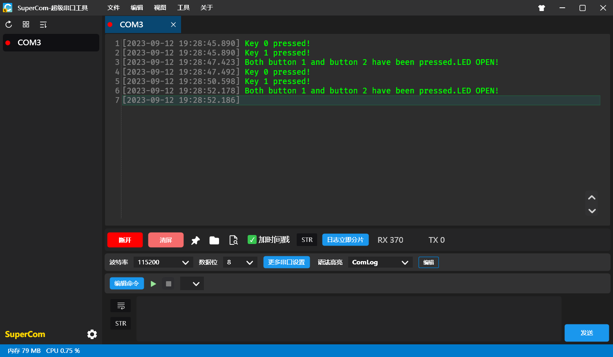

代码：

0、在`FreeRTOSConfig.h`的配置，和示例1一样。

1、`STM32F103C8_BSP.c`：

```c
#include "stm32f10x.h"                  // Device header

void USART1_Init(void)
{
    RCC_APB2PeriphClockCmd(RCC_APB2Periph_USART1, ENABLE);
    RCC_APB2PeriphClockCmd(RCC_APB2Periph_GPIOA,ENABLE);
    
    GPIO_InitTypeDef GPIO_InitStruct;
    GPIO_InitStruct.GPIO_Mode = GPIO_Mode_AF_PP;
    GPIO_InitStruct.GPIO_Pin = GPIO_Pin_9;
    GPIO_InitStruct.GPIO_Speed = GPIO_Speed_50MHz;
    GPIO_Init(GPIOA, &GPIO_InitStruct);
    GPIO_InitStruct.GPIO_Mode = GPIO_Mode_IPU;
    GPIO_InitStruct.GPIO_Pin = GPIO_Pin_10;
    GPIO_Init(GPIOA, &GPIO_InitStruct);
    
    USART_InitTypeDef USART_InitStruct;
    USART_InitStruct.USART_BaudRate = 115200;
    USART_InitStruct.USART_HardwareFlowControl = USART_HardwareFlowControl_None;
    USART_InitStruct.USART_Mode = USART_Mode_Rx | USART_Mode_Tx;
    USART_InitStruct.USART_Parity = USART_Parity_No;
    USART_InitStruct.USART_StopBits = USART_StopBits_1;
    USART_InitStruct.USART_WordLength = USART_WordLength_8b;
    USART_Init(USART1, &USART_InitStruct);
    
    USART_Cmd(USART1, ENABLE);
    
}
void KEY_GPIO_Init(void)
{
    RCC_APB2PeriphClockCmd(RCC_APB2Periph_GPIOA,ENABLE);
    
    GPIO_InitTypeDef GPIO_InitStruct;
    GPIO_InitStruct.GPIO_Mode = GPIO_Mode_IPD;
    GPIO_InitStruct.GPIO_Pin = GPIO_Pin_0 | GPIO_Pin_2;
    GPIO_InitStruct.GPIO_Speed = GPIO_Speed_50MHz;
    GPIO_Init(GPIOA, &GPIO_InitStruct);
}
void LED_GPIO_Init(void)
{
    RCC_APB2PeriphClockCmd(RCC_APB2Periph_GPIOC,ENABLE);
    
    GPIO_InitTypeDef GPIO_InitStruct;
    GPIO_InitStruct.GPIO_Mode = GPIO_Mode_Out_PP;
    GPIO_InitStruct.GPIO_Pin = GPIO_Pin_13;
    GPIO_InitStruct.GPIO_Speed = GPIO_Speed_50MHz;
    GPIO_Init(GPIOC, &GPIO_InitStruct);
    GPIO_SetBits(GPIOC, GPIO_Pin_13);
}

void USART1_SendByte(uint8_t byte){
    USART_SendData(USART1, byte);
    while(USART_GetFlagStatus(USART1, USART_FLAG_TXE) == RESET);
}
uint32_t Serial_Pow(uint32_t X, uint8_t Y){
	uint32_t Result = 1;
	while(Y--)	
		Result *= X;
	return Result;
}
// 取出数字各位的数并转为char形式数据来发送
void USART1_SendStringNumber(uint32_t Number, uint8_t Length)
{
	uint16_t i;
	for(i = 0; i < Length; i++) {
		// Number=321 Length=3，则会将3、2、1的ASCII码依次发送出去
		USART1_SendByte(Number / Serial_Pow(10,Length - i - 1) % 10 + '0');
	}
}
void USART1_SendString(char* str)
{
    uint16_t i;
    for(i = 0; str[i] != '\0'; i++){
        USART1_SendByte(*(str+i));
    }
}

uint8_t KEY_Scan(GPIO_TypeDef* GPIOx, uint16_t GPIO_Pin)
{
    if(GPIO_ReadInputDataBit(GPIOx, GPIO_Pin) == 1){
        while(GPIO_ReadInputDataBit(GPIOx, GPIO_Pin) == 1);
        return 1;
    }
    return 0;
}
```

2、`main.c`：

```c
#include "stm32f10x.h"                  // Device header
#include "FreeRTOS.h"
#include "task.h"
#include "STM32F103C8_BSP.h"
#include "event_groups.h"

/* 定义事件组句柄 */
EventGroupHandle_t Event_Handle = NULL;
/* 定义事件掩码 */
#define KEY0_EVENT (0x01 << 0) /* 位0 */
#define KEY1_EVENT (0x01 << 1) /* 位1 */
/* 定义任务句柄 */
TaskHandle_t LEDTask_Handle = NULL;
TaskHandle_t KEYTask_Handle = NULL;

/* 声明任务 */
void LEDTask(void);
void KEYTask(void);

static void STM32F103_Init(void)
{
	NVIC_PriorityGroupConfig(NVIC_PriorityGroup_2);
    USART1_Init();
    KEY_GPIO_Init();
    LED_GPIO_Init();
}
int main(void)
{
    STM32F103_Init();
    taskENTER_CRITICAL();
    /* 创建事件组 */
    Event_Handle = xEventGroupCreate();
    
    xTaskCreate((TaskFunction_t)LEDTask, "LEDTask", 512, NULL, 2,
    (TaskHandle_t*)&LEDTask_Handle);
    
    xTaskCreate((TaskFunction_t)KEYTask, "KEYTask", 512, NULL, 3,
    (TaskHandle_t*)&KEYTask_Handle);
    
    
    vTaskStartScheduler();
    taskEXIT_CRITICAL();
    while(1);
}

void LEDTask(void)
{
    uint32_t r_event = 0;   /* 用于接收事件 */
    uint32_t last_event = 0;/* 用于保存事件 */
    BaseType_t xReturn = pdTRUE;
    while(1){
        /* 等待通知 */
        xReturn = xTaskNotifyWait(0x0,0xFFFFFFFF, &r_event, portMAX_DELAY);
        /* 实现事件组，通过两个变量保存通知，此时的通知可以看作是事件状态标志 */
        if (pdTRUE == xReturn) {
            last_event |= r_event;
            /* 如果接收完成并且正确 */
            if (last_event == (KEY0_EVENT | KEY1_EVENT)) {
                last_event = 0; /* 将上一次的事件清零 */
                USART1_SendString("Both button 1 and button 2 have been pressed.LED OPEN!\n");
                GPIO_ResetBits(GPIOC, GPIO_Pin_13);
            } else 
                last_event = r_event; 
        }
    }
}
void KEYTask(void)
{
    while(1){
        if(KEY_Scan(GPIOA, GPIO_Pin_0) == 1){
            USART1_SendString("Key 0 pressed!\n");
            /* 往任务LEDTask发送任务通知：事件KEY0_EVENT */
            xTaskNotify(LEDTask_Handle, KEY0_EVENT, eSetBits);
            GPIO_SetBits(GPIOC, GPIO_Pin_13);
        }
        if(KEY_Scan(GPIOA, GPIO_Pin_2) == 1){
            USART1_SendString("Key 1 pressed!\n");
            /* 往任务LEDTask发送任务通知，事件KEY1_EVENT */
            xTaskNotify(LEDTask_Handle, KEY1_EVENT, eSetBits);
            GPIO_SetBits(GPIOC, GPIO_Pin_13);            
        }
        vTaskDelay(20);
    }
}
```

END

# FreeRTOS学习篇十：练习


